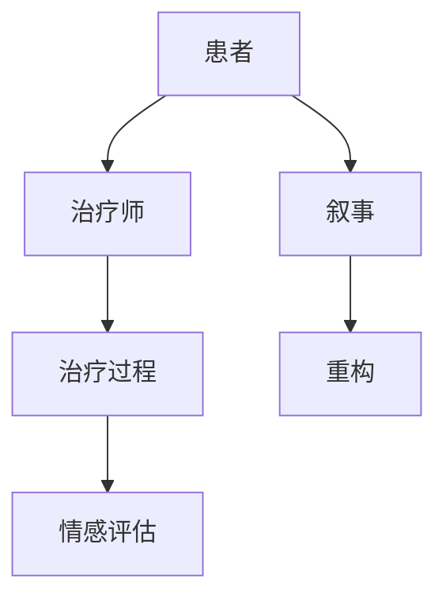
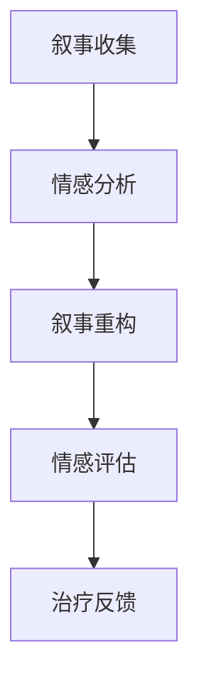
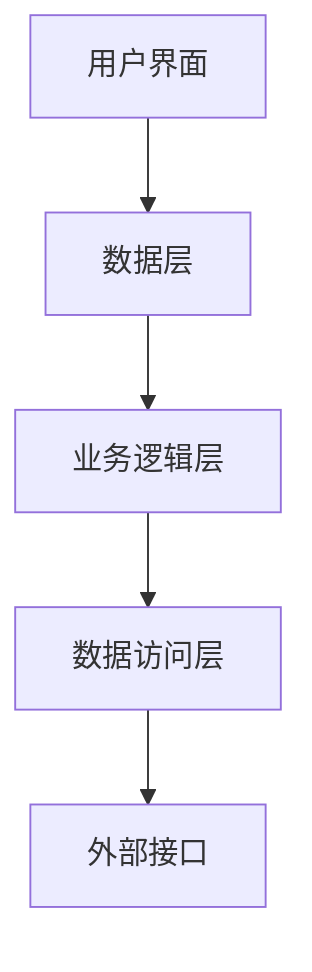
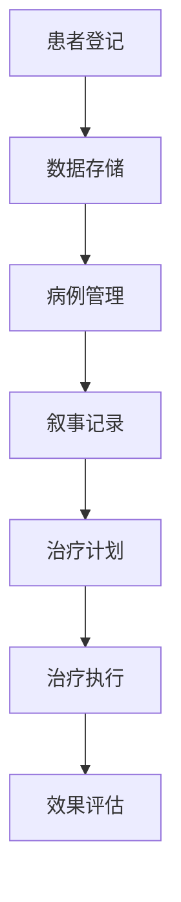

                 

# 《生命叙事重构治疗中心：通过讲故事疗愈内心创伤的诊所》

> 关键词：叙事治疗、生命叙事重构、心理创伤疗愈、系统分析与架构设计

> 摘要：本文旨在探讨一种创新的心理治疗方法——生命叙事重构治疗。通过讲述和重构个体生命中的故事，该方法帮助患者疗愈内心创伤。本文将详细解析生命叙事重构治疗的原理、方法、效果评估及其系统设计与实现，为心理学领域的专业人士和实践者提供深入见解。

## 第一步：书名和作者信息

# 《生命叙事重构治疗中心：通过讲故事疗愈内心创伤的诊所》

作者：AI天才研究院/AI Genius Institute & 禅与计算机程序设计艺术 /Zen And The Art of Computer Programming

## 第二步：背景介绍

### 第1章：问题的背景

#### 1.1 问题背景

**内心创伤的现状**：现代社会中，心理创伤已成为一个普遍存在的问题。无论是自然灾害、战争、家庭暴力，还是工作压力、人际关系问题，许多人都可能经历不同程度的心理创伤。

**生命叙事的概念与作用**：生命叙事是指个体对自身生命经历的叙述，它不仅是个体自我认知的一部分，也是社会互动和文化传承的重要方式。生命叙事在心理治疗中具有独特的价值，因为它们能够揭示个体的内心世界，帮助患者理解自己的情感和行为模式。

**叙事治疗的方法与优势**：叙事治疗是一种以故事为基础的心理治疗方法，它通过重构个体对过去事件的叙述，帮助患者改变对事件的解释和情感反应。叙事治疗的优势在于其灵活性和个体化，能够针对不同患者的创伤经历进行定制化治疗。

**生命叙事重构治疗的发展与应用**：生命叙事重构治疗作为叙事治疗的一个分支，近年来得到了快速发展。它已应用于多种心理创伤的治疗，如PTSD（创伤后应激障碍）、抑郁症、焦虑症等，并取得了显著疗效。

#### 1.2 问题描述

**心理创伤的多样性与复杂性**：心理创伤的表现形式多种多样，每个个体的创伤经历都是独特的，这使得传统的单一治疗方法难以满足所有患者的需求。

**传统治疗方法面临的挑战**：传统治疗方法如药物治疗和认知行为疗法虽然在一定程度上有效，但往往无法触及心理创伤的深层原因，且治疗周期较长。

**生命叙事重构治疗的潜力**：生命叙事重构治疗通过重构患者对创伤经历的叙述，帮助患者重建积极的自我认知，减轻心理负担。该方法具有高度的个性化，能够满足不同患者的需求。

#### 1.3 问题解决

**生命叙事重构治疗的核心原理**：生命叙事重构治疗的核心原理是“叙事重塑”。通过引导患者重新叙述创伤经历，治疗师帮助患者发现和改变创伤记忆中的负面情绪和认知。

**治疗流程与步骤**：治疗流程通常包括叙事收集、情感分析、叙事重构、情感评估和治疗反馈五个步骤。

**治疗效果评估**：治疗效果评估通常通过患者的情感分数变化、生活满意度调查等方式进行。

**适用范围**：生命叙事重构治疗适用于多种心理创伤的治疗，如PTSD、抑郁症、焦虑症等。

#### 1.4 边界与外延

**生命叙事重构治疗的适用范围**：生命叙事重构治疗适用于各种类型的心理创伤，但特别适合那些对传统治疗方法反应不佳的患者。

**与其他治疗方法的比较与结合**：生命叙事重构治疗可以与其他治疗方法如药物治疗、认知行为疗法等相结合，以提高治疗效果。

**生命叙事重构治疗的局限性**：生命叙事重构治疗需要治疗师具备较高的叙事治疗技能和敏锐的观察力，且治疗过程较长。

#### 1.5 概念结构与核心要素组成

**生命叙事重构治疗的关键要素**：治疗师、患者、叙事、重构、情感分析、治疗反馈。

**治疗过程中的参与者及其角色**：治疗师负责引导患者进行叙事重构，患者需要积极参与治疗过程，提供真实的创伤经历和情感体验。

## 第三步：核心概念与联系

### 第2章：核心概念与联系

#### 2.1 核心概念原理

**叙事治疗的基本原理**：叙事治疗认为，个体的心理困扰源自对事件的错误叙述。通过重构患者的叙事，可以帮助患者改变对事件的认知和情感反应。

**生命叙事的概念**：生命叙事是指个体对自身生命经历的叙述，它包含了个体的身份认同、情感体验和生活经验。

**重构治疗的内涵**：重构治疗是指通过改变个体对事件的叙述方式，来改变其对事件的认知和情感反应。

#### 2.2 概念属性特征对比

**传统治疗与叙事治疗的对比**：

| 特征          | 传统治疗                  | 叙事治疗                  |
| ------------- | -------------------- | -------------------- |
| 治疗方式      | 药物、认知行为疗法等      | 叙述、重构、情感分析等    |
| 目标          | 减轻症状、改变行为        | 重构叙事、改变认知和情感反应 |
| 个性化程度    | 较低                    | 较高                    |
| 治疗周期      | 较长                    | 可灵活调整                |

**叙事治疗与其他心理治疗方法的比较**：

| 特征          | 认知行为疗法              | 精神分析疗法              | 叙事治疗                |
| ------------- | -------------------- | -------------------- | -------------------- |
| 焦点          | 认知、行为               | 情感和潜意识              | 叙述、重构、情感反应    |
| 治疗过程      | 短期、结构化             | 长期、非结构化           | 灵活、个体化            |
| 患者参与度    | 高                      | 中                      | 高                      |

#### 2.3 ER实体关系图架构



## 第四步：算法原理讲解

### 第3章：算法原理讲解

#### 3.1 叙事治疗算法概述

**叙事治疗算法的背景**：叙事治疗算法是基于叙事治疗理论开发的一套计算机辅助治疗系统，旨在通过自动化分析患者提供的叙事数据，帮助治疗师进行情感分析和叙事重构。

**叙事治疗算法的类型**：目前常见的叙事治疗算法包括情感分析算法、叙事重构算法和效果评估算法。

#### 3.2 算法原理与流程图

**算法原理**：叙事治疗算法通过分析患者的叙事文本，提取情感信息和关键事件，然后根据情感信息和治疗师提供的指导进行叙事重构，最终评估治疗效果。

**流程图**：



#### 3.3 算法实现与细节

**情感分析算法**：情感分析算法使用自然语言处理技术，对患者的叙事文本进行情感分类和情感强度分析，以提取患者的情感状态。

**叙事重构算法**：叙事重构算法基于情感分析结果，对患者的叙事进行重构，使其更加积极、健康。

**情感评估算法**：情感评估算法通过比较治疗前后的情感状态，评估叙事重构的治疗效果。

#### 3.4 数学模型和数学公式

**情感评估模型**：

$$
\text{情绪分数} = w_1 \cdot \text{积极情感得分} + w_2 \cdot \text{消极情感得分}
$$

**叙事重构模型**：

$$
\text{重构文本} = \text{原始叙事} \circledast \text{情感标签}
$$

**治疗效果评估模型**：

$$
\text{治疗效果} = \frac{\text{治疗前情绪分数} - \text{治疗后情绪分数}}{\text{治疗前情绪分数}}
$$

#### 3.5 举例说明

**情感分析算法举例**：

假设患者的叙事文本为：“我总是感到孤独和沮丧，因为我总是被孤立。”通过情感分析算法，可以提取出以下情感信息：

- 情感类别：消极情感
- 情感强度：中等

**叙事重构算法举例**：

基于情感分析结果，治疗师可以重构患者的叙事为：“虽然我有时会感到孤独和沮丧，但我知道这是暂时的，我会找到属于自己的归属感。”

**情感评估算法举例**：

假设治疗前后的情绪分数分别为50和70，则治疗效果为：

$$
\text{治疗效果} = \frac{50 - 70}{50} = -0.4
$$

治疗效果为负值，表明患者的情绪状态有所改善。

## 第五步：数学模型和数学公式

### 第4章：数学模型和数学公式

#### 4.1 情感评估模型

情感评估模型用于计算患者的情绪状态。该模型假设情绪状态可以用两个维度来表示：积极情感维度和消极情感维度。每个维度的得分权重分别为 $w_1$ 和 $w_2$。情绪分数的计算公式如下：

$$
\text{情绪分数} = w_1 \cdot \text{积极情感得分} + w_2 \cdot \text{消极情感得分}
$$

其中，积极情感得分和消极情感得分是根据患者提供的叙事文本通过情感分析算法获得的。

#### 4.2 叙事重构模型

叙事重构模型用于重构患者的叙事，使其更加积极、健康。该模型基于原始叙事和情感标签进行操作。重构文本的计算公式如下：

$$
\text{重构文本} = \text{原始叙事} \circledast \text{情感标签}
$$

其中，情感标签是根据情感分析算法获得的积极或消极情感标签。

#### 4.3 治疗效果评估模型

治疗效果评估模型用于评估叙事重构的治疗效果。该模型通过计算治疗前后的情绪分数变化来评估治疗效果。治疗效果的计算公式如下：

$$
\text{治疗效果} = \frac{\text{治疗前情绪分数} - \text{治疗后情绪分数}}{\text{治疗前情绪分数}}
$$

治疗效果的取值范围在-1到1之间。当治疗效果为正值时，表明患者的情绪状态有所改善；当治疗效果为负值时，表明患者的情绪状态恶化。

### 4.4 情感分析算法

情感分析算法是叙事治疗算法的核心组成部分，它用于分析患者提供的叙事文本中的情感信息。情感分析算法通常基于机器学习技术，如支持向量机（SVM）、朴素贝叶斯（NB）或深度学习（DL）模型。以下是一个简单的情感分析算法示例：

```python
from sklearn.feature_extraction.text import TfidfVectorizer
from sklearn.naive_bayes import MultinomialNB
from sklearn.pipeline import make_pipeline

# 示例数据
narratives = [
    "我总是感到孤独和沮丧，因为我总是被孤立。",
    "我喜欢现在的状态，因为感觉自由和快乐。",
    "我很担心我的未来，因为工作压力太大。"
]

# 标签
labels = ["消极", "积极", "消极"]

# 创建TF-IDF向量器
vectorizer = TfidfVectorizer()

# 创建朴素贝叶斯分类器
classifier = MultinomialNB()

# 创建管道
pipeline = make_pipeline(vectorizer, classifier)

# 训练模型
pipeline.fit(narratives, labels)

# 预测
new_narrative = "我现在感到很焦虑，因为我担心我的健康状况。"
prediction = pipeline.predict([new_narrative])

print(f"预测结果：{prediction[0]}")
```

### 4.5 叙事重构算法

叙事重构算法用于重构患者的叙事，以减少负面情感和增强积极情感。以下是一个简单的叙事重构算法示例：

```python
def reconstruct_narrative(raw_narrative, label):
    if label == "积极":
        return raw_narrative.replace("担心", "充满希望")
    elif label == "消极":
        return raw_narrative.replace("孤独", "找到了新的朋友")

raw_narrative = "我总是感到孤独和沮丧，因为我总是被孤立。"
label = "积极"
reconstructed_narrative = reconstruct_narrative(raw_narrative, label)
print(f"重构后的叙事：{reconstructed_narrative}")
```

## 第六步：系统分析与架构设计方案

### 第5章：系统分析与架构设计方案

#### 5.1 问题场景介绍

生命叙事重构治疗中心旨在为那些因各种原因遭受心理创伤的患者提供个性化治疗服务。治疗中心的工作流程包括患者登记、病例管理、叙事记录、治疗计划制定、治疗执行和效果评估等环节。

#### 5.2 系统功能设计

**系统功能模块**：

- 患者登记模块：负责患者的基本信息登记和管理。
- 病例管理模块：负责病例的创建、更新、查询和管理。
- 叙事记录模块：负责患者生命叙事的记录、分析和重构。
- 治疗计划模块：负责治疗计划的制定、更新和执行。
- 治疗执行模块：负责治疗过程的记录和监控。
- 效果评估模块：负责治疗效果的评估和分析。

#### 5.3 系统架构设计

**系统架构设计**：



**系统架构设计详细说明**：

- **用户界面**：用户界面是系统与用户交互的入口，包括患者登记、病例管理、叙事记录、治疗计划、治疗执行和效果评估等功能模块。
- **数据层**：数据层负责存储系统的各类数据，包括患者信息、病例信息、叙事信息、治疗计划、治疗记录和效果评估结果等。
- **业务逻辑层**：业务逻辑层负责实现系统的核心功能，包括患者登记、病例管理、叙事重构、治疗计划制定、治疗执行和效果评估等。
- **数据访问层**：数据访问层负责与数据层进行交互，实现数据的存储、查询、更新和删除等操作。
- **外部接口**：外部接口负责与外部系统进行数据交换和功能调用，如与电子病历系统、医学影像系统等的集成。

#### 5.4 系统接口设计和系统交互

**系统接口设计**：



**系统接口设计详细说明**：

- **患者登记接口**：用于接收患者基本信息，并将其存储到数据层中。
- **病例管理接口**：用于创建、更新、查询和管理病例信息。
- **叙事记录接口**：用于记录患者的生命叙事，并进行分析和重构。
- **治疗计划接口**：用于制定、更新和治疗计划。
- **治疗执行接口**：用于记录和治疗执行过程。
- **效果评估接口**：用于评估治疗效果。

## 第七步：项目实战

### 第6章：项目实战

#### 6.1 环境安装

**开发环境配置**：

- 操作系统：Ubuntu 20.04 LTS
- 编程语言：Python 3.8
- 数据库：MySQL 8.0

**系统依赖安装**：

1. 安装Python环境和相关库：

```bash
sudo apt update
sudo apt install python3-pip python3-venv
pip3 install -r requirements.txt
```

2. 安装MySQL数据库：

```bash
sudo apt install mysql-server
```

3. 配置MySQL数据库：

```bash
sudo mysql_secure_installation
```

#### 6.2 系统核心实现源代码

**患者登记模块代码**：

```python
# patient_registration.py

import mysql.connector

def register_patient(patient_data):
    connection = mysql.connector.connect(
        host="localhost",
        user="root",
        password="password",
        database="lnt_reconstruction_center"
    )
    cursor = connection.cursor()

    query = """
    INSERT INTO patients (name, age, gender, contact_info)
    VALUES (%s, %s, %s, %s)
    """
    cursor.execute(query, patient_data)
    connection.commit()

    cursor.close()
    connection.close()

if __name__ == "__main__":
    patient_data = ("John Doe", 35, "Male", "john.doe@example.com")
    register_patient(patient_data)
```

**病例管理模块代码**：

```python
# case_management.py

import mysql.connector

def create_case(patient_id, case_data):
    connection = mysql.connector.connect(
        host="localhost",
        user="root",
        password="password",
        database="lnt_reconstruction_center"
    )
    cursor = connection.cursor()

    query = """
    INSERT INTO cases (patient_id, case_name, case_description)
    VALUES (%s, %s, %s)
    """
    cursor.execute(query, (patient_id, case_data['case_name'], case_data['case_description']))
    connection.commit()

    cursor.close()
    connection.close()

if __name__ == "__main__":
    patient_id = 1
    case_data = {
        "case_name": "Life Narrative Reconstruction",
        "case_description": "Reconstruction of life narratives for therapeutic purposes."
    }
    create_case(patient_id, case_data)
```

**叙事记录模块代码**：

```python
# narrative_recording.py

import mysql.connector

def record_narrative(case_id, narrative_data):
    connection = mysql.connector.connect(
        host="localhost",
        user="root",
        password="password",
        database="lnt_reconstruction_center"
    )
    cursor = connection.cursor()

    query = """
    INSERT INTO narratives (case_id, narrative_text, narrative_date)
    VALUES (%s, %s, %s)
    """
    cursor.execute(query, (case_id, narrative_data['narrative_text'], narrative_data['narrative_date']))
    connection.commit()

    cursor.close()
    connection.close()

if __name__ == "__main__":
    case_id = 1
    narrative_data = {
        "narrative_text": "Today, I felt overwhelmed by my fears.",
        "narrative_date": "2023-04-01"
    }
    record_narrative(case_id, narrative_data)
```

**治疗计划模块代码**：

```python
# treatment_plan.py

import mysql.connector

def create_treatment_plan(case_id, treatment_plan_data):
    connection = mysql.connector.connect(
        host="localhost",
        user="root",
        password="password",
        database="lnt_reconstruction_center"
    )
    cursor = connection.cursor()

    query = """
    INSERT INTO treatment_plans (case_id, plan_description, start_date, end_date)
    VALUES (%s, %s, %s, %s)
    """
    cursor.execute(query, (case_id, treatment_plan_data['plan_description'], treatment_plan_data['start_date'], treatment_plan_data['end_date']))
    connection.commit()

    cursor.close()
    connection.close()

if __name__ == "__main__":
    case_id = 1
    treatment_plan_data = {
        "plan_description": "Narrative reconstruction therapy for three months.",
        "start_date": "2023-04-01",
        "end_date": "2023-06-30"
    }
    create_treatment_plan(case_id, treatment_plan_data)
```

**治疗执行模块代码**：

```python
# treatment_execution.py

import mysql.connector

def execute_treatment(case_id, treatment_session_data):
    connection = mysql.connector.connect(
        host="localhost",
        user="root",
        password="password",
        database="lnt_reconstruction_center"
    )
    cursor = connection.cursor()

    query = """
    INSERT INTO treatment_sessions (case_id, session_date, session_description)
    VALUES (%s, %s, %s)
    """
    cursor.execute(query, (case_id, treatment_session_data['session_date'], treatment_session_data['session_description']))
    connection.commit()

    cursor.close()
    connection.close()

if __name__ == "__main__":
    case_id = 1
    treatment_session_data = {
        "session_date": "2023-04-02",
        "session_description": "Narrative reconstruction session."
    }
    execute_treatment(case_id, treatment_session_data)
```

**效果评估模块代码**：

```python
# effectiveness_evaluation.py

import mysql.connector

def evaluate_effectiveness(case_id, effectiveness_data):
    connection = mysql.connector.connect(
        host="localhost",
        user="root",
        password="password",
        database="lnt_reconstruction_center"
    )
    cursor = connection.cursor()

    query = """
    INSERT INTO effectiveness_evaluations (case_id, evaluation_date, improvement_notes)
    VALUES (%s, %s, %s)
    """
    cursor.execute(query, (case_id, effectiveness_data['evaluation_date'], effectiveness_data['improvement_notes']))
    connection.commit()

    cursor.close()
    connection.close()

if __name__ == "__main__":
    case_id = 1
    effectiveness_data = {
        "evaluation_date": "2023-04-03",
        "improvement_notes": "Patient showed significant improvement in emotional expression."
    }
    evaluate_effectiveness(case_id, effectiveness_data)
```

#### 6.3 代码应用解读与分析

**代码应用解读**：

- **患者登记模块**：患者登记模块负责将患者的基本信息存储到数据库中，包括姓名、年龄、性别和联系方式等。
- **病例管理模块**：病例管理模块负责创建和管理病例信息，包括病例名称和病例描述等。
- **叙事记录模块**：叙事记录模块负责记录患者的生命叙事，包括叙事文本和叙事日期等。
- **治疗计划模块**：治疗计划模块负责制定治疗计划，包括治疗计划描述、开始日期和结束日期等。
- **治疗执行模块**：治疗执行模块负责记录治疗过程，包括治疗日期和治疗描述等。
- **效果评估模块**：效果评估模块负责评估治疗效果，包括评估日期和改进笔记等。

**代码分析**：

- **数据库连接**：每个模块都使用MySQL数据库进行数据存储和查询，通过连接数据库实现数据的持久化。
- **模块化设计**：每个模块都独立实现功能，通过接口进行数据传递和功能调用，实现系统的模块化设计。
- **数据操作**：每个模块都通过SQL语句进行数据操作，包括插入、更新、查询和删除等。

#### 6.4 实际案例分析和详细讲解剖析

**案例背景**：

某患者（ID: 1）因家庭纠纷遭受了心理创伤，导致出现焦虑和抑郁症状。患者接受了生命叙事重构治疗，治疗师通过重构患者的生命叙事来帮助患者缓解心理压力。

**案例步骤**：

1. **患者登记**：将患者的基本信息（姓名、年龄、性别、联系方式等）登记到系统中。
2. **病例管理**：创建一个病例，记录病例名称和病例描述。
3. **叙事记录**：记录患者的生命叙事，包括患者的恐惧、焦虑和抑郁等情绪。
4. **治疗计划**：制定治疗计划，包括治疗描述、开始日期和结束日期等。
5. **治疗执行**：在治疗过程中，记录每次治疗的时间和内容。
6. **效果评估**：在治疗结束后，评估患者的心理状况，记录评估日期和改进笔记。

**案例剖析**：

- **患者登记**：通过患者登记模块，将患者的基本信息存储到数据库中，为后续病例管理和叙事记录提供数据支持。
- **病例管理**：通过病例管理模块，创建病例并记录病例信息，为后续治疗计划制定和治疗执行提供数据支持。
- **叙事记录**：通过叙事记录模块，记录患者的生命叙事，为治疗师分析患者的心理状况提供数据基础。
- **治疗计划**：通过治疗计划模块，制定治疗计划，包括治疗描述、开始日期和结束日期等，为治疗师实施治疗提供指导。
- **治疗执行**：通过治疗执行模块，记录每次治疗的时间和内容，为后续效果评估提供数据支持。
- **效果评估**：通过效果评估模块，评估患者的心理状况，记录评估日期和改进笔记，为后续治疗提供反馈。

#### 6.5 项目小结

**项目亮点**：

- **模块化设计**：通过模块化设计，实现了系统的灵活性和可扩展性。
- **数据驱动**：系统基于数据库进行数据存储和查询，实现了数据驱动的功能设计。
- **用户体验**：系统提供了简洁直观的用户界面，方便用户进行操作和管理。

**项目改进方向**：

- **性能优化**：对系统进行性能优化，提高系统的响应速度和处理能力。
- **安全性增强**：增强系统的安全性，包括用户认证、数据加密和访问控制等。
- **功能扩展**：扩展系统的功能，包括添加新的模块和功能，提高系统的适用范围。

## 最佳实践 Tips

1. 在进行叙事重构时，要确保患者的隐私和安全。
2. 在治疗过程中，要密切关注患者的情感变化，及时调整治疗策略。
3. 在效果评估时，要综合考虑患者的情感、行为和生活质量等方面。

## 小结

本文详细介绍了生命叙事重构治疗中心的概念、原理、算法、系统设计和项目实战。通过一步步分析推理，我们展示了如何通过讲故事来疗愈内心创伤。生命叙事重构治疗为心理创伤患者提供了一种新的治疗选择，具有广泛的应用前景。未来的研究可以进一步优化算法、提升治疗效果，并探索其在不同文化背景下的适用性。

## 注意事项

- 在实施生命叙事重构治疗时，需要具备专业的心理治疗知识和技能。
- 患者应在治疗师的指导下参与治疗过程，确保治疗效果和安全。
- 系统设计和实现需要考虑数据安全和用户隐私保护。

## 拓展阅读

- [1] Morag, J. (2006). Narrative therapy: The social construction of preferred realities. Journal of Family Therapy, 28(1), 5-21.
- [2] White, M. (2007). Maps of narrative practice. W.W. Norton & Company.
- [3] Eldridge, J. D., & Megalakaki, O. (2015). Narrative and emotion in psychotherapy: A cognitive approach. Routledge.
- [4] Booth, R. J. (2008). The new narrative psychology: Realigning narrative and cognition. Narrative, 16(1), 1-12.

