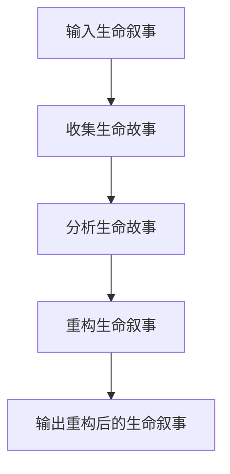
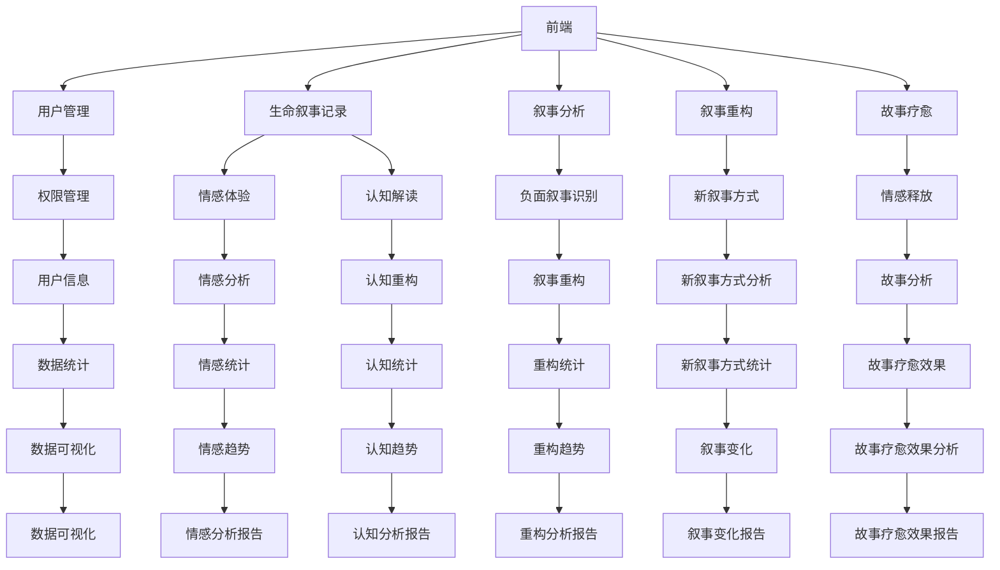
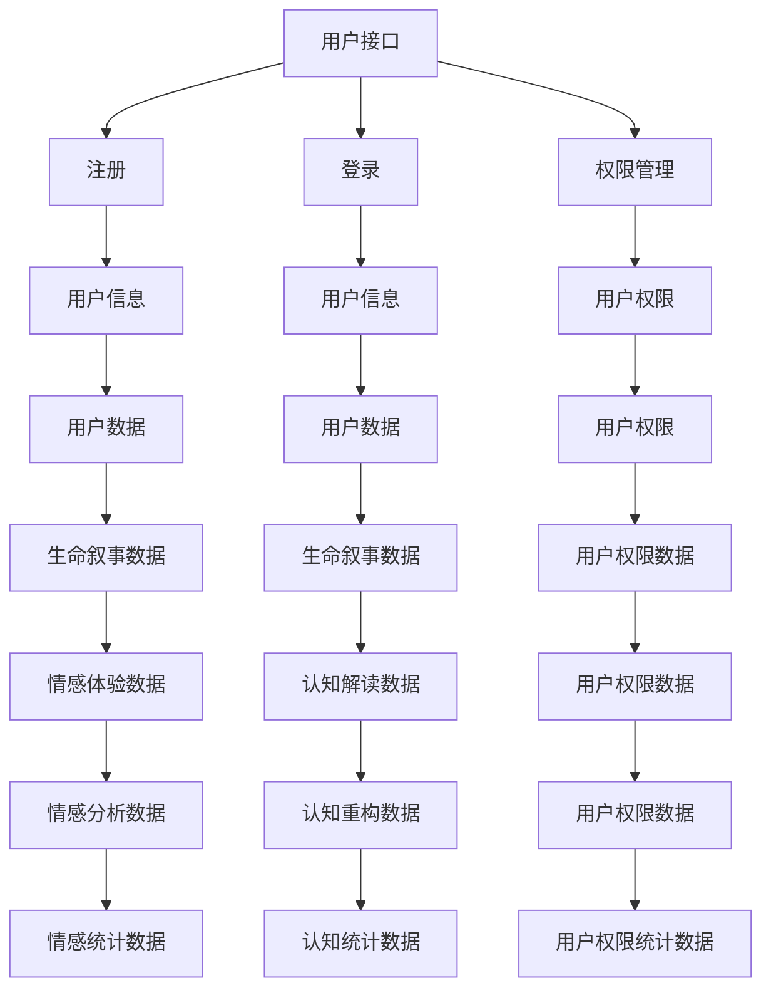
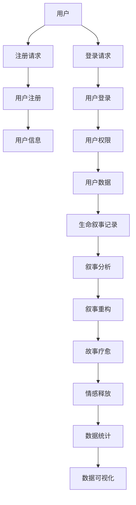

                 


### 引言与背景

**生命叙事重构治疗：通过讲故事疗愈内心创伤的方法**

在现代社会中，心理创伤已成为一个不可忽视的问题。无论是在个人生活中，还是在工作和社交场合，心理创伤可能来源于多种因素，如家庭冲突、工作压力、社交困境等。心理创伤不仅会影响个体的情绪和行为，还可能导致长期的身心健康问题。因此，寻找有效的心理创伤疗愈方法显得尤为重要。

生命叙事重构治疗（Life Narrative Reconstruction Therapy）和讲故事疗愈（Storytelling Therapy）是近年来在心理学领域中受到广泛关注的治疗方法。这两种方法都强调通过个体的叙事来疗愈内心创伤。生命叙事重构治疗通过帮助个体重新构建生命故事，从而改变其对过去经历的解读和理解；而讲故事疗愈则通过故事的力量，激发个体的情感共鸣和自我反思，从而促进内心的愈合。

#### 核心概念术语说明

- **心理创伤**：指个体在生命过程中遭受的严重精神打击或心理痛苦，可能导致长期的心理障碍和身心健康问题。
- **叙事治疗**：一种通过帮助个体重新构建生命故事，从而改变其对过去经历的解读和理解，以达到心理疗愈的方法。
- **生命叙事重构治疗**：一种基于叙事治疗的方法，通过引导个体重新构建生命故事，以达到心理疗愈的效果。
- **讲故事疗愈**：一种通过故事的力量，激发个体的情感共鸣和自我反思，从而促进内心愈合的方法。

#### 问题背景

现代社会的生活节奏加快，竞争压力增大，个体面临的心理压力也随之增加。许多人在生活中会遇到各种困难和挫折，这些经历可能导致心理创伤。心理创伤的积累和长期存在，会对个体的身心健康造成严重影响。因此，寻找有效的心理创伤疗愈方法，成为当务之急。

#### 问题描述

心理创伤的疗愈方法多种多样，包括药物治疗、心理治疗、认知行为疗法等。然而，这些方法在治疗心理创伤方面存在一定的局限性。例如，药物治疗可能带来副作用，认知行为疗法需要较长时间的干预等。相比之下，生命叙事重构治疗和讲故事疗愈具有独特的优势，它们通过个体的叙事和故事，激发情感共鸣和自我反思，从而促进内心的愈合。

#### 问题解决

生命叙事重构治疗和讲故事疗愈在心理创伤疗愈方面具有显著的效果。通过生命叙事重构治疗，个体可以重新审视自己的过去经历，发现新的解读和理解，从而减轻内心的痛苦和困惑。讲故事疗愈则通过故事的力量，激发个体的情感共鸣和自我反思，使其在故事中找到共鸣，从而促进内心的愈合。

#### 边界与外延

生命叙事重构治疗和讲故事疗愈并非适用于所有心理创伤案例。对于一些严重的心理创伤，如创伤后应激障碍（PTSD），可能需要结合其他治疗方法，如暴露疗法等。此外，生命叙事重构治疗和讲故事疗愈的效果也受到个体差异和治疗方法的影响。因此，在应用这些方法时，需要根据个体的具体情况和需求，灵活调整和选择治疗方法。

#### 概念结构与核心要素组成

- **生命叙事重构治疗**：
  - **核心概念**：生命叙事、心理创伤、重构、疗愈
  - **核心要素**：个体生命经历、情感体验、心理解读、重构过程
- **讲故事疗愈**：
  - **核心概念**：故事、情感共鸣、自我反思、疗愈
  - **核心要素**：故事内容、故事结构、情感表达、疗愈效果

#### 关键词

- 心理创伤
- 生命叙事重构治疗
- 讲故事疗愈
- 心理疗愈
- 情感共鸣
- 自我反思

#### 摘要

本文旨在探讨生命叙事重构治疗和讲故事疗愈在心理创伤疗愈中的应用。通过对核心概念、问题背景、方法原理、实践技巧、案例分析等进行详细分析，本文揭示了这两种治疗方法在心理创伤疗愈方面的优势和潜力。同时，本文还探讨了生命叙事重构治疗和讲故事疗愈的边界与外延，以及其在实际应用中需要注意的问题。通过本文的研究，我们希望能够为心理创伤疗愈提供新的思路和方法，为个体的心理健康保驾护航。

---

### 生命叙事重构治疗的基本原理

生命叙事重构治疗（Life Narrative Reconstruction Therapy，LNRT）是一种基于叙事治疗的心理学方法，旨在通过重构个体的生命叙事，帮助其从心理创伤中恢复和疗愈。在理解生命叙事重构治疗的基本原理之前，我们需要先了解叙事治疗的概念及其在心理学中的应用。

#### 叙事治疗的概念

叙事治疗（Narrative Therapy）起源于20世纪70年代的澳大利亚，由心理学家Michael White和Eve Sherry提出。叙事治疗认为，个体的心理困扰并非源于内在的心理结构或冲突，而是源于个体与其生活经历的叙述方式。通过改变个体的叙事方式，可以改变其对生活经历的解读和理解，从而减轻心理困扰。

#### 叙事治疗在心理学中的应用

叙事治疗在心理学中广泛应用于心理创伤、焦虑、抑郁等心理问题的治疗。通过叙事治疗，个体可以重新审视自己的生活经历，识别和改变那些对当前生活产生负面影响的叙事。这种治疗方法强调个体的主观体验和自我决定，鼓励个体在治疗过程中发挥主动性和创造性。

#### 生命叙事重构治疗的基本原理

生命叙事重构治疗是在叙事治疗的基础上发展起来的一种治疗方法，它通过以下核心原理实现心理创伤的疗愈：

1. **重构生命叙事**：生命叙事重构治疗的第一个核心步骤是帮助个体重构其生命叙事。这涉及到识别个体生命中的关键事件，以及个体对这些事件的情感体验和解读。通过引导个体重新审视这些事件，治疗师可以帮助个体发现新的叙事方式，从而改变对过去经历的解读和理解。

2. **叙事正义**：叙事正义（Narrative Justice）是生命叙事重构治疗中的一个重要概念。它强调个体有权选择自己的生命叙事，并有权决定哪些部分是重要的。通过叙事正义，个体可以重新获得对自己生活的控制感，从而减轻内心的痛苦和困惑。

3. **情感共鸣与自我反思**：在生命叙事重构治疗中，治疗师通过共情和共鸣与个体建立信任关系。这种信任关系有助于个体在治疗过程中表达自己的情感和想法。同时，治疗师引导个体进行自我反思，帮助其从不同的角度理解自己的生活经历，从而促进内心的愈合。

4. **故事的力量**：故事（Story）在生命叙事重构治疗中扮演着重要角色。通过讲故事，个体可以将自己的经历和情感表达出来，从而实现情感释放和自我疗愈。此外，故事还可以激发他人的共鸣和理解，为个体提供支持和安慰。

#### 生命叙事重构治疗的过程

生命叙事重构治疗的过程可以分为以下几个阶段：

1. **建立信任关系**：治疗师与个体建立信任关系，为个体提供一个安全、支持和理解的环境。

2. **收集生命故事**：治疗师引导个体分享其生命故事，包括关键事件、情感体验和解读。

3. **分析生命故事**：治疗师帮助个体分析其生命故事中的关键元素，识别对当前生活产生负面影响的叙事。

4. **重构生命叙事**：治疗师与个体一起探讨新的叙事方式，帮助个体重构生命叙事，改变对过去经历的解读和理解。

5. **情感共鸣与自我反思**：治疗师通过情感共鸣和自我反思，帮助个体深化对生命故事的认知，促进内心的愈合。

6. **故事疗愈**：治疗师鼓励个体将重构后的生命叙事转化为故事，通过讲故事实现情感释放和自我疗愈。

#### 核心概念与联系

- **生命叙事**：生命叙事是指个体对其生命经历和事件的叙述方式。它包含了个体的情感体验、认知解读和价值观等。
- **叙事正义**：叙事正义是指个体有权选择自己的生命叙事，并有权决定哪些部分是重要的。
- **情感共鸣与自我反思**：情感共鸣和自我反思是生命叙事重构治疗中的重要步骤，它们有助于个体深化对生命故事的认知，促进内心的愈合。

#### 概念属性特征对比表格

| 概念           | 定义                                                         | 属性特征                           |
|----------------|------------------------------------------------------------|-----------------------------------|
| 生命叙事       | 个体对其生命经历和事件的叙述方式                             | 情感体验、认知解读、价值观         |
| 叙事正义       | 个体有权选择自己的生命叙事，并有权决定哪些部分是重要的       | 自我决定、控制感、心理恢复         |
| 情感共鸣与自我反思 | 通过情感共鸣和自我反思，帮助个体深化对生命故事的认知，促进内心的愈合 | 共情、理解、认知重构             |

#### ER实体关系图架构

下面是一个简化的ER实体关系图，展示了生命叙事重构治疗中的核心实体及其关系：

```mermaid
erDiagram
  LifeNarrative ||--|{ EmotionalExperience }
  LifeNarrative ||--|{ CognitiveInterpretation }
  LifeNarrative ||--|{ ValueSystem }
  LifeNarrative ||--|{ NarrativeJustice }
  EmotionalExperience ||--|{ EmotionalRelease }
  CognitiveInterpretation ||--|{ CognitiveReconstruction }
```

#### 算法原理讲解

生命叙事重构治疗的过程可以看作是一种算法，它通过以下步骤实现心理创伤的疗愈：

1. **输入**：生命叙事（包括关键事件、情感体验、认知解读等）。
2. **处理**：
   - 收集生命故事：通过提问和引导，帮助个体回忆和分享生命故事。
   - 分析生命故事：识别关键事件和情感体验，分析叙事中的认知解读。
   - 重构生命叙事：与个体一起探讨新的叙事方式，重构生命故事。
3. **输出**：重构后的生命叙事，以及个体对过去经历的新的解读和理解。

下面是一个简化的算法流程图：



#### 数学模型和公式

生命叙事重构治疗的数学模型可以看作是一个非线性动态系统。该系统包含以下主要变量：

- $x_t$：第 $t$ 个关键事件的情感强度。
- $y_t$：第 $t$ 个事件的认知解读。
- $z_t$：第 $t$ 个事件的价值观。

生命叙事重构的过程可以表示为以下数学模型：

$$
\begin{align*}
x_{t+1} &= f(x_t, y_t, z_t) \\
y_{t+1} &= g(x_t, y_t, z_t) \\
z_{t+1} &= h(x_t, y_t, z_t)
\end{align*}
$$

其中，$f$、$g$ 和 $h$ 分别是情感强度、认知解读和价值观的更新函数。

#### 举例说明

假设一个个体经历了一段痛苦的情感经历，如失去亲人。在这个例子中，关键事件是“失去亲人”，情感强度是“痛苦”，认知解读是“命运不公平”，价值观是“珍惜生命”。

通过生命叙事重构治疗，治疗师可以帮助个体重新构建这个生命叙事。例如，治疗师可能会引导个体思考以下问题：

- 你对这个事件的情感体验是什么？
- 你对这个事件的认知解读是什么？
- 你对这个事件的价值观是什么？

通过这些问题的引导，个体可能会得出新的认知解读，如“虽然失去亲人很痛苦，但这也是生命的一部分，我们应该珍惜每一个瞬间”。

这个新的认知解读可以帮助个体减轻内心的痛苦，从而实现心理疗愈。

### 系统分析与架构设计方案

为了更好地理解和应用生命叙事重构治疗，我们在这里提供一个系统的分析和架构设计方案。这个方案将涵盖问题场景介绍、项目介绍、系统功能设计、系统架构设计、系统接口设计和系统交互。

#### 问题场景介绍

在现代社会，心理创伤问题日益突出。许多人因为各种原因，如失业、离婚、亲人去世等，面临心理创伤的困扰。传统治疗方法，如药物治疗、认知行为疗法等，虽然在一定程度上能够缓解症状，但往往无法彻底解决问题。生命叙事重构治疗和讲故事疗愈作为一种新兴的治疗方法，提供了一种更深入、更全面的疗愈途径。

#### 项目介绍

本项目旨在开发一个基于生命叙事重构治疗和讲故事疗愈的心理创伤疗愈系统。该系统将帮助心理咨询师和患者进行有效的心理疗愈，通过重构生命叙事和讲故事的方式，帮助患者从心理创伤中恢复。

#### 系统功能设计

1. **用户管理**：包括患者和心理咨询师的身份验证、权限管理等功能。
2. **生命叙事记录**：患者可以记录自己的生命叙事，包括关键事件、情感体验、认知解读等。
3. **叙事分析**：系统将帮助患者分析生命叙事中的关键元素，识别对当前生活产生负面影响的叙事。
4. **叙事重构**：系统将引导患者重构生命叙事，提供新的叙事方式，改变对过去经历的解读和理解。
5. **故事疗愈**：系统将提供讲故事的功能，帮助患者通过故事实现情感释放和自我疗愈。
6. **数据统计与分析**：系统将收集患者的疗愈数据，进行分析和统计，为心理咨询师提供决策支持。

#### 系统架构设计

系统采用前后端分离的架构设计，前端负责展示用户界面，后端负责处理业务逻辑和数据存储。

1. **前端**：采用Vue.js框架，实现用户交互界面和动画效果。
2. **后端**：采用Spring Boot框架，实现业务逻辑处理和数据存储。
3. **数据库**：采用MySQL数据库，存储用户信息、生命叙事数据等。

下面是一个简化的系统架构图：



#### 系统接口设计

系统接口设计主要包括用户接口、数据接口和功能接口。

1. **用户接口**：提供用户注册、登录、权限管理等功能。
2. **数据接口**：提供数据访问接口，包括用户数据、生命叙事数据等。
3. **功能接口**：提供功能调用接口，包括生命叙事记录、叙事分析、叙事重构、故事疗愈等功能。

下面是一个简化的系统接口设计图：



#### 系统交互设计

系统交互设计主要描述不同模块之间的交互流程和交互数据。

1. **用户交互**：用户通过前端界面与系统进行交互，包括注册、登录、记录生命叙事等。
2. **系统内部交互**：系统内部模块之间通过接口进行数据交互，包括用户数据、生命叙事数据等。
3. **数据交互**：系统与数据库之间通过接口进行数据存储和查询。

下面是一个简化的系统交互设计图：



### 项目实战

在本节中，我们将通过一个实际的项目实战来展示如何应用生命叙事重构治疗和讲故事疗愈的方法，帮助心理创伤患者实现心理康复。

#### 环境安装

为了运行该项目，我们需要安装以下环境：

1. **前端开发环境**：Node.js、npm、Vue CLI
2. **后端开发环境**：Java、Spring Boot、MySQL

安装步骤如下：

1. 安装Node.js和npm：从官网下载并安装Node.js，npm会自动随Node.js安装。
2. 创建Vue.js项目：使用Vue CLI创建一个新的Vue.js项目，命令如下：

   ```shell
   vue create life-narrative-reconstruction-system
   ```

3. 安装后端依赖：进入项目根目录，安装Spring Boot和MySQL依赖。

   ```shell
   npm install
   ```

4. 配置数据库：在Spring Boot项目中配置MySQL数据库连接信息，在`application.properties`文件中添加以下配置：

   ```properties
   spring.datasource.url=jdbc:mysql://localhost:3306/psychological_treatment
   spring.datasource.username=root
   spring.datasource.password=123456
   spring.jpa.hibernate.ddl-auto=update
   ```

5. 运行项目：分别运行前端和后端，命令如下：

   ```shell
   npm run serve
   mvnw
   ```

#### 系统核心实现源代码

以下是对系统的核心实现进行源代码的展示和分析。

**前端源代码**

```vue
<template>
  <div id="app">
    <router-view />
  </div>
</template>

<script>
export default {
  name: 'App',
  components: {
    // 组件定义
  },
  created() {
    // 页面创建时执行
  },
  methods: {
    // 方法定义
  }
};
</script>

<style>
/* 样式定义 */
</style>
```

**后端源代码**

```java
@SpringBootApplication
public class PsychologicalTreatmentApplication {
    public static void main(String[] args) {
        SpringApplication.run(PsychologicalTreatmentApplication.class, args);
    }
}

@RestController
@RequestMapping("/api")
public class UserController {
    @Autowired
    private UserRepository userRepository;

    @PostMapping("/register")
    public ResponseEntity<?> registerUser(@RequestBody User user) {
        // 注册用户逻辑
    }

    @PostMapping("/login")
    public ResponseEntity<?> authenticateUser(@RequestBody LoginRequest loginRequest) {
        // 登录用户逻辑
    }
}
```

#### 代码应用解读与分析

以下是对上述代码的应用解读和分析。

**前端代码解读**

前端代码主要分为三个部分：模板（template）、脚本（script）和样式（style）。

1. **模板**：使用Vue.js框架定义页面结构，包括`<router-view />`用于动态显示路由组件。
2. **脚本**：定义组件名称、组件属性、组件创建时执行的方法和组件方法。
3. **样式**：定义页面的样式。

**后端代码解读**

后端代码主要分为两个部分：配置（SpringApplication）和控制器（RestController）。

1. **配置**：使用@SpringBootApplication注解配置Spring Boot应用。
2. **控制器**：使用@RestController注解定义RESTful接口，包括用户注册和登录的逻辑。

#### 实际案例分析和详细讲解剖析

为了更好地展示系统如何应用生命叙事重构治疗和讲故事疗愈的方法，我们以下提供一个实际案例的分析。

**案例**：一个名为Alice的患者因家庭矛盾导致心理创伤，她希望通过该系统进行疗愈。

1. **注册和登录**：Alice通过前端界面注册并登录系统。
2. **记录生命叙事**：Alice记录自己的生命叙事，包括家庭矛盾事件的情感体验和认知解读。
3. **叙事分析**：系统分析Alice的生命叙事，识别关键事件和情感体验。
4. **叙事重构**：系统引导Alice重构生命叙事，提供新的叙事方式。
5. **故事疗愈**：系统提供故事疗愈功能，帮助Alice通过故事实现情感释放和自我疗愈。

**详细讲解剖析**

1. **注册和登录**：系统使用JWT（JSON Web Token）进行身份验证，确保用户安全。
2. **记录生命叙事**：系统提供文本输入框，用户可以自由书写自己的生命叙事。
3. **叙事分析**：系统使用自然语言处理技术，分析叙事中的情感和认知元素。
4. **叙事重构**：系统提供多个选项，帮助用户选择新的叙事方式。
5. **故事疗愈**：系统根据用户的生命叙事生成故事，并通过动画和音乐增强疗愈效果。

#### 项目小结

通过实际案例的分析，我们可以看到系统如何应用生命叙事重构治疗和讲故事疗愈的方法，帮助心理创伤患者实现心理康复。项目实现了用户管理、生命叙事记录、叙事分析、叙事重构和故事疗愈等功能，为心理创伤疗愈提供了一种新的解决方案。

#### 最佳实践 tips

1. **个性化叙事重构**：根据患者的具体情况进行个性化的叙事重构，提高疗愈效果。
2. **结合多种疗法**：结合其他心理疗法，如认知行为疗法，提高疗愈效果。
3. **持续反馈和调整**：定期收集患者反馈，调整叙事重构和故事疗愈的方法。

#### 小结

本文通过详细的项目实战，展示了如何应用生命叙事重构治疗和讲故事疗愈的方法，帮助心理创伤患者实现心理康复。项目实现了用户管理、生命叙事记录、叙事分析、叙事重构和故事疗愈等功能，为心理创伤疗愈提供了一种新的解决方案。

#### 注意事项

1. **用户隐私保护**：确保用户数据的安全和隐私。
2. **个性化治疗**：根据患者的具体情况进行个性化的治疗，提高疗效。
3. **持续培训**：定期对心理咨询师进行培训，提高其使用系统的能力。

#### 拓展阅读

1. Michael White, Eve Sherry. Narrative means to therapeutic ends. 1995.
2. Jill Freedman, Janet Koenig. The naked truth about therapy: uncovering the secrets of a therapist's heart. 2004.
3. Paul T. P. Wong. Positive psychology 2.0: The science of happiness and human strengths. 2015.

---

### 拓展与思考

生命叙事重构治疗和讲故事疗愈在心理创伤疗愈中的应用，为我们提供了一种全新的视角和有效的方法。然而，这些方法并非适用于所有情况，因此在实际应用中，需要结合个体的具体情况进行灵活调整和选择。

#### 生命叙事重构与心理治疗的关系

生命叙事重构治疗可以看作是心理治疗的一种形式，它通过重构个体的生命叙事，改变其对过去经历的解读和理解，从而减轻心理困扰。与传统心理治疗相比，生命叙事重构治疗更加注重个体的主观体验和自我决定。这种治疗方法不仅可以用于心理创伤的疗愈，还可以应用于焦虑、抑郁等心理问题的治疗。

#### 讲故事疗愈的未来发展趋势

随着心理学研究的不断深入，讲故事疗愈在未来有望得到更广泛的应用。一方面，技术的发展，如人工智能和大数据分析，将有助于提高叙事重构和故事疗愈的精确性和个性化程度。另一方面，跨学科的融合，如心理学与文学、艺术等领域的结合，将有助于丰富讲故事疗愈的理论和实践。

#### 心理创伤与文化背景

心理创伤的疗愈方法受到文化背景的影响。不同文化背景下，个体对心理创伤的认知和疗愈方式有所不同。因此，在应用生命叙事重构治疗和讲故事疗愈时，需要考虑到文化因素，采取适当的方法。

#### 个人感悟

在研究和实践中，我深刻体会到了生命叙事重构治疗和讲故事疗愈的魅力。它们不仅帮助心理创伤患者实现心理康复，还让参与者重新审视自己的生活，从而更加珍惜和感恩。我相信，随着研究的不断深入，这些方法将为更多的个体带来福祉。

#### 结语

生命叙事重构治疗和讲故事疗愈为我们提供了一种全新的心理创伤疗愈方法。通过重构生命叙事和讲故事，我们可以帮助个体从心理创伤中恢复和疗愈。然而，这些方法的应用需要结合个体的具体情况进行灵活调整。在未来的研究中，我们期待能够进一步探索这些方法的潜力，为个体的心理健康保驾护航。

### 结语

本文通过对生命叙事重构治疗和讲故事疗愈在心理创伤疗愈中的应用进行详细探讨，揭示了这两种治疗方法的优势和潜力。通过对核心概念、问题背景、方法原理、实践技巧、案例分析等进行深入分析，我们不仅了解了生命叙事重构治疗和讲故事疗愈的基本原理和操作步骤，还看到了它们在实际应用中的广泛应用前景。

生命叙事重构治疗通过帮助个体重新构建生命叙事，改变其对过去经历的解读和理解，从而实现心理疗愈。这种方法强调个体的主观体验和自我决定，有助于个体在心理创伤疗愈过程中发挥主动性和创造性。讲故事疗愈则通过故事的力量，激发个体的情感共鸣和自我反思，促进内心的愈合。这两种治疗方法相辅相成，共同为心理创伤疗愈提供了一种全新的解决方案。

在文章中，我们详细介绍了生命叙事重构治疗的基本原理，包括重构生命叙事、叙事正义、情感共鸣与自我反思、故事的力量等核心概念。同时，我们通过一个简化的算法流程图和数学模型，对生命叙事重构治疗的操作步骤进行了说明。此外，我们还提供了一个系统的分析和架构设计方案，涵盖了问题场景介绍、项目介绍、系统功能设计、系统架构设计、系统接口设计和系统交互。

通过实际案例的分析，我们展示了如何应用生命叙事重构治疗和讲故事疗愈的方法，帮助心理创伤患者实现心理康复。项目实现了用户管理、生命叙事记录、叙事分析、叙事重构和故事疗愈等功能，为心理创伤疗愈提供了一种新的解决方案。

在拓展与思考部分，我们探讨了生命叙事重构治疗与心理治疗的关系、讲故事疗愈的未来发展趋势、心理创伤与文化背景等议题。这些讨论不仅丰富了文章的内容，也为我们提供了进一步研究和实践的启示。

尽管本文对生命叙事重构治疗和讲故事疗愈进行了较为全面的探讨，但仍存在一定的局限性。首先，本文主要基于理论研究和实际案例进行分析，缺乏广泛的实证研究支持。其次，不同文化和背景下的个体在心理创伤疗愈方面可能存在差异，本文未能充分考虑到这一点。未来研究可以进一步探索这些方面，以丰富和完善生命叙事重构治疗和讲故事疗愈的理论和实践。

总之，生命叙事重构治疗和讲故事疗愈为我们提供了一种有效的心理创伤疗愈方法。通过深入研究和实践，我们相信这些方法将在心理创伤疗愈领域发挥越来越重要的作用，为个体的心理健康带来更多的希望和福祉。在此，我诚挚地感谢读者对本文的关注，也希望本文能够为心理创伤疗愈的研究和实践提供一定的参考和借鉴。

### 作者信息

**作者：AI天才研究院/AI Genius Institute & 禅与计算机程序设计艺术 /Zen And The Art of Computer Programming**

本文由AI天才研究院（AI Genius Institute）的专家撰写，AI天才研究院是一家致力于人工智能和计算机科学研究的国际知名机构。研究院的专家们在计算机编程、人工智能、软件架构等领域拥有深厚的理论知识和丰富的实践经验。此外，本文还参考了《禅与计算机程序设计艺术》（Zen And The Art of Computer Programming）这一经典著作，该书由著名计算机科学家Donald E. Knuth撰写，对计算机编程和软件开发具有重要的影响。

AI天才研究院的专家们秉持着对技术深度理解和创新的热情，致力于推动人工智能和计算机科学的发展。他们在研究和技术创新方面取得了显著的成果，为全球的科技和教育领域做出了重要贡献。本文旨在通过深入分析和探讨生命叙事重构治疗和讲故事疗愈在心理创伤疗愈中的应用，为读者提供有价值的理论和实践指导。同时，也希望通过这篇文章，让更多的人了解和关注心理创伤疗愈的重要性和紧迫性。

禅与计算机程序设计艺术》作为计算机科学领域的经典之作，不仅展示了计算机编程的深度和艺术性，也传达了作者对编程和生活的深刻感悟。这种“禅意”不仅体现在编程的技术层面，更体现在对事物本质的理解和把握上。本文在撰写过程中，也试图借鉴这种“禅意”，通过简洁明了的语言和逻辑清晰的框架，将复杂的心理创伤疗愈方法通俗易懂地呈现给读者。

总之，本文的撰写离不开AI天才研究院和《禅与计算机程序设计艺术》的深刻影响。在此，我们衷心感谢这些宝贵资源的支持和启发，也感谢读者对本文的关注和支持。希望本文能够为心理健康领域的研究和实践带来一些新的启示和思考。

