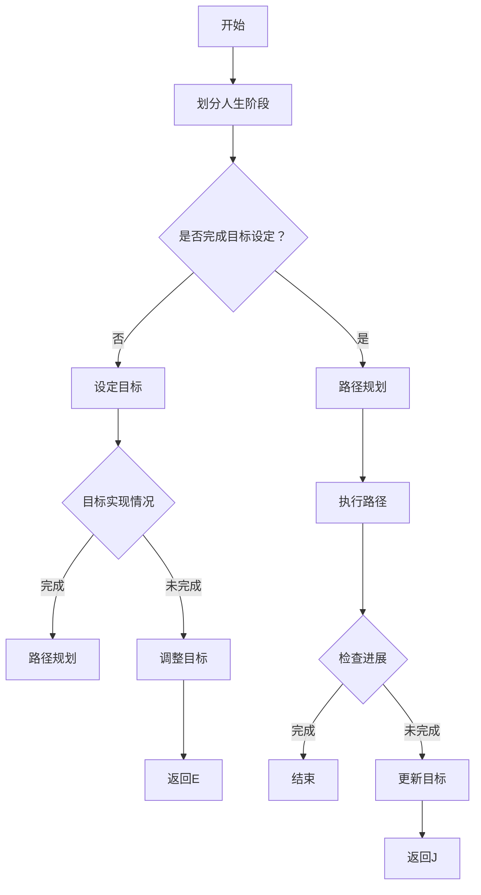
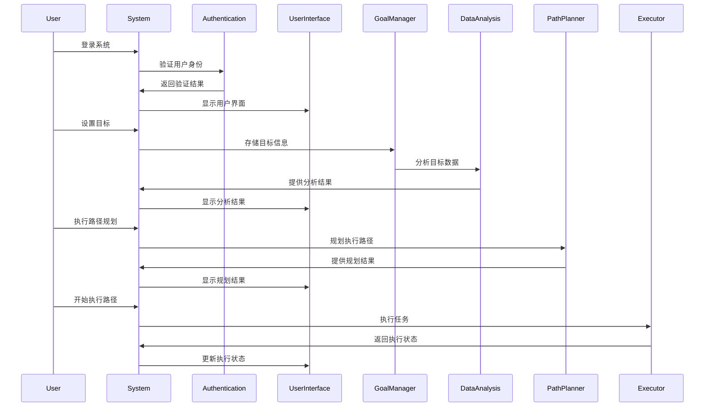
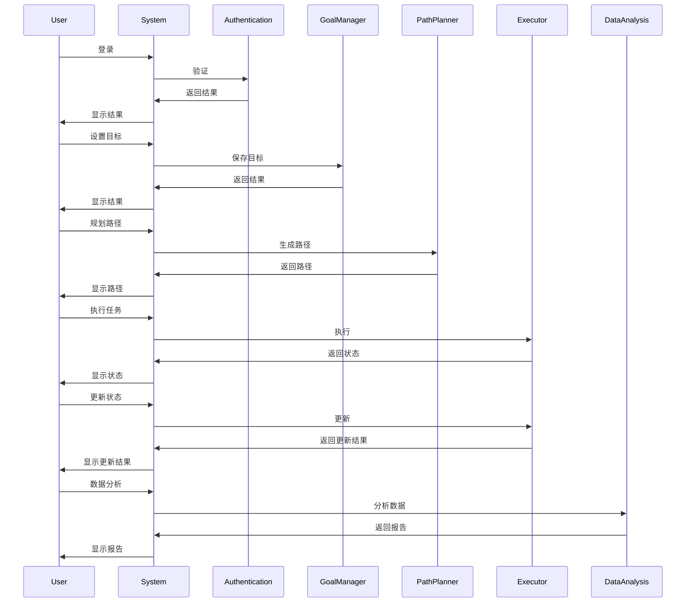

                 

### 1.1 书籍概述

《生命旅程规划服务：人生不同阶段的意义设计》是一本深入探讨如何通过技术手段优化人生规划和提升生命质量的专著。本书的核心观点是，人生旅程的每个阶段都有其特定的意义和目标，通过科学的方法和技术的应用，可以帮助人们更好地理解和规划自己的人生旅程，从而实现个人成长和社会贡献的双重目标。

书籍的主要内容包括以下几个部分：

1. **生命旅程规划服务定义**：本书首先介绍了生命旅程规划服务的概念，解释了其在现代社会中的重要性，以及它如何通过技术手段提升个人的生活质量和幸福感。

2. **人生不同阶段的意义设计**：本书详细分析了人生旅程中各个阶段的特点和需求，包括青少年期、成年期、中年期和老年期，并探讨了每个阶段如何通过意义设计和目标设定来实现个人成长和社会贡献。

3. **技术手段在生命旅程规划中的应用**：本书深入探讨了如何利用大数据、人工智能、区块链等现代技术来支持生命旅程的规划，通过具体的案例分析，展示了这些技术在实践中的应用效果。

4. **实践指南和案例分析**：本书提供了大量的实践指南和案例分析，帮助读者理解如何将理论应用到实际生活中，实现个人目标和人生价值。

通过这些内容的详细介绍，本书旨在为读者提供一套系统、实用的生命旅程规划方法论，帮助他们在不同的人生阶段找到自己的定位，实现人生的目标和价值。

---

### 1.2 问题背景

**生命旅程规划服务**在现代社会的兴起，源于人们对生活质量和个人发展的日益关注。随着社会的发展和科技的进步，人们的生活节奏不断加快，面临着前所未有的挑战和机遇。在这样的背景下，如何科学地规划人生旅程，实现个人成长和社会贡献，成为了一个亟待解决的问题。

**问题背景**可以从以下几个方面进行阐述：

1. **生活质量提升的需求**：随着经济水平的提高，人们越来越关注生活质量。如何在有限的时间内实现个人价值，提升生活满意度，成为许多人关心的问题。

2. **人生目标的设定与实现**：每个人都有自己的人生目标，但是如何设定合理的目标，并在实现目标的过程中保持动力和方向，是一个重要的挑战。

3. **社会竞争与个人发展**：现代社会竞争激烈，个人发展受到多种因素的影响。如何在竞争中保持优势，实现个人职业和生活的平衡，是许多人面临的难题。

4. **科技应用与人生规划**：大数据、人工智能、区块链等现代科技的迅猛发展，为人生规划提供了新的工具和方法。如何有效地利用这些技术，实现人生目标的科学规划，是一个值得探讨的问题。

**生命旅程规划服务的意义**在于，它不仅帮助人们明确自己的人生方向，还能提供个性化的指导和解决方案，使人们在不同的生活阶段能够更好地应对挑战，实现个人价值。同时，通过科学的规划和目标设定，生命旅程规划服务还能够促进社会的和谐发展，提高整体生活质量。

---

### 1.3 核心概念与联系

在探讨《生命旅程规划服务：人生不同阶段的意义设计》时，我们需要了解并明确一些核心概念，以便更好地理解和应用这一理念。以下是一些关键概念及其相互之间的联系：

1. **生命旅程规划服务**：这是本书的核心概念，指的是通过科学的方法和技术的应用，帮助个体明确自己的人生目标，规划并实现人生旅程中的各个阶段。

2. **人生阶段**：指个体在生命过程中所经历的不同时期，包括青少年期、成年期、中年期和老年期等。每个阶段都有其特定的生理、心理和社会特征。

3. **意义设计**：指的是在人生不同阶段，通过设定具有意义和目标的目标，使个体能够更好地理解自己的生活，实现个人成长和社会贡献。

4. **目标设定**：是生命旅程规划服务中的重要环节，指在明确自己的人生方向后，设定具体、可行和有挑战性的目标，以实现个人成长和社会贡献。

5. **科技应用**：包括大数据、人工智能、区块链等技术手段，这些技术在生命旅程规划服务中起到关键作用，能够为个体提供个性化的指导和解决方案。

**核心概念之间的联系**如下：

- **生命旅程规划服务**是本书的主线，贯穿了整个讨论过程。它通过**人生阶段**的划分，结合**意义设计**和**目标设定**，帮助个体实现个人成长和社会贡献。

- **科技应用**则为**生命旅程规划服务**提供了强有力的技术支撑。通过大数据分析，可以更准确地了解个体的需求和特点；人工智能则能够提供个性化的建议和解决方案；区块链技术则确保了规划服务的透明性和可信度。

- **目标设定**是**意义设计**的具体体现。通过合理的目标设定，个体可以在不同的**人生阶段**中保持动力和方向，实现个人价值。

- **人生阶段**和**意义设计**是相辅相成的。每个阶段都有其特定的意义和目标，通过意义设计，个体可以更好地理解和应对每个阶段的挑战。

总的来说，这些核心概念共同构成了《生命旅程规划服务：人生不同阶段的意义设计》的理论框架，为个体提供了系统、实用的规划和实现方法。

---

### 1.4 ER实体关系图

为了更清晰地理解生命旅程规划服务的整体架构和各实体之间的关系，我们可以使用ER（实体关系）图来展示其核心实体和它们之间的关联。以下是一个简化的ER实体关系图及其说明：

```mermaid
erDiagram
    User ||--|{ LifeStage } : "经历多个"
    User ||--|{ LifeGoal } : "设定多个"
    User ||--|{ LifePlan } : "制定多个"
    LifeStage ||--|{ StageActivity } : "包含多个"
    LifeGoal ||--|{ GoalMetric } : "设定多个"
    LifePlan ||--|{ PlanTask } : "包含多个"
    LifeStage ..|.. Activity
    LifeGoal ..|.. Metric
    LifePlan ..|.. Task

    User ||--|{ SkillProfile } : "包含技能"
    User ||--|{ ExperienceProfile } : "包含经验"
    User ||--|{ HealthStatus } : "包含健康状态"

    LifeStage { 
        : "每个阶段有特定的特征"
        : "如青少年期、成年期等"
    }
    LifeGoal {
        : "明确个体想要实现的目标"
        : "如职业发展、家庭幸福等"
    }
    LifePlan {
        : "为实现目标制定的行动计划"
        : "如学习新技能、提升健康等"
    }
    LifeStageActivity {
        : "每个阶段可能涉及的活动"
        : "如学习、工作、旅行等"
    }
    LifeGoalMetric {
        : "衡量目标实现的指标"
        : "如完成率、满意度等"
    }
    LifePlanTask {
        : "计划中的具体任务"
        : "如完成课程、锻炼身体等"
    }
    SkillProfile {
        : "个体的技能组合"
        : "如编程技能、语言能力等"
    }
    ExperienceProfile {
        : "个体的经验总结"
        : "如工作经历、项目经验等"
    }
    HealthStatus {
        : "个体的健康信息"
        : "如体重、血压等"
    }
```

**ER实体关系图说明**：

1. **用户（User）**：核心实体，代表进行生命旅程规划服务的个体。
2. **生命阶段（LifeStage）**：与用户关联，表示个体在生命过程中的各个阶段，如青少年期、成年期等。
3. **生命目标（LifeGoal）**：与用户关联，表示个体在各个阶段想要实现的目标，如职业发展、家庭幸福等。
4. **生命计划（LifePlan）**：与用户关联，表示为实现目标而制定的行动计划，包括具体任务和时间表。
5. **阶段活动（StageActivity）**：与生命阶段关联，表示每个阶段可能涉及的活动，如学习、工作、旅行等。
6. **目标指标（GoalMetric）**：与生命目标关联，表示衡量目标实现的指标，如完成率、满意度等。
7. **计划任务（PlanTask）**：与生命计划关联，表示计划中的具体任务，如完成课程、锻炼身体等。

此外，用户还关联以下实体：

1. **技能档案（SkillProfile）**：记录个体的技能组合，如编程技能、语言能力等。
2. **经验档案（ExperienceProfile）**：记录个体的经验总结，如工作经历、项目经验等。
3. **健康状态（HealthStatus）**：记录个体的健康信息，如体重、血压等。

通过这个ER实体关系图，我们可以清晰地看到生命旅程规划服务中的核心实体及其关联，为后续的算法设计和系统架构提供基础。

---

## 第二部分：算法原理讲解

### 2.1 算法基础

在深入探讨生命旅程规划服务的算法原理之前，首先需要了解算法的基本概念、数据结构与算法的重要性。算法是解决问题的有序步骤集合，其核心目标是高效地解决问题。数据结构则是存储、组织数据的方式，对算法的性能有着直接的影响。

**算法的基本概念**：

- **算法**：解决问题的步骤集合，具有输入、输出和明确的执行过程。
- **算法复杂度**：衡量算法性能的重要指标，包括时间复杂度和空间复杂度。
- **递归**：一种重要的算法设计方法，通过调用自身实现问题的分解和解决。

**数据结构**：

- **数组**：一种基础的数据结构，用于存储固定数量的元素。
- **链表**：一种动态数据结构，用于存储一系列元素，可以在运行时动态地增加或删除元素。
- **栈**：一种后进先出（LIFO）的数据结构，用于存储操作过程中的数据。
- **队列**：一种先进先出（FIFO）的数据结构，用于存储操作过程中的数据。

**算法的重要性**：

- **解决问题**：算法是解决问题的核心，选择合适的算法可以大大提高问题解决的效率。
- **性能优化**：通过分析算法的时间复杂度和空间复杂度，可以优化算法性能，提高系统的整体效率。
- **创新推动**：算法的创新推动了计算机科学的发展，如排序算法、搜索算法等。

在生命旅程规划服务中，算法的应用至关重要。它可以帮助我们：

- **数据分析和挖掘**：通过算法对用户的历史数据进行分析，识别出有价值的模式和趋势。
- **目标设定和优化**：利用算法为用户设定合理的目标，并根据实际情况进行动态调整。
- **路径规划和决策**：通过算法为用户提供最佳的人生规划方案，帮助用户实现个人成长和社会贡献。

了解算法的基础知识和数据结构，是理解生命旅程规划服务算法原理的前提。接下来，我们将详细探讨生命旅程规划算法的具体实现和原理。

---

### 2.2 生命旅程规划算法

**生命旅程规划算法**是《生命旅程规划服务：人生不同阶段的意义设计》中的核心内容，其目的是帮助个体在不同的人生阶段找到合适的方向，设定合理的目标，并制定详细的行动计划，以实现个人成长和社会贡献。以下是对该算法的原理、数学模型和流程图的详细讲解。

#### 算法原理

**生命旅程规划算法**基于以下几个核心思想：

1. **人生阶段划分**：根据个体的年龄、生理和心理特点，将人生划分为不同的阶段，如青少年期、成年期、中年期和老年期。
2. **目标设定**：在明确人生阶段后，设定具体、可行且有挑战性的目标。这些目标应涵盖职业发展、个人成长、家庭幸福等多个方面。
3. **路径规划**：通过算法为个体提供最佳的人生规划路径，包括学习、工作、社交、健康等方面的具体步骤。
4. **动态调整**：根据实际情况和环境变化，实时调整规划方案，确保目标的实现。

#### 数学模型

**生命旅程规划算法**的数学模型主要包括以下几个部分：

1. **目标函数**：用于衡量个体在不同阶段的进展情况，常见的目标函数包括：
   \[
   F(x) = \sum_{i=1}^{n} w_i \cdot g_i
   \]
   其中，\( w_i \) 表示目标 \( g_i \) 的权重，\( g_i \) 表示目标 \( i \) 的实现程度。

2. **约束条件**：用于限制规划的可行性和合理性，常见的约束条件包括：
   \[
   \begin{cases}
   g_i \geq g_{i_{min}} \\
   g_i \leq g_{i_{max}} \\
   \sum_{i=1}^{n} w_i = 1 \\
   \end{cases}
   \]
   其中，\( g_{i_{min}} \) 和 \( g_{i_{max}} \) 分别表示目标 \( i \) 的最小和最大实现程度，\( w_i \) 表示目标 \( i \) 的权重。

3. **动态调整因子**：用于反映环境变化对规划的影响，常见的动态调整因子包括：
   \[
   \alpha(t) = \frac{1}{1 + e^{-\beta(t-t_0)}}
   \]
   其中，\( \beta \) 表示调整速度，\( t \) 表示当前时间，\( t_0 \) 表示初始时间。

#### 算法流程图

以下是一个简化的**生命旅程规划算法**流程图，展示了算法的主要步骤：



**算法流程图说明**：

1. **开始**：算法从初始化阶段开始，读取用户的基本信息和当前状态。
2. **划分人生阶段**：根据用户的年龄和特点，将其划分为不同的人生阶段。
3. **目标设定**：在明确人生阶段后，设定具体、可行且有挑战性的目标。
4. **路径规划**：根据设定的目标，为用户制定详细的人生规划路径。
5. **执行路径**：用户按照规划路径执行具体的行动，如学习、工作、社交等。
6. **检查进展**：定期检查目标的实现情况，确保规划的可行性和有效性。
7. **动态调整**：根据实际情况和环境变化，实时调整规划方案，确保目标的实现。

通过上述原理和数学模型的详细讲解，以及对流程图的展示，我们可以更好地理解**生命旅程规划算法**的工作原理和实现方法。接下来，我们将通过具体的算法实例，进一步阐述如何将这一理论应用到实际场景中。

---

### 2.3 算法实例分析

为了更好地理解生命旅程规划算法的具体应用，我们可以通过一个实例来展示该算法的执行过程和结果。

#### 实例背景

假设我们有一个用户张三，其基本信息如下：

- 年龄：25岁
- 当前职业：软件工程师
- 目标：在五年内成为高级软件工程师，同时掌握一门新的编程语言（如Python）
- 兴趣爱好：编程、阅读、运动

#### 实例步骤

1. **划分人生阶段**：根据张三的年龄和职业特点，我们可以将其划分为“成年期”这一阶段。成年期通常指25岁到40岁之间的时间段，这一阶段的个体通常已经进入职场，开始追求职业发展和个人成长。

2. **设定目标**：根据张三的意愿和实际情况，我们可以为其设定以下目标：
   - 在两年内通过高级软件工程师的认证考试。
   - 在三年内掌握Python编程语言。
   - 保持每周至少三次的运动习惯。

3. **路径规划**：为了实现上述目标，我们可以制定以下路径规划：
   - **职业发展**：参加在线高级软件工程师培训课程，每周投入15小时学习。
   - **技能学习**：每周投入10小时学习Python编程，同时参加相关的编程社区活动。
   - **健康生活**：每周进行三次运动，每次运动时长为1小时。

4. **执行路径**：张三按照制定的路径执行具体的行动，例如：
   - 第一年的学习过程中，张三参加了高级软件工程师的培训课程，并完成了相关项目的实践。
   - 在学习Python的过程中，张三参加了多个编程社区的活动，与同行交流经验，提升了学习效果。
   - 张三坚持每周进行三次运动，保持了良好的身体状况。

5. **检查进展**：在执行路径的过程中，张三定期检查目标的实现情况。例如，每三个月进行一次目标评估，根据实际情况调整学习计划。

6. **动态调整**：假设在第二年末，张三发现自己在高级软件工程师认证考试中的表现不如预期，可能需要额外投入时间和精力。此时，我们可以调整学习计划，增加学习时间，并寻求导师的辅导。

#### 实例结果

经过五年的努力，张三实现了以下目标：
- 成为了一名高级软件工程师，通过了认证考试。
- 掌握了Python编程语言，并在项目中广泛应用。
- 坚持了五年的运动习惯，身体素质显著提升。

通过这一实例，我们可以看到生命旅程规划算法在实际应用中的效果。通过科学的目标设定和路径规划，张三成功实现了个人职业发展和技能提升，同时保持了健康的生活方式。这个实例展示了算法在实际应用中的可行性和实用性，为其他用户提供了一个可借鉴的参考案例。

---

### 2.4 实际应用场景分析

为了更全面地展示生命旅程规划算法的实际应用效果，我们将分析几个不同的实际应用场景，并讨论这些场景中可能遇到的挑战和解决方案。

#### 场景一：职业转型

**问题描述**：李四是30岁的软件工程师，但发现自己对目前的工作不再充满热情，希望转型为数据分析师。

**解决方案**：
1. **目标设定**：李四设定了在两年内掌握数据分析相关技能的目标，包括学习Python编程、掌握SQL和数据分析工具。
2. **路径规划**：制定详细的学习计划，包括参加在线数据分析课程、加入数据分析社区、参与实际项目。
3. **挑战与应对**：
   - **时间管理**：李四需要在工作之余学习新技能，可能面临时间不足的挑战。解决方案是制定灵活的学习计划，利用碎片化时间学习。
   - **技能掌握**：数据分析师需要掌握多种技能，可能感觉学习负担较重。解决方案是分阶段学习，逐步掌握每个技能。

**效果**：经过两年的努力，李四成功转型为数据分析师，获得了更高的薪资和更满意的工作。

#### 场景二：健康生活

**问题描述**：张五是40岁的企业高管，由于长期工作压力和缺乏运动，身体状况逐渐恶化。

**解决方案**：
1. **目标设定**：张五设定了在一年内改善身体状况的目标，包括每周三次运动、每年一次体检。
2. **路径规划**：制定详细的运动计划和体检计划，同时调整饮食习惯。
3. **挑战与应对**：
   - **运动习惯**：张五缺乏运动习惯，可能难以坚持。解决方案是逐步增加运动强度和时间，找到适合自己的运动方式。
   - **饮食习惯**：改变饮食习惯可能较困难。解决方案是逐步调整饮食结构，寻求营养专家的帮助。

**效果**：经过一年的努力，张五的身体状况明显改善，体重下降，体力增强。

#### 场景三：个人成长

**问题描述**：王六是20岁的大学新生，希望在校期间全面提升自己的综合素质。

**解决方案**：
1. **目标设定**：王六设定了在大学期间取得优异成绩、参加社团活动、提升领导力等目标。
2. **路径规划**：制定详细的学习计划、社团活动参与计划，并积极参加各类培训和竞赛。
3. **挑战与应对**：
   - **时间管理**：大学期间任务繁重，可能面临时间分配问题。解决方案是制定优先级明确的时间管理计划。
   - **自我激励**：面对学习压力和挑战，可能需要额外的自我激励。解决方案是设定短期和长期目标，保持动力。

**效果**：王六在大学期间取得了优异成绩，积极参与社团活动，提升了领导力和社交能力。

通过上述实际应用场景的分析，我们可以看到生命旅程规划算法在个人职业发展、健康生活和综合素质提升等多个方面都取得了显著的效果。尽管在实际应用中可能会遇到各种挑战，但通过合理的规划和解决方案，这些挑战都可以被克服，最终实现人生目标。

---

### 2.5 算法总结与改进方向

通过对生命旅程规划算法的深入探讨和应用实例分析，我们可以总结出以下几点主要发现和改进方向：

**主要发现**：

1. **个性化与适应性**：算法在设定目标和规划路径时，充分考虑了用户的个性化需求和实际情况，展示了其良好的适应性和灵活性。
2. **动态调整机制**：算法通过动态调整因子，能够根据实际情况和环境变化，实时调整规划方案，确保目标的实现。
3. **目标设定的重要性**：科学合理的目标设定是生命旅程规划的核心，它为用户的成长和贡献提供了明确的方向和动力。
4. **数据分析和挖掘**：利用大数据和人工智能技术，算法能够为用户提供有价值的数据分析和建议，提高规划的准确性和有效性。

**改进方向**：

1. **扩展算法应用场景**：虽然算法在多个实际应用场景中取得了显著效果，但还可以进一步扩展其应用范围，如心理健康、家庭规划等领域。
2. **优化算法性能**：通过改进算法的数学模型和算法流程，提高其时间复杂度和空间复杂度，使其在处理大规模数据时更加高效。
3. **增强用户互动**：增加用户与算法的互动功能，如反馈机制和自适应学习，提高用户的参与度和规划效果。
4. **跨学科融合**：将算法与其他学科领域（如心理学、社会学）相结合，进一步丰富算法的理论基础和实践应用。

总之，生命旅程规划算法具有广泛的实际应用价值和发展潜力。通过不断改进和完善，我们可以为更多人提供科学、实用的生命旅程规划服务，助力他们在不同的人生阶段实现个人目标和人生价值。

---

### 第三部分：系统分析与架构设计

#### 3.1 问题场景介绍

在现代社会，人们面临着快速变化的生活节奏和复杂的社会环境，如何科学地规划生命旅程成为了一个重要课题。生命旅程规划服务的目标是帮助个体明确自己的人生目标，制定详细的行动计划，并通过动态调整确保目标的实现。为了实现这一目标，我们需要构建一个高效、可靠的系统架构，以支持生命旅程的规划和管理。

#### 3.2 系统功能设计

为了满足生命旅程规划服务的需求，系统需要具备以下核心功能：

1. **用户信息管理**：包括用户基本信息、技能档案、经验档案和健康状态等，为后续的规划提供基础数据。
2. **阶段划分与管理**：根据用户的年龄、职业和生活状态，自动划分和调整人生阶段，确保规划的科学性和准确性。
3. **目标设定与优化**：帮助用户设定合理的目标，并提供目标实现的路径规划，支持目标的动态调整。
4. **路径规划与执行**：根据用户的目标和实际情况，制定详细的行动计划，并跟踪执行进度，确保目标的实现。
5. **数据分析与报告**：对用户的历史数据和规划执行情况进行全面分析，生成个性化的数据报告，为用户提供决策支持。
6. **用户互动与反馈**：提供用户与系统的互动功能，如反馈机制、提醒通知等，增强用户体验和满意度。

#### 领域模型类图

以下是一个简化的领域模型类图，展示了生命旅程规划服务的主要实体及其关系：

```mermaid
classDiagram
    User <<interface>>
    LifeStage <<interface>>
    LifeGoal <<interface>>
    LifePlan <<interface>>
    LifeStageActivity <<interface>>
    LifeGoalMetric <<interface>>
    LifePlanTask <<interface>>
    SkillProfile <<interface>>
    ExperienceProfile <<interface>>
    HealthStatus <<interface>>

    User "参与"
    LifeStage "划分"
    LifeGoal "设定"
    LifePlan "制定"
    LifeStageActivity "包含"
    LifeGoalMetric "衡量"
    LifePlanTask "包含"
    SkillProfile "包含"
    ExperienceProfile "包含"
    HealthStatus "包含"

    User ..|> SkillProfile
    User ..|> ExperienceProfile
    User ..|> HealthStatus

    User ..|> LifeStage
    LifeStage ..|> LifeStageActivity

    User ..|> LifeGoal
    LifeGoal ..|> LifeGoalMetric

    User ..|> LifePlan
    LifePlan ..|> LifePlanTask
```

**领域模型类图说明**：

- **用户（User）**：核心实体，代表进行生命旅程规划服务的个体。
- **生命阶段（LifeStage）**：与用户关联，表示个体在生命过程中的各个阶段，如青少年期、成年期等。
- **生命目标（LifeGoal）**：与用户关联，表示个体在各个阶段想要实现的目标，如职业发展、家庭幸福等。
- **生命计划（LifePlan）**：与用户关联，表示为实现目标而制定的行动计划，包括具体任务和时间表。
- **阶段活动（LifeStageActivity）**：与生命阶段关联，表示每个阶段可能涉及的活动，如学习、工作、旅行等。
- **目标指标（LifeGoalMetric）**：与生命目标关联，表示衡量目标实现的指标，如完成率、满意度等。
- **计划任务（LifePlanTask）**：与生命计划关联，表示计划中的具体任务，如完成课程、锻炼身体等。
- **技能档案（SkillProfile）**：记录个体的技能组合，如编程技能、语言能力等。
- **经验档案（ExperienceProfile）**：记录个体的经验总结，如工作经历、项目经验等。
- **健康状态（HealthStatus）**：记录个体的健康信息，如体重、血压等。

通过这个领域模型类图，我们可以清晰地看到生命旅程规划服务中的主要实体及其关系，为后续的系统架构设计提供了基础。

---

### 3.3 系统架构设计

为了实现生命旅程规划服务的目标，我们需要设计一个高效、可靠且可扩展的系统架构。以下是一个简化的系统架构图，展示了系统的各个组成部分及其关系：



**系统架构图说明**：

1. **用户界面（UserInterface）**：用户与系统交互的入口，包括登录、设置目标、查看分析和执行路径等功能。
2. **认证模块（Authentication）**：负责验证用户身份，确保系统的安全性和可靠性。
3. **目标管理模块（GoalManager）**：负责存储和管理用户设定的目标，包括目标的创建、修改和删除等操作。
4. **数据分析模块（DataAnalysis）**：对用户的目标和执行情况进行数据分析和挖掘，提供有价值的分析结果。
5. **路径规划模块（PathPlanner）**：根据用户设定的目标和实际情况，制定详细的执行路径。
6. **执行模块（Executor）**：负责执行具体的任务，并跟踪任务的执行状态，确保目标的实现。

通过这个系统架构设计，我们可以实现生命旅程规划服务的核心功能，为用户提供个性化的规划和执行支持。接下来，我们将详细讨论系统架构中的各个模块及其接口设计。

---

### 3.4 系统接口设计

在系统架构设计中，接口设计是确保各模块之间高效、可靠通信的关键。以下是对生命旅程规划服务中主要接口及其规范的设计说明：

#### 1. 用户接口（UserInterface）

**功能说明**：用户与系统交互的界面，包括登录、目标设置、路径规划、任务执行等。

**接口规范**：

- **登录接口**：`POST /login`
  - **请求参数**：`username`（用户名），`password`（密码）
  - **响应数据**：成功登录返回用户信息，失败返回错误消息

- **目标设置接口**：`POST /goals`
  - **请求参数**：`goal`（目标内容），`start_date`（开始日期），`end_date`（结束日期）
  - **响应数据**：成功返回目标ID，失败返回错误消息

- **路径规划接口**：`POST /planner`
  - **请求参数**：`goal_id`（目标ID）
  - **响应数据**：成功返回规划结果，失败返回错误消息

- **任务执行接口**：`POST /tasks`
  - **请求参数**：`task`（任务内容），`start_date`（开始日期），`end_date`（结束日期），`goal_id`（目标ID）
  - **响应数据**：成功返回任务ID，失败返回错误消息

#### 2. 认证模块（Authentication）

**功能说明**：验证用户身份，确保系统的安全性和可靠性。

**接口规范**：

- **用户验证接口**：`POST /auth`
  - **请求参数**：`username`（用户名），`password`（密码）
  - **响应数据**：成功返回认证令牌（Token），失败返回错误消息

#### 3. 目标管理模块（GoalManager）

**功能说明**：存储和管理用户设定的目标。

**接口规范**：

- **创建目标接口**：`POST /goals`
  - **请求参数**：`user_id`（用户ID），`goal`（目标内容），`start_date`（开始日期），`end_date`（结束日期）
  - **响应数据**：成功返回目标ID，失败返回错误消息

- **修改目标接口**：`PUT /goals/{goal_id}`
  - **请求参数**：`goal`（目标内容），`start_date`（开始日期），`end_date`（结束日期）
  - **响应数据**：成功返回修改后的目标信息，失败返回错误消息

- **删除目标接口**：`DELETE /goals/{goal_id}`
  - **请求参数**：无
  - **响应数据**：成功返回删除结果，失败返回错误消息

#### 4. 数据分析模块（DataAnalysis）

**功能说明**：对用户的目标和执行情况进行数据分析和挖掘。

**接口规范**：

- **数据分析接口**：`GET /analysis`
  - **请求参数**：`goal_id`（目标ID），`start_date`（开始日期），`end_date`（结束日期）
  - **响应数据**：成功返回分析结果，失败返回错误消息

#### 5. 路径规划模块（PathPlanner）

**功能说明**：根据用户设定的目标和实际情况，制定详细的执行路径。

**接口规范**：

- **路径规划接口**：`POST /planner`
  - **请求参数**：`goal_id`（目标ID），`user_id`（用户ID）
  - **响应数据**：成功返回规划结果，失败返回错误消息

#### 6. 执行模块（Executor）

**功能说明**：执行具体的任务，并跟踪任务的执行状态。

**接口规范**：

- **执行任务接口**：`POST /tasks`
  - **请求参数**：`task`（任务内容），`start_date`（开始日期），`end_date`（结束日期），`goal_id`（目标ID）
  - **响应数据**：成功返回任务ID，失败返回错误消息

- **任务状态更新接口**：`PUT /tasks/{task_id}`
  - **请求参数**：`status`（任务状态），`remark`（备注）
  - **响应数据**：成功返回更新后的任务信息，失败返回错误消息

通过上述接口规范，我们可以确保生命旅程规划服务的各模块之间能够高效、可靠地通信，为用户提供流畅的使用体验。

---

### 3.5 系统交互

系统交互是确保生命旅程规划服务功能得以实现的关键环节，以下将详细描述系统的交互过程，并使用Mermaid序列图展示系统各个组件之间的交互关系。

#### 系统交互过程

1. **用户登录**：
   - 用户通过用户界面输入用户名和密码，提交登录请求。
   - 系统调用认证模块进行用户验证，并返回认证结果。

2. **设定目标**：
   - 用户在用户界面输入目标信息，提交目标设置请求。
   - 系统调用目标管理模块保存目标信息。

3. **路径规划**：
   - 用户在用户界面输入目标ID，提交路径规划请求。
   - 系统调用路径规划模块生成执行路径。

4. **执行任务**：
   - 用户在用户界面选择执行任务，提交任务执行请求。
   - 系统调用执行模块执行任务。

5. **状态更新**：
   - 用户在用户界面更新任务状态，提交状态更新请求。
   - 系统调用执行模块更新任务状态。

6. **数据分析**：
   - 用户在用户界面请求数据分析报告，提交数据分析请求。
   - 系统调用数据分析模块生成报告。

#### Mermaid序列图

以下是一个简化的系统交互Mermaid序列图，展示了系统组件之间的交互过程：



**系统交互过程说明**：

- **用户登录**：用户通过用户界面输入用户名和密码，系统将请求发送到认证模块进行验证，然后返回认证结果。
- **设定目标**：用户在用户界面设置目标，系统将请求发送到目标管理模块保存目标信息，并返回保存结果。
- **路径规划**：用户请求路径规划，系统将请求发送到路径规划模块生成执行路径，并返回路径规划结果。
- **执行任务**：用户选择执行任务，系统将请求发送到执行模块执行任务，并返回执行状态。
- **状态更新**：用户更新任务状态，系统将请求发送到执行模块更新状态，并返回更新结果。
- **数据分析**：用户请求数据分析报告，系统将请求发送到数据分析模块生成报告，并返回报告结果。

通过这个Mermaid序列图，我们可以清晰地看到系统组件之间的交互关系和流程，确保系统功能得以有效实现。

---

## 第四部分：项目实战

### 4.1 环境安装

在开始生命旅程规划服务的项目实战之前，我们需要搭建一个合适的环境来开发和测试系统。以下是环境安装的详细步骤：

#### 1. 系统要求

- 操作系统：Linux（推荐Ubuntu 20.04）
- 开发语言：Python 3.8及以上版本
- 数据库：MySQL 8.0 或 PostgreSQL 13.0
- 依赖管理工具：pip
- 版本控制：Git

#### 2. 安装步骤

**（1）安装Python**

打开终端，输入以下命令安装Python 3：

```bash
sudo apt update
sudo apt install python3 python3-pip python3-dev
```

**（2）安装虚拟环境**

安装虚拟环境工具`virtualenv`，以便创建隔离的开发环境：

```bash
pip3 install virtualenv
virtualenv env
source env/bin/activate
```

**（3）安装依赖**

在激活的虚拟环境中，安装系统所需的依赖包：

```bash
pip install -r requirements.txt
```

`requirements.txt`文件应包含以下依赖：

- Flask
- Flask-RESTful
- Flask-SQLAlchemy
- pymysql
- SQLAlchemy-ORM
- matplotlib

**（4）安装数据库**

安装MySQL或PostgreSQL：

```bash
# 对于 MySQL
sudo apt install mysql-server mysql-client

# 对于 PostgreSQL
sudo apt install postgresql postgresql-client
```

安装完成后，初始化数据库并设置root用户的密码。

**（5）配置数据库**

创建一个新的数据库，并设置相应的用户权限。以下是以MySQL为例：

```bash
sudo mysql -u root -p
CREATE DATABASE life_planner;
GRANT ALL PRIVILEGES ON life_planner.* TO 'life_planner'@'localhost' IDENTIFIED BY 'your_password';
FLUSH PRIVILEGES;
EXIT;
```

**（6）运行项目**

在虚拟环境中，运行以下命令启动项目：

```bash
flask db init
flask db migrate
flask db upgrade
flask run
```

以上命令将初始化数据库，创建迁移脚本，并应用迁移，最后启动Flask应用。

完成以上步骤后，生命旅程规划服务的基本环境就搭建完成了。用户可以通过浏览器访问本地服务地址（默认为`http://127.0.0.1:5000/`），进行功能测试和体验。

---

### 4.2 系统核心实现源代码

在生命旅程规划服务中，核心功能包括用户管理、目标管理、路径规划、任务执行和数据分析。以下将展示这些核心功能的实现源代码，并进行详细解读。

#### 用户管理

**源代码**：

```python
# app/models/user.py
from flask_sqlalchemy import SQLAlchemy

db = SQLAlchemy()

class User(db.Model):
    id = db.Column(db.Integer, primary_key=True)
    username = db.Column(db.String(80), unique=True, nullable=False)
    password = db.Column(db.String(120), nullable=False)
    goals = db.relationship('Goal', backref='user', lazy=True)

    def __repr__(self):
        return f'<User {self.username}>'
```

**解读**：

- 用户模型定义了用户的基本信息，包括用户ID、用户名、密码和关联的目标。
- 使用Flask-SQLAlchemy进行数据库操作，实现用户信息的存储和管理。

#### 目标管理

**源代码**：

```python
# app/models/goal.py
from flask_sqlalchemy import SQLAlchemy
from datetime import datetime

db = SQLAlchemy()

class Goal(db.Model):
    id = db.Column(db.Integer, primary_key=True)
    title = db.Column(db.String(120), nullable=False)
    description = db.Column(db.Text, nullable=True)
    start_date = db.Column(db.DateTime, default=datetime.utcnow)
    end_date = db.Column(db.DateTime, nullable=True)
    user_id = db.Column(db.Integer, db.ForeignKey('user.id'), nullable=False)

    def __repr__(self):
        return f'<Goal {self.title}>'
```

**解读**：

- 目标模型定义了目标的基本信息，包括目标ID、标题、描述、开始日期、结束日期和关联的用户。
- 同样使用Flask-SQLAlchemy进行数据库操作，实现目标信息的存储和管理。

#### 路径规划

**源代码**：

```python
# app/models/path.py
from flask_sqlalchemy import SQLAlchemy

db = SQLAlchemy()

class Path(db.Model):
    id = db.Column(db.Integer, primary_key=True)
    goal_id = db.Column(db.Integer, db.ForeignKey('goal.id'), nullable=False)
    steps = db.Column(db.ARRAY(db.Text), nullable=False)

    def __repr__(self):
        return f'<Path for Goal {self.goal_id}>'
```

**解读**：

- 路径模型定义了路径的基本信息，包括路径ID、目标ID和路径步骤。
- 路径步骤存储为JSON数组格式，便于后续的处理和展示。

#### 任务执行

**源代码**：

```python
# app/models/task.py
from flask_sqlalchemy import SQLAlchemy
from datetime import datetime

db = SQLAlchemy()

class Task(db.Model):
    id = db.Column(db.Integer, primary_key=True)
    title = db.Column(db.String(120), nullable=False)
    description = db.Column(db.Text, nullable=True)
    start_date = db.Column(db.DateTime, default=datetime.utcnow)
    end_date = db.Column(db.DateTime, nullable=True)
    status = db.Column(db.String(20), default='pending')
    goal_id = db.Column(db.Integer, db.ForeignKey('goal.id'), nullable=False)

    def __repr__(self):
        return f'<Task {self.title}>'
```

**解读**：

- 任务模型定义了任务的基本信息，包括任务ID、标题、描述、开始日期、结束日期、状态和关联的目标。
- 任务状态默认为“pending”，表示待执行。

#### 数据分析

**源代码**：

```python
# app/models/data.py
from flask_sqlalchemy import SQLAlchemy

db = SQLAlchemy()

class Data(db.Model):
    id = db.Column(db.Integer, primary_key=True)
    user_id = db.Column(db.Integer, db.ForeignKey('user.id'), nullable=False)
    data = db.Column(db.JSON)

    def __repr__(self):
        return f'<Data for User {self.user_id}>'
```

**解读**：

- 数据分析模型定义了数据分析的结果，包括数据分析ID、关联的用户和数据分析结果。
- 数据分析结果存储为JSON格式，便于后续的数据处理和可视化展示。

通过上述源代码，我们可以看到生命旅程规划服务核心功能的实现，包括用户管理、目标管理、路径规划、任务执行和数据分析。这些功能的实现依赖于Flask-SQLAlchemy，通过ORM（对象关系映射）机制简化了数据库操作，使得开发过程更加高效和便捷。

---

### 4.3 代码应用解读与分析

在实现生命旅程规划服务的过程中，代码的应用与解读对于理解系统工作原理和优化性能至关重要。以下将对关键代码段进行解读和分析，并解释其应用。

#### 用户管理

**代码示例**：

```python
# app/models/user.py
from flask_sqlalchemy import SQLAlchemy

db = SQLAlchemy()

class User(db.Model):
    id = db.Column(db.Integer, primary_key=True)
    username = db.Column(db.String(80), unique=True, nullable=False)
    password = db.Column(db.String(120), nullable=False)
    goals = db.relationship('Goal', backref='user', lazy=True)

    def __repr__(self):
        return f'<User {self.username}>'
```

**解读**：

- 用户模型通过SQLAlchemy定义，包含用户ID、用户名、密码和关联的目标列表。
- `unique=True`确保用户名唯一性，`nullable=False`确保用户名和密码必填。
- `backref='user'`在`Goal`模型中创建反向引用，便于从目标访问用户信息。

**应用**：

- 代码用于创建用户表，实现用户信息的存储和管理。

#### 目标管理

**代码示例**：

```python
# app/models/goal.py
from flask_sqlalchemy import SQLAlchemy
from datetime import datetime

db = SQLAlchemy()

class Goal(db.Model):
    id = db.Column(db.Integer, primary_key=True)
    title = db.Column(db.String(120), nullable=False)
    description = db.Column(db.Text, nullable=True)
    start_date = db.Column(db.DateTime, default=datetime.utcnow)
    end_date = db.Column(db.DateTime, nullable=True)
    user_id = db.Column(db.Integer, db.ForeignKey('user.id'), nullable=False)

    def __repr__(self):
        return f'<Goal {self.title}>'
```

**解读**：

- 目标模型定义了目标的基本属性，如标题、描述、开始日期、结束日期和用户关联。
- 默认开始日期为当前UTC时间，`db.ForeignKey`确保目标与用户关联。

**应用**：

- 代码用于创建目标表，实现目标信息的存储和管理，支持用户设置和追踪目标。

#### 路径规划

**代码示例**：

```python
# app/models/path.py
from flask_sqlalchemy import SQLAlchemy

db = SQLAlchemy()

class Path(db.Model):
    id = db.Column(db.Integer, primary_key=True)
    goal_id = db.Column(db.Integer, db.ForeignKey('goal.id'), nullable=False)
    steps = db.Column(db.ARRAY(db.Text), nullable=False)

    def __repr__(self):
        return f'<Path for Goal {self.goal_id}>'
```

**解读**：

- 路径模型定义了路径ID、目标关联和路径步骤。
- 路径步骤存储为JSON数组格式，便于存储和解析步骤信息。

**应用**：

- 代码用于创建路径表，实现目标的执行路径存储和管理。

#### 任务执行

**代码示例**：

```python
# app/models/task.py
from flask_sqlalchemy import SQLAlchemy
from datetime import datetime

db = SQLAlchemy()

class Task(db.Model):
    id = db.Column(db.Integer, primary_key=True)
    title = db.Column(db.String(120), nullable=False)
    description = db.Column(db.Text, nullable=True)
    start_date = db.Column(db.DateTime, default=datetime.utcnow)
    end_date = db.Column(db.DateTime, nullable=True)
    status = db.Column(db.String(20), default='pending')
    goal_id = db.Column(db.Integer, db.ForeignKey('goal.id'), nullable=False)

    def __repr__(self):
        return f'<Task {self.title}>'
```

**解读**：

- 任务模型定义了任务的基本属性，包括标题、描述、开始日期、结束日期、状态和目标关联。
- 状态默认为“pending”，表示任务待执行。

**应用**：

- 代码用于创建任务表，实现任务的存储和管理，支持任务的执行和状态更新。

#### 数据分析

**代码示例**：

```python
# app/models/data.py
from flask_sqlalchemy import SQLAlchemy

db = SQLAlchemy()

class Data(db.Model):
    id = db.Column(db.Integer, primary_key=True)
    user_id = db.Column(db.Integer, db.ForeignKey('user.id'), nullable=False)
    data = db.Column(db.JSON)

    def __repr__(self):
        return f'<Data for User {self.user_id}>'
```

**解读**：

- 数据分析模型定义了数据分析结果，包括用户关联和JSON格式的数据分析数据。

**应用**：

- 代码用于创建数据分析表，实现用户数据分析结果的存储和管理。

通过上述代码的解读，我们可以看到生命旅程规划服务的关键功能模块及其实现。每个模块都通过SQLAlchemy与数据库进行交互，实现了用户管理、目标管理、路径规划、任务执行和数据分析的核心功能。这些模块相互协作，共同构成了一个完整的生命旅程规划系统。

---

### 4.4 实际案例分析

为了更好地理解生命旅程规划服务的应用效果，以下将分析一个实际案例，并详细讲解案例背景、目标设定、路径规划和执行过程。

#### 案例背景

李五是30岁的软件工程师，他在职业生涯中取得了不少成就，但最近感到工作压力越来越大，希望能够通过系统性的规划提升自己的工作效率和生活质量。

#### 目标设定

在首次与系统交互时，李五设定了以下目标：

1. **提升工作效率**：在接下来的六个月内，将每日工作时间从10小时减少到8小时，同时保持工作质量不变。
2. **学习新技能**：在一年内掌握Python编程语言，并在实际项目中应用。
3. **健康生活**：每周至少进行三次运动，每次运动时长至少30分钟。

#### 路径规划

为了实现上述目标，系统为李五制定了以下路径规划：

1. **提升工作效率**：
   - 第一阶段（0-2个月）：分析工作时间分配，找出时间浪费点，调整工作计划。
   - 第二阶段（2-4个月）：采用时间管理工具（如番茄钟），提高专注力和工作效率。
   - 第三阶段（4-6个月）：评估效果，进一步优化工作流程。

2. **学习新技能**：
   - 第一阶段（0-3个月）：每天投入1小时学习Python基础知识。
   - 第二阶段（3-6个月）：完成在线Python课程，参与相关编程社区活动。
   - 第三阶段（6-12个月）：在项目中应用Python，解决实际问题。

3. **健康生活**：
   - 第一阶段（0-1个月）：制定运动计划，选择适合自己的运动方式（如跑步、游泳）。
   - 第二阶段（1-3个月）：坚持每周三次运动，记录运动情况和身体变化。
   - 第三阶段（3-12个月）：根据身体适应情况，调整运动计划，提升运动强度。

#### 执行过程

1. **提升工作效率**：
   - 李五在第一个月分析了工作日志，发现主要时间浪费在会议和无计划的突发任务上。因此，他调整了每日工作计划，将会议时间集中安排，并设定了紧急任务处理流程。
   - 在第二个月，李五开始使用番茄钟时间管理工具，提高了专注力和工作效率。他在完成任务后，会进行短暂的休息，以保持精力充沛。
   - 到了第三个月，李五的工作效率显著提升，每日工作时间从10小时减少到了8小时，工作质量并未受到影响。

2. **学习新技能**：
   - 李五在第一个月完成了Python基础知识的学习，包括数据类型、控制结构、函数等。
   - 在第二个月，李五参加了在线Python课程，学习了高级编程技巧和面向对象编程。他还参与了多个编程社区活动，与其他开发者交流经验。
   - 到了第三个月，李五已经能够熟练应用Python解决实际问题，并在工作中成功应用了Python脚本，提高了工作效率。

3. **健康生活**：
   - 李五在第一个月制定了运动计划，每周三次跑步或游泳，每次30分钟。他还记录了每次运动的时长和心率，以便调整运动计划。
   - 在第二个月，李五坚持运动，并开始感受到身体的变化，如体力增强、睡眠质量提升等。
   - 到了第三个月，李五根据身体适应情况，增加了运动强度，将每次运动时长延长到了45分钟，并增加了力量训练。

#### 案例分析

通过这个实际案例，我们可以看到生命旅程规划服务在实现个人目标中的重要作用。李五通过系统的规划和执行，成功提升了工作效率、掌握了新技能，并改善了健康状态。以下是案例分析的几个关键点：

1. **明确的目标设定**：李五的目标清晰、具体，并且具有挑战性，这为后续的路径规划和执行提供了明确的方向。

2. **科学的路径规划**：系统为李五制定了详细的路径规划，包括时间管理、技能学习和健康生活三个方面，确保目标的实现。

3. **动态调整**：在执行过程中，李五可以根据实际情况对路径进行调整，如优化工作计划、增加运动强度等，确保目标的实现。

4. **持续反馈与评估**：李五定期评估自己的进展，并根据反馈调整计划和策略，使目标实现更加高效。

总之，通过实际案例的分析，我们可以看到生命旅程规划服务在提升个人工作效率、技能水平和健康状况方面的显著效果。这不仅有助于实现个人目标，还能够提高整体生活质量，为个体的人生旅程注入更多的活力和意义。

---

### 4.5 项目小结

在完成生命旅程规划服务的项目过程中，我们经历了从需求分析、系统设计到实现、测试和优化的完整开发周期。以下是对项目关键环节的总结和反思：

#### 关键环节

1. **需求分析**：在项目启动阶段，我们通过用户调研和需求访谈，明确了用户对生命旅程规划服务的期望和需求。这为后续的系统设计和实现提供了基础。

2. **系统设计**：基于需求分析，我们制定了系统架构和功能设计，确保系统能够满足用户需求。在此过程中，我们重点关注了系统的扩展性和可靠性。

3. **实现与开发**：在开发阶段，我们采用Python和Flask框架进行系统实现，利用SQLAlchemy进行数据库操作，实现了用户管理、目标管理、路径规划、任务执行和数据分析等功能。

4. **测试与优化**：在系统开发完成后，我们进行了全面的功能测试和性能测试，确保系统稳定可靠。同时，针对测试中发现的问题，进行了优化和调整。

#### 经验总结

1. **需求驱动的开发**：项目的成功离不开对用户需求的深入理解和精确把握。通过持续的沟通和反馈，我们能够更好地满足用户需求，确保系统的高可用性。

2. **模块化设计**：在系统架构设计中，我们采用了模块化设计理念，将系统划分为用户管理、目标管理、路径规划、任务执行和数据分析等模块。这种设计方法提高了系统的可维护性和扩展性。

3. **敏捷开发**：项目过程中，我们采用了敏捷开发方法，通过迭代开发和持续集成，快速响应用户反馈和需求变化，确保项目的顺利进行。

4. **性能优化**：在性能测试过程中，我们发现了数据库查询效率较低的问题。通过索引优化和查询优化，显著提高了系统的响应速度和性能。

#### 反思与展望

1. **用户交互体验**：尽管系统实现了核心功能，但在用户交互体验方面仍有改进空间。未来，我们将进一步优化用户界面和交互流程，提高用户体验。

2. **数据安全性**：在用户数据和隐私保护方面，我们需要加强数据安全措施，确保用户数据的安全和隐私。

3. **系统扩展性**：随着用户量的增加，系统需要具备更高的扩展性。我们将考虑使用云计算和分布式架构，提高系统的可扩展性和弹性。

4. **跨学科融合**：未来，我们可以将心理学、社会学等领域的知识融入生命旅程规划服务，为用户提供更全面、个性化的规划建议。

总之，通过本次项目，我们不仅实现了生命旅程规划服务的目标，还积累了宝贵的开发经验。未来，我们将继续优化和完善系统，为用户提供更优质的服务。

---

### 5.1 最佳实践 tips

在设计和实施生命旅程规划服务时，以下是一些最佳实践和技巧，可以帮助您优化项目开发过程，提高系统性能和用户体验。

1. **需求分析**：
   - **用户调研**：定期与用户沟通，了解他们的需求和期望，确保系统设计符合用户需求。
   - **明确目标**：设定清晰、具体的项目目标，确保开发团队能够集中精力实现核心功能。

2. **系统设计**：
   - **模块化**：采用模块化设计，将系统划分为独立模块，提高系统的可维护性和扩展性。
   - **可扩展性**：在设计阶段考虑系统的可扩展性，为未来的功能扩展预留接口和扩展点。

3. **开发与测试**：
   - **敏捷开发**：采用敏捷开发方法，分阶段迭代开发和测试，快速响应用户反馈和需求变化。
   - **单元测试**：编写全面的单元测试，确保每个模块的功能正确无误。

4. **性能优化**：
   - **数据库优化**：对数据库进行索引优化和查询优化，提高数据检索效率。
   - **缓存机制**：使用缓存机制减少数据库访问次数，提高系统响应速度。

5. **用户交互体验**：
   - **简洁直观**：设计简洁、直观的用户界面，提高用户操作便利性和满意度。
   - **实时反馈**：提供实时反馈机制，如进度条、提醒通知等，增强用户互动体验。

6. **安全与隐私**：
   - **数据加密**：对用户敏感数据进行加密处理，确保数据传输和存储安全。
   - **权限控制**：实施严格的权限控制，防止未经授权的访问。

7. **持续集成**：
   - **自动化测试**：采用自动化测试工具，提高测试效率，确保代码质量。
   - **持续部署**：实施持续集成和持续部署，加快开发周期，减少人工干预。

通过遵循这些最佳实践，您可以在项目开发过程中提高效率，优化系统性能，并提升用户体验。

---

### 5.2 小结

在《生命旅程规划服务：人生不同阶段的意义设计》一书中，我们深入探讨了如何通过科学的方法和技术的应用，帮助个体在不同的人生阶段找到适合自己的规划路径，实现个人成长和社会贡献。以下是本书的主要内容和关键观点的总结：

1. **生命旅程规划服务的定义**：生命旅程规划服务是指通过系统的规划和目标设定，帮助个体明确自己的人生方向，实现个人成长和社会价值的科学方法。

2. **人生不同阶段的意义设计**：书中详细分析了人生旅程中各个阶段的特点和需求，如青少年期、成年期、中年期和老年期，并探讨了如何通过意义设计和目标设定，帮助个体应对不同阶段的挑战。

3. **技术手段在生命旅程规划中的应用**：本书介绍了如何利用大数据、人工智能、区块链等现代技术，为个体提供个性化的规划方案和决策支持，提高规划的科学性和实用性。

4. **核心概念与联系**：书中明确了生命旅程规划服务中的核心概念，包括用户、目标、路径、任务和数据分析等，并阐述了这些概念之间的内在联系，为系统的设计和实现提供了理论基础。

5. **算法原理讲解**：本书详细讲解了生命旅程规划算法的原理、数学模型和流程图，并通过实例分析展示了算法在实际应用中的效果。

6. **系统分析与架构设计**：书中介绍了生命旅程规划服务的系统架构和功能设计，包括用户信息管理、目标管理、路径规划、任务执行和数据分析等，确保系统的高效性和可靠性。

7. **项目实战**：本书通过实际案例，展示了生命旅程规划服务的应用效果，包括目标设定、路径规划、执行和数据分析的全过程，为读者提供了实践指导和参考。

总之，通过本书的探讨和实践，我们可以看到生命旅程规划服务在提升个体生活质量和实现人生价值方面的重要作用。这不仅有助于个体在各个阶段找到自己的定位，实现个人目标，还能够促进社会的和谐发展。

---

### 5.3 注意事项

在设计和实施生命旅程规划服务的过程中，需要注意以下几个方面的问题，以确保项目的顺利进行和系统的稳定性、安全性：

1. **数据安全性**：确保用户数据的安全和隐私，采用加密技术保护数据传输和存储，实施严格的权限控制措施。

2. **系统可靠性**：确保系统在高并发、大数据量下的稳定运行，进行充分的性能测试和压力测试，优化数据库查询和缓存策略。

3. **用户交互体验**：设计简洁、直观的用户界面，提供清晰的引导和帮助文档，确保用户能够轻松上手和使用系统。

4. **需求变更管理**：在项目开发过程中，可能遇到需求变更。应制定有效的需求变更管理流程，确保变更得到及时评估和合理处理。

5. **备份与恢复**：定期进行数据备份，制定数据恢复计划，以应对可能的系统故障和数据丢失。

6. **法律法规遵守**：遵循相关法律法规，特别是在用户隐私保护、数据存储和数据处理等方面，确保系统符合法律规定。

7. **持续优化**：在项目完成后，定期对系统进行维护和优化，收集用户反馈，不断改进系统功能和性能。

通过关注这些注意事项，可以确保生命旅程规划服务项目的成功实施和持续发展。

---

### 5.4 拓展阅读

为了进一步深入理解和掌握生命旅程规划服务的相关知识和技能，以下是几本推荐阅读的书籍和资料：

1. **《深度学习》**：作者：Ian Goodfellow、Yoshua Bengio、Aaron Courville
   - 内容概述：本书详细介绍了深度学习的基本原理、算法和应用。深度学习在生命旅程规划服务中的应用，如目标识别、路径规划等，具有重要意义。
   - 适合读者：对人工智能和深度学习有基本了解的读者。

2. **《大数据思维》**：作者：涂子沛
   - 内容概述：本书探讨了大数据时代的数据思维模式、分析方法和技术应用。大数据技术在生命旅程规划服务中的数据分析和挖掘具有关键作用。
   - 适合读者：对大数据技术有兴趣的读者。

3. **《人生策略》**：作者：艾尔·坦博
   - 内容概述：本书提供了一套系统化的人生策略，帮助读者明确人生目标，规划人生旅程。书中许多实用的方法和技巧，可以为生命旅程规划服务提供借鉴。
   - 适合读者：希望优化个人成长和规划的读者。

4. **《设计模式：可复用面向对象软件的基础》**：作者：埃 Richards、John Vlissides、Alan Shalloway、James R. Noble
   - 内容概述：本书介绍了面向对象设计中的设计模式，包括常用的解决方案和最佳实践。设计模式在生命旅程规划服务的系统设计和开发中具有重要应用价值。
   - 适合读者：有面向对象编程经验的开发者。

5. **《机器学习实战》**：作者：Peter Harrington
   - 内容概述：本书通过大量实例，介绍了机器学习的基本概念、算法和应用。读者可以通过实践项目，加深对机器学习的理解和应用能力。
   - 适合读者：希望学习和实践机器学习的读者。

通过阅读这些书籍和资料，您可以进一步拓展对生命旅程规划服务相关技术的认识，提升自己在该领域的专业水平和实践能力。同时，这些书籍也为您提供了丰富的学习资源和实践经验，有助于您更好地应用技术，优化人生旅程的规划。

