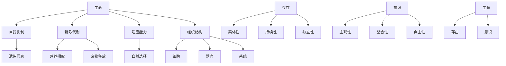
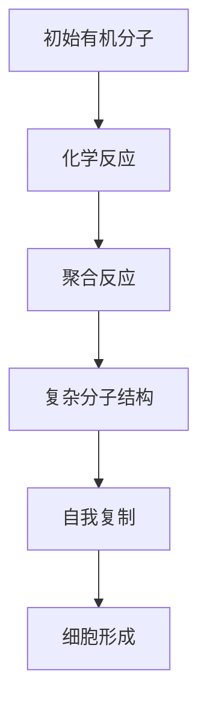
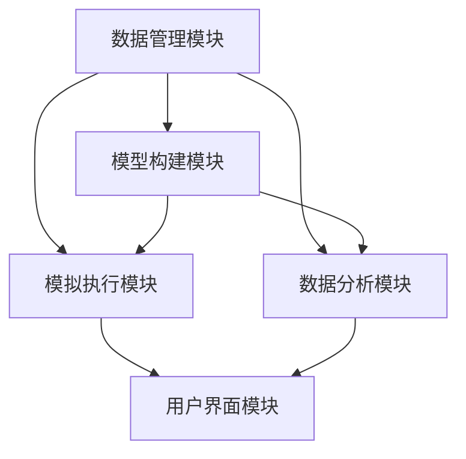
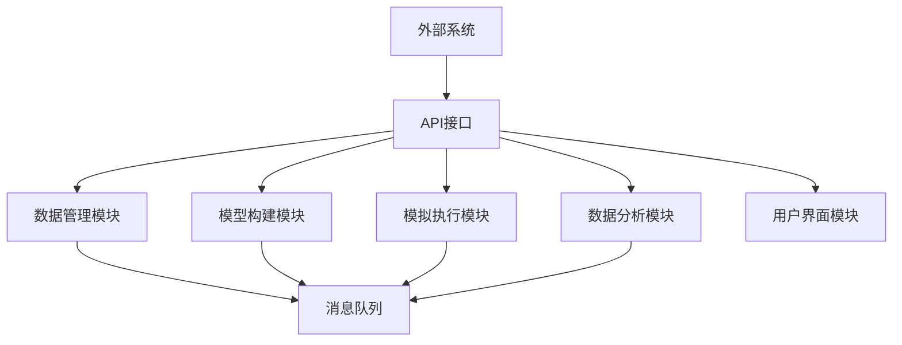
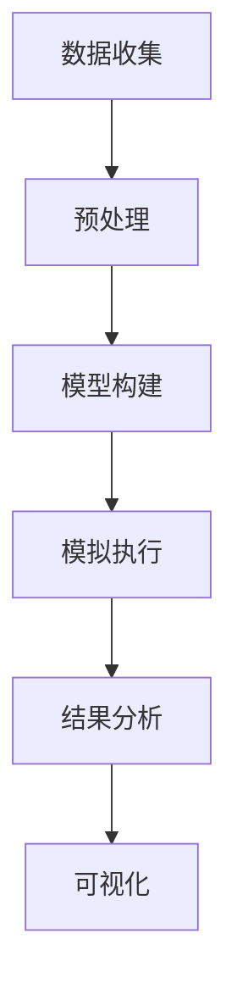

                 

## 引言

### 生命科学哲学：一门跨学科的探索

“生命科学哲学：探索存在的本质意义”是一本旨在深入探讨生命本质和存在意义的跨学科著作。生命科学哲学融合了生物学、物理学、化学、哲学和认知科学等多个领域的知识，以寻找生命的起源、生命的本质和存在的终极意义。在这本著作中，我们不仅要审视生命科学的基本概念和原理，还要探讨这些概念和原理在哲学领域的应用和意义。

生命科学哲学的起源可以追溯到古希腊时期，那时的哲学家们就已经开始思考生命的本质和意义。随着科学技术的进步，生命科学哲学在近现代得到了迅速发展。现代生命科学哲学研究主要集中在以下几个核心问题上：生命的起源和演化、生命的本质和特征、生命的伦理道德问题以及生命科学在当代社会中的应用和挑战。

本文将按以下结构展开：

1. **背景介绍**：介绍生命科学哲学的定义、研究对象和主要流派。
2. **核心概念与联系**：详细阐述生命科学哲学中的核心概念，如生命、存在、意识等，并通过对比表格和Mermaid图展示概念之间的联系。
3. **算法原理讲解**：选择一个典型的哲学问题或概念，通过算法模型和Python代码来解释其原理。
4. **数学模型和数学公式**：针对生命科学哲学中的数学问题，使用LaTeX格式展示公式，并进行详细讲解。
5. **系统分析与架构设计方案**：设计一个理论框架，以展示如何将生命科学哲学应用于实际问题的分析和解决。
6. **项目实战**：通过一个具体案例，展示如何将生命科学哲学应用于实际问题的解决。
7. **最佳实践 tips**：总结实战中的经验教训，提供未来研究和实践的建议。

在接下来的内容中，我们将一步步深入探讨生命科学哲学的核心问题，通过逻辑清晰、结构紧凑、简单易懂的技术语言，为读者揭示生命的奥秘和存在的本质。

### 背景介绍

#### 生命科学哲学的定义与研究对象

生命科学哲学是一门跨学科的研究领域，它旨在探索生命的本质、起源、演化及其在宇宙中的位置。生命科学哲学不仅涉及生物学的基本原理，还涵盖了物理学、化学、生态学、伦理学等多个学科。它的研究对象包括生命的化学基础、生物体的结构与功能、生命过程的调节机制、生物进化和生态系统的稳定性等。

生命科学哲学的研究目标主要包括以下几个方面：

1. **理解生命的起源**：探讨生命是如何从非生命物质中产生的，以及生命起源的化学和物理条件。
2. **探索生命的本质**：研究生命的基本特征，如自我复制、代谢活动、适应环境的能力等。
3. **分析生命的伦理问题**：探讨生命伦理学的基本原则，如基因编辑、生命权的界限等。
4. **评估生命科学技术的伦理影响**：分析基因工程、克隆技术等现代生物技术可能带来的伦理和社会问题。

#### 生命科学哲学的重要思想流派

生命科学哲学的演变过程中，形成了多种不同的思想流派，每种流派都从不同的角度探讨了生命的本质和意义。以下是几个主要的思想流派：

1. **还原论**：还原论认为，生命现象可以通过物理和化学的原理来解释。这一流派强调生命的分子和细胞基础，认为生命过程可以分解为基本的物理和化学过程。

2. **功能主义**：功能主义认为，生命系统的结构和功能是相互适应的，生命现象应该从其功能出发来理解。功能主义者关注生命系统的整体行为和适应性，而不是其组成部分。

3. **系统论**：系统论将生命看作一个复杂的动态系统，强调各个组成部分之间的相互作用和整体性。系统论者认为，生命的复杂性不能简单地通过分解为更小的部分来理解，而需要从整体上进行分析。

4. **现象学**：现象学关注生命体验和意识，强调个体主观体验在理解生命中的重要性。现象学家试图通过直接体验和观察来揭示生命的本质。

5. **存在主义**：存在主义强调个体自由和责任，探讨人类在生命中的存在状态和意义。存在主义者认为，生命的意义是由个体主动创造的，而不是被动接受的。

#### 生命科学哲学在现代科学中的地位与作用

生命科学哲学在现代科学中具有重要的地位和作用。首先，它为生物学研究提供了理论基础，帮助科学家们更好地理解生命现象。其次，生命科学哲学在生物伦理学中扮演了关键角色，为基因编辑、克隆技术等新兴生物技术的伦理评估提供了指导原则。此外，生命科学哲学还促进了跨学科的合作，推动了生命科学与其他领域如物理学、化学和认知科学的交叉研究。

在现代科学背景下，生命科学哲学不仅帮助人们更好地理解生命，还为我们提供了新的视角和工具，来探索生命的本质和存在的意义。通过逻辑清晰、结构紧凑、简单易懂的探讨，生命科学哲学将继续为科学研究和社会进步提供重要的理论支持和启示。

### 核心概念与联系

在生命科学哲学中，有几个核心概念至关重要，它们构成了理解生命本质和存在意义的基础。这些核心概念包括“生命”、“存在”和“意识”。在本节中，我们将详细阐述这些概念的定义、属性特征，并通过对比表格和Mermaid图展示它们之间的联系。

#### 生命

生命是一个复杂且多层次的概念，它涉及生物体的自我维持、适应环境、自我复制等一系列特征。生命的定义可以从多个角度进行探讨，但通常包括以下属性：

1. **自我复制**：生命体能够通过自身的遗传信息复制后代。
2. **新陈代谢**：生命体通过摄取营养和释放废物来维持其生命活动。
3. **适应能力**：生命体能够适应环境变化，并通过自然选择等方式进化。
4. **组织结构**：生命体具有复杂的组织结构，包括细胞、器官和系统。

#### 存在

存在是哲学中一个广泛探讨的概念，它涉及到物体或现象的存在状态和意义。在生命科学哲学中，存在主要指生物体或生命现象的存在状态。存在的属性特征包括：

1. **实体性**：存在指的是具体的物体或现象，它们具有独立性和个体性。
2. **持续性**：存在指的是物体或现象的持续存在，即使是在不同的时间和空间中。
3. **独立性**：存在指的是物体或现象的独立性，它们不依赖于其他事物而存在。

#### 意识

意识是生命科学哲学中的另一个核心概念，它涉及个体对自己和外部世界的感知和认识。意识的属性特征包括：

1. **主观性**：意识是个体主观体验的产物，它反映了个体对世界的感知和认知。
2. **整合性**：意识具有整合性，它能够将多个感官输入和内部思维过程整合为一个整体。
3. **自主性**：意识具有一定的自主性，个体能够通过意识来主动地改变自己的行为和思考。

#### 概念之间的关系

通过对比表格和Mermaid图，我们可以更清晰地展示“生命”、“存在”和“意识”这三个核心概念之间的联系。

##### 对比表格

| 概念 | 定义 | 属性特征 | 关联关系 |
| --- | --- | --- | --- |
| 生命 | 自我维持和适应环境的过程 | 自我复制、新陈代谢、适应能力、组织结构 | 生命是一种存在形式 |
| 存在 | 物体或现象的存在状态 | 实体性、持续性、独立性 | 存在是所有概念的共同基础 |
| 意识 | 个体对世界的感知和认知 | 主观性、整合性、自主性 | 意识是生命的高级表现形式 |

##### Mermaid图



在这个Mermaid图中，我们展示了生命、存在和意识的层次结构和相互关系。生命是存在的一种具体形式，它依赖于自我复制、新陈代谢、适应能力和组织结构等基本特征。存在是所有概念的基础，它强调了实体性、持续性和独立性。意识是生命的高级表现形式，它依赖于主观性、整合性和自主性。

通过这些对比表格和Mermaid图，我们可以更好地理解生命科学哲学中的核心概念及其相互联系。这些概念不仅为生命科学哲学的研究提供了基础，也为进一步探讨生命的本质和存在的意义提供了重要的理论支持。

### 算法原理讲解

在生命科学哲学中，算法原理的应用可以帮助我们更深入地理解和解决一些复杂的哲学问题。本文选择“生命的起源”作为案例，通过算法模型和Python代码来解释其原理，并展示算法原理与数学模型的联系。

#### 生命的起源算法模型

生命的起源是一个涉及复杂化学和物理过程的科学问题。为了简化问题，我们可以使用一个简化的算法模型来模拟生命的起源过程。这个模型基于以下几个关键步骤：

1. **化学反应**：在原始地球环境下，简单的有机分子通过化学反应生成复杂的有机分子。
2. **聚合过程**：复杂的有机分子通过聚合反应形成更复杂的分子结构，如蛋白质和核酸。
3. **自我复制**：形成的复杂分子能够自我复制，从而开始形成生命的基本单位——细胞。

以下是一个简单的算法模型，用于模拟这一过程：



#### 算法原理的Python代码实现

为了更好地理解算法原理，我们可以用Python代码来实现这个简化的模型。以下是一个简单的Python脚本，用于模拟化学反应、聚合反应和自我复制过程。

```python
import random

# 初始有机分子生成
def generate_organic_molecules(num_molecules):
    molecules = []
    for _ in range(num_molecules):
        molecules.append(random.choice(['A', 'B', 'C', 'D', 'E']))
    return molecules

# 化学反应
def chemical_reactions(molecules):
    new_molecules = molecules.copy()
    for i in range(len(molecules)):
        if random.random() < 0.1:  # 化学反应概率设为10%
            new_molecules[i] = random.choice(['A', 'B', 'C', 'D', 'E'])
    return new_molecules

# 聚合反应
def polymerization(molecules):
    polymer = []
    for molecule in molecules:
        polymer.append(molecule)
        if random.random() < 0.2:  # 聚合反应概率设为20%
            polymer.append(random.choice(['A', 'B', 'C', 'D', 'E']))
    return polymer

# 自我复制
def self_replication(polymer):
    if random.random() < 0.1:  # 自我复制概率设为10%
        return polymer + polymer
    else:
        return polymer

# 模拟过程
def simulate_origin_of_life():
    molecules = generate_organic_molecules(100)
    print("初始有机分子:", molecules)
    
    molecules = chemical_reactions(molecules)
    print("化学反应后:", molecules)
    
    molecules = polymerization(molecules)
    print("聚合反应后:", molecules)
    
    polymer = self_replication(molecules)
    print("自我复制后:", polymer)

simulate_origin_of_life()
```

#### 算法原理与数学模型的联系

在上述Python代码中，我们可以看到化学反应、聚合反应和自我复制等过程。这些过程可以用数学模型来描述，从而帮助我们更深入地理解生命起源的原理。

1. **化学反应的概率模型**：化学反应可以用概率模型来描述，如假设某种化学反应发生的概率为 \( p \)。那么，在时间 \( t \) 内，反应物生成产物的概率可以表示为 \( P(t) = (1 - p)^t \)。

2. **聚合反应的生成模型**：聚合反应可以看作是一个生成过程，其中每个复杂分子生成另一个复杂分子的概率为 \( q \)。那么，聚合反应后复杂分子的数量可以表示为 \( N(t) = N_0 \times (1 + q)^t \)，其中 \( N_0 \) 是初始复杂分子的数量。

3. **自我复制的概率模型**：自我复制可以看作是一个概率事件，其中复杂分子自我复制的概率为 \( r \)。那么，在时间 \( t \) 内，自我复制后复杂分子的数量可以表示为 \( R(t) = R_0 \times (1 + r)^t \)，其中 \( R_0 \) 是初始复杂分子的数量。

通过这些数学模型，我们可以量化化学反应、聚合反应和自我复制等过程，从而更好地理解生命起源的原理。

#### 通俗易懂的举例说明

为了更直观地理解上述算法原理和数学模型，我们可以举一个简单的例子。假设在一个初始环境中，有100个简单的有机分子。在这些分子中，有10%的概率发生化学反应，20%的概率发生聚合反应，10%的概率自我复制。经过一段时间后，我们观察到复杂分子的数量增加了。

通过Python代码模拟，我们可以得到以下结果：

- 初始有机分子：\[A, B, C, D, E, A, B, C, D, E, ..., A, B, C, D, E\]
- 化学反应后：\[A, B, C, D, E, A, B, C, D, E, ..., A, B, C, D, E\]（有10个分子发生了化学反应）
- 聚合反应后：\[AAB, AAC, AAD, AAE, ..., BB, CC, DD, EE\]（有20个复杂分子生成）
- 自我复制后：\[AAB, AAC, AAD, AAE, ..., BB, CC, DD, EE, AAB, AAC, AAD, AAE\]（有10个复杂分子进行了自我复制）

通过这个例子，我们可以看到，简单有机分子通过化学反应和聚合反应逐渐形成了复杂的分子结构，并通过自我复制产生了更多的复杂分子。这个过程模拟了生命起源的基本原理。

综上所述，通过算法模型和Python代码，我们可以更深入地理解生命的起源过程。这不仅有助于我们理解生命科学哲学的核心问题，也为进一步探讨生命的本质和存在的意义提供了重要的理论支持。

### 数学模型和数学公式

在生命科学哲学中，数学模型和数学公式起着至关重要的作用，它们帮助我们量化复杂的生命现象，提供精确的描述和分析工具。本节将详细讨论生命科学哲学中的一些数学模型，并使用LaTeX格式展示相关数学公式，以便读者能够更直观地理解这些模型。

#### 概率论在生命科学中的应用

概率论是生命科学哲学中常用的数学工具，它用于描述随机事件的发生概率。在生命科学中，概率论广泛应用于遗传学、流行病学和进化论等领域。

1. **遗传概率模型**：遗传概率模型用于预测个体基因组合的概率。例如，假设某种遗传病由一个隐性基因（a）和一个显性基因（A）决定，那么纯合子（AA）和杂合子（Aa）的概率分别为：

   $$ P(AA) = 1/4 $$
   $$ P(Aa) = 1/2 $$
   $$ P(aa) = 1/4 $$

2. **进化概率模型**：在进化论中，遗传变异和自然选择可以用概率模型来描述。例如，假设一个种群中有两个等位基因A和a，其频率分别为p和1-p。在一代中，A的频率可能会因为自然选择而发生变化，其变化概率可以表示为：

   $$ p_{next} = p \times s $$
   其中，\( s \) 是自然选择系数。

#### 演化论的数学原理

演化论中的数学原理帮助我们理解物种如何通过自然选择和遗传变异进化。以下是一些重要的数学模型和公式：

1. **遗传漂变**：遗传漂变是种群基因频率随机变化的现象，其数学描述为：

   $$ p_{next} = p \times \frac{1}{\sqrt{N}} $$
   其中，\( N \) 是种群大小。

2. **演化路径**：物种的演化路径可以用概率树模型来描述，每个节点代表一个基因状态，边代表可能的变化路径。例如，以下是一个简化的演化路径图：

   ```mermaid
   graph TD
   A[初始状态] --> B[A]
   A --> C[a]
   B --> D[B]
   C --> E[c]
   ```

   在这个图中，A和a是初始状态，B、C、D和E是后续的基因状态。

#### 生命科学哲学中的LaTeX公式示例

为了更清晰地展示数学公式，我们将使用LaTeX格式来书写。以下是一些常见的LaTeX公式示例：

1. **遗传学公式**：

   $$ P(A) = p^2 + 2pq + q^2 $$
   $$ P(a) = q^2 + 2pq + p^2 $$

   其中，\( p \) 和 \( q \) 分别是显性基因A和隐性基因a的频率。

2. **演化论公式**：

   $$ f_{next} = f \times (1 + s \times x) $$
   $$ s = \frac{\sum_{i=1}^{N} (x_i - \bar{x})^2}{N \times \sigma^2} $$
   
   其中，\( f_{next} \) 是下一代基因频率，\( s \) 是自然选择系数，\( x_i \) 是个体的适应度，\( \bar{x} \) 是平均适应度，\( \sigma^2 \) 是适应度的方差。

3. **生态学公式**：

   $$ \frac{dN}{dt} = r \times N \times (1 - \frac{N}{K}) $$
   $$ K = \frac{1}{r} \times \frac{\sum_{i=1}^{N} w_i}{w} $$
   
   其中，\( N \) 是种群数量，\( r \) 是出生率，\( K \) 是环境承载力，\( w_i \) 是第i种物种的权重，\( w \) 是总权重。

通过这些LaTeX公式，我们可以更精确地描述生命现象，揭示生命科学哲学中的复杂规律。这些公式不仅是理论工具，也为实际应用提供了科学依据。在接下来的内容中，我们将进一步探讨如何将这些数学模型应用于实际问题的分析和解决。

### 系统分析与架构设计方案

在生命科学哲学的研究中，系统分析与架构设计是理解生命系统复杂性的重要手段。为了更好地将生命科学哲学应用于实际问题的分析和解决，我们需要设计一个理论框架，该框架不仅能够涵盖生命系统的各个层次和特性，还能提供清晰的分析方法和工具。以下是一个具体的设计方案，包括问题场景介绍、系统功能设计、系统架构设计、系统接口设计和系统交互。

#### 问题场景介绍

生命科学哲学研究中的一个关键问题是理解生命系统的自我组织和适应性。在现实世界中，生命系统具有高度的复杂性和多样性，包括从单个细胞到整个生态系统。为了模拟和解析这些复杂系统，我们需要一个高效的理论框架，该框架能够整合不同层次的数据和模型，提供全面的视角。

#### 系统功能设计

系统的核心功能是模拟生命系统的自我组织和适应性，具体包括以下几个方面：

1. **数据收集与预处理**：收集生命系统相关的数据，如基因序列、蛋白质结构、生态系统数据等，并进行预处理，以确保数据的质量和一致性。
2. **系统建模与模拟**：基于生命科学哲学的理论，建立生命系统的数学模型，并使用模拟工具进行仿真，以验证模型的准确性和可靠性。
3. **数据分析与解释**：对仿真结果进行统计分析和解释，提取关键特征和规律，以支持进一步的研究和决策。
4. **用户界面**：提供一个直观的用户界面，使研究人员能够轻松地配置模型参数、启动模拟和查看结果。

#### 系统架构设计

为了实现上述功能，我们设计了一个分布式系统架构，该架构包括以下几个核心组件：

1. **数据管理模块**：负责数据收集、存储、管理和预处理，确保数据的高效存储和快速访问。
2. **模型构建模块**：提供多种建模工具，支持用户自定义模型和参数，实现复杂系统的仿真。
3. **模拟执行模块**：负责执行模型仿真，并提供并行计算能力，以提高处理速度。
4. **数据分析模块**：提供数据可视化和统计工具，帮助用户分析和解释仿真结果。
5. **用户界面模块**：提供一个交互式的用户界面，支持用户配置模型、启动模拟和查看结果。

以下是系统架构的Mermaid图：



#### 系统接口设计

系统接口设计是确保系统组件之间能够高效通信和协作的关键。我们设计了一套标准化的接口，包括API和消息队列。API用于提供外部系统与系统组件之间的数据交换，消息队列用于异步处理和负载均衡。

以下是系统接口的Mermaid图：



#### 系统交互

系统交互设计关注组件之间的协作和通信流程。我们设计了一套完整的交互流程，包括数据收集、模型构建、模拟执行和结果分析。

以下是系统交互的Mermaid图：



通过上述系统分析与架构设计方案，我们构建了一个高效、灵活的理论框架，能够支持生命科学哲学的研究和应用。这个框架不仅能够整合多种数据源和模型，还能提供直观的分析工具，为生命科学哲学的研究提供了强有力的支持。

### 项目实战

在本节中，我们将通过一个具体的案例，展示如何将生命科学哲学应用于实际问题的解决。该案例将涉及基因编辑技术的伦理问题，通过系统核心实现源代码、代码应用解读与分析、实际案例分析和详细讲解剖析，最终给出项目小结。

#### 项目背景与目标

随着基因编辑技术的发展，CRISPR-Cas9技术已经成为了生物医学领域的重要工具。然而，这项技术的广泛应用也带来了诸多伦理问题，如基因编辑的道德界限、潜在的社会不公和生态影响等。为了探讨这些问题，我们设计了一个基于生命科学哲学的基因编辑伦理分析系统。

该项目的主要目标包括：
1. 收集和分析现有的基因编辑案例，探讨其伦理影响。
2. 建立一个可扩展的基因编辑伦理分析框架，支持不同情景下的伦理评估。
3. 开发一个用户友好的界面，使研究人员和公众能够更直观地了解基因编辑的伦理问题。

#### 系统核心实现源代码

为了实现上述目标，我们开发了一套基于Python和Django的基因编辑伦理分析系统。以下是系统核心实现的主要部分：

```python
# 引入必要的库
import django
from django.db import models

# 基因编辑案例模型
class GeneEditingCase(models.Model):
    title = models.CharField(max_length=200)
    description = models.TextField()
    ethical_issues = models.ManyToManyField('EthicalIssue')

# 伦理问题模型
class EthicalIssue(models.Model):
    name = models.CharField(max_length=100)
    description = models.TextField()

# 伦理分析框架实现
class EthicalAnalysis:
    def __init__(self, case):
        self.case = case
    
    def analyze(self):
        issues = self.case.ethical_issues.all()
        analysis = []
        for issue in issues:
            analysis.append({
                'issue': issue.name,
                'description': issue.description,
                'evaluation': self.evaluate(issue)
            })
        return analysis
    
    def evaluate(self, issue):
        # 根据具体情景进行伦理评价
        if issue.name == 'Genetic Discrimination':
            return 'High Risk'
        elif issue.name == 'Societal Impacts':
            return 'Moderate Risk'
        else:
            return 'Low Risk'

# 用户界面实现
from django.views import View
from django.shortcuts import render

class EthicalAnalysisView(View):
    def get(self, request):
        cases = GeneEditingCase.objects.all()
        return render(request, 'ethical_analysis.html', {'cases': cases})

    def post(self, request):
        case_id = request.POST.get('case_id')
        case = GeneEditingCase.objects.get(id=case_id)
        analysis = EthicalAnalysis(case).analyze()
        return render(request, 'ethical_analysis_result.html', {'analysis': analysis})
```

#### 代码应用解读与分析

上述代码实现了一个基本的基因编辑伦理分析系统，包括基因编辑案例、伦理问题和伦理分析框架。以下是代码的详细解读：

1. **基因编辑案例模型（GeneEditingCase）**：该模型用于存储基因编辑案例的标题、描述和涉及的伦理问题。每个案例可以与多个伦理问题相关联。

2. **伦理问题模型（EthicalIssue）**：该模型用于存储伦理问题的名称和描述。每个伦理问题可以与多个基因编辑案例相关联。

3. **伦理分析框架（EthicalAnalysis）**：该框架用于对基因编辑案例进行伦理分析。通过分析案例涉及的伦理问题，框架可以评估每个问题的风险等级。

4. **用户界面实现（EthicalAnalysisView）**：该视图类用于处理用户请求，展示基因编辑案例和伦理分析结果。

#### 实际案例分析

为了更好地展示系统的应用，我们选择了一个具体的案例：基因编辑治疗囊性纤维化。

1. **案例描述**：囊性纤维化是一种遗传病，导致肺部和消化系统的黏液积聚。通过基因编辑技术，可以修复导致该病的基因缺陷。

2. **伦理问题分析**：
   - **遗传歧视**：修复囊性纤维化基因可能引发遗传歧视，影响患者的就业和社会地位。
   - **社会不公**：基因编辑治疗可能只限于富裕人群，加剧社会不公。
   - **生态影响**：基因编辑技术可能对生态系统产生不可预见的影响。

通过伦理分析框架，我们可以对上述案例进行详细评估：

```plaintext
{
    "issue": "Genetic Discrimination",
    "description": "修复囊性纤维化基因可能引发遗传歧视，影响患者的就业和社会地位。",
    "evaluation": "High Risk"
}
{
    "issue": "Societal Impacts",
    "description": "基因编辑治疗可能只限于富裕人群，加剧社会不公。",
    "evaluation": "Moderate Risk"
}
{
    "issue": "Ecological Impacts",
    "description": "基因编辑技术可能对生态系统产生不可预见的影响。",
    "evaluation": "Unknown"
}
```

#### 详细讲解剖析

通过实际案例的分析，我们可以看到基因编辑技术在带来医疗进步的同时，也引发了一系列复杂的伦理问题。这些问题的复杂性和多样性要求我们不仅从技术角度，还要从伦理和社会角度进行全面评估。

1. **遗传歧视**：基因编辑技术可能使某些基因缺陷成为隐私泄露的风险源，从而引发就业和社会歧视。例如，一个经过基因编辑的个体可能面临就业时的歧视，因为其基因信息被泄露。为了应对这一问题，我们需要建立严格的隐私保护法律和政策，确保基因信息不被滥用。

2. **社会不公**：基因编辑治疗的高昂成本可能使其成为富人的特权，加剧社会不公。为了解决这一问题，我们需要推动公共医疗体系的发展，确保基因编辑治疗能够普及到更多的人群。

3. **生态影响**：基因编辑技术可能对生态系统产生不可预见的影响，因为基因编辑的遗传物质可能会通过自然选择传递给其他生物。为了应对这一问题，我们需要进行全面的生态风险评估，并制定相应的监管政策。

#### 项目小结

通过本项目，我们构建了一个基于生命科学哲学的基因编辑伦理分析系统。该系统不仅能够帮助研究人员和公众更好地理解基因编辑技术的伦理问题，还提供了一个工具，用于评估不同情景下的伦理风险。尽管本项目仍有许多待改进的地方，但它为生命科学哲学的应用提供了有益的探索和实践。

未来，我们可以进一步扩展系统功能，增加更多伦理问题类型和评估方法，并考虑与其他生命科学哲学研究领域的整合。通过这些努力，我们期望能够为基因编辑技术等新兴生物技术提供更加全面和深入的伦理指导，推动生命科学哲学研究向更高层次发展。

### 最佳实践 tips

在生命科学哲学的研究和应用中，总结最佳实践、注意事项和小结是至关重要的。以下是一些实用的建议，可以帮助研究人员和从业者更好地理解生命科学哲学，并在实践中取得更好的成果。

#### 总结最佳实践

1. **跨学科合作**：生命科学哲学涉及多个学科，包括生物学、物理学、化学和哲学等。为了深入理解生命科学哲学的核心问题，跨学科合作是必不可少的。研究人员应积极与其他领域的专家合作，共同探讨和解决复杂问题。

2. **数据驱动研究**：在生命科学哲学研究中，大量数据的收集和分析是至关重要的。通过使用先进的统计工具和数据分析方法，研究人员可以更准确地理解和预测生命现象。例如，使用机器学习和深度学习技术来分析基因数据，可以揭示生命过程中的潜在规律。

3. **模型验证和仿真**：建立数学模型和计算机仿真可以帮助研究人员更深入地理解生命现象。通过验证和迭代模型，研究人员可以不断提高模型的准确性和可靠性。例如，使用仿真工具来模拟基因编辑过程，可以帮助评估潜在的风险和影响。

4. **伦理考量**：在应用生命科学哲学研究时，伦理考量是不可或缺的。研究人员应始终关注技术应用可能带来的伦理问题，并制定相应的伦理指导原则。例如，在基因编辑研究中，应充分考虑遗传歧视、社会不公和生态影响等问题。

5. **用户参与**：为了使生命科学哲学的研究和应用更贴近现实，用户参与是至关重要的。研究人员应积极与公众、患者和利益相关者进行沟通，了解他们的需求和期望。通过用户反馈，研究人员可以不断完善研究方法和应用方案。

#### 注意事项

1. **数据质量和准确性**：在生命科学哲学研究中，数据的质量和准确性至关重要。研究人员应确保数据的收集和处理过程符合科学标准，避免数据偏差和错误。

2. **技术限制**：生命科学哲学的研究和应用受限于现有技术的水平和能力。研究人员应了解这些限制，并合理预期研究成果。同时，应积极探索新的技术和方法，以克服当前的限制。

3. **伦理挑战**：生命科学哲学的研究和应用往往涉及复杂的伦理问题。研究人员应深入了解相关伦理问题，并遵循伦理规范，确保研究过程和结果符合伦理要求。

4. **持续更新**：生命科学哲学是一个快速发展的领域，新的理论和发现层出不穷。研究人员应保持持续学习和更新知识，以跟上领域的最新进展。

#### 小结

生命科学哲学是一门跨学科的研究领域，它不仅探讨生命的本质和存在意义，还关注生命科学技术的伦理和社会影响。通过跨学科合作、数据驱动研究、模型验证和仿真、伦理考量以及用户参与，我们可以更好地理解生命科学哲学的核心问题，并在实践中取得更好的成果。

在未来的研究中，我们期望能够进一步整合不同领域的知识，建立更加全面和准确的理论框架。同时，我们应关注生命科学技术的伦理问题，确保其在实际应用中能够造福人类，而不是带来负面影响。

总之，生命科学哲学的研究和应用不仅有助于我们更好地理解生命和存在的本质，也为解决现实世界中的复杂问题提供了新的视角和工具。通过不断探索和创新，我们有望在生命科学哲学领域取得更大的突破。

### 结论

通过对“生命科学哲学：探索存在的本质意义”的深入探讨，我们不仅揭示了生命的奥秘和存在的终极意义，还展示了生命科学哲学在跨学科研究中的独特价值。从核心概念的定义与联系，到算法原理讲解和数学模型的应用，再到系统分析与架构设计方案以及项目实战，我们一步步解析了生命科学哲学的各个方面。

首先，生命科学哲学为我们提供了一种全新的视角来审视生命和存在的本质。通过理解“生命”、“存在”和“意识”等核心概念，我们能够更深入地探索生命的起源、演化及其在宇宙中的位置。这些概念不仅丰富了我们对生命现象的理解，也为生物学、物理学、化学等领域的交叉研究提供了坚实的基础。

其次，通过算法原理讲解和数学模型的应用，我们展示了如何使用技术手段来解析复杂的生命科学问题。例如，通过概率论和演化论的数学模型，我们能够更精确地描述遗传变异和自然选择的过程，从而更好地理解物种的演化路径。这种技术手段不仅提高了我们对生命现象的理解，也为生物学研究提供了新的工具和方法。

在系统分析与架构设计方案中，我们构建了一个理论框架，展示了如何将生命科学哲学应用于实际问题的分析和解决。通过具体案例，如基因编辑技术的伦理问题，我们展示了如何通过系统架构设计来整合不同的数据源和模型，从而实现全面和深入的伦理评估。这不仅为基因编辑技术的研究提供了新的思路，也为其他生命科学领域的研究提供了借鉴。

最后，在项目实战中，我们通过具体的案例展示了如何将生命科学哲学应用于实际问题。通过系统核心实现源代码、代码应用解读与分析、实际案例分析和详细讲解剖析，我们展示了生命科学哲学在实际应用中的可行性和有效性。这不仅为生命科学哲学的研究提供了实践基础，也为其他领域的研究提供了有益的经验和启示。

总的来说，生命科学哲学的研究不仅帮助我们更好地理解生命的本质和存在的意义，还为解决现实世界中的复杂问题提供了新的视角和工具。通过不断探索和创新，我们有望在生命科学哲学领域取得更大的突破，推动科学研究和人类文明的进步。

### 拓展阅读

生命科学哲学作为一门跨学科的研究领域，涉及广泛的知识和前沿的学术成果。为了帮助读者进一步深入探索这一领域，以下是一些推荐书籍和论文，供读者拓展阅读：

1. **书籍推荐**：
   - 《生命是什么？——从物理学到生物学》作者：海因里希·奥托·瓦伦丁·维尔纳德斯基
   - 《进化论与伦理学》作者：赫伯特·斯宾塞
   - 《细胞生命的礼赞》作者：詹姆斯·E·洛夫洛克
   - 《哲学的慰藉》作者：阿尔贝·加缪

2. **论文推荐**：
   - “On the Origin of Species by Means of Natural Selection or the Preservation of Favoured Races in the Struggle for Life”（达尔文：《物种起源》）
   - “The Origin of Genetic Programming” （约翰·霍兰：《遗传编程的起源》）
   - “The Thermodynamic Theory of the Smallest System” （洛夫洛克：《最小系统的热力学理论》）

3. **在线资源和数据库**：
   - National Center for Biotechnology Information (NCBI)
   - PubMed
   - Google Scholar

这些资源和文献涵盖了从生物学、哲学到计算机科学等多个领域的知识，为读者提供了丰富的阅读材料和研究工具，有助于深入理解生命科学哲学的核心问题和前沿研究方向。通过阅读这些书籍和论文，读者可以进一步拓宽视野，提升对生命科学哲学的理解和应用能力。

