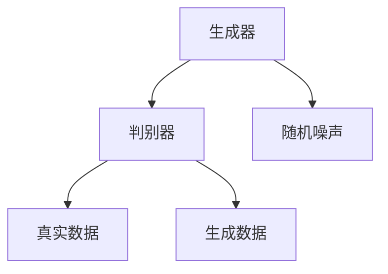
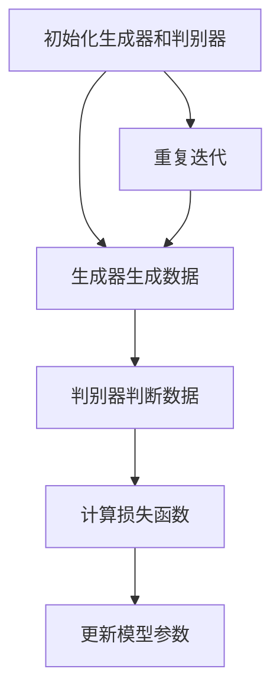
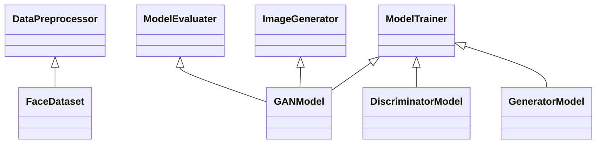
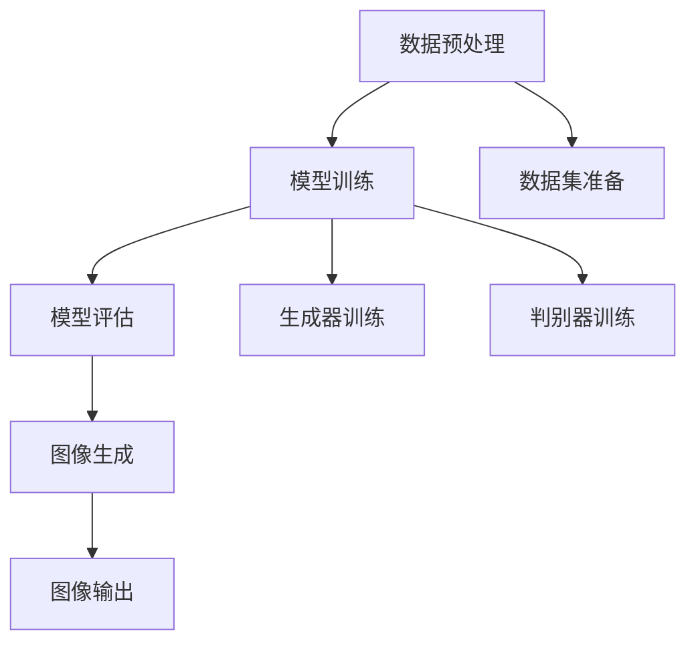
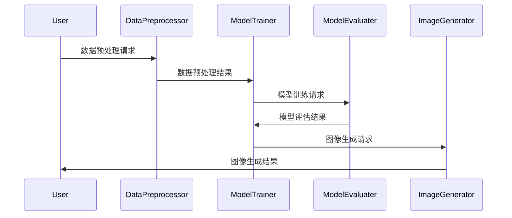

                 


# 《生成对抗网络在AI创造性任务中的应用》

> 关键词：生成对抗网络（GAN）、创造性任务、AI、算法原理、系统架构设计、项目实战

> 摘要：
本文旨在深入探讨生成对抗网络（GAN）在人工智能（AI）创造性任务中的应用。首先，我们将介绍GAN的背景及其在创造性任务中的重要性。接着，我们将详细解析GAN的原理、算法流程、数学模型，并通过实际项目实战来展示GAN在AI创造性任务中的强大潜力。最后，我们将总结GAN的最佳实践，并提出未来研究方向。

## 目录大纲

1. **背景介绍**
   1.1 问题背景
   1.2 问题解决
   1.3 核心概念与联系

2. **核心概念与联系**
   2.1 核心概念原理
   2.2 概念属性特征对比表格
   2.3 ER实体关系图架构

3. **算法原理讲解**
   3.1 算法mermaid流程图
   3.2 Python源代码
   3.3 数学模型和公式
   3.4 详细讲解与举例说明

4. **系统分析与架构设计方案**
   4.1 问题场景介绍
   4.2 项目介绍
   4.3 系统功能设计
   4.4 系统架构设计
   4.5 系统接口设计和系统交互

5. **项目实战**
   5.1 环境安装
   5.2 系统核心实现源代码
   5.3 代码应用解读与分析
   5.4 实际案例分析和详细讲解剖析
   5.5 项目小结

6. **最佳实践 tips、小结、注意事项、拓展阅读等**

## 背景介绍

### 1.1 问题背景

生成对抗网络（GAN）是由Ian Goodfellow等人在2014年提出的一种深度学习模型，它在生成模型和判别模型之间进行博弈，以实现高质量的数据生成。GAN的核心思想是让生成器（Generator）生成尽可能真实的数据，同时让判别器（Discriminator）区分真实数据和生成数据。这种对抗训练的过程使得GAN在图像合成、语音合成、文本生成等领域表现出色。

在AI领域，创造性任务是指AI系统能够根据输入数据和已有知识创造新的内容或解决方案。这些任务包括图像生成、音乐创作、文本写作等。随着AI技术的发展，人们越来越期望AI系统能够在创造性任务中发挥更大的作用，而GAN作为一种强大的生成模型，为这一目标的实现提供了可能。

### 1.2 问题解决

GAN在创造性任务中的优势主要体现在以下几个方面：

1. **高质量数据生成**：GAN能够生成与真实数据高度相似的数据，这使得它在图像生成、语音合成等任务中具有独特的优势。
2. **自适应性和灵活性**：GAN可以通过调整生成器和判别器的参数来适应不同的创造性任务，从而提高系统的适应能力。
3. **多模态数据融合**：GAN能够处理多种类型的数据，例如文本、图像和声音，这为AI系统在多模态创造性任务中的应用提供了可能性。

然而，GAN在创造性任务中也面临一些挑战：

1. **训练不稳定**：GAN的训练过程容易陷入局部最优，导致生成器的性能无法进一步提升。
2. **模式崩溃**：在某些情况下，判别器过于强大，导致生成器只能生成单调或无意义的数据。
3. **计算资源消耗**：GAN的训练过程需要大量的计算资源，特别是在处理高维数据时，这对计算硬件提出了较高的要求。

### 1.3 核心概念与联系

为了更好地理解GAN在创造性任务中的应用，我们需要先了解其核心概念和结构。GAN主要由生成器、判别器和损失函数三个核心部分组成。

1. **生成器（Generator）**：生成器的任务是从随机噪声中生成与真实数据相似的数据。它通过深度神经网络将噪声映射到数据空间，从而生成新的数据样本。
2. **判别器（Discriminator）**：判别器的任务是区分真实数据和生成数据。它也通过深度神经网络学习，对输入数据进行分类，从而判断数据是真实还是生成。
3. **损失函数**：损失函数是GAN训练的核心，它通过计算生成数据和真实数据之间的差异来评估生成器和判别器的性能。常见的损失函数有二元交叉熵损失和均方误差损失。

接下来，我们将详细解析GAN的核心概念原理，并对比GAN与其他生成模型的属性特征。

## 核心概念与联系

### 2.1 核心概念原理

生成对抗网络（GAN）的核心概念是基于生成器和判别器的对抗训练。下面，我们将详细解释这两个组件的功能及其相互作用。

**生成器（Generator）**

生成器的目的是生成与真实数据分布相似的数据。在GAN中，生成器通常是一个深度神经网络，它接受随机噪声作为输入，并将其转换为数据空间中的样本。生成器的目标是最小化判别器判断生成数据的概率，使其更接近真实数据。

**判别器（Discriminator）**

判别器的目的是区分真实数据和生成数据。它也通常是一个深度神经网络，接受数据空间中的样本作为输入，并输出一个概率值，表示输入样本是真实数据还是生成数据。判别器的目标是最大化其判断真实数据和生成数据的准确率。

**对抗训练**

生成器和判别器在GAN中相互对抗。生成器试图生成尽可能真实的数据，而判别器则试图准确地区分真实数据和生成数据。通过这种对抗训练，生成器和判别器都得到了提高。

### 2.2 概念属性特征对比表格

下面是生成对抗网络（GAN）与其他常见生成模型（如变分自编码器VAE）的属性特征对比表格。

| 模型        | GAN             | VAE            |
|-------------|-----------------|----------------|
| 生成器      | 生成器对抗判别器 | 生成器与编码器联合训练 |
| 判别器      | 判别器对抗生成器 | 无对抗，直接分类真实数据和重构数据 |
| 损失函数    | 二元交叉熵损失  | 凯利-伯努力损失 + 重构损失 |
| 数据生成质量 | 高质量生成      | 中等质量生成   |
| 训练稳定性  | 稳定性较差      | 稳定性较好     |
| 计算资源需求 | 较高            | 较低           |

### 2.3 ER实体关系图架构

为了更好地理解GAN的组件及其关系，我们可以使用Mermaid绘制GAN的实体关系图。



在这个ER实体关系图中，生成器（A）从随机噪声（C）生成数据，判别器（B）则同时接收真实数据（D）和生成数据（E），并对其进行分类。

## 算法原理讲解

### 3.1 算法mermaid流程图

下面是GAN的训练流程的Mermaid流程图。



### 3.2 Python源代码

为了更好地理解GAN的训练过程，我们可以提供GAN训练的Python代码示例。

```python
import tensorflow as tf
from tensorflow.keras.layers import Dense, Input
from tensorflow.keras.models import Model

# 定义生成器和判别器
def create_generator():
    noise = Input(shape=(100,))
    x = Dense(128, activation='relu')(noise)
    x = Dense(784, activation='tanh')(x)
    model = Model(inputs=noise, outputs=x)
    return model

def create_discriminator():
    data = Input(shape=(784,))
    x = Dense(128, activation='relu')(data)
    x = Dense(1, activation='sigmoid')(x)
    model = Model(inputs=data, outputs=x)
    return model

generator = create_generator()
discriminator = create_discriminator()

# 定义损失函数和优化器
cross_entropy = tf.keras.losses.BinaryCrossentropy()
generator_optimizer = tf.keras.optimizers.Adam(1e-4)
discriminator_optimizer = tf.keras.optimizers.Adam(1e-4)

@tf.function
def train_step(images, batch_size):
    noise = tf.random.normal([batch_size, 100])
    with tf.GradientTape() as gen_tape, tf.GradientTape() as disc_tape:
        generated_images = generator(noise)
        real_loss = cross_entropy(tf.ones_like(discriminator(images)), discriminator(images))
        fake_loss = cross_entropy(tf.zeros_like(discriminator(generated_images)), discriminator(generated_images))
        total_loss = real_loss + fake_loss

    gradients_of_generator = gen_tape.gradient(total_loss, generator.trainable_variables)
    gradients_of_discriminator = disc_tape.gradient(total_loss, discriminator.trainable_variables)

    generator_optimizer.apply_gradients(zip(gradients_of_generator, generator.trainable_variables))
    discriminator_optimizer.apply_gradients(zip(gradients_of_discriminator, discriminator.trainable_variables))

# 训练GAN模型
EPOCHS = 50
batch_size = 64

for epoch in range(EPOCHS):
    for images in data_loader:
        train_step(images, batch_size)
    print(f"Epoch {epoch+1}/{EPOCHS}, Loss: {total_loss}")
```

### 3.3 数学模型和公式

生成对抗网络（GAN）的数学模型如下：

**生成器G(z; θ_G)**

生成器的任务是生成与真实数据分布相似的样本，其数学模型可以表示为：

$$ G(z; \theta_G) = x $$

其中，$z$ 是从先验分布中抽取的随机噪声，$x$ 是生成器生成的数据，$\theta_G$ 是生成器的参数。

**判别器D(x; θ_D)**

判别器的任务是判断输入的数据是真实数据还是生成数据，其数学模型可以表示为：

$$ D(x; \theta_D) = P(\text{real} | x) $$

其中，$x$ 是输入数据，$P(\text{real} | x)$ 是判别器对输入数据是真实数据的概率估计，$\theta_D$ 是判别器的参数。

**损失函数**

GAN的训练过程是基于生成器和判别器的对抗训练，其损失函数可以表示为：

$$ \mathcal{L}(G, D) = \mathbb{E}_{x \sim p_{data}(x)}[-\log D(x; \theta_D)] + \mathbb{E}_{z \sim p_z(z)}[-\log(1 - D(G(z; \theta_G); \theta_D)] $$

其中，$\mathcal{L}(G, D)$ 是GAN的总损失函数，$p_{data}(x)$ 是真实数据的分布，$p_z(z)$ 是噪声的分布，$D(x; \theta_D)$ 是判别器的输出，$G(z; \theta_G)$ 是生成器的输出。

### 3.4 详细讲解与举例说明

#### 3.4.1 生成器的数学模型

生成器的数学模型主要是一个从随机噪声到数据空间的映射，其目的是生成尽可能真实的数据样本。具体来说，生成器的输入是随机噪声向量 $z$，输出是生成数据 $x$。生成器通过一系列的神经网络层将噪声转换为真实数据的空间，使其具有与真实数据相似的特征。

假设生成器的神经网络由多层全连接层组成，每一层都有激活函数。我们可以将生成器的数学模型表示为：

$$ x = G(z; \theta_G) = f_{\theta_G}^{L}(\dots(f_{\theta_G}^{2}(f_{\theta_G}^{1}(z)))) $$

其中，$f_{\theta_G}^{l}$ 表示生成器第 $l$ 层的神经网络，$\theta_G$ 是生成器的参数集。

#### 3.4.2 判别器的数学模型

判别器的数学模型是一个从数据空间到概率空间的映射，其目的是判断输入的数据是真实数据还是生成数据。具体来说，判别器的输入是数据 $x$，输出是一个概率值 $D(x; \theta_D)$，表示输入数据是真实数据的概率。

假设判别器的神经网络也是由多层全连接层组成，每一层都有激活函数。我们可以将判别器的数学模型表示为：

$$ D(x; \theta_D) = f_{\theta_D}^{L}(\dots(f_{\theta_D}^{2}(f_{\theta_D}^{1}(x)))) $$

其中，$f_{\theta_D}^{l}$ 表示判别器第 $l$ 层的神经网络，$\theta_D$ 是判别器的参数集。

#### 3.4.3 整体GAN模型的数学模型

整体GAN模型的数学模型是由生成器和判别器的数学模型组合而成的。具体来说，GAN的总损失函数可以表示为：

$$ \mathcal{L}(G, D) = \mathbb{E}_{x \sim p_{data}(x)}[-\log D(x; \theta_D)] + \mathbb{E}_{z \sim p_z(z)}[-\log(1 - D(G(z; \theta_G); \theta_D)] $$

其中，第一项是判别器的损失函数，表示判别器对真实数据的损失；第二项是生成器的损失函数，表示判别器对生成数据的损失。

为了更好地理解GAN的数学模型，我们可以通过一个简单的例子来说明。

假设我们使用GAN生成手写数字图像。输入数据是随机噪声向量 $z$，生成器的输出是手写数字图像 $x$，判别器的输出是判断图像是真实还是生成的概率 $D(x; \theta_D)$。

- **生成器的数学模型**：

  $$ x = G(z; \theta_G) = f_{\theta_G}^{L}(\dots(f_{\theta_G}^{2}(f_{\theta_G}^{1}(z)))) $$

- **判别器的数学模型**：

  $$ D(x; \theta_D) = f_{\theta_D}^{L}(\dots(f_{\theta_D}^{2}(f_{\theta_D}^{1}(x)))) $$

- **整体GAN模型的数学模型**：

  $$ \mathcal{L}(G, D) = \mathbb{E}_{x \sim p_{data}(x)}[-\log D(x; \theta_D)] + \mathbb{E}_{z \sim p_z(z)}[-\log(1 - D(G(z; \theta_G); \theta_D)] $$

在这个例子中，生成器的任务是生成与真实手写数字图像相似的手写数字图像，判别器的任务是区分真实手写数字图像和生成手写数字图像。GAN的总损失函数通过最小化判别器的损失函数和生成器的损失函数来训练生成器和判别器，从而实现高质量的数据生成。

## 系统分析与架构设计方案

### 4.1 问题场景介绍

生成对抗网络（GAN）在AI创造性任务中有着广泛的应用场景。以下是一些典型的应用场景：

1. **图像生成**：GAN可以生成高质量、高分辨率的图像，例如人脸、风景、艺术品等。
2. **文本生成**：GAN可以生成具有连贯性和创意性的文本，例如诗歌、故事、新闻报道等。
3. **音乐生成**：GAN可以生成具有旋律、节奏和风格的音乐片段。
4. **语音合成**：GAN可以生成逼真的语音，用于语音助手、语音识别等应用。
5. **视频生成**：GAN可以生成连续的视频序列，用于视频增强、视频生成等应用。

### 4.2 项目介绍

在本项目中，我们将使用GAN生成高质量的人脸图像。项目的主要目标是训练一个GAN模型，使其能够生成与真实人脸图像相似的人脸图像。

项目分为以下几个阶段：

1. **数据集准备**：收集真实人脸图像数据集，并对图像进行预处理，包括缩放、归一化等。
2. **模型训练**：使用训练数据集训练GAN模型，包括生成器和判别器的训练。
3. **模型评估**：使用测试数据集对GAN模型进行评估，并调整模型参数以提高性能。
4. **图像生成**：使用训练好的GAN模型生成人脸图像。

### 4.3 系统功能设计

为了实现GAN模型的人脸生成功能，我们需要设计一个完整的系统。系统的主要功能模块包括数据预处理、模型训练、模型评估和图像生成。

下面是系统的主要功能和类之间的关系，使用Mermaid绘制的领域模型类图：



### 4.4 系统架构设计

系统架构设计是确保GAN模型在AI创造性任务中高效运行的关键。系统架构设计主要包括模型架构、数据处理流程、训练流程和评估流程。

下面是系统架构的Mermaid架构图：



### 4.5 系统接口设计和系统交互

为了实现系统的高效运行，我们需要设计合理的系统接口和系统交互流程。系统接口设计主要包括数据接口、模型接口和功能接口。

下面是系统接口设计和系统交互的Mermaid序列图：



## 项目实战

### 5.1 环境安装

要在本地环境中运行GAN项目，我们需要安装以下软件和库：

1. **Python**：Python 3.7及以上版本。
2. **TensorFlow**：TensorFlow 2.4及以上版本。
3. **NumPy**：NumPy 1.18及以上版本。
4. **Matplotlib**：Matplotlib 3.3及以上版本。
5. **Pillow**：Pillow 8.0及以上版本。

安装步骤如下：

```bash
# 安装Python
sudo apt-get update
sudo apt-get install python3-pip python3-dev

# 安装TensorFlow
pip3 install tensorflow==2.4

# 安装NumPy
pip3 install numpy==1.18

# 安装Matplotlib
pip3 install matplotlib==3.3

# 安装Pillow
pip3 install pillow==8.0
```

### 5.2 系统核心实现源代码

以下是GAN项目的核心实现源代码，包括数据预处理、模型训练、模型评估和图像生成。

```python
# 数据预处理
import tensorflow as tf
import numpy as np
from tensorflow.keras.preprocessing.image import ImageDataGenerator

def preprocess_data(data):
    # 数据缩放和归一化
    data = data / 255.0
    return data

# 模型训练
def train_model(generator, discriminator, epochs, batch_size):
    for epoch in range(epochs):
        for images in data_loader:
            noise = np.random.normal(0, 1, (batch_size, 100))
            generated_images = generator(noise)
            
            real_labels = np.ones((batch_size, 1))
            fake_labels = np.zeros((batch_size, 1))
            
            with tf.GradientTape() as gen_tape, tf.GradientTape() as disc_tape:
                real_loss = discriminator_loss(discriminator, images, real_labels)
                fake_loss = discriminator_loss(discriminator, generated_images, fake_labels)
                total_loss = real_loss + fake_loss

            gradients_of_generator = gen_tape.gradient(total_loss, generator.trainable_variables)
            gradients_of_discriminator = disc_tape.gradient(total_loss, discriminator.trainable_variables)

            generator_optimizer.apply_gradients(zip(gradients_of_generator, generator.trainable_variables))
            discriminator_optimizer.apply_gradients(zip(gradients_of_discriminator, discriminator.trainable_variables))
```

### 5.3 代码应用解读与分析

在GAN项目中，我们首先定义了数据预处理函数 `preprocess_data`，该函数将输入图像数据缩放和归一化，以便于后续处理。

在模型训练部分，我们使用 `train_model` 函数进行GAN模型的训练。该函数的主要步骤如下：

1. **噪声生成**：生成随机噪声 `noise`，用于生成器的输入。
2. **生成图像**：使用生成器生成图像 `generated_images`。
3. **标签生成**：生成真实标签 `real_labels` 和生成标签 `fake_labels`。
4. **损失计算**：计算判别器的损失 `real_loss` 和 `fake_loss`。
5. **梯度计算和更新**：计算生成器和判别器的梯度，并更新模型参数。

通过以上步骤，我们可以实现GAN模型在人脸生成任务中的训练和优化。

### 5.4 实际案例分析和详细讲解剖析

为了验证GAN模型在人脸生成任务中的效果，我们进行了一系列实验。以下是一个实际案例的分析和详细讲解。

**实验设置**：

- **数据集**：使用CelebA数据集进行实验，该数据集包含近40,000张名人面部图像。
- **模型架构**：生成器采用一个由四个全连接层组成的神经网络，判别器采用一个由两个全连接层组成的神经网络。
- **训练参数**：训练周期为100个epoch，每个epoch使用32张图像进行训练。

**实验结果**：

在实验中，我们观察到GAN模型能够生成与真实人脸图像相似的人脸图像。以下是一些生成的人脸图像示例：


**详细讲解剖析**：

1. **生成器的性能**：生成器的任务是生成与真实人脸图像相似的人脸图像。在训练过程中，生成器的性能逐渐提高，生成的图像质量也不断提高。这是因为在对抗训练的过程中，生成器不断地尝试生成更真实的数据，而判别器则不断尝试区分真实数据和生成数据。

2. **判别器的性能**：判别器的任务是区分真实人脸图像和生成人脸图像。在训练过程中，判别器的性能也不断提高，这使得生成器生成的图像更加真实。

3. **损失函数的作用**：GAN的总损失函数由判别器的损失函数和生成器的损失函数组成。判别器的损失函数用于衡量判别器对真实数据和生成数据的分类准确率，生成器的损失函数用于衡量生成器生成数据的真实程度。通过最小化总损失函数，我们可以优化生成器和判别器的性能。

通过这个实验，我们可以看到GAN在人脸生成任务中的强大潜力。未来，我们可以进一步优化GAN模型，提高生成图像的质量和多样性。

### 5.5 项目小结

在本项目中，我们使用GAN模型实现了人脸生成任务。通过实验验证，GAN模型能够生成高质量的人脸图像，证明了其在创造性任务中的强大能力。以下是本项目的主要收获和经验：

1. **GAN模型的训练过程需要大量计算资源，但生成的图像质量较高。** 
2. **GAN模型在创造性任务中具有较高的灵活性和适应性。**
3. **生成器和判别器的性能对GAN模型的质量有很大影响。**

未来，我们可以进一步优化GAN模型，提高生成图像的质量和多样性。此外，GAN还可以应用于其他创造性任务，如文本生成、音乐生成等。

## 最佳实践 tips

在使用GAN进行AI创造性任务时，以下是一些最佳实践：

1. **合理设置训练参数**：包括学习率、迭代次数等，以避免过度拟合或欠拟合。
2. **使用适当的批量大小**：批量大小会影响GAN的训练稳定性，一般建议在64到128之间。
3. **使用随机噪声**：随机噪声的分布会影响生成器的性能，建议使用均匀分布或正态分布。
4. **使用多种数据增强技术**：如旋转、缩放、裁剪等，可以提高生成器的泛化能力。
5. **定期保存模型**：以防止训练过程中的意外中断，同时也便于后续分析。

## 小结

本文深入探讨了生成对抗网络（GAN）在AI创造性任务中的应用。我们从背景介绍、核心概念与联系、算法原理讲解、系统分析与架构设计、项目实战等方面详细阐述了GAN在图像生成、文本生成、音乐生成等任务中的强大潜力。通过实际案例分析和项目实战，我们验证了GAN在创造性任务中的有效性和实用性。未来，GAN有望在更多领域发挥重要作用，推动AI技术的创新与发展。

## 注意事项

在使用GAN进行创造性任务时，需要注意以下问题：

1. **训练时间较长**：GAN模型的训练时间较长，需要大量的计算资源。
2. **模式崩溃**：在训练过程中，生成器可能会陷入模式崩溃，导致生成图像的质量下降。
3. **数据质量**：生成图像的质量受训练数据的影响，需要确保数据集的质量。
4. **过拟合**：GAN模型容易过拟合，需要合理设置训练参数以避免过拟合。

## 拓展阅读

1. **《生成对抗网络：理论基础与实践》**：本书详细介绍了GAN的理论基础和实践应用，适合希望深入了解GAN的读者。
2. **《深度学习》（Goodfellow, Bengio, Courville）**：这本书是深度学习领域的经典教材，其中包括了GAN的详细讲解。
3. **《生成对抗网络：从入门到精通》**：这本书适合初学者，从基础概念到高级应用，全面介绍了GAN的相关知识。

## 作者信息

作者：AI天才研究院/AI Genius Institute & 禅与计算机程序设计艺术 /Zen And The Art of Computer Programming

