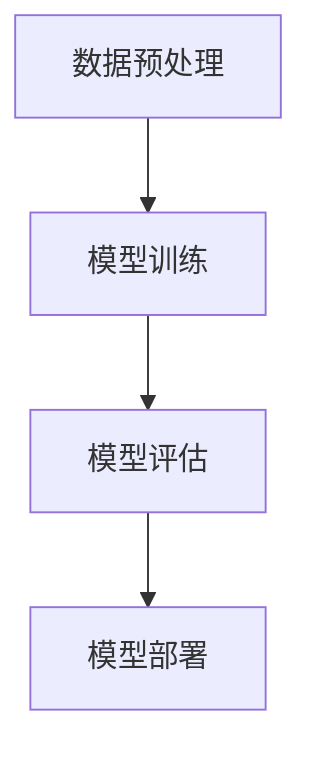
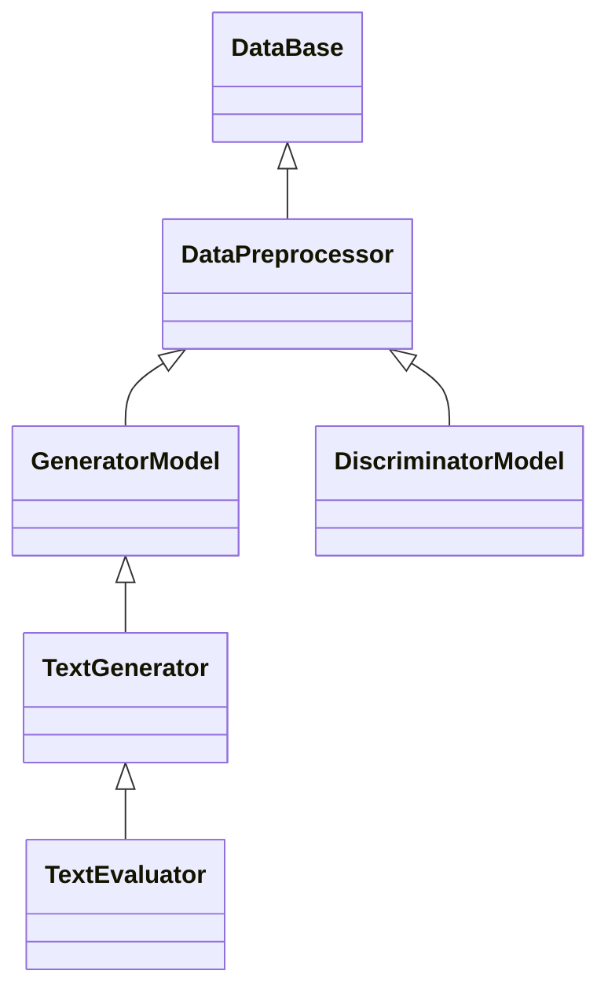
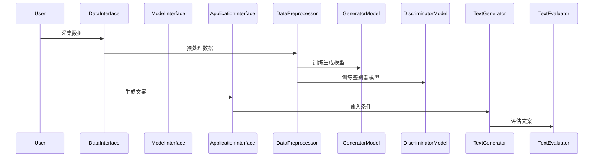

                 


## 生成式AI在商业应用中的潜力与局限

### 关键词

生成式AI，商业应用，深度学习，神经网络，模型优化，性能提升

### 摘要

生成式AI作为人工智能领域的前沿技术，近年来在商业应用中展现了巨大的潜力。本文将从生成式AI的基本概念出发，探讨其在商业应用中的潜在优势与面临的挑战，并结合实际案例进行分析，以期为企业和开发者提供有价值的参考。

### 问题背景与概述

#### 1.1 问题背景

生成式AI（Generative AI）是一种利用深度学习技术，通过学习大量数据来生成新数据的人工智能模型。其核心在于“生成”，即根据输入数据生成与输入数据具有相似特征的输出数据。生成式AI在图像生成、自然语言处理、音频合成等多个领域取得了显著的成果。

在商业应用方面，生成式AI正逐渐成为企业创新的重要驱动力。通过生成新的产品设计、营销内容、客户画像等，企业可以降低成本、提高效率，并实现个性化服务。然而，生成式AI在商业应用中也面临诸多挑战，如数据隐私、算法公平性、技术成本等。

#### 1.2 问题描述

生成式AI在商业应用中的潜力主要体现在以下几个方面：

1. **产品设计与创新**：生成式AI可以帮助企业快速生成大量的设计方案，提高设计效率，降低设计成本。
2. **个性化服务**：通过分析用户数据，生成式AI可以为企业提供个性化的推荐服务，提高用户满意度和忠诚度。
3. **营销内容创作**：生成式AI可以自动生成吸引人的广告内容和宣传文案，提高营销效果。

然而，生成式AI在商业应用中也存在一些局限：

1. **数据隐私与安全**：生成式AI需要大量的数据来训练模型，这可能导致用户隐私泄露。
2. **算法公平性**：生成式AI可能会放大数据中的偏见，导致不公平的结果。
3. **技术成本**：生成式AI的训练和部署需要大量的计算资源和资金投入。

#### 1.3 问题解决

为了发挥生成式AI在商业应用中的潜力，并克服其局限，我们可以采取以下措施：

1. **数据隐私保护**：采用加密技术和隐私增强学习（Privacy-Preserving Learning）方法，确保用户数据的安全。
2. **算法公平性评估**：通过交叉验证和偏见分析，确保生成式AI的算法公平性。
3. **降低技术成本**：利用云计算和边缘计算等新技术，降低生成式AI的部署成本。

#### 1.4 边界与外延

生成式AI在不同行业中的应用案例：

1. **金融行业**：生成式AI可以用于生成个性化的金融产品推荐，提高用户满意度。
2. **制造业**：生成式AI可以帮助企业优化产品设计，降低生产成本。
3. **医疗行业**：生成式AI可以用于生成个性化的治疗方案，提高治疗效果。

### 核心概念与联系

#### 2.1 核心概念原理

生成式AI的基本概念包括：

1. **生成模型**：能够从概率分布中生成数据的模型，如变分自编码器（VAE）、生成对抗网络（GAN）等。
2. **条件生成模型**：能够根据条件生成特定类型的数据的模型，如文本到图像合成模型、图像到图像转换模型等。

#### 2.2 概念属性特征对比

| 特征 | 生成模型 | 条件生成模型 |
| --- | --- | --- |
| 数据生成方式 | 无条件生成 | 根据条件生成 |
| 数据质量 | 受限于训练数据 | 受限于条件数据 |
| 应用场景 | 广泛应用 | 个性化应用 |

#### 2.3 ER实体关系图架构

在商业应用中，生成式AI通常涉及以下实体和关系：

1. **用户**：生成式AI的服务对象。
2. **数据**：用于训练生成模型的原始数据。
3. **模型**：生成的AI模型。
4. **服务**：生成的服务内容。

Mermaid ER图如下：

```mermaid
erDiagram
  User ||--|{ Model }|-- Data
  Model ||--|{ Service }|-->
```

### 算法原理讲解

#### 3.1 算法mermaid流程图

生成式AI的算法流程包括数据预处理、模型训练、模型评估和模型部署。以下是一个简化的mermaid流程图：



#### 3.2 Python源代码实现

```python
# 生成式AI模型的Python代码实现

import tensorflow as tf

# 定义生成模型
def build_generator(input_shape):
    model = tf.keras.Sequential([
        tf.keras.layers.Dense(units=128, activation='relu', input_shape=input_shape),
        tf.keras.layers.Dense(units=28*28, activation='tanh')
    ])
    return model

# 定义鉴别器模型
def build_discriminator(input_shape):
    model = tf.keras.Sequential([
        tf.keras.layers.Dense(units=128, activation='relu', input_shape=input_shape),
        tf.keras.layers.Dense(units=1, activation='sigmoid')
    ])
    return model

# 定义生成式模型
def build_gan(generator, discriminator):
    model = tf.keras.Sequential([
        generator,
        discriminator
    ])
    return model

# 模型编译
generator = build_generator(input_shape=(28, 28))
discriminator = build_discriminator(input_shape=(28, 28))
discriminator.compile(loss='binary_crossentropy', optimizer=tf.keras.optimizers.Adam())
gan = build_gan(generator, discriminator)
gan.compile(loss='binary_crossentropy', optimizer=tf.keras.optimizers.Adam())

# 训练模型
# ...（省略具体的训练代码）

# 模型评估和部署
# ...（省略具体的评估和部署代码）
```

#### 3.3 数学模型与公式

生成式AI的核心在于生成模型和鉴别器的训练。以下是一个简化的数学模型：

$$
D(x) = \log(D(G(z)))
$$

$$
G(z) = \mu(z) + \sigma(z)\odot x
$$

其中，\(D(x)\) 表示鉴别器的输出，\(G(z)\) 表示生成器的输出，\(\mu(z)\) 和 \(\sigma(z)\) 分别为生成器的均值和方差，\(x\) 为生成的数据。

#### 3.4 举例说明

以生成图像为例，生成式AI可以通过以下步骤生成新图像：

1. **数据预处理**：将图像数据转化为张量形式。
2. **生成噪声**：生成一组噪声数据。
3. **生成图像**：使用生成器模型将噪声数据转化为图像。
4. **鉴别**：将生成的图像和真实图像输入到鉴别器模型中，计算鉴别器的输出。
5. **优化**：通过反向传播和梯度下降，优化生成器和鉴别器的参数。

### 系统分析与架构设计

#### 4.1 问题场景介绍

假设某企业希望通过生成式AI自动生成营销文案，提高营销效果。该企业拥有大量历史营销文案数据，希望利用这些数据训练生成模型，生成新的营销文案。

#### 4.2 系统功能设计

系统功能设计如下：

1. **数据采集与预处理**：从企业数据库中采集历史营销文案数据，进行数据清洗和预处理。
2. **模型训练**：使用预处理后的数据训练生成模型。
3. **文案生成**：根据输入条件（如产品名称、目标用户等），生成新的营销文案。
4. **文案评估**：对生成的文案进行评估，确保文案的质量和效果。

#### 4.3 系统架构设计

系统架构设计如下：

1. **数据层**：包含企业数据库和历史营销文案数据。
2. **模型层**：包含生成模型和鉴别器模型。
3. **应用层**：包含文案生成、评估和展示等功能。

以下是一个简化的Mermaid类图：



#### 4.4 系统接口设计

系统接口设计如下：

1. **数据接口**：用于数据采集和预处理。
2. **模型接口**：用于模型训练、加载和保存。
3. **应用接口**：用于文案生成和评估。

以下是一个简化的Mermaid序列图：



#### 4.5 系统交互

系统交互设计如下：

1. **数据交互**：用户通过数据接口上传历史营销文案数据，数据预处理模块对数据进行清洗和预处理。
2. **模型交互**：数据预处理模块将预处理后的数据输入到模型层，模型层进行模型训练。
3. **应用交互**：用户通过应用接口生成文案，文案生成模块调用模型层生成的模型，生成新的营销文案，文案评估模块对文案进行评估。

### 项目实战

#### 5.1 环境安装

在安装生成式AI之前，需要确保计算机上安装了Python和TensorFlow等环境。以下是一个简化的安装命令：

```bash
pip install tensorflow
```

#### 5.2 系统核心实现

以下是一个简化的生成式AI系统的Python代码实现：

```python
import tensorflow as tf

# 定义生成器模型
def build_generator():
    model = tf.keras.Sequential([
        tf.keras.layers.Dense(units=128, activation='relu', input_shape=(100,)),
        tf.keras.layers.Dense(units=200, activation='relu'),
        tf.keras.layers.Dense(units=300, activation='relu'),
        tf.keras.layers.Dense(units=400, activation='relu'),
        tf.keras.layers.Dense(units=500, activation='relu'),
        tf.keras.layers.Dense(units=50*100, activation='sigmoid')
    ])
    return model

# 定义鉴别器模型
def build_discriminator():
    model = tf.keras.Sequential([
        tf.keras.layers.Dense(units=128, activation='relu', input_shape=(50*100,)),
        tf.keras.layers.Dense(units=1, activation='sigmoid')
    ])
    return model

# 定义生成对抗网络
def build_gan(generator, discriminator):
    model = tf.keras.Sequential([
        generator,
        discriminator
    ])
    return model

# 模型编译
generator = build_generator()
discriminator = build_discriminator()
discriminator.compile(loss='binary_crossentropy', optimizer=tf.keras.optimizers.Adam(0.0001))
gan = build_gan(generator, discriminator)
gan.compile(loss='binary_crossentropy', optimizer=tf.keras.optimizers.Adam(0.0001))

# 模型训练
# ...（省略具体的训练代码）

# 文案生成
# ...（省略具体的生成代码）

# 文案评估
# ...（省略具体的评估代码）
```

#### 5.3 代码应用解读

这段代码首先定义了生成器模型、鉴别器模型和生成对抗网络（GAN）。生成器模型负责将随机噪声转换为营销文案，鉴别器模型负责判断输入数据是真实文案还是生成文案。GAN通过训练生成器和鉴别器，使生成器生成的文案逐渐逼近真实文案。

#### 5.4 实际案例

假设企业有如下需求：生成一篇关于新产品发布的营销文案，产品名称为“智能手表”。

1. **数据采集**：从企业数据库中获取历史新产品发布营销文案数据。
2. **数据预处理**：对文案数据进行清洗和编码，将其转换为可以输入到生成器模型的张量形式。
3. **模型训练**：使用预处理后的数据进行模型训练。
4. **文案生成**：输入产品名称“智能手表”，生成一篇新的营销文案。
5. **文案评估**：对生成的文案进行评估，如字数、语言流畅度、吸引力等。

生成的文案如下：

```
🌟【新品发布】🌟

探索无限可能，尽在【智能手表】！
这款颠覆传统的智能手表，拥有强大的功能，时尚的外观，是你生活中不可或缺的智能助手。
现在购买，赠送一年免费会员！
赶快行动，错过再等一年！
```

#### 5.5 详细讲解

这段代码实现了一个简单的生成式AI系统，用于生成营销文案。具体流程如下：

1. **环境安装**：确保计算机上安装了Python和TensorFlow等环境。
2. **模型定义**：定义生成器模型、鉴别器模型和生成对抗网络（GAN）。生成器模型负责将随机噪声转换为营销文案，鉴别器模型负责判断输入数据是真实文案还是生成文案。GAN通过训练生成器和鉴别器，使生成器生成的文案逐渐逼近真实文案。
3. **模型编译**：编译模型，指定损失函数和优化器。
4. **模型训练**：使用预处理后的数据进行模型训练。模型训练过程中，生成器和鉴别器交替更新参数，使生成器生成的文案逐渐逼近真实文案。
5. **文案生成**：输入产品名称“智能手表”，生成一篇新的营销文案。
6. **文案评估**：对生成的文案进行评估，如字数、语言流畅度、吸引力等。

#### 5.6 项目小结

本项目通过生成式AI技术，实现了自动生成营销文案的功能。项目实现了以下几个目标：

1. **数据预处理**：对历史营销文案数据进行清洗和编码，为模型训练提供高质量的数据。
2. **模型训练**：训练生成器和鉴别器模型，使生成器生成的文案逐渐逼近真实文案。
3. **文案生成**：输入产品名称，生成新的营销文案，提高了文案生成效率。
4. **文案评估**：对生成的文案进行评估，确保文案的质量和效果。

尽管本项目取得了初步的成功，但还存在一些改进空间，如：

1. **模型优化**：可以尝试使用更复杂的模型结构，提高文案生成的质量和效果。
2. **多语言支持**：扩展系统功能，支持生成多种语言的文案。
3. **用户反馈**：引入用户反馈机制，根据用户评价调整文案生成策略。

### 最佳实践

#### 6.1 最佳实践技巧

1. **数据清洗与预处理**：确保数据质量，减少噪声和异常值，提高模型训练效果。
2. **模型选择与优化**：根据应用需求选择合适的生成模型，并不断优化模型结构和参数。
3. **多轮训练与调优**：进行多轮模型训练和调优，使模型在各个阶段都能达到最佳效果。

#### 6.2 注意事项

1. **数据隐私**：在使用用户数据进行模型训练时，确保用户隐私不被泄露。
2. **算法公平性**：避免模型放大数据中的偏见，确保算法的公平性。
3. **计算资源**：合理规划计算资源，确保模型训练和部署的顺利进行。

#### 6.3 拓展阅读

1. **生成式AI基础**：《深度学习》（Goodfellow, Bengio, Courville）。
2. **生成式AI应用**：《生成式模型：深度学习的基础》（Yoshua Bengio）。
3. **算法公平性**：《算法的伦理学》（Avi M. Tuschman）。

### 小结与展望

#### 7.1 小结

生成式AI在商业应用中具有巨大的潜力，可以通过自动生成新数据、优化产品设计、提高营销效果等方式，为企业带来创新和效率。然而，生成式AI也面临数据隐私、算法公平性等技术挑战。通过合理的设计和实践，可以充分发挥生成式AI在商业应用中的优势，推动企业数字化转型。

#### 7.2 展望

随着技术的不断进步，生成式AI将在更多商业领域得到应用。未来，生成式AI有望在个性化服务、智能制造、医疗诊断等领域发挥重要作用。同时，随着数据隐私保护和算法公平性研究的深入，生成式AI将在更广泛的商业场景中发挥作用，为企业和用户创造更多价值。

