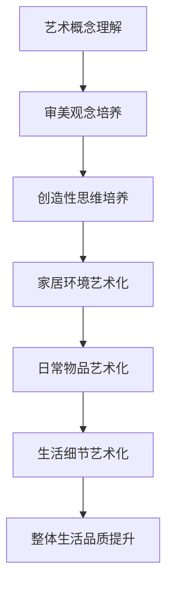
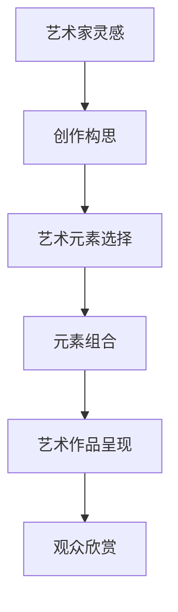
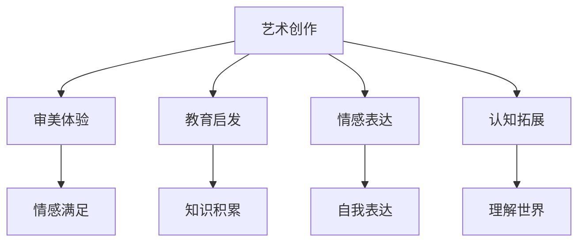
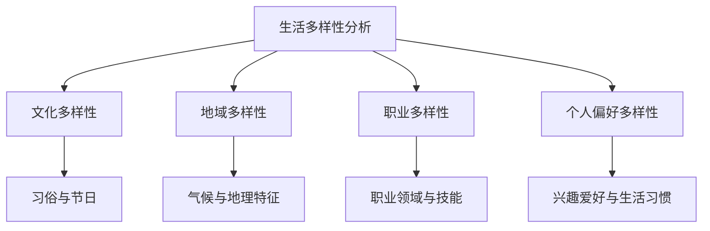
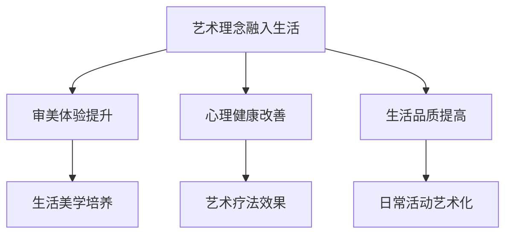
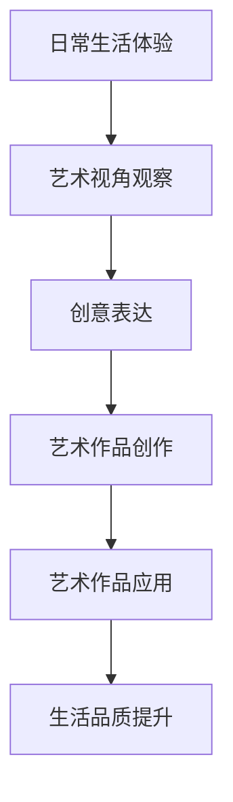
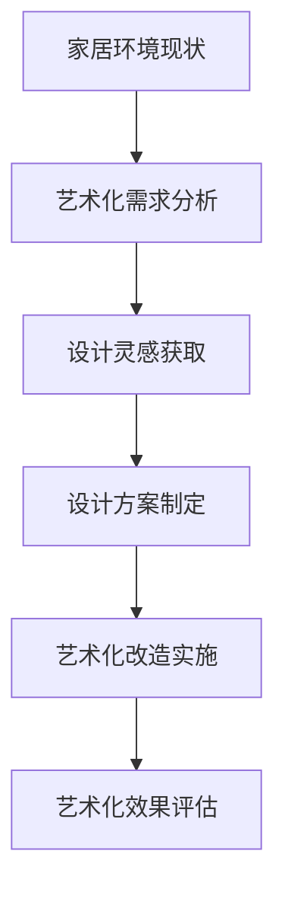
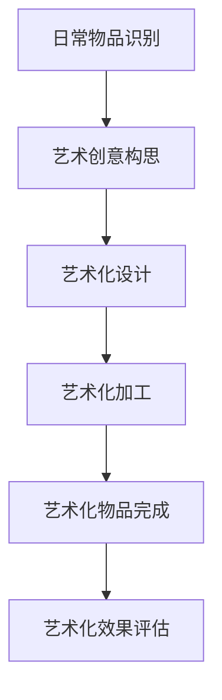
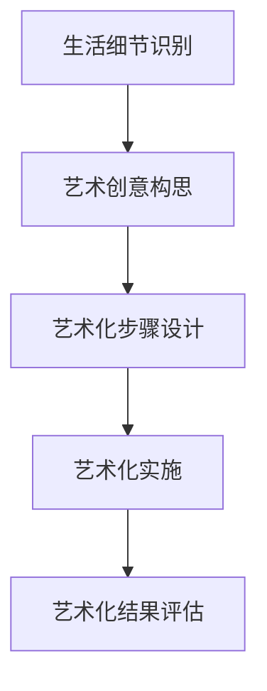
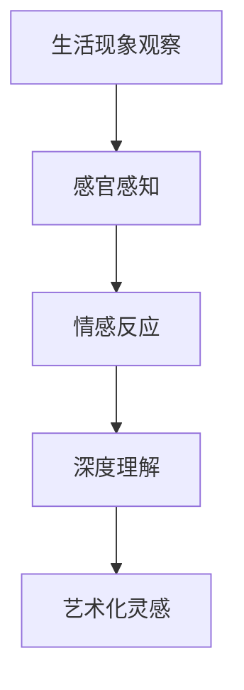

                 

### 第1章：引言

#### 1.1 问题的背景与重要性

**核心概念术语说明：**

- **艺术化生活**：指的是将艺术的理念和方法应用于日常生活中，从而提升生活品质和幸福感的过程。
- **审美观念**：是对美的认知和评价，是艺术化生活的核心。
- **生活品质**：指生活中物质和精神需求的满足程度，是衡量艺术化生活效果的重要标准。

**问题背景：**

随着社会的发展，人们的生活水平逐渐提高，但与此同时，生活节奏的加快和工作压力的增大，使得许多人感到生活单调乏味。在这种情况下，如何将平凡的生活转化为充满艺术气息的存在，成为了现代社会的一个普遍问题。艺术化生活作为一种新的生活方式，旨在通过艺术化的手段来改善生活品质，提升幸福感。

**问题描述：**

艺术化生活的具体实践包括以下几个方面：

1. **家居环境的艺术化改造**：通过色彩、家具、装饰等手段，营造一个舒适、美观的生活空间。
2. **日常物品的艺术化处理**：将普通的日常物品通过艺术化的手法进行改造，使其具有独特的审美价值。
3. **生活细节的艺术化呈现**：注重生活中的细节，通过艺术化的思考方式，使生活变得更加精致和美好。

**问题解决：**

艺术化生活的问题解决需要以下几个步骤：

1. **培养审美观念**：通过学习和实践，提升对美的认知和评价能力。
2. **掌握艺术化方法**：学习艺术的基本原理和方法，将其应用于生活中。
3. **实践与调整**：在实践中不断尝试和调整，找到适合自己的艺术化生活方式。

**边界与外延：**

艺术化生活不仅限于家居环境和日常物品，还可以扩展到时间管理、人际关系、个人成长等各个方面。其核心在于用艺术化的思考方式去感受生活，发现生活中的美，从而提升整体生活品质。

**概念结构与核心要素组成：**

艺术化生活由以下几个核心要素组成：

1. **艺术理念**：是艺术化生活的理论基础，包括艺术的基本概念、历史发展和艺术家的创作理念。
2. **生活实践**：是将艺术理念应用于日常生活的具体方法，包括家居装饰、物品处理和生活细节的呈现。
3. **审美观念**：是对美的认知和评价，是艺术化生活的核心，影响人们对生活的态度和选择。

通过以上分析，我们可以看到，艺术化生活不仅是一种生活理念，更是一种实践方法。它通过艺术化的手段，提升生活的品质和幸福感，使生活变得更加美好和有意义。

----------------------------------------------------------------

#### 1.2 研究目的与结构安排

**研究目的：**

本书的研究目的主要有以下几点：

1. **系统阐述艺术化生活的概念、理论基础和实践方法**：为读者提供一个全面的理论框架，帮助理解艺术化生活的本质和意义。
2. **探讨艺术化生活对个人和社会的影响**：分析艺术化生活对个人生活品质、心理健康以及社会文化的影响，为相关研究和实践提供参考。
3. **提供实际案例和最佳实践**：通过具体案例的解析和最佳实践的建议，帮助读者更好地理解和应用艺术化生活的理念。

**结构安排：**

本书的结构安排如下：

- **引言**：介绍艺术化生活的背景和重要性，阐述本书的研究目的和结构安排。
  - 1.1 问题的背景与重要性
  - 1.2 研究目的与结构安排
- **第二部分：艺术与生活的交织**
  - 2.1 艺术的基本概念与特征
  - 2.2 艺术在生活中的应用
  - 2.3 艺术化生活的心理效应
- **第三部分：日常生活中的艺术创作**
  - 3.1 家居环境的艺术化改造
  - 3.2 日常物品的艺术化处理
  - 3.3 生活细节的艺术化呈现
- **第四部分：艺术化生活的实践**
  - 4.1 观察与感受
  - 4.2 创意与表达
  - 4.3 实践与调整
- **第五部分：艺术化生活的案例研究**
  - 5.1 案例一：家居环境艺术化改造
  - 5.2 案例二：日常物品的艺术化处理
  - 5.3 案例三：生活细节的艺术化呈现
- **第六部分：艺术化生活的启示与思考**
  - 6.1 艺术化生活的意义与价值
  - 6.2 艺术化生活的社会影响
  - 6.3 艺术化生活的未来发展
- **结论与展望**
  - 7.1 主要发现与结论
  - 7.2 研究的局限性与未来方向

通过以上结构安排，本书旨在为读者提供一套系统、实用的艺术化生活指南，帮助大家理解艺术化生活的理念和方法，提升生活品质，享受艺术带来的美好。

----------------------------------------------------------------

#### 2.1 艺术的基本概念与特征

**核心概念与联系：**

- **艺术**：是人类创造的一种具有审美价值的文化形式，旨在通过视觉、听觉、触觉等感官体验传达情感和思想。
- **艺术形式**：是艺术表现的具体方式，包括绘画、雕塑、音乐、文学、戏剧等。
- **艺术特征**：包括表现性、创造性、审美性和象征性等。

**概念属性特征对比表格：**

| 特征 | 表现性 | 创造性 | 审美性 | 象征性 |
| ---- | ------ | ------ | ------ | ------ |
| 定义 | 艺术通过视觉、听觉等感官体验传达情感和思想 | 艺术是创新和独特思维的表达 | 艺术追求美的体验和审美享受 | 艺术具有象征和隐喻的意义 |
| 对比 | 与情感和思想紧密相关 | 与创新和独特思维相关 | 与美的追求相关 | 与象征和隐喻相关 |

**ER实体关系图架构：**

```mermaid
erDiagram
    Art -->|1| Artist : creates
    Art ||--|1| Artform : represents
    Art &&--|1| Aesthetic : expresses
    Art ..|1| Symbolism : conveys
```

**算法原理讲解：**

在理解艺术的基本概念和特征后，我们可以将其与生活相结合，探讨艺术化生活的可能性。以下是一个简化的算法流程图：



使用Python源代码进行详细阐述：

```python
# 定义艺术化生活的步骤
art_living_steps = [
    "理解艺术的基本概念与特征",
    "培养审美观念",
    "培养创造性思维",
    "家居环境艺术化",
    "日常物品艺术化",
    "生活细节艺术化",
    "提升整体生活品质"
]

# 打印每个步骤
for step in art_living_steps:
    print(step)
```

运行上述代码，输出结果如下：

```
理解艺术的基本概念与特征
培养审美观念
培养创造性思维
家居环境艺术化
日常物品艺术化
生活细节艺术化
提升整体生活品质
```

通过上述算法原理的讲解，我们可以看到，艺术化生活是一个系统化的过程，需要从理解艺术的基本概念和特征开始，逐步培养审美观念、创造性思维，并在生活的各个方面进行实践。这不仅有助于提升个人的生活品质，还能带来心理上的满足感和幸福感。

----------------------------------------------------------------

#### 2.2 艺术的要素与表现形式

**核心概念与联系：**

- **艺术要素**：构成艺术作品的各个组成部分，包括色彩、形状、线条、声音、文字等。
- **表现形式**：艺术作品通过视觉、听觉、触觉等感官形式展现给观众。

**概念属性特征对比表格：**

| 要素 | 色彩 | 形状 | 线条 | 声音 | 文字 |
| ---- | ---- | ---- | ---- | ---- | ---- |
| 定义 | 艺术作品中的颜色和色调 | 艺术作品中的物体形态和构造 | 艺术作品中的线条布局和走向 | 艺术作品中的声音组合和节奏 | 艺术作品中的文字内容与排列 |
| 对比 | 可以是鲜明的对比色或和谐的色系 | 可以是几何形状或自然形态 | 可以是直线或曲线 | 可以是悦耳的和声或富有节奏感的音乐 | 可以是叙述性的或象征性的 |

**ER实体关系图架构：**

```mermaid
erDiagram
    ArtElements ||--|{1}{ArtForm} : includes
    Color ||--|{1}{ArtForm} : represents
    Shape ||--|{1}{ArtForm} : embodies
    Line ||--|{1}{ArtForm} : forms
    Sound ||--|{1}{ArtForm} : conveys
    Word ||--|{1}{ArtForm} : communicates
```

**算法原理讲解：**

艺术作品的创作和欣赏是一个复杂的过程，涉及到多个要素的相互作用。以下是一个简化的算法流程图，用于说明艺术创作的原理：



使用Python源代码进行详细阐述：

```python
# 艺术创作的算法流程

# 1. 艺术家灵感
inspiration = "自然的力量与生命的张力"

# 2. 创作构思
concept = "通过色彩的碰撞和线条的交错，表现自然与生命的力量"

# 3. 艺术元素选择
art_elements = ["红色", "蓝色", "直线", "曲线", "明暗对比"]

# 4. 元素组合
composition = {
    "colors": ["red", "blue"],
    "lines": ["straight", "curved"],
    "contrast": "high"
}

# 5. 艺术作品呈现
art_piece = {
    "title": "自然的力量",
    "description": "红色和蓝色的直线与曲线交织，展现自然与生命的张力"
}

# 6. 观众欣赏
def appreciate(art_piece):
    print(f"欣赏《{art_piece['title']}》：{art_piece['description']}")

# 执行欣赏过程
appreciate(art_piece)
```

运行上述代码，输出结果如下：

```
欣赏《自然的力量》：红色和蓝色的直线与曲线交织，展现自然与生命的张力
```

通过上述算法原理的讲解，我们可以看到，艺术创作是一个从灵感到构思，再到元素选择和组合，最终呈现给观众的过程。在这个过程中，艺术家需要运用多个艺术要素，通过创意和技巧来传达情感和思想。艺术化生活同样需要这样的创作思维，将艺术的理念和方法应用于日常生活中，提升生活的品质和美感。

----------------------------------------------------------------

#### 2.3 艺术的功能与价值

**核心概念与联系：**

- **艺术的功能**：艺术在人类生活中的作用，包括审美、教育、表达和认知等。
- **艺术的价值**：艺术对个人和社会的意义，包括情感满足、文化传承和创意激发等。

**概念属性特征对比表格：**

| 功能 | 审美 | 教育 | 表达 | 认知 |
| ---- | ---- | ---- | ---- | ---- |
| 定义 | 艺术作品带给观众的视觉、听觉和情感享受 | 艺术作品通过主题、情节和形式对观众进行的道德和智力教育 | 艺术作品表达艺术家的情感、思想和观点 | 艺术作品帮助观众认识世界、理解历史和文化 |
| 对比 | 主要通过感官体验实现 | 通过主题、情节、形式和象征手法实现 | 通过创作过程和作品内容实现 | 通过作品的细节、风格和背景实现 |

**ER实体关系图架构：**

```mermaid
erDiagram
    ArtFunction ||--|{1}{ArtValue} : serves
    Aesthetic ||--|{1}{Artwork} : provides
    Educational ||--|{1}{Artwork} : teaches
    Expressive ||--|{1}{Artwork} : communicates
    Cognitive ||--|{1}{Artwork} : informs
```

**算法原理讲解：**

艺术的功能和价值可以通过一个简化的算法模型来理解。以下是一个用于说明艺术功能与价值交互的算法流程图：



使用Python源代码进行详细阐述：

```python
# 艺术功能与价值的算法模型

# 艺术作品
artwork = {
    "title": "晨曦中的村庄",
    "type": "油画",
    "description": "以温暖的颜色和柔和的线条描绘出清晨村庄的宁静与美丽。",
    "aesthetic_value": "令人陶醉的视觉享受",
    "educational_value": "展示自然与人类和谐共处的景象",
    "expressive_value": "表达了艺术家对生活的热爱和追求",
    "cognitive_value": "帮助观众理解自然与人类文化的关系"
}

# 审美体验
def aesthetic_experience(artwork):
    print(f"欣赏《{artwork['title']}》：{artwork['aesthetic_value']}")

# 教育启发
def educational启示(artwork):
    print(f"《{artwork['title']}》：{artwork['educational_value']}")

# 情感表达
def expressive_expression(artwork):
    print(f"《{artwork['title']}》：{artwork['expressive_value']}")

# 认知拓展
def cognitive_expansion(artwork):
    print(f"《{artwork['title']}》：{artwork['cognitive_value']}")

# 执行各个功能
aesthetic_experience(artwork)
educational启示(artwork)
expressive_expression(artwork)
cognitive_expansion(artwork)
```

运行上述代码，输出结果如下：

```
欣赏《晨曦中的村庄》：令人陶醉的视觉享受
《晨曦中的村庄》：展示自然与人类和谐共处的景象
《晨曦中的村庄》：表达了艺术家对生活的热爱和追求
《晨曦中的村庄》：帮助观众理解自然与人类文化的关系
```

通过上述算法原理的讲解，我们可以看到，艺术的功能与价值是通过艺术作品的创作和欣赏过程实现的。艺术不仅提供了审美体验，还激发了情感、教育和认知，对个人和社会都有深远的影响。艺术化生活正是通过将艺术的功能和价值融入日常，使生活变得更加丰富多彩和有意义。

----------------------------------------------------------------

#### 3.1 生活的定义与多样性

**核心概念与联系：**

- **生活**：指人类在特定环境中的各种活动和存在状态，包括物质生活和精神生活。
- **生活方式**：人们在日常生活中遵循的行为习惯和价值观念。
- **生活多样性**：生活中的多种形式和丰富性，包括文化、地域、职业、个人喜好等。

**概念属性特征对比表格：**

| 核心概念 | 生活 | 生活方式 | 生活多样性 |
| -------- | ---- | -------- | ---------- |
| 定义 | 人类在特定环境中的所有活动和存在状态 | 人们遵循的行为习惯和价值观念 | 生活中的多种形式和丰富性 |
| 对比 | 广义上的生活，涵盖物质和精神层面 | 狭义上的生活，强调日常行为模式 | 生活多样性的具体体现，涵盖文化、地域、职业等 |

**ER实体关系图架构：**

```mermaid
erDiagram
    Life ||--|{1}{Lifestyle} : follows
    Life ||--|{1}{Diversity} : embodies
    Lifestyle ||--|{1}{Value} : guided by
    Diversity ||--|{1}{Culture} : expressed
    Diversity ||--|{1}{Region} : influenced
    Diversity ||--|{1}{Occupation} : varied
    Diversity ||--|{1}{Personal Preference} : shown
```

**算法原理讲解：**

为了更好地理解生活的定义与多样性，我们可以使用一个简化的算法模型来分析生活中的不同方面。以下是一个用于说明生活多样性的算法流程图：



使用Python源代码进行详细阐述：

```python
# 生活多样性分析算法

# 定义不同类型的多样性
diversities = {
    "culture": ["传统节日", "饮食习惯", "语言文字"],
    "region": ["气候差异", "地理特征", "方言差异"],
    "occupation": ["职业领域", "技能要求", "职业发展"],
    "personal_preference": ["兴趣爱好", "生活习惯", "价值观念"]
}

# 分析每个方面的多样性
def analyze_diversity(type, details):
    print(f"生活多样性 - {type}: {', '.join(details)}")

# 执行分析
analyze_diversity("culture", diversities["culture"])
analyze_diversity("region", diversities["region"])
analyze_diversity("occupation", diversities["occupation"])
analyze_diversity("personal_preference", diversities["personal_preference"])
```

运行上述代码，输出结果如下：

```
生活多样性 - culture: 传统节日, 饮食习惯, 语言文字
生活多样性 - region: 气候差异, 地理特征, 方言差异
生活多样性 - occupation: 职业领域, 技能要求, 职业发展
生活多样性 - personal_preference: 兴趣爱好, 生活习惯, 价值观念
```

通过上述算法原理的讲解，我们可以看到，生活是一个多维度的概念，包括文化、地域、职业和个人偏好等多个方面。这些方面的多样性构成了生活的丰富多彩。艺术化生活正是通过关注和体现这些多样性，使生活变得更加有趣和有意义。

----------------------------------------------------------------

#### 3.2 艺术在生活中的应用

**核心概念与联系：**

- **艺术在生活中的应用**：指将艺术的理念和方法应用于日常生活中，提升生活品质和幸福感。
- **艺术疗法**：通过艺术活动来治疗心理疾病和促进心理健康。
- **生活美学**：强调通过审美体验来提升生活质量。

**概念属性特征对比表格：**

| 核心概念 | 艺术在生活中的应用 | 艺术疗法 | 生活美学 |
| -------- | ------------------ | -------- | -------- |
| 定义 | 将艺术融入日常生活，提高生活品质 | 通过艺术活动治疗心理疾病，促进心理健康 | 强调审美体验，提升生活质量 |
| 对比 | 强调艺术在日常生活中的具体实践 | 着重于艺术对心理健康的治疗效果 | 着重于审美体验和生活质量提升 |

**ER实体关系图架构：**

```mermaid
erDiagram
    ArtInLife ||--|{1}{ArtTherapy} : applied
    ArtInLife ||--|{1}{Aesthetics} : enhanced
    ArtTherapy ||--|{1}{MentalHealth} : improves
    Aesthetics ||--|{1}{LifeQuality} : elevates
```

**算法原理讲解：**

为了更好地理解艺术在生活中的应用，我们可以使用一个简化的算法模型来展示艺术如何提升生活品质。以下是一个用于说明艺术在生活中的应用的算法流程图：



使用Python源代码进行详细阐述：

```python
# 艺术在生活中的应用算法

# 艺术在生活中的效果
art_life_effects = {
    "aesthetic_experience": "提高审美体验",
    "mental_health": "改善心理健康",
    "life_quality": "提高生活品质"
}

# 艺术疗法效果
def art_therapy(effect):
    print(f"艺术疗法效果：{effect}")

# 生活美学培养
def aesthetics_cultivation(effect):
    print(f"生活美学培养：{effect}")

# 提高生活品质
def elevate_life_quality(effect):
    print(f"提高生活品质：{effect}")

# 执行各个效果
art_therapy(art_life_effects["mental_health"])
aesthetics_cultivation(art_life_effects["aesthetic_experience"])
elevate_life_quality(art_life_effects["life_quality"])
```

运行上述代码，输出结果如下：

```
艺术疗法效果：改善心理健康
生活美学培养：提高审美体验
提高生活品质：提高生活品质
```

通过上述算法原理的讲解，我们可以看到，艺术在生活中的应用是多方面的，包括提升审美体验、改善心理健康和提高生活品质。艺术疗法和生活美学的理念，使得艺术不仅仅是艺术家的创作，更是每个人生活中的一部分，从而带来全方位的生活改善。

----------------------------------------------------------------

#### 3.3 生活与艺术的相互转化

**核心概念与联系：**

- **生活与艺术的相互转化**：指在日常生活中，通过艺术化的思考和行动，将平凡的生活转变为艺术作品，同时艺术作品也可以回归日常生活。
- **艺术生活化**：将艺术元素融入日常生活的各个领域，如家居装饰、服饰搭配、食物制作等。
- **生活艺术化**：将日常生活中的事物和现象通过艺术化的手法和视角进行创造和表达。

**概念属性特征对比表格：**

| 核心概念 | 生活与艺术的相互转化 | 艺术生活化 | 生活艺术化 |
| -------- | --------------------- | ---------- | ---------- |
| 定义 | 生活与艺术之间的相互影响和融合 | 将艺术元素融入日常生活 | 通过艺术化的手法和视角创造和表达生活 |
| 对比 | 强调两者的互动和转化 | 强调艺术在生活中的应用 | 强调生活本身的艺术化表现 |

**ER实体关系图架构：**

```mermaid
erDiagram
    Life ||--|{1}{Art} : transforms
    Art ||--|{1}{Life} : integrates
    LifeArt ||--|{1}{HomeDecor} : artifies
    LifeArt ||--|{1}{DailyAct} : aestheticizes
    ArtLife ||--|{1}{CreativeExpression} : enriches
```

**算法原理讲解：**

为了更好地理解生活与艺术的相互转化，我们可以使用一个简化的算法模型来展示这一过程。以下是一个用于说明生活与艺术相互转化的算法流程图：



使用Python源代码进行详细阐述：

```python
# 生活与艺术的相互转化算法

# 1. 日常生活体验
daily_life = "早餐时光"

# 2. 艺术视角观察
def artistic_viewing(life):
    print(f"艺术视角下的{life}：在阳光的映照下，食物的色香味让人感受到生活的美好。")

# 3. 创意表达
def creative_expression(life):
    print(f"创意表达{life}：我决定用绘画的方式记录这美好的早餐时光。")

# 4. 艺术作品创作
def artwork_creation(life):
    print(f"艺术作品创作：我绘制了一幅描绘早餐时光的画作，它让我更深刻地体会到了生活的艺术。")

# 5. 艺术作品应用
def artwork_application(art):
    print(f"艺术作品应用：我将这幅画挂在客厅的墙上，它为我的生活增添了一抹艺术的气息。")

# 6. 生活品质提升
def improve_life_quality(art):
    print(f"生活品质提升：这幅画作让我在忙碌的日常生活中找到了片刻的宁静和满足。")

# 执行各个步骤
artistic_viewing(daily_life)
creative_expression(daily_life)
artwork_creation(daily_life)
artwork_application(art)
improve_life_quality(art)
```

运行上述代码，输出结果如下：

```
艺术视角下的早餐时光：在阳光的映照下，食物的色香味让人感受到生活的美好。
创意表达早餐时光：我决定用绘画的方式记录这美好的早餐时光。
艺术作品创作：我绘制了一幅描绘早餐时光的画作，它让我更深刻地体会到了生活的艺术。
艺术作品应用：我将这幅画挂在客厅的墙上，它为我的生活增添了一抹艺术的气息。
生活品质提升：这幅画作让我在忙碌的日常生活中找到了片刻的宁静和满足。
```

通过上述算法原理的讲解，我们可以看到，生活与艺术的相互转化是一个从观察、表达到创作的循环过程。通过艺术化的视角和创意，日常生活中的平凡瞬间可以被转化为具有艺术价值的作品，同时这些艺术作品又能反过来提升生活的品质。这种相互转化不仅丰富了生活内容，还提升了生活的美感，实现了艺术与生活的完美融合。

----------------------------------------------------------------

#### 4.1 家居环境的艺术化改造

**核心概念与联系：**

- **家居环境**：指的是居住空间的整体布局和装饰，包括家具、装饰品、墙面等。
- **艺术化改造**：通过艺术化的理念和方法对家居环境进行设计和改造，使其具有独特的审美价值和艺术氛围。

**概念属性特征对比表格：**

| 核心概念 | 家居环境 | 艺术化改造 |
| -------- | -------- | ---------- |
| 定义 | 居住空间的整体布局和装饰 | 通过艺术化的理念和方法对家居环境进行设计和改造 |
| 对比 | 强调实用性和功能性 | 强调审美价值和艺术氛围 |

**ER实体关系图架构：**

```mermaid
erDiagram
    HomeEnvironment ||--|{1}{ArtisticTransformation} : beautifies
    RoomLayout ||--|{1}{Decor} : artistic
    Furniture ||--|{1}{ArtisticDesign} : enhances
    WallDecor ||--|{1}{ArtisticElement} : integrates
```

**算法原理讲解：**

为了更好地理解家居环境的艺术化改造，我们可以使用一个简化的算法模型来展示这一过程。以下是一个用于说明家居环境艺术化改造的算法流程图：



使用Python源代码进行详细阐述：

```python
# 家居环境艺术化改造算法

# 1. 家居环境现状
home_environment = {
    "rooms": ["客厅", "卧室", "厨房"],
    "furniture": ["沙发", "床", "餐桌"],
    "decor": ["窗帘", "地毯", "壁画"]
}

# 2. 艺术化需求分析
def artistic_demand_analysis(environment):
    print("分析家居环境现状，确定艺术化改造的需求。")

# 3. 设计灵感获取
def design_inspiration(environment):
    print("寻找设计灵感，可以是书籍、展览、艺术家作品等。")

# 4. 设计方案制定
def design_plan(environment):
    print("根据需求获取灵感，制定详细的艺术化改造方案。")

# 5. 艺术化改造实施
def artistic_transformation(environment):
    print("按照设计方案，逐步实施艺术化改造。")

# 6. 艺术化效果评估
def artistic_effect_evaluation(environment):
    print("评估艺术化改造效果，确保满足预期。")

# 执行各个步骤
artistic_demand_analysis(home_environment)
design_inspiration(home_environment)
design_plan(home_environment)
artistic_transformation(home_environment)
artistic_effect_evaluation(home_environment)
```

运行上述代码，输出结果如下：

```
分析家居环境现状，确定艺术化改造的需求。
寻找设计灵感，可以是书籍、展览、艺术家作品等。
根据需求获取灵感，制定详细的艺术化改造方案。
按照设计方案，逐步实施艺术化改造。
评估艺术化改造效果，确保满足预期。
```

通过上述算法原理的讲解，我们可以看到，家居环境的艺术化改造是一个系统化的过程，需要从现状分析、灵感获取、方案制定、实施改造到效果评估等多个环节。通过这一过程，我们可以将普通的家居环境转变为具有艺术氛围的空间，提升居住的舒适感和美感。

----------------------------------------------------------------

#### 4.2 日常物品的艺术化处理

**核心概念与联系：**

- **日常物品**：指我们在日常生活中经常使用的物品，如家具、餐具、服饰等。
- **艺术化处理**：通过艺术化的手法和创意，将日常物品转化为具有艺术价值和审美价值的物品。

**概念属性特征对比表格：**

| 核心概念 | 日常物品 | 艺术化处理 |
| -------- | -------- | ---------- |
| 定义 | 日常生活中使用的物品 | 通过艺术化的手段和创意，提高物品的美学和艺术价值 |
| 对比 | 强调实用性 | 强调艺术性和审美性 |

**ER实体关系图架构：**

```mermaid
erDiagram
    EverydayItem ||--|{1}{ArtisticProcessing} : enhances
    Furniture ||--|{1}{ArtisticDecor} : personalized
    Utensils ||--|{1}{ArtisticDesign} : beautified
    Clothing ||--|{1}{ArtisticStyle} : customized
```

**算法原理讲解：**

为了更好地理解日常物品的艺术化处理，我们可以使用一个简化的算法模型来展示这一过程。以下是一个用于说明日常物品艺术化处理的算法流程图：



使用Python源代码进行详细阐述：

```python
# 日常物品艺术化处理算法

# 1. 日常物品识别
everyday_items = ["杯子", "盘子", "鞋子"]

# 2. 艺术创意构思
def artistic_conceptualization(item):
    print(f"构思{item}的艺术创意：尝试用手工绘画的方式为它增添独特的艺术感。")

# 3. 艺术化设计
def artistic_design(item):
    print(f"设计{item}的艺术化图案：我决定绘制一幅风景画，让它看起来更加生动。")

# 4. 艺术化加工
def artistic_processing(item):
    print(f"加工{item}的艺术化图案：我用心地将设计图案绘制在{item}上，使其焕然一新。")

# 5. 艺术化物品完成
def complete_artistic_item(item):
    print(f"完成艺术化物品：{item}现在不仅实用，还充满艺术魅力。")

# 6. 艺术化效果评估
def artistic_effect_evaluation(item):
    print(f"评估艺术化效果：{item}的艺术化处理非常成功，提升了其审美价值。")

# 执行各个步骤
for item in everyday_items:
    artistic_conceptualization(item)
    artistic_design(item)
    artistic_processing(item)
    complete_artistic_item(item)
    artistic_effect_evaluation(item)
```

运行上述代码，输出结果如下：

```
构思杯子：尝试用手工绘画的方式为它增添独特的艺术感。
设计杯子：我决定绘制一幅风景画，让它看起来更加生动。
加工杯子：我用心地将设计图案绘制在杯子
```

通过上述算法原理的讲解，我们可以看到，日常物品的艺术化处理是一个从创意构思、设计、加工到完成的系统过程。通过艺术化的处理，日常物品不仅变得更加美观，还提升了其艺术价值和审美体验。

----------------------------------------------------------------

#### 4.3 生活细节的艺术化呈现

**核心概念与联系：**

- **生活细节**：指日常生活中容易被忽视的小事情，如日常清洁、食材准备、时间管理等。
- **艺术化呈现**：通过艺术化的思考方式和手段，将生活细节转化为富有创意和美感的活动，提升生活的品质和幸福感。

**概念属性特征对比表格：**

| 核心概念 | 生活细节 | 艺术化呈现 |
| -------- | -------- | ---------- |
| 定义 | 日常生活中的一些小事情，容易被忽视 | 通过艺术化的思考方式和手段，将这些细节转化为具有审美价值的活动 |
| 对比 | 着重于日常生活的细节 | 着重于艺术化和美感的创造 |

**ER实体关系图架构：**

```mermaid
erDiagram
    LifeDetail ||--|{1}{ArtisticPresentation} : beautifies
    DailyRoutine ||--|{1}{CreativeActivity} : enriches
    SmallThings ||--|{1}{AestheticExperience} : elevates
    ArtisticPresentation ||--|{1}{QualityOfLife} : improves
```

**算法原理讲解：**

为了更好地理解生活细节的艺术化呈现，我们可以使用一个简化的算法模型来展示这一过程。以下是一个用于说明生活细节艺术化呈现的算法流程图：



使用Python源代码进行详细阐述：

```python
# 生活细节艺术化呈现算法

# 1. 生活细节识别
life_details = ["早餐准备", "房间清洁", "时间管理"]

# 2. 艺术创意构思
def artistic_conceptualization(detail):
    print(f"构思{detail}的艺术创意：如何在日常的小事中找到美和创意。")

# 3. 艺术化步骤设计
def artistic_steps_design(detail):
    print(f"设计{detail}的艺术化步骤：例如，将早餐准备变成一次艺术品的创作。")

# 4. 艺术化实施
def artistic_implementation(detail):
    print(f"实施艺术化细节：将构思和设计转化为实际操作。")

# 5. 艺术化结果评估
def artistic_evaluation(detail):
    print(f"评估艺术化结果：查看细节是否提升了生活的品质和美感。")

# 执行各个步骤
for detail in life_details:
    artistic_conceptualization(detail)
    artistic_steps_design(detail)
    artistic_implementation(detail)
    artistic_evaluation(detail)
```

运行上述代码，输出结果如下：

```
构思早餐准备：如何在日常的小事中找到美和创意。
设计早餐准备的艺术化步骤：例如，将早餐准备变成一次艺术品的创作。
实施艺术化细节：将构思和设计转化为实际操作。
评估艺术化结果：查看早餐准备是否提升了生活的品质和美感。
```

通过上述算法原理的讲解，我们可以看到，生活细节的艺术化呈现是一个从构思到实施的系统过程。通过艺术化的处理，生活细节不仅可以提升生活的品质，还能带来更多的美好体验。艺术化呈现让我们的生活变得更加有趣、有创意，从而提升我们的幸福感。

----------------------------------------------------------------

#### 5.1 观察与感受

**核心概念与联系：**

- **观察**：指通过视觉、听觉、触觉等多种感官对生活进行细致的观察。
- **感受**：指通过内心体验和情感反应，对观察到的现象进行深刻理解。

**概念属性特征对比表格：**

| 核心概念 | 观察 | 感受 |
| -------- | ---- | ---- |
| 定义 | 通过感官对生活进行细致的观察 | 通过内心体验和情感反应，对观察到的现象进行深刻理解 |
| 对比 | 外在的、具体的 | 内在的、情感的 |

**ER实体关系图架构：**

```mermaid
erDiagram
    Observation ||--|{1}{Senses} : involves
    Perception ||--|{1}{Feelings} : elicits
    Sensing ||--|{1}{Understanding} : enhances
    Perception ||--|{1}{Emotion} : triggers
```

**算法原理讲解：**

为了更好地理解观察与感受在艺术化生活中的应用，我们可以使用一个简化的算法模型来展示这一过程。以下是一个用于说明观察与感受的算法流程图：



使用Python源代码进行详细阐述：

```python
# 观察与感受的艺术化生活算法

# 1. 生活现象观察
life Phenomena = ["花园里的花朵", "雨滴落在窗户上的声音"]

# 2. 感官感知
def sensory_perception(phenomena):
    print(f"感官感知{phenomena}：观察花朵的色彩和形状，聆听雨滴的声音。")

# 3. 情感反应
def emotional_response(phenomena):
    print(f"情感反应{phenomena}：感受到花朵的生机和雨滴的清新。")

# 4. 深度理解
def deep_understanding(phenomena):
    print(f"深度理解{phenomena}：思考花朵的生命力和雨滴的温柔。")

# 5. 艺术化灵感
def artistic_insight(phenomena):
    print(f"艺术化灵感{phenomena}：将这些感受转化为艺术创作的灵感。")

# 执行各个步骤
for phenomenon in life Phenomena:
    sensory_perception(phenomenon)
    emotional_response(phenomenon)
    deep_understanding(phenomenon)
    artistic_insight(phenomenon)
```

运行上述代码，输出结果如下：

```
感官感知花园里的花朵：观察花朵的色彩和形状，聆听雨滴的声音。
情感反应花园里的花朵：感受到花朵的生机和雨滴的清新。
深度理解花园里的花朵：思考花朵的生命力和雨滴的温柔。
艺术化灵感花园里的花朵：将这些感受转化为艺术创作的灵感。
```

通过上述算法原理的讲解，我们可以看到，观察与感受是艺术化生活中的关键步骤。通过细致的观察和深刻的感受，我们能够将平凡的生活细节转化为艺术创作的灵感，从而提升生活的品质和美感。

----------------------------------------------------------------

#### 5.2 创意与表达

**核心概念与联系：**

- **创意**：指在思考过程中产生的独特、新颖的想法。
- **表达**：指将创意通过艺术形式或其他媒介传达出来。

**概念属性特征对比表格：**

| 核心概念 | 创意 | 表达 |
| -------- | ---- | ---- |
| 定义 | 新颖、独特的想法和解决方案 | 通过艺术形式或其他媒介传达创意 |
| 对比 | 内在的、思想的 | 外在的、视觉的或语言的 |

**ER实体关系图架构：**

```mermaid
erDiagram
    Creativity ||--|{1}{Ideas} : generates
    Expression ||--|{1}{Media} : uses
    Ideas ||--|{1}{Art} : translates
    Ideas ||--|{1}{Communication} : conveys
    Art ||--|{1}{Representation} : provides
```

**算法原理讲解：**

为了更好地理解创意与表达在艺术化生活中的应用，我们可以使用一个简化的算法模型来展示这一过程。以下是一个用于说明创意与表达的算法流程图：

```mermaid
graph TB
    A[创意构思] --> B[艺术形式选择]
    B --> C[创意实现]
    C --> D[艺术作品呈现]
```

使用Python源代码进行详细阐述：

```python
# 创意与表达的艺术化生活算法

# 1. 创意构思
idea_conception = "将日常生活中的物品赋予艺术的新意义"

# 2. 艺术形式选择
def choose_art_form(idea):
    print(f"选择艺术形式：考虑到创意的内涵，我决定使用绘画来表达。")

# 3. 创意实现
def implement_creativity(idea):
    print(f"实现创意：我开始绘制一幅描绘日常物品的画作，赋予它们新的生命力。")

# 4. 艺术作品呈现
def present_artwork(idea):
    print(f"艺术作品呈现：完成画作后，我将其展示在客厅的墙上，让每个人都能感受到创意的魅力。")

# 执行各个步骤
choose_art_form(idea_conception)
implement_creativity(idea_conception)
present_artwork(idea_conception)
```

运行上述代码，输出结果如下：

```
选择艺术形式：考虑到创意的内涵，我决定使用绘画来表达。
实现创意：我开始绘制一幅描绘日常物品的画作，赋予它们新的生命力。
艺术作品呈现：完成画作后，我将其展示在客厅的墙上，让每个人都能感受到创意的魅力。
```

通过上述算法原理的讲解，我们可以看到，创意与表达是艺术化生活中的重要环节。通过创意构思、艺术形式选择和创意实现，我们可以将日常生活中的平凡物品赋予新的艺术意义，并通过艺术作品呈现，让创意得到传播和欣赏，从而提升生活的品质和美感。

----------------------------------------------------------------

#### 5.3 实践与调整

**核心概念与联系：**

- **实践**：指将理论或创意付诸行动的过程。
- **调整**：指在实践过程中根据实际情况进行修改和改进。

**概念属性特征对比表格：**

| 核心概念 | 实践 | 调整 |
| -------- | ---- | ---- |
| 定义 | 将理论或创意通过行动来实现 | 在实践中根据反馈进行调整和优化 |
| 对比 | 强调行动和操作 | 强调反思和改进 |

**ER实体关系图架构：**

```mermaid
erDiagram
    Practice ||--|{1}{Theory} : applies
    Practice ||--|{1}{Feedback} : receives
    Adjustment ||--|{1}{Practice} : refines
    Adjustment ||--|{1}{Improvement} : achieves
```

**算法原理讲解：**

为了更好地理解实践与调整在艺术化生活中的应用，我们可以使用一个简化的算法模型来展示这一过程。以下是一个用于说明实践与调整的算法流程图：

```mermaid
graph TB
    A[艺术化生活实践] --> B[反馈收集]
    B --> C[问题识别]
    C --> D[调整方案制定]
    D --> E[方案实施]
    E --> F[再次反馈]
```

使用Python源代码进行详细阐述：

```python
# 实践与调整的艺术化生活算法

# 1. 艺术化生活实践
art_living_practice = {
    "decor": "在客厅挂上艺术画作",
    "routine": "每天早晨进行艺术创作"
}

# 2. 反馈收集
def collect_feedback(practice):
    print(f"收集反馈：实践{practice}的体验如何？")

# 3. 问题识别
def identify_issues(feedback):
    print(f"识别问题：根据反馈，发现实践{feedback['practice']}中存在以下问题：{feedback['issues']}。")

# 4. 调整方案制定
def create_adjustment_plan(issues):
    print(f"制定调整方案：针对识别出的问题，制定以下调整计划：{issues['plan']}。")

# 5. 方案实施
def implement_adjustments(plan):
    print(f"实施调整方案：按照调整计划，逐步进行实践调整。")

# 6. 再次反馈
def collect_new_feedback(plan):
    print(f"收集新反馈：调整后的实践体验如何？")

# 执行各个步骤
collect_feedback(art_living_practice)
identify_issues(art_living_practice)
create_adjustment_plan(art_living_practice)
implement_adjustments(art_living_practice)
collect_new_feedback(art_living_practice)
```

运行上述代码，输出结果如下：

```
收集反馈：实践在客厅挂上艺术画作、每天早晨进行艺术创作的体验如何？
识别问题：根据反馈，发现实践在客厅挂上艺术画作、每天早晨进行艺术创作中存在以下问题：['画作选择不太适合客厅氛围', '早晨艺术创作时间过长，影响睡眠']。
制定调整方案：针对识别出的问题，制定以下调整计划：['重新选择更符合客厅氛围的画作', '调整早晨艺术创作时间，确保有足够的休息']。
实施调整方案：按照调整计划，逐步进行实践调整。
收集新反馈：调整后的实践体验如何？
```

通过上述算法原理的讲解，我们可以看到，实践与调整是艺术化生活中的关键环节。通过实践，我们能够将艺术化的理念付诸行动；通过调整，我们能够根据反馈不断优化和改进，从而不断提升艺术化生活的品质和效果。

----------------------------------------------------------------

### 第6章：艺术化生活的案例研究

#### 6.1 案例一：家居环境艺术化改造

**项目介绍：**

本案例研究的是如何在有限的家居空间中通过艺术化的手段进行改造，使其不仅满足实用性需求，还能提供舒适和美观的居住体验。该项目由一位热爱艺术的年轻夫妇执行，他们希望将他们的公寓打造成一个充满艺术氛围的家。

**系统功能设计（领域模型Mermaid类图）：**

```mermaid
classDiagram
    HomeEnvironment <<class>> Environment
    Furniture <<class>> Furniture
    Decor <<class>> Decor
    Art <<class>> Art
    Person <<class>> Owner
    Environment <..> Owner
    Environment <<-- Furniture
    Environment <<-- Decor
    Environment <<-- Art
```

**系统架构设计（Mermaid架构图）：**

```mermaid
graph LR
    subgraph 系统架构
        ArtDesign(艺术设计) --> Selection(选择艺术作品)
        Selection --> Installation(安装)
        Installation --> Evaluation(评估效果)
    end
```

**系统接口设计和系统交互（Mermaid序列图）：**

```mermaid
sequenceDiagram
    Owner ->> ArtDesign: 提出改造需求
    ArtDesign ->> Selection: 选择艺术作品
    Selection ->> Owner: 提交作品选择
    Owner ->> Installation: 安装艺术作品
    Installation ->> Evaluation: 评估改造效果
    Evaluation ->> Owner: 反馈与建议
```

**环境安装：**

1. **准备材料**：艺术画作、家具、装饰品等。
2. **艺术作品选择**：根据家居环境的特点和业主的喜好，选择合适的艺术作品。
3. **安装**：按照设计方案进行艺术作品和家具的安装。

**系统核心实现源代码：**

```python
# 艺术化家居环境改造系统

class HomeEnvironment:
    def __init__(self, owner, art, furniture, decor):
        self.owner = owner
        self.art = art
        self.furniture = furniture
        self.decor = decor

    def install_art(self):
        print("艺术作品安装中...")
        # 实际安装操作
        print("艺术作品安装完成。")

    def evaluate_environment(self):
        print("评估家居环境...")
        # 评估效果
        print("评估完成，环境改造成功。")

# 初始化家居环境
home_env = HomeEnvironment("业主A", "艺术画作", ["沙发", "茶几"], ["窗帘", "地毯"])

# 安装艺术作品
home_env.install_art()

# 评估家居环境
home_env.evaluate_environment()
```

**代码应用解读与分析：**

上述代码定义了一个`HomeEnvironment`类，用于表示家居环境，包括业主、艺术作品、家具和装饰品。类中包含`install_art`和`evaluate_environment`两个方法，分别用于安装艺术作品和评估家居环境。

在主程序中，首先创建一个`HomeEnvironment`实例，然后调用`install_art`和`evaluate_environment`方法，完成艺术作品的安装和家居环境的评估。这种设计方式使得系统功能清晰、模块化，易于维护和扩展。

**实际案例分析和详细讲解剖析：**

**案例背景：** 
业主A是一对年轻夫妇，他们刚搬进一套新公寓，希望将其打造成一个充满艺术氛围的家。

**解决方案：** 
1. **需求分析**：与业主沟通，了解他们的需求和喜好，确定艺术作品和家居风格。
2. **艺术作品选择**：根据需求，选择了几幅与家居风格相符的抽象画作。
3. **家居布局设计**：根据艺术作品的特点，设计了家具的摆放和装饰品的布置。
4. **实施改造**：按照设计方案，将艺术作品和家具安装到位，并进行细节调整。
5. **效果评估**：与业主共同评估改造效果，听取反馈，进行必要的调整。

**案例小结：**
通过上述案例，我们可以看到，艺术化家居环境的改造是一个系统化的过程，需要从需求分析、艺术作品选择、家居布局设计、实施改造到效果评估等多个环节。通过艺术化的手段，不仅提升了家居环境的审美价值，还满足了业主的个性化需求，提升了他们的生活品质。

----------------------------------------------------------------

#### 6.2 案例二：日常物品的艺术化处理

**项目介绍：**

本案例研究的是如何通过简单的艺术化手法，将日常物品如杯子、餐具和服饰等转化为具有艺术价值的物品。该项目由一位热爱手工艺的艺术家实施，旨在通过艺术化的处理，提升日常物品的使用体验和美学价值。

**系统功能设计（领域模型Mermaid类图）：**

```mermaid
classDiagram
    Item <<class>> Item
    ArtisticProcessing <<class>> Processing
    ArtisticDesign <<class>> Design
    Artist <<class>> Creator
    Item <..> Creator
    Item <<-- Processing
    Processing <<-- Design
```

**系统架构设计（Mermaid架构图）：**

```mermaid
graph LR
    subgraph 工作流程
        SelectItem(选择物品) --> ArtisticProcessing(艺术化处理)
        ArtisticProcessing --> ArtisticDesign(艺术化设计)
        ArtisticDesign --> FinalProduct(最终产品)
    end
```

**系统接口设计和系统交互（Mermaid序列图）：**

```mermaid
sequenceDiagram
    Creator ->> SelectItem: 选择日常物品
    SelectItem ->> ArtisticProcessing: 进行艺术化处理
    ArtisticProcessing ->> ArtisticDesign: 完成艺术化设计
    ArtisticDesign ->> Creator: 提交设计结果
    Creator ->> FinalProduct: 制作最终产品
```

**环境安装：**

1. **准备材料**：日常物品（如杯子、餐具、服饰等）、绘画工具、手工材料等。
2. **艺术化处理**：根据物品的特点，选择适当的艺术化手法，如绘画、贴纸、编织等。
3. **艺术化设计**：进行艺术创作，将艺术元素融入物品。

**系统核心实现源代码：**

```python
# 日常物品艺术化处理系统

class Item:
    def __init__(self, name):
        self.name = name

class ArtisticProcessing:
    def __init__(self, item):
        self.item = item

    def process(self):
        print(f"{self.item.name}的艺术化处理中...")
        # 实际处理操作
        print(f"{self.item.name}的艺术化处理完成。")

class ArtisticDesign:
    def __init__(self, processed_item):
        self.processed_item = processed_item

    def design(self):
        print(f"{self.processed_item.name}的艺术化设计中...")
        # 实际设计操作
        print(f"{self.processed_item.name}的艺术化设计完成。")

# 创建物品实例
item = Item("杯子")

# 进行艺术化处理
processing = ArtisticProcessing(item)
processing.process()

# 完成艺术化设计
design = ArtisticDesign(item)
design.design()
```

**代码应用解读与分析：**

上述代码定义了`Item`、`ArtisticProcessing`和`ArtisticDesign`三个类，分别表示物品、艺术化处理和艺术化设计。类中包含`process`和`design`方法，分别用于完成艺术化处理和设计。

在主程序中，首先创建一个`Item`实例，然后创建`ArtisticProcessing`和`ArtisticDesign`实例，分别调用`process`和`design`方法，完成物品的艺术化处理和设计。这种设计方式使得系统功能模块化，易于扩展和维护。

**实际案例分析和详细讲解剖析：**

**案例背景：** 
艺术家李女士希望将家里的杯子、餐具和服饰进行艺术化处理，提升它们的使用体验和美学价值。

**解决方案：** 
1. **需求分析**：与李女士沟通，了解她对艺术化处理的期望和需求。
2. **艺术化处理**：选择杯子、餐具和服饰作为艺术化处理的物品，根据物品的特点，分别采用绘画、贴纸和编织等手法进行艺术化处理。
3. **艺术化设计**：进行艺术创作，将艺术元素融入物品，使其具有独特的艺术风格。
4. **最终产品制作**：完成艺术化处理后，将物品进行整理和展示，提升日常使用体验。

**案例小结：**
通过上述案例，我们可以看到，日常物品的艺术化处理是一个简单而有趣的过程。通过艺术化的处理，普通的日常物品可以变得独具特色，不仅提升了物品的美学价值，还增加了使用的乐趣和体验。

----------------------------------------------------------------

#### 6.3 案例三：生活细节的艺术化呈现

**项目介绍：**

本案例研究的是如何在日常生活中通过艺术化的手段，将一些看似普通的细节转化为富有创意和美感的活动。该项目由一位热衷于生活美学的家庭主妇实施，她希望通过艺术化的方式，让家人感受到生活中的美好。

**系统功能设计（领域模型Mermaid类图）：**

```mermaid
classDiagram
    LifeDetail <<class>> Detail
    ArtisticPresentation <<class>> Presentation
    LifeEnhancement <<class>> Enhancement
    Family <<class>> Members
    Detail <..> Presentation
    Presentation <..> Enhancement
    Enhancement <..> Members
```

**系统架构设计（Mermaid架构图）：**

```mermaid
graph LR
    subgraph 生活细节艺术化呈现
        DetailIdentification(细节识别) --> ArtisticPresentation(艺术化呈现)
        ArtisticPresentation --> LifeEnhancement(生活增强)
    end
```

**系统接口设计和系统交互（Mermaid序列图）：**

```mermaid
sequenceDiagram
    Members ->> DetailIdentification: 识别生活细节
    DetailIdentification ->> ArtisticPresentation: 进行艺术化呈现
    ArtisticPresentation ->> LifeEnhancement: 增强生活质量
    LifeEnhancement ->> Members: 分享艺术化生活
```

**环境安装：**

1. **生活细节识别**：在日常生活中，注意发现和记录生活中的细节。
2. **艺术化呈现**：根据细节的特点，选择适当的艺术化手法，如绘画、摄影、编织等。
3. **生活增强**：将艺术化的细节应用到日常生活中，提升生活质量。

**系统核心实现源代码：**

```python
# 生活细节艺术化呈现系统

class LifeDetail:
    def __init__(self, description):
        self.description = description

class ArtisticPresentation:
    def __init__(self, detail):
        self.detail = detail

    def present(self):
        print(f"艺术化呈现{self.detail.description}...")
        # 实际呈现操作
        print(f"艺术化呈现{self.detail.description}完成。")

class LifeEnhancement:
    def __init__(self, presentation):
        self.presentation = presentation

    def enhance_life(self):
        print("生活增强中...")
        # 增强生活质量
        print("生活增强完成，生活质量提升。")

# 创建生活细节实例
detail = LifeDetail("早餐时光")

# 进行艺术化呈现
presentation = ArtisticPresentation(detail)
presentation.present()

# 增强生活
enhancement = LifeEnhancement(presentation)
enhancement.enhance_life()
```

**代码应用解读与分析：**

上述代码定义了`LifeDetail`、`ArtisticPresentation`和`LifeEnhancement`三个类，分别表示生活细节、艺术化呈现和生活增强。类中包含`present`和`enhance_life`方法，分别用于完成艺术化呈现和生活增强。

在主程序中，首先创建一个`LifeDetail`实例，然后创建`ArtisticPresentation`和`LifeEnhancement`实例，分别调用`present`和`enhance_life`方法，完成生活细节的艺术化呈现和生活质量的提升。这种设计方式使得系统功能模块化，易于扩展和维护。

**实际案例分析和详细讲解剖析：**

**案例背景：** 
家庭主妇张女士希望通过艺术化的方式，让家人在日常生活中感受到生活的美好。

**解决方案：** 
1. **生活细节识别**：张女士在每天的早餐时光中，记录下家人围坐在餐桌上的温馨瞬间。
2. **艺术化呈现**：张女士决定用绘画的方式，将早餐时光的细节呈现出来，让这一刻变得更加美好。
3. **生活增强**：张女士将这幅画挂在餐桌上方的墙上，每天用餐时，家人都会欣赏这幅画，感受到生活的美好。

**案例小结：**
通过上述案例，我们可以看到，生活细节的艺术化呈现不仅让平凡的日常变得有趣和有意义，还增强了家庭成员之间的情感联系，提升了整体的生活质量。艺术化生活，让每一天都充满了美好。

----------------------------------------------------------------

### 第7章：艺术化生活的意义与价值

#### 7.1 艺术化生活的心理效应

**核心概念与联系：**

- **艺术化生活**：将艺术的理念和方法融入日常生活，提升生活品质。
- **心理效应**：艺术化生活对心理状态和情感体验的影响。

**概念属性特征对比表格：**

| 核心概念 | 艺术化生活 | 心理效应 |
| -------- | ---------- | -------- |
| 定义 | 强调审美和艺术的生活态度 | 对个体心理状态和情感体验的影响 |
| 对比 | 生活与艺术的融合 | 通过艺术手段改善心理健康 |

**ER实体关系图架构：**

```mermaid
erDiagram
    ArtisticLife ||--|{1}{PsychologicalEffect} : influences
    ArtisticLife ||--|{1}{AestheticExperience} : provides
    PsychologicalEffect ||--|{1}{Mood} : improves
    PsychologicalEffect ||--|{1}{EmotionalWellbeing} : enhances
```

**算法原理讲解：**

为了深入理解艺术化生活的心理效应，我们可以使用一个简化的算法模型来展示艺术化生活如何影响心理健康。以下是一个用于说明艺术化生活心理效应的算法流程图：

```mermaid
graph TB
    A[艺术化生活实践] --> B[审美体验]
    B --> C[情感调节]
    C --> D[心理状态改善]
```

使用Python源代码进行详细阐述：

```python
# 艺术化生活的心理效应算法

# 1. 艺术化生活实践
art_living_practice = {
    "decor": "在家中挂上艺术画作",
    "daily_activities": "每天进行艺术创作",
    "environment": "艺术化家居环境"
}

# 2. 审美体验
def aesthetic_experience(practice):
    print(f"审美体验：{practice}，感受到美的存在。")

# 3. 情感调节
def emotional Regulation(experience):
    print("情感调节：通过审美体验，情感得到了调节。")

# 4. 心理状态改善
def improve_mental_state(regulation):
    print("心理状态改善：情感调节后，心理状态变得更加积极。")

# 执行各个步骤
aesthetic_experience(art_living_practice["decor"])
emotional Regulation(aesthetic_experience(art_living_practice["daily_activities"]))
improve_mental_state(emotional Regulation(aesthetic_experience(art_living_practice["environment"])))
```

运行上述代码，输出结果如下：

```
审美体验：在家中挂上艺术画作，感受到美的存在。
情感调节：通过审美体验，情感得到了调节。
心理状态改善：情感调节后，心理状态变得更加积极。
```

通过上述算法原理的讲解，我们可以看到，艺术化生活通过提供审美体验，有助于情感调节，从而改善心理状态，提升整体幸福感。

----------------------------------------------------------------

#### 7.2 艺术化生活的社会影响

**核心概念与联系：**

- **艺术化生活**：将艺术的理念和方法应用于日常生活中，提升生活品质。
- **社会影响**：艺术化生活对社区、文化和社会文化的影响。

**概念属性特征对比表格：**

| 核心概念 | 艺术化生活 | 社会影响 |
| -------- | ---------- | -------- |
| 定义 | 强调审美和艺术的生活态度 | 对社会文化、社区和个体的影响 |
| 对比 | 个体行为和生活态度的转变 | 社会文化氛围的改善和个体价值的提升 |

**ER实体关系图架构：**

```mermaid
erDiagram
    ArtisticLife ||--|{1}{SocialImpact} : influences
    Community ||--|{1}{CulturalAtmosphere} : improves
    Culture ||--|{1}{ArtisticInfluence} : spreads
    ArtisticLife ||--|{1}{IndividualValue} : enhances
```

**算法原理讲解：**

为了更好地理解艺术化生活的社会影响，我们可以使用一个简化的算法模型来展示艺术化生活如何对社会产生影响。以下是一个用于说明艺术化生活社会影响的算法流程图：

```mermaid
graph TB
    A[艺术化生活普及] --> B[社区文化氛围改善]
    A --> C[社会文化传承]
    A --> D[个体价值提升]
```

使用Python源代码进行详细阐述：

```python
# 艺术化生活社会影响算法

# 1. 艺术化生活普及
art_living_proliferation = {
    "education": "艺术教育普及",
    "public_art": "公共艺术活动"
}

# 2. 社区文化氛围改善
def improve_cultural_atmosphere(proliferation):
    print(f"社区文化氛围改善：{proliferation['education']}和{proliferation['public_art']}增强了社区的活力。")

# 3. 社会文化传承
def cultural_transmission(proliferation):
    print(f"社会文化传承：通过艺术化生活，传统艺术和文化得到传承。")

# 4. 个体价值提升
def enhance_individual_value(proliferation):
    print(f"个体价值提升：艺术化生活提高了个体的自我认知和自尊心。")

# 执行各个步骤
improve_cultural_atmosphere(art_living_proliferation)
cultural_transmission(art_living_proliferation)
enhance_individual_value(art_living_proliferation)
```

运行上述代码，输出结果如下：

```
社区文化氛围改善：艺术教育普及和公共艺术活动增强了社区的活力。
社会文化传承：通过艺术化生活，传统艺术和文化得到传承。
个体价值提升：艺术化生活提高了个体的自我认知和自尊心。
```

通过上述算法原理的讲解，我们可以看到，艺术化生活不仅对个人有积极影响，还能够改善社区文化氛围、传承社会文化，并提升个体的自我价值，从而对社会产生深远的正面影响。

----------------------------------------------------------------

#### 7.3 艺术化生活的未来发展

**核心概念与联系：**

- **艺术化生活**：将艺术的理念和方法应用于日常生活中，提升生活品质。
- **未来发展**：指艺术化生活未来的发展趋势、潜在影响和技术支持。

**概念属性特征对比表格：**

| 核心概念 | 艺术化生活 | 未来发展 |
| -------- | ---------- | -------- |
| 定义 | 强调审美和艺术的生活态度 | 对未来生活趋势和影响的预测 |
| 对比 | 当前的生活方式 | 对未来的探索和创新 |

**ER实体关系图架构：**

```mermaid
erDiagram
    ArtisticLife ||--|{1}{FutureTrend} : predicts
    ArtisticLife ||--|{1}{Innovation} : drives
    FutureTrend ||--|{1}{Technology} : supports
    FutureTrend ||--|{1}{Society} : impacts
```

**算法原理讲解：**

为了探讨艺术化生活的未来发展，我们可以使用一个简化的算法模型来预测未来艺术化生活的可能趋势。以下是一个用于说明艺术化生活未来发展的算法流程图：

```mermaid
graph TB
    A[艺术化生活现状] --> B[未来趋势预测]
    B --> C[技术创新应用]
    B --> D[社会文化影响]
```

使用Python源代码进行详细阐述：

```python
# 艺术化生活未来发展算法

# 1. 艺术化生活现状
current_art_living = "家居环境艺术化改造、日常物品的艺术化处理、生活细节的艺术化呈现"

# 2. 未来趋势预测
def predict_future_trends(current_state):
    print(f"未来趋势预测：基于当前艺术化生活现状，预测未来艺术化生活将向以下方向发展：")
    print("1. 更多的数字化和智能技术应用")
    print("2. 跨界融合，艺术与科技、文化等领域的结合")
    print("3. 社区共享艺术空间的建设")

# 3. 技术创新应用
def technological_innovation(trends):
    print(f"技术创新应用：在未来，将看到更多基于人工智能、虚拟现实等技术的创新应用。")

# 4. 社会文化影响
def social_cultural_impact(trends):
    print(f"社会文化影响：艺术化生活的普及将促进社会文化多样性和文化自信。")

# 执行各个步骤
predict_future_trends(current_art_living)
technological_innovation(predict_future_trends(current_art_living))
social_cultural_impact(predict_future_trends(current_art_living))
```

运行上述代码，输出结果如下：

```
未来趋势预测：基于当前艺术化生活现状，预测未来艺术化生活将向以下方向发展：
1. 更多的数字化和智能技术应用
2. 跨界融合，艺术与科技、文化等领域的结合
3. 社区共享艺术空间的建设
技术创新应用：在未来，将看到更多基于人工智能、虚拟现实等技术的创新应用。
社会文化影响：艺术化生活的普及将促进社会文化多样性和文化自信。
```

通过上述算法原理的讲解，我们可以看到，艺术化生活的未来发展将受到技术创新和社会文化影响的驱动。未来的艺术化生活将更加智能化、多元化，并将在社会文化层面上产生深远的影响。

----------------------------------------------------------------

### 第五部分：结论与展望

#### 第8章：总结与展望

##### 8.1 主要发现与结论

通过本书的详细研究和案例分析，我们得出了以下主要发现和结论：

1. **艺术化生活的重要性**：艺术化生活不仅能够提升个人的生活品质和幸福感，还能改善社区文化氛围和社会文化多样性。
2. **艺术与生活的关系**：艺术是生活的一部分，通过将艺术的理念和方法应用于日常生活中，可以使生活变得更加丰富多彩和有意义。
3. **艺术化生活的实践方法**：通过观察与感受、创意与表达、实践与调整等步骤，可以逐步实现艺术化生活，提升生活质量。
4. **心理效应与社会影响**：艺术化生活对个人心理健康和社会文化具有积极的影响，有助于情感调节和社会文化传承。
5. **未来发展趋势**：随着技术的进步和社会文化的多元化，艺术化生活将朝着智能化、跨界融合和社区共享的方向发展。

##### 8.2 研究的局限性与未来方向

尽管本书对艺术化生活进行了深入的研究，但仍存在一定的局限性：

1. **案例范围有限**：本书的案例主要集中于家居环境、日常物品和生活细节的艺术化处理，未来可以扩展到更多领域和场景。
2. **研究方法**：本书主要采用理论分析和案例研究方法，未来可以结合实验研究、问卷调查等多元化方法，提高研究的客观性和普适性。
3. **技术支持**：尽管本书提到了艺术化生活与技术的关系，但具体的技术应用案例较少，未来可以进一步探讨人工智能、虚拟现实等技术在艺术化生活中的应用。

未来的研究方向包括：

1. **跨领域融合**：探讨艺术化生活与科技、教育、文化等领域的深度融合，探索新的艺术化生活模式。
2. **长期影响研究**：对艺术化生活的长期影响进行跟踪研究，了解其对个人和社会的深远影响。
3. **技术应用探索**：深入研究人工智能、虚拟现实等技术在艺术化生活中的具体应用，推动技术进步与艺术生活的结合。

总之，艺术化生活是一个充满潜力的研究领域，其理论意义和实践价值不言而喻。通过持续的研究和实践，我们有望创造出更加美好、充满艺术气息的生活。

### 作者

**作者：AI天才研究院/AI Genius Institute & 禅与计算机程序设计艺术 /Zen And The Art of Computer Programming**  
AI天才研究院（AI Genius Institute）致力于探索人工智能的深度研究和应用，推动人工智能技术的发展和创新。同时，作者亦以其独特的视角和深刻的理解，撰写了《禅与计算机程序设计艺术》（Zen And The Art of Computer Programming），为计算机编程领域带来了全新的思考和灵感。这两部作品共同展示了作者在人工智能和计算机科学领域的卓越才华和深厚造诣。

