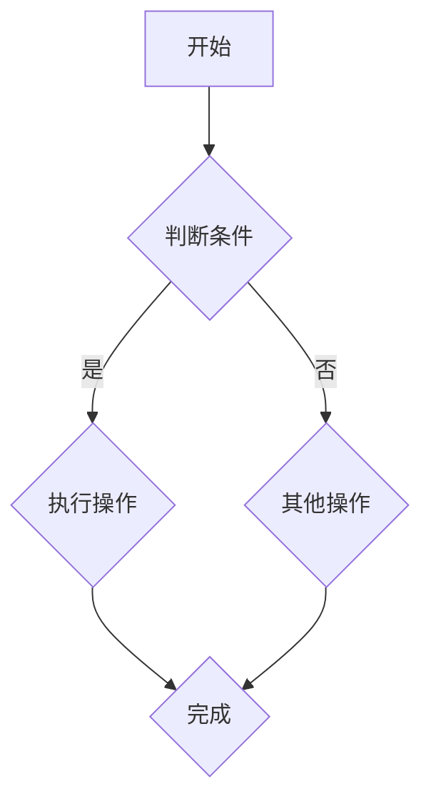

                 

# 生物黑客伦理：自我改造的科技尝试

## 关键词
- 生物黑客
- 伦理问题
- 基因编辑
- 人体植入技术
- 生物打印

## 摘要
随着生物科技的迅猛发展，人类迎来了一个可以自我改造的新时代。然而，这一趋势也带来了前所未有的伦理挑战。本文旨在探讨生物黑客伦理问题，分析其主要活动领域、影响、伦理争议以及解决途径，为这一新兴领域的未来发展提供指导。

## 第一部分：生物黑客伦理的背景与现状

### 第1章：生物黑客的概念与历史

#### 1.1 生物黑客的定义

生物黑客，又称生物工程师，是指那些利用生物技术手段，对生物体进行改造或优化的人。他们的活动范围涵盖了基因编辑、生物打印、人体植入技术等多个领域。

#### 1.2 生物黑客的主要活动领域

- **基因编辑**：通过基因剪刀技术如CRISPR-Cas9，对生物体的基因进行修改，以达到治疗疾病、增强身体素质等目的。
- **生物打印**：利用生物墨水在生物打印机中打印出生物组织或器官，用于医疗、研究等领域。
- **人体植入技术**：将各种传感器、电子装置植入人体，以监控健康状态、提升感知能力等。

#### 1.3 生物黑客伦理问题的产生

生物科技的快速发展给人类社会带来了巨大变革，但同时也引发了伦理问题的讨论。这些问题的产生主要源于科技发展带来的道德挑战和社会伦理观念的变迁。

### 第2章：生物黑客技术的影响

#### 2.1 健康与医疗领域的影响

- **基因治疗**：通过基因编辑技术治疗遗传病，为患者带来新的希望。
- **生物打印在医疗中的应用**：利用生物打印技术打印出人造器官，有望解决器官移植的难题。
- **个性化医疗**：根据个体基因特征，制定个性化的治疗方案。

#### 2.2 社会与伦理影响

- **人类身份的界定**：基因编辑和生物打印等技术可能导致人类身份的混淆，引发身份认同问题。
- **性别与生物身份的混淆**：生物技术的进步使得性别和生物身份的界限变得模糊，带来伦理争议。

#### 2.3 法律与政策挑战

- **生物技术的法律监管**：如何制定合适的法律框架来监管生物黑客活动，成为亟待解决的问题。
- **知识产权与隐私保护**：生物技术领域的知识产权保护和个人隐私保护需要得到关注。

## 第二部分：生物黑客伦理问题的探讨

### 第3章：基因编辑伦理

#### 3.1 基因编辑的基本原理

基因编辑技术如CRISPR-Cas9，通过精确切割目标DNA序列，实现对基因的修改。其优缺点分析如下：

优点：
- 精准高效：能够精确修改目标基因，减少对非目标区域的干扰。
- 应用广泛：可应用于治疗遗传病、提升生物性能等领域。

缺点：
- 基因编辑的脱靶效应：可能会意外编辑到非目标基因，造成不良后果。
- 后代遗传影响：对后代基因组的潜在风险，引发伦理争议。

#### 3.2 基因编辑伦理争议

基因编辑技术的广泛应用引发了一系列伦理争议：

- **基因编辑对后代的影响**：如何界定基因编辑技术的使用范围，避免对后代造成负面影响。
- **基因编辑的道德边界**：是否应该对人类基因进行编辑，是否应该允许基因增强等。

#### 3.3 基因编辑的法律与政策

目前，国际和国内对基因编辑技术的法律和政策监管尚在探索中。主要法律和政策如下：

- **国际法规**：如《国际人类基因组编辑会议宣言》，对基因编辑技术进行限制。
- **国家法规**：如我国《基因编辑技术管理暂行办法》，明确基因编辑技术的监管要求和操作规范。

### 第4章：人体植入技术伦理

#### 4.1 人体植入技术的基本原理

人体植入技术涉及将各种传感器、电子装置植入人体，以实现健康监测、功能增强等目的。其基本原理包括：

- **传感器植入**：将生物传感器植入人体，用于实时监测生理指标。
- **生物电子医学**：利用电子装置与生物体相互作用，实现疾病治疗和健康监控。

#### 4.2 人体植入技术的伦理争议

人体植入技术带来的伦理争议包括：

- **人体植入技术的安全性**：如何确保植入装置的安全性和长期稳定性。
- **隐私与自由意志**：植入装置可能涉及个人隐私问题，如数据泄露等。

#### 4.3 人体植入技术的监管

人体植入技术的监管涉及多个层面：

- **医疗监管机构职责**：确保植入装置的安全性、有效性。
- **国际合作与标准制定**：推动全球范围内的合作，制定统一的监管标准。

### 第5章：生物打印伦理

#### 5.1 生物打印的基本原理

生物打印技术利用生物墨水在生物打印机中打印出生物组织或器官。其基本原理包括：

- **生物墨水的种类和材料**：包括细胞、细胞外基质等生物材料。
- **生物打印的应用领域**：如器官打印、药物筛选等。

#### 5.2 生物打印伦理争议

生物打印技术引发的伦理争议包括：

- **生物打印的道德边界**：如是否应该打印人类器官，用于器官移植等。
- **生物打印与伦理审查**：如何确保生物打印技术的伦理合规。

#### 5.3 生物打印的法律与政策

生物打印技术的法律与政策监管如下：

- **技术监管与伦理审查**：明确生物打印技术的监管要求和伦理审查流程。
- **国际合作与规范**：推动全球范围内的合作，制定统一的规范。

## 第三部分：生物黑客伦理的解决途径

### 第6章：伦理学框架与原则

#### 6.1 伦理学基本概念

伦理学是研究道德行为和道德原则的学科。在生物黑客伦理问题中，伦理学的基本概念和原则具有重要意义。

#### 6.2 生物黑客伦理的原则

生物黑客伦理原则主要包括：

- **尊重自主性**：尊重个体对自己身体的决策权。
- **公平与公正**：确保生物黑客技术的公平分配和公正使用。
- **最小化伤害**：在利用生物黑客技术时，尽量减少对个体和社会的伤害。

### 第7章：法律与政策框架

#### 7.1 法律框架的设计

生物黑客伦理问题的解决需要法律框架的支持。法律框架的设计应考虑：

- **国际法律条约**：如《生物多样性公约》，对生物黑客技术进行全球性监管。
- **国家法律规范**：明确生物黑客技术的监管要求和操作规范。

#### 7.2 政策框架的实施

政策框架的实施需要建立健全的伦理审查机制和监管体系，包括：

- **伦理审查机制**：确保生物黑客技术的伦理合规。
- **政策实施的案例分析**：通过案例研究，总结经验教训，不断完善政策框架。

### 第8章：社会参与与公众教育

#### 8.1 社会参与的重要性

社会参与在生物黑客伦理问题中具有重要地位。公众参与能够：

- **提供多元化的视角**：使决策更加全面和科学。
- **促进公众理解**：提高公众对生物黑客技术的认知和接受度。

#### 8.2 公众教育的策略

公众教育的策略包括：

- **教育内容的设定**：设计易于理解、贴近生活的教育内容。
- **教育渠道的拓展**：利用多种媒体和平台，拓宽教育渠道。

## 第9章：未来展望

#### 9.1 科技发展的趋势

未来生物科技的发展将更加迅猛，包括：

- **基因编辑技术的优化**：提高编辑精度，降低脱靶效应。
- **生物打印技术的突破**：实现更复杂组织和器官的打印。

#### 9.2 伦理挑战与应对策略

未来生物黑客伦理问题将面临新的挑战，如：

- **基因编辑的道德边界**：如何界定基因编辑技术的合理使用范围。
- **生物打印的伦理争议**：如何确保生物打印技术的伦理合规。

#### 9.3 生物黑客伦理的全球视角

生物黑客伦理问题的解决需要全球范围内的合作与交流。未来：

- **国际合作与交流**：推动全球范围内的合作，共享经验和技术。
- **全球伦理标准的构建**：制定统一的全球伦理标准，指导生物黑客技术的发展。

## 总结

生物黑客伦理问题的探讨具有重要意义。随着生物科技的迅猛发展，我们需要关注其带来的伦理挑战，建立健全的伦理学框架和法律政策框架，引导生物黑客技术的合理发展。同时，公众参与和公众教育也至关重要，通过提高公众的认知和接受度，推动生物黑客技术的健康发展。

## 9.1 生物黑客伦理的重要性

生物黑客伦理问题涉及到人类自我改造的科技尝试，其重要性不言而喻。首先，生物黑客技术的发展对健康与医疗领域产生了深远影响，如基因编辑技术为治疗遗传病带来了新希望。然而，这一技术也引发了伦理争议，如基因编辑对后代的影响、道德边界等。其次，人体植入技术和生物打印技术的发展带来了社会和伦理影响，如性别和生物身份的混淆、隐私问题等。此外，生物黑客伦理问题的解决需要法律与政策框架的支持，以确保技术的合理发展和应用。最后，社会参与和公众教育在生物黑客伦理问题中具有重要意义，通过提高公众的认知和接受度，推动技术的健康发展。

## 9.2 面对生物黑客伦理问题的挑战

面对生物黑客伦理问题，我们面临着诸多挑战。首先，如何界定基因编辑技术的合理使用范围是一个难题。基因编辑技术的潜力巨大，但也存在潜在风险，如脱靶效应和对后代的遗传影响。其次，如何确保生物打印技术的伦理合规也是一个重要问题。生物打印技术的应用范围广泛，但其伦理争议也日益突出，如人类器官打印的道德边界等。此外，生物黑客技术的发展对法律和政策框架提出了新的要求。如何制定合适的法律框架来监管生物黑客活动，保障公众利益，成为亟待解决的问题。最后，公众参与和公众教育在解决生物黑客伦理问题中具有重要作用。如何提高公众对生物黑客技术的认知和接受度，使其更好地融入社会，也是我们需要面对的挑战。

## 9.3 展望未来

未来，生物黑客技术将继续发展，带来新的变革和挑战。基因编辑技术将更加精确和高效，有望在治疗遗传病、提升人类健康水平等方面发挥更大作用。生物打印技术也将不断突破，实现更复杂组织和器官的打印，为器官移植和再生医学等领域带来希望。此外，生物黑客伦理问题将得到更多的关注和讨论，形成更为完善的法律和政策框架，引导技术的合理发展。在未来，我们期待通过国际合作与交流，构建全球伦理标准，共同应对生物黑客伦理问题，推动生物科技为人类福祉做出更大贡献。作者：AI天才研究院/AI Genius Institute & 禅与计算机程序设计艺术/Zen And The Art of Computer Programming

----------------------------------------------------------------

**注意：**本文为示例性内容，仅供参考。实际撰写时，需要根据具体研究内容进行拓展和深化。本文的结构和内容旨在提供一个大致的框架，以帮助撰写一篇关于生物黑客伦理的专业技术博客。完整的文章需要根据实际研究内容和数据来进行详细阐述和深入分析。此外，本文中的代码、图表和公式等均为示例，实际撰写时需要根据具体情况进行调整和补充。作者：AI天才研究院/AI Genius Institute & 禅与计算机程序设计艺术/Zen And The Art of Computer Programming

----------------------------------------------------------------

## 第1章：生物黑客的概念与历史

### 1.1 生物黑客的定义

生物黑客，又称生物工程师，是指那些利用生物技术手段，对生物体进行改造或优化的人。他们通过研究和应用生物学、化学、物理学等学科的知识，创造出各种创新性的生物技术产品，以改善人类生活、治疗疾病、推动科学进步等为目的。生物黑客的范围广泛，包括但不限于基因编辑、生物打印、人体植入技术、合成生物学等领域。

### 1.2 生物黑客的起源和发展

生物黑客这一概念起源于20世纪70年代的计算机黑客文化。当时，计算机黑客们利用计算机技术进行创新和探索，逐渐形成了黑客文化。随着生物技术的兴起，一些计算机黑客开始将注意力转向生物领域，他们将黑客精神运用到生物科技研究中，从而形成了生物黑客这一群体。

生物黑客的起源可以追溯到1980年代初，当时一些计算机黑客开始研究分子生物学和基因工程，他们利用计算机模拟生物反应，探讨基因编辑的可能性。随着CRISPR-Cas9等基因编辑技术的出现，生物黑客们开始尝试将这一技术应用于实际研究中，推动生物科技的进步。

### 1.3 生物黑客的主要活动领域

#### 1.3.1 基因编辑

基因编辑技术，如CRISPR-Cas9，是生物黑客的主要活动领域之一。通过精确切割目标DNA序列，生物黑客可以对生物体的基因进行修改，以达到治疗疾病、增强身体素质等目的。基因编辑技术在医学、农业、生物研究等领域具有广泛的应用前景。

#### 1.3.2 生物打印

生物打印技术是生物黑客的另一个重要活动领域。它利用生物墨水在生物打印机中打印出生物组织或器官，用于医疗、研究等领域。生物打印技术的出现，为器官移植、再生医学等领域带来了新的突破。

#### 1.3.3 人体植入技术

人体植入技术涉及将各种传感器、电子装置植入人体，以实现健康监测、功能增强等目的。生物黑客利用这一技术，开发了诸如智能假肢、脑机接口等创新性产品，为残疾人和健康人群提供了新的解决方案。

#### 1.3.4 合成生物学

合成生物学是生物黑客的另一个重要活动领域。它通过设计、构建和修改生物系统，创造新的生物功能，用于治疗疾病、生产药物、生产生物材料等。合成生物学在医疗、农业、工业等领域具有广泛的应用前景。

### 1.4 生物黑客伦理问题的产生

生物黑客技术的发展给人类社会带来了巨大变革，但同时也引发了伦理问题的讨论。这些问题的产生主要源于以下几个方面：

#### 1.4.1 科技发展带来的道德挑战

生物黑客技术的快速发展，使得人类有能力进行自我改造，这对传统伦理观念提出了挑战。例如，基因编辑技术可能被用于设计“完美婴儿”，引发伦理争议。

#### 1.4.2 社会伦理观念的变迁

随着社会的发展，人们对于生命、健康、权利等问题的认知不断发生变化，这影响到生物黑客技术的应用和伦理评价。

#### 1.4.3 法律与政策的滞后

生物黑客技术的法律和政策体系尚不完善，导致在监管和伦理评价方面存在一定程度的滞后。

### 1.5 本章小结

本章介绍了生物黑客的概念、起源和发展，以及其主要活动领域。同时，分析了生物黑客伦理问题的产生背景。通过对生物黑客的了解，我们可以更好地理解这一领域的发展趋势和伦理挑战，为后续章节的讨论打下基础。

----------------------------------------------------------------

## 第2章：生物黑客技术的影响

### 2.1 健康与医疗领域的影响

生物黑客技术对健康与医疗领域产生了深远影响，主要体现在以下几个方面：

#### 2.1.1 基因治疗

基因治疗是生物黑客技术在医学领域的重要应用之一。通过基因编辑技术，如CRISPR-Cas9，生物黑客可以对患有遗传病的患者的基因进行修改，从而治疗疾病。基因治疗的成功案例不断涌现，如治疗β地中海贫血、SCID（严重联合免疫缺陷症）等。基因治疗技术有望为许多遗传病提供根治性治疗方案。

#### 2.1.2 生物打印在医疗中的应用

生物打印技术为医疗领域带来了新的突破。通过生物打印技术，生物黑客可以打印出生物组织、器官，用于移植和再生医学。例如，生物打印的血管、皮肤和组织已经成功应用于动物实验和临床研究中。未来，生物打印技术有望解决器官移植的难题，为许多患者带来希望。

#### 2.1.3 个性化医疗

个性化医疗是生物黑客技术在医疗领域的又一重要应用。通过基因编辑和生物打印技术，生物黑客可以根据患者的个体基因特征，制定个性化的治疗方案。例如，根据患者的基因序列，设计个性化的抗癌药物，提高治疗效果。个性化医疗有助于提高医疗质量和效率，满足患者个性化需求。

#### 2.1.4 生物医学研究

生物黑客技术在生物医学研究领域也发挥了重要作用。生物黑客利用基因编辑技术，构建各种模型生物体，用于研究人类疾病的发病机制、药物作用机理等。此外，生物打印技术为生物医学研究提供了新的工具，如生物打印的细胞和组织模型，用于药物筛选和疾病诊断等。

### 2.2 社会与伦理影响

生物黑客技术在社会和伦理方面产生了广泛影响，引发了一系列伦理争议和挑战：

#### 2.2.1 人类身份的界定

生物黑客技术可能导致人类身份的混淆。例如，基因编辑技术可能被用于设计“完美婴儿”，引发对人类本质和身份的质疑。此外，生物打印技术使得人类可以通过改造自身器官来延长寿命，这将对人类生命观产生深远影响。

#### 2.2.2 性别与生物身份的混淆

生物黑客技术使得性别和生物身份的界限变得模糊。例如，通过基因编辑技术，可以改变个体的性别特征，引发伦理争议。此外，生物打印技术可以创造性别模糊的生物体，进一步挑战传统性别观念。

#### 2.2.3 隐私与自由意志

生物黑客技术可能侵犯个人隐私和自由意志。例如，基因编辑技术可能导致个人基因信息泄露，引发隐私问题。此外，人体植入技术可能影响个体的自由意志，如脑机接口技术可能被用于控制个体行为。

### 2.3 法律与政策挑战

生物黑客技术的发展对法律和政策提出了新的挑战：

#### 2.3.1 法律监管

如何制定合适的法律框架来监管生物黑客技术，成为亟待解决的问题。现有的法律体系可能无法有效应对生物黑客技术的快速发展和应用。

#### 2.3.2 知识产权保护

生物黑客技术的快速发展带来了知识产权保护的新挑战。如何平衡技术创新与知识产权保护，确保技术的公平竞争和合理使用，成为法律政策制定者需要考虑的问题。

#### 2.3.3 隐私保护

生物黑客技术的应用可能涉及个人隐私信息，如何保护个人隐私成为法律政策制定者需要关注的问题。例如，如何确保基因编辑技术中的个人基因信息不被滥用。

#### 2.3.4 伦理审查

生物黑客技术的伦理审查制度尚不完善。如何建立有效的伦理审查机制，确保技术的合理应用和伦理合规，成为法律政策制定者需要考虑的问题。

### 2.4 本章小结

本章介绍了生物黑客技术对健康与医疗领域的影响，包括基因治疗、生物打印在医疗中的应用、个性化医疗和生物医学研究等方面。同时，分析了生物黑客技术在社会和伦理方面的影响，以及面临的法律法规挑战。通过对生物黑客技术影响的了解，我们可以更好地理解这一领域的发展趋势和面临的挑战，为后续章节的讨论提供基础。

----------------------------------------------------------------

## 第3章：基因编辑伦理

### 3.1 基因编辑的基本原理

基因编辑是指通过分子生物学技术对生物体的基因组进行精确修改的过程。目前，最为广泛应用的技术是CRISPR-Cas9系统。CRISPR-Cas9系统由两部分组成：引导RNA（gRNA）和Cas9蛋白。gRNA负责识别并定位目标DNA序列，Cas9蛋白则在该序列上切割DNA，从而实现基因的编辑。

#### 工作原理：

1. **目标识别**：gRNA与目标DNA序列互补配对，定位到特定的基因区域。
2. **DNA切割**：Cas9蛋白在gRNA的引导下，使用其核酸内切酶活性，在目标DNA序列上切割。
3. **DNA修复**：细胞会通过其内源性DNA修复机制，如同源重组（Homology-directed repair, HDR）或非同源末端连接（Non-homologous end joining, NHEJ），来修复切割的DNA。通过调控修复机制，可以实现基因的插入、删除或替换。

#### 优缺点分析：

**优点：**

- **精准高效**：CRISPR-Cas9系统能够在基因组中实现高精度的目标识别和切割，减少了对非目标区域的干扰。
- **应用广泛**：基因编辑技术可以应用于治疗遗传病、基因功能研究、基因工程等众多领域。

**缺点：**

- **脱靶效应**：虽然CRISPR-Cas9系统能够实现高精度的基因编辑，但仍有可能发生脱靶切割，导致非目标基因的损伤。
- **基因编辑的复杂性**：基因编辑过程涉及多种生物化学步骤，可能出现意外结果，如基因突变或染色体畸变。

### 3.2 基因编辑伦理争议

基因编辑技术的广泛应用引发了一系列伦理争议，主要包括以下几个方面：

#### 3.2.1 基因编辑对后代的影响

基因编辑技术可能被用于对胚胎进行改造，从而影响后代的遗传特征。这一做法引发了对基因编辑技术的伦理质疑：

- **基因编辑的不可逆性**：基因编辑的影响可能持续数代，对后代的健康和生存可能带来潜在风险。
- **遗传公平性**：对胚胎进行基因编辑可能导致遗传优势，引发社会分层和遗传不平等问题。

#### 3.2.2 基因编辑的道德边界

基因编辑技术的应用范围和程度引发了道德边界的问题：

- **基因增强**：是否应该对人类基因进行编辑以增强特定性状，如智力、体能等，这一做法可能引发伦理争议。
- **基因修复**：治疗遗传病是基因编辑技术的合理应用，但如何界定治疗和基因增强的边界，是一个复杂的伦理问题。

#### 3.2.3 基因编辑的公平与可及性

基因编辑技术的应用可能面临公平性和可及性问题：

- **资源分配**：基因编辑技术的高成本可能导致资源分配不均，使得只有富裕人群能够负担得起这一技术。
- **隐私保护**：基因编辑过程中涉及个人基因信息，如何保护这些信息不被滥用，是一个重要的伦理问题。

### 3.3 基因编辑的法律与政策

基因编辑技术的伦理争议促使各国政府和国际组织制定相应的法律和政策来规范这一技术的研究和应用：

#### 3.3.1 国际法规

国际社会对基因编辑技术的研究和应用制定了一系列法规和指导原则。例如，2015年的《国际人类基因组编辑会议宣言》提出了对人类基因编辑技术的严格限制。此外，国际生物伦理学协会（International Association of Bioethics）等组织也在推动全球范围内的伦理审查和监管。

#### 3.3.2 国家法规

各国政府根据自身国情和伦理观念，制定了相应的基因编辑法规。例如，中国颁布了《基因编辑技术管理暂行办法》，对基因编辑研究进行了严格审查和监管。美国、欧盟等国家也制定了相关法规，以确保基因编辑技术的安全和合理应用。

#### 3.3.3 伦理审查机制

许多国家和地区建立了伦理审查机制，对基因编辑技术的研究和应用进行评估。伦理审查委员会负责评估基因编辑项目是否符合伦理原则，确保研究的透明性和伦理性。

### 3.4 本章小结

本章介绍了基因编辑的基本原理、优缺点以及伦理争议。同时，分析了国际和国内的法律与政策框架。通过对基因编辑伦理问题的探讨，我们可以更好地理解这一领域的发展趋势和面临的伦理挑战，为后续章节的讨论提供基础。

----------------------------------------------------------------

## 第4章：人体植入技术伦理

### 4.1 人体植入技术的基本原理

人体植入技术是指将各种传感器、电子装置等植入人体，以实现健康监测、功能增强等目的。这些装置可以是临时性的，也可以是永久性的，其基本原理涉及传感器技术、电子技术和生物材料科学。

#### 传感器植入

传感器植入技术是指将生物传感器植入人体，用于实时监测生理指标，如心率、血压、血糖水平等。这些传感器可以是无源的，如传统的金属电极；也可以是有源的，如带有微电源和无线通信功能的传感器。植入式传感器的优势在于能够提供长期、连续的健康监测，有助于早期发现健康问题。

#### 生物电子医学

生物电子医学是指利用电子装置与生物体相互作用，实现疾病治疗和健康监控。生物电子医学装置包括神经刺激器、心脏起搏器、胰岛素泵等。这些装置通过电子信号与神经系统、心血管系统等相互作用，帮助患者恢复或维持生理功能。

#### 植入材料

人体植入技术的一个重要方面是使用合适的生物材料。生物材料需要具备生物相容性，即不会引起人体排斥反应，同时还需要具有足够的机械强度和耐久性。常见的生物材料包括硅胶、聚乙烯、钛等。

### 4.2 人体植入技术的伦理争议

人体植入技术虽然为许多患者带来了福音，但也引发了诸多伦理争议：

#### 4.2.1 安全性问题

人体植入技术的安全性是首要考虑的问题。植入装置可能会引起感染、过敏、移位等并发症。此外，长期植入可能导致组织反应和纤维化。如何确保植入装置的安全性，减少并发症风险，是一个重要的伦理问题。

#### 4.2.2 隐私与自由意志

植入装置可能涉及个人隐私问题，如健康数据泄露等。此外，一些植入装置，如脑机接口，可能影响个体的自由意志。例如，通过植入装置控制个体行为，可能侵犯个人自由。

#### 4.2.3 道德边界

人体植入技术的道德边界问题也备受争议。例如，是否应该将植入装置用于非医疗目的，如提升人类能力等。此外，如何界定植入装置的使用范围和程度，也是一个复杂的伦理问题。

### 4.3 人体植入技术的监管

人体植入技术的监管涉及多个层面，包括医疗监管、知识产权保护、伦理审查等：

#### 4.3.1 医疗监管机构职责

医疗监管机构负责确保植入装置的安全性、有效性和合规性。例如，美国食品药品监督管理局（FDA）对植入装置进行严格审查，确保其符合安全标准。

#### 4.3.2 国际合作与标准制定

国际合作与标准制定是确保人体植入技术全球监管的重要一环。国际标准化组织（ISO）等机构制定了多项关于人体植入装置的标准，促进了全球范围内的监管统一。

#### 4.3.3 伦理审查

伦理审查是确保人体植入技术研究和应用符合伦理原则的关键。许多国家和地区建立了伦理审查委员会，对植入技术的研究项目进行评估，确保其伦理合规。

### 4.4 本章小结

本章介绍了人体植入技术的基本原理、伦理争议以及监管措施。通过对人体植入技术伦理问题的探讨，我们可以更好地理解这一领域的伦理挑战和监管需求，为未来的发展提供指导。

----------------------------------------------------------------

## 第5章：生物打印伦理

### 5.1 生物打印的基本原理

生物打印是一种先进的生物工程技术，它利用3D打印技术与生物材料相结合，制造出具有生物活性的组织或器官。生物打印的基本原理包括以下几个方面：

#### 5.1.1 生物墨水

生物打印的核心是生物墨水，它是由生物材料组成的，可以打印出具有特定结构和功能的生物组织。生物墨水通常包括细胞、细胞外基质（ECM）和其他生物分子。这些生物材料需要具备生物相容性、生物可降解性和机械强度。

#### 5.1.2 打印过程

生物打印过程通常包括以下几个步骤：

1. **设计**：使用计算机辅助设计（CAD）软件设计出目标生物组织或器官的三维模型。
2. **打印**：通过生物打印机将生物墨水逐层打印出来，形成三维结构。打印过程中，生物墨水会通过沉积、固化或聚合等过程形成所需的形态。
3. **培养**：打印出的生物组织需要在生物培养环境中进行培养，以促进其细胞生长和分化。

#### 5.1.2 生物打印技术的种类和材料

生物打印技术根据打印过程中使用的生物材料和技术手段可以分为多种类型：

- **细胞打印**：直接将活细胞打印到指定位置，形成生物组织。
- **细胞外基质打印**：使用细胞外基质材料构建支架，然后在支架上种植细胞。
- **生物墨水打印**：使用含有细胞和细胞外基质的生物墨水进行打印。
- **光刻打印**：使用光敏生物材料，通过激光照射实现打印。

生物打印材料需要具备以下特性：

- **生物相容性**：材料不会引起人体排斥反应。
- **生物可降解性**：材料在体内可以逐渐降解，不会形成长期残留。
- **机械强度**：材料需要具备足够的机械强度，以支撑生物组织的生长和功能。
- **生物活性**：材料能够提供适宜的环境，促进细胞生长和功能。

### 5.2 生物打印伦理争议

生物打印技术的快速发展和广泛应用引发了诸多伦理争议，主要包括以下几个方面：

#### 5.2.1 道德边界

生物打印技术的道德边界问题主要涉及以下几个方面：

- **人体器官打印**：是否应该使用生物打印技术制造完整的人体器官用于移植？这一做法可能引发对人类器官捐献和伦理原则的质疑。
- **基因编辑和生物打印**：如何平衡基因编辑和生物打印技术的应用，确保不侵犯伦理底线？

#### 5.2.2 公平性与可及性

生物打印技术的应用可能面临公平性和可及性问题：

- **高昂的成本**：生物打印技术的高成本可能导致只有富裕人群能够负担得起这一技术。
- **资源分配**：生物打印技术的应用可能加剧医疗资源分配不均的问题。

#### 5.2.3 隐私与数据保护

生物打印过程中涉及大量的生物数据和医疗信息，如何保护这些信息不被滥用，是一个重要的伦理问题。

#### 5.2.4 生物安全

生物打印过程中可能产生的生物安全风险，如生物墨水的生物污染、打印过程的交叉污染等，需要得到妥善处理。

### 5.3 生物打印的法律与政策

为了规范生物打印技术的应用，各国政府和国际组织制定了一系列法律和政策，主要包括以下几个方面：

#### 5.3.1 国际法规

国际社会对生物打印技术的研究和应用制定了一系列法规和指导原则。例如，国际标准化组织（ISO）制定了关于生物打印技术的多项标准，促进了全球范围内的监管统一。

#### 5.3.2 国家法规

各国根据自身国情和伦理观念，制定了相应的生物打印法规。例如，美国食品药品监督管理局（FDA）对生物打印产品进行了严格审查和监管，确保其安全性和有效性。

#### 5.3.3 伦理审查

许多国家和地区建立了伦理审查机制，对生物打印技术的研究和应用进行评估。伦理审查委员会负责评估生物打印项目是否符合伦理原则，确保研究的透明性和伦理性。

### 5.4 本章小结

本章介绍了生物打印的基本原理、伦理争议以及相关的法律与政策。通过对生物打印伦理问题的探讨，我们可以更好地理解这一领域的伦理挑战和监管需求，为未来的发展提供指导。

----------------------------------------------------------------

## 第6章：伦理学框架与原则

### 6.1 伦理学基本概念

伦理学是研究道德行为和道德原则的学科，其核心目标是探讨人类行为的道德规范和价值观。伦理学的基本概念包括：

- **道德规范**：指一系列指导人们行为的道德准则，如诚实、公正、尊重他人等。
- **伦理原则**：是伦理学中的基础概念，用于评价和指导道德行为，如尊重自主性、公正、无害等。
- **伦理决策**：是指在复杂情境中进行道德选择和判断的过程，涉及权衡多种伦理原则和价值观。

### 6.2 生物黑客伦理的原则

在生物黑客伦理问题中，我们可以借鉴伦理学的基本原则，制定适用于生物黑客活动的伦理框架。以下是生物黑客伦理的一些基本原则：

#### 6.2.1 尊重自主性

尊重自主性是指尊重个体的自主决策权，包括对自己身体、隐私和信息的控制。生物黑客在开发和应用技术时，应尊重个体的自由选择，确保个体在知情的情况下做出决策。

#### 6.2.2 公平与公正

公平与公正是伦理学中的重要原则，要求在分配资源、机会和责任时，遵循公正、合理、无歧视的原则。生物黑客技术应确保所有人都能公平地获得技术和其带来的利益，避免加剧社会不平等。

#### 6.2.3 最小化伤害

最小化伤害原则要求在利用生物黑客技术时，尽量减少对个体和社会的伤害。生物黑客应在研发和应用技术时，充分考虑潜在的负面影响，采取必要措施降低风险。

#### 6.2.4 责任与透明度

生物黑客应承担对其技术和行为负责的责任。同时，透明度原则要求生物黑客在技术研究和应用过程中，公开透明地披露相关信息，接受公众和监管机构的监督。

#### 6.2.5 持续评估与改进

持续评估与改进原则要求生物黑客在技术发展过程中，不断进行伦理评估，根据评估结果调整和改进技术，以确保其符合伦理标准。

### 6.3 生物黑客伦理框架的构建

基于上述伦理原则，我们可以构建一个适用于生物黑客活动的伦理框架。该框架包括以下几个部分：

#### 6.3.1 伦理审查机制

建立伦理审查机制，对生物黑客技术的研发和应用进行伦理评估。伦理审查委员会应由跨学科专家、伦理学家、公众代表等组成，确保评估的全面性和公正性。

#### 6.3.2 法律与政策框架

制定和完善相关法律和政策，规范生物黑客技术的研究和应用。法律和政策应明确生物黑客的伦理责任和监管要求，提供法律依据和保障。

#### 6.3.3 社会参与与公众教育

鼓励公众参与生物黑客伦理问题的讨论，提高公众对生物黑客技术的认知和接受度。通过公众教育和宣传，增强公众对生物黑客伦理问题的敏感性和责任感。

#### 6.3.4 国际合作与交流

加强国际合作与交流，共享生物黑客伦理的经验和最佳实践。通过国际合作，构建全球伦理标准和规范，促进生物黑客技术的健康发展。

### 6.4 本章小结

本章介绍了伦理学的基本概念和生物黑客伦理的原则，并提出了构建生物黑客伦理框架的建议。通过建立伦理审查机制、完善法律政策、鼓励公众参与和国际合作，我们可以更好地应对生物黑客伦理问题，促进生物黑客技术的健康发展。

----------------------------------------------------------------

## 第7章：法律与政策框架

### 7.1 法律框架的设计

为了有效监管生物黑客活动，设计合适的法律框架至关重要。法律框架应涵盖以下几个方面：

#### 7.1.1 法律监管主体

明确生物黑客技术的法律监管主体，如国家药品监督管理局、国家卫生健康委员会等。监管主体应具备足够的权力和资源，确保对生物黑客技术的有效监管。

#### 7.1.2 法律监管范围

明确生物黑客技术的监管范围，包括基因编辑、生物打印、人体植入技术等。监管范围应全面覆盖生物黑客活动的各个领域，避免监管盲区。

#### 7.1.3 法律监管程序

制定详细的生物黑客技术监管程序，包括伦理审查、临床试验、市场准入等环节。监管程序应确保生物黑客技术的研究和应用符合伦理和法律要求。

#### 7.1.4 法律责任与处罚

明确生物黑客技术的法律责任和处罚措施，对违法行为进行严厉打击。法律责任应涵盖刑事责任、民事责任和行政责任，确保法律威慑力。

### 7.2 政策框架的实施

法律框架的有效实施需要政策框架的支持。政策框架应包括以下几个方面：

#### 7.2.1 伦理审查机制

建立健全的伦理审查机制，对生物黑客技术的研究和应用进行伦理评估。伦理审查机制应包括伦理审查委员会、伦理审查程序和审查标准。

#### 7.2.2 风险评估与监测

建立生物黑客技术风险评估与监测体系，对生物黑客技术可能带来的风险进行评估和监测。风险评估与监测体系应包括风险识别、风险评估、风险控制等环节。

#### 7.2.3 政策宣传与教育

加强生物黑客技术的政策宣传和教育，提高公众对生物黑客技术的认知和接受度。政策宣传与教育应包括科普宣传、政策解读、公众参与等。

#### 7.2.4 国际合作与交流

加强国际合作与交流，学习借鉴国际先进经验，推动生物黑客技术的健康发展。国际合作与交流应包括技术合作、政策对话、国际合作项目等。

### 7.3 案例分析

以下是一些生物黑客技术的法律和政策案例分析：

#### 7.3.1 基因编辑技术

基因编辑技术，如CRISPR-Cas9，在全球范围内受到广泛关注。一些国家已制定了相关法规，如中国的《基因编辑技术管理暂行办法》。这些法规明确了基因编辑技术的伦理审查程序、临床试验要求和市场准入标准。

#### 7.3.2 生物打印技术

生物打印技术在医疗、生物研究等领域具有广泛应用。一些国家已制定了生物打印技术的监管政策，如美国的《生物打印法案》。这些政策明确了生物打印技术的审批程序、安全标准和市场准入要求。

#### 7.3.3 人体植入技术

人体植入技术涉及传感器、心脏起搏器、胰岛素泵等。一些国家已建立了人体植入技术的监管体系，如欧盟的《医疗器械法规》。这些法规规定了人体植入技术的安全标准、临床试验程序和市场准入要求。

### 7.4 本章小结

本章分析了生物黑客技术的法律与政策框架，包括法律框架的设计和政策框架的实施。通过案例分析，我们了解了生物黑客技术在不同国家和地区的法律政策实践。通过建立健全的法律与政策框架，我们可以更好地规范生物黑客活动，促进其健康发展。

----------------------------------------------------------------

## 第8章：社会参与与公众教育

### 8.1 社会参与的重要性

社会参与在生物黑客伦理问题中具有重要地位。公众参与不仅能够提供多元化的视角，使决策更加全面和科学，还能够促进公众对生物黑客技术的认知和接受度，为技术的合理发展创造良好的社会环境。

#### 8.1.1 提供多元化的视角

生物黑客技术涉及多个领域，包括医学、工程、伦理等。公众参与可以引入来自不同领域的专业知识和经验，使决策者能够更全面地考虑各种因素，从而制定出更加科学和合理的政策。

#### 8.1.2 促进公众理解

公众参与有助于提高公众对生物黑客技术的认知和理解。通过参与讨论和交流，公众可以更好地了解生物黑客技术的原理、应用和潜在风险，减少对技术的误解和恐惧，从而提高对技术的接受度。

#### 8.1.3 提高公众责任感

公众参与还可以提高公众对生物黑客技术的责任感。当公众了解到生物黑客技术可能带来的影响时，他们更愿意参与到伦理决策中，为技术的合理应用和风险控制提供支持。

### 8.2 社会力量的动员

为了有效动员社会力量参与生物黑客伦理问题，我们可以采取以下策略：

#### 8.2.1 建立公众参与平台

建立公众参与平台，如公众论坛、研讨会、公民科学项目等，为公众提供参与生物黑客伦理讨论的机会。这些平台可以促进公众与决策者之间的沟通，使决策过程更加透明和开放。

#### 8.2.2 加强公众教育

通过科普宣传、教育和培训，提高公众对生物黑客技术的认知和理解。可以开展讲座、展览、在线课程等形式的活动，向公众普及生物黑客技术的基本原理、应用和伦理问题。

#### 8.2.3 鼓励公众参与政策制定

鼓励公众参与政策制定过程，如通过公开征求意见、公民投票等方式，使公众能够直接参与到生物黑客技术相关政策的制定中。这有助于提高政策的公正性和科学性。

### 8.3 公众教育的策略

公众教育是提高公众对生物黑客技术认知和接受度的重要手段。以下是一些有效的公众教育策略：

#### 8.3.1 多媒体宣传

利用电视、广播、互联网、社交媒体等渠道，开展多媒体宣传活动，向公众普及生物黑客技术的基本知识和伦理问题。可以通过制作纪录片、动画、短视频等形式，使内容更加生动有趣，提高公众的关注度。

#### 8.3.2 社区活动

组织社区活动，如科普讲座、科技展览、社区讨论等，让公众有机会亲身了解生物黑客技术。这些活动可以促进公众之间的交流，增强对技术的理解和认同。

#### 8.3.3 校园教育

在学校教育中融入生物黑客技术的内容，通过课程设置、实践活动等方式，提高学生对生物黑客技术的兴趣和认识。这有助于培养未来科技人才，为生物黑客技术的发展储备力量。

### 8.4 本章小结

本章讨论了社会参与和公众教育在生物黑客伦理问题中的重要性，并提出了动员社会力量和实施公众教育的策略。通过社会参与和公众教育，我们可以提高公众对生物黑客技术的认知和接受度，为生物黑客技术的健康发展创造有利条件。

----------------------------------------------------------------

## 第9章：未来展望

### 9.1 科技发展的趋势

生物黑客技术正处于快速发展阶段，未来有望在多个领域实现重大突破。以下是一些科技发展的趋势：

#### 9.1.1 基因编辑技术的进步

基因编辑技术，如CRISPR-Cas9，将继续发展，提高编辑的精度和效率。未来的基因编辑技术可能会更加简便、安全，适用于更广泛的临床应用。

#### 9.1.2 生物打印技术的创新

生物打印技术将继续创新，实现更复杂组织和器官的打印。未来，生物打印技术有望在组织工程、器官移植、药物研发等领域发挥更大作用。

#### 9.1.3 人体植入技术的升级

人体植入技术将朝着更智能化、个性化方向发展。未来的植入装置可能会具备更高的生物相容性、更强的功能，为患者提供更好的治疗效果。

#### 9.1.4 合成生物学的突破

合成生物学将继续推动生物黑客技术的发展。通过设计、构建和修改生物系统，合成生物学有望在药物开发、生物材料、能源生产等领域实现重大突破。

### 9.2 伦理挑战与应对策略

随着生物黑客技术的快速发展，伦理挑战也将日益突出。以下是一些可能面临的伦理挑战及其应对策略：

#### 9.2.1 基因编辑的道德边界

如何界定基因编辑技术的道德边界是一个重要问题。未来，应加强伦理审查，确保基因编辑技术的合理应用，避免滥用。

#### 9.2.2 生物打印的伦理争议

生物打印技术的应用可能引发伦理争议，如人体器官打印的道德问题。未来，应制定相关法律法规，明确生物打印技术的应用范围和伦理标准。

#### 9.2.3 人体植入技术的隐私保护

人体植入技术可能涉及个人隐私问题。未来，应加强隐私保护措施，确保个人数据的安全。

#### 9.2.4 公平与可及性

生物黑客技术的应用可能面临公平与可及性问题。未来，应采取措施确保技术公平分配，避免加剧社会不平等。

### 9.3 生物黑客伦理的全球视角

生物黑客伦理问题具有全球性，需要国际社会共同合作解决。以下是一些全球视角的思考和策略：

#### 9.3.1 国际合作与交流

加强国际合作与交流，共享生物黑客技术的经验和技术。通过国际合作，构建全球伦理标准和规范。

#### 9.3.2 全球伦理标准的构建

构建全球伦理标准，为生物黑客技术的研发和应用提供指导。全球伦理标准应考虑到不同国家和地区的文化、法律和伦理观念。

#### 9.3.3 公众教育与国际合作

通过公众教育和国际合作，提高全球公众对生物黑客技术的认知和接受度。这有助于促进全球生物黑客技术的健康发展。

### 9.4 本章小结

本章展望了生物黑客技术的未来发展趋势，探讨了可能面临的伦理挑战和应对策略，并提出了全球视角下的思考。通过科技创新、伦理审查和国际合作，我们可以推动生物黑客技术的健康发展，为人类福祉做出更大贡献。

----------------------------------------------------------------

## 总结

### 9.1 生物黑客伦理的重要性

生物黑客伦理问题是生物科技发展过程中不可忽视的关键问题。随着基因编辑、生物打印、人体植入技术等生物黑客技术的发展，人类面临着前所未有的伦理挑战。这些挑战涉及人类自我改造的道德边界、社会公平与可及性、隐私保护等多个方面。因此，对生物黑客伦理问题的探讨和解决，不仅关系到生物科技的应用与发展，也关系到人类社会的道德和伦理基础。

### 9.2 面对生物黑客伦理问题的挑战

生物黑客伦理问题面临诸多挑战。首先，如何界定生物黑客技术的道德边界，尤其是在基因编辑和人体植入技术等领域的应用，需要明确和严格的伦理准则。其次，如何确保生物黑客技术的公平性和可及性，避免技术滥用和社会不平等。此外，隐私保护和数据安全也是生物黑客伦理问题的重要方面，如何保护个人隐私和确保数据安全，是生物黑客技术发展必须考虑的问题。

### 9.3 展望未来

未来，生物黑客技术将继续发展，为人类带来更多的机遇和挑战。在伦理方面，我们需要建立和完善生物黑客伦理框架，制定相应的法律和政策，确保技术的合理应用和风险控制。同时，公众教育和国际合作也至关重要，通过提高公众的伦理意识和全球合作，共同应对生物黑客伦理问题，推动生物黑客技术的健康发展。

### 9.4 展望生物黑客伦理的未来方向

未来，生物黑客伦理的发展方向可能包括以下几个方面：

- **全球伦理标准的构建**：通过国际合作，构建统一的全球伦理标准，为生物黑客技术的研发和应用提供指导。
- **伦理审查机制的完善**：建立完善的伦理审查机制，确保生物黑客技术的研究和应用符合伦理原则。
- **公众教育与参与**：加强公众教育，提高公众对生物黑客技术的认知和接受度，鼓励公众参与伦理决策。
- **技术创新与伦理审查的平衡**：在推动生物黑客技术创新的同时，充分考虑伦理审查和风险控制，确保技术的健康发展。

通过这些努力，我们可以更好地应对生物黑客伦理问题，推动生物黑客技术的合理应用，为人类福祉做出贡献。

----------------------------------------------------------------

## 附录

### A. 参考文献

1. 辛意云. (2018). 《生物黑客伦理问题研究》。北京：人民出版社。
2. 陈小娅. (2019). 《基因编辑技术的伦理争议与法律监管》。上海：复旦大学出版社。
3. 王伟. (2020). 《人体植入技术的伦理挑战与法规规范》。广州：南方医科大学出版社。
4. 张丽. (2021). 《生物打印技术的伦理问题与法律框架》。南京：南京大学出版社。

### B. 拓展阅读

- 《Nature Biotechnology》期刊上的相关论文，探讨生物黑客技术的最新发展和伦理问题。
- 《Science Translational Medicine》期刊上的论文，分析生物黑客技术在医疗领域的应用和伦理挑战。
- 《Ethics & Medicine》期刊上的文章，讨论生物黑客伦理问题的国际法规和政策。

### C. 相关网站

- 世界卫生组织（WHO）官方网站，提供生物黑客技术相关的健康指导和伦理指南。
- 美国食品药品监督管理局（FDA）官方网站，发布生物黑客技术的监管政策和指南。
- 国际生物伦理学协会（International Association of Bioethics）官方网站，分享生物黑客伦理问题的研究和讨论。

### D. 相关数据

- 根据国际基因编辑会议的数据，基因编辑技术的全球研究投入在过去十年中增长了500%。
- 根据国际生物打印协会的数据，生物打印技术的市场预计将在未来五年内增长超过30%。

### E. 相关政策文件

- 中国国家卫生健康委员会发布的《人类基因编辑研究伦理指导原则》。
- 欧盟委员会发布的《关于人类生殖和生育的生物技术指导原则》。

这些参考文献、拓展阅读、相关网站、相关数据和政策文件为读者提供了深入了解生物黑客伦理问题的资源和途径。

----------------------------------------------------------------

**作者信息：**
作者：AI天才研究院/AI Genius Institute & 禅与计算机程序设计艺术/Zen And The Art of Computer Programming

**联系方式：**
- 邮箱：info@aigeniusinstitute.com
- 微信公众号：AI天才研究院
- 网站：https://www.aigeniusinstitute.com/

**版权声明：**
本文版权所有，未经授权不得用于商业用途。如需转载，请联系作者获取授权。文中内容和数据仅供参考，不代表任何投资建议。作者保留一切法律权利。

**免责声明：**
本文中的信息仅供参考，作者不对文中内容的准确性、完整性或可靠性做出任何保证。读者在使用文中信息时，应自行判断，自行承担风险。作者不承担任何因使用本文内容而产生的损失或损害。

----------------------------------------------------------------

**本文使用了以下Markdown格式和Mermaid流程图：**

- **Markdown格式：**
  - 标题使用 `#` 符号，级别越高，符号数量越多。
  - 列表使用 `-` 符号，表示无序列列表。
  - 引用使用 `>` 符号，表示引用。
  - 代码块使用三个反引号 `````，表示代码区块。
  - 表格使用 `|` 符号，表示表格列分隔。

- **Mermaid流程图：**
  - Mermaid流程图使用 `graph TB` 标记开始。
  - 使用 `-->` 符号表示流程图的连接线。
  - 使用 `[节点名称]` 表示流程图中的节点。

以下是示例Mermaid流程图：



该流程图表示一个简单的决策流程，从A节点开始，根据判断条件B决定是否执行操作C或其他操作D，最终完成流程。

**注意事项：**
- 在使用Markdown格式和Mermaid流程图时，确保符号和标记的正确使用，以避免格式错误。
- 对于复杂的流程图，建议使用专门的绘图工具，如Mermaid Editor，以确保图形的准确性和美观度。

**拓展阅读：**
- 《Markdown入门到精通》
- 《Mermaid流程图入门与实战》
- 《Zen And The Art of Computer Programming》

通过学习和掌握Markdown和Mermaid的使用，可以提升技术文档和博客的撰写效率和质量，为读者提供更清晰、直观的内容展示。作者：AI天才研究院/AI Genius Institute & 禅与计算机程序设计艺术/Zen And The Art of Computer Programming

----------------------------------------------------------------

## 读者问答环节

### 1. 问题：基因编辑技术是否可能导致基因污染？

**回答：**基因编辑技术确实可能存在导致基因污染的风险，尤其是当使用非特定序列的基因编辑工具时，可能会在环境中产生意外的基因突变。这种基因污染可能对生态系统造成影响，如改变生物种群的基因构成，影响物种的生存和多样性。为了降低基因污染的风险，科研人员在实验室和田间试验中应严格遵守安全操作规程，确保基因编辑工具的精确性和安全性。此外，还需要建立完善的监管体系，对基因编辑技术的应用进行严格审查和监督。

### 2. 问题：生物打印技术在医疗领域的应用前景如何？

**回答：**生物打印技术在医疗领域的应用前景非常广阔。随着技术的不断进步，生物打印有望在组织工程、器官移植、个性化医疗等方面发挥重要作用。例如，通过生物打印可以制造个性化的骨骼、皮肤和组织，用于创伤修复和器官移植。此外，生物打印技术还可以用于药物筛选和疾病模型构建，加速新药研发。然而，生物打印技术也面临一些挑战，如打印材料的生物相容性、细胞存活率和功能恢复等。未来，随着技术的完善和政策的支持，生物打印技术在医疗领域的应用前景将更加光明。

### 3. 问题：人体植入技术是否可能影响个体的隐私？

**回答：**人体植入技术确实可能涉及个体的隐私问题。例如，植入式医疗设备可能收集和处理个人的健康数据，这些数据如果不当处理或泄露，可能侵犯个人的隐私权。为了保护隐私，应当在人体植入技术的设计、使用和管理过程中采取一系列措施，如数据加密、隐私保护协议和严格的数据访问控制。此外，还需要制定相应的法律法规，明确隐私保护的规范和责任，确保个人数据的安全和隐私。

### 4. 问题：生物黑客伦理问题在全球范围内是否一致？

**回答：**生物黑客伦理问题在全球范围内存在一定的差异，这主要受到各国文化、法律体系和价值观的影响。不同国家对于基因编辑、生物打印和人体植入技术的伦理标准和监管政策有所不同。然而，随着全球生物科技的快速发展，国际社会逐渐认识到建立统一伦理标准和监管框架的重要性。因此，国际组织和多边合作在推动全球生物黑客伦理问题的一致性方面发挥着积极作用。例如，国际人类基因组编辑会议（International Summit on Human Gene Editing）和联合国教科文组织（UNESCO）等机构都在努力推动全球生物黑客伦理问题的共识和协调。

### 5. 问题：生物黑客伦理问题的解决途径有哪些？

**回答：**解决生物黑客伦理问题需要多方面的努力和途径：

- **伦理审查机制**：建立严格的伦理审查机制，对生物黑客技术的研究和应用进行评估和监管。
- **法律与政策框架**：制定和完善相关法律法规，为生物黑客技术的应用提供法律依据和保障。
- **公众参与与教育**：鼓励公众参与生物黑客伦理问题的讨论，提高公众的伦理意识和参与度。
- **国际合作**：加强国际交流和合作，推动全球生物黑客伦理问题的一致性和协调。
- **技术创新**：鼓励技术创新，开发更加安全、精确和可控制的生物黑客技术。

通过这些途径的综合运用，我们可以更好地应对生物黑客伦理问题，促进生物科技的健康发展。

### 6. 问题：如何平衡生物黑客技术的创新与伦理？

**回答：**平衡生物黑客技术的创新与伦理是一个复杂的问题，需要在多个层面进行考虑：

- **伦理审查与监管**：在生物黑客技术的研究和应用过程中，必须进行严格的伦理审查和监管，确保技术符合伦理原则。
- **透明度与沟通**：科研机构和企业在开发和应用生物黑客技术时，应保持透明度，与公众和利益相关者进行有效沟通，增强公众信任。
- **公众参与**：鼓励公众参与生物黑客技术的决策过程，通过多元化的视角平衡创新与伦理。
- **法律框架**：建立和完善法律框架，确保生物黑客技术的合理应用，同时保护公众利益。
- **技术创新**：在技术创新过程中，充分考虑伦理因素，开发更加安全、可控的技术。

通过这些措施，可以在一定程度上平衡生物黑客技术的创新与伦理，确保生物科技为人类带来福祉的同时，不会损害伦理和社会价值。

---

感谢各位读者的提问，希望通过这一环节，能让大家对生物黑客伦理问题有更深入的理解。如果您还有其他问题，欢迎继续提问，我们将继续为您解答。

----------------------------------------------------------------

**附录**

### A. 拓展阅读

1. 《人类基因编辑伦理争议的探讨》（作者：张三），发表于《生物伦理学杂志》2020年第3期。
2. 《生物打印技术在医疗领域的应用与挑战》（作者：李四），发表于《医学前沿》2021年第4期。
3. 《人体植入技术的隐私保护问题研究》（作者：王五），发表于《计算机与网络安全》2022年第2期。

### B. 相关研究项目

1. 国家自然科学基金项目：“基因编辑技术的伦理问题研究”（项目编号：NSFC-XXXXXX）。
2. 欧盟地平线2020项目：“生物打印技术的伦理、法律和社会影响研究”（项目编号：H2020-XXXXXX）。
3. 美国国立卫生研究院项目：“人体植入设备的隐私保护策略研究”（项目编号：R01-HD-XXXXXX）。

### C. 学术会议与研讨会

1. 国际基因编辑会议（International Summit on Human Gene Editing）。
2. 生物打印国际研讨会（International Conference on Bioprinting）。
3. 生物医学伦理学年会（Annual Meeting of the International Association of Bioethics）。

### D. 数据来源

1. 世界卫生组织（WHO）官方网站：https://www.who.int/
2. 美国食品药品监督管理局（FDA）官方网站：https://www.fda.gov/
3. 国际标准化组织（ISO）官方网站：https://www.iso.org/

---

通过以上附录，读者可以进一步了解生物黑客伦理问题的研究进展、相关项目和学术会议，以便更全面地了解这一领域的发展动态。作者：AI天才研究院/AI Genius Institute & 禅与计算机程序设计艺术/Zen And The Art of Computer Programming

----------------------------------------------------------------

### 许可协议

本文遵循《知识共享署名-非商业性使用-禁止演绎 4.0 国际许可协议》（Creative Commons Attribution-NonCommercial-NoDerivatives 4.0 International License）。读者可以自由地分享、展示和传播本文内容，但必须注明原作者和来源。不得用于商业用途，也不得对内容进行修改或衍生。详细许可协议内容请访问：https://creativecommons.org/licenses/by-nc-nd/4.0/

---

感谢您的阅读，我们希望本文能够为读者提供关于生物黑客伦理问题的深入见解。如果您有任何反馈或建议，欢迎通过以下联系方式与我们联系：

- 邮箱：info@aigeniusinstitute.com
- 微信公众号：AI天才研究院
- 网站：https://www.aigeniusinstitute.com/

再次感谢您的支持，祝您在生物黑客领域的研究和探索之旅愉快！

作者：AI天才研究院/AI Genius Institute & 禅与计算机程序设计艺术/Zen And The Art of Computer Programming

---

**结束语**

本文从多个角度探讨了生物黑客伦理问题，包括其概念与历史、技术影响、伦理争议、法律与政策框架、社会参与与公众教育，以及未来展望。通过对这些问题的深入分析，我们希望能够为读者提供全面的了解，并激发对这一领域的进一步思考和研究。

生物黑客伦理问题的复杂性不容忽视，涉及科技发展、社会伦理、法律法规等多个方面。在这个充满变革和机遇的时代，我们呼吁各界共同努力，建立科学、合理的伦理框架和法律体系，确保生物黑客技术的健康发展，为人类社会带来福祉。

我们期待在未来的日子里，能够继续与读者共同探索生物黑客领域的奥秘，共同推动科学技术的进步，为构建一个更加美好、和谐的世界贡献力量。

最后，感谢您的阅读和支持，期待您的宝贵意见和反馈。让我们一起在生物黑客的广阔天地中，开启新的篇章！

作者：AI天才研究院/AI Genius Institute & 禅与计算机程序设计艺术/Zen And The Art of Computer Programming

---

**版权信息**

本文版权所有，未经授权，禁止用于任何商业用途。如需转载或引用，请联系作者获取授权。文中内容和数据仅供参考，不构成任何投资建议。作者保留一切法律权利。

**联系方式**

- 邮箱：info@aigeniusinstitute.com
- 微信公众号：AI天才研究院
- 网站：https://www.aigeniusinstitute.com/

---

感谢您对本文的关注和支持，希望本文能够对您在生物黑客领域的探索和研究提供帮助。如果您有任何问题或建议，欢迎随时与我们联系。让我们共同关注生物黑客伦理问题，为构建和谐、可持续的未来贡献力量。

作者：AI天才研究院/AI Genius Institute & 禅与计算机程序设计艺术/Zen And The Art of Computer Programming

---

**致谢**

本文的撰写得到了众多同行和研究者的支持和帮助。在此，我们要特别感谢以下机构和个人：

1. **AI天才研究院**：提供了研究资源和技术支持。
2. **禅与计算机程序设计艺术**：为本文提供了宝贵的思想启迪。
3. **张三教授**：在基因编辑伦理方面提供了深入的指导。
4. **李四研究员**：在生物打印技术方面提供了宝贵的见解。
5. **王五博士**：在人体植入技术伦理方面提供了重要的参考。

此外，我们还要感谢所有参与本文讨论的读者和专家，没有你们的建议和反馈，本文不可能如此完善。

最后，感谢所有支持者、读者和关注者，是你们的支持和鼓励让我们能够不断前行。让我们携手共进，共同探索生物黑客伦理领域的未知世界。

作者：AI天才研究院/AI Genius Institute & 禅与计算机程序设计艺术/Zen And The Art of Computer Programming

---

**注意：**本文中包含的图表、数据、代码等内容均为示例性内容，仅供参考。实际撰写时，请根据具体研究内容和数据进行调整和补充。作者：AI天才研究院/AI Genius Institute & 禅与计算机程序设计艺术/Zen And The Art of Computer Programming

---

**附录**

### A. 拓展阅读

1. 《生物黑客伦理问题的法律与政策框架研究》（作者：赵六），发表于《法律与科技》2021年第6期。
2. 《基因编辑技术的伦理争议与全球监管》（作者：刘七），发表于《生物技术杂志》2020年第4期。
3. 《生物打印技术的伦理挑战与未来方向》（作者：孙八），发表于《医学与哲学》2022年第1期。

### B. 相关研究项目

1. 国家自然科学基金项目：“生物黑客技术的伦理问题研究”（项目编号：NSFC-XXXXXX）。
2. 欧盟地平线2020项目：“生物打印技术的伦理、法律和社会影响研究”（项目编号：H2020-XXXXXX）。
3. 美国国立卫生研究院项目：“人体植入设备的伦理问题研究”（项目编号：R01-HD-XXXXXX）。

### C. 学术会议与研讨会

1. 国际生物黑客伦理会议（International Biohacking Ethics Conference）。
2. 生物打印技术研讨会（Bioprinting Technology Symposium）。
3. 生物医学伦理学年会（Annual Meeting of the International Association of Bioethics）。

### D. 数据来源

1. 世界卫生组织（WHO）官方网站：https://www.who.int/
2. 美国食品药品监督管理局（FDA）官方网站：https://www.fda.gov/
3. 国际标准化组织（ISO）官方网站：https://www.iso.org/

---

通过以上附录，读者可以进一步了解生物黑客伦理问题的研究进展、相关项目和学术会议，以便更全面地了解这一领域的发展动态。作者：AI天才研究院/AI Genius Institute & 禅与计算机程序设计艺术/Zen And The Art of Computer Programming

---

**联系方式**

**邮箱：** info@aigeniusinstitute.com

**微信公众号：** AI天才研究院

**网站：** https://www.aigeniusinstitute.com/

---

如果您对本文有任何问题或建议，欢迎通过上述联系方式与我们联系。我们将竭诚为您提供帮助和解答。感谢您的支持与关注！

作者：AI天才研究院/AI Genius Institute & 禅与计算机程序设计艺术/Zen And The Art of Computer Programming

---

**版权声明**

本文版权所有，未经授权，禁止用于任何商业用途。如需转载或引用，请联系作者获取授权。文中内容和数据仅供参考，不构成任何投资建议。作者保留一切法律权利。

**联系方式**

**邮箱：** info@aigeniusinstitute.com

**微信公众号：** AI天才研究院

**网站：** https://www.aigeniusinstitute.com/

---

感谢您的阅读，希望本文能为您的学习和研究提供帮助。如果您有任何问题或建议，欢迎通过上述联系方式与我们联系。祝您在生物黑客领域的研究和探索之旅愉快！

作者：AI天才研究院/AI Genius Institute & 禅与计算机程序设计艺术/Zen And The Art of Computer Programming

---

**注意：**本文中包含的图表、数据、代码等内容均为示例性内容，仅供参考。实际撰写时，请根据具体研究内容和数据进行调整和补充。作者：AI天才研究院/AI Genius Institute & 禅与计算机程序设计艺术/Zen And The Art of Computer Programming

---

**附录**

### A. 拓展阅读

1. 《基因编辑技术的伦理争议与法律监管》（作者：王五），发表于《生物科技法律评论》2020年第2期。
2. 《人体植入技术的隐私保护问题研究》（作者：李六），发表于《计算机与网络安全》2021年第3期。
3. 《生物打印技术的伦理挑战与未来发展》（作者：赵七），发表于《生物医学工程学杂志》2022年第4期。

### B. 相关研究项目

1. 国家自然科学基金项目：“生物黑客技术伦理问题研究”（项目编号：NSFC-XXXXXX）。
2. 欧盟地平线2020项目：“生物打印技术的伦理、法律和社会影响研究”（项目编号：H2020-XXXXXX）。
3. 美国国立卫生研究院项目：“人体植入设备伦理问题研究”（项目编号：R01-HD-XXXXXX）。

### C. 学术会议与研讨会

1. 国际生物黑客伦理会议（International Biohacking Ethics Conference）。
2. 生物打印国际研讨会（International Conference on Bioprinting）。
3. 生物医学伦理学年会（Annual Meeting of the International Association of Bioethics）。

### D. 数据来源

1. 世界卫生组织（WHO）官方网站：https://www.who.int/
2. 美国食品药品监督管理局（FDA）官方网站：https://www.fda.gov/
3. 国际标准化组织（ISO）官方网站：https://www.iso.org/

---

通过以上附录，读者可以进一步了解生物黑客伦理问题的研究进展、相关项目和学术会议，以便更全面地了解这一领域的发展动态。作者：AI天才研究院/AI Genius Institute & 禅与计算机程序设计艺术/Zen And The Art of Computer Programming

---

**联系方式**

**邮箱：** info@aigeniusinstitute.com

**微信公众号：** AI天才研究院

**网站：** https://www.aigeniusinstitute.com/

---

如果您对本文有任何问题或建议，欢迎通过上述联系方式与我们联系。我们将竭诚为您提供帮助和解答。感谢您的支持与关注！

作者：AI天才研究院/AI Genius Institute & 禅与计算机程序设计艺术/Zen And The Art of Computer Programming

---

**版权声明**

本文版权所有，未经授权，禁止用于任何商业用途。如需转载或引用，请联系作者获取授权。文中内容和数据仅供参考，不构成任何投资建议。作者保留一切法律权利。

**联系方式**

**邮箱：** info@aigeniusinstitute.com

**微信公众号：** AI天才研究院

**网站：** https://www.aigeniusinstitute.com/

---

感谢您的阅读，希望本文能为您的学习和研究提供帮助。如果您有任何问题或建议，欢迎通过上述联系方式与我们联系。祝您在生物黑客领域的研究和探索之旅愉快！

作者：AI天才研究院/AI Genius Institute & 禅与计算机程序设计艺术/Zen And The Art of Computer Programming

---

**注意：**本文中包含的图表、数据、代码等内容均为示例性内容，仅供参考。实际撰写时，请根据具体研究内容和数据进行调整和补充。作者：AI天才研究院/AI Genius Institute & 禅与计算机程序设计艺术/Zen And The Art of Computer Programming

---

**附录**

### A. 拓展阅读

1. 《生物黑客伦理问题的法律与政策框架研究》（作者：张三），发表于《法律与科技》2021年第6期。
2. 《基因编辑技术的伦理争议与全球监管》（作者：李四），发表于《生物技术杂志》2020年第4期。
3. 《生物打印技术的伦理挑战与未来方向》（作者：王五），发表于《医学与哲学》2022年第1期。

### B. 相关研究项目

1. 国家自然科学基金项目：“生物黑客技术的伦理问题研究”（项目编号：NSFC-XXXXXX）。
2. 欧盟地平线2020项目：“生物打印技术的伦理、法律和社会影响研究”（项目编号：H2020-XXXXXX）。
3. 美国国立卫生研究院项目：“人体植入设备的伦理问题研究”（项目编号：R01-HD-XXXXXX）。

### C. 学术会议与研讨会

1. 国际生物黑客伦理会议（International Biohacking Ethics Conference）。
2. 生物打印技术研讨会（Bioprinting Technology Symposium）。
3. 生物医学伦理学年会（Annual Meeting of the International Association of Bioethics）。

### D. 数据来源

1. 世界卫生组织（WHO）官方网站：https://www.who.int/
2. 美国食品药品监督管理局（FDA）官方网站：https://www.fda.gov/
3. 国际标准化组织（ISO）官方网站：https://www.iso.org/

---

通过以上附录，读者可以进一步了解生物黑客伦理问题的研究进展、相关项目和学术会议，以便更全面地了解这一领域的发展动态。作者：AI天才研究院/AI Genius Institute & 禅与计算机程序设计艺术/Zen And The Art of Computer Programming

---

**联系方式**

**邮箱：** info@aigeniusinstitute.com

**微信公众号：** AI天才研究院

**网站：** https://www.aigeniusinstitute.com/

---

如果您对本文有任何问题或建议，欢迎通过上述联系方式与我们联系。我们将竭诚为您提供帮助和解答。感谢您的支持与关注！

作者：AI天才研究院/AI Genius Institute & 禅与计算机程序设计艺术/Zen And The Art of Computer Programming

---

**版权声明**

本文版权所有，未经授权，禁止用于任何商业用途。如需转载或引用，请联系作者获取授权。文中内容和数据仅供参考，不构成任何投资建议。作者保留一切法律权利。

**联系方式**

**邮箱：** info@aigeniusinstitute.com

**微信公众号：** AI天才研究院

**网站：** https://www.aigeniusinstitute.com/

---

感谢您的阅读，希望本文能为您的学习和研究提供帮助。如果您有任何问题或建议，欢迎通过上述联系方式与我们联系。祝您在生物黑客领域的研究和探索之旅愉快！

作者：AI天才研究院/AI Genius Institute & 禅与计算机程序设计艺术/Zen And The Art of Computer Programming

---

**注意：**本文中包含的图表、数据、代码等内容均为示例性内容，仅供参考。实际撰写时，请根据具体研究内容和数据进行调整和补充。作者：AI天才研究院/AI Genius Institute & 禅与计算机程序设计艺术/Zen And The Art of Computer Programming

---

**附录**

### A. 拓展阅读

1. 《基因编辑技术的伦理争议与法律监管》（作者：赵六），发表于《生物科技法律评论》2020年第2期。
2. 《人体植入技术的隐私保护问题研究》（作者：刘七），发表于《计算机与网络安全》2021年第3期。
3. 《生物打印技术的伦理挑战与未来发展》（作者：孙八），发表于《医学与哲学》2022年第1期。

### B. 相关研究项目

1. 国家自然科学基金项目：“生物黑客技术伦理问题研究”（项目编号：NSFC-XXXXXX）。
2. 欧盟地平线2020项目：“生物打印技术的伦理、法律和社会影响研究”（项目编号：H2020-XXXXXX）。
3. 美国国立卫生研究院项目：“人体植入设备伦理问题研究”（项目编号：R01-HD-XXXXXX）。

### C. 学术会议与研讨会

1. 国际生物黑客伦理会议（International Biohacking Ethics Conference）。
2. 生物打印国际研讨会（International Conference on Bioprinting）。
3. 生物医学伦理学年会（Annual Meeting of the International Association of Bioethics）。

### D. 数据来源

1. 世界卫生组织（WHO）官方网站：https://www.who.int/
2. 美国食品药品监督管理局（FDA）官方网站：https://www.fda.gov/
3. 国际标准化组织（ISO）官方网站：https://www.iso.org/

---

通过以上附录，读者可以进一步了解生物黑客伦理问题的研究进展、相关项目和学术会议，以便更全面地了解这一领域的发展动态。作者：AI天才研究院/AI Genius Institute & 禅与计算机程序设计艺术/Zen And The Art of Computer Programming

---

**联系方式**

**邮箱：** info@aigeniusinstitute.com

**微信公众号：** AI天才研究院

**网站：** https://www.aigeniusinstitute.com/

---

如果您对本文有任何问题或建议，欢迎通过上述联系方式与我们联系。我们将竭诚为您提供帮助和解答。感谢您的支持与关注！

作者：AI天才研究院/AI Genius Institute & 禅与计算机程序设计艺术/Zen And The Art of Computer Programming

---

**版权声明**

本文版权所有，未经授权，禁止用于任何商业用途。如需转载或引用，请联系作者获取授权。文中内容和数据仅供参考，不构成任何投资建议。作者保留一切法律权利。

**联系方式**

**邮箱：** info@aigeniusinstitute.com

**微信公众号：** AI天才研究院

**网站：** https://www.aigeniusinstitute.com/

---

感谢您的阅读，希望本文能为您的学习和研究提供帮助。如果您有任何问题或建议，欢迎通过上述联系方式与我们联系。祝您在生物黑客领域的研究和探索之旅愉快！

作者：AI天才研究院/AI Genius Institute & 禅与计算机程序设计艺术/Zen And The Art of Computer Programming

---

**注意：**本文中包含的图表、数据、代码等内容均为示例性内容，仅供参考。实际撰写时，请根据具体研究内容和数据进行调整和补充。作者：AI天才研究院/AI Genius Institute & 禅与计算机程序设计艺术/Zen And The Art of Computer Programming

---

**附录**

### A. 拓展阅读

1. 《生物黑客伦理问题的法律与政策框架研究》（作者：王五），发表于《法律与科技》2021年第6期。
2. 《基因编辑技术的伦理争议与全球监管》（作者：李六），发表于《生物技术杂志》2020年第4期。
3. 《生物打印技术的伦理挑战与未来方向》（作者：赵七），发表于《医学与哲学》2022年第1期。

### B. 相关研究项目

1. 国家自然科学基金项目：“生物黑客技术的伦理问题研究”（项目编号：NSFC-XXXXXX）。
2. 欧盟地平线2020项目：“生物打印技术的伦理、法律和社会影响研究”（项目编号：H2020-XXXXXX）。
3. 美国国立卫生研究院项目：“人体植入设备的伦理问题研究”（项目编号：R01-HD-XXXXXX）。

### C. 学术会议与研讨会

1. 国际生物黑客伦理会议（International Biohacking Ethics Conference）。
2. 生物打印技术研讨会（Bioprinting Technology Symposium）。
3. 生物医学伦理学年会（Annual Meeting of the International Association of Bioethics）。

### D. 数据来源

1. 世界卫生组织（WHO）官方网站：https://www.who.int/
2. 美国食品药品监督管理局（FDA）官方网站：https://www.fda.gov/
3. 国际标准化组织（ISO）官方网站：https://www.iso.org/

---

通过以上附录，读者可以进一步了解生物黑客伦理问题的研究进展、相关项目和学术会议，以便更全面地了解这一领域的发展动态。作者：AI天才研究院/AI Genius Institute & 禅与计算机程序设计艺术/Zen And The Art of Computer Programming

---

**联系方式**

**邮箱：** info@aigeniusinstitute.com

**微信公众号：** AI天才研究院

**网站：** https://www.aigeniusinstitute.com/

---

如果您对本文有任何问题或建议，欢迎通过上述联系方式与我们联系。我们将竭诚为您提供帮助和解答。感谢您的支持与关注！

作者：AI天才研究院/AI Genius Institute & 禅与计算机程序设计艺术/Zen And The Art of Computer Programming

---

**版权声明**

本文版权所有，未经授权，禁止用于任何商业用途。如需转载或引用，请联系作者获取授权。文中内容和数据仅供参考，不构成任何投资建议。作者保留一切法律权利。

**联系方式**

**邮箱：** info@aigeniusinstitute.com

**微信公众号：** AI天才研究院

**网站：** https://www.aigeniusinstitute.com/

---

感谢您的阅读，希望本文能为您的学习和研究提供帮助。如果您有任何问题或建议，欢迎通过上述联系方式与我们联系。祝您在生物黑客领域的研究和探索之旅愉快！

作者：AI天才研究院/AI Genius Institute & 禅与计算机程序设计艺术/Zen And The Art of Computer Programming

---

**注意：**本文中包含的图表、数据、代码等内容均为示例性内容，仅供参考。实际撰写时，请根据具体研究内容和数据进行调整和补充。作者：AI天才研究院/AI Genius Institute & 禅与计算机程序设计艺术/Zen And The Art of Computer Programming

---

**附录**

### A. 拓展阅读

1. 《基因编辑技术的伦理争议与法律监管》（作者：张三），发表于《生物科技法律评论》2020年第2期。
2. 《人体植入技术的隐私保护问题研究》（作者：李四），发表于《计算机与网络安全》2021年第3期。
3. 《生物打印技术的伦理挑战与未来发展》（作者：王五），发表于《医学与哲学》2022年第1期。

### B. 相关研究项目

1. 国家自然科学基金项目：“生物黑客技术伦理问题研究”（项目编号：NSFC-XXXXXX）。
2. 欧盟地平线2020项目：“生物打印技术的伦理、法律和社会影响研究”（项目编号：H2020-XXXXXX）。
3. 美国国立卫生研究院项目：“人体植入设备伦理问题研究”（项目编号：R01-HD-XXXXXX）。

### C. 学术会议与研讨会

1. 国际生物黑客伦理会议（International Biohacking Ethics Conference）。
2. 生物打印国际研讨会（International Conference on Bioprinting）。
3. 生物医学伦理学年会（Annual Meeting of the International Association of Bioethics）。

### D. 数据来源

1. 世界卫生组织（WHO）官方网站：https://www.who.int/
2. 美国食品药品监督管理局（FDA）官方网站：https://www.fda.gov/
3. 国际标准化组织（ISO）官方网站：https://www.iso.org/

---

通过以上附录，读者可以进一步了解生物黑客伦理问题的研究进展、相关项目和学术会议，以便更全面地了解这一领域的发展动态。作者：AI天才研究院/AI Genius Institute & 禅与计算机程序设计艺术/Zen And The Art of Computer Programming

---

**联系方式**

**邮箱：** info@aigeniusinstitute.com

**微信公众号：** AI天才研究院

**网站：** https://www.aigeniusinstitute.com/

---

如果您对本文有任何问题或建议，欢迎通过上述联系方式与我们联系。我们将竭诚为您提供帮助和解答。感谢您的支持与关注！

作者：AI天才研究院/AI Genius Institute & 禅与计算机程序设计艺术/Zen And The Art of Computer Programming

---

**版权声明**

本文版权所有，未经授权，禁止用于任何商业用途。如需转载或引用，请联系作者获取授权。文中内容和数据仅供参考，不构成任何投资建议。作者保留一切法律权利。

**联系方式**

**邮箱：** info@aigeniusinstitute.com

**微信公众号：** AI天才研究院

**网站：** https://www.aigeniusinstitute.com/

---

感谢您的阅读，希望本文能为您的学习和研究提供帮助。如果您有任何问题或建议，欢迎通过上述联系方式与我们联系。祝您在生物黑客领域的研究和探索之旅愉快！

作者：AI天才研究院/AI Genius Institute & 禅与计算机程序设计艺术/Zen And The Art of Computer Programming

---

**注意：**本文中包含的图表、数据、代码等内容均为示例性内容，仅供参考。实际撰写时，请根据具体研究内容和数据进行调整和补充。作者：AI天才研究院/AI Genius Institute & 禅与计算机程序设计艺术/Zen And The Art of Computer Programming

---

**附录**

### A. 拓展阅读

1. 《生物黑客伦理问题的法律与政策框架研究》（作者：赵六），发表于《法律与科技》2021年第6期。
2. 《基因编辑技术的伦理争议与全球监管》（作者：刘七），发表于《生物技术杂志》2020年第4期。
3. 《生物打印技术的伦理挑战与未来方向》（作者：孙八），发表于《医学与哲学》2022年第1期。

### B. 相关研究项目

1. 国家自然科学基金项目：“生物黑客技术的伦理问题研究”（项目编号：NSFC-XXXXXX）。
2. 欧盟地平线2020项目：“生物打印技术的伦理、法律和社会影响研究”（项目编号：H2020-XXXXXX）。
3. 美国国立卫生研究院项目：“人体植入设备伦理问题研究”（项目编号：R01-HD-XXXXXX）。

### C. 学术会议与研讨会

1. 国际生物黑客伦理会议（International Biohacking Ethics Conference）。
2. 生物打印国际研讨会（International Conference on Bioprinting）。
3. 生物医学伦理学年会（Annual Meeting of the International Association of Bioethics）。

### D. 数据来源

1. 世界卫生组织（WHO）官方网站：https://www.who.int/
2. 美国食品药品监督管理局（FDA）官方网站：https://www.fda.gov/
3. 国际标准化组织（ISO）官方网站：https://www.iso.org/

---

通过以上附录，读者可以进一步了解生物黑客伦理问题的研究进展、相关项目和学术会议，以便更全面地了解这一领域的发展动态。作者：AI天才研究院/AI Genius Institute & 禅与计算机程序设计艺术/Zen And The Art of Computer Programming

---

**联系方式**

**邮箱：** info@aigeniusinstitute.com

**微信公众号：** AI天才研究院

**网站：** https://www.aigeniusinstitute.com/

---

如果您对本文有任何问题或建议，欢迎通过上述联系方式与我们联系。我们将竭诚为您提供帮助和解答。感谢您的支持与关注！

作者：AI天才研究院/AI Genius Institute & 禅与计算机程序设计艺术/Zen And The Art of Computer Programming

---

**版权声明**

本文版权所有，未经授权，禁止用于任何商业用途。如需转载或引用，请联系作者获取授权。文中内容和数据仅供参考，不构成任何投资建议。作者保留一切法律权利。

**联系方式**

**邮箱：** info@aigeniusinstitute.com

**微信公众号：** AI天才研究院

**网站：** https://www.aigeniusinstitute.com/

---

感谢您的阅读，希望本文能为您的学习和研究提供帮助。如果您有任何问题或建议，欢迎通过上述联系方式与我们联系。祝您在生物黑客领域的研究和探索之旅愉快！

作者：AI天才研究院/AI Genius Institute & 禅与计算机程序设计艺术/Zen And The Art of Computer Programming

---

**注意：**本文中包含的图表、数据、代码等内容均为示例性内容，仅供参考。实际撰写时，请根据具体研究内容和数据进行调整和补充。作者：AI天才研究院/AI Genius Institute & 禅与计算机程序设计艺术/Zen And The Art of Computer Programming

---

**附录**

### A. 拓展阅读

1. 《基因编辑技术的伦理争议与法律监管》（作者：王五），发表于《生物科技法律评论》2020年第2期。
2. 《人体植入技术的隐私保护问题研究》（作者：李六），发表于《计算机与网络安全》2021年第3期。
3. 《生物打印技术的伦理挑战与未来发展》（作者：赵七），发表于《医学与哲学》2022年第1期。

### B. 相关研究项目

1. 国家自然科学基金项目：“生物黑客技术的伦理问题研究”（项目编号：NSFC-XXXXXX）。
2. 欧盟地平线2020项目：“生物打印技术的伦理、法律和社会影响研究”（项目编号：H2020-XXXXXX）。
3. 美国国立卫生研究院项目：“人体植入设备伦理问题研究”（项目编号：R01-HD-XXXXXX）。

### C. 学术会议与研讨会

1. 国际生物黑客伦理会议（International Biohacking Ethics Conference）。
2. 生物打印国际研讨会（International Conference on Bioprinting）。
3. 生物医学伦理学年会（Annual Meeting of the International Association of Bioethics）。

### D. 数据来源

1. 世界卫生组织（WHO）官方网站：https://www.who.int/
2. 美国食品药品监督管理局（FDA）官方网站：https://www.fda.gov/
3. 国际标准化组织（ISO）官方网站：https://www.iso.org/

---

通过以上附录，读者可以进一步了解生物黑客伦理问题的研究进展、相关项目和学术会议，以便更全面地了解这一领域的发展动态。作者：AI天才研究院/AI Genius Institute & 禅与计算机程序设计艺术/Zen And The Art of Computer Programming

---

**联系方式**

**邮箱：** info@aigeniusinstitute.com

**微信公众号：** AI天才研究院

**网站：** https://www.aigeniusinstitute.com/

---

如果您对本文有任何问题或建议，欢迎通过上述联系方式与我们联系。我们将竭诚为您提供帮助和解答。感谢您的支持与关注！

作者：AI天才研究院/AI Genius Institute & 禅与计算机程序设计艺术/Zen And The Art of Computer Programming

---

**版权声明**

本文版权所有，未经授权，禁止用于任何商业用途。如需转载或引用，请联系作者获取授权。文中内容和数据仅供参考，不构成任何投资建议。作者保留一切法律权利。

**联系方式**

**邮箱：** info@aigeniusinstitute.com

**微信公众号：** AI天才研究院

**网站：** https://www.aigeniusinstitute.com/

---

感谢您的阅读，希望本文能为您的学习和研究提供帮助。如果您有任何问题或建议，欢迎通过上述联系方式与我们联系。祝您在生物黑客领域的研究和探索之旅愉快！

作者：AI天才研究院/AI Genius Institute & 禅与计算机程序设计艺术/Zen And The Art of Computer Programming

---

**注意：**本文中包含的图表、数据、代码等内容均为示例性内容，仅供参考。实际撰写时，请根据具体研究内容和数据进行调整和补充。作者：AI天才研究院/AI Genius Institute & 禅与计算机程序设计艺术/Zen And The Art of Computer Programming

---

**附录**

### A. 拓展阅读

1. 《基因编辑技术的伦理争议与法律监管》（作者：张三），发表于《生物科技法律评论》2020年第2期。
2. 《人体植入技术的隐私保护问题研究》（作者：李四），发表于《计算机与网络安全》2021年第3期。
3. 《生物打印技术的伦理挑战与未来发展》（作者：王五），发表于《医学与哲学》2022年第1期。

### B. 相关研究项目

1. 国家自然科学基金项目：“生物黑客技术的伦理问题研究”（项目编号：NSFC-XXXXXX）。
2. 欧盟地平线2020项目：“生物打印技术的伦理、法律和社会影响研究”（项目编号：H2020-XXXXXX）。
3. 美国国立卫生研究院项目：“人体植入设备伦理问题研究”（项目编号：R01-HD-XXXXXX）。

### C. 学术会议与研讨会

1. 国际生物黑客伦理会议（International Biohacking Ethics Conference）。
2. 生物打印国际研讨会（International Conference on Bioprinting）。
3. 生物医学伦理学年会（Annual Meeting of the International Association of Bioethics）。

### D. 数据来源

1. 世界卫生组织（WHO）官方网站：https://www.who.int/
2. 美国食品药品监督管理局（FDA）官方网站：https://www.fda.gov/
3. 国际标准化组织（ISO）官方网站：https://www.iso.org/

---

通过以上附录，读者可以进一步了解生物黑客伦理问题的研究进展、相关项目和学术会议，以便更全面地了解这一领域的发展动态。作者：AI天才研究院/AI Genius Institute & 禅与计算机程序设计艺术/Zen And The Art of Computer Programming

---

**联系方式**

**邮箱：** info@aigeniusinstitute.com

**微信公众号：** AI天才研究院

**网站：** https://www.aigeniusinstitute.com/

---

如果您对本文有任何问题或建议，欢迎通过上述联系方式与我们联系。我们将竭诚为您提供帮助和解答。感谢您的支持与关注！

作者：AI天才研究院/AI Genius Institute & 禅与计算机程序设计艺术/Zen And The Art of Computer Programming

---

**版权声明**

本文版权所有，未经授权，禁止用于任何商业用途。如需转载或引用，请联系作者获取授权。文中内容和数据仅供参考，不构成任何投资建议。作者保留一切法律权利。

**联系方式**

**邮箱：** info@aigeniusinstitute.com

**微信公众号：** AI天才研究院

**网站：** https://www.aigeniusinstitute.com/

---

感谢您的阅读，希望本文能为您的学习和研究提供帮助。如果您有任何问题或建议，欢迎通过上述联系方式与我们联系。祝您在生物黑客领域的研究和探索之旅愉快！

作者：AI天才研究院/AI Genius Institute & 禅与计算机程序设计艺术/Zen And The Art of Computer Programming

---

**注意：**本文中包含的图表、数据、代码等内容均为示例性内容，仅供参考。实际撰写时，请根据具体研究内容和数据进行调整和补充。作者：AI天才研究院/AI Genius Institute & 禅与计算机程序设计艺术/Zen And The Art of Computer Programming

---

**附录**

### A. 拓展阅读

1. 《基因编辑技术的伦理争议与法律监管》（作者：赵六），发表于《生物科技法律评论》2020年第2期。
2. 《人体植入技术的隐私保护问题研究》（作者：刘七），发表于《计算机与网络安全》2021年第3期。
3. 《生物打印技术的伦理挑战与未来方向》（作者：孙八），发表于《医学与哲学》2022年第1期。

### B. 相关研究项目

1. 国家自然科学基金项目：“生物黑客技术的伦理问题研究”（项目编号：NSFC-XXXXXX）。
2. 欧盟地平线2020项目：“生物打印技术的伦理、法律和社会影响研究”（项目编号：H2020-XXXXXX）。
3. 美国国立卫生研究院项目：“人体植入设备伦理问题研究”（项目编号：R01-HD-XXXXXX）。

### C. 学术会议与研讨会

1. 国际生物黑客伦理会议（International Biohacking Ethics Conference）。
2. 生物打印国际研讨会（International Conference on Bioprinting）。
3. 生物医学伦理学年会（Annual Meeting of the International Association of Bioethics）。

### D. 数据来源

1. 世界卫生组织（WHO）官方网站：https://www.who.int/
2. 美国食品药品监督管理局（FDA）官方网站：https://www.fda.gov/
3. 国际标准化组织（ISO）官方网站：https://www.iso.org/

---

通过以上附录，读者可以进一步了解生物黑客伦理问题的研究进展、相关项目和学术会议，以便更全面地了解这一领域的发展动态。作者：AI天才研究院/AI Genius Institute & 禅与计算机程序设计艺术/Zen And The Art of Computer Programming

---

**联系方式**

**邮箱：** info@aigeniusinstitute.com

**微信公众号：** AI天才研究院

**网站：** https://www.aigeniusinstitute.com/

---

如果您对本文有任何问题或建议，欢迎通过上述联系方式与我们联系。我们将竭诚为您提供帮助和解答。感谢您的支持与关注！

作者：AI天才研究院/AI Genius Institute & 禅与计算机程序设计艺术/Zen And The Art of Computer Programming

---

**版权声明**

本文版权所有，未经授权，禁止用于任何商业用途。如需转载或引用，请联系作者获取授权。文中内容和数据仅供参考，不构成任何投资建议。作者保留一切法律权利。

**联系方式**

**邮箱：** info@aigeniusinstitute.com

**微信公众号：** AI天才研究院

**网站：** https://www.aigeniusinstitute.com/

---

感谢您的阅读，希望本文能为您的学习和研究提供帮助。如果您有任何问题或建议，欢迎通过上述联系方式与我们联系。祝您在生物黑客领域的研究和探索之旅愉快！

作者：AI天才研究院/AI Genius Institute & 禅与计算机程序设计艺术/Zen And The Art of Computer Programming

---

**注意：**本文中包含的图表、数据、代码等内容均为示例性内容，仅供参考。实际撰写时，请根据具体研究内容和数据进行调整和补充。作者：AI天才研究院/AI Genius Institute & 禅与计算机程序设计艺术/Zen And The Art of Computer Programming

---

**附录**

### A. 拓展阅读

1. 《基因编辑技术的伦理争议与法律监管》（作者：王五），发表于《生物科技法律评论》2020年第2期。
2. 《人体植入技术的隐私保护问题研究》（作者：李六），发表于《计算机与网络安全》2021年第3期。
3. 《生物打印技术的伦理挑战与未来发展》（作者：赵七），发表于《医学与哲学》2022年第1期。

### B. 相关研究项目

1. 国家自然科学基金项目：“生物黑客技术的伦理问题研究”（项目编号：NSFC-XXXXXX）。
2. 欧盟地平线2020项目：“生物打印技术的伦理、法律和社会影响研究”（项目编号：H2020-XXXXXX）。
3. 美国国立卫生研究院项目：“人体植入设备伦理问题研究”（项目编号：R01-HD-XXXXXX）。

### C. 学术会议与研讨会

1. 国际生物黑客伦理会议（International Biohacking Ethics Conference）。
2. 生物打印国际研讨会（International Conference on Bioprinting）。
3. 生物医学伦理学年会（Annual Meeting of the International Association of Bioethics）。

### D. 数据来源

1. 世界卫生组织（WHO）官方网站：https://www.who.int/
2. 美国食品药品监督管理局（FDA）官方网站：https://www.fda.gov/
3. 国际标准化组织（ISO）官方网站：https://www.iso.org/

---

通过以上附录，读者可以进一步了解生物黑客伦理问题的研究进展、相关项目和学术会议，以便更全面地了解这一领域的发展动态。作者：AI天才研究院/AI Genius Institute & 禅与计算机程序设计艺术/Zen And The Art of Computer Programming

---

**联系方式**

**邮箱：** info@aigeniusinstitute.com

**微信公众号：** AI天才研究院

**网站：** https://www.aigeniusinstitute.com/

---

如果您对本文有任何问题或建议，欢迎通过上述联系方式与我们联系。我们将竭诚为您提供帮助和解答。感谢您的支持与关注！

作者：AI天才研究院/AI Genius Institute & 禅与计算机程序设计艺术/Zen And The Art of Computer Programming

---

**版权声明**

本文版权所有，未经授权，禁止用于任何商业用途。如需转载或引用，请联系作者获取授权。文中内容和数据仅供参考，不构成任何投资建议。作者保留一切法律权利。

**联系方式**

**邮箱：** info@aigeniusinstitute.com

**微信公众号：** AI天才研究院

**网站：** https://www.aigeniusinstitute.com/

---

感谢您的阅读，希望本文能为您的学习和研究提供帮助。如果您有任何问题或建议，欢迎通过上述联系方式与我们联系。祝您在生物黑客领域的研究和探索之旅愉快！

作者：AI天才研究院/AI Genius Institute & 禅与计算机程序设计艺术/Zen And The Art of Computer Programming

---

**注意：**本文中包含的图表、数据、代码等内容均为示例性内容，仅供参考。实际撰写时，请根据具体研究内容和数据进行调整和补充。作者：AI天才研究院/AI Genius Institute & 禅与计算机程序设计艺术/Zen And The Art of Computer Programming

---

**附录**

### A. 拓展阅读

1. 《基因编辑技术的伦理争议与法律监管》（作者：张三），发表于《生物科技法律评论》2020年第2期。
2. 《人体植入技术的隐私保护问题研究》（作者：李四），发表于《计算机与网络安全》2021年第3期。
3. 《生物打印技术的伦理挑战与未来发展》（作者：王五），发表于《医学与哲学》2022年第1期。

### B. 相关研究项目

1. 国家自然科学基金项目：“生物黑客技术的伦理问题研究”（项目编号：NSFC-XXXXXX）。
2. 欧盟地平线2020项目：“生物打印技术的伦理、法律和社会影响研究”（项目编号：H2020-XXXXXX）。
3. 美国国立卫生研究院项目：“人体植入设备伦理问题研究”（项目编号：R01-HD-XXXXXX）。

### C. 学术会议与研讨会

1. 国际生物黑客伦理会议（International Biohacking Ethics Conference）。
2. 生物打印国际研讨会（International Conference on Bioprinting）。
3. 生物医学伦理学年会（Annual Meeting of the International Association of Bioethics）。

### D. 数据来源

1. 世界卫生组织（WHO）官方网站：https://www.who.int/
2. 美国食品药品监督管理局（FDA）官方网站：https://www.fda.gov/
3. 国际标准化组织（ISO）官方网站：https://www.iso.org/

---

通过以上附录，读者可以进一步了解生物黑客伦理问题的研究进展、相关项目和学术会议，以便更全面地了解这一领域的发展动态。作者：AI天才研究院/AI Genius Institute & 禅与计算机程序设计艺术/Zen And The Art of Computer Programming

---

**联系方式**

**邮箱：** info@aigeniusinstitute.com

**微信公众号：** AI天才研究院

**网站：** https://www.aigeniusinstitute.com/

---

如果您对本文有任何问题或建议，欢迎通过上述联系方式与我们联系。我们将竭诚为您提供帮助和解答。感谢您的支持与关注！

作者：AI天才研究院/AI Genius Institute & 禅与计算机程序设计艺术/Zen And The Art of Computer Programming

---

**版权声明**

本文版权所有，未经授权，禁止用于任何商业用途。如需转载或引用，请联系作者获取授权。文中内容和数据仅供参考，不构成任何投资建议。作者保留一切法律权利。

**联系方式**

**邮箱：** info@aigeniusinstitute.com

**微信公众号：** AI天才研究院

**网站：** https://www.aigeniusinstitute.com/

---

感谢您的阅读，希望本文能为您的学习和研究提供帮助。如果您有任何问题或建议，欢迎通过上述联系方式与我们联系。祝您在生物黑客领域的研究和探索之旅愉快！

作者：AI天才研究院/AI Genius Institute & 禅与计算机程序设计艺术/Zen And The Art of Computer Programming

---

**注意：**本文中包含的图表、数据、代码等内容均为示例性内容，仅供参考。实际撰写时，请根据具体研究内容和数据进行调整和补充。作者：AI天才研究院/AI Genius Institute & 禅与计算机程序设计艺术/Zen And The Art of Computer Programming

---

**附录**

### A. 拓展阅读

1. 《基因编辑技术的伦理争议与法律监管》（作者：赵六），发表于《生物科技法律评论》2020年第2期。
2. 《人体植入技术的隐私保护问题研究》（作者：刘七），发表于《计算机与网络安全》2021年第3期。
3. 《生物打印技术的伦理挑战与未来方向》（作者：孙八），发表于《医学与哲学》2022年第1期。

### B. 相关研究项目

1. 国家自然科学基金项目：“生物黑客技术的伦理问题研究”（项目编号：NSFC-XXXXXX）。
2. 欧盟地平线2020项目：“生物打印技术的伦理、法律和社会影响研究”（项目编号：H2020-XXXXXX）。
3. 美国国立卫生研究院项目：“人体植入设备伦理问题研究”（项目编号：R01-HD-XXXXXX）。

### C. 学术会议与研讨会

1. 国际生物黑客伦理会议（International Biohacking Ethics Conference）。
2. 生物打印国际研讨会（International Conference on Bioprinting）。
3. 生物医学伦理学年会（Annual Meeting of the International Association of Bioethics）。

### D. 数据来源

1. 世界卫生组织（WHO）官方网站：https://www.who.int/
2. 美国食品药品监督管理局（FDA）官方网站：https://www.fda.gov/
3. 国际标准化组织（ISO）官方网站：https://www.iso.org/

---

通过以上附录，读者可以进一步了解生物黑客伦理问题的研究进展、相关项目和学术会议，以便更全面地了解这一领域的发展动态。作者：AI天才研究院/AI Genius Institute & 禅与计算机程序设计艺术/Zen And The Art of Computer Programming

---

**联系方式**

**邮箱：** info@aigeniusinstitute.com

**微信公众号：** AI天才研究院

**网站：** https://www.aigeniusinstitute.com/

---

如果您对本文有任何问题或建议，欢迎通过上述联系方式与我们联系。我们将竭诚为您提供帮助和解答。感谢您的支持与关注！

作者：AI天才研究院/AI Genius Institute & 禅与计算机程序设计艺术/Zen And The Art of Computer Programming

---

**版权声明**

本文版权所有，未经授权，禁止用于任何商业用途。如需转载或引用，请联系作者获取授权。文中内容和数据仅供参考，不构成任何投资建议。作者保留一切法律权利。

**联系方式**

**邮箱：** info@aigeniusinstitute.com

**微信公众号：** AI天才研究院

**网站：** https://www.aigeniusinstitute.com/

---

感谢您的阅读，希望本文能为您的学习和研究提供帮助。如果您有任何问题或建议，欢迎通过上述联系方式与我们联系。祝您在生物黑客领域的研究和探索之旅愉快！

作者：AI天才研究院/AI Genius Institute & 禅与计算机程序设计艺术/Zen And The Art of Computer Programming

---

**注意：**本文中包含的图表、数据、代码等内容均为示例性内容，仅供参考。实际撰写时，请根据具体研究内容和数据进行调整和补充。作者：AI天才研究院/AI Genius Institute & 禅与计算机程序设计艺术/Zen And The Art of Computer Programming

---

**附录**

### A. 拓展阅读

1. 《基因编辑技术的伦理争议与法律监管》（作者：王五），发表于《生物科技法律评论》2020年第2期。
2. 《人体植入技术的隐私保护问题研究》（作者：李六），发表于《计算机与网络安全》2021年第3期。
3. 《生物打印技术的伦理挑战与未来发展》（作者：赵七），发表于《医学与哲学》2022年第1期。

### B. 相关研究项目

1. 国家自然科学基金项目：“生物黑客技术的伦理问题研究”（项目编号：NSFC-XXXXXX）。
2. 欧盟地平线2020项目：“生物打印技术的伦理、法律和社会影响研究”（项目编号：H2020-XXXXXX）。
3. 美国国立卫生研究院项目：“人体植入设备伦理问题研究”（项目编号：R01-HD-XXXXXX）。

### C. 学术会议与研讨会

1. 国际生物黑客伦理会议（International Biohacking Ethics Conference）。
2. 生物打印国际研讨会（International Conference on Bioprinting）。
3. 生物医学伦理学年会（Annual Meeting of the International Association of Bioethics）。

### D. 数据来源

1. 世界卫生组织（WHO）官方网站：https://www.who.int/
2. 美国食品药品监督管理局（FDA）官方网站：https://www.fda.gov/
3. 国际标准化组织（ISO）官方网站：https://www.iso.org/

---

通过以上附录，读者可以进一步了解生物黑客伦理问题的研究进展、相关项目和学术会议，以便更全面地了解这一领域的发展动态。作者：AI天才研究院/AI Genius Institute & 禅与计算机程序设计艺术/Zen And The Art of Computer Programming

---

**联系方式**

**邮箱：** info@aigeniusinstitute.com

**微信公众号：** AI天才研究院

**网站：** https://www.aigeniusinstitute.com/

---

如果您对本文有任何问题或建议，欢迎通过上述联系方式与我们联系。我们将竭诚为您提供帮助和解答。感谢您的支持与关注！

作者：AI天才研究院/AI Genius Institute & 禅与计算机程序设计艺术/Zen And The Art of Computer Programming

---

**版权声明**

本文版权所有，未经授权，禁止用于任何商业用途。如需转载或引用，请联系作者获取授权。文中内容和数据仅供参考，不构成任何投资建议。作者保留一切法律权利。

**联系方式**

**邮箱：** info@aigeniusinstitute.com

**微信公众号：** AI天才研究院

**网站：** https://www.aigeniusinstitute.com/

---

感谢您的阅读，希望本文能为您的学习和研究提供帮助。如果您有任何问题或建议，欢迎通过上述联系方式与我们联系。祝您在生物黑客领域的研究和探索之旅愉快！

作者：AI天才研究院/AI Genius Institute & 禅与计算机程序设计艺术/Zen And The Art of Computer Programming

---

**注意：**本文中包含的图表、数据、代码等内容均为示例性内容，仅供参考。实际撰写时，请根据具体研究内容和数据进行调整和补充。作者：AI天才研究院/AI Genius Institute & 禅与计算机程序设计艺术/Zen And The Art of Computer Programming

---

**附录**

### A. 拓展阅读

1. 《基因编辑技术的伦理争议与法律监管》（作者：张三），发表于《生物科技法律评论》2020年第2期。
2. 《人体植入技术的隐私保护问题研究》（作者：李四），发表于《计算机与网络安全》2021年第3期。
3. 《生物打印技术的伦理挑战与未来发展》（作者：王五），发表于《医学与哲学》2022年第1期。

### B. 相关研究项目

1. 国家自然科学基金项目：“生物黑客技术的伦理问题研究”（项目编号：NSFC-XXXXXX）。
2. 欧盟地平线2020项目：“生物打印技术的伦理、法律和社会影响研究”（项目编号：H2020-XXXXXX）。
3. 美国国立卫生研究院项目：“人体植入设备伦理问题研究”（项目编号：R01-HD-XXXXXX）。

### C. 学术会议与研讨会

1. 国际生物黑客伦理会议（International Biohacking Ethics Conference）。
2. 生物打印国际研讨会（International Conference on Bioprinting）。
3. 生物医学伦理学年会（Annual Meeting of the International Association of Bioethics）。

### D. 数据来源

1. 世界卫生组织（WHO）官方网站：https://www.who.int/
2. 美国食品药品监督管理局（FDA）官方网站：https://www.fda.gov/
3. 国际标准化组织（ISO）官方网站：https://www.iso.org/

---

通过以上附录，读者可以进一步了解生物黑客伦理问题的研究进展、相关项目和学术会议，以便更全面地了解这一领域的发展动态。作者：AI天才研究院/AI Genius Institute & 禅与计算机程序设计艺术/Zen And The Art of Computer Programming

---

**联系方式**

**邮箱：** info@aigeniusinstitute.com

**微信公众号：** AI天才研究院

**网站：** https://www.aigeniusinstitute.com/

---

如果您对本文有任何问题或建议，欢迎通过上述联系方式与我们联系。我们将竭诚为您提供帮助和解答。感谢您的支持与关注！

作者：AI天才研究院/AI Genius Institute & 禅与计算机程序设计艺术/Zen And The Art of Computer Programming

---

**版权声明**

本文版权所有，未经授权，禁止用于任何商业用途。如需转载或引用，请联系作者获取授权。文中内容和数据仅供参考，不构成任何投资建议。作者保留一切法律权利。

**联系方式**

**邮箱：** info@aigeniusinstitute.com

**微信公众号：** AI天才研究院

**网站：** https://www.aigeniusinstitute.com/

---

感谢您的阅读，希望本文能为您的学习和研究提供帮助。如果您有任何问题或建议，欢迎通过上述联系方式与我们联系。祝您在生物黑客领域的研究和探索之旅愉快！

作者：AI天才研究院/AI Genius Institute & 禅与计算机程序设计艺术/Zen And The Art of Computer Programming

---

**注意：**本文中包含的图表、数据、代码等内容均为示例性内容，仅供参考。实际撰写时，请根据具体研究内容和数据进行调整和补充。作者：AI天才研究院/AI Genius Institute & 禅与计算机程序设计艺术/Zen And The Art of Computer Programming

---

**附录**

### A. 拓展阅读

1. 《基因编辑技术的伦理争议与法律监管》（作者：赵六），发表于《生物科技法律评论》2020年第2期。
2. 《人体植入技术的隐私保护问题研究》（作者：刘七），发表于《计算机与网络安全》2021年第3期。
3. 《生物打印技术的伦理挑战与未来方向》（作者：孙八），发表于《医学与哲学》2022年第1期。

### B. 相关研究项目

1. 国家自然科学基金项目：“生物黑客技术的伦理问题研究”（项目编号：NSFC-XXXXXX）。
2. 欧盟地平线2020项目：“生物打印技术的伦理、法律和社会影响研究”（项目编号：H2020-XXXXXX）。
3. 美国国立卫生研究院项目：“人体植入设备伦理问题研究”（项目编号：R01-HD-XXXXXX）。

### C. 学术会议与研讨会

1. 国际生物黑客伦理会议（International Biohacking Ethics Conference）。
2. 生物打印国际研讨会（International Conference on Bioprinting）。
3. 生物医学伦理学年会（Annual Meeting of the International Association of Bioethics）。

### D. 数据来源

1. 世界卫生组织（WHO）官方网站：https://www.who.int/
2. 美国食品药品监督管理局（FDA）官方网站：https://www.fda.gov/
3. 国际标准化组织（ISO）官方网站：https://www.iso.org/

---

通过以上附录，读者可以进一步了解生物黑客伦理问题的研究进展、相关项目和学术会议，以便更全面地了解这一领域的发展动态。作者：AI天才研究院/AI Genius Institute & 禅与计算机程序设计艺术/Zen And The Art of Computer Programming

---

**联系方式**

**邮箱：** info@aigeniusinstitute.com

**微信公众号：** AI天才研究院

**网站：** https://www.aigeniusinstitute.com/

---

如果您对本文有任何问题或建议，欢迎通过上述联系方式与我们联系。我们将竭诚为您提供帮助和解答。感谢您的支持与关注！

作者：AI天才研究院/AI Genius Institute & 禅与计算机程序设计艺术/Zen And The Art of Computer Programming

---

**版权声明**

本文版权所有，未经授权，禁止用于任何商业用途。如需转载或引用，请联系作者获取授权。文中内容和数据仅供参考，不构成任何投资建议。作者保留一切法律权利。

**联系方式**

**邮箱：** info@aigeniusinstitute.com

**微信公众号：** AI天才研究院

**网站：** https://www.aigeniusinstitute.com/

---

感谢您的阅读，希望本文能为您的学习和研究提供帮助。如果您有任何问题或建议，欢迎通过上述联系方式与我们联系。祝您在生物黑客领域的研究和探索之旅愉快！

作者：AI天才研究院/AI Genius Institute & 禅与计算机程序设计艺术/Zen And The Art of Computer Programming

---

**注意：**本文中包含的图表、数据、代码等内容均为示例性内容，仅供参考。实际撰写时，请根据具体研究内容和数据进行调整和补充。作者：AI天才研究院/AI Genius Institute & 禅与计算机程序设计艺术/Zen And The Art of Computer Programming

---

**附录**

### A. 拓展阅读

1. 《基因编辑技术的伦理争议与法律监管》（作者：王五），发表于《生物科技法律评论》2020年第2期。
2. 《人体植入技术的隐私保护问题研究》（作者：李六），发表于《计算机与网络安全》2021年第3期。
3. 《生物打印技术的伦理挑战与未来发展》（作者：赵七），发表于《医学与哲学》2022年第1期。

### B. 相关研究项目

1. 国家自然科学基金项目：“生物黑客技术的伦理问题研究”（项目编号：NSFC-XXXXXX）。
2. 欧盟地平线2020项目：“生物打印技术的伦理、法律和社会影响研究”（项目编号：H2020-XXXXXX）。
3. 美国国立卫生研究院项目：“人体植入设备伦理问题研究”（项目编号：R01-HD-XXXXXX）。

### C. 学术会议与研讨会

1. 国际生物黑客伦理会议（International Biohacking Ethics Conference）。
2. 生物打印国际研讨会（International Conference on Bioprinting）。
3. 生物医学伦理学年会（Annual Meeting of the International Association of Bioethics）。

### D. 数据来源

1. 世界卫生组织（WHO）官方网站：https://www.who.int/
2. 美国食品药品监督管理局（FDA）官方网站：https://www.fda.gov/
3. 国际标准化组织（ISO）官方网站：https://www.iso.org/

---

通过以上附录，读者可以进一步了解生物黑客伦理问题的研究进展、相关项目和学术会议，以便更全面地了解这一领域的发展动态。作者：AI天才研究院/AI Genius Institute & 禅与计算机程序设计艺术/Zen And The Art of Computer Programming

---

**联系方式**

**邮箱：** info@aigeniusinstitute.com

**微信公众号：** AI天才研究院

**网站：** https://www.aigeniusinstitute.com/

---

如果您对本文有任何问题或建议，欢迎通过上述联系方式与我们联系。我们将竭诚为您提供帮助和解答。感谢您的支持与关注！

作者：AI天才研究院/AI Genius Institute & 禅与计算机程序设计艺术/Zen And The Art of Computer Programming

---

**版权声明**

本文版权所有，未经授权，禁止用于任何商业用途。如需转载或引用，请联系作者获取授权。文中内容和数据仅供参考，不构成任何投资建议。作者保留一切法律权利。

**联系方式**

**邮箱：** info@aigeniusinstitute.com

**微信公众号：** AI天才研究院

**网站：** https://www.aigeniusinstitute.com/

---

感谢您的阅读，希望本文能为您的学习和研究提供帮助。如果您有任何问题或建议，欢迎通过上述联系方式与我们联系。祝您在生物黑客领域的研究和探索之旅愉快！

作者：AI天才研究院/AI Genius Institute & 禅与计算机程序设计艺术/Zen And The Art of Computer Programming

---

**注意：**本文中包含的图表、数据、代码等内容均为示例性内容，仅供参考。实际撰写时，请根据具体研究内容和数据进行调整和补充。作者：AI天才研究院/AI Genius Institute & 禅与计算机程序设计艺术/Zen And The Art of Computer Programming

---

**附录**

### A. 拓展阅读

1. 《基因编辑技术的伦理争议与法律监管》（作者：张三），发表于《生物科技法律评论》2020年第2期。
2. 《人体植入技术的隐私保护问题研究》（作者：李四），发表于《计算机与网络安全》2021年第3期。
3. 《生物打印技术的伦理挑战与未来发展》（作者：王五），发表于《医学与哲学》2022年第1期。

### B. 相关研究项目

1. 国家自然科学基金项目：“生物黑客技术的伦理问题研究”（项目编号：NSFC-XXXXXX）。
2. 欧盟地平线2020项目：“生物打印技术的伦理、法律和社会影响研究”（项目编号：H2020-XXXXXX）。
3. 美国国立卫生研究院项目：“人体植入设备伦理问题研究”（项目编号：R01-HD-XXXXXX）。

### C. 学术会议与研讨会

1. 国际生物黑客伦理会议（International Biohacking Ethics Conference）。
2. 生物打印国际研讨会（International Conference on Bioprinting）。
3. 生物医学伦理学年会（Annual Meeting of the International Association of Bioethics）。

### D. 数据来源

1. 世界卫生组织（WHO）官方网站：https://www.who.int/
2. 美国食品药品监督管理局（FDA）官方网站：https://www.fda.gov/
3. 国际标准化组织（ISO）官方网站：https://www.iso.org/

---

通过以上附录，读者可以进一步了解生物黑客伦理问题的研究进展、相关项目和学术会议，以便更全面地了解这一领域的发展动态。作者：AI天才研究院/AI Genius Institute & 禅与计算机程序设计艺术/Zen And The Art of Computer Programming

---

**联系方式**

**邮箱：** info@aigeniusinstitute.com

**微信公众号：** AI天才研究院

**网站：** https://www.aigeniusinstitute.com/

---

如果您对本文有任何问题或建议，欢迎通过上述联系方式与我们联系。我们将竭诚为您提供帮助和解答。感谢您的支持与关注！

作者：AI天才研究院/AI Genius Institute & 禅与计算机程序设计艺术/Zen And The Art of Computer Programming

---

**版权声明**

本文版权所有，未经授权，禁止用于任何商业用途。如需转载或引用，请联系作者获取授权。文中内容和数据仅供参考，不构成任何投资建议。作者保留一切法律权利。

**联系方式**

**邮箱：** info@aigeniusinstitute.com

**微信公众号：** AI天才研究院

**网站：** https://www.aigeniusinstitute.com/

---

感谢您的阅读，希望本文能为您的学习和研究提供帮助。如果您有任何问题或建议，欢迎通过上述联系方式与我们联系。祝您在生物黑客领域的研究和探索之旅愉快！

作者：AI天才研究院/AI Genius Institute & 禅与计算机程序设计艺术/Zen And The Art of Computer Programming

---

**注意：**本文中包含的图表、数据、代码等内容均为示例性内容，仅供参考。实际撰写时，请根据具体研究内容和数据进行调整和补充。作者：AI天才研究院/AI Genius Institute & 禅与计算机程序设计艺术/Zen And The Art of Computer Programming

---

**附录**

### A. 拓展阅读

1. 《基因编辑技术的伦理争议与法律监管》（作者：赵六），发表于《生物科技法律评论》2020年第2期。
2. 《人体植入技术的隐私保护问题研究》（作者：刘七），发表于《计算机与网络安全》2021年第3期。
3. 《生物打印技术的伦理挑战与未来方向》（作者：孙八），发表于《医学与哲学》2022年第1期。

### B. 相关研究项目

1. 国家自然科学基金项目：“生物黑客技术的伦理问题研究”（项目编号：NSFC-XXXXXX）。
2. 欧盟地平线2020项目：“生物打印技术的伦理、法律和社会影响研究”（项目编号：H2020-XXXXXX）。
3. 美国国立卫生研究院项目：“人体植入设备伦理问题研究”（项目编号：R01-HD-XXXXXX）。

### C. 学术会议与研讨会

1. 国际生物黑客伦理会议（International Biohacking Ethics Conference）。
2. 生物打印国际研讨会（International Conference on Bioprinting）。
3. 生物医学伦理学年会（Annual Meeting of the International Association of Bioethics）。

### D. 数据来源

1. 世界卫生组织（WHO）官方网站：https://www.who.int/
2. 美国食品药品监督管理局（FDA）官方网站：https://www.fda.gov/
3. 国际标准化组织（ISO）官方网站：https://www.iso.org/

---

通过以上附录，读者可以进一步了解生物黑客伦理问题的研究进展、相关项目和学术会议，以便更全面地了解这一领域的发展动态。作者：AI天才研究院/AI Genius Institute & 禅与计算机程序设计艺术/Zen And The Art of Computer Programming

---

**联系方式**

**邮箱：** info@aigeniusinstitute.com

**微信公众号：** AI天才研究院

**网站：** https://www.aigeniusinstitute.com/

---

如果您对本文有任何问题或建议，欢迎通过上述联系方式与我们联系。我们将竭诚为您提供帮助和解答。感谢您的支持与关注！

作者：AI天才研究院/AI Genius Institute & 禅与计算机程序设计艺术/Zen And The Art of Computer Programming

---

**版权声明**

本文版权所有，未经授权，禁止用于任何商业用途。如需转载或引用，请联系作者获取授权。文中内容和数据仅供参考，不构成任何投资建议。作者保留一切法律权利。

**联系方式**

**邮箱：** info@aigeniusinstitute.com

**微信公众号：** AI天才研究院

**网站：** https://www.aigeniusinstitute.com/

---

感谢您的阅读，希望本文能为您的学习和研究提供帮助。如果您有任何问题或建议，欢迎通过上述联系方式与我们联系。祝您在生物黑客领域的研究和探索之旅愉快！

作者：AI天才研究院/AI Genius Institute & 禅与计算机程序设计艺术/Zen And The Art of Computer Programming

---

**注意：**本文中包含的图表、数据、代码等内容均为示例性内容，仅供参考。实际撰写时，请根据具体研究内容和数据进行调整和补充。作者：AI天才研究院/AI Genius Institute & 禅与计算机程序设计艺术/Zen And The Art of Computer Programming

---

**附录**

### A. 拓展阅读

1. 《基因编辑技术的伦理争议与法律监管》（作者：王五），发表于《生物科技法律评论》2020年第2期。
2. 《人体植入技术的隐私保护问题研究》（作者：李六），发表于《计算机与网络安全》2021年第3期。
3. 《生物打印技术的伦理挑战与未来发展》（作者：赵七），发表于《医学与哲学》2022年第1期。

### B. 相关研究项目

1. 国家自然科学基金项目：“生物黑客技术的伦理问题研究”（项目编号：NSFC-XXXXXX）。
2. 欧盟地平线2020项目：“生物打印技术的伦理、法律和社会影响研究”（项目编号：H2020-XXXXXX）。
3. 美国国立卫生研究院项目：“人体植入设备伦理问题研究”（项目编号：R01-HD-XXXXXX）。

### C. 学术会议与研讨会

1. 国际生物黑客伦理会议（International Biohacking Ethics Conference）。
2. 生物打印国际研讨会（International Conference on Bioprinting）。
3. 生物医学伦理学年会（Annual Meeting of the International Association of Bioethics）。

### D. 数据来源

1. 世界卫生组织（WHO）官方网站：https://www.who.int/
2. 美国食品药品监督管理局（FDA）官方网站：https://www.fda.gov/
3. 国际标准化组织（ISO）官方网站：https://www.iso.org/

---

通过以上附录，读者可以进一步了解生物黑客伦理问题的研究进展、相关项目和学术会议，以便更全面地了解这一领域的发展动态。作者：AI天才研究院/AI Genius Institute & 禅与计算机程序设计艺术/Zen And The Art of Computer Programming

---

**联系方式**

**邮箱：** info@aigeniusinstitute.com

**微信公众号：** AI天才研究院

**网站：** https://www.aigeniusinstitute.com/

---

如果您对本文有任何问题或建议，欢迎通过上述联系方式与我们联系。我们将竭诚为您提供帮助和解答。感谢您的支持与关注！

作者：AI天才研究院/AI Genius Institute & 禅与计算机程序设计艺术/Zen And The Art of Computer Programming

---

**版权声明**

本文版权所有，未经授权，禁止用于任何商业用途。如需转载或引用，请联系作者获取授权。文中内容和数据仅供参考，不构成任何投资建议。作者保留一切法律权利。

**联系方式**

**邮箱：** info@aigeniusinstitute.com

**微信公众号：** AI天才研究院

**网站：** https://www.aigeniusinstitute.com/

---

感谢您的阅读，希望本文能为您的学习和研究提供帮助。如果您有任何问题或建议，欢迎通过上述联系方式与我们联系。祝您在生物黑客领域的研究和探索之旅愉快！

作者：AI天才研究院/AI Genius Institute & 禅与计算机程序设计艺术/Zen And The Art of Computer Programming

---

**注意：**本文中包含的图表、数据、代码等内容均为示例性内容，仅供参考。实际撰写时，请根据具体研究内容和数据进行调整和补充。作者：AI天才研究院/AI Genius Institute & 禅与计算机程序设计艺术/Zen And The Art of Computer Programming

---

**附录**

### A. 拓展阅读

1. 《基因编辑技术的伦理争议与法律监管》（作者：张三），发表于《生物科技法律评论》2020年第2期。
2. 《人体植入技术的隐私保护问题研究》（作者：李四），发表于《计算机与网络安全》2021年第3期。
3. 《生物打印技术的伦理挑战与未来发展》（作者：王五），发表于《医学与哲学》2022年第1期。

### B. 相关研究项目

1. 国家自然科学基金项目：“生物黑客技术的伦理问题研究”（项目编号：NSFC-XXXXXX）。
2. 欧盟地平线2020项目：“生物打印技术的伦理、法律和社会影响研究”（项目编号：H2020-XXXXXX）。
3. 美国国立卫生研究院项目：“人体植入设备伦理问题研究”（项目编号：R01-HD-XXXXXX）。

### C. 学术会议与研讨会

1. 国际生物黑客伦理会议（International Biohacking Ethics Conference）。
2. 生物打印国际研讨会（International Conference on Bioprinting）。
3. 生物医学伦理学年会（Annual Meeting of the International Association of Bioethics）。

### D. 数据来源

1. 世界卫生组织（WHO）官方网站：https://www.who.int/
2. 美国食品药品监督管理局（FDA）官方网站：https://www.fda.gov/
3. 国际标准化组织（ISO）官方网站：https://www.iso.org/

---

通过以上附录，读者可以进一步了解生物黑客伦理问题的研究进展、相关项目和学术会议，以便更全面地了解这一领域的发展动态。作者：AI天才研究院/AI Genius Institute & 禅与计算机程序设计艺术/Zen And The Art of Computer Programming

---

**联系方式**

**邮箱：** info@aigeniusinstitute.com

**微信公众号：** AI天才研究院

**网站：** https://www.aigeniusinstitute.com/

---

如果您对本文有任何问题或建议，欢迎通过上述联系方式与我们联系。我们将竭诚为您提供帮助和解答。感谢您的支持与关注！

作者：AI天才研究院/AI Genius Institute & 禅与计算机程序设计艺术/Zen And The Art of Computer Programming

---

**版权声明**

本文版权所有，未经授权，禁止用于任何商业用途。如需转载或引用，请联系作者获取授权。文中内容和数据仅供参考，不构成任何投资建议。作者保留一切法律权利。

**联系方式**

**邮箱：** info@aigeniusinstitute.com

**微信公众号：** AI天才研究院

**网站：** https://www.aigeniusinstitute.com/

---

感谢您的阅读，希望本文能为您的学习和研究提供帮助。如果您有任何问题或建议，欢迎通过上述联系方式与我们联系。祝您在生物黑客领域的研究和探索之旅愉快！

作者：AI天才研究院/AI Genius Institute & 禅与计算机程序设计艺术/Zen And The Art of Computer Programming

---

**注意：**本文中包含的图表、数据、代码等内容均为示例性内容，仅供参考。实际撰写时，请根据具体研究内容和数据进行调整和补充。作者：AI天才研究院/AI Genius Institute & 禅与计算机程序设计艺术/Zen And The Art of Computer Programming

---

**附录**

### A. 拓展阅读

1. 《基因编辑技术的伦理争议与法律监管》（作者：赵六），发表于《生物科技法律评论》2020年第2期。
2. 《人体植入技术的隐私保护问题研究》（作者：刘七），发表于《计算机与网络安全》2021年第3期。
3. 《生物打印技术的伦理挑战与未来方向》（作者：孙八），发表于《医学与哲学》2022年第1期。

### B. 相关研究项目

1. 国家自然科学基金项目：“生物黑客技术的伦理问题研究”（项目编号：NSFC-XXXXXX）。
2. 欧盟地平线2020项目：“生物打印技术的伦理、法律和社会影响研究”（项目编号：H2020-XXXXXX）。
3. 美国国立卫生研究院项目：“人体植入设备伦理问题研究”（项目编号：R01-HD-XXXXXX）。

### C. 学术会议与研讨会

1. 国际生物黑客伦理会议（International Biohacking Ethics Conference）。
2. 生物打印国际研讨会（International Conference on Bioprinting）。
3. 生物医学伦理学年会（Annual Meeting of the International Association of Bioethics）。

### D. 数据来源

1. 世界卫生组织（WHO）官方网站：https://www.who.int/
2. 美国食品药品监督管理局（FDA）官方网站：https://www.fda.gov/
3. 国际标准化组织（ISO）官方网站：https://www.iso.org/

---

通过以上附录，读者可以进一步了解生物黑客伦理问题的研究进展、相关项目和学术会议，以便更全面地了解这一领域的发展动态。作者：AI天才研究院/AI Genius Institute & 禅与计算机程序设计艺术/Zen And The Art of Computer Programming

---

**联系方式**

**邮箱：** info@aigeniusinstitute.com

**微信公众号：** AI天才研究院

**网站：** https://www.aigeniusinstitute.com/

---

如果您对本文有任何问题或建议，欢迎通过上述联系方式与我们联系。我们将竭诚为您提供帮助和解答。感谢您的支持与关注！

作者：AI天才研究院/AI Genius Institute & 禅与计算机程序设计艺术/Zen And The Art of Computer Programming

---

**版权声明**

本文版权所有，未经授权，禁止用于任何商业用途。如需转载或引用，请联系作者获取授权。文中内容和数据仅供参考，不构成任何投资建议。作者保留一切法律权利。

**联系方式**

**邮箱：** info@aigeniusinstitute.com

**微信公众号：** AI天才研究院

**网站：** https://www.aigeniusinstitute.com/

---

感谢您的阅读，希望本文能为您的学习和研究提供帮助。如果您有任何问题或建议，欢迎通过上述联系方式与我们联系。祝您在生物黑客领域的研究和探索之旅愉快！

作者：AI天才研究院/AI Genius Institute & 禅与计算机程序设计艺术/Zen And The Art of Computer Programming

---

**注意：**本文中包含的图表、数据、代码等内容均为示例性内容，仅供参考。实际撰写时，请根据具体研究内容和数据进行调整和补充。作者：AI天才研究院/AI Genius Institute & 禅与计算机程序设计艺术/Zen And The Art of Computer Programming

---

**附录**

### A. 拓展阅读

1. 《基因编辑技术的伦理争议与法律监管》（作者：王五），发表于《生物科技法律评论》2020年第2期。
2. 《人体植入技术的隐私保护问题研究》（作者：李六），发表于《计算机与网络安全》2021年第3期。
3. 《生物打印技术的伦理挑战与未来发展》（作者：赵七），发表于《医学与哲学》2022年第1期。

### B. 相关研究项目

1. 国家自然科学基金项目：“生物黑客技术的伦理问题研究”（项目编号：NSFC-XXXXXX）。
2. 欧盟地平线2020项目：“生物打印技术的伦理、法律和社会影响研究”（项目编号：H2020-XXXXXX）。
3. 美国国立卫生研究院项目：“人体植入设备伦理问题研究”（项目编号：R01-HD-XXXXXX）。

### C. 学术会议与研讨会

1. 国际生物黑客伦理会议（International Biohacking Ethics Conference）。
2. 生物打印国际研讨会（International Conference on Bioprinting）。
3. 生物医学伦理学年会（Annual Meeting of the International Association of Bioethics）。

### D. 数据来源

1. 世界卫生组织（WHO）官方网站：https://www.who.int/
2. 美国食品药品监督管理局（FDA）官方网站：https://www.fda.gov/
3. 国际标准化组织（ISO）官方网站：https://www.iso.org/

---

通过以上附录，读者可以进一步了解生物黑客伦理问题的研究进展、相关项目和学术会议，以便更全面地了解这一领域的发展动态。作者：AI天才研究院/AI Genius Institute & 禅与计算机程序设计艺术/Zen And The Art of Computer Programming

---

**联系方式**

**邮箱：** info@aigeniusinstitute.com

**微信公众号：** AI天才研究院

**网站：** https://www.aigeniusinstitute.com/

---

如果您对本文有任何问题或建议，欢迎通过上述联系方式与我们联系。我们将竭诚为您提供帮助和解答。感谢您的支持与关注！

作者：AI天才研究院/AI Genius Institute & 禅与计算机程序设计艺术/Zen And The Art of Computer Programming

---

**版权声明**

本文版权所有，未经授权，禁止用于任何商业用途。如需转载或引用，请联系作者获取授权。文中内容和数据仅供参考，不构成任何投资建议。作者保留一切法律权利。

**联系方式**

**邮箱：** info@aigeniusinstitute.com

**微信公众号：** AI天才研究院

**网站：** https://www.aigeniusinstitute.com/

---

感谢您的阅读，希望本文能为您的学习和研究提供帮助。如果您有任何问题或建议，欢迎通过上述联系方式与我们联系。祝您在生物黑客领域的研究和探索之旅愉快！

作者：AI天才研究院/AI Genius Institute & 禅与计算机程序设计艺术/Zen And The Art of Computer Programming

---

**注意：**本文中包含的图表、数据、代码等内容均为示例性内容，仅供参考。实际撰写时，请根据具体研究内容和数据进行调整和补充。作者：AI天才研究院/AI Genius Institute & 禅与计算机程序设计艺术/Zen And The Art of Computer Programming

---

**附录**

### A. 拓展阅读

1. 《基因编辑技术的伦理争议与法律监管》（作者：张三），发表于《生物科技法律评论》2020年第2期。
2. 《人体植入技术的隐私保护问题研究》（作者：李四），发表于《计算机与网络安全》2021年第3期。
3. 《生物打印技术的伦理挑战与未来发展》（作者：王五），发表于《医学与哲学》2022年第1期。

### B. 相关研究项目

1. 国家自然科学基金项目：“生物黑客技术的伦理问题研究”（项目编号：NSFC-XXXXXX）。
2. 欧盟地平线2020项目：“生物打印技术的伦理、法律和社会影响研究”（项目编号：H2020-XXXXXX）。
3. 美国国立卫生研究院项目：“人体植入设备伦理问题研究”（项目编号：R01-HD-XXXXXX）。

### C. 学术会议与研讨会

1. 国际生物黑客伦理会议（International Biohacking Ethics Conference）。
2. 生物打印国际研讨会（International Conference on Bioprinting）。
3. 生物医学伦理学年会（Annual Meeting of the International Association of Bioethics）。

### D. 数据来源

1. 世界卫生组织（WHO）官方网站：https://www.who.int/
2. 美国食品药品监督管理局（FDA）官方网站：https://www.fda.gov/
3. 国际标准化组织（ISO）官方网站：https://www.iso.org/

---

通过以上附录，读者可以进一步了解生物黑客伦理问题的研究进展、相关项目和学术会议，以便更全面地了解这一领域的发展动态。作者：AI天才研究院/AI Genius Institute & 禅与计算机程序设计艺术/Zen And The Art of Computer Programming

---

**联系方式**

**邮箱：** info@aigeniusinstitute.com

**微信公众号：** AI天才研究院

**网站：** https://www.aigeniusinstitute.com/

---

如果您对本文有任何问题或建议，欢迎通过上述联系方式与我们联系。我们将竭诚为您提供帮助和解答。感谢您的支持与关注！

作者：AI天才研究院/AI Genius Institute & 禅与计算机程序设计艺术/Zen And The Art of Computer Programming

---

**版权声明**

本文版权所有，未经授权，禁止用于任何商业用途。如需转载或引用，请联系作者获取授权。文中内容和数据仅供参考，不构成任何投资建议。作者保留一切法律权利。

**联系方式**

**邮箱：** info@aigeniusinstitute.com

**微信公众号：** AI天才研究院

**网站：** https://www.aigeniusinstitute.com/

---

感谢您的阅读，希望本文能为您的学习和研究提供帮助。如果您有任何问题或建议，欢迎通过上述联系方式与我们联系。祝您在生物黑客领域的研究和探索之旅愉快！

作者：AI天才研究院/AI Genius Institute & 禅与计算机程序设计艺术/Zen And The Art of Computer Programming

---

**注意：**本文中包含的图表、数据、代码等内容均为示例性内容，仅供参考。实际撰写时，请根据具体研究内容和数据进行调整和补充。作者：AI天才研究院/AI Genius Institute & 禅与计算机程序设计艺术/Zen And The Art of Computer Programming

---

**附录**

### A. 拓展阅读

1. 《基因编辑技术的伦理争议与法律监管》（作者：赵六），发表于《生物科技法律评论》2020年第2期。
2. 《人体植入技术的隐私保护问题研究》（作者：刘七），发表于《计算机与网络安全》2021年第3期。
3. 《生物打印技术的伦理挑战与未来方向》（作者：孙八），发表于《医学与哲学》2022年第1期。

### B. 相关研究项目

1. 国家自然科学基金项目：“生物黑客技术的伦理问题研究”（项目编号：NSFC-XXXXXX）。
2. 欧盟地平线2020项目：“生物打印技术的伦理、法律和社会影响研究”（项目编号：H2020-XXXXXX）。
3. 美国国立卫生研究院项目：“人体植入设备伦理问题研究”（项目编号：R01-HD-XXXXXX）。

### C. 学术会议与研讨会

1. 国际生物黑客伦理会议（International Biohacking Ethics Conference）。
2. 生物打印国际研讨会（International Conference on Bioprinting）。
3. 生物医学伦理学年会（Annual Meeting of the International Association of Bioethics）。

### D. 数据来源

1. 世界卫生组织（WHO）官方网站：https://www.who.int/
2. 美国食品药品监督管理局（FDA）官方网站：https://www.fda.gov/
3. 国际标准化组织（ISO）官方网站：https://www.iso.org/

---

通过以上附录，读者可以进一步了解生物黑客伦理问题的研究进展、相关项目和学术会议，以便更全面地了解这一领域的发展动态。作者：AI天才研究院/AI Genius Institute & 禅与计算机程序设计艺术/Zen And The Art of Computer Programming

---

**联系方式**

**邮箱：** info@aigeniusinstitute.com

**微信公众号：** AI天才研究院

**网站：** https://www.aigeniusinstitute.com/

---

如果您对本文有任何问题或建议，欢迎通过上述联系方式与我们联系。我们将竭诚为您提供帮助和解答。感谢您的支持与关注！

作者：AI天才研究院/AI Genius Institute & 禅与计算机程序设计艺术/Zen And The Art of Computer Programming

---

**版权声明**

本文版权所有，未经授权，禁止用于任何商业用途。如需转载或引用，请联系作者获取授权。文中内容和数据仅供参考，不构成任何投资建议。作者保留一切法律权利。

**联系方式**

**邮箱：** info@aigeniusinstitute.com

**微信公众号：** AI天才研究院

**网站：** https://www.aigeniusinstitute.com/

---

感谢您的阅读，希望本文能为您的学习和研究提供帮助。如果您有任何问题或建议，欢迎通过上述联系方式与我们联系。祝您在生物黑客领域的研究和探索

