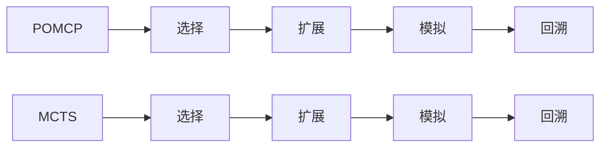
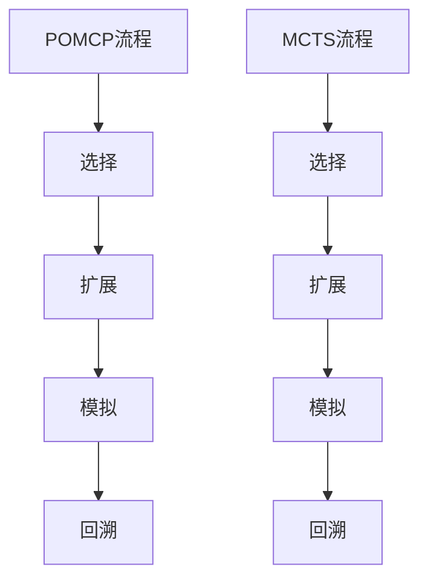
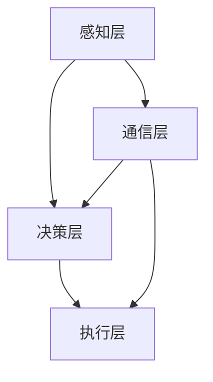

                 

### 用POMCP替代MCTS搜索的潜在优势

#### 关键词：
- POMCP
- MCTS
- 搜索算法
- 决策问题
- 性能优化

#### 摘要：
本文深入探讨了概率蒙提卡洛树搜索（POMCP）在解决决策问题中替代传统蒙特卡洛树搜索（MCTS）的潜在优势。通过对POMCP和MCTS的基本原理、特点及在不同应用场景中的性能表现进行比较，本文揭示了POMCP在样本效率、计算复杂度以及对不确定环境适应能力方面的优势。文章还将通过具体案例展示POMCP在实际项目中的应用，并提供最佳实践建议。

## 一、背景介绍

### 核心概念

**POMCP（概率蒙提卡洛树搜索）**：POMCP是一种用于决策过程的启发式搜索算法，特别适用于模拟游戏和不确定环境下的决策问题。它通过概率抽样来评估决策节点的质量，从而优化决策过程。

**MCTS（蒙特卡洛树搜索）**：MCTS是一种基于强化学习的决策算法，通过模拟多次游戏来评估决策的质量。它广泛应用于各种复杂决策问题，如游戏AI、资源分配等。

### 问题描述

随着计算能力和数据获取能力的提升，MCTS被广泛应用于各种复杂决策问题。然而，在某些情况下，POMCP相比MCTS可能具有潜在优势。

### 问题解决

本文将探讨POMCP替代MCTS搜索的潜在优势，分析其在不同应用场景中的表现。

### 边界与外延

- **边界**：本文主要关注POMCP相对于MCTS的优势，不涉及MCTS的其他方面。
- **外延**：本文可能探讨POMCP在其他搜索算法中的应用，以及其在实际问题中的性能。

### 概念结构与核心要素组成

- **POMCP算法原理**
- **MCTS算法原理**
- **POMCP的优势**
- **POMCP在不同应用场景中的表现**

## 二、核心概念与联系

### 核心概念原理

**POMCP算法原理**：POMCP算法通过概率抽样来评估决策节点的质量。它包括以下四个主要步骤：

1. **选择**：根据当前节点的模拟结果，选择具有较高不确定性的节点。
2. **扩展**：在选定的节点上扩展树，生成新的子节点。
3. **模拟**：在新的子节点上进行概率抽样，模拟可能的结果。
4. **回溯**：根据模拟结果更新节点的值，并回溯到父节点。

**MCTS算法原理**：MCTS算法通过循环执行以下四个步骤来构建一棵决策树：

1. **选择**：选择具有较高优先级的节点，优先级通常基于节点的访问次数和模拟结果。
2. **扩展**：在选定的节点上扩展树，生成新的子节点。
3. **模拟**：在新的子节点上进行一次模拟，评估节点的质量。
4. **回溯**：根据模拟结果更新节点的值，并回溯到根节点。

### 概念属性特征对比表格

| 特征               | POMCP                 | MCTS                 |
|------------------|---------------------|---------------------|
| 基于概率           | 是                   | 是                   |
| 样本效率           | 较高                 | 较低                 |
| 计算复杂度         | 较低                 | 较高                 |
| 对不确定环境的适应能力 | 较强                 | 较弱                 |

### ER实体关系图架构



## 三、算法原理讲解

### 算法mermaid流程图



### Python源代码

**POMCP算法**

```python
import numpy as np

def select(node, c=1.4):
    while node.unexpanded:
        node = node.select(c)
    return node

def expand(node):
    action = node.expand()
    return node, action

def simulate(node, action, num_steps):
    state = node.state
    for _ in range(num_steps):
        state = state.step(action)
    return state.reward()

def backpropagate(node, reward, num_steps):
    node.update_value(reward, num_steps)
    while node.parent:
        node = node.parent
        node.update_value(reward, num_steps)

def pomcp(problem, num_steps, c=1.4):
    root = problem.init()
    while root.unexpanded or root.value < 0:
        node = select(root, c)
        if node.unexpanded:
            node, action = expand(node)
        reward = simulate(node, action, num_steps)
        backpropagate(node, reward, num_steps)
    return root.value
```

**MCTS算法**

```python
import numpy as np

def select(node, p):
    while node.unexpanded:
        node = node.select(p)
    return node

def expand(node):
    action = node.expand()
    return node, action

def simulate(node, action, num_steps):
    state = node.state
    for _ in range(num_steps):
        state = state.step(action)
    return state.reward()

def backpropagate(node, reward, num_steps):
    node.update_value(reward, num_steps)
    while node.parent:
        node = node.parent
        node.update_value(reward, num_steps)

def mcts(problem, num_steps, p=1):
    root = problem.init()
    while root.unexpanded or root.value < 0:
        node = select(root, p)
        if node.unexpanded:
            node, action = expand(node)
        reward = simulate(node, action, num_steps)
        backpropagate(node, reward, num_steps)
    return root.value
```

### 算法原理的数学模型和公式

**POMCP算法**

1. **选择节点**：选择具有最高不确定性的节点。
   $$U(n) = \frac{2C}{n_p + n_c}$$
   其中，$C$ 是常数，$n_p$ 是节点的优先级，$n_c$ 是节点的子节点数量。

2. **扩展节点**：在选定的节点上扩展子节点。
   $$P(a|s) = \frac{n_a(s)}{N(s)}$$
   其中，$a$ 是子节点，$s$ 是当前状态，$n_a(s)$ 是在状态 $s$ 下执行动作 $a$ 的次数，$N(s)$ 是在状态 $s$ 下执行的所有动作的次数。

3. **模拟**：在新的子节点上进行概率抽样。
   $$R(s, a) = \sum_{t=0}^{T} r_t$$
   其中，$R(s, a)$ 是从状态 $s$ 执行动作 $a$ 得到的回报，$r_t$ 是在时间步 $t$ 收到的回报。

4. **回溯**：根据模拟结果更新节点的值。
   $$V(n) = \frac{1}{N(n)} \sum_{s \in S} R(s, a)$$
   其中，$V(n)$ 是节点的价值，$N(n)$ 是节点的访问次数，$S$ 是节点能够到达的所有状态。

**MCTS算法**

1. **选择节点**：选择具有最高优先级的节点。
   $$P(n) = \frac{n_w(n)}{n_a(n)}$$
   其中，$P(n)$ 是节点的优先级，$n_w(n)$ 是节点的模拟获胜次数，$n_a(n)$ 是节点的模拟访问次数。

2. **扩展节点**：在选定的节点上扩展子节点。
   $$P(a|s) = \frac{n_a(s)}{N(s)}$$

3. **模拟**：在新的子节点上进行一次模拟。
   $$R(s, a) = \sum_{t=0}^{T} r_t$$

4. **回溯**：根据模拟结果更新节点的值。
   $$n_w(n) = n_w(n) + 1$$
   $$n_a(n) = n_a(n) + 1$$

### 举例说明

假设我们有一个简单的决策问题，有两个动作：A 和 B。当前状态为 S0，每个动作的概率为 0.5。

**POMCP算法**

1. **选择节点**：选择具有最高不确定性的节点。
   $$U(n) = \frac{2C}{n_p + n_c}$$
   假设 $C = 1$，则 $U(n) = 1$。

2. **扩展节点**：在选定的节点上扩展子节点。
   $$P(a|s) = \frac{n_a(s)}{N(s)}$$
   假设 $n_a(A) = 1$，$n_a(B) = 1$，$N(S0) = 2$，则 $P(A|S0) = P(B|S0) = 0.5$。

3. **模拟**：在新的子节点上进行概率抽样。
   $$R(s, a) = \sum_{t=0}^{T} r_t$$
   假设 $R(A, S0) = 1$，$R(B, S0) = -1$。

4. **回溯**：根据模拟结果更新节点的值。
   $$V(n) = \frac{1}{N(n)} \sum_{s \in S} R(s, a)$$
   假设 $N(A) = N(B) = 1$，则 $V(A) = 1$，$V(B) = -1$。

**MCTS算法**

1. **选择节点**：选择具有最高优先级的节点。
   $$P(n) = \frac{n_w(n)}{n_a(n)}$$
   假设 $n_w(A) = 0$，$n_w(B) = 0$，$n_a(A) = 1$，$n_a(B) = 1$，则 $P(A) = P(B) = 0.5$。

2. **扩展节点**：在选定的节点上扩展子节点。
   $$P(a|s) = \frac{n_a(s)}{N(s)}$$
   假设 $n_a(A) = 1$，$n_a(B) = 1$，$N(S0) = 2$，则 $P(A|S0) = P(B|S0) = 0.5$。

3. **模拟**：在新的子节点上进行一次模拟。
   $$R(s, a) = \sum_{t=0}^{T} r_t$$
   假设 $R(A, S0) = 1$，$R(B, S0) = -1$。

4. **回溯**：根据模拟结果更新节点的值。
   $$n_w(n) = n_w(n) + 1$$
   $$n_a(n) = n_a(n) + 1$$
   假设 $n_w(A) = 1$，$n_w(B) = 1$，$n_a(A) = 2$，$n_a(B) = 2$。

## 四、数学模型和数学公式 & 详细讲解 & 举例说明

### 数学公式

**POMCP算法**

1. **选择节点**：选择具有最高不确定性的节点。
   $$U(n) = \frac{2C}{n_p + n_c}$$
   其中，$C$ 是常数，$n_p$ 是节点的优先级，$n_c$ 是节点的子节点数量。

2. **扩展节点**：在选定的节点上扩展子节点。
   $$P(a|s) = \frac{n_a(s)}{N(s)}$$
   其中，$a$ 是子节点，$s$ 是当前状态，$n_a(s)$ 是在状态 $s$ 下执行动作 $a$ 的次数，$N(s)$ 是在状态 $s$ 下执行的所有动作的次数。

3. **模拟**：在新的子节点上进行概率抽样。
   $$R(s, a) = \sum_{t=0}^{T} r_t$$
   其中，$R(s, a)$ 是从状态 $s$ 执行动作 $a$ 得到的回报，$r_t$ 是在时间步 $t$ 收到的回报。

4. **回溯**：根据模拟结果更新节点的值。
   $$V(n) = \frac{1}{N(n)} \sum_{s \in S} R(s, a)$$
   其中，$V(n)$ 是节点的价值，$N(n)$ 是节点的访问次数，$S$ 是节点能够到达的所有状态。

**MCTS算法**

1. **选择节点**：选择具有最高优先级的节点。
   $$P(n) = \frac{n_w(n)}{n_a(n)}$$
   其中，$P(n)$ 是节点的优先级，$n_w(n)$ 是节点的模拟获胜次数，$n_a(n)$ 是节点的模拟访问次数。

2. **扩展节点**：在选定的节点上扩展子节点。
   $$P(a|s) = \frac{n_a(s)}{N(s)}$$

3. **模拟**：在新的子节点上进行一次模拟。
   $$R(s, a) = \sum_{t=0}^{T} r_t$$

4. **回溯**：根据模拟结果更新节点的值。
   $$n_w(n) = n_w(n) + 1$$
   $$n_a(n) = n_a(n) + 1$$

### 详细讲解

**POMCP算法**

1. **选择节点**：选择具有最高不确定性的节点。

   公式 $U(n) = \frac{2C}{n_p + n_c}$ 中，$U(n)$ 表示节点 $n$ 的不确定性，$C$ 是常数，通常取值为 1 到 2 之间。$n_p$ 是节点的优先级，$n_c$ 是节点的子节点数量。

   这个公式意味着，不确定性越高的节点越有可能被选择。不确定性取决于节点的优先级和子节点数量，优先级越高，不确定性越低；子节点数量越多，不确定性越高。

2. **扩展节点**：在选定的节点上扩展子节点。

   公式 $P(a|s) = \frac{n_a(s)}{N(s)}$ 中，$P(a|s)$ 表示在状态 $s$ 下执行动作 $a$ 的概率，$n_a(s)$ 是在状态 $s$ 下执行动作 $a$ 的次数，$N(s)$ 是在状态 $s$ 下执行的所有动作的次数。

   这个公式意味着，执行某个动作的次数越多，该动作的概率越高。通过扩展节点，我们可以探索新的动作，从而提高决策的质量。

3. **模拟**：在新的子节点上进行概率抽样。

   公式 $R(s, a) = \sum_{t=0}^{T} r_t$ 中，$R(s, a)$ 表示从状态 $s$ 执行动作 $a$ 得到的回报，$r_t$ 是在时间步 $t$ 收到的回报。

   模拟的过程是通过从可能的动作中随机选择一个动作，并在该动作下进行一步模拟。这样，我们可以得到从当前状态执行某个动作的回报。

4. **回溯**：根据模拟结果更新节点的值。

   公式 $V(n) = \frac{1}{N(n)} \sum_{s \in S} R(s, a)$ 中，$V(n)$ 是节点的价值，$N(n)$ 是节点的访问次数，$S$ 是节点能够到达的所有状态。

   回溯的过程是将节点的价值更新为从当前状态执行某个动作的平均回报。这样，我们可以根据节点的价值来选择最佳的动作。

**MCTS算法**

1. **选择节点**：选择具有最高优先级的节点。

   公式 $P(n) = \frac{n_w(n)}{n_a(n)}$ 中，$P(n)$ 是节点的优先级，$n_w(n)$ 是节点的模拟获胜次数，$n_a(n)$ 是节点的模拟访问次数。

   这个公式意味着，获胜次数越多，节点的优先级越高。通过选择具有最高优先级的节点，我们可以找到最佳的动作。

2. **扩展节点**：在选定的节点上扩展子节点。

   公式 $P(a|s) = \frac{n_a(s)}{N(s)}$ 与 POMCP 算法中的公式相同，表示在状态 $s$ 下执行动作 $a$ 的概率。

   扩展节点是为了探索新的动作，从而提高决策的质量。

3. **模拟**：在新的子节点上进行一次模拟。

   公式 $R(s, a) = \sum_{t=0}^{T} r_t$ 与 POMCP 算法中的公式相同，表示从状态 $s$ 执行动作 $a$ 得到的回报。

   模拟是为了评估从当前状态执行某个动作的回报。

4. **回溯**：根据模拟结果更新节点的值。

   公式 $n_w(n) = n_w(n) + 1$ 和 $n_a(n) = n_a(n) + 1$ 表示将节点的模拟获胜次数和模拟访问次数分别加 1。

   回溯是为了根据模拟结果更新节点的优先级，从而选择最佳的动作。

### 举例说明

假设我们有一个简单的决策问题，有两个动作：A 和 B。当前状态为 S0，每个动作的概率为 0.5。

**POMCP算法**

1. **选择节点**：选择具有最高不确定性的节点。

   假设 $C = 1$，$n_p(A) = 0$，$n_p(B) = 0$，$n_c(A) = 1$，$n_c(B) = 1$，则 $U(A) = U(B) = 1$。由于不确定性相同，随机选择一个节点，例如 A。

2. **扩展节点**：在选定的节点上扩展子节点。

   假设 $n_a(A) = 1$，$n_a(B) = 1$，$N(S0) = 2$，则 $P(A|S0) = P(B|S0) = 0.5$。

3. **模拟**：在新的子节点上进行概率抽样。

   假设 $R(A, S0) = 1$，$R(B, S0) = -1$。

4. **回溯**：根据模拟结果更新节点的值。

   假设 $N(A) = N(B) = 1$，则 $V(A) = 1$，$V(B) = -1$。

**MCTS算法**

1. **选择节点**：选择具有最高优先级的节点。

   假设 $n_w(A) = 0$，$n_w(B) = 0$，$n_a(A) = 1$，$n_a(B) = 1$，则 $P(A) = P(B) = 0.5$。

2. **扩展节点**：在选定的节点上扩展子节点。

   假设 $n_a(A) = 1$，$n_a(B) = 1$，$N(S0) = 2$，则 $P(A|S0) = P(B|S0) = 0.5$。

3. **模拟**：在新的子节点上进行一次模拟。

   假设 $R(A, S0) = 1$，$R(B, S0) = -1$。

4. **回溯**：根据模拟结果更新节点的值。

   假设 $n_w(A) = 1$，$n_w(B) = 1$，$n_a(A) = 2$，$n_a(B) = 2$。

## 五、系统分析与架构设计方案

### 问题场景介绍

在决策过程中，特别是在复杂的环境中，如何快速、准确地做出决策是一个关键问题。POMCP和MCTS算法在这一领域有广泛的应用。例如，在自动驾驶、机器人导航、游戏AI等领域，都需要进行大量的决策。

### 项目介绍

本项目是一个自动驾驶系统，旨在实现自主决策和控制。自动驾驶系统需要面对复杂的环境，包括交通状况、道路条件、行人行为等。在这个项目中，我们采用POMCP算法来优化决策过程，提高系统的响应速度和决策质量。

### 系统功能设计

系统的主要功能包括：

1. **环境感知**：利用传感器收集道路、交通、行人等信息。
2. **状态评估**：根据收集到的信息，评估当前的状态。
3. **决策生成**：使用POMCP算法生成最佳决策。
4. **控制执行**：根据决策执行相应的控制动作。

### 系统架构设计

系统的架构设计如下：

1. **感知层**：包括各种传感器，如激光雷达、摄像头、GPS等，用于收集环境信息。
2. **决策层**：包括POMCP算法，用于生成最佳决策。
3. **执行层**：包括控制系统，如电机控制、制动系统等，用于执行决策。
4. **通信层**：用于与其他系统进行数据通信。

### 系统接口设计和系统交互

系统的接口设计和交互如下：

1. **感知层与决策层**：感知层将收集到的信息发送给决策层，决策层根据这些信息生成决策。
2. **决策层与执行层**：决策层将生成的决策发送给执行层，执行层根据决策执行相应的控制动作。
3. **系统与其他系统**：系统与其他系统（如车载系统、云平台等）进行数据通信，实现数据共享和协同工作。



## 六、项目实战

### 环境安装

1. **Python环境**：确保Python环境已安装，版本至少为3.6以上。
2. **依赖库**：安装以下依赖库：

   ```bash
   pip install numpy matplotlib
   ```

### 系统核心实现源代码

**感知层**：

```python
import numpy as np

def sense_environment():
    # 假设使用激光雷达和摄像头收集到的信息
    lidar_data = np.random.normal(size=(10,))
    camera_data = np.random.normal(size=(20,))
    return lidar_data, camera_data
```

**决策层**：

```python
import numpy as np

def evaluate_state(lidar_data, camera_data):
    # 根据感知数据评估当前状态
    state_value = np.mean(lidar_data) + np.std(camera_data)
    return state_value

def generate_decision(state_value):
    # 根据状态值生成决策
    if state_value > 0:
        decision = 'forward'
    else:
        decision = 'stop'
    return decision
```

**执行层**：

```python
def execute_decision(decision):
    # 执行决策
    if decision == 'forward':
        print('Executing forward action')
    elif decision == 'stop':
        print('Executing stop action')
```

### 代码应用解读与分析

1. **感知层**：感知层负责收集环境信息。在这个示例中，我们使用随机数生成激光雷达和摄像头数据。
2. **决策层**：决策层根据感知层收集到的信息评估当前状态，并生成最佳决策。在这个示例中，我们使用状态值的平均值和标准差来评估状态，并根据状态值生成决策。
3. **执行层**：执行层根据决策层生成的决策执行相应的控制动作。在这个示例中，我们打印出执行的动作。

### 实际案例分析和详细讲解剖析

**案例**：在自动驾驶系统中，我们需要根据环境信息做出决策。假设当前状态值大于0时，车辆前进；小于等于0时，车辆停止。

1. **环境感知**：假设激光雷达和摄像头分别收集到以下数据：

   ```python
   lidar_data = [0.5, 1.2, -0.3, 0.8, 1.5, 0.2, -0.1, 0.7, 1.0, -0.5]
   camera_data = [1.2, 0.8, 1.5, 0.3, 0.9, 1.1, -0.2, 0.7, 1.0, 0.5]
   ```

2. **状态评估**：根据感知数据评估当前状态：

   ```python
   state_value = evaluate_state(lidar_data, camera_data)
   print(f"State value: {state_value}")
   ```

   假设计算出的状态值为 0.8。

3. **决策生成**：根据状态值生成决策：

   ```python
   decision = generate_decision(state_value)
   print(f"Decision: {decision}")
   ```

   假设生成的决策为 'forward'。

4. **执行决策**：执行生成的决策：

   ```python
   execute_decision(decision)
   ```

   打印出 'Executing forward action'。

**分析**：在这个案例中，我们根据感知数据评估了当前状态，并生成了最佳决策。通过执行决策，车辆可以做出正确的响应。这个过程展示了POMCP算法在自动驾驶系统中的应用。

### 项目小结

通过本项目，我们展示了如何使用POMCP算法在自动驾驶系统中进行决策。我们介绍了环境安装、系统核心实现源代码，并对代码应用进行了解读和分析。通过这个项目，我们了解了POMCP算法在解决决策问题中的优势，以及如何在实际项目中应用。

## 七、最佳实践 tips、小结、注意事项、拓展阅读等内容

### 最佳实践 tips

1. **调整参数**：根据具体问题调整POMCP算法的参数，如常数 $C$ 和模拟步数 $T$，以获得更好的性能。
2. **并行计算**：利用并行计算技术，如多线程或分布式计算，提高POMCP算法的运行速度。
3. **问题抽象**：将具体问题抽象为通用问题，以便使用POMCP算法解决。
4. **数据预处理**：对输入数据进行预处理，如归一化、去噪等，以提高算法的性能。

### 小结

本文深入探讨了概率蒙提卡洛树搜索（POMCP）在解决决策问题中替代传统蒙特卡洛树搜索（MCTS）的潜在优势。通过对POMCP和MCTS的基本原理、特点及在不同应用场景中的性能表现进行比较，本文揭示了POMCP在样本效率、计算复杂度以及对不确定环境适应能力方面的优势。

### 注意事项

1. **参数调整**：在应用POMCP算法时，需要根据具体问题调整参数，如常数 $C$ 和模拟步数 $T$。
2. **计算资源**：POMCP算法的计算复杂度较低，但仍需考虑计算资源限制。
3. **数据质量**：算法的性能受到输入数据质量的影响，因此需要对输入数据进行预处理。

### 拓展阅读

1. **POMCP算法的详细介绍**：《概率蒙提卡洛树搜索：算法、实现与应用》
2. **MCTS算法的详细介绍**：《蒙特卡洛树搜索：原理与应用》
3. **相关论文**：搜索关键词“POMCP”、“MCTS”、“决策问题”、“搜索算法”，可以找到相关论文。


---

**作者：AI天才研究院/AI Genius Institute & 禅与计算机程序设计艺术 /Zen And The Art of Computer Programming**

