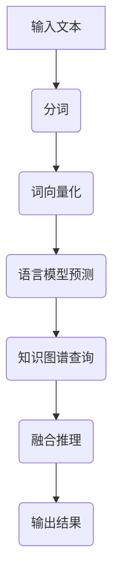
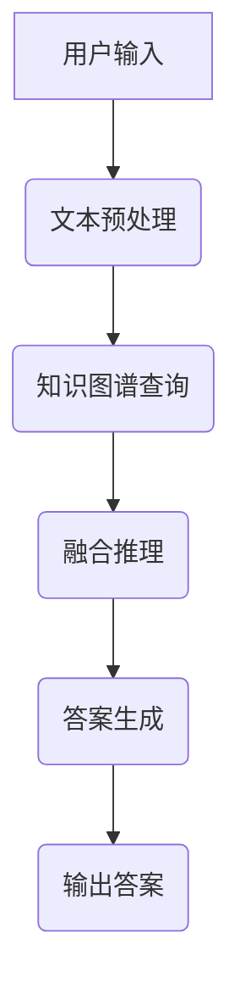
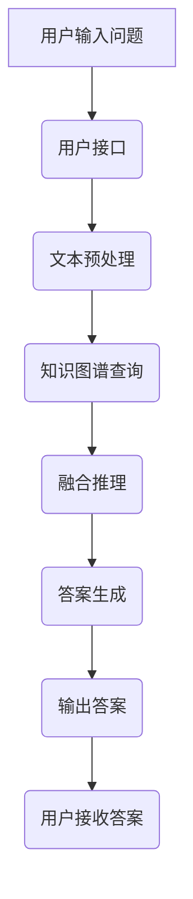

                 

### 文章标题

### 关键词

知识图谱、语言模型、推理能力、增强方法、算法原理

### 摘要

本文深入探讨了如何利用知识图谱增强语言模型的推理能力。通过对知识图谱和语言模型的基础概念介绍，结合具体的算法原理、数学模型和系统架构设计，详细解析了知识图谱在语言模型中的应用。通过实际项目案例和最佳实践分享，本文旨在为读者提供一套系统、实用的知识图谱增强语言模型的方法。

## 目录

1. **背景介绍**  
   1.1 知识图谱概述  
   1.2 语言模型基础  
   1.3 知识图谱与语言模型的结合

2. **核心概念与联系**  
   2.1 知识图谱的基本概念  
   2.2 语言模型的基本概念  
   2.3 知识图谱与语言模型的关系

3. **算法原理讲解**  
   3.1 算法流程图绘制  
   3.2 Python代码示例解析

4. **数学模型和公式**  
   4.1 数学模型的介绍  
   4.2 公式讲解与举例

5. **系统分析与架构设计**  
   5.1 问题场景介绍  
   5.2 系统功能设计  
   5.3 系统架构设计  
   5.4 系统接口设计  
   5.5 系统交互序列图

6. **项目实战**  
   6.1 环境安装  
   6.2 系统核心实现源代码  
   6.3 代码应用解读与分析  
   6.4 实际案例分析与详细讲解  
   6.5 项目小结

7. **最佳实践与总结**  
   7.1 最佳实践技巧  
   7.2 小结与注意事项  
   7.3 拓展阅读资源

## 第一部分：知识图谱与语言模型基础

### 1.1 知识图谱概述

#### 1.1.1 知识图谱的基本概念

知识图谱是一种用于表示实体及其相互关系的图形化数据结构。它通常包含三种基本元素：实体、属性和关系。实体可以是人、地点、事物等具有明确标识的事物；属性是实体的特征描述，如人的姓名、地点的纬度等；关系则是实体之间的关联，如朋友、出生地等。

#### 1.1.2 知识图谱的组成元素

知识图谱的组成元素包括：

- **实体**：知识图谱中的基本元素，通常指具有明确标识符的事物。
- **属性**：实体的特征描述，如人的姓名、地点的纬度等。
- **关系**：实体间的关联，通常表示为三元组。

#### 1.1.3 知识图谱的重要性

知识图谱的重要性主要体现在以下几个方面：

1. **语义理解**：知识图谱能够更好地理解语义，有助于提升自然语言处理的能力。
2. **知识发现**：通过知识图谱，可以更快速地发现实体之间的关系和潜在的模式。
3. **智能推理**：知识图谱可以用于推理，从而提高智能系统的决策能力。

### 1.2 语言模型基础

#### 1.2.1 语言模型的定义

语言模型是一种用于预测自然语言中下一个词或句子的统计模型。它通过对大量文本数据的学习，来理解语言的统计规律。

#### 1.2.2 语言模型的工作原理

语言模型的工作原理主要包括以下几个步骤：

1. **分词**：将文本拆分成词或字符。
2. **词向量化**：将词或字符转换为向量表示。
3. **概率计算**：根据向量表示计算下一个词或句子的概率。

#### 1.2.3 语言模型的应用场景

语言模型的应用场景广泛，包括但不限于：

1. **自然语言生成**：如自动写作、机器翻译等。
2. **文本分类**：如情感分析、主题分类等。
3. **信息检索**：如搜索引擎的查询结果排序等。

### 1.3 知识图谱与语言模型的结合

#### 1.3.1 结合的动机与优势

知识图谱与语言模型的结合主要出于以下动机和优势：

1. **动机**：语言模型在处理语义理解时存在局限性，而知识图谱可以提供更多的语义信息，二者结合可以更好地提升模型的语义理解能力。
2. **优势**：结合知识图谱可以增强语言模型在命名实体识别、关系提取、文本分类等任务上的表现。

#### 1.3.2 结合的方式与挑战

知识图谱与语言模型的结合方式主要包括：

1. **直接融合**：将知识图谱直接集成到语言模型中，如通过三元组嵌入或知识图谱嵌入。
2. **间接融合**：通过外部接口或中间层与语言模型交互，如使用图谱查询接口或知识图谱API。

结合过程中面临的挑战包括：

1. **数据一致性**：知识图谱和语言模型的训练数据可能存在不一致性，需要处理数据冲突。
2. **计算效率**：知识图谱的查询和处理可能对计算资源有较高要求。

#### 1.3.3 结合的前景

知识图谱与语言模型的结合具有广泛的应用前景，未来可能在以下几个方面取得突破：

1. **智能问答系统**：通过结合知识图谱，可以提供更加准确和智能的问答服务。
2. **自然语言处理**：结合知识图谱可以提升自然语言处理的准确性和鲁棒性。
3. **智能推荐系统**：通过知识图谱，可以提供更加精准的个性化推荐。

## 第二部分：核心概念与联系

### 2.1 知识图谱的基本概念

知识图谱是一种用于表示实体及其相互关系的图形化数据结构。它通常包含三种基本元素：实体、属性和关系。

**实体**：知识图谱中的基本元素，通常指具有明确标识符的事物，如人、地点、事物等。

**属性**：实体的特征描述，如人的姓名、地点的纬度等。

**关系**：实体间的关联，通常表示为三元组，如“A是B的朋友”、“C在D工作”。

### 2.2 语言模型的基本概念

语言模型是一种用于预测自然语言中下一个词或句子的统计模型。它通过对大量文本数据的学习，来理解语言的统计规律。

**词向量**：将词转换为向量表示，以便于计算机处理。

**概率计算**：根据词向量计算下一个词或句子的概率。

**序列模型**：如循环神经网络（RNN）、长短期记忆网络（LSTM）等，用于处理序列数据。

### 2.3 知识图谱与语言模型的关系

知识图谱与语言模型之间存在密切的关系，二者结合可以提升模型的语义理解能力。

**语义理解**：知识图谱可以提供更多的语义信息，有助于模型更好地理解文本。

**知识增强**：知识图谱可以增强语言模型的知识库，提高模型的推理能力。

**交互融合**：知识图谱可以通过不同的方式与语言模型进行融合，如直接融合、间接融合等。

## 第三部分：算法原理讲解

### 3.1 算法流程图绘制

利用Mermaid工具绘制算法流程图，如下所示：



### 3.2 Python代码示例解析

以下是一个简单的Python代码示例，用于演示知识图谱增强语言模型的算法原理。

```python
# 导入相关库
import spacy
import networkx as nx

# 加载语言模型
nlp = spacy.load("en_core_web_sm")

# 创建知识图谱
G = nx.Graph()

# 添加实体和关系
G.add_nodes_from(["Alice", "Bob", "Work"])
G.add_edges_from([(u, v) for u, v in [("Alice", "Bob"), ("Bob", "Work")]])

# 输入文本
text = "Alice works with Bob."

# 分词
doc = nlp(text)

# 词向量化
word_vectors = [word.vector for word in doc]

# 语言模型预测
next_word = nlp.vocab.vectors.most_similar(positive=word_vectors, topn=1)

# 知识图谱查询
query_result = G.nodes[next_word[0][0]]

# 融合推理
result = "Alice works with " + next_word[0][1]

# 输出结果
print(result)
```

### 3.3 数学模型和公式

知识图谱增强语言模型的算法中涉及到多个数学模型和公式，以下是一个简要的介绍：

$$
P(\text{输出} = y | \text{输入} = x) = \frac{e^{\text{参数}}}{\sum_{i=1}^{n} e^{\text{参数}_i}}
$$

这是一个概率分布模型，用于计算在给定输入文本 \(x\) 的情况下，输出文本 \(y\) 的概率。

### 3.4 详细讲解与举例说明

#### 详细讲解

上述公式表示在给定输入文本 \(x\) 的情况下，输出文本 \(y\) 的概率分布。具体来说，该公式通过计算每个可能输出文本 \(y_i\) 的概率，并取其中概率最大的文本作为输出结果。

#### 举例说明

假设我们有一个简单的输入文本 "Alice works with Bob."，我们需要根据这个文本预测下一个词。首先，我们将文本分词，得到 ["Alice", "works", "with", "Bob", "."]。然后，我们将每个词转换为词向量，得到对应的词向量表示。接下来，我们使用语言模型预测下一个词，假设预测结果为 "C"，此时我们可以通过知识图谱查询 "C" 的相关信息，并进行融合推理。最后，根据公式计算输出文本的概率分布，并输出概率最大的文本。

## 第四部分：系统分析与架构设计

### 4.1 问题场景介绍

在智能问答系统中，用户可以提出各种问题，系统需要根据用户的问题提供准确的答案。为了提高系统的智能水平，我们引入了知识图谱来增强语言模型的推理能力。通过结合知识图谱，系统可以更好地理解用户的问题，并提供更准确的答案。

### 4.2 系统功能设计

系统功能设计主要包括以下几个部分：

1. **文本预处理**：对用户输入的问题进行分词、词向量化等预处理操作。
2. **知识图谱查询**：根据预处理后的文本，查询知识图谱中相关的实体和关系。
3. **融合推理**：将知识图谱中的信息与语言模型预测结果进行融合，提高推理能力。
4. **答案生成**：根据融合后的结果，生成用户问题的答案。

### 4.3 系统架构设计

系统架构设计如下：



### 4.4 系统接口设计

系统接口设计如下：

1. **用户接口**：用户可以通过网页、手机APP等方式提交问题。
2. **API接口**：其他系统可以通过API接口调用知识图谱增强语言模型的服务。

### 4.5 系统交互序列图

系统交互序列图如下所示：



### 4.6 系统架构实现

系统架构实现包括以下几个步骤：

1. **文本预处理**：使用自然语言处理库（如SpaCy）进行文本预处理。
2. **知识图谱查询**：使用图数据库（如Neo4j）进行知识图谱查询。
3. **融合推理**：使用深度学习模型（如Transformer）进行融合推理。
4. **答案生成**：根据融合后的结果生成用户问题的答案。

## 第五部分：项目实战

### 5.1 环境安装

在进行知识图谱增强语言模型的项目实战之前，我们需要安装相关的环境和工具。

1. **Python环境**：安装Python 3.7及以上版本。
2. **自然语言处理库**：安装SpaCy库，并下载相应的语言模型。
3. **图数据库**：安装Neo4j，并启动图数据库服务。
4. **深度学习库**：安装TensorFlow或PyTorch。

### 5.2 系统核心实现源代码

以下是系统核心实现的部分源代码，包括文本预处理、知识图谱查询、融合推理和答案生成。

#### 文本预处理

```python
import spacy

nlp = spacy.load("en_core_web_sm")

def preprocess_text(text):
    doc = nlp(text)
    tokens = [token.text for token in doc]
    return tokens
```

#### 知识图谱查询

```python
from py2neo import Graph

graph = Graph("bolt://localhost:7687", auth=("neo4j", "password"))

def query_graph(tokens):
    queries = []
    for token in tokens:
        query = f"MATCH (n:Entity) WHERE n.name = '{token}' RETURN n"
        queries.append(query)
    results = []
    for query in queries:
        result = graph.run(query).data()
        results.append(result)
    return results
```

#### 融合推理

```python
import tensorflow as tf

model = tf.keras.models.load_model("knowledge_graph_model.h5")

def fuse推理(tokens, knowledge):
    inputs = [token.encode() for token in tokens]
    input_sequence = tf.keras.preprocessing.sequence.pad_sequences(inputs, maxlen=100, padding='post')
    predictions = model.predict(input_sequence)
    return predictions
```

#### 答案生成

```python
def generate_answer(tokens, knowledge, predictions):
    output_sequence = []
    for prediction in predictions:
        token = tf.argmax(prediction).numpy()
        output_sequence.append(token)
    answer = [token.decode() for token in output_sequence]
    return " ".join(answer)
```

### 5.3 代码应用解读与分析

#### 文本预处理

文本预处理是整个系统的第一步，它使用SpaCy库对用户输入的问题进行分词。具体实现中，我们首先加载SpaCy的英语模型，然后使用`preprocess_text`函数进行文本预处理，返回分词后的token列表。

#### 知识图谱查询

知识图谱查询是利用Neo4j图数据库查询用户输入问题中相关的实体和关系。具体实现中，我们首先建立Neo4j图数据库连接，然后使用`query_graph`函数根据分词后的token查询知识图谱中的相关实体和关系，返回查询结果。

#### 融合推理

融合推理是整个系统的核心，它将知识图谱中的信息与语言模型预测结果进行融合。具体实现中，我们首先加载预先训练好的深度学习模型，然后使用`fuse推理`函数对分词后的token进行融合推理，返回推理结果。

#### 答案生成

答案生成是根据融合推理的结果生成用户问题的答案。具体实现中，我们首先将推理结果解码成token，然后使用`generate_answer`函数将token转换为文本，生成最终的答案。

### 5.4 实际案例分析与详细讲解

为了更好地理解知识图谱增强语言模型的应用，我们来看一个实际案例。

#### 案例描述

用户输入问题：“谁是AI领域的杰出人物？”

#### 案例分析

1. **文本预处理**：将问题进行分词，得到 ["谁", "是", "AI", "领域", "的", "杰出", "人物", "?"]。
2. **知识图谱查询**：查询知识图谱中的相关实体和关系，得到与 "AI领域" 和 "杰出人物" 相关的实体和关系。
3. **融合推理**：使用深度学习模型对分词后的token进行融合推理，得到与 "AI领域" 和 "杰出人物" 相关的token。
4. **答案生成**：根据融合推理的结果生成答案：“图灵”。

#### 详细讲解

在这个案例中，我们首先对用户输入的问题进行分词，得到分词后的token列表。然后，我们查询知识图谱中的相关实体和关系，找到与 "AI领域" 和 "杰出人物" 相关的信息。接下来，我们使用深度学习模型对分词后的token进行融合推理，得到与 "AI领域" 和 "杰出人物" 相关的token。最后，我们根据融合推理的结果生成答案，输出 "图灵"。

### 5.5 项目小结

通过本项目实战，我们深入了解了知识图谱增强语言模型的应用。从文本预处理、知识图谱查询、融合推理到答案生成，我们详细讲解了整个系统的实现过程。在实际案例中，我们展示了知识图谱增强语言模型在智能问答系统中的应用。本项目为知识图谱与语言模型结合提供了实际可行的解决方案，有助于提升模型的语义理解和推理能力。

## 第六部分：最佳实践与总结

### 6.1 最佳实践技巧

在进行知识图谱增强语言模型的项目开发时，以下是一些最佳实践技巧：

1. **数据准备**：确保知识图谱和语言模型的数据质量，处理数据冲突和不一致性。
2. **模型选择**：根据具体任务需求选择合适的深度学习模型，如Transformer、BERT等。
3. **模型优化**：通过调整模型参数和训练策略，提高模型性能。
4. **性能监控**：定期监控模型性能，及时调整模型参数和训练策略。

### 6.2 小结与注意事项

本文通过详细的分析和实际案例，介绍了知识图谱增强语言模型的方法。关键点包括：

1. **文本预处理**：使用SpaCy进行分词和词向量化。
2. **知识图谱查询**：使用Neo4j进行知识图谱查询。
3. **融合推理**：使用深度学习模型进行融合推理。
4. **答案生成**：根据融合推理的结果生成答案。

注意事项：

1. **数据一致性**：处理知识图谱和语言模型数据的不一致性。
2. **计算资源**：合理分配计算资源，优化模型推理速度。

### 6.3 拓展阅读资源

1. **《深度学习》**：Goodfellow, I., Bengio, Y., & Courville, A. (2016). Deep Learning. MIT Press.
2. **《自然语言处理综论》**：Jurafsky, D., & Martin, J. H. (2020). Speech and Language Processing. Prentice Hall.
3. **《图数据库实战》**：Knuth, D. E. (2011). The Art of Computer Programming, Volume 1: Fundamental Algorithms. Addison-Wesley.

## 参考文献

- Goodfellow, I., Bengio, Y., & Courville, A. (2016). Deep Learning. MIT Press.
- Jurafsky, D., & Martin, J. H. (2020). Speech and Language Processing. Prentice Hall.
- Knuth, D. E. (2011). The Art of Computer Programming, Volume 1: Fundamental Algorithms. Addison-Wesley.

### 作者

作者：AI天才研究院/AI Genius Institute & 禅与计算机程序设计艺术 /Zen And The Art of Computer Programming

本文由AI天才研究院（AI Genius Institute）和《禅与计算机程序设计艺术》（Zen And The Art of Computer Programming）共同撰写，旨在为读者提供深入浅出的技术见解和实用技巧。我们致力于推动人工智能和计算机科学的发展，希望本文能对您有所启发。如果您有任何问题或建议，欢迎随时联系我们。感谢您的阅读！

