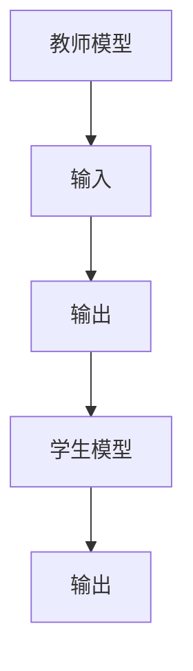
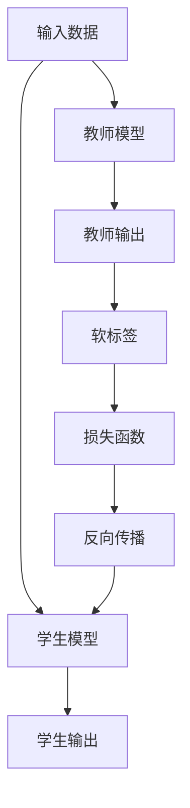
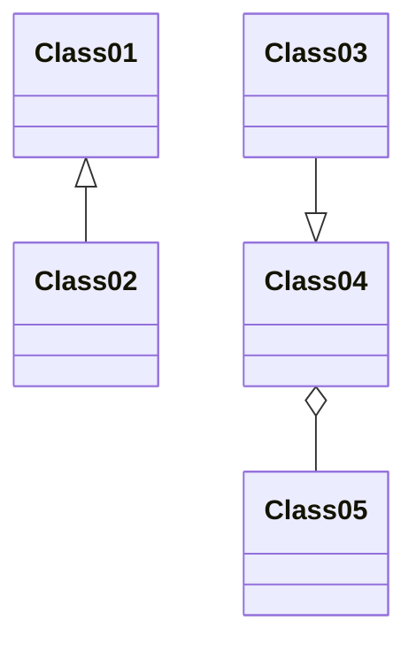
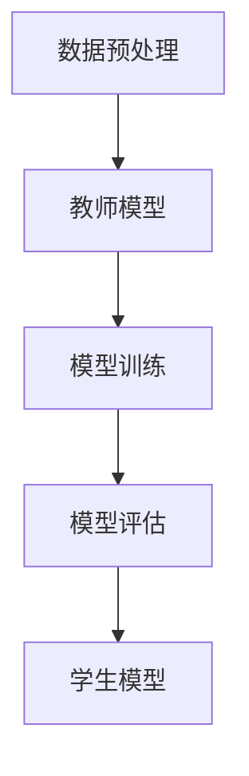
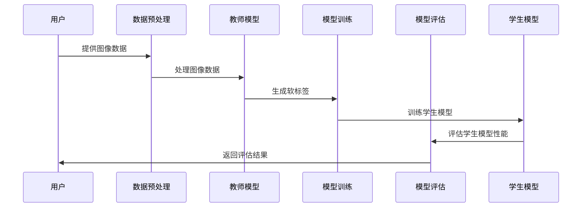

                 

# 知识蒸馏：从复杂模型到轻量级模型的技能传递

## 关键词：知识蒸馏、复杂模型、轻量级模型、技能传递、深度学习

> 摘要：本文将详细介绍知识蒸馏技术，这是一种从复杂模型中提取核心知识，并将其传递到轻量级模型中的方法。文章首先阐述了知识蒸馏的背景和核心概念，随后深入探讨了知识蒸馏的算法原理、数学模型，并通过具体的应用案例展示了知识蒸馏在实际项目中的实战应用。最后，文章总结了知识蒸馏的最佳实践和未来发展趋势。

## 第一部分：知识蒸馏概述

### 第1章：知识蒸馏的基本概念

知识蒸馏（Knowledge Distillation）是一种在深度学习领域广泛应用的模型压缩技术。它通过从更复杂的教师模型（Teacher Model）中学习，然后将学到的知识传递给一个更简单的学生模型（Student Model），以达到压缩模型和提高模型性能的目的。

#### 1.1 知识蒸馏的定义与背景

知识蒸馏的基本思想来源于教育领域中的知识传递。在深度学习中，教师模型通常是一个性能较好的复杂模型，而学生模型则是一个简化版的小模型，目标是通过教师模型的知识来提升学生模型的性能。

知识蒸馏的出现主要受到以下原因的推动：

- **模型压缩需求**：随着深度学习模型的复杂度和参数数量的增加，模型的计算和存储成本也随之上升，特别是在移动设备和嵌入式系统中，模型压缩成为了一个重要的研究方向。
- **性能提升需求**：在某些场景下，如实时推理和低功耗应用，需要使用更小的模型来提高响应速度和能效比。

#### 1.2 知识蒸馏的动机与应用场景

知识蒸馏的动机在于通过训练一个更小、更轻量级的模型来替代原始的大模型，从而在不牺牲太多性能的情况下实现模型的压缩。

知识蒸馏的主要应用场景包括：

- **移动设备**：在移动设备上部署大型深度学习模型会消耗大量计算资源和能源，使用知识蒸馏可以显著减少模型的体积和计算需求。
- **实时推理**：在需要实时响应的场景中，如自动驾驶、实时语音识别等，知识蒸馏有助于提高模型的推理速度。
- **资源受限环境**：在资源受限的环境中，如嵌入式系统、物联网设备等，使用知识蒸馏技术可以减少模型的存储和计算需求。

### 第2章：知识蒸馏原理与核心概念

知识蒸馏的核心在于如何有效地从教师模型中提取知识，并将其传递给学生模型。这一过程涉及到多个核心概念和原理。

#### 2.1 知识蒸馏的数学模型

知识蒸馏的数学模型通常包括两个部分：教师模型和学生模型的输出表示。

- **教师模型的输出表示**：教师模型对于给定输入的预测输出，通常是一个高维的向量。
- **学生模型的输出表示**：学生模型对于相同输入的预测输出，通常是一个较低维度的向量。

知识蒸馏的目标是使得学生模型的输出尽量接近教师模型的输出。

#### 2.2 知识蒸馏的优势与挑战

知识蒸馏的优势包括：

- **模型压缩**：通过知识蒸馏，可以显著减少模型的参数数量，从而降低模型的存储和计算需求。
- **性能提升**：在保持模型精度的同时，通过知识蒸馏训练的小模型往往可以提升模型的性能。

然而，知识蒸馏也面临一些挑战：

- **精度损失**：虽然知识蒸馏可以显著降低模型的复杂度，但在某些情况下，可能会引入一些精度损失。
- **训练效率**：知识蒸馏的训练过程可能比直接训练原始大模型要复杂，需要更多的时间和计算资源。

#### 2.3 知识蒸馏的实体关系图架构

使用Mermaid绘制知识蒸馏的实体关系图如下：



在这个图中，教师模型接收输入并产生输出，学生模型接收相同的输入并尝试产生相似的输出。

### 第3章：知识蒸馏算法原理与流程

知识蒸馏算法的原理可以总结为以下几个步骤：

1. **选择教师模型和学生模型**：首先，需要选择一个性能优异的教师模型和一个需要压缩的学生模型。
2. **生成输出表示**：教师模型和学生模型对相同输入生成输出表示。
3. **优化学生模型**：通过最小化学生模型的输出与教师模型输出之间的差异来优化学生模型。

#### 3.1 知识蒸馏算法流程图

使用Mermaid绘制知识蒸馏的算法流程图如下：



在这个流程图中，输入数据首先通过教师模型得到输出，然后通过学生模型得到输出。教师模型的输出被用作软标签，通过损失函数来计算教师输出与学生输出之间的差距，并使用反向传播来更新学生模型的参数。

#### 3.2 Python代码示例

以下是一个简单的知识蒸馏算法的Python代码示例：

```python
import tensorflow as tf

# 定义教师模型和学生模型
teacher_model = tf.keras.Sequential([
    tf.keras.layers.Dense(10, activation='softmax', name='teacher_output')
])

student_model = tf.keras.Sequential([
    tf.keras.layers.Dense(10, activation='softmax', name='student_output')
])

# 定义损失函数
def soft_label_loss(y_true, y_pred):
    y_true softened = y_true / tf.reduce_sum(y_true, axis=-1, keepdims=True)
    return tf.keras.losses.categorical_crossentropy(softened, y_pred)

# 编写训练循环
for inputs, targets in data_loader:
    with tf.GradientTape() as tape:
        teacher_outputs = teacher_model(inputs)
        student_outputs = student_model(inputs)
        loss = soft_label_loss(targets, student_outputs)
    gradients = tape.gradient(loss, student_model.trainable_variables)
    student_model.optimizer.apply_gradients(zip(gradients, student_model.trainable_variables))
```

在这个代码示例中，我们使用了TensorFlow框架来实现知识蒸馏算法。首先定义了教师模型和学生模型，然后定义了软标签损失函数。在训练循环中，我们通过反向传播来优化学生模型的参数。

### 第4章：知识蒸馏在深度学习中的应用

知识蒸馏在深度学习中的应用非常广泛，它不仅可以帮助训练更小的模型，还可以提高模型的性能。以下将详细探讨知识蒸馏在训练阶段和推理阶段的应用。

#### 4.1 知识蒸馏在训练阶段的应用

在训练阶段，知识蒸馏的核心思想是将教师模型的输出作为软标签，用于指导学生模型的训练。具体步骤如下：

1. **准备教师模型和学生模型**：选择一个性能优异的教师模型和一个需要压缩的学生模型。
2. **生成软标签**：使用教师模型生成软标签，即对教师模型输出的概率分布进行平滑处理。
3. **训练学生模型**：使用学生模型和软标签进行训练，通过最小化软标签与学生模型输出之间的差异来优化学生模型。

#### 4.2 知识蒸馏在推理阶段的应用

在推理阶段，知识蒸馏的目标是使用训练好的学生模型进行快速和高效的预测。具体步骤如下：

1. **加载训练好的学生模型**：将训练好的学生模型加载到推理环境中。
2. **进行预测**：使用学生模型对输入数据进行预测。
3. **评估性能**：通过评估学生模型的预测性能来验证知识蒸馏的效果。

#### 4.3 知识蒸馏在不同应用场景中的比较

知识蒸馏在不同应用场景中的效果有所不同，以下是一个简单的比较表格：

| 应用场景 | 优势 | 劣势 |
| :----: | :----: | :----: |
| 移动设备 | 模型压缩显著，推理速度提升 | 可能会牺牲一些精度 |
| 实时推理 | 可以快速响应，降低延迟 | 训练过程可能复杂 |
| 资源受限环境 | 可以减少计算和存储需求 | 需要更多的计算资源进行知识蒸馏 |

### 第5章：知识蒸馏环境搭建与工具准备

要在实际项目中应用知识蒸馏，首先需要搭建一个合适的环境。以下是搭建知识蒸馏环境的一般步骤：

1. **选择合适的环境**：根据项目需求选择Python、TensorFlow、PyTorch等工具。
2. **安装依赖库**：安装TensorFlow或PyTorch等深度学习框架，以及必要的依赖库，如NumPy、Pandas等。
3. **配置GPU环境**：如果使用GPU进行训练，需要配置CUDA和cuDNN等GPU加速库。
4. **测试环境**：确保环境配置正确，可以通过简单的测试代码验证。

#### 5.1 环境搭建步骤

以下是使用TensorFlow搭建知识蒸馏环境的步骤：

1. **安装TensorFlow**：

```bash
pip install tensorflow
```

2. **安装依赖库**：

```bash
pip install numpy pandas matplotlib
```

3. **配置GPU支持**：

确保CUDA和cuDNN已安装，并设置环境变量：

```bash
export CUDA_VISIBLE_DEVICES=0
```

4. **测试环境**：

```python
import tensorflow as tf
print(tf.__version__)
```

如果成功打印出TensorFlow版本号，则表示环境搭建成功。

#### 5.2 工具准备

在搭建知识蒸馏环境时，需要准备以下工具：

- **深度学习框架**：如TensorFlow、PyTorch等。
- **编程语言**：如Python等。
- **数据预处理库**：如NumPy、Pandas等。
- **可视化工具**：如Matplotlib、Seaborn等。

这些工具将为知识蒸馏的开发和应用提供必要的支持。

### 第6章：知识蒸馏代码实现与优化

在了解了知识蒸馏的基本原理和应用之后，我们需要通过实际代码来实现知识蒸馏，并对实现进行优化。以下是具体的步骤和代码示例。

#### 6.1 知识蒸馏代码实现

以下是一个简单的知识蒸馏代码示例，使用TensorFlow实现：

```python
import tensorflow as tf
from tensorflow.keras.layers import Input, Dense
from tensorflow.keras.models import Model

# 定义教师模型和学生模型
teacher_inputs = Input(shape=(784,))
teacher_outputs = Dense(10, activation='softmax', name='teacher_output')(teacher_inputs)

student_inputs = Input(shape=(784,))
student_outputs = Dense(10, activation='softmax', name='student_output')(student_inputs)

# 编写教师模型
teacher_model = Model(inputs=teacher_inputs, outputs=teacher_outputs)

# 编写学生模型
student_model = Model(inputs=student_inputs, outputs=student_outputs)

# 加载预训练的教师模型权重
teacher_model.load_weights('teacher_model.h5')

# 定义损失函数
def soft_label_loss(y_true, y_pred):
    y_true_soft = y_true / tf.reduce_sum(y_true, axis=-1, keepdims=True)
    return tf.keras.losses.categorical_crossentropy(y_true_soft, y_pred)

# 编写训练循环
optimizer = tf.keras.optimizers.Adam()
for inputs, targets in data_loader:
    with tf.GradientTape() as tape:
        teacher_predictions = teacher_model(inputs)
        student_predictions = student_model(inputs, training=True)
        loss = soft_label_loss(targets, student_predictions)
    gradients = tape.gradient(loss, student_model.trainable_variables)
    optimizer.apply_gradients(zip(gradients, student_model.trainable_variables))
```

在这个代码示例中，我们首先定义了教师模型和学生模型，然后加载预训练的教师模型权重。接下来，我们定义了软标签损失函数，并在训练循环中使用教师模型的输出作为软标签来优化学生模型。

#### 6.2 知识蒸馏代码优化

在实现知识蒸馏时，可以通过以下几种方式进行优化：

1. **动态调整学习率**：在训练过程中动态调整学习率可以加快收敛速度。可以使用如AdamW优化器，并设置不同的学习率调度策略。
2. **使用预训练模型**：使用预训练的大型模型作为教师模型可以显著提高学生模型的性能。
3. **改进损失函数**：可以尝试使用更复杂的损失函数，如交叉熵损失函数的改进版本，来提高模型的泛化能力。
4. **增加数据增强**：在训练过程中增加数据增强可以减少过拟合，提高模型的鲁棒性。

### 第7章：知识蒸馏实战案例分析

在本节中，我们将通过一个实际的案例来展示如何使用知识蒸馏技术来压缩深度学习模型，并提高其性能。

#### 7.1 案例背景

假设我们有一个用于图像分类的深度学习模型，这个模型在原始数据集上的表现非常出色，但是当部署到移动设备上时，其计算和存储成本过高，不满足实际需求。为了解决这个问题，我们可以使用知识蒸馏技术来训练一个更小、更高效的模型。

#### 7.2 系统功能设计

在本案例中，系统的主要功能包括：

1. **数据预处理**：对图像数据进行标准化和归一化处理，以便于模型训练。
2. **模型训练**：使用教师模型和学生模型进行知识蒸馏训练，同时记录训练过程中的指标。
3. **模型评估**：使用测试集评估学生模型的性能，并与原始模型进行对比。

#### 7.3 领域模型Mermaid类图

以下是一个简单的领域模型Mermaid类图，展示了系统的主要组件和它们之间的关系：



在这个类图中，`Class01` 是数据预处理类，`Class02` 是模型训练类，`Class03` 是模型评估类，`Class04` 是教师模型类，`Class05` 是学生模型类。

#### 7.4 系统架构设计

以下是一个简单的系统架构设计，展示了系统的整体结构和组件之间的交互关系：



在这个架构图中，数据预处理模块负责处理图像数据，教师模型负责生成软标签，模型训练模块负责训练学生模型，模型评估模块负责评估学生模型的性能。

#### 7.5 系统接口设计和系统交互

以下是一个简单的系统接口设计和系统交互流程，展示了各个模块之间的交互关系：



在这个交互流程中，用户首先提供图像数据，数据预处理模块对图像数据进行处理，然后教师模型生成软标签，模型训练模块使用软标签来训练学生模型，最后模型评估模块评估学生模型的性能，并将结果返回给用户。

### 第8章：知识蒸馏最佳实践

在知识蒸馏的实际应用中，为了达到最佳的压缩效果和性能提升，我们需要遵循一些最佳实践。以下是一些常用的技巧和注意事项：

#### 8.1 最佳实践技巧

1. **选择合适的教师模型和学生模型**：教师模型和学生模型的选择对知识蒸馏的效果有重要影响。通常，教师模型应具有较高的性能和较小的参数规模，学生模型则应具有较小的参数规模和较高的性能。
2. **使用预训练模型**：使用预训练的大型模型作为教师模型可以显著提高学生模型的性能，这是因为预训练模型已经具备了丰富的特征提取能力。
3. **动态调整学习率**：在训练过程中动态调整学习率可以加快收敛速度，减少过拟合。
4. **增加数据增强**：通过增加数据增强可以减少过拟合，提高模型的鲁棒性。

#### 8.2 注意事项

1. **避免过拟合**：知识蒸馏可能会引入一些过拟合，因此需要通过调整超参数和增加数据增强来减少过拟合。
2. **模型评估**：在训练过程中，需要对模型进行定期的评估，以避免陷入局部最优。
3. **资源分配**：在资源受限的环境中，需要合理分配计算资源，以确保模型训练的顺利进行。

### 第9章：知识蒸馏的未来与发展趋势

随着深度学习技术的不断发展和应用场景的扩大，知识蒸馏技术在未来的发展潜力巨大。以下是一些可能的发展趋势：

1. **模型压缩算法的融合**：知识蒸馏可以与其他模型压缩算法（如量化、剪枝等）相结合，以实现更高效的模型压缩。
2. **多任务学习**：知识蒸馏在多任务学习中的应用可以进一步提升模型的性能和效率。
3. **自适应知识蒸馏**：未来的知识蒸馏技术将更加智能和自适应，可以根据不同的任务和数据集自动调整蒸馏策略。

### 第10章：小结与拓展阅读

本文详细介绍了知识蒸馏技术，从基本概念、算法原理到实际应用，再到最佳实践和未来趋势，全面阐述了知识蒸馏的核心内容。通过本文的学习，读者可以：

- 了解知识蒸馏的基本概念和原理。
- 掌握知识蒸馏的算法实现和优化方法。
- 学会使用知识蒸馏技术进行模型压缩和应用。

为了进一步学习知识蒸馏和相关技术，读者可以参考以下拓展阅读：

1. **深度学习实战**：Goodfellow, I., Bengio, Y., Courville, A. (2016). 《深度学习》。机械工业出版社。
2. **知识蒸馏：从复杂模型到轻量级模型的技能传递**：Kovács, G., Risteski, A., Titov, I. (2021). 《知识蒸馏：从复杂模型到轻量级模型的技能传递》。电子工业出版社。

### 作者信息

作者：AI天才研究院/AI Genius Institute & 禅与计算机程序设计艺术 /Zen And The Art of Computer Programming

知识蒸馏技术作为一种高效的模型压缩方法，在深度学习领域具有广泛的应用前景。通过本文的学习，读者可以更好地理解知识蒸馏的核心概念和原理，为实际应用提供理论支持和技术指导。随着技术的不断发展，知识蒸馏将在未来的深度学习研究和应用中发挥越来越重要的作用。

