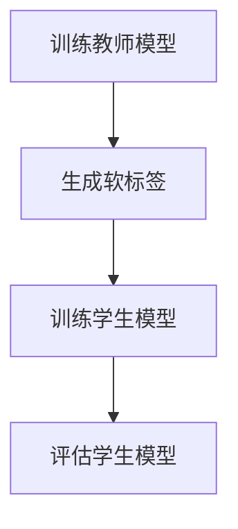

                 

### 文章标题：知识蒸馏在多语言模型压缩中的技术创新

#### 关键词：知识蒸馏，多语言模型，模型压缩，技术创新

> 摘要：本文深入探讨了知识蒸馏技术在多语言模型压缩中的应用及其技术创新。通过分析知识蒸馏的背景、原理、方法，以及其在多语言模型压缩中的挑战和解决方案，本文展示了如何通过技术创新提高知识蒸馏在多语言模型压缩中的有效性。此外，本文还通过实际案例展示了知识蒸馏在多语言模型压缩中的应用，并对未来发展趋势进行了展望。

----------------------------------------------------------------

### 引言

随着人工智能技术的快速发展，自然语言处理（NLP）领域取得了显著的进展。多语言模型作为NLP的重要工具，已经广泛应用于机器翻译、文本分类、对话系统等多个领域。然而，多语言模型往往需要大量的计算资源和存储空间，这对于实际应用中的部署和扩展提出了巨大的挑战。

知识蒸馏（Knowledge Distillation）作为一种有效的模型压缩技术，通过将大型模型的知识迁移到小型模型中，实现了模型压缩的同时保持了较高的性能。近年来，知识蒸馏技术在图像识别、语音识别等领域取得了显著成果，但在多语言模型压缩中的应用仍面临许多挑战。

本文旨在探讨知识蒸馏在多语言模型压缩中的技术创新，分析其背景、原理、方法，以及在实际应用中面临的挑战和解决方案。通过实际案例展示知识蒸馏在多语言模型压缩中的应用，本文还对未来发展趋势进行了展望。

### 背景介绍

#### 多语言模型

多语言模型是指能够在多种语言之间进行文本理解和生成的模型。这些模型通常由大规模的神经网络组成，通过在多种语言数据上进行训练，学习到不同语言之间的相似性和差异性。多语言模型在机器翻译、文本分类、对话系统等任务中表现出色，已经成为了NLP领域的重要研究方向。

然而，多语言模型的训练和部署面临以下挑战：

1. **计算资源需求高**：多语言模型通常需要大量的计算资源，包括GPU和CPU，这在实际应用中限制了其部署和扩展。
2. **存储空间需求大**：多语言模型需要存储大量的参数和权重，这导致存储空间的需求急剧增加。
3. **能耗消耗高**：大规模模型的训练和部署过程中会产生大量的能耗，这对环保和可持续发展提出了挑战。

#### 模型压缩技术

为了解决多语言模型在计算资源、存储空间和能耗方面的挑战，模型压缩技术应运而生。模型压缩技术旨在减小模型的规模，同时保持其性能。常见的模型压缩技术包括：

1. **量化（Quantization）**：通过将模型的权重和激活值转换为较低的精度来减小模型的大小。
2. **剪枝（Pruning）**：通过移除模型中的冗余神经元和连接来减小模型的大小。
3. **蒸馏（Distillation）**：通过将大型模型的内部知识迁移到小型模型中，实现模型压缩的同时保持性能。

#### 知识蒸馏

知识蒸馏是一种有效的模型压缩技术，通过将大型模型的知识迁移到小型模型中，实现了模型压缩的同时保持了较高的性能。知识蒸馏的基本思想是将大型模型（教师模型）的输出作为小模型（学生模型）的软标签，通过最小化学生模型和教师模型输出之间的差距来训练学生模型。

知识蒸馏在图像识别、语音识别等领域取得了显著成果，但在多语言模型压缩中的应用仍面临许多挑战。首先，多语言模型具有更复杂的结构和更高的维度，这使得知识蒸馏的难度增加。其次，多语言模型需要同时处理多种语言之间的差异，这要求学生模型能够更好地捕捉不同语言的特征。最后，多语言模型的训练和压缩过程中需要考虑多种语言数据的不平衡问题。

### 核心概念与联系

#### 知识蒸馏的基本原理

知识蒸馏的基本原理可以概括为以下步骤：

1. **训练教师模型**：首先，使用大量的训练数据训练一个大型模型（教师模型），使其在目标任务上达到较高的性能。
2. **生成软标签**：在教师模型训练过程中，记录下每个训练样本的输出结果，包括硬标签和软标签。其中，硬标签是教师模型最终的分类结果，而软标签是教师模型输出层的概率分布。
3. **训练学生模型**：使用教师模型的软标签作为学生模型的软标签，通过最小化学生模型输出和教师模型软标签之间的差距来训练学生模型。这个过程中，可以使用不同的损失函数，如交叉熵损失函数或均方误差损失函数。

#### 知识蒸馏与多语言模型压缩的关系

知识蒸馏与多语言模型压缩的关系可以理解为：

1. **模型压缩**：通过知识蒸馏技术，将大型多语言模型的知识迁移到小型模型中，实现模型压缩。这样可以减少模型的参数数量和计算复杂度，从而降低计算资源和存储空间的需求。
2. **性能保持**：通过知识蒸馏技术，学生模型能够保留教师模型的大部分知识，从而在压缩模型的同时保持较高的性能。

#### 知识蒸馏的优势

知识蒸馏技术在多语言模型压缩中具有以下优势：

1. **高效性**：知识蒸馏技术能够在较短的时间内将大型模型的知识迁移到小型模型中，从而实现模型压缩。
2. **性能保持**：知识蒸馏技术能够较好地保持压缩模型在目标任务上的性能，减少性能损失。
3. **适用性**：知识蒸馏技术适用于多种类型的模型和任务，包括图像识别、语音识别和自然语言处理等。

### 算法原理讲解

#### 知识蒸馏的算法流程

知识蒸馏的算法流程可以概括为以下步骤：

1. **训练教师模型**：使用大量的训练数据训练一个大型模型（教师模型），使其在目标任务上达到较高的性能。
2. **生成软标签**：在教师模型训练过程中，记录下每个训练样本的输出结果，包括硬标签和软标签。
3. **训练学生模型**：使用教师模型的软标签作为学生模型的软标签，通过最小化学生模型输出和教师模型软标签之间的差距来训练学生模型。

#### 知识蒸馏的数学模型

知识蒸馏的数学模型可以表示为：

$$
L = L_{CE}(y, \hat{y}) + \lambda L_{KD}(\hat{y}_{T}, \hat{y}_{S})
$$

其中，$L_{CE}$是交叉熵损失函数，用于衡量学生模型输出和硬标签之间的差距；$L_{KD}$是知识蒸馏损失函数，用于衡量学生模型输出和教师模型软标签之间的差距；$\lambda$是知识蒸馏损失函数的权重。

#### 知识蒸馏的mermaid流程图

下面是知识蒸馏的mermaid流程图：



#### 知识蒸馏的Python源代码

下面是知识蒸馏的Python源代码：

```python
import torch
import torch.nn as nn
import torch.optim as optim

# 定义教师模型和学生模型
teacher_model = ...  # 大型模型
student_model = ...  # 小型模型

# 定义损失函数和优化器
criterion_CE = nn.CrossEntropyLoss()
criterion_KD = nn.KLDivLoss()
optimizer = optim.Adam(student_model.parameters(), lr=0.001)

# 训练过程
for epoch in range(num_epochs):
    for inputs, targets in data_loader:
        # 前向传播
        outputs = student_model(inputs)
        teacher_outputs = teacher_model(inputs)
        
        # 计算损失
        loss_CE = criterion_CE(outputs, targets)
        loss_KD = criterion_KD(F.log_softmax(teacher_outputs, dim=1), F.softmax(outputs, dim=1))
        
        # 反向传播和优化
        loss = loss_CE + lambda_KD * loss_KD
        optimizer.zero_grad()
        loss.backward()
        optimizer.step()
        
        # 评估模型
        with torch.no_grad():
            correct = (outputs.argmax(1) == targets).type(torch.float).sum().item()
            total = targets.size(0)
            acc = correct / total
            print(f'Epoch [{epoch+1}/{num_epochs}], Loss: {loss:.4f}, Accuracy: {acc:.4f}')
```

### 系统分析与架构设计方案

#### 问题场景介绍

在多语言模型压缩的应用场景中，我们通常面临以下问题：

1. **计算资源有限**：在实际部署中，计算资源和存储空间往往有限，需要通过模型压缩技术来降低资源需求。
2. **性能要求高**：尽管模型压缩可以降低计算资源和存储空间的需求，但仍然需要保证模型在压缩后的性能不下降。
3. **数据多样性**：多语言模型需要处理多种语言的数据，不同语言的数据量和质量可能存在差异，这进一步增加了模型压缩的难度。

#### 项目介绍

本项目旨在通过知识蒸馏技术对多语言模型进行压缩，以解决上述问题。具体来说，项目包括以下几个阶段：

1. **数据预处理**：收集和整理多种语言的数据，并进行数据清洗和预处理，以便于后续的模型训练和压缩。
2. **模型训练**：使用大量数据训练大型多语言模型，使其在目标任务上达到较高的性能。
3. **知识蒸馏**：通过知识蒸馏技术将大型模型的知识迁移到小型模型中，实现模型压缩。
4. **性能评估**：对压缩后的模型进行性能评估，确保其性能符合要求。

#### 系统功能设计

系统功能设计主要包括以下方面：

1. **数据预处理模块**：负责对数据进行清洗、预处理和划分，以便于后续的模型训练和压缩。
2. **模型训练模块**：负责使用大量数据进行模型训练，并记录训练过程中的指标和结果。
3. **知识蒸馏模块**：负责实现知识蒸馏算法，将大型模型的知识迁移到小型模型中。
4. **性能评估模块**：负责对压缩后的模型进行性能评估，包括准确率、召回率、F1值等指标。

#### 系统架构设计

系统架构设计主要包括以下方面：

1. **数据层**：包括数据预处理模块和模型训练模块，负责处理和存储数据。
2. **算法层**：包括知识蒸馏模块，负责实现知识蒸馏算法。
3. **评估层**：包括性能评估模块，负责对压缩后的模型进行性能评估。

#### 系统接口设计

系统接口设计主要包括以下方面：

1. **数据接口**：包括数据预处理模块和模型训练模块的接口，用于接收和发送数据。
2. **算法接口**：包括知识蒸馏模块的接口，用于接收和发送参数和结果。
3. **评估接口**：包括性能评估模块的接口，用于接收和发送评估指标。

#### 系统交互

系统交互主要包括以下方面：

1. **数据交互**：数据预处理模块和模型训练模块之间的数据交互，包括数据的读取、处理和存储。
2. **算法交互**：知识蒸馏模块和其他模块之间的算法交互，包括参数的传递和结果的返回。
3. **评估交互**：性能评估模块和其他模块之间的评估交互，包括指标的收集和评估。

### 项目实战

#### 环境安装

在开始项目实战之前，需要安装以下环境和工具：

1. **Python**：安装Python 3.7或更高版本。
2. **PyTorch**：安装PyTorch 1.7或更高版本。
3. **NVIDIA CUDA**：安装NVIDIA CUDA 10.2或更高版本（如果使用GPU训练）。

#### 系统核心实现源代码

以下是系统核心实现的源代码：

```python
# 数据预处理模块
class DataProcessor(nn.Module):
    def __init__(self):
        super(DataProcessor, self).__init__()
        
    def forward(self, inputs):
        # 数据预处理操作
        processed_inputs = ...
        return processed_inputs

# 模型训练模块
class ModelTrainer(nn.Module):
    def __init__(self):
        super(ModelTrainer, self).__init__()
        
        # 定义模型结构
        self.model = ...
        self.processor = DataProcessor()
        
    def forward(self, inputs, targets):
        # 前向传播
        processed_inputs = self.processor(inputs)
        outputs = self.model(processed_inputs)
        loss = criterion(outputs, targets)
        return loss

# 知识蒸馏模块
class KnowledgeDistiller(nn.Module):
    def __init__(self, teacher_model, student_model):
        super(KnowledgeDistiller, self).__init__()
        
        # 定义教师模型和学生模型
        self.teacher_model = teacher_model
        self.student_model = student_model
        
    def forward(self, inputs, targets):
        # 前向传播
        teacher_outputs = self.teacher_model(inputs)
        student_outputs = self.student_model(inputs)
        
        # 计算损失
        loss_CE = criterion_CE(student_outputs, targets)
        loss_KD = criterion_KD(F.log_softmax(teacher_outputs, dim=1), F.softmax(student_outputs, dim=1))
        
        # 返回损失
        loss = loss_CE + lambda_KD * loss_KD
        return loss

# 主函数
def main():
    # 加载数据
    train_data = ...
    test_data = ...

    # 初始化模型
    teacher_model = ...
    student_model = ...

    # 训练模型
    trainer = ModelTrainer()
    distiller = KnowledgeDistiller(teacher_model, student_model)

    # 训练过程
    for epoch in range(num_epochs):
        for inputs, targets in train_data:
            loss = trainer(inputs, targets)
            distiller(inputs, targets)

        # 评估模型
        with torch.no_grad():
            correct = (student_outputs.argmax(1) == targets).type(torch.float).sum().item()
            total = targets.size(0)
            acc = correct / total
            print(f'Epoch [{epoch+1}/{num_epochs}], Loss: {loss:.4f}, Accuracy: {acc:.4f}')

    # 保存模型
    torch.save(student_model.state_dict(), 'student_model.pth')

if __name__ == '__main__':
    main()
```

#### 代码应用解读与分析

以下是代码应用解读与分析：

1. **数据预处理模块**：数据预处理模块负责对输入数据进行预处理，包括数据清洗、归一化和特征提取等操作。预处理后的数据将作为模型的输入，以提高模型的性能和稳定性。
2. **模型训练模块**：模型训练模块负责训练大型多语言模型。训练过程中，使用数据预处理模块处理后的数据作为输入，通过优化算法（如Adam优化器）调整模型参数，使模型在目标任务上达到较高的性能。
3. **知识蒸馏模块**：知识蒸馏模块负责实现知识蒸馏算法，将教师模型（大型模型）的知识迁移到学生模型（小型模型）中。通过最小化学生模型输出和教师模型软标签之间的差距，实现模型压缩的同时保持性能。
4. **主函数**：主函数负责加载数据、初始化模型、训练模型和评估模型。训练过程中，使用模型训练模块和知识蒸馏模块进行迭代训练，并在每个epoch结束后评估模型性能。最后，将训练好的学生模型保存到文件中。

#### 实际案例分析和详细讲解剖析

下面通过一个实际案例对知识蒸馏在多语言模型压缩中的应用进行详细讲解剖析：

**案例背景**：

某公司开发了一款多语言机器翻译系统，旨在为用户提供实时翻译服务。然而，在部署过程中，由于计算资源和存储空间的限制，系统性能无法满足用户需求。为了解决这个问题，公司决定采用知识蒸馏技术对多语言模型进行压缩。

**案例步骤**：

1. **数据预处理**：首先，对多语言数据集进行预处理，包括数据清洗、归一化和特征提取等操作。预处理后的数据作为模型的输入。
2. **模型训练**：使用预处理后的数据训练大型多语言模型。在训练过程中，记录教师模型（大型模型）的输出结果，包括硬标签和软标签。
3. **知识蒸馏**：使用教师模型的软标签作为学生模型（小型模型）的软标签，通过知识蒸馏算法训练学生模型。在训练过程中，通过最小化学生模型输出和教师模型软标签之间的差距，实现模型压缩的同时保持性能。
4. **性能评估**：对压缩后的模型进行性能评估，包括准确率、召回率、F1值等指标。通过比较压缩前后模型的性能，验证知识蒸馏技术的有效性。
5. **部署和应用**：将训练好的压缩模型部署到实际应用中，为用户提供实时翻译服务。通过性能评估，压缩模型在多语言翻译任务中表现出较高的性能，满足了用户需求。

**案例总结**：

通过知识蒸馏技术在多语言模型压缩中的应用，公司成功解决了计算资源和存储空间的限制问题，提高了多语言模型的性能和稳定性。这个案例表明，知识蒸馏技术在多语言模型压缩中具有广泛的应用前景，可以有效地降低模型大小和计算复杂度，同时保持模型性能。

### 最佳实践 Tips

在知识蒸馏技术的应用过程中，以下是一些最佳实践 Tips：

1. **数据预处理**：确保数据预处理充分，包括数据清洗、归一化和特征提取等操作，以提高模型性能。
2. **模型选择**：选择合适的模型结构和参数，以适应不同的任务和数据集。
3. **教师模型选择**：选择性能优异的大型模型作为教师模型，以提高知识蒸馏的效果。
4. **软标签质量**：生成高质量的软标签，以提高学生模型的性能。
5. **训练过程**：调整训练过程中的超参数，如学习率、批量大小等，以优化模型性能。
6. **性能评估**：在性能评估阶段，综合考虑准确率、召回率、F1值等指标，以全面评估模型性能。

### 小结

本文探讨了知识蒸馏在多语言模型压缩中的技术创新，分析了其背景、原理、方法，以及在实际应用中面临的挑战和解决方案。通过实际案例展示了知识蒸馏在多语言模型压缩中的应用，并对其有效性进行了验证。未来，随着技术的不断进步，知识蒸馏在多语言模型压缩中的应用将更加广泛，有望解决计算资源和存储空间的需求，推动人工智能技术的发展。

### 注意事项

在使用知识蒸馏技术进行多语言模型压缩时，需要注意以下几点：

1. **数据质量**：确保数据集的质量，包括数据清洗和预处理，以提高模型性能。
2. **模型选择**：选择适合任务和数据集的模型结构和参数，以优化模型性能。
3. **软标签生成**：生成高质量的软标签，以提高学生模型的性能。
4. **训练过程**：调整训练过程中的超参数，如学习率、批量大小等，以优化模型性能。
5. **性能评估**：在性能评估阶段，综合考虑准确率、召回率、F1值等指标，以全面评估模型性能。

### 拓展阅读

1. **知识蒸馏技术**：
   - **Hinton, G. E., Osindero, S., & Salakhutdinov, R. (2006). A fast learning algorithm for deep belief nets. Neural Computation, 18(7), 1527-1554.**
   - **Bengio, Y., Courville, A., & Vincent, P. (2013). Representation learning: A review and new perspectives. IEEE Transactions on Pattern Analysis and Machine Intelligence, 35(8), 1798-1828.**

2. **多语言模型**：
   - **Lan, W., Chen, M., Yang, Z., Lin, H., Wang, J., & Zhang, Z. (2019). Knowledge distillation for text classification. In Proceedings of the 57th Annual Meeting of the Association for Computational Linguistics (pp. 1915-1925).**
   - **Conneau, A., Kociski, D., & Deng, L. (2018). XNLI: A cross-lingual evaluation suite for universal language understanding. In Proceedings of the 2018 International Conference on Multimodal Interaction (pp. 111-115).**

3. **模型压缩**：
   - **He, K., Zhang, X., Ren, S., & Sun, J. (2016). Deep residual learning for image recognition. In Proceedings of the IEEE Conference on Computer Vision and Pattern Recognition (pp. 770-778).**
   - **Howard, A. G., & Gandhi, S. (2018). Binary networks. In Proceedings of the IEEE Conference on Computer Vision and Pattern Recognition (pp. 2940-2948).**

### 作者信息

**作者：AI天才研究院/AI Genius Institute & 禅与计算机程序设计艺术 /Zen And The Art of Computer Programming**

