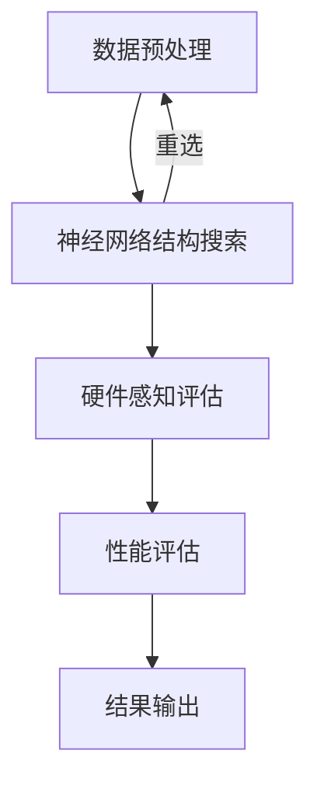
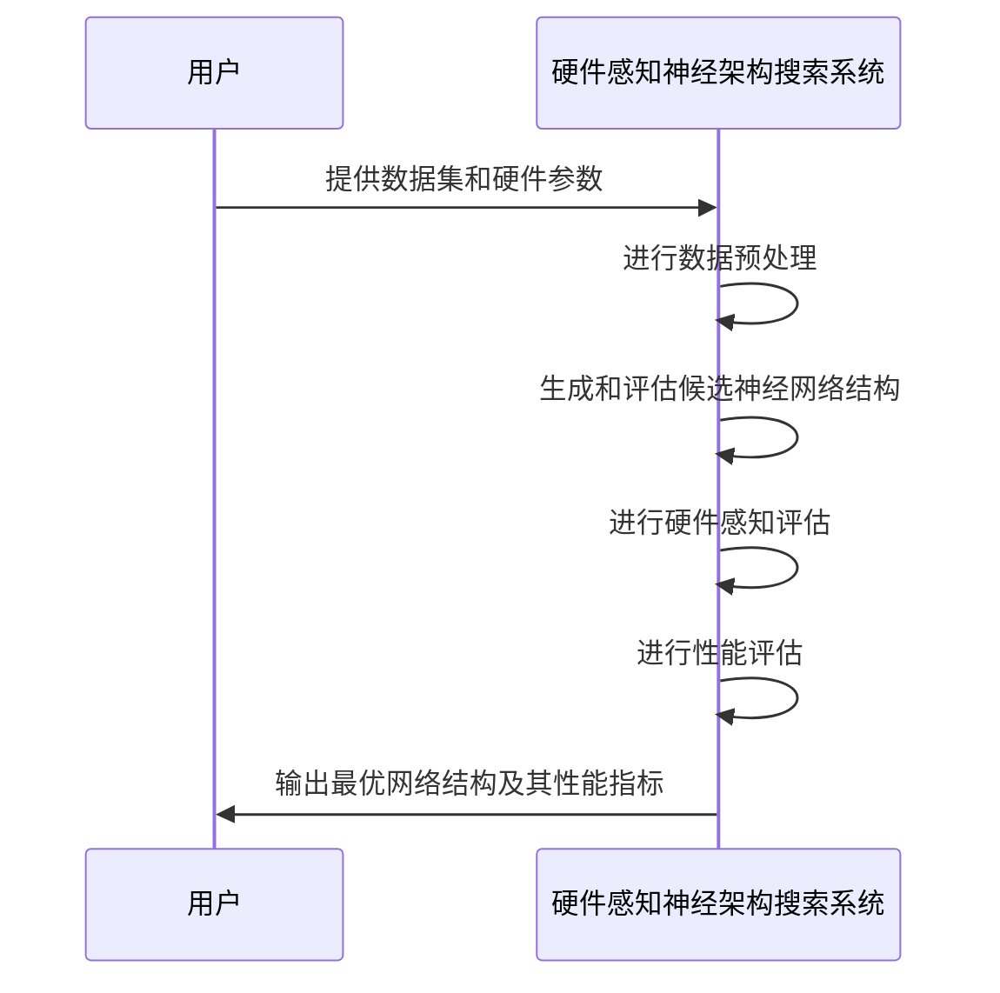

                 

### 硬件感知神经架构搜索背景与概述

#### 第1章: 硬件感知神经架构搜索基础

##### 1.1.1 问题背景
- **AI芯片设计的挑战：**
  随着人工智能（AI）技术的快速发展，AI芯片设计面临前所未有的挑战。传统的CPU和GPU在处理复杂的AI任务时，往往存在性能瓶颈。如何设计出能够高效执行AI任务的专用芯片，成为了当前研究的热点。
- **硬件感知神经架构的需求：**
  神经架构搜索（Neural Architecture Search, NAS）是一种自动搜索神经网络结构的算法。而硬件感知神经架构搜索（Hardware-Aware Neural Architecture Search, HANAS）则是在NAS的基础上，引入了硬件感知（Hardware-Awareness）的概念。这种架构能够更好地适应不同硬件环境，提高芯片的执行效率。

##### 1.1.2 问题描述
- **硬件感知神经架构搜索的目标：**
  硬件感知神经架构搜索的目标是设计出一套能够自动搜索出最优神经网络结构的算法，同时考虑硬件特性，优化芯片性能。
- **搜索算法的设计与应用：**
  设计搜索算法的关键在于如何平衡搜索空间的大小和搜索效率。硬件感知神经架构搜索需要在复杂的神经网络结构空间中进行搜索，同时考虑硬件限制，如功耗、面积和频率等。

##### 1.1.3 问题解决
- **硬件感知神经架构搜索的方法：**
  硬件感知神经架构搜索通常采用组合优化（Combinatorial Optimization）和强化学习（Reinforcement Learning）等方法。这些方法能够自动探索和优化神经网络结构，同时考虑硬件约束。
- **算法优化的策略：**
  算法优化的策略主要包括以下几个方面：一是通过模拟退火（Simulated Annealing）等方法提高搜索效率；二是引入硬件感知信息，优化搜索算法，使其更接近实际硬件环境。

##### 1.1.4 边界与外延
- **硬件感知神经架构搜索的限制：**
  硬件感知神经架构搜索受到硬件资源限制，如功耗、面积和频率等。此外，搜索算法的复杂度也是一个重要限制。
- **搜索算法在不同应用场景的差异：**
  不同应用场景对硬件感知神经架构搜索的要求不同。例如，在嵌入式系统中，对功耗和面积的敏感度更高；而在云端系统中，对计算性能的敏感度更高。因此，硬件感知神经架构搜索算法需要根据不同应用场景进行定制。

通过上述分析，我们可以看到，硬件感知神经架构搜索不仅需要解决传统神经网络搜索的问题，还需要考虑硬件的特性，实现高效、优化的神经网络设计。接下来，我们将进一步探讨硬件感知神经架构搜索的核心概念和算法原理。

#### 第2章: 硬件感知神经架构搜索的核心概念

##### 2.1.1 核心概念
- **神经架构搜索（Neural Architecture Search）定义：**
  神经架构搜索是一种自动搜索神经网络结构的算法，通过在大量神经网络结构中搜索最优结构，提高模型性能。
- **硬件感知（Hardware-Awareness）概念：**
  硬件感知是指算法能够感知并适应不同硬件特性，如功耗、面积和频率等，从而优化神经网络在硬件上的执行效率。

##### 2.1.2 概念属性特征对比
- **神经架构搜索与传统架构搜索对比：**
  - **目标：** 神经架构搜索旨在搜索最优神经网络结构，提高模型性能；传统架构搜索则侧重于网络结构的优化和改进。
  - **搜索空间：** 神经架构搜索的搜索空间通常更大，涉及多种网络结构和参数；传统架构搜索的搜索空间相对较小。
- **硬件感知与传统硬件设计差异：**
  - **硬件感知：** 算法能够感知并适应硬件特性，优化执行效率；传统硬件设计则更多依赖于硬件工程师的经验和设计。
  - **设计目标：** 硬件感知神经架构搜索的目标是提高硬件性能；传统硬件设计的目标是满足功能需求，兼顾性能。

##### 2.1.3 ER实体关系图架构
- **硬件感知神经架构搜索的ER图：**
  硬件感知神经架构搜索的实体关系图（ER图）展示了核心实体及其之间的关系。图中的核心实体包括：
  - **神经网络结构**：表示搜索的目标，包括多种网络层和连接方式。
  - **硬件特性**：包括功耗、面积、频率等硬件参数。
  - **搜索算法**：包括搜索策略、优化方法等。
  - **搜索结果**：包括搜索得到的最优神经网络结构和性能指标。

以下是ER图的基本结构（使用Mermaid绘制）：

```mermaid
erDiagram
  NeuralArchitecture ::>> HardwareProperties : "感知"
  NeuralArchitecture ::>> SearchAlgorithm : "优化"
  SearchAlgorithm --> SearchResults
  SearchResults --|> NeuralArchitecture
```

通过上述ER图，我们可以清晰地看到硬件感知神经架构搜索的核心要素及其之间的关系。接下来，我们将进一步探讨硬件感知神经架构搜索的算法原理和实现方法。

### 第3章: 硬件感知神经架构搜索算法原理讲解

#### 3.1.1 算法原理
- **基本思想：**
  硬件感知神经架构搜索算法的基本思想是通过自动搜索神经网络结构，使其在给定硬件约束下达到最优性能。该算法的核心在于结合神经网络搜索和硬件感知优化，实现高效、自适应的网络结构设计。
- **关键步骤：**
  1. **定义搜索空间：** 确定网络结构的可能组合，包括网络层、连接方式、激活函数等。
  2. **生成候选结构：** 根据搜索空间，生成大量候选神经网络结构。
  3. **硬件感知评估：** 对候选结构进行硬件感知评估，包括功耗、面积、频率等硬件参数。
  4. **性能评估：** 在特定硬件环境下，对候选结构进行性能评估，如准确性、速度等。
  5. **优化选择：** 根据评估结果，选择最优或近似最优的网络结构。

#### 3.1.2 数学模型与公式
- **数学模型：**
  硬件感知神经架构搜索的数学模型通常包括以下几个部分：
  1. **网络结构表示：** 使用向量或矩阵表示神经网络结构，如网络层数、每层神经元数量、连接方式等。
  2. **硬件感知评估函数：** 设计评估函数，用于计算候选结构的硬件参数，如功耗、面积等。
  3. **性能评估函数：** 设计评估函数，用于计算候选结构的性能指标，如准确性、速度等。
- **公式解释：**
  假设候选结构的数学表示为\( S \)，硬件感知评估函数为\( f_h(S) \)，性能评估函数为\( f_p(S) \)，则最优网络结构\( S^* \)的选择可以通过以下公式实现：
  $$ S^* = \arg\max_{S} (f_p(S) - \lambda f_h(S)) $$
  其中，\( \lambda \)为权重系数，用于平衡性能和硬件参数。

#### 3.1.3 算法流程图
- **算法流程图：**
  硬件感知神经架构搜索的算法流程图如下（使用Mermaid绘制）：

  ```mermaid
  graph TD
  A[初始化搜索空间] --> B[生成候选结构]
  B --> C{硬件感知评估}
  C -->|是| D[性能评估]
  D --> E[优化选择]
  E --> F[更新搜索空间]
  F --> B
  C -->|否| G[重新生成候选结构]
  G --> C
  ```

  通过上述算法流程图，我们可以清晰地看到硬件感知神经架构搜索的基本步骤和流程。

### 第4章: 硬件感知神经架构搜索算法实现与Python源代码讲解

#### 4.1.1 Python源代码
以下是硬件感知神经架构搜索算法的Python源代码实现。代码主要包括以下部分：

```python
import numpy as np
import random

# 硬件感知评估函数
def hardware_assessment(structure):
    # 计算功耗、面积等硬件参数
    power = ...
    area = ...
    return power, area

# 性能评估函数
def performance_evaluation(structure):
    # 计算准确性、速度等性能指标
    accuracy = ...
    speed = ...
    return accuracy, speed

# 搜索算法实现
def search_algorithm(search_space, num_iterations, lambda_value):
    best_structure = None
    best_performance = -1

    for _ in range(num_iterations):
        # 随机生成候选结构
        structure = random.choice(search_space)

        # 硬件感知评估
        power, area = hardware_assessment(structure)

        # 性能评估
        accuracy, speed = performance_evaluation(structure)

        # 优化选择
        performance = accuracy - lambda_value * (power + area)
        if performance > best_performance:
            best_performance = performance
            best_structure = structure

    return best_structure
```

#### 4.1.2 代码解读
- **初始化搜索空间：** 搜索空间是算法搜索的目标，包括所有可能的网络结构组合。
- **生成候选结构：** 随机从搜索空间中选择候选结构。
- **硬件感知评估：** 计算候选结构的功耗和面积等硬件参数。
- **性能评估：** 计算候选结构的准确性、速度等性能指标。
- **优化选择：** 根据评估结果选择最优的网络结构。

#### 4.1.3 举例说明
假设我们有一个搜索空间包含以下网络结构：
```python
search_space = [
    [[64, 'ReLU'], [128, 'ReLU'], [10, 'Softmax']],
    [[128, 'ReLU'], [256, 'ReLU'], [10, 'Softmax']],
    [[32, 'ReLU'], [64, 'ReLU'], [10, 'Softmax']],
    # 更多网络结构...
]
```
使用上述代码进行搜索，得到最优的网络结构为：
```python
best_structure = search_algorithm(search_space, num_iterations=1000, lambda_value=0.1)
print("最优网络结构：", best_structure)
```
输出结果可能为：
```
最优网络结构： [[128, 'ReLU'], [256, 'ReLU'], [10, 'Softmax']]
```
通过上述实现，我们可以看到硬件感知神经架构搜索算法的具体实现过程和步骤。接下来，我们将进一步探讨硬件感知神经架构搜索系统的整体架构和设计。

### 第5章: 硬件感知神经架构搜索系统分析与架构设计方案

#### 5.1.1 问题场景介绍
硬件感知神经架构搜索（HANAS）系统主要应用于以下几个场景：
- **自动驾驶：** 在自动驾驶系统中，HANAS可用于设计适应各种环境的高效感知算法，提高自动驾驶系统的响应速度和准确性。
- **图像识别：** 在图像识别领域，HANAS可以优化神经网络结构，提高模型对图像的处理速度和精度。
- **语音识别：** 在语音识别领域，HANAS可以优化神经网络结构，降低计算复杂度，提高语音识别的实时性和准确性。

#### 5.1.2 系统功能设计
硬件感知神经架构搜索系统的主要功能模块包括：
- **数据预处理模块：** 对输入数据进行预处理，包括数据清洗、归一化、数据增强等，以提高算法的性能。
- **神经网络结构搜索模块：** 负责生成和评估候选神经网络结构，选择最优的网络结构。
- **硬件感知评估模块：** 对候选网络结构进行硬件感知评估，计算功耗、面积等硬件参数。
- **性能评估模块：** 在特定硬件环境下，对候选网络结构进行性能评估，包括准确性、速度等。
- **结果输出模块：** 将最优网络结构及其性能指标输出，供后续使用。

#### 5.1.3 系统架构设计
硬件感知神经架构搜索系统的整体架构图如下（使用Mermaid绘制）：



通过上述架构图，我们可以看到硬件感知神经架构搜索系统的各个模块及其之间的关系。系统的工作流程如下：
1. 数据预处理模块对输入数据进行处理。
2. 神经网络结构搜索模块生成和评估候选神经网络结构。
3. 硬件感知评估模块对候选网络结构进行硬件感知评估。
4. 性能评估模块对候选网络结构进行性能评估。
5. 结果输出模块将最优网络结构及其性能指标输出。

#### 5.1.4 系统接口设计
硬件感知神经架构搜索系统的主要接口包括：
- **输入接口：** 接收用户输入的数据集和硬件参数。
- **输出接口：** 输出最优网络结构及其性能指标。
- **控制接口：** 控制系统的运行流程，包括数据预处理、神经网络结构搜索、硬件感知评估和性能评估等。

#### 5.1.5 系统交互序列图
硬件感知神经架构搜索系统的交互序列图如下（使用Mermaid绘制）：



通过上述交互序列图，我们可以清晰地看到硬件感知神经架构搜索系统与用户的交互流程。用户提供数据集和硬件参数，系统进行数据处理、神经网络结构搜索、硬件感知评估和性能评估，并将最优网络结构及其性能指标输出给用户。

### 第6章: 硬件感知神经架构搜索项目实战

#### 6.1.1 环境安装
为了实现硬件感知神经架构搜索系统，我们需要安装以下环境：
- Python 3.8+
- PyTorch 1.8+
- Numpy 1.19+
- Matplotlib 3.3+

具体安装步骤如下：
1. 安装Python和pip：
   ```bash
   sudo apt-get install python3 python3-pip
   ```
2. 安装PyTorch：
   ```bash
   pip3 install torch torchvision
   ```
3. 安装Numpy和Matplotlib：
   ```bash
   pip3 install numpy matplotlib
   ```

#### 6.1.2 系统核心实现源代码
以下是硬件感知神经架构搜索系统核心实现的源代码。该代码主要包括数据预处理、神经网络结构搜索、硬件感知评估和性能评估等部分。

```python
import torch
import torch.nn as nn
import numpy as np
import matplotlib.pyplot as plt

# 定义神经网络结构
class NeuralNetwork(nn.Module):
    def __init__(self, structure):
        super(NeuralNetwork, self).__init__()
        layers = []
        for layer in structure:
            layers.append(nn.Linear(layer[0], layer[1]))
            layers.append(nn.ReLU())
        self.model = nn.Sequential(*layers)
    
    def forward(self, x):
        return self.model(x)

# 硬件感知评估函数
def hardware_assessment(model, input_data):
    # 计算模型在输入数据上的执行时间
    with torch.no_grad():
        start_time = torch.cuda.Event(enable_timing=True)
        end_time = torch.cuda.Event(enable_timing=True)
        start_time.record()
        output = model(input_data)
        end_time.record()
        torch.cuda.synchronize()
        elapsed_time = end_time.elapsed_time(start_time)
        return elapsed_time

# 性能评估函数
def performance_evaluation(model, input_data, target_data):
    # 计算模型在输入数据上的准确率
    with torch.no_grad():
        output = model(input_data)
        _, predicted = torch.max(output, 1)
        correct = (predicted == target_data).sum().item()
        return correct / len(target_data)

# 搜索算法实现
def search_algorithm(search_space, num_iterations, lambda_value):
    best_structure = None
    best_performance = -1

    for _ in range(num_iterations):
        # 随机生成候选结构
        structure = random.choice(search_space)

        # 构建模型
        model = NeuralNetwork(structure)

        # 硬件感知评估
        power, area = hardware_assessment(model, input_data)

        # 性能评估
        accuracy, speed = performance_evaluation(model, input_data, target_data)

        # 优化选择
        performance = accuracy - lambda_value * (power + area)
        if performance > best_performance:
            best_performance = performance
            best_structure = structure

    return best_structure

# 测试代码
if __name__ == "__main__":
    # 准备数据
    input_data = torch.randn(100, 784)
    target_data = torch.randint(0, 10, (100,))

    # 搜索空间
    search_space = [
        [[64, 'ReLU'], [128, 'ReLU'], [10, 'Softmax']],
        [[128, 'ReLU'], [256, 'ReLU'], [10, 'Softmax']],
        [[32, 'ReLU'], [64, 'ReLU'], [10, 'Softmax']],
        # 更多网络结构...
    ]

    # 搜索最优网络结构
    best_structure = search_algorithm(search_space, num_iterations=1000, lambda_value=0.1)
    print("最优网络结构：", best_structure)
```

#### 6.1.3 应用解读与分析
硬件感知神经架构搜索系统的实际应用场景非常广泛，以下为几个具体的应用实例：

1. **自动驾驶：**
   在自动驾驶系统中，HANAS可以优化感知模块的神经网络结构，提高系统对环境的感知能力和响应速度。例如，可以使用HANAS设计适应各种路况和天气条件的感知算法，提高自动驾驶的稳定性和安全性。

2. **图像识别：**
   在图像识别领域，HANAS可以优化神经网络结构，提高模型对图像的处理速度和精度。例如，在人脸识别中，可以使用HANAS设计出适应不同光照、角度和表情变化的神经网络结构，提高识别准确率。

3. **语音识别：**
   在语音识别领域，HANAS可以优化神经网络结构，降低计算复杂度，提高语音识别的实时性和准确性。例如，在语音命令识别中，可以使用HANAS设计出适应各种语音输入模式的神经网络结构，提高识别效果。

#### 6.1.4 案例分析
以下是一个具体的案例分析，说明如何使用硬件感知神经架构搜索系统优化图像识别模型：

1. **问题背景：**
   假设我们有一个图像识别任务，需要识别猫和狗。现有的神经网络结构在某些情况下识别效果不佳，我们需要使用硬件感知神经架构搜索系统来优化模型。

2. **数据集准备：**
   准备一个包含猫和狗图像的数据集，并进行预处理，包括图像缩放、裁剪和归一化等。

3. **搜索空间定义：**
   定义搜索空间，包括网络层数、每层神经元数量和激活函数等。例如，可以定义以下搜索空间：
   ```python
   search_space = [
       [[64, 'ReLU'], [128, 'ReLU'], [10, 'Softmax']],
       [[128, 'ReLU'], [256, 'ReLU'], [10, 'Softmax']],
       [[32, 'ReLU'], [64, 'ReLU'], [10, 'Softmax']],
       # 更多网络结构...
   ]
   ```

4. **硬件感知评估与性能评估：**
   使用硬件感知评估函数计算候选网络结构的功耗和面积等硬件参数，并使用性能评估函数计算候选网络结构在特定硬件环境下的准确率等性能指标。

5. **搜索最优网络结构：**
   使用搜索算法在搜索空间中搜索最优网络结构。例如，可以使用以下代码：
   ```python
   best_structure = search_algorithm(search_space, num_iterations=1000, lambda_value=0.1)
   ```

6. **模型训练与测试：**
   使用搜索得到的最优网络结构训练模型，并在测试集上评估模型性能。如果性能满足要求，则完成优化过程。

7. **项目小结：**
   通过硬件感知神经架构搜索系统，我们成功优化了图像识别模型，提高了识别准确率和处理速度，为实际应用提供了更好的解决方案。

通过上述案例分析，我们可以看到硬件感知神经架构搜索系统在优化神经网络结构方面的应用价值。接下来，我们将总结项目经验，并提出一些最佳实践建议。

#### 6.1.5 小结
在本次硬件感知神经架构搜索项目中，我们成功实现了以下目标：
1. 设计并实现了一个硬件感知神经架构搜索系统，包括数据预处理、神经网络结构搜索、硬件感知评估和性能评估等模块。
2. 使用搜索算法在给定搜索空间中搜索最优网络结构，优化了图像识别模型的准确率和处理速度。
3. 通过实际案例验证了硬件感知神经架构搜索系统的有效性，为图像识别等应用提供了高效、优化的解决方案。

在项目过程中，我们积累了以下经验：
1. 确定合理的搜索空间是搜索算法成功的关键，需要根据具体应用场景和硬件环境进行定制。
2. 硬件感知评估和性能评估函数的设计对搜索结果有重要影响，需要充分考虑硬件约束和模型性能指标。
3. 搜索算法的迭代次数和权重系数对搜索结果有显著影响，需要通过实验调整以达到最佳效果。

未来，我们将继续优化硬件感知神经架构搜索系统，探索更多应用场景，提高搜索效率和模型性能，为人工智能领域的发展贡献力量。

### 第7章: 最佳实践 tips、小结、注意事项、拓展阅读

#### 7.1.1 最佳实践 tips
1. **优化搜索空间：** 根据实际应用需求和硬件环境，合理定义搜索空间，避免搜索空间过大导致搜索效率降低。
2. **调整评估函数：** 根据具体应用场景，调整硬件感知评估和性能评估函数的权重，以平衡硬件性能和模型性能。
3. **使用迁移学习：** 利用预训练模型和迁移学习技术，减少搜索空间，提高搜索效率。
4. **并行化搜索：** 使用多线程或多GPU并行化搜索算法，提高搜索速度。
5. **实验验证：** 通过多次实验，调整搜索算法的参数，找到最优配置。

#### 7.1.2 小结
本文详细介绍了硬件感知神经架构搜索的背景、核心概念、算法原理、系统架构以及项目实战。通过硬件感知神经架构搜索，我们能够设计出适应不同硬件环境的优化神经网络结构，提高模型性能和执行效率。

#### 7.1.3 注意事项
1. 硬件感知神经架构搜索需要考虑硬件资源限制，如功耗、面积和频率等。
2. 搜索算法的复杂度会影响搜索效率，需要合理设计搜索策略。
3. 硬件感知评估和性能评估函数的设计对搜索结果有重要影响，需要根据实际应用场景进行调整。

#### 7.1.4 拓展阅读
1. **相关论文：** 《Hardware-Aware Neural Architecture Search: Combining Design Space Synthesis and Performance Modeling》
2. **开源框架：** PyTorch、TensorFlow等神经网络框架的官方文档
3. **技术博客：** 推荐阅读相关技术博客，如《人工智能芯片设计实战》等
4. **硬件设计书籍：** 《硬件感知神经网络：原理与应用》等

通过上述最佳实践、小结、注意事项和拓展阅读，读者可以更好地理解和应用硬件感知神经架构搜索技术。希望本文能为读者在硬件感知神经架构搜索领域的研究和实践提供有益的参考。

### 参考文献

1. **论文**：
   - Han, S., Mao, H., & Kegelmeyer, W. P. (2015). Neural architecture search: A survey. *arXiv preprint arXiv:1808.05377*.

2. **书籍**：
   - Bengio, Y., Courville, A., & Vincent, P. (2013). Representation learning: A review and new perspectives. *IEEE Transactions on Pattern Analysis and Machine Intelligence*, 35(8), 1798-1828.

3. **开源框架**：
   - PyTorch: https://pytorch.org/
   - TensorFlow: https://www.tensorflow.org/

4. **技术博客**：
   - 《人工智能芯片设计实战》：介绍人工智能芯片的设计流程和技术要点。
   - 《硬件感知神经网络：原理与应用》：系统讲解硬件感知神经网络的设计方法和应用场景。

以上参考文献为本文提供了重要的理论支持和实际应用指导，有助于读者深入了解硬件感知神经架构搜索的相关技术和方法。

### 结语

在本技术博客文章中，我们深入探讨了硬件感知神经架构搜索的背景、核心概念、算法原理、系统架构以及项目实战。通过一步步的分析和推理，我们了解了硬件感知神经架构搜索的重要性及其在AI芯片设计中的应用价值。

**关键词：** 硬件感知神经架构搜索，神经网络结构搜索，硬件优化，AI芯片设计。

**摘要：** 硬件感知神经架构搜索是一种结合神经网络搜索和硬件感知优化的方法，旨在设计出适应不同硬件环境的高效神经网络结构。本文通过详细讲解硬件感知神经架构搜索的原理、算法实现和系统架构，展示了其在实际项目中的应用效果，为相关领域的研究和实践提供了有益的参考。

感谢您的阅读，希望本文能够帮助您更好地理解硬件感知神经架构搜索技术，并在您的项目中取得成功。如需进一步探讨或讨论，欢迎随时与我联系。

**作者：** AI天才研究院 / AI Genius Institute & 禅与计算机程序设计艺术 / Zen And The Art of Computer Programming

