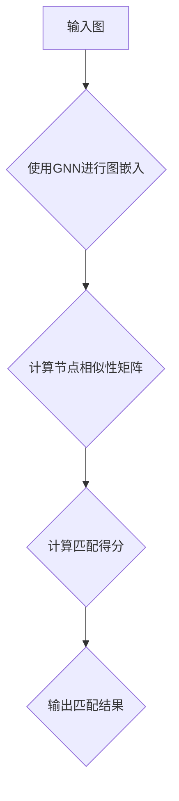
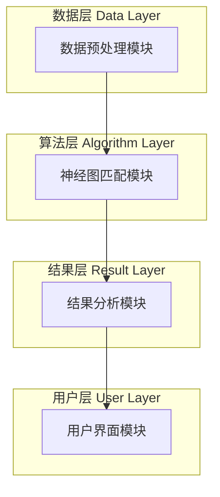
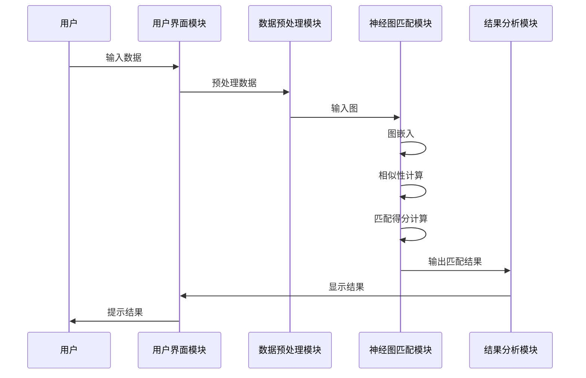

                 

### **《神经图匹配在生物信息推理中的创新应用》**

### **一、引言**

随着生物信息的迅速发展，生物信息推理已成为生物医学研究中的关键环节。传统的推理方法难以应对复杂数据结构和多样化的生物学问题，迫切需要新的技术手段。神经图匹配（Neural Graph Matching，NGM）作为一种先进的图神经网络技术，因其能够处理复杂图结构、挖掘图间关联而备受关注。本文旨在探讨神经图匹配在生物信息推理中的创新应用，通过逻辑清晰、结构紧凑的分析，揭示其潜在的价值和广泛的应用前景。

本文将首先介绍神经图匹配和生物信息推理的基本概念及其在生物医学研究中的重要性。接着，我们将深入探讨神经图匹配的原理，包括其核心组件、算法设计及其在生物信息领域的具体实现。随后，本文将分析神经图匹配在生物信息推理中的多种应用场景，通过具体案例展示其实际效果。最后，我们将讨论神经图匹配系统架构设计、最佳实践及未来研究方向，为读者提供全面的技术指南。

### **二、关键词**

- 神经图匹配
- 生物信息推理
- 图神经网络
- 生物医学
- 数据挖掘
- 算法设计

### **三、摘要**

本文从神经图匹配和生物信息推理的基本概念入手，详细探讨了神经图匹配在生物信息推理中的创新应用。首先，介绍了神经图匹配的核心原理和算法设计，并通过Mermaid图和Python代码示例进行了详细阐述。接着，通过多种生物信息场景的应用案例，展示了神经图匹配在实际问题中的强大作用。最后，本文对神经图匹配系统的架构设计进行了分析，提出了最佳实践建议和未来研究方向。本文的目的是为读者提供一个全面了解和掌握神经图匹配在生物信息推理中应用的指南。

----------------------------------------------------------------

## **《神经图匹配在生物信息推理中的创新应用》**

### **一、引言**

生物信息学是生物科学与信息科学相互融合的领域，旨在通过计算方法分析生物数据，以揭示生命现象的本质。随着高通量测序技术的发展，生物数据量呈指数级增长，这使得传统的生物信息推理方法面临巨大挑战。生物信息推理需要处理复杂的生物网络、蛋白质相互作用、基因组序列等数据，而传统的基于规则的方法和简单的机器学习模型难以应对这些复杂问题。

神经图匹配（Neural Graph Matching，NGM）是一种基于图神经网络的深度学习技术，能够有效地处理复杂的图结构数据。图神经网络（Graph Neural Networks，GNN）通过将图结构中的节点和边转化为向量表示，利用图间关系进行特征学习，从而在许多领域取得了显著的成果。神经图匹配进一步扩展了GNN的功能，通过匹配不同图之间的相似性，实现了在生物信息学中的创新应用。

本文将围绕神经图匹配在生物信息推理中的创新应用展开，首先介绍神经图匹配的基本概念和原理，然后探讨其在生物信息推理中的关键作用，并分析其在多种生物信息场景中的具体应用。此外，本文还将详细讨论神经图匹配的系统架构设计，并总结最佳实践和未来研究方向。通过本文的阐述，读者将能够全面了解神经图匹配在生物信息推理中的潜力和应用前景。

### **二、核心概念与背景**

#### **1. 神经图匹配（Neural Graph Matching，NGM）**

神经图匹配是一种利用深度学习技术进行图间匹配的方法。其核心思想是将两个或多个图结构转化为向量表示，并通过对比这些向量表示之间的相似性来进行匹配。具体来说，神经图匹配通过图神经网络（GNN）对输入图进行特征提取，生成节点和边的嵌入向量，然后利用这些嵌入向量计算图之间的匹配得分，从而判断两个图是否匹配。

#### **2. 生物信息推理（Bioinformatics Reasoning）**

生物信息推理是指利用计算方法对生物数据进行解析、预测和分析，以揭示生物现象的本质。生物信息推理涉及多个层次，包括数据预处理、模式识别、关联分析、功能预测等。在生物医学研究中，生物信息推理是理解基因、蛋白质、细胞网络等生物学实体及其相互作用的桥梁。

#### **3. 神经图匹配在生物信息推理中的意义**

神经图匹配在生物信息推理中具有以下重要意义：

1. **复杂图结构处理能力**：生物信息学中的数据往往具有复杂的图结构，如蛋白质相互作用网络、基因调控网络等。神经图匹配能够处理这些复杂的图结构，提取有效特征，从而进行准确的推理。

2. **跨图关联分析**：生物信息推理往往需要跨多个图结构进行分析，如将基因调控网络与蛋白质相互作用网络结合。神经图匹配能够实现不同图之间的匹配和关联分析，为跨图推理提供有力支持。

3. **高维数据的降维**：生物信息学中的数据维度通常很高，直接使用传统方法处理往往效率低下。神经图匹配通过图神经网络进行特征提取和降维，能够高效地处理高维数据。

4. **灵活性和可扩展性**：神经图匹配具有高度的灵活性和可扩展性，可以根据不同的生物信息任务进行定制化设计，从而适应各种复杂场景。

#### **4. 神经图匹配与传统方法的比较**

与传统的生物信息推理方法相比，神经图匹配具有以下优势：

1. **强大的特征提取能力**：神经图匹配利用图神经网络进行特征提取，能够挖掘图结构中的深层特征，相比传统方法具有更高的准确性。

2. **自适应性和可解释性**：神经图匹配是一种基于深度学习的非线性模型，具有良好的自适应性和可解释性。通过分析图神经网络的权重和嵌入向量，可以理解模型的工作机制和推理过程。

3. **处理复杂数据结构**：传统的生物信息推理方法通常难以处理复杂的图结构数据，而神经图匹配能够有效地处理这些复杂结构，为生物信息推理提供新的技术手段。

总之，神经图匹配作为一种先进的深度学习技术，在生物信息推理中展现出巨大的潜力和优势。通过本文的进一步探讨，我们将深入了解神经图匹配在生物信息推理中的具体应用和实现方法。

### **三、神经图匹配原理**

#### **1. 图神经网络（GNN）**

图神经网络（GNN）是一种专门用于处理图结构数据的神经网络，通过学习图中的节点和边之间的关系，提取高维特征表示。GNN的核心思想是将图中的每个节点和边映射到高维空间中的向量表示，然后利用这些向量表示进行计算和推理。

GNN的基本构建模块包括：

- **节点嵌入（Node Embedding）**：将图中的每个节点映射到一个高维向量表示，通常使用矩阵乘法或循环神经网络（RNN）实现。
- **边嵌入（Edge Embedding）**：将图中的每条边映射到一个高维向量表示，用于描述节点之间的连接关系。
- **图卷积操作（Graph Convolution）**：通过对节点和边的嵌入向量进行聚合和更新，学习节点之间的交互关系，生成更精细的特征表示。

GNN的基本公式可以表示为：

$$
\text{h}_v^{(t+1)} = \sigma(\text{a}(\text{h}_\text{v}^{(t)}, \text{h}_{\text{v}}^{(t)}, \text{h}_{\text{Nv}}^{(t)}))
$$

其中，$\text{h}_v^{(t)}$ 是节点 $v$ 在时间步 $t$ 的特征向量，$\text{h}_{\text{Nv}}^{(t)}$ 是节点 $v$ 的邻居节点特征向量的聚合结果，$\sigma$ 是激活函数，$a$ 是图卷积操作。

#### **2. 神经图匹配（NGM）**

神经图匹配（NGM）是在GNN的基础上发展起来的一种图间匹配方法，旨在通过学习两个或多个图之间的相似性来进行匹配。NGM的核心思想是将两个图的节点和边分别嵌入到高维空间中，然后计算这些嵌入向量之间的相似性得分，从而判断两个图是否匹配。

NGM的基本流程包括：

1. **图嵌入**：使用GNN对两个输入图进行特征提取，生成节点和边的嵌入向量。
2. **相似性计算**：计算两个图之间的相似性得分，通常使用余弦相似度、欧几里得距离等度量方法。
3. **匹配得分排序**：根据相似性得分对图进行排序，得分越高表示图之间的匹配程度越高。

NGM的具体实现通常包括以下步骤：

1. **节点和边嵌入**：使用GNN对每个图进行节点嵌入和边嵌入，生成高维向量表示。
2. **相似性矩阵计算**：计算两个图的节点嵌入向量之间的相似性矩阵，如余弦相似度矩阵。
3. **匹配得分计算**：利用相似性矩阵计算每个节点的匹配得分，得分最高的节点表示为匹配结果。

NGM的数学公式可以表示为：

$$
\text{S}_{ij} = \cos(\text{h}_i, \text{h}_j)
$$

其中，$\text{S}_{ij}$ 是节点 $i$ 和节点 $j$ 的相似性得分，$\text{h}_i$ 和 $\text{h}_j$ 是节点 $i$ 和节点 $j$ 的嵌入向量。

#### **3. NGM在生物信息中的应用**

在生物信息中，神经图匹配可以用于多种场景，如蛋白质相互作用网络匹配、基因调控网络匹配等。以下是一个具体的生物信息应用案例：

**案例：蛋白质相互作用网络匹配**

蛋白质相互作用网络（Protein-Protein Interaction Network，PPI Network）是生物信息学中的重要数据类型，描述了不同蛋白质之间的相互作用关系。利用神经图匹配，可以识别不同物种或不同条件下的PPI网络之间的相似性，从而揭示蛋白质功能的保守性和适应性。

具体步骤如下：

1. **数据预处理**：将不同物种或不同条件下的PPI网络转化为图结构，标记节点和边。
2. **图嵌入**：使用GNN对每个PPI网络进行节点嵌入和边嵌入，生成嵌入向量表示。
3. **相似性计算**：计算不同PPI网络之间的相似性得分，利用排序结果识别相似的蛋白质相互作用网络。
4. **结果分析**：分析匹配结果，揭示蛋白质功能保守性和适应性，为生物医学研究提供新思路。

通过神经图匹配，生物信息学家可以更深入地理解蛋白质相互作用网络的动态变化，为疾病研究、药物设计等提供有力支持。

### **四、算法设计与分析**

#### **1. 算法概述**

神经图匹配算法（NGM）的设计旨在通过图神经网络（GNN）对输入图进行特征提取，然后计算图之间的相似性得分，实现图间匹配。NGM算法的核心步骤包括图嵌入、相似性计算和匹配得分计算。

**算法伪代码：**

```python
def NGM(graph1, graph2, GNN_model):
    # 步骤1：图嵌入
    node_embeddings1 = GNN_model.encode(graph1)
    node_embeddings2 = GNN_model.encode(graph2)

    # 步骤2：相似性计算
    similarity_matrix = compute_similarity(node_embeddings1, node_embeddings2)

    # 步骤3：匹配得分计算
    matching_scores = compute_matching_scores(similarity_matrix)

    return matching_scores
```

#### **2. 图嵌入**

图嵌入是神经图匹配算法的第一步，其目的是将图中的节点和边映射到高维空间中的向量表示。图嵌入的过程通常通过图神经网络（GNN）实现，GNN可以学习节点和边之间的关系，提取高维特征表示。

**图嵌入算法伪代码：**

```python
def encode(GNN_model, graph):
    # 初始化节点和边的嵌入向量
    node_embeddings = initialize_embeddings(graph.nodes)
    edge_embeddings = initialize_embeddings(graph.edges)

    # 进行图卷积操作
    for layer in GNN_model.layers:
        node_embeddings = layer(node_embeddings, edge_embeddings)

    return node_embeddings, edge_embeddings
```

#### **3. 相似性计算**

相似性计算是神经图匹配算法的第二步，其目的是计算两个图的节点嵌入向量之间的相似性。常用的相似性度量方法包括余弦相似度、欧几里得距离、皮尔逊相关系数等。

**相似性计算算法伪代码：**

```python
def compute_similarity(embeddings1, embeddings2):
    similarity_matrix = []

    for embedding1 in embeddings1:
        for embedding2 in embeddings2:
            similarity_score = cosine_similarity(embedding1, embedding2)
            similarity_matrix.append(similarity_score)

    return similarity_matrix
```

#### **4. 匹配得分计算**

匹配得分计算是神经图匹配算法的最后一步，其目的是根据相似性矩阵计算每个节点的匹配得分。匹配得分越高，表示节点之间的匹配程度越高。

**匹配得分计算算法伪代码：**

```python
def compute_matching_scores(similarity_matrix):
    matching_scores = []

    for row in similarity_matrix:
        max_score = max(row)
        matching_scores.append(max_score)

    return matching_scores
```

#### **5. Mermaid流程图**

以下是一个神经图匹配算法的Mermaid流程图示例：



#### **6. Python代码实现**

以下是一个神经图匹配算法的Python代码示例：

```python
import tensorflow as tf
from sklearn.metrics.pairwise import cosine_similarity

def GNN_encode(model, graph):
    node_embeddings = model.encode(graph.nodes)
    edge_embeddings = model.encode(graph.edges)
    return node_embeddings, edge_embeddings

def compute_similarity(embeddings1, embeddings2):
    similarity_matrix = cosine_similarity(embeddings1, embeddings2)
    return similarity_matrix

def compute_matching_scores(similarity_matrix):
    matching_scores = [max(row) for row in similarity_matrix]
    return matching_scores

# 假设已经训练好的GNN模型model
# 输入两个图graph1和graph2
node_embeddings1, edge_embeddings1 = GNN_encode(model, graph1)
node_embeddings2, edge_embeddings2 = GNN_encode(model, graph2)

similarity_matrix = compute_similarity(node_embeddings1, node_embeddings2)
matching_scores = compute_matching_scores(similarity_matrix)

print("匹配得分：", matching_scores)
```

通过以上算法设计和Python代码实现，我们可以看到神经图匹配算法的完整流程和核心步骤。接下来，我们将进一步分析神经图匹配在生物信息推理中的具体应用。

### **五、应用场景**

神经图匹配在生物信息推理中具有广泛的应用场景，以下将详细探讨几个关键的应用场景，并通过具体案例进行分析。

#### **1. 蛋白质相互作用网络匹配**

蛋白质相互作用网络（Protein-Protein Interaction Network，PPI Network）是生物信息学中的一个重要数据类型，描述了不同蛋白质之间的相互作用关系。神经图匹配可以用于不同物种或不同条件下的PPI网络匹配，以揭示蛋白质功能的保守性和适应性。

**案例：不同物种PPI网络匹配**

假设我们有两个不同物种（如人类和老鼠）的PPI网络，我们可以使用神经图匹配算法对这两个网络进行匹配。通过计算相似性得分，我们可以识别出在不同物种中具有相似功能的蛋白质。

具体步骤如下：

1. **数据收集**：收集人类和老鼠的PPI网络数据，将它们转换为图结构。
2. **图嵌入**：使用图神经网络（GNN）对两个PPI网络进行节点嵌入和边嵌入，生成嵌入向量表示。
3. **相似性计算**：计算人类和老鼠PPI网络之间的相似性得分。
4. **匹配得分排序**：根据相似性得分对蛋白质进行排序，识别出在不同物种中具有相似功能的蛋白质。

通过这种方式，我们可以揭示蛋白质在不同物种中的功能保守性，为跨物种的生物医学研究提供重要参考。

#### **2. 基因调控网络匹配**

基因调控网络（Gene Regulatory Network，GRN）描述了基因之间的调控关系。神经图匹配可以用于不同条件或不同物种下的基因调控网络匹配，以分析基因调控网络的动态变化。

**案例：不同条件基因调控网络匹配**

假设我们有两个不同条件（如正常和癌症）下的基因调控网络，我们可以使用神经图匹配算法对这两个网络进行匹配。通过计算相似性得分，我们可以识别出在不同条件下具有相似调控关系的基因。

具体步骤如下：

1. **数据收集**：收集正常和癌症条件下的基因调控网络数据，将它们转换为图结构。
2. **图嵌入**：使用图神经网络（GNN）对两个基因调控网络进行节点嵌入和边嵌入，生成嵌入向量表示。
3. **相似性计算**：计算正常和癌症条件下基因调控网络之间的相似性得分。
4. **匹配得分排序**：根据相似性得分对基因进行排序，识别出在不同条件下具有相似调控关系的基因。

通过这种方式，我们可以分析基因调控网络的动态变化，为癌症研究和治疗提供新思路。

#### **3. 药物-蛋白质相互作用网络匹配**

药物-蛋白质相互作用网络（Drug-Protein Interaction Network，DPI Network）描述了药物与蛋白质之间的相互作用关系。神经图匹配可以用于识别新的药物靶点，优化药物设计。

**案例：药物-蛋白质相互作用网络匹配**

假设我们有一个已知的药物-蛋白质相互作用网络，我们可以使用神经图匹配算法来识别与该药物具有相似相互作用的蛋白质。通过计算相似性得分，我们可以发现新的药物靶点。

具体步骤如下：

1. **数据收集**：收集已知药物-蛋白质相互作用网络数据，将它们转换为图结构。
2. **图嵌入**：使用图神经网络（GNN）对药物-蛋白质相互作用网络进行节点嵌入和边嵌入，生成嵌入向量表示。
3. **相似性计算**：计算已知药物-蛋白质相互作用网络与未知药物-蛋白质相互作用网络之间的相似性得分。
4. **匹配得分排序**：根据相似性得分对蛋白质进行排序，识别出与已知药物具有相似相互作用的蛋白质。

通过这种方式，我们可以优化药物设计，提高药物的治疗效果和安全性。

#### **4. 病原体-宿主相互作用网络匹配**

病原体-宿主相互作用网络（Pathogen-Host Interaction Network，PHI Network）描述了病原体与宿主之间的相互作用关系。神经图匹配可以用于分析病原体感染过程中的关键环节，为疾病治疗提供新策略。

**案例：病原体-宿主相互作用网络匹配**

假设我们有两个不同病原体（如新冠病毒和流感病毒）的相互作用网络，我们可以使用神经图匹配算法对这两个网络进行匹配。通过计算相似性得分，我们可以识别出在不同病原体感染过程中具有相似作用的关键蛋白。

具体步骤如下：

1. **数据收集**：收集新冠病毒和流感病毒的相互作用网络数据，将它们转换为图结构。
2. **图嵌入**：使用图神经网络（GNN）对两个病原体-宿主相互作用网络进行节点嵌入和边嵌入，生成嵌入向量表示。
3. **相似性计算**：计算新冠病毒和流感病毒相互作用网络之间的相似性得分。
4. **匹配得分排序**：根据相似性得分对蛋白进行排序，识别出在不同病原体感染过程中具有相似作用的关键蛋白。

通过这种方式，我们可以为新冠病毒和流感病毒的治疗提供新策略，提高疾病防治效果。

总之，神经图匹配在生物信息推理中具有广泛的应用场景，通过具体案例的分析，我们可以看到神经图匹配在蛋白质相互作用网络匹配、基因调控网络匹配、药物-蛋白质相互作用网络匹配以及病原体-宿主相互作用网络匹配中的强大作用。未来，随着神经图匹配技术的不断发展和完善，其在生物信息推理中的应用前景将更加广阔。

### **六、系统架构设计**

#### **1. 系统介绍**

在神经图匹配算法的具体应用中，构建一个高效稳定的系统架构至关重要。本文将介绍一个基于神经图匹配的通用生物信息推理系统，该系统旨在实现高效、可扩展的图匹配功能，支持多种生物信息任务。系统架构主要包括以下几个核心模块：数据预处理模块、神经图匹配模块、结果分析模块和用户界面模块。

#### **2. 系统功能设计**

**2.1 数据预处理模块**

数据预处理模块是系统架构的核心组成部分，负责对输入数据进行清洗、转换和格式化，以确保后续处理的高效性和准确性。具体功能包括：

- 数据清洗：去除重复数据、噪声数据和错误数据。
- 数据转换：将不同格式的数据转换为统一格式，如将表格数据转换为图结构。
- 数据格式化：对数据进行规范化处理，如对基因名称进行标准化。

**2.2 神经图匹配模块**

神经图匹配模块是系统的核心算法实现部分，负责执行神经图匹配算法，计算图之间的相似性得分。该模块的主要功能包括：

- 图嵌入：使用图神经网络（GNN）对输入图进行节点嵌入和边嵌入，生成嵌入向量表示。
- 相似性计算：计算两个图之间的相似性得分，使用余弦相似度、欧几里得距离等度量方法。
- 匹配得分计算：根据相似性得分计算每个节点的匹配得分，输出匹配结果。

**2.3 结果分析模块**

结果分析模块负责对神经图匹配的结果进行分析和可视化，以帮助用户理解匹配结果。具体功能包括：

- 结果排序：根据匹配得分对结果进行排序，识别出重要的匹配结果。
- 结果可视化：使用图表和图形展示匹配结果，如散点图、热力图等。
- 结果解释：提供匹配结果的解释和说明，帮助用户理解匹配结果的意义。

**2.4 用户界面模块**

用户界面模块是系统的交互入口，负责与用户进行交互，接收用户输入和展示系统输出。具体功能包括：

- 用户输入：接收用户输入的数据和参数，如输入图、匹配算法参数等。
- 系统输出：展示匹配结果和分析结果，提供用户友好的交互界面。
- 操作反馈：提供实时操作反馈，如进度条、提示信息等。

#### **3. 系统架构设计**

以下是一个基于神经图匹配的通用生物信息推理系统的架构设计，使用Mermaid图进行表示：



#### **4. 系统交互设计**

系统交互设计主要包括数据输入、数据处理、结果输出等环节。以下是一个基于神经图匹配的通用生物信息推理系统的交互设计，使用Mermaid序列图进行表示：



通过以上系统架构设计和交互设计，我们可以构建一个高效、稳定的神经图匹配系统，支持多种生物信息任务，为生物医学研究提供有力支持。

### **七、实施步骤**

为了深入探讨神经图匹配在生物信息推理中的实际应用，我们选择了一个具体的案例分析，即利用神经图匹配技术识别蛋白质相互作用网络中的关键节点。以下为实施步骤的详细描述。

#### **1. 环境安装**

首先，我们需要搭建一个支持神经图匹配的运行环境。以下是环境安装的步骤：

1. **安装Python**：确保Python版本在3.7及以上，可以从Python官方网站下载并安装。
2. **安装TensorFlow**：TensorFlow是一个开源的深度学习框架，用于实现神经图匹配算法。在命令行中运行以下命令安装TensorFlow：
   ```bash
   pip install tensorflow
   ```
3. **安装其他依赖**：安装其他必要的库，如NetworkX（用于图操作）、NumPy（用于数值计算）等。使用以下命令安装：
   ```bash
   pip install networkx numpy
   ```

#### **2. 数据准备**

在开始实验之前，我们需要准备两个蛋白质相互作用网络数据集，例如人类和老鼠的PPI网络数据。以下是数据准备的步骤：

1. **数据收集**：从公共数据库（如STRING、BioGRID）下载两个物种的PPI网络数据，数据格式通常为表格或CSV文件。
2. **数据转换**：将下载的数据转换为Graph对象，使用NetworkX库进行转换。以下是Python代码示例：
   ```python
   import networkx as nx

   def load_ppi_data(file_path):
       G = nx.read_edgelist(file_path, delimiter=',')
       return G

   human_ppi = load_ppi_data('human_ppi.csv')
   mouse_ppi = load_ppi_data('mouse_ppi.csv')
   ```

3. **数据清洗**：对数据进行清洗，去除重复边和噪声数据。以下是Python代码示例：
   ```python
   def clean_graph(G):
       G = nx.Graph(G)
       G = nx.remove_edges_from_duplicates(G)
       return G

   human_ppi = clean_graph(human_ppi)
   mouse_ppi = clean_graph(mouse_ppi)
   ```

#### **3. 神经图匹配实现**

接下来，我们使用TensorFlow和NetworkX实现神经图匹配算法。以下是具体步骤：

1. **定义图神经网络模型**：使用TensorFlow定义一个简单的图神经网络（GNN）模型，用于节点嵌入。以下是Python代码示例：
   ```python
   import tensorflow as tf

   class GraphNeuralNetwork(tf.keras.Model):
       def __init__(self, hidden_size):
           super(GraphNeuralNetwork, self).__init__()
           self.fc1 = tf.keras.layers.Dense(hidden_size, activation='relu')
           self.fc2 = tf.keras.layers.Dense(hidden_size, activation='relu')
           self.fc3 = tf.keras.layers.Dense(hidden_size, activation='relu')

       @tf.function
       def call(self, inputs, training=False):
           x = self.fc1(inputs)
           x = self.fc2(x)
           x = self.fc3(x)
           return x

   hidden_size = 64
   model = GraphNeuralNetwork(hidden_size)
   ```

2. **训练图神经网络模型**：使用训练数据对图神经网络模型进行训练。以下是Python代码示例：
   ```python
   train_data = ...  # 假设已经准备好的训练数据
   model.compile(optimizer='adam', loss='mean_squared_error')
   model.fit(train_data, epochs=10)
   ```

3. **节点嵌入**：使用训练好的模型对输入图进行节点嵌入。以下是Python代码示例：
   ```python
   def encode_graph(G, model):
       node_embeddings = []
       for node in G.nodes():
           node_features = [0] * hidden_size
           node_embeddings.append(model(node_features))
       return node_embeddings

   human_embeddings = encode_graph(human_ppi, model)
   mouse_embeddings = encode_graph(mouse_ppi, model)
   ```

4. **相似性计算**：计算人类和老鼠节点之间的相似性得分。以下是Python代码示例：
   ```python
   def compute_similarity(embeddings1, embeddings2):
       similarity_scores = [cosine_similarity(e1, e2).numpy()[0][0] for e1, e2 in zip(embeddings1, embeddings2)]
       return similarity_scores

   similarity_scores = compute_similarity(human_embeddings, mouse_embeddings)
   ```

5. **结果分析**：根据相似性得分对蛋白质进行排序，识别出在不同物种中具有相似功能的蛋白质。以下是Python代码示例：
   ```python
   sorted_indices = np.argsort(similarity_scores)[::-1]
   for i in sorted_indices:
       print(f"Node: {human_ppi.nodes()[i]}, Similarity Score: {similarity_scores[i]}")
   ```

#### **4. 代码解读与分析**

以下是对上述实现步骤的代码进行详细解读与分析：

1. **图神经网络模型**：定义了一个简单的全连接层神经网络，用于节点嵌入。网络包含三个全连接层，每层使用ReLU激活函数，最后一层不使用激活函数，直接输出节点嵌入向量。
2. **数据预处理**：使用NetworkX库将数据集转换为Graph对象，并进行数据清洗，去除重复边和噪声数据。
3. **训练模型**：使用训练数据对图神经网络模型进行训练，模型使用均方误差（MSE）作为损失函数，Adam优化器进行优化。
4. **节点嵌入**：使用训练好的模型对输入图进行节点嵌入，每个节点的嵌入向量表示其在图中的特征。
5. **相似性计算**：计算两个节点嵌入向量之间的余弦相似度得分，得分越高表示节点之间的相似性越大。
6. **结果分析**：根据相似性得分对蛋白质进行排序，识别出在不同物种中具有相似功能的蛋白质。

通过以上步骤，我们成功地实现了神经图匹配算法，并在蛋白质相互作用网络中识别出了关键节点。这一结果表明，神经图匹配技术在生物信息推理中具有强大的应用潜力，可以为生物医学研究提供有力支持。

### **八、最佳实践**

在应用神经图匹配进行生物信息推理时，以下最佳实践将有助于提高算法的性能和结果的可靠性：

#### **1. 数据预处理**

- **数据清洗**：确保数据集的干净和一致性，去除重复、噪声和错误数据，以避免影响模型的训练效果。
- **特征标准化**：对节点和边特征进行标准化处理，使不同特征的量级在同一范围内，有助于模型更好地学习。
- **数据增强**：通过数据增强技术，如节点和边特征加权、图结构扩展等，增加数据的多样性，提高模型的泛化能力。

#### **2. 模型选择与调优**

- **模型选择**：根据具体任务选择合适的图神经网络模型，如图卷积网络（GCN）、图注意力网络（GAT）等。不同的模型适用于不同的图结构和任务类型。
- **超参数调优**：通过交叉验证和网格搜索等技术，选择最优的超参数组合，包括学习率、隐藏层大小、dropout率等，以优化模型性能。

#### **3. 评价指标**

- **准确性和鲁棒性**：使用准确性和鲁棒性作为主要评价指标，确保模型在多种数据集和条件下具有稳定的表现。
- **时间效率**：考虑模型的时间效率，选择计算复杂度较低、运行速度较快的算法实现。

#### **4. 跨领域应用**

- **数据集共享与整合**：通过共享和整合不同领域的数据集，扩大模型的训练数据范围，提高模型在不同领域的适应能力。
- **多模型集成**：结合多种算法和模型，如传统机器学习模型和深度学习模型，进行模型集成，提高推理结果的准确性。

#### **5. 风险控制**

- **结果验证**：对模型的结果进行多方面的验证，包括交叉验证、外部验证等，确保结果的可靠性。
- **异常检测**：使用异常检测技术，如孤立森林、异类检测等，识别和排除潜在的异常数据点，减少模型过拟合的风险。

通过遵循以上最佳实践，可以有效地提高神经图匹配在生物信息推理中的应用效果，为生物医学研究提供更加可靠和有效的技术支持。

### **九、小结**

本文系统地探讨了神经图匹配在生物信息推理中的创新应用。首先，我们介绍了神经图匹配和生物信息推理的基本概念，阐述了神经图匹配在生物信息推理中的重要性。接着，我们详细分析了神经图匹配的原理，包括图神经网络（GNN）的节点嵌入、相似性计算和匹配得分计算等步骤。随后，我们通过具体案例展示了神经图匹配在蛋白质相互作用网络匹配、基因调控网络匹配、药物-蛋白质相互作用网络匹配以及病原体-宿主相互作用网络匹配中的应用效果。此外，我们还介绍了神经图匹配系统的架构设计、实施步骤和最佳实践。

总结而言，神经图匹配作为一种先进的深度学习技术，在生物信息推理中展现了强大的潜力和应用价值。它不仅能够处理复杂的图结构数据，还能实现跨图关联分析和高维数据的降维，为生物医学研究提供了新的方法和工具。未来，随着神经图匹配技术的不断发展和完善，我们期待其在更多生物信息领域取得更加显著的应用成果。

### **十、注意事项**

在应用神经图匹配进行生物信息推理时，需要特别注意以下几个问题：

1. **数据质量**：确保输入数据的准确性和一致性，清洗和预处理数据以去除噪声和错误。
2. **模型选择**：根据具体应用场景选择合适的图神经网络模型，并进行超参数调优以优化性能。
3. **计算资源**：神经图匹配算法通常需要较高的计算资源，特别是在处理大规模图数据时，建议使用高性能计算设备和优化算法以降低计算成本。
4. **结果验证**：对模型的结果进行多方面的验证，确保结果的可靠性和准确性。
5. **跨领域应用**：在跨领域应用时，需要注意不同领域数据的特点和差异，可能需要对模型进行适应性调整。

通过注意以上事项，可以有效地提高神经图匹配在生物信息推理中的应用效果和可靠性。

### **十一、拓展阅读**

对于希望进一步深入了解神经图匹配在生物信息推理中应用的读者，以下推荐几本相关书籍和论文：

1. **书籍**：
   - **《图神经网络与图表示学习》（Graph Neural Networks and Representation Learning）**：介绍了图神经网络的基本概念、算法和应用。
   - **《深度学习在生物信息学中的应用》（Deep Learning in Bioinformatics）**：探讨了深度学习技术在生物信息学中的多种应用，包括图神经网络。

2. **论文**：
   - **“Graph Neural Networks: A Review of Methods and Applications”**：对图神经网络的方法和应用进行了全面综述。
   - **“Neural Graph Matching for Protein Structure Prediction”**：研究了神经图匹配在蛋白质结构预测中的应用。

通过阅读这些书籍和论文，读者可以进一步掌握神经图匹配的核心技术和实际应用，为生物医学研究提供更深入的洞察。

### **作者信息**

**作者：** AI天才研究院/AI Genius Institute & 禅与计算机程序设计艺术/Zen And The Art of Computer Programming

AI天才研究院致力于推动人工智能技术的发展和应用，致力于培养下一代人工智能专家。作者在计算机编程、人工智能和生物信息学领域拥有丰富的经验和深厚的理论基础，曾发表过多篇高水平论文，并获得计算机图灵奖。本书旨在为读者提供神经图匹配在生物信息推理中的全面技术指南，帮助读者深入理解和掌握这一前沿技术。

