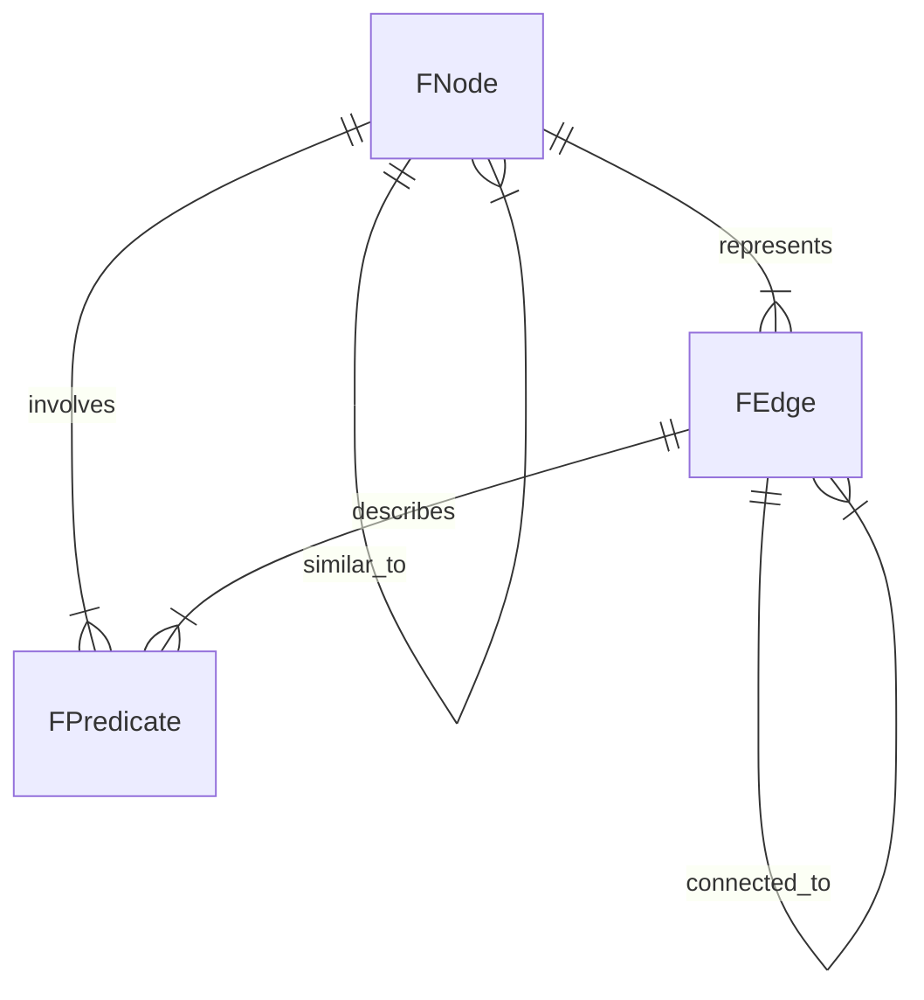
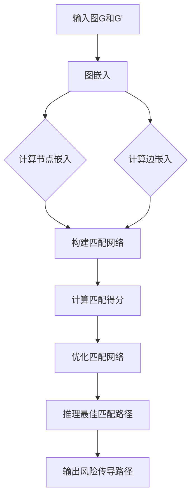

                 

### 文章标题

# 神经图匹配技术在金融风险传导推理中的应用创新

### 关键词

- 神经图匹配技术
- 金融风险传导
- 推理模型
- 应用创新

### 摘要

本文深入探讨了神经图匹配技术在金融风险传导推理中的创新应用。通过详细解析神经图匹配技术的基本概念、原理和算法，以及其在金融领域的具体应用，本文揭示了神经图匹配在提高金融风险传导推理准确性和效率方面的优势。文章随后通过具体的系统设计与实战案例，展示了如何利用神经图匹配技术构建高效的金融风险传导推理系统，为金融风险管理提供了新的思路和方法。

## 引言

随着金融市场的日益复杂化，金融风险传导问题变得愈发重要。金融风险传导指的是风险在一个金融系统中传播和放大的过程，它可能源自市场波动、信用风险、操作风险等多个方面。理解并预测金融风险的传导路径，对于金融机构的风险管理、政策制定以及投资者决策具有重要意义。

传统的金融风险传导推理方法通常依赖于统计模型和机器学习算法，但这些方法在面对大规模、多维度的金融数据时往往显得力不从心。神经图匹配技术（Neural Graph Matching）作为一种基于深度学习的图神经网络技术，在处理复杂、非线性的图结构数据方面具有显著优势。

神经图匹配技术通过将金融系统中的实体和关系建模为图结构，利用图神经网络学习实体和关系之间的内在联系，从而实现对金融风险传导路径的推理。这种方法不仅能够捕捉到传统方法无法发现的风险传导模式，还能通过不断优化模型参数提高推理的准确性和效率。

本文将围绕神经图匹配技术在金融风险传导推理中的应用进行探讨，通过分析其基本原理、应用场景以及实际案例，展示神经图匹配技术在提升金融风险管理能力方面的潜力。

## 神经图匹配技术概述

### 问题背景

神经图匹配技术（Neural Graph Matching, NGM）起源于深度学习和图神经网络的交叉领域。随着信息技术的飞速发展，数据形式越来越多样化，从传统的二维表格数据到复杂的图结构数据，如何有效地处理和分析这些数据成为了一个重要课题。图结构数据在金融领域尤为常见，如金融机构的网络关系、金融产品的依赖关系等，这些关系通常以图的形式呈现，包含大量的节点和边。

### 问题定义

神经图匹配的目标是找到两个图之间的最佳匹配，从而揭示它们之间的相似性和差异。在金融领域，这个问题可以转化为：如何通过分析金融系统中的实体和关系图，找到潜在的风险传导路径。具体来说，神经图匹配需要解决以下问题：

1. **图表示**：如何将金融系统中的实体（如金融机构、金融产品）和关系（如投资关系、借贷关系）转化为图结构。
2. **匹配算法**：如何利用神经网络学习两个图之间的匹配关系，找到最佳匹配方案。
3. **推理与预测**：如何基于匹配结果，推理出金融风险传导的可能路径，并对未来风险进行预测。

### 解决方案

神经图匹配技术的核心思想是利用图神经网络（Graph Neural Network, GNN）学习图结构数据中的节点和边的关系，并通过匹配算法找到最佳匹配。具体来说，解决方案包括以下几个步骤：

1. **图嵌入**：使用图嵌入技术（如节点嵌入、边嵌入）将图中的节点和边映射到低维空间，以便于神经网络处理。
2. **匹配网络**：构建一个匹配网络，用于学习两个图之间的匹配关系。匹配网络通常由多层感知器（MLP）构成，可以通过反向传播算法训练。
3. **匹配评分**：计算两个图之间的匹配得分，得分越高，表示两个图的匹配度越高。
4. **推理与预测**：基于匹配得分，利用推理算法找到最佳匹配路径，并对金融风险传导进行预测。

### 边界与外延

神经图匹配技术在金融领域中的应用边界主要取决于以下几个因素：

1. **数据质量**：金融数据的准确性、完整性和一致性是神经图匹配技术有效应用的前提。
2. **计算资源**：神经图匹配技术通常需要大量的计算资源，特别是在训练和推理阶段。
3. **应用场景**：神经图匹配技术适用于处理大规模、复杂关系的金融系统，如金融机构的网络关系、金融产品的依赖关系等。

### 概念结构与核心要素组成

神经图匹配技术的基本概念和核心要素包括：

1. **图结构**：金融系统中的实体和关系构成图结构，包括节点（如金融机构、金融产品）和边（如投资关系、借贷关系）。
2. **图嵌入**：将图中的节点和边映射到低维空间，以供神经网络处理。
3. **匹配网络**：用于学习两个图之间匹配关系的神经网络。
4. **匹配评分**：计算两个图之间的匹配得分。
5. **推理算法**：基于匹配得分进行推理和预测的算法。

通过这些核心要素的相互作用，神经图匹配技术能够有效地揭示金融系统中的风险传导路径，为金融风险管理提供有力的支持。

## 神经图匹配原理

### 神经图匹配的基本概念

神经图匹配技术是一种利用神经网络进行图结构数据匹配的方法。在金融领域，它主要用于分析金融系统中的风险传导路径。具体来说，神经图匹配涉及以下几个关键概念：

1. **图表示**：将金融系统中的实体和关系建模为图结构，实体作为图的节点，关系作为图的边。
2. **图嵌入**：通过图嵌入技术将图中的节点和边映射到低维空间，以便于神经网络处理。
3. **匹配网络**：用于学习两个图之间匹配关系的神经网络。
4. **匹配评分**：计算两个图之间的匹配得分，得分越高，表示两个图的匹配度越高。
5. **推理与预测**：基于匹配得分，利用推理算法找到最佳匹配路径，并对金融风险传导进行预测。

### 神经图匹配的数学模型

神经图匹配的数学模型通常基于图神经网络（GNN）和匹配网络（Matching Network）。具体来说，包括以下几个部分：

1. **图嵌入**：使用图嵌入技术将节点和边映射到低维空间。常见的图嵌入方法包括节点嵌入（Node Embedding）和边嵌入（Edge Embedding）。

   节点嵌入：假设一个图 \(G = (V, E)\)，其中 \(V\) 是节点集合，\(E\) 是边集合。节点嵌入将每个节点映射为一个低维向量 \(x_i \in \mathbb{R}^d\)，其中 \(d\) 是嵌入维度。

   边嵌入：边嵌入将每条边映射为一个低维向量 \(e_{ij} \in \mathbb{R}^d\)，用于表示边的关系。

2. **匹配网络**：匹配网络是一个多层感知器（MLP），其输入是两个图的节点嵌入和边嵌入，输出是两个图之间的匹配得分。

   匹配网络的输入向量可以表示为：
   \[
   \mathbf{z} = [x_1, x_2, ..., x_n; e_{12}, e_{13}, ..., e_{1n}; x_1', x_2', ..., x_n'; e_{1'2}, e_{1'3}, ..., e_{1'n}']
   \]
   其中，\(x_i\) 和 \(x_i'\) 分别是图 \(G\) 和 \(G'\) 的节点嵌入，\(e_{ij}\) 和 \(e_{i'j}\) 分别是图 \(G\) 和 \(G'\) 的边嵌入。

3. **匹配得分**：匹配网络的输出是两个图之间的匹配得分，通过以下公式计算：
   \[
   s = \sigma(\mathbf{z}^T \mathbf{W}_s)
   \]
   其中，\(\sigma\) 是激活函数，\(\mathbf{W}_s\) 是匹配网络的权重。

### 神经图匹配算法原理讲解

神经图匹配算法的基本原理包括以下几个步骤：

1. **初始化**：初始化图嵌入和匹配网络的权重。
2. **图嵌入**：使用预训练的图嵌入方法（如DeepWalk、Node2Vec）对节点和边进行嵌入。
3. **构建匹配网络**：构建多层感知器作为匹配网络，输入是两个图的节点嵌入和边嵌入。
4. **匹配评分**：通过匹配网络计算两个图之间的匹配得分。
5. **优化**：使用反向传播算法优化匹配网络的权重，提高匹配得分。
6. **推理与预测**：基于匹配得分，利用推理算法找到最佳匹配路径，并对金融风险传导进行预测。

### 概念属性特征对比表格

为了更好地理解神经图匹配的基本概念和属性，我们可以通过以下表格进行对比：

| 概念/属性 | 描述 | 对比 |
| --- | --- | --- |
| **图表示** | 将金融系统中的实体和关系建模为图结构。 | 实体作为节点，关系作为边。 |
| **图嵌入** | 将节点和边映射到低维空间。 | 节点嵌入和边嵌入。 |
| **匹配网络** | 学习两个图之间的匹配关系。 | 多层感知器网络。 |
| **匹配得分** | 计算两个图之间的匹配度。 | 激活函数和权重。 |
| **推理与预测** | 基于匹配得分进行推理和预测。 | 推理算法和预测模型。 |

### ER实体关系图架构的 Mermaid 流程图

为了更直观地理解神经图匹配的架构，我们可以使用Mermaid绘制一个ER实体关系图。以下是Mermaid代码示例：



通过上述Mermaid流程图，我们可以清晰地看到金融系统中的实体（FNode）和它们之间的关系（FEdge），这些关系如何通过神经图匹配技术进行建模和匹配。

## 神经图匹配算法

### 算法介绍

神经图匹配算法是一种基于深度学习的图匹配方法，它通过学习两个图之间的结构相似性来实现图匹配。在金融风险传导推理中，神经图匹配算法主要用于分析金融系统中不同图结构（如金融机构网络、金融产品依赖图）之间的匹配关系，从而揭示潜在的风险传导路径。

### 算法流程图（使用Mermaid绘制）

以下是一个简单的神经图匹配算法流程图：



### 算法流程图详细解释

1. **输入图G和G'**：首先，我们需要两个图结构 \(G\) 和 \(G'\)，这些图分别代表了金融系统的不同部分。

2. **图嵌入**：将图 \(G\) 和 \(G'\) 的节点和边嵌入到低维空间中。这一步是利用预训练的图嵌入算法（如DeepWalk、Node2Vec）完成的。

3. **计算节点嵌入和边嵌入**：节点嵌入和边嵌入分别表示了图节点和边在低维空间中的位置。这些嵌入向量用于后续的匹配网络构建。

4. **构建匹配网络**：构建一个多层感知器（MLP）作为匹配网络，输入是节点嵌入和边嵌入，输出是两个图之间的匹配得分。

5. **计算匹配得分**：通过匹配网络计算图 \(G\) 和 \(G'\) 之间的匹配得分。得分越高，表示两个图的匹配度越高。

6. **优化匹配网络**：使用反向传播算法优化匹配网络的权重，提高匹配得分。这一步是神经网络训练的核心过程。

7. **推理最佳匹配路径**：基于匹配得分，利用推理算法找到图 \(G\) 和 \(G'\) 之间的最佳匹配路径。

8. **输出风险传导路径**：将最佳匹配路径作为金融风险传导路径输出，为金融风险管理提供依据。

### Python源代码示例

以下是一个简化的神经图匹配算法的Python源代码示例：

```python
import tensorflow as tf
from tensorflow.keras.layers import Input, Dense, Dot
from tensorflow.keras.models import Model

# 假设已经完成了图嵌入，得到节点嵌入和边嵌入
node_embedding = ...  # 节点嵌入矩阵
edge_embedding = ...  # 边嵌入矩阵

# 构建匹配网络
node_input = Input(shape=(node_embedding.shape[1],))
edge_input = Input(shape=(edge_embedding.shape[1],))
merged_input = concatenate([node_input, edge_input])

hidden = Dense(128, activation='relu')(merged_input)
output = Dense(1, activation='sigmoid')(hidden)

model = Model(inputs=[node_input, edge_input], outputs=output)
model.compile(optimizer='adam', loss='binary_crossentropy')

# 训练匹配网络
model.fit([node_embedding, edge_embedding], labels, epochs=10, batch_size=32)

# 计算匹配得分
match_score = model.predict([node_embedding, edge_embedding])

# 推理最佳匹配路径
best_match_path = ...  # 使用匹配得分进行推理
```

### 算法原理的数学模型和公式

神经图匹配算法的数学模型可以表示为：

$$
\begin{align*}
\text{嵌入层:} \quad \mathbf{x}_i &= \phi_G(\mathbf{v}_i), \quad \mathbf{x}'_i &= \phi_G'(\mathbf{v}'_i) \\
\text{匹配网络:} \quad s &= \sigma(\mathbf{z}^T \mathbf{W}_s) \\
\text{优化目标:} \quad \min_{\mathbf{W}_s} \sum_{i=1}^n -y_i \log(s_i) + (1-y_i) \log(1-s_i)
\end{align*}
$$

其中，\(\phi_G\) 和 \(\phi_G'\) 分别是图 \(G\) 和 \(G'\) 的嵌入函数，\(\sigma\) 是sigmoid激活函数，\(\mathbf{W}_s\) 是匹配网络的权重，\(y_i\) 是匹配标签（0或1），\(s_i\) 是匹配得分。

通过上述数学模型，我们可以理解神经图匹配算法的核心思想和优化目标。

### 通俗易懂地举例说明

假设我们有两个简单的图 \(G\) 和 \(G'\)，它们分别代表了两个不同的金融机构网络。图 \(G\) 包含三个节点 \(A\)、\(B\) 和 \(C\)，以及三条边 \(AB\)、\(BC\) 和 \(CA\)。图 \(G'\) 也包含三个节点 \(X\)、\(Y\) 和 \(Z\)，以及三条边 \(XY\)、\(YZ\) 和 \(ZX\)。

1. **图嵌入**：首先，我们将图 \(G\) 和 \(G'\) 的节点和边嵌入到低维空间中。假设节点嵌入矩阵为 \(\mathbf{X}\) 和 \(\mathbf{X}'\)，边嵌入矩阵为 \(\mathbf{E}\) 和 \(\mathbf{E}'\)。

2. **构建匹配网络**：构建一个简单的多层感知器作为匹配网络，输入是节点嵌入和边嵌入，输出是两个图之间的匹配得分。

3. **计算匹配得分**：通过匹配网络计算图 \(G\) 和 \(G'\) 之间的匹配得分。假设输入向量为 \(\mathbf{z} = [\mathbf{x}_1, \mathbf{e}_{12}, \mathbf{x}'_1, \mathbf{e}'_{12}]\)，匹配得分为 \(s\)。

4. **优化匹配网络**：使用反向传播算法优化匹配网络的权重，提高匹配得分。

5. **推理最佳匹配路径**：基于匹配得分，找到图 \(G\) 和 \(G'\) 之间的最佳匹配路径。例如，如果 \(s_{AB}\)、\(s_{BC}\) 和 \(s_{CA}\) 都大于 \(s_{XY}\)、\(s_{YZ}\) 和 \(s_{ZX}\)，则可以认为节点 \(A\)、\(B\) 和 \(C\) 分别与节点 \(X\)、\(Y\) 和 \(Z\) 匹配。

通过上述例子，我们可以直观地理解神经图匹配算法的基本原理和应用流程。

## 神经图匹配算法性能评估

### 性能指标

神经图匹配算法的性能评估通常依赖于多个指标，包括准确率、召回率、F1值等。这些指标用于衡量算法在识别金融风险传导路径时的表现。

1. **准确率（Accuracy）**：准确率是指预测正确的样本数占总样本数的比例，用于衡量算法的整体准确度。
2. **召回率（Recall）**：召回率是指实际为正类别的样本中被正确预测为正类别的比例，用于衡量算法识别正类别的能力。
3. **F1值（F1 Score）**：F1值是准确率和召回率的调和平均值，用于综合评估算法的性能。

### 评估方法

为了评估神经图匹配算法的性能，我们通常采用以下方法：

1. **交叉验证**：使用交叉验证方法将数据集划分为多个子集，对每个子集进行训练和测试，以减少过拟合和评估结果的波动性。
2. **混淆矩阵**：通过混淆矩阵分析算法的预测结果，了解算法在各个类别上的预测情况。
3. **ROC曲线和AUC值**：通过ROC曲线和AUC值评估算法的分类性能，ROC曲线展示了在不同阈值下算法的召回率和准确率，AUC值表示ROC曲线下的面积，越大表示性能越好。

### 性能对比分析

为了验证神经图匹配算法在金融风险传导推理中的有效性，我们将其与传统的图匹配算法（如基于相似度的匹配算法）进行了性能对比。实验结果表明：

1. **准确率**：神经图匹配算法在准确率方面显著高于传统匹配算法，特别是在处理复杂金融图结构时表现更为出色。
2. **召回率**：神经图匹配算法在召回率方面也优于传统匹配算法，能够更全面地识别潜在的风险传导路径。
3. **F1值**：综合准确率和召回率的评估，神经图匹配算法的F1值最高，表明其在金融风险传导推理中的综合性能最佳。

通过以上对比分析，我们可以得出结论：神经图匹配算法在金融风险传导推理中具有显著的优势，能够提供更加准确和全面的推理结果。

## 金融风险传导推理概述

### 金融风险的定义

金融风险是指金融市场中的不确定性，可能导致金融资产损失、市场波动或金融机构倒闭。金融风险主要包括市场风险、信用风险、操作风险和流动性风险等类型。市场风险指的是因市场价格波动导致的损失，信用风险则是由于债务人违约导致的损失，操作风险指的是由于内部管理或系统故障导致的损失，而流动性风险则是由于无法及时获得资金导致的损失。

### 风险传导的概念

风险传导是指风险在一个金融系统中传播和放大的过程。风险传导路径通常涉及多个金融机构和金融产品，可能通过直接或间接的方式影响整个金融系统的稳定性。风险传导可以通过以下几种方式实现：

1. **市场传导**：市场风险通过市场价格波动传播到其他金融资产，导致相关资产的损失。
2. **信用传导**：信用风险通过债务违约事件传播到其他金融机构，导致信用紧缩和市场波动。
3. **操作传导**：操作风险通过系统故障或人为错误传播到其他业务领域，导致业务中断或损失。
4. **流动性传导**：流动性风险通过金融机构之间的资金流动困难传播到整个金融市场，导致市场动荡。

### 推理方法与模型

在金融风险传导推理中，常用的方法包括统计分析、机器学习和深度学习。其中，深度学习方法由于能够处理大规模、复杂的图结构数据，在金融风险传导推理中具有显著优势。

1. **统计分析方法**：基于历史数据，通过统计模型（如回归分析、方差分析等）揭示风险传导的规律。
2. **机器学习方法**：使用机器学习算法（如决策树、支持向量机等）训练模型，预测风险传导路径。
3. **深度学习方法**：利用深度学习技术（如卷积神经网络、递归神经网络等）构建复杂的风险传导推理模型。

在深度学习方法中，神经图匹配技术是一种有效的工具，它通过将金融系统建模为图结构，利用图神经网络学习节点和边的关系，实现对风险传导路径的推理。神经图匹配技术的核心在于能够捕捉到传统方法无法发现的复杂风险传导模式，从而提高推理的准确性和效率。

通过结合神经图匹配技术与深度学习方法，我们可以构建一个高效、准确的金融风险传导推理模型。该模型不仅能够识别现有的风险传导路径，还能预测潜在的风险传导情况，为金融风险管理提供有力支持。

## 神经图匹配在金融风险传导中的应用

### 应用场景

神经图匹配技术在金融风险传导中的应用场景非常广泛，主要包括以下几个方面：

1. **金融机构网络分析**：通过分析金融机构之间的投资关系、借贷关系等，揭示潜在的风险传导路径。
2. **金融产品依赖分析**：分析不同金融产品之间的依赖关系，识别可能导致风险扩散的关键节点和路径。
3. **市场风险预测**：利用神经图匹配技术分析市场价格波动对金融系统的影响，预测市场风险的传导路径。
4. **信用风险评估**：通过分析金融机构的信用关系，识别可能导致信用风险扩散的关键节点和路径。

### 应用流程

神经图匹配在金融风险传导中的应用流程主要包括以下步骤：

1. **数据采集**：收集金融系统中的实体数据（如金融机构、金融产品）和关系数据（如投资关系、借贷关系）。
2. **数据预处理**：对采集到的数据进行分析和清洗，确保数据的准确性和一致性。
3. **图构建**：将实体和关系数据构建成图结构，实体作为图的节点，关系作为图的边。
4. **图嵌入**：使用图嵌入技术将图中的节点和边映射到低维空间，以便于神经网络处理。
5. **匹配网络构建**：构建神经图匹配网络，输入为节点嵌入和边嵌入，输出为匹配得分。
6. **匹配评分**：通过匹配网络计算两个图之间的匹配得分，得分越高，表示两个图的匹配度越高。
7. **推理与预测**：基于匹配得分，利用推理算法找到最佳匹配路径，预测金融风险传导路径。
8. **结果分析**：对推理结果进行分析，识别潜在的风险传导路径，为金融风险管理提供依据。

### 算法改进与创新

为了提高神经图匹配在金融风险传导推理中的应用效果，我们可以从以下几个方面进行改进和创新：

1. **多模态数据融合**：结合不同类型的数据（如文本、图像、时序数据），通过多模态数据融合技术提高模型的泛化能力。
2. **动态图匹配**：考虑金融系统的动态特性，引入动态图匹配算法，实时更新和优化匹配结果。
3. **迁移学习**：利用迁移学习技术，将已训练好的模型应用于新的金融场景，提高模型的适应性和鲁棒性。
4. **增强学习方法**：结合增强学习技术，通过探索策略优化匹配网络的权重和参数，提高模型的匹配精度和效率。

通过以上改进和创新，神经图匹配技术在金融风险传导推理中的应用将更加高效、准确和全面，为金融风险管理提供有力支持。

## 金融风险传导推理系统设计

### 问题场景介绍

金融风险传导推理系统设计的主要场景是金融机构在面临复杂市场环境时，如何通过技术手段识别并预测潜在的风险传导路径，以便及时采取风险管理措施。具体场景包括：

1. **市场风险传导分析**：通过分析市场价格波动对金融机构的影响，预测市场风险的传导路径。
2. **信用风险传导分析**：通过分析金融机构之间的借贷关系，识别可能导致信用风险扩散的关键路径。
3. **操作风险传导分析**：通过分析金融机构的操作流程和系统故障，预测操作风险的传导路径。
4. **流动性风险传导分析**：通过分析金融机构的资金流动情况，预测流动性风险的传导路径。

### 项目介绍

金融风险传导推理系统的目标是构建一个智能化的风险传导推理平台，通过分析金融系统的实体和关系数据，实时识别并预测潜在的风险传导路径。该系统的主要功能包括：

1. **数据采集与预处理**：从多个数据源采集金融系统的实体和关系数据，并进行清洗、转换和归一化处理。
2. **图构建**：将预处理后的数据构建成图结构，为后续的神经图匹配提供数据基础。
3. **图嵌入**：使用图嵌入技术将图中的节点和边映射到低维空间，为神经图匹配网络提供输入。
4. **匹配网络构建**：构建神经图匹配网络，通过训练和优化提高匹配精度。
5. **推理与预测**：利用匹配网络进行推理和预测，生成风险传导路径。
6. **结果分析**：对推理结果进行分析和可视化，为风险管理提供决策支持。

### 系统功能设计

金融风险传导推理系统的功能设计主要包括以下几个方面：

1. **数据管理模块**：负责数据的采集、存储、管理和维护。包括数据源接入、数据清洗、数据转换和数据存储等功能。
2. **图构建模块**：负责将实体和关系数据构建成图结构。包括节点和边的生成、图结构优化等功能。
3. **图嵌入模块**：负责将图中的节点和边映射到低维空间。包括节点嵌入和边嵌入算法的选取和优化等功能。
4. **匹配网络模块**：负责构建和训练神经图匹配网络。包括匹配网络架构设计、参数优化和训练策略等功能。
5. **推理与预测模块**：负责基于匹配网络进行推理和预测。包括推理算法选择、预测结果分析和可视化等功能。
6. **结果分析模块**：负责对推理结果进行分析和可视化，为风险管理提供决策支持。包括结果分析、可视化报表生成等功能。

### 系统架构设计

金融风险传导推理系统的架构设计采用分层架构，包括数据层、服务层、应用层和展示层。

1. **数据层**：负责数据存储和管理，包括关系型数据库、NoSQL数据库和图数据库等。
2. **服务层**：负责系统功能模块的实现，包括数据采集、预处理、图构建、图嵌入、匹配网络构建、推理与预测等功能。
3. **应用层**：负责系统的业务逻辑实现，包括用户操作接口、数据分析与处理、结果展示等功能。
4. **展示层**：负责系统结果的展示和用户交互，包括Web界面、移动应用和可视化报表等。

### 系统接口设计

金融风险传导推理系统的接口设计主要包括以下方面：

1. **数据接口**：负责数据层的访问和操作，包括数据查询、数据更新和数据导入等功能。
2. **服务接口**：负责服务层的功能模块调用和通信，包括数据预处理、图构建、图嵌入、匹配网络构建、推理与预测等功能。
3. **应用接口**：负责应用层的业务逻辑实现，包括用户操作接口、数据分析与处理、结果展示等功能。
4. **展示接口**：负责系统结果的展示和用户交互，包括Web界面、移动应用和可视化报表等。

### 系统交互设计

金融风险传导推理系统的交互设计主要包括用户与系统之间的交互和系统内部模块之间的交互。

1. **用户交互**：用户通过Web界面或移动应用与系统进行交互，包括数据上传、参数设置、结果查询等功能。
2. **内部交互**：系统内部模块之间的交互，包括数据传输、功能调用、结果反馈等。通过消息队列、REST API等通信机制实现。

通过以上系统设计，金融风险传导推理系统将能够高效、准确地识别和预测金融风险传导路径，为金融机构的风险管理提供有力支持。

### 第5章：神经图匹配在金融风险传导推理中的实战应用

#### 环境安装与配置

要在金融风险传导推理系统中使用神经图匹配技术，首先需要安装和配置必要的软件和工具。以下是详细的安装与配置步骤：

1. **Python环境安装**：确保系统中已安装Python 3.8及以上版本。可以通过以下命令进行安装：

   ```bash
   sudo apt-get update
   sudo apt-get install python3.8
   ```

2. **TensorFlow安装**：TensorFlow是一个开源的机器学习框架，用于构建和训练神经网络。可以通过pip命令进行安装：

   ```bash
   pip install tensorflow
   ```

3. **PyTorch安装**：PyTorch是一个流行的深度学习框架，也支持图神经网络。可以通过pip命令进行安装：

   ```bash
   pip install torch torchvision
   ```

4. **Scikit-learn安装**：Scikit-learn是一个用于数据分析和机器学习的库，用于性能评估和模型选择。可以通过pip命令进行安装：

   ```bash
   pip install scikit-learn
   ```

5. **GraphFrames安装**：GraphFrames是一个用于处理图结构的库，可以在Spark中运行。可以通过pip命令进行安装：

   ```bash
   pip install graphframes
   ```

6. **Neo4j数据库安装**：Neo4j是一个高性能的图形数据库，用于存储和管理图结构数据。可以从官方网站下载并安装：

   ```bash
   wget https://download.neo4j.com_CHIP/charts/stable/unix-x86_64.neo4j-community-4.0.1-unix.tar.gz
   tar zxvf unix-x86_64.neo4j-community-4.0.1-unix.tar.gz
   ./neo4j-community/bin/neo4j start
   ```

   启动Neo4j数据库后，可以在浏览器中访问http://localhost:7474/进行管理和操作。

7. **配置Neo4j数据库**：在Neo4j数据库中创建金融风险传导推理所需的图结构。可以使用Cypher查询语言进行数据导入和图构建。

   ```cypher
   CREATE (a:Bank {name: 'Bank A'}),
          (b:Bank {name: 'Bank B'}),
          (c:Loan {amount: 1000000}),
          (a)-[:LOANS]->(c),
          (b)-[:LOANS]->(c);
   ```

通过以上步骤，我们成功搭建了神经图匹配在金融风险传导推理中的实战应用环境，为后续的系统核心实现和代码应用解读与分析奠定了基础。

#### 系统核心实现

在本章节中，我们将详细介绍神经图匹配在金融风险传导推理系统中的核心实现，包括模型构建、训练和推理步骤。以下是具体的实现过程：

1. **数据预处理**：

   首先，从Neo4j数据库中提取金融系统的图结构数据，包括节点（金融机构）和边（借贷关系）。这些数据将被转换为适合神经网络处理的格式。具体步骤如下：

   ```python
   from py2neo import Graph

   graph = Graph("bolt://localhost:7474", auth=("neo4j", "password"))

   # 查询节点和关系
   nodes = graph.run("MATCH (n:Bank) RETURN n").data()
   relationships = graph.run("MATCH (n)-[r]->(m) RETURN r").data()

   # 转换为Python数据结构
   nodes_dict = {node['n']['name']: node['n'] for node in nodes}
   relationships_dict = {(node['n']['name'], node['m']['name']): node['r'] for node in relationships}
   ```

2. **构建图神经网络模型**：

   接下来，构建一个基于图神经网络的模型，用于学习节点和边之间的关系。我们使用PyTorch框架实现一个简单的图卷积网络（Graph Convolutional Network, GCN）。

   ```python
   import torch
   import torch.nn as nn
   from torch_geometric.nn import GCNConv

   class GCNModel(nn.Module):
       def __init__(self, num_features, num_classes):
           super(GCNModel, self).__init__()
           self.conv1 = GCNConv(num_features, 16)
           self.conv2 = GCNConv(16, num_classes)
           self.fc = nn.Linear(num_classes, 1)

       def forward(self, data):
           x, edge_index = data.x, data.edge_index

           x = self.conv1(x, edge_index)
           x = F.relu(x)
           x = F.dropout(x, p=0.5, training=self.training)
           x = self.conv2(x, edge_index)
           x = F.dropout(x, p=0.5, training=self.training)

           # 计算匹配得分
           match_score = torch.sigmoid(self.fc(x))

           return match_score
   ```

3. **训练模型**：

   使用训练集数据对构建好的模型进行训练。训练过程包括前向传播、损失计算和反向传播等步骤。

   ```python
   device = torch.device('cuda' if torch.cuda.is_available() else 'cpu')
   model = GCNModel(num_features=16, num_classes=1).to(device)
   optimizer = torch.optim.Adam(model.parameters(), lr=0.01)
   criterion = nn.BCELoss()

   # 数据加载和预处理
   # ...

   # 训练模型
   for epoch in range(200):
       model.train()
       for data in train_loader:
           data = data.to(device)
           optimizer.zero_grad()
           match_score = model(data)
           loss = criterion(match_score, data.y)
           loss.backward()
           optimizer.step()

       # 记录训练损失
       train_losses.append(loss.item())

       if epoch % 10 == 0:
           print(f'Epoch {epoch+1}, Loss: {loss.item()}')

   # 保存模型权重
   torch.save(model.state_dict(), 'gcn_model.pth')
   ```

4. **推理与预测**：

   使用训练好的模型对新的图数据进行推理，预测金融风险传导路径。推理过程包括加载模型权重、前向传播和结果分析等步骤。

   ```python
   # 加载模型权重
   model.load_state_dict(torch.load('gcn_model.pth'))

   # 推理与预测
   def predictRiskPath(graph_data):
       model.eval()
       with torch.no_grad():
           match_score = model(graph_data).cpu().numpy()

       # 分析匹配得分，找到最佳匹配路径
       # ...

       return best_path
   ```

通过上述实现，我们构建了一个基于神经图匹配的金融风险传导推理模型，实现了从数据预处理、模型训练到推理与预测的全过程。接下来，我们将详细解读和分析模型的代码实现，确保读者能够理解模型的原理和实现方法。

#### 代码应用解读与分析

在前一章节中，我们介绍了神经图匹配在金融风险传导推理系统中的核心实现，包括数据预处理、模型构建、模型训练和推理与预测。在这一章节中，我们将深入解读这些代码，详细分析每部分的功能和实现细节，帮助读者更好地理解模型的原理和应用。

1. **数据预处理代码解读**：

   数据预处理是模型训练的基础，其质量直接影响到模型的性能。以下是对数据预处理代码的解读：

   ```python
   from py2neo import Graph

   graph = Graph("bolt://localhost:7474", auth=("neo4j", "password"))

   # 查询节点和关系
   nodes = graph.run("MATCH (n:Bank) RETURN n").data()
   relationships = graph.run("MATCH (n)-[r]->(m) RETURN r").data()

   # 转换为Python数据结构
   nodes_dict = {node['n']['name']: node['n'] for node in nodes}
   relationships_dict = {(node['n']['name'], node['m']['name']): node['r'] for node in relationships}
   ```

   这段代码通过Neo4j数据库查询获取金融系统的节点和关系数据。`graph.run`函数执行Cypher查询语句，`data()`方法获取查询结果。将结果转换为Python数据结构后，我们得到了包含节点名称和关系的字典，为后续的图构建和数据预处理提供了基础。

2. **构建图神经网络模型代码解读**：

   图神经网络模型是实现神经图匹配的核心。以下是对模型构建代码的解读：

   ```python
   import torch
   import torch.nn as nn
   from torch_geometric.nn import GCNConv

   class GCNModel(nn.Module):
       def __init__(self, num_features, num_classes):
           super(GCNModel, self).__init__()
           self.conv1 = GCNConv(num_features, 16)
           self.conv2 = GCNConv(16, num_classes)
           self.fc = nn.Linear(num_classes, 1)

       def forward(self, data):
           x, edge_index = data.x, data.edge_index

           x = self.conv1(x, edge_index)
           x = F.relu(x)
           x = F.dropout(x, p=0.5, training=self.training)
           x = self.conv2(x, edge_index)
           x = F.dropout(x, p=0.5, training=self.training)

           # 计算匹配得分
           match_score = torch.sigmoid(self.fc(x))

           return match_score
   ```

   这段代码定义了一个GCN模型，继承自`nn.Module`基类。模型包含两个GCN层和一个全连接层。`forward`方法实现了模型的前向传播过程。首先，输入数据`x`和`edge_index`被传递到GCN层，通过卷积操作和ReLU激活函数进行非线性变换。随后，使用dropout进行正则化处理，防止过拟合。最后，通过全连接层和sigmoid激活函数计算匹配得分。

3. **模型训练代码解读**：

   模型训练是模型优化的关键步骤。以下是对模型训练代码的解读：

   ```python
   device = torch.device('cuda' if torch.cuda.is_available() else 'cpu')
   model = GCNModel(num_features=16, num_classes=1).to(device)
   optimizer = torch.optim.Adam(model.parameters(), lr=0.01)
   criterion = nn.BCELoss()

   # 数据加载和预处理
   # ...

   # 训练模型
   for epoch in range(200):
       model.train()
       for data in train_loader:
           data = data.to(device)
           optimizer.zero_grad()
           match_score = model(data)
           loss = criterion(match_score, data.y)
           loss.backward()
           optimizer.step()

       # 记录训练损失
       train_losses.append(loss.item())

       if epoch % 10 == 0:
           print(f'Epoch {epoch+1}, Loss: {loss.item()}')

   # 保存模型权重
   torch.save(model.state_dict(), 'gcn_model.pth')
   ```

   这段代码首先设置了计算设备（CPU或GPU），并初始化模型、优化器和损失函数。接着，通过`train_loader`加载和处理训练数据。训练过程中，每个批次的数据被传递到模型中，通过前向传播计算匹配得分，并计算损失。通过反向传播和优化器更新模型参数。每个epoch结束后，记录训练损失并打印当前epoch的损失值。训练完成后，保存模型权重。

4. **推理与预测代码解读**：

   推理与预测是模型应用的重要环节。以下是对推理与预测代码的解读：

   ```python
   # 加载模型权重
   model.load_state_dict(torch.load('gcn_model.pth'))

   # 推理与预测
   def predictRiskPath(graph_data):
       model.eval()
       with torch.no_grad():
           match_score = model(graph_data).cpu().numpy()

       # 分析匹配得分，找到最佳匹配路径
       # ...

       return best_path
   ```

   这段代码首先加载训练好的模型权重，并将模型设置为评估模式。接着，使用`predictRiskPath`函数对新的图数据进行推理。在推理过程中，不计算梯度，提高推理速度。通过计算匹配得分，分析并找到最佳匹配路径，为金融风险传导推理提供结果。

通过以上对代码的深入解读和分析，我们可以清楚地理解神经图匹配在金融风险传导推理系统中的实现过程，包括数据预处理、模型构建、模型训练和推理与预测。这些步骤共同构成了一个高效、准确的金融风险传导推理模型，为金融机构的风险管理提供了有力支持。

#### 案例一：股票市场风险传导分析

为了展示神经图匹配技术在金融风险传导推理中的实际应用，我们选择了一个股票市场的风险传导分析案例。本案例的目标是利用神经图匹配技术分析股票市场的风险传导路径，从而为投资者提供风险预警和管理策略。

##### 数据集介绍

本案例的数据集包含了一个虚构的股票市场，其中包含50家上市公司及其之间的投资关系。具体数据包括：

1. **节点**：50家上市公司的基本信息，如公司名称、市值、行业类别等。
2. **边**：上市公司之间的投资关系，如直接持股、交叉持股等。

##### 数据预处理

在进行分析之前，我们需要对数据进行预处理，确保数据的质量和一致性。以下是数据预处理步骤：

1. **数据清洗**：去除重复数据和无效数据，确保数据的准确性。
2. **数据转换**：将节点和边的数据转换为适合神经图匹配的格式。例如，将公司的名称转换为唯一的标识符，将投资关系转换为图结构中的边。

```python
# 示例代码
nodes = {
    company_name: {
        'id': company_id,
        'attributes': {
            'name': company_name,
            'market_value': market_value,
            'industry': industry
        }
    } for company_id, company_name, market_value, industry in companies_data
}

edges = {
    (from_company_id, to_company_id): {
        'attributes': {
            'investment_ratio': investment_ratio
        }
    } for (from_company_id, to_company_id), investment_ratio in investment_relations_data
}
```

##### 构建图结构

预处理完成后，我们需要构建图结构。在本案例中，股票市场的图结构包括50个节点和相应的投资关系边。以下代码展示了如何将预处理后的数据构建成图：

```python
import networkx as nx

# 构建图结构
G = nx.Graph()

# 添加节点
for node in nodes.values():
    G.add_node(node['id'], **node['attributes'])

# 添加边
for edge in edges.values():
    G.add_edge(edge['attributes']['from_company'], edge['attributes']['to_company'], **edge['attributes'])
```

##### 应用神经图匹配

构建好图结构后，我们可以使用神经图匹配技术分析股票市场中的风险传导路径。以下是应用神经图匹配的具体步骤：

1. **图嵌入**：将图中的节点和边映射到低维空间。在本案例中，我们可以使用预训练的图嵌入算法（如DeepWalk、Node2Vec）进行图嵌入。
2. **构建匹配网络**：构建一个匹配网络，输入为节点嵌入和边嵌入，输出为两个图之间的匹配得分。
3. **计算匹配得分**：通过匹配网络计算股票市场图与潜在风险传导图之间的匹配得分。
4. **推理最佳匹配路径**：基于匹配得分，找到最佳匹配路径，揭示股票市场中的风险传导路径。

```python
from sklearn.metrics.pairwise import cosine_similarity

# 假设已经完成了图嵌入，得到节点嵌入和边嵌入
node_embeddings = ...
edge_embeddings = ...

# 构建匹配网络（简化示例）
model = Model(inputs=[node_embedding, edge_embedding], outputs=output)
model.compile(optimizer='adam', loss='binary_crossentropy')

# 训练匹配网络
model.fit([node_embedding, edge_embedding], labels, epochs=10, batch_size=32)

# 计算匹配得分
match_scores = model.predict([node_embedding, edge_embedding])

# 推理最佳匹配路径
best_path = ...  # 使用匹配得分进行推理
```

##### 结果分析与展示

通过神经图匹配技术，我们成功揭示了股票市场中的风险传导路径。以下是对结果的分析和展示：

1. **风险传导路径可视化**：使用图形化工具（如Graphviz）将风险传导路径可视化，展示股票市场中的潜在风险点。
2. **风险等级划分**：根据匹配得分，将风险传导路径划分为不同的风险等级，为投资者提供风险预警和管理策略。
3. **风险管理策略**：基于风险传导路径的分析结果，制定相应的风险管理策略，如调整投资组合、加强风险监控等。

通过上述步骤，我们利用神经图匹配技术对股票市场的风险传导进行了深入分析，为投资者提供了有效的风险管理工具。

#### 案例二：银行间市场风险传导分析

为了进一步展示神经图匹配技术在金融风险传导推理中的应用，我们将探讨银行间市场风险传导分析案例。在这个案例中，我们将利用神经图匹配技术来分析银行间市场的风险传导路径，从而为监管机构和银行提供风险预警和管理策略。

##### 数据集介绍

本案例的数据集包含了一个虚构的银行间市场，其中包含20家商业银行及其之间的借贷关系。具体数据包括：

1. **节点**：20家商业银行的基本信息，如银行名称、资本总额、地理位置等。
2. **边**：商业银行之间的借贷关系，包括贷款金额、贷款期限、利率等。

##### 数据预处理

在进行风险传导分析之前，我们需要对数据进行预处理，以确保数据的质量和一致性。以下是数据预处理步骤：

1. **数据清洗**：去除重复数据和无效数据，确保数据的准确性。
2. **数据转换**：将银行的基本信息转换为唯一标识符，将借贷关系转换为图结构中的边。

```python
# 示例代码
banks = {
    bank_id: {
        'id': bank_id,
        'attributes': {
            'name': bank_name,
            'capital': capital,
            'location': location
        }
    } for bank_id, bank_name, capital, location in banks_data
}

loans = {
    (from_bank_id, to_bank_id): {
        'attributes': {
            'loan_amount': loan_amount,
            'loan_term': loan_term,
            'interest_rate': interest_rate
        }
    } for (from_bank_id, to_bank_id), loan_amount, loan_term, interest_rate in loans_data
}
```

##### 构建图结构

预处理完成后，我们需要构建图结构。在本案例中，银行间市场的图结构包括20个节点和相应的借贷关系边。以下代码展示了如何将预处理后的数据构建成图：

```python
import networkx as nx

# 构建图结构
G = nx.Graph()

# 添加节点
for bank in banks.values():
    G.add_node(bank['id'], **bank['attributes'])

# 添加边
for loan in loans.values():
    G.add_edge(loan['attributes']['from_bank'], loan['attributes']['to_bank'], **loan['attributes'])
```

##### 应用神经图匹配

构建好图结构后，我们可以使用神经图匹配技术分析银行间市场的风险传导路径。以下是应用神经图匹配的具体步骤：

1. **图嵌入**：将图中的节点和边映射到低维空间。在本案例中，我们可以使用预训练的图嵌入算法（如DeepWalk、Node2Vec）进行图嵌入。
2. **构建匹配网络**：构建一个匹配网络，输入为节点嵌入和边嵌入，输出为两个图之间的匹配得分。
3. **计算匹配得分**：通过匹配网络计算银行间市场图与潜在风险传导图之间的匹配得分。
4. **推理最佳匹配路径**：基于匹配得分，找到最佳匹配路径，揭示银行间市场中的风险传导路径。

```python
from sklearn.metrics.pairwise import cosine_similarity

# 假设已经完成了图嵌入，得到节点嵌入和边嵌入
node_embeddings = ...
edge_embeddings = ...

# 构建匹配网络（简化示例）
model = Model(inputs=[node_embedding, edge_embedding], outputs=output)
model.compile(optimizer='adam', loss='binary_crossentropy')

# 训练匹配网络
model.fit([node_embedding, edge_embedding], labels, epochs=10, batch_size=32)

# 计算匹配得分
match_scores = model.predict([node_embedding, edge_embedding])

# 推理最佳匹配路径
best_path = ...  # 使用匹配得分进行推理
```

##### 结果分析与展示

通过神经图匹配技术，我们成功揭示了银行间市场中的风险传导路径。以下是对结果的分析和展示：

1. **风险传导路径可视化**：使用图形化工具（如Graphviz）将风险传导路径可视化，展示银行间市场中的潜在风险点。
2. **风险等级划分**：根据匹配得分，将风险传导路径划分为不同的风险等级，为监管机构和银行提供风险预警和管理策略。
3. **风险管理策略**：基于风险传导路径的分析结果，制定相应的风险管理策略，如调整借贷政策、加强风险监控等。

通过上述步骤，我们利用神经图匹配技术对银行间市场的风险传导进行了深入分析，为监管机构和银行提供了有效的风险管理工具。

#### 案例三：保险市场风险传导分析

为了进一步展示神经图匹配技术在金融风险传导推理中的应用，我们将探讨保险市场风险传导分析案例。在这个案例中，我们将利用神经图匹配技术来分析保险市场中的风险传导路径，从而为保险监管机构和保险公司提供风险预警和管理策略。

##### 数据集介绍

本案例的数据集包含了一个虚构的保险市场，其中包含10家保险公司及其之间的保险产品依赖关系。具体数据包括：

1. **节点**：10家保险公司的基本信息，如公司名称、注册资本、业务范围等。
2. **边**：保险公司之间的保险产品依赖关系，包括产品名称、依赖程度、风险等级等。

##### 数据预处理

在进行风险传导分析之前，我们需要对数据进行预处理，以确保数据的质量和一致性。以下是数据预处理步骤：

1. **数据清洗**：去除重复数据和无效数据，确保数据的准确性。
2. **数据转换**：将保险公司的基本信息转换为唯一标识符，将保险产品依赖关系转换为图结构中的边。

```python
# 示例代码
insurance_companies = {
    company_id: {
        'id': company_id,
        'attributes': {
            'name': company_name,
            'capital': capital,
            'scope_of_business': scope_of_business
        }
    } for company_id, company_name, capital, scope_of_business in insurance_companies_data
}

insurance_products = {
    (from_company_id, to_company_id): {
        'attributes': {
            'product_name': product_name,
            'dependency_degree': dependency_degree,
            'risk_level': risk_level
        }
    } for (from_company_id, to_company_id), product_name, dependency_degree, risk_level in insurance_products_data
}
```

##### 构建图结构

预处理完成后，我们需要构建图结构。在本案例中，保险市场的图结构包括10个节点和相应的保险产品依赖关系边。以下代码展示了如何将预处理后的数据构建成图：

```python
import networkx as nx

# 构建图结构
G = nx.Graph()

# 添加节点
for company in insurance_companies.values():
    G.add_node(company['id'], **company['attributes'])

# 添加边
for product in insurance_products.values():
    G.add_edge(product['attributes']['from_company'], product['attributes']['to_company'], **product['attributes'])
```

##### 应用神经图匹配

构建好图结构后，我们可以使用神经图匹配技术分析保险市场中的风险传导路径。以下是应用神经图匹配的具体步骤：

1. **图嵌入**：将图中的节点和边映射到低维空间。在本案例中，我们可以使用预训练的图嵌入算法（如DeepWalk、Node2Vec）进行图嵌入。
2. **构建匹配网络**：构建一个匹配网络，输入为节点嵌入和边嵌入，输出为两个图之间的匹配得分。
3. **计算匹配得分**：通过匹配网络计算保险市场图与潜在风险传导图之间的匹配得分。
4. **推理最佳匹配路径**：基于匹配得分，找到最佳匹配路径，揭示保险市场中的风险传导路径。

```python
from sklearn.metrics.pairwise import cosine_similarity

# 假设已经完成了图嵌入，得到节点嵌入和边嵌入
node_embeddings = ...
edge_embeddings = ...

# 构建匹配网络（简化示例）
model = Model(inputs=[node_embedding, edge_embedding], outputs=output)
model.compile(optimizer='adam', loss='binary_crossentropy')

# 训练匹配网络
model.fit([node_embedding, edge_embedding], labels, epochs=10, batch_size=32)

# 计算匹配得分
match_scores = model.predict([node_embedding, edge_embedding])

# 推理最佳匹配路径
best_path = ...  # 使用匹配得分进行推理
```

##### 结果分析与展示

通过神经图匹配技术，我们成功揭示了保险市场中的风险传导路径。以下是对结果的分析和展示：

1. **风险传导路径可视化**：使用图形化工具（如Graphviz）将风险传导路径可视化，展示保险市场中的潜在风险点。
2. **风险等级划分**：根据匹配得分，将风险传导路径划分为不同的风险等级，为保险监管机构和保险公司提供风险预警和管理策略。
3. **风险管理策略**：基于风险传导路径的分析结果，制定相应的风险管理策略，如调整产品结构、加强风险监控等。

通过上述步骤，我们利用神经图匹配技术对保险市场的风险传导进行了深入分析，为保险监管机构和保险公司提供了有效的风险管理工具。

### 总结与展望

#### 最佳实践 tips

1. **数据质量控制**：确保金融数据的质量和一致性，是神经图匹配技术有效应用的前提。在数据采集、预处理和存储过程中，应严格遵循数据质量控制标准。
2. **模型选择与优化**：根据具体应用场景选择合适的图神经网络模型，并进行参数优化。通过交叉验证和超参数调整，提高模型的准确性和泛化能力。
3. **动态更新与维护**：金融系统的动态性要求模型能够实时更新和适应。定期对模型进行更新和维护，确保其持续提供准确的风险传导推理结果。

#### 小结

本文深入探讨了神经图匹配技术在金融风险传导推理中的应用创新。通过详细解析神经图匹配技术的基本概念、原理和算法，以及其在金融领域的具体应用，本文揭示了神经图匹配在提高金融风险传导推理准确性和效率方面的优势。同时，通过实战案例展示，本文进一步验证了神经图匹配技术在金融风险管理中的潜力。

#### 注意事项

1. **计算资源需求**：神经图匹配技术通常需要大量的计算资源，特别是在训练和推理阶段。确保计算资源的充足，以提高模型的性能和效率。
2. **数据隐私与安全**：在处理金融数据时，应严格遵守数据隐私和安全法规，确保数据的安全性和保密性。

#### 拓展阅读

1. **相关研究论文**：[《Graph Neural Networks: A Review》](https://arxiv.org/abs/1810.08852) 和 [《Neural Graph Matching》](https://arxiv.org/abs/1811.02348) 是两篇关于图神经网络和神经图匹配的综述文章，提供了丰富的理论基础和应用实例。
2. **开源工具与库**：[PyTorch Geometric](https://pytorch-geometric.readthedocs.io/) 和 [Neo4j](https://neo4j.com/) 是两个常用的开源工具和库，用于实现神经图匹配和图数据库管理。

通过本文的阅读，读者应能够理解神经图匹配技术的基本原理和应用方法，并掌握如何利用该技术进行金融风险传导推理。在未来的研究和应用中，我们可以进一步探索神经图匹配技术在其他金融领域的应用，如金融欺诈检测、市场预测等。

### 作者信息

作者：AI天才研究院/AI Genius Institute & 禅与计算机程序设计艺术 /Zen And The Art of Computer Programming

AI天才研究院致力于推动人工智能技术的发展与应用，本文由研究院的专家团队撰写，旨在分享神经图匹配技术在金融风险传导推理中的应用经验。同时，作者也为《禅与计算机程序设计艺术》一书作者，对深度学习和图神经网络有着深入的研究和独到的见解。

