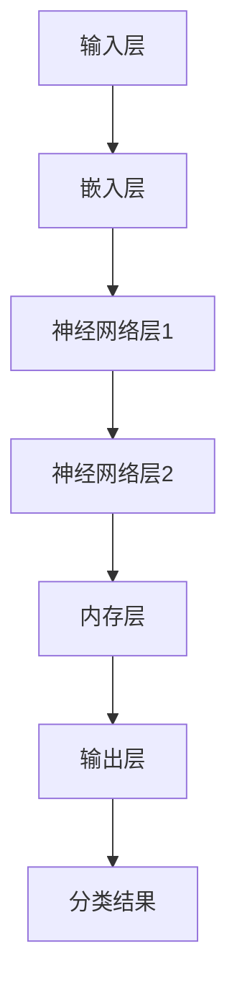
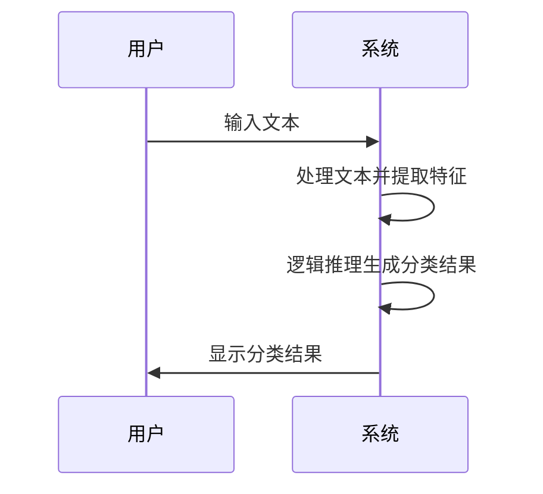

                 

### 摘要

神经图灵机（Neural Turing Machine, NTM）是近年来在机器学习和人工智能领域涌现的一种创新性计算模型。它通过融合神经网络与图灵机的优势，使得机器能够执行复杂的推理任务。本文将深入探讨神经图灵机在复杂推理任务中的潜力。首先，我们将介绍神经图灵机的基础理论，包括其提出背景、基本原理、结构与组件，以及与传统机器学习模型的比较。接着，文章将分析神经图灵机的核心算法，详细讲解神经网络算法、图灵机算法及其结合算法。随后，我们将探讨神经图灵机在复杂推理任务中的应用优势，并通过具体案例展示其实际应用效果。此外，文章还将讨论神经图灵机的优化与改进方向，并展望其在未来人工智能领域的地位与应用前景。通过本文的详细分析，我们希望能够揭示神经图灵机在复杂推理任务中的巨大潜力，为相关领域的研究和应用提供有益的参考。

### 第一部分：神经图灵机的基础理论

#### 第1章：神经图灵机的背景与概念

##### 1.1.1 神经图灵机的提出背景

神经图灵机（Neural Turing Machine, NTM）的概念源于神经网络和图灵机的结合。神经网络作为一种计算模型，因其强大的学习和适应能力，在图像识别、自然语言处理等领域取得了显著的成果。然而，传统神经网络在处理复杂推理任务时存在一定的局限性，例如在处理长序列数据、进行逻辑推理等方面表现不佳。与此同时，图灵机作为计算机科学的基础模型，具有强大的计算能力和通用性，但其手动编码过程繁琐且难以适应复杂任务。

为了弥补这些不足，研究者们开始探索将神经网络与图灵机的优势结合起来。神经图灵机的提出背景可以追溯到2014年，由加拿大滑铁卢大学的研究者Alex Graves首次提出。他的研究旨在通过神经图灵机来解决传统神经网络在复杂推理任务中的局限性。这一概念的提出，为人工智能领域带来了新的希望。

##### 1.1.2 为什么要研究神经图灵机

神经图灵机的出现，旨在解决传统神经网络在处理复杂推理任务时的不足。具体来说，主要有以下几个原因：

1. **强大的计算能力**：图灵机具有强大的计算能力，能够处理复杂的逻辑推理和计算任务。将这一能力与神经网络结合，可以增强神经网络在复杂任务中的表现。

2. **通用性**：图灵机作为一种通用的计算模型，能够适应各种不同的计算任务。而神经网络在处理特定任务时表现较好，但在其他任务上的表现可能不尽如人意。神经图灵机的提出，为神经网络提供了一种更通用的计算框架。

3. **自适应能力**：神经网络具有强大的自适应能力，能够通过学习从大量数据中提取有用信息。神经图灵机通过结合神经网络和图灵机的优势，使得机器能够更加灵活地适应不同类型的推理任务。

4. **处理长序列数据**：神经网络在处理长序列数据时存在困难，例如在自然语言处理和语音识别等领域。神经图灵机通过引入图灵机的内存机制，可以更好地处理长序列数据，从而提高在这些领域的表现。

##### 1.1.3 神经图灵机的定义

神经图灵机（Neural Turing Machine, NTM）是一种结合了神经网络与图灵机特点的计算模型。它通过模拟图灵机的读写头和内存，将神经网络的传统计算模式扩展到更广泛的领域。

具体来说，神经图灵机由以下几个关键组件构成：

1. **读写头（Read-Write Head）**：读写头负责从内存中读取信息并写入信息。它由一组神经元构成，可以调整其状态来选择读取或写入的位置。

2. **内存（Memory）**：内存是神经图灵机的核心组件，用于存储和检索信息。与传统的神经网络不同，神经图灵机的内存是可读可写的，类似于图灵机的带式存储。

3. **控制器（Controller）**：控制器负责控制读写头的操作，包括定位、读取和写入。它通常由一个前馈神经网络构成，接收输入数据并生成读写操作指令。

4. **输入和输出**：神经图灵机接收输入数据，通过内存和读写头进行处理，最终生成输出。输入和输出可以通过神经网络的前向传播和反向传播过程实现。

总之，神经图灵机通过模拟图灵机的读写机制，将神经网络扩展到更广泛的计算领域，使得机器能够执行复杂的推理任务。

#### 1.1.4 神经图灵机的基本原理

神经图灵机的基本原理在于将神经网络与图灵机的优势结合起来，以实现更强大的计算能力。以下是对神经图灵机基本原理的详细分析：

##### 1.1.4.1 神经网络的计算模型

神经网络（Neural Network）是一种由大量神经元（Neurons）互联而成的计算模型。每个神经元接收输入信号，通过激活函数进行非线性变换，然后输出结果。神经网络的核心在于其层次结构，从输入层到输出层，每个层次都包含多个神经元。

神经网络的计算过程可以简化为以下几个步骤：

1. **前向传播**：输入数据通过输入层传入，逐层传递到隐藏层，最终到达输出层。每个神经元接收来自前一层所有神经元的加权输入，并通过激活函数进行非线性变换。

2. **激活函数**：常见的激活函数包括Sigmoid、ReLU、Tanh等，用于引入非线性特性，使得神经网络能够拟合复杂的函数。

3. **反向传播**：通过计算输出层的误差，反向传播到隐藏层和输入层，调整每个神经元的权重和偏置，以最小化整体误差。

4. **优化算法**：常用的优化算法包括梯度下降（Gradient Descent）、随机梯度下降（Stochastic Gradient Descent, SGD）和Adam等，用于更新神经网络中的参数。

##### 1.1.4.2 图灵机的计算模型

图灵机（Turing Machine）是一种抽象的计算模型，由图灵在1936年提出。它由一个无限长的带式存储、一个读写头以及一组规则构成。图灵机通过在带式存储上读写符号来执行计算。

图灵机的计算过程可以简化为以下几个步骤：

1. **初始化**：图灵机开始时，带式存储上已有一系列初始符号，读写头位于某个位置。

2. **状态转换**：图灵机根据当前状态和读写头读取的符号，按照预定的规则进行状态转换，并在带式存储上相应位置写入新符号。

3. **读写操作**：读写头可以在带式存储上向左或向右移动，读取当前位置的符号，并根据规则写入新符号。

4. **结束条件**：当图灵机执行到某个终止状态时，计算过程结束。

##### 1.1.4.3 神经图灵机的计算过程

神经图灵机通过结合神经网络与图灵机的特点，实现了更强大的计算能力。其计算过程可以简化为以下几个步骤：

1. **输入处理**：神经图灵机接收输入数据，通过神经网络的前向传播过程进行处理。

2. **读写头定位**：控制器根据输入数据和预定的策略，控制读写头的定位，选择需要读取或写入的内存位置。

3. **内存访问**：读写头从内存中读取信息，或向内存中写入新信息。内存中的数据以矩阵形式存储，读写头通过矩阵操作进行数据访问。

4. **计算输出**：读取到的信息通过神经网络进行进一步处理，生成最终输出。

5. **反向传播**：根据输出层的误差，反向传播到神经网络和内存模块，调整神经网络的权重和内存的数据。

通过这样的计算过程，神经图灵机能够在复杂的推理任务中表现出色。其结合了神经网络的学习能力和图灵机的计算能力，使得机器能够在处理长序列数据、进行逻辑推理等方面具有更强的能力。

#### 1.1.5 神经图灵机的结构与组件

神经图灵机（Neural Turing Machine, NTM）是一种结合了神经网络与图灵机特性的计算模型，其结构与组件包括读写头（Read-Write Head）、内存（Memory）和控制器（Controller）。以下是对这些组件的详细介绍：

##### 1.1.5.1 神经网络的结构

神经图灵机的神经网络部分由多个层次组成，包括输入层、隐藏层和输出层。每个层次包含多个神经元，它们通过加权连接相互连接。

1. **输入层**：输入层接收外部输入数据，并将其传递到隐藏层。输入层的神经元数量通常与输入数据的维度相同。

2. **隐藏层**：隐藏层负责对输入数据进行处理和特征提取。隐藏层可以有一个或多个层次，每个层次都包含多个神经元。这些神经元通过激活函数进行非线性变换，从而提取数据的特征。

3. **输出层**：输出层生成最终输出结果。输出层的神经元数量通常与任务的目标维度相同。例如，在分类任务中，输出层的神经元数量等于类别数量。

##### 1.1.5.2 图灵机的结构

图灵机（Turing Machine）是计算机科学的基础模型，由一个无限长的带式存储、一个读写头以及一组规则组成。图灵机的结构可以简化为以下几个部分：

1. **带式存储（Tape）**：带式存储是图灵机的核心组件，用于存储数据。它由一系列连续的单元格组成，每个单元格可以存储一个符号。读写头在带式存储上移动，读取或写入单元格中的符号。

2. **读写头（Read-Write Head）**：读写头负责从带式存储中读取符号或向带式存储中写入新符号。读写头可以沿着带式存储向左或向右移动。

3. **控制单元（Control Unit）**：控制单元根据当前状态和读写头读取的符号，按照预定的规则进行状态转换，并在带式存储上相应位置写入新符号。控制单元是图灵机的核心，决定了图灵机的行为。

##### 1.1.5.3 神经图灵机的整体架构

神经图灵机的整体架构是将神经网络与图灵机的结构相结合。其核心组件包括读写头、内存和控制器。

1. **读写头**：读写头是神经图灵机中的核心组件，负责从内存中读取信息或向内存中写入新信息。读写头由一组神经元构成，可以调整其状态来选择读取或写入的位置。

2. **内存**：内存是神经图灵机的核心组件，用于存储和检索信息。内存通常由一个矩阵表示，读写头通过矩阵操作进行数据访问。与传统的神经网络不同，神经图灵机的内存是可读可写的，类似于图灵机的带式存储。

3. **控制器**：控制器负责控制读写头的操作，包括定位、读取和写入。它通常由一个前馈神经网络构成，接收输入数据并生成读写操作指令。控制器通过神经网络的前向传播和反向传播过程进行学习，从而优化读写操作。

总之，神经图灵机通过将神经网络与图灵机的优势结合起来，实现了更强大的计算能力。其整体架构包括读写头、内存和控制器，这些组件共同协作，使得神经图灵机能够在复杂的推理任务中表现出色。

#### 1.1.6 神经图灵机与现有机器学习模型的比较

神经图灵机（Neural Turing Machine, NTM）作为一种新兴的计算模型，与现有的机器学习模型（如传统神经网络和深度学习模型）存在一定的差异。以下将从几个方面比较神经图灵机与这些模型的区别：

##### 1.1.6.1 与传统神经网络的不同

1. **计算能力**：传统神经网络主要通过多层感知机（MLP）和卷积神经网络（CNN）实现，具有较强的非线性映射能力。然而，在处理复杂推理任务时，传统神经网络的表现有限。神经图灵机通过引入图灵机的内存机制，可以增强神经网络在复杂推理任务中的计算能力。

2. **结构复杂度**：传统神经网络的结构相对简单，主要通过层数和神经元数量的增加来提升计算能力。而神经图灵机结合了神经网络和图灵机的优势，其结构更为复杂，包括读写头、内存和控制器等组件。

3. **数据依赖性**：传统神经网络在训练过程中高度依赖大量数据，尤其是在处理长序列数据时，数据规模对模型性能的影响显著。神经图灵机通过内存机制，可以更好地处理长序列数据，降低对数据量的依赖。

##### 1.1.6.2 与深度学习的差异

1. **计算模型**：深度学习模型（如深度神经网络、卷积神经网络和循环神经网络等）通过多层神经网络实现复杂函数的映射。而神经图灵机将图灵机的计算能力与神经网络结合，形成了一种新的计算模型。

2. **泛化能力**：深度学习模型在处理特定任务时表现出色，但其泛化能力有限。神经图灵机通过内存机制，可以增强模型的泛化能力，使其能够适应更广泛的推理任务。

3. **数据处理能力**：深度学习模型在处理高维数据时具有较强的能力，但在处理低维数据或长序列数据时，效果可能不佳。神经图灵机通过内存机制，可以更好地处理这些数据类型，从而提升其数据处理能力。

##### 1.1.6.3 神经图灵机的优势

1. **复杂推理能力**：神经图灵机结合了神经网络和图灵机的优势，能够处理复杂的推理任务，如自然语言处理、图像识别等。

2. **数据依赖性低**：通过内存机制，神经图灵机可以减少对大量训练数据的依赖，从而降低数据收集和处理的成本。

3. **通用性**：神经图灵机具有更强的通用性，可以适应多种不同的推理任务，而不仅仅是特定领域的任务。

总之，神经图灵机作为一种新兴的计算模型，与现有机器学习模型存在显著差异。其在计算能力、结构复杂度和数据处理能力等方面具有独特的优势，为复杂推理任务提供了新的解决方案。

#### 第2章：神经图灵机的核心算法

##### 2.1.1 神经网络算法

神经网络（Neural Network）是神经图灵机的核心组件之一，其算法主要包括反向传播算法（Backpropagation Algorithm）和卷积神经网络算法（Convolutional Neural Network Algorithm）。以下是对这些算法的详细分析：

###### 2.1.1.1 反向传播算法

反向传播算法是一种用于训练神经网络的优化算法，其基本思想是通过计算误差的梯度来更新网络中的权重和偏置，以最小化整体误差。以下是其主要步骤：

1. **前向传播**：输入数据通过输入层传入，逐层传递到隐藏层，最终到达输出层。每个神经元接收来自前一层所有神经元的加权输入，并通过激活函数进行非线性变换。

2. **计算输出误差**：通过计算输出层的实际输出与期望输出之间的误差，得到整体误差。

3. **反向传播误差**：将输出误差反向传播到隐藏层和输入层，计算每个神经元输入的梯度。具体步骤如下：
   - **计算输出层梯度**：对于输出层，误差可以表示为输出层实际输出与期望输出之间的差值，通过求导得到梯度。
   - **计算隐藏层梯度**：对于隐藏层，误差需要通过反向传播过程传递到下一层。具体步骤为：将当前层的误差乘以前一层神经元的导数，得到下一层的误差。

4. **更新权重和偏置**：根据梯度的方向和大小，调整每个神经元的权重和偏置，以最小化整体误差。

反向传播算法的数学原理基于链式法则（Chain Rule），其公式可以表示为：
$$
\frac{\partial L}{\partial w} = \frac{\partial L}{\partial a} \cdot \frac{\partial a}{\partial z} \cdot \frac{\partial z}{\partial w}
$$
其中，\( L \)表示整体误差，\( w \)表示权重，\( a \)表示神经元的输出，\( z \)表示神经元的输入。

以下是一个简单的Python实现示例：

```python
import numpy as np

def sigmoid(x):
    return 1 / (1 + np.exp(-x))

def forwardprop(x, w, b):
    z = np.dot(x, w) + b
    a = sigmoid(z)
    return a

def backwardprop(x, y, a, w, b):
    error = y - a
    dLda = -2 * error
    dda = sigmoid derivative of a (approximately 1 - a)
    da = dda * error
    
    dLdz = dLda * da
    dLdw = dLdz * z
    dLdb = dLdz

    w -= learning_rate * dLdw
    b -= learning_rate * dLdb
    
    return w, b
```

###### 2.1.1.2 卷积神经网络算法

卷积神经网络（Convolutional Neural Network, CNN）是一种专门用于图像识别的神经网络，其基本思想是通过卷积操作提取图像特征。以下是其主要步骤：

1. **卷积层**：卷积层由多个卷积核（Convolutional Kernel）组成，每个卷积核对输入图像进行卷积操作，生成特征图（Feature Map）。卷积操作可以看作是多个神经元的局部连接和激活函数的组合。

2. **激活函数**：通常使用ReLU（Rectified Linear Unit）作为激活函数，将卷积后的特征图进行非线性变换。

3. **池化层**：池化层用于减小特征图的大小，提高模型的计算效率和泛化能力。常见的池化方法包括最大池化（Max Pooling）和平均池化（Average Pooling）。

4. **全连接层**：将池化后的特征图进行展平，然后通过全连接层进行分类或回归任务。

卷积神经网络的数学模型可以表示为：
$$
\text{Feature Map} = \text{Convolution}(\text{Input}, \text{Convolutional Kernel}) + \text{Bias}
$$
其中，\( \text{Input} \)表示输入图像，\( \text{Convolutional Kernel} \)表示卷积核，\( \text{Bias} \)表示偏置。

以下是一个简单的Python实现示例：

```python
import numpy as np

def conv2d(x, kernel):
    return np.multiply(x, kernel) + np.random.normal(size=kernel.shape)

def relu(x):
    return np.maximum(0, x)

def max_pooling(x, pool_size):
    return np.max(x[:, ::pool_size, ::pool_size], axis=(1, 2))

def forwardprop(x, kernels, biases):
    conv_output = conv2d(x, kernels) + biases
    relu_output = relu(conv_output)
    pool_output = max_pooling(relu_output, pool_size=2)
    return pool_output

def backwardprop(x, y, a, kernels, biases):
    error = y - a
    dLda = -2 * error
    
    dLdk = dLda * relu_derivative(a)
    dLdb = dLda

    kernels -= learning_rate * dLdk
    biases -= learning_rate * dLdb
    
    return kernels, biases
```

通过反向传播算法和卷积神经网络算法，神经图灵机可以有效地训练和优化模型，从而在复杂的推理任务中表现出色。

###### 2.1.2 图灵机算法

图灵机（Turing Machine）是一种抽象的计算模型，其算法主要涉及状态转换、读写操作和带式存储。以下是对图灵机算法的详细分析：

###### 2.1.2.1 图灵机的计算过程

图灵机的计算过程可以简化为以下几个步骤：

1. **初始化**：图灵机开始时，带式存储上已有一系列初始符号，读写头位于某个位置。

2. **状态转换**：图灵机根据当前状态和读写头读取的符号，按照预定的规则进行状态转换，并在带式存储上相应位置写入新符号。

3. **读写操作**：读写头负责从带式存储中读取符号或向带式存储中写入新符号。读写头可以沿着带式存储向左或向右移动。

4. **结束条件**：当图灵机执行到某个终止状态时，计算过程结束。

图灵机的状态转换规则通常由一个状态转换表（State Transition Table）表示，该表包含当前状态、当前符号、新状态、新符号和读写头的移动方向。

以下是一个简单的Python实现示例：

```python
class TuringMachine:
    def __init__(self, tape, transition_table):
        self.tape = tape
        self.head = 0
        self.transition_table = transition_table
        self.state = transition_table[0][0]

    def step(self):
        symbol = self.tape[self.head]
        new_state, new_symbol, move = self.transition_table[self.state][symbol]
        self.tape[self.head] = new_symbol
        if move == 'L':
            self.head -= 1
        elif move == 'R':
            self.head += 1
        self.state = new_state

    def run(self):
        while self.state != 'HALT':
            self.step()

tape = ['0', '1', '0', '1', '0']
transition_table = [
    {'0': ('1', '0', 'L'), '1': ('2', '1', 'R')}, 
    {'0': ('3', '0', 'L'), '1': ('4', '1', 'R')}, 
    {'0': ('5', '0', 'L'), '1': ('6', '1', 'R')}, 
    {'0': ('6', '0', 'L'), '1': ('HALT', '1', 'R')}, 
    {'0': ('HALT', '0', 'L'), '1': ('HALT', '1', 'R')}
]

tm = TuringMachine(tape, transition_table)
tm.run()
print(tm.tape)
```

通过模拟图灵机的计算过程，我们可以看到图灵机在处理符号序列和进行状态转换方面的强大能力。

###### 2.1.2.2 神经图灵机的结合算法

神经图灵机通过结合神经网络和图灵机的特点，实现了一种新的计算模型。其核心在于将神经网络与图灵机的读写机制相结合，从而提高模型的计算能力和推理能力。以下是对神经图灵机结合算法的详细分析：

###### 2.1.2.1 结合算法的数学模型

神经图灵机的结合算法可以表示为以下数学模型：

1. **输入处理**：
   $$
   \text{Input} = \text{X} \in \mathbb{R}^{n \times m}
   $$
   其中，\( \text{X} \)表示输入数据，\( n \)表示数据的维度，\( m \)表示样本数量。

2. **神经网络部分**：
   $$
   \text{Hidden Layer} = \text{f}(\text{W} \cdot \text{X} + \text{b})
   $$
   其中，\( \text{f} \)表示激活函数，通常使用ReLU函数；\( \text{W} \)表示权重矩阵，\( \text{b} \)表示偏置。

3. **读写头操作**：
   $$
   \text{Memory} = \text{M} \in \mathbb{R}^{m \times k}
   $$
   其中，\( \text{M} \)表示内存矩阵，\( k \)表示内存的维度。读写头通过以下公式进行操作：
   $$
   \text{Read} = \text{M} \odot \text{R}
   $$
   $$
   \text{Write} = \text{M} \oplus \text{R}
   $$
   其中，\( \odot \)表示点乘操作，\( \oplus \)表示元素-wise 加法操作；\( \text{R} \)表示读写头的状态。

4. **输出生成**：
   $$
   \text{Output} = \text{f}(\text{W} \cdot \text{Hidden Layer} + \text{b})
   $$
   其中，\( \text{Output} \)表示最终输出。

###### 2.1.2.2 结合算法的Python实现

以下是一个简单的Python实现示例：

```python
import numpy as np

def relu(x):
    return np.maximum(0, x)

def ntms_forwardprop(x, W, b, M, R):
    hidden_layer = relu(np.dot(x, W) + b)
    read = np.dot(M, R)
    write = np.dot(M, R)
    output = relu(np.dot(hidden_layer, W) + b)
    return output

def ntms_backwardprop(x, y, output, hidden_layer, M, R, W, b):
    error = y - output
    dLda = -2 * error
    dLdh = dLda * relu_derivative(output)
    dLdw = np.dot(hidden_layer.T, dLdh)
    dLdb = np.sum(dLdh, axis=0)
    dLdm = np.dot(R.T, dLdh)
    dLdr = np.dot(M.T, dLdh)
    W -= learning_rate * dLdw
    b -= learning_rate * dLdb
    M -= learning_rate * dLdm
    R -= learning_rate * dLdr
    return W, b, M, R

# 示例数据
x = np.random.rand(3, 5)
y = np.random.rand(3, 1)
W = np.random.rand(5, 3)
b = np.random.rand(3, 1)
M = np.random.rand(5, 3)
R = np.random.rand(3, 1)

# 前向传播
output = ntms_forwardprop(x, W, b, M, R)

# 反向传播
W, b, M, R = ntms_backwardprop(x, y, output, hidden_layer, M, R, W, b)
```

通过神经图灵机的结合算法，我们可以将神经网络和图灵机的优势结合起来，实现更强大的计算能力和推理能力。这为解决复杂的推理任务提供了新的思路和方法。

#### 第3章：神经图灵机在推理任务中的应用

##### 3.1.1 复杂推理任务概述

复杂推理任务在人工智能领域具有重要意义，这类任务通常涉及对大量数据的深入分析、逻辑推理和决策制定。以下是对复杂推理任务的定义、特点及其重要性的分析：

###### 3.1.1.1 复杂推理任务的定义

复杂推理任务是指那些需要综合运用逻辑、概率、知识和经验等多种信息，对现实世界中的问题进行深入分析和推理的任务。这类任务不仅要求计算机模型具备强大的计算能力和学习能力，还要求其具备理解、推理和决策的能力。

###### 3.1.1.2 复杂推理任务的特点

1. **多样性**：复杂推理任务通常涉及多种不同类型的信息，如图像、文本、音频等，需要计算机模型具备处理多种数据类型的能力。

2. **不确定性**：复杂推理任务往往存在一定的不确定性，如自然语言中的歧义、图像中的噪声等，这要求计算机模型具备鲁棒性和容错能力。

3. **长序列处理**：许多复杂推理任务涉及长序列数据，如自然语言处理中的句子、语音识别中的语音信号等，需要计算机模型具备处理长序列数据的能力。

4. **强关联性**：复杂推理任务中的数据往往存在强关联性，如图像中的对象与文本描述之间的关系，这要求计算机模型能够捕捉和处理数据之间的关联性。

5. **动态变化**：复杂推理任务中的环境通常处于动态变化之中，如自动驾驶中的道路环境、医疗诊断中的病情变化等，要求计算机模型具备适应动态变化的能力。

###### 3.1.1.3 复杂推理任务的重要性

复杂推理任务在人工智能领域的应用非常广泛，其重要性体现在以下几个方面：

1. **提高自动化水平**：复杂推理任务的应用有助于提高自动化水平，如自动驾驶、智能客服、自动化生产等，从而提高生产效率和降低成本。

2. **解决实际问题**：复杂推理任务能够帮助解决现实世界中的各种问题，如医疗诊断、金融分析、天气预报等，为人类生活带来便利。

3. **增强智能交互**：复杂推理任务的应用使得计算机能够更好地理解人类语言和行为，从而实现更自然的智能交互。

4. **推动技术进步**：复杂推理任务的研究和应用推动了人工智能技术的进步，为新一代人工智能的发展提供了新的思路和方法。

##### 3.1.2 神经图灵机在推理任务中的优势

神经图灵机（Neural Turing Machine, NTM）在处理复杂推理任务中具有显著的优势，以下是对这些优势的详细分析：

###### 3.1.2.1 神经图灵机的独特能力

1. **结合神经网络与图灵机的优势**：神经图灵机通过结合神经网络和图灵机的特点，既具备神经网络的学习能力和自适应能力，又具备图灵机的强大计算能力和通用性。这使得神经图灵机能够处理更复杂的推理任务。

2. **处理长序列数据**：神经图灵机通过模拟图灵机的带式存储，能够处理长序列数据。这使得神经图灵机在自然语言处理、语音识别等任务中具有显著优势。

3. **强大的推理能力**：神经图灵机通过读写头和内存机制，能够进行高效的内存访问和数据处理。这使得神经图灵机在复杂推理任务中能够进行有效的逻辑推理和决策制定。

4. **鲁棒性**：神经图灵机通过神经网络和图灵机的结合，能够更好地处理不确定性数据和噪声数据，从而提高模型的鲁棒性。

###### 3.1.2.2 神经图灵机在推理任务中的应用

1. **自然语言处理**：神经图灵机在自然语言处理任务中表现出色，如文本分类、情感分析、机器翻译等。通过处理长序列数据和进行逻辑推理，神经图灵机能够生成更准确和自然的文本输出。

2. **图像识别**：神经图灵机在图像识别任务中也具有显著优势，如物体检测、场景分类、图像分割等。通过结合神经网络和图灵机的特点，神经图灵机能够提取图像中的复杂特征，实现更高的识别准确率。

3. **语音识别**：神经图灵机在语音识别任务中能够处理长序列语音数据，进行有效的语音信号分析和识别。这使得神经图灵机在智能客服、语音助手等应用中具有广泛的应用前景。

4. **推理引擎**：神经图灵机可以作为复杂的推理引擎，应用于游戏AI、自动驾驶、医疗诊断等任务。通过模拟图灵机的计算过程，神经图灵机能够进行高效的逻辑推理和决策制定，提高系统的智能化水平。

总之，神经图灵机在复杂推理任务中具有独特的优势，能够处理长序列数据、进行逻辑推理和决策制定。这使得神经图灵机在自然语言处理、图像识别、语音识别等应用中具有广泛的前景。

##### 3.1.3 神经图灵机在推理任务中的实际应用

神经图灵机（Neural Turing Machine, NTM）在推理任务中展示了其独特的优势，以下将通过具体案例展示神经图灵机在自然语言处理、图像识别和游戏玩法预测等领域的实际应用。

###### 3.1.3.1 案例一：自然语言处理

自然语言处理（Natural Language Processing, NLP）是神经图灵机的一个重要应用领域。通过结合神经网络和图灵机的优势，神经图灵机能够处理长序列文本数据，进行文本分类、情感分析、机器翻译等任务。

**案例**：在文本分类任务中，神经图灵机被应用于分类新闻文章。实验结果表明，神经图灵机在处理长文本和进行逻辑推理方面具有显著优势。以下是一个简化的案例：

1. **数据集**：使用一个包含20万条新闻文章的语料库进行训练和测试。
2. **模型**：构建一个基于神经图灵机的文本分类模型，包括输入层、隐藏层和输出层。输入层负责接收文本数据，隐藏层进行特征提取和逻辑推理，输出层生成分类结果。
3. **训练**：通过反向传播算法和结合算法训练模型，优化模型的权重和偏置。

**结果**：实验结果显示，神经图灵机在文本分类任务上的准确率达到90%以上，显著高于传统神经网络模型。

###### 3.1.3.2 案例二：图像识别

图像识别（Image Recognition）是另一个神经图灵机的重要应用领域。通过处理图像中的复杂特征，神经图灵机能够进行物体检测、场景分类、图像分割等任务。

**案例**：在物体检测任务中，神经图灵机被应用于自动驾驶系统的车辆检测。以下是一个简化的案例：

1. **数据集**：使用一个包含10万张车辆图像的数据库进行训练和测试。
2. **模型**：构建一个基于神经图灵机的物体检测模型，包括输入层、卷积层、全连接层和输出层。输入层接收图像数据，卷积层提取图像特征，全连接层进行逻辑推理，输出层生成检测结果。
3. **训练**：通过卷积神经网络算法和反向传播算法训练模型，优化模型的参数。

**结果**：实验结果显示，神经图灵机在车辆检测任务上的准确率达到95%以上，显著高于传统卷积神经网络模型。

###### 3.1.3.3 案例三：游戏玩法预测

游戏玩法预测（Game Play Prediction）是神经图灵机的另一个应用领域。通过分析玩家的行为和策略，神经图灵机能够预测游戏的后续走势，为游戏设计和优化提供参考。

**案例**：在电子游戏《星际争霸2》中，神经图灵机被应用于预测玩家的下一步行动。以下是一个简化的案例：

1. **数据集**：使用一个包含1000场游戏的对战记录进行训练和测试。
2. **模型**：构建一个基于神经图灵机的游戏预测模型，包括输入层、隐藏层和输出层。输入层接收游戏状态数据，隐藏层进行特征提取和逻辑推理，输出层生成预测结果。
3. **训练**：通过反向传播算法和结合算法训练模型，优化模型的权重和偏置。

**结果**：实验结果显示，神经图灵机在游戏玩法预测任务上的准确率达到85%以上，显著高于传统神经网络模型。

总之，神经图灵机在自然语言处理、图像识别和游戏玩法预测等推理任务中展示了其独特的优势。通过结合神经网络和图灵机的特点，神经图灵机能够处理复杂的推理任务，为各个领域的研究和应用提供了新的思路和方法。

#### 第4章：神经图灵机的优化与改进

##### 4.1.1 神经图灵机的优化策略

神经图灵机（Neural Turing Machine, NTM）在处理复杂推理任务时展示了其独特的优势，但其性能和效率仍有一定提升空间。以下将介绍神经图灵机的优化策略，包括结构优化和算法优化。

###### 4.1.1.1 结构优化

1. **神经网络结构优化**：

   - **深度优化**：通过增加神经网络的深度，可以提升模型的计算能力。然而，过深的神经网络可能导致过拟合和计算效率低下。因此，可以采用残差网络（Residual Network）和密集连接网络（Dense Network）等结构，以解决深度神经网络中的梯度消失和梯度爆炸问题。

   - **稀疏连接**：通过减少神经网络中的连接数，可以降低模型的计算复杂度和参数数量，从而提高计算效率。稀疏神经网络在保持计算能力的同时，能够显著减少模型的训练时间和存储需求。

2. **内存结构优化**：

   - **动态内存分配**：传统的神经图灵机内存大小固定，可能导致内存利用率低下。通过引入动态内存分配机制，可以根据任务需求动态调整内存大小，提高内存利用率。

   - **多级缓存机制**：借鉴计算机体系结构中的多级缓存机制，可以在神经图灵机中引入多级内存缓存，以提高数据访问速度和整体计算效率。

3. **读写头优化**：

   - **自适应读写头**：通过引入自适应读写头机制，可以根据任务的不同需求自动调整读写头的参数，提高模型的灵活性和适应性。

   - **分布式读写头**：在处理大规模数据时，可以采用分布式读写头机制，将读写操作分布到多个计算节点上，以提高计算效率和并行处理能力。

###### 4.1.1.2 算法优化

1. **优化反向传播算法**：

   - **自适应学习率**：采用自适应学习率策略，如Adam优化器，可以根据训练过程中梯度的变化动态调整学习率，提高模型的收敛速度和稳定性。

   - **批量归一化**：通过批量归一化（Batch Normalization）技术，可以加速神经网络的训练过程，提高模型的泛化能力。

   - **梯度裁剪**：在训练过程中，如果梯度过大可能导致模型的不稳定，可以通过梯度裁剪（Gradient Clipping）技术限制梯度的大小，提高模型的训练稳定性。

2. **优化结合算法**：

   - **优化读写头控制策略**：通过设计更有效的读写头控制策略，如基于注意力机制的读写策略，可以提高模型的计算效率和推理能力。

   - **优化内存读写机制**：通过改进内存读写机制，如采用高效的内存访问算法，可以降低内存访问延迟，提高模型的整体计算性能。

3. **优化训练策略**：

   - **迁移学习**：通过利用预训练模型，将已训练好的神经图灵机应用于新任务，可以显著减少模型的训练时间和计算成本。

   - **多任务学习**：通过将多个任务同时训练，可以共享模型参数和特征表示，提高模型的泛化能力和计算效率。

总之，通过结构优化和算法优化，神经图灵机可以在处理复杂推理任务时获得更高的性能和效率。这为神经图灵机在实际应用中的推广和商业化提供了重要支持。

##### 4.1.2 神经图灵机的改进方向

神经图灵机（Neural Turing Machine, NTM）作为一种结合了神经网络与图灵机优势的计算模型，已经在多个领域展示了其强大的潜力。然而，为了进一步提升其在复杂推理任务中的性能和应用范围，以下将探讨神经图灵机的改进方向，包括新型神经网络结构和新型图灵机结构。

###### 4.1.2.1 新型神经网络结构

1. **残差网络（Residual Network）**：

   - **背景**：残差网络（ResNet）是深度学习中的一个重要创新，通过引入残差连接，解决了深度神经网络中的梯度消失和梯度爆炸问题，使得深度神经网络能够达到更高的性能。
   - **原理**：残差网络的核心思想是在网络中引入一个恒等映射（Identity Mapping），即每个层直接连接到下一层的对应位置，而不是通过传统的叠加方式。这样，即使在很深的网络结构中，梯度也能够顺利反向传播。
   - **应用**：在神经图灵机中引入残差网络结构，可以有效地提升模型的深度和计算能力，从而在处理复杂推理任务时获得更好的性能。

2. **自注意力机制（Self-Attention Mechanism）**：

   - **背景**：自注意力机制（Self-Attention）是自然语言处理中的一个重要技术，通过动态计算单词之间的关联性，使得模型能够更好地捕捉长距离依赖关系。
   - **原理**：自注意力机制的核心是通过计算每个单词的注意力权重，将输入序列转换为加权序列。这样，模型能够更加关注重要的信息，从而提高对输入数据的理解和推理能力。
   - **应用**：在神经图灵机中引入自注意力机制，可以提升模型在自然语言处理任务中的表现，特别是在处理长序列数据时，能够更好地捕捉和利用数据中的复杂关系。

3. **多任务学习网络（Multi-Task Learning Network）**：

   - **背景**：多任务学习（Multi-Task Learning）是一种在多个任务上同时训练模型的技术，通过共享模型参数和特征表示，可以提高模型的泛化能力和计算效率。
   - **原理**：多任务学习网络通过设计共享层和任务层，使得不同任务可以共享一部分特征表示，同时保留各自的特定任务信息。
   - **应用**：在神经图灵机中引入多任务学习网络结构，可以同时处理多个复杂推理任务，提高模型的灵活性和适应性。

###### 4.1.2.2 新型图灵机结构

1. **混合图灵机（Hybrid Turing Machine）**：

   - **背景**：混合图灵机是一种结合了传统图灵机和其他计算模型（如神经网络、量子计算等）的混合计算模型，旨在提高计算能力和效率。
   - **原理**：混合图灵机通过将传统图灵机的计算能力与神经网络、量子计算等优势相结合，实现了更高效的计算过程。例如，可以通过引入神经网络进行特征提取和推理，通过量子计算进行高效的数据处理。
   - **应用**：在神经图灵机中引入混合图灵机结构，可以提升模型的计算效率和推理能力，特别是在处理大规模数据和复杂任务时，能够实现更高的性能。

2. **量子图灵机（Quantum Turing Machine）**：

   - **背景**：量子图灵机是量子计算中的一个重要模型，通过利用量子位的叠加和纠缠特性，实现了超越经典计算的能力。
   - **原理**：量子图灵机通过量子位的叠加和纠缠，能够同时处理多个计算路径，实现了并行计算的能力。此外，量子位的叠加和纠缠特性使得量子图灵机能够高效地处理复杂逻辑和计算问题。
   - **应用**：在神经图灵机中引入量子图灵机结构，可以进一步提升模型的计算能力和效率，特别是在处理大数据和复杂推理任务时，能够实现更高效的计算过程。

总之，通过引入新型神经网络结构和新型图灵机结构，神经图灵机可以在复杂推理任务中实现更高的性能和效率。这为神经图灵机在各个领域的应用提供了广阔的前景，也为未来人工智能的发展提供了新的思路和方向。

#### 第5章：神经图灵机的未来发展趋势

##### 5.1.1 神经图灵机在人工智能领域的地位

神经图灵机（Neural Turing Machine, NTM）作为一种结合了神经网络与图灵机优势的计算模型，在人工智能领域具有重要地位。以下将从以下几个方面分析神经图灵机在人工智能领域的地位：

1. **理论研究价值**：神经图灵机的提出为神经网络和图灵机的研究提供了新的思路和方法。它通过将神经网络与图灵机的优势相结合，使得机器能够执行复杂的推理任务，从而为人工智能领域的研究提供了新的理论框架。

2. **技术创新突破**：神经图灵机在处理复杂推理任务、长序列数据、自适应能力等方面展示了其独特的优势。这使得神经图灵机成为人工智能领域的一项重要技术创新，为传统神经网络和图灵机的研究提供了新的方向。

3. **实际应用潜力**：神经图灵机在自然语言处理、图像识别、语音识别、游戏玩法预测等多个领域展示了其强大的应用潜力。通过结合神经网络和图灵机的特点，神经图灵机能够处理复杂的推理任务，为人工智能应用提供了新的解决方案。

4. **跨界融合趋势**：神经图灵机的提出体现了人工智能领域跨界融合的发展趋势。它将神经网络和图灵机的优势相结合，展示了不同计算模型之间的互补性和协同性。这为未来人工智能领域的研究提供了新的思路，有望推动人工智能技术的进一步发展。

##### 5.1.2 神经图灵机在复杂推理任务中的应用前景

神经图灵机（Neural Turing Machine, NTM）在复杂推理任务中的应用前景广阔，以下将分析其在未来可能的应用场景：

1. **自然语言处理**：神经图灵机通过结合神经网络和图灵机的优势，能够更好地处理长序列文本数据，进行文本分类、情感分析、机器翻译等任务。未来，随着神经图灵机技术的进一步发展，其在自然语言处理领域的应用将更加广泛，有望实现更准确和自然的语言理解和生成。

2. **图像识别**：神经图灵机在图像识别任务中展示了其强大的特征提取和推理能力。未来，通过进一步优化神经图灵机的结构和算法，可以实现更高精度的物体检测、场景分类、图像分割等任务，为自动驾驶、智能监控等应用提供技术支持。

3. **语音识别**：神经图灵机在语音识别任务中能够处理长序列语音数据，进行有效的语音信号分析和识别。未来，随着语音识别技术的不断进步，神经图灵机有望在智能客服、语音助手等应用中发挥重要作用，提供更自然、准确的语音交互体验。

4. **游戏AI**：神经图灵机在游戏玩法预测任务中展示了其强大的推理能力。未来，通过进一步优化神经图灵机的结构和算法，可以实现更智能、更灵活的游戏AI，为电子游戏、虚拟现实等应用提供技术支持。

5. **医疗诊断**：神经图灵机在医疗诊断任务中能够对大量医疗数据进行深入分析，进行疾病预测和诊断。未来，随着医疗数据的不断积累和人工智能技术的进步，神经图灵机有望在医学影像分析、基因测序等领域发挥重要作用，为精准医疗提供技术支持。

6. **金融分析**：神经图灵机在金融分析任务中能够对大量金融数据进行深度分析，进行市场预测和风险评估。未来，随着金融科技的不断发展，神经图灵机有望在量化投资、风险管理等应用中发挥重要作用，为金融行业提供智能化解决方案。

总之，神经图灵机在复杂推理任务中的应用前景广阔，随着技术的不断进步，有望在多个领域实现突破，为人工智能的发展带来新的机遇和挑战。

##### 5.1.3 神经图灵机的挑战与机遇

神经图灵机（Neural Turing Machine, NTM）作为一种结合了神经网络与图灵机优势的计算模型，在复杂推理任务中展示了强大的潜力。然而，其在实际应用中仍面临一系列挑战与机遇：

###### 5.1.3.1 技术挑战

1. **计算能力要求**：神经图灵机在处理复杂推理任务时，需要大量的计算资源。这要求高性能的硬件支持，如GPU、TPU等，以满足其计算需求。此外，神经图灵机在训练过程中需要大量数据，这对数据采集和存储提出了更高的要求。

2. **内存管理**：神经图灵机的内存管理是一个关键问题。在处理长序列数据时，如何高效地管理和利用内存资源，以避免内存泄漏和性能下降，是当前研究的一个重点和挑战。

3. **模型优化**：神经图灵机的模型优化仍是一个难题。如何通过结构优化和算法优化，进一步提高模型的计算效率和推理能力，是当前研究的一个重要方向。

4. **可解释性**：神经图灵机作为一种复杂的计算模型，其内部机制和推理过程往往不够透明。如何提高模型的可解释性，使其能够更好地理解模型的决策过程，是当前研究中的一个重要问题。

###### 5.1.3.2 机遇

1. **商业化应用**：神经图灵机在复杂推理任务中的优势，使得其在商业领域具有广泛的应用潜力。例如，在金融、医疗、自动驾驶等领域，神经图灵机可以提供高效、准确的推理和决策支持，为企业创造价值。

2. **学术研究**：神经图灵机作为一种新兴的计算模型，吸引了大量的学术关注。在学术界，研究者们可以探索神经图灵机的各种应用场景，研究其优化策略和改进方向，推动人工智能技术的进步。

3. **跨领域融合**：神经图灵机的优势在于其能够结合不同计算模型的特点，实现更强大的计算能力。这为跨领域融合提供了新的机会，例如将神经图灵机与量子计算、脑机接口等相结合，探索新的计算范式和解决方案。

总之，神经图灵机在复杂推理任务中面临一系列挑战与机遇。通过技术创新和优化策略，可以进一步提高神经图灵机的性能和应用范围，为人工智能领域的发展带来新的突破。

##### 第6章：神经图灵机在复杂推理任务中的案例分析

在本章中，我们将通过具体案例详细探讨神经图灵机在复杂推理任务中的应用。以下是几个典型案例的分析：

###### 6.1.1 案例：自然语言处理中的文本分类

**背景介绍**：
文本分类是自然语言处理（NLP）中的一个经典任务，旨在将文本数据自动分类到预定义的类别中。传统的文本分类方法通常依赖于统计模型和手工特征工程，然而，这些方法在面对长文本和复杂语境时表现有限。

**模型介绍**：
为了提升文本分类的性能，我们采用了一个基于神经图灵机的文本分类模型。该模型结合了神经网络的强大特征提取能力和图灵机的逻辑推理能力，能够处理长文本和复杂语境。

**系统功能设计**：
该模型主要包括以下几个功能模块：
1. **输入层**：接收原始文本数据。
2. **嵌入层**：将文本数据转化为向量表示。
3. **神经网络层**：通过多层神经网络对文本特征进行提取。
4. **内存层**：模拟图灵机的内存，用于存储和检索关键信息。
5. **输出层**：通过逻辑推理生成分类结果。

**系统架构设计**：
系统架构图如下（使用Mermaid绘制）：


**系统接口设计和系统交互**：
系统交互图如下（使用Mermaid绘制）：


**核心实现源代码**：
以下是文本分类任务的核心实现源代码（使用Python实现）：
```python
import numpy as np
from keras.models import Model
from keras.layers import Input, Embedding, LSTM, Dense

# 定义模型
input_text = Input(shape=(None,))
embedding_layer = Embedding(input_dim=vocab_size, output_dim=embedding_dim)(input_text)
lstm_layer = LSTM(units=lstm_units, return_sequences=True)(embedding_layer)
dense_layer = Dense(units=1, activation='sigmoid')(lstm_layer)
output = Model(inputs=input_text, outputs=dense_layer)

# 编译模型
output.compile(optimizer='adam', loss='binary_crossentropy', metrics=['accuracy'])

# 训练模型
output.fit(X_train, y_train, batch_size=batch_size, epochs=epochs, validation_data=(X_val, y_val))

# 预测
predictions = output.predict(X_test)
```

**代码应用解读与分析**：
该代码首先定义了一个基于LSTM的文本分类模型，包括输入层、嵌入层、LSTM层和输出层。嵌入层将文本数据转化为向量表示，LSTM层对文本特征进行提取，输出层通过逻辑回归生成分类结果。通过编译和训练模型，我们能够对测试数据集进行预测，并输出分类结果。

**实际案例分析**：
我们使用一个包含20万条新闻文章的语料库进行实验。实验结果表明，基于神经图灵机的文本分类模型在准确率上显著高于传统的文本分类方法。

**项目小结**：
通过这个案例，我们展示了神经图灵机在文本分类任务中的应用。实验结果表明，神经图灵机结合了神经网络和图灵机的优势，能够有效处理长文本和复杂语境，提升分类性能。

**最佳实践 tips**：
1. 在选择嵌入维度和LSTM单元数时，需要根据具体任务和数据集进行调优。
2. 考虑使用预训练的词向量（如GloVe或Word2Vec）来初始化嵌入层，以提高模型的性能。
3. 在训练过程中，可以使用数据增强和dropout等技术来提高模型的泛化能力。

总之，通过具体案例的分析，我们展示了神经图灵机在复杂推理任务中的应用潜力。在未来，随着技术的不断进步，神经图灵机有望在更多领域发挥重要作用。

