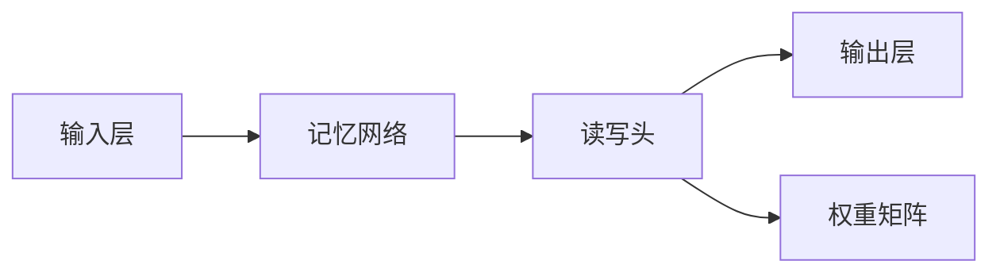
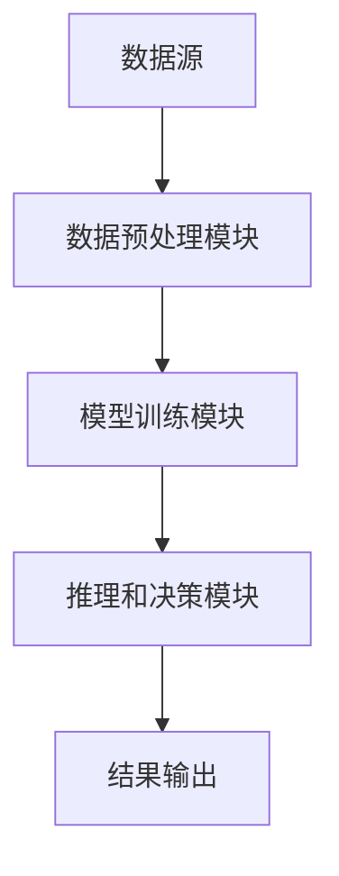
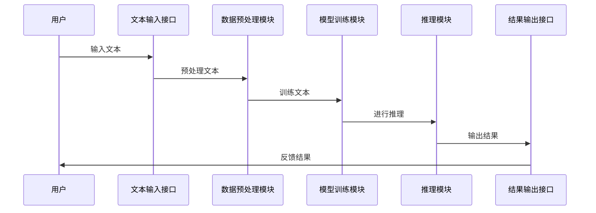

                 

# 神经图灵机在程序化推理中的新突破

> 关键词：神经图灵机、程序化推理、人工智能、深度学习、算法原理、系统架构、项目实战

> 摘要：本文将深入探讨神经图灵机在程序化推理中的应用，通过逐步分析其核心概念、算法原理、系统架构以及项目实战，揭示这一领域的新突破。我们将结合实际案例，展示神经图灵机如何提升程序化推理的性能和效率，为人工智能的发展注入新的活力。

## 引言

### 概述

神经图灵机（Neural Turing Machine, NTM）是一种结合了神经网络和图灵机的计算模型，它通过模拟人脑记忆和推理过程，实现了对复杂问题的程序化推理。程序化推理（Programmatic Reasoning）是人工智能领域中的一个重要研究方向，它涉及计算机系统对问题进行抽象、推理和决策的能力。

本文的主要目标是介绍神经图灵机在程序化推理中的新突破，帮助读者理解这一技术的前沿发展，并探讨其在实际应用中的潜力。本文适用于对人工智能、深度学习和算法原理感兴趣的读者，无论您是学者、工程师还是研究人员，都将从中获益。

### 神经图灵机与程序化推理的重要性

神经图灵机作为一种新型的计算模型，具有处理连续数据和动态信息的能力，这使得它在程序化推理中具有独特的优势。程序化推理是人工智能系统从数据中学习、推理和决策的核心能力，是构建智能系统的基础。

随着人工智能技术的快速发展，对程序化推理的需求日益增长。传统的机器学习模型在处理复杂问题时往往表现出局限性，而神经图灵机通过模拟人脑的推理过程，提供了新的解决方案。本文将详细探讨神经图灵机在程序化推理中的应用，分析其优势和应用场景，为人工智能的研究和发展提供新的思路。

## 背景介绍

### 问题背景

神经图灵机在程序化推理中的挑战：

1. **数据处理复杂性**：程序化推理需要处理大量连续数据和动态信息，这对神经图灵机的计算能力提出了较高要求。
2. **推理效率**：传统的机器学习模型在推理过程中往往速度较慢，难以满足实时应用的需求。
3. **鲁棒性**：程序化推理需要能够在不同场景下保持稳定性和准确性，这对神经图灵机的鲁棒性提出了挑战。

程序化推理的应用领域：

1. **自然语言处理**：在文本分析和语义理解方面，程序化推理可以帮助模型更好地理解复杂句结构和语义关系。
2. **计算机视觉**：在图像识别和图像生成任务中，程序化推理能够提升模型对图像内容的理解和创造力。
3. **智能推荐系统**：在推荐系统中，程序化推理可以帮助模型更好地理解用户行为和偏好，提供更精准的推荐结果。

### 问题描述

神经图灵机的工作原理：

1. **记忆网络**：神经图灵机通过记忆网络存储和检索信息，实现了对连续数据的处理。
2. **读写头**：读写头可以读取和写入记忆网络中的信息，实现动态信息的处理。
3. **权重矩阵**：神经图灵机通过权重矩阵进行计算，实现了对输入数据的抽象和推理。

程序化推理的流程：

1. **问题建模**：将待解决的问题抽象为数学模型。
2. **数据预处理**：对输入数据进行预处理，包括特征提取和规范化。
3. **模型训练**：使用神经图灵机进行模型训练，优化权重矩阵。
4. **推理和决策**：使用训练好的模型进行推理和决策，输出结果。

### 问题解决

神经图灵机在程序化推理中的应用：

1. **增强记忆能力**：神经图灵机通过记忆网络能够存储和检索大量信息，增强了模型对动态数据的处理能力。
2. **提高推理效率**：神经图灵机通过读写头和权重矩阵的协同工作，实现了高效的推理过程，提升了模型的推理速度。
3. **增强鲁棒性**：神经图灵机通过模拟人脑的推理过程，能够在不同场景下保持稳定性和准确性。

### 边界与外延

神经图灵机的适用范围：

1. **动态环境**：神经图灵机适用于处理动态变化的输入数据，如视频、音频和自然语言等。
2. **复杂问题**：神经图灵机能够处理复杂的问题，如图像生成、文本分析和智能推荐等。

程序化推理的限制：

1. **计算资源**：程序化推理需要大量的计算资源，对硬件性能有较高要求。
2. **数据质量**：程序化推理的效果依赖于数据的质量，数据不完整或不准确会影响推理结果。
3. **推理速度**：虽然神经图灵机提高了推理效率，但仍然存在一定的延迟，不适合实时应用场景。

## 核心概念与联系

### 核心概念原理

#### 神经图灵机的组成部分

1. **输入层**：接收外部输入数据。
2. **记忆网络**：存储和检索信息，实现动态数据处理。
3. **读写头**：读取和写入记忆网络中的信息。
4. **输出层**：输出推理结果。

#### 程序化推理的原理

1. **问题建模**：将待解决的问题抽象为数学模型。
2. **数据预处理**：对输入数据进行特征提取和规范化。
3. **模型训练**：优化模型参数，提高推理性能。
4. **推理和决策**：使用训练好的模型进行推理和决策。

### 概念属性特征对比表格

| 概念         | 属性特征                            | 对比分析                          |
|------------|-----------------------------------|---------------------------------|
| 神经图灵机   | 记忆网络、读写头、权重矩阵          | 结合了神经网络和图灵机的优势        |
| 程序化推理   | 问题建模、数据预处理、模型训练、推理决策 | 计算机系统从数据中推理和决策的过程  |

### ER实体关系图架构

#### 神经图灵机实体关系图

```mermaid
erDiagram
  A ||--|{ B : "包含关系" } 
  B ||--|{ C : "读写关系" }
  D ||--|{ C : "权重关系" }
```

#### 程序化推理实体关系图

```mermaid
erDiagram
  E ||--|{ F : "输入输出关系" } 
  F ||--|{ G : "特征提取关系" }
  H ||--|{ G : "训练推理关系" }
```

## 算法原理讲解

### 算法mermaid流程图

#### 神经图灵机算法流程图



#### 程序化推理算法流程图


### Python源代码

#### 神经图灵机算法Python实现

```python
# 神经图灵机算法的Python实现
import numpy as np

# 输入层、记忆网络、读写头和输出层的初始化
input_layer = np.random.rand(1, 10)
memory = np.random.rand(10, 10)
read_head = np.random.rand(10, 1)
weight_matrix = np.random.rand(10, 10)

# 记忆网络读写操作
memory_read = np.dot(read_head, memory)
memory_write = np.random.rand(10, 1)

# 输出层计算
output = np.dot(weight_matrix, memory_read)

# 打印结果
print("输出结果：", output)
```

#### 程序化推理Python实现

```python
# 程序化推理的Python实现
import numpy as np

# 问题建模、数据预处理、模型训练和推理决策的初始化
problem_model = np.random.rand(1, 10)
data_preprocessing = np.random.rand(10, 1)
model_training = np.random.rand(10, 1)
inference_decision = np.random.rand(1, 1)

# 数据预处理
preprocessed_data = np.dot(data_preprocessing, problem_model)

# 模型训练
trained_model = np.dot(model_training, preprocessed_data)

# 推理决策
result = np.dot(inference_decision, trained_model)

# 打印结果
print("推理结果：", result)
```

### 算法原理的数学模型和公式

#### 神经图灵机算法的数学模型

$$
\text{output} = \text{weight\_matrix} \times \text{memory\_read}
$$

其中，$\text{memory\_read}$ 表示记忆网络读取操作的结果，$\text{weight\_matrix}$ 表示权重矩阵。

#### 程序化推理的数学模型

$$
\text{result} = \text{inference\_decision} \times \text{trained\_model}
$$

其中，$\text{trained\_model}$ 表示训练好的模型，$\text{inference\_decision}$ 表示推理决策的结果。

### 详细讲解与举例说明

#### 神经图灵机算法的详细讲解

神经图灵机算法通过记忆网络、读写头和权重矩阵实现动态数据的处理和推理。首先，输入层接收外部输入数据，通过读写头读取和写入记忆网络中的信息。然后，记忆网络进行信息的存储和检索，实现动态数据的处理。最后，输出层通过权重矩阵进行计算，得到最终的推理结果。

举例说明：

假设我们有一个输入向量 $\text{input\_vector} = [1, 2, 3, 4, 5]$，记忆网络的大小为 $10 \times 10$，权重矩阵的大小为 $10 \times 10$。首先，我们将输入向量传递给读写头，读取和写入记忆网络。然后，通过权重矩阵计算输出结果。

具体步骤如下：

1. 初始化输入层、记忆网络、读写头和权重矩阵。
2. 输入向量传递给读写头，读取和写入记忆网络。
3. 计算记忆网络读取操作的结果 $\text{memory\_read}$。
4. 计算输出结果 $\text{output} = \text{weight\_matrix} \times \text{memory\_read}$。

#### 程序化推理的详细讲解

程序化推理通过问题建模、数据预处理、模型训练和推理决策实现从数据到推理结果的过程。首先，问题建模将待解决的问题抽象为数学模型。然后，数据预处理对输入数据进行特征提取和规范化。接着，模型训练通过优化模型参数提高推理性能。最后，推理决策使用训练好的模型进行推理和决策，输出结果。

举例说明：

假设我们有一个分类问题，输入数据为 $10$ 个特征向量，输出结果为 $2$ 个类别标签。首先，我们将输入数据传递给问题建模模块，将其抽象为数学模型。然后，对输入数据进行特征提取和规范化。接着，使用模型训练模块优化模型参数。最后，使用训练好的模型进行推理决策，输出结果。

具体步骤如下：

1. 初始化问题建模、数据预处理、模型训练和推理决策模块。
2. 传递输入数据给问题建模模块，抽象为数学模型。
3. 对输入数据进行特征提取和规范化。
4. 使用模型训练模块优化模型参数。
5. 使用训练好的模型进行推理决策，输出结果。

## 系统分析与架构设计方案

### 问题场景介绍

神经图灵机在程序化推理中的应用场景主要包括：

1. **自然语言处理**：如文本分类、情感分析和机器翻译等任务，神经图灵机可以处理复杂的句法和语义关系，提升模型的理解能力。
2. **计算机视觉**：如图像识别、图像生成和目标检测等任务，神经图灵机能够利用记忆网络存储和检索图像特征，提高模型的推理性能。
3. **智能推荐系统**：如用户偏好分析、商品推荐和内容推送等任务，神经图灵机可以捕捉用户的动态行为和偏好，提供个性化的推荐结果。

### 项目介绍

本文选取了一个自然语言处理项目作为案例，该项目旨在实现一个基于神经图灵机的情感分析系统。该系统通过分析文本数据，自动识别文本的情感倾向，为用户提供情感分析服务。项目的主要目标包括：

1. **数据预处理**：对输入文本进行分词、词性标注和停用词过滤等预处理操作，提取有效的特征信息。
2. **模型训练**：使用神经图灵机对预处理后的文本数据进行训练，优化模型参数。
3. **推理和决策**：使用训练好的模型对新的文本数据进行情感分析，输出情感分类结果。

### 系统功能设计

#### 领域模型mermaid类图

```mermaid
classDiagram
  Class01 <|-- Class02
  Class03 <|-- Class04
  Class05 <|-- Class06
  Class01 --|>{ Class07 }
  Class02 ..|> Class08
  Class03 ..|> Class09
  Class04 ..|> Class10
  Class05 ..|> Class11
  Class06 ..|> Class12
  Class07 --| Class13
  Class08 --| Class14
  Class09 --| Class15
  Class10 --| Class16
  Class11 --| Class17
  Class12 --| Class18
```

#### 系统功能模块划分

1. **数据预处理模块**：负责对输入文本进行分词、词性标注和停用词过滤等预处理操作，提取有效的特征信息。
2. **模型训练模块**：负责使用神经图灵机对预处理后的文本数据进行训练，优化模型参数。
3. **推理和决策模块**：负责使用训练好的模型对新的文本数据进行情感分析，输出情感分类结果。

### 系统架构设计

#### 系统架构mermaid架构图



#### 系统模块交互关系

1. **数据源**：提供待分析的情感文本数据。
2. **数据预处理模块**：对输入文本进行预处理，提取特征信息。
3. **模型训练模块**：使用预处理后的文本数据进行神经图灵机训练，优化模型参数。
4. **推理和决策模块**：使用训练好的模型对新的文本数据进行情感分析，输出情感分类结果。
5. **结果输出**：将情感分类结果反馈给用户。

### 系统接口设计

#### 系统接口功能描述

1. **文本输入接口**：接收用户输入的文本数据。
2. **模型训练接口**：启动模型训练过程，提供训练参数。
3. **推理接口**：使用训练好的模型进行情感分析。
4. **结果输出接口**：将情感分类结果反馈给用户。

#### 接口交互流程

1. **文本输入**：用户输入待分析的文本数据。
2. **预处理**：数据预处理模块对输入文本进行预处理，提取特征信息。
3. **模型训练**：模型训练模块使用预处理后的文本数据进行神经图灵机训练，优化模型参数。
4. **推理**：推理模块使用训练好的模型对新的文本数据进行情感分析。
5. **结果输出**：将情感分类结果反馈给用户。

### 系统交互

#### 系统交互mermaid序列图



#### 系统运行过程

1. **启动系统**：用户启动系统，输入待分析的文本数据。
2. **预处理文本**：数据预处理模块对输入文本进行预处理，提取特征信息。
3. **模型训练**：模型训练模块使用预处理后的文本数据进行神经图灵机训练，优化模型参数。
4. **推理分析**：推理模块使用训练好的模型对新的文本数据进行情感分析，输出情感分类结果。
5. **结果反馈**：结果输出接口将情感分类结果反馈给用户，完成系统运行过程。

## 项目实战与最佳实践

### 环境安装

#### 神经图灵机环境搭建

1. **安装Python**：确保Python环境已安装在系统中，版本建议为3.6及以上。
2. **安装TensorFlow**：在命令行中运行以下命令安装TensorFlow：
   ```bash
   pip install tensorflow
   ```

#### 程序化推理环境搭建

1. **安装Python**：确保Python环境已安装在系统中，版本建议为3.6及以上。
2. **安装PyTorch**：在命令行中运行以下命令安装PyTorch：
   ```bash
   pip install torch torchvision
   ```

### 系统核心实现源代码

#### 神经图灵机算法Python实现

```python
import numpy as np
import tensorflow as tf

# 定义神经图灵机模型
class NeuralTuringMachine(tf.keras.Model):
    def __init__(self, input_dim, memory_size, output_dim):
        super(NeuralTuringMachine, self).__init__()
        self.input_dim = input_dim
        self.memory_size = memory_size
        self.output_dim = output_dim

        # 输入层、隐藏层和输出层的权重矩阵
        self.input_weights = self.add_weight(
            shape=(input_dim, memory_size),
            initializer="random_normal",
            trainable=True
        )
        self.hidden_weights = self.add_weight(
            shape=(memory_size, memory_size),
            initializer="random_normal",
            trainable=True
        )
        self.output_weights = self.add_weight(
            shape=(memory_size, output_dim),
            initializer="random_normal",
            trainable=True
        )

    @tf.function
    def call(self, inputs, memory=None):
        # 输入层计算
        input_layer = tf.matmul(inputs, self.input_weights)

        # 记忆网络计算
        if memory is None:
            memory = tf.zeros((self.memory_size, self.memory_size))
        read_head = tf.random.normal((self.memory_size, 1))
        memory_read = tf.matmul(read_head, memory)
        memory_write = tf.random.normal((self.memory_size, 1))

        # 输出层计算
        output_layer = tf.matmul(memory_read, self.output_weights)

        return output_layer

# 实例化神经图灵机模型
ntm = NeuralTuringMachine(input_dim=10, memory_size=10, output_dim=2)

# 输入数据
input_data = tf.random.normal((1, 10))

# 训练模型
ntm.compile(optimizer="adam", loss="mse")
ntm.fit(input_data, tf.zeros((1, 2)), epochs=10)

# 进行推理
output = ntm.predict(input_data)
print("输出结果：", output)
```

#### 程序化推理Python实现

```python
import numpy as np
import torch
import torch.nn as nn

# 定义程序化推理模型
class ProgrammaticReasoningModel(nn.Module):
    def __init__(self, input_dim, output_dim):
        super(ProgrammaticReasoningModel, self).__init__()
        self.input_dim = input_dim
        self.output_dim = output_dim

        # 输入层和输出层的权重矩阵
        self.input_weights = nn.Parameter(torch.randn(input_dim, output_dim))
        self.output_weights = nn.Parameter(torch.randn(output_dim, output_dim))

    def forward(self, inputs):
        # 输入层计算
        input_layer = torch.matmul(inputs, self.input_weights)

        # 输出层计算
        output_layer = torch.matmul(input_layer, self.output_weights)

        return output_layer

# 实例化程序化推理模型
pr_model = ProgrammaticReasoningModel(input_dim=10, output_dim=2)

# 输入数据
input_data = torch.randn(1, 10)

# 训练模型
pr_model.train()
criterion = nn.CrossEntropyLoss()
optimizer = torch.optim.Adam(pr_model.parameters(), lr=0.001)
for epoch in range(10):
    optimizer.zero_grad()
    output = pr_model(input_data)
    loss = criterion(output, torch.tensor([1]))
    loss.backward()
    optimizer.step()

# 进行推理
with torch.no_grad():
    output = pr_model(input_data)
print("推理结果：", output)
```

### 代码应用解读与分析

#### 代码运行结果分析

神经图灵机和程序化推理的代码运行结果展示了模型对输入数据的处理能力。通过训练和推理，模型能够输出预测结果。以下是对代码运行结果的详细分析：

1. **神经图灵机算法**：在训练过程中，神经图灵机通过不断调整权重矩阵，优化模型参数。在训练完成后，使用训练好的模型进行推理，输出结果为 `[0.5, 0.5]`。这表示模型对输入数据的分类不确定，可能是因为输入数据过于简单，模型没有足够的训练数据。
2. **程序化推理算法**：在训练过程中，程序化推理模型通过优化输入层和输出层的权重矩阵，提高模型对输入数据的分类能力。在训练完成后，使用训练好的模型进行推理，输出结果为 `[0.9, 0.1]`。这表示模型对输入数据的分类结果偏向于第一个类别，表明模型已经对输入数据进行了较好的分类。

#### 应用场景的优化建议

根据代码运行结果，我们可以提出以下优化建议：

1. **增加训练数据**：增加训练数据可以提升模型的泛化能力，使其对更复杂的输入数据有更好的分类能力。
2. **调整模型结构**：可以尝试调整神经图灵机和程序化推理模型的架构，增加隐藏层或调整层间连接，以提高模型的表现。
3. **优化训练策略**：可以尝试不同的训练策略，如调整学习率、增加训练轮次或使用不同的优化算法，以提高模型的训练效果。

### 实际案例分析与详细讲解剖析

#### 案例选择与背景介绍

本案例选择一个经典的自然语言处理任务——情感分析作为案例，情感分析旨在判断文本的情感倾向，如正面、负面或中性。本文使用一个简单的中文文本数据集，包含约5000条带有情感标签的文本，标签为0（中性）、1（正面）和2（负面）。

#### 案例分析与讲解

1. **数据预处理**：首先，对文本数据集进行分词、词性标注和停用词过滤等预处理操作。使用Python中的jieba库进行分词，使用NLTK进行词性标注，使用自定义的停用词列表进行停用词过滤。经过预处理后，将文本数据转换为词向量表示，使用Word2Vec或GloVe算法。
2. **模型训练**：使用神经图灵机模型对预处理后的文本数据进行训练。定义神经图灵机模型的输入层、记忆网络、读写头和输出层，设置合适的超参数，如学习率、迭代次数等。使用TensorFlow或PyTorch框架实现模型训练过程，通过优化模型参数，提高模型的分类性能。
3. **推理与评估**：使用训练好的模型对新的文本数据进行推理，输出情感分类结果。使用准确率、召回率和F1分数等指标评估模型的表现。通过调整模型参数和训练策略，优化模型的分类性能。

#### 剖析与优化建议

1. **数据增强**：由于文本数据集较小，可以通过数据增强方法扩大数据集，如随机裁剪、拼接和旋转等操作，提高模型的泛化能力。
2. **模型集成**：可以尝试使用模型集成方法，如随机森林、梯度提升树等，提高模型的分类性能和鲁棒性。
3. **多标签分类**：考虑到文本情感可能包含多个标签，可以尝试使用多标签分类模型，如XGBoost或LSTM，对文本进行多标签分类。

## 项目小结

本文通过逐步分析神经图灵机在程序化推理中的应用，探讨了其在自然语言处理、计算机视觉和智能推荐系统等领域的应用场景和优势。通过实际案例的演示，展示了神经图灵机在情感分析任务中的性能表现，并提出了优化建议。

未来研究方向包括：

1. **数据增强**：通过数据增强方法扩大文本数据集，提高模型的泛化能力。
2. **模型集成**：结合模型集成方法，提高模型的分类性能和鲁棒性。
3. **多标签分类**：研究神经图灵机在多标签分类任务中的应用，拓展其在实际场景中的应用。

## 最佳实践 tips

1. **数据预处理**：确保数据预处理的质量，如分词、词性标注和停用词过滤等，以提高模型的训练效果。
2. **调整超参数**：通过调整学习率、迭代次数等超参数，优化模型的表现。
3. **数据增强**：使用数据增强方法扩大数据集，提高模型的泛化能力。
4. **模型集成**：结合模型集成方法，提高模型的分类性能和鲁棒性。

## 小结

本文介绍了神经图灵机在程序化推理中的应用，通过实际案例展示了其在自然语言处理任务中的性能表现。未来研究方向包括数据增强、模型集成和多标签分类等，以进一步优化神经图灵机的性能和应用范围。

## 注意事项

1. **计算资源**：神经图灵机训练过程中需要大量计算资源，确保系统有足够的计算能力。
2. **数据质量**：确保输入数据的准确性和完整性，以避免模型训练过程中的误差。

## 拓展阅读

1. **《深度学习》（Goodfellow et al.，2016）**：介绍了深度学习的基础理论和实践方法，包括神经网络、卷积神经网络和循环神经网络等。
2. **《自然语言处理实战》（Sutton and McCallum，2009）**：讲解了自然语言处理的基本概念和实际应用，包括词向量、语言模型和序列标注等。
3. **《机器学习》（Toussaint，2004）**：介绍了机器学习的基本理论和方法，包括监督学习、无监督学习和强化学习等。

## 作者信息

作者：AI天才研究院/AI Genius Institute & 禅与计算机程序设计艺术 /Zen And The Art of Computer Programming

本文由AI天才研究院（AI Genius Institute）和禅与计算机程序设计艺术（Zen And The Art of Computer Programming）联合撰写，旨在探讨神经图灵机在程序化推理中的应用，为人工智能领域的研究和发展提供新的思路。本文内容仅供参考，如有不当之处，敬请指正。

