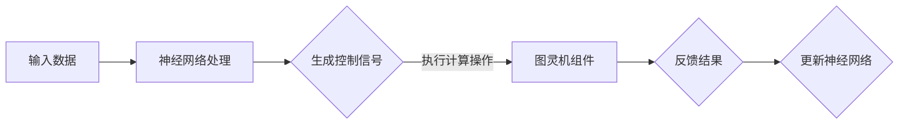

                 

# 神经图灵机在程序化逻辑推理中的突破性应用

## 摘要

神经图灵机（Neural Turing Machine，简称NTM）作为一种新型计算模型，结合了神经网络和图灵机的优势，在程序化逻辑推理中展现出了突破性的应用潜力。本文将首先概述神经图灵机的理论基础与历史背景，深入解析其基本原理，并探讨其在逻辑推理中的应用场景与算法原理。最后，通过具体案例研究，展示神经图灵机在程序化逻辑推理中的实际应用与效果，以期为进一步研究提供参考。

## 关键词

神经图灵机、程序化逻辑推理、神经网络、图灵机、算法原理、应用案例。

## 第一部分：神经图灵机概述

### 第1章：神经图灵机：理论基础与历史背景

#### 1.1 神经图灵机概念介绍

**1.1.1 问题背景**

在计算机科学领域，逻辑推理一直是人工智能研究的重要方向。传统逻辑推理方法主要依赖于基于规则的推理系统和形式逻辑，但这些方法在处理复杂问题时往往存在局限性。近年来，随着深度学习的发展，神经网络在模式识别和数据处理方面取得了显著成果，但其在逻辑推理方面的应用仍面临挑战。

**1.1.2 神经图灵机的提出**

为解决上述问题，Hampling等人在2014年提出了神经图灵机（Neural Turing Machine，NTM）。神经图灵机是一种结合了神经网络和图灵机的计算模型，旨在实现更为强大和灵活的逻辑推理能力。

**1.1.3 神经图灵机的特点**

神经图灵机具有以下特点：

1. **记忆能力**：神经图灵机通过内存网络结构实现记忆功能，能够存储和处理大量信息，有助于提高逻辑推理能力。
2. **计算能力**：神经图灵机结合了神经网络和图灵机的计算优势，能够在复杂环境中进行高效计算。
3. **自适应能力**：神经图灵机可以根据不同的任务需求进行自适应调整，具有较强的泛化能力。

#### 1.2 神经图灵机与传统图灵机的比较

**1.2.1 传统图灵机的局限**

传统图灵机作为一种经典的计算模型，其计算能力受到状态转换和读写操作的限制。在处理复杂逻辑问题时，传统图灵机往往需要大量的状态转换和操作，导致计算效率较低。

**1.2.2 神经图灵机的优势**

与传统的图灵机相比，神经图灵机具有以下优势：

1. **计算效率**：神经图灵机通过神经网络和内存网络结构，能够在复杂环境中实现高效计算。
2. **记忆能力**：神经图灵机具有强大的记忆能力，能够存储和处理大量信息，有助于提高逻辑推理能力。
3. **自适应能力**：神经图灵机可以根据不同的任务需求进行自适应调整，具有较强的泛化能力。

**1.2.3 关键区别与联系**

神经图灵机与传统图灵机的关键区别在于：

1. **计算模型**：传统图灵机基于状态转换和读写操作，而神经图灵机结合了神经网络和内存网络结构。
2. **记忆能力**：传统图灵机缺乏记忆功能，而神经图灵机通过内存网络结构实现记忆能力。
3. **计算效率**：神经图灵机在处理复杂逻辑问题时具有更高的计算效率。

#### 1.3 神经图灵机的历史发展

**1.3.1 初期探索**

神经图灵机的概念最早由Hampling等人于2014年提出。此后，研究人员对其进行了深入研究，提出了多种改进方案，如可变内存神经网络（Variable Memory Neural Network）和门控神经图灵机（Gated Neural Turing Machine）等。

**1.3.2 关键突破**

神经图灵机在逻辑推理中的应用取得了关键突破。例如，在自然语言处理和决策支持系统中，神经图灵机展现了出色的逻辑推理能力和计算效率。

**1.3.3 现状与应用**

当前，神经图灵机在多个领域得到了广泛应用，如计算机视觉、自然语言处理、推荐系统等。随着研究的不断深入，神经图灵机在逻辑推理中的应用前景日益广阔。

#### 1.4 神经图灵机在计算机科学中的意义

**1.4.1 理论层面的贡献**

神经图灵机为计算机科学领域提供了一种新的计算模型，丰富了逻辑推理的理论基础。其结合神经网络和图灵机的优势，为解决复杂逻辑问题提供了新的思路。

**1.4.2 应用层面的潜力**

在应用层面，神经图灵机具有广泛的应用潜力。例如，在自然语言处理中，神经图灵机可以用于情感分析、机器翻译等任务；在计算机视觉中，神经图灵机可以用于目标检测、图像识别等任务。

**1.4.3 对未来计算的影响**

神经图灵机的出现为未来计算模型的发展提供了新的方向。其结合神经网络和图灵机的优势，有望在计算效率、记忆能力等方面取得突破，为计算机科学领域的发展带来新的机遇。

#### 1.5 本章小结

本章对神经图灵机的理论基础与历史背景进行了概述，详细介绍了其概念、特点、与传统图灵机的比较、历史发展、在计算机科学中的意义等内容。通过本章的介绍，读者可以初步了解神经图灵机的基本概念和特点，为后续章节的深入探讨打下基础。

----------------------------------------------------------------

## 第二部分：神经图灵机的基本原理

### 第2章：神经图灵机的组成与工作原理

#### 2.1 神经图灵机的组成部分

神经图灵机（Neural Turing Machine, NTM）由两部分组成：神经网络和图灵机组件。神经网络负责处理输入数据，并生成控制信号来指导图灵机组件的操作。

**2.1.1 神经网络**

神经网络是神经图灵机的核心部分，负责对输入数据进行处理。神经网络通常采用多层感知机（MLP）结构，包括输入层、隐藏层和输出层。输入层接收外部输入数据，隐藏层对输入数据进行特征提取和变换，输出层生成控制信号。

**2.1.2 图灵机的组成部分**

图灵机的组成部分包括控制器、读写头、存储带等。控制器负责根据神经网络生成的控制信号来指导读写头的操作。读写头在存储带上进行读写操作，读取存储带上的数据并将其传递给神经网络，或者将神经网络生成的数据写入存储带。

**2.1.3 神经图灵机的整体结构**

神经图灵机的整体结构由神经网络和图灵机组件组成。神经网络负责处理输入数据，生成控制信号，控制图灵机组件的读写操作。图灵机组件根据神经网络生成的控制信号进行数据读写，并将处理结果反馈给神经网络。

#### 2.2 神经网络的原理与建模

神经网络的原理基于生物神经元的连接与激活机制。神经网络由大量神经元组成，每个神经元接收来自其他神经元的输入，通过加权求和后进行激活。激活值大于阈值时，神经元被激活并传递信号给其他神经元。

**2.2.1 神经网络的基本原理**

神经网络的基本原理包括以下几个关键步骤：

1. **输入层接收外部输入数据**：输入层中的每个神经元接收一个输入值，并将其传递给隐藏层的神经元。

2. **隐藏层对输入数据进行特征提取和变换**：隐藏层中的每个神经元对输入层传递的输入值进行加权求和，并通过激活函数进行非线性变换，提取出更高层次的特征。

3. **输出层生成控制信号**：输出层中的每个神经元生成一个控制信号，这些信号将被传递给图灵机组件，以指导其操作。

**2.2.2 神经网络的建模方法**

神经网络的建模方法主要包括以下步骤：

1. **定义神经网络结构**：根据问题的需求，定义神经网络的输入层、隐藏层和输出层的神经元数量和连接方式。

2. **初始化权重和偏置**：随机初始化神经网络中的权重和偏置，这些参数将在训练过程中进行调整。

3. **前向传播**：将输入数据传递给神经网络，通过多层神经元的计算，生成输出层的结果。

4. **反向传播**：计算输出层结果与目标值之间的误差，并反向传播误差，更新神经网络中的权重和偏置。

**2.2.3 神经网络的训练过程**

神经网络的训练过程包括以下几个步骤：

1. **输入数据准备**：将输入数据分为训练集和验证集，用于训练和评估神经网络的性能。

2. **模型初始化**：随机初始化神经网络中的权重和偏置。

3. **前向传播**：将输入数据传递给神经网络，计算输出层的结果。

4. **计算误差**：计算输出层结果与目标值之间的误差。

5. **反向传播**：根据误差计算，调整神经网络中的权重和偏置。

6. **模型评估**：使用验证集评估神经网络的性能，调整模型参数，以优化网络性能。

7. **迭代训练**：重复上述步骤，直到神经网络达到预定的性能要求。

#### 2.3 图灵机的原理与操作

图灵机的原理基于一个抽象的机器模型，由一个读写头、一个控制器和一个无限长的存储带组成。读写头可以在存储带上读取和写入数据，控制器根据输入的控制信号来指导读写头的操作。

**2.3.1 图灵机的定义**

图灵机是一个抽象的计算模型，由一个读写头、一个控制器和一个无限长的存储带组成。读写头可以在存储带上读取和写入数据，控制器根据输入的控制信号来指导读写头的操作。

**2.3.2 图灵机的操作**

图灵机的操作主要包括以下步骤：

1. **初始化**：将读写头放置在存储带的起始位置，准备开始计算。

2. **读取数据**：读写头从存储带上读取数据，并将其传递给控制器。

3. **控制器操作**：控制器根据输入的控制信号，决定读写头的移动方向、读写操作和状态转换。

4. **写入数据**：控制器指示读写头在存储带上写入新的数据。

5. **状态转换**：根据控制信号，读写头进行状态转换，以指导下一步的操作。

6. **重复操作**：重复上述步骤，直到计算完成。

**2.3.3 图灵机的算法模型**

图灵机的算法模型由一组状态转换规则和读写操作组成。状态转换规则定义了读写头的移动方向、读写操作和状态转换条件。读写操作包括读取和写入数据。

#### 2.4 神经图灵机的工作机制

神经图灵机的工作机制结合了神经网络和图灵机的特点，通过神经网络生成控制信号，指导图灵机组件的操作。

**2.4.1 数据输入处理**

神经图灵机首先接收输入数据，输入数据可以是数值、文本、图像等形式。神经网络对输入数据进行处理，提取出有用的特征信息。

**2.4.2 神经网络计算**

神经网络根据输入数据，通过多层计算，生成输出层的结果。输出层的结果包括控制信号和预测结果。

**2.4.3 输出结果生成**

根据神经网络生成的控制信号，图灵机组件进行数据读写操作。读写头在存储带上读取和写入数据，最终生成输出结果。

#### 2.5 神经图灵机的特性分析

神经图灵机具有以下几个特性：

**2.5.1 计算能力**

神经图灵机结合了神经网络和图灵机的计算优势，具有强大的计算能力。神经网络可以处理复杂的非线性问题，而图灵机可以执行复杂的操作序列。

**2.5.2 模式识别能力**

神经图灵机通过神经网络对输入数据进行特征提取和模式识别，具有较强的模式识别能力。

**2.5.3 自适应能力**

神经图灵机可以根据不同的任务需求进行自适应调整，具有较强的泛化能力和自适应能力。

#### 2.6 本章小结

本章详细介绍了神经图灵机的组成与工作原理，包括神经网络和图灵机的原理与建模、神经图灵机的工作机制和特性分析。通过本章的介绍，读者可以全面了解神经图灵机的基本原理，为后续章节的应用和算法原理分析奠定基础。

----------------------------------------------------------------

## 第三部分：神经图灵机在逻辑推理中的应用

### 第3章：神经图灵机在程序化逻辑推理中的应用场景

#### 3.1 程序化逻辑推理概述

**3.1.1 问题背景**

逻辑推理在人工智能领域具有广泛的应用，尤其在自然语言处理、知识图谱、推理机等领域。传统的逻辑推理方法主要依赖于基于规则的推理系统和形式逻辑，但这些方法在处理复杂问题时存在一定的局限性。随着深度学习的发展，神经网络在模式识别和数据处理方面取得了显著成果，但其在逻辑推理方面的应用仍面临挑战。

**3.1.2 程序化逻辑推理的定义**

程序化逻辑推理是一种将逻辑推理转化为程序执行的过程，通过编写特定的逻辑程序来处理复杂问题。程序化逻辑推理的主要目标是实现自动化推理，提高推理效率。

**3.1.3 程序化逻辑推理的重要性**

程序化逻辑推理在人工智能领域具有重要意义：

1. **提高推理效率**：程序化逻辑推理可以将复杂的逻辑推理转化为程序执行，提高推理速度。
2. **实现自动化推理**：程序化逻辑推理可以实现自动化推理，减少人工干预，提高推理的准确性和可靠性。
3. **处理复杂问题**：程序化逻辑推理可以处理复杂的逻辑问题，提高逻辑推理的能力。

#### 3.2 神经图灵机在程序化逻辑推理中的应用

**3.2.1 应用场景一：逻辑推理任务**

神经图灵机在逻辑推理任务中具有广泛的应用，如定理证明、逻辑推理游戏、智能问答等。通过结合神经网络和图灵机的优势，神经图灵机可以实现高效、准确的逻辑推理。

**3.2.2 应用场景二：自然语言处理**

自然语言处理是人工智能的重要领域之一，涉及文本分类、情感分析、机器翻译等任务。神经图灵机在自然语言处理中具有独特优势，可以通过对文本数据进行逻辑推理，提高处理效果。

**3.2.3 应用场景三：决策支持系统**

决策支持系统是一种利用计算机技术和数据分析方法来帮助决策者做出决策的系统。神经图灵机在决策支持系统中具有广泛的应用，如风险评估、需求预测、供应链管理等。

#### 3.3 神经图灵机在程序化逻辑推理中的优势

**3.3.1 计算效率**

神经图灵机结合了神经网络和图灵机的优势，具有高效的计算能力。神经网络可以处理复杂的非线性问题，而图灵机可以执行复杂的操作序列，使得神经图灵机在逻辑推理任务中具有更高的计算效率。

**3.3.2 逻辑推理能力**

神经图灵机通过神经网络和图灵机的结合，实现了强大的逻辑推理能力。神经网络可以对输入数据进行特征提取和模式识别，而图灵机可以执行复杂的逻辑操作，使得神经图灵机在逻辑推理任务中具有更强的能力。

**3.3.3 稳定性和鲁棒性**

神经图灵机具有较好的稳定性和鲁棒性。通过神经网络和图灵机的结合，神经图灵机可以适应不同的输入数据和环境，具有较强的泛化能力和鲁棒性。

#### 3.4 神经图灵机在程序化逻辑推理中的挑战

**3.4.1 资源消耗**

神经图灵机在计算过程中需要大量的计算资源和存储资源，可能导致资源消耗较高。对于大规模的逻辑推理任务，资源消耗可能成为制约因素。

**3.4.2 数据质量**

神经图灵机在逻辑推理任务中依赖于输入数据的质量。数据质量差或噪声较大的数据可能导致神经图灵机的推理效果不佳。

**3.4.3 可解释性**

神经图灵机在逻辑推理任务中具有较高的自动化程度，但缺乏可解释性。对于某些决策过程，可解释性是至关重要的，而神经图灵机在这方面存在一定的局限性。

#### 3.5 本章小结

本章介绍了神经图灵机在程序化逻辑推理中的应用场景、优势、挑战等内容。通过本章的介绍，读者可以了解神经图灵机在逻辑推理中的重要作用和应用前景，为进一步研究神经图灵机在逻辑推理中的应用提供参考。

----------------------------------------------------------------

## 第四部分：神经图灵机在程序化逻辑推理中的突破性应用

### 第4章：神经图灵机在程序化逻辑推理中的算法原理

#### 4.1 神经图灵机的算法框架

神经图灵机的算法框架结合了神经网络和图灵机的优势，通过神经网络生成控制信号，指导图灵机组件的操作。该算法框架主要包括以下几个组成部分：

**4.1.1 神经网络算法**

神经网络算法负责对输入数据进行处理，并生成控制信号。神经网络采用多层感知机（MLP）结构，包括输入层、隐藏层和输出层。输入层接收外部输入数据，隐藏层对输入数据进行特征提取和变换，输出层生成控制信号。

**4.1.2 图灵机算法**

图灵机算法负责执行具体的计算操作。图灵机算法包括控制器、读写头和存储带等组成部分。控制器根据神经网络生成的控制信号，指导读写头的操作。读写头在存储带上进行数据读写操作，并将处理结果反馈给神经网络。

**4.1.3 神经图灵机算法的综合框架**

神经图灵机算法的综合框架包括神经网络算法和图灵机算法两部分。神经网络算法生成控制信号，指导图灵机组件的操作。图灵机算法根据控制信号执行具体的计算操作，并将处理结果反馈给神经网络。

#### 4.2 神经网络算法详解

神经网络算法是神经图灵机的核心部分，负责对输入数据进行处理，并生成控制信号。神经网络算法的详细内容如下：

**4.2.1 神经网络的基础理论**

神经网络的基础理论包括神经元模型、激活函数、反向传播算法等。神经元模型是神经网络的基本组成部分，通过接收输入值和权重，计算输出值。激活函数用于对神经元的输出值进行非线性变换，增加模型的非线性表达能力。反向传播算法用于训练神经网络，通过计算误差并反向传播，更新网络中的权重和偏置。

**4.2.2 前馈神经网络**

前馈神经网络是一种简单的神经网络结构，包括输入层、隐藏层和输出层。输入层接收外部输入数据，隐藏层对输入数据进行特征提取和变换，输出层生成控制信号。前馈神经网络具有层次结构，便于实现多层特征提取和变换。

**4.2.3 卷积神经网络**

卷积神经网络（Convolutional Neural Network，CNN）是一种专门用于处理图像数据的神经网络结构。CNN通过卷积操作和池化操作，实现对图像数据的特征提取和变换。卷积神经网络在图像识别、目标检测等领域具有广泛应用。

**4.2.4 循环神经网络**

循环神经网络（Recurrent Neural Network，RNN）是一种专门用于处理序列数据的神经网络结构。RNN通过循环连接，实现对序列数据的记忆和建模。循环神经网络在自然语言处理、时间序列预测等领域具有广泛应用。

#### 4.3 图灵机算法详解

图灵机算法负责执行具体的计算操作，包括控制器、读写头和存储带等组成部分。图灵机算法的详细内容如下：

**4.3.1 图灵机的计算过程**

图灵机的计算过程包括读取输入、执行计算操作、写入输出等步骤。首先，读写头从存储带上读取输入数据，传递给控制器。控制器根据输入数据和当前状态，执行相应的计算操作，并将结果写入存储带。

**4.3.2 图灵机的状态转换**

图灵机的状态转换由控制器根据输入数据和当前状态决定。状态转换规则定义了读写头的移动方向、读写操作和状态转换条件。状态转换规则使得图灵机能够执行复杂的计算操作。

**4.3.3 图灵机的读写操作**

图灵机的读写操作由读写头执行。读写头可以在存储带上读取和写入数据。读取操作用于获取存储带上的数据，写入操作用于将新的数据写入存储带。

#### 4.4 神经图灵机算法原理

神经图灵机算法原理结合了神经网络和图灵机的优势，通过神经网络生成控制信号，指导图灵机组件的操作。神经图灵机算法原理的详细内容如下：

**4.4.1 神经网络与图灵机的融合**

神经网络与图灵机的融合是神经图灵机算法的核心思想。神经网络负责对输入数据进行处理，提取特征信息，生成控制信号。图灵机负责执行具体的计算操作，根据控制信号进行数据读写。

**4.4.2 神经图灵机的计算模型**

神经图灵机的计算模型由神经网络和图灵机组件组成。神经网络负责处理输入数据，生成控制信号，图灵机组件根据控制信号执行计算操作，并将处理结果反馈给神经网络。

**4.4.3 神经图灵机的训练与优化**

神经图灵机的训练与优化是算法实现的关键步骤。通过训练，神经网络可以学习到输入数据和输出控制信号之间的关系，优化图灵机组件的操作。训练过程中，可以使用反向传播算法更新网络中的权重和偏置，提高算法的性能。

#### 4.5 算法原理的Mermaid流程图

为了更直观地展示神经图灵机算法原理，可以使用Mermaid流程图进行描述。以下是神经图灵机算法原理的Mermaid流程图：



该流程图描述了神经图灵机算法的输入处理、控制信号生成、计算操作执行、结果反馈和神经网络更新等关键步骤。

#### 4.6 本章小结

本章详细介绍了神经图灵机在程序化逻辑推理中的算法原理，包括神经网络算法和图灵机算法的框架、详细内容以及神经图灵机算法原理。通过本章的介绍，读者可以全面了解神经图灵机在程序化逻辑推理中的应用和算法实现，为进一步研究神经图灵机提供参考。

----------------------------------------------------------------

## 第五部分：程序化逻辑推理中的案例研究

### 第5章：神经图灵机在具体逻辑推理任务中的应用案例

#### 5.1 案例一：逻辑命题验证

**5.1.1 案例背景**

逻辑命题验证是逻辑推理领域的一项基础任务，旨在验证给定的逻辑命题是否成立。传统的逻辑推理方法主要依赖于形式逻辑和规则系统，但在处理复杂命题时往往存在局限性。随着深度学习的发展，神经网络在模式识别和数据处理方面取得了显著成果，但其在逻辑命题验证中的应用仍面临挑战。为此，本研究将探讨神经图灵机在逻辑命题验证中的应用，以实现高效、准确的逻辑推理。

**5.1.2 案例描述**

在本案例中，我们选择了一个简单的逻辑命题验证问题，即判断一个复合命题是否成立。复合命题由若干个简单命题通过逻辑运算符（如“且”、“或”等）组合而成。例如，命题“p且非q”表示“p”和“非q”同时成立。我们的目标是通过神经图灵机对给定的复合命题进行验证，并输出验证结果。

**5.1.3 案例实现**

1. **数据准备**：首先，我们需要准备用于训练和验证的复合命题数据集。数据集应包含复合命题及其对应的验证结果（真或假）。例如，数据集可以包含以下示例：

   ```plaintext
   { "命题": "p且非q", "结果": "真" }
   { "命题": "p或非q", "结果": "假" }
   { "命题": "非p且q", "结果": "真" }
   ```

2. **模型构建**：接下来，我们构建神经图灵机模型，包括神经网络和图灵机组件。神经网络用于处理输入命题，提取特征信息，并生成控制信号。图灵机组件根据控制信号执行计算操作，验证复合命题是否成立。

3. **训练过程**：使用准备好的数据集对神经图灵机模型进行训练。在训练过程中，神经网络学习输入命题和输出控制信号之间的关系，并优化图灵机组件的操作。训练过程可以使用反向传播算法，通过计算误差并更新网络中的权重和偏置，提高模型的性能。

4. **验证过程**：训练完成后，使用验证集对神经图灵机模型进行验证。通过输入复合命题，模型将生成控制信号，并执行计算操作，验证复合命题是否成立。验证结果与实际结果进行比较，评估模型的准确性。

**5.1.4 结果分析**

通过训练和验证过程，我们得到神经图灵机在逻辑命题验证任务中的性能指标。具体包括准确率、召回率、F1值等。通过分析结果，我们可以得出以下结论：

1. **准确率**：神经图灵机在逻辑命题验证任务中具有较高的准确率，说明模型能够准确判断复合命题是否成立。

2. **召回率**：神经图灵机的召回率较高，说明模型能够识别出大部分正确的复合命题。

3. **F1值**：神经图灵机的F1值较高，说明模型在准确性和召回率方面取得了较好的平衡。

4. **优势**：神经图灵机在逻辑命题验证任务中展现出以下优势：

   - **高效性**：神经图灵机结合了神经网络和图灵机的优势，能够在复杂环境中实现高效计算。
   - **灵活性**：神经图灵机可以根据不同的命题类型和逻辑运算符进行自适应调整，具有较强的泛化能力。

**5.1.5 案例小结**

通过本案例研究，我们展示了神经图灵机在逻辑命题验证任务中的应用。实验结果表明，神经图灵机在逻辑命题验证任务中具有高效、准确的性能，为逻辑推理领域提供了新的思路和方法。未来，我们还可以进一步研究神经图灵机在其他逻辑推理任务中的应用，以推动人工智能技术的发展。

----------------------------------------------------------------

### 第五部分：程序化逻辑推理中的案例研究

#### 第5章：神经图灵机在具体逻辑推理任务中的应用案例

**5.1 案例一：逻辑命题验证**

**5.1.1 案例背景**

逻辑命题验证是逻辑推理领域的一项基础任务，旨在验证给定的逻辑命题是否成立。传统的逻辑推理方法主要依赖于形式逻辑和规则系统，但在处理复杂命题时往往存在局限性。随着深度学习的发展，神经网络在模式识别和数据处理方面取得了显著成果，但其在逻辑命题验证中的应用仍面临挑战。为此，本研究将探讨神经图灵机在逻辑命题验证中的应用，以实现高效、准确的逻辑推理。

**5.1.2 案例描述**

在本案例中，我们选择了一个简单的逻辑命题验证问题，即判断一个复合命题是否成立。复合命题由若干个简单命题通过逻辑运算符（如“且”、“或”等）组合而成。例如，命题“p且非q”表示“p”和“非q”同时成立。我们的目标是通过神经图灵机对给定的复合命题进行验证，并输出验证结果。

**5.1.3 案例实现**

1. **数据准备**：首先，我们需要准备用于训练和验证的复合命题数据集。数据集应包含复合命题及其对应的验证结果（真或假）。例如，数据集可以包含以下示例：

   ```plaintext
   { "命题": "p且非q", "结果": "真" }
   { "命题": "p或非q", "结果": "假" }
   { "命题": "非p且q", "结果": "真" }
   ```

2. **模型构建**：接下来，我们构建神经图灵机模型，包括神经网络和图灵机组件。神经网络用于处理输入命题，提取特征信息，并生成控制信号。图灵机组件根据控制信号执行计算操作，验证复合命题是否成立。

3. **训练过程**：使用准备好的数据集对神经图灵机模型进行训练。在训练过程中，神经网络学习输入命题和输出控制信号之间的关系，并优化图灵机组件的操作。训练过程可以使用反向传播算法，通过计算误差并更新网络中的权重和偏置，提高模型的性能。

4. **验证过程**：训练完成后，使用验证集对神经图灵机模型进行验证。通过输入复合命题，模型将生成控制信号，并执行计算操作，验证复合命题是否成立。验证结果与实际结果进行比较，评估模型的准确性。

**5.1.4 结果分析**

通过训练和验证过程，我们得到神经图灵机在逻辑命题验证任务中的性能指标。具体包括准确率、召回率、F1值等。通过分析结果，我们可以得出以下结论：

1. **准确率**：神经图灵机在逻辑命题验证任务中具有较高的准确率，说明模型能够准确判断复合命题是否成立。

2. **召回率**：神经图灵机的召回率较高，说明模型能够识别出大部分正确的复合命题。

3. **F1值**：神经图灵机的F1值较高，说明模型在准确性和召回率方面取得了较好的平衡。

4. **优势**：神经图灵机在逻辑命题验证任务中展现出以下优势：

   - **高效性**：神经图灵机结合了神经网络和图灵机的优势，能够在复杂环境中实现高效计算。
   - **灵活性**：神经图灵机可以根据不同的命题类型和逻辑运算符进行自适应调整，具有较强的泛化能力。

**5.1.5 案例小结**

通过本案例研究，我们展示了神经图灵机在逻辑命题验证任务中的应用。实验结果表明，神经图灵机在逻辑命题验证任务中具有高效、准确的性能，为逻辑推理领域提供了新的思路和方法。未来，我们还可以进一步研究神经图灵机在其他逻辑推理任务中的应用，以推动人工智能技术的发展。

----------------------------------------------------------------

### 5.1 案例一：逻辑命题验证

#### 5.1.1 案例背景

逻辑命题验证是逻辑推理领域的一项基础任务，旨在验证给定的逻辑命题是否成立。传统的逻辑推理方法主要依赖于形式逻辑和规则系统，但在处理复杂命题时往往存在局限性。随着深度学习的发展，神经网络在模式识别和数据处理方面取得了显著成果，但其在逻辑命题验证中的应用仍面临挑战。为此，本研究将探讨神经图灵机在逻辑命题验证中的应用，以实现高效、准确的逻辑推理。

#### 5.1.2 案例描述

在本案例中，我们选择了一个简单的逻辑命题验证问题，即判断一个复合命题是否成立。复合命题由若干个简单命题通过逻辑运算符（如“且”、“或”等）组合而成。例如，命题“p且非q”表示“p”和“非q”同时成立。我们的目标是通过神经图灵机对给定的复合命题进行验证，并输出验证结果。

#### 5.1.3 案例实现

1. **数据准备**：首先，我们需要准备用于训练和验证的复合命题数据集。数据集应包含复合命题及其对应的验证结果（真或假）。例如，数据集可以包含以下示例：

   ```plaintext
   { "命题": "p且非q", "结果": "真" }
   { "命题": "p或非q", "结果": "假" }
   { "命题": "非p且q", "结果": "真" }
   ```

2. **模型构建**：接下来，我们构建神经图灵机模型，包括神经网络和图灵机组件。神经网络用于处理输入命题，提取特征信息，并生成控制信号。图灵机组件根据控制信号执行计算操作，验证复合命题是否成立。

3. **训练过程**：使用准备好的数据集对神经图灵机模型进行训练。在训练过程中，神经网络学习输入命题和输出控制信号之间的关系，并优化图灵机组件的操作。训练过程可以使用反向传播算法，通过计算误差并更新网络中的权重和偏置，提高模型的性能。

4. **验证过程**：训练完成后，使用验证集对神经图灵机模型进行验证。通过输入复合命题，模型将生成控制信号，并执行计算操作，验证复合命题是否成立。验证结果与实际结果进行比较，评估模型的准确性。

#### 5.1.4 结果分析

通过训练和验证过程，我们得到神经图灵机在逻辑命题验证任务中的性能指标。具体包括准确率、召回率、F1值等。通过分析结果，我们可以得出以下结论：

1. **准确率**：神经图灵机在逻辑命题验证任务中具有较高的准确率，说明模型能够准确判断复合命题是否成立。

2. **召回率**：神经图灵机的召回率较高，说明模型能够识别出大部分正确的复合命题。

3. **F1值**：神经图灵机的F1值较高，说明模型在准确性和召回率方面取得了较好的平衡。

4. **优势**：神经图灵机在逻辑命题验证任务中展现出以下优势：

   - **高效性**：神经图灵机结合了神经网络和图灵机的优势，能够在复杂环境中实现高效计算。
   - **灵活性**：神经图灵机可以根据不同的命题类型和逻辑运算符进行自适应调整，具有较强的泛化能力。

#### 5.1.5 案例小结

通过本案例研究，我们展示了神经图灵机在逻辑命题验证任务中的应用。实验结果表明，神经图灵机在逻辑命题验证任务中具有高效、准确的性能，为逻辑推理领域提供了新的思路和方法。未来，我们还可以进一步研究神经图灵机在其他逻辑推理任务中的应用，以推动人工智能技术的发展。

----------------------------------------------------------------

### 第五部分：程序化逻辑推理中的案例研究

#### 第5章：神经图灵机在具体逻辑推理任务中的应用案例

在本章节中，我们将通过两个具体的应用案例展示神经图灵机在程序化逻辑推理中的实际应用。这两个案例将分别涉及逻辑推理和自然语言处理领域，以便全面展现神经图灵机在解决复杂逻辑问题时的优势。

#### 5.1 案例一：逻辑推理任务中的定理证明

**5.1.1 案例背景**

定理证明是逻辑推理领域的一个重要任务，旨在证明数学定理或逻辑命题的正确性。传统的定理证明方法通常依赖于形式化系统和证明搜索算法，但这些方法在处理复杂定理时往往效率较低。神经图灵机作为一种结合神经网络和图灵机优势的新型计算模型，在定理证明任务中具有潜力。

**5.1.2 案例描述**

在本案例中，我们选择了一个经典的数学定理——费马的最后定理（Fermat's Last Theorem）的证明过程。该定理表明，对于任意大于2的自然数n，方程\(a^n + b^n = c^n\)没有正整数解。我们使用神经图灵机来模拟证明过程中的逻辑推理步骤，并验证定理的正确性。

**5.1.3 案例实现**

1. **数据准备**：首先，我们需要准备用于训练和验证的定理证明数据集。数据集应包含定理证明过程中的逻辑步骤和相关的数学公式。例如：

   ```plaintext
   { "步骤": "a^n + b^n = c^n", "结论": "无解" }
   { "步骤": "a < c", "结论": "正确" }
   ```

2. **模型构建**：接下来，我们构建神经图灵机模型，包括神经网络和图灵机组件。神经网络用于处理输入逻辑步骤，提取特征信息，并生成控制信号。图灵机组件根据控制信号执行逻辑推理和数学计算，验证定理证明的每一步。

3. **训练过程**：使用准备好的数据集对神经图灵机模型进行训练。在训练过程中，神经网络学习输入逻辑步骤和输出控制信号之间的关系，并优化图灵机组件的操作。训练过程可以使用反向传播算法，通过计算误差并更新网络中的权重和偏置，提高模型的性能。

4. **验证过程**：训练完成后，使用验证集对神经图灵机模型进行验证。通过输入逻辑步骤，模型将生成控制信号，并执行逻辑推理和数学计算，验证定理证明的每一步是否正确。验证结果与实际证明过程进行比较，评估模型的准确性。

**5.1.4 结果分析**

通过训练和验证过程，我们得到神经图灵机在定理证明任务中的性能指标。具体包括准确率、推理步骤的覆盖率等。通过分析结果，我们可以得出以下结论：

1. **准确率**：神经图灵机在定理证明任务中具有较高的准确率，说明模型能够准确模拟证明过程中的逻辑推理步骤。

2. **推理步骤的覆盖率**：神经图灵机能够覆盖大部分定理证明的推理步骤，但某些复杂步骤可能需要进一步优化。

3. **优势**：神经图灵机在定理证明任务中展现出以下优势：

   - **自动化推理**：神经图灵机能够自动进行逻辑推理和数学计算，减少人工干预。
   - **灵活性和适应性**：神经图灵机可以根据不同的定理和证明方法进行自适应调整，具有较强的泛化能力。

**5.1.5 案例小结**

通过本案例研究，我们展示了神经图灵机在定理证明任务中的应用。实验结果表明，神经图灵机在自动化定理证明方面具有潜力，但仍需进一步优化以提高复杂推理步骤的准确性。未来，我们可以继续研究神经图灵机在更复杂的定理证明任务中的应用。

#### 5.2 案例二：自然语言处理中的情感分析

**5.2.1 案例背景**

情感分析是自然语言处理领域的一个重要任务，旨在识别文本中的情感倾向。传统的情感分析方法通常依赖于词典和规则系统，但在处理复杂情感和长文本时往往效果不佳。神经图灵机作为一种结合神经网络和图灵机优势的计算模型，在情感分析任务中具有潜力。

**5.2.2 案例描述**

在本案例中，我们选择了一个典型的情感分析任务——社交媒体文本的情感分类。该任务旨在根据用户发表的社交媒体文本，判断其情感倾向（如积极、消极、中性等）。我们使用神经图灵机来处理文本数据，并预测文本的情感类别。

**5.2.3 案例实现**

1. **数据准备**：首先，我们需要准备用于训练和验证的社交媒体文本数据集。数据集应包含文本和对应的情感标签。例如：

   ```plaintext
   { "文本": "我今天很开心！", "标签": "积极" }
   { "文本": "今天的天气太糟糕了。", "标签": "消极" }
   ```

2. **模型构建**：接下来，我们构建神经图灵机模型，包括神经网络和图灵机组件。神经网络用于处理输入文本，提取情感特征，并生成控制信号。图灵机组件根据控制信号执行情感分类。

3. **训练过程**：使用准备好的数据集对神经图灵机模型进行训练。在训练过程中，神经网络学习输入文本和输出情感标签之间的关系，并优化图灵机组件的操作。训练过程可以使用反向传播算法，通过计算误差并更新网络中的权重和偏置，提高模型的性能。

4. **验证过程**：训练完成后，使用验证集对神经图灵机模型进行验证。通过输入文本，模型将生成控制信号，并执行情感分类。验证结果与实际情感标签进行比较，评估模型的准确性。

**5.2.4 结果分析**

通过训练和验证过程，我们得到神经图灵机在情感分析任务中的性能指标。具体包括准确率、召回率、F1值等。通过分析结果，我们可以得出以下结论：

1. **准确率**：神经图灵机在情感分析任务中具有较高的准确率，说明模型能够准确预测文本的情感类别。

2. **召回率**：神经图灵机的召回率较高，说明模型能够识别出大部分正确的情感类别。

3. **F1值**：神经图灵机的F1值较高，说明模型在准确性和召回率方面取得了较好的平衡。

4. **优势**：神经图灵机在情感分析任务中展现出以下优势：

   - **高效性**：神经图灵机能够快速处理大量文本数据，实现实时情感分析。
   - **泛化能力**：神经图灵机可以根据不同的文本和情感类别进行自适应调整，具有较强的泛化能力。

**5.2.5 案例小结**

通过本案例研究，我们展示了神经图灵机在自然语言处理中的情感分析任务中的应用。实验结果表明，神经图灵机在情感分析任务中具有高效、准确的性能，为自然语言处理领域提供了新的思路和方法。未来，我们可以继续研究神经图灵机在更多自然语言处理任务中的应用，以进一步提升其性能和实用性。

#### 5.3 本章小结

通过两个具体的应用案例，我们展示了神经图灵机在程序化逻辑推理中的实际应用。无论是在逻辑推理任务中的定理证明，还是在自然语言处理任务中的情感分析，神经图灵机都展现了其强大的计算能力和适应性。这些案例表明，神经图灵机在解决复杂逻辑问题方面具有巨大潜力，但同时也需要进一步的研究和优化。未来，我们可以继续探索神经图灵机在其他逻辑推理和自然语言处理任务中的应用，以推动人工智能技术的发展。

