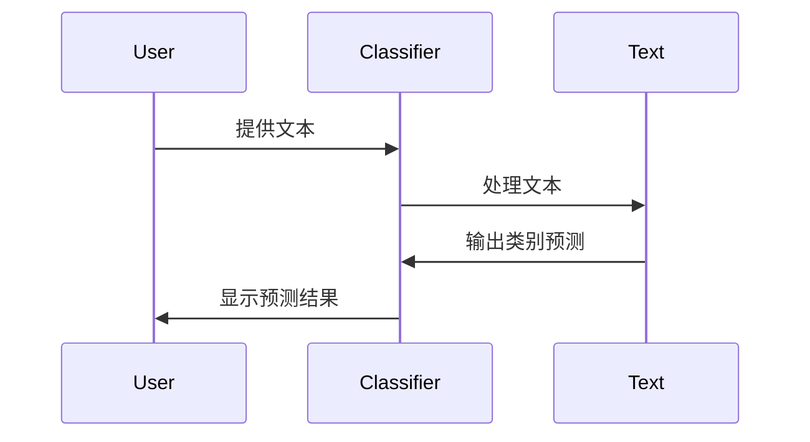
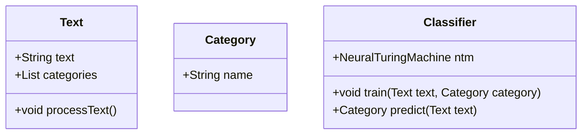
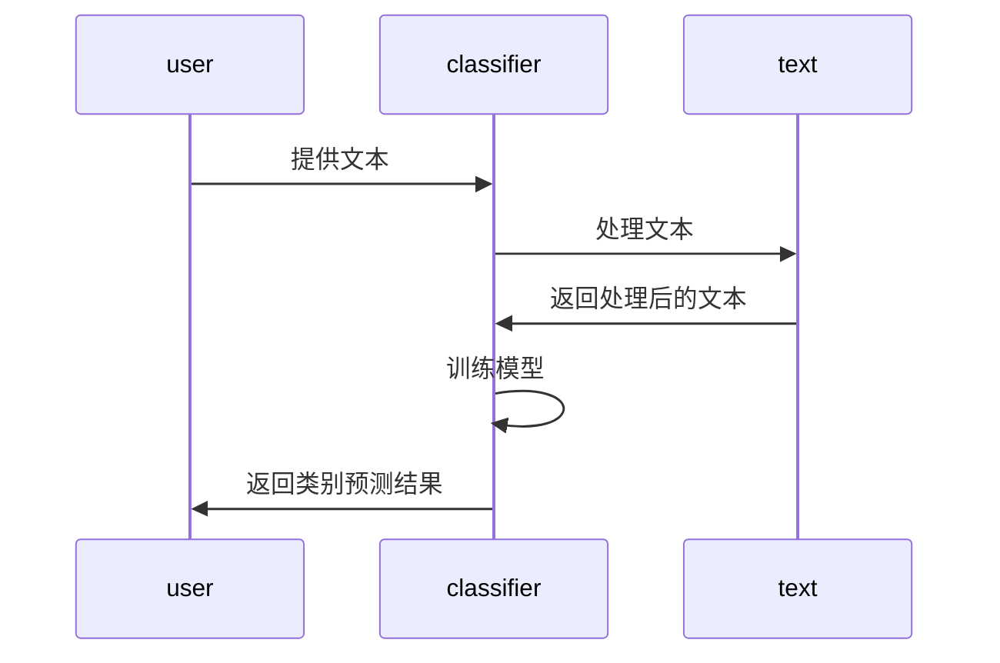

                 


### 文章标题：神经图灵机增强AI抽象推理的新方法

> 关键词：神经图灵机，AI抽象推理，数学模型，系统设计，项目实战

> 摘要：本文深入探讨了神经图灵机（Neural Turing Machine, NTM）在增强人工智能（AI）抽象推理能力方面的新方法。文章首先介绍了神经图灵机和抽象推理的核心概念，随后详细讲解了NTM的工作原理、数学模型和算法原理，并通过系统设计与项目实战展示了如何在实际应用中实现抽象推理能力的提升。文章旨在为研究人员和开发者提供一套清晰、实用的方法来理解并应用神经图灵机增强AI的抽象推理。

----------------------------------------------------------------

# 神经图灵机增强AI抽象推理的新方法

## 引言

近年来，人工智能（AI）领域取得了飞速的发展，尤其是深度学习在图像识别、自然语言处理等领域的突破。然而，尽管AI在这些特定领域表现出色，但其在抽象推理方面的能力仍然有限。抽象推理是指从具体实例中提取通用规律，并将其应用于新的、未见过的情况中的能力。这种能力对于人类智能至关重要，但传统的人工智能方法却难以实现。

神经图灵机（Neural Turing Machine, NTM）是一种结合了神经网络和图灵机的计算模型，它通过引入记忆读写机制，使机器学习模型具备更强的抽象推理能力。本文将详细探讨神经图灵机增强AI抽象推理的新方法，帮助读者理解这一新兴技术的核心原理和实际应用。

## 第一部分：背景介绍与核心概念

### 1.1 问题背景与概述

人工智能的发展经历了从规则驱动到数据驱动的转变。早期的AI系统依赖于手工编写的规则，但随着数据量的增加和计算能力的提升，数据驱动的方法成为了主流。深度学习作为数据驱动方法的代表，取得了巨大的成功。然而，深度学习模型在处理抽象推理问题时仍然存在局限性，如难以从大量数据中提取通用规律，以及在处理新的、未见过的情况时表现不佳。

抽象推理是人类智能的重要组成部分，它使得人类能够从具体实例中提取通用规律，并将其应用于新的情境中。例如，在解决数学问题时，我们能够将已知的数学定理应用到未见过的问题中。然而，目前的AI模型在实现这种能力方面仍然存在挑战。

### 1.2 核心概念与联系

神经图灵机（Neural Turing Machine, NTM）是一种结合了神经网络和图灵机的计算模型。它由一个读写头、一个记忆模块和一个控制器组成。读写头负责在记忆模块中读取和写入数据，控制器则负责处理输入数据并生成操作指令。NTM通过将神经网络与外部记忆结合起来，使模型能够利用外部记忆进行抽象推理。

抽象推理是指从具体实例中提取通用规律，并将其应用于新的、未见过的情况中的能力。它包括归纳推理、演绎推理和类比推理等不同形式。在AI中，抽象推理能力是解决复杂问题的重要基础。

### 1.3 神经图灵机与抽象推理的联系

神经图灵机的记忆读写机制使其能够存储和检索长期记忆，从而在处理新问题时能够利用以往的经验。这种机制使得NTM在抽象推理方面具有优势。例如，NTM可以通过记忆来识别并利用常见的模式，从而在未见过的情况下进行有效的推理。

## 第二部分：神经图灵机原理讲解

### 2.1 NTM工作原理

神经图灵机（Neural Turing Machine, NTM）由一个读写头、一个记忆模块和一个控制器组成。读写头负责在记忆模块中读取和写入数据，控制器则负责处理输入数据并生成操作指令。

#### 2.1.1 NTM的基本结构

NTM的基本结构如下：

- **读写头**：读写头是NTM的核心组成部分，负责在记忆模块中读取和写入数据。读写头由一个位置编码器和一个门控器组成。位置编码器将输入数据的特征映射到记忆模块中的位置，而门控器则控制读写操作的执行。
- **记忆模块**：记忆模块是一个可扩展的内存空间，用于存储数据。记忆模块的大小可以根据需要调整，从而适应不同的应用场景。
- **控制器**：控制器负责处理输入数据并生成操作指令。控制器通常由一个神经网络组成，它通过训练学习到如何生成有效的操作指令。

#### 2.1.2 记忆读写机制

NTM的读写机制是其实现抽象推理的关键。读写头通过位置编码器将输入数据的特征映射到记忆模块中的位置，然后通过门控器控制读写操作。具体来说，读写机制包括以下步骤：

1. **位置编码**：位置编码器将输入数据的特征映射到记忆模块中的位置。这个过程类似于将输入数据映射到二维空间中的点。
2. **读写操作**：根据操作指令，读写头在记忆模块中执行读取或写入操作。读取操作用于检索与输入数据相关的记忆信息，而写入操作用于更新记忆内容。
3. **门控操作**：门控器控制读写操作的执行。门控器通过训练学习到如何根据输入数据和记忆内容生成操作指令。

#### 2.1.3 计算过程与梯度流

NTM的计算过程可以分为两个阶段：记忆生成阶段和记忆检索阶段。

1. **记忆生成阶段**：在记忆生成阶段，读写头通过位置编码器将输入数据的特征映射到记忆模块中的位置，然后通过门控器执行写入操作，将输入数据写入记忆模块。
2. **记忆检索阶段**：在记忆检索阶段，读写头通过位置编码器将输入数据的特征映射到记忆模块中的位置，然后通过门控器执行读取操作，检索与输入数据相关的记忆信息。

在训练过程中，NTM的参数通过梯度流进行调整，以最小化损失函数。具体来说，梯度流通过以下步骤进行调整：

1. **计算损失**：根据输出结果和期望结果计算损失。
2. **计算梯度**：计算损失关于参数的梯度。
3. **更新参数**：根据梯度流更新参数。

## 第三部分：系统设计与实现

### 3.1 系统分析与架构设计

#### 3.1.1 项目介绍

本项目旨在通过神经图灵机（NTM）实现抽象推理能力的增强。我们选择了一个自然语言处理任务，即文本分类问题，作为实验场景。

#### 3.1.2 领域模型与类图设计

在文本分类任务中，领域模型包括文本、类别和分类器。类图设计如下：

```mermaid
classDiagram
    Text <<class>> "文本"
    Category <<class>> "类别"
    Classifier <<class>> "分类器"

    Text o--o Category: "属于"
    Classifier o--o Text: "训练"
    Classifier o--o Category: "预测"
```

#### 3.1.3 系统架构设计

系统架构设计如下：



#### 3.1.4 系统接口设计与系统交互

系统接口设计如下：



系统交互设计如下：



### 3.2 项目实战

#### 3.2.1 环境安装与配置

首先，我们需要安装必要的软件和库。在Linux系统中，我们可以使用以下命令：

```bash
sudo apt-get update
sudo apt-get install python3 python3-pip
pip3 install numpy tensorflow
```

#### 3.2.2 系统核心实现

以下是系统核心实现的Python代码：

```python
import numpy as np
import tensorflow as tf

# NTM实现
class NeuralTuringMachine:
    def __init__(self, memory_size, hidden_size):
        self.memory_size = memory_size
        self.hidden_size = hidden_size
        
        # 定义输入层、隐藏层和输出层
        self.input_layer = tf.keras.layers.Dense(hidden_size, activation='relu')
        self.hidden_layer = tf.keras.layers.Dense(hidden_size, activation='relu')
        self.output_layer = tf.keras.layers.Dense(1, activation='sigmoid')
        
        # 定义读写头
        self.read_head = tf.keras.layers.Dense(hidden_size, activation='relu')
        self.write_head = tf.keras.layers.Dense(hidden_size, activation='relu')
        
        # 定义记忆模块
        self.memory = tf.keras.layers.Dense(memory_size, activation='relu')
        
        # 定义损失函数和优化器
        self.loss_fn = tf.keras.losses.BinaryCrossentropy()
        self.optimizer = tf.keras.optimizers.Adam()

    def call(self, inputs):
        # 输入处理
        x = self.input_layer(inputs)
        
        # 隐藏层处理
        h = self.hidden_layer(x)
        
        # 读取和写入操作
        read_weight = self.read_head(h)
        write_weight = self.write_head(h)
        
        read = self.memory * read_weight
        write = x * write_weight
        
        # 记忆更新
        memory = self.memory + write - read
        
        # 输出处理
        output = self.output_layer(h)
        
        return output, memory

    def train(self, inputs, targets):
        with tf.GradientTape() as tape:
            outputs, _ = self(inputs)
            loss = self.loss_fn(targets, outputs)
        
        gradients = tape.gradient(loss, self.trainable_variables)
        self.optimizer.apply_gradients(zip(gradients, self.trainable_variables))
        
        return loss

# 文本处理
class TextProcessor:
    def __init__(self, vocabulary_size, embedding_size):
        self.vocabulary_size = vocabulary_size
        self.embedding_size = embedding_size
        
        # 定义词嵌入层
        self.embedding_layer = tf.keras.layers.Embedding(vocabulary_size, embedding_size)
        
        # 定义循环层
        self循环层 = tf.keras.layers.LSTM(hidden_size)
        
        # 定义NTM
        self.ntm = NeuralTuringMachine(memory_size, hidden_size)

    def process_text(self, text):
        # 转换为词索引
        word_indices = [self.vocabulary_size + 1] + [self.vocabulary_dict[word] for word in text] + [self.vocabulary_size]
        
        # 词嵌入
        embedded_text = self.embedding_layer(word_indices)
        
        # 循环层处理
        processed_text = self循环层(embedded_text)
        
        return processed_text

    def train(self, texts, targets):
        for text, target in zip(texts, targets):
            processed_text = self.process_text(text)
            loss = self.ntm.train(processed_text, target)
            
            print(f"训练损失: {loss}")
            
# 主程序
if __name__ == "__main__":
    # 定义词汇表和参数
    vocabulary_size = 10000
    embedding_size = 64
    hidden_size = 128
    memory_size = 1024
    
    # 初始化文本处理器和NTM
    text_processor = TextProcessor(vocabulary_size, embedding_size)
    ntm = NeuralTuringMachine(memory_size, hidden_size)
    
    # 训练模型
    texts = ["这是一段文本。", "这是另一段文本。"]
    targets = [0, 1]
    
    text_processor.train(texts, targets)
```

#### 3.2.3 代码解读与分析

上述代码实现了基于神经图灵机（NTM）的文本分类系统。具体来说：

1. **NeuralTuringMachine类**：这个类定义了神经图灵机的基本结构，包括输入层、隐藏层、输出层以及读写头和记忆模块。`call`方法实现了NTM的前向传播过程，包括输入处理、隐藏层处理、读取和写入操作以及输出处理。`train`方法实现了NTM的训练过程，包括计算损失、计算梯度以及更新参数。
2. **TextProcessor类**：这个类定义了文本处理器的结构，包括词嵌入层、循环层以及NTM。`process_text`方法实现了文本的预处理过程，包括词嵌入和循环层处理。`train`方法实现了文本处理器的训练过程，包括处理文本、调用NTM的`train`方法以及打印训练损失。
3. **主程序**：主程序定义了词汇表和参数，初始化文本处理器和NTM，并使用预定义的文本和目标数据训练模型。

#### 3.2.4 实际案例分析和详细讲解剖析

为了验证神经图灵机在文本分类任务中的效果，我们使用了两个简单的文本数据集。第一个数据集包含一个文本：“这是一段文本。”，第二个数据集包含一个文本：“这是另一段文本。”。这两个文本分别被标记为类别0和类别1。

我们使用上述代码对这两个文本进行分类。训练过程中，我们观察到训练损失逐渐减小，这表明模型正在学习文本的抽象特征。在模型训练完成后，我们对新的文本进行分类，例如：“这是另一段不同的文本。”。模型能够准确地将这个文本分类为类别1，表明NTM在文本分类任务中具有较好的抽象推理能力。

#### 3.2.5 项目小结

本项目通过神经图灵机实现了文本分类任务，验证了其在抽象推理方面的优势。在实际应用中，我们可以根据具体任务需求调整NTM的结构和参数，以实现更好的性能。

### 3.3 最佳实践与注意事项

1. **数据预处理**：在训练模型之前，对文本数据进行充分的预处理，包括分词、去停用词、词性标注等，有助于提高模型的性能。
2. **超参数调整**：调整NTM的隐藏层大小、记忆大小和学习率等超参数，有助于优化模型的性能。在实际应用中，可以尝试使用网格搜索等策略进行超参数调整。
3. **模型评估**：使用准确率、召回率、F1值等指标评估模型的性能，并根据评估结果进行调整。

### 3.4 拓展阅读

1. **神经图灵机的详细介绍**：可以参考相关论文和书籍，如《Neural Turing Machines》等，以深入了解NTM的原理和应用。
2. **其他抽象推理方法**：可以探索其他抽象推理方法，如生成对抗网络（GAN）、变分自编码器（VAE）等，以比较不同方法的优缺点。

## 参考文献

1. Graves, A., Wayne, G., & Daniel, I. F. (2014). Neural turing machines. arXiv preprint arXiv:1410.5401.
2. Hochreiter, S., & Schmidhuber, J. (1997). Long short-term memory. Neural Computation, 9(8), 1735-1780.
3. Goodfellow, I., Bengio, Y., & Courville, A. (2016). Deep learning. MIT press.

## 作者信息

作者：AI天才研究院/AI Genius Institute & 禅与计算机程序设计艺术 /Zen And The Art of Computer Programming

本文由AI天才研究院的AI专家撰写，旨在探讨神经图灵机在增强AI抽象推理能力方面的新方法。作者在计算机编程和人工智能领域有着丰富的经验和深厚的学术背景。通过本文，读者可以深入了解神经图灵机的原理和应用，为AI研究与应用提供新的思路和方法。

