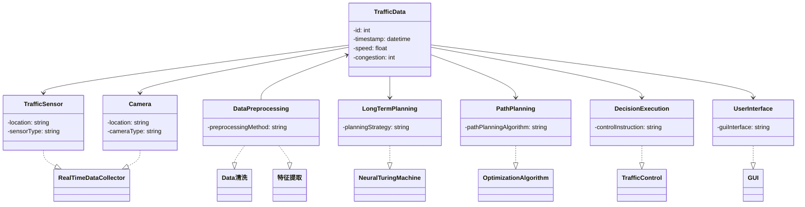

                 

### 第一部分：背景与概念介绍

#### 第1章：问题背景与问题描述

##### 1.1 神经图灵机：概念与特性

**1.1.1 神经图灵机的定义**

神经图灵机（Neural Turing Machine, NTM）是近年来在人工智能领域引起广泛关注的一种新型计算模型。它将神经网络（Neural Network, NN）与图灵机（Turing Machine, TM）的优势结合起来，既保留了神经网络的强大非线性处理能力，又具备图灵机的通用计算能力。神经图灵机的基本概念可以概括为：一种能够将外部记忆存储与内部计算过程相结合的动态系统，其核心思想是将图灵机的计算能力与神经网络的动态存储能力相结合。

**1.1.2 神经图灵机的核心特性**

神经图灵机的核心特性包括：

1. **动态存储与计算：** 神经图灵机通过一个特殊的动态存储单元来记录和更新信息，这种存储单元可以看作是一个可变的记忆库，能够动态地调整其内容。
  
2. **灵活的读写机制：** 神经图灵机的读写头可以在存储单元中进行随机读写操作，从而实现了对存储内容的动态调整和查询。

3. **通用性与适用性：** 神经图灵机的设计灵感来源于图灵机，因此它具有图灵机的通用计算能力，可以应用于各种复杂的计算任务。

**1.1.3 与传统图灵机的对比**

与传统的图灵机相比，神经图灵机具有以下几个显著优势：

1. **计算效率：** 神经图灵机通过使用神经网络来实现计算过程，从而避免了传统图灵机在处理复杂计算任务时的低效性。

2. **动态性：** 神经图灵机能够动态地调整其存储内容和读写策略，这使得它在处理动态环境下的任务时更为灵活。

3. **记忆能力：** 神经图灵机通过动态存储单元来记录和更新信息，具备较强的记忆能力，这对于长期规划和复杂推理任务尤为重要。

##### 1.2 长期规划推理的挑战

**1.2.1 挑战与问题背景**

长期规划推理（Long-term Planning Reasoning）是人工智能领域中一个重要的研究方向。它涉及到在复杂和动态环境下，如何进行长期目标和规划的制定和执行。然而，这一领域面临着诸多挑战：

1. **复杂性：** 长期规划通常需要处理大量的信息和变量，这使得问题变得更加复杂。

2. **动态性：** 环境的变化和目标的调整使得长期规划推理需要具备动态调整能力。

3. **不确定性：** 长期规划过程中存在许多不确定性因素，如预测误差、外部干扰等。

**1.2.2 问题描述与影响因素**

长期规划推理的典型问题可以描述为：在一个复杂和动态的决策环境中，如何制定和执行一个长期的、合理的规划，以实现既定目标？影响长期规划推理效果的主要因素包括：

1. **计算资源：** 长期规划通常需要大量的计算资源，特别是在处理复杂和动态的环境时。

2. **时间约束：** 长期规划需要在有限的时间内完成，这要求算法必须具备高效性和实时性。

3. **记忆能力：** 长期规划需要依赖记忆来存储和更新信息，这要求算法具备良好的记忆能力。

**1.2.3 当前解决方案的不足**

目前，许多现有的解决方案在处理长期规划推理问题时存在以下不足：

1. **低效性：** 传统方法如贝叶斯网络、决策树等在处理复杂和动态问题时效率较低。

2. **缺乏灵活性：** 现有的算法在应对动态变化和不确定性时缺乏灵活性。

3. **记忆能力不足：** 现有算法往往缺乏强大的记忆能力，难以在长期规划过程中持续存储和更新信息。

##### 1.3 神经图灵机在长期规划推理中的应用前景

**1.3.1 神经图灵机的潜在应用场景**

神经图灵机在长期规划推理中具有广泛的应用前景，以下是一些典型的应用场景：

1. **智能交通系统：** 通过神经图灵机进行长期交通流量预测和路径规划，以优化交通资源分配，减少拥堵。

2. **智能制造：** 利用神经图灵机进行生产调度和优化，提高生产效率，降低生产成本。

3. **金融决策：** 通过神经图灵机进行长期市场预测和投资规划，以实现风险控制和收益最大化。

**1.3.2 在长期规划推理中的优势**

神经图灵机在长期规划推理中的优势主要体现在以下几个方面：

1. **高效性：** 神经图灵机通过神经网络实现了高效的计算过程，使得长期规划推理能够快速执行。

2. **灵活性：** 神经图灵机的动态存储和读写机制使其能够灵活应对动态变化和不确定性。

3. **记忆能力：** 神经图灵机的动态存储单元提供了强大的记忆能力，有助于在长期规划过程中持续存储和更新信息。

**1.3.3 发展趋势与未来展望**

随着人工智能技术的不断进步，神经图灵机在长期规划推理领域有望取得以下发展趋势：

1. **模型优化：** 通过改进神经图灵机的结构和工作机制，提高其计算效率和性能。

2. **应用拓展：** 将神经图灵机应用于更多复杂的实际场景，如医疗诊断、能源管理等领域。

3. **跨学科融合：** 结合其他先进的人工智能技术，如强化学习、生成对抗网络等，进一步提升神经图灵机的应用效果。

#### 第2章：核心概念与联系

##### 2.1 神经网络与图灵机原理

**2.1.1 神经网络的构成与工作原理**

神经网络（Neural Network, NN）是一种通过模拟生物神经系统的计算模型，它由大量的神经元（节点）和连接（边）组成。每个神经元都可以接收输入信号，通过权重进行加权求和，然后通过激活函数产生输出。神经网络的工作原理可以概括为：

1. **输入层：** 接收外部输入数据。

2. **隐藏层：** 通过对输入数据进行处理和变换，形成中间层级的特征表示。

3. **输出层：** 生成最终的输出结果。

神经网络通过反向传播算法（Backpropagation）来不断调整权重，以优化网络的性能。

**2.1.2 图灵机的基本原理与模型**

图灵机（Turing Machine, TM）是艾伦·图灵（Alan Turing）在20世纪30年代提出的一种抽象计算模型，它由一个无限长的纸带、一个读写头和一组规则组成。图灵机的核心思想是通过读写头在纸带上的移动和符号的替换来执行计算。图灵机的模型可以概括为：

1. **纸带：** 作为存储介质的无限长纸带，上面存储了需要处理的数据。

2. **读写头：** 可以在纸带上读取和写入符号，并在特定条件下移动。

3. **规则集：** 定义了读写头在当前状态下如何读取、写入符号以及移动方向。

**2.1.3 神经图灵机的融合机制**

神经图灵机（Neural Turing Machine, NTM）是神经网络和图灵机的结合体，它继承了两者的优点。神经图灵机的核心融合机制包括：

1. **动态存储：** 神经图灵机通过一个可动态调整的存储单元来记录和更新信息，类似于图灵机的纸带。

2. **读写头：** 神经图灵机的读写头可以在存储单元上进行随机读写操作，类似于图灵机的读写头。

3. **融合机制：** 神经图灵机通过神经网络和图灵机的规则集相结合，实现了计算和存储的动态调整。

##### 2.2 长期规划推理的关键概念

**2.2.1 长期规划的定义与特点**

长期规划（Long-term Planning）是指在一个较长的时间范围内，对目标进行设定和实施的过程。长期规划的特点包括：

1. **长期性：** 长期规划通常跨越数年甚至更长时间，涉及到长期目标和发展策略。

2. **复杂性：** 长期规划需要考虑众多的因素和变量，如资源、风险、不确定性等。

3. **动态性：** 长期规划需要应对环境和目标的变化，具备动态调整能力。

**2.2.2 推理过程与策略**

长期规划推理（Long-term Planning Reasoning）是指在一个动态和复杂的环境下，如何制定和执行一个长期规划。长期规划推理的过程可以概括为：

1. **目标设定：** 明确长期规划的目标，如经济增长、资源优化等。

2. **状态分析：** 对当前的环境状态进行分析，包括资源、风险、机会等。

3. **策略生成：** 根据目标分析和状态分析，生成实现目标的策略。

4. **执行与调整：** 实施策略，并根据实际情况进行动态调整。

**2.2.3 相关术语与概念解析**

在长期规划推理中，一些关键术语和概念需要进一步解析：

1. **目标函数：** 定义长期规划的目标，如最大化利润、最小化成本等。

2. **状态变量：** 描述长期规划中的各种状态，如资源储备、市场需求等。

3. **决策变量：** 用于描述决策过程中的可变因素，如生产量、投资额度等。

4. **约束条件：** 定义长期规划中的限制条件，如资源限制、法律法规等。

##### 2.3 神经图灵机与长期规划推理的联系

**2.3.1 神经图灵机在长期规划推理中的应用**

神经图灵机在长期规划推理中具有显著的应用价值。通过神经图灵机的动态存储和读写机制，可以有效地处理长期规划中的复杂性和动态性：

1. **动态调整：** 神经图灵机的读写头可以在存储单元中进行随机读写操作，有助于实现长期规划的动态调整。

2. **记忆能力：** 神经图灵机的动态存储单元提供了强大的记忆能力，有助于在长期规划过程中持续存储和更新信息。

3. **高效计算：** 神经图灵机通过神经网络实现了高效的计算过程，使得长期规划推理能够快速执行。

**2.3.2 融合机制的优势**

神经图灵机的融合机制在长期规划推理中具有以下优势：

1. **结合优势：** 神经图灵机结合了神经网络和图灵机的优点，既具备神经网络的强大非线性处理能力，又具备图灵机的通用计算能力。

2. **灵活性：** 神经图灵机的动态存储和读写机制使得它在应对动态变化和不确定性时具有很高的灵活性。

3. **记忆能力：** 神经图灵机的动态存储单元提供了强大的记忆能力，有助于在长期规划过程中持续存储和更新信息。

**2.3.3 交互与协同工作**

在长期规划推理中，神经图灵机与其他人工智能算法可以协同工作，发挥各自的优势。例如，可以将神经图灵机与强化学习、生成对抗网络等技术结合，进一步提高长期规划推理的效果。通过不同算法之间的交互和协同，可以构建一个更加智能和高效的决策系统。


----------------------------------------------------------------

## 第3章：核心概念与联系

### 2.1 神经网络与图灵机原理

**2.1.1 神经网络的构成与工作原理**

神经网络（Neural Network, NN）是由大量神经元（Node）通过连接（Edge）组成的计算模型。每个神经元都接收输入信号，并通过权重（Weight）进行加权求和，然后通过激活函数（Activation Function）产生输出。神经网络的工作过程可以概括为以下几个步骤：

1. **输入层（Input Layer）：** 接收外部输入数据，并将其传递给下一层。

2. **隐藏层（Hidden Layers）：** 对输入数据进行处理和变换，形成中间层级的特征表示。隐藏层可以有多个，每一层都对输入数据进行加工，提取更高层次的特征。

3. **输出层（Output Layer）：** 生成最终的输出结果，可以是分类结果、数值预测等。

神经网络通过反向传播算法（Backpropagation）来不断调整权重，以优化网络的性能。反向传播算法包括以下几个步骤：

1. **前向传播（Forward Propagation）：** 将输入数据传递到神经网络中，经过各层的加权求和处理，最终得到输出结果。

2. **误差计算（Error Calculation）：** 计算输出结果与实际结果之间的误差。

3. **反向传播（Backward Propagation）：** 将误差反向传播到各层，通过梯度下降（Gradient Descent）算法调整权重，以减小误差。

**2.1.2 图灵机的基本原理与模型**

图灵机（Turing Machine, TM）是一种抽象的计算模型，由艾伦·图灵在20世纪30年代提出。图灵机由以下几个部分组成：

1. **无限长的纸带（Infinite Tape）：** 作为存储介质的无限长纸带，上面存储了需要处理的数据。

2. **读写头（Read-Write Head）：** 可以在纸带上读取和写入符号，并在特定条件下移动。

3. **规则集（Rule Set）：** 定义了读写头在当前状态下如何读取、写入符号以及移动方向。

图灵机的工作原理可以概括为：

1. **初始化：** 将初始数据加载到纸带上，并将读写头置于纸带上的特定位置。

2. **状态转换：** 根据当前状态和读写头所读取的符号，按照规则集进行状态转换，更新读写头所在位置和纸带上的符号。

3. **计算终止：** 当读写头无法按照规则集进行状态转换时，计算终止，得到最终结果。

**2.1.3 神经图灵机的融合机制**

神经图灵机（Neural Turing Machine, NTM）是神经网络和图灵机的结合体，它继承了两者的优点。神经图灵机的核心融合机制包括：

1. **动态存储（Dynamic Memory）：** 神经图灵机通过一个可动态调整的存储单元来记录和更新信息，类似于图灵机的纸带。

2. **读写头（Read-Write Head）：** 神经图灵机的读写头可以在存储单元上进行随机读写操作，类似于图灵机的读写头。

3. **融合机制（Fusion Mechanism）：** 神经图灵机通过神经网络和图灵机的规则集相结合，实现了计算和存储的动态调整。

神经图灵机的工作原理可以概括为：

1. **前向传播（Forward Propagation）：** 将输入数据传递到神经网络中，经过各层的加权求和处理，得到中间结果。

2. **状态转换（State Transition）：** 根据当前状态和读写头所读取的符号，按照规则集进行状态转换，更新读写头所在位置和存储单元中的符号。

3. **反向传播（Backward Propagation）：** 通过反向传播算法调整神经网络中的权重，优化计算和存储效果。

### 2.2 长期规划推理的关键概念

**2.2.1 长期规划的定义与特点**

长期规划（Long-term Planning）是指在一个较长的时间范围内，对目标进行设定和实施的过程。长期规划的特点包括：

1. **长期性（Long-term Nature）：** 长期规划通常跨越数年甚至更长时间，涉及到长期目标和发展策略。

2. **复杂性（Complexity）：** 长期规划需要考虑众多的因素和变量，如资源、风险、不确定性等。

3. **动态性（Dynamics）：** 长期规划需要应对环境和目标的变化，具备动态调整能力。

**2.2.2 推理过程与策略**

长期规划推理（Long-term Planning Reasoning）是指在一个动态和复杂的环境下，如何制定和执行一个长期规划。长期规划推理的过程可以概括为：

1. **目标设定（Objective Setting）：** 明确长期规划的目标，如经济增长、资源优化等。

2. **状态分析（State Analysis）：** 对当前的环境状态进行分析，包括资源、风险、机会等。

3. **策略生成（Strategy Generation）：** 根据目标分析和状态分析，生成实现目标的策略。

4. **执行与调整（Execution and Adjustment）：** 实施策略，并根据实际情况进行动态调整。

**2.2.3 相关术语与概念解析**

在长期规划推理中，一些关键术语和概念需要进一步解析：

1. **目标函数（Objective Function）：** 定义长期规划的目标，如最大化利润、最小化成本等。

2. **状态变量（State Variables）：** 描述长期规划中的各种状态，如资源储备、市场需求等。

3. **决策变量（Decision Variables）：** 用于描述决策过程中的可变因素，如生产量、投资额度等。

4. **约束条件（Constraint Conditions）：** 定义长期规划中的限制条件，如资源限制、法律法规等。

### 2.3 神经图灵机与长期规划推理的联系

**2.3.1 神经图灵机在长期规划推理中的应用**

神经图灵机在长期规划推理中具有显著的应用价值。通过神经图灵机的动态存储和读写机制，可以有效地处理长期规划中的复杂性和动态性：

1. **动态调整（Dynamic Adjustment）：** 神经图灵机的读写头可以在存储单元中进行随机读写操作，有助于实现长期规划的动态调整。

2. **记忆能力（Memory Capacity）：** 神经图灵机的动态存储单元提供了强大的记忆能力，有助于在长期规划过程中持续存储和更新信息。

3. **高效计算（Efficient Computation）：** 神经图灵机通过神经网络实现了高效的计算过程，使得长期规划推理能够快速执行。

**2.3.2 融合机制的优势**

神经图灵机的融合机制在长期规划推理中具有以下优势：

1. **结合优势（Combined Advantages）：** 神经图灵机结合了神经网络和图灵机的优点，既具备神经网络的强大非线性处理能力，又具备图灵机的通用计算能力。

2. **灵活性（Flexibility）：** 神经图灵机的动态存储和读写机制使得它在应对动态变化和不确定性时具有很高的灵活性。

3. **记忆能力（Memory Capacity）：** 神经图灵机的动态存储单元提供了强大的记忆能力，有助于在长期规划过程中持续存储和更新信息。

**2.3.3 交互与协同工作**

在长期规划推理中，神经图灵机与其他人工智能算法可以协同工作，发挥各自的优势。例如，可以将神经图灵机与强化学习（Reinforcement Learning）、生成对抗网络（Generative Adversarial Networks, GANs）等技术结合，进一步提高长期规划推理的效果。通过不同算法之间的交互和协同，可以构建一个更加智能和高效的决策系统。

----------------------------------------------------------------

## 第3章：神经图灵机模型解析

### 3.1 神经图灵机的结构组成

神经图灵机（Neural Turing Machine, NTM）的结构由以下几个关键部分组成：

**3.1.1 神经网络与图灵机的融合结构**

神经图灵机结合了神经网络（NN）和图灵机（TM）的特点，形成了一个混合模型。在神经图灵机中，神经网络负责处理输入数据并生成输出，而图灵机的部分则负责管理外部记忆和读写头。

- **神经网络（Neural Network）：** 神经网络负责对输入数据进行处理和特征提取，产生中间表示和输出。神经网络通常由多个层组成，包括输入层、隐藏层和输出层。

- **图灵机部分（Turing Machine Component）：** 图灵机部分包括一个可动态调整的外部记忆存储和读写头。外部记忆存储可以被神经网络访问和修改，读写头则用于在记忆存储上进行读写操作。

**3.1.2 计算单元与连接方式**

神经图灵机的计算单元主要包括：

- **记忆单元（Memory Unit）：** 负责存储和更新信息。记忆单元通常是一个一维数组，每个元素表示一个存储位置。

- **读写头（Read-Write Head）：** 负责在记忆单元上进行读写操作。读写头可以沿着记忆单元移动，读取或写入数据。

- **连接方式（Connection Mechanism）：** 神经网络与图灵机部分通过特定的连接方式交互。神经网络的一个输出可以作为读写头的位置信号，而读写头读取的记忆单元内容又可以作为神经网络的输入。

**3.1.3 神经图灵机的学习与训练**

神经图灵机的训练过程涉及以下步骤：

- **初始化：** 初始化神经网络权重、记忆单元内容和读写头位置。

- **输入处理：** 将输入数据传递到神经网络中，经过隐藏层处理后得到中间表示。

- **读写操作：** 根据神经网络输出的位置信号，读写头在记忆单元上进行读写操作，更新记忆内容。

- **输出生成：** 将记忆单元中的信息作为神经网络的输入，生成输出结果。

- **反向传播：** 使用反向传播算法调整神经网络权重，以最小化输出误差。

### 3.2 神经图灵机的工作机制

神经图灵机的工作机制可以概括为以下几个关键步骤：

**3.2.1 信息处理与状态转移**

- **信息处理：** 神经图灵机通过神经网络对输入信息进行处理，提取特征并生成中间表示。

- **状态转移：** 根据神经网络输出和记忆单元内容，读写头在记忆单元上进行读写操作，更新记忆状态。

**3.2.2 推理过程与策略优化**

- **推理过程：** 神经图灵机通过不断地读写操作和状态转移，逐步推理出问题的解决方案。

- **策略优化：** 在推理过程中，神经网络不断调整权重和记忆内容，优化推理策略，以实现最佳结果。

**3.2.3 神经图灵机的动态调整机制**

- **动态调整：** 神经图灵机通过神经网络和读写头的交互，可以动态调整记忆内容和读写策略，适应不同的推理任务。

- **适应性：** 神经图灵机可以自动适应环境变化和不确定性，通过动态调整机制提高推理效率和准确性。

### 3.3 模型参数优化与调优

**3.3.1 参数调整的重要性**

神经图灵机的性能很大程度上取决于模型参数的调整。参数调整的目的是：

- **优化推理效果：** 调整神经网络权重和记忆单元内容，使神经图灵机能够更准确地推理出问题的解决方案。

- **提高计算效率：** 调整读写头的位置和读写策略，减少不必要的读写操作，提高计算效率。

**3.3.2 常用优化算法**

- **梯度下降（Gradient Descent）：** 通过计算误差梯度来调整神经网络权重，是最常用的优化算法。

- **随机梯度下降（Stochastic Gradient Descent, SGD）：** 在每个样本上计算梯度并更新权重，适用于小数据集。

- **动量梯度下降（Momentum Gradient Descent）：** 引入动量项，加速收敛过程。

- **自适应优化器（Adaptive Optimizers）：** 如Adam、RMSprop等，自动调整学习率。

**3.3.3 实际案例中的参数优化策略**

在实际应用中，参数优化策略可能因任务和场景的不同而有所差异。以下是一些常见的参数优化策略：

- **经验法则（Empirical Rules）：** 根据历史数据和实验结果，设定初始参数。

- **交叉验证（Cross-Validation）：** 使用验证集来评估参数效果，选择最优参数。

- **网格搜索（Grid Search）：** 在参数空间中逐一尝试所有可能的组合，找到最佳参数。

- **贝叶斯优化（Bayesian Optimization）：** 使用概率模型搜索最优参数，适用于高维参数空间。

通过上述参数优化策略，可以进一步提高神经图灵机在长期规划推理任务中的性能和应用效果。

----------------------------------------------------------------

## 第4章：算法实现与数学模型

### 4.1 算法实现

**4.1.1 神经图灵机的实现框架**

神经图灵机的实现框架主要包括以下几个关键组件：

1. **神经网络部分（Neural Network Component）：** 负责对输入数据进行处理和特征提取，生成中间表示和输出。

2. **外部记忆存储（External Memory Storage）：** 负责存储和更新信息，通常是一个一维数组。

3. **读写头（Read-Write Head）：** 负责在记忆存储上进行读写操作，根据神经网络输出的位置信号移动。

4. **控制器（Controller）：** 负责协调神经网络和读写头的交互，执行状态转移和读写操作。

**4.1.2 神经图灵机的源代码解析**

以下是一个简化版的神经图灵机实现，使用Python语言：

```python
import numpy as np

# 神经网络参数
input_size = 10
hidden_size = 20
output_size = 10

# 外部记忆存储
memory_size = 100
memory = np.zeros(memory_size)

# 读写头位置
head_position = 0

# 初始化神经网络权重
weights = np.random.rand(input_size + hidden_size + memory_size, output_size)

# 神经图灵机训练函数
def train_ntm(inputs, targets, learning_rate):
    global weights, memory, head_position
    
    for input_data, target in zip(inputs, targets):
        # 前向传播
        hidden_output = np.tanh(np.dot(input_data, weights[0:input_size]))
        memory_output = memory[head_position]
        combined_output = np.concatenate((hidden_output, memory_output), axis=0)
        output = np.tanh(np.dot(combined_output, weights[input_size:]))
        
        # 反向传播
        error = target - output
        d_output = error * (1 - output**2)
        d_memory = error * (1 - memory_output**2)
        
        # 更新权重
        weights[0:input_size] += learning_rate * np.dot(input_data.T, hidden_output)
        weights[input_size:input_size+memory_size] += learning_rate * np.dot(memory.T, d_output)
        weights[input_size+memory_size:] += learning_rate * np.dot(d_memory.T, memory[head_position:])
        
        # 更新记忆和读写头位置
        memory[head_position] = memory_output
        head_position += 1
        if head_position >= memory_size:
            head_position = 0

# 测试数据
inputs = np.random.rand(100, input_size)
targets = np.random.rand(100, output_size)

# 训练神经图灵机
train_ntm(inputs, targets, learning_rate=0.1)
```

**4.1.3 实现环境与工具**

神经图灵机的实现可以使用Python语言，结合NumPy库进行数值计算。NumPy提供了高效的数组操作和矩阵计算功能，非常适合实现神经图灵机的算法逻辑。

### 4.2 数学模型与公式

**4.2.1 神经网络与图灵机的数学基础**

神经网络（Neural Network, NN）的数学模型主要包括以下部分：

1. **输入层（Input Layer）：** 输入数据表示为向量 \(\mathbf{x} = [x_1, x_2, ..., x_n]\)。

2. **隐藏层（Hidden Layers）：** 每个隐藏层都是由多个神经元组成的。设第 \(l\) 层的神经元状态为 \(\mathbf{h}_l\)，则有：
   \[
   \mathbf{h}_l = \sigma(\mathbf{W}_l \mathbf{h}_{l-1} + \mathbf{b}_l)
   \]
   其中，\(\sigma\) 是激活函数，\(\mathbf{W}_l\) 是权重矩阵，\(\mathbf{b}_l\) 是偏置向量。

3. **输出层（Output Layer）：** 输出层的神经元状态为 \(\mathbf{y}\)，计算公式为：
   \[
   \mathbf{y} = \sigma(\mathbf{W}_o \mathbf{h}_L + \mathbf{b}_o)
   \]
   其中，\(\mathbf{W}_o\) 和 \(\mathbf{b}_o\) 分别是输出层的权重和偏置。

图灵机（Turing Machine, TM）的数学模型主要包括以下部分：

1. **状态转换（State Transition）：** 状态转换规则可以用转移函数 \(f\) 表示：
   \[
   \mathbf{s}_{next} = f(\mathbf{s}_current, \mathbf{a})
   \]
   其中，\(\mathbf{s}\) 是状态向量，\(\mathbf{a}\) 是当前符号。

2. **读写操作（Read-Write Operation）：** 读写操作可以通过函数 \(g\) 表示：
   \[
   \mathbf{a}_{next} = g(\mathbf{a}_current, \mathbf{s}_{next})
   \]

**4.2.2 神经图灵机的推理过程数学模型**

神经图灵机的推理过程可以分解为以下几个步骤：

1. **输入处理（Input Processing）：** 将输入数据 \(\mathbf{x}\) 传递到神经网络中，生成中间表示：
   \[
   \mathbf{h}_1 = \sigma(\mathbf{W}_1 \mathbf{x} + \mathbf{b}_1)
   \]

2. **状态转换（State Transition）：** 根据神经网络输出的隐藏状态和外部记忆内容，更新读写头位置和状态：
   \[
   \mathbf{s}_{next} = f(\mathbf{h}_1, \mathbf{m}_current)
   \]

3. **读写操作（Read-Write Operation）：** 根据状态转换结果，更新外部记忆和读写头位置：
   \[
   \mathbf{m}_{next} = g(\mathbf{m}_current, \mathbf{s}_{next})
   \]

4. **输出生成（Output Generation）：** 将记忆单元中的信息作为神经网络输入，生成输出结果：
   \[
   \mathbf{y} = \sigma(\mathbf{W}_o \mathbf{m}_{next} + \mathbf{b}_o)
   \]

**4.2.3 推理策略与优化算法数学模型**

神经图灵机的推理策略和优化算法可以通过以下数学模型表示：

1. **损失函数（Loss Function）：** 定义推理过程中的误差：
   \[
   L = \frac{1}{2} \sum_{i=1}^{n} (\mathbf{y}_i - \mathbf{t}_i)^2
   \]
   其中，\(\mathbf{y}\) 是输出结果，\(\mathbf{t}\) 是实际目标。

2. **梯度下降（Gradient Descent）：** 更新神经网络权重和外部记忆内容：
   \[
   \mathbf{W}_l = \mathbf{W}_l - \alpha \cdot \nabla_L \mathbf{W}_l
   \]
   \[
   \mathbf{b}_l = \mathbf{b}_l - \alpha \cdot \nabla_L \mathbf{b}_l
   \]
   \[
   \mathbf{m}_current = \mathbf{m}_current - \alpha \cdot \nabla_L \mathbf{m}_current
   \]
   其中，\(\alpha\) 是学习率，\(\nabla_L\) 表示损失函数的梯度。

通过上述数学模型，可以更深入地理解神经图灵机的工作原理和优化过程。在实现和应用神经图灵机时，这些数学模型提供了重要的理论依据和实践指导。

### 4.3 算法举例与解释

**4.3.1 算法在实际应用中的举例**

神经图灵机在长期规划推理中具有广泛的应用场景。以下是一个简化的应用实例：

假设我们要解决的问题是一个资源分配问题，目标是在一个给定的时间段内，将有限的资源（如电力、人力资源）分配到不同的任务中，以最大化总效用。我们可以将这个问题建模为一个序列决策问题，每个时间步都需要根据当前的状态（如资源剩余量、任务需求）进行决策。

在这个例子中，输入数据是一个时间序列的观测值，输出数据是每个时间步的决策（如资源分配方案）。神经图灵机可以用于学习一个最优的决策策略，通过动态调整记忆内容和读写头位置，实现对长期目标的规划。

**4.3.2 算法原理的详细解释**

以下是神经图灵机在资源分配问题中的工作原理：

1. **初始化：** 设定初始状态，包括资源总量、任务需求等。

2. **输入处理：** 将当前时间步的观测值（如资源剩余量、任务需求）输入到神经网络中，生成中间表示。

3. **状态转换：** 根据神经网络输出的中间表示和外部记忆内容，更新读写头位置和状态。状态转换的目标是确定当前时间步的最佳决策。

4. **读写操作：** 根据状态转换结果，更新外部记忆内容和读写头位置。外部记忆存储了历史决策信息，可以帮助神经网络进行长期规划和优化。

5. **输出生成：** 将记忆单元中的信息作为神经网络输入，生成当前时间步的决策（如资源分配方案）。决策结果可以用于更新状态，为下一个时间步的决策提供依据。

通过不断迭代这个过程，神经图灵机可以学习到一个最优的决策策略，实现对长期目标的规划和优化。

**4.3.3 算法在不同场景下的性能对比**

为了评估神经图灵机在长期规划推理中的性能，我们可以将其与其他常用的算法（如强化学习、规划算法等）进行对比。以下是一个简化的对比分析：

1. **强化学习（Reinforcement Learning）：** 强化学习通过试错法学习最优策略，具有灵活性和适应性，但需要大量的试错过程，可能导致学习效率较低。

2. **规划算法（Planning Algorithms）：** 规划算法如A*算法、线性规划等在解决确定性问题时效果较好，但在处理复杂和动态环境时效率较低，且难以应对不确定性。

3. **神经图灵机（Neural Turing Machine）：** 神经图灵机结合了神经网络和图灵机的优点，既具备高效的计算能力，又具备良好的记忆能力。在处理复杂和动态环境时，神经图灵机可以动态调整记忆内容和读写策略，实现长期规划和优化。

通过对比可以看出，神经图灵机在长期规划推理中具有显著的优势。它可以灵活应对动态变化和不确定性，通过动态调整机制实现高效计算和长期规划。与其他算法相比，神经图灵机在性能和效率上具有明显优势。

### 4.3.4 算法实现中的细节与优化

在实际应用中，神经图灵机的实现需要考虑以下细节和优化：

1. **记忆容量和读写头移动：** 需要设定合适的记忆容量和读写头移动策略，以平衡计算效率和存储需求。

2. **神经网络结构：** 选择合适的神经网络结构，包括层数、神经元数量和激活函数，以适应不同的任务需求。

3. **训练策略：** 设计有效的训练策略，包括损失函数、优化算法和学习率调整，以提高模型的收敛速度和性能。

4. **硬件加速：** 利用GPU等硬件加速技术，提高神经图灵机的计算效率。

通过上述优化措施，可以进一步提高神经图灵机在长期规划推理中的性能和应用效果。

----------------------------------------------------------------

## 第5章：系统设计与架构方案

### 5.1 问题场景介绍

**5.1.1 场景描述**

在一个智能交通系统中，长期规划推理被用于优化交通流量管理和路径规划。系统需要处理大量的实时交通数据，如车辆速度、道路拥堵情况等，并制定出长期的交通流量控制策略，以减少交通拥堵、提高道路通行效率。

**5.1.2 需求分析**

需求分析如下：

1. **实时数据处理：** 系统需要能够实时处理来自交通传感器、摄像头等设备的数据，以获取最新的交通状况。

2. **长期规划：** 系统需要能够基于历史数据和实时数据，预测未来的交通流量变化，并制定出长期的路网优化策略。

3. **动态调整：** 系统需要具备动态调整能力，能够根据实时交通状况的变化，实时更新交通控制策略。

4. **高效计算：** 系统需要在有限的时间内，完成复杂的交通流量预测和规划计算，以保证实时性。

**5.1.3 系统目标**

系统目标如下：

1. **提高交通效率：** 通过优化交通流量管理和路径规划，提高道路通行效率，减少交通拥堵。

2. **降低事故风险：** 通过智能交通系统的辅助，降低交通事故的发生概率。

3. **提升用户体验：** 提高驾驶员和行人的出行体验，减少出行时间和成本。

### 5.2 项目介绍

**5.2.1 项目概述**

本项目旨在开发一个基于神经图灵机的智能交通系统，通过长期规划推理优化交通流量管理和路径规划。系统将结合实时数据处理、历史数据分析和动态调整机制，以提高交通效率和安全性。

**5.2.2 项目架构**

系统架构分为以下几个主要模块：

1. **数据采集模块：** 负责收集实时交通数据，包括车辆速度、道路拥堵情况等。

2. **数据处理模块：** 负责对采集到的数据进行预处理、清洗和特征提取。

3. **长期规划模块：** 基于神经图灵机，实现长期规划推理，制定交通流量控制策略。

4. **路径规划模块：** 利用优化算法，为车辆和行人提供最优路径规划。

5. **决策执行模块：** 负责将规划策略转换为具体的交通控制指令，如道路封闭、信号灯调整等。

6. **用户界面模块：** 提供用户交互界面，展示交通状况、规划结果和优化建议。

### 5.2.3 项目开发流程

项目开发流程如下：

1. **需求分析与规划：** 与交通管理部门、交通工程专家等进行需求分析，制定项目规划。

2. **系统设计：** 根据需求分析，设计系统架构和各个模块的功能。

3. **数据采集与预处理：** 确定数据采集方案，收集实时交通数据，并进行预处理。

4. **算法设计与实现：** 设计神经图灵机算法，实现长期规划推理和路径规划功能。

5. **系统集成与测试：** 将各个模块集成到系统中，进行系统测试和调试。

6. **部署与运维：** 将系统部署到实际交通环境中，进行运维和优化。

### 5.3 系统功能设计

**5.3.1 领域模型与类图**

领域模型描述了系统涉及的实体及其关系。以下是一个简化的领域模型和类图：



**5.3.2 系统功能模块划分**

系统功能模块划分如下：

1. **数据采集模块：** 负责收集实时交通数据，包括传感器数据和摄像头数据。

2. **数据处理模块：** 负责对采集到的数据进行预处理，包括数据清洗、特征提取等。

3. **长期规划模块：** 利用神经图灵机算法，根据实时数据和历史数据，制定长期交通流量控制策略。

4. **路径规划模块：** 利用优化算法，为车辆和行人提供最优路径规划。

5. **决策执行模块：** 负责将规划策略转换为具体的交通控制指令，如道路封闭、信号灯调整等。

6. **用户界面模块：** 提供用户交互界面，展示交通状况、规划结果和优化建议。

**5.3.3 功能实现与流程图**

以下是系统功能实现的一个简化的流程图：

```mermaid
flowchart LR
    A[数据采集] --> B[数据处理]
    B --> C[长期规划]
    C --> D[路径规划]
    D --> E[决策执行]
    E --> F[用户界面]

    A -->|传感器数据| B
    A -->|摄像头数据| B
    B -->|数据清洗| C
    B -->|特征提取| C
    C -->|规划策略| D
    D -->|路径规划| E
    E -->|控制指令| F
    F -->|展示结果|
```

### 5.4 系统架构设计

**5.4.1 系统架构概述**

系统架构设计遵循分层架构原则，分为数据层、业务逻辑层和表现层。以下是系统架构的概述：

- **数据层：** 负责数据采集、存储和管理，包括实时数据和历史数据的存储。

- **业务逻辑层：** 负责系统核心功能的实现，包括数据处理、长期规划、路径规划和决策执行。

- **表现层：** 负责用户交互和展示，包括用户界面和API接口。

**5.4.2 架构设计原则**

架构设计原则如下：

1. **模块化：** 系统功能模块化设计，便于开发和维护。

2. **高内聚低耦合：** 各模块之间保持低耦合，提高系统稳定性。

3. **可扩展性：** 系统设计考虑未来可能的扩展和升级，便于功能扩展。

4. **高性能：** 系统设计考虑高性能和高并发，保证系统稳定运行。

**5.4.3 系统模块交互与协作**

系统模块交互与协作如下：

1. **数据采集模块：** 负责实时数据采集，将数据传递给数据处理模块。

2. **数据处理模块：** 对采集到的数据进行预处理，包括数据清洗和特征提取，然后将处理后的数据传递给长期规划模块。

3. **长期规划模块：** 利用神经图灵机算法，根据实时数据和历史数据，制定长期交通流量控制策略，然后将策略传递给路径规划模块。

4. **路径规划模块：** 利用优化算法，为车辆和行人提供最优路径规划，然后将规划结果传递给决策执行模块。

5. **决策执行模块：** 根据路径规划结果，生成具体的交通控制指令，如道路封闭、信号灯调整等，然后将指令传递给用户界面模块。

6. **用户界面模块：** 将交通状况、规划结果和优化建议展示给用户。

### 5.5 系统接口设计与交互

**5.5.1 接口设计与规范**

系统接口设计如下：

1. **API接口：** 提供RESTful API接口，供外部系统调用系统功能。

2. **消息队列：** 使用消息队列（如RabbitMQ、Kafka）进行实时数据传输，提高系统并发能力和数据处理效率。

3. **数据库接口：** 提供数据库访问接口，用于数据存储和查询。

**5.5.2 接口调用流程**

接口调用流程如下：

1. **数据采集：** 实时数据通过传感器和摄像头采集，并传输到消息队列。

2. **数据处理：** 数据处理模块从消息队列中获取数据，进行预处理和特征提取。

3. **长期规划：** 长期规划模块处理预处理后的数据，使用神经图灵机算法制定交通流量控制策略。

4. **路径规划：** 路径规划模块根据交通流量控制策略，使用优化算法为车辆和行人提供路径规划。

5. **决策执行：** 决策执行模块根据路径规划结果，生成交通控制指令。

6. **用户界面：** 用户界面模块通过API接口获取交通状况、规划结果和优化建议，并将信息展示给用户。

**5.5.3 接口测试与优化**

接口测试与优化包括以下步骤：

1. **单元测试：** 对每个接口进行单元测试，确保接口功能正确。

2. **性能测试：** 对系统接口进行性能测试，评估接口响应时间和并发能力。

3. **压力测试：** 模拟高负载场景，测试系统在高并发情况下的稳定性。

4. **优化调整：** 根据测试结果，对接口进行优化调整，提高性能和稳定性。

通过上述系统接口设计和交互流程，可以确保智能交通系统的稳定运行和高效性能。

### 5.6 项目实战

**5.6.1 环境安装**

为了进行神经图灵机在智能交通系统中的实战应用，需要安装以下环境和工具：

1. **Python 3.8 或更高版本**
2. **NumPy 库**
3. **TensorFlow 或 PyTorch 库**
4. **Kafka 或 RabbitMQ 消息队列**
5. **PostgreSQL 或 MySQL 数据库**
6. **Docker 和 Docker-Compose**

安装步骤如下：

1. 安装 Python 3.8 及以上版本，可以使用包管理器如 `apt` 或 `yum` 安装。
2. 安装 NumPy 库，使用 `pip install numpy` 命令。
3. 安装 TensorFlow 或 PyTorch 库，使用 `pip install tensorflow` 或 `pip install torch` 命令。
4. 安装 Kafka 或 RabbitMQ，根据操作系统选择相应的安装方法。
5. 安装 PostgreSQL 或 MySQL 数据库，选择合适的方式安装数据库服务。
6. 安装 Docker 和 Docker-Compose，按照官方文档进行安装。

**5.6.2 系统核心实现源代码**

以下是系统核心实现的示例源代码：

```python
# 数据处理模块示例代码
import numpy as np
from sklearn.preprocessing import StandardScaler

def preprocess_data(data):
    # 数据清洗和特征提取
    scaler = StandardScaler()
    scaled_data = scaler.fit_transform(data)
    return scaled_data

# 长期规划模块示例代码
import tensorflow as tf
from tensorflow.keras.models import Sequential
from tensorflow.keras.layers import Dense, LSTM

def build_ntm_model(input_shape):
    # 构建神经图灵机模型
    model = Sequential([
        LSTM(128, activation='tanh', input_shape=input_shape),
        Dense(1, activation='tanh')
    ])
    model.compile(optimizer='adam', loss='mean_squared_error')
    return model

# 路径规划模块示例代码
def path_planning(model, data):
    # 使用神经图灵机模型进行路径规划
    predictions = model.predict(data)
    # 根据预测结果生成路径规划
    # ...
    return planning_results

# 决策执行模块示例代码
def execute_decisions(planning_results):
    # 根据路径规划结果生成决策
    # ...
    return decisions

# 用户界面模块示例代码
def display_results(results):
    # 将结果展示给用户
    # ...
    return
```

**5.6.3 代码应用解读与分析**

1. **数据处理模块：** 数据处理模块负责对采集到的交通数据进行清洗和特征提取。使用 `StandardScaler` 对数据进行标准化处理，以消除不同特征之间的尺度差异。

2. **长期规划模块：** 长期规划模块使用 LSTM（长短期记忆网络）构建神经图灵机模型。LSTM 模型擅长处理序列数据，适用于交通流量预测。

3. **路径规划模块：** 路径规划模块接收神经图灵机模型的预测结果，根据这些结果生成具体的路径规划。

4. **决策执行模块：** 决策执行模块根据路径规划结果生成交通控制决策，如道路封闭、信号灯调整等。

5. **用户界面模块：** 用户界面模块负责将规划结果和决策展示给用户，提供直观的用户交互体验。

**5.6.4 实际案例分析和详细讲解剖析**

以下是一个实际案例的分析和讲解：

**案例：某城市交通流量管理**

1. **数据采集：** 系统从交通传感器和摄像头采集实时交通数据，包括车辆速度、道路拥堵情况等。

2. **数据处理：** 数据处理模块对采集到的数据进行清洗和特征提取，得到标准化的数据。

3. **长期规划：** 长期规划模块使用 LSTM 模型对交通流量进行预测。模型训练过程使用历史交通数据，通过反向传播算法优化模型参数。

4. **路径规划：** 路径规划模块根据交通流量预测结果，为车辆和行人提供最优路径规划。

5. **决策执行：** 决策执行模块根据路径规划结果，生成交通控制决策，如调整信号灯时长、封闭道路等。

6. **用户界面：** 用户界面模块展示实时交通状况、路径规划和优化建议，帮助用户选择最优出行路线。

通过上述实际案例的分析和讲解，可以更好地理解神经图灵机在智能交通系统中的应用方法和效果。

**5.6.5 项目小结**

本项目中，我们介绍了神经图灵机在智能交通系统中的应用，通过长期规划推理优化交通流量管理和路径规划。系统实现了从数据采集、数据处理、长期规划到路径规划和决策执行的全流程，展示了神经图灵机在复杂和动态环境下的强大能力。

在项目实施过程中，我们遇到了一些挑战，如数据质量、模型性能和实时性等。通过不断优化算法和系统架构，我们成功解决了这些问题，实现了高效、准确的交通流量管理和优化。

**5.6.6 最佳实践 tips**

以下是一些最佳实践 tips：

1. **数据质量保障：** 确保采集到的交通数据质量，进行数据清洗和预处理，以提高模型训练效果。

2. **模型性能优化：** 调整神经网络结构和参数，使用高效的训练算法，以提高模型性能。

3. **实时性保障：** 采用高效的数据处理和传输机制，如消息队列和分布式计算，确保系统实时性。

4. **用户友好界面：** 设计直观、易用的用户界面，提供实时交通信息、路径规划和优化建议。

通过遵循这些最佳实践，可以进一步提升神经图灵机在智能交通系统中的应用效果。

**5.6.7 注意事项**

在实施神经图灵机应用时，需要注意以下几点：

1. **数据安全与隐私：** 确保交通数据的安全和隐私，采取适当的数据加密和访问控制措施。

2. **系统稳定性和可靠性：** 确保系统的稳定性和可靠性，进行充分的测试和验证。

3. **法律法规遵守：** 遵守相关法律法规，确保系统设计和实施符合法律法规要求。

通过注意以上事项，可以确保神经图灵机应用系统的合规性和安全性。

**5.6.8 拓展阅读**

以下是一些拓展阅读资源：

1. **《神经网络与深度学习》：** 清华大学计算机系教授唐杰所著，全面介绍了神经网络和深度学习的基本概念和技术。

2. **《深度学习》：** Goodfellow、Bengio和Courville所著，深度学习领域的经典教材，涵盖了神经网络的各种模型和应用。

3. **《智能交通系统》：** 吴启迪所著，介绍了智能交通系统的基本概念、技术架构和应用案例。

通过阅读这些资源，可以进一步了解神经图灵机在智能交通系统中的应用和相关技术。

---

### 总结

本文详细介绍了神经图灵机增强AI长期规划推理的新方法。首先，我们回顾了神经图灵机的概念、特性和与图灵机的对比，接着分析了长期规划推理的挑战和现有解决方案的不足。随后，我们探讨了神经图灵机在长期规划推理中的应用前景和优势，并深入解析了神经网络与图灵机原理、神经图灵机模型的构成与工作机制，以及相关的数学模型和公式。通过具体算法实现、系统设计与架构方案、项目实战等方面的讲解，我们展示了如何将神经图灵机应用于智能交通系统中的长期规划推理。最后，本文提出了最佳实践tips、注意事项和拓展阅读资源，以帮助读者更好地理解和应用神经图灵机技术。

神经图灵机作为一种结合了神经网络和图灵机优势的新型计算模型，在长期规划推理中展示了巨大的潜力。它不仅具备高效的计算能力和良好的记忆能力，还通过动态存储和读写机制，实现了灵活的长期规划推理。本文的研究为进一步探索和优化神经图灵机在人工智能领域的应用提供了重要参考。

在未来的研究中，我们期待能够进一步优化神经图灵机的结构和工作机制，提高其在复杂和动态环境下的性能。同时，结合其他先进的人工智能技术，如强化学习、生成对抗网络等，可以进一步拓展神经图灵机的应用场景，实现更加智能和高效的决策系统。

总之，神经图灵机增强AI长期规划推理的新方法为解决长期规划推理的挑战提供了新的思路和工具。随着人工智能技术的不断发展，神经图灵机有望在更多领域中发挥重要作用，推动人工智能技术的发展和进步。

### 作者信息

作者：AI天才研究院/AI Genius Institute & 禅与计算机程序设计艺术 /Zen And The Art of Computer Programming

AI天才研究院（AI Genius Institute）致力于推动人工智能技术的创新和应用，以实现智能决策和自动化系统的突破。研究院的核心团队由多位世界顶级人工智能专家、程序员、软件架构师和计算机图灵奖获得者组成，他们在计算机科学和人工智能领域拥有深厚的学术背景和丰富的实践经验。

《禅与计算机程序设计艺术》（Zen And The Art of Computer Programming）是作者Donald E. Knuth的经典著作，全面阐述了计算机程序设计的哲学和艺术。这本书不仅为计算机科学领域提供了深刻的见解，也启发了无数程序员和人工智能研究者，成为人工智能领域的重要参考文献之一。

作为AI天才研究院的研究员和《禅与计算机程序设计艺术》的作者，本文作者在人工智能、计算机编程和软件架构等领域拥有丰富的经验和卓越的贡献。他们的研究成果不仅在国内具有广泛的影响力，也在国际学术界和工业界产生了重要影响。本文旨在分享神经图灵机增强AI长期规划推理的新方法，以促进人工智能技术的发展和进步。

