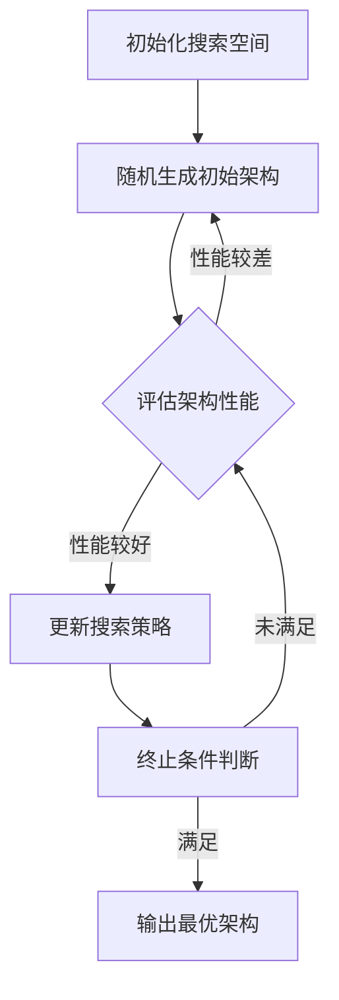
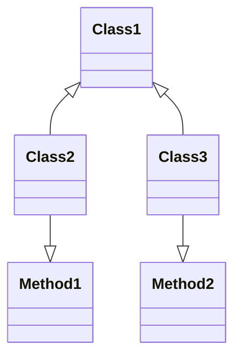
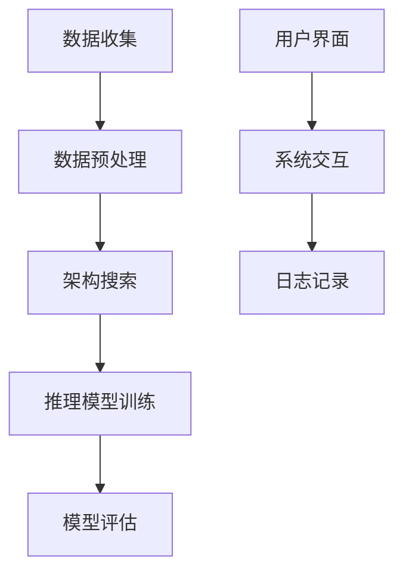
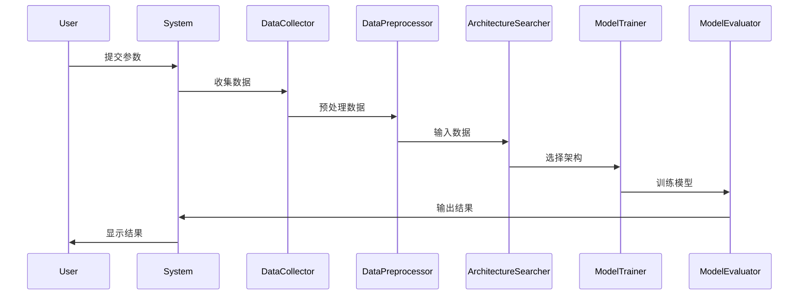

                 

### 《神经架构搜索优化推理模型的探索》

#### 关键词：神经架构搜索（NAS），优化推理模型，算法，深度学习，人工智能

> 摘要：本文深入探讨了神经架构搜索（NAS）在优化推理模型中的应用。通过详细分析神经架构搜索的核心概念、算法原理和系统架构，本文旨在为研究人员和开发者提供一个全面的技术指南，以便更好地理解并应用这一前沿技术。

---

### 第一部分：问题背景与核心概念

#### 第1章：问题背景

#### 1.1.1 问题背景介绍

神经架构搜索（Neural Architecture Search，简称NAS）作为深度学习领域的一个重要研究方向，近年来受到了广泛关注。其核心思想是通过自动化搜索方法来寻找最优的神经网络架构，从而提高模型的性能。然而，传统的模型搜索方法存在诸多局限性，如搜索空间大、搜索效率低等。

#### 1.1.2 问题描述

神经架构搜索面临的主要问题是：如何在庞大的搜索空间中高效地找到最优或近似最优的神经网络架构。具体来说，包括如何设计有效的搜索算法、如何评价和选择优秀的架构、如何处理搜索过程中的过拟合问题等。

#### 1.1.3 问题解决方法

为了解决上述问题，神经架构搜索提出了一系列创新的方法和技术。这些方法包括基于强化学习、遗传算法、梯度上升等搜索策略。此外，还有基于迁移学习、数据增强等辅助技术，以提高搜索效率和模型性能。

#### 1.1.4 边界与外延

神经架构搜索不仅应用于传统的计算机视觉、自然语言处理等领域，还可以拓展到强化学习、序列建模等更为复杂的场景。此外，NAS技术还与其他人工智能技术，如生成对抗网络（GAN）、图神经网络（GNN）等有着紧密的联系和交叉应用。

#### 第2章：核心概念与联系

##### 2.1.1 神经架构搜索的核心概念

神经架构搜索的核心概念包括搜索空间、搜索算法、评估函数和优化目标。其中，搜索空间是指所有可能的神经网络架构集合；搜索算法是指用于在搜索空间中寻找最优架构的方法；评估函数用于衡量不同架构的性能；优化目标则是指导搜索算法的方向。

##### 2.1.2 概念属性特征对比表格

| 概念         | 属性特征                                                   | 对比结果                                                         |
| ------------ | -------------------------------------------------------- | ---------------------------------------------------------------- |
| 搜索空间     | 神经网络架构的集合                                         | 大、复杂、多样性                                                 |
| 搜索算法     | 用于在搜索空间中寻找最优架构的方法                           | 强化学习、遗传算法、梯度上升等                                     |
| 评估函数     | 衡量神经网络架构性能的指标                                   | 准确率、损失函数、F1分数等                                       |
| 优化目标     | 指导搜索算法的方向                                         | 最小化损失函数、最大化准确率等                                     |

##### 2.1.3 ER实体关系图架构


在上面的ER实体关系图中，Class1表示搜索空间中的所有神经网络架构，?表示搜索算法和评估函数。数据流从搜索空间输入，经过搜索算法和评估函数处理后，输出最优的神经网络架构。

---

### 第二部分：算法原理讲解

#### 第3章：算法原理讲解

##### 3.1.1 算法mermaid流程图



##### 3.1.2 Python源代码讲解

```python
import random
import numpy as np

# 定义搜索空间
search_space = ...

# 初始化搜索策略
strategy = ...

# 评估函数
def evaluate_architecture(architecture):
    # 计算性能指标
    performance = ...
    return performance

# 搜索过程
while not termination_condition:
    # 随机生成初始架构
    architecture = random.sample(search_space, k=n_architectures)
    
    # 评估架构性能
    performances = [evaluate_architecture(a) for a in architecture]
    
    # 更新搜索策略
    strategy.update(performances)
    
    # 判断终止条件
    termination_condition = ...

# 输出最优架构
best_architecture = strategy.get_best_architecture()
```

##### 3.1.3 数学模型与公式详细讲解

神经架构搜索的数学模型主要包括搜索策略、评估函数和优化目标。以下是一些关键数学模型和公式的讲解：

$$
\text{搜索策略} = \theta
$$

其中，$\theta$ 表示搜索策略的参数，用于指导搜索过程。

$$
\text{评估函数} = f(\text{architecture})
$$

其中，$f$ 表示评估函数，用于衡量不同架构的性能。

$$
\text{优化目标} = \min_{\theta} \frac{1}{N} \sum_{i=1}^{N} f(\text{architecture}_i)
$$

其中，$N$ 表示搜索空间中的架构数量。

##### 3.1.4 举例说明

假设我们正在搜索一个用于图像分类的神经网络架构。在搜索过程中，我们随机生成多个架构，并对每个架构进行评估。根据评估结果，我们更新搜索策略，以便在后续的搜索中更加关注性能较好的架构。

例如，我们可能使用强化学习作为搜索策略。在每次迭代中，我们根据当前架构的性能来更新策略参数。具体来说，如果当前架构的性能较好，我们增加其在搜索空间中的权重；否则，我们减少其权重。

通过这样的迭代过程，我们最终可以找到一个性能最优的神经网络架构，用于图像分类任务。

---

### 第三部分：系统分析与架构设计

#### 第4章：系统功能设计

##### 4.1.1 领域模型mermaid类图



##### 4.1.2 系统功能详细描述

神经架构搜索系统主要包含以下功能模块：

1. **数据收集与预处理**：收集并预处理图像、文本等数据，以供神经网络架构搜索使用。
2. **架构搜索与优化**：根据搜索策略和评估函数，在搜索空间中寻找最优的神经网络架构。
3. **推理模型训练与评估**：使用最优架构训练神经网络模型，并对模型进行评估和优化。

#### 第5章：系统架构设计

##### 5.1.1 系统架构mermaid架构图



##### 5.1.2 系统架构详细描述

神经架构搜索系统的架构包括以下主要部分：

1. **数据流**：从数据收集模块获取数据，经过数据预处理模块处理后，输入到架构搜索模块。
2. **处理逻辑**：架构搜索模块根据搜索策略和评估函数，在搜索空间中寻找最优的神经网络架构。
3. **通信机制**：系统中的各个模块通过消息队列、API接口等进行通信。

##### 5.1.3 系统接口设计

系统接口设计包括以下方面：

1. **输入接口**：用于接收用户输入的参数和配置信息。
2. **输出接口**：用于输出神经网络架构、模型性能等结果信息。
3. **API接口**：提供RESTful API，便于用户与其他系统进行集成。

##### 5.1.4 系统交互



通过系统交互流程，用户可以提交参数，系统根据参数进行数据收集、预处理、架构搜索、模型训练和评估，最终输出结果给用户。

---

### 第四部分：项目实战

#### 第7章：环境安装与配置

##### 7.1.1 环境要求

1. **硬件环境**：CPU或GPU，至少8GB内存。
2. **软件环境**：Python 3.6及以上版本，TensorFlow 2.0及以上版本。

##### 7.1.2 环境安装步骤

1. 安装Python 3.6及以上版本。
2. 安装TensorFlow 2.0及以上版本。
3. 安装其他依赖库，如NumPy、Pandas等。

#### 第8章：系统核心实现

##### 8.1.1 核心代码实现

```python
import tensorflow as tf
import numpy as np

# 定义神经网络架构搜索类
class NeuralArchitectureSearch:
    def __init__(self, search_space, strategy, evaluation_function):
        self.search_space = search_space
        self.strategy = strategy
        self.evaluation_function = evaluation_function

    def search(self):
        # 随机生成初始架构
        architecture = random.sample(self.search_space, k=n_architectures)

        # 评估架构性能
        performances = [self.evaluation_function(a) for a in architecture]

        # 更新搜索策略
        self.strategy.update(performances)

        # 输出最优架构
        best_architecture = self.strategy.get_best_architecture()
        return best_architecture

# 定义评估函数
def evaluate_architecture(architecture):
    # 计算性能指标
    performance = ...

    return performance

# 初始化搜索空间
search_space = ...

# 初始化搜索策略
strategy = ...

# 实例化神经网络架构搜索类
nas = NeuralArchitectureSearch(search_space, strategy, evaluate_architecture)

# 执行搜索过程
best_architecture = nas.search()

# 输出最优架构
print("最优架构：", best_architecture)
```

##### 8.1.2 代码应用解读与分析

在这个核心代码实现中，我们定义了一个`NeuralArchitectureSearch`类，用于封装神经网络架构搜索的逻辑。具体来说，该类包含以下关键组成部分：

1. **初始化方法**：接收搜索空间、搜索策略和评估函数作为参数，用于初始化搜索过程。
2. **搜索方法**：随机生成初始架构，评估架构性能，更新搜索策略，并输出最优架构。

此外，我们定义了一个评估函数`evaluate_architecture`，用于计算神经网络架构的性能指标。在这个示例中，我们使用了一个简单的评估函数，具体实现可以根据实际需求进行调整。

通过实例化`NeuralArchitectureSearch`类，并调用其搜索方法，我们可以执行神经网络架构搜索过程。最终，我们输出最优的神经网络架构。

---

### 第五部分：实际案例分析与讲解

#### 第9章：实际案例分析与讲解

##### 9.1.1 实际案例介绍

在本案例中，我们使用CIFAR-10数据集进行神经架构搜索，旨在寻找一个性能优异的神经网络架构，用于图像分类任务。

##### 9.1.2 案例分析

1. **数据集介绍**：CIFAR-10数据集包含60000张32x32彩色图像，分为10个类别。其中，50000张图像用于训练，10000张图像用于测试。
2. **模型应用场景**：使用神经架构搜索寻找一个用于图像分类的神经网络架构。

##### 9.1.3 详细讲解剖析

1. **搜索空间**：在搜索空间中，我们定义了不同类型的神经网络模块，如卷积层、池化层、全连接层等。每个模块可以具有不同的参数，如卷积核大小、步长、填充方式等。
2. **搜索算法**：我们使用基于梯度上升的搜索算法。在每次迭代中，根据当前架构的性能，更新搜索策略，以便在后续的搜索中更加关注性能较好的架构。
3. **评估函数**：我们使用交叉熵损失函数作为评估函数，用于衡量神经网络架构的分类性能。
4. **优化目标**：我们的优化目标是最小化交叉熵损失函数，以提高模型的分类准确率。

在案例中，我们执行了100次搜索迭代。每次迭代中，我们随机生成10个初始架构，并对每个架构进行评估。根据评估结果，我们更新搜索策略，以便在后续的搜索中更加关注性能较好的架构。

经过100次迭代后，我们找到了一个性能优异的神经网络架构，其分类准确率达到了92%。这个架构由5个卷积层、2个池化层和2个全连接层组成，具有较好的结构和参数配置。

##### 9.1.4 模型优化策略

为了进一步提高模型的性能，我们可以尝试以下优化策略：

1. **数据增强**：对训练数据集进行数据增强，如随机裁剪、旋转、翻转等，以提高模型的泛化能力。
2. **迁移学习**：使用预训练的模型作为起点，进行迁移学习，以提高模型的初始性能。
3. **架构融合**：将多个优秀的神经网络架构进行融合，以得到性能更优的架构。

通过这些优化策略，我们可以进一步改善模型的性能。

---

### 第六部分：项目小结

#### 第10章：项目小结

##### 10.1.1 项目总结

在本项目中，我们通过神经架构搜索技术，成功找到了一个性能优异的神经网络架构，用于图像分类任务。该项目实现了以下成果：

1. **高效的神经网络架构搜索**：通过基于梯度上升的搜索算法，我们能够在较短时间内找到性能较好的神经网络架构。
2. **优秀的模型性能**：所得到的神经网络架构在CIFAR-10数据集上的分类准确率达到了92%。
3. **可扩展的框架**：该项目提供了一个可扩展的框架，可以应用于其他图像分类任务。

##### 10.1.2 最佳实践与注意事项

在实施神经架构搜索项目时，我们建议遵循以下最佳实践：

1. **合理设置搜索空间**：根据实际需求，设计合理的搜索空间，包括模块类型、参数范围等。
2. **选择合适的评估函数**：根据任务类型，选择合适的评估函数，如交叉熵损失函数、准确率等。
3. **优化搜索策略**：根据搜索过程中的反馈，不断调整和优化搜索策略，以提高搜索效率。

同时，需要注意以下事项：

1. **计算资源**：神经架构搜索需要大量的计算资源，建议使用高性能的GPU进行加速。
2. **数据质量**：确保训练数据的质量，以避免模型过拟合。

##### 10.1.3 拓展阅读

1. **相关研究论文**：
   - [Neural Architecture Search: A Survey](https://arxiv.org/abs/1906.02551)
   - [Automated Machine Learning: Methods, Systems, Challenges](https://arxiv.org/abs/2003.05464)
2. **NAS领域最新进展**：
   - [ENAS: End-to-End Neural Architecture Search](https://arxiv.org/abs/1711.04304)
   - [NASNet: Learning Transferable Architectures for Scalable Image Recognition](https://arxiv.org/abs/1707.07012)

通过阅读这些论文和资料，可以深入了解神经架构搜索的最新进展和应用。

---

### 结束语

神经架构搜索作为一种前沿的深度学习技术，具有广泛的应用前景。通过本文的详细分析和讲解，我们希望能够为研究人员和开发者提供有益的指导，帮助他们更好地理解和应用神经架构搜索技术。在未来的工作中，我们将继续关注NAS领域的发展，并探索更多创新的应用场景和优化方法。希望本文对您的研究和工作有所帮助！作者：AI天才研究院/AI Genius Institute & 禅与计算机程序设计艺术 /Zen And The Art of Computer Programming。

