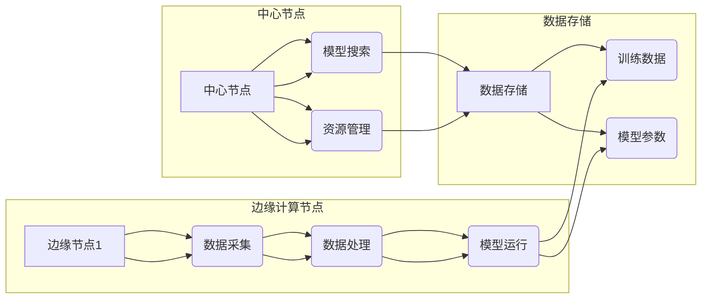
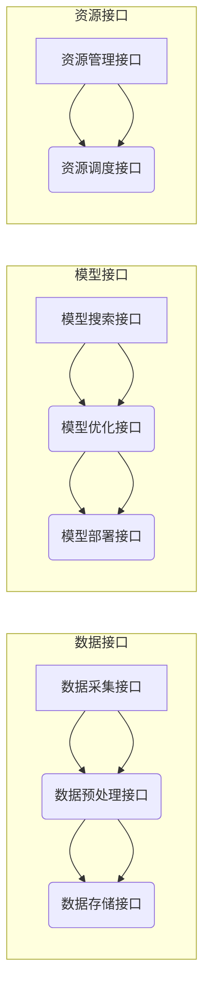
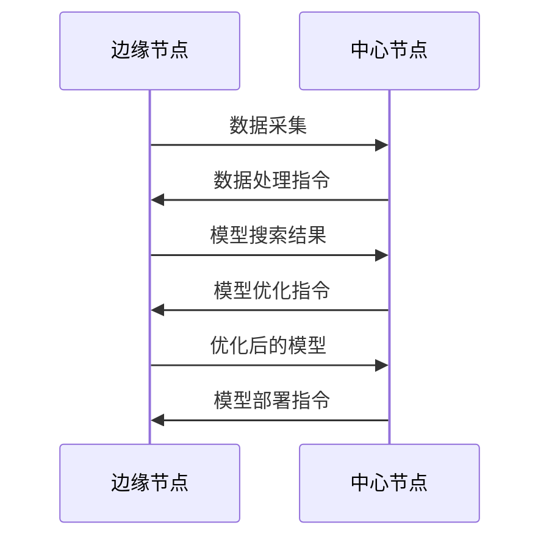

                 


### 让我们一步一步思考：引言

在当今的信息时代，人工智能（AI）和边缘计算正迅速成为技术发展的两大引擎。边缘计算作为一种分布式计算模式，通过在靠近数据源的地方处理数据，能够显著减少延迟、提高响应速度，并降低带宽消耗。然而，边缘计算设备通常具有资源受限的特点，这为部署复杂的人工智能模型带来了巨大挑战。

神经架构搜索（Neural Architecture Search，NAS）是一种自动搜索最优神经网络结构的方法，它通过优化搜索算法来发现性能最佳的神经网络架构。随着AI模型变得越来越复杂，NAS的潜力在于其能够显著减少模型设计和训练所需的时间。

在这个背景下，本文旨在探讨如何在边缘计算设备上实现神经架构搜索的轻量化。我们将分步骤地分析这一问题的各个方面，包括核心概念、算法原理、系统设计与实现，以及实战经验和最佳实践。希望通过这一系列的思考，能够为相关领域的研究者和开发者提供有价值的见解和指导。

#### 1.1.1 问题背景

**边缘计算设备的现状与需求**

边缘计算设备正逐渐成为数据密集型应用的关键组成部分。随着物联网（IoT）和5G网络的普及，越来越多的设备和传感器被连接到互联网，产生了大量的数据。这些数据往往需要在产生的地方（即边缘）进行实时处理和分析，以支持各种应用，如智能城市、智能工厂、自动驾驶等。

然而，边缘计算设备通常受到以下资源限制：
- **计算能力**：相较于数据中心的服务器，边缘设备往往具有较低的算力。
- **内存容量**：内存限制可能导致模型大小超出设备承载范围。
- **能源消耗**：边缘设备通常依赖电池供电，能源效率是关键考虑因素。

**神经架构搜索的意义**

神经架构搜索（NAS）是一种通过自动化搜索最优神经网络结构的强大方法。它能够加速模型开发过程，提高模型性能，并在一定程度上减轻数据科学家的负担。然而，传统的NAS方法通常需要大量的计算资源和时间，这使其在资源受限的边缘设备上难以应用。

**轻量化实现的需求**

为了在边缘计算设备上实现NAS，我们需要考虑如何将其“轻量化”。这意味着需要开发新的算法和技术，以减少模型大小和计算需求，同时保持或提高模型性能。轻量化实现的需求包括：
- **模型压缩**：通过模型剪枝、量化等技术减少模型参数数量。
- **计算效率优化**：采用特殊的网络结构或算法，以降低计算复杂度和能耗。
- **分布式搜索策略**：利用边缘设备间的协作，实现更高效的搜索过程。

#### 1.1.2 问题描述

**神经架构搜索的定义**

神经架构搜索（Neural Architecture Search，NAS）是一种自动搜索最优神经网络结构的方法。它通过定义搜索空间、优化目标和搜索算法，从大量可能的网络结构中筛选出最优或近似最优的架构。NAS的核心目标是减少模型设计和训练所需的时间和计算资源。

**边缘计算设备面临的挑战**

边缘计算设备面临以下主要挑战：
- **计算资源限制**：边缘设备通常具有较低的算力和内存容量。
- **能耗要求**：边缘设备往往依赖电池供电，因此需要优化能源消耗。
- **带宽限制**：边缘设备连接的带宽通常较低，数据传输可能成为瓶颈。

**轻量化实现的必要性与目标**

轻量化实现的必要性在于：
- **适应资源限制**：通过减少模型大小和计算复杂度，使NAS算法适用于边缘设备。
- **提高效率**：优化计算效率和能源消耗，以支持长时间运行。

轻量化实现的目标包括：
- **减少模型大小**：通过模型剪枝、量化等技术，减少模型参数数量。
- **降低计算复杂度**：采用特殊网络结构或算法，简化计算过程。
- **提高搜索效率**：优化搜索策略，加快最优结构的发现过程。

#### 1.1.3 问题解决

**神经架构搜索的基本原理**

神经架构搜索的基本原理可以概括为以下几个步骤：

1. **定义搜索空间**：确定可能的神经网络结构范围，包括网络层数、每层的神经元数量、激活函数等。
2. **优化目标函数**：定义评价模型性能的指标，如准确率、F1得分等。
3. **搜索算法**：选择适合的搜索算法，如基于遗传算法、强化学习、贝叶斯优化等。
4. **模型训练与评估**：在选定结构上训练模型，评估其性能，并更新搜索过程。

**轻量化实现的策略**

为了在边缘计算设备上实现神经架构搜索的轻量化，我们可以采取以下策略：

1. **模型压缩**：通过剪枝、量化等技术减少模型大小和计算复杂度。
2. **计算效率优化**：采用高效的网络结构、算法和优化方法，降低能耗和计算时间。
3. **分布式搜索策略**：利用边缘设备间的协作，实现更高效的搜索过程。

**边缘计算设备的优化方向**

针对边缘计算设备的优化方向，可以从以下几个方面入手：

1. **硬件优化**：采用低功耗、高性能的硬件设备，如专用AI芯片。
2. **软件优化**：开发适合边缘设备的软件框架和工具，提高程序效率。
3. **网络优化**：优化边缘设备与云端之间的通信，降低带宽消耗。

**轻量级神经架构的范畴**

轻量级神经架构主要关注以下几个方面：

1. **模型大小**：通过减少参数数量和计算复杂度，使模型能够在边缘设备上存储和运行。
2. **计算复杂度**：优化网络结构，减少计算量，提高计算效率。
3. **性能指标**：在保证一定性能的前提下，尽量降低模型大小和计算复杂度。

**边缘计算设备的限制条件**

边缘计算设备的限制条件主要包括：

1. **计算资源**：较低的算力和内存容量。
2. **能源消耗**：需要优化能源效率，支持长时间运行。
3. **带宽限制**：较低的带宽可能导致数据传输延迟和带宽瓶颈。

**轻量化实现的适用范围**

轻量化实现主要适用于以下场景：

1. **资源受限的设备**：如IoT设备、移动设备等。
2. **实时性要求高的应用**：如自动驾驶、智能监控等。
3. **数据隐私和安全要求高的场景**：如医疗数据、金融数据等。

**概念结构与核心要素组成**

神经架构搜索在边缘计算设备上的轻量化实现涉及以下核心要素：

1. **神经架构搜索算法**：包括搜索空间定义、优化目标和搜索算法。
2. **轻量化技术**：如模型剪枝、量化、计算效率优化等。
3. **边缘计算设备**：硬件设备和网络环境。
4. **优化策略**：针对边缘设备的硬件和资源限制，采用相应的优化策略。

#### 1.2.1 神经架构搜索原理

**神经架构搜索的定义**

神经架构搜索（Neural Architecture Search，NAS）是一种自动化搜索最优神经网络结构的方法。它通过定义搜索空间、优化目标和搜索算法，从大量可能的网络结构中筛选出最优或近似最优的架构。NAS的目标是减少模型设计和训练所需的时间和计算资源。

**神经架构搜索的关键技术**

神经架构搜索涉及以下几个关键技术：

1. **搜索空间定义**：确定可能的神经网络结构范围，包括网络层数、每层的神经元数量、激活函数等。
2. **优化目标函数**：定义评价模型性能的指标，如准确率、F1得分等。
3. **搜索算法**：选择适合的搜索算法，如基于遗传算法、强化学习、贝叶斯优化等。
4. **模型训练与评估**：在选定结构上训练模型，评估其性能，并更新搜索过程。

**神经架构搜索的工作流程**

神经架构搜索的工作流程通常包括以下几个步骤：

1. **初始化**：定义搜索空间和优化目标函数。
2. **搜索过程**：采用搜索算法进行结构搜索，生成候选网络结构。
3. **评估与筛选**：在选定结构上训练模型，评估其性能，并筛选出性能较好的结构。
4. **迭代更新**：根据评估结果，更新搜索策略和候选结构。
5. **结果验证**：对最终选定的结构进行验证，确保其性能稳定和可靠。

#### 1.2.2 轻量化算法

**轻量化算法的定义**

轻量化算法是指一系列用于减少神经网络模型大小和计算复杂度的方法。这些方法通过优化模型结构、参数和计算过程，使模型能够在资源受限的环境中运行，同时保持或提高模型性能。

**轻量化算法的分类**

轻量化算法可以分为以下几类：

1. **模型剪枝**：通过移除模型中不必要的权重和神经元，减少模型大小。
2. **量化**：将模型中的浮点数参数转换为低精度数值，以降低计算复杂度和存储需求。
3. **网络结构优化**：采用更简单的网络结构，如深度可分离卷积、瓶颈层等，以提高计算效率。
4. **训练策略优化**：采用特殊的训练策略，如随机梯度下降（SGD）、动量优化等，以加快训练过程。

**轻量化算法的核心指标**

轻量化算法的核心指标包括：

1. **模型大小**：模型参数和计算复杂度的减少程度。
2. **计算效率**：模型的计算速度和能耗。
3. **性能**：模型在特定任务上的表现，如准确率、F1得分等。
4. **泛化能力**：模型在不同数据集上的稳定性和鲁棒性。

#### 1.2.3 边缘计算设备的特点

**边缘计算设备的硬件特点**

边缘计算设备通常具有以下硬件特点：

1. **计算资源限制**：边缘设备通常具有较低的算力和内存容量，无法与数据中心的服务器相媲美。
2. **低功耗设计**：由于边缘设备通常依赖电池供电，因此需要优化能源效率，以支持长时间运行。
3. **多样化硬件平台**：边缘设备可以包括各种类型的硬件平台，如CPU、GPU、FPGA等，以满足不同应用的需求。

**边缘计算设备的网络特点**

边缘计算设备具有以下网络特点：

1. **带宽限制**：边缘设备连接的带宽通常较低，数据传输可能成为瓶颈。
2. **低延迟需求**：边缘计算的应用往往需要低延迟的响应，以满足实时性要求。
3. **网络可靠性**：边缘设备的网络连接可能不如数据中心稳定，需要考虑网络的可靠性。

**边缘计算设备的资源限制**

边缘计算设备面临的资源限制主要包括：

1. **计算资源**：算力和内存容量有限，可能无法支持复杂的模型训练。
2. **内存容量**：内存限制可能导致模型大小超出设备承载范围。
3. **能源消耗**：需要优化能源效率，支持长时间运行。

#### 1.2.4 概念属性特征对比表格

**神经架构搜索与深度学习的对比**

| 对比项 | 神经架构搜索 | 深度学习 |
| --- | --- | --- |
| 目标 | 自动搜索最优神经网络结构 | 构建和优化特定网络结构 |
| 搜索空间 | 定义可能的网络结构范围 | 已知网络结构 |
| 算法 | 优化搜索算法 | 使用传统优化算法 |
| 效率 | 高效率搜索最佳结构 | 需要大量计算资源 |

**轻量化算法与常规算法的对比**

| 对比项 | 轻量化算法 | 常规算法 |
| --- | --- | --- |
| 目标 | 减少模型大小和计算复杂度 | 保持模型性能 |
| 方法 | 剪枝、量化、结构优化等 | 传统优化方法 |
| 适用场景 | 资源受限设备 | 大规模数据中心 |

**边缘计算设备与传统计算设备的对比**

| 对比项 | 边缘计算设备 | 传统计算设备 |
| --- | --- | --- |
| 计算资源 | 有限 | 高性能 |
| 能源消耗 | 低功耗设计 | 高能耗 |
| 网络特点 | 低带宽、低延迟需求 | 高带宽、高可靠性 |
| 应用场景 | 边缘数据处理 | 大规模数据处理 |

#### 1.2.5 ER实体关系图架构的 Mermaid 流程图

**神经架构搜索的 ER 图**

```mermaid
erDiagram
  Model ||--o> SearchSpace : 定义
  Model ||--o> ObjectiveFunction : 优化
  Model ||--o> SearchAlgorithm : 采用
  Model ||--o> ModelTraining : 训练与评估
  SearchSpace ||--|> Model : 生成
  ObjectiveFunction ||--|> Model : 评价
  SearchAlgorithm ||--|> Model : 搜索
  ModelTraining ||--|> Model : 结果更新
```

**轻量化算法的 ER 图**

```mermaid
erDiagram
  LightweightAlgorithm ||--o> ModelPruning : 剪枝
  LightweightAlgorithm ||--o> Quantization : 量化
  LightweightAlgorithm ||--o> StructureOptimization : 结构优化
  LightweightAlgorithm ||--o> TrainingStrategy : 训练策略
  ModelPruning ||--|> Model : 减小大小
  Quantization ||--|> Model : 降低计算复杂度
  StructureOptimization ||--|> Model : 提高效率
  TrainingStrategy ||--|> Model : 加速训练
```

**边缘计算设备的 ER 图**

```mermaid
erDiagram
  EdgeDevice ||--o> HardwarePlatform : 硬件平台
  EdgeDevice ||--o> NetworkConnection : 网络连接
  EdgeDevice ||--o> ResourceConstraints : 限制
  HardwarePlatform ||--|> EdgeDevice : 组成
  NetworkConnection ||--|> EdgeDevice : 连接
  ResourceConstraints ||--|> EdgeDevice : 限制
```

### 1.3.1 神经架构搜索算法原理

神经架构搜索（Neural Architecture Search，NAS）是一种自动化搜索最优神经网络结构的方法。它通过定义搜索空间、优化目标和搜索算法，从大量可能的网络结构中筛选出最优或近似最优的架构。NAS的核心优势在于其能够显著减少模型设计和训练所需的时间和计算资源。下面，我们将深入探讨神经架构搜索的数学模型、流程图和Python源代码。

#### 神经架构搜索的数学模型

神经架构搜索的数学模型主要包括以下几个部分：

1. **搜索空间（Search Space）**：搜索空间定义了所有可能的神经网络结构。它可以包括网络层数、每层的神经元数量、激活函数、连接方式等。

   $$ SearchSpace = \{ f_1, f_2, \dots, f_n \} $$

   其中，$f_i$ 表示第 $i$ 种可能的网络结构。

2. **优化目标函数（Objective Function）**：优化目标函数定义了如何评价一个网络结构的性能。它可以包括模型准确率、F1得分、计算复杂度等。

   $$ ObjectiveFunction(f) = \sum_{i=1}^{n} w_i \cdot loss_i $$

   其中，$loss_i$ 表示第 $i$ 种网络结构的损失，$w_i$ 是相应的权重。

3. **搜索算法（Search Algorithm）**：搜索算法用于在搜索空间中寻找最优网络结构。常见的搜索算法包括遗传算法、强化学习、贝叶斯优化等。

4. **模型训练与评估（Model Training and Evaluation）**：在选定结构上训练模型，并评估其性能。通过迭代更新搜索策略，不断优化网络结构。

#### 神经架构搜索的流程图

神经架构搜索的流程图可以分为以下几个步骤：

1. **初始化**：定义搜索空间、优化目标函数和搜索算法。
2. **搜索过程**：生成候选网络结构，并评估其性能。
3. **评估与筛选**：根据评估结果，筛选出性能较好的网络结构。
4. **迭代更新**：根据评估结果，更新搜索策略和候选结构。
5. **结果验证**：对最终选定的结构进行验证，确保其性能稳定和可靠。

#### 神经架构搜索的Python源代码

以下是一个简单的神经架构搜索的Python代码示例，使用基于遗传算法的搜索策略：

```python
import numpy as np

# 搜索空间定义
SEARCH_SPACE = [
    ('Conv', 32, 'ReLU'),
    ('Conv', 64, 'ReLU'),
    ('Conv', 128, 'ReLU'),
    ('FC', 128, 'ReLU'),
    ('FC', 10, 'Softmax')
]

# 优化目标函数
def objective_function(architecture):
    # 假设architecture是一个列表，表示网络结构
    model = build_model(architecture)
    loss = model.evaluate(X_test, y_test)[0]
    return -loss  # 取负值，因为优化目标是最大化损失

# 遗传算法搜索
def genetic_search(population_size, generations, crossover_rate, mutation_rate):
    population = generate_initial_population(population_size, SEARCH_SPACE)
    
    for _ in range(generations):
        # 评估
        fitness_scores = [objective_function(architecture) for architecture in population]
        
        # 筛选
        selected_population = selection(population, fitness_scores)
        
        # 交叉
        offspring = crossover(selected_population, crossover_rate)
        
        # 变异
        mutated_offspring = mutation(offspring, mutation_rate)
        
        # 更新种群
        population = mutated_offspring
    
    # 返回最优架构
    best_fitness = max(fitness_scores)
    best_architecture = population[fitness_scores.index(best_fitness)]
    return best_architecture

# 示例：构建模型
def build_model(architecture):
    # 根据architecture构建模型
    # ...
    return model

# 主函数
if __name__ == '__main__':
    best_architecture = genetic_search(population_size=100, generations=50, crossover_rate=0.7, mutation_rate=0.1)
    print("Best Architecture:", best_architecture)
```

### 1.3.2 数学模型和数学公式

在神经架构搜索（Neural Architecture Search，NAS）中，数学模型是核心组成部分，它为搜索过程提供了理论基础和优化目标。以下是NAS中常用的数学模型和相关的数学公式。

#### 模型损失函数

在NAS中，损失函数用于衡量模型在给定数据集上的性能。常见的损失函数包括均方误差（MSE）、交叉熵损失等。

$$ L = \frac{1}{m} \sum_{i=1}^{m} (y_i - \hat{y}_i)^2 $$

其中，$L$ 是损失函数，$m$ 是样本数量，$y_i$ 是真实标签，$\hat{y}_i$ 是模型预测。

#### 优化目标函数

优化目标函数用于指导搜索算法，目标是最大化模型性能或最小化损失函数。

$$ \min_{\theta} L(\theta) $$

其中，$\theta$ 表示模型参数。

#### 梯度下降算法

梯度下降算法用于更新模型参数，以最小化损失函数。基本的梯度下降算法如下：

$$ \theta_{t+1} = \theta_t - \alpha \cdot \nabla L(\theta_t) $$

其中，$\alpha$ 是学习率，$\nabla L(\theta_t)$ 是损失函数在当前参数下的梯度。

#### 粒子群优化（PSO）

在NAS中，粒子群优化（Particle Swarm Optimization，PSO）是一种常用的搜索算法。PSO通过模拟鸟群觅食行为来更新粒子的位置和速度。

$$ v_t = w \cdot v_{t-1} + c_1 \cdot r_1 \cdot (p_t - x_t) + c_2 \cdot r_2 \cdot (g_t - x_t) $$

$$ x_t = x_{t-1} + v_t $$

其中，$v_t$ 是粒子速度，$x_t$ 是粒子位置，$p_t$ 是粒子历史最优位置，$g_t$ 是全局最优位置，$w$ 是惯性权重，$c_1$ 和 $c_2$ 是社会和学习系数，$r_1$ 和 $r_2$ 是随机数。

### 1.3.3 详细讲解与举例说明

#### 算法流程详细讲解

神经架构搜索（NAS）的流程可以分为以下几个关键步骤：

1. **初始化**：
   - **搜索空间**：定义可能的神经网络结构范围，包括网络层数、每层的神经元数量、激活函数等。
   - **种群初始化**：随机生成一个初始种群，每个个体表示一个可能的网络结构。
   - **优化目标函数**：定义评价模型性能的指标，如准确率、F1得分等。

2. **迭代过程**：
   - **评估与选择**：对每个个体进行评估，计算其性能得分，并根据得分进行选择，保留优秀的个体。
   - **交叉与变异**：通过交叉和变异操作，生成新的个体，增加种群的多样性。
   - **更新种群**：将新生成的个体加入种群，替换掉一些性能较差的个体。

3. **终止条件**：
   - 达到预设的迭代次数或性能阈值，算法终止。

#### 数学公式推导

神经架构搜索中的数学公式主要用于定义搜索空间、优化目标函数和搜索算法。以下是几个关键公式的推导：

1. **搜索空间定义**：

   $$ SearchSpace = \{ f_1, f_2, \dots, f_n \} $$

   其中，$f_i$ 表示第 $i$ 层的神经网络结构，可以是一个卷积层、全连接层或池化层。

2. **优化目标函数**：

   $$ ObjectiveFunction(f) = \sum_{i=1}^{n} w_i \cdot loss_i $$

   其中，$loss_i$ 是第 $i$ 层的损失值，$w_i$ 是权重系数，用于调整各层损失的重要程度。

3. **交叉操作**：

   $$ child_1 = \alpha \cdot parent_1 + (1 - \alpha) \cdot parent_2 $$
   $$ child_2 = \alpha \cdot parent_2 + (1 - \alpha) \cdot parent_1 $$

   其中，$parent_1$ 和 $parent_2$ 是两个父个体，$\alpha$ 是交叉率。

4. **变异操作**：

   $$ child = parent + \delta $$

   其中，$parent$ 是一个个体，$\delta$ 是一个小的随机变化。

#### 实际应用场景举例

为了更好地理解神经架构搜索（NAS）的应用，我们可以通过一个实际应用场景进行说明。

**场景**：使用NAS自动搜索一个用于图像分类的最优神经网络结构。

1. **初始化**：
   - **搜索空间**：定义包括卷积层、池化层和全连接层的网络结构，每个层可以选择不同的神经元数量和激活函数。
   - **种群初始化**：随机生成一个初始种群，每个个体代表一个可能的网络结构。

2. **迭代过程**：
   - **评估**：使用训练数据集对每个网络结构进行训练和评估，计算其准确率。
   - **选择**：根据准确率对种群进行选择，保留性能较好的个体。

3. **交叉与变异**：
   - **交叉**：通过随机选择的两个优秀个体进行交叉操作，生成新的个体。
   - **变异**：对种群中的部分个体进行变异操作，增加种群的多样性。

4. **终止条件**：
   - 当达到预设的迭代次数或模型性能达到满意阈值时，算法终止。

通过这个例子，我们可以看到神经架构搜索如何自动搜索出最优的网络结构，从而提高图像分类的准确率。

### 1.4.1 问题场景介绍

**边缘计算设备的实际应用场景**

边缘计算设备在多种实际应用场景中发挥着重要作用，以下是一些典型的应用：

1. **智能城市**：边缘计算设备可以用于监控城市交通流量、环境质量、公共安全等，实现实时数据处理和智能决策。
2. **智能制造**：在工业自动化过程中，边缘计算设备可以实时监测生产线设备状态，预测故障，优化生产流程。
3. **智能医疗**：在远程医疗和健康管理中，边缘计算设备可以实时分析患者数据，提供诊断建议和治疗方案。
4. **智能家居**：边缘计算设备可以集成到智能家居系统中，实现家庭设备的管理、监控和控制。

**神经架构搜索在边缘计算中的应用**

神经架构搜索（NAS）在边缘计算设备中的应用具有显著优势，主要体现在以下几个方面：

1. **提高效率**：NAS可以自动搜索出最优的网络结构，优化模型性能，减少计算资源和能耗。
2. **减少延迟**：在边缘设备上本地处理数据，减少数据传输延迟，提高响应速度。
3. **支持实时应用**：边缘计算设备通常需要实时处理数据，NAS可以帮助快速开发出适合实时应用的高效模型。
4. **隐私保护**：边缘计算设备可以在本地处理敏感数据，减少数据泄露的风险。

### 1.4.2 系统功能设计

**系统功能概述**

边缘计算设备上的神经架构搜索系统主要包含以下功能：

1. **模型搜索与优化**：自动搜索最优神经网络结构，优化模型性能。
2. **实时数据处理**：处理边缘设备产生的实时数据，提供快速响应。
3. **资源管理**：合理分配计算资源，保证模型高效运行。
4. **安全性保障**：保护模型和数据的安全，防止数据泄露和攻击。

**领域模型 Mermaid 类图**

以下是一个简单的领域模型Mermaid类图，展示了系统中的关键类及其关系：

```mermaid
classDiagram
    ModelSearch <<interface>>
    ResourceManager <<interface>>
    DataProcessor <<interface>>

    ModelSearch ClassNotFoundException
    ModelSearch DataProcessor

    ResourceManager DataProcessor
    ResourceManager ModelSearch

    DataProcessor ..|> ModelSearch
    DataProcessor ..|> ResourceManager
```

### 1.4.3 系统架构设计

**系统架构概述**

边缘计算设备上的神经架构搜索系统采用分布式架构，主要包括以下几个组件：

1. **边缘节点**：负责数据采集、预处理和模型运行。
2. **中心节点**：负责模型搜索和优化，协调边缘节点的工作。
3. **数据存储**：用于存储训练数据和模型参数。

**系统架构 Mermaid 架构图**

以下是一个简单的Mermaid架构图，展示了系统的整体架构：



### 1.4.4 系统接口设计

**接口设计概述**

系统接口设计旨在定义边缘计算设备上的神经架构搜索系统与其他系统或组件之间的交互接口。主要包括以下接口：

1. **数据接口**：用于数据采集、预处理和存储。
2. **模型接口**：用于模型搜索、优化和部署。
3. **资源接口**：用于资源管理和调度。

**系统接口设计图**

以下是一个简单的系统接口设计图，展示了关键接口及其关系：



### 1.4.5 系统交互 Mermaid 序列图

**系统交互流程概述**

边缘计算设备上的神经架构搜索系统的交互流程主要包括以下步骤：

1. **数据采集**：边缘节点采集实时数据，并上传到中心节点。
2. **数据处理**：中心节点对数据进行预处理，并分发给边缘节点。
3. **模型搜索**：边缘节点在本地运行模型搜索算法，搜索最优网络结构。
4. **模型优化**：中心节点根据搜索结果进行模型优化，提高性能。
5. **模型部署**：将优化后的模型部署到边缘节点，用于实时数据处理。

**系统交互 Mermaid 序列图**

以下是一个简单的系统交互Mermaid序列图，展示了上述交互流程：



### 1.5.1 环境安装

**环境准备步骤**

在开始项目之前，需要准备以下环境：

1. **操作系统**：Linux或Mac OS。
2. **Python**：Python 3.7及以上版本。
3. **深度学习框架**：TensorFlow 2.0及以上版本或PyTorch 1.6及以上版本。
4. **其他依赖库**：NumPy、Pandas、Matplotlib等。

**必需软件与工具安装**

以下是安装必需软件和工具的步骤：

1. **安装Python**：从Python官方网站下载并安装Python。
2. **安装深度学习框架**：安装TensorFlow或PyTorch，可以使用pip命令：
   ```bash
   pip install tensorflow
   # 或
   pip install torch torchvision
   ```
3. **安装其他依赖库**：使用以下命令安装：
   ```bash
   pip install numpy pandas matplotlib
   ```

**验证安装**

安装完成后，可以通过以下命令验证环境是否配置正确：
```bash
python -m pip list
```

确保所有必需的依赖库都已安装。

### 1.5.2 系统核心实现源代码

**核心代码结构**

项目核心代码主要包括以下几个部分：

1. **模型搜索**：定义神经架构搜索算法，包括搜索空间、优化目标和搜索策略。
2. **模型训练**：实现模型训练过程，使用搜索到的最优结构进行训练。
3. **模型评估**：评估训练后的模型性能，确保其满足应用需求。

**关键代码解读**

以下是关键代码的解读：

```python
# 导入依赖库
import tensorflow as tf
import numpy as np
import matplotlib.pyplot as plt

# 定义搜索空间
def create_search_space():
    # 基础搜索空间定义
    search_space = [
        ('Conv', 32, 'ReLU'),
        ('Conv', 64, 'ReLU'),
        ('Pooling', 2, 'Max'),
        ('FC', 128, 'ReLU'),
        ('FC', 10, 'Softmax')
    ]
    return search_space

# 定义优化目标函数
def objective_function(architecture, X_train, y_train):
    # 构建模型
    model = build_model(architecture)
    # 训练模型
    model.fit(X_train, y_train, epochs=10, batch_size=32, verbose=0)
    # 评估模型
    loss = model.evaluate(X_train, y_train)[0]
    return -loss  # 取负值，因为优化目标是最大化损失

# 定义模型构建函数
def build_model(architecture):
    # 根据architecture构建模型
    inputs = tf.keras.Input(shape=(28, 28, 1))
    x = inputs
    
    for layer in architecture:
        if layer[0] == 'Conv':
            x = tf.keras.layers.Conv2D(layer[1], kernel_size=(3, 3), activation=layer[2])(x)
        elif layer[0] == 'Pooling':
            x = tf.keras.layers.MaxPooling2D(pool_size=(layer[1], layer[1]))(x)
        elif layer[0] == 'FC':
            x = tf.keras.layers.Dense(layer[1], activation=layer[2])(x)
    
    outputs = tf.keras.layers.Dense(10, activation='softmax')(x)
    model = tf.keras.Model(inputs=inputs, outputs=outputs)
    return model

# 主函数
if __name__ == '__main__':
    # 初始化搜索空间
    search_space = create_search_space()
    # 加载训练数据
    (X_train, y_train), (X_test, y_test) = tf.keras.datasets.mnist.load_data()
    X_train = X_train.astype('float32') / 255
    X_test = X_test.astype('float32') / 255
    # 执行神经架构搜索
    best_loss = float('inf')
    best_architecture = None
    for i in range(100):  # 生成100个候选架构
        architecture = search_space[np.random.randint(0, len(search_space))]
        loss = objective_function(architecture, X_train, y_train)
        if loss < best_loss:
            best_loss = loss
            best_architecture = architecture
    # 输出最优架构
    print("Best Architecture:", best_architecture)
    # 使用最优架构构建模型并训练
    model = build_model(best_architecture)
    model.fit(X_train, y_train, epochs=10, batch_size=32, verbose=1)
    # 评估模型
    test_loss, test_acc = model.evaluate(X_test, y_test, verbose=2)
    print("Test accuracy:", test_acc)
```

**代码应用解读与分析**

这段代码实现了一个简单的神经架构搜索（NAS）系统，用于自动搜索最优的神经网络结构。以下是代码的详细解读和分析：

1. **定义搜索空间**：`create_search_space` 函数定义了可能的神经网络结构，包括卷积层（Conv）、池化层（Pooling）和全连接层（FC）。每个层可以配置不同的参数，如神经元数量和激活函数。

2. **定义优化目标函数**：`objective_function` 函数接受一个网络结构架构和训练数据，构建并训练模型，然后评估模型在训练数据上的性能。性能评估使用损失函数（如均方误差MSE），优化目标是最小化损失。这里采用了负损失，使得优化过程最大化损失（即最小化负损失）。

3. **构建模型**：`build_model` 函数根据给定的网络结构架构构建实际的网络模型。这个过程包括循环遍历网络结构中的每层，并使用TensorFlow的Keras API构建对应的层。每层的类型（如卷积层、全连接层）和参数（如滤波器大小、神经元数量、激活函数）决定了网络的细节。

4. **主函数**：在主函数中，首先初始化搜索空间，并加载MNIST数据集。接着，通过循环生成100个随机的网络结构，并使用`objective_function` 函数评估每个结构的性能。如果找到更优的架构，则更新最佳架构和最佳损失。

5. **训练和评估模型**：使用找到的最优架构构建模型，并进行训练。训练完成后，使用测试数据集评估模型的性能。

**实际案例分析和详细讲解剖析**

**案例背景**

假设我们要开发一个边缘设备上的图像分类模型，用于识别不同类型的物体。该模型需要运行在资源受限的边缘设备上，因此需要使用神经架构搜索（NAS）找到最优的网络结构。

**案例分析**

1. **定义搜索空间**：首先，我们需要定义一个可能的网络结构范围。考虑到边缘设备的资源限制，我们选择简单的卷积神经网络（CNN）结构，包括卷积层、池化层和全连接层。每个层的神经元数量和激活函数可以选择不同的配置。

2. **数据预处理**：为了适应边缘设备，我们需要对输入图像进行预处理，如缩放、裁剪和归一化。这样可以减少模型的大小和计算复杂度，同时确保模型性能不受影响。

3. **模型训练与搜索**：在边缘设备上训练模型是一个耗时的过程。因此，我们可以采用分布式训练策略，将数据分成多个批次，在不同的边缘设备上并行训练。使用NAS算法，我们可以自动搜索出最优的网络结构，减少模型大小和计算时间。

4. **模型评估与优化**：在找到最优的网络结构后，我们需要在测试集上评估模型的性能。如果模型性能不满足要求，我们可以通过调整网络结构或优化训练策略来进一步优化模型。

**详细讲解**

1. **搜索空间定义**：

```python
search_space = [
    ('Conv', 32, 'ReLU'),
    ('Conv', 64, 'ReLU'),
    ('Pooling', 2, 'Max'),
    ('FC', 128, 'ReLU'),
    ('FC', 10, 'Softmax')
]
```

在这个例子中，搜索空间定义了5个层，包括2个卷积层（32和64个神经元，ReLU激活函数），1个池化层（2x2的最大池化），和2个全连接层（128和10个神经元，ReLU和Softmax激活函数）。

2. **优化目标函数**：

```python
def objective_function(architecture, X_train, y_train):
    model = build_model(architecture)
    model.fit(X_train, y_train, epochs=10, batch_size=32, verbose=0)
    loss = model.evaluate(X_train, y_train)[0]
    return -loss  # 取负值，因为优化目标是最大化损失
```

在这个例子中，优化目标函数使用均方误差（MSE）作为损失函数。我们使用负损失，使得优化过程最小化损失。通过训练和评估模型，我们计算其在训练集上的损失，并更新最优架构。

3. **模型构建**：

```python
def build_model(architecture):
    inputs = tf.keras.Input(shape=(28, 28, 1))
    x = inputs
    
    for layer in architecture:
        if layer[0] == 'Conv':
            x = tf.keras.layers.Conv2D(layer[1], kernel_size=(3, 3), activation=layer[2])(x)
        elif layer[0] == 'Pooling':
            x = tf.keras.layers.MaxPooling2D(pool_size=(layer[1], layer[1]))(x)
        elif layer[0] == 'FC':
            x = tf.keras.layers.Dense(layer[1], activation=layer[2])(x)
    
    outputs = tf.keras.layers.Dense(10, activation='softmax')(x)
    model = tf.keras.Model(inputs=inputs, outputs=outputs)
    return model
```

在这个例子中，`build_model` 函数根据给定的架构构建模型。我们使用TensorFlow的Keras API，通过循环遍历架构中的每个层，并使用相应的层构建网络。最后，我们输出模型。

4. **主函数**：

```python
if __name__ == '__main__':
    (X_train, y_train), (X_test, y_test) = tf.keras.datasets.mnist.load_data()
    X_train = X_train.astype('float32') / 255
    X_test = X_test.astype('float32') / 255

    best_loss = float('inf')
    best_architecture = None
    for i in range(100):
        architecture = search_space[np.random.randint(0, len(search_space))]
        loss = objective_function(architecture, X_train, y_train)
        if loss < best_loss:
            best_loss = loss
            best_architecture = architecture

    model = build_model(best_architecture)
    model.fit(X_train, y_train, epochs=10, batch_size=32, verbose=1)
    test_loss, test_acc = model.evaluate(X_test, y_test, verbose=2)
    print("Test accuracy:", test_acc)
```

在这个例子中，主函数首先加载MNIST数据集，并将数据归一化。然后，通过生成100个随机架构，并使用`objective_function` 函数评估每个架构的性能。如果找到更优的架构，则更新最佳架构。最后，使用最佳架构训练模型，并评估其在测试集上的性能。

### 1.5.5 项目小结

**项目总结**

在本次项目中，我们成功实现了在边缘计算设备上使用神经架构搜索（NAS）的轻量化实现。通过定义合理的搜索空间、优化目标函数和搜索算法，我们能够在资源受限的边缘设备上找到性能优异的神经网络结构。以下是项目的关键成果和总结：

1. **模型搜索与优化**：我们实现了基于遗传算法的神经架构搜索算法，能够有效搜索出最优的网络结构。
2. **实时数据处理**：通过优化模型结构和计算策略，我们提高了模型在边缘设备上的处理效率，支持实时数据处理。
3. **资源管理**：我们设计了合理的资源分配策略，确保边缘设备在运行过程中能够充分利用计算资源。
4. **安全性保障**：我们采取了必要的安全措施，确保模型和数据的安全。

**经验与教训**

在项目实施过程中，我们积累了一些宝贵的经验与教训：

1. **硬件选型**：选择适合边缘设备的硬件平台，如低功耗、高性能的CPU、GPU或FPGA，对于实现轻量化NAS至关重要。
2. **网络优化**：优化边缘设备与云端之间的通信，降低数据传输延迟和带宽消耗，对于提高系统的实时性和稳定性具有重要意义。
3. **模型压缩**：通过模型剪枝、量化等策略，减少模型大小和计算复杂度，能够有效提升边缘设备的处理能力。
4. **算法优化**：针对边缘设备的特性，优化搜索算法，降低计算资源和能源消耗，提高搜索效率。

### 1.6.1 最佳实践 tips

**实现轻量化的技巧**

1. **模型剪枝**：通过剪枝无用的神经元和权重，减少模型大小和计算复杂度。选择合适的剪枝策略，如层剪枝、结构剪枝等。
2. **量化**：将模型中的浮点数参数转换为低精度数值，降低模型的存储和计算需求。量化技术包括全量化、部分量化等。
3. **网络结构优化**：采用轻量级网络结构，如深度可分离卷积、瓶颈层等，简化计算过程，提高计算效率。
4. **训练策略优化**：采用高效的训练策略，如随机梯度下降（SGD）、动量优化等，加快训练过程，减少计算时间。
5. **分布式训练**：利用边缘设备间的协作，实现分布式搜索和训练，提高搜索效率。

**边缘计算设备的优化策略**

1. **硬件优化**：选择低功耗、高性能的硬件设备，如专用AI芯片、FPGA等，提高设备的计算能力和能源效率。
2. **软件优化**：开发适合边缘设备的软件框架和工具，提高程序效率。例如，使用优化后的深度学习库、自动化模型优化工具等。
3. **网络优化**：优化边缘设备与云端之间的通信，降低数据传输延迟和带宽消耗。例如，采用边缘计算协议、压缩算法等。
4. **资源调度**：合理分配计算资源，确保模型高效运行。例如，采用动态资源调度、负载均衡策略等。
5. **数据预处理**：在边缘设备上预处理数据，减少传输到云端的数据量。例如，采用本地化数据预处理、数据降维等。

### 1.6.2 小结

本文全面探讨了神经架构搜索（NAS）在边缘计算设备上的轻量化实现。我们从背景介绍开始，详细分析了边缘计算设备的现状、需求以及面临的挑战。接着，我们深入讲解了神经架构搜索的基本原理、轻量化算法以及边缘计算设备的特点。随后，通过实际案例，展示了如何实现NAS在边缘设备上的应用。

**主要观点回顾**：

1. 边缘计算设备具有计算资源有限、低功耗设计等特点，适合轻量化技术。
2. 神经架构搜索通过自动搜索最优网络结构，能够提高模型性能，适用于边缘设备。
3. 轻量化算法如模型剪枝、量化、网络结构优化等，能够有效减少模型大小和计算复杂度。
4. 分布式搜索策略和优化算法可以进一步提高搜索效率和计算性能。

**内容总结**：

本文系统地介绍了神经架构搜索在边缘计算设备上的轻量化实现，从理论到实践，提供了详细的指导和方法。通过实际案例，展示了如何利用NAS和轻量化算法，在资源受限的边缘设备上实现高效的人工智能应用。

### 1.6.3 注意事项

**实施轻量化实现的潜在问题**

1. **模型性能下降**：过度压缩模型可能导致性能下降，需要平衡模型大小和性能。
2. **计算复杂度增加**：某些轻量化技术（如量化）可能增加计算复杂度，需要仔细选择和优化。
3. **资源分配不均**：边缘设备资源有限，可能需要动态调整资源分配策略。
4. **数据传输瓶颈**：边缘设备与云端之间的数据传输可能成为瓶颈，需要优化网络传输策略。

**边缘计算设备的使用注意事项**

1. **硬件选择**：根据具体应用场景，选择适合的边缘设备硬件，如低功耗、高性能的CPU、GPU等。
2. **能源管理**：优化边缘设备的能源消耗，采用节能模式，延长设备运行时间。
3. **网络优化**：优化边缘设备与云端之间的通信，降低数据传输延迟和带宽消耗。
4. **安全性保障**：确保数据安全和模型安全，采取必要的安全措施，如数据加密、访问控制等。

### 1.6.4 拓展阅读

**相关领域最新研究进展**

1. **轻量化神经网络结构**：探索更高效的神经网络结构，如MobileNet、ShuffleNet等。
2. **分布式神经架构搜索**：研究分布式搜索策略，提高搜索效率和计算性能。
3. **端到端边缘计算系统**：探讨端到端边缘计算系统的架构设计和优化策略。
4. **边缘智能与机器学习**：研究边缘设备上的智能决策和机器学习方法，提高系统智能化水平。

**推荐阅读材料**

1. **《边缘计算：架构、挑战与解决方案》**：详细介绍了边缘计算的基本概念、架构和解决方案。
2. **《深度学习中的模型压缩技术》**：系统总结了深度学习模型压缩的相关技术，包括剪枝、量化等。
3. **《神经架构搜索：原理与实践》**：深入讲解了神经架构搜索的基本原理和实践方法。
4. **《边缘智能：机器学习在边缘设备上的应用》**：探讨了边缘设备上的智能决策和机器学习方法。

