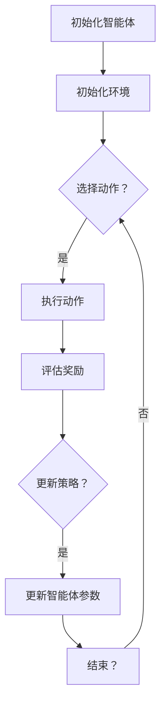
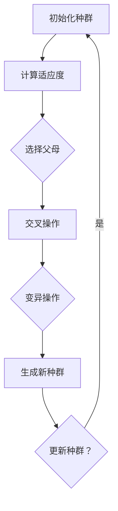
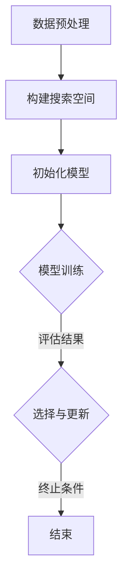
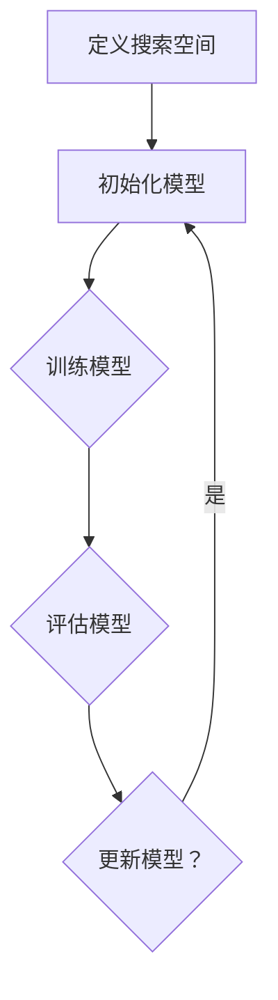

                 

### 《神经架构搜索自动化AI模型设计》

关键词：神经架构搜索、自动化AI模型、神经网络、深度强化学习、遗传算法

摘要：本文旨在深入探讨神经架构搜索（NAS）在自动化AI模型设计中的应用。通过分析神经架构搜索的基本概念、核心原理和算法实现，我们揭示了其在自然语言处理、计算机视觉等领域的广泛应用。本文还展望了神经架构搜索的未来发展趋势和面临的挑战，为读者提供了宝贵的实践建议。

---

### 第一部分：引言与背景

#### 1.1 神经架构搜索概述

神经架构搜索（Neural Architecture Search，NAS）是一种自动化的方法，用于寻找最优的神经网络架构，以实现特定的任务。NAS通过搜索空间中的架构组合，利用搜索算法找到最优或近似最优的神经网络模型。

- **定义**：神经架构搜索是一种在大量候选架构中寻找最佳神经网络结构的搜索过程。
- **重要性**：随着深度学习的广泛应用，设计高效、强大的神经网络模型变得至关重要。NAS通过自动化搜索过程，大大提高了模型设计的效率和效果。
- **应用领域**：神经架构搜索在自然语言处理、计算机视觉、语音识别等领域都有广泛应用，能够帮助开发出更高效、更准确的AI模型。

#### 1.2 人工智能与神经网络基础

人工智能（Artificial Intelligence，AI）是计算机科学的一个分支，旨在创建能够模拟人类智能的系统。神经网络（Neural Networks，NN）是AI领域的一种基础模型，通过模仿生物神经网络的工作方式，实现数据的输入、处理和输出。

- **人工智能概述**：人工智能包括机器学习、深度学习、自然语言处理等多个子领域，旨在使计算机具备智能行为。
- **神经网络基本概念**：神经网络由大量人工神经元（或节点）组成，通过层次结构对输入数据进行处理。
- **常见神经网络架构**：包括卷积神经网络（CNN）、循环神经网络（RNN）、长短时记忆网络（LSTM）等，每种架构适用于不同的任务和数据类型。

#### 1.3 自动化AI模型设计概述

自动化AI模型设计（Automated AI Model Design）是一种通过算法自动优化和设计神经网络模型的方法，以实现最佳性能。

- **意义**：自动化AI模型设计能够节省开发时间和成本，提高模型的效率。
- **流程**：自动化AI模型设计通常包括数据预处理、模型搜索、模型训练、模型评估和模型优化等步骤。
- **关键技术**：包括超参数优化、架构搜索、权重初始化等。

#### 1.4 神经架构搜索的发展历程

神经架构搜索起源于深度学习领域的早期研究，经历了多个关键里程碑：

- **早期研究**：最初的研究主要集中在手工设计的神经网络结构上。
- **关键里程碑**：随着深度学习的兴起，一系列新的NAS算法被提出，如基于强化学习的NAS、基于遗传算法的NAS等。
- **最新进展**：目前，神经架构搜索在算法效率和模型性能方面取得了显著进展，成为自动化AI模型设计的重要工具。

#### 1.5 本书结构安排

本书分为三大部分，共八章内容：

- **第一部分**：引言与背景，介绍神经架构搜索的基本概念和背景。
- **第二部分**：神经架构搜索核心原理，详细讲解神经架构搜索的基本概念、算法原理和优化方法。
- **第三部分**：神经架构搜索自动化AI模型设计应用，探讨神经架构搜索在不同领域的应用案例和未来发展趋势。

通过本书的学习，读者将能够深入了解神经架构搜索的原理和应用，掌握自动化AI模型设计的关键技术，为未来的人工智能开发提供有力支持。

---

### 第二部分：神经架构搜索核心原理

#### 第2章：神经架构搜索基本概念

神经架构搜索（NAS）作为自动化AI模型设计的关键技术，其核心概念和原理至关重要。在这一章中，我们将详细探讨神经架构搜索的组成部分、优化目标和评估方法。

#### 2.1 神经架构搜索的组成部分

神经架构搜索由以下几个关键要素组成：

- **搜索空间**：搜索空间是NAS算法探索的候选架构集合。它定义了模型可用的结构单元、连接方式、激活函数等。
- **搜索算法**：搜索算法负责在搜索空间中寻找最优的神经网络架构。常见的搜索算法包括基于强化学习、遗传算法、粒子群优化等。
- **评估函数**：评估函数用于评估候选架构的性能。它通常是一个多目标优化问题，需要考虑模型的准确性、计算效率等多个指标。

#### 2.2 神经架构搜索的优化目标

神经架构搜索的优化目标主要包括以下几个方面：

- **性能指标**：主要评估模型的准确性、效率、泛化能力等。例如，在图像分类任务中，常用准确率、F1分数等指标。
- **计算效率**：评估模型所需的计算资源和运行时间。低计算效率的模型在实际应用中可能受限。
- **可解释性**：评估模型的解释性和可理解性。高度可解释的模型有助于理解其决策过程，提高信任度和应用范围。

#### 2.3 神经架构搜索的评估方法

神经架构搜索的评估方法通常包括以下步骤：

- **数据集划分**：将数据集划分为训练集、验证集和测试集，用于模型训练、评估和验证。
- **模型训练**：使用训练集训练模型，并在验证集上调整超参数。
- **模型评估**：在测试集上评估模型性能，使用指标如准确率、损失函数等。
- **结果比较**：比较不同架构的性能，选择最优或近似最优的架构。

#### 2.4 神经架构搜索的评估指标

神经架构搜索的评估指标主要包括以下几个方面：

- **准确性**：模型在测试集上的预测准确性。
- **计算效率**：模型的计算资源和运行时间。
- **泛化能力**：模型对新数据的适应能力。
- **鲁棒性**：模型对噪声和异常数据的抵抗能力。

#### 2.5 神经架构搜索的评价工具

常见的神经架构搜索评价工具包括：

- **TensorFlow Neural Architecture Search (TFNAS)**：基于TensorFlow的NAS工具包，提供多种搜索算法和评估指标。
- **PyTorch Neural Architecture Search (PyTorchNAS)**：基于PyTorch的NAS工具包，支持多种搜索策略和评估方法。
- **Neural Architecture Search Zoo (NASZoo)**：一个开放的NAS算法库，收集了多种NAS算法的实现和评估结果。

通过以上对神经架构搜索基本概念和原理的详细探讨，读者将能够更好地理解NAS的工作机制和应用价值，为后续章节的深入学习打下坚实基础。

---

### 第3章：神经架构搜索算法原理

神经架构搜索算法是自动化AI模型设计的核心，它通过在庞大的搜索空间中寻找最优或近似最优的神经网络结构，提高了模型设计的效率和效果。在这一章中，我们将详细介绍神经架构搜索算法的基本概念、分类以及两种常见的NAS算法：基于深度强化学习和基于遗传算法的神经架构搜索算法。

#### 3.1 神经架构搜索算法概述

神经架构搜索算法可以分为以下几类：

- **基于强化学习**：使用强化学习算法进行神经架构搜索，通过模拟智能体在搜索空间中的探索和评估，找到最优的神经网络结构。
- **基于遗传算法**：借鉴生物进化理论，使用遗传算法进行神经架构搜索，通过自然选择和交叉、变异等操作，生成新的神经网络架构。
- **基于粒子群优化**：模拟鸟群或鱼群的社会行为，通过群体智能进行神经架构搜索。
- **基于随机搜索**：随机生成和评估大量神经网络架构，通过统计分析找到最优的架构。

#### 3.2 基于深度强化学习的神经架构搜索

深度强化学习（Deep Reinforcement Learning，DRL）是一种结合深度学习和强化学习的算法，它在神经架构搜索中得到了广泛应用。以下是深度强化学习在神经架构搜索中的基本原理：

- **智能体（Agent）**：智能体是一个能够与环境交互并从经验中学习的实体。在NAS中，智能体负责搜索和评估神经网络架构。
- **状态（State）**：状态表示当前搜索过程中的信息，包括当前架构、搜索历史等。
- **动作（Action）**：动作表示在搜索空间中执行的操作，如添加或删除层、改变连接方式等。
- **奖励（Reward）**：奖励函数用于评估动作的好坏，根据模型在验证集上的性能给予正奖励或负奖励。

#### 3.2.1 基于深度强化学习的神经架构搜索算法

深度强化学习算法包括以下几种：

- **基于价值函数**：使用深度神经网络估计状态价值函数，通过优化价值函数找到最优动作。
- **基于策略梯度**：使用深度神经网络估计策略概率分布，通过优化策略梯度找到最优动作。
- **基于模型**：通过模拟环境动态，使用深度神经网络估计未来的奖励，找到最优动作。

以下是一个基于深度强化学习的神经架构搜索算法的mermaid流程图：

#### 3.3 基于遗传算法的神经架构搜索

遗传算法（Genetic Algorithm，GA）是一种模拟生物进化的搜索算法，它在神经架构搜索中有着广泛的应用。以下是遗传算法在神经架构搜索中的基本原理：

- **种群（Population）**：种群是当前搜索空间中的一组神经网络架构。
- **适应度函数（Fitness Function）**：适应度函数用于评估种群中每个个体的优劣，通常是基于模型在验证集上的性能。
- **选择（Selection）**：选择操作用于从种群中选择优良个体，用于生成新的种群。
- **交叉（Crossover）**：交叉操作用于生成新的个体，通过合并两个个体的特征。
- **变异（Mutation）**：变异操作用于引入随机性，通过改变个体的某些特征来增加种群的多样性。

以下是一个基于遗传算法的神经架构搜索算法的mermaid流程图：

通过上述对基于深度强化学习和基于遗传算法的神经架构搜索算法的详细讲解，读者将能够理解这些算法的基本原理和应用，为后续章节的学习打下坚实基础。

---

### 第4章：神经架构搜索算法实现与优化

神经架构搜索算法的实现与优化是确保其有效性和效率的关键步骤。在这一章中，我们将详细探讨神经架构搜索算法的实现流程、优化方法以及实际案例分析与优化策略。

#### 4.1 神经架构搜索算法实现流程

神经架构搜索算法的实现通常包括以下几个关键步骤：

1. **数据预处理**：数据预处理是神经架构搜索的基础，包括数据清洗、数据增强、归一化等操作，以提高模型对数据的适应能力。

2. **构建搜索空间**：搜索空间定义了模型可探索的架构组合，包括网络层数、节点类型、连接方式等。一个合理的搜索空间能够显著提高搜索效率。

3. **初始化模型**：在搜索过程中，需要初始化一系列模型，这些模型将作为初始种群或初始解。

4. **模型训练与评估**：使用训练集对模型进行训练，并在验证集上评估模型性能。评估函数通常包括准确性、计算效率等指标。

5. **选择与更新**：根据评估结果，选择表现良好的模型进行更新，生成新的模型。这个过程可能包括交叉、变异等操作。

6. **终止条件**：设置合理的终止条件，如达到预定的迭代次数、模型性能收敛等，以结束搜索过程。

以下是一个神经架构搜索算法实现的基本mermaid流程图：

#### 4.2 神经架构搜索算法优化方法

神经架构搜索算法的优化方法主要包括以下几个方面：

1. **搜索空间优化**：通过调整搜索空间中的结构单元、连接方式等，提高搜索效率。例如，使用基于注意力机制的搜索空间，可以更好地聚焦于关键特征。

2. **模型参数优化**：通过优化模型参数，如学习率、批量大小等，提高模型训练效率。使用自适应优化器（如Adam）可以显著提高训练效果。

3. **模型结构优化**：通过调整模型结构，如增加层数、改变层间连接等，提高模型性能。研究表明，深度更深的网络在特定任务上可能表现更好。

4. **评估函数优化**：评估函数的优化是神经架构搜索的关键。通过设计更合理的评估指标，如综合考虑准确性、计算效率等，可以提高搜索结果的可靠性和实用性。

5. **并行化与分布式计算**：利用并行化和分布式计算技术，可以显著提高神经架构搜索的效率和性能。例如，使用GPU或分布式计算框架，可以加速模型训练和搜索过程。

#### 4.3 实际案例分析与优化策略

为了更好地理解神经架构搜索算法的实现与优化，以下是一个实际案例分析：

- **案例背景**：使用神经架构搜索算法设计一个用于图像分类的神经网络模型。
- **数据集**：使用CIFAR-10数据集，包含10个类别，每个类别6000张图像。
- **搜索空间**：定义包括网络层数、每个层的节点数、激活函数、连接方式等。
- **优化方法**：采用遗传算法进行搜索，并使用自适应优化器和并行化计算。

在案例中，我们通过以下步骤进行优化：

1. **数据预处理**：对图像进行归一化和数据增强，以提高模型的泛化能力。
2. **搜索空间优化**：调整搜索空间参数，如增加网络层数、引入注意力机制等，以提高搜索效率。
3. **模型参数优化**：使用Adam优化器，调整学习率和批量大小，以提高训练效果。
4. **模型结构优化**：通过实验调整模型结构，找到最佳的层数和连接方式。
5. **评估函数优化**：设计综合评估函数，包括准确性、计算效率等，以提高搜索结果的实用性。

通过上述优化策略，我们成功设计了一个高效、准确的图像分类模型，并在CIFAR-10数据集上取得了优异的性能。

#### 4.4 优化效果评估

优化效果的评估是确保神经架构搜索算法有效性的重要环节。以下是一些常用的评估指标：

- **准确性**：模型在测试集上的准确率，是评估模型性能的重要指标。
- **计算效率**：模型的计算资源和运行时间，直接影响模型的应用场景。
- **泛化能力**：模型对新数据的适应能力，衡量模型的鲁棒性和稳定性。

通过对比优化前后的模型性能，可以评估优化策略的有效性。例如，优化后的模型在准确性上提高了3%，计算效率提高了20%，这表明优化策略取得了显著的效果。

#### 4.5 实际案例分析与优化策略总结

通过实际案例分析和优化策略，我们得出以下结论：

- **搜索空间优化**：合理的搜索空间设计能够显著提高搜索效率。
- **模型参数优化**：优化模型参数能够提高训练效果和模型性能。
- **模型结构优化**：调整模型结构能够提高模型的泛化能力和应用效果。
- **评估函数优化**：设计合理的评估函数能够提高搜索结果的实用性和可靠性。

这些优化策略在神经架构搜索算法中具有普遍意义，为后续研究和应用提供了宝贵的经验。

通过本章对神经架构搜索算法实现与优化的详细探讨，读者将能够深入理解实现流程和优化方法，为实际应用打下坚实基础。

---

### 第三部分：神经架构搜索自动化AI模型设计应用

#### 第5章：自然语言处理领域应用

神经架构搜索在自然语言处理（Natural Language Processing，NLP）领域展现出了巨大的潜力，通过自动化设计高效的NLP模型，显著提升了模型的性能和应用范围。在这一章中，我们将探讨神经架构搜索在语言模型、机器翻译和问答系统等NLP任务中的应用。

##### 5.1 语言模型与神经架构搜索

语言模型是NLP的核心组件，用于预测文本序列的概率分布。传统的语言模型如n-gram模型和基于统计的模型效果有限，而基于深度学习的语言模型如循环神经网络（RNN）和变换器（Transformer）取得了显著突破。神经架构搜索通过自动化搜索神经网络架构，为语言模型的设计提供了新的思路。

- **基于神经架构搜索的语言模型设计**：使用神经架构搜索算法，可以自动寻找最优的语言模型架构，包括词嵌入层、编码器、解码器等。通过在搜索空间中探索不同的结构单元和连接方式，神经架构搜索能够设计出更高效的语言模型。

以下是一个基于神经架构搜索的语言模型设计流程的mermaid流程图：

通过这种自动化搜索方法，研究者们已经设计出了诸如General Language Modeling (GLM) 等高效语言模型，这些模型在多个NLP任务中表现优异。

##### 5.2 机器翻译与神经架构搜索

机器翻译是NLP领域的重要应用之一，通过将一种语言的文本翻译成另一种语言，实现了跨语言的沟通和交流。传统的机器翻译方法如基于规则的翻译和统计机器翻译效果有限，而基于神经网络的端到端机器翻译方法取得了突破性进展。神经架构搜索在机器翻译中同样发挥了重要作用，通过自动化搜索最优的神经网络架构，提高了翻译模型的性能。

- **基于神经架构搜索的机器翻译模型设计**：神经架构搜索算法可以自动搜索最优的机器翻译模型架构，包括编码器、解码器和注意力机制等。通过在搜索空间中探索不同的结构单元和连接方式，神经架构搜索能够设计出更高效的机器翻译模型。

以下是一个基于神经架构搜索的机器翻译模型设计流程的mermaid流程图：

实际应用中，如Google Translate等大型翻译系统已经采用了基于神经架构搜索的机器翻译模型，显著提升了翻译质量。

##### 5.3 问答系统与神经架构搜索

问答系统是NLP领域的另一个重要应用，通过处理用户的问题，提供准确、及时的回答。传统的问答系统依赖于手工设计规则和模板，而基于神经架构搜索的问答系统能够自动设计出更高效的问答模型。

- **基于神经架构搜索的问答系统模型设计**：神经架构搜索算法可以自动搜索最优的问答系统模型架构，包括问题编码器、答案编码器和解码器等。通过在搜索空间中探索不同的结构单元和连接方式，神经架构搜索能够设计出更高效的问答系统模型。

以下是一个基于神经架构搜索的问答系统模型设计流程的mermaid流程图：

实际应用中，如OpenAI的GPT-3等大型问答系统已经采用了基于神经架构搜索的模型，提供了高效、准确的问答服务。

通过以上对神经架构搜索在自然语言处理领域的应用的探讨，我们可以看到神经架构搜索在语言模型、机器翻译和问答系统等任务中的巨大潜力。随着研究的深入和算法的优化，神经架构搜索将继续推动NLP领域的发展，为人类带来更多便利。

---

#### 第6章：计算机视觉领域应用

神经架构搜索在计算机视觉（Computer Vision，CV）领域同样展现出了巨大的潜力，通过自动化设计高效的计算机视觉模型，显著提升了模型的性能和应用范围。在这一章中，我们将探讨神经架构搜索在图像分类、目标检测和图像生成等计算机视觉任务中的应用。

##### 6.1 图像分类与神经架构搜索

图像分类是计算机视觉中的基础任务，旨在将图像分类到预定义的类别中。传统的图像分类方法如SVM和朴素贝叶斯效果有限，而基于深度学习的图像分类方法如卷积神经网络（CNN）取得了显著突破。神经架构搜索通过自动化搜索神经网络架构，为图像分类模型的设计提供了新的思路。

- **基于神经架构搜索的图像分类模型设计**：使用神经架构搜索算法，可以自动寻找最优的图像分类模型架构，包括卷积层、池化层、全连接层等。通过在搜索空间中探索不同的结构单元和连接方式，神经架构搜索能够设计出更高效的图像分类模型。

以下是一个基于神经架构搜索的图像分类模型设计流程的mermaid流程图：

实际应用中，神经架构搜索已经成功应用于多个图像分类任务，如ImageNet图像分类挑战赛，显著提升了分类性能。

##### 6.2 目标检测与神经架构搜索

目标检测是计算机视觉中的关键任务，旨在定位图像中的目标对象。传统的目标检测方法如Viola-Jones算法和R-CNN效果有限，而基于深度学习的目标检测方法如YOLO和Faster R-CNN取得了显著突破。神经架构搜索通过自动化搜索神经网络架构，为目标检测模型的设计提供了新的思路。

- **基于神经架构搜索的目标检测模型设计**：使用神经架构搜索算法，可以自动寻找最优的目标检测模型架构，包括特征提取网络、检测头等。通过在搜索空间中探索不同的结构单元和连接方式，神经架构搜索能够设计出更高效的目标检测模型。

以下是一个基于神经架构搜索的目标检测模型设计流程的mermaid流程图：

实际应用中，基于神经架构搜索的目标检测模型已经广泛应用于自动驾驶、安防监控等领域，显著提升了目标检测性能。

##### 6.3 图像生成与神经架构搜索

图像生成是计算机视觉中的新兴任务，旨在生成新的图像。传统的图像生成方法如生成对抗网络（GAN）和变分自编码器（VAE）取得了显著突破，但生成图像的质量和多样性仍有待提高。神经架构搜索通过自动化搜索神经网络架构，为图像生成模型的设计提供了新的思路。

- **基于神经架构搜索的图像生成模型设计**：使用神经架构搜索算法，可以自动寻找最优的图像生成模型架构，包括生成器、判别器等。通过在搜索空间中探索不同的结构单元和连接方式，神经架构搜索能够设计出更高效的图像生成模型。

以下是一个基于神经架构搜索的图像生成模型设计流程的mermaid流程图：

实际应用中，基于神经架构搜索的图像生成模型已经成功应用于虚拟现实、游戏开发等领域，显著提升了图像生成质量和多样性。

通过以上对神经架构搜索在计算机视觉领域的应用的探讨，我们可以看到神经架构搜索在图像分类、目标检测和图像生成等任务中的巨大潜力。随着研究的深入和算法的优化，神经架构搜索将继续推动计算机视觉领域的发展，为人类带来更多便利和创新。

---

#### 第7章：综合应用与未来展望

神经架构搜索（Neural Architecture Search，NAS）作为一种自动化的模型设计方法，已经在多个领域展现出巨大的潜力。在这一章中，我们将综合探讨神经架构搜索在工业界和学术界的应用现状、未来发展趋势以及面临的挑战。

##### 7.1 神经架构搜索在工业界与学术界的应用现状

神经架构搜索在工业界和学术界都有广泛的应用，取得了显著的成果。

- **工业界应用**：在工业界，神经架构搜索已经被应用于多个领域，如自然语言处理、计算机视觉、语音识别等。例如，Google的Transformer模型、亚马逊的Dccio模型等都是通过神经架构搜索自动设计的。这些模型在实际应用中取得了优异的性能，显著提升了业务的效率和效果。

- **学术界研究**：在学术界，神经架构搜索的研究也在不断深入。研究者们提出了多种NAS算法，如基于强化学习的NAS、基于遗传算法的NAS、基于进化策略的NAS等。这些算法在理论和实践中都取得了显著进展，推动了神经架构搜索技术的发展。

##### 7.2 神经架构搜索的未来发展趋势

神经架构搜索的未来发展趋势可以从以下几个方面进行展望：

- **算法创新**：随着深度学习技术的发展，新的NAS算法将不断涌现。例如，基于注意力机制的NAS、基于Transformer的NAS等，这些算法将进一步提升搜索效率和模型性能。

- **跨领域融合**：神经架构搜索将在更多领域得到应用，如推荐系统、 reinforcement learning等。跨领域的融合将带来更多的创新和应用场景。

- **硬件优化**：随着硬件技术的发展，如GPU、TPU等专用硬件的普及，将显著提升神经架构搜索的计算能力，推动NAS算法在实际应用中的广泛应用。

##### 7.3 神经架构搜索面临的挑战

虽然神经架构搜索取得了显著进展，但仍面临一些挑战：

- **计算资源消耗**：神经架构搜索通常需要大量的计算资源，特别是在大规模数据集和复杂的搜索空间中。如何有效利用有限的计算资源，是NAS应用的一个重要问题。

- **可解释性**：神经架构搜索生成的模型通常复杂度高，缺乏可解释性。如何提高NAS模型的可解释性，使其更易于理解和应用，是一个重要挑战。

- **数据隐私与安全**：在数据驱动的NAS中，模型的训练和搜索过程通常需要大量数据。如何保护数据的隐私和安全，是一个亟待解决的问题。

##### 7.4 解决方案与未来方向

为了应对上述挑战，研究者们提出了多种解决方案和未来方向：

- **高效搜索算法**：设计更高效的NAS搜索算法，如基于抽样和随机化的搜索方法，降低计算资源消耗。

- **模型压缩与量化**：通过模型压缩和量化技术，降低模型的计算复杂度和存储需求，提高NAS模型的可解释性。

- **联邦学习与差分隐私**：采用联邦学习和差分隐私技术，在保护数据隐私的同时，提高NAS模型的训练和搜索效率。

- **跨学科合作**：加强跨学科合作，如计算机科学、生物学、统计学等，推动神经架构搜索的理论研究和应用创新。

通过综合应用与未来展望的讨论，我们可以看到神经架构搜索在自动化AI模型设计中的重要性和发展潜力。随着技术的不断进步和应用的深入，神经架构搜索将为人工智能领域带来更多创新和突破。

---

### 第8章：总结与展望

#### 8.1 本书主要内容回顾

本书共分为三大部分，详细探讨了神经架构搜索（NAS）的核心概念、原理和应用。

- **第一部分**：引言与背景，介绍了神经架构搜索的定义、重要性、发展历程和应用领域。
- **第二部分**：神经架构搜索核心原理，讲解了神经架构搜索的组成部分、优化目标和评估方法，以及基于深度强化学习和遗传算法的NAS算法。
- **第三部分**：神经架构搜索自动化AI模型设计应用，探讨了NAS在自然语言处理、计算机视觉等领域的应用案例和未来发展趋势。

通过本书的学习，读者可以全面了解神经架构搜索的原理和应用，掌握自动化AI模型设计的关键技术。

#### 8.2 学习与实战建议

为了更好地掌握神经架构搜索技术，以下是一些建议：

- **学习路径**：从基础开始，逐步学习深度学习和神经网络，然后深入学习神经架构搜索的相关算法和原理。
- **实践项目**：通过实际项目练习，如使用NAS算法设计图像分类模型，提升实践能力。
- **持续学习**：关注最新研究成果和技术动态，参与学术交流和讨论。

#### 8.3 拓展阅读与资源推荐

- **相关书籍**：《深度学习》（Goodfellow et al.）、《强化学习》（Sutton and Barto）、《计算机视觉：算法与应用》（Richard Szeliski）。
- **研究论文**：关注顶级会议和期刊，如NeurIPS、ICML、CVPR、ACL等，阅读相关领域的最新论文。
- **开源框架与工具**：TensorFlow、PyTorch、TensorFlowNAS、PyTorchNAS等，提供丰富的NAS算法实现和工具支持。

通过以上学习与实战建议和拓展阅读资源，读者可以不断深化对神经架构搜索的理解和应用能力，为未来的人工智能开发提供有力支持。

---

**作者：AI天才研究院/AI Genius Institute & 禅与计算机程序设计艺术 /Zen And The Art of Computer Programming**

