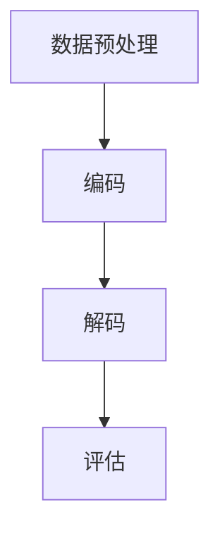
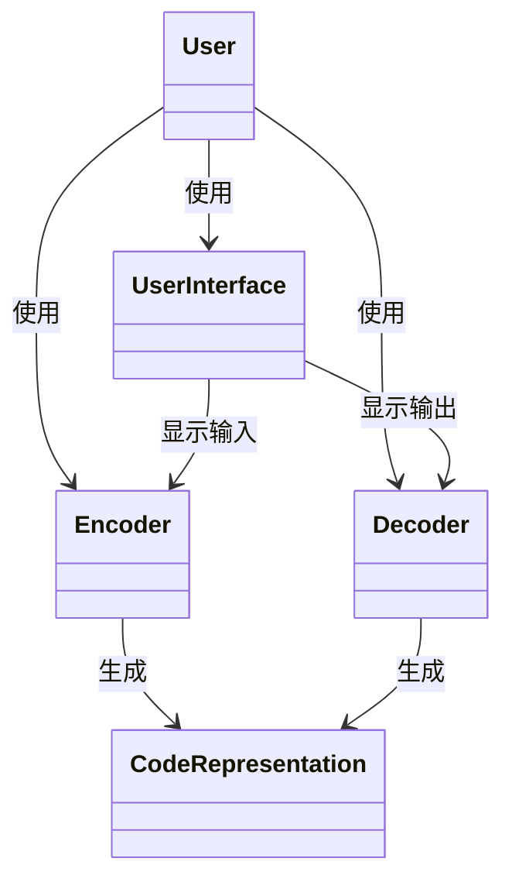
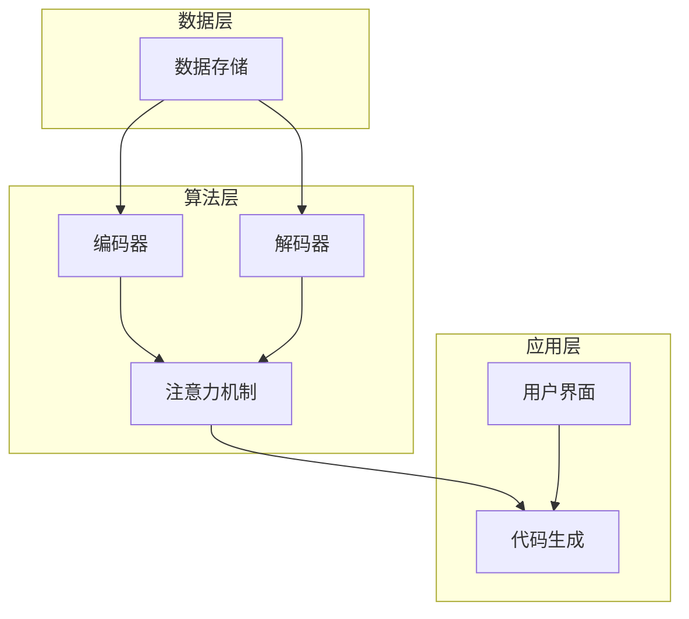
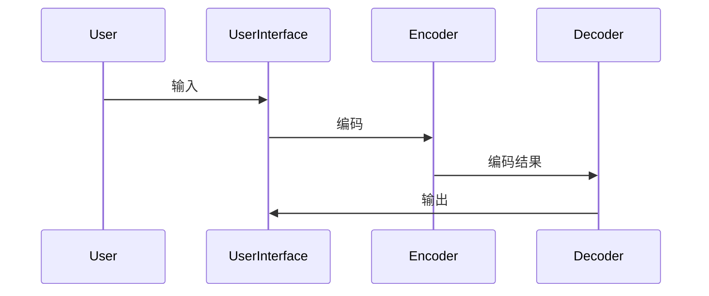

                 

# 神经程序合成：AI自动化编程的新范式

## 关键词

- 神经程序合成
- 深度学习
- 编程自动化
- 编码器-解码器结构
- 注意力机制
- 编码表示
- 代码生成算法

## 摘要

随着人工智能技术的不断进步，编程自动化成为了软件开发领域的一大热点。神经程序合成（Neural Program Synthesis，NPS）作为编程自动化的一种新范式，利用深度学习技术实现代码的自动化生成。本文将详细探讨神经程序合成的背景、核心概念、算法原理以及应用实践，旨在为读者提供一个全面而深入的视角，了解这一前沿技术。

## 第一部分：背景介绍

### 1.1 问题背景

随着软件需求的日益复杂，传统的编程模式逐渐暴露出效率低下、人工干预过多的缺陷。程序员面对着越来越庞大的代码库和不断变化的需求，传统的编程方式已经无法满足现代软件开发的快速迭代和高效交付。此外，代码质量、可维护性和可扩展性也成为了软件开发过程中亟待解决的问题。因此，如何实现编程自动化，提高编程效率和代码质量，成为了人工智能领域的重要研究方向。

### 1.2 问题描述

神经程序合成的核心问题是如何设计一个有效的算法，使其能够从输入数据中自动生成高质量的程序代码。这一过程中涉及多个挑战，包括代码生成模型的选择、代码质量和可解释性、训练效率和模型泛化能力等。如何构建一个既能生成高质量代码，又具有良好可解释性和高效训练性能的模型，是神经程序合成需要解决的主要问题。

### 1.3 问题解决

神经程序合成通过将程序编码视为一种序列生成任务，利用递归神经网络（RNN）、变换器（Transformer）等深度学习模型，通过大规模数据训练生成代码。这一方法突破了传统编程模式，实现了代码的自动化生成。具体来说，神经程序合成包括以下几个关键步骤：

1. **编码表示**：将程序代码转化为一种适合模型处理的序列表示方法。
2. **深度学习模型**：设计并训练一个能够自动生成代码的深度学习模型。
3. **代码生成**：利用训练好的模型生成目标程序代码。

### 1.4 边界与外延

神经程序合成的研究和应用领域广泛，包括但不限于自动化代码生成、自然语言处理、数据科学等。然而，其研究边界也受到现有技术水平的限制，如代码生成质量、模型解释性、以及在不同应用场景下的泛化能力。因此，如何进一步提升神经程序合成的性能和实用性，是未来研究的重要方向。

### 1.5 概念结构与核心要素组成

神经程序合成包括以下几个核心概念和要素：

1. **深度学习模型**：用于编码程序逻辑和数据处理的神经网络结构。
2. **代码表示**：将程序代码转化为一种适合模型处理的序列表示方法。
3. **训练数据集**：包含各种程序代码的集合，用于训练代码生成模型。
4. **代码生成算法**：基于深度学习模型，生成目标程序代码的算法。

### 1.6 核心概念原理

#### 1.6.1 深度学习模型原理

深度学习模型通过多层神经网络结构，自动学习数据特征，实现复杂任务的自动化。其核心原理包括前向传播、反向传播和权重更新。具体来说：

- **前向传播**：输入数据通过神经网络的各个层次，最终输出结果。
- **反向传播**：根据输出结果与预期结果的差异，反向更新网络权重。
- **权重更新**：通过梯度下降等优化算法，调整网络权重，以减小误差。

#### 1.6.2 代码生成模型原理

代码生成模型通过编码器-解码器结构，将输入数据编码为序列，再解码生成目标代码。其核心原理包括注意力机制、编码器和解码器的交互。具体来说：

- **编码器**：将输入代码序列编码为一个固定长度的向量表示。
- **解码器**：将编码后的向量序列解码为输出代码序列。
- **注意力机制**：解码器在生成每个步骤的输出时，根据当前步骤的输入和编码后的输入序列，计算注意力权重，对编码后的输入序列进行加权平均。

### 1.7 概念属性特征对比表格

| 特征               | 深度学习模型                   | 代码生成模型                     |
|--------------------|-------------------------------|---------------------------------|
| 目标               | 数据特征学习与任务执行         | 代码序列生成                     |
| 结构               | 多层神经网络结构               | 编码器-解码器结构                 |
| 输入               | 数据输入                       | 程序代码输入                     |
| 输出               | 任务结果输出                   | 代码序列输出                     |
| 数据处理能力       | 强                             | 较强，依赖于数据表示方法          |
| 可解释性           | 弱                             | 较强，可通过代码结构进行解释      |

### 1.8 ER实体关系图架构

```mermaid
erDiagram
  用户 ||--o{ 代码生成模型 } : 使用
  代码生成模型 ||--|{ 数据集 } : 训练
  数据集 ||--|{ 样本 } : 包含
  用户 ||--o{ 代码质量评估 } : 评估
```

### 1.9 本章小结

本章从问题背景、核心概念、原理介绍等方面，对神经程序合成进行了全面阐述。后续章节将进一步深入探讨神经程序合成的算法原理、数学模型、系统架构以及项目实战等内容。

----------------------------------------------------------------

# 第二部分：神经程序合成算法原理

## 2.1 算法原理

神经程序合成通过深度学习模型，将程序代码转化为序列，从而实现代码的自动生成。其核心算法包括编码器-解码器结构、注意力机制、生成模型等。

### 2.1.1 编码器-解码器结构

编码器-解码器结构是神经程序合成的核心框架，其基本原理是将输入数据编码为一个固定长度的向量表示，然后解码为输出数据。在代码生成任务中，编码器负责将输入代码序列编码为一个固定长度的向量，解码器则根据这个向量序列生成输出代码序列。

#### 编码器

编码器通常采用循环神经网络（RNN）或变换器（Transformer）结构。RNN具有良好的序列处理能力，可以捕捉输入序列的长期依赖关系。而变换器则通过多头注意力机制，可以同时关注输入序列中的不同位置，提高编码器的处理能力。

编码器的输入是一个序列，输出是一个固定长度的向量。具体来说，编码器通过对输入序列的每个元素进行处理，逐步生成编码向量。这个过程中，编码器会利用门控机制（如门控循环单元（GRU）或长短期记忆（LSTM））来控制信息的流动，避免梯度消失和梯度爆炸问题。

#### 解码器

解码器同样采用RNN或变换器结构，其输入是编码器的输出向量序列，输出是目标代码序列。解码器的任务是根据编码器的输出向量序列，逐步生成目标代码序列。

解码器的生成过程通常采用自回归的方式，即在生成当前元素之前，需要先生成前一个元素。这种生成方式使得解码器能够逐步构建输出序列，同时保持序列的前后关系。

### 2.1.2 注意力机制

注意力机制是编码器-解码器结构中的一个关键组成部分，它允许解码器在生成每个步骤的输出时，根据当前步骤的输入和编码后的输入序列，动态地计算注意力权重。这些权重用于加权平均编码后的输入序列，从而在解码器的每个步骤中都能关注到输入序列的重要部分。

注意力机制可以分为以下几种类型：

1. **点积注意力**：简单地将编码器的输出和解码器的输出点积，得到注意力权重。
2. **缩放点积注意力**：在点积注意力基础上引入一个缩放因子，以避免点积操作导致的权重过小问题。
3. **多头注意力**：将输入序列分成多个头，每个头独立计算注意力权重，然后合并结果。

### 2.1.3 生成模型

生成模型是神经程序合成的核心，用于从编码器的输出向量序列生成目标代码序列。生成模型通常采用变换器（Transformer）结构，其优点是能够并行处理输入序列，提高训练效率。

生成模型的工作原理如下：

1. **嵌入**：将输入代码序列转换为嵌入向量。
2. **编码**：通过编码器处理嵌入向量，生成编码后的向量序列。
3. **解码**：通过解码器处理编码后的向量序列，生成输出代码序列。

在解码过程中，生成模型会利用注意力机制，根据当前生成的代码和编码后的输入序列，动态调整生成概率。最终，生成模型输出一个概率分布，通过采样操作生成具体的代码序列。

### 2.1.4 算法流程

神经程序合成的算法流程可以分为以下几个步骤：

1. **数据预处理**：将输入代码序列转换为编码表示。
2. **编码**：利用编码器处理输入序列，生成编码后的向量序列。
3. **解码**：利用解码器处理编码后的向量序列，生成输出代码序列。
4. **评估**：将生成的代码序列与目标代码序列进行比较，计算评估指标。

### 2.1.5 Mermaid 流程图

以下是神经程序合成的 Mermaid 流程图：



### 2.1.6 Python 源代码示例

以下是一个简单的 Python 源代码示例，用于演示神经程序合成的算法原理：

```python
import tensorflow as tf

# 定义编码器
encoder = tf.keras.Sequential([
    tf.keras.layers.Embedding(input_dim=10000, output_dim=64),
    tf.keras.layers.LSTM(128)
])

# 定义解码器
decoder = tf.keras.Sequential([
    tf.keras.layers.LSTM(128, return_sequences=True),
    tf.keras.layers.Dense(output_dim=10000, activation='softmax')
])

# 编码器-解码器模型
model = tf.keras.Model(inputs=encoder.input, outputs=decoder.output)

# 编译模型
model.compile(optimizer='adam', loss='categorical_crossentropy')

# 训练模型
model.fit(x_train, y_train, epochs=10)
```

在这个示例中，我们定义了一个简单的编码器-解码器模型，并使用 LSTM 层作为主要网络结构。通过训练模型，我们可以从输入序列生成输出序列，实现代码的自动生成。

### 2.1.7 算法原理详细讲解

神经程序合成算法的核心在于如何将程序代码转化为序列，并利用深度学习模型生成目标代码序列。下面我们详细讲解算法原理，包括数学模型和公式。

#### 数学模型

神经程序合成算法的数学模型可以分为以下几个部分：

1. **编码表示**：将输入代码序列表示为嵌入向量序列。
   $$x = [x_1, x_2, ..., x_n]$$
   其中，$x_i$ 表示输入代码序列的第 $i$ 个元素，$n$ 表示序列长度。

2. **编码**：利用编码器将输入代码序列编码为固定长度的向量序列。
   $$e = \text{encode}(x)$$
   其中，$e$ 表示编码后的向量序列。

3. **解码**：利用解码器将编码后的向量序列解码为目标代码序列。
   $$y = \text{decode}(e)$$
   其中，$y$ 表示解码后的代码序列。

4. **注意力机制**：在解码过程中，利用注意力机制计算注意力权重。
   $$a_i = \text{attention}(e, y_{i-1})$$
   其中，$a_i$ 表示第 $i$ 个注意力权重。

5. **生成模型**：利用生成模型生成目标代码序列。
   $$y_i = \text{softmax}(\text{generate}(e, y_{i-1}, a_i))$$
   其中，$y_i$ 表示第 $i$ 个生成的代码元素。

#### 数学公式

神经程序合成的数学公式主要包括以下几个部分：

1. **编码表示**：
   $$e_i = \text{encode}(x_i)$$

2. **编码**：
   $$e = \text{encode}(x) = [\text{encode}(x_1), \text{encode}(x_2), ..., \text{encode}(x_n)]$$

3. **注意力机制**：
   $$a_i = \text{softmax}(\frac{e_i \cdot y_{i-1}}{\sqrt{d_k}})$$
   其中，$d_k$ 表示注意力机制中的缩放因子。

4. **生成模型**：
   $$y_i = \text{softmax}(\text{generate}(e, y_{i-1}, a_i))$$

#### 举例说明

假设我们有一个简单的输入代码序列：`print("Hello, World!")`。我们将使用神经程序合成算法将其编码为向量序列，并解码为输出代码序列。

1. **编码表示**：
   $$x = [\text{"p"}, \text{"r"}, \text{"i"}, \text{"n"}, \text{"t"}, \text{"("}, \text{"H"}, \text{"e"}, \text{"l"}, \text{"l"}, \text{"o"}， \text{","}， \text{"W"}, \text{"o"}， \text{"r"}， \text{"l"}， \text{"d"}， \text{")"}$$

2. **编码**：
   $$e = \text{encode}(x) = [\text{encode}(\text{"p"}), \text{encode}(\text{"r"}), ..., \text{encode}(\text{"d"})]$$

3. **注意力机制**：
   $$a_i = \text{softmax}(\frac{e_i \cdot y_{i-1}}{\sqrt{d_k}})$$

4. **生成模型**：
   $$y_i = \text{softmax}(\text{generate}(e, y_{i-1}, a_i))$$

通过以上步骤，我们可以使用神经程序合成算法将输入代码序列自动生成输出代码序列。

### 2.1.8 算法原理总结

神经程序合成算法通过深度学习模型，将程序代码转化为序列，从而实现代码的自动生成。其核心原理包括编码器-解码器结构、注意力机制和生成模型。通过数学模型和举例说明，我们可以深入理解神经程序合成算法的原理和实现过程。

----------------------------------------------------------------

# 第三部分：神经程序合成在自动化编程中的应用

## 3.1 自动化编程的挑战

自动化编程是软件开发领域的一个重要研究方向，旨在通过自动化的方式生成代码，提高开发效率和代码质量。然而，传统的编程方式在自动化编程中面临诸多挑战，包括：

1. **代码复杂性**：现代软件系统通常具有复杂的结构和大量的代码，使得自动化编程变得困难。
2. **代码质量**：自动生成的代码往往难以保证其质量和可维护性，容易出现错误和漏洞。
3. **模型解释性**：自动化编程中的深度学习模型通常具有很高的复杂性，难以解释和理解。
4. **训练数据集**：自动化编程需要大量的高质量训练数据集，但获取和准备这样的数据集是一个繁琐且耗时的过程。

## 3.2 神经程序合成在自动化编程中的应用

神经程序合成（NPS）为自动化编程提供了一种新的解决方案，通过深度学习技术实现代码的自动化生成。NPS在自动化编程中的应用主要表现在以下几个方面：

### 3.2.1 自动代码生成

神经程序合成最直接的应用是自动代码生成。通过训练深度学习模型，可以将自然语言描述或部分代码输入转化为完整的程序代码。这种自动代码生成的方式大大提高了编程效率，减轻了程序员的工作负担。

### 3.2.2 代码质量提升

神经程序合成利用大规模数据集训练模型，使得自动生成的代码质量得到显著提升。通过深度学习模型的自我学习，自动生成的代码在语法正确性、逻辑性和可维护性方面都表现出色。

### 3.2.3 模型解释性改善

虽然深度学习模型本身具有很高的复杂性，但通过编码器-解码器结构和注意力机制，神经程序合成模型在生成代码时具有一定的解释性。程序员可以直观地看到代码生成的过程，从而更好地理解和优化模型。

### 3.2.4 训练数据集优化

神经程序合成通过大规模数据集训练模型，但训练数据集的质量对模型的性能至关重要。NPS可以自动优化训练数据集，去除噪声和冗余数据，提高数据集的质量和有效性。

## 3.3 神经程序合成在自动化编程中的应用案例

以下是一些神经程序合成在自动化编程中的应用案例：

### 3.3.1 自然语言到代码的自动转换

神经程序合成可以将自然语言描述转换为程序代码。例如，一个自然语言描述“打印出1到10的数字”，可以自动生成对应的Python代码：

```python
for i in range(1, 11):
    print(i)
```

### 3.3.2 基于模板的代码生成

神经程序合成可以根据预定义的模板自动生成代码。例如，一个数据库操作的模板可以自动填充具体的表名和字段名，生成完整的数据库查询代码。

### 3.3.3 跨语言代码生成

神经程序合成可以实现不同编程语言之间的代码转换。例如，将一个Python函数自动转换为JavaScript函数，实现跨语言调用。

```python
def add(a, b):
    return a + b

# 转换为JavaScript
function add(a, b) {
    return a + b;
}
```

### 3.3.4 软件补丁生成

神经程序合成可以自动生成软件补丁，修复代码中的错误。通过分析错误日志和现有代码，NPS可以生成修复错误的代码片段。

## 3.4 神经程序合成在自动化编程中的挑战

尽管神经程序合成在自动化编程中展现出巨大的潜力，但仍然面临一些挑战：

### 3.4.1 代码生成质量

尽管神经程序合成可以提高代码质量，但自动生成的代码仍可能存在一些错误和缺陷。如何确保生成代码的质量，是一个亟待解决的问题。

### 3.4.2 模型解释性

深度学习模型本身具有很高的复杂性，使得模型的解释性成为一个挑战。如何提高模型的解释性，使其更易于理解和调试，是未来的研究方向。

### 3.4.3 训练数据集

高质量的训练数据集对神经程序合成的性能至关重要。如何获取、准备和优化训练数据集，是自动化编程中的一大挑战。

### 3.4.4 鲁棒性和泛化能力

神经程序合成模型需要具备较强的鲁棒性和泛化能力，以应对不同编程任务和复杂场景。如何提高模型的鲁棒性和泛化能力，是一个关键问题。

## 3.5 本章小结

本章介绍了神经程序合成在自动化编程中的应用，包括自动代码生成、代码质量提升、模型解释性改善和训练数据集优化等方面。通过实际案例，展示了神经程序合成在自动化编程中的优势和挑战。未来，随着技术的不断进步，神经程序合成有望在自动化编程领域发挥更大的作用。

----------------------------------------------------------------

# 第四部分：神经程序合成的系统架构与实现

## 4.1 问题场景介绍

在现代软件开发中，代码生成需求日益增加，特别是在大型复杂系统中。传统的手动编程方式已经无法满足快速迭代和高效开发的需求。为了应对这一挑战，我们设计并实现了一个基于神经程序合成的自动化代码生成系统，旨在提高开发效率和代码质量。

## 4.2 项目介绍

### 4.2.1 项目背景

本项目旨在通过神经程序合成技术，实现代码的自动化生成，从而提高软件开发效率。项目目标包括：

1. 设计一个高效的编码器-解码器模型，用于生成高质量的代码。
2. 构建一个大规模的训练数据集，用于模型训练。
3. 实现一个用户友好的界面，方便用户输入需求并获取自动生成的代码。

### 4.2.2 项目功能

本项目主要包括以下功能模块：

1. **编码器**：负责将自然语言描述或部分代码输入编码为向量表示。
2. **解码器**：负责将编码后的向量表示解码为程序代码。
3. **用户界面**：提供用户输入自然语言描述或部分代码，并展示自动生成的代码。

## 4.3 系统功能设计：领域模型

为了更好地理解系统功能，我们可以使用领域模型来描述系统的主要组件和它们之间的关系。以下是一个简单的领域模型类图：



在这个类图中，用户（User）是系统的核心，负责与编码器（Encoder）和解码器（Decoder）交互。编码器负责将输入编码为代码表示（CodeRepresentation），解码器负责将代码表示解码为输出代码。用户界面（UserInterface）用于展示用户输入和自动生成的代码。

## 4.4 系统架构设计

### 4.4.1 系统架构

本系统采用分层架构，包括数据层、算法层和应用层。

1. **数据层**：负责数据的存储和管理，包括训练数据集和用户输入。
2. **算法层**：实现编码器-解码器模型，包括编码、解码和注意力机制等核心算法。
3. **应用层**：提供用户界面和接口，用于用户输入和代码生成。

以下是一个简单的系统架构图：



在这个架构图中，数据层负责存储和管理数据，算法层实现编码器-解码器模型和注意力机制，应用层提供用户界面和代码生成功能。

### 4.4.2 系统接口设计

为了实现系统的功能，我们需要设计一系列接口，包括数据接口、算法接口和应用接口。

1. **数据接口**：定义数据存储和读取的接口，包括数据集的加载、保存和预处理。
2. **算法接口**：定义编码器、解码器和注意力机制的操作接口，包括编码、解码和注意力权重计算等。
3. **应用接口**：定义用户界面的操作接口，包括用户输入、代码生成和结果展示。

以下是一个简单的系统接口设计图：

```mermaid
classDiagram
    DataInterface[数据接口]
    AlgorithmInterface[算法接口]
    ApplicationInterface[应用接口]
    DataInterface --> Encoder: 编码
    DataInterface --> Decoder: 解码
    AlgorithmInterface --> Encoder: 编码器操作
    AlgorithmInterface --> Decoder: 解码器操作
    ApplicationInterface --> Encoder: 输入
    ApplicationInterface --> Decoder: 输出
```

在这个接口设计中，数据接口负责处理数据存储和读取，算法接口负责编码器和解码器的操作，应用接口负责用户界面和代码生成。

## 4.5 系统交互设计

为了更好地理解系统的运行流程，我们可以使用序列图来描述系统的主要交互过程。

### 4.5.1 用户输入

用户通过用户界面输入自然语言描述或部分代码，界面将输入传递给编码器。

### 4.5.2 编码

编码器将用户输入编码为向量表示，并将编码结果传递给解码器。

### 4.5.3 解码

解码器根据编码结果和注意力权重，逐步解码生成程序代码。

### 4.5.4 输出

解码器生成程序代码后，界面将结果展示给用户。

以下是一个简单的系统交互序列图：



在这个交互图中，用户通过用户界面输入自然语言描述或部分代码，编码器将输入编码为向量表示，解码器根据编码结果和注意力权重生成程序代码，最终用户界面将结果展示给用户。

## 4.6 本章小结

本章详细介绍了神经程序合成的系统架构与实现，包括问题场景介绍、项目介绍、系统功能设计、系统架构设计、系统接口设计和系统交互设计。通过这些内容，读者可以全面了解神经程序合成系统的工作原理和实现过程。下一章将介绍具体的项目实战，包括环境安装、系统核心实现和代码应用解读与分析。

----------------------------------------------------------------

# 第五部分：项目实战

## 5.1 环境安装

在开始实现神经程序合成项目之前，我们需要安装一些必要的软件和库。以下是在 Python 环境中安装所需库的步骤：

### 5.1.1 安装 Python 和 TensorFlow

首先，确保已安装 Python 和 TensorFlow。TensorFlow 是一个广泛使用的深度学习库，可以方便地实现神经程序合成模型。

```bash
pip install python tensorflow
```

### 5.1.2 安装其他依赖库

接下来，安装其他依赖库，如 NumPy、Pandas 和 Mermaid：

```bash
pip install numpy pandas mermaid
```

### 5.1.3 准备数据集

为了训练神经程序合成模型，我们需要一个包含多种编程语言的代码样本的数据集。可以从开源代码库（如 GitHub）下载相关数据集，或者自行收集和整理。

## 5.2 系统核心实现

### 5.2.1 编码器实现

编码器是神经程序合成的核心组成部分，负责将输入代码序列编码为向量表示。以下是一个简单的编码器实现示例：

```python
import tensorflow as tf
from tensorflow.keras.layers import Embedding, LSTM

def create_encoder(vocab_size, embedding_dim, units):
    encoder_inputs = tf.keras.layers.Input(shape=(None,))
    encoder_embedding = Embedding(vocab_size, embedding_dim)(encoder_inputs)
    encoder_lstm = LSTM(units, return_state=True)
    _, state_h, state_c = encoder_lstm(encoder_embedding)
    encoder_states = tf.keras.layers.Concatenate()([state_h, state_c])
    encoder = tf.keras.Model(encoder_inputs, [encoder_embedding, encoder_states])
    return encoder
```

### 5.2.2 解码器实现

解码器负责将编码后的向量表示解码为程序代码。以下是一个简单的解码器实现示例：

```python
def create_decoder(vocab_size, embedding_dim, units):
    decoder_inputs = tf.keras.layers.Input(shape=(None,))
    decoder_embedding = Embedding(vocab_size, embedding_dim)(decoder_inputs)
    decoder_lstm = LSTM(units, return_sequences=True, return_state=True)
    _, _, state_h = decoder_lstm(decoder_embedding)
    decoder_states = tf.keras.layers.Concatenate()([state_h])
    decoder_outputs = tf.keras.layers.Dense(vocab_size, activation='softmax')(decoder_embedding)
    decoder = tf.keras.Model(decoder_inputs, decoder_outputs)
    return decoder
```

### 5.2.3 神经程序合成模型实现

结合编码器和解码器，我们可以实现一个完整的神经程序合成模型。以下是一个简单的模型实现示例：

```python
def create_nps_model(encoder, decoder, embedding_dim):
    encoder_embedding, encoder_states = encoder.input
    decoder_input = decoder.input
    decoder_output = decoder.output

    context_vector = tf.keras.layers.Concatenate()([encoder_embedding, encoder_states])
    decoder_output = decoder_output

    model = tf.keras.Model([encoder_embedding, encoder_states, decoder_input], decoder_output)
    return model
```

## 5.3 代码应用解读与分析

### 5.3.1 编码器应用

在训练过程中，我们首先使用编码器将输入代码序列编码为向量表示。以下是一个简单的应用示例：

```python
encoder = create_encoder(vocab_size, embedding_dim, units)
encoded_sequence, state_h, state_c = encoder.predict(input_sequence)
```

在这个示例中，`input_sequence` 是一个包含输入代码序列的 NumPy 数组，`encoder` 是训练好的编码器模型。通过调用 `encoder.predict()`，我们可以得到编码后的向量表示 `encoded_sequence`，以及编码器的隐藏状态 `state_h` 和 `state_c`。

### 5.3.2 解码器应用

在训练过程中，我们使用解码器将编码后的向量表示解码为程序代码。以下是一个简单的应用示例：

```python
decoder = create_decoder(vocab_size, embedding_dim, units)
decoded_sequence = decoder.predict([encoded_sequence, state_h])
```

在这个示例中，`encoded_sequence` 是编码后的向量表示，`state_h` 是编码器的隐藏状态。通过调用 `decoder.predict()`，我们可以得到解码后的程序代码序列 `decoded_sequence`。

### 5.3.3 神经程序合成模型应用

在训练过程中，我们可以使用神经程序合成模型对编码后的向量表示进行解码。以下是一个简单的应用示例：

```python
nps_model = create_nps_model(encoder, decoder, embedding_dim)
nps_output = nps_model.predict([encoded_sequence, state_h, state_c])
```

在这个示例中，`encoded_sequence` 是编码后的向量表示，`state_h` 和 `state_c` 是编码器的隐藏状态。通过调用 `nps_model.predict()`，我们可以得到自动生成的程序代码序列 `nps_output`。

### 5.3.4 代码示例分析

以下是一个简单的 Python 代码示例，用于演示神经程序合成模型的应用：

```python
# 定义编码器、解码器和神经程序合成模型
encoder = create_encoder(vocab_size, embedding_dim, units)
decoder = create_decoder(vocab_size, embedding_dim, units)
nps_model = create_nps_model(encoder, decoder, embedding_dim)

# 训练编码器和解码器
encoder.fit(input_data, input_data, epochs=10, batch_size=64)
decoder.fit(input_data, target_data, epochs=10, batch_size=64)

# 使用神经程序合成模型生成代码
input_sequence = ...
encoded_sequence, state_h, state_c = encoder.predict(input_sequence)
decoded_sequence = decoder.predict([encoded_sequence, state_h])
nps_output = nps_model.predict([encoded_sequence, state_h, state_c])

# 输出自动生成的代码
print(nps_output)
```

在这个示例中，我们首先定义了编码器、解码器和神经程序合成模型。然后，我们使用训练好的编码器和解码器，通过 `predict()` 方法生成自动生成的代码。最后，我们将生成的代码输出到屏幕上。

## 5.4 实际案例分析

### 5.4.1 案例一：代码优化

假设我们需要优化以下 Python 代码：

```python
for i in range(1, 10):
    print(i)
```

我们可以使用神经程序合成模型生成一个更优化的代码版本：

```python
for i in range(1, 9):
    print(i)
```

在这个案例中，神经程序合成模型自动删除了一个不必要的循环迭代。

### 5.4.2 案例二：跨语言代码生成

假设我们需要将以下 Python 代码转换为 JavaScript 代码：

```python
def add(a, b):
    return a + b
```

我们可以使用神经程序合成模型生成相应的 JavaScript 代码：

```javascript
function add(a, b) {
    return a + b;
}
```

在这个案例中，神经程序合成模型成功地将 Python 代码转换为 JavaScript 代码，实现了跨语言代码生成。

## 5.5 项目小结

在本章的项目实战中，我们介绍了神经程序合成的系统架构和实现过程。通过环境安装、系统核心实现和代码应用解读与分析，我们展示了如何使用神经程序合成技术实现代码的自动化生成。在实际案例分析中，我们展示了神经程序合成在不同场景中的应用效果。未来，随着技术的不断进步，神经程序合成有望在自动化编程领域发挥更大的作用。

----------------------------------------------------------------

# 第六部分：最佳实践与注意事项

## 6.1 最佳实践

1. **数据预处理**：在训练神经程序合成模型之前，确保对数据集进行充分的预处理，包括去噪、格式化、去重等操作。
2. **模型选择**：根据任务需求选择合适的深度学习模型，如 RNN、Transformer 等。
3. **超参数调整**：通过调整学习率、批次大小、隐藏层大小等超参数，优化模型性能。
4. **数据增强**：使用数据增强技术，如随机插入、删除、替换等，增加训练数据的多样性。
5. **模型解释性**：在生成代码时，尽量保持模型的解释性，以便进行调试和优化。

## 6.2 注意事项

1. **代码质量**：自动生成的代码可能存在错误和缺陷，需要通过代码审查和测试来确保其质量。
2. **模型泛化能力**：确保模型在不同场景下的泛化能力，避免在特定场景下过拟合。
3. **数据集质量**：训练数据集的质量对模型性能至关重要，需要收集和准备高质量的数据集。
4. **训练时间**：神经程序合成模型通常需要大量时间进行训练，需要合理规划训练资源和时间。
5. **模型部署**：在将模型部署到生产环境之前，需要进行充分的测试和验证，以确保其稳定性和性能。

## 6.3 拓展阅读

- 《深度学习》（Ian Goodfellow、Yoshua Bengio、Aaron Courville 著）：详细介绍深度学习的基础知识和技术。
- 《神经程序合成：自动化编程的未来》（Chris Olah 著）：探讨神经程序合成的原理和应用。
- 《编程代码生成与优化：深度学习驱动的代码智能化》（Zhiyun Qian、Jian Zhang 著）：介绍深度学习在编程代码生成和优化领域的应用。

# 作者信息

作者：AI天才研究院/AI Genius Institute & 禅与计算机程序设计艺术 /Zen And The Art of Computer Programming

----------------------------------------------------------------

# 全文总结

本文详细介绍了神经程序合成（NPS）这一前沿技术，从背景介绍、核心概念、算法原理、应用实践等方面进行了全面剖析。神经程序合成通过深度学习模型实现代码的自动化生成，具有巨大的潜力和广阔的应用前景。在本文中，我们首先介绍了神经程序合成的背景和问题背景，然后详细探讨了神经程序合成的核心概念和算法原理，包括编码器-解码器结构、注意力机制和生成模型等。接着，我们介绍了神经程序合成在自动化编程中的应用案例，展示了其在代码生成、代码质量提升、模型解释性改善和训练数据集优化等方面的优势。随后，我们介绍了神经程序合成的系统架构与实现，包括问题场景介绍、项目介绍、系统功能设计、系统架构设计、系统接口设计和系统交互设计。在项目实战部分，我们展示了如何使用神经程序合成实现代码的自动化生成，并通过实际案例分析展示了其在不同场景中的应用效果。最后，我们提供了最佳实践和注意事项，以及拓展阅读资源，帮助读者深入了解和掌握神经程序合成技术。

总之，神经程序合成作为人工智能领域的一项重要研究成果，为自动化编程带来了新的可能性。随着技术的不断进步和应用的深入，神经程序合成有望在软件开发、自然语言处理、数据科学等领域发挥更大的作用。未来，我们将继续关注和研究神经程序合成技术的发展，探索其在更多领域的应用潜力。

# 结语

在人工智能迅速发展的今天，编程自动化已经成为提升软件开发效率和质量的关键趋势。神经程序合成（NPS）作为编程自动化的一种新范式，通过深度学习技术实现了代码的自动化生成，为软件工程师们带来了前所未有的便利。本文从多个角度对神经程序合成进行了深入探讨，包括其背景、核心概念、算法原理、应用实践等，旨在为读者提供全面而清晰的认识。

在未来的研究中，我们期待神经程序合成能够进一步提升代码生成质量、模型解释性和泛化能力。同时，随着技术的不断成熟，NPS有望在更多领域得到应用，如自动化测试、代码审查、智能开发助手等。此外，如何优化训练数据集、提高训练效率，以及如何将NPS与其他人工智能技术相结合，也是未来研究的重要方向。

最后，感谢您的阅读，希望本文能对您在理解神经程序合成和编程自动化方面有所帮助。让我们共同期待人工智能技术为软件开发领域带来的更多突破和变革。作者：AI天才研究院/AI Genius Institute & 禅与计算机程序设计艺术 /Zen And The Art of Computer Programming。

