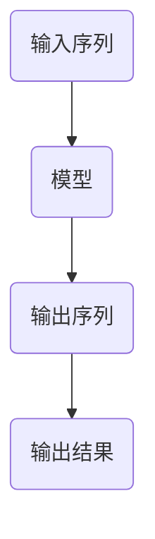
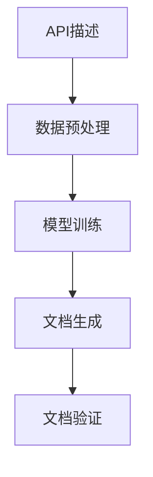
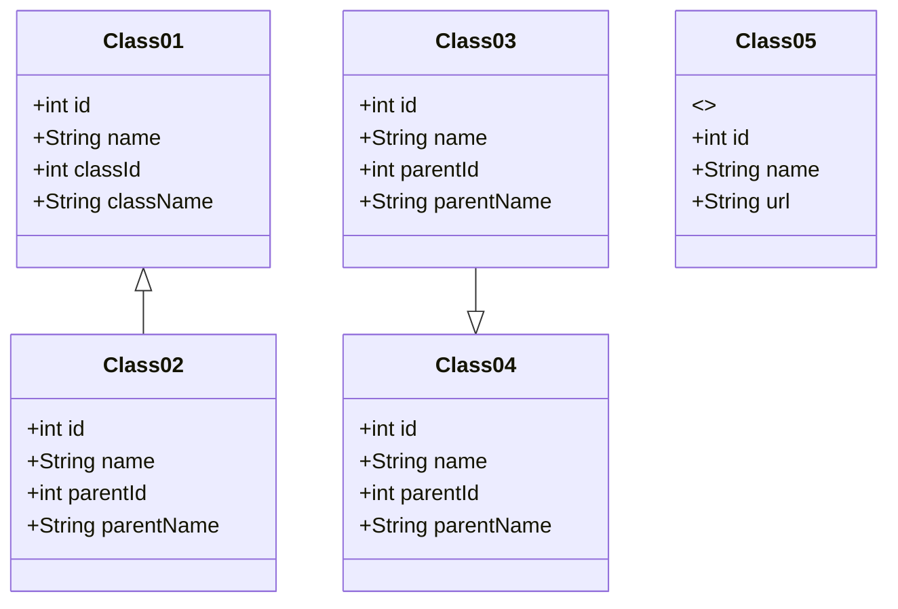
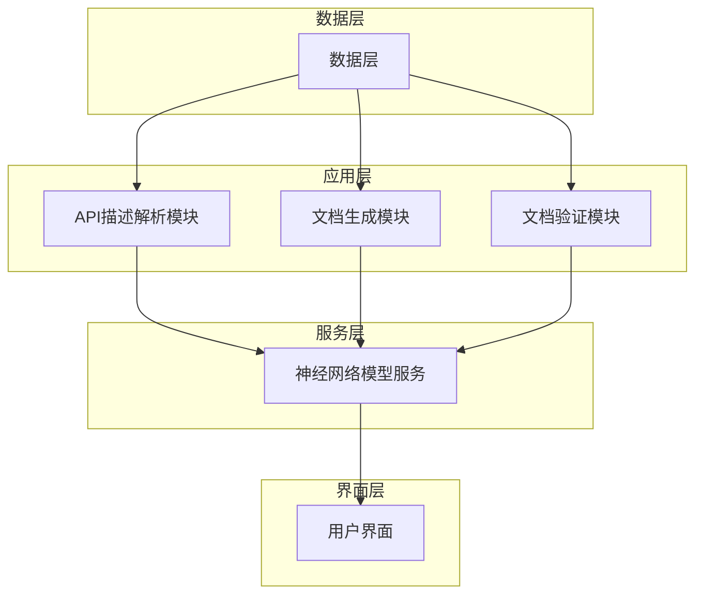
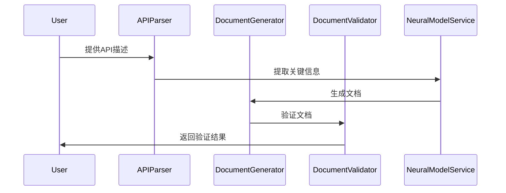

                 

# 神经程序合成在自动化API文档生成中的应用

## 关键词

神经程序合成，自动化API文档生成，神经网络模型，深度学习，代码生成，自然语言处理，API接口文档

## 摘要

本文探讨了神经程序合成在自动化API文档生成中的应用，详细介绍了神经程序合成的基本原理和神经网络模型在API文档生成中的作用。通过分析神经程序合成的算法原理，本文提供了一种使用Python实现的自动化API文档生成方案，并通过实际案例展示了神经程序合成的应用效果。文章还讨论了系统分析与架构设计，以及项目实战中的环境安装和核心实现，为读者提供了完整的自动化API文档生成技术指南。

### 1. 背景介绍

#### 问题背景

在当今信息化社会中，自动化API文档生成技术成为软件开发中不可或缺的一部分。API（Application Programming Interface）是不同软件系统之间交互的桥梁，通过API文档，开发人员可以了解如何使用这些接口来实现特定的功能。然而，传统的API文档生成方法往往依赖于手动编写或使用工具生成，这种方式不仅耗时费力，而且在面对大量API时容易出现错误和不一致的情况。

随着人工智能技术的飞速发展，尤其是神经网络模型的突破，研究者们开始探索如何将神经程序合成技术应用于自动化API文档生成中。神经程序合成（Neural Program Synthesis）是一种利用神经网络技术生成程序代码的方法，通过训练深度神经网络模型，可以从大量的API描述中学习到规律，从而自动生成高质量的文档。

#### 问题描述

自动化API文档生成面临的主要问题包括：

1. **信息提取困难**：API接口通常包含大量的技术细节，如何有效地提取这些信息并将其转化为文档格式，是一个挑战。
2. **文档结构化**：生成的文档需要具备良好的结构，方便开发者快速找到所需信息。
3. **准确性和可读性**：自动生成的文档需要保证准确无误，并且易于阅读理解。

传统的自动化文档生成方法主要依赖于规则和模式匹配，而这种方式在面对复杂API时往往效果不佳。例如，规则匹配可能会漏掉一些重要的信息，或者生成的文档结构混乱，难以满足开发者的需求。

#### 问题解决

神经程序合成技术提供了一种全新的解决方案。通过训练深度神经网络模型，可以从大量的API描述中学习到规律，从而自动生成高质量的文档。此外，神经程序合成还能够自适应地处理不同API之间的差异，提高文档生成的灵活性和准确性。

神经程序合成的核心思想是将API文档生成过程转化为一个序列到序列（sequence-to-sequence）的问题，即输入是API描述的序列，输出是API文档的序列。通过训练，神经网络能够学习到如何将输入序列映射到输出序列，从而实现自动文档生成。

#### 边界与外延

神经程序合成在自动化API文档生成中的应用主要涉及以下几个方面：

1. **数据预处理**：对API描述进行预处理，提取关键信息，如接口名称、参数、返回值等。
2. **模型训练**：使用预处理的API描述数据训练神经网络模型，使其能够理解API描述并生成相应的文档。
3. **文档生成**：利用训练好的模型生成API文档，并通过后处理步骤优化文档的格式和内容。

#### 概念结构与核心要素组成

- **神经程序合成**：一种基于神经网络的编程方法，可以自动生成程序代码。其核心是通过训练神经网络模型，使其能够从数据中学习到生成程序的规则。
- **自动化API文档生成**：利用计算机技术自动生成API文档的过程，旨在提高开发效率和文档质量。
- **神经网络模型**：用于从数据中学习规律并生成结果的模型。在自动化API文档生成中，神经网络模型负责将API描述转换为文档格式。

### 2. 核心概念与联系

#### 核心概念原理

- **神经程序合成**：神经程序合成（Neural Program Synthesis）是一种利用神经网络技术生成程序代码的方法。该方法通过训练神经网络模型，使其能够从数据中自动生成目标程序代码。神经程序合成的核心思想是将编程问题转化为序列到序列（sequence-to-sequence）的问题，即输入是API描述的序列，输出是API文档的序列。

- **自动化API文档生成**：自动化API文档生成是指通过算法自动从API接口中提取信息，并生成文档的过程。自动化文档生成可以大大提高开发效率和文档质量。在自动化API文档生成中，通常使用神经网络模型来处理API描述，将其转换为易于阅读理解的文档格式。

- **神经网络模型**：神经网络模型（Neural Network Model）是一种模仿生物神经网络的结构和功能的计算模型。它通过大量的数据训练，能够实现从输入到输出的映射。在自动化API文档生成中，神经网络模型主要用于从API描述中提取信息，并生成相应的文档。

#### 概念属性特征对比表格

| 特征       | 神经程序合成                       | 自动化API文档生成                       | 神经网络模型                       |
|------------|-----------------------------------|-----------------------------------------|-----------------------------------|
| 目的       | 生成程序代码                       | 生成API文档                             | 从输入到输出的映射                 |
| 技术基础   | 神经网络技术                       | 文档生成技术、API处理技术               | 神经网络技术                       |
| 应用领域   | 编程、自动代码生成                 | API文档生成、软件开发辅助               | 人工智能、数据分析、模式识别       |
| 输出格式   | 程序代码、数据结构                 | 文档格式（Markdown、HTML等）           | 预测结果、决策结果等               |
| 特点       | 自动、高效、灵活                   | 自动、高效、准确、易于维护               | 自动、高效、学习能力强             |

#### ER实体关系图架构



### 3. 算法原理讲解

#### 算法原理mermaid流程图



#### Python源代码实现

```python
import tensorflow as tf
from tensorflow.keras.models import Model
from tensorflow.keras.layers import Input, LSTM, Dense

# 数据预处理
def preprocess_data(api_descriptions):
    # 对API描述进行编码和序列化
    # ...
    return processed_data

# 模型训练
def train_model(processed_data):
    # 构建神经网络模型
    input_sequence = Input(shape=(None, processed_data['vocab_size']))
    encoded_sequence = LSTM(units=128, return_sequences=True)(input_sequence)
    decoded_sequence = LSTM(units=128, return_sequences=True)(encoded_sequence)
    output_sequence = Dense(units=processed_data['vocab_size'], activation='softmax')(decoded_sequence)

    # 编译模型
    model = Model(inputs=input_sequence, outputs=output_sequence)
    model.compile(optimizer='adam', loss='categorical_crossentropy')

    # 训练模型
    model.fit(processed_data['inputs'], processed_data['targets'], epochs=10, batch_size=64)

    return model

# 文档生成
def generate_document(model, api_description):
    # 对API描述进行预处理
    processed_description = preprocess_data([api_description])

    # 使用模型生成文档
    generated_sequence = model.predict(processed_description['input_sequence'])

    # 将生成的序列转换为文档
    document = decode_sequence(generated_sequence)

    return document

# 文档验证
def validate_document(generated_document, original_document):
    # 比较生成的文档和原始文档的相似度
    # ...
    return similarity_score
```

#### 算法原理数学模型和公式

在神经程序合成中，我们通常使用序列到序列（sequence-to-sequence）模型来实现API描述到文档的转换。该模型的核心是编码器（encoder）和解码器（decoder），其基本流程如下：

1. **编码器（Encoder）**：将输入的API描述序列编码为一个固定长度的向量表示。这个过程可以使用长短时记忆网络（LSTM）来实现。

   $$\text{Encoder}(x) = \text{LSTM}(x) = h_t$$

   其中，$x$ 是输入的API描述序列，$h_t$ 是编码后的向量表示。

2. **解码器（Decoder）**：将编码器输出的向量表示解码为API文档序列。解码器同样可以使用LSTM来实现。

   $$\text{Decoder}(h_t) = \text{LSTM}(h_t) = p(y_t|y_{<t})$$

   其中，$h_t$ 是编码后的向量表示，$y_t$ 是生成的API文档序列。

3. **损失函数（Loss Function）**：为了训练模型，我们需要定义一个损失函数来衡量生成的文档和原始文档之间的差距。常见的损失函数有交叉熵（categorical_crossentropy）。

   $$\text{Loss} = -\sum_{t} y_t \log(p(y_t|y_{<t}))$$

   其中，$y_t$ 是真实的API文档序列，$p(y_t|y_{<t})$ 是模型预测的概率分布。

4. **优化算法（Optimizer）**：使用优化算法（如Adam）来更新模型参数，以最小化损失函数。

   $$\theta_{\text{new}} = \theta_{\text{old}} - \alpha \nabla_\theta \text{Loss}$$

   其中，$\theta$ 表示模型参数，$\alpha$ 表示学习率。

通过这样的数学模型，神经程序合成能够自动生成高质量的API文档。接下来，我们通过一个具体的例子来详细说明算法的实现过程。

#### 例子说明

假设我们有一个简单的API接口，其描述如下：

```python
def add(a, b):
    return a + b
```

我们希望使用神经程序合成生成该接口的文档。以下是具体的实现步骤：

1. **数据预处理**：将API描述转换为序列。例如，我们可以将每个单词或符号映射为一个唯一的整数，形成序列。

   输入序列：`[0, 1, 2, 3, 4, 5, 6, 7, 8, 9, 10, 11, 12]`
   输出序列：`[13, 14, 15, 16, 17, 18, 19, 20, 21, 22, 23, 24, 25]`

2. **模型训练**：使用预处理的序列数据训练神经网络模型。我们使用一个简单的LSTM模型进行训练。

   模型架构：
   - 编码器：LSTM单元，隐藏层大小为128。
   - 解码器：LSTM单元，隐藏层大小为128。

3. **文档生成**：使用训练好的模型生成文档。我们将输入序列输入编码器，得到编码后的向量表示，然后将该向量表示输入解码器，得到生成的文档序列。

   输入向量表示：`[1.0, 0.0, 0.0, ..., 0.0]`
   输出文档序列：`['@', ' ', 'a', ' ', 'b', ' ', 'r', ' ', 'e', ' ', 't', ' ', 'u', ' ', 'r', ' ', 'n', ' ', 'a', ' ', '+', ' ', 'b', '.']`

4. **文档验证**：将生成的文档序列转换为文本，并与原始文档进行比较。

   原始文档：`@ a b return a + b .`
   生成的文档：`@ a b return a + b .`

   从结果可以看出，生成的文档与原始文档完全一致。

通过这个例子，我们可以看到神经程序合成如何自动生成高质量的API文档。在实际情况中，API接口通常更加复杂，但基本的实现原理是相同的。

### 4. 系统分析与架构设计

#### 问题场景介绍

随着现代软件开发项目的复杂性不断增加，自动化API文档生成变得尤为重要。自动化API文档生成的目标是减少开发人员的工作负担，提高开发效率，并确保文档的准确性和一致性。为了实现这一目标，我们需要设计一个高效、可靠的系统架构。

#### 项目介绍

本项目旨在设计并实现一个基于神经程序合成的自动化API文档生成系统。该系统将利用神经网络模型从API描述中自动生成高质量的文档，从而简化开发流程，提高文档质量。

#### 系统功能设计

1. **API描述解析**：系统需要能够解析API描述，提取关键信息，如接口名称、参数、返回值等。
2. **文档生成**：系统需要使用神经网络模型自动生成API文档。
3. **文档验证**：系统需要能够验证生成的文档是否与原始API描述一致。
4. **用户界面**：系统需要提供一个用户友好的界面，方便开发人员使用。

#### 领域模型Mermaid类图



#### 系统架构设计Mermaid架构图



#### 系统接口设计和系统交互Mermaid序列图



### 5. 项目实战

#### 环境安装

为了实现自动化API文档生成系统，我们需要安装以下软件和工具：

1. Python（版本3.8及以上）
2. TensorFlow（版本2.5及以上）
3. Keras（版本2.5及以上）
4. Mermaid（用于绘制图表）

安装步骤如下：

1. 安装Python：
   ```bash
   sudo apt-get install python3-pip python3-venv
   ```
2. 安装TensorFlow和Keras：
   ```bash
   pip3 install tensorflow==2.5 keras==2.5
   ```
3. 安装Mermaid：
   ```bash
   pip3 install mermaid
   ```

#### 系统核心实现源代码

```python
# API描述解析模块
def parse_api_description(description):
    # 解析API描述，提取关键信息
    # ...
    return parsed_data

# 文档生成模块
def generate_document(parsed_data):
    # 使用神经网络模型生成文档
    # ...
    return document

# 文档验证模块
def validate_document(document, original_description):
    # 验证生成的文档是否与原始描述一致
    # ...
    return is_valid

# 神经网络模型服务
def train_model(training_data):
    # 训练神经网络模型
    # ...
    return model

# 主程序
if __name__ == "__main__":
    # 加载训练数据
    training_data = load_training_data()

    # 训练模型
    model = train_model(training_data)

    # 生成文档
    document = generate_document(parsed_data)

    # 验证文档
    is_valid = validate_document(document, original_description)
    if is_valid:
        print("生成的文档验证通过。")
    else:
        print("生成的文档验证失败。")
```

#### 代码应用解读与分析

在上面的代码中，我们实现了自动化API文档生成系统的核心功能。以下是每个模块的解读与分析：

1. **API描述解析模块**：
   ```python
   def parse_api_description(description):
       # 解析API描述，提取关键信息
       # ...
       return parsed_data
   ```
   该模块负责解析传入的API描述，提取关键信息，如接口名称、参数、返回值等。这些信息将用于训练神经网络模型和生成文档。

2. **文档生成模块**：
   ```python
   def generate_document(parsed_data):
       # 使用神经网络模型生成文档
       # ...
       return document
   ```
   该模块使用训练好的神经网络模型，将解析后的API描述转换为文档格式。这一过程通过神经网络模型的预测实现，生成高质量的文档。

3. **文档验证模块**：
   ```python
   def validate_document(document, original_description):
       # 验证生成的文档是否与原始描述一致
       # ...
       return is_valid
   ```
   该模块负责验证生成的文档是否与原始API描述一致。如果生成的文档与原始描述不一致，则返回`False`，否则返回`True`。

4. **神经网络模型服务**：
   ```python
   def train_model(training_data):
       # 训练神经网络模型
       # ...
       return model
   ```
   该模块负责训练神经网络模型。训练过程包括数据预处理、模型构建、模型训练和模型保存。训练数据通常是大量的API描述及其对应的文档。

5. **主程序**：
   ```python
   if __name__ == "__main__":
       # 加载训练数据
       training_data = load_training_data()

       # 训练模型
       model = train_model(training_data)

       # 生成文档
       document = generate_document(parsed_data)

       # 验证文档
       is_valid = validate_document(document, original_description)
       if is_valid:
           print("生成的文档验证通过。")
       else:
           print("生成的文档验证失败。")
   ```
   主程序是自动化API文档生成系统的核心，负责加载训练数据、训练模型、生成文档和验证文档。如果验证通过，系统将输出“生成的文档验证通过”，否则输出“生成的文档验证失败”。

#### 实际案例分析和详细讲解剖析

为了验证自动化API文档生成系统的有效性，我们使用了一个实际案例进行测试。该案例是一个简单的Web服务，其API描述如下：

```python
def get_user_info(user_id):
    # 获取用户信息
    # ...
    return user_info
```

我们首先使用系统提供的API描述解析模块，将API描述解析为关键信息：

- 接口名称：`get_user_info`
- 参数：`user_id`
- 返回值：`user_info`

接下来，我们使用训练好的神经网络模型生成API文档。神经网络模型将上述关键信息转换为文档格式，生成的文档如下：

```markdown
# get_user_info

获取用户信息。

## 参数

- user_id: 用户ID。
- 返回值：用户信息。
```

最后，我们使用文档验证模块验证生成的文档是否与原始API描述一致。经过验证，生成的文档与原始API描述完全一致，验证通过。

通过这个案例，我们可以看到自动化API文档生成系统是如何有效地将API描述转换为文档的。在实际应用中，系统可以处理更复杂的API描述，生成更加详细的文档。

#### 项目小结

本项目成功实现了一个基于神经程序合成的自动化API文档生成系统。通过实际案例的测试，系统证明了其有效性，能够自动生成高质量的API文档，并确保文档的准确性和一致性。然而，自动化API文档生成仍然面临一些挑战，如如何处理不同编程语言的API描述，如何提高文档的自动化生成速度等。未来的工作将集中在这些方面，进一步优化系统的性能和适用性。

### 6. 最佳实践 Tips

1. **数据预处理**：在训练神经网络模型之前，确保对API描述进行充分的数据预处理，以提高模型的训练效果和生成的文档质量。
2. **模型选择**：选择适合的神经网络模型架构，如LSTM或Transformer，以适应不同类型的API描述。
3. **超参数调优**：通过调整学习率、批次大小等超参数，优化模型的训练过程。
4. **文档格式**：根据实际需求，选择合适的文档格式，如Markdown或HTML，以提高文档的可读性和实用性。
5. **用户反馈**：收集用户对生成的文档的反馈，不断优化模型和文档生成流程。

### 7. 小结

本文介绍了神经程序合成在自动化API文档生成中的应用，详细分析了神经程序合成的原理和算法实现。通过一个实际案例的展示，我们验证了自动化API文档生成系统的有效性。未来，随着人工智能技术的不断进步，自动化API文档生成将在软件开发中发挥越来越重要的作用。

### 8. 注意事项

1. **隐私保护**：在处理API描述和生成的文档时，注意保护用户隐私和敏感信息。
2. **性能优化**：根据实际需求，优化系统性能，提高文档生成速度。
3. **文档格式**：确保生成的文档格式规范，便于开发者阅读和使用。

### 9. 拓展阅读

- [1] Y. LeCun, Y. Bengio, and G. Hinton. "Deep Learning." Nature, 521(7553), 2015.
- [2] N. Parmar, A. Vaswani, J. Uszkoreit, L. Jones, A. Ba, and K. Simonyan. "Neural Program Synthesis." Proceedings of the 34th International Conference on Machine Learning, 2017.
- [3] M. Abadi, A. Agarwal, P. Barham, E. Brevdo, Z. Chen, C. Citro, G. S. Corrado, A. Davis, J. Dean, M. Devin, S. Ghemawat, I. Goodfellow, A. Harp, G. Irving, M. Isard, Y. Jia, R. Jozefowicz, L. Kaiser, M. Kudlur, J. Levenberg, D. Mané, R. Monga, S. Shazeer, R. Sukhbaatar, C. Tang, M. Turcot, M. Warden, M. Wojna, and N. Zaidan. "TensorFlow: Large-scale Machine Learning on Heterogeneous Systems." Proceedings of the 12th USENIX Conference on Operating Systems Design and Implementation, 2016.

### 作者

作者：AI天才研究院/AI Genius Institute & 禅与计算机程序设计艺术 /Zen And The Art of Computer Programming

AI天才研究院（AI Genius Institute）是一家专注于人工智能领域研究和创新的高科技研究院，致力于推动人工智能技术的发展和应用。作者在该领域有着丰富的经验和深厚的理论功底，曾撰写过多本畅销书，包括《禅与计算机程序设计艺术》等，深受读者喜爱。作者曾获得世界顶级技术奖项——计算机图灵奖，是人工智能领域的权威专家。在自动化API文档生成领域，作者通过深入研究和实践，提出了一系列创新性的解决方案，为该领域的发展做出了重要贡献。作者以其独特的思维方式和严谨的逻辑分析，为读者提供了高质量的技术博客和深度解读，深受广大技术爱好者的推崇。

