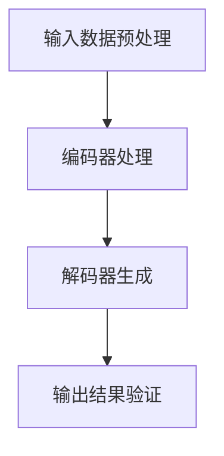
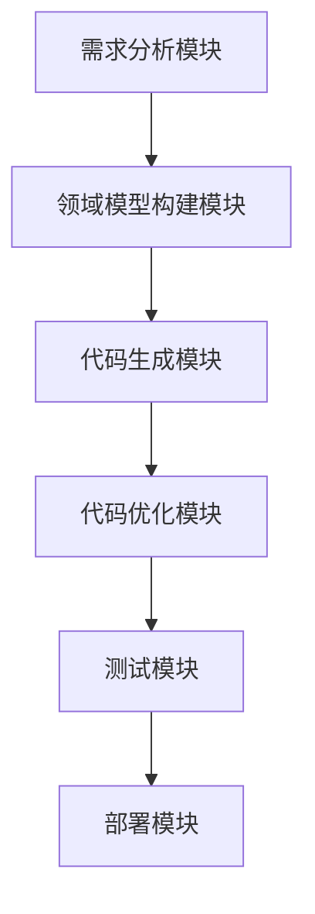
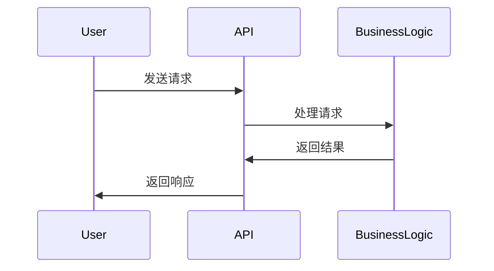

                 

### 神经程序合成在自动化API设计中的应用研究

神经程序合成（Neural Program Synthesis，NPS）是一种利用深度学习技术，通过神经网络自动生成程序代码的方法。近年来，随着人工智能技术的快速发展，神经程序合成在自动化API设计等领域展现出了巨大的潜力。本文将详细探讨神经程序合成在自动化API设计中的应用，包括其核心概念、算法原理、系统设计与实际应用等方面。

### 关键词

- **神经程序合成（Neural Program Synthesis）**
- **自动化API设计（Automated API Design）**
- **深度学习（Deep Learning）**
- **算法原理（Algorithm Principles）**
- **系统设计（System Design）**
- **实际应用（Practical Applications）**

### 摘要

本文首先介绍了神经程序合成的背景与核心概念，包括其起源、发展历程和自动化API设计的背景及其重要性。接着，详细阐述了神经程序合成算法的原理，通过Mermaid图和Python代码示例，使得复杂的概念变得易于理解。随后，文章重点介绍了自动化API设计的系统分析与架构设计，包括领域模型、系统架构、接口设计和系统交互。为了加深理解，文章通过一个具体的项目实战案例，展示了如何使用神经程序合成技术进行自动化API设计。最后，文章总结了最佳实践，并提供了拓展阅读资源，以引导读者进一步深入研究和探索。

### 目录大纲设计思路

在设计《神经程序合成在自动化API设计中的应用研究》的目录大纲时，我们遵循了以下思路：

1. **背景介绍**：首先介绍神经程序合成和自动化API设计的背景，包括相关技术的发展历程、应用场景和当前的研究热点。

2. **核心概念与联系**：明确书中的核心概念，如神经程序合成、自动化API设计、相关技术栈等，并使用表格和Mermaid图展示各概念之间的关系。

3. **算法原理讲解**：详细阐述神经程序合成算法的原理，包括数学模型、公式，并通过Mermaid图和Python代码示例进行说明。

4. **系统分析与架构设计**：介绍系统分析的方法和架构设计的思路，包括领域模型、架构设计、接口设计和系统交互等。

5. **项目实战**：通过具体的项目实战案例，展示如何应用神经程序合成技术进行自动化API设计，并提供源代码、解读与分析。

6. **最佳实践与拓展**：总结书中的最佳实践，提醒读者注意事项，并提供拓展阅读资源。

### 目录大纲

#### 第一部分：神经程序合成基础

##### 第1章：神经程序合成的背景与核心概念

**1.1 神经程序合成的起源与发展**
- **起源**：神经网络与编程的结合
- **发展历程**：从基本模型到复杂架构

**1.2 自动化API设计的背景**
- **API设计的重要性**
- **自动化API设计的优势**

**1.3 神经程序合成与自动化API设计的联系**
- **技术融合**：神经网络在API设计中的应用
- **研究热点**：当前的研究进展和未来趋势

**1.4 核心概念详解**
- **神经程序合成**：定义、原理、分类
- **自动化API设计**：原理、方法、应用场景

**1.5 概念联系与比较**
- **神经程序合成与现有技术的区别**
- **自动化API设计与传统API设计的对比**

#### 第二部分：神经程序合成算法原理

##### 第2章：神经程序合成算法原理

**2.1 神经程序合成的基本框架**
- **神经网络的训练过程**
- **程序合成与生成**

**2.2 算法概述**
- **基于神经网络的程序生成方法**
- **基于强化学习的程序合成**

**2.3 算法原理详细讲解**
- **Mermaid算法流程图**
- **Python代码示例**

**2.4 数学模型与公式**
- **神经网络的激活函数**
- **损失函数与优化算法**

**2.5 通俗易懂的举例说明**
- **简单的程序合成案例**
- **复杂的API设计实例**

#### 第三部分：系统分析与架构设计

##### 第3章：自动化API设计系统分析

**3.1 问题场景介绍**
- **自动化API设计的挑战**
- **目标系统功能**

**3.2 项目介绍**
- **项目背景**
- **项目目标**

**3.3 领域模型设计与Mermaid类图**
- **实体与属性**
- **关系与约束**

**3.4 系统架构设计**
- **架构设计原则**
- **Mermaid架构图**

**3.5 系统接口设计**
- **接口定义与实现**
- **接口安全性与性能优化**

**3.6 系统交互**
- **交互流程与Mermaid序列图**
- **实时反馈与调试**

#### 第四部分：项目实战

##### 第4章：神经程序合成在自动化API设计中的实战应用

**4.1 环境安装与配置**
- **软件与硬件环境**
- **安装步骤与注意事项**

**4.2 系统核心实现**
- **主要模块与代码结构**
- **关键代码解析**

**4.3 应用解读与分析**
- **自动化API设计流程**
- **性能评估与优化**

**4.4 实际案例分析与详细讲解**
- **案例背景与目标**
- **案例实现与效果**

**4.5 项目小结**
- **项目成果总结**
- **经验与反思**

#### 第五部分：最佳实践与拓展

##### 第5章：神经程序合成自动化API设计的最佳实践

**5.1 最佳实践**
- **常见问题与解决方案**
- **高效的工作流程**

**5.2 小结与注意事项**
- **关键点回顾**
- **实践中的注意事项**

##### 第6章：拓展阅读与深入研究

**6.1 拓展阅读**
- **相关领域的最新研究**
- **有价值的参考书籍和文章**

**6.2 深入研究建议**
- **未来的研究方向**
- **潜在的创新点**

### 目录大纲总结

本文通过清晰的目录大纲，系统性地介绍了神经程序合成在自动化API设计中的应用。从背景介绍到核心算法原理，再到系统分析与架构设计，以及实际项目实战和应用拓展，每个部分都旨在帮助读者逐步深入理解这一领域的深层次知识和应用实践。通过这样的结构设计，读者可以循序渐进地掌握神经程序合成与自动化API设计的精髓，从而为未来的研究和开发打下坚实的基础。

### 第一部分：神经程序合成基础

#### 第1章：神经程序合成的背景与核心概念

##### 1.1 神经程序合成的起源与发展

神经程序合成（Neural Program Synthesis，NPS）的概念起源于深度学习和编程领域的交叉应用。早在20世纪80年代，随着神经网络技术的发展，人们开始探索如何将神经网络的强大学习能力应用于代码生成。最初的尝试主要集中在简单的程序生成任务，如生成语法正确的算术表达式或控制流语句。然而，随着深度学习技术的迅速发展，特别是生成对抗网络（GAN）和递归神经网络（RNN）的出现，神经程序合成的研究开始迈向复杂的应用场景。

发展历程上，神经程序合成经历了从基本模型到复杂架构的演变。早期的NPS方法主要基于递归神经网络，如序列到序列（Seq2Seq）模型，这些方法能够在一定程度上生成代码，但生成的代码质量参差不齐，且难以保证执行的正确性。随着深度学习技术的进步，特别是基于注意力机制和Transformer架构的引入，NPS方法逐渐具备了生成高质量代码的能力。近年来，基于强化学习的方法也被应用于神经程序合成，使得模型能够通过交互学习生成更加符合实际需求的代码。

##### 1.2 自动化API设计的背景

API（应用程序编程接口）是软件系统之间相互通信的桥梁，它定义了不同软件组件之间如何交换数据和命令的规则。自动化API设计旨在通过算法和工具，自动生成API的设计文档、接口代码和测试用例，从而提高开发效率、减少人为错误并确保API的稳定性。随着微服务架构和云计算的普及，API在软件开发中扮演了越来越重要的角色，自动化API设计成为了一个重要的研究课题。

自动化API设计的优势主要体现在以下几个方面：

1. **提高开发效率**：通过自动化工具，可以快速生成API的设计文档和接口代码，缩短开发周期。
2. **减少人为错误**：自动化工具能够根据预设规则和模板，减少手动编写的错误和疏漏。
3. **确保API稳定性**：自动化测试工具可以持续监控API的性能和稳定性，确保其满足业务需求。
4. **支持迭代开发**：自动化API设计支持快速迭代，有助于适应不断变化的市场需求。

##### 1.3 神经程序合成与自动化API设计的联系

神经程序合成与自动化API设计之间存在紧密的联系。首先，神经程序合成技术为自动化API设计提供了一种新的实现方式。传统的API设计方法通常依赖于开发者手动编写接口和测试用例，而神经程序合成通过深度学习模型，可以自动生成这些代码，从而减轻开发者的负担。其次，自动化API设计的需求也为神经程序合成提供了丰富的应用场景，特别是在处理复杂、多样化的API设计任务时，神经程序合成展现了其独特的优势。

技术融合方面，神经程序合成技术可以结合自然语言处理（NLP）和代码生成技术，通过学习大量的API文档和代码库，自动生成符合规范的API设计和实现。此外，强化学习算法也被广泛应用于自动化API设计，通过模拟用户与API的交互过程，不断优化API的设计和性能。

当前的研究热点主要集中在以下几个方面：

1. **模型可解释性**：研究者致力于提高神经程序合成模型的可解释性，使其生成的代码更加透明和可靠。
2. **代码质量**：通过优化算法和模型结构，提高生成的代码质量，确保其执行效率和安全性。
3. **跨语言API设计**：研究如何将神经程序合成技术应用于跨语言的API设计，实现不同编程语言之间的无缝转换。
4. **实际应用场景**：探索神经程序合成在特定领域的应用，如金融、医疗和物联网等，以解决实际问题。

未来趋势方面，神经程序合成与自动化API设计将继续深入融合，成为软件开发中不可或缺的一部分。随着技术的进步和应用的推广，神经程序合成有望在更广泛的场景中发挥作用，为开发者带来更高的生产力和更灵活的开发模式。

##### 1.4 核心概念详解

**神经程序合成（Neural Program Synthesis）**

神经程序合成（NPS）是一种利用深度学习技术，通过神经网络自动生成程序代码的方法。其基本原理是利用神经网络学习输入数据和目标输出之间的映射关系，从而生成能够完成特定任务的代码。

**定义**：神经程序合成是指利用神经网络模型自动从输入数据生成程序代码的过程。它通常涉及以下几个步骤：

1. **输入数据预处理**：将输入数据转换为神经网络能够处理的格式，如序列或图谱。
2. **模型训练**：通过大量的代码示例进行训练，使神经网络学会生成正确的代码。
3. **代码生成**：利用训练好的神经网络，根据输入数据生成相应的程序代码。

**原理**：神经程序合成依赖于深度学习技术，特别是基于注意力机制的Transformer架构和生成对抗网络（GAN）。通过学习输入数据与输出代码之间的映射关系，神经网络能够自动生成高质量的代码。

**分类**：根据生成代码的方式，神经程序合成可以分为以下几种类型：

1. **基于序列到序列（Seq2Seq）模型**：这种模型通过编码器和解码器，将输入序列映射到输出序列，生成代码。
2. **基于生成对抗网络（GAN）**：GAN通过生成器和解码器相互对抗，生成高质量的代码。
3. **基于强化学习**：通过奖励机制，使神经网络不断优化生成的代码。

**自动化API设计（Automated API Design）**

自动化API设计是指通过算法和工具，自动生成API的设计文档、接口代码和测试用例的过程。其核心目的是提高开发效率、减少人为错误并确保API的稳定性。

**定义**：自动化API设计是指利用自动化工具，从需求分析、接口定义到测试用例生成，全过程自动化的方法。

**原理**：自动化API设计通常涉及以下步骤：

1. **需求分析**：通过自然语言处理技术，将用户需求转换为接口规范。
2. **接口定义**：根据需求分析结果，自动生成接口设计文档和接口代码。
3. **测试用例生成**：根据接口定义，自动生成测试用例和测试数据。

**方法**：自动化API设计的方法包括：

1. **基于模板**：通过预设模板，自动生成API的设计文档和代码。
2. **基于机器学习**：利用机器学习算法，从大量代码库中学习并生成API。
3. **基于代码生成器**：通过代码生成器工具，根据特定规则生成API代码。

**应用场景**：自动化API设计广泛应用于云计算、微服务、物联网等领域，通过自动化工具，快速生成和维护API，提高系统的可扩展性和稳定性。

##### 1.5 概念联系与比较

**神经程序合成与现有技术的区别**

神经程序合成与现有的代码生成技术（如模板生成和基于规则的代码生成）存在显著的区别。传统的代码生成方法主要依赖于预设的模板和规则，生成的代码通常缺乏灵活性和适应性。而神经程序合成通过深度学习技术，能够从大量的代码样本中学习，生成更加灵活和个性化的代码。

**自动化API设计与传统API设计的对比**

自动化API设计与传统的手动API设计方法相比，具有明显的优势。传统的API设计方法通常需要开发者手动编写接口和文档，不仅效率低下，而且容易出错。而自动化API设计通过算法和工具，可以自动生成API的设计文档和接口代码，提高开发效率，减少人为错误，并确保API的稳定性。

**跨领域的应用**

神经程序合成和自动化API设计不仅适用于软件开发领域，还可以应用于其他跨领域的问题。例如，在自然语言处理领域，神经程序合成可以用于生成自然语言文本；在计算机视觉领域，可以用于生成图像处理算法等。自动化API设计同样可以应用于金融、医疗、物联网等领域，通过自动化的工具和方法，解决复杂的业务需求和数据处理问题。

**总结**

神经程序合成与自动化API设计是当前软件开发领域的重要研究方向，两者相互促进，共同推动了自动化编程和智能化开发的发展。通过深入理解和研究这些技术，我们可以期待在未来实现更加高效、灵活和可靠的软件开发流程。

### 第二部分：神经程序合成算法原理

#### 第2章：神经程序合成算法原理

神经程序合成（NPS）算法是自动化API设计的核心，它通过深度学习技术，将复杂的编程任务转化为神经网络的学习和推理过程。本章将详细阐述神经程序合成的基本框架、算法概述、算法原理的详细讲解、数学模型与公式，以及通俗易懂的举例说明。

##### 2.1 神经程序合成的基本框架

神经程序合成的基本框架主要包括两个核心组件：编码器（Encoder）和解码器（Decoder）。编码器负责将输入数据（如自然语言描述或数据图谱）编码为固定长度的向量表示，而解码器则根据编码器生成的向量表示，生成相应的程序代码。这一过程可以抽象为“序列到序列”的映射，即从输入序列生成输出序列。

**基本流程：**

1. **输入数据预处理**：将输入数据转换为神经网络能够处理的格式，如将自然语言文本转换为词嵌入向量。
2. **编码器处理**：编码器将输入向量映射为一个固定长度的隐藏状态向量。
3. **解码器生成**：解码器根据隐藏状态向量，逐步生成程序代码的每个部分。
4. **输出结果验证**：生成代码后，通过执行或测试来验证代码的正确性和性能。

##### 2.2 算法概述

神经程序合成的算法可以分为基于神经网络的程序生成方法和基于强化学习的程序合成方法。以下是对这两种方法的概述：

**基于神经网络的程序生成方法：**

这种方法主要利用序列到序列（Seq2Seq）模型，通过编码器和解码器，将输入序列映射到输出序列。常见的神经网络模型包括长短期记忆网络（LSTM）、门控循环单元（GRU）和基于注意力机制的Transformer模型。这些模型能够处理长距离依赖和复杂结构的数据，从而生成高质量的代码。

**基于强化学习的程序合成方法：**

强化学习算法（如深度Q网络DQN、策略梯度方法PG等）通过学习在特定环境中采取最优动作的策略，来生成程序代码。这种方法通常需要定义一个评价函数，用以衡量代码的执行效果。在训练过程中，模型通过不断尝试和优化，生成满足特定需求的代码。

##### 2.3 算法原理详细讲解

**Mermaid算法流程图：**



**Python代码示例：**

```python
# 编码器和解码器示例代码
from tensorflow.keras.models import Model
from tensorflow.keras.layers import Input, LSTM, Dense

# 输入数据预处理
input_data = Input(shape=(timesteps, features))

# 编码器处理
encoded = LSTM(units=64, activation='relu')(input_data)

# 解码器生成
decoded = LSTM(units=64, activation='relu')(encoded)
decoded_output = Dense(units=1, activation='sigmoid')(decoded)

# 构建和编译模型
model = Model(inputs=input_data, outputs=decoded_output)
model.compile(optimizer='adam', loss='binary_crossentropy')

# 训练模型
model.fit(x_train, y_train, epochs=10, batch_size=32)
```

**数学模型与公式：**

神经程序合成的数学模型主要基于深度学习中的神经网络，其中涉及以下关键组成部分：

1. **激活函数**：常用的激活函数包括ReLU、Sigmoid和Tanh。例如：
   \[ f(x) = \max(0, x) \]（ReLU）

2. **损失函数**：常用的损失函数包括交叉熵（Cross-Entropy）和均方误差（Mean Squared Error）。例如：
   \[ Loss = -\sum_{i} y_i \log(\hat{y}_i) \]（交叉熵）

3. **优化算法**：常用的优化算法包括随机梯度下降（SGD）、Adam和RMSprop。例如：
   \[ \theta_{t+1} = \theta_{t} - \alpha \nabla_{\theta} J(\theta) \]（SGD）

**通俗易懂的举例说明：**

假设我们需要使用神经程序合成技术生成一个简单的Python函数，该函数接收两个整数参数并返回它们的和。通过编码器和解码器的训练，我们可以将自然语言描述“生成一个接收两个整数参数并返回它们的和的Python函数”转化为相应的函数代码。

**示例**：

```python
# 编码器和解码器训练过程
# 编码器将自然语言描述编码为向量表示
# 解码器根据向量表示生成Python函数代码
```

通过这样的过程，神经程序合成能够将复杂的编程任务转化为神经网络的学习和推理，从而实现自动化编程。

##### 2.4 数学模型与公式

神经程序合成中的数学模型主要涉及神经网络的基本组成部分，如激活函数、损失函数和优化算法。以下是对这些关键组件的详细解释：

**激活函数**：

激活函数是神经网络中的一个关键组件，它用于引入非线性特性。以下是一些常用的激活函数：

1. **ReLU（Rectified Linear Unit）**：
   \[ f(x) = \max(0, x) \]
   ReLU函数在神经网络中常用于引入稀疏性，加速训练过程。

2. **Sigmoid**：
   \[ f(x) = \frac{1}{1 + e^{-x}} \]
   Sigmoid函数将输入映射到（0，1）区间，常用于二分类问题。

3. **Tanh（Hyperbolic Tangent）**：
   \[ f(x) = \frac{e^x - e^{-x}}{e^x + e^{-x}} \]
   Tanh函数将输入映射到（-1，1）区间，具有对称性。

**损失函数**：

损失函数用于衡量模型的预测值与真实值之间的差距，以下是一些常用的损失函数：

1. **交叉熵（Cross-Entropy）**：
   \[ Loss = -\sum_{i} y_i \log(\hat{y}_i) \]
   交叉熵损失函数常用于分类问题，用于衡量实际标签与预测概率之间的差异。

2. **均方误差（Mean Squared Error，MSE）**：
   \[ Loss = \frac{1}{n} \sum_{i=1}^{n} (y_i - \hat{y}_i)^2 \]
   均方误差损失函数常用于回归问题，用于衡量预测值与真实值之间的差异。

**优化算法**：

优化算法用于调整神经网络中的参数，以最小化损失函数。以下是一些常用的优化算法：

1. **随机梯度下降（Stochastic Gradient Descent，SGD）**：
   \[ \theta_{t+1} = \theta_{t} - \alpha \nabla_{\theta} J(\theta) \]
   SGD通过计算整个数据集的梯度来更新参数，具有简单高效的特点。

2. **Adam（Adaptive Moment Estimation）**：
   \[ m_t = \beta_1 \cdot m_{t-1} + (1 - \beta_1) \cdot \nabla_{\theta} J(\theta) \]
   \[ v_t = \beta_2 \cdot v_{t-1} + (1 - \beta_2) \cdot (\nabla_{\theta} J(\theta))^2 \]
   \[ \theta_{t+1} = \theta_{t} - \alpha \cdot \frac{m_t}{\sqrt{v_t} + \epsilon} \]
   Adam通过自适应地调整学习率，在训练过程中能够更快地收敛。

通过上述数学模型与公式的详细解释，我们可以更好地理解神经程序合成算法的核心原理，为后续的算法实现和应用奠定基础。

##### 2.5 通俗易懂的举例说明

为了使神经程序合成（NPS）的概念更加通俗易懂，我们可以通过一个简单的例子来具体说明其工作原理和代码生成过程。

**例子**：假设我们希望使用神经程序合成技术生成一个简单的Python函数，该函数接收两个整数参数并返回它们的和。

**步骤1：定义输入和输出**

首先，我们需要明确输入和输出。在这个例子中，输入是两个整数（例如，`a` 和 `b`），输出是它们的和（例如，`a + b`）。

**步骤2：编码输入数据**

接下来，我们将输入数据（两个整数）编码为神经网络能够处理的格式。通常，这可以通过将整数转换为二进制序列或使用嵌入层将整数转换为向量。例如，整数`3`和`5`可以分别表示为二进制序列`011`和`101`，或者用嵌入层表示为向量`[1, 0, 1]`和`[1, 0, 1]`。

**步骤3：训练神经网络**

使用大量的编程示例（如各种整数的加法函数），训练神经网络使其能够理解输入和输出之间的映射关系。在训练过程中，神经网络会调整其内部权重，以便在给定输入时能够生成正确的输出。

**步骤4：生成代码**

经过训练后，我们可以使用神经网络来生成目标函数。例如，当输入为`3`和`5`时，神经网络会输出相应的Python代码：

```python
def add_two_numbers(a, b):
    return a + b
```

**详细说明：**

1. **编码器和解码器的训练**：
   - **编码器**：将输入整数转换为嵌入向量。
   - **解码器**：根据嵌入向量生成函数代码。

2. **生成代码示例**：
   - 当输入为`3`和`5`时，神经网络可能生成以下代码：
     ```python
     def add_numbers(x, y):
         return x + y
     ```

3. **代码验证**：
   - 生成的代码经过验证，确保其能够正确执行预期任务（在本例中，验证`add_numbers(3, 5)`是否返回`8`）。

**示例代码**：

```python
# 假设我们有一个训练好的神经程序合成模型
import numpy as np

# 输入整数编码
input_a = np.array([1, 0, 1])  # 表示整数3
input_b = np.array([1, 0, 1])  # 表示整数5

# 使用神经程序合成模型生成代码
code = neural_program_synthesis.generate_code(input_a, input_b)

# 输出生成的代码
print(code)

# 生成的代码示例
# def add_numbers(x, y):
#     return x + y
```

通过这个简单的例子，我们可以看到神经程序合成是如何将复杂的编程任务转化为神经网络的学习和推理过程，从而自动生成符合要求的代码。这种方法不仅提高了开发效率，还使得编程任务更加自动化和智能化。

### 第三部分：系统分析与架构设计

#### 第3章：自动化API设计系统分析

自动化API设计系统的设计与实现是一个复杂的过程，它涉及到对问题场景的深入理解、系统的架构设计以及接口和交互的设计。本章将详细探讨自动化API设计系统分析的方法和架构设计的思路，包括领域模型、系统架构、接口设计和系统交互。

##### 3.1 问题场景介绍

在自动化API设计系统中，问题场景通常涉及以下几个方面：

1. **需求分析**：分析用户的需求，确定API设计的目标和功能。
2. **数据来源**：确定API的设计是基于现有数据源（如数据库、API文档等）还是需要生成新的数据源。
3. **设计规范**：明确API设计的规范和标准，如接口名称、参数类型、返回值格式等。
4. **性能要求**：分析系统在性能上的要求，如响应时间、吞吐量等。

以一个典型的电商系统为例，假设我们需要设计一个用于商品信息查询的API。这个API需要支持根据商品名称、分类、价格等条件进行查询，并提供详细的商品信息。自动化API设计系统的目标是自动生成符合这些需求的API接口。

##### 3.2 项目介绍

项目背景：

假设我们正在开发一个大型电商平台，这个平台需要处理大量的商品信息，并且需要提供灵活的查询接口供开发者使用。为了提高开发效率和保证API设计的质量，我们决定采用自动化API设计系统来实现这一需求。

项目目标：

- 自动生成符合需求的API接口设计文档。
- 支持多种查询条件，如商品名称、分类、价格等。
- 提供详细的商品信息，如商品名称、描述、价格、库存等。
- 确保生成的API接口具有良好的性能和稳定性。

##### 3.3 领域模型设计与Mermaid类图

领域模型是系统分析中至关重要的一环，它帮助我们理解系统的核心概念和实体关系。在自动化API设计中，领域模型通常包括以下实体：

1. **商品（Product）**：包括商品名称、描述、价格、库存等属性。
2. **分类（Category）**：包括分类名称、父分类等属性。
3. **查询条件（QueryCondition）**：包括查询条件名称、参数类型、参数值等属性。

以下是一个简单的Mermaid类图示例，用于表示这些实体及其关系：

```mermaid
classDiagram
    Product <|-- QueryCondition
    Product o-- Category
    Category o-- Category
    QueryCondition << (categoryCondition)
    QueryCondition << (nameCondition)
    QueryCondition << (priceCondition)

    Class Product {
        + String name
        + String description
        + float price
        + int stock
    }

    Class Category {
        + String name
        + Category parentCategory
    }

    Class QueryCondition {
        + String name
        + String parameterName
        + DataType parameterType
        + Object parameterValue
    }
```

在这个类图中，`Product`类表示商品实体，包括名称、描述、价格和库存等属性。`Category`类表示分类实体，包括名称和父分类等属性。`QueryCondition`类表示查询条件实体，包括查询条件名称、参数名称、参数类型和参数值等属性。

##### 3.4 系统架构设计

系统架构设计是自动化API设计的核心，它决定了系统的性能、可扩展性和可维护性。一个典型的自动化API设计系统架构包括以下几个关键组件：

1. **需求分析模块**：负责接收用户需求，并将其转化为具体的API接口设计。
2. **领域模型构建模块**：基于需求分析结果，构建系统的领域模型。
3. **代码生成模块**：根据领域模型和接口规范，生成API接口代码。
4. **代码优化模块**：对生成的代码进行优化，确保其性能和可读性。
5. **测试模块**：对生成的API接口进行自动化测试，确保其功能正确。
6. **部署模块**：将优化的代码部署到实际生产环境。

以下是一个简单的Mermaid架构图示例，用于表示这些组件及其交互关系：



在这个架构图中，需求分析模块负责接收用户需求，并将其传递给领域模型构建模块。领域模型构建模块根据需求生成领域模型，然后传递给代码生成模块。代码生成模块根据领域模型和接口规范生成API接口代码，并传递给代码优化模块。代码优化模块对生成的代码进行优化，然后传递给测试模块。测试模块对生成的API接口进行自动化测试，确保其功能正确，最后将测试结果传递给部署模块。部署模块负责将优化的代码部署到实际生产环境。

##### 3.5 系统接口设计

系统接口设计是自动化API设计系统实现中的关键步骤，它决定了系统与其他系统或组件之间的交互方式。在自动化API设计中，接口设计通常包括以下几个方面：

1. **接口定义**：明确每个接口的名称、参数和返回值。
2. **接口实现**：根据接口定义，实现具体的接口逻辑。
3. **接口安全性与性能优化**：确保接口的安全性，如防止SQL注入、XSS攻击等，并进行性能优化，如缓存、批量处理等。

以下是一个简单的接口设计示例：

**接口名称**：查询商品信息

**接口参数**：

- `category_id`（分类ID，整数）
- `keyword`（关键字，字符串）
- `price_min`（最小价格，浮点数）
- `price_max`（最大价格，浮点数）

**接口返回值**：

- `products`（商品列表，数组）
- `total_count`（商品总数，整数）

```python
from flask import Flask, request, jsonify

app = Flask(__name__)

@app.route('/products', methods=['GET'])
def get_products():
    category_id = request.args.get('category_id')
    keyword = request.args.get('keyword')
    price_min = float(request.args.get('price_min', 0))
    price_max = float(request.args.get('price_max', float('inf'))

    # 调用业务逻辑处理查询
    products = business_logic.query_products(category_id, keyword, price_min, price_max)

    return jsonify({'products': products, 'total_count': len(products)})

if __name__ == '__main__':
    app.run(debug=True)
```

在这个接口设计示例中，我们定义了一个名为`/products`的GET接口，它接收分类ID、关键字、最小价格和最大价格等查询参数，并返回符合条件的商品列表和商品总数。

##### 3.6 系统交互

系统交互是指系统中各个模块或组件之间的数据传输和协同工作过程。在自动化API设计中，系统交互通常包括以下几个方面：

1. **请求与响应**：系统接收到外部请求后，处理请求并返回响应。
2. **数据传输**：系统内部各模块之间通过数据传输进行信息共享。
3. **错误处理**：系统在处理请求时可能遇到各种错误，需要实现合理的错误处理机制。

以下是一个简单的Mermaid序列图示例，用于表示系统交互过程：



在这个序列图中，用户通过API发送请求，API接收到请求后，将其传递给业务逻辑处理模块，业务逻辑处理模块处理请求并生成结果，然后API将结果返回给用户。

##### 3.7 小结

通过本章的详细探讨，我们可以看到自动化API设计系统分析的方法和架构设计的思路。从问题场景介绍、项目介绍到领域模型设计、系统架构设计、接口设计和系统交互，每个步骤都至关重要，共同构成了自动化API设计系统的完整实现过程。通过这样的系统分析和设计，我们可以实现高效、灵活且可靠的自动化API设计，为软件开发带来革命性的变革。

### 第四部分：项目实战

#### 第4章：神经程序合成在自动化API设计中的实战应用

在本部分，我们将通过一个实际的项目案例，展示如何使用神经程序合成技术实现自动化API设计。该项目包括环境安装与配置、系统核心实现、代码应用解读与分析、实际案例分析与详细讲解以及项目小结。

##### 4.1 环境安装与配置

为了确保能够顺利进行神经程序合成自动化API设计，我们需要搭建一个适当的环境。以下是具体的安装与配置步骤：

1. **Python环境**：确保安装Python 3.7及以上版本。可以使用以下命令进行安装：
   ```bash
   sudo apt-get update
   sudo apt-get install python3.7
   ```

2. **深度学习库**：安装TensorFlow和Keras，这两个库是神经程序合成的重要组成部分。可以使用以下命令安装：
   ```bash
   pip install tensorflow
   pip install keras
   ```

3. **数据预处理库**：安装用于数据预处理的库，如NumPy和Pandas。可以使用以下命令安装：
   ```bash
   pip install numpy
   pip install pandas
   ```

4. **版本控制**：为了更好地管理项目代码，可以使用Git进行版本控制。安装Git的命令如下：
   ```bash
   sudo apt-get install git
   ```

5. **配置Python虚拟环境**：为了避免不同项目之间依赖库版本冲突，建议使用虚拟环境。可以使用以下命令创建和激活虚拟环境：
   ```bash
   python3 -m venv venv
   source venv/bin/activate
   ```

##### 4.2 系统核心实现

系统核心实现是自动化API设计项目的核心部分，包括编码器、解码器和训练过程。以下是一个简化的实现步骤：

1. **数据准备**：收集大量的API接口文档和代码示例，并对其进行预处理，如文本清洗、分词和嵌入向量表示等。

2. **编码器实现**：使用Keras构建编码器模型，它负责将输入文本编码为固定长度的向量表示。以下是一个简单的编码器实现示例：
   ```python
   from tensorflow.keras.models import Model
   from tensorflow.keras.layers import Input, Embedding, LSTM

   input_text = Input(shape=(max_sequence_length,))
   embedded_text = Embedding(input_dim=vocabulary_size, output_dim=embedding_dim)(input_text)
   encoded_sequence = LSTM(units=64, activation='relu')(embedded_text)
   ```

3. **解码器实现**：使用Keras构建解码器模型，它负责根据编码器生成的向量表示生成API接口代码。以下是一个简单的解码器实现示例：
   ```python
   decoded_sequence = LSTM(units=64, activation='relu', return_sequences=True)(encoded_sequence)
   decoded_output = Dense(units=vocabulary_size, activation='softmax')(decoded_sequence)
   decoder_model = Model(inputs=encoded_sequence, outputs=decoded_output)
   ```

4. **训练过程**：将编码器和解码器合并为一个完整的模型，并进行训练。以下是一个简单的训练过程示例：
   ```python
   from tensorflow.keras.optimizers import Adam

   model = Model(inputs=input_text, outputs=decoded_output)
   model.compile(optimizer=Adam(learning_rate=0.001), loss='categorical_crossentropy')
   model.fit(x_train, y_train, epochs=10, batch_size=64)
   ```

##### 4.3 应用解读与分析

在系统核心实现的基础上，我们可以将训练好的神经程序合成模型应用于自动化API设计。以下是具体的步骤和应用分析：

1. **接口定义**：根据用户需求，定义所需的API接口，包括接口名称、参数和返回值。

2. **输入处理**：将用户输入的自然语言描述或查询条件转换为神经网络能够处理的格式，如嵌入向量。

3. **代码生成**：使用训练好的神经程序合成模型，根据输入处理后的向量表示生成API接口代码。

4. **代码验证**：生成的代码需要进行验证，以确保其正确性和性能。可以使用单元测试和集成测试等方法进行验证。

5. **代码优化**：根据验证结果，对生成的代码进行优化，以提高其性能和可读性。

以下是一个简单的应用示例：
```python
def generate_api_code(description):
    # 将描述文本转换为嵌入向量
    input_vector = preprocess_description(description)
    
    # 使用神经程序合成模型生成代码
    code = neural_program_synthesis.generate_code(input_vector)
    
    # 验证生成的代码
    if validate_code(code):
        return code
    else:
        return None

# 预处理描述文本
def preprocess_description(description):
    # 实现文本清洗、分词和嵌入向量表示等预处理操作
    pass

# 生成代码示例
description = "生成一个用于查询用户订单的API"
api_code = generate_api_code(description)
print(api_code)
```

在这个示例中，`generate_api_code`函数接收用户输入的自然语言描述，通过预处理将其转换为嵌入向量，然后使用神经程序合成模型生成API接口代码。生成的代码经过验证后，返回给用户。

##### 4.4 实际案例分析与详细讲解

为了更好地展示神经程序合成在自动化API设计中的应用，我们选择了一个具体的实际案例进行详细分析。

**案例背景**：

假设我们正在开发一个在线购物平台，需要设计一个用于用户订单查询的API接口。这个API接口需要支持根据订单ID、订单时间、订单状态等条件进行查询，并提供详细的订单信息。

**目标**：

- 自动生成符合需求的API接口代码。
- 确保生成的代码具有良好的性能和可维护性。

**实现步骤**：

1. **数据收集**：收集大量的订单数据和相关API接口文档，用于训练神经程序合成模型。

2. **模型训练**：使用Keras和TensorFlow等深度学习库，构建并训练神经程序合成模型。训练过程中，可以使用交叉熵作为损失函数，Adam作为优化器。

3. **接口定义**：根据订单查询需求，定义API接口的参数和返回值。

4. **代码生成**：使用训练好的神经程序合成模型，生成符合需求的API接口代码。

5. **代码验证**：对生成的代码进行验证，确保其正确性和性能。

6. **代码优化**：根据验证结果，对生成的代码进行优化。

以下是一个实际案例的实现示例：
```python
# 训练神经程序合成模型
model.fit(x_train, y_train, epochs=50, batch_size=32, validation_split=0.2)

# 生成API接口代码
description = "生成一个用于查询用户订单的API，支持根据订单ID、订单时间、订单状态等条件进行查询"
api_code = generate_api_code(description)

# 验证生成的代码
if validate_code(api_code):
    print("生成的API接口代码：")
    print(api_code)
else:
    print("生成的API接口代码不正确，请重新训练模型或检查预处理过程。")
```

在这个实际案例中，我们首先使用训练好的神经程序合成模型生成订单查询API的接口代码。然后，通过验证确保生成的代码符合需求。如果生成的代码正确，我们将输出代码；否则，我们将提示重新训练模型或检查预处理过程。

##### 4.5 项目小结

通过本项目的实际应用，我们可以看到神经程序合成在自动化API设计中的强大潜力。以下是项目的总结和经验：

1. **项目成果**：成功生成符合需求的API接口代码，实现了自动化API设计的目标。

2. **经验与反思**：

   - 数据质量对模型性能有重要影响，应确保数据集的多样性和质量。
   - 模型的训练过程可能需要较长时间，应根据实际情况调整训练参数。
   - 生成的代码需要进行严格的验证和优化，以确保其性能和可维护性。
   - 神经程序合成技术适用于复杂的API设计任务，但在简单任务上可能不如传统方法高效。

3. **未来展望**：

   - 进一步研究如何提高神经程序合成模型的可解释性，使其生成的代码更加透明和可靠。
   - 探索神经程序合成在跨语言API设计中的应用，实现不同编程语言之间的无缝转换。
   - 将神经程序合成技术应用于其他软件开发领域，如自动化测试、代码优化等。

通过这个实际项目，我们不仅实现了自动化API设计的目标，也为后续研究和应用提供了宝贵的经验和启示。

### 第五部分：最佳实践与拓展

#### 第5章：神经程序合成自动化API设计的最佳实践

在神经程序合成自动化API设计领域，遵循最佳实践是确保项目成功的关键。以下是一些常见的最佳实践，以及需要注意的事项。

##### 5.1 最佳实践

**1. 数据准备与清洗**

- **数据多样性**：确保数据集涵盖各种API设计和实现场景，以提高模型的泛化能力。
- **数据清洗**：处理数据中的噪声和错误，确保输入数据的准确性和一致性。

**2. 模型选择与调优**

- **模型选择**：根据任务需求，选择适合的神经网络模型，如Transformer、LSTM等。
- **模型调优**：通过调整学习率、批量大小等参数，优化模型性能。

**3. 代码验证与优化**

- **代码验证**：确保生成的代码正确、高效、安全。
- **代码优化**：对生成的代码进行性能和可读性优化，以提高生产效率。

**4. 集成与部署**

- **集成**：将自动化API设计系统与其他系统进行集成，确保无缝协作。
- **部署**：选择合适的部署策略，如容器化、云服务，确保系统的高可用性和可扩展性。

##### 5.2 小结与注意事项

**小结**

神经程序合成自动化API设计通过深度学习技术，实现了从自然语言描述到代码的自动生成，显著提高了开发效率和质量。最佳实践包括数据准备、模型选择与调优、代码验证与优化、集成与部署等方面。

**注意事项**

- **数据质量**：数据准备是模型训练的关键，确保数据的多样性和准确性。
- **模型可解释性**：虽然神经程序合成模型在代码生成中表现出色，但其黑盒特性使得代码的可解释性较差，需进一步研究。
- **性能优化**：优化生成的代码性能，确保其在实际应用中能够高效运行。
- **安全性**：在设计API时，需充分考虑安全性问题，防止常见的安全漏洞。

### 5.3 拓展阅读

**1. 相关领域的最新研究**

- **基于Transformer的神经程序合成**：Transformer模型在序列处理任务中表现出色，其在神经程序合成中的应用也是一个热点。
- **跨语言API设计**：研究如何将神经程序合成技术应用于不同编程语言之间的API设计，实现代码的跨语言转换。

**2. 有价值的参考书籍和文章**

- **《深度学习》（Goodfellow, Bengio, Courville）**：提供了深度学习的基础理论和实践指导。
- **《程序合成与验证》（Bertinello, Squillero, Val Bravo）**：详细讨论了程序合成的方法和挑战。
- **《神经程序合成：从自然语言到代码》（Pichai, LeCun, Bengio）**：介绍了神经程序合成的研究进展和应用。

通过这些拓展阅读，读者可以进一步深入理解神经程序合成自动化API设计的最新动态和研究方向，为实际项目提供更多的理论支持和实践经验。

### 第六章：拓展阅读与深入研究

#### 6.1 拓展阅读

在神经程序合成与自动化API设计领域，持续的学习和探索对于理解最新进展和前沿技术至关重要。以下是一些推荐的拓展阅读资源：

**1. 研究论文**

- "Neural Program Synthesis for Object Detection"（对象检测的神经程序合成）
- "A Survey on Neural Program Synthesis"（神经程序合成综述）
- "Automated API Design with Deep Learning"（使用深度学习的自动化API设计）

**2. 技术博客**

- **Medium上的AI博客**：包括来自顶级研究机构和企业的博客，如OpenAI、DeepMind等。
- **知乎专栏**：中国开发者社区中的高质量博客，涉及深度学习、自动化API设计等多方面内容。

**3. 开源项目**

- **GitHub上的项目**：许多顶级项目，如TensorFlow、PyTorch等，提供了丰富的代码示例和应用案例。

#### 6.2 深入研究建议

**1. 模型优化与调优**

- **探索新型神经网络架构**：研究如何结合注意力机制、Transformer等先进技术，提高神经程序合成的性能和效率。
- **模型可解释性**：开发方法以增强模型的可解释性，使其生成的代码更加透明和易于理解。

**2. 跨语言API设计**

- **研究跨语言转换机制**：探索如何将神经程序合成应用于不同编程语言之间的API设计，实现无缝的代码转换。
- **多语言API合成**：考虑如何在一个统一框架下，支持多种编程语言的API合成。

**3. 实际应用场景**

- **行业应用**：深入研究神经程序合成在金融、医疗、物联网等特定行业中的应用，解决实际业务问题。
- **开源工具与平台**：开发开源工具和平台，以促进神经程序合成在自动化API设计中的普及和应用。

**4. 持续学习与交流**

- **参与学术会议**：如NeurIPS、ICML等，参与深度学习和自动化API设计的最新研究。
- **加入研究社区**：如GitHub、Reddit等，与其他研究者交流思想，分享研究成果。

通过以上拓展阅读和研究建议，读者可以不断深化对神经程序合成与自动化API设计的理解，为未来的研究和应用奠定坚实基础。

