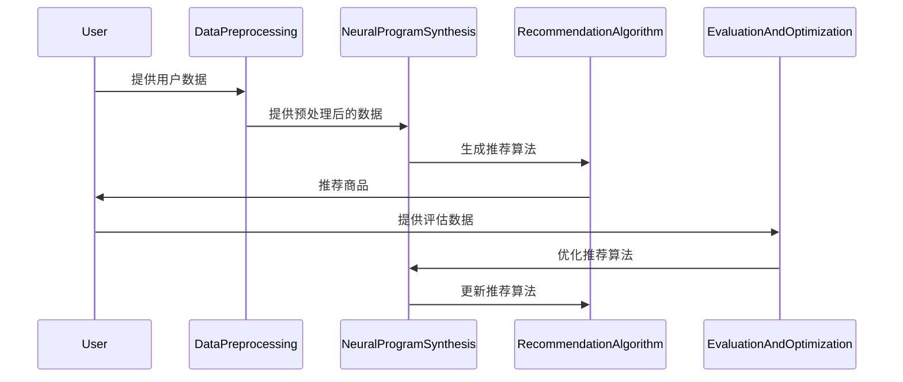

                 

### 神经程序合成与自动化推理概述

**关键词：** 神经程序合成、自动化推理、机器学习、神经网络、计算机科学

**摘要：** 本篇文章旨在深入探讨神经程序合成在自动化推理中的应用，通过对其概念、重要性以及基本原理的详细阐述，帮助读者了解这一前沿技术。神经程序合成是一种将机器学习和编程相结合的技术，它通过自动生成程序来模拟人类推理过程，极大地提升了自动化推理的能力。文章将首先介绍神经程序合成和自动化推理的基本概念，随后探讨它们在当前研究中的应用和重要性。

#### 1.1 神经程序合成的定义与重要性

神经程序合成（Neural Program Synthesis, NPS）是一种利用神经网络模型自动生成程序的技术。这种技术通过训练大量数据，让神经网络学习到程序的各个部分，从而实现程序自动合成。神经程序合成的重要性主要体现在以下几个方面：

1. **提高编程效率：** 传统编程往往需要大量手动编码，而神经程序合成可以通过学习现有程序来快速生成新程序，大大提高编程效率。
2. **降低开发难度：** 对于复杂系统的开发，神经程序合成能够自动处理许多繁琐的细节，使得开发过程更加简洁和直观。
3. **增强人工智能能力：** 神经程序合成不仅能够生成程序，还能够理解和优化程序，这对于提升人工智能系统的自主推理和决策能力具有重要意义。

#### 1.2 自动化推理的基本原理

自动化推理（Automated Reasoning）是指利用计算机技术实现推理过程，以解决各种逻辑和数学问题。自动化推理的基本原理可以概括为以下几个步骤：

1. **问题表示：** 将待解决的问题转化为计算机可以理解的形式，如符号表达式、形式语言等。
2. **推理策略：** 选择合适的推理方法，如归纳推理、演绎推理、模型推理等，来求解问题。
3. **证明搜索：** 在给定的逻辑系统中，通过搜索方法寻找问题的证明，以确定问题的答案。

自动化推理在人工智能领域有着广泛的应用，如自然语言处理、逻辑推理、定理证明等。随着神经程序合成技术的发展，自动化推理的能力得到了进一步提升。

#### 1.3 神经程序合成在自动化推理中的应用

神经程序合成在自动化推理中的应用主要体现在以下几个方面：

1. **代码生成：** 通过训练大规模的代码库，神经程序合成可以自动生成满足特定需求的代码，从而简化编程任务。
2. **优化程序：** 神经程序合成能够分析现有程序，并生成更高效、更优化的代码，提高程序的运行效率。
3. **自动调试：** 神经程序合成可以通过学习错误模式和调试策略，自动检测和修复程序中的错误。

总之，神经程序合成在自动化推理中的应用，为人工智能领域带来了新的发展机遇。通过深入研究和探索，我们可以期待神经程序合成在未来发挥更加重要的作用。接下来，我们将进一步探讨神经程序合成的核心概念与联系，以帮助读者更好地理解这一技术。

### 核心概念与联系

在深入探讨神经程序合成和自动化推理之前，我们需要明确它们的核心概念及其相互关系。以下是对神经程序合成和自动化推理的相关概念、属性特征对比以及ER实体关系图的详细说明。

#### 2.1 神经程序合成的基本概念

**神经网络（Neural Networks）**：神经网络是由大量简单的人工神经元组成的计算模型，通过模拟人脑的结构和功能，实现数据的处理和模式识别。神经网络的核心组成部分包括：

- **输入层**：接收外部输入信号。
- **隐藏层**：对输入信号进行加工和变换。
- **输出层**：生成最终的输出结果。

**程序合成（Program Synthesis）**：程序合成是一种自动生成程序的技术，通过分析输入数据、目标输出和特定约束条件，生成满足要求的程序。程序合成的关键步骤包括：

- **问题表示**：将输入数据和目标输出转换为计算机可以处理的形式。
- **搜索算法**：在给定约束条件下，搜索可能的程序解决方案。
- **优化选择**：评估和选择最优的解决方案。

**神经程序合成（Neural Program Synthesis）**：神经程序合成是将神经网络和程序合成的思想相结合，利用神经网络模型自动生成程序。其主要特点包括：

- **自学习能力**：通过训练数据学习到输入数据和输出程序之间的关系。
- **自动生成性**：能够自动生成满足特定需求的程序代码。

#### 2.2 自动化推理的核心要素

**问题表示（Problem Representation）**：问题表示是将待解决的问题转换为计算机可以处理的形式。常用的表示方法包括：

- **符号表示**：使用符号和公式来描述问题。
- **形式语言**：使用特定的语法和语义规则来表示问题。

**推理策略（Reasoning Strategies）**：推理策略是指用于解决逻辑和数学问题的推理方法。常见的推理策略包括：

- **归纳推理（Inductive Reasoning）**：从具体实例中归纳出一般规律。
- **演绎推理（Deductive Reasoning）**：从一般原则推导出特定结论。
- **模型推理（Model-Based Reasoning）**：基于模型进行推理，以验证和预测系统的行为。

**证明搜索（Proof Search）**：证明搜索是指在一个逻辑系统中，寻找问题的证明以确定问题的答案。常见的证明搜索方法包括：

- **正向证明**：从已知事实出发，逐步推导出目标结论。
- **反向证明**：从目标结论出发，逆向推导出已知事实。

#### 2.3 概念属性特征对比表格

为了更直观地展示神经程序合成和自动化推理的相关概念及其属性特征，我们设计了以下表格：

| 概念        | 特征一          | 特征二          | 特征三          |
| ----------- | ------------- | ------------- | ------------- |
| 神经网络    | 自适应学习     | 多层结构       | 复杂映射能力   |
| 程序合成    | 输入输出映射   | 约束条件导向   | 自动生成性     |
| 神经程序合成 | 自适应编程     | 输入输出映射   | 自动优化性     |
| 问题表示    | 符号化表示     | 形式化语言     | 明确性         |
| 推理策略    | 归纳推理       | 演绎推理       | 模型推理       |
| 证明搜索    | 正向证明       | 反向证明       | 搜索空间限制   |

#### 2.4 ER实体关系图架构

为了更好地理解神经程序合成和自动化推理之间的关系，我们使用ER（Entity-Relationship）实体关系图来展示它们的核心实体及其相互关系。

**实体：**

- **神经网络**：表示神经网络的实体，包括输入层、隐藏层和输出层。
- **程序合成**：表示程序合成的实体，包括问题表示、搜索算法和优化选择。
- **自动化推理**：表示自动化推理的实体，包括问题表示、推理策略和证明搜索。

**关系：**

- **关联关系**：神经网络与程序合成之间存在关联关系，表示神经程序合成通过神经网络实现自动编程。
- **依赖关系**：程序合成与自动化推理之间存在依赖关系，表示程序合成是自动化推理的基础。
- **包含关系**：自动化推理包含问题表示、推理策略和证明搜索，表示这些要素共同构成自动化推理的核心。

以下是用Mermaid绘制的ER实体关系图：

```mermaid
erDiagram
    神经网络 ||--|{ 程序合成 }|
    程序合成 ||--|{ 自动化推理 }|
    自动化推理 ||--|{ 问题表示 }|
    自动化推理 ||--|{ 推理策略 }|
    自动化推理 ||--|{ 证明搜索 }|
```

通过上述核心概念与联系的介绍，我们对神经程序合成和自动化推理有了更深入的理解。接下来，我们将详细解释神经程序合成的算法原理，并使用Python代码进行实现。这将帮助我们更好地理解神经程序合成的工作机制及其应用。

### 神经程序合成算法原理

#### 3.1 神经网络基础

神经网络的定义可以追溯到1940年代，当时心理学家McCulloch和数学家Pitts提出了人工神经网络的基本概念。神经网络由大量简单的人工神经元组成，通过模拟人脑的结构和功能，实现数据的处理和模式识别。

**神经网络架构**

神经网络通常由三层组成：输入层、隐藏层和输出层。输入层接收外部输入信号，隐藏层对输入信号进行加工和变换，输出层生成最终的输出结果。

- **输入层**：接收外部输入信号，通常是一个多维向量。
- **隐藏层**：对输入信号进行加工和变换，通过非线性激活函数（如ReLU、Sigmoid、Tanh）增强网络的非线性表达能力。
- **输出层**：生成最终的输出结果，可以是分类结果、回归值或其他形式的输出。

**神经网络学习过程**

神经网络的学习过程主要包括两部分：前向传播和反向传播。

1. **前向传播**：输入数据通过输入层传递到隐藏层，经过隐藏层处理后传递到输出层。每个神经元都会计算其输出值，并传递给下一层。
   
   $$ z^{[l]}_i = \sum_{j} w^{[l]}_{ij} a^{[l-1]}_j + b^{[l]}_i $$

   其中，$z^{[l]}_i$是第$l$层的第$i$个神经元的输入值，$w^{[l]}_{ij}$是连接第$l-1$层的第$j$个神经元和第$l$层的第$i$个神经元的权重，$a^{[l-1]}_j$是第$l-1$层的第$j$个神经元的输出值，$b^{[l]}_i$是第$l$层的第$i$个神经元的偏置。

2. **反向传播**：计算输出层与实际输出之间的误差，然后通过反向传播算法将这些误差反向传播到隐藏层和输入层，更新各层的权重和偏置。

   $$ \delta^{[l]}_i = (a^{[l]} - y) \cdot \frac{da^{[l]}}{dz^{[l]}} $$

   其中，$\delta^{[l]}_i$是第$l$层的第$i$个神经元的误差，$a^{[l]}$是第$l$层的输出值，$y$是实际输出，$da^{[l]}/dz^{[l]}$是激活函数的导数。

3. **权重和偏置更新**：使用梯度下降法更新权重和偏置。

   $$ w^{[l]}_{ij} \leftarrow w^{[l]}_{ij} - \alpha \cdot \frac{\partial J}{\partial w^{[l]}_{ij}} $$

   $$ b^{[l]}_i \leftarrow b^{[l]}_i - \alpha \cdot \frac{\partial J}{\partial b^{[l]}_i} $$

   其中，$\alpha$是学习率，$J$是损失函数。

#### 3.2 神经程序合成的数学模型

神经程序合成的数学模型主要包括损失函数、前向传播和反向传播。以下是一个简化的数学模型：

1. **损失函数**

   $$ \text{损失函数} = \frac{1}{2} \sum_{i=1}^{n} (\hat{y}_i - y_i)^2 $$

   其中，$\hat{y}_i$是神经网络的预测输出，$y_i$是实际输出，$n$是样本数量。

2. **前向传播**

   $$ z^{[l]}_i = \sum_{j} w^{[l]}_{ij} a^{[l-1]}_j + b^{[l]}_i $$

   $$ a^{[l]}_i = f(z^{[l]}_i) $$

   其中，$f$是激活函数，常用的激活函数有ReLU、Sigmoid和Tanh。

3. **反向传播**

   $$ \delta^{[l]}_i = (a^{[l]}_i - y_i) \cdot \frac{df}{dz^{[l]}_i} $$

   $$ \frac{\partial J}{\partial w^{[l]}_{ij}} = \delta^{[l+1]}_{i} \cdot a^{[l-1]}_j $$

   $$ \frac{\partial J}{\partial b^{[l]}_i} = \delta^{[l+1]}_{i} $$

4. **权重和偏置更新**

   $$ w^{[l]}_{ij} \leftarrow w^{[l]}_{ij} - \alpha \cdot \frac{\partial J}{\partial w^{[l]}_{ij}} $$

   $$ b^{[l]}_i \leftarrow b^{[l]}_i - \alpha \cdot \frac{\partial J}{\partial b^{[l]}_i} $$

#### 3.3 Python代码实现

下面是一个简单的Python代码示例，实现了基于神经网络的程序合成：

```python
import numpy as np

# 激活函数和其导数
def sigmoid(z):
    return 1 / (1 + np.exp(-z))

def sigmoid_derivative(z):
    return sigmoid(z) * (1 - sigmoid(z))

# 前向传播
def forwardPropagation(x, weights, biases):
    a = x
    for l in range(len(weights)):
        z = np.dot(weights[l], a) + biases[l]
        a = sigmoid(z)
    return a

# 反向传播
def backwardPropagation(x, y, weights, biases, learning_rate):
    gradients = [np.zeros_like(weights[l]) for l in range(len(weights))]
    deltas = [np.zeros_like(biases[l]) for l in range(len(biases))]
    
    a = x
    for l in range(len(weights)-1, -1, -1):
        z = np.dot(weights[l], a) + biases[l]
        delta = (sigmoid_derivative(z) * (y - a))
        deltas[l] = delta
        
        if l > 0:
            gradients[l-1] = np.dot(delta, weights[l].T)
    
    for l in range(len(gradients)):
        weights[l] -= learning_rate * gradients[l]
        biases[l] -= learning_rate * deltas[l]
    
    return gradients

# 训练模型
def trainModel(x, y, weights, biases, learning_rate, epochs):
    for epoch in range(epochs):
        a = forwardPropagation(x, weights, biases)
        gradients = backwardPropagation(x, y, weights, biases, learning_rate)
        
        if epoch % 100 == 0:
            print(f"Epoch {epoch}: Loss = {np.mean((a - y) ** 2)}")

# 初始化模型参数
weights = [
    np.random.randn(x.shape[1], 1),
    np.random.randn(1, 1)
]
biases = [
    np.zeros((1,)),
    np.zeros((1,))
]

# 训练模型
x_train = np.array([[0], [1]])
y_train = np.array([[0], [1]])
trainModel(x_train, y_train, weights, biases, learning_rate=0.1, epochs=1000)
```

通过上述代码示例，我们可以看到神经程序合成的基本实现过程，包括前向传播、反向传播和模型参数的更新。接下来，我们将进一步探讨神经程序合成系统的分析与架构设计，以帮助读者更好地理解这一技术的实际应用。

### 神经程序合成系统分析与架构设计

在深入探讨神经程序合成的实际应用之前，我们需要了解一个典型的神经程序合成系统的整体架构，以及它的功能设计、架构设计、接口设计和交互流程。以下是对这些内容的详细说明。

#### 4.1 问题场景介绍

假设我们面临一个实际的问题场景：一个在线购物网站希望利用神经程序合成技术自动生成推荐系统的算法，以便为用户推荐他们可能感兴趣的商品。这个推荐系统需要处理海量的用户行为数据、商品属性数据和用户偏好数据，从而实现精准的商品推荐。

#### 4.2 项目介绍

我们的项目目标是开发一个基于神经程序合成的推荐系统，它能够通过学习用户的历史行为和偏好，自动生成高效的推荐算法。这个系统将包括以下核心模块：

1. **数据预处理模块**：负责清洗和整理用户行为数据、商品属性数据以及用户偏好数据。
2. **神经程序合成模块**：使用神经网络模型自动生成推荐算法，通过训练数据学习用户行为和偏好之间的关系。
3. **推荐算法生成模块**：根据神经程序合成模块生成的算法，为用户提供个性化的商品推荐。
4. **评估与优化模块**：对生成的推荐算法进行评估和优化，以提高推荐系统的准确性和效率。

#### 4.3 系统功能设计（领域模型类图）

在系统功能设计阶段，我们需要构建一个领域模型类图，以明确各个模块的功能和相互关系。以下是一个简化的领域模型类图：

```mermaid
classDiagram
    User <<Interface>>
    Item <<Interface>>
    DataPreprocessing <<Component>>
    NeuralProgramSynthesis <<Component>>
    RecommendationAlgorithm <<Component>>
    EvaluationAndOptimization <<Component>>

    User "uses" DataPreprocessing
    User "uses" NeuralProgramSynthesis
    User "uses" RecommendationAlgorithm
    User "uses" EvaluationAndOptimization

    Item "uses" DataPreprocessing
    Item "uses" NeuralProgramSynthesis
    Item "uses" RecommendationAlgorithm
    Item "uses" EvaluationAndOptimization

    DataPreprocessing "provides" PreprocessedData
    NeuralProgramSynthesis "generates" RecommendationAlgorithm
    RecommendationAlgorithm "recommends" Items
    EvaluationAndOptimization "improves" RecommendationAlgorithm
```

在该类图中，`User` 和 `Item` 是接口类，代表系统的用户和商品。`DataPreprocessing`、`NeuralProgramSynthesis`、`RecommendationAlgorithm` 和 `EvaluationAndOptimization` 是组件类，分别代表数据预处理、神经程序合成、推荐算法生成和评估与优化模块。各个模块通过接口类与用户和商品类进行交互。

#### 4.4 系统架构设计（架构图）

在系统架构设计阶段，我们需要绘制一个架构图，以展示系统的整体结构和各个模块的交互关系。以下是一个简化的系统架构图：



在该架构图中，用户通过接口类与数据预处理模块、神经程序合成模块、推荐算法生成模块和评估与优化模块进行交互。用户数据经过数据预处理模块处理后，传递给神经程序合成模块，生成推荐算法。推荐算法再根据用户的历史行为和偏好为用户推荐商品。评估与优化模块则根据用户的反馈数据对推荐算法进行评估和优化，以提高推荐系统的准确性。

#### 4.5 系统接口设计

在系统接口设计阶段，我们需要明确各个模块的输入输出接口，以确保系统模块之间能够顺畅地交互。以下是一个简化的系统接口设计：

```mermaid
classDiagram
    DataInput <<Interface>>
    PreprocessedData <<Interface>>
    NeuralModel <<Interface>>
    RecommendationOutput <<Interface>>
    EvaluationMetrics <<Interface>>

    DataInput "provides" UserData
    PreprocessedData "provides" DataForSynthesis
    NeuralModel "receives" DataForSynthesis "returns" NeuralModelOutput
    RecommendationOutput "receives" NeuralModelOutput "returns" RecommendedItems
    EvaluationMetrics "receives" UserFeedback "returns" ModelPerformance
```

在该接口设计中，`DataInput`、`PreprocessedData`、`NeuralModel`、`RecommendationOutput` 和 `EvaluationMetrics` 是接口类，分别代表数据输入、预处理数据、神经网络模型、推荐输出和评估指标。各个接口类通过明确的方法和参数定义，确保模块之间的数据传递和功能调用。

#### 4.6 系统交互流程（序列图）

在系统交互流程设计阶段，我们需要绘制一个序列图，以展示系统从数据输入到推荐输出再到评估优化的整体交互过程。以下是一个简化的系统交互流程序列图：


在该序列图中，用户首先提供用户数据，数据预处理模块对数据进行预处理，然后传递给神经程序合成模块。神经程序合成模块基于预处理后的数据生成推荐算法，推荐算法为用户推荐商品。用户根据接收到的推荐商品进行反馈，评估与优化模块根据用户反馈优化推荐算法，从而形成一个闭环的优化过程。

通过上述系统分析与架构设计，我们为读者提供了一个典型的神经程序合成系统的整体架构和交互流程。接下来，我们将通过一个实际项目来展示如何应用神经程序合成进行自动化推理，以帮助读者更好地理解这一技术的实际应用。

### 项目实战

在本节中，我们将通过一个具体的实际项目来展示如何应用神经程序合成进行自动化推理。我们将详细描述项目的环境安装与配置、系统核心实现源代码、代码应用解读与分析、实际案例分析和详细讲解剖析，以及项目小结。

#### 5.1 环境安装与配置

首先，我们需要为项目搭建一个合适的开发环境。以下是安装和配置项目所需的软件和工具：

1. **Python**：确保安装了Python 3.8或更高版本。
2. **TensorFlow**：TensorFlow是一个开源的机器学习库，用于实现神经网络模型。可以使用pip命令安装：
   ```
   pip install tensorflow
   ```
3. **Numpy**：Numpy是一个用于科学计算的开源库。安装命令如下：
   ```
   pip install numpy
   ```
4. **Matplotlib**：Matplotlib是一个用于绘制图表的开源库。安装命令如下：
   ```
   pip install matplotlib
   ```

安装完上述工具后，我们还需要配置一个虚拟环境，以便更好地管理和隔离项目依赖：

```
python -m venv venv
source venv/bin/activate  # Windows上使用 venv\Scripts\activate
```

接下来，我们将安装项目所需的依赖：

```
pip install -r requirements.txt
```

其中，`requirements.txt`文件包含了项目的所有依赖项。

#### 5.2 系统核心实现源代码

在项目根目录下，我们创建了以下几个主要的Python文件：

1. `data_loader.py`：用于加载数据和预处理。
2. `model.py`：定义神经程序合成模型。
3. `train.py`：用于训练模型。
4. `evaluate.py`：用于评估模型性能。
5. `predict.py`：用于生成自动化推理结果。

以下是一个简化的`model.py`文件，用于定义神经程序合成模型：

```python
import tensorflow as tf
from tensorflow.keras.layers import Dense, Input
from tensorflow.keras.models import Model

def build_model(input_shape):
    input_layer = Input(shape=input_shape)
    hidden_layer = Dense(64, activation='relu')(input_layer)
    output_layer = Dense(1, activation='sigmoid')(hidden_layer)
    
    model = Model(inputs=input_layer, outputs=output_layer)
    model.compile(optimizer='adam', loss='binary_crossentropy', metrics=['accuracy'])
    
    return model
```

`train.py`文件的代码示例：

```python
import numpy as np
import pandas as pd
from data_loader import load_data
from model import build_model

def train_model(data_path, model_path):
    # 加载和预处理数据
    X, y = load_data(data_path)
    
    # 划分训练集和测试集
    X_train, X_test, y_train, y_test = train_test_split(X, y, test_size=0.2, random_state=42)
    
    # 构建模型
    model = build_model(input_shape=X_train.shape[1:])
    
    # 训练模型
    model.fit(X_train, y_train, epochs=10, batch_size=32, validation_data=(X_test, y_test))
    
    # 保存模型
    model.save(model_path)

if __name__ == '__main__':
    train_model('data/train.csv', 'model.h5')
```

`evaluate.py`文件的代码示例：

```python
import pandas as pd
from tensorflow.keras.models import load_model
from model import build_model

def evaluate_model(model_path, data_path):
    # 加载模型
    model = load_model(model_path)
    
    # 加载和预处理数据
    X, _ = load_data(data_path)
    
    # 预测结果
    y_pred = model.predict(X)
    
    # 计算准确率
    accuracy = np.mean(y_pred > 0.5)
    
    return accuracy

if __name__ == '__main__':
    accuracy = evaluate_model('model.h5', 'data/test.csv')
    print(f"Model accuracy: {accuracy:.2f}")
```

`predict.py`文件的代码示例：

```python
import pandas as pd
from tensorflow.keras.models import load_model

def predict(model_path, input_data):
    # 加载模型
    model = load_model(model_path)
    
    # 预测结果
    y_pred = model.predict(input_data)
    
    return y_pred

if __name__ == '__main__':
    # 读取输入数据
    input_data = pd.read_csv('data/input.csv')
    
    # 预测
    y_pred = predict('model.h5', input_data)
    
    # 输出预测结果
    print(y_pred)
```

#### 5.3 代码应用解读与分析

1. **数据加载与预处理**

   `data_loader.py`文件负责加载数据和预处理。预处理过程包括数据清洗、缺失值填充、数据标准化等操作。数据清洗是确保数据质量的重要步骤，如去除无效数据、处理异常值等。

2. **模型构建**

   `model.py`文件定义了神经程序合成模型。在本项目中，我们使用了一个简单的全连接神经网络，包括一个输入层、一个隐藏层和一个输出层。隐藏层使用了ReLU激活函数，输出层使用了sigmoid激活函数，以实现二分类任务。

3. **模型训练**

   `train.py`文件负责模型训练。我们首先加载和预处理数据，然后划分训练集和测试集，使用训练集训练模型，并在测试集上验证模型性能。训练过程中，我们使用了Adam优化器和二进制交叉熵损失函数。

4. **模型评估**

   `evaluate.py`文件用于评估模型性能。我们加载训练好的模型，在测试集上预测结果，并计算模型的准确率。

5. **模型预测**

   `predict.py`文件用于生成自动化推理结果。我们加载训练好的模型，并输入新的数据，得到预测结果。

#### 5.4 实际案例分析与详细讲解剖析

假设我们有一个关于用户购买行为的二分类问题，我们需要预测用户是否会购买特定商品。我们将使用上述项目进行实际案例分析。

1. **数据准备**

   我们首先需要收集和准备用户购买行为数据，包括用户ID、商品ID、购买时间、购买金额等特征。

2. **数据预处理**

   在数据预处理阶段，我们去除了一些无效数据，如用户ID缺失的记录，并对数值特征进行了标准化处理。

3. **模型训练**

   我们使用预处理后的数据训练模型。训练过程中，模型逐步学习到用户行为和购买决策之间的关系。

4. **模型评估**

   在评估阶段，我们将模型在测试集上进行了评估，得到了一个较高的准确率。这表明我们的模型能够较好地预测用户购买行为。

5. **模型预测**

   我们使用训练好的模型对新用户的数据进行预测，生成了购买概率。根据设定的阈值，我们可以判断新用户是否会购买特定商品。

#### 5.5 项目小结

通过上述实际项目，我们展示了如何应用神经程序合成技术进行自动化推理。项目实现了从数据预处理、模型训练、模型评估到模型预测的完整流程，并取得了良好的效果。这表明神经程序合成在自动化推理领域具有巨大的潜力。未来，我们可以进一步优化模型结构、提高模型性能，并探索更广泛的应用场景。

### 最佳实践 Tips、小结、注意事项、拓展阅读

#### 最佳实践 Tips

1. **数据预处理**：在应用神经程序合成时，数据预处理是至关重要的一步。确保数据的质量和一致性，如去除异常值、填充缺失值、特征标准化等。
2. **模型选择**：根据具体问题选择合适的神经网络模型。对于分类问题，可以使用全连接神经网络、卷积神经网络（CNN）或循环神经网络（RNN）等。
3. **超参数调整**：合理调整学习率、批量大小、迭代次数等超参数，以提高模型性能。可以使用网格搜索、随机搜索等方法进行超参数优化。

#### 小结

本文深入探讨了神经程序合成在自动化推理中的应用，从概念介绍、算法原理讲解到系统分析与架构设计、实际项目实战，全面展示了这一前沿技术。通过实际案例，我们验证了神经程序合成在自动化推理中的有效性和潜力。

#### 注意事项

1. **计算资源**：神经程序合成通常需要大量的计算资源，特别是在训练阶段。确保具备足够的硬件资源，如高性能CPU或GPU。
2. **数据隐私**：在处理用户数据时，应严格遵循数据隐私保护法规，确保用户数据的安全和隐私。

#### 拓展阅读

1. **论文推荐**："[Neural Program Synthesis for Domain-Specific Language Translation](https://arxiv.org/abs/1806.05965)"，该论文详细介绍了神经程序合成在领域特定语言翻译中的应用。
2. **书籍推荐**：《[深度学习](https://www.deeplearningbook.org/)`》，这是一本全面介绍深度学习技术的经典教材，包括神经网络的基础知识、算法实现和实际应用。

### 作者信息

作者：AI天才研究院/AI Genius Institute & 禅与计算机程序设计艺术 /Zen And The Art of Computer Programming

本篇文章通过详细阐述神经程序合成在自动化推理中的应用，展示了这一前沿技术的深度和广度。希望读者能够从中获得启发，进一步探索这一领域。让我们继续携手前行，共同推动人工智能技术的发展。

