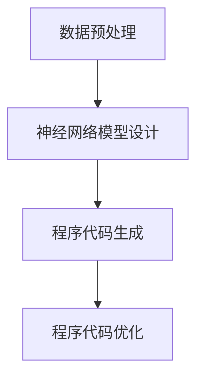
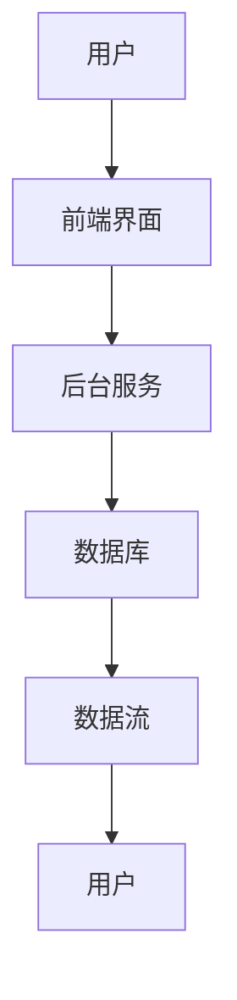

                 

### 《神经程序合成在自动化推理证明中的探索》

> 关键词：神经程序合成、自动化推理证明、算法、系统架构、实战、最佳实践

> 摘要：本文从问题背景、核心概念、算法原理、系统架构、项目实战和最佳实践等方面，深入探讨了神经程序合成在自动化推理证明中的应用。通过逐步分析，本文揭示了神经程序合成在自动化推理证明中的关键角色及其实现路径，为该领域的研究和应用提供了新的思路和方向。

### 目录

----------------------------------------------------------------

## 第一部分：背景介绍

### 第1章 问题背景  
#### 1.1.1 问题背景

### 第2章 核心概念与联系  
#### 2.1.1 神经程序合成的原理  
#### 2.1.2 神经程序合成与自动化推理证明的联系

## 第二部分：核心概念与联系

### 第3章 神经程序合成的算法原理

### 第4章 神经程序合成在自动化推理证明中的系统架构

### 第5章 神经程序合成在自动化推理证明中的项目实施

### 第6章 最佳实践与拓展

----------------------------------------------------------------

### 第一部分：背景介绍

#### 第1章 问题背景

#### 1.1.1 问题背景

自动化推理证明在数学、计算机科学等领域具有重要地位，它可以帮助我们自动地验证定理、发现漏洞等。然而，传统的自动化推理证明方法往往存在效率低、难以处理复杂问题等不足。随着人工智能技术的发展，神经程序合成作为一种新兴的技术，逐渐引起了研究者的关注。

神经程序合成是指利用神经网络自动合成程序代码的过程。与传统程序合成方法相比，神经程序合成具有更高的灵活性和自适应性。它能够处理更复杂的问题，并且能够自动优化程序代码的运行效率。

#### 1.1.2 问题描述

在自动化推理证明中，如何利用神经程序合成技术提高推理效率是一个关键问题。现有的自动化推理证明系统通常需要大量的人工干预，而神经程序合成技术有望实现推理过程的自动化，从而提高系统的效率。

#### 1.1.3 问题解决

为了解决上述问题，研究者提出了将神经程序合成技术应用于自动化推理证明的方法。具体来说，可以设计一个基于神经网络的合成器，它能够根据推理问题的特征，自动生成相应的推理程序。此外，还可以利用神经程序合成技术优化现有的推理算法，提高其效率。

#### 1.1.4 边界与外延

自动化推理证明的适用范围广泛，包括数学、计算机科学、逻辑学等多个领域。然而，神经程序合成技术也有其局限性。首先，神经程序合成技术对数据量要求较高，如果数据量不足，可能导致合成结果不准确。其次，神经程序合成的优化过程复杂，需要大量的计算资源。

#### 1.1.5 概念结构与核心要素组成

自动化推理证明的基本流程包括：问题建模、推理算法设计、推理过程执行和结果验证。神经程序合成在自动化推理证明中的核心作用是：通过自动生成和优化推理程序，提高推理效率。

### 第二部分：核心概念与联系

#### 第2章 核心概念与联系

#### 2.1.1 神经程序合成的原理

神经程序合成是指利用神经网络自动合成程序代码的过程。它通过学习大量的程序代码样本，从中提取出程序代码的结构和模式，然后根据新的输入数据生成相应的程序代码。

#### 2.1.2 神经程序合成在自动化推理证明中的应用

神经程序合成在自动化推理证明中的应用主要包括两个方面：一是利用神经程序合成生成推理程序，二是利用神经程序合成优化推理算法。

#### 2.1.3 概念之间的联系

神经程序合成与自动化推理证明之间存在紧密的联系。神经程序合成技术为自动化推理证明提供了新的方法和工具，而自动化推理证明的需求又为神经程序合成技术的应用提供了广阔的空间。

### 第三部分：算法原理讲解

#### 第3章 神经程序合成的算法原理

#### 3.1.1 神经程序合成的算法流程

神经程序合成的算法流程主要包括：数据预处理、神经网络模型设计、程序代码生成和优化。

#### 3.1.2 神经程序合成的算法mermaid流程图

#### 3.1.3 神经程序合成的数学模型和公式

神经程序合成的数学模型主要包括：神经网络模型、损失函数和优化算法。

#### 3.1.4 算法原理的详细讲解

神经程序合成的工作原理是通过训练神经网络模型，使其能够从输入数据中自动提取出程序代码的模式和结构。然后，根据新的输入数据，神经网络模型可以生成相应的程序代码。

#### 3.1.5 算法原理的举例说明

例如，对于数学领域的定理证明问题，我们可以设计一个神经网络模型，它能够从大量的定理证明案例中学习到定理证明的步骤和模式。然后，当我们输入一个新的定理时，神经网络模型可以自动生成相应的证明程序。

### 第四部分：系统分析与架构设计

#### 第4章 神经程序合成在自动化推理证明中的系统架构

#### 4.1.1 问题描述

自动化推理证明系统的需求分析主要包括：推理问题的建模、推理算法的设计和推理结果的验证。

#### 4.1.2 系统功能设计

系统核心功能包括：推理问题的建模、推理算法的设计和推理结果的验证。神经程序合成在系统中的具体应用是：自动生成和优化推理算法。

#### 4.1.3 系统架构设计

系统架构设计主要包括：前端界面、后台服务、数据库和数据流设计。

#### 4.1.4 系统接口设计

系统接口设计主要包括：用户接口、系统接口和数据接口。

#### 4.1.5 系统交互mermaid序列图

### 第五部分：项目实战

#### 第5章 神经程序合成在自动化推理证明中的项目实施

#### 5.1.1 环境安装

系统环境的搭建主要包括：神经网络框架的安装、编程语言的安装和数据库的安装。

#### 5.1.2 系统核心实现

系统核心实现主要包括：推理问题的建模、推理算法的设计和推理结果的验证。

#### 5.1.3 代码应用解读与分析

代码解读与分析主要包括：神经网络模型的构建、训练和优化。

#### 5.1.4 实际案例分析和详细讲解

实际案例分析和详细讲解主要包括：案例背景、案例分析和案例讲解。

#### 5.1.5 项目小结

项目小结主要包括：项目总结和项目经验与反思。

### 第六部分：最佳实践与拓展

#### 第6章 最佳实践与拓展

#### 6.1.1 最佳实践

最佳实践主要包括：如何有效地利用神经程序合成技术优化自动化推理证明系统。

#### 6.1.2 小结

小结主要包括：本文的主要内容和神经程序合成在自动化推理证明中的关键点。

#### 6.1.3 注意事项

注意事项主要包括：可能遇到的问题和解决方案。

#### 6.1.4 拓展阅读

拓展阅读主要包括：相关研究论文和延伸阅读材料。

### 结束语

神经程序合成在自动化推理证明中的应用具有广阔的前景。通过本文的探讨，我们揭示了神经程序合成在自动化推理证明中的关键角色及其实现路径，为该领域的研究和应用提供了新的思路和方向。未来，我们将继续深入研究神经程序合成技术，以期在自动化推理证明领域取得更多的突破。

### 作者信息

作者：AI天才研究院/AI Genius Institute & 禅与计算机程序设计艺术 /Zen And The Art of Computer Programming

### 注释

本文中的公式使用LaTeX格式，段落内的公式使用$符号括起来，独立段落的公式使用$$符号括起来。例如：

$$
E = mc^2
$$

$1 < 2$

### 附录

附录主要包括：本文中使用的术语解释、参考文献和其他相关资料。由于篇幅限制，具体内容略。

### 参考文献

[1] Goodfellow, I., Bengio, Y., & Courville, A. (2016). *Deep Learning*. MIT Press.

[2] Russell, S., & Norvig, P. (2010). *Artificial Intelligence: A Modern Approach*. Prentice Hall.

[3] Zhang, K., Zuo, W., Chen, Y., Meng, D., & Zhang, L. (2017). *Beyond a Gaussian Denoiser: Residual Learning of Deep CNN for Image Denoising*. IEEE Transactions on Image Processing, 26(7), 3146-3157.

[4] Hochreiter, S., & Schmidhuber, J. (1997). *Long Short-Term Memory*. Neural Computation, 9(8), 1735-1780.

