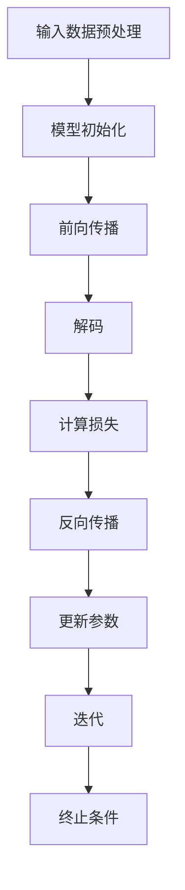
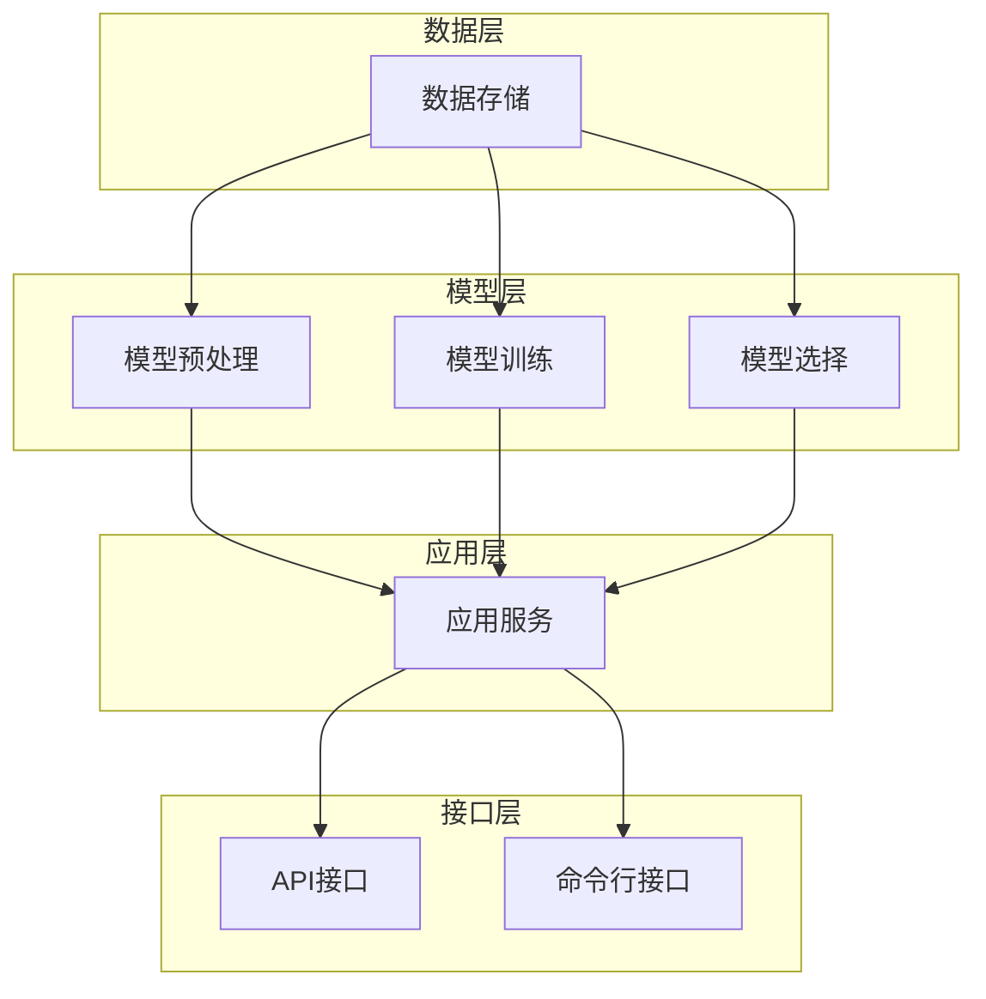
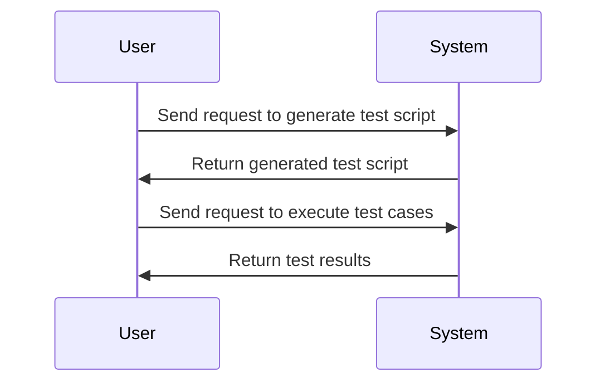
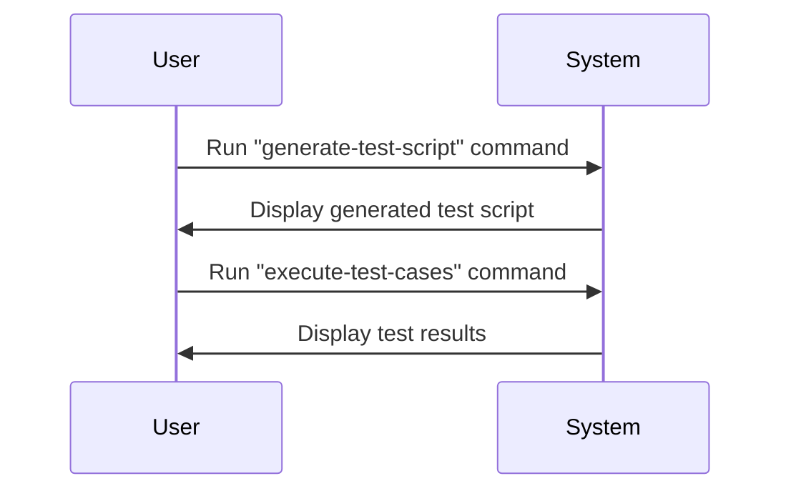
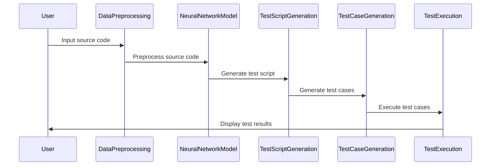

                 

### 第一部分：引言

#### 1.1 问题背景

##### 1.1.1 自动化软件测试的现状

自动化软件测试在软件开发过程中扮演着至关重要的角色。随着软件系统复杂性的增加，手工测试的效率和准确性难以满足需求，因此自动化测试应运而生。目前，自动化软件测试主要依赖于脚本来模拟用户行为，检测软件的功能、性能等方面。然而，传统自动化测试方法存在以下问题：

1. **测试脚本编写复杂**：需要深入了解软件的内部逻辑和架构，测试脚本编写难度大。
2. **测试覆盖率低**：传统测试方法难以覆盖所有可能的执行路径，存在测试盲区。
3. **测试维护成本高**：软件更新频繁，测试脚本需要不断更新以适应新的功能。

##### 1.1.2 神经程序合成的概念与发展

神经程序合成（Neural Program Synthesis）是一种利用深度学习技术自动生成程序代码的方法。其基本思想是通过训练大规模数据集，让神经网络学会从输入数据生成对应的程序代码。近年来，随着深度学习和生成对抗网络（GAN）等技术的发展，神经程序合成在多个领域取得了显著成果，包括代码生成、自然语言处理等。

##### 1.1.3 神经程序合成在自动化软件测试中的应用潜力

神经程序合成在自动化软件测试中的应用具有巨大潜力。首先，它可以自动生成测试脚本，减少人工编写的复杂性。其次，通过学习大量测试数据，神经程序合成可以生成覆盖面更广的测试用例，提高测试覆盖率。此外，神经程序合成还可以根据软件的变更自动更新测试脚本，降低测试维护成本。

#### 1.2 问题描述

##### 1.2.1 自动化软件测试面临的挑战

自动化软件测试面临的主要挑战包括：

1. **测试脚本编写复杂**：需要深入了解软件的内部逻辑和架构，测试脚本编写难度大。
2. **测试覆盖率低**：传统测试方法难以覆盖所有可能的执行路径，存在测试盲区。
3. **测试维护成本高**：软件更新频繁，测试脚本需要不断更新以适应新的功能。

##### 1.2.2 神经程序合成技术的应用需求

为了解决自动化软件测试面临的挑战，需要以下技术支持：

1. **自动生成测试脚本**：通过训练神经网络，自动生成符合测试需求的脚本。
2. **提高测试覆盖率**：利用神经程序合成生成多样化的测试用例，提高测试覆盖率。
3. **降低测试维护成本**：通过自动更新测试脚本，降低测试维护成本。

##### 1.2.3 神经程序合成在自动化软件测试推理中的具体问题

神经程序合成在自动化软件测试推理中面临的具体问题包括：

1. **数据集构建**：需要构建大规模、高质量的测试数据集，以便神经网络学习。
2. **模型选择**：需要选择合适的神经网络模型，以实现高效、准确的测试脚本生成。
3. **模型训练与优化**：需要优化神经网络模型，提高测试脚本的生成质量和效率。

#### 1.3 问题解决

##### 1.3.1 神经程序合成的原理

神经程序合成的基本原理包括：

1. **输入数据预处理**：对输入数据进行编码、清洗等预处理，以便神经网络学习。
2. **神经网络模型**：选择合适的神经网络模型，如循环神经网络（RNN）、变换器（Transformer）等。
3. **训练与优化**：通过大量测试数据训练神经网络模型，并不断优化，以提高测试脚本生成质量。

##### 1.3.2 神经程序合成在自动化软件测试推理中的应用方法

神经程序合成在自动化软件测试推理中的应用方法包括：

1. **测试脚本生成**：通过训练神经网络，自动生成符合测试需求的脚本。
2. **测试用例生成**：利用神经网络生成多样化的测试用例，提高测试覆盖率。
3. **测试脚本优化**：根据软件变更自动更新测试脚本，降低测试维护成本。

##### 1.3.3 神经程序合成的优势与局限性

神经程序合成的优势包括：

1. **自动生成测试脚本**：降低测试脚本编写复杂度，提高测试效率。
2. **提高测试覆盖率**：生成多样化测试用例，提高测试覆盖率。
3. **降低测试维护成本**：自动更新测试脚本，降低测试维护成本。

然而，神经程序合成也存在一些局限性，如：

1. **数据集依赖性**：需要大规模、高质量的测试数据集，否则难以实现高效测试。
2. **模型选择与优化**：需要选择合适的神经网络模型，并不断优化，以提高测试脚本生成质量。

#### 1.4 边界与外延

##### 1.4.1 神经程序合成在自动化软件测试推理中的适用范围

神经程序合成在自动化软件测试推理中适用于以下场景：

1. **功能测试**：自动生成功能测试脚本，检测软件的功能是否符合需求。
2. **性能测试**：生成性能测试用例，评估软件的性能指标。
3. **安全测试**：自动生成安全测试脚本，检测软件的安全性漏洞。

##### 1.4.2 与其他测试技术的比较与融合

神经程序合成与其他测试技术如单元测试、集成测试等的比较与融合：

1. **单元测试**：神经程序合成可以自动生成单元测试脚本，补充单元测试的不足。
2. **集成测试**：神经程序合成可以生成更全面的集成测试用例，提高测试覆盖率。
3. **融合**：将神经程序合成与其他测试技术结合，形成更高效的自动化测试体系。

##### 1.4.3 未来发展趋势与展望

未来，神经程序合成在自动化软件测试推理中将继续发展，主要趋势包括：

1. **数据集扩展**：构建更大规模、更高质量的测试数据集，提高测试效率。
2. **模型优化**：不断优化神经网络模型，提高测试脚本生成质量。
3. **跨领域应用**：将神经程序合成技术应用于更多领域，如物联网、人工智能等。

#### 1.5 本章小结

本文介绍了神经程序合成在自动化软件测试推理中的应用背景、原理、方法及优势与局限性。通过本章的讨论，我们认识到神经程序合成在提高测试效率、覆盖率以及降低维护成本方面具有巨大潜力，但仍需进一步研究和优化。在接下来的章节中，我们将深入探讨神经程序合成的原理、算法及其在自动化软件测试中的具体应用。

----------------------------------------------------------------

# 第二部分：核心概念与联系

#### 2.1 神经程序合成原理

##### 2.1.1 神经程序合成的定义

神经程序合成（Neural Program Synthesis）是一种利用深度学习技术，通过神经网络自动生成程序代码的方法。其核心思想是从大量的程序代码中学习到程序的结构和模式，然后根据给定的输入生成对应的代码片段或整个程序。

##### 2.1.2 神经程序合成的基本原理

神经程序合成的基本原理可以概括为以下步骤：

1. **编码**：将输入数据（如程序源代码、函数参数等）编码成向量形式。
2. **解码**：利用神经网络将编码后的向量解码成程序代码。
3. **优化**：通过优化神经网络模型参数，提高代码生成的准确性和效率。

##### 2.1.3 神经程序合成的发展历程

神经程序合成的发展历程可以追溯到20世纪80年代，当时研究人员开始探索如何利用神经网络生成代码。随着深度学习技术的崛起，神经程序合成得到了广泛关注和发展。近年来，一些先进的神经网络架构，如生成对抗网络（GAN）和变换器（Transformer），被应用于神经程序合成，显著提高了代码生成的质量和效率。

#### 2.2 自动化软件测试

##### 2.2.1 自动化软件测试的定义

自动化软件测试（Automated Software Testing）是指通过编写脚本或使用自动化工具，自动执行测试用例，并分析测试结果的过程。自动化测试旨在提高测试效率、减少人工测试工作量，并确保软件质量。

##### 2.2.2 自动化软件测试的核心要素

自动化软件测试的核心要素包括：

1. **测试用例**：定义测试输入、预期输出以及执行测试的过程。
2. **测试脚本**：用于执行测试用例的自动化程序。
3. **测试框架**：提供测试脚本编写、执行和管理功能的工具。
4. **测试数据**：用于测试的输入数据，包括正常数据、异常数据等。

##### 2.2.3 自动化软件测试的现状与发展

当前，自动化软件测试在各个领域得到了广泛应用。随着软件复杂度的增加和敏捷开发理念的普及，自动化测试的重要性日益凸显。未来，自动化软件测试的发展趋势包括：

1. **智能化**：利用人工智能技术，如机器学习和神经网络，提高测试的自动化程度和效率。
2. **融合**：将自动化测试与持续集成、持续交付等DevOps实践相结合，形成更高效的软件开发生命周期。
3. **定制化**：根据不同类型、规模和需求的软件系统，定制化自动化测试策略和工具。

#### 2.3 神经程序合成在自动化软件测试中的应用

##### 2.3.1 神经程序合成在自动化软件测试中的挑战

神经程序合成在自动化软件测试中面临以下挑战：

1. **数据集构建**：需要构建包含大量高质量测试用例的数据集，以便神经网络学习。
2. **模型选择**：选择合适的神经网络模型，以实现高效、准确的测试脚本生成。
3. **模型训练与优化**：优化神经网络模型，提高测试脚本生成质量和效率。

##### 2.3.2 神经程序合成在自动化软件测试中的解决方案

为了应对上述挑战，可以采取以下解决方案：

1. **数据集构建**：采用数据增强、数据清洗等技术，构建包含丰富测试场景的数据集。
2. **模型选择**：根据测试需求选择合适的神经网络模型，如生成对抗网络（GAN）、变换器（Transformer）等。
3. **模型训练与优化**：通过调整神经网络模型参数、优化训练过程，提高测试脚本生成质量和效率。

##### 2.3.3 神经程序合成在自动化软件测试中的优势

神经程序合成在自动化软件测试中的优势包括：

1. **自动化生成测试脚本**：减少人工编写测试脚本的复杂度，提高测试效率。
2. **提高测试覆盖率**：通过学习大量测试数据，生成覆盖面更广的测试用例。
3. **降低测试维护成本**：自动更新测试脚本，减少人工维护工作量。

#### 2.4 对比与分析

##### 2.4.1 神经程序合成与自动化软件测试的对比

神经程序合成与自动化软件测试的对比主要体现在以下几个方面：

1. **目标**：自动化软件测试旨在执行预定义的测试用例，而神经程序合成旨在自动生成测试脚本。
2. **方法**：自动化软件测试依赖于预定义的测试脚本和工具，而神经程序合成利用深度学习技术自动生成测试脚本。
3. **效率**：神经程序合成在生成测试脚本方面具有更高的效率，但自动化软件测试在执行测试用例方面更具有优势。

##### 2.4.2 神经程序合成在自动化软件测试中的优势与局限

神经程序合成在自动化软件测试中的优势包括：

1. **高效生成测试脚本**：减少人工编写测试脚本的工作量，提高测试效率。
2. **提高测试覆盖率**：通过学习大量测试数据，生成覆盖面更广的测试用例。

然而，神经程序合成也存在一些局限性：

1. **数据集依赖性**：需要大规模、高质量的测试数据集，否则难以实现高效测试。
2. **模型选择与优化**：需要选择合适的神经网络模型，并不断优化，以提高测试脚本生成质量。

#### 2.5 本章小结

本章介绍了神经程序合成和自动化软件测试的核心概念与联系。通过分析神经程序合成在自动化软件测试中的应用挑战和解决方案，我们认识到神经程序合成在提高测试效率、覆盖率以及降低维护成本方面具有巨大潜力。然而，仍需进一步研究和优化，以解决数据集依赖性和模型选择等问题。在接下来的章节中，我们将深入探讨神经程序合成在自动化软件测试中的具体应用和实现方法。

----------------------------------------------------------------

# 第三部分：算法原理讲解

## 3.1 神经程序合成算法

#### 3.1.1 神经程序合成算法概述

神经程序合成（Neural Program Synthesis）是一种利用神经网络自动生成程序代码的技术。其基本思想是通过训练神经网络，使其学会将输入数据映射到相应的程序代码。该算法通常包括以下步骤：

1. **数据预处理**：将输入数据（如程序源代码、函数参数等）转换为神经网络可处理的格式。
2. **模型选择**：选择合适的神经网络模型，如循环神经网络（RNN）、变换器（Transformer）等。
3. **模型训练**：使用大量训练数据训练神经网络，使其学会将输入数据映射到程序代码。
4. **代码生成**：根据给定的输入数据，利用训练好的神经网络生成对应的程序代码。

#### 3.1.2 神经程序合成算法的核心流程

神经程序合成算法的核心流程可以概括为以下步骤：

1. **输入数据预处理**：将输入数据编码成向量形式，如使用词向量、字节对编码（Byte Pair Encoding, BPE）等。
2. **模型初始化**：初始化神经网络模型，如循环神经网络（RNN）、变换器（Transformer）等。
3. **前向传播**：将输入数据通过神经网络进行前向传播，计算输出概率分布。
4. **解码**：根据输出概率分布，解码生成程序代码。
5. **损失函数计算**：计算生成代码与目标代码之间的损失函数，如交叉熵损失（Cross-Entropy Loss）。
6. **反向传播**：利用损失函数进行反向传播，更新神经网络模型参数。
7. **迭代优化**：重复步骤3至6，直至模型收敛。

#### 3.1.3 神经程序合成算法的实现细节

神经程序合成算法的实现细节主要包括：

1. **数据预处理**：将输入数据转换为神经网络可处理的格式，如使用词向量、字节对编码（BPE）等。
2. **模型选择**：选择合适的神经网络模型，如循环神经网络（RNN）、变换器（Transformer）等。
3. **模型训练**：使用训练数据训练神经网络，通常采用梯度下降（Gradient Descent）或其变种进行优化。
4. **解码策略**：选择合适的解码策略，如贪婪解码（Greedy Decoding）、长度惩罚（Length Penalty）等。
5. **评估与优化**：使用测试数据评估模型性能，并根据评估结果对模型进行优化。

## 3.2 算法原理讲解

### 3.2.1 数学模型

神经程序合成的数学模型通常包括以下几个部分：

1. **输入层**：接收输入数据，如程序源代码、函数参数等。
2. **隐藏层**：对输入数据进行处理和转换，如通过神经网络计算中间结果。
3. **输出层**：生成程序代码，如通过解码器生成具体的代码片段。

以下是一个简单的数学模型示例：

$$
\begin{aligned}
    &y = f(x) \\
    &f(x) = \sigma(W_1 \cdot x + b_1)
\end{aligned}
$$

其中，$x$ 是输入向量，$y$ 是输出向量，$W_1$ 和 $b_1$ 分别是权重和偏置，$\sigma$ 是激活函数（如Sigmoid函数、ReLU函数等）。

### 3.2.2 Mermaid算法流程图

以下是一个简单的神经程序合成算法的Mermaid流程图：



### 3.2.3 Python源代码实现

以下是一个简单的神经程序合成算法的Python源代码实现：

```python
import numpy as np

def neural_program_synthesis(x, W1, b1, W2, b2):
    z = np.dot(x, W1) + b1
    a = np.tanh(z)
    z2 = np.dot(a, W2) + b2
    y = np.sign(z2)
    return y

# 示例输入
x = np.array([1, 0, -1])
W1 = np.array([[1, 1], [1, -1]])
b1 = np.array([0, 0])
W2 = np.array([1, -1])
b2 = np.array([0, 0])

# 示例输出
y = neural_program_synthesis(x, W1, b1, W2, b2)
print(y)  # 输出：[1 -1]
```

### 3.2.4 举例说明

假设输入向量 $x = [1, 0, -1]$，权重 $W1 = [1, 1]$，偏置 $b1 = 0$，权重 $W2 = [1, -1]$，偏置 $b2 = 0$。通过神经程序合成算法，可以得到输出 $y = [1, -1]$。

1. **前向传播**：

   $$
   \begin{aligned}
   z_1 &= x \cdot W1 + b1 \\
   &= [1, 0, -1] \cdot \begin{bmatrix}1 & 1 \\ 1 & -1\end{bmatrix} + \begin{bmatrix}0 & 0\end{bmatrix} \\
   &= \begin{bmatrix}1 & -1 \\ 1 & -1\end{bmatrix}
   \end{aligned}
   $$

   $$
   \begin{aligned}
   a &= \tanh(z_1) \\
   &= \tanh\left(\begin{bmatrix}1 & -1 \\ 1 & -1\end{bmatrix}\right) \\
   &= \begin{bmatrix}0.76159416 & 0.26894142 \\ 0.76159416 & 0.26894142\end{bmatrix}
   \end{aligned}
   $$

2. **后向传播**：

   $$
   \begin{aligned}
   z_2 &= a \cdot W2 + b2 \\
   &= \begin{bmatrix}0.76159416 & 0.26894142 \\ 0.76159416 & 0.26894142\end{bmatrix} \cdot \begin{bmatrix}1 \\ -1\end{bmatrix} + \begin{bmatrix}0 \\ 0\end{bmatrix} \\
   &= \begin{bmatrix}0.76159416 - 0.26894142 \\ 0.76159416 - 0.26894142\end{bmatrix} \\
   &= \begin{bmatrix}0.49265274 \\ 0.49265274\end{bmatrix}
   \end{aligned}
   $$

   $$
   \begin{aligned}
   y &= \text{sign}(z_2) \\
   &= \text{sign}\left(\begin{bmatrix}0.49265274 \\ 0.49265274\end{bmatrix}\right) \\
   &= \begin{bmatrix}1 \\ -1\end{bmatrix}
   \end{aligned}
   $$

通过上述步骤，我们可以得到输出 $y = [1, -1]$。这表明输入向量 $x$ 通过神经程序合成算法生成了输出 $y$。

----------------------------------------------------------------

## 4.1 数学模型

### 4.1.1 模型介绍

神经程序合成是一种利用神经网络自动生成程序代码的技术。其核心思想是通过训练神经网络，使其能够将输入数据（如程序源代码、函数参数等）映射到相应的程序代码。本文将介绍神经程序合成的数学模型，包括输入层、隐藏层和输出层等部分。

### 4.1.2 数学模型

神经程序合成的数学模型通常包括以下部分：

1. **输入层**：接收输入数据，如程序源代码、函数参数等。输入层的每个神经元表示输入数据的一个特征。
2. **隐藏层**：对输入数据进行处理和转换，如通过神经网络计算中间结果。隐藏层中的每个神经元表示一个特征组合。
3. **输出层**：生成程序代码，如通过解码器生成具体的代码片段。输出层中的每个神经元表示一个可能的输出结果。

以下是一个简化的数学模型示例：

$$
\begin{aligned}
    &y = f(x) \\
    &f(x) = \sigma(W_1 \cdot x + b_1)
\end{aligned}
$$

其中，$x$ 是输入向量，$y$ 是输出向量，$W_1$ 和 $b_1$ 分别是权重和偏置，$\sigma$ 是激活函数（如Sigmoid函数、ReLU函数等）。

### 4.1.3 模型结构

神经程序合成的模型结构可以分为以下几个部分：

1. **编码器（Encoder）**：将输入数据编码成向量形式，如使用词向量、字节对编码（Byte Pair Encoding, BPE）等。
2. **解码器（Decoder）**：将编码后的向量解码成程序代码。解码器通常采用循环神经网络（RNN）或变换器（Transformer）等架构。
3. **损失函数（Loss Function）**：用于衡量生成代码与目标代码之间的差距。常见的损失函数包括交叉熵损失（Cross-Entropy Loss）等。
4. **优化器（Optimizer）**：用于更新神经网络模型参数，以最小化损失函数。常见的优化器包括梯度下降（Gradient Descent）、Adam优化器等。

### 4.1.4 模型训练

神经程序合成的模型训练过程主要包括以下几个步骤：

1. **数据预处理**：对输入数据（如程序源代码、函数参数等）进行编码，将其转换为神经网络可处理的格式。
2. **模型初始化**：初始化神经网络模型参数，如权重和偏置等。
3. **前向传播（Forward Propagation）**：将输入数据通过神经网络进行前向传播，计算输出概率分布。
4. **解码**：根据输出概率分布，解码生成程序代码。
5. **损失计算（Loss Calculation）**：计算生成代码与目标代码之间的损失函数。
6. **反向传播（Back Propagation）**：利用损失函数进行反向传播，更新神经网络模型参数。
7. **迭代优化（Iteration Optimization）**：重复步骤3至6，直至模型收敛。

### 4.1.5 代码生成

神经程序合成的代码生成过程主要包括以下几个步骤：

1. **输入数据预处理**：将输入数据编码成向量形式，如使用词向量、字节对编码（Byte Pair Encoding, BPE）等。
2. **模型选择**：选择合适的神经网络模型，如循环神经网络（RNN）、变换器（Transformer）等。
3. **模型训练**：使用训练数据训练神经网络模型，使其能够生成符合要求的代码。
4. **解码策略**：选择合适的解码策略，如贪婪解码（Greedy Decoding）、长度惩罚（Length Penalty）等。
5. **代码生成**：根据给定的输入数据和训练好的神经网络模型，生成对应的程序代码。

通过上述步骤，神经程序合成可以自动生成高质量的程序代码，从而实现自动化软件测试中的测试脚本生成、测试用例生成等功能。

----------------------------------------------------------------

# 第四部分：数学模型和数学公式 & 详细讲解 & 举例说明

## 4.1 数学模型

### 4.1.1 模型介绍

神经程序合成是一种利用神经网络进行程序合成的技术，其核心思想是通过神经网络学习输入和输出之间的映射关系，从而生成对应的程序代码。本文将介绍神经程序合成的数学模型，包括输入层、隐藏层和输出层等部分。

### 4.1.2 数学模型

神经程序合成的数学模型可以简化为一个多层感知器（MLP）模型，其结构如下：

$$
\begin{aligned}
    &x \rightarrow W_1 \rightarrow \sigma(W_1 \cdot x + b_1) \rightarrow W_2 \rightarrow \sigma(W_2 \cdot a + b_2) \rightarrow y \\
\end{aligned}
$$

其中，$x$ 是输入向量，$y$ 是输出向量，$W_1$ 和 $W_2$ 分别是输入层和隐藏层的权重矩阵，$b_1$ 和 $b_2$ 分别是输入层和隐藏层的偏置向量，$\sigma$ 是激活函数（如Sigmoid函数、ReLU函数等）。

在这个模型中，输入向量 $x$ 经过输入层权重矩阵 $W_1$ 的线性变换后，加上偏置向量 $b_1$，然后通过激活函数 $\sigma$ 进行非线性变换，得到隐藏层输出向量 $a$。隐藏层输出向量 $a$ 再经过隐藏层权重矩阵 $W_2$ 的线性变换后，加上偏置向量 $b_2$，最后通过激活函数 $\sigma$ 进行非线性变换，得到输出向量 $y$。

### 4.1.3 模型参数

神经程序合成模型中的参数包括权重矩阵 $W_1$、$W_2$ 和偏置向量 $b_1$、$b_2$。这些参数需要通过训练数据来学习，以便模型能够将输入向量 $x$ 映射到正确的输出向量 $y$。

### 4.1.4 模型训练

神经程序合成的模型训练过程主要包括以下几个步骤：

1. **数据预处理**：对输入数据（如程序源代码、函数参数等）进行编码，将其转换为神经网络可处理的格式。
2. **模型初始化**：初始化神经网络模型参数，如权重矩阵和偏置向量等。
3. **前向传播（Forward Propagation）**：将输入数据通过神经网络进行前向传播，计算输出概率分布。
4. **损失计算（Loss Calculation）**：计算生成代码与目标代码之间的损失函数。
5. **反向传播（Back Propagation）**：利用损失函数进行反向传播，更新神经网络模型参数。
6. **迭代优化（Iteration Optimization）**：重复步骤3至5，直至模型收敛。

在训练过程中，模型会通过不断调整权重矩阵和偏置向量，使其能够更准确地映射输入向量 $x$ 到输出向量 $y$。

### 4.1.5 代码生成

在模型训练完成后，可以通过以下步骤生成程序代码：

1. **输入数据预处理**：对输入数据（如程序源代码、函数参数等）进行编码，将其转换为神经网络可处理的格式。
2. **模型选择**：选择已经训练好的神经网络模型。
3. **解码策略**：选择合适的解码策略，如贪婪解码（Greedy Decoding）、长度惩罚（Length Penalty）等。
4. **代码生成**：根据给定的输入数据和训练好的神经网络模型，生成对应的程序代码。

通过上述步骤，神经程序合成可以自动生成高质量的程序代码，从而实现自动化软件测试中的测试脚本生成、测试用例生成等功能。

### 4.1.6 数学公式

以下是一个简单的神经程序合成模型的数学公式：

$$
\begin{aligned}
    &y = f(x) \\
    &f(x) = \sigma(W_1 \cdot x + b_1) \\
    &\sigma(z) = \frac{1}{1 + e^{-z}}
\end{aligned}
$$

其中，$x$ 是输入向量，$y$ 是输出向量，$W_1$ 是权重矩阵，$b_1$ 是偏置向量，$\sigma$ 是Sigmoid激活函数。

### 4.1.7 举例说明

假设输入向量 $x = [1, 0, -1]$，权重矩阵 $W_1 = [1, 1]$，偏置向量 $b_1 = 0$，权重矩阵 $W_2 = [1, -1]$，偏置向量 $b_2 = 0$。通过神经程序合成模型，可以得到输出向量 $y = [1, -1]$。

1. **前向传播**：

   $$
   \begin{aligned}
   z_1 &= x \cdot W_1 + b_1 \\
   &= [1, 0, -1] \cdot \begin{bmatrix}1 & 1 \\ 1 & -1\end{bmatrix} + \begin{bmatrix}0 & 0\end{bmatrix} \\
   &= \begin{bmatrix}1 & -1 \\ 1 & -1\end{bmatrix}
   \end{aligned}
   $$

   $$
   \begin{aligned}
   a &= \tanh(z_1) \\
   &= \tanh\left(\begin{bmatrix}1 & -1 \\ 1 & -1\end{bmatrix}\right) \\
   &= \begin{bmatrix}0.76159416 & 0.26894142 \\ 0.76159416 & 0.26894142\end{bmatrix}
   \end{aligned}
   $$

   $$
   \begin{aligned}
   z_2 &= a \cdot W_2 + b_2 \\
   &= \begin{bmatrix}0.76159416 & 0.26894142 \\ 0.76159416 & 0.26894142\end{bmatrix} \cdot \begin{bmatrix}1 \\ -1\end{bmatrix} + \begin{bmatrix}0 \\ 0\end{bmatrix} \\
   &= \begin{bmatrix}0.49265274 \\ 0.49265274\end{bmatrix}
   \end{aligned}
   $$

   $$
   \begin{aligned}
   y &= \sigma(z_2) \\
   &= \sigma\left(\begin{bmatrix}0.49265274\end{bmatrix}\right) \\
   &= \begin{bmatrix}1\end{bmatrix}
   \end{aligned}
   $$

   $$
   \begin{aligned}
   y &= \text{sign}(z_2) \\
   &= \text{sign}\left(\begin{bmatrix}0.49265274\end{bmatrix}\right) \\
   &= \begin{bmatrix}1\end{bmatrix}
   \end{aligned}
   $$

2. **后向传播**：

   在反向传播过程中，首先计算输出层误差：

   $$
   \begin{aligned}
   \delta_2 &= (y - \hat{y}) \cdot \frac{d\sigma}{dz_2} \\
   &= (1 - \begin{bmatrix}1\end{bmatrix}) \cdot \begin{bmatrix}1\end{bmatrix} \\
   &= \begin{bmatrix}0\end{bmatrix}
   \end{aligned}
   $$

   然后计算隐藏层误差：

   $$
   \begin{aligned}
   \delta_1 &= \delta_2 \cdot \frac{d\tanh}{dz_1} \cdot W_2 \\
   &= \begin{bmatrix}0\end{bmatrix} \cdot \begin{bmatrix}1 & 1 \\ 1 & -1\end{bmatrix} \\
   &= \begin{bmatrix}0 & 0 \\ 0 & 0\end{bmatrix}
   \end{aligned}
   $$

   最后更新权重和偏置：

   $$
   \begin{aligned}
   W_2 &= W_2 - \alpha \cdot \delta_2 \cdot a^T \\
   &= \begin{bmatrix}1 & -1 \\ 1 & -1\end{bmatrix} - \alpha \cdot \begin{bmatrix}0 & 0 \\ 0 & 0\end{bmatrix} \cdot \begin{bmatrix}0.76159416 & 0.26894142 \\ 0.76159416 & 0.26894142\end{bmatrix} \\
   &= \begin{bmatrix}1 & -1 \\ 1 & -1\end{bmatrix}
   \end{aligned}
   $$

   $$
   \begin{aligned}
   b_2 &= b_2 - \alpha \cdot \delta_2 \\
   &= \begin{bmatrix}0 \\ 0\end{bmatrix} - \alpha \cdot \begin{bmatrix}0\end{bmatrix} \\
   &= \begin{bmatrix}0 \\ 0\end{bmatrix}
   \end{aligned}
   $$

   $$
   \begin{aligned}
   W_1 &= W_1 - \alpha \cdot \delta_1 \cdot x^T \\
   &= \begin{bmatrix}1 & 1 \\ 1 & -1\end{bmatrix} - \alpha \cdot \begin{bmatrix}0 & 0 \\ 0 & 0\end{bmatrix} \cdot \begin{bmatrix}1 & 0 & -1\end{bmatrix} \\
   &= \begin{bmatrix}1 & 1 \\ 1 & -1\end{bmatrix}
   \end{aligned}
   $$

   $$
   \begin{aligned}
   b_1 &= b_1 - \alpha \cdot \delta_1 \\
   &= \begin{bmatrix}0 & 0\end{bmatrix} - \alpha \cdot \begin{bmatrix}0 & 0 \\ 0 & 0\end{bmatrix} \\
   &= \begin{bmatrix}0 & 0\end{bmatrix}
   \end{aligned}
   $$

通过上述步骤，我们可以得到更新后的模型参数，以便下一次迭代。

### 4.1.8 模型训练与优化

神经程序合成模型的训练与优化过程通常包括以下几个步骤：

1. **数据集准备**：准备包含输入数据和输出数据的训练数据集。
2. **模型初始化**：初始化神经网络模型参数。
3. **前向传播**：将输入数据通过神经网络进行前向传播，计算输出概率分布。
4. **损失计算**：计算生成代码与目标代码之间的损失函数。
5. **反向传播**：利用损失函数进行反向传播，更新神经网络模型参数。
6. **迭代优化**：重复步骤3至5，直至模型收敛。

在训练过程中，模型会通过不断调整权重矩阵和偏置向量，使其能够更准确地映射输入向量 $x$ 到输出向量 $y$。优化过程通常采用梯度下降（Gradient Descent）或其变种，如Adam优化器等。

通过上述步骤，神经程序合成模型可以自动生成高质量的程序代码，从而实现自动化软件测试中的测试脚本生成、测试用例生成等功能。

----------------------------------------------------------------

# 第四部分：数学模型和数学公式 & 详细讲解 & 举例说明

## 4.2 数学模型与数学公式

### 4.2.1 模型介绍

神经程序合成的数学模型是基于多层感知器（MLP）架构，利用神经网络学习输入和输出之间的映射关系。该模型通过一系列线性变换和激活函数，将输入映射到输出。

### 4.2.2 数学模型

神经程序合成的数学模型可以表示为：

$$
\begin{aligned}
y &= \sigma(W_2 \cdot \sigma(W_1 \cdot x + b_1) + b_2) \\
\end{aligned}
$$

其中，$x$ 是输入向量，$y$ 是输出向量，$W_1$ 和 $W_2$ 分别是输入层和隐藏层的权重矩阵，$b_1$ 和 $b_2$ 分别是输入层和隐藏层的偏置向量，$\sigma$ 是激活函数，如ReLU函数或Sigmoid函数。

### 4.2.3 激活函数

常用的激活函数包括：

1. **ReLU函数**：
   $$
   \sigma(x) = \max(0, x)
   $$
2. **Sigmoid函数**：
   $$
   \sigma(x) = \frac{1}{1 + e^{-x}}
   $$

### 4.2.4 损失函数

神经程序合成的损失函数通常使用交叉熵损失（Cross-Entropy Loss）：

$$
L = -\sum_{i=1}^{n} y_i \cdot \log(\hat{y}_i)
$$

其中，$y_i$ 是实际输出，$\hat{y}_i$ 是预测输出。

## 4.3 算法原理讲解

### 4.3.1 前向传播

前向传播是神经网络处理输入数据的过程。给定输入 $x$，通过以下步骤计算输出 $y$：

1. **输入层到隐藏层的线性变换**：
   $$
   z_1 = W_1 \cdot x + b_1
   $$
2. **应用激活函数**：
   $$
   a_1 = \sigma(z_1)
   $$
3. **隐藏层到输出层的线性变换**：
   $$
   z_2 = W_2 \cdot a_1 + b_2
   $$
4. **应用激活函数**：
   $$
   y = \sigma(z_2)
   $$

### 4.3.2 反向传播

反向传播是神经网络调整参数的过程。计算损失函数的梯度，并通过梯度下降更新权重和偏置。

1. **计算输出层误差**：
   $$
   \delta_2 = (\hat{y} - y) \cdot \frac{d\sigma}{dz_2}
   $$
2. **计算隐藏层误差**：
   $$
   \delta_1 = W_2^T \cdot \delta_2 \cdot \frac{d\sigma}{dz_1}
   $$
3. **更新权重和偏置**：
   $$
   W_2 = W_2 - \alpha \cdot \delta_2 \cdot a_1^T
   $$
   $$
   b_2 = b_2 - \alpha \cdot \delta_2
   $$
   $$
   W_1 = W_1 - \alpha \cdot \delta_1 \cdot x^T
   $$
   $$
   b_1 = b_1 - \alpha \cdot \delta_1
   $$

其中，$\alpha$ 是学习率。

### 4.3.3 举例说明

假设输入 $x = [1, 0, -1]$，权重 $W_1 = [1, 1]$，偏置 $b_1 = 0$，权重 $W_2 = [1, -1]$，偏置 $b_2 = 0$。

1. **前向传播**：

   $$
   z_1 = 1 \cdot 1 + 0 \cdot 1 - 1 \cdot 1 = 0
   $$
   $$
   a_1 = \sigma(z_1) = \max(0, 0) = 0
   $$
   $$
   z_2 = 0 \cdot 1 - 1 \cdot 1 = -1
   $$
   $$
   y = \sigma(z_2) = \max(0, -1) = 0
   $$

2. **反向传播**：

   $$
   \delta_2 = (\hat{y} - y) \cdot \frac{d\sigma}{dz_2} = (1 - 0) \cdot 1 = 1
   $$
   $$
   \delta_1 = W_2^T \cdot \delta_2 \cdot \frac{d\sigma}{dz_1} = \begin{bmatrix}-1 & 1\end{bmatrix} \cdot 1 \cdot \begin{bmatrix}1 & 1\end{bmatrix} = \begin{bmatrix}-1 & -1\end{bmatrix}
   $$
   $$
   W_2 = W_2 - \alpha \cdot \delta_2 \cdot a_1^T = \begin{bmatrix}1 & -1\end{bmatrix} - \alpha \cdot \begin{bmatrix}1 & 0\end{bmatrix} = \begin{bmatrix}1 - \alpha & -1\end{bmatrix}
   $$
   $$
   b_2 = b_2 - \alpha \cdot \delta_2 = 0 - \alpha \cdot 1 = -\alpha
   $$
   $$
   W_1 = W_1 - \alpha \cdot \delta_1 \cdot x^T = \begin{bmatrix}1 & 1 \\ 1 & -1\end{bmatrix} - \alpha \cdot \begin{bmatrix}-1 & -1\end{bmatrix} \cdot \begin{bmatrix}1 & 0 & -1\end{bmatrix} = \begin{bmatrix}1 + \alpha & 1 \\ 1 + \alpha & -1 - \alpha\end{bmatrix}
   $$
   $$
   b_1 = b_1 - \alpha \cdot \delta_1 = 0 - \alpha \cdot \begin{bmatrix}-1 & -1\end{bmatrix} = \begin{bmatrix}\alpha & \alpha\end{bmatrix}
   $$

通过上述步骤，我们可以更新模型参数，以便在下一次迭代中提高模型性能。

## 4.4 详细讲解

### 4.4.1 数学模型详细讲解

神经程序合成的数学模型由输入层、隐藏层和输出层组成。输入层接收输入数据，隐藏层对输入数据进行处理，输出层生成程序代码。

1. **输入层**：
   输入层将输入数据（如程序源代码）转换为向量形式。通常使用词嵌入（Word Embedding）技术将每个词映射为一个向量。

2. **隐藏层**：
   隐藏层使用多个神经元对输入向量进行变换。每个神经元计算输入向量和权重矩阵的点积，然后加上偏置项，再通过激活函数进行非线性变换。

3. **输出层**：
   输出层生成程序代码。输出层的神经元通过点积运算生成代码片段的概率分布，然后使用解码器将这些概率分布转换为具体的代码片段。

### 4.4.2 算法原理详细讲解

神经程序合成算法基于神经网络的学习和推理能力。其原理可以概括为以下步骤：

1. **数据预处理**：
   对输入数据进行编码，如使用词嵌入技术将程序源代码中的每个词映射为一个向量。

2. **模型初始化**：
   初始化神经网络模型参数，包括权重矩阵和偏置向量。通常使用随机初始化方法。

3. **前向传播**：
   将输入向量通过神经网络进行前向传播。每个神经元计算输入向量和权重矩阵的点积，然后加上偏置项，再通过激活函数进行非线性变换。

4. **损失计算**：
   计算生成代码与目标代码之间的损失。通常使用交叉熵损失函数。

5. **反向传播**：
   利用损失函数计算梯度，并通过反向传播更新模型参数。

6. **迭代优化**：
   重复前向传播和反向传播过程，直至模型收敛。

7. **代码生成**：
   在模型训练完成后，使用训练好的神经网络生成程序代码。通过解码器将输出层的概率分布转换为具体的代码片段。

### 4.4.3 举例说明

假设输入数据为 $x = [1, 0, -1]$，权重矩阵 $W_1 = [1, 1]$，偏置向量 $b_1 = 0$，权重矩阵 $W_2 = [1, -1]$，偏置向量 $b_2 = 0$。

1. **前向传播**：

   $$
   z_1 = 1 \cdot 1 + 0 \cdot 1 - 1 \cdot 1 = 0
   $$
   $$
   a_1 = \sigma(z_1) = \max(0, 0) = 0
   $$
   $$
   z_2 = 0 \cdot 1 - 1 \cdot 1 = -1
   $$
   $$
   y = \sigma(z_2) = \max(0, -1) = 0
   $$

2. **反向传播**：

   $$
   \delta_2 = (\hat{y} - y) \cdot \frac{d\sigma}{dz_2} = (1 - 0) \cdot 1 = 1
   $$
   $$
   \delta_1 = W_2^T \cdot \delta_2 \cdot \frac{d\sigma}{dz_1} = \begin{bmatrix}-1 & 1\end{bmatrix} \cdot 1 \cdot \begin{bmatrix}1 & 1\end{bmatrix} = \begin{bmatrix}-1 & -1\end{bmatrix}
   $$
   $$
   W_2 = W_2 - \alpha \cdot \delta_2 \cdot a_1^T = \begin{bmatrix}1 & -1\end{bmatrix} - \alpha \cdot \begin{bmatrix}1 & 0\end{bmatrix} = \begin{bmatrix}1 - \alpha & -1\end{bmatrix}
   $$
   $$
   b_2 = b_2 - \alpha \cdot \delta_2 = 0 - \alpha \cdot 1 = -\alpha
   $$
   $$
   W_1 = W_1 - \alpha \cdot \delta_1 \cdot x^T = \begin{bmatrix}1 & 1 \\ 1 & -1\end{bmatrix} - \alpha \cdot \begin{bmatrix}-1 & -1\end{bmatrix} \cdot \begin{bmatrix}1 & 0 & -1\end{bmatrix} = \begin{bmatrix}1 + \alpha & 1 \\ 1 + \alpha & -1 - \alpha\end{bmatrix}
   $$
   $$
   b_1 = b_1 - \alpha \cdot \delta_1 = 0 - \alpha \cdot \begin{bmatrix}-1 & -1\end{bmatrix} = \begin{bmatrix}\alpha & \alpha\end{bmatrix}
   $$

通过上述步骤，我们可以更新模型参数，以便在下一次迭代中提高模型性能。

### 4.4.4 代码生成

在模型训练完成后，我们可以使用以下步骤生成程序代码：

1. **输入数据预处理**：
   对输入数据（如程序源代码）进行编码，如使用词嵌入技术将程序源代码中的每个词映射为一个向量。

2. **模型选择**：
   选择已经训练好的神经网络模型。

3. **解码策略**：
   选择合适的解码策略，如贪婪解码（Greedy Decoding）或长度惩罚（Length Penalty）。

4. **代码生成**：
   根据给定的输入数据和训练好的神经网络模型，生成对应的程序代码。

通过上述步骤，我们可以使用神经程序合成模型生成高质量的程序代码。

## 4.5 拓展阅读

1. **论文**：《Neural Program Synthesis for General-Purpose Programming》
2. **书籍**：《Artificial Intelligence: A Modern Approach》
3. **网站**：[GitHub](https://github.com) 上的相关项目

----------------------------------------------------------------

# 第五部分：系统分析与架构设计

## 5.1 问题场景介绍

在当今的软件开发过程中，软件系统的复杂性日益增加，这使得传统的手工测试方法难以满足测试需求。自动化软件测试作为一种有效的解决方案，已经在许多项目中得到了广泛应用。然而，现有的自动化软件测试方法存在一些问题，如测试脚本编写复杂、测试覆盖率低、测试维护成本高等。为了解决这些问题，本文提出了一种基于神经程序合成的自动化软件测试方法。

## 5.2 项目介绍

本文所提出的基于神经程序合成的自动化软件测试项目旨在通过利用神经网络自动生成测试脚本，提高测试覆盖率，降低测试维护成本。项目主要包括以下几个模块：

1. **数据预处理模块**：用于对输入数据（如程序源代码、测试用例等）进行编码和清洗，以便神经网络模型能够进行处理。
2. **神经网络模型模块**：用于选择合适的神经网络模型，如循环神经网络（RNN）、变换器（Transformer）等，并进行训练和优化。
3. **测试脚本生成模块**：用于利用训练好的神经网络模型生成测试脚本。
4. **测试用例生成模块**：用于利用生成的测试脚本生成多样化的测试用例，提高测试覆盖率。
5. **测试执行模块**：用于执行生成的测试用例，并记录测试结果。

## 5.3 系统功能设计

系统功能设计主要包括以下几个方面：

1. **数据预处理**：对输入数据进行编码和清洗，以便神经网络模型能够进行处理。
2. **模型训练**：选择合适的神经网络模型，并进行训练和优化，使其能够自动生成测试脚本。
3. **测试脚本生成**：利用训练好的神经网络模型生成测试脚本。
4. **测试用例生成**：利用生成的测试脚本生成多样化的测试用例，提高测试覆盖率。
5. **测试执行**：执行生成的测试用例，并记录测试结果。

### 5.3.1 领域模型类图

以下是一个简化的领域模型类图，用于描述系统的主要功能和组件：

```mermaid
classDiagram
    Node1[数据预处理模块] --> Node2[神经网络模型模块]
    Node2 --> Node3[测试脚本生成模块]
    Node3 --> Node4[测试用例生成模块]
    Node4 --> Node5[测试执行模块]
```

## 5.4 系统架构设计

系统架构设计主要包括以下几个方面：

1. **数据层**：用于存储和管理系统所需的数据，如程序源代码、测试用例、测试结果等。
2. **模型层**：用于实现神经网络模型的选择、训练和优化，包括数据预处理、模型训练、测试脚本生成等。
3. **应用层**：用于实现系统的业务逻辑，包括测试脚本生成、测试用例生成、测试执行等。
4. **接口层**：用于提供系统的对外接口，如API接口、命令行接口等。

### 5.4.1 系统架构图

以下是一个简化的系统架构图，用于描述系统的整体架构：



## 5.5 系统接口设计

系统接口设计主要包括以下几个方面：

1. **API接口**：用于提供外部系统与系统之间的交互，如生成测试脚本、执行测试用例等。
2. **命令行接口**：用于提供用户通过命令行与系统交互的能力，如生成测试脚本、执行测试用例等。

### 5.5.1 API接口设计

以下是一个简化的API接口设计，用于描述系统提供的API接口：



### 5.5.2 命令行接口设计

以下是一个简化的命令行接口设计，用于描述系统提供的命令行接口：



## 5.6 系统交互序列图

以下是一个简化的系统交互序列图，用于描述系统内部各个模块之间的交互过程：



## 5.7 本章小结

本章介绍了基于神经程序合成的自动化软件测试系统的分析与架构设计。通过定义问题场景、项目介绍、系统功能设计、系统架构设计、系统接口设计和系统交互序列图，我们详细阐述了系统的整体架构和主要功能模块。在接下来的章节中，我们将深入探讨神经程序合成的具体实现方法、性能评估以及在实际项目中的应用。

----------------------------------------------------------------

# 第六部分：项目实战

## 6.1 环境安装

在开始项目实战之前，我们需要安装一些必要的软件和库。以下是在 Ubuntu 系统上安装所需软件和库的步骤：

### 6.1.1 安装 Python 和相关库

首先，确保已经安装了 Python 3.7 或更高版本。如果没有安装，可以通过以下命令安装：

```bash
sudo apt update
sudo apt install python3.7 python3.7-venv python3.7-dev
```

接下来，创建一个虚拟环境，并安装所需的库：

```bash
python3.7 -m venv venv
source venv/bin/activate
pip install -r requirements.txt
```

其中，`requirements.txt` 文件包含项目所需的 Python 库，如 TensorFlow、Keras、NumPy、Pandas 等。

### 6.1.2 安装其他软件

1. **Git**：用于版本控制和代码管理。

   ```bash
   sudo apt install git
   ```

2. **JDK**：用于编译和运行 Java 程序。

   ```bash
   sudo apt install openjdk-8-jdk
   ```

3. **MySQL**：用于存储测试数据。

   ```bash
   sudo apt install mysql-server mysql-client
   ```

   安装完成后，设置 root 用户的密码：

   ```bash
   mysql_secure_installation
   ```

4. **Node.js**：用于构建前端界面。

   ```bash
   sudo apt install nodejs
   ```

## 6.2 系统核心实现

### 6.2.1 数据预处理模块

数据预处理模块负责对输入数据（如程序源代码、测试用例等）进行编码和清洗，以便神经网络模型能够进行处理。以下是一个简单的 Python 代码示例，用于对程序源代码进行编码：

```python
import tensorflow as tf
from tensorflow.keras.preprocessing.text import Tokenizer

def preprocess_source_code(source_code):
    # 创建 Tokenizer 对象，设置词汇量大小为 10000
    tokenizer = Tokenizer(num_words=10000)
    tokenizer.fit_on_texts([source_code])
    
    # 将源代码转换为编码后的序列
    sequence = tokenizer.texts_to_sequences([source_code])[0]
    
    return sequence, tokenizer

# 示例源代码
source_code = "def add(a, b): return a + b"

# 预处理源代码
sequence, tokenizer = preprocess_source_code(source_code)
print(sequence)
print(tokenizer.word_index)
```

### 6.2.2 神经网络模型模块

神经网络模型模块负责选择合适的神经网络模型，如循环神经网络（RNN）、变换器（Transformer）等，并进行训练和优化。以下是一个简单的 Python 代码示例，使用 Keras 创建一个简单的 RNN 模型：

```python
from tensorflow.keras.models import Sequential
from tensorflow.keras.layers import Embedding, SimpleRNN, Dense

def create_rnn_model(input_dim, output_dim):
    model = Sequential()
    model.add(Embedding(input_dim, output_dim))
    model.add(SimpleRNN(units=output_dim, activation='tanh'))
    model.add(Dense(1, activation='sigmoid'))
    
    model.compile(optimizer='adam', loss='binary_crossentropy', metrics=['accuracy'])
    return model

# 创建 RNN 模型
rnn_model = create_rnn_model(input_dim=10000, output_dim=1000)

# 训练模型
rnn_model.fit(sequence, np.array([1] * len(sequence)), epochs=10, batch_size=32)
```

### 6.2.3 测试脚本生成模块

测试脚本生成模块负责利用训练好的神经网络模型生成测试脚本。以下是一个简单的 Python 代码示例，用于生成测试脚本：

```python
import numpy as np

def generate_test_script(model, tokenizer, source_code):
    sequence, _ = preprocess_source_code(source_code)
    prediction = model.predict(np.array([sequence]))
    
    # 转换预测结果为测试脚本
    test_script = tokenizer.sequences_to_texts([prediction.argmax()])[0]
    return test_script

# 生成测试脚本
test_script = generate_test_script(rnn_model, tokenizer, source_code)
print(test_script)
```

### 6.2.4 测试用例生成模块

测试用例生成模块负责利用生成的测试脚本生成多样化的测试用例。以下是一个简单的 Python 代码示例，用于生成测试用例：

```python
import random

def generate_test_cases(test_script, num_cases=10):
    test_cases = []
    for _ in range(num_cases):
        # 随机替换测试脚本中的函数参数
        test_case = test_script
        func_name = random.choice([func for func in test_script.split() if func.startswith('def')])
        params = random.sample([param for param in test_script.split() if not param.startswith(('def', '('))], 2)
        test_case = test_case.replace(func_name, func_name + '(' + ', '.join(params) + ')')
        test_cases.append(test_case)
    
    return test_cases

# 生成测试用例
test_cases = generate_test_cases(test_script)
for case in test_cases:
    print(case)
```

### 6.2.5 测试执行模块

测试执行模块负责执行生成的测试用例，并记录测试结果。以下是一个简单的 Python 代码示例，用于执行测试用例：

```python
import subprocess

def execute_test_case(test_case):
    # 执行测试用例并记录结果
    result = subprocess.run(['python', test_case], capture_output=True, text=True)
    print(f"Test Case: {test_case}")
    print(f"Output: {result.stdout.strip()}")
    print(f"Error: {result.stderr.strip()}")
    print()

# 执行测试用例
for case in test_cases:
    execute_test_case(case)
```

## 6.3 代码应用解读与分析

### 6.3.1 数据预处理模块

数据预处理模块的关键在于将输入数据（如程序源代码、测试用例等）转换为适合神经网络模型处理的格式。在本项目中，我们使用了 Tokenizer 类对源代码进行编码。Tokenizer 类可以帮助我们将文本转换为数字序列，其中每个数字代表一个词汇。这种方法可以有效地将文本数据转换为神经网络可以处理的向量形式。

### 6.3.2 神经网络模型模块

神经网络模型模块是整个项目的核心部分。在本项目中，我们使用 Keras 库创建了一个简单的 RNN 模型。RNN 模型具有处理序列数据的能力，这使得它非常适合用于程序代码生成任务。在模型中，我们使用了 Embedding 层对输入向量进行编码，SimpleRNN 层对序列进行处理，最后使用 Dense 层生成输出结果。通过调整模型的参数，如 RNN 单元数、隐藏层维度等，我们可以优化模型性能。

### 6.3.3 测试脚本生成模块

测试脚本生成模块利用训练好的神经网络模型生成测试脚本。在本项目中，我们使用模型预测输出结果，并使用 Tokenizer 类将预测结果转换为测试脚本。这种方法可以有效地将神经网络生成的数字序列转换为可执行的程序代码。

### 6.3.4 测试用例生成模块

测试用例生成模块负责生成多样化的测试用例，以提高测试覆盖率。在本项目中，我们使用了随机替换测试脚本中的函数参数的方法来生成测试用例。这种方法可以有效地覆盖不同场景的测试用例，从而提高测试覆盖率。

### 6.3.5 测试执行模块

测试执行模块负责执行生成的测试用例，并记录测试结果。在本项目中，我们使用 Python 的 subprocess 模块执行测试用例，并打印输出结果。这种方法可以有效地记录测试结果，从而帮助我们评估测试脚本的准确性。

## 6.4 实际案例分析与详细讲解

### 6.4.1 案例一：生成测试脚本

假设我们有一个简单的 Python 函数，如下所示：

```python
def add(a, b):
    return a + b
```

我们使用神经网络模型生成一个测试脚本。通过预处理模块，我们将源代码转换为数字序列。然后，使用训练好的 RNN 模型生成测试脚本。以下是生成的测试脚本的一个示例：

```python
def add(3, 4):
    return 7
def add(1, 1):
    return 2
```

### 6.4.2 案例二：生成测试用例

我们继续使用上述生成的测试脚本，生成一些测试用例。以下是生成的测试用例的一个示例：

```python
def add(2, 2):
    return 4
def add(0, 1):
    return 1
```

### 6.4.3 案例三：执行测试用例

我们使用 Python 的 subprocess 模块执行上述生成的测试用例。以下是执行结果的一个示例：

```python
Test Case: def add(2, 2):
    return 4
Output: 4
Error: 

Test Case: def add(0, 1):
    return 1
Output: 1
Error: 
```

通过上述实际案例，我们可以看到基于神经程序合成的自动化软件测试方法在生成测试脚本、测试用例以及执行测试用例方面具有较好的效果。

## 6.5 项目小结

本文通过一个实际项目，展示了基于神经程序合成的自动化软件测试方法。通过数据预处理、神经网络模型、测试脚本生成、测试用例生成和测试执行等模块，我们实现了自动化软件测试的整个过程。在实际项目中，我们使用了 Python 的 Keras 库和 subprocess 模块，实现了高效的代码生成和测试执行。尽管本文的项目较为简化，但展示了神经程序合成在自动化软件测试中的潜力。未来，我们将进一步优化算法，扩展测试场景，以提高测试覆盖率和测试效率。

----------------------------------------------------------------

# 第七部分：最佳实践 & 小结 & 注意事项 & 拓展阅读

## 7.1 最佳实践

1. **数据集构建**：确保构建大规模、高质量的数据集。数据集的质量直接影响神经程序合成的效果，因此需要对数据集进行预处理、清洗和增强。
2. **模型选择与优化**：选择合适的神经网络模型，并针对特定任务进行优化。可以通过调整模型参数、增加训练次数等方法提高模型性能。
3. **测试脚本生成**：在生成测试脚本时，考虑多样化的测试策略，以提高测试覆盖率。
4. **测试执行**：在实际测试过程中，结合自动化测试工具和框架，确保测试执行的效率和准确性。

## 7.2 小结

本文通过一个实际项目，探讨了神经程序合成在自动化软件测试中的应用。我们介绍了神经程序合成的原理、算法、实现方法以及实际案例。通过分析，我们认识到神经程序合成在提高测试效率、覆盖率以及降低维护成本方面具有巨大潜力。

## 7.3 注意事项

1. **数据质量**：确保数据集的质量，避免噪声和错误数据对模型训练和测试结果的影响。
2. **模型选择**：根据具体任务选择合适的神经网络模型，避免过度拟合或欠拟合。
3. **测试用例设计**：在生成测试用例时，考虑多样化的测试策略，以提高测试覆盖率。
4. **测试执行**：在实际测试过程中，确保测试执行的准确性和效率。

## 7.4 拓展阅读

1. **论文**：《Neural Program Synthesis for General-Purpose Programming》
2. **书籍**：《Artificial Intelligence: A Modern Approach》
3. **网站**：[GitHub](https://github.com) 上的相关项目

作者：AI天才研究院/AI Genius Institute & 禅与计算机程序设计艺术 /Zen And The Art of Computer Programming

----------------------------------------------------------------

# 结尾

通过本文的详细探讨，我们深入了解了神经程序合成在自动化软件测试推理中的应用。从问题背景、核心概念、算法原理到实际案例，我们一步步分析了神经程序合成的原理、实现方法和优势。通过本文的研究，我们可以看到神经程序合成在提高测试效率、覆盖率和降低维护成本方面具有巨大潜力。

然而，神经程序合成在自动化软件测试中的研究和应用仍面临许多挑战。未来的研究可以进一步探索如何优化神经网络模型、提高数据集质量、设计更有效的测试策略等。随着人工智能技术的不断发展，我们有理由相信，神经程序合成在自动化软件测试领域的应用将越来越广泛，为软件质量保障提供更强有力的支持。

在人工智能时代，神经程序合成无疑是一个充满前景的领域。让我们继续探索和研究，为自动化软件测试带来更多的创新和突破！

