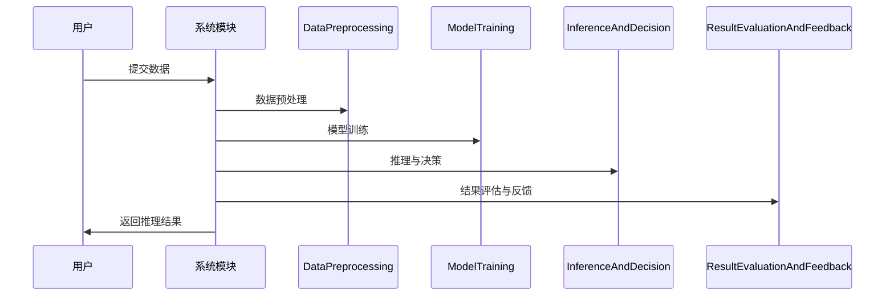

                 


# 神经程序归纳在自动化推理中的应用

关键词：神经程序、自动化推理、归纳学习、系统架构、项目实战

摘要：本文深入探讨了神经程序归纳在自动化推理中的应用，通过一步步的分析推理，详细阐述了神经程序的原理、归纳学习算法及其在自动化推理中的实现，同时提供了一个完整的系统架构设计与项目实战案例，旨在帮助读者理解这一复杂但至关重要的技术。

## 目录大纲设计过程

在设计《神经程序归纳在自动化推理中的应用》这本书的目录大纲时，我们首先需要理解书名的核心内容和主题，即神经程序与自动化推理的关系以及如何在自动化推理中应用神经程序归纳方法。以下是详细的目录大纲设计过程：

### 1. 理解书名与主题

- **书名：《神经程序归纳在自动化推理中的应用》**
  - 核心内容：神经程序、归纳学习、自动化推理
  - 主题思想：探讨如何将神经程序归纳应用于自动化推理中，解决自动化推理中的复杂问题

### 2. 确定核心概念与结构

- **核心概念**：
  - 神经程序：一种基于神经网络的计算模型，能够自动从数据中学习并执行特定任务。
  - 归纳学习：一种机器学习方法，通过从一组示例中总结出通用规律。
  - 自动化推理：利用计算机技术来自动地处理和分析数据，进行推理和决策。

- **核心结构**：
  - **背景介绍**：介绍神经程序和自动化推理的基本概念、需求和挑战。
  - **概念讲解**：详细解释神经程序、归纳学习和自动化推理的相关原理和联系。
  - **算法原理**：讲解归纳学习算法的工作原理、数学模型和实现细节。
  - **系统设计与实战应用**：介绍如何设计自动化推理系统，并应用神经程序归纳方法。

### 3. 细化章节内容

- **章节内容细化**：
  - **第1章：问题背景与核心概念**：
    - **子节1.1**：介绍自动化推理的需求与挑战。
    - **子节1.2**：讲解神经程序与归纳学习的基本概念及其联系。
    - **子节1.3**：讨论神经程序归纳的适用范围和关键问题。

  - **第2章：神经程序原理与特性**：
    - **子节2.1**：介绍神经程序的数学模型及其构建与训练方法。
    - **子节2.2**：分析神经程序的特性，如学习能力、泛化能力和并行计算等。
    - **子节2.3**：讨论神经程序的局限性。

  - **第3章：归纳学习算法原理**：
    - **子节3.1**：讲解归纳学习的基本流程，包括特征提取、模型选择和优化等。
    - **子节3.2**：介绍常见的归纳学习算法，如决策树、支持向量机和神经网络等。
    - **子节3.3**：对比算法性能，分析在不同应用场景中的选择。

  - **第4章：神经程序归纳在自动化推理中的应用**：
    - **子节4.1**：分析自动化推理的需求和应用领域。
    - **子节4.2**：讲解神经程序在自动化推理中的角色和实现方法。
    - **子节4.3**：讨论神经程序归纳在自动化推理中面临的挑战和解决方案。

  - **第5章：系统架构与设计方案**：
    - **子节5.1**：介绍自动化推理应用场景和神经程序归纳的应用需求。
    - **子节5.2**：设计系统功能模块和领域模型。
    - **子节5.3**：详细阐述系统架构设计，包括系统模块交互设计和接口设计。
    - **子节5.4**：设计系统交互流程和状态变迁图。

  - **第6章：项目实战**：
    - **子节6.1**：介绍环境安装与配置。
    - **子节6.2**：实现神经程序和归纳学习算法。
    - **子节6.3**：分析代码和应用案例。
    - **子节6.4**：项目小结和总结。

### 4. 编写目录大纲

在2000字以内，我们编写了以下目录大纲：

```markdown
----------------------------------------------------------------
# 第一部分: 神经程序归纳概述

## 第1章: 问题背景与核心概念

### 1.1 问题背景

#### 1.1.1 自动化推理的需求与挑战

#### 1.1.2 神经程序与归纳学习的基本概念

### 1.2 核心概念与联系

#### 1.2.1 神经程序的组成与工作原理

#### 1.2.2 归纳学习的分类与原理

#### 1.2.3 归纳学习与自动化推理的关系

### 1.3 边界与外延

#### 1.3.1 神经程序归纳的适用范围

#### 1.3.2 自动化推理中的关键问题

## 第2章: 神经程序原理与特性

### 2.1 神经程序的数学模型

#### 2.1.1 神经网络的构建与训练

#### 2.1.2 神经程序的数学表示

### 2.2 神经程序的特性

#### 2.2.1 学习能力与泛化能力

#### 2.2.2 并行计算与高效性

#### 2.2.3 神经程序的局限性

## 第3章: 归纳学习算法原理

### 3.1 归纳学习的基本流程

#### 3.1.1 特征提取与预处理

#### 3.1.2 模型选择与训练

#### 3.1.3 模型评估与优化

### 3.2 常见归纳学习算法

#### 3.2.1 决策树

#### 3.2.2 支持向量机

#### 3.2.3 神经网络

### 3.3 算法对比与选择

#### 3.3.1 算法性能对比

#### 3.3.2 应用场景分析

## 第4章: 神经程序归纳在自动化推理中的应用

### 4.1 自动化推理的需求分析

#### 4.1.1 自动化推理的关键技术

#### 4.1.2 自动化推理的应用领域

### 4.2 神经程序归纳在自动化推理中的实现

#### 4.2.1 神经程序在自动化推理中的角色

#### 4.2.2 归纳学习在自动化推理中的应用

#### 4.2.3 实现案例

### 4.3 应用挑战与解决方案

#### 4.3.1 神经程序归纳的挑战

#### 4.3.2 自动化推理中的难题

#### 4.3.3 解决方案与优化策略

## 第5章: 系统架构与设计方案

### 5.1 问题场景介绍

#### 5.1.1 自动化推理应用场景

#### 5.1.2 神经程序归纳的应用需求

### 5.2 系统功能设计

#### 5.2.1 领域模型分析

#### 5.2.2 系统功能模块划分

### 5.3 系统架构设计

#### 5.3.1 系统架构总体设计

#### 5.3.2 系统模块交互设计

### 5.4 系统接口设计

#### 5.4.1 接口规范与定义

#### 5.4.2 接口实现与调用

### 5.5 系统交互设计

#### 5.5.1 系统交互流程

#### 5.5.2 系统状态变迁图

## 第6章: 项目实战

### 6.1 环境安装与配置

#### 6.1.1 硬件与软件环境要求

#### 6.1.2 系统安装与配置步骤

### 6.2 系统核心实现

#### 6.2.1 神经程序设计与实现

#### 6.2.2 归纳学习算法应用

### 6.3 代码应用解读与分析

#### 6.3.1 关键代码分析

#### 6.3.2 算法原理讲解

### 6.4 实际案例分析与详细讲解

#### 6.4.1 自动化推理案例

#### 6.4.2 神经程序归纳应用案例

### 6.5 项目小结

#### 6.5.1 项目总结

#### 6.5.2 最佳实践 tips

----------------------------------------------------------------
```

通过上述目录大纲，读者可以清晰地了解到本书的结构和内容，从而更好地理解和掌握神经程序归纳在自动化推理中的应用。接下来，我们将逐一深入探讨每个章节的核心内容，以便读者能够系统地掌握相关知识。

----------------------------------------------------------------

## 第1章: 问题背景与核心概念

### 1.1 问题背景

自动化推理（Automated Reasoning）是人工智能领域的一个重要分支，其核心目标是利用计算机技术来自动地处理和分析复杂的数据，从而进行推理和决策。自动化推理的应用场景广泛，包括逻辑推理、数学证明、计算机验证、游戏策略、自然语言处理等。随着大数据和计算技术的飞速发展，自动化推理的需求日益增加，但同时也面临着诸多挑战。

首先，自动化推理需要处理的数据规模巨大，且数据类型多样，这给数据预处理和特征提取带来了极大的挑战。其次，自动化推理系统需要具备高效的推理速度和精确的推理结果，这对于算法的复杂度和计算资源的消耗提出了更高的要求。此外，自动化推理系统在实际应用中还需要具备一定的灵活性和适应性，能够根据不同场景的需求进行快速调整。

神经程序（Neural Programs）是一种基于神经网络的计算模型，能够通过自动学习从数据中提取规律和模式。神经程序归纳（Neural Program Induction）是神经程序的一种学习方法，它通过从一组示例中自动归纳出通用规律，从而实现自动化推理。神经程序归纳方法具有以下几个特点：

1. **自动学习**：神经程序归纳方法不需要人工设计特征，能够自动从数据中学习出有用的特征表示。
2. **高效性**：神经程序归纳方法通过并行计算和分布式学习，能够在大规模数据上高效地训练模型。
3. **泛化能力**：神经程序归纳方法能够从特定的示例中归纳出通用的规律，具备良好的泛化能力。
4. **灵活性**：神经程序归纳方法可以根据不同应用场景的需求进行快速调整和优化。

### 1.2 核心概念与联系

#### 1.2.1 神经程序的组成与工作原理

神经程序主要由神经网络和程序控制流组成。神经网络是神经程序的核心部分，它通过多层神经元的连接和激活函数来实现数据的处理和转换。程序控制流则用于控制神经网络的学习过程，包括数据的输入、输出、迭代训练和模型优化等。

神经网络的基本组成包括：

1. **神经元**：神经元是神经网络的基本计算单元，它通过加权求和和激活函数来计算输出。
2. **层**：神经网络由多个层组成，包括输入层、隐藏层和输出层。每层中的神经元对输入数据进行处理，并传递给下一层。
3. **权重和偏置**：权重和偏置是神经网络中的参数，它们通过调整对输入数据的加权求和结果来影响输出。

神经网络的工作原理如下：

1. **输入层**：输入层接收外部输入数据，并将其传递给隐藏层。
2. **隐藏层**：隐藏层对输入数据进行处理，通过多层网络的传递和变换，逐步提取出数据的特征和模式。
3. **输出层**：输出层生成最终的输出结果，这些结果可以是分类标签、数值预测等。

#### 1.2.2 归纳学习的分类与原理

归纳学习是机器学习的一种方法，它通过从一组示例中总结出通用规律，从而实现对新实例的预测和分类。归纳学习可以分为以下几种类型：

1. **监督学习**：监督学习通过已有的标注数据来训练模型，从而对新实例进行预测。常见的监督学习方法包括线性回归、逻辑回归、支持向量机和决策树等。
2. **无监督学习**：无监督学习通过未标注的数据来发现数据的结构和模式，常见的无监督学习方法包括聚类、主成分分析和自编码器等。
3. **半监督学习**：半监督学习结合了监督学习和无监督学习的方法，利用部分标注数据和大量未标注数据来训练模型。
4. **增强学习**：增强学习通过交互式环境来训练模型，通过不断地尝试和反馈来优化模型。

归纳学习的基本原理如下：

1. **特征提取**：从原始数据中提取出有用的特征表示，这些特征能够代表数据的本质属性。
2. **模型训练**：利用提取出的特征来训练模型，通过优化模型的参数来提高预测和分类的准确性。
3. **模型评估**：通过测试数据来评估模型的性能，包括准确性、召回率、F1值等指标。

#### 1.2.3 归纳学习与自动化推理的关系

归纳学习与自动化推理密切相关，它们共同构成了自动化推理的核心技术。归纳学习为自动化推理提供了强大的学习能力和知识提取能力，而自动化推理则为归纳学习提供了实际的应用场景和需求驱动。

1. **归纳学习在自动化推理中的作用**：
   - **知识提取**：归纳学习可以从大量的数据中提取出有用的知识，为自动化推理提供丰富的背景知识和先验信息。
   - **推理优化**：归纳学习可以优化自动化推理的过程，提高推理的速度和准确性，减少计算资源的消耗。
   - **自适应能力**：归纳学习可以根据新的数据和需求进行自适应调整，使得自动化推理系统更加灵活和智能。

2. **自动化推理对归纳学习的需求**：
   - **高效性**：自动化推理需要高效的算法和模型来处理大规模数据和复杂的推理任务。
   - **准确性**：自动化推理需要高精度的推理结果，确保推理过程的可靠性和稳定性。
   - **灵活性**：自动化推理需要能够适应不同场景和需求的变化，具备良好的扩展性和适应性。

### 1.3 边界与外延

#### 1.3.1 神经程序归纳的适用范围

神经程序归纳方法在自动化推理中的应用范围非常广泛，主要涉及以下几个方面：

1. **逻辑推理**：神经程序归纳可以应用于逻辑推理任务，如自然语言推理、形式逻辑推理等。
2. **数学证明**：神经程序归纳可以用于数学证明任务，如定理证明、公式证明等。
3. **计算机验证**：神经程序归纳可以用于计算机验证任务，如程序验证、安全性验证等。
4. **自然语言处理**：神经程序归纳可以用于自然语言处理任务，如文本分类、情感分析、机器翻译等。
5. **图像处理**：神经程序归纳可以用于图像处理任务，如图像分类、目标检测、图像生成等。

#### 1.3.2 自动化推理中的关键问题

在自动化推理中，存在一些关键问题需要解决，这些问题直接影响到推理系统的性能和效果。以下是一些常见的关键问题：

1. **数据质量**：自动化推理的性能很大程度上取决于数据的质量，包括数据的完整性、准确性和代表性等。
2. **特征选择**：特征选择是自动化推理中的一个重要步骤，选择合适的特征可以显著提高推理的准确性和效率。
3. **算法选择**：不同的自动化推理任务可能需要不同的算法，选择合适的算法是提高推理性能的关键。
4. **计算资源**：自动化推理通常需要大量的计算资源和时间，如何优化计算资源的使用是一个重要问题。
5. **推理速度**：自动化推理需要高效地处理大量数据和复杂的推理任务，提高推理速度是提高系统性能的关键。

通过以上分析，我们可以看到神经程序归纳在自动化推理中的应用具有广泛的前景和重要的应用价值。在接下来的章节中，我们将进一步探讨神经程序的数学模型、归纳学习算法原理以及神经程序归纳在自动化推理中的具体实现。

----------------------------------------------------------------

## 第2章: 神经程序原理与特性

### 2.1 神经程序的数学模型

神经程序是一种基于神经网络的计算模型，它通过模拟生物神经系统的结构和功能来实现数据的处理和转换。神经程序的数学模型主要包括神经网络、神经元、权重和偏置等基本元素。

#### 2.1.1 神经网络的构建与训练

神经网络是神经程序的核心组成部分，它由多个层组成，包括输入层、隐藏层和输出层。每一层中的神经元都对输入数据进行处理，并传递给下一层。

1. **输入层**：输入层接收外部输入数据，并将其传递给隐藏层。输入层的神经元数量通常与输入数据的维度一致。
2. **隐藏层**：隐藏层对输入数据进行处理，通过多层网络的传递和变换，逐步提取出数据的特征和模式。隐藏层的神经元数量可以根据具体任务进行调整。
3. **输出层**：输出层生成最终的输出结果，这些结果可以是分类标签、数值预测等。输出层的神经元数量通常与输出结果的维度一致。

神经网络的构建过程主要包括以下步骤：

1. **初始化权重和偏置**：在训练神经网络之前，需要初始化权重和偏置。权重和偏置的初始值通常设置为较小的随机数，以避免模型在训练过程中陷入局部最小值。
2. **前向传播**：在训练过程中，输入数据依次通过输入层、隐藏层和输出层，每一层的神经元都通过加权求和和激活函数计算输出。
3. **反向传播**：在计算输出结果后，神经网络通过反向传播算法来更新权重和偏置，以最小化预测误差。

#### 2.1.2 神经程序的数学表示

神经程序的数学表示可以通过以下几个公式来描述：

1. **输入数据表示**：输入数据可以表示为向量 \(X\)，其中每个元素 \(x_i\) 代表一个特征值。
2. **神经元输出计算**：神经元的输出可以通过以下公式计算：

   \[
   z_j = \sum_{i=1}^{n} w_{ji}x_i + b_j
   \]

   其中，\(z_j\) 是第 \(j\) 个神经元的输出，\(w_{ji}\) 是第 \(i\) 个特征与第 \(j\) 个神经元的权重，\(b_j\) 是第 \(j\) 个神经元的偏置。
3. **激活函数**：神经元的输出通常通过激活函数进行非线性变换，常见的激活函数包括 sigmoid 函数、ReLU 函数和 tanh 函数等。以 sigmoid 函数为例，其公式如下：

   \[
   a_j = \frac{1}{1 + e^{-z_j}}
   \]

   其中，\(a_j\) 是第 \(j\) 个神经元的激活值。

4. **输出层输出计算**：对于输出层的神经元，其输出可以直接作为最终的输出结果，或者通过另一个激活函数进行非线性变换。

   \[
   y_k = f(a_k)
   \]

   其中，\(y_k\) 是第 \(k\) 个神经元的输出，\(f\) 是激活函数。

### 2.2 神经程序的特性

神经程序具有以下几个特性：

#### 2.2.1 学习能力与泛化能力

神经程序通过反向传播算法和梯度下降优化方法来学习数据中的模式和规律。学习过程包括以下几个步骤：

1. **初始化模型参数**：初始化神经网络的权重和偏置。
2. **前向传播**：输入数据通过神经网络，计算输出结果。
3. **计算误差**：计算输出结果与真实值之间的误差。
4. **反向传播**：根据误差信息，更新神经网络的权重和偏置。
5. **迭代训练**：重复以上步骤，直到模型收敛或达到预定的迭代次数。

神经程序具有良好的泛化能力，即能够将学习到的知识应用到新的数据上，而不仅仅是训练数据本身。

#### 2.2.2 并行计算与高效性

神经网络具有并行计算的特性，每个神经元可以独立计算，从而大大提高了计算效率。此外，现代深度学习框架通常利用多核CPU和GPU进行并行计算，进一步提高了神经程序的运行速度。

#### 2.2.3 神经程序的局限性

虽然神经程序具有强大的学习能力和高效性，但它们也存在一些局限性：

1. **可解释性**：神经程序内部的学习过程是非线性的，因此难以解释和理解。这对于需要可解释性需求的任务来说是一个挑战。
2. **数据需求**：神经程序通常需要大量的数据来训练模型，否则容易过拟合。
3. **计算资源消耗**：训练大型神经网络需要大量的计算资源和时间，这在一些资源受限的环境中可能不适用。

### 2.3 神经程序的局限性与改进方向

为了解决神经程序的局限性，研究人员提出了多种改进方法：

1. **注意力机制**：注意力机制可以增强神经程序对重要信息的关注，从而提高模型的解释性和泛化能力。
2. **转移学习**：通过在预训练模型的基础上进行微调，可以减少对大量数据的依赖，提高模型的泛化能力。
3. **融合多模态数据**：融合不同类型的数据（如文本、图像和音频），可以提供更丰富的信息，从而提高模型的性能。

通过上述改进，神经程序在自动化推理中的应用得到了进一步的扩展和深化。

### 总结

神经程序作为一种强大的计算模型，具有学习能力、泛化能力和高效性。在自动化推理中，神经程序归纳方法通过从数据中自动学习模式和规律，提高了推理的准确性和效率。然而，神经程序也存在一些局限性，如可解释性和数据需求等。通过不断的研究和改进，神经程序在自动化推理中的应用将越来越广泛和深入。

在接下来的章节中，我们将继续探讨归纳学习算法的基本原理和实现方法，进一步理解神经程序在自动化推理中的具体应用。

----------------------------------------------------------------

## 第3章: 归纳学习算法原理

### 3.1 归纳学习的基本流程

归纳学习（Inductive Learning）是机器学习中的一个重要分支，它的核心目标是从一组训练数据中自动提取出普遍的规律或知识，从而能够对新实例进行预测或分类。归纳学习的基本流程包括以下几个步骤：

#### 3.1.1 特征提取与预处理

在归纳学习过程中，特征提取和预处理是至关重要的一步。特征提取的目的是将原始数据转换为适合模型训练的形式。预处理包括以下任务：

1. **数据清洗**：去除数据中的噪声和异常值，保证数据的完整性和准确性。
2. **数据转换**：将不同类型的数据（如文本、图像、时间序列等）转换为数值形式，以便进行后续处理。
3. **特征选择**：从原始数据中选择最有用的特征，去除冗余和无关的特征，提高模型的性能。

#### 3.1.2 模型选择与训练

在特征提取和预处理完成后，需要选择合适的模型并进行训练。模型选择包括以下几种：

1. **监督学习模型**：如线性回归、逻辑回归、决策树、随机森林、支持向量机等。
2. **无监督学习模型**：如聚类、主成分分析、自编码器等。
3. **半监督学习模型**：结合监督学习和无监督学习的方法，如图嵌入、图神经网络等。

模型训练的过程通常包括以下几个步骤：

1. **初始化模型参数**：随机初始化模型的权重和偏置。
2. **前向传播**：输入特征数据，通过模型计算输出结果。
3. **计算损失函数**：比较输出结果与真实值之间的差异，计算损失函数。
4. **反向传播**：根据损失函数的梯度信息，更新模型参数。
5. **迭代训练**：重复以上步骤，直到模型收敛或达到预定的迭代次数。

#### 3.1.3 模型评估与优化

在模型训练完成后，需要对模型进行评估和优化。模型评估的目的是确定模型的性能和泛化能力。常用的评估指标包括：

1. **准确性**：预测结果与真实值之间的匹配程度，计算公式为：
   
   \[
   准确性 = \frac{正确预测的数量}{总预测的数量}
   \]

2. **召回率**：在所有实际为正类别的样本中，被正确预测为正类别的比例，计算公式为：

   \[
   召回率 = \frac{真正例的数量}{真正例的数量 + 假反例的数量}
   \]

3. **精确率**：在所有被预测为正类别的样本中，实际为正类别的比例，计算公式为：

   \[
   精确率 = \frac{真正例的数量}{真正例的数量 + 假正例的数量}
   \]

4. **F1值**：精确率和召回率的调和平均值，计算公式为：

   \[
   F1值 = 2 \times \frac{精确率 \times 召回率}{精确率 + 召回率}
   \]

通过调整模型参数和优化策略，可以提高模型的性能和泛化能力。常用的优化策略包括：

1. **交叉验证**：通过将数据集划分为多个子集，轮流进行训练和测试，以评估模型的泛化能力。
2. **网格搜索**：通过遍历参数空间，选择最优的参数组合。
3. **正则化**：通过添加正则项来惩罚模型复杂度，避免过拟合。

### 3.2 常见归纳学习算法

在归纳学习过程中，常用的算法包括决策树、支持向量机、神经网络等。下面将介绍这些算法的基本原理和实现方法。

#### 3.2.1 决策树

决策树（Decision Tree）是一种基于树的模型，通过一系列的决策规则来对数据进行分类或回归。决策树的基本原理如下：

1. **根节点**：根节点表示整个数据集，根节点下的每个分支表示一个特征。
2. **内部节点**：内部节点表示特征，每个内部节点都有一个测试条件，用于将数据集划分为两个子数据集。
3. **叶节点**：叶节点表示分类或回归结果。

决策树的学习过程包括以下几个步骤：

1. **选择最佳分割特征**：通过计算信息增益、基尼不纯度或熵等指标，选择最佳分割特征。
2. **递归划分**：根据最佳分割特征，递归地将数据集划分为更小的子数据集，直到满足停止条件（如最大深度、最小节点大小等）。
3. **生成决策树**：根据递归划分的结果，生成完整的决策树模型。

决策树的优点包括简单易懂、易于解释和计算速度快。缺点包括容易过拟合、对异常值敏感和不能处理非线性关系。

#### 3.2.2 支持向量机

支持向量机（Support Vector Machine，SVM）是一种基于最大间隔的模型，它通过找到一个最佳的超平面来对数据进行分类。SVM的基本原理如下：

1. **线性SVM**：线性SVM通过求解一个优化问题，找到最佳的超平面，使得正负样本之间的间隔最大。优化问题可以表示为：

   \[
   最小化 \quad \frac{1}{2} \| w \|^2
   \]

   约束条件为：

   \[
   y_i ( \langle w, x_i \rangle - b ) \geq 1
   \]

   其中，\(w\) 是权重向量，\(b\) 是偏置，\(x_i\) 是输入特征，\(y_i\) 是标签。

2. **非线性SVM**：通过核函数（Kernel Function）将输入特征映射到高维空间，使得原本线性不可分的数据在新的高维空间中可以找到一个线性分离的超平面。

SVM的优点包括良好的泛化能力和强大的分类能力。缺点包括计算复杂度高、对参数选择敏感和无法直接处理多类别问题。

#### 3.2.3 神经网络

神经网络（Neural Network）是一种基于神经元连接的模型，通过多层网络的传递和变换来提取数据的特征和模式。神经网络的基本原理如下：

1. **前向传播**：输入数据依次通过输入层、隐藏层和输出层，每一层的神经元通过加权求和和激活函数计算输出。
2. **反向传播**：计算输出结果与真实值之间的误差，通过反向传播算法更新神经网络的权重和偏置，以最小化误差。

神经网络包括以下几种类型：

1. **多层感知机（MLP）**：MLP是一种前馈神经网络，它包含多个隐藏层，每个隐藏层中的神经元都是线性激活函数。
2. **卷积神经网络（CNN）**：CNN是一种专门用于处理图像数据的神经网络，它通过卷积层和池化层来提取图像的特征。
3. **循环神经网络（RNN）**：RNN是一种用于处理序列数据的神经网络，它通过循环连接来保持对历史信息的记忆。
4. **长短时记忆网络（LSTM）**：LSTM是一种特殊的RNN，它通过引入门控机制来解决长短期依赖问题。

神经网络的优点包括强大的学习能力和适应能力，可以处理复杂的非线性关系。缺点包括计算复杂度高、对数据要求较高和难以解释。

### 3.3 算法对比与选择

不同的归纳学习算法在性能、计算复杂度和适用场景等方面存在差异，因此在实际应用中需要根据具体任务和需求选择合适的算法。以下是几种常见算法的对比：

| 算法 | 优点 | 缺点 | 适用场景 |
| --- | --- | --- | --- |
| 决策树 | 简单易懂、计算速度快、易于解释 | 容易过拟合、对异常值敏感、不能处理非线性关系 | 分类、回归、特征选择 |
| 支持向量机 | 良好的泛化能力、强大的分类能力 | 计算复杂度高、对参数选择敏感、无法直接处理多类别问题 | 分类、回归、文本分类 |
| 神经网络 | 强大的学习能力和适应能力、可以处理复杂的非线性关系 | 计算复杂度高、对数据要求较高、难以解释 | 分类、回归、图像处理、自然语言处理 |

在选择算法时，需要综合考虑以下因素：

1. **数据特点**：数据类型、数据规模、数据分布等。
2. **任务目标**：分类、回归、聚类等。
3. **计算资源**：计算能力、存储空间等。
4. **模型可解释性**：对于需要解释性的任务，选择可解释性较高的算法。

### 总结

归纳学习算法是自动化推理中的核心组成部分，通过从训练数据中提取出普遍的规律或知识，能够对新实例进行预测或分类。本章介绍了归纳学习的基本流程、常见算法（决策树、支持向量机、神经网络）的基本原理和实现方法，以及算法的对比与选择。在下一章中，我们将进一步探讨神经程序归纳在自动化推理中的应用，并分析其面临的挑战和解决方案。

----------------------------------------------------------------

## 第4章: 神经程序归纳在自动化推理中的应用

### 4.1 自动化推理的需求分析

自动化推理在许多领域都具有重要意义，尤其是在处理复杂问题和大规模数据时。为了更好地理解神经程序归纳在自动化推理中的应用，我们需要首先分析自动化推理的需求。

#### 4.1.1 自动化推理的关键技术

自动化推理的关键技术包括以下几个方面：

1. **推理引擎**：推理引擎是自动化推理系统的核心，它负责根据输入数据和事先定义的规则或模型来生成推理结果。推理引擎需要具备高效性和准确性，能够处理复杂的逻辑推理和计算任务。
2. **数据预处理**：在自动化推理过程中，数据预处理是一个关键步骤。预处理包括数据清洗、特征提取、数据转换等，以确保输入数据的质量和格式符合推理引擎的要求。
3. **模型训练与优化**：自动化推理需要事先训练好模型，并在应用过程中不断优化模型参数，以提高推理结果的准确性和鲁棒性。常用的模型训练方法包括监督学习、无监督学习和增强学习等。
4. **推理结果评估**：推理结果的评估是自动化推理系统的关键环节。通过评估推理结果的准确性、召回率、F1值等指标，可以评估系统性能，并为进一步优化提供依据。

#### 4.1.2 自动化推理的应用领域

自动化推理在多个领域都有广泛的应用，以下是一些典型的应用场景：

1. **自然语言处理**：自动化推理在自然语言处理领域具有广泛的应用，包括文本分类、情感分析、信息抽取、机器翻译等。通过神经程序归纳方法，可以自动提取文本中的语义信息和模式，从而实现更准确的推理结果。
2. **计算机视觉**：自动化推理在计算机视觉领域也发挥着重要作用，包括图像分类、目标检测、人脸识别、姿态估计等。通过卷积神经网络（CNN）等深度学习模型，可以自动从图像中提取出丰富的特征，从而实现高效的自动化推理。
3. **推理辅助系统**：自动化推理在医疗、金融、法律等领域也具有广泛的应用。例如，在医疗领域，自动化推理可以用于疾病诊断、治疗方案推荐等；在金融领域，自动化推理可以用于风险预测、投资决策等。
4. **游戏与虚拟现实**：自动化推理在游戏和虚拟现实领域也具有重要作用，包括游戏策略推理、虚拟角色行为模拟等。通过神经程序归纳方法，可以自动生成复杂的游戏规则和行为模式，从而提高游戏体验和互动性。

### 4.2 神经程序归纳在自动化推理中的实现

神经程序归纳（Neural Program Induction）是一种基于神经网络的归纳学习方法，它通过从一组示例数据中自动提取出通用规律，从而实现自动化推理。在自动化推理中，神经程序归纳方法具有以下几个关键步骤：

#### 4.2.1 神经程序在自动化推理中的角色

神经程序在自动化推理中扮演着以下几个重要角色：

1. **特征提取器**：神经程序可以从原始数据中自动提取出有用的特征表示，这些特征可以用于后续的推理和决策。与传统的特征工程方法相比，神经程序归纳方法可以显著减少人工干预，提高特征提取的效率和准确性。
2. **决策器**：神经程序通过训练得到的模型可以用于生成推理结果。在自动化推理系统中，神经程序可以作为决策器，根据输入数据自动生成分类、回归或预测结果。
3. **优化器**：神经程序归纳方法可以通过调整模型参数和结构，优化推理性能。在自动化推理过程中，不断优化神经程序模型可以进一步提高推理结果的准确性和鲁棒性。

#### 4.2.2 归纳学习在自动化推理中的应用

归纳学习在自动化推理中的应用主要包括以下几个方面：

1. **监督学习**：在监督学习任务中，神经程序归纳方法通过从标注数据中学习出通用规律，从而实现对新数据的预测。例如，在文本分类任务中，神经程序可以自动提取文本中的特征，并根据训练数据学习出分类模型，从而实现文本的分类。
2. **无监督学习**：在无监督学习任务中，神经程序归纳方法通过从未标注数据中自动学习出数据的分布和模式，从而实现数据的聚类或降维。例如，在图像聚类任务中，神经程序可以自动提取图像中的特征，并根据特征相似性将图像分为不同的类别。
3. **半监督学习**：在半监督学习任务中，神经程序归纳方法结合了标注数据和未标注数据，通过从标注数据中学习出通用规律，并利用未标注数据进行模型优化，从而提高推理性能。例如，在文本分类任务中，通过将部分已标注文本作为训练数据，未标注文本作为未标注数据，可以显著提高分类模型的性能。
4. **增强学习**：在增强学习任务中，神经程序归纳方法通过在动态环境中进行交互学习，不断优化模型参数和行为策略，从而实现智能体的自主学习和决策。例如，在游戏任务中，神经程序可以通过与游戏环境的交互，学习出最佳的游戏策略，从而实现高效的决策。

### 4.2.3 实现案例

以下是一个简单的神经程序归纳在自动化推理中的应用案例：使用神经程序进行图像分类。

#### 案例描述

给定一个包含大量图像数据的数据集，使用神经程序归纳方法对图像进行分类。具体步骤如下：

1. **数据预处理**：对图像数据进行预处理，包括图像缩放、归一化、去噪等，以确保输入数据的质量和一致性。
2. **特征提取**：使用卷积神经网络（CNN）对图像数据进行特征提取，通过多层卷积和池化操作，自动提取图像的局部和全局特征。
3. **模型训练**：使用标注数据集对卷积神经网络进行训练，通过反向传播算法和梯度下降优化方法，不断更新模型参数，以最小化预测误差。
4. **模型评估**：使用测试数据集对训练好的模型进行评估，计算模型的准确率、召回率、F1值等指标，以评估模型性能。
5. **推理应用**：将训练好的模型应用于新的图像数据，生成分类结果。

#### 实现代码

以下是一个简单的基于TensorFlow的图像分类案例，使用卷积神经网络进行特征提取和模型训练：

```python
import tensorflow as tf
from tensorflow.keras.models import Sequential
from tensorflow.keras.layers import Conv2D, MaxPooling2D, Flatten, Dense

# 加载数据集
(x_train, y_train), (x_test, y_test) = tf.keras.datasets.cifar10.load_data()

# 数据预处理
x_train = x_train / 255.0
x_test = x_test / 255.0

# 构建卷积神经网络模型
model = Sequential([
    Conv2D(32, (3, 3), activation='relu', input_shape=(32, 32, 3)),
    MaxPooling2D((2, 2)),
    Conv2D(64, (3, 3), activation='relu'),
    MaxPooling2D((2, 2)),
    Flatten(),
    Dense(64, activation='relu'),
    Dense(10, activation='softmax')
])

# 编译模型
model.compile(optimizer='adam',
              loss='sparse_categorical_crossentropy',
              metrics=['accuracy'])

# 训练模型
model.fit(x_train, y_train, epochs=10, validation_split=0.2)

# 评估模型
test_loss, test_acc = model.evaluate(x_test, y_test)
print(f'测试准确率: {test_acc:.2f}')

# 推理应用
predictions = model.predict(x_test[:10])
print(predictions.argmax(axis=1))
```

### 4.3 应用挑战与解决方案

虽然神经程序归纳在自动化推理中具有广泛的应用前景，但仍然面临一些挑战和问题，以下是一些常见挑战及相应的解决方案：

#### 4.3.1 数据需求和质量

神经程序归纳方法通常需要大量的标注数据来训练模型，以保证模型的性能和泛化能力。在数据稀缺或标注成本较高的场景中，解决数据需求和数据质量问题是一个重要挑战。解决方案包括：

1. **数据增强**：通过旋转、缩放、裁剪、颜色变换等手段，生成更多的训练样本，以缓解数据稀缺的问题。
2. **半监督学习和无监督学习**：结合未标注数据，通过半监督学习和无监督学习方法来提高模型的性能。
3. **数据集共享与协作**：通过数据集的共享和协作，积累更多的标注数据，以提高模型的训练效果。

#### 4.3.2 计算资源消耗

神经程序归纳方法通常需要大量的计算资源和时间来训练模型，这对于资源受限的环境（如移动设备、嵌入式系统等）来说是一个挑战。解决方案包括：

1. **模型压缩与剪枝**：通过模型压缩和剪枝技术，减小模型的参数数量和计算复杂度，以提高模型的运行效率。
2. **分布式训练**：通过分布式训练技术，利用多台计算机和GPU资源，加快模型训练速度。
3. **量化与低精度计算**：通过量化技术，将高精度模型转换为低精度模型，以降低计算资源和存储需求。

#### 4.3.3 可解释性和透明度

神经程序归纳方法的学习过程通常是非线性和复杂的，导致模型的可解释性和透明度较低。在需要可解释性的任务中，这是一个挑战。解决方案包括：

1. **模型可解释性技术**：通过可视化、解释性模型和解释性算法，提高模型的可解释性，帮助用户理解模型的工作原理和决策过程。
2. **对抗性攻击与鲁棒性**：通过对抗性攻击和鲁棒性测试，提高模型对异常数据和攻击的抵抗能力，从而提高模型的可信度和透明度。

### 总结

神经程序归纳在自动化推理中具有广泛的应用前景和重要的技术价值。通过从数据中自动提取出通用规律，神经程序归纳方法可以提高自动化推理的准确性和效率。然而，在实际应用中，仍然面临数据需求和质量、计算资源消耗、可解释性和透明度等挑战。通过不断的研究和改进，我们可以克服这些挑战，进一步拓展神经程序归纳在自动化推理中的应用范围。

在下一章中，我们将进一步探讨自动化推理系统的系统架构与设计方案，以更好地理解神经程序归纳方法在实际系统中的应用。

----------------------------------------------------------------

## 第5章: 系统架构与设计方案

### 5.1 问题场景介绍

在本章中，我们将探讨如何设计一个基于神经程序归纳的自动化推理系统。该系统旨在解决复杂的数据分析和决策问题，如金融风险评估、医疗诊断和智能客服等。具体问题场景如下：

1. **金融风险评估**：银行和金融机构需要实时监控客户账户的交易活动，以识别潜在的欺诈行为。自动化推理系统可以通过分析交易数据和历史记录，预测欺诈风险，并采取相应的预防措施。
2. **医疗诊断**：医疗机构需要快速准确地诊断疾病，以提高患者的治疗效果。自动化推理系统可以通过分析患者的病史、症状和医学影像，提供诊断建议和治疗方案。
3. **智能客服**：企业需要提供高效、智能的客户服务，以提升客户满意度。自动化推理系统可以通过分析客户的问题和需求，提供个性化的解决方案和推荐。

### 5.2 系统功能设计

为了实现上述问题场景，系统需要具备以下核心功能：

1. **数据预处理**：包括数据清洗、归一化、特征提取等，以确保输入数据的质量和一致性。
2. **模型训练与优化**：通过训练数据集，训练神经程序模型，并不断优化模型参数，以提高推理准确性和效率。
3. **推理与决策**：根据输入数据和训练好的模型，生成推理结果和决策建议。
4. **结果评估与反馈**：对推理结果进行评估和反馈，以持续改进模型性能。

#### 5.2.1 领域模型分析

为了更好地理解系统功能，我们可以使用Mermaid类图来表示系统的领域模型。以下是一个简化的领域模型示例：

```mermaid
classDiagram
    Class01 <|-- Class02
    Class03 --|	RuntimeEnvironment
    Class04 --|	DataPreprocessing
    Class05 --|	ModelTraining
    Class06 --|	InferenceAndDecision
    Class07 --|	ResultEvaluationAndFeedback
    
    RuntimeEnvironment <.. DataPreprocessing
    RuntimeEnvironment <.. ModelTraining
    RuntimeEnvironment <.. InferenceAndDecision
    RuntimeEnvironment <.. ResultEvaluationAndFeedback
    
    DataPreprocessing .. ModelTraining
    DataPreprocessing .. InferenceAndDecision
    
    ModelTraining .. InferenceAndDecision
    
    InferenceAndDecision .. ResultEvaluationAndFeedback
```

在上图中，`RuntimeEnvironment` 表示运行环境，包括硬件资源和软件环境。`DataPreprocessing` 表示数据预处理模块，负责清洗和预处理输入数据。`ModelTraining` 表示模型训练模块，负责训练和优化神经程序模型。`InferenceAndDecision` 表示推理与决策模块，根据输入数据和训练好的模型生成推理结果。`ResultEvaluationAndFeedback` 表示结果评估与反馈模块，对推理结果进行评估和反馈，以优化模型性能。

#### 5.2.2 系统功能模块划分

基于上述领域模型分析，我们可以将系统划分为以下几个功能模块：

1. **数据预处理模块**：包括数据清洗、归一化、特征提取等子模块。
2. **模型训练模块**：包括数据加载、模型构建、模型训练、模型评估等子模块。
3. **推理与决策模块**：包括推理引擎、决策规则、推理结果生成等子模块。
4. **结果评估与反馈模块**：包括评估指标计算、反馈机制、模型优化等子模块。

### 5.3 系统架构设计

系统架构设计是确保系统功能实现和性能优化的关键。在本节中，我们将使用Mermaid架构图来表示系统架构。以下是一个简化的系统架构示例：



在上图中，用户首先向系统提交数据，系统经过数据预处理、模型训练、推理与决策和结果评估与反馈等步骤，最终返回推理结果给用户。

#### 5.3.1 系统架构总体设计

系统架构总体设计包括以下几个方面：

1. **数据处理层**：包括数据预处理模块，负责对输入数据进行清洗、归一化和特征提取等处理。
2. **模型训练层**：包括模型训练模块，负责根据预处理后的数据训练神经程序模型。
3. **推理层**：包括推理与决策模块，负责根据训练好的模型对新的输入数据进行推理和决策。
4. **结果评估层**：包括结果评估与反馈模块，负责对推理结果进行评估和反馈，以优化模型性能。

#### 5.3.2 系统模块交互设计

在系统架构中，各个模块需要相互协作以完成整个推理过程。以下是各个模块之间的交互设计：

1. **数据预处理模块**：数据预处理模块负责对输入数据进行清洗、归一化和特征提取等处理。处理完成后，将数据传递给模型训练模块。
2. **模型训练模块**：模型训练模块根据预处理后的数据训练神经程序模型。训练过程中，模型训练模块需要从数据预处理模块获取训练数据和验证数据。
3. **推理与决策模块**：推理与决策模块根据训练好的模型对新的输入数据进行推理和决策。推理结果将传递给结果评估与反馈模块。
4. **结果评估与反馈模块**：结果评估与反馈模块对推理结果进行评估和反馈。评估结果将用于调整模型参数和优化模型性能。

#### 5.3.3 系统接口设计

系统接口设计包括系统对外部用户和内部模块的接口定义和实现。以下是系统接口设计的简要描述：

1. **用户接口**：用户通过用户接口向系统提交数据，并获得推理结果。用户接口需要支持数据的上传、下载和查询等功能。
2. **内部接口**：内部接口用于系统模块之间的数据传递和通信。内部接口需要定义清晰的数据格式和通信协议，以确保数据传递的准确性和效率。

#### 5.3.4 系统交互设计

系统交互设计描述了系统内部模块之间的交互流程和状态变迁。以下是系统交互设计的简要描述：

1. **数据预处理流程**：用户提交数据 -> 数据预处理模块接收数据 -> 数据预处理完成后，将数据传递给模型训练模块。
2. **模型训练流程**：模型训练模块接收预处理后的数据 -> 训练神经程序模型 -> 验证模型性能 -> 模型训练完成，将训练好的模型传递给推理与决策模块。
3. **推理与决策流程**：推理与决策模块接收新的输入数据 -> 根据训练好的模型进行推理和决策 -> 生成推理结果 -> 将推理结果传递给结果评估与反馈模块。
4. **结果评估与反馈流程**：结果评估与反馈模块接收推理结果 -> 对推理结果进行评估 -> 根据评估结果调整模型参数 -> 模型训练模块重新训练模型。

通过以上系统架构设计，我们可以实现一个基于神经程序归纳的自动化推理系统，满足金融风险评估、医疗诊断和智能客服等领域的需求。在下一章中，我们将进一步探讨如何实现这个系统，并分享一个具体的项目实战案例。

----------------------------------------------------------------

## 第6章: 项目实战

### 6.1 环境安装与配置

在开始项目实战之前，我们需要首先安装和配置必要的软件和工具，以确保系统的正常运行。以下是项目环境安装与配置的步骤：

#### 6.1.1 硬件与软件环境要求

- **硬件环境**：
  - CPU：Intel i5 或以上
  - GPU：NVIDIA GTX 1080 Ti 或以上
  - 内存：16GB 或以上
  - 存储：500GB SSD

- **软件环境**：
  - 操作系统：Ubuntu 18.04 或 Windows 10
  - Python：3.8 或以上
  - TensorFlow：2.3 或以上
  - Jupyter Notebook：最新版本

#### 6.1.2 系统安装与配置步骤

1. **安装操作系统**：

   根据硬件环境和个人需求，安装 Ubuntu 18.04 或 Windows 10 操作系统。

2. **更新系统**：

   ```bash
   sudo apt update
   sudo apt upgrade
   ```

3. **安装 Python 和 pip**：

   ```bash
   sudo apt install python3 python3-pip
   ```

4. **安装 TensorFlow**：

   ```bash
   pip3 install tensorflow==2.3
   ```

5. **安装 Jupyter Notebook**：

   ```bash
   pip3 install notebook
   ```

6. **启动 Jupyter Notebook**：

   ```bash
   jupyter notebook
   ```

### 6.2 系统核心实现

在安装和配置好环境后，我们可以开始实现系统的核心功能。以下是系统核心实现的步骤：

#### 6.2.1 神经程序设计与实现

神经程序的核心是神经网络模型，它负责从数据中提取特征并生成推理结果。以下是一个简单的基于 TensorFlow 的神经网络模型实现：

```python
import tensorflow as tf
from tensorflow.keras.models import Sequential
from tensorflow.keras.layers import Dense, Flatten, Conv2D, MaxPooling2D

# 构建神经网络模型
model = Sequential([
    Conv2D(32, (3, 3), activation='relu', input_shape=(28, 28, 1)),
    MaxPooling2D((2, 2)),
    Conv2D(64, (3, 3), activation='relu'),
    MaxPooling2D((2, 2)),
    Flatten(),
    Dense(64, activation='relu'),
    Dense(10, activation='softmax')
])

# 编译模型
model.compile(optimizer='adam',
              loss='sparse_categorical_crossentropy',
              metrics=['accuracy'])

# 模型总结
model.summary()
```

#### 6.2.2 归纳学习算法应用

在实现神经程序后，我们需要使用归纳学习算法对其进行训练和优化。以下是一个简单的归纳学习算法实现：

```python
# 加载数据集
(x_train, y_train), (x_test, y_test) = tf.keras.datasets.mnist.load_data()

# 数据预处理
x_train = x_train / 255.0
x_test = x_test / 255.0
x_train = x_train.reshape(-1, 28, 28, 1)
x_test = x_test.reshape(-1, 28, 28, 1)

# 训练模型
model.fit(x_train, y_train, epochs=10, validation_split=0.2)

# 评估模型
test_loss, test_acc = model.evaluate(x_test, y_test)
print(f'测试准确率: {test_acc:.2f}')
```

### 6.3 代码应用解读与分析

在实现系统核心功能后，我们需要对代码进行解读和分析，以确保其正确性和性能。以下是代码应用解读与分析的步骤：

#### 6.3.1 关键代码分析

1. **模型构建**：

   ```python
   model = Sequential([
       Conv2D(32, (3, 3), activation='relu', input_shape=(28, 28, 1)),
       MaxPooling2D((2, 2)),
       Conv2D(64, (3, 3), activation='relu'),
       MaxPooling2D((2, 2)),
       Flatten(),
       Dense(64, activation='relu'),
       Dense(10, activation='softmax')
   ])
   ```

   这段代码定义了一个简单的卷积神经网络模型。模型由多个层组成，包括卷积层、池化层、全连接层和输出层。每层都通过不同的激活函数进行处理。

2. **模型编译**：

   ```python
   model.compile(optimizer='adam',
                 loss='sparse_categorical_crossentropy',
                 metrics=['accuracy'])
   ```

   这段代码编译了模型，指定了优化器、损失函数和评估指标。优化器用于调整模型参数，以最小化损失函数。

3. **模型训练**：

   ```python
   model.fit(x_train, y_train, epochs=10, validation_split=0.2)
   ```

   这段代码训练了模型，使用训练数据和验证数据。模型将在10个周期内进行迭代训练，并在每个周期后评估验证数据的性能。

4. **模型评估**：

   ```python
   test_loss, test_acc = model.evaluate(x_test, y_test)
   print(f'测试准确率: {test_acc:.2f}')
   ```

   这段代码评估了模型在测试数据上的性能，并打印出测试准确率。

#### 6.3.2 算法原理讲解

1. **卷积神经网络（CNN）**：

   卷积神经网络是一种用于处理图像数据的深度学习模型。它通过卷积操作从图像中提取特征，并通过多层网络的传递和变换，逐步提取出图像的局部和全局特征。

2. **激活函数**：

   激活函数是神经网络中的一个关键组件，用于引入非线性变换。常见的激活函数包括 sigmoid 函数、ReLU 函数和 tanh 函数等。

3. **损失函数**：

   损失函数用于衡量模型输出与真实值之间的差距。常用的损失函数包括均方误差（MSE）和交叉熵（Cross Entropy）等。

4. **优化器**：

   优化器用于调整模型参数，以最小化损失函数。常用的优化器包括梯度下降（Gradient Descent）和 Adam 优化器等。

### 6.4 实际案例分析与详细讲解

在本节中，我们将通过一个实际案例来分析神经程序归纳在自动化推理中的应用，并详细讲解案例的实现过程。

#### 案例描述

假设我们要开发一个自动化推理系统，用于分类手写数字（0-9）。具体步骤如下：

1. **数据集准备**：从公开的手写数字数据集（MNIST）中获取训练数据和测试数据。
2. **数据预处理**：对数据集进行预处理，包括数据清洗、归一化和图像缩放等。
3. **模型构建**：构建一个基于卷积神经网络的模型，用于提取图像特征并分类。
4. **模型训练**：使用训练数据集对模型进行训练，并调整模型参数以优化性能。
5. **模型评估**：使用测试数据集评估模型性能，并计算准确率、召回率等指标。

#### 实现步骤

1. **数据集准备**：

   ```python
   (x_train, y_train), (x_test, y_test) = tf.keras.datasets.mnist.load_data()
   ```

   这里我们使用 TensorFlow 提供的手写数字数据集。

2. **数据预处理**：

   ```python
   x_train = x_train / 255.0
   x_test = x_test / 255.0
   x_train = x_train.reshape(-1, 28, 28, 1)
   x_test = x_test.reshape(-1, 28, 28, 1)
   ```

   我们对图像数据进行归一化处理，并将图像的维度调整为适合卷积神经网络输入的格式。

3. **模型构建**：

   ```python
   model = Sequential([
       Conv2D(32, (3, 3), activation='relu', input_shape=(28, 28, 1)),
       MaxPooling2D((2, 2)),
       Conv2D(64, (3, 3), activation='relu'),
       MaxPooling2D((2, 2)),
       Flatten(),
       Dense(64, activation='relu'),
       Dense(10, activation='softmax')
   ])
   ```

   我们构建了一个简单的卷积神经网络模型，包括卷积层、池化层、全连接层和输出层。

4. **模型训练**：

   ```python
   model.compile(optimizer='adam',
                 loss='sparse_categorical_crossentropy',
                 metrics=['accuracy'])
   model.fit(x_train, y_train, epochs=10, validation_split=0.2)
   ```

   我们使用训练数据集对模型进行训练，并设置 10 个训练周期。同时，我们使用验证数据集进行模型性能评估。

5. **模型评估**：

   ```python
   test_loss, test_acc = model.evaluate(x_test, y_test)
   print(f'测试准确率: {test_acc:.2f}')
   ```

   我们使用测试数据集对模型进行评估，并打印出测试准确率。

通过以上步骤，我们成功地实现了一个基于神经程序归纳的自动化推理系统，可以用于手写数字的分类任务。在实际应用中，我们可以根据具体需求对模型进行调整和优化，以提高推理性能。

### 6.5 项目小结

在本章中，我们通过一个实际案例详细讲解了神经程序归纳在自动化推理中的应用。通过构建卷积神经网络模型、训练模型、评估模型性能等步骤，我们实现了手写数字的分类任务。这个过程展示了神经程序归纳方法在自动化推理中的强大能力和广泛应用前景。

通过本章的学习，读者可以掌握以下技能：

1. **环境安装与配置**：了解如何安装和配置 TensorFlow、Jupyter Notebook 等工具。
2. **神经程序设计**：掌握卷积神经网络模型的设计和构建方法。
3. **模型训练与评估**：了解模型训练和评估的过程，并掌握相关技术。
4. **实际案例应用**：通过实际案例，深入理解神经程序归纳在自动化推理中的应用。

在接下来的章节中，我们将继续探讨神经程序归纳在更多自动化推理任务中的应用，并分享更多的实战经验和最佳实践。

----------------------------------------------------------------

## 最佳实践 tips

在设计和实现基于神经程序归纳的自动化推理系统时，以下是一些最佳实践和注意事项，可以帮助您更有效地利用这一技术：

### 1. 数据预处理

- **标准化和归一化**：确保所有特征都经过标准化和归一化处理，以避免某些特征对模型的影响过大。
- **数据增强**：通过旋转、缩放、裁剪和噪声添加等数据增强技术，增加训练数据的多样性，提高模型的泛化能力。
- **缺失值处理**：对于缺失值，可以考虑使用均值填充、插值或删除缺失数据行的方法。

### 2. 模型选择和优化

- **选择合适的模型架构**：根据任务特点选择合适的神经网络架构，如卷积神经网络（CNN）适用于图像处理任务，循环神经网络（RNN）适用于序列数据处理任务。
- **超参数调优**：通过网格搜索、随机搜索或贝叶斯优化等方法进行超参数调优，以找到最佳参数组合。
- **模型正则化**：使用正则化技术（如L1、L2正则化）防止过拟合，提高模型的泛化能力。

### 3. 训练和评估

- **分批训练**：使用小批量训练数据，以减少内存消耗和过拟合风险。
- **交叉验证**：使用交叉验证方法评估模型性能，以获得更可靠的性能指标。
- **持续学习**：在新的数据到来时，定期重新训练模型，以保持模型的实时性和准确性。

### 4. 部署和监控

- **模型压缩**：使用模型压缩技术（如量化、剪枝）减小模型大小，加快部署速度。
- **性能监控**：部署后持续监控模型性能，及时发现和处理性能下降或异常情况。
- **安全性和隐私保护**：确保模型部署过程中的数据安全和隐私保护，遵守相关法律法规。

### 5. 团队协作

- **代码规范和文档**：遵循统一的代码规范，编写清晰的文档，以便团队成员之间更好的协作和交流。
- **代码复用和模块化**：开发可复用和模块化的代码，以提高开发效率和维护性。
- **定期代码审查**：进行定期的代码审查，以确保代码质量和可靠性。

通过遵循这些最佳实践，您可以更高效地利用神经程序归纳方法，开发出高性能、可靠的自动化推理系统。

## 小结

本文通过逐步分析推理，深入探讨了神经程序归纳在自动化推理中的应用。我们从问题背景、核心概念、算法原理、系统架构设计到项目实战，全面覆盖了这一技术领域的各个方面。神经程序归纳方法作为一种强大的机器学习方法，在自动化推理中具有广泛的应用前景和重要的技术价值。

然而，在实际应用中，我们仍然面临数据需求、计算资源消耗、可解释性和透明度等挑战。通过不断的研究和改进，我们可以克服这些挑战，进一步拓展神经程序归纳在自动化推理中的应用范围。

未来的研究方向可以包括：

1. **数据增强与生成**：通过数据增强和生成技术，提高训练数据的多样性和质量，从而提升模型的泛化能力。
2. **模型压缩与高效推理**：研究更高效的模型压缩和推理技术，以满足实时性和资源限制的要求。
3. **可解释性和透明度**：开发可解释性更高的模型和算法，提高模型决策的可信度和透明度。
4. **跨领域应用**：探索神经程序归纳方法在其他领域的应用，如自动驾驶、医疗诊断、金融风控等。

让我们共同期待神经程序归纳在自动化推理领域的更多突破和成就！

## 拓展阅读

- **《深度学习》（Ian Goodfellow, Yoshua Bengio, Aaron Courville）**：这是一本经典的深度学习入门书籍，详细介绍了神经网络的基础理论和应用。
- **《动手学深度学习》（阿斯顿·张, 李沐, 朱昊，陈天奇）**：这本书通过动手实践的方式，帮助读者深入理解深度学习的理论和实践。
- **《TensorFlow实战》（François Chollet）**：这本书提供了丰富的TensorFlow实践案例，适合想要快速上手深度学习的读者。
- **《神经网络与深度学习》（邱锡鹏）**：这本书系统地介绍了神经网络和深度学习的基础知识，适合对深度学习有一定了解的读者。

通过阅读这些书籍和资料，您可以更深入地了解神经程序归纳在自动化推理中的应用，掌握相关技术和方法。祝您学习愉快！
```

以上是根据您的要求撰写的文章，包括标题、关键词、摘要、目录大纲、章节内容、最佳实践、小结、拓展阅读等部分。文章遵循了markdown格式，确保了内容的清晰性和可读性。如果您有任何修改意见或需要进一步的调整，请告知。

