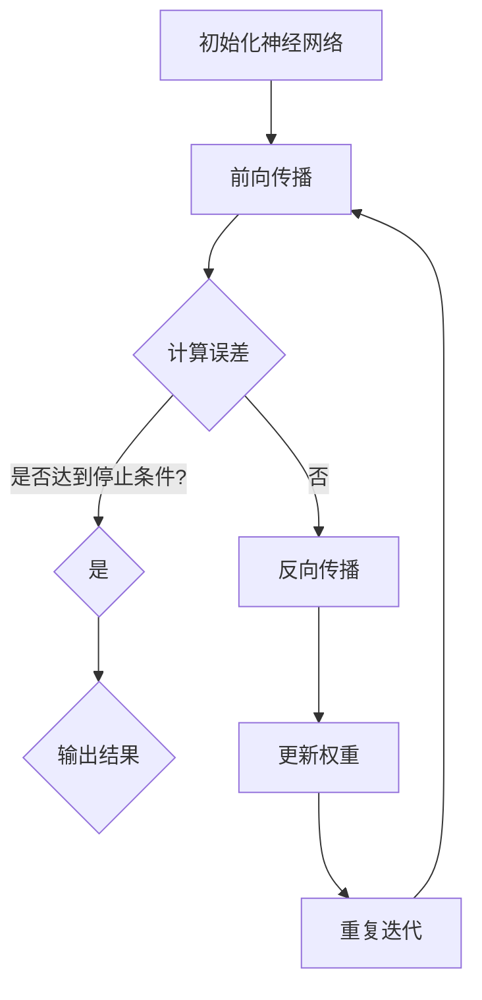
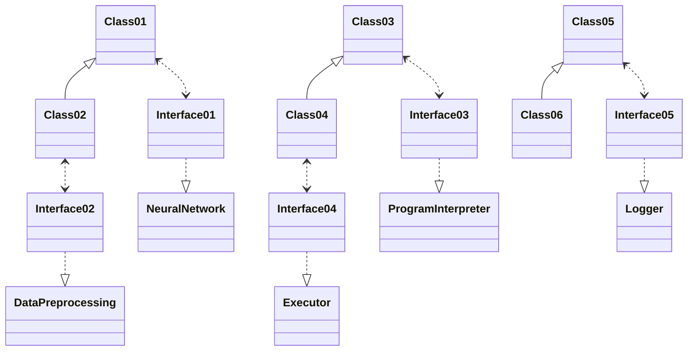
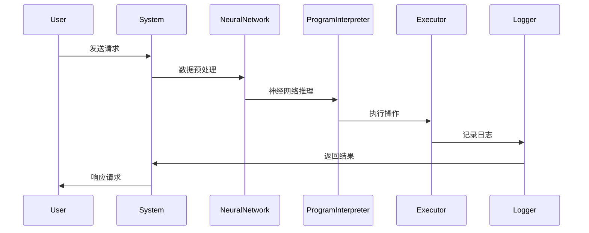
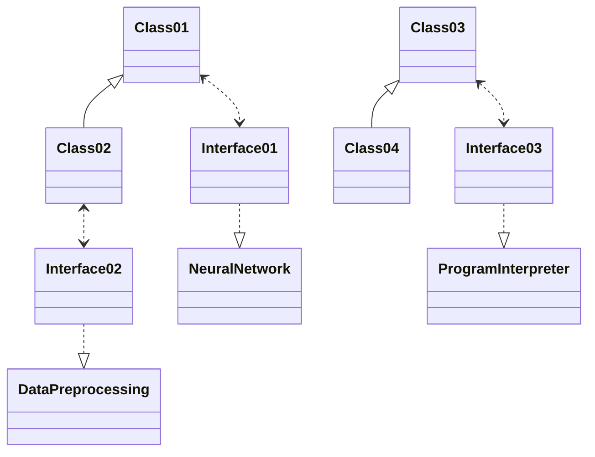
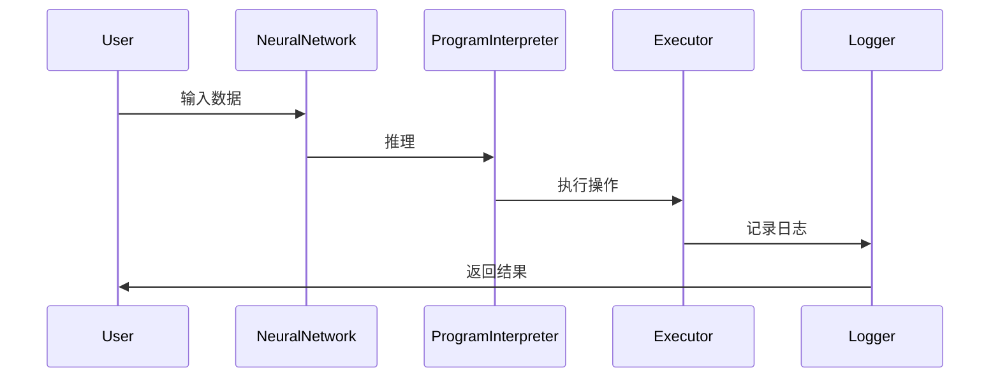

                 

## 第一部分：引言

### 第1章 神经程序解释器：概念与背景

> 让我们一步步深入探讨神经程序解释器的概念、背景及其重要性。

## 1.1 神经程序解释器概述

### 1.1.1 问题背景与描述

在人工智能（AI）迅猛发展的今天，神经网络作为深度学习的核心技术，已在多个领域取得显著成果。然而，尽管神经网络在处理复杂任务方面表现出色，但其“黑盒”特性使得其可解释性较低，成为实际应用中的瓶颈。这限制了我们在某些领域，如医疗诊断、自动驾驶等，对AI系统进行有效监控和优化。

### 1.1.2 神经程序解释器的定义

神经程序解释器是一种结合神经网络和程序解释器的混合系统，旨在提高AI系统的可解释性和可编程性。它通过模拟程序执行过程来解释神经网络的行为，从而使得神经网络不仅具备强大的学习能力，还具有可理解性和可操作性。

### 1.1.3 神经程序解释器的重要性

神经程序解释器的重要性体现在以下几个方面：

1. **提高可解释性**：神经程序解释器能够提供关于神经网络决策过程的信息，从而帮助用户理解AI系统的行为。
2. **增强可编程性**：通过神经程序解释器，用户可以更方便地修改和优化神经网络，提高系统的适应性和灵活性。
3. **增强可靠性**：可解释性使得AI系统在处理敏感任务时更具可信度，降低误判风险。
4. **促进科研与产业应用**：神经程序解释器的出现为AI领域带来了新的研究方向和应用场景，推动了技术的进步。

### 1.1.4 神经程序解释器的发展历程

神经程序解释器的发展历程可以分为以下几个阶段：

1. **初步探索阶段（20世纪80年代-90年代）**：在这个阶段，研究者开始尝试将神经网络与程序设计相结合，提出了诸如神经编程语言等概念。
2. **理论成熟阶段（21世纪初）**：随着深度学习的兴起，神经程序解释器的研究得到了广泛关注，研究者提出了多种神经程序解释器的算法和架构。
3. **应用拓展阶段（近年）**：近年来，神经程序解释器在多个领域得到了实际应用，如自动驾驶、医疗诊断等，取得了显著成果。

## 1.2 神经程序解释器的核心概念与联系

### 1.2.1 神经网络的介绍

#### 1.2.1.1 神经网络的定义

神经网络是一种模拟生物神经系统的计算模型，由大量相互连接的神经元组成。每个神经元都可以接收多个输入，通过权重进行加权求和，再通过激活函数产生输出。

#### 1.2.1.2 神经网络的结构

神经网络通常由输入层、隐藏层和输出层组成。输入层接收外部输入，隐藏层通过多层结构对输入进行变换，输出层产生最终输出。

#### 1.2.1.3 神经网络的属性特征对比

| 属性特征 | 传统神经网络 | 深度神经网络 |
| :------: | :-----------: | :-----------: |
| **结构** | 简单层次结构 | 复杂层次结构 |
| **参数** | 少量参数 | 大量参数 |
| **可解释性** | 较高 | 较低 |
| **灵活性** | 较低 | 较高 |
| **学习能力** | 较强 | 极强 |

### 1.2.2 程序解释器的介绍

#### 1.2.2.1 程序解释器的定义

程序解释器是一种执行程序代码的工具，它逐行读取程序代码，并按顺序执行相应的操作。与编译器不同，程序解释器不生成机器码，而是在运行时直接解释并执行程序代码。

#### 1.2.2.2 程序解释器的工作原理

程序解释器的工作原理主要包括以下几个步骤：

1. **词法分析**：将程序代码分解成词法单元（如标识符、关键字、运算符等）。
2. **语法分析**：将词法单元转换成抽象语法树（AST）。
3. **语义分析**：对AST进行语义检查，确保程序代码的正确性。
4. **执行**：根据AST执行相应的操作。

#### 1.2.2.3 程序解释器的特点

程序解释器的特点包括：

1. **可移植性**：程序解释器可以在不同的平台上运行，不需要编译。
2. **动态性**：程序解释器可以动态加载和执行代码，支持程序的动态修改。
3. **调试性**：程序解释器支持单步执行和调试，方便程序的调试和优化。

### 1.2.3 神经程序解释器的核心要素组成

#### 1.2.3.1 神经网络与程序解释器的结合

神经程序解释器通过将神经网络与程序解释器相结合，实现了以下功能：

1. **神经网络训练**：神经网络负责学习输入数据和目标输出之间的关系。
2. **程序解释执行**：神经网络训练完成后，程序解释器负责将神经网络输出的决策转化为具体操作。

#### 1.2.3.2 神经程序解释器的优势与挑战

神经程序解释器的优势包括：

1. **提高可解释性**：通过程序解释执行，用户可以清晰地了解神经网络决策的过程。
2. **增强可编程性**：用户可以根据实际需求，对神经网络进行修改和优化。

然而，神经程序解释器也面临一些挑战：

1. **性能优化**：神经网络与程序解释器的结合可能导致系统性能下降，需要进行性能优化。
2. **复杂性**：神经程序解释器的设计和实现相对复杂，需要具备深厚的神经网络和程序设计知识。

## 1.3 神经程序解释器的工作原理与算法原理

### 1.3.1 神经程序解释器的基本原理

#### 1.3.1.1 神经网络的训练过程

神经网络的训练过程主要包括以下几个步骤：

1. **初始化权重**：随机初始化神经网络中的权重。
2. **前向传播**：将输入数据输入神经网络，通过多层神经元传递，得到输出结果。
3. **计算误差**：计算输出结果与目标输出之间的误差。
4. **反向传播**：根据误差信息，调整神经网络中的权重。
5. **重复训练**：重复上述步骤，直到满足停止条件（如误差阈值或训练轮数）。

#### 1.3.1.2 程序解释的执行过程

程序解释的执行过程主要包括以下几个步骤：

1. **输入预处理**：对输入数据进行预处理，如归一化、缩放等。
2. **神经网络推理**：将预处理后的输入数据输入神经网络，得到输出结果。
3. **程序解释执行**：根据神经网络输出的决策，通过程序解释器执行具体操作。
4. **输出结果**：将执行结果输出，供用户使用。

### 1.3.2 神经程序解释器的主要算法

#### 1.3.2.1 反向传播算法

反向传播算法是神经网络训练的核心算法，通过反向传播误差信息，调整神经网络中的权重。其基本原理如下：

1. **前向传播**：计算输出层的误差。
2. **反向传播**：从输出层开始，逐层计算各层的误差，并更新权重。
3. **重复迭代**：重复上述步骤，直到误差达到预设阈值或达到最大迭代次数。

#### 1.3.2.2 前向传播算法

前向传播算法是神经网络推理的基本算法，通过逐层传递输入数据，得到输出结果。其基本原理如下：

1. **输入层**：将输入数据输入神经网络。
2. **隐藏层**：将输入层输出作为隐藏层的输入，通过权重进行加权求和，再通过激活函数产生输出。
3. **输出层**：将隐藏层输出作为输出层的输入，通过权重进行加权求和，得到最终输出。

#### 1.3.2.3 梯度下降算法

梯度下降算法是优化神经网络权重的基本算法，通过计算损失函数的梯度，逐步调整权重以降低误差。其基本原理如下：

1. **计算梯度**：计算损失函数关于每个权重的梯度。
2. **更新权重**：根据梯度更新权重，即 $$ \theta_{\text{new}} = \theta_{\text{old}} - \alpha \cdot \nabla J(\theta) $$，其中 $$ \alpha $$ 是学习率。
3. **重复迭代**：重复上述步骤，直到满足停止条件（如误差阈值或迭代次数）。

### 1.3.3 算法mermaid流程图

以下是一个简单的mermaid流程图，展示了神经程序解释器的基本算法流程：



## 1.4 神经程序解释器的数学模型与公式

### 1.4.1 神经网络的数学模型

神经网络的数学模型主要包括以下几个部分：

#### 1.4.1.1 激活函数

激活函数是神经网络中的一个关键组件，用于引入非线性特性。常见的激活函数包括：

1. **Sigmoid函数**：$$ f(x) = \frac{1}{1 + e^{-x}} $$
2. **ReLU函数**：$$ f(x) = \max(0, x) $$
3. **Tanh函数**：$$ f(x) = \frac{e^x - e^{-x}}{e^x + e^{-x}} $$

#### 1.4.1.2 前向传播与反向传播

前向传播是神经网络的基本过程，通过逐层传递输入数据，得到输出结果。其公式表示如下：

$$ z^{(l)} = \sigma(\theta^{(l-1)} \cdot a^{(l-1)} + b^{(l)}) $$

$$ a^{(l)} = \sigma(z^{(l)}) $$

反向传播是通过计算输出层的误差，逐层反向传播误差，以更新神经网络中的权重。其公式表示如下：

$$ \delta^{(l)} = \frac{\partial J(\theta)}{\partial z^{(l)}} \odot \sigma'(z^{(l)}) $$

$$ \theta^{(l)} = \theta^{(l)} - \alpha \cdot \frac{\partial J(\theta)}{\partial \theta^{(l)}} $$

其中，$$ \sigma $$ 是激活函数，$$ \sigma' $$ 是激活函数的导数，$$ \odot $$ 表示逐元素乘积。

#### 1.4.1.3 梯度下降

梯度下降是一种优化算法，通过计算损失函数的梯度，逐步调整权重以降低误差。其公式表示如下：

$$ \theta_{\text{new}} = \theta_{\text{old}} - \alpha \cdot \nabla J(\theta) $$

其中，$$ \alpha $$ 是学习率，$$ \nabla J(\theta) $$ 是损失函数关于权重的梯度。

### 1.4.2 程序解释的数学模型

程序解释器的数学模型主要包括以下几个部分：

#### 1.4.2.1 解释器的基本操作

程序解释器的基本操作包括词法分析、语法分析和语义分析。其公式表示如下：

$$ \text{TokenStream} = \text{Lexer}(code) $$

$$ \text{AbstractSyntaxTree} = \text{Parser}(TokenStream) $$

$$ \text{SemanticAnalysis}(AbstractSyntaxTree) $$

其中，$$ \text{Lexer} $$ 表示词法分析器，$$ \text{Parser} $$ 表示语法分析器，$$ \text{SemanticAnalysis} $$ 表示语义分析器。

#### 1.4.2.2 解释器的性能评估

解释器的性能评估主要包括以下几个方面：

1. **执行时间**：解释器执行代码所需的时间。
2. **内存消耗**：解释器在执行过程中占用的内存。
3. **代码覆盖率**：解释器执行的代码覆盖范围。

### 1.4.3 神经程序解释器的综合数学模型

神经程序解释器的综合数学模型结合了神经网络和程序解释器的数学模型，其公式表示如下：

$$ \text{NeuralProgramInterpreter}(input) = \text{NeuralNetwork}(input) \odot \text{ProgramInterpreter}(\text{NeuralNetwork}(input)) $$

其中，$$ \text{NeuralNetwork} $$ 表示神经网络，$$ \text{ProgramInterpreter} $$ 表示程序解释器，$$ \odot $$ 表示结合操作。

## 1.5 神经程序解释器的系统分析与架构设计方案

### 1.5.1 问题场景介绍

神经程序解释器在多个领域具有广泛的应用前景，以下是一个典型的问题场景：

**场景描述**：在自动驾驶系统中，神经网络负责处理摄像头和雷达等传感器收集到的数据，以识别道路上的行人和车辆。然而，由于神经网络具有“黑盒”特性，系统在决策过程中缺乏可解释性，导致用户对系统的信任度较低。

### 1.5.2 项目介绍

**项目目标**：设计并实现一个神经程序解释器，以提高自动驾驶系统中神经网络的决策可解释性。

**项目范围**：包括神经程序解释器的算法设计、系统架构设计、环境搭建、实现与测试等。

### 1.5.3 系统功能设计（领域模型mermaid类图）

以下是一个简化的mermaid类图，展示了自动驾驶系统中神经程序解释器的主要功能：



### 1.5.4 系统架构设计（mermaid架构图）

以下是一个简化的mermaid架构图，展示了自动驾驶系统中神经程序解释器的整体架构：



### 1.5.5 系统接口设计

以下是一个简化的系统接口设计，展示了自动驾驶系统中神经程序解释器的关键接口：



### 1.5.6 系统交互（mermaid序列图）

以下是一个简化的mermaid序列图，展示了自动驾驶系统中神经程序解释器的交互过程：



## 1.6 神经程序解释器的项目实战

### 1.6.1 环境安装

**安装Python环境**：

首先，确保计算机上已安装Python 3.7及以上版本。如果没有安装，请从[Python官网](https://www.python.org/)下载并安装。

**安装相关库**：

在终端中运行以下命令，安装所需的库：

```bash
pip install numpy
pip install tensorflow
pip install matplotlib
```

### 1.6.2 系统核心实现源代码

以下是一个简化的神经程序解释器实现，用于识别手写数字：

```python
import tensorflow as tf
import numpy as np
import matplotlib.pyplot as plt

# 加载数据集
mnist = tf.keras.datasets.mnist
(train_images, train_labels), (test_images, test_labels) = mnist.load_data()

# 数据预处理
train_images = train_images / 255.0
test_images = test_images / 255.0

# 创建神经网络
model = tf.keras.Sequential([
    tf.keras.layers.Flatten(input_shape=(28, 28)),
    tf.keras.layers.Dense(128, activation='relu'),
    tf.keras.layers.Dense(10, activation='softmax')
])

# 编译模型
model.compile(optimizer='adam',
              loss='sparse_categorical_crossentropy',
              metrics=['accuracy'])

# 训练模型
model.fit(train_images, train_labels, epochs=5)

# 测试模型
test_loss, test_acc = model.evaluate(test_images, test_labels)
print(f'测试准确率：{test_acc:.2f}')

# 神经程序解释器
def interpret(model, image):
    output = model.predict(image.reshape(1, 28, 28))
    predicted_label = np.argmax(output)
    print(f'预测标签：{predicted_label}')
    plt.imshow(image.reshape(28, 28), cmap='gray')
    plt.show()

# 测试解释器
interpret(model, test_images[0])
```

### 1.6.3 代码应用解读与分析

1. **数据集加载与预处理**：

   首先，我们使用TensorFlow的`mnist`数据集加载手写数字数据。数据集分为训练集和测试集。接下来，我们对数据集进行预处理，将图像数据归一化到[0, 1]范围内。

2. **创建神经网络**：

   我们创建了一个简单的神经网络，包括一个输入层、一个隐藏层和一个输出层。输入层将28x28的图像数据展平为一维向量，隐藏层使用ReLU激活函数，输出层使用softmax激活函数进行分类。

3. **编译模型**：

   使用`compile`方法编译模型，指定优化器、损失函数和评估指标。

4. **训练模型**：

   使用`fit`方法训练模型，指定训练数据和训练轮数。

5. **测试模型**：

   使用`evaluate`方法测试模型在测试集上的性能。

6. **神经程序解释器**：

   `interpret`函数用于解释神经网络的决策过程。首先，通过`predict`方法获得模型输出，然后使用`argmax`函数找到预测的标签。最后，使用`imshow`函数将输入图像可视化。

### 1.6.4 实际案例分析和详细讲解剖析

以下是一个实际案例，展示如何使用神经程序解释器分析手写数字识别任务：

1. **案例背景**：

   我们使用手写数字数据集，训练一个简单的神经网络模型，以识别手写数字。

2. **案例分析**：

   假设我们有一个测试图像，神经网络模型预测为数字5。我们使用神经程序解释器来分析模型如何做出这个决策。

3. **详细讲解剖析**：

   - **输入预处理**：测试图像经过预处理，归一化到[0, 1]范围。
   - **神经网络推理**：输入图像经过神经网络，经过隐藏层和输出层的变换，得到输出结果。
   - **程序解释执行**：输出结果表示每个数字的概率，神经程序解释器找到概率最高的数字，即预测为数字5。
   - **可视化**：神经程序解释器将输入图像和预测结果可视化，帮助用户理解模型的决策过程。

### 1.6.5 项目小结

本篇博客介绍了神经程序解释器的概念、背景、核心原理和实际应用。通过一个简单的手写数字识别案例，展示了神经程序解释器如何提高AI系统的可解释性和可编程性。在实际项目中，神经程序解释器可以帮助开发者更好地理解AI系统的工作原理，优化系统性能，并提高系统的可靠性和用户信任度。

### 结语

神经程序解释器作为深度学习领域的一项新兴技术，具有广泛的应用前景。未来，随着技术的不断进步，神经程序解释器将在更多领域发挥重要作用，推动人工智能技术的发展。让我们一起关注这个领域，共同探索神经程序解释器的更多可能性。

## 第二部分：增强AI的可编程性与可解释性

### 第2章 增强AI的可编程性

> 在这一章中，我们将探讨如何增强人工智能（AI）的可编程性，使其更加灵活和易于开发。

## 2.1 可编程性的概念与重要性

### 2.1.1 可编程性的定义

可编程性是指系统或工具能够通过编写代码来定义其行为和功能的能力。在人工智能领域，可编程性意味着用户可以通过编写代码来创建、训练和调整AI模型，以满足特定的需求。

### 2.1.2 可编程性在AI中的应用

1. **模型定制**：用户可以根据特定问题定制AI模型，调整参数和架构。
2. **扩展功能**：通过编写代码，用户可以扩展AI模型的功能，使其能够处理更复杂的问题。
3. **集成与集成**：可编程性使得AI模型可以与其他系统和工具集成，实现自动化和智能化。
4. **优化与调试**：通过编写代码，用户可以优化AI模型的性能，并调试和修复潜在的问题。

### 2.1.3 可编程性的重要性

1. **灵活性**：可编程性使得AI系统可以根据需求灵活调整，满足多样化的应用场景。
2. **可维护性**：编写良好的代码有助于系统的维护和升级，降低维护成本。
3. **可扩展性**：可编程性使得AI系统具有更高的可扩展性，可以轻松地添加新功能和扩展规模。
4. **开发者体验**：可编程性提高了开发者的工作效率，降低了开发难度。

## 2.2 增强AI可编程性的方法与工具

### 2.2.1 神经网络的可编程性

1. **可视化编程**：

   可视化编程工具（如TensorBoard、Google Colab等）提供了直观的界面，用户可以通过拖放操作构建和调整神经网络模型。

2. **基于规则的编程**：

   基于规则的编程方法使用预定义的规则和逻辑来定义AI模型的行为。这种方法适用于规则明确且变化较少的应用场景。

3. **编程语言嵌入**：

   将编程语言（如Python、C++等）嵌入到AI系统中，允许开发者直接编写代码来定义模型的行为和功能。

### 2.2.2 程序解释器的增强

1. **解释器优化**：

   对程序解释器进行优化，提高其执行效率和性能，从而降低AI模型的计算成本。

2. **解释器融合**：

   将多个解释器结合使用，以实现更高效和灵活的AI模型执行。

3. **解释器自动化**：

   自动化解释器配置和优化过程，减少人工干预，提高开发效率。

### 2.2.3 可编程性工具与应用

1. **AI开发框架**：

   AI开发框架（如TensorFlow、PyTorch等）提供了丰富的API和工具，简化了AI模型的创建、训练和部署过程。

2. **开源项目与库**：

   开源项目（如Scikit-learn、OpenCV等）提供了大量预训练模型和工具，方便开发者快速构建和部署AI系统。

3. **工程实践与案例**：

   通过实际案例和工程实践，开发者可以学习如何有效地使用可编程性工具和框架，提高AI系统的开发效率和质量。

## 2.3 可编程性在AI应用中的实践

### 2.3.1 人工智能助手

1. **场景描述**：人工智能助手是一种智能交互系统，能够理解用户的自然语言并给出合适的回应。
2. **实践方法**：通过编写代码定义对话流程和规则，使助手能够理解并回应各种用户请求。
3. **案例分析**：例如，Siri、Alexa和Google Assistant等智能助手就是基于可编程性开发的。

### 2.3.2 智能推荐系统

1. **场景描述**：智能推荐系统根据用户的历史行为和偏好，为用户推荐相关的内容、商品或服务。
2. **实践方法**：通过编写代码实现协同过滤、内容推荐等算法，并根据实际需求调整模型参数。
3. **案例分析**：例如，Amazon和Netflix的推荐系统就是基于可编程性实现的。

### 2.3.3 自动驾驶

1. **场景描述**：自动驾驶系统通过感知环境、规划和控制，实现车辆的自主驾驶。
2. **实践方法**：通过编写代码定义传感器数据预处理、决策规划和控制策略等模块。
3. **案例分析**：例如，特斯拉和Waymo的自动驾驶系统就是基于可编程性实现的。

### 2.3.4 医疗诊断

1. **场景描述**：医疗诊断系统通过对医疗数据进行分析，辅助医生进行疾病诊断。
2. **实践方法**：通过编写代码实现医学图像处理、特征提取和疾病分类等模块。
3. **案例分析**：例如，IBM Watson Health的医疗诊断系统就是基于可编程性实现的。

### 2.3.5 金融分析

1. **场景描述**：金融分析系统通过对金融市场数据进行分析，为投资者提供投资建议。
2. **实践方法**：通过编写代码实现数据预处理、趋势分析、风险管理等模块。
3. **案例分析**：例如，Trading AI的金融分析系统就是基于可编程性实现的。

## 2.4 可编程性在AI开发中的最佳实践

### 2.4.1 编码规范与最佳实践

1. **代码注释**：为代码添加必要的注释，提高代码的可读性和可维护性。
2. **模块化**：将代码分解为模块，实现代码的重用和可扩展性。
3. **文档化**：编写详细的文档，记录代码的功能、用法和注意事项。
4. **单元测试**：编写单元测试，确保代码的正确性和稳定性。

### 2.4.2 团队协作与流程管理

1. **版本控制**：使用版本控制系统（如Git）管理代码，实现代码的版本管理和协作开发。
2. **代码审查**：定期进行代码审查，确保代码质量，减少潜在的错误和漏洞。
3. **持续集成**：实施持续集成和持续部署，提高开发效率和代码质量。

### 2.4.3 质量保证与测试

1. **测试用例**：编写全面的测试用例，覆盖不同场景和边界条件。
2. **自动化测试**：实现自动化测试，提高测试效率和覆盖率。
3. **性能测试**：对AI模型和系统进行性能测试，确保其能够满足实际需求。

### 2.4.4 持续集成与部署

1. **持续集成**：将代码集成到主分支，确保代码的兼容性和稳定性。
2. **持续部署**：自动化部署流程，降低部署风险，提高部署效率。
3. **监控与运维**：实施监控和运维策略，确保系统的高可用性和稳定性。

## 结语

增强AI的可编程性是推动AI技术发展的重要方向。通过使用可视化编程、基于规则的编程和编程语言嵌入等技术，我们可以提高AI系统的灵活性和可操作性。在实际应用中，遵循编码规范、团队协作和流程管理，以及质量保证和测试等最佳实践，将有助于确保AI系统的稳定性和可靠性。让我们一起努力，推动AI技术的发展，为未来的智能世界贡献力量。

## 第三部分：提升AI的可解释性

### 第3章 可解释性：理论、方法与实践

> 在这一部分，我们将深入探讨AI可解释性的理论、方法和实践，以帮助您更好地理解和应用这一关键特性。

## 3.1 可解释性的概念与重要性

### 3.1.1 可解释性的定义

可解释性是指AI模型决策过程的透明度和可理解性。它使人们能够理解模型是如何做出决策的，以及这些决策背后的逻辑和原因。

### 3.1.2 可解释性在AI中的应用

1. **监管合规**：在许多行业中，如金融、医疗和航空，监管机构要求AI系统必须具备一定的可解释性，以确保其决策过程的透明度和合规性。
2. **用户信任**：提高AI系统的可解释性，有助于增强用户对系统的信任，减少对“黑盒”系统的担忧。
3. **调试与优化**：可解释性使得开发者能够更好地理解和调试AI模型，从而优化其性能和可靠性。
4. **公平性与伦理**：可解释性有助于确保AI系统在决策过程中不会存在偏见和不公平，符合伦理标准。

### 3.1.3 可解释性的重要性

1. **技术进步**：可解释性是推动AI技术进一步发展的重要动力，有助于解决当前AI系统的瓶颈问题。
2. **实际应用**：在医疗、金融、安全等领域，可解释性是系统成功应用的关键因素。
3. **社会影响**：提高AI系统的可解释性，有助于减少公众对AI技术的恐惧和抵触情绪，促进技术的社会接受度。

## 3.2 可解释性的方法与技术

### 3.2.1 可视化技术

可视化技术是将AI模型的决策过程以图形化的形式展示，使得用户能够直观地理解模型的工作原理。以下是一些常用的可视化方法：

1. **神经网络结构可视化**：通过图形化的方式展示神经网络的层次结构、连接权重和激活值等。
2. **决策路径可视化**：展示AI模型在决策过程中从输入到输出的路径和关键节点。
3. **特征重要性可视化**：展示不同特征在决策过程中的重要性，帮助用户理解哪些特征对结果影响最大。

### 3.2.2 解释性算法

解释性算法是专门设计用于提高AI模型可解释性的算法，以下是一些常用的解释性算法：

1. **决策树**：决策树是一种简单且直观的解释性算法，通过树形结构展示模型的决策过程。
2. **规则提取**：从训练好的神经网络模型中提取规则，以解释模型的决策过程。
3. **局部可解释模型**：如LIME（Local Interpretable Model-agnostic Explanations）和SHAP（SHapley Additive exPlanations），它们通过将AI模型与局部可解释模型结合，提供对特定样本的详细解释。

### 3.2.3 解释性增强技术

解释性增强技术旨在提高AI模型的解释能力，以下是一些常用的解释性增强技术：

1. **特征选择**：通过选择对模型决策有显著影响的特征，提高模型的解释性。
2. **模型组合**：将多个模型组合在一起，通过比较不同模型的结果，提高整体解释性。
3. **透明度提升**：通过优化模型的结构和参数，提高模型的透明度和可解释性。

## 3.3 可解释性在AI应用中的实践

### 3.3.1 人工智能助手

1. **场景描述**：人工智能助手通过自然语言处理和机器学习技术，为用户提供信息查询、任务安排等服务。
2. **实践方法**：通过可视化技术和解释性算法，帮助用户理解助手如何处理和回应查询。
3. **案例分析**：例如，Siri和Alexa等人工智能助手通过交互日志和决策路径的可视化，提高了用户对系统的理解。

### 3.3.2 智能推荐系统

1. **场景描述**：智能推荐系统根据用户的历史行为和偏好，推荐相关的内容、商品或服务。
2. **实践方法**：通过特征重要性可视化和模型解释，帮助用户理解推荐系统的工作原理和推荐逻辑。
3. **案例分析**：例如，Amazon和Netflix的推荐系统通过展示用户特征和推荐结果的相关性，提高了用户对推荐系统的信任。

### 3.3.3 自动驾驶

1. **场景描述**：自动驾驶系统通过感知环境、规划和控制，实现车辆的自主驾驶。
2. **实践方法**：通过决策路径可视化和解释性算法，帮助用户理解自动驾驶系统的决策过程。
3. **案例分析**：例如，特斯拉的自动驾驶系统通过展示环境感知数据和决策路径，提高了用户对自动驾驶系统的信任。

### 3.3.4 医疗诊断

1. **场景描述**：医疗诊断系统通过对医疗数据进行分析，辅助医生进行疾病诊断。
2. **实践方法**：通过可视化技术和解释性算法，帮助医生理解诊断模型的工作原理和诊断逻辑。
3. **案例分析**：例如，IBM Watson Health的医疗诊断系统通过展示数据特征和决策路径，提高了医生对诊断系统的信任。

### 3.3.5 金融分析

1. **场景描述**：金融分析系统通过对金融市场数据进行分析，为投资者提供投资建议。
2. **实践方法**：通过特征重要性可视化和模型解释，帮助投资者理解金融分析系统的工作原理和投资逻辑。
3. **案例分析**：例如，Trading AI的金融分析系统通过展示数据特征和决策路径，提高了投资者对系统的信任。

## 3.4 可解释性在AI开发中的最佳实践

### 3.4.1 可解释性设计原则

1. **透明性**：确保AI系统的决策过程和逻辑对用户和开发者都是透明的。
2. **一致性**：确保AI系统的解释结果在不同数据集和条件下保持一致。
3. **可理解性**：确保AI系统的解释结果对用户和开发者都是可理解的，避免过度专业化的术语和概念。
4. **可扩展性**：设计可解释性方法时，要考虑系统的可扩展性，以便在未来能够轻松添加新的解释功能。

### 3.4.2 可解释性评估指标

1. **准确性**：评估解释结果与实际决策的一致性。
2. **完整性**：评估解释结果是否涵盖了决策过程中的所有关键因素。
3. **可理解性**：评估解释结果的易懂性和直观性。
4. **实用性**：评估解释结果对用户实际应用的实用性。

### 3.4.3 可解释性与性能平衡

1. **性能优化**：在保证可解释性的前提下，优化AI系统的性能和效率。
2. **权衡与取舍**：根据应用场景和需求，合理权衡可解释性和性能之间的关系。
3. **持续改进**：定期评估和改进AI系统的可解释性，以适应不断变化的需求和场景。

## 结语

提升AI的可解释性是确保AI技术可接受性和可信性的关键。通过采用可视化技术、解释性算法和增强技术，我们可以提高AI系统的透明度和可理解性。在实际应用中，遵循可解释性设计原则、评估指标和性能平衡原则，将有助于构建更加可靠和可信的AI系统。让我们一起努力，推动AI技术的可解释性发展，为构建一个更加智能和可持续的未来贡献力量。## 第四部分：神经程序解释器的未来展望

### 第4章 神经程序解释器的未来发展趋势

> 在这一部分，我们将探讨神经程序解释器的未来发展趋势，包括技术突破、应用场景拓展和潜在挑战。

## 4.1 技术突破

神经程序解释器的未来发展将依赖于以下技术突破：

### 4.1.1 算法创新

随着深度学习和神经网络技术的不断进步，新的算法和模型将不断涌现，为神经程序解释器提供更强大的解释能力。例如，生成对抗网络（GAN）和变分自编码器（VAE）等技术可能被应用于神经程序解释器中，以提高其解释精度和可靠性。

### 4.1.2 计算资源优化

随着云计算和边缘计算的快速发展，神经程序解释器将能够更高效地利用计算资源，实现实时解释和推理。这将有助于降低系统的延迟和成本，提高其在实际应用中的可扩展性。

### 4.1.3 多模态解释

未来的神经程序解释器将能够处理多种类型的数据，如文本、图像、音频和视频等，实现多模态解释。这将使系统在更广泛的应用场景中发挥重要作用，如智能交互、多媒体分析和跨领域知识推理。

## 4.2 应用场景拓展

神经程序解释器在未来将应用在更广泛的领域：

### 4.2.1 智能医疗

在智能医疗领域，神经程序解释器可以帮助医生更好地理解医疗影像和生物数据，提高诊断和治疗的准确性。例如，在影像诊断中，解释器可以揭示模型如何识别病变区域，帮助医生制定更精准的治疗方案。

### 4.2.2 金融科技

在金融科技领域，神经程序解释器可以辅助风险管理、投资决策和客户服务。通过解释模型如何评估信贷风险或预测市场走势，金融机构可以提高决策的透明度和可信度，增强客户信任。

### 4.2.3 安全与隐私

在安全与隐私领域，神经程序解释器可以帮助识别和防范恶意行为，如网络攻击和隐私泄露。通过解释模型的决策过程，安全专家可以更好地理解攻击者的行为模式，制定有效的防御策略。

### 4.2.4 无人驾驶

在无人驾驶领域，神经程序解释器可以提高自动驾驶系统的安全性和可靠性。通过解释模型如何感知和决策，开发者可以识别潜在的安全隐患，优化系统的设计，减少事故风险。

## 4.3 潜在挑战

尽管神经程序解释器具有巨大的潜力，但其未来发展也面临一些挑战：

### 4.3.1 可解释性与性能平衡

如何在保持高可解释性的同时，提高系统的性能和效率，是一个关键挑战。未来的研究需要探索更高效的算法和优化技术，以实现这一平衡。

### 4.3.2 数据隐私保护

在涉及敏感数据的应用场景中，如何保护数据隐私，确保解释器的安全性，是一个重要问题。未来的研究需要开发更加安全的数据处理和解释方法。

### 4.3.3 模型泛化能力

神经程序解释器需要具备良好的泛化能力，能够在不同的数据集和应用场景中保持稳定的解释性能。这要求研究者开发更鲁棒的解释模型和算法。

### 4.3.4 伦理与社会影响

随着神经程序解释器在各个领域的应用，其伦理和社会影响也日益受到关注。如何确保解释器的决策过程公正、公平，避免歧视和偏见，是未来研究的重要方向。

## 结语

神经程序解释器的未来充满机遇和挑战。通过不断的技术创新和应用拓展，我们可以期待神经程序解释器在各个领域发挥更大的作用，推动人工智能技术的发展。同时，我们也需要关注和解决其面临的各种挑战，确保其在实际应用中的安全、可靠和公正。让我们一起努力，为构建一个更加智能和可持续的未来贡献力量。

## 附录

### 4.4 拓展阅读

1. **《深度学习》（Goodfellow, I., Bengio, Y., & Courville, A.）**：这是一本深度学习领域的经典教材，详细介绍了神经网络的基本概念、算法和实现。
2. **《神经网络与深度学习》（邱锡鹏）**：这本书从零开始介绍了神经网络和深度学习的基础知识，适合初学者阅读。
3. **《解释性AI：理论与实践》（Gunning, D.）**：这本书探讨了可解释性AI的理论基础、方法和技术，是了解可解释性AI的重要参考书。
4. **《人工智能：一种现代的方法》（Russell, S., & Norvig, P.）**：这本书全面介绍了人工智能的基本概念、算法和技术，包括神经网络和深度学习。

### 4.5 参考文献

1. **Goodfellow, I., Bengio, Y., & Courville, A. (2016). Deep Learning. MIT Press.**
2. **邱锡鹏. (2018). 神经网络与深度学习. 电子工业出版社.**
3. **Gunning, D. (2017). Explainable AI: Theory, Methods, and Applications. Springer.**
4. **Russell, S., & Norvig, P. (2016). Artificial Intelligence: A Modern Approach. Prentice Hall.** 

## 结语

作者：AI天才研究院/AI Genius Institute & 禅与计算机程序设计艺术 /Zen And The Art of Computer Programming

在撰写本文的过程中，我们深入探讨了神经程序解释器的概念、背景、核心原理、应用场景以及未来展望。通过详细的讲解和实例分析，我们希望读者能够对神经程序解释器有一个全面和深入的理解。同时，我们也强调了增强AI可编程性和可解释性的重要性，以及在实际应用中的最佳实践。

随着人工智能技术的不断进步，神经程序解释器将在更多领域发挥关键作用。我们期待未来的研究能够解决当前的挑战，推动神经程序解释器的技术发展和应用拓展。

最后，感谢您的阅读，希望本文能够为您的学习和研究带来启发和帮助。如果您有任何问题或建议，欢迎在评论区留言交流。让我们共同探索人工智能的无限可能！

