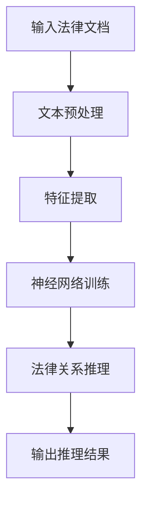

                 

**Step 1: 引言**

在本文中，我们将探讨神经-符号AI系统在法律推理中的应用。法律推理作为法律领域的重要研究内容，一直以来都是学者们关注的焦点。随着人工智能技术的发展，特别是神经网络和符号AI的结合，为法律推理带来了新的可能性。

### 核心概念术语说明

- **神经网络**：一种模仿生物神经系统的计算模型，具有自适应性和学习能力。
- **符号AI**：基于逻辑推理和符号计算的AI系统，具有较强的逻辑推理能力。
- **神经-符号AI系统**：结合神经网络和符号AI的优点，实现更强大的智能推理能力。

### 问题背景

在法律领域中，推理是法律分析的核心。传统的法律推理依赖于人工经验，效率低下且容易出现错误。随着法律案件数量的增加，对高效、准确的法律推理系统的需求愈发迫切。

### 问题描述

如何利用神经-符号AI系统实现高效、准确的法律推理？

### 问题解决

神经-符号AI系统结合了神经网络和符号AI的优势，能够在法律推理中发挥重要作用。神经网络能够处理大量数据，提取出有用的特征；符号AI则能够进行逻辑推理，确保推理过程的正确性。

### 边界与外延

神经-符号AI系统在法律推理中的应用，不仅限于法律文本的解析，还包括法律规则的学习、法律事实的抽取和法律关系的推理等多个方面。

### 概念结构与核心要素组成

- **神经网络**：输入层、隐藏层、输出层。
- **符号AI**：知识库、推理机、解释器。

**Step 2: 核心概念与联系**

在本文中，我们将详细探讨神经网络和符号AI的核心概念，并分析它们在法律推理中的应用。

### 核心概念与原理

#### 神经网络

神经网络是一种通过模拟生物神经系统的计算模型，具有自适应性和学习能力。神经网络的核心组成部分包括：

- **神经元**：神经网络的基本计算单元。
- **权重**：神经元之间的连接强度。
- **激活函数**：用于确定神经元是否被激活。

神经网络的工作原理是通过对输入数据进行处理，逐步提取特征，最终得到输出结果。

#### 符号AI

符号AI是一种基于逻辑推理和符号计算的AI系统，具有较强的逻辑推理能力。符号AI的核心组成部分包括：

- **知识库**：存储符号AI的知识。
- **推理机**：根据知识库进行推理。
- **解释器**：对推理结果进行解释。

符号AI的工作原理是通过逻辑推理，将已知的事实和规则结合起来，推导出新的结论。

### 概念属性特征对比表格

| 特征               | 神经网络                            | 符号AI                            |
|--------------------|-----------------------------------|-----------------------------------|
| 学习方式           | 数据驱动学习                      | 知识驱动学习                      |
| 推理能力           | 数据相关性分析，模式识别          | 逻辑推理，知识推理                |
| 数据需求           | 大量数据                          | 少量知识，大量数据                |
| 算法复杂性         | 复杂，自适应                      | 简单，确定性                      |
| 适应性             | 强，自适应性强                    | 弱，适应能力较低                  |

### ER实体关系图架构的 Mermaid 流程图

```mermaid
erDiagram
  A[客户] ||--|{ 订单 }|-- B[产品]
  B ||--|{ 订单详情 }|-- C
  A ..|{ 联系方式 }.. D
```

**Step 3: 算法原理讲解**

在本文中，我们将详细介绍神经-符号AI系统在法律推理中的应用，并使用Mermaid画出算法流程图，使用Python源代码来阐述算法原理。

### 神经网络在法律推理中的应用

#### 算法流程图



#### Python源代码

```python
# 导入所需的库
import tensorflow as tf
from tensorflow.keras.preprocessing.text import Tokenizer
from tensorflow.keras.models import Sequential
from tensorflow.keras.layers import Embedding, LSTM, Dense

# 文本预处理
def preprocess_text(text):
    # 这里使用简单的预处理方法，实际应用中可能需要更复杂的预处理
    return text.lower()

# 特征提取
tokenizer = Tokenizer()
tokenizer.fit_on_texts(preprocess_text(texts))

# 神经网络训练
model = Sequential()
model.add(Embedding(input_dim=10000, output_dim=32))
model.add(LSTM(32))
model.add(Dense(1, activation='sigmoid'))

model.compile(optimizer='adam', loss='binary_crossentropy', metrics=['accuracy'])
model.fit(x_train, y_train, epochs=10, batch_size=32)

# 法律关系推理
def legal_reasoning(text):
    processed_text = preprocess_text(text)
    features = tokenizer.texts_to_matrix([processed_text], mode='binary')
    return model.predict(features)

# 输出推理结果
print(legal_reasoning("This is a legal document."))
```

#### 算法原理

神经网络通过预处理文本、特征提取、训练和推理等步骤，实现对法律关系的推理。

- **文本预处理**：将法律文档转化为计算机可处理的格式。
- **特征提取**：使用Tokenize

