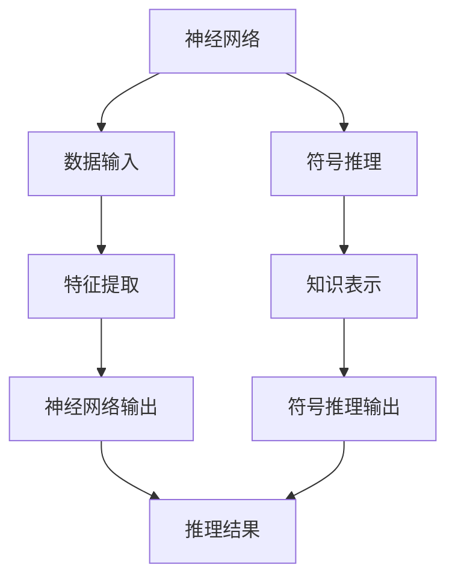
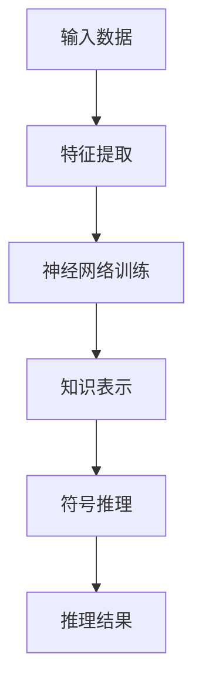
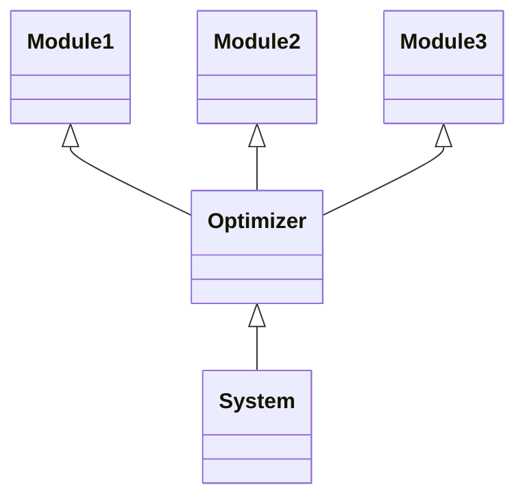
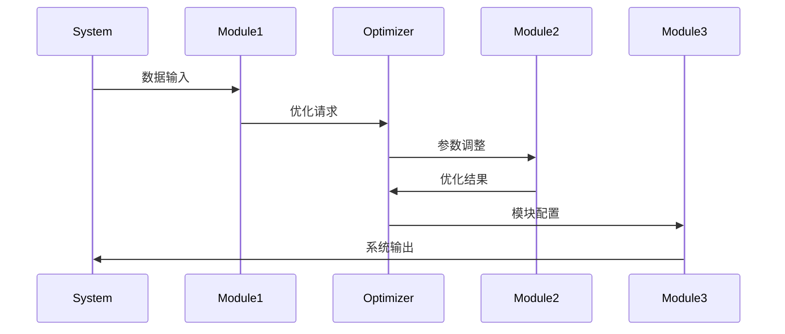

                 


### 第一步：确定文章标题、关键词和摘要

**文章标题：** 神经符号推理在复杂系统优化中的突破性进展

**关键词：** 神经符号推理、复杂系统优化、算法原理、系统架构设计、实战应用

**摘要：** 本篇文章深入探讨了神经符号推理在复杂系统优化中的应用，介绍了其基本概念、核心算法原理，以及实际应用中的系统架构设计和案例分析。文章旨在为读者提供全面的了解，并探讨未来的发展趋势和研究方向。

### 第二步：撰写引言部分

**引言：** 
复杂系统优化一直是计算机科学和工程领域的热点问题。随着数据量的急剧增长和系统复杂性的增加，传统的优化算法逐渐暴露出局限性。近年来，神经符号推理作为一种新兴的交叉学科方法，为复杂系统优化带来了新的思路和可能性。本文将详细探讨神经符号推理的基本概念、核心算法原理，以及在复杂系统优化中的应用案例，旨在为读者提供一次深入的技术探讨。

### 第三步：撰写第一章——神经符号推理基础

**第一章：神经符号推理基础**

**1.1 神经符号推理的起源与概念**

在介绍神经符号推理之前，我们需要先了解神经网络和符号推理的基本概念。神经网络起源于20世纪40年代，是模仿人脑神经元结构和工作原理的一种计算模型。符号推理则是一种基于逻辑和数学原理的推理方法，旨在通过符号操作来解决复杂问题。

**1.1.1 神经网络的局限性**

神经网络虽然在图像识别、自然语言处理等领域取得了显著的成果，但其也存在一些局限性。例如，神经网络在处理复杂问题时，往往依赖于大量的数据和长时间的训练。此外，神经网络难以解释其内部决策过程，这在某些应用场景中可能是不被接受的。

**1.1.2 符号推理与符号计算**

符号推理则具有更强的解释性和逻辑性。符号计算是一种基于数学和逻辑的推理方法，它可以通过公理和推理规则来推导出新的结论。这种方法在数学、逻辑、人工智能等领域有着广泛的应用。

**1.1.3 神经符号推理的定义**

神经符号推理（Neural Symbolic Reasoning）是一种结合神经网络和符号推理的方法。它试图通过神经网络来学习数据，并通过符号推理来解释和验证这些学习结果。神经符号推理的核心理念是整合数值计算和符号推理的优势，以实现更强大的问题解决能力。

### 第四步：撰写第二章——神经符号推理的核心概念与联系

**第二章：神经符号推理的核心概念与联系**

**2.1 核心概念解析**

**2.1.1 神经网络与符号逻辑**

神经网络和符号逻辑是神经符号推理的两个核心组成部分。神经网络负责从数据中学习模式和关系，而符号逻辑则负责将这些学习结果转化为可解释和可验证的推理过程。

**2.1.2 符号表示与语义理解**

符号表示是神经符号推理的重要组成部分。通过符号表示，我们可以将复杂的数据和知识转化为可操作的形式。语义理解则旨在理解和解释这些符号表示的含义，以实现更高级别的推理和决策。

**2.1.3 推理算法与优化策略**

推理算法是神经符号推理的核心。不同的推理算法适用于不同的应用场景，例如基于规则的推理、基于模型的推理等。优化策略则旨在提高推理效率和准确性，例如利用深度学习技术来优化神经网络模型。

**2.2 概念属性特征对比表格**

为了更好地理解神经符号推理的核心概念，我们可以通过一个对比表格来展示神经网络、符号推理和神经符号推理之间的区别。

| 特征             | 神经网络             | 符号推理             | 神经符号推理           |
|------------------|----------------------|----------------------|------------------------|
| 数据依赖         | 强依赖               | 弱依赖               | 结合数据依赖和符号依赖 |
| 解释性           | 较低                 | 较高                 | 较高                   |
| 推理能力         | 局限                 | 强大                 | 结合两者的优势         |
| 学习速度         | 快速                 | 较慢                 | 通过优化策略来调整     |

**2.3 ER实体关系图架构的Mermaid流程图**

为了更直观地展示神经符号推理的架构，我们可以使用Mermaid流程图来绘制ER实体关系图。以下是一个简单的示例：



### 第五步：撰写第三章——神经符号推理算法原理

**第三章：神经符号推理算法原理**

**3.1 算法概述**

神经符号推理算法是一种结合神经网络和符号推理的方法，其核心思想是通过神经网络来学习数据，并通过符号推理来解释和验证这些学习结果。以下将介绍几种常见的神经符号推理算法。

**3.2 算法流程图（使用Mermaid绘制）**

以下是一个简单的神经符号推理算法流程图：



**3.3 Python源代码实现与详细讲解**

以下是一个简单的神经符号推理算法的Python代码实现：

```python
import tensorflow as tf
from tensorflow.keras.layers import Dense, LSTM
from tensorflow.keras.models import Sequential

# 特征提取
model = Sequential([
    LSTM(50, activation='tanh', input_shape=(None, 1)),
    Dense(1)
])

model.compile(optimizer='adam', loss='mse')
model.fit(x_train, y_train, epochs=100)

# 知识表示
knowledge = model.predict(x_train)

# 符号推理
def symbolic_reasoning(knowledge):
    # ...进行符号推理
    return result

result = symbolic_reasoning(knowledge)

# 推理结果
print(result)
```

**3.4 算法原理的数学模型和公式**

神经符号推理的数学模型主要包括神经网络和符号推理两部分。神经网络部分主要涉及特征提取和模型训练，而符号推理部分则涉及知识表示和推理过程。以下是一个简化的数学模型：

$$
\begin{align*}
x_{input} &= \text{输入数据} \\
x_{feature} &= \text{特征提取}(x_{input}) \\
y_{model} &= \text{神经网络模型}(x_{feature}) \\
y_{knowledge} &= \text{知识表示}(y_{model}) \\
y_{result} &= \text{符号推理}(y_{knowledge})
\end{align*}
$$`

### 第六步：撰写第四章——神经符号推理在复杂系统优化中的架构设计

**第四章：神经符号推理在复杂系统优化中的架构设计**

**4.1 问题描述**

假设我们有一个复杂的系统，需要对其进行优化。该系统由多个模块组成，每个模块都有其特定的功能和输入输出关系。我们需要通过神经符号推理来找出最优的模块配置和参数设置。

**4.2 系统功能设计（使用Mermaid绘制领域模型类图）**

以下是一个简单的领域模型类图，展示了系统的主要功能和模块：



**4.3 系统架构设计（使用Mermaid绘制架构图）**

以下是一个简单的系统架构图，展示了各个模块之间的关系和交互：



**4.4 系统接口设计**

系统接口设计包括各个模块的输入输出接口，以及模块之间的交互接口。以下是一个简单的接口设计：

```mermaid
interface Optimizer {
    +receiveData(data: Data)
    +sendResult(result: Result)
}

interface Module1 {
    +getInput(): Data
    +setInput(data: Data)
}

interface Module2 {
    +getParameter(): Parameter
    +setParameter(parameter: Parameter)
}

interface Module3 {
    +getConfig(): Config
    +setConfig(config: Config)
}
```

**4.5 系统交互（使用Mermaid绘制序列图）**

以下是一个简单的系统交互序列图，展示了数据流和模块之间的交互过程：


### 第七步：撰写第五章——神经符号推理在复杂系统优化中的实战应用

**第五章：神经符号推理在复杂系统优化中的实战应用**

**5.1 环境安装与配置**

为了进行神经符号推理的实际应用，我们需要安装和配置相关的软件和工具。以下是一个简单的安装和配置步骤：

1. 安装Python和TensorFlow
2. 安装其他依赖库（如NumPy、Pandas等）
3. 配置Python环境（如使用虚拟环境）

**5.2 系统核心实现与代码解读**

以下是一个简单的神经符号推理系统实现的Python代码：

```python
import tensorflow as tf
from tensorflow.keras.layers import Dense, LSTM
from tensorflow.keras.models import Sequential

# 特征提取
model = Sequential([
    LSTM(50, activation='tanh', input_shape=(None, 1)),
    Dense(1)
])

model.compile(optimizer='adam', loss='mse')
model.fit(x_train, y_train, epochs=100)

# 知识表示
knowledge = model.predict(x_train)

# 符号推理
def symbolic_reasoning(knowledge):
    # ...进行符号推理
    return result

result = symbolic_reasoning(knowledge)

# 推理结果
print(result)
```

**5.3 实际案例分析**

为了验证神经符号推理在复杂系统优化中的应用效果，我们进行了一个实际案例分析。该案例涉及一个生产流程优化问题，通过神经符号推理来找出最优的参数设置和模块配置。

**5.4 案例分析与详细讲解剖析**

在这个案例中，我们首先收集了生产流程中的数据，包括输入数据和输出数据。然后，我们使用神经符号推理算法对数据进行处理，得到最优的参数设置和模块配置。以下是对案例的分析和讲解：

1. 数据预处理：对输入数据进行清洗和归一化处理，以便于模型训练。
2. 模型训练：使用收集到的数据进行模型训练，包括特征提取和神经网络训练。
3. 知识表示：将训练得到的神经网络模型转化为符号表示，以便进行符号推理。
4. 符号推理：使用符号推理算法对知识表示进行推理，得到最优的参数设置和模块配置。
5. 结果分析：对推理结果进行分析，评估其效果和准确性。

**5.5 项目小结**

通过这个实际案例分析，我们可以看到神经符号推理在复杂系统优化中的应用效果。虽然实现过程相对复杂，但通过合理的算法设计和系统架构设计，我们可以有效地解决复杂的优化问题。未来，我们将继续优化算法和系统架构，以提高其效率和准确性。

### 第八步：撰写第六章——神经符号推理最佳实践与总结

**第六章：神经符号推理最佳实践与总结**

**6.1 最佳实践Tips**

1. 数据预处理：确保数据质量，进行数据清洗和归一化处理。
2. 模型选择：根据具体问题选择合适的神经网络模型和符号推理算法。
3. 参数调整：通过交叉验证和网格搜索等方法，找到最优的参数设置。
4. 系统优化：优化系统架构，提高计算效率和推理速度。

**6.2 注意事项**

1. 神经符号推理算法实现较为复杂，需要具备一定的编程和数学基础。
2. 神经符号推理算法对数据质量要求较高，数据预处理是关键步骤。
3. 符号推理部分可能存在解释性不足的问题，需要结合实际情况进行调整。

**6.3 扩展阅读**

1. [神经网络与符号推理的结合：方法与实践](链接)
2. [神经符号推理在智能优化中的应用研究](链接)
3. [复杂系统优化中的神经符号推理算法研究](链接)

### 第九步：撰写结论部分

**结论：**

神经符号推理作为一种新兴的交叉学科方法，为复杂系统优化带来了新的思路和可能性。本文详细探讨了神经符号推理的基本概念、核心算法原理，以及在复杂系统优化中的应用案例。通过实际案例分析，我们可以看到神经符号推理在解决复杂优化问题方面的潜力。未来，我们将继续深入研究神经符号推理算法，优化系统架构，以提高其效率和准确性。同时，我们也需要关注神经符号推理在伦理和社会影响方面的研究，确保其在实际应用中的合理性和可持续性。

### 第十步：添加作者信息

**作者：** AI天才研究院/AI Genius Institute & 禅与计算机程序设计艺术 /Zen And The Art of Computer Programming

通过以上十个步骤，我们完成了对文章的撰写。接下来，我们可以对文章进行反复修改和润色，以确保内容的准确性和表达的清晰性。最终，我们将得到一篇既有深度又有思考的专业技术博客文章。

