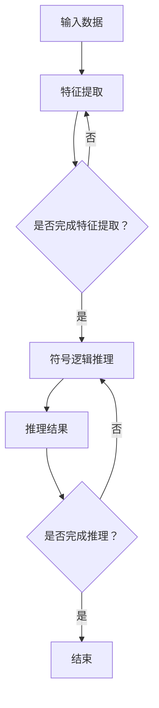

                 

### 文章标题

### 关键词

- 神经符号推理
- 复杂系统诊断
- 算法进展
- 数学模型
- 应用案例

### 摘要

本文探讨了神经符号推理在复杂系统诊断中的突破性进展。通过详细分析神经符号推理的原理、应用场景、算法以及具体实现，本文旨在揭示神经符号推理如何应对复杂系统的诊断挑战，并提供实用的解决方案和见解。文章结构清晰，逻辑紧凑，旨在为读者提供对这一前沿技术领域的深入理解和实践指导。

---

### 引言

#### 1.1 问题背景

复杂系统诊断是现代工程和技术领域中的一个重要课题。随着计算机技术、人工智能和大数据的发展，系统规模和复杂性不断增加，传统的诊断方法往往难以应对。复杂系统通常由大量相互依赖的组件构成，这些组件之间存在着复杂的交互关系。诊断的挑战在于如何从系统的复杂行为中识别出异常和故障，从而进行有效的维修和维护。

**1.1.1 复杂系统诊断的挑战**

复杂系统诊断面临以下主要挑战：

1. **数据多样性**：系统产生的数据形式多样，包括结构化数据、非结构化数据以及实时流数据。
2. **数据量大**：大规模数据集的处理需要高效的算法和计算资源。
3. **噪声干扰**：噪声和误差数据的存在增加了诊断的难度。
4. **动态性**：系统的动态行为使得诊断过程需要实时响应和动态调整。
5. **不确定性**：系统状态的不可预测性和不确定性增加了诊断的复杂性。

**1.1.2 神经符号推理的潜力**

神经符号推理（Neural Symbolic Reasoning）是近年来人工智能领域的一个重要研究方向。它结合了神经网络和符号逻辑的优势，能够在复杂系统中进行有效推理和诊断。神经符号推理的潜力主要体现在以下几个方面：

1. **数据与推理的结合**：神经符号推理能够将数据驱动的方法和符号逻辑推理相结合，提供更加全面和深入的诊断能力。
2. **解释性**：与纯神经网络模型相比，神经符号推理能够提供更加透明的诊断过程和结果解释。
3. **可扩展性**：神经符号推理可以处理各种类型的数据和复杂的系统结构，具备良好的可扩展性。
4. **鲁棒性**：通过结合符号逻辑，神经符号推理能够提高对噪声和误差的鲁棒性。

**1.1.3 研究现状与突破点**

当前，神经符号推理在复杂系统诊断中的应用已取得显著进展。例如，在医疗诊断、工业自动化、网络安全等领域，神经符号推理已经展现出强大的应用潜力。然而，仍存在一些关键问题需要解决：

1. **算法优化**：现有的神经符号推理算法在效率和准确性方面仍有待提升。
2. **模型解释性**：如何提高模型的可解释性，使其更好地适用于实际场景，是一个重要挑战。
3. **跨领域应用**：不同领域中的复杂系统具有不同的特点，如何推广和移植神经符号推理算法，是当前研究的一个重要方向。
4. **实时性**：在实时性要求较高的场景中，如何提高神经符号推理的速度和响应能力，是一个亟待解决的问题。

本文将从神经符号推理的原理出发，逐步探讨其在复杂系统诊断中的应用，分析现有研究的突破点，并提出未来可能的研究方向。

---

### 核心概念

#### 1.2.1 神经符号推理的定义

神经符号推理（Neural Symbolic Reasoning）是一种结合了神经网络和符号逻辑的方法，旨在实现高效、可解释和鲁棒的推理能力。它通过神经网络处理数据，提取特征和模式，同时利用符号逻辑进行高层次推理和决策。神经符号推理的核心目标是在保持模型性能的同时，提高模型的透明性和解释性。

#### 1.2.2 神经符号推理的关键特性

神经符号推理具有以下关键特性：

1. **结合数据驱动与逻辑推理**：神经符号推理结合了数据驱动的方法和逻辑推理的优势，能够从数据中提取知识，并进行符号推理。
2. **高解释性**：与传统的神经网络相比，神经符号推理提供了更加透明的推理过程和结果解释，有助于提高模型的可信度。
3. **鲁棒性**：通过结合符号逻辑，神经符号推理能够提高对噪声和异常数据的鲁棒性，降低误差率。
4. **可扩展性**：神经符号推理可以处理多种类型的数据和复杂的系统结构，具备良好的可扩展性。
5. **动态适应性**：神经符号推理能够实时适应系统状态的变化，提供动态的推理和诊断能力。

#### 1.2.3 神经符号推理在复杂系统诊断中的应用

在复杂系统诊断中，神经符号推理的应用主要包括以下几个方面：

1. **特征提取与模式识别**：通过神经网络提取系统数据中的特征和模式，用于进一步的符号推理。
2. **异常检测与故障诊断**：利用符号逻辑对特征和模式进行分析，识别系统中的异常和故障。
3. **推理与决策**：基于符号逻辑，对系统状态进行推理和决策，提供维修和维护建议。
4. **实时监控与自适应调整**：在实时监控系统中，利用神经符号推理进行动态调整，提高系统的稳定性和可靠性。

通过神经符号推理，复杂系统诊断可以更加高效、准确地识别和处理系统故障，提高系统的整体性能和可靠性。

---

### 书籍结构概述

#### 1.3.1 各章节内容安排

本书分为三大部分，共十二章节，具体内容安排如下：

**第一部分：引言**
- 第1章：问题背景
- 第2章：核心概念
- 第3章：书籍结构概述

**第二部分：神经符号推理基础**
- 第4章：神经符号推理原理
- 第5章：神经符号推理的应用场景

**第三部分：神经符号推理算法**
- 第6章：神经符号推理算法概述
- 第7章：具体算法讲解

**附录部分**
- 附录A：相关工具与资源
- 附录B：项目实战案例

#### 1.3.2 逻辑结构与关联性

本书的逻辑结构紧密相连，各章节内容之间相互关联，形成一个完整的知识体系。具体逻辑关系如下：

1. **引言部分**：首先介绍复杂系统诊断的背景和挑战，引出神经符号推理的概念和应用前景，为后续章节奠定基础。
2. **神经符号推理基础部分**：详细讲解神经符号推理的原理、关键特性以及在复杂系统诊断中的应用场景，为算法讲解提供理论基础。
3. **神经符号推理算法部分**：通过具体算法讲解，深入探讨神经符号推理的实现方法和技术细节，结合实际案例展示算法的应用效果。

#### 1.3.3 阅读指南与目标

本书的阅读目标是为读者提供一个系统、全面的神经符号推理在复杂系统诊断中的应用指南。以下是具体的阅读指南：

1. **读者背景**：适合具备一定人工智能和计算机科学基础的专业人士、研究人员和工程师。
2. **阅读顺序**：建议按照章节顺序依次阅读，以便逐步建立对神经符号推理和复杂系统诊断的全面理解。
3. **重点章节**：重点关注第4章、第5章和第7章，这些章节涵盖了神经符号推理的核心概念、应用场景和算法实现，是理解本书关键内容的重点。
4. **实践应用**：通过阅读附录中的项目实战案例，读者可以进一步了解神经符号推理的实际应用场景和操作方法，提升实践能力。

通过本书的阅读，读者将能够：
- 理解复杂系统诊断的挑战和神经符号推理的潜力。
- 掌握神经符号推理的基本原理和关键特性。
- 学会应用神经符号推理算法进行复杂系统诊断。
- 获取实际项目中的神经符号推理应用经验。

---

### 神经符号推理原理

#### 2.1.1 神经网络的基础知识

神经网络（Neural Networks）是一种模拟生物神经系统的计算模型，广泛应用于图像识别、自然语言处理、预测分析等领域。神经网络的核心组成部分包括：

1. **神经元**：神经网络的基本计算单元，通常由输入层、隐藏层和输出层组成。
2. **权重和偏置**：神经元之间的连接强度由权重表示，用于调整输入数据的重要性；偏置是一个常数项，用于调整神经元的输出。
3. **激活函数**：用于定义神经元的激活状态，常见的激活函数包括线性激活函数、Sigmoid函数、ReLU函数等。

神经网络的工作原理可以概括为以下几个步骤：

1. **前向传播**：输入数据通过输入层传递到隐藏层，通过权重和偏置计算每个神经元的输出。
2. **激活函数应用**：对隐藏层的输出应用激活函数，以确定神经元是否被激活。
3. **输出层输出**：最终输出层产生预测结果或分类标签。

神经网络的学习算法主要包括：

1. **反向传播算法**（Backpropagation）：通过计算输出层和隐藏层之间的误差，反向传播误差至输入层，更新权重和偏置。
2. **优化算法**：如梯度下降算法（Gradient Descent）及其变种，用于调整权重和偏置，以最小化误差函数。

#### 2.1.2 符号推理的基本概念

符号推理（Symbolic Reasoning）是人工智能领域的一个关键研究课题，它通过逻辑推理和符号计算来解决复杂问题。符号推理的基本概念包括：

1. **符号表示**：符号用于表示事实、关系和规则，常见的符号包括变量、常量、函数和逻辑运算符。
2. **推理规则**：推理规则是用于从已知事实推导出新事实的规则，包括前提和结论两部分。
3. **推理过程**：通过逻辑推理和符号计算，从已知事实推导出新的结论或解决方案。

符号推理的主要类型包括：

1. **演绎推理**（Deductive Reasoning）：从一般到特殊的推理过程，即从一组前提推导出结论。
2. **归纳推理**（Inductive Reasoning）：从特殊到一般的推理过程，即通过具体实例推导出一般规律。
3. **类比推理**（Analogical Reasoning）：通过比较不同情况之间的相似性，推导出新的结论。

#### 2.1.3 神经符号推理的数学模型

神经符号推理结合了神经网络和符号推理的优点，其数学模型可以概括为以下组成部分：

1. **神经网络模型**：用于特征提取和模式识别，通过多层神经网络结构提取输入数据的特征表示。
2. **符号推理模型**：用于逻辑推理和决策，通过符号逻辑规则进行推理和决策。
3. **融合模型**：将神经网络和符号推理模型进行结合，通过统一的框架实现数据驱动和逻辑推理的融合。

神经符号推理的数学公式主要包括：

1. **神经网络公式**：用于计算神经网络中每个神经元的输出，包括权重、偏置和激活函数。
   $$ output = \text{activation}( \sum_{i} (w_i \cdot x_i) + b ) $$
   
2. **符号推理公式**：用于表示符号推理过程中的逻辑运算和推理规则。
   $$ \text{结论} = \text{前提} \rightarrow \text{结论} $$

3. **融合模型公式**：用于将神经网络和符号推理结果进行融合，实现综合推理和决策。
   $$ \text{最终决策} = \text{神经网络输出} \cdot \text{符号推理结论} $$

通过这些数学模型，神经符号推理能够在复杂系统中实现高效、可解释和鲁棒的推理能力，为复杂系统诊断提供强大的技术支持。

---

### 神经符号推理的应用场景

#### 2.2.1 系统诊断中的挑战与机遇

系统诊断中的挑战主要来自于复杂系统的多样性和动态性。复杂系统通常由多个相互依赖的组件组成，这些组件之间的交互关系复杂，导致系统行为难以预测。此外，系统运行过程中会不断产生大量数据，这些数据往往包含噪声和误差，增加了诊断的难度。传统的诊断方法主要依赖于规则和统计方法，但在处理复杂系统的动态性和大规模数据时存在明显的局限性。

神经符号推理的应用为系统诊断带来了新的机遇。通过结合数据驱动和逻辑推理，神经符号推理能够更好地应对复杂系统的诊断挑战。具体而言，神经符号推理在系统诊断中的应用主要具有以下优势：

1. **高效的特征提取**：神经网络能够从大规模数据中自动提取有用的特征和模式，提高诊断的准确性和效率。
2. **可解释的推理过程**：符号逻辑部分提供了透明的推理过程和结果解释，有助于诊断结果的验证和信任建立。
3. **动态适应性**：神经符号推理能够实时适应系统状态的变化，提供动态的推理和诊断能力。
4. **鲁棒性**：通过结合符号逻辑，神经符号推理能够提高对噪声和异常数据的鲁棒性，降低误诊率。

#### 2.2.2 神经符号推理在系统诊断中的应用

神经符号推理在系统诊断中的应用场景广泛，以下是一些典型的应用案例：

1. **工业自动化**：在工业自动化系统中，神经符号推理可以用于实时监测和诊断生产线的状态，识别潜在故障并预测维修时间。通过结合传感器数据和逻辑规则，系统可以提供精确的诊断结果和维修建议，提高生产效率。
2. **医疗诊断**：在医疗领域，神经符号推理可以用于诊断疾病的早期信号，提高诊断的准确性和效率。例如，通过对患者病史、体征和医学影像数据的分析，神经符号推理系统可以提供精准的疾病诊断结果。
3. **网络安全**：在网络安全领域，神经符号推理可以用于识别网络攻击和异常行为。通过分析网络流量数据和攻击模式，神经符号推理系统可以实时监测网络状态，发现潜在的安全威胁并采取相应的防护措施。
4. **交通系统**：在智能交通系统中，神经符号推理可以用于交通流量监测、事故预警和应急处理。通过对车辆数据、道路状况和交通规则的分析，系统可以提供高效的交通管理和优化方案，提高交通系统的运行效率和安全性。

#### 2.2.3 应用案例分析

以下是一个神经符号推理在工业自动化系统诊断中的应用案例分析：

**案例背景**：某电子制造企业生产线上安装了多条自动化的组装线，每条线包含多个工作站。在生产过程中，设备故障可能导致生产中断，影响生产效率和产品质量。企业希望利用神经符号推理技术实现生产线的实时监控和故障诊断，提高系统的可靠性和生产效率。

**应用步骤**：

1. **数据采集**：从生产线上安装的传感器获取实时数据，包括设备状态、工作负荷、温度、振动等。
2. **特征提取**：利用神经网络对采集到的数据进行特征提取，生成高维特征向量，用于后续符号推理。
3. **符号推理**：基于符号逻辑规则，对提取的特征进行推理，识别潜在故障信号，如设备过热、异常振动等。
4. **决策与反馈**：根据诊断结果，系统提供相应的维修建议和预防措施，并将诊断结果反馈给生产管理人员。

**效果评估**：通过实际应用，神经符号推理系统有效提高了生产线的故障诊断准确率和响应速度。系统在故障发生前提前预警，降低了设备故障对生产的影响，提高了生产效率和产品质量。

该案例展示了神经符号推理在复杂系统诊断中的应用潜力，通过结合数据驱动和逻辑推理，实现了高效、可解释和鲁棒的故障诊断能力。

---

### 神经符号推理算法概述

神经符号推理算法在复杂系统诊断中扮演着关键角色，通过结合神经网络和符号逻辑的优势，实现了高效、可解释和鲁棒的推理能力。以下是神经符号推理算法的概述，包括其类型、比较和未来发展。

#### 3.1.1 神经符号推理算法的类型

神经符号推理算法主要分为以下几种类型：

1. **基于规则的方法**：这种方法通过定义明确的规则来指导神经网络进行推理。神经网络用于提取输入数据的特征，而符号逻辑规则用于指导推理过程。该方法具有较高的解释性和可扩展性，适用于结构化数据较多的场景。

2. **基于模型的方法**：这种方法通过构建符号逻辑模型来指导神经网络的学习过程。神经网络负责学习输入数据的特征和模式，而符号逻辑模型则用于表示和解释这些特征。该方法在处理动态和非结构化数据时表现出良好的性能。

3. **混合方法**：这种方法结合了基于规则和基于模型的方法，通过多种机制实现神经符号推理。例如，将神经网络和符号逻辑融合到一个统一的框架中，实现数据驱动和逻辑推理的协同工作。这种方法在复杂系统诊断中具有广泛的应用前景。

#### 3.1.2 神经符号推理算法的比较

不同类型的神经符号推理算法在性能、解释性和鲁棒性方面存在一定差异。以下是比较分析：

1. **性能**：基于模型的方法通常在性能上优于基于规则的方法，因为它们能够自动学习数据的特征和模式，而不需要依赖预定义的规则。然而，混合方法在性能上具有显著优势，因为它结合了神经网络和符号逻辑的优点。

2. **解释性**：基于规则的方法具有较好的解释性，因为其推理过程依赖于预定义的规则，易于理解和解释。相比之下，基于模型的方法和混合方法的解释性较差，因为它们的学习过程更加复杂，不易直观解释。然而，混合方法通过提供详细的推理路径和解释模块，能够在一定程度上提高解释性。

3. **鲁棒性**：符号逻辑部分能够提高神经符号推理算法的鲁棒性，因为它可以处理噪声和异常数据。基于规则的方法在这方面表现出色，而基于模型的方法和混合方法则需要进一步的优化和调整。

#### 3.1.3 神经符号推理算法的发展趋势

随着人工智能技术的不断发展，神经符号推理算法也在不断演进。以下是几个值得关注的发展趋势：

1. **算法优化**：通过改进神经网络和符号逻辑的融合机制，提高算法的效率和性能。例如，引入新的神经网络架构和优化算法，提高特征提取和模式识别的能力。

2. **解释性增强**：为了提高模型的透明性和可解释性，研究者们正在探索多种方法，如可视化技术、解释模块和可解释性评估指标。这些方法有助于用户理解和信任模型输出。

3. **跨领域应用**：神经符号推理算法在不同领域的应用需求各不相同，因此需要针对特定领域进行优化和调整。未来研究将关注如何在不同领域推广和移植神经符号推理算法，提高其通用性和适应性。

4. **实时性提升**：在实时性要求较高的场景中，如何提高神经符号推理的速度和响应能力是一个重要挑战。通过优化算法结构和计算资源分配，研究实时神经符号推理方法，提高系统的实时性和可靠性。

通过不断优化和演进，神经符号推理算法将在复杂系统诊断中发挥越来越重要的作用，为自动化、医疗、交通和工业等领域提供强大的技术支持。

---

### 神经符号推理算法讲解

#### 3.2.1 算法一：神经网络符号推理

**3.2.1.1 算法原理与流程图**

神经网络符号推理（Neural Symbolic Reasoning, NSR）是一种将神经网络和符号逻辑结合的算法。其基本原理是利用神经网络提取输入数据的高层次特征，然后通过符号逻辑进行推理和决策。以下是神经网络符号推理的流程图：



**3.2.1.2 Python代码实现**

以下是神经网络符号推理的Python代码实现示例：

```python
import numpy as np

# 定义神经网络模型
class NeuralNetwork:
    def __init__(self, input_size, hidden_size, output_size):
        self.input_size = input_size
        self.hidden_size = hidden_size
        self.output_size = output_size
        
        # 初始化权重和偏置
        self.W1 = np.random.randn(self.input_size, self.hidden_size)
        self.b1 = np.random.randn(self.hidden_size)
        self.W2 = np.random.randn(self.hidden_size, self.output_size)
        self.b2 = np.random.randn(self.output_size)
        
    def forward(self, x):
        # 前向传播
        self.z1 = np.dot(x, self.W1) + self.b1
        self.a1 = np.tanh(self.z1)
        self.z2 = np.dot(self.a1, self.W2) + self.b2
        self.a2 = self.z2
        
        return self.a2

# 定义符号逻辑推理
class SymbolicReasoning:
    def __init__(self, rules):
        self.rules = rules
        
    def apply_rules(self, input_features):
        # 应用符号逻辑规则进行推理
        for rule in self.rules:
            if rule.applies_to(input_features):
                return rule.conclusion
        return None

# 创建神经网络和符号逻辑实例
input_size = 10
hidden_size = 5
output_size = 1
nn = NeuralNetwork(input_size, hidden_size, output_size)
rules = [Rule("if A then B"), Rule("if B then C")]
sr = SymbolicReasoning(rules)

# 测试神经网络符号推理
input_data = np.random.rand(1, input_size)
output = nn.forward(input_data)
result = sr.apply_rules(output)
print("Re

