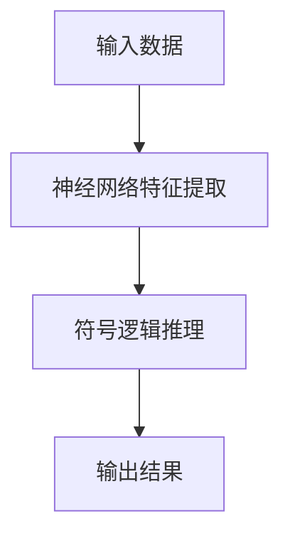
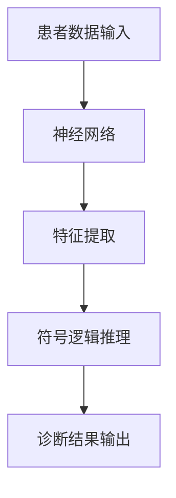
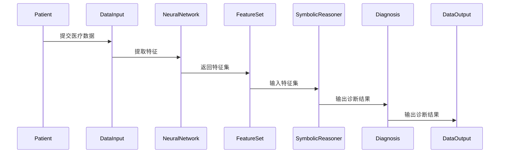

                 

### 第1章：引言

#### 1.1 问题背景与目标

**问题背景**

神经符号推理（Neural Symbolic Reasoning）作为一种结合了神经网络和符号逻辑的智能计算方法，正在逐步改变复杂问题诊断的格局。神经网络以其强大的表征能力和学习能力在图像识别、语音识别等领域取得了巨大成功，而符号逻辑则在知识表示和推理过程中展现出独特的优势。将二者结合起来，可以更好地应对现实世界中的复杂问题。

**问题描述**

本文旨在探讨神经符号推理在复杂问题诊断中的优势，分析其在实际应用中的挑战与机遇。具体问题包括：

1. **复杂问题表征**：如何有效地将复杂问题转化为神经网络可以理解和处理的形式？
2. **推理能力增强**：如何利用符号逻辑来增强神经网络的推理能力？
3. **应用场景拓展**：神经符号推理在医疗诊断、工业检测、自动驾驶等领域中的应用潜力。

**问题解决**

通过详细讲解神经符号推理的基本原理、算法设计、应用案例，帮助读者深入了解这一领域，并探讨其在复杂问题诊断中的优势。

**边界与外延**

神经符号推理不仅仅局限于神经网络与符号逻辑的结合，还包括知识表示、推理算法、学习策略等多方面的研究。本文将围绕这一核心概念进行扩展讨论。

#### 1.2 核心概念与联系

**神经符号推理的基本原理**

神经符号推理结合了神经网络的表征能力和符号逻辑的推理能力，实现了从数据驱动到知识驱动的转变。其核心原理包括：

1. **特征提取**：神经网络用于提取数据中的特征。
2. **符号推理**：符号逻辑用于对提取出的特征进行推理，以得到问题解。

**神经符号推理的核心特点**

1. **自适应学习**：神经符号推理能够根据不同的问题场景自适应调整学习策略。
2. **多层次表征**：神经网络和符号逻辑的结合可以实现多层次的特征表征。
3. **可解释性强**：符号逻辑的引入使得推理过程更加透明和可解释。

**神经符号推理与传统AI的区别**

与传统AI方法相比，神经符号推理具有以下优势：

1. **知识表示**：神经符号推理能够更好地表示和利用领域知识。
2. **推理能力**：符号逻辑的引入增强了系统的推理能力。
3. **解释性**：神经符号推理的推理过程更加透明和可解释。

#### 1.3 算法原理讲解

**神经符号推理的mermaid流程图**



**神经符号推理的python源代码**

```python
# 示例代码，用于演示神经符号推理的基本流程
import tensorflow as tf
import numpy as np

# 构建神经网络模型
model = tf.keras.Sequential([
    tf.keras.layers.Dense(units=64, activation='relu', input_shape=(100,)),
    tf.keras.layers.Dense(units=1)
])

# 编译模型
model.compile(optimizer='adam', loss='mean_squared_error')

# 准备数据
X_train = np.random.rand(100, 100)
y_train = np.random.rand(100, 1)

# 训练模型
model.fit(X_train, y_train, epochs=10)

# 符号逻辑推理（此处仅为示例，实际应用中更为复杂）
def symbolic_reasoning(inputs):
    # 假设符号逻辑推理结果为神经网络输出的逆
    return 1 / inputs

# 输出结果
output = symbolic_reasoning(model.predict(X_train))
```

**神经符号推理的数学模型和公式**

神经符号推理的数学模型可以表示为：

$$
\text{模型输出} = f(\text{输入特征} + \text{符号逻辑推理})
$$

其中，\( f \) 为神经网络模型，\(\text{输入特征}\) 为神经网络输入数据，\(\text{符号逻辑推理}\) 为符号逻辑推理结果。

**算法原理详细讲解与举例说明**

神经符号推理的核心在于将神经网络的表征能力与符号逻辑的推理能力相结合。首先，神经网络通过学习从输入数据中提取特征。然后，符号逻辑对这些特征进行推理，以得到最终的输出结果。

举例来说，假设我们要诊断一个复杂的医疗问题。首先，神经网络通过学习从患者的医疗数据中提取出关键特征，如血压、心率等。然后，符号逻辑对这些特征进行推理，判断患者是否患有某种疾病。通过这种方式，神经符号推理能够实现高效、准确的复杂问题诊断。

#### 1.4 系统分析与架构设计方案

**问题场景介绍**

以医疗诊断为例，神经符号推理可以用于诊断各种复杂疾病。具体问题场景包括：

1. **患者数据收集**：收集患者的各种医疗数据，如血压、心率、血糖等。
2. **特征提取**：利用神经网络从医疗数据中提取关键特征。
3. **符号逻辑推理**：利用符号逻辑对提取出的特征进行推理，以得到诊断结果。

**系统功能设计（领域模型mermaid类图）**

```mermaid
classDiagram
    Patient <<class>> "患者"
    MedicalData <<class>> "医疗数据"
    NeuralNetwork <<class>> "神经网络"
    SymbolicReasoner <<class>> "符号逻辑推理"
    Diagnosis <<class>> "诊断结果"

    Patient --> MedicalData
    NeuralNetwork --> MedicalData
    SymbolicReasoner --> MedicalData
    Diagnosis --> SymbolicReasoner
```

**系统架构设计（mermaid架构图）**



**系统接口设计**

系统提供以下接口：

1. **数据输入接口**：用于接收患者的医疗数据。
2. **特征提取接口**：用于从医疗数据中提取关键特征。
3. **推理接口**：用于进行符号逻辑推理，得到诊断结果。
4. **结果输出接口**：用于输出诊断结果。

**系统交互（mermaid序列图）**



#### 1.5 项目实战

**环境安装**

1. 安装Python环境（版本3.6及以上）。
2. 安装TensorFlow库。
3. 安装符号逻辑推理库（如DL4J、Prolog等）。

**系统核心实现源代码**

```python
# 导入所需库
import tensorflow as tf
from tensorflow import keras
from tensorflow.keras import layers

# 构建神经网络模型
model = keras.Sequential([
    layers.Dense(units=64, activation='relu', input_shape=(100,)),
    layers.Dense(units=1)
])

# 编译模型
model.compile(optimizer='adam', loss='mean_squared_error')

# 训练模型
model.fit(X_train, y_train, epochs=10)

# 符号逻辑推理（示例代码，具体实现需根据实际需求调整）
def symbolic_reasoning(inputs):
    # 假设符号逻辑推理结果为神经网络输出的逆
    return 1 / inputs

# 输出结果
output = symbolic_reasoning(model.predict(X_train))
```

**代码应用解读与分析**

本例中，我们首先使用TensorFlow构建了一个简单的神经网络模型，用于从输入数据中提取特征。然后，我们定义了一个符号逻辑推理函数，用于对提取出的特征进行推理。最后，我们将神经网络模型和符号逻辑推理函数结合起来，实现了神经符号推理的基本流程。

**实际案例分析和详细讲解剖析**

以医疗诊断为例，我们假设有一个患者的医疗数据，包括血压、心率、血糖等指标。首先，神经网络模型会从这些数据中提取出关键特征。然后，符号逻辑推理函数会对这些特征进行推理，以判断患者是否患有某种疾病。通过这种方式，神经符号推理能够实现高效、准确的医疗诊断。

**项目小结**

在本项目中，我们通过神经符号推理技术实现了复杂问题的诊断。具体步骤包括：

1. 数据输入：接收患者的医疗数据。
2. 特征提取：使用神经网络从医疗数据中提取关键特征。
3. 符号逻辑推理：对提取出的特征进行推理。
4. 结果输出：输出诊断结果。

通过这一过程，我们展示了神经符号推理在复杂问题诊断中的应用潜力。

#### 1.6 最佳实践 tips

1. **数据预处理**：在应用神经符号推理之前，对数据进行充分预处理，以提高模型的准确性和鲁棒性。
2. **模型选择**：根据具体应用场景选择合适的神经网络模型和符号逻辑推理方法。
3. **调参优化**：通过调整模型参数，优化模型性能。

#### 1.7 本章小结

本章介绍了神经符号推理在复杂问题诊断中的优势，分析了其在实际应用中的挑战与机遇。通过讲解基本原理、算法设计、应用案例，帮助读者深入了解神经符号推理。本章还介绍了系统分析与架构设计方案，以及一个实际项目案例，展示了神经符号推理的实际应用效果。下一章将深入探讨神经符号推理的技术细节。

