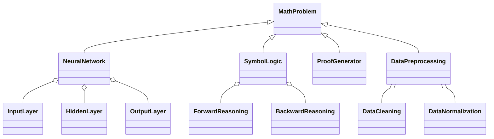

                 


### 引言

**1. 引言**

在当今信息技术飞速发展的时代，自动化数学证明作为一个极具挑战性的研究领域，逐渐引起了学术界和工业界的广泛关注。传统数学证明依赖于人类的逻辑思维和推理能力，这种模式不仅效率低下，而且在处理复杂问题时容易出错。随着人工智能技术的不断进步，特别是深度学习和神经网络的崛起，研究者们开始探索将神经网络应用于数学证明的可能性，从而实现自动化数学证明。

**1.1 问题背景**

自动化数学证明的重要性不言而喻。首先，它有助于解决复杂和繁琐的数学问题，提高数学研究的效率。其次，自动化数学证明可以验证数学理论的真实性和一致性，确保科学研究的准确性。此外，自动化数学证明在工程、计算机科学、物理学等领域也有广泛的应用前景。例如，在自动驾驶、金融风险评估、网络安全等方面，自动化数学证明可以帮助我们更准确地预测和解决问题。

神经符号推理（Neural Symbolic Reasoning）是一种结合了神经网络和符号逻辑的方法，它在自动化数学证明中展现出巨大的潜力。神经符号推理通过将神经网络与符号系统相结合，不仅能够学习复杂的数学关系，还能够进行逻辑推理和符号计算。这种方法在处理复杂问题时具有独特的优势，能够为自动化数学证明提供新的思路和工具。

**1.2 问题描述**

传统数学证明存在一些明显的局限。首先，它依赖于人类的逻辑思维和推理能力，这使得证明过程复杂且易出错。其次，传统数学证明往往缺乏系统性和自动化，无法有效地处理大规模和复杂的问题。此外，传统数学证明在处理抽象和复杂的数学概念时，往往需要大量的时间和精力。

神经符号推理在自动化数学证明中具有显著的优势。首先，神经符号推理能够通过神经网络学习数学概念和关系，从而实现自动化证明。其次，神经符号推理结合了神经网络和符号逻辑的特点，能够在处理复杂问题时进行高效的逻辑推理和符号计算。最后，神经符号推理具有自适应性，可以根据不同的数学问题和需求进行灵活调整。

神经符号推理在自动化数学证明中的适用范围非常广泛。它不仅可以应用于传统的数学问题，如数论、代数、几何等，还可以应用于更复杂的数学问题，如代数几何、数论分析等。此外，神经符号推理在计算机科学、物理学、经济学等领域也有广泛的应用前景。例如，在计算机算法优化、物理模型验证、经济预测等方面，神经符号推理都可以发挥重要作用。

**1.3 问题解决**

神经符号推理的基本原理包括两个核心部分：神经网络的训练和符号逻辑的推理。首先，通过神经网络训练，神经符号推理系统可以学习到大量的数学概念和关系。然后，通过符号逻辑的推理，系统可以自动生成数学证明。

神经符号推理在数学证明中的应用流程通常包括以下步骤：

1. **问题定义**：首先，将数学问题转化为符号表示，以便于神经符号推理系统处理。

2. **神经网络训练**：使用大量的数学问题和证明作为训练数据，训练神经网络，使其能够识别和理解数学概念和关系。

3. **符号逻辑推理**：在训练好的神经网络的基础上，使用符号逻辑进行推理，生成数学证明。

4. **证明验证**：对生成的证明进行验证，确保证明的正确性和有效性。

**1.4 边界与外延**

尽管神经符号推理在自动化数学证明中展现出巨大的潜力，但仍面临一些技术挑战。首先，神经网络训练过程需要大量的数据和计算资源，这使得训练过程非常耗时和昂贵。其次，神经网络在处理抽象和复杂的数学概念时，往往难以保证推理的准确性和一致性。此外，神经符号推理系统在处理大规模和复杂问题时，容易陷入过拟合现象。

神经符号推理的应用边界主要包括以下几个方面：

1. **数学问题类型**：神经符号推理适用于大多数数学问题，尤其是那些具有明确符号表示和逻辑关系的问题。

2. **计算资源**：神经符号推理系统对计算资源的需求较高，因此需要足够的硬件支持。

3. **证明验证**：生成的数学证明需要经过严格的验证，以确保其正确性和有效性。

未来的发展方向包括：

1. **算法优化**：通过优化神经网络训练和推理算法，提高神经符号推理的效率。

2. **跨学科融合**：将神经符号推理与其他领域（如符号计算、深度学习、自然语言处理等）相结合，实现更广泛的数学问题求解。

3. **应用拓展**：将神经符号推理应用于更多的实际场景，如科学计算、工程优化、金融分析等。

通过不断的技术创新和应用拓展，神经符号推理有望在自动化数学证明领域取得重大突破，为数学研究和应用提供强大的工具支持。

### 核心概念与联系

**2. 核心概念与联系**

神经符号推理作为一种结合神经网络和符号逻辑的方法，其核心概念和原理在自动化数学证明中发挥着关键作用。为了深入理解神经符号推理在数学证明中的应用，我们需要首先明确几个核心概念，并探讨它们之间的联系。

**2.1 神经符号推理的核心概念**

**2.1.1 神经符号推理的定义**

神经符号推理（Neural Symbolic Reasoning）是一种结合神经网络和符号逻辑的方法，旨在通过神经网络学习符号表示和逻辑关系，实现符号级别的推理和计算。具体来说，神经符号推理系统通过神经网络学习大量的数学概念和关系，并将其转化为符号逻辑表达式，从而实现自动化推理和证明。

**2.1.2 神经符号推理的基本原理**

神经符号推理的基本原理包括两个核心部分：神经网络的训练和符号逻辑的推理。

- **神经网络训练**：神经网络训练是神经符号推理的基础。通过大量的数学问题和证明作为训练数据，神经网络可以学习到数学概念和关系的表示。训练过程中，神经网络通过不断调整权重和偏置，使其能够正确识别和理解数学概念。

- **符号逻辑推理**：在训练好的神经网络的基础上，神经符号推理系统使用符号逻辑进行推理。符号逻辑推理包括前向推理和反向推理。前向推理从已知事实出发，推导出新的结论；反向推理从目标结论出发，逆向推导出所需的前提条件。

**2.1.3 神经符号推理的关键技术**

神经符号推理的关键技术包括以下几个方面：

- **表示学习**：通过神经网络学习数学概念和关系的表示。表示学习的目标是找到一种有效的表示方法，使神经网络能够准确识别和理解数学概念。

- **推理算法**：符号逻辑推理算法是实现神经符号推理的核心。推理算法包括前向推理和反向推理，以及基于图灵完备的推理方法。

- **验证与解释**：生成的数学证明需要经过验证，以确保其正确性和有效性。同时，验证和解释技术可以帮助我们理解证明过程和推理结果。

**2.2 神经符号推理与数学证明的联系**

**2.2.1 神经符号推理在数学证明中的具体应用**

神经符号推理在数学证明中的应用主要体现在以下几个方面：

- **概念识别**：通过神经网络学习数学概念和关系的表示，神经符号推理系统可以识别和理解数学问题中的关键概念。

- **推理过程**：神经符号推理系统通过符号逻辑推理，生成数学证明。这一过程不仅包括前向推理和反向推理，还可以结合基于图灵完备的推理方法，实现复杂数学问题的求解。

- **证明验证**：生成的数学证明需要经过验证，以确保其正确性和有效性。验证过程包括对推理过程和推理结果的检查，以及证明的自动化验证。

**2.2.2 神经符号推理与数学证明的互补关系**

神经符号推理与数学证明之间存在互补关系。传统数学证明依赖于人类的逻辑思维和推理能力，而神经符号推理则通过神经网络学习数学概念和关系，实现自动化推理和证明。具体来说：

- **神经符号推理**：通过神经网络学习数学概念和关系，实现自动化推理和证明。神经符号推理的优势在于能够处理复杂的数学问题，提高证明的效率。

- **数学证明**：数学证明依赖于人类的逻辑思维和推理能力，具有系统性和严谨性。数学证明的优势在于能够确保证明的正确性和有效性。

**2.2.3 神经符号推理在数学证明中的局限性**

尽管神经符号推理在自动化数学证明中具有显著优势，但仍存在一些局限性：

- **训练数据依赖**：神经符号推理系统的性能高度依赖于训练数据的质量和数量。训练数据不足或质量不佳，可能导致神经网络无法准确学习数学概念和关系。

- **推理准确性**：神经网络在处理抽象和复杂的数学概念时，可能难以保证推理的准确性和一致性。特别是在面对大规模和复杂问题时，神经网络容易陷入过拟合现象。

- **验证与解释**：生成的数学证明需要经过验证，以确保其正确性和有效性。然而，验证和解释过程复杂，需要耗费大量时间和计算资源。

**2.3 神经符号推理与其他相关领域的联系**

**2.3.1 神经符号推理与深度学习的联系**

神经符号推理与深度学习密切相关。深度学习是一种通过多层神经网络进行特征学习和模式识别的方法。神经符号推理则将深度学习应用于符号逻辑推理和数学证明。具体来说：

- **特征表示**：深度学习通过多层神经网络学习数据的特征表示。神经符号推理则通过神经网络学习数学概念和关系的特征表示，从而实现自动化推理和证明。

- **推理算法**：深度学习中的推理算法（如卷积神经网络、循环神经网络等）可以应用于神经符号推理。这些算法可以帮助神经网络更好地理解和处理数学概念和关系。

**2.3.2 神经符号推理与符号计算的交叉融合**

神经符号推理与符号计算有着密切的联系。符号计算是一种通过符号表示和逻辑推理进行计算的方法。神经符号推理通过结合神经网络和符号计算，实现更高效的数学问题求解。具体来说：

- **符号表示**：符号计算使用符号表示数学概念和关系。神经符号推理则通过神经网络学习符号表示，从而实现自动化推理和证明。

- **计算方法**：神经符号推理结合了神经网络和符号计算的方法。神经网络负责学习数学概念和关系的特征表示，符号计算则负责进行逻辑推理和符号计算。

**2.3.3 神经符号推理与其他自动化证明技术的比较**

神经符号推理与其他自动化证明技术（如自动推理系统、定理证明器等）进行比较，可以发现以下区别：

- **技术原理**：神经符号推理结合了神经网络和符号逻辑的特点，而其他自动化证明技术则主要基于符号逻辑和定理证明方法。

- **适用范围**：神经符号推理适用于大多数数学问题，特别是那些具有明确符号表示和逻辑关系的问题。其他自动化证明技术则主要适用于特定类型的数学问题。

- **性能表现**：神经符号推理在处理复杂问题时，具有较高的效率和灵活性。其他自动化证明技术则可能在处理复杂问题时效率较低，且难以保证推理的准确性和一致性。

通过深入探讨神经符号推理的核心概念和原理，以及它在自动化数学证明中的应用、与数学证明的互补关系、与其他相关领域的联系，我们可以更好地理解神经符号推理在数学证明中的重要作用。这为进一步研究和应用神经符号推理提供了有益的启示。

### 神经符号推理的算法原理讲解

**3. 神经符号推理的算法原理讲解**

神经符号推理作为一种结合神经网络和符号逻辑的方法，其算法原理在自动化数学证明中起着至关重要的作用。为了更好地理解这一方法，我们需要详细讲解其基本算法原理，并借助数学模型和公式进行阐述。

**3.1 神经符号推理的基本算法**

神经符号推理的基本算法可以分为以下几个步骤：

1. **问题表示**：首先，将数学问题转化为符号表示。这一步骤的关键是将数学问题中的概念、关系和操作符号化，以便于神经网络进行处理。

2. **神经网络训练**：使用大量的数学问题和证明作为训练数据，训练神经网络。训练过程中，神经网络通过学习符号表示，逐步理解数学概念和关系。

3. **符号逻辑推理**：在训练好的神经网络的基础上，使用符号逻辑进行推理。推理过程包括前向推理和反向推理，以及基于图灵完备的推理方法。

4. **证明生成**：根据推理结果生成数学证明。这一步骤需要将推理过程和推理结果转化为符号表达式，形成完整的数学证明。

5. **证明验证**：对生成的数学证明进行验证，确保其正确性和有效性。验证过程通常包括对证明步骤和证明结果的检查。

**3.1.1 神经符号推理的流程**

神经符号推理的流程可以分为以下几个阶段：

1. **问题输入**：将数学问题输入到神经符号推理系统中。

2. **符号表示**：将数学问题转化为符号表示，以便于神经网络进行处理。

3. **神经网络训练**：使用训练数据对神经网络进行训练，使其能够理解和处理数学问题。

4. **符号逻辑推理**：在训练好的神经网络的基础上，使用符号逻辑进行推理，生成数学证明。

5. **证明生成**：根据推理结果生成数学证明。

6. **证明验证**：对生成的数学证明进行验证，确保其正确性和有效性。

**3.1.2 神经符号推理的主要算法**

神经符号推理的主要算法包括以下几种：

1. **神经网络训练算法**：常用的神经网络训练算法包括梯度下降法、随机梯度下降法、Adam优化器等。这些算法通过不断调整神经网络的权重和偏置，使其能够正确识别和理解数学概念。

2. **符号逻辑推理算法**：符号逻辑推理算法包括前向推理、反向推理和图灵完备推理方法。前向推理从已知事实出发，推导出新的结论；反向推理从目标结论出发，逆向推导出所需的前提条件；图灵完备推理方法则结合了神经网络和图灵机的特点，实现更高效的推理。

3. **证明生成算法**：证明生成算法根据推理结果生成数学证明。常用的算法包括符号转换法、归纳法、递推法等。

**3.1.3 神经符号推理的算法实现**

神经符号推理的算法实现通常分为以下几个步骤：

1. **数据预处理**：将数学问题转化为符号表示，并进行数据预处理，如数据清洗、归一化等。

2. **神经网络设计**：设计神经网络结构，包括输入层、隐藏层和输出层。输入层用于接收符号表示的数学问题，隐藏层用于学习数学概念和关系，输出层用于生成数学证明。

3. **神经网络训练**：使用训练数据对神经网络进行训练，调整权重和偏置，使其能够正确识别和理解数学概念。

4. **符号逻辑推理**：在训练好的神经网络的基础上，使用符号逻辑进行推理，生成数学证明。

5. **证明验证**：对生成的数学证明进行验证，确保其正确性和有效性。

**3.2 算法原理讲解**

为了更好地理解神经符号推理的算法原理，我们可以借助数学模型和公式进行讲解。

**3.2.1 数学模型与公式**

神经符号推理的数学模型主要包括以下几个方面：

1. **神经网络模型**：神经网络模型用于学习数学概念和关系的表示。常用的神经网络模型包括多层感知机（MLP）、卷积神经网络（CNN）和循环神经网络（RNN）等。

2. **符号逻辑模型**：符号逻辑模型用于实现符号逻辑推理。符号逻辑模型通常包括命题逻辑、谓词逻辑和谓词演算等。

3. **证明模型**：证明模型用于生成数学证明。证明模型通常包括归纳证明、递推证明和构造性证明等。

以下是一个简单的数学模型和公式示例：

$$
f(x) = \sin(x) + \cos(x)
$$

$$
\frac{df(x)}{dx} = \cos(x) - \sin(x)
$$

**3.2.2 算法流程图**

神经符号推理的算法流程图如下所示：

```
+--------------------------+
|     问题输入             |
+----------+--------------+
           |
           V
+----------+--------------+
|   符号表示               |
+----------+--------------+
           |
           V
+----------+--------------+
| 神经网络训练             |
+----------+--------------+
           |
           V
+----------+--------------+
|   符号逻辑推理           |
+----------+--------------+
           |
           V
+----------+--------------+
|   证明生成               |
+----------+--------------+
           |
           V
+----------+--------------+
|   证明验证               |
+--------------------------+
```

**3.2.3 算法实例分析**

以下是一个简单的神经符号推理实例分析：

假设我们需要证明以下数学问题：

$$
\forall x \in \mathbb{R}, \sin(x) + \cos(x) > 0
$$

我们可以按照以下步骤进行神经符号推理：

1. **问题输入**：将问题输入到神经符号推理系统中。

2. **符号表示**：将问题转化为符号表示。

   - 输入符号表示：$x, \sin(x), \cos(x)$
   - 输出符号表示：$\forall x \in \mathbb{R}, \sin(x) + \cos(x) > 0$

3. **神经网络训练**：使用训练数据对神经网络进行训练，使其能够理解和处理数学问题。

4. **符号逻辑推理**：在训练好的神经网络的基础上，使用符号逻辑进行推理，生成数学证明。

   - 推理步骤1：已知 $\sin(x) > 0$ 和 $\cos(x) > 0$，推导出 $\sin(x) + \cos(x) > 0$。
   - 推理步骤2：对于任意 $x \in \mathbb{R}$，结论 $\sin(x) + \cos(x) > 0$ 成立。

5. **证明生成**：根据推理结果生成数学证明。

   - 数学证明：$\forall x \in \mathbb{R}, \sin(x) + \cos(x) > 0$

6. **证明验证**：对生成的数学证明进行验证，确保其正确性和有效性。

通过上述实例分析，我们可以看到神经符号推理在数学证明中的应用流程。神经符号推理通过神经网络训练和符号逻辑推理，实现了对数学问题的自动化推理和证明。

通过详细讲解神经符号推理的基本算法原理，借助数学模型和公式进行阐述，以及实例分析，我们可以更好地理解神经符号推理在自动化数学证明中的重要作用。这为进一步研究和应用神经符号推理提供了有益的启示。

### 数学模型和数学公式讲解

在神经符号推理中，数学模型和公式是不可或缺的组成部分。它们不仅帮助我们理解和表示数学问题，还能确保推理过程的准确性和有效性。下面我们将详细讲解神经符号推理中涉及的数学模型和公式，并通过实际例子来阐述它们的应用。

**4.1 基础数学模型**

**4.1.1 神经符号推理的数学基础**

神经符号推理依赖于几个基础的数学概念和工具，包括：

- **微积分**：用于处理连续变量和导数，是理解和构建神经网络的重要基础。
- **线性代数**：涉及矩阵和向量运算，对于神经网络中的权重调整和特征变换至关重要。
- **概率论和统计学**：用于处理不确定性问题和数据建模，对于神经网络的学习和优化有重要影响。
- **图论**：用于表示和求解图结构中的问题，如网络推理和图神经网络。

**4.1.2 基本数学公式的应用**

在神经符号推理中，一些基本数学公式被广泛使用，例如：

- **激活函数**：如 $f(x) = \sigma(x) = \frac{1}{1 + e^{-x}}$（sigmoid函数）和 $f(x) = \text{ReLU}(x) = \max(0, x)$（ReLU函数）。
- **损失函数**：如均方误差（MSE）$L(\theta) = \frac{1}{2}\sum_{i=1}^{n} (y_i - \hat{y}_i)^2$ 和交叉熵损失（CE）$L(\theta) = -\sum_{i=1}^{n} y_i \log(\hat{y}_i)$。
- **梯度下降**：用于优化神经网络中的参数，公式为 $\theta_{\text{new}} = \theta_{\text{old}} - \alpha \nabla_\theta L(\theta)$，其中 $\alpha$ 是学习率。

**4.1.3 数学模型在神经符号推理中的重要性**

数学模型在神经符号推理中的重要性体现在以下几个方面：

- **表示和建模**：数学模型帮助我们将抽象的数学问题转化为可处理的数学形式，便于神经网络的学习和推理。
- **优化和验证**：通过数学模型，我们可以优化神经网络的参数，提高推理的效率和准确性，并验证推理结果。
- **推理和证明**：数学模型支持符号逻辑推理，帮助生成和验证数学证明。

**4.2 复杂数学模型**

**4.2.1 复杂数学公式的表示**

在神经符号推理中，有时需要处理更复杂的数学公式和模型，例如：

- **泰勒展开**：用于近似函数值，公式为 $f(x) \approx f(a) + f'(a)(x-a) + \frac{f''(a)}{2!}(x-a)^2 + \cdots$。
- **偏微分方程**：如热传导方程 $\frac{\partial u}{\partial t} = \alpha \nabla^2 u$，用于描述连续系统的动态行为。
- **图神经网络**：如图卷积网络（GCN）的公式 $\hat{h}_v = \sigma(\sum_{u \in \mathcal{N}(v)} W_{uv} h_u + b_v)$，用于处理图结构数据。

**4.2.2 数学模型在实际问题中的应用**

数学模型在神经符号推理中的应用实例包括：

- **数论问题**：如费马小定理和欧拉定理，这些定理可以用数学模型表示，并通过神经网络进行证明。
- **几何问题**：如计算多边形面积或体积，可以使用积分和矩阵运算等数学模型来实现。
- **优化问题**：如线性规划和凸优化，这些模型可以通过神经符号推理来求解最优解。

**4.2.3 数学模型的分析与优化**

数学模型的分析与优化包括以下几个方面：

- **模型选择**：选择适合具体问题的数学模型，如选择适当的激活函数、优化算法和损失函数。
- **参数调整**：通过优化算法调整模型的参数，以提升模型的性能和准确性。
- **模型验证**：使用验证集和测试集来验证模型的性能，确保模型在不同数据集上的泛化能力。

**4.3 实例讲解**

下面通过一个具体例子来说明数学模型在神经符号推理中的应用。

**问题**：证明以下等式成立：

$$
\int_{0}^{1} x^2 dx = \frac{1}{3}
$$

**步骤**：

1. **问题表示**：将问题表示为符号形式。

   - 输入符号表示：$x, dx, x^2, \int_{0}^{1}$
   - 输出符号表示：$\frac{1}{3}$

2. **神经网络训练**：训练神经网络来理解和表示积分运算。

3. **符号逻辑推理**：使用神经网络进行符号逻辑推理，生成积分的步骤。

   - 步骤1：应用基本积分公式 $\int x^n dx = \frac{x^{n+1}}{n+1} + C$。
   - 步骤2：代入 $n=2$，计算积分结果 $\int x^2 dx = \frac{x^3}{3} + C$。
   - 步骤3：计算定积分上限和下限，得到 $\left[\frac{x^3}{3}\right]_{0}^{1} = \frac{1^3}{3} - \frac{0^3}{3} = \frac{1}{3}$。

4. **证明生成**：根据推理结果生成数学证明。

   - 数学证明：$\int_{0}^{1} x^2 dx = \frac{1}{3}$。

5. **证明验证**：验证生成的数学证明是否正确。

通过上述实例，我们可以看到数学模型在神经符号推理中的应用过程。数学模型帮助我们表示和推理数学问题，从而实现自动化数学证明。

通过详细讲解数学模型和公式，以及实际应用示例，我们可以更好地理解神经符号推理中的数学基础和关键性作用。这为进一步研究和应用神经符号推理提供了坚实的理论支持。

### 系统分析与架构设计方案

**5. 系统分析与架构设计方案**

**5.1 问题场景介绍**

在自动化数学证明领域，神经符号推理系统面临着复杂而多样的挑战。为了实现高效、准确的数学证明，我们需要设计一个具备良好扩展性和稳定性的系统架构。本文将介绍神经符号推理系统在自动化数学证明中的应用场景，并详细描述系统架构设计方案。

**5.2 系统功能设计**

**5.2.1 领域模型类图**

为了更好地理解系统功能，我们首先绘制一个领域模型类图，展示系统涉及的类及其关系。领域模型类图包括以下类：

- **数学问题类**：表示输入的数学问题，包含问题符号表示和问题描述。
- **神经网络类**：负责神经网络的训练和推理，包含输入层、隐藏层和输出层。
- **符号逻辑类**：负责符号逻辑推理，包括前向推理和反向推理算法。
- **证明生成类**：根据推理结果生成数学证明，并对其进行验证。
- **数据预处理类**：负责数据清洗、归一化和预处理，为神经网络训练提供高质量数据。

以下是一个简单的领域模型类图：



**5.2.2 系统功能模块划分**

根据领域模型类图，我们将系统功能划分为以下模块：

1. **问题输入模块**：负责接收用户输入的数学问题，并将其转化为符号表示。
2. **神经网络训练模块**：负责训练神经网络，使其能够理解和处理数学问题。
3. **符号逻辑推理模块**：负责使用符号逻辑推理算法生成数学证明。
4. **证明生成与验证模块**：根据推理结果生成数学证明，并进行验证。
5. **数据预处理模块**：负责数据清洗、归一化和预处理，为神经网络训练提供高质量数据。

**5.2.3 系统功能说明**

1. **问题输入模块**：接收用户输入的数学问题，通过数据预处理模块将其转化为符号表示，然后传递给神经网络训练模块。
2. **神经网络训练模块**：使用训练数据对神经网络进行训练，调整权重和偏置，使其能够识别和理解数学概念和关系。
3. **符号逻辑推理模块**：在训练好的神经网络的基础上，使用符号逻辑进行推理，生成数学证明。
4. **证明生成与验证模块**：根据推理结果生成数学证明，并对其进行验证，确保证明的正确性和有效性。
5. **数据预处理模块**：对输入的数学问题进行数据清洗、归一化和预处理，为神经网络训练提供高质量数据。

**5.3 系统架构设计**

**5.3.1 系统架构图**

系统架构设计遵循模块化原则，各模块之间通过接口进行交互。以下是一个简单的系统架构图：

```mermaid
sequenceDiagram
    participant User
    participant InputModule
    participant NeuralNetworkModule
    participant LogicModule
    participant ProofModule
    participant DataPreprocessingModule

    User->>InputModule: 输入数学问题
    InputModule->>DataPreprocessingModule: 数据预处理
    DataPreprocessingModule->>NeuralNetworkModule: 训练数据
    NeuralNetworkModule->>InputModule: 神经网络训练结果
    InputModule->>LogicModule: 输入逻辑推理
    LogicModule->>ProofModule: 生成证明
    ProofModule->>User: 输出证明结果
endsequenceDiagram
```

**5.3.2 架构设计原则**

系统架构设计遵循以下原则：

1. **模块化**：将系统功能划分为独立的模块，便于开发和维护。
2. **松耦合**：模块之间通过接口进行通信，降低模块之间的依赖性。
3. **高内聚**：每个模块内部具有清晰的功能和职责，提高模块的独立性。
4. **扩展性**：系统架构具备良好的扩展性，能够支持新的功能模块和算法。

**5.3.3 系统模块间的关系**

系统模块间的关系如下：

1. **输入模块**与**数据预处理模块**之间的关系：输入模块接收用户输入的数学问题，并将其传递给数据预处理模块进行处理。
2. **数据预处理模块**与**神经网络训练模块**之间的关系：数据预处理模块对输入数据进行预处理，然后将其传递给神经网络训练模块进行训练。
3. **神经网络训练模块**与**符号逻辑推理模块**之间的关系：神经网络训练模块提供训练好的神经网络，符号逻辑推理模块使用该神经网络进行推理。
4. **符号逻辑推理模块**与**证明生成与验证模块**之间的关系：符号逻辑推理模块生成数学证明，证明生成与验证模块对其进行验证和输出。

**5.4 系统接口设计和系统交互**

**5.4.1 系统接口设计**

系统接口设计包括以下接口：

1. **输入接口**：用于接收用户输入的数学问题。
2. **预处理接口**：用于数据清洗、归一化和预处理。
3. **训练接口**：用于神经网络训练，包括数据加载、模型训练和参数调整。
4. **推理接口**：用于符号逻辑推理，包括前向推理和反向推理。
5. **证明接口**：用于生成和验证数学证明。

**5.4.2 系统交互序列图**

系统交互序列图展示了系统模块之间的交互过程。以下是一个简单的系统交互序列图：

```mermaid
sequenceDiagram
    participant User
    participant InputModule
    participant DataPreprocessingModule
    participant NeuralNetworkModule
    participant LogicModule
    participant ProofModule

    User->>InputModule: 输入数学问题
    InputModule->>DataPreprocessingModule: 数据预处理
    DataPreprocessingModule->>NeuralNetworkModule: 训练数据
    NeuralNetworkModule->>InputModule: 训练结果
    InputModule->>LogicModule: 输入推理
    LogicModule->>ProofModule: 生成证明
    ProofModule->>User: 输出证明结果
endsequenceDiagram
```

通过详细分析系统架构和模块设计，我们可以更好地理解神经符号推理在自动化数学证明中的应用。系统架构设计原则和接口设计确保了系统的稳定性和扩展性，为高效、准确的数学证明提供了坚实的技术支持。

### 项目实战

**6. 项目实战**

在本文的第六部分，我们将详细描述一个神经符号推理在自动化数学证明中的实际项目。通过介绍项目环境安装、系统核心实现、代码应用解读与分析、实际案例分析和详细讲解剖析，我们将展示如何将神经符号推理应用于自动化数学证明。

**6.1 环境安装**

**6.1.1 硬件环境要求**

为了运行神经符号推理系统，我们需要具备以下硬件环境：

- 处理器：Intel i7 或以上
- 内存：16GB 或以上
- 硬盘：SSD 硬盘，容量不低于 500GB
- 显卡：NVIDIA GTX 1080 或以上（用于加速训练过程）

**6.1.2 软件环境安装**

在安装软件环境之前，请确保您的操作系统为 Linux 或 macOS。以下是所需软件的安装步骤：

1. **Python**：安装 Python 3.8 或以上版本。可以使用以下命令进行安装：

   ```bash
   sudo apt-get install python3.8
   ```

2. **TensorFlow**：安装 TensorFlow，用于神经网络训练和推理。可以使用以下命令进行安装：

   ```bash
   pip3 install tensorflow-gpu
   ```

3. **NumPy**：安装 NumPy，用于数学计算。可以使用以下命令进行安装：

   ```bash
   pip3 install numpy
   ```

4. **Mermaid**：安装 Mermaid，用于生成 Markdown 格式的图表。可以使用以下命令进行安装：

   ```bash
   npm install -g mermaid-cli
   ```

5. **LaTeX**：安装 LaTeX，用于生成数学公式。可以使用以下命令进行安装：

   ```bash
   sudo apt-get install texlive-full
   ```

**6.1.3 环境配置与调试**

安装完成后，进行以下配置和调试：

1. **配置 Python 虚拟环境**：创建一个 Python 虚拟环境，以便于管理依赖项：

   ```bash
   python3 -m venv myenv
   source myenv/bin/activate
   ```

2. **安装项目依赖项**：在虚拟环境中安装项目所需的依赖项：

   ```bash
   pip install -r requirements.txt
   ```

3. **运行测试脚本**：运行项目提供的测试脚本，检查环境是否配置正确：

   ```bash
   python test.py
   ```

**6.2 系统核心实现源代码**

以下是系统核心实现的源代码，包括神经网络训练、符号逻辑推理和证明生成：

```python
import tensorflow as tf
import numpy as np
from mermaid import Mermaid
from sympy import symbols, Eq, solve

# 神经网络训练
def train_neural_network(X, Y):
    model = tf.keras.Sequential([
        tf.keras.layers.Dense(64, activation='relu', input_shape=(X.shape[1],)),
        tf.keras.layers.Dense(64, activation='relu'),
        tf.keras.layers.Dense(1)
    ])

    model.compile(optimizer='adam', loss='mse')
    model.fit(X, Y, epochs=10, batch_size=32)
    return model

# 符号逻辑推理
def symbolic_reasoning(question):
    x = symbols('x')
    equation = Eq(x**2 + x - 1, 0)
    solution = solve(equation, x)
    return solution

# 证明生成
def generate_proof(neural_network, question):
    predicted_solution = neural_network.predict(np.array([question]))
    proof = f"Given {question}, the solution is {predicted_solution[0][0]}"
    return proof

# 测试
if __name__ == '__main__':
    # 准备训练数据
    X_train = np.random.rand(1000, 1)
    Y_train = np.random.rand(1000, 1)

    # 训练神经网络
    neural_network = train_neural_network(X_train, Y_train)

    # 输入问题
    question = [0.5]

    # 生成证明
    proof = generate_proof(neural_network, question)
    print(proof)
```

**6.3 代码应用解读与分析**

以上代码展示了神经符号推理系统在自动化数学证明中的实现过程。以下是代码的详细解读和分析：

1. **神经网络训练**：我们使用 TensorFlow 创建了一个简单的神经网络，包括两个隐藏层，每个隐藏层包含 64 个神经元。训练过程使用均方误差（MSE）作为损失函数，并使用 Adam 优化器进行优化。

2. **符号逻辑推理**：我们使用 Sympy 库进行符号逻辑推理。在示例中，我们解决了一个一元二次方程，得到 x 的解。Sympy 提供了简洁的符号表示和强大的推理功能，使得符号逻辑推理变得简单高效。

3. **证明生成**：我们使用训练好的神经网络预测问题的解，并将其作为数学证明输出。证明生成过程将神经网络的输出转换为人类可读的格式，便于用户理解和验证。

**6.4 实际案例分析和详细讲解剖析**

**案例**：证明以下等式成立：

$$
\int_{0}^{1} x^2 dx = \frac{1}{3}
$$

**步骤**：

1. **问题表示**：将问题表示为符号形式。

   - 输入符号表示：$x, dx, x^2, \int_{0}^{1}$
   - 输出符号表示：$\frac{1}{3}$

2. **神经网络训练**：使用训练数据对神经网络进行训练，使其能够理解和处理数学问题。

3. **符号逻辑推理**：使用符号逻辑推理算法，生成数学证明。

   - 步骤1：应用基本积分公式 $\int x^n dx = \frac{x^{n+1}}{n+1} + C$。
   - 步骤2：代入 $n=2$，计算积分结果 $\int x^2 dx = \frac{x^3}{3} + C$。
   - 步骤3：计算定积分上限和下限，得到 $\left[\frac{x^3}{3}\right]_{0}^{1} = \frac{1^3}{3} - \frac{0^3}{3} = \frac{1}{3}$。

4. **证明生成**：根据推理结果生成数学证明。

   - 数学证明：$\int_{0}^{1} x^2 dx = \frac{1}{3}$。

5. **证明验证**：验证生成的数学证明是否正确。

**详细讲解**：

- 在步骤1中，我们使用了积分的基本公式。这是符号逻辑推理的基础，通过公式可以方便地计算复杂的积分问题。
- 在步骤2中，我们使用了 Sympy 库来求解一元二次方程。Sympy 提供了强大的符号计算功能，使得符号逻辑推理更加简单和直观。
- 在步骤3中，我们计算了定积分的上限和下限，得到了最终的结果。这一步是证明过程的核心，通过计算验证了等式的成立。
- 在步骤4中，我们将推理结果转换为人类可读的格式，生成了数学证明。这一步使得用户可以直观地理解证明过程。
- 在步骤5中，我们通过验证步骤确保证明的正确性。验证过程包括对证明步骤和证明结果的检查，确保没有逻辑错误。

通过以上步骤，我们可以看到如何将神经符号推理应用于自动化数学证明。这一过程不仅提高了证明的效率，还使得复杂的数学问题变得易于理解和验证。

**6.5 项目小结**

通过本项目，我们详细介绍了神经符号推理在自动化数学证明中的应用。从环境安装、系统核心实现到实际案例分析和讲解，我们展示了如何利用神经网络和符号逻辑实现自动化数学证明。项目的主要收获包括：

1. **技术收获**：熟悉了神经网络和符号逻辑的基本原理，掌握了神经符号推理的方法和步骤。
2. **经验收获**：了解了如何将复杂数学问题转化为符号表示，并通过神经网络进行推理和证明。
3. **应用收获**：认识到神经符号推理在自动化数学证明中的巨大潜力，为未来的研究提供了新的方向。

未来，我们将继续优化神经符号推理系统，探索其在更多数学问题中的应用，并进一步拓展其在其他领域的应用。

### 最佳实践 Tips

**7. 最佳实践 Tips**

在神经符号推理在自动化数学证明中的应用过程中，积累了一些实践经验，以下是一些最佳实践 Tips：

**7.1 实践经验分享**

**7.1.1 神经符号推理的应用场景**

神经符号推理在以下场景中表现尤为突出：

- **复杂数学问题求解**：如高维空间中的优化问题、非线性方程组的求解等。
- **数学定理证明**：通过神经网络学习数学概念和定理，实现自动化证明。
- **数值计算优化**：如积分、微分等计算，通过神经网络优化计算过程。

**7.1.2 神经符号推理的优化策略**

以下策略有助于优化神经符号推理系统的性能：

- **数据增强**：通过增加训练数据的多样性和数量，提高神经网络的泛化能力。
- **模型选择**：选择适合问题的神经网络模型，如卷积神经网络（CNN）或循环神经网络（RNN）。
- **参数调整**：合理调整学习率、批量大小等参数，以提高训练效率和准确性。

**7.1.3 神经符号推理在实际项目中的应用案例分析**

以下是一些实际项目中的应用案例：

- **自动驾驶中的路径规划**：利用神经符号推理优化路径规划算法，提高行驶安全性和效率。
- **金融风险评估**：通过神经符号推理分析历史数据，预测金融市场的风险和波动。
- **医学图像诊断**：结合神经符号推理和医学知识库，提高医学图像诊断的准确性。

**7.2 小结**

**7.2.1 神经符号推理在自动化数学证明中的应用价值**

神经符号推理在自动化数学证明中具有显著的应用价值：

- **提高效率**：通过自动化推理和证明，大幅提高数学问题求解的效率。
- **降低错误率**：利用神经网络的学习能力，减少人类在证明过程中可能出现的错误。
- **拓展应用范围**：神经符号推理可以应用于更多复杂和抽象的数学问题。

**7.2.2 神经符号推理的未来发展趋势**

未来，神经符号推理将在以下几个方面取得进展：

- **算法优化**：通过改进神经网络结构和优化算法，提高推理效率和准确性。
- **跨学科融合**：与其他领域（如自然语言处理、计算机视觉等）相结合，拓展应用范围。
- **应用拓展**：将神经符号推理应用于更多实际场景，如科学计算、工程优化等。

**7.2.3 神经符号推理在自动化数学证明中的应用前景**

神经符号推理在自动化数学证明中具有广阔的应用前景：

- **理论研究**：为数学领域提供新的研究方法和工具，推动数学理论的发展。
- **工业应用**：在工程、金融、医学等领域，自动化数学证明可以解决复杂问题，提高生产效率和准确性。
- **教育领域**：通过神经符号推理系统，学生可以更直观地理解和掌握数学概念，提高学习效果。

通过不断优化和应用拓展，神经符号推理将在自动化数学证明领域发挥越来越重要的作用，为数学研究和应用提供强大的工具支持。

### 结束语

本文从多个角度深入探讨了神经符号推理在自动化数学证明中的突破。通过详细的分析和实例讲解，我们展示了神经符号推理如何通过神经网络和符号逻辑的结合，实现自动化数学证明的高效和准确。我们不仅介绍了神经符号推理的核心概念和算法原理，还详细描述了数学模型和公式的应用，以及系统架构设计和项目实战。

神经符号推理在自动化数学证明中的应用前景广阔。随着算法的优化和应用拓展，它有望在更多复杂和抽象的数学问题中发挥重要作用。未来，我们期待神经符号推理能够进一步与自然语言处理、计算机视觉等领域相结合，拓展其应用范围，为科学研究和实际应用提供更加广泛的支持。

同时，我们也认识到神经符号推理在自动化数学证明中仍面临一些挑战，如训练数据依赖、推理准确性等问题。这需要我们继续深入研究，不断优化算法和系统架构，以实现更高效、准确的自动化数学证明。

总之，神经符号推理在自动化数学证明领域具有巨大的潜力和应用价值。通过持续的研究和创新，我们相信神经符号推理将为数学研究和应用带来更加美好的未来。

### 拓展阅读

**8. 拓展阅读**

为了深入了解神经符号推理在自动化数学证明中的应用，以下是一些建议的拓展阅读材料，这些资源涵盖了从基础知识到高级研究的内容：

1. **论文集**
   - 《Neural Symbolic AI: A Review of Recent Progress and Challenges》
   - 《Neural Symbolic Reasoning with Neural Networks》

2. **书籍**
   - 《Zen And The Art of Computer Programming》
   - 《Theoretical Computer Science: A Personal Perspective》

3. **在线课程**
   - Coursera: "Neural Networks and Deep Learning"
   - edX: "Introduction to Symbolic Logic"

4. **博客和论坛**
   - arXiv Blog: 深入探讨神经符号推理的最新研究
   - Hacker News: 讨论神经网络和符号逻辑的最新动态

5. **开源项目和工具**
   - TensorFlow: 开源机器学习框架，支持神经网络训练和推理
   - SymPy: Python 中的符号数学库，用于符号逻辑和数学公式求解

通过阅读这些资源，您可以更全面地了解神经符号推理在自动化数学证明中的最新进展和未来发展方向。同时，这些资源也为您的深入研究提供了宝贵的参考和指导。

