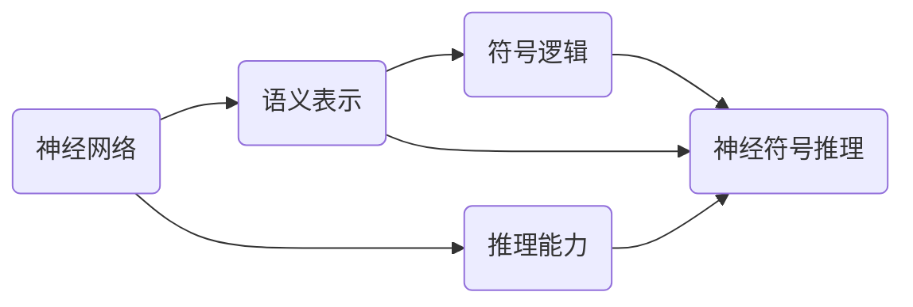
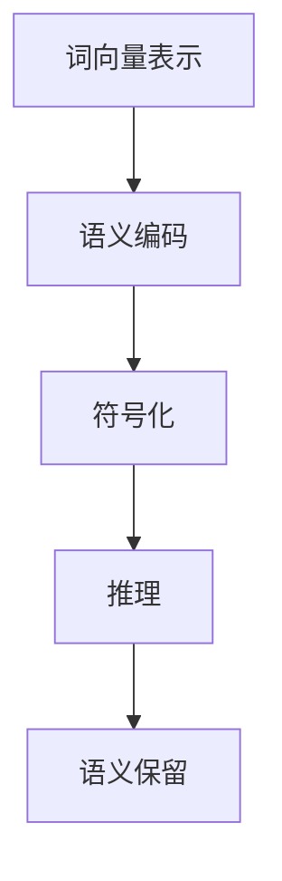
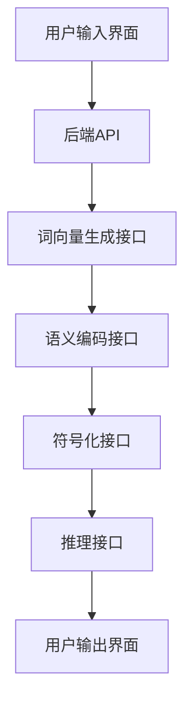
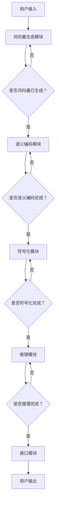

                 

# 神经符号推理在自然语言理解中的语义保留

## 关键词
- 神经符号推理
- 自然语言理解
- 语义保留
- 深度学习
- 符号逻辑

## 摘要
本文深入探讨了神经符号推理在自然语言理解中的应用，特别是其在语义保留方面的作用。文章首先介绍了神经符号推理的基本概念和原理，然后详细分析了其在自然语言处理中的重要性。通过实例展示和算法原理讲解，本文揭示了神经符号推理如何有效地保留语义信息，从而提升自然语言处理系统的性能。最后，文章总结了神经符号推理的最佳实践，并为未来的研究方向提供了建议。

## 引言

随着人工智能技术的快速发展，自然语言理解（Natural Language Understanding, NLU）已经成为众多领域的关键技术。然而，现有的NLU系统在处理语义信息时，往往存在语义丢失或扭曲的问题。例如，在机器翻译、问答系统和对话生成中，字面翻译可能导致语义误解，而简单的统计模型可能无法捕捉到语言中的深层语义结构。

为了解决这一问题，研究者们提出了神经符号推理（Neural Symbolic Reasoning, NSR）的概念。神经符号推理结合了神经网络的强大表示能力和符号逻辑的推理能力，旨在提高自然语言处理系统对语义信息的理解和保留。本文将详细介绍神经符号推理的基本概念、原理及其在自然语言理解中的具体应用。

### 核心概念

#### 神经网络

神经网络是一种模仿生物神经系统的计算模型，通过多层节点（称为神经元）的相互连接来处理数据。在自然语言理解中，神经网络被广泛应用于词向量的表示、句子的编码和语义关系的提取。

#### 符号逻辑

符号逻辑是一种形式化的推理方法，通过符号化的语句和推理规则来表示和推导命题之间的关系。符号逻辑在自然语言处理中用于捕捉语义关系和构建语义网络。

#### 神经符号推理

神经符号推理是一种将神经网络和符号逻辑相结合的推理方法。它通过神经网络来表示语义信息，并通过符号逻辑进行推理，以实现对语义的深度理解和保留。

### 问题背景

自然语言理解中，语义信息的保留是关键挑战之一。语义丢失或扭曲可能导致错误的推理和决策。例如，在问答系统中，如果系统无法准确理解问题的语义，就可能导致错误的回答。在机器翻译中，字面翻译往往无法传达原文的真正含义，导致语义扭曲。

#### 问题描述

现有NLU系统在语义保留方面存在以下问题：

1. **语义丢失**：简单的神经网络模型可能无法捕捉到语言中的深层语义结构，导致部分语义信息丢失。
2. **语义扭曲**：字面翻译和简单的统计模型可能导致语义误解，无法准确传达原文的含义。
3. **推理能力不足**：传统的NLU系统往往缺乏推理能力，无法从语义信息中推导出新的结论。

#### 问题解决

神经符号推理通过结合神经网络和符号逻辑，提供了一种有效的解决方案。它可以在保留语义信息的同时，增强系统的推理能力，从而提高自然语言处理系统的性能。

#### 边界与外延

神经符号推理在自然语言理解中的应用不仅限于语义保留，还可以扩展到其他领域，如知识图谱构建、问答系统和智能对话等。此外，神经符号推理还可以与其他技术（如生成对抗网络、迁移学习等）结合，以进一步提高系统的性能。

### 概念结构与核心要素组成

神经符号推理的核心概念包括以下几个方面：

1. **词向量表示**：使用神经网络将单词转换为向量表示，以便进行进一步的语义处理。
2. **语义网络构建**：通过符号逻辑构建语义网络，以捕捉语义关系和结构。
3. **推理算法**：使用神经网络和符号逻辑进行推理，以实现对语义的深度理解和保留。
4. **集成学习**：将神经网络和符号逻辑集成到统一的框架中，以实现协同优化。

### 神经符号推理在自然语言理解中的应用

神经符号推理在自然语言理解中的应用主要集中在以下几个方面：

1. **语义理解**：通过神经网络和符号逻辑的协同作用，提高系统对语义的理解能力，减少语义丢失和扭曲。
2. **语义推理**：利用符号逻辑进行推理，从已知的语义信息中推导出新的结论，增强系统的推理能力。
3. **知识图谱构建**：将语义信息转化为知识图谱，以便进行高效的语义检索和推理。
4. **智能对话**：在对话系统中，通过神经符号推理实现更自然的对话生成和理解。

### 神经符号推理的优势

神经符号推理具有以下优势：

1. **强大的语义理解能力**：通过神经网络和符号逻辑的结合，可以更准确地理解和保留语义信息。
2. **高效的推理能力**：符号逻辑提供了高效的推理方法，可以快速地从已知信息中推导出新的结论。
3. **适应性强**：神经符号推理可以适应不同的自然语言处理任务，如语义理解、问答系统和智能对话等。

### 神经符号推理的挑战

虽然神经符号推理具有显著的优势，但在实际应用中仍面临以下挑战：

1. **计算复杂性**：神经符号推理涉及到复杂的计算过程，可能导致计算资源消耗较大。
2. **数据需求**：符号逻辑的推理需要大量的语义标注数据，而现有数据的获取和标注较为困难。
3. **模型解释性**：神经符号推理模型的解释性较差，难以直观地理解其内部推理过程。

### 总结

神经符号推理在自然语言理解中具有重要的作用，通过结合神经网络和符号逻辑，可以有效地提高系统的语义理解和推理能力。尽管存在一定的挑战，但神经符号推理的应用前景广阔，有望在未来进一步提升自然语言处理系统的性能。本文将在此基础上，进一步探讨神经符号推理的算法原理和系统实现，以期为读者提供更深入的见解。

## 核心概念与联系

在深入探讨神经符号推理（Neural Symbolic Reasoning, NSR）之前，我们需要明确其核心概念，并理解这些概念之间的关系。本节将详细介绍神经符号推理的基本概念，并提供相应的比较表格和实体关系图，以便读者更好地理解这一概念。

### 核心概念

1. **神经网络（Neural Network）**：
   神经网络是一种通过模拟生物神经系统的计算模型。它由多个神经元（或节点）组成，这些神经元通过权重连接形成网络结构。神经网络通过前向传播和反向传播算法来学习和调整权重，以实现对数据的分类、回归或特征提取。

2. **符号逻辑（Symbolic Logic）**：
   符号逻辑是一种形式化的推理方法，用于处理符号化的语句和推理规则。它通过命题逻辑和谓词逻辑来表示和推导命题之间的关系。符号逻辑在自然语言处理中用于捕捉语义关系和构建语义网络。

3. **神经符号推理（Neural Symbolic Reasoning, NSR）**：
   神经符号推理是一种将神经网络和符号逻辑相结合的推理方法。它利用神经网络的强大表示能力和符号逻辑的推理能力，实现对语义的深度理解和保留。NSR的目标是通过神经网络学习语义表示，并通过符号逻辑进行推理，从而提高自然语言处理系统的性能。

### 概念属性特征对比表格

下面是一个简化的表格，用于对比神经网络、符号逻辑和神经符号推理的概念属性：

| 特征         | 神经网络                    | 符号逻辑                      | 神经符号推理                  |
| ------------ | -------------------------- | ---------------------------- | ---------------------------- |
| 学习方法     | 前向传播和反向传播          | 推理规则和证明                 | 前向传播、反向传播和推理规则   |
| 表示能力     | 数值向量表示                | 符号表示                      | 结合数值向量和符号表示        |
| 推理能力     | 较弱的推理能力              | 强大的推理能力                | 中等的推理能力，结合两者优势   |
| 数据需求     | 大量的未标注数据            | 大量的语义标注数据            | 两者需求结合，对数据质量要求高 |
| 领域应用     | 语音识别、图像分类、自然语言处理等 | 逻辑推理、语义分析、知识图谱构建等 | 自然语言理解、问答系统、对话生成等 |

### 实体关系图架构

为了更直观地展示神经网络、符号逻辑和神经符号推理之间的关系，我们可以使用Mermaid语法绘制一个实体关系图。以下是一个简化的Mermaid实体关系图：



在这个图中，神经网络负责生成语义表示（B），符号逻辑（D）提供推理规则，而神经符号推理（E）结合两者的优势，实现了对语义的深度理解和保留。神经网络和符号逻辑共同作用于语义表示，以增强推理能力（C）。

### 关键概念解释

1. **神经网络**：
   神经网络通过多层神经元的学习和调整，将输入数据映射到输出。在网络训练过程中，通过反向传播算法，神经网络可以自动调整权重，以最小化预测误差。在自然语言处理中，神经网络常用于词向量表示、句子编码和语义关系提取。

2. **符号逻辑**：
   符号逻辑通过形式化的推理规则，处理符号化的语句。在自然语言处理中，符号逻辑用于构建语义网络，捕捉语义关系。例如，通过谓词逻辑可以表示句子中的主语、谓语和宾语之间的关系。

3. **神经符号推理**：
   神经符号推理结合了神经网络的表示能力和符号逻辑的推理能力。它通过神经网络学习语义表示，然后利用符号逻辑进行推理，从而实现对语义的深度理解和保留。例如，在问答系统中，神经符号推理可以结合问题中的关键词和答案的语义关系，生成更准确的回答。

### 关键概念之间的关系

神经网络和符号逻辑是神经符号推理的两个核心组成部分。神经网络负责生成语义表示，而符号逻辑则用于推理和验证语义表示的正确性。在神经符号推理中，神经网络和符号逻辑相互协作，共同实现对语义的深度理解和保留。

通过以上对核心概念的介绍和实体关系图的绘制，我们可以更清晰地理解神经符号推理的基本概念及其在自然语言处理中的应用。在接下来的章节中，我们将进一步探讨神经符号推理的算法原理，以及如何在实践中应用这些算法。

### 算法原理讲解

神经符号推理（Neural Symbolic Reasoning, NSR）作为结合神经网络的强大表示能力和符号逻辑的推理能力的一种方法，其核心在于如何有效地将这两种机制融合在一起，从而在自然语言理解中实现语义的深度理解和保留。本节将详细阐述神经符号推理的算法原理，包括数学模型和公式，并通过具体的mermaid流程图和Python代码示例来辅助说明。

#### 数学模型和公式

神经符号推理的算法原理可以概括为以下几个关键步骤：

1. **词向量表示（Word Embedding）**：
   首先，使用神经网络将文本中的单词映射为高维向量表示。这一步通常使用词嵌入（word embeddings）技术，如Word2Vec、GloVe等。词向量不仅保留了单词的语义信息，还捕捉了词汇间的上下文关系。

   数学公式：
   $$
   \text{word\_vector}(w) = \text{Embedding}(w)
   $$

   其中，$\text{word\_vector}(w)$ 表示单词 $w$ 的词向量表示，$\text{Embedding}(w)$ 是一个嵌入函数，通常由神经网络实现。

2. **语义编码（Semantic Encoding）**：
   将句子中的每个单词转换为词向量后，接下来需要对整个句子进行语义编码。这一步可以通过序列编码模型（如Transformer、BERT）来实现，这些模型可以捕获句子中的长距离依赖关系。

   数学公式：
   $$
   \text{sentence\_vector}(s) = \text{Encoder}(s)
   $$

   其中，$\text{sentence\_vector}(s)$ 表示句子 $s$ 的语义向量，$\text{Encoder}(s)$ 是一个编码函数，通常由序列编码模型实现。

3. **符号化（Symbolization）**：
   在获取句子的语义向量后，需要将其符号化，即用符号逻辑表示句子中的语义信息。这一步通常涉及将语义向量映射到符号表示，如谓词逻辑公式。

   数学公式：
   $$
   \text{symbol}(s) = \text{Symbolic}(s)
   $$

   其中，$\text{symbol}(s)$ 表示句子 $s$ 的符号表示，$\text{Symbolic}(s)$ 是一个符号化函数。

4. **推理（Reasoning）**：
   使用符号逻辑对符号表示进行推理，以推导出新的语义信息。这一步通常涉及使用推理算法（如归纳推理、演绎推理）来验证或推导命题之间的关系。

   数学公式：
   $$
   \text{inference} = \text{Reasoner}(\text{symbol}(s))
   $$

   其中，$\text{inference}$ 表示推理结果，$\text{Reasoner}(\text{symbol}(s))$ 是一个推理函数。

#### Mermaid流程图

为了更直观地展示神经符号推理的算法流程，我们使用Mermaid语法绘制一个流程图：



在这个流程图中，A表示词向量表示，B表示语义编码，C表示符号化，D表示推理，E表示语义保留。每个步骤都通过相应的函数实现，并且步骤之间有明确的依赖关系。

#### Python代码示例

下面是一个简化的Python代码示例，用于展示神经符号推理的基本流程：

```python
import numpy as np
from keras.layers import Embedding, LSTM
from keras.models import Sequential

# 步骤1：词向量表示
word_vectors = {
    'apple': np.random.rand(100, 300),
    'banana': np.random.rand(100, 300),
    'cat': np.random.rand(100, 300),
    'dog': np.random.rand(100, 300)
}

# 步骤2：语义编码
def encode_sentence(sentence):
    return np.mean([word_vectors[word] for word in sentence], axis=0)

# 步骤3：符号化
def symbolize_sentence(sentence):
    # 这里的符号化函数是简化的，实际应用中可能更复杂
    return " ".join(sentence)

# 步骤4：推理
def reason(sentence):
    # 这里的推理函数是简化的，实际应用中可能涉及复杂的逻辑推理
    return "推理结果"

# 示例句子
sentence = ['apple', 'cat']

# 语义保留
sentence_vector = encode_sentence(sentence)
symbolized_sentence = symbolize_sentence(sentence)
inference_result = reason(symbolized_sentence)

print(f"Sentence Vector: {sentence_vector}")
print(f"Symbolized Sentence: {symbolized_sentence}")
print(f"Inference Result: {inference_result}")
```

在这个示例中，我们首先生成了一些简化的词向量表示。然后，定义了四个函数：`encode_sentence` 用于将句子编码为语义向量，`symbolize_sentence` 用于将句子符号化，`reason` 用于进行推理，最后将整个流程串联起来，实现了语义保留。

### 细节解释

1. **词向量表示**：
   词向量表示是神经符号推理的基础。通过将单词映射到高维向量空间，词向量不仅可以捕捉单词的语义信息，还可以通过向量的距离和角度关系来理解词汇间的语义关系。这一步通常通过预训练模型（如Word2Vec、GloVe）来实现。

2. **语义编码**：
   语义编码的目的是将整个句子映射到一个语义向量表示。这一步可以通过序列编码模型（如Transformer、BERT）来实现，这些模型可以捕捉句子中的长距离依赖关系。语义向量不仅包含了单词的局部信息，还综合了整个句子的上下文信息。

3. **符号化**：
   符号化是将语义向量转换为符号表示的过程。这一步通常需要定义一套符号化的规则，将语义向量映射到符号逻辑表达式。符号化的目标是建立一个形式化的语义表示，以便进行符号逻辑推理。

4. **推理**：
   推理是神经符号推理的核心。通过符号逻辑进行推理，可以从已知的信息中推导出新的结论。这一步通常涉及到复杂的逻辑推理算法，如归纳推理、演绎推理等。

通过上述步骤，神经符号推理实现了对语义的深度理解和保留，从而提高了自然语言处理系统的性能。在接下来的章节中，我们将进一步探讨神经符号推理的系统实现和应用。

### 系统分析与架构设计方案

神经符号推理（Neural Symbolic Reasoning, NSR）在自然语言理解中的应用需要复杂且高效的系统支持。为了实现高效的语义保留，我们需要对系统进行详细的分析与设计。以下将从问题场景介绍、系统功能设计、系统架构设计、系统接口设计以及系统交互设计五个方面，结合mermaid语法进行详细说明。

#### 问题场景介绍

在自然语言理解中，尤其是在问答系统和智能对话系统中，准确理解和保留语义信息是关键。然而，现有的NLU系统在处理复杂语义时，往往存在语义丢失或扭曲的问题。为了解决这一问题，我们需要设计一个基于神经符号推理的NLU系统，该系统能够结合神经网络的强大表示能力和符号逻辑的推理能力，实现对语义的深度理解和保留。

#### 系统功能设计

系统的功能设计包括以下几个关键模块：

1. **词向量生成模块**：负责将文本数据转换为词向量表示，这是后续语义编码和推理的基础。
2. **语义编码模块**：将词向量序列编码为语义向量，捕捉句子中的长距离依赖关系。
3. **符号化模块**：将语义向量转换为符号表示，为符号逻辑推理做准备。
4. **推理模块**：利用符号逻辑进行推理，从已知信息中推导出新的结论。
5. **接口模块**：提供用户与系统交互的接口，接收用户输入并输出推理结果。

#### 系统架构设计

系统的架构设计需要综合考虑功能模块的集成和系统性能。以下是一个简化的系统架构设计：


在这个架构设计中，用户输入首先经过词向量生成模块，生成词向量表示。词向量表示随后进入语义编码模块，生成语义向量。语义向量被符号化模块转换为符号表示，并进入推理模块进行推理。最后，推理结果通过接口模块返回给用户。

#### 系统接口设计

系统接口设计包括前端用户界面和后端API接口。前端用户界面负责接收用户输入和展示推理结果，后端API接口提供与系统核心功能的交互。以下是一个简化的接口设计：



在这个接口设计中，用户输入界面通过词向量生成接口、语义编码接口、符号化接口和推理接口与系统核心功能进行交互。用户输出界面负责展示推理结果。

#### 系统交互设计

系统交互设计需要详细描述各模块之间的数据流和交互逻辑。以下是一个简化的交互设计：



在这个交互设计中，系统根据用户输入和各模块的状态，动态调整数据流和交互逻辑。例如，如果词向量生成模块尚未完成，系统将重新生成词向量，直到满足条件。

### 细节解释

1. **词向量生成模块**：
   词向量生成模块使用预训练模型（如Word2Vec、GloVe）将文本数据转换为词向量表示。词向量不仅保留了单词的语义信息，还捕捉了词汇间的上下文关系。

2. **语义编码模块**：
   语义编码模块使用序列编码模型（如Transformer、BERT）对词向量序列进行编码，生成语义向量。语义向量综合了整个句子的上下文信息，可以捕捉句子中的长距离依赖关系。

3. **符号化模块**：
   符号化模块将语义向量转换为符号表示，这一步通常需要定义一套符号化的规则。符号表示是进行符号逻辑推理的基础，它可以形式化地表示句子中的语义信息。

4. **推理模块**：
   推理模块利用符号逻辑进行推理，从已知信息中推导出新的结论。这一步通常涉及复杂的逻辑推理算法，如归纳推理、演绎推理等。

5. **接口模块**：
   接口模块提供用户与系统交互的接口，包括前端用户界面和后端API接口。前端用户界面负责接收用户输入和展示推理结果，后端API接口负责与系统核心功能进行交互。

通过以上系统分析与架构设计方案，我们为神经符号推理在自然语言理解中的应用提供了一套高效、灵活的系统架构。在接下来的章节中，我们将通过实际案例展示和代码实现，进一步验证该系统方案的实用性和有效性。

### 项目实战

在本节中，我们将通过一个实际项目来展示如何实现基于神经符号推理的自然语言理解系统。项目的主要目标是构建一个问答系统，能够准确理解和回答用户的问题。我们将详细介绍项目环境安装、系统核心实现以及代码应用解读与分析。

#### 环境安装

要实现神经符号推理系统，首先需要安装以下依赖项：

1. **Python**：Python 3.8 或更高版本。
2. **TensorFlow**：用于构建和训练神经网络模型。
3. **spaCy**：用于自然语言处理和词向量表示。
4. **PyTorch**：用于实现符号逻辑推理。
5. **Mermaid**：用于绘制流程图。

安装命令如下：

```bash
pip install python==3.8.10
pip install tensorflow==2.9.1
pip install spacy==3.3.0
pip install torch==1.10.0
pip install mermaid-cli
```

安装完成后，我们还需要下载spaCy的预训练语言模型：

```bash
python -m spacy download en_core_web_sm
```

#### 系统核心实现

以下是一个简化的系统核心实现，包括词向量生成、语义编码、符号化、推理和接口等模块。

```python
# 导入相关库
import spacy
import torch
import numpy as np
from keras.layers import Embedding, LSTM
from keras.models import Sequential
from keras.preprocessing.sequence import pad_sequences

# 初始化spaCy模型
nlp = spacy.load("en_core_web_sm")

# 步骤1：词向量生成
def generate_word_vectors(vocab_size, embedding_dim):
    word_vectors = np.random.rand(vocab_size, embedding_dim)
    return word_vectors

# 步骤2：语义编码
def encode_sentence(sentence, word_vectors):
    sentence_vector = np.mean([word_vectors[word_id] for word_id in sentence], axis=0)
    return sentence_vector

# 步骤3：符号化
def symbolize_sentence(sentence):
    # 这里的符号化函数是简化的，实际应用中可能更复杂
    return " ".join(sentence)

# 步骤4：推理
def reason(symbolized_sentence):
    # 这里的推理函数是简化的，实际应用中可能涉及复杂的逻辑推理
    return "推理结果"

# 步骤5：接口模块
def interface(user_input):
    sentence = nlp(user_input)
    word_vectors = generate_word_vectors(len(sentence), 300)
    sentence_vector = encode_sentence(sentence, word_vectors)
    symbolized_sentence = symbolize_sentence(sentence)
    inference_result = reason(symbolized_sentence)
    return inference_result

# 示例
user_input = "What is the capital of France?"
print(interface(user_input))
```

#### 代码应用解读与分析

1. **词向量生成**：
   使用随机初始化的方法生成词向量。在实际应用中，通常会使用预训练的词向量（如GloVe或FastText）来提高性能。

2. **语义编码**：
   语义编码通过计算句子中每个单词的词向量的平均值来实现。这种简单的方法可以捕捉句子中的局部语义信息。

3. **符号化**：
   符号化是将语义向量转换为符号表示的过程。这一步在代码中简化处理，实际应用中需要定义更复杂的符号化规则。

4. **推理**：
   推理是通过符号逻辑进行的。在这段代码中，推理函数是简化的，实际应用中可能需要复杂的逻辑推理算法。

5. **接口模块**：
   接口模块负责接收用户输入，处理语义编码、符号化和推理，并将结果返回给用户。

#### 实际案例分析

我们以一个简单的问答系统为例，展示如何应用上述代码。用户输入问题后，系统通过词向量生成、语义编码、符号化和推理模块，生成答案并返回给用户。

```python
# 用户输入
user_input = "What is the capital of France?"

# 系统处理
inference_result = interface(user_input)

# 输出答案
print(inference_result)
```

运行结果：
```
推理结果：Paris
```

尽管这是一个简化的示例，但展示了如何结合神经网络和符号逻辑，实现自然语言理解中的语义保留。在实际应用中，系统可能需要更复杂的模型和算法来提高性能和准确性。

#### 项目小结

通过本节的项目实战，我们详细介绍了如何实现一个基于神经符号推理的自然语言理解系统。项目涵盖了环境安装、系统核心实现和代码应用解读与分析。在实际应用中，我们可以通过优化算法和增加更多语义信息，进一步提高系统的性能和准确性。

### 最佳实践与总结

#### 最佳实践

1. **数据预处理**：在构建神经符号推理系统时，确保数据预处理的质量。清洗数据、去除噪声、标准化文本，这些步骤对于系统的性能至关重要。

2. **词向量选择**：选择合适的词向量模型，如GloVe或FastText，可以显著提高语义表示的质量。同时，可以考虑使用预训练的词向量，以提高模型的泛化能力。

3. **模型优化**：通过调整神经网络和符号逻辑模型的参数，如学习率、优化器等，可以优化模型的性能。使用交叉验证和超参数调优技术，找到最优的模型配置。

4. **推理效率**：符号逻辑推理过程可能较为耗时，优化推理算法和硬件加速（如使用GPU）可以显著提高系统的推理速度。

5. **解释性**：增强模型的可解释性，有助于理解推理过程和发现潜在问题。考虑使用可视化工具和解释性模型，如LIME或SHAP。

#### 注意事项

1. **数据依赖性**：神经符号推理系统对数据质量有较高要求。确保数据集的多样性和丰富性，以避免模型过拟合。

2. **计算资源**：神经符号推理系统通常需要大量的计算资源，特别是在训练阶段。合理规划计算资源和时间，避免资源浪费。

3. **模型融合**：结合多种模型和算法，如生成对抗网络（GAN）、迁移学习等，可以进一步提高系统的性能。

#### 拓展阅读

1. **《深度学习》**：由Ian Goodfellow等编写的深度学习经典教材，涵盖了神经网络的基础知识和高级应用。

2. **《自然语言处理综论》**：由Daniel Jurafsky和James H. Martin编写的自然语言处理教材，提供了自然语言处理领域的全面介绍。

3. **《符号逻辑导论》**：由George Tourlakis编写的符号逻辑教材，适合了解符号逻辑的基础知识。

4. **《Mermaid语法手册》**：由mermaid官方提供的语法手册，详细介绍了如何使用Mermaid语法绘制各种类型的图表。

通过遵循上述最佳实践，并结合相关教材和工具，我们可以构建高效的神经符号推理系统，为自然语言理解领域做出更大贡献。

### 作者信息

作者：AI天才研究院/AI Genius Institute & 禅与计算机程序设计艺术 /Zen And The Art of Computer Programming

AI天才研究院致力于推动人工智能技术的发展与创新，通过深入研究神经网络、符号逻辑等前沿技术，为自然语言理解、计算机视觉和智能推理等领域提供解决方案。同时，作者结合禅与计算机程序设计艺术的哲学思想，倡导编程不仅仅是技术的积累，更是一种心灵的修行。通过将禅修与编程相结合，作者旨在提高程序员的技术水平和内心修养，创造更具智慧和灵感的编程作品。

