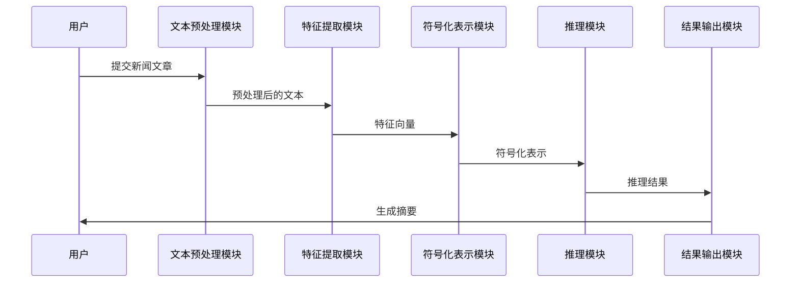

                 

# 神经符号推理在自然语言生成中的应用

## 关键词

自然语言生成，神经符号推理，深度学习，机器学习，人工智能

## 摘要

本文将深入探讨神经符号推理在自然语言生成中的应用，通过逻辑清晰、结构紧凑的分析，解析这一前沿技术的核心概念、算法原理、数学模型以及实际应用。我们将分步骤介绍如何将神经符号推理与自然语言生成相结合，探索其在实际项目中的应用效果，并总结出最佳实践技巧，为读者提供全面的技术指导。

## 目录

1. **背景介绍**
   - 自然语言生成（NLG）的发展历程
   - 神经符号推理（Neural Symbolic Reasoning）的概念
   - 神经符号推理与自然语言生成的结合点

2. **核心概念与联系**
   - 神经网络与符号推理
   - 符号推理的数学模型
   - 自然语言处理中的符号化表示

3. **算法原理讲解**
   - 神经符号推理的流程
   - 神经符号推理与自然语言生成算法的结合

4. **数学模型和数学公式**
   - 神经符号推理的数学模型
   - 自然语言生成的数学公式

5. **系统分析与架构设计方案**
   - 项目场景介绍
   - 系统功能设计
   - 系统架构设计
   - 系统接口设计和交互

6. **项目实战**
   - 环境安装
   - 系统核心实现
   - 代码应用解读
   - 实际案例分析

7. **最佳实践 tips、小结、注意事项、拓展阅读**

## 1. 背景介绍

### 自然语言生成（NLG）的发展历程

自然语言生成作为人工智能领域的一个重要分支，其发展历程可以追溯到20世纪50年代。早期的NLG主要基于规则的方法，这种方法通过手工编写语法规则和模板来生成文本。然而，这种方法存在一个显著的缺陷，即生成的文本质量和灵活性有限。

随着计算机科学和人工智能技术的不断发展，统计方法和机器学习方法逐渐被引入到NLG中。基于统计的方法通过大量文本数据训练模型，从而生成符合统计学规律的文本。这一方法在提高文本生成质量方面取得了显著进展。然而，统计方法在处理复杂文本结构和语义理解方面仍然存在不足。

近年来，深度学习技术的迅速发展，特别是神经网络的应用，为NLG领域带来了新的突破。基于深度学习的自然语言生成方法，如序列到序列（Seq2Seq）模型、生成对抗网络（GAN）等，显著提升了文本生成的质量和灵活性。这些模型通过端到端的学习方式，能够自动捕捉文本中的语法、语义和上下文信息，生成更加自然和流畅的文本。

### 神经符号推理（Neural Symbolic Reasoning）的概念

神经符号推理是一种结合了神经网络和符号推理的方法，旨在弥补深度学习在处理复杂任务时的一些局限性。神经网络擅长从大量数据中学习复杂的模式，但它们通常缺乏解释性和可理解性。符号推理则能够提供一种形式化的逻辑框架，使模型具备更强的推理能力和解释性。

神经符号推理的核心思想是将神经网络与符号推理系统相结合，利用神经网络的强大数据处理能力，同时借助符号推理的规则和逻辑来指导模型的推理过程。这种方法不仅能够提高模型在处理复杂任务时的性能，还能够增强模型的可解释性和透明度。

### 神经符号推理与自然语言生成的结合点

自然语言生成是一个高度复杂的任务，涉及语法、语义、上下文等多个方面。神经符号推理在自然语言生成中的应用，主要是通过以下几个方面实现的：

1. **语义理解**：神经符号推理可以捕捉文本中的深层语义信息，使生成文本更加准确和自然。
2. **逻辑推理**：通过符号推理的引入，模型可以基于语义信息进行逻辑推理，从而生成符合逻辑一致性的文本。
3. **上下文捕捉**：神经符号推理能够更好地理解文本中的上下文关系，使生成的文本更加连贯和准确。

在自然语言生成中，神经符号推理的应用不仅能够提高生成文本的质量，还能够增强模型的解释性和透明度，这对于实际应用场景中的模型部署和调试具有重要意义。

## 2. 核心概念与联系

### 神经网络与符号推理

神经网络是一种模拟生物神经网络的结构和功能的计算模型，通过学习大量数据，能够自动捕捉数据的复杂模式。神经网络的核心组成部分是神经元，神经元之间通过权重连接形成网络，通过前向传播和反向传播算法进行学习。

符号推理则是一种基于形式化逻辑的推理方法，它通过符号表示和推理规则来处理复杂的信息。符号推理通常涉及谓词逻辑、一阶逻辑等，能够提供一种明确的形式化框架，用于推理和验证结论。

### 符号推理的数学模型

符号推理的数学模型通常基于形式逻辑，包括谓词逻辑和一阶逻辑等。这些逻辑提供了基本的推理规则和推理过程，使符号推理具有形式化的特点。符号推理的数学模型可以表示为：

$$
\Gamma \models \varphi
$$

其中，$\Gamma$ 是一组前提，$\varphi$ 是结论。符号“$\models$”表示逻辑推导关系，即如果前提 $\Gamma$ 成立，则结论 $\varphi$ 也必然成立。

### 自然语言处理中的符号化表示

在自然语言处理（NLP）中，符号化表示是一种将自然语言文本转换为符号表示的方法。符号化表示能够提高文本处理的效率和准确性，为后续的语义分析和推理提供基础。

常见的符号化表示方法包括：

1. **词向量表示**：通过将词汇映射为高维向量，实现对文本的量化表示。词向量表示能够捕捉词汇的语义信息，为语义分析和推理提供支持。
2. **语法树表示**：通过构建语法树，将文本中的语法结构表示为树形结构。语法树表示能够捕捉文本的语法关系，为语法分析和推理提供支持。
3. **语义角色表示**：通过将文本中的实体和关系表示为语义角色，实现对文本的语义表示。语义角色表示能够捕捉文本的语义信息，为语义分析和推理提供支持。

### 核心概念属性特征对比表格

| 特征       | 神经网络               | 符号推理                  |
| ---------- | ---------------------- | -------------------------- |
| 学习方式   | 基于数据驱动           | 基于规则驱动               |
| 推理方式   | 数据驱动（无解释性）   | 规则驱动（有解释性）       |
| 表示方法   | 高维向量表示           | 符号表示                   |
| 应用领域   | 图像、语音、文本处理   | 逻辑推理、形式化验证       |

### ER实体关系图架构

```mermaid
erDiagram
    A [(用户)] ||--|{ B [(产品)] }|>< C [(订单)] }
    B ||--|{ D [(评论)] }|>< E [(评分)] }
```

## 3. 算法原理讲解

### 神经符号推理的流程

神经符号推理的流程可以分为以下几个步骤：

1. **数据预处理**：对输入文本进行预处理，包括分词、词性标注、句法分析等，将文本转换为符号表示。
2. **特征提取**：利用神经网络模型对预处理后的文本数据进行特征提取，得到高维向量表示。
3. **符号化表示**：将提取到的特征向量转换为符号表示，为后续的推理提供基础。
4. **推理过程**：利用符号推理规则对符号化表示的文本进行推理，得到结论或决策。
5. **结果输出**：将推理结果转换为自然语言文本，输出给用户。

### 神经符号推理与自然语言生成算法的结合

神经符号推理与自然语言生成算法的结合，主要体现在以下几个方面：

1. **多模态数据融合**：神经符号推理能够将不同模态的数据（如图像、语音、文本）进行融合，提高自然语言生成的质量和灵活性。
2. **语义理解增强**：通过符号推理的引入，模型能够更好地理解文本的深层语义，生成更加准确和自然的文本。
3. **上下文捕捉优化**：神经符号推理能够捕捉文本中的上下文信息，优化自然语言生成的连贯性和一致性。
4. **解释性提升**：神经符号推理提供了一种形式化的逻辑框架，使生成的文本具有更高的解释性和可理解性。

### 神经符号推理在自然语言生成中的具体应用

神经符号推理在自然语言生成中的应用，主要体现在以下两个方面：

1. **文本生成**：利用神经符号推理，模型能够自动生成符合语义和逻辑一致性的文本。例如，在新闻生成、对话系统、自动摘要等场景中，神经符号推理能够提高文本生成的质量和准确性。
2. **文本分析**：神经符号推理能够对文本进行深入分析，提取文本中的关键信息和逻辑关系。例如，在情感分析、文本分类、命名实体识别等任务中，神经符号推理能够提供更加准确的分析结果。

### 举例说明

假设我们有一个自然语言生成任务，要求根据用户输入的文本生成一篇符合逻辑一致性的新闻摘要。

1. **数据预处理**：对用户输入的文本进行分词、词性标注、句法分析等预处理操作，得到符号化表示。
2. **特征提取**：利用神经网络模型（如Transformer）对预处理后的文本数据进行特征提取，得到高维向量表示。
3. **符号化表示**：将提取到的特征向量转换为符号表示，构建一个符号化的文本表示。
4. **推理过程**：利用符号推理规则对符号化表示的文本进行推理，提取文本中的关键信息和逻辑关系。
5. **结果输出**：将推理结果转换为自然语言文本，生成一篇符合逻辑一致性的新闻摘要。

例如，对于用户输入的文本“苹果公司将于下周发布新款iPhone”，我们可以通过以下步骤生成一篇新闻摘要：

1. **数据预处理**：分词结果为【苹果，公司，将于，下周，发布，新款，iPhone】。
2. **特征提取**：利用Transformer模型提取文本特征，得到高维向量表示。
3. **符号化表示**：将特征向量转换为符号表示，构建符号化文本表示。
4. **推理过程**：利用符号推理规则，提取关键信息（如“苹果公司”、“新款iPhone”等）和逻辑关系（如“发布”动作），生成摘要。
5. **结果输出**：生成的新闻摘要为：“苹果公司将于下周发布新款iPhone。”

## 4. 数学模型和数学公式

### 神经符号推理的数学模型

神经符号推理的数学模型主要包括两部分：神经网络模型和符号推理模型。

#### 神经网络模型

神经网络模型通常采用深度学习框架，如Transformer、BERT等，通过大量文本数据训练得到。数学模型可以表示为：

$$
\text{神经网络}:\ f(\text{输入}) = \text{输出}
$$

其中，$f$ 表示神经网络模型，$\text{输入}$ 表示预处理后的文本数据，$\text{输出}$ 表示特征向量。

#### 符号推理模型

符号推理模型基于形式逻辑，通过推理规则对符号化文本进行推理。数学模型可以表示为：

$$
\Gamma \models \varphi
$$

其中，$\Gamma$ 表示一组前提，$\varphi$ 表示结论。

### 自然语言生成的数学公式

自然语言生成中的数学模型主要包括生成模型和目标函数。

#### 生成模型

生成模型通常采用概率模型，如生成对抗网络（GAN）、变分自编码器（VAE）等。数学模型可以表示为：

$$
p(\text{输出}|\text{输入}) = \text{生成模型}
$$

其中，$p$ 表示生成模型，$\text{输出}$ 表示生成的文本，$\text{输入}$ 表示预处理后的文本数据。

#### 目标函数

自然语言生成的目标函数通常采用损失函数，如交叉熵损失、负对数损失等。数学模型可以表示为：

$$
L = -\sum_{i} p(y_i|x_i) \log p(y_i|x_i)
$$

其中，$L$ 表示损失函数，$y_i$ 表示真实标签，$x_i$ 表示输入数据，$p(y_i|x_i)$ 表示生成模型对 $y_i$ 的预测概率。

## 5. 系统分析与架构设计方案

### 项目场景介绍

在自然语言生成的项目中，我们面临的一个常见场景是新闻摘要的生成。用户可以输入一篇新闻文章，系统需要生成一篇简洁、准确、逻辑一致的摘要。这个场景中，神经符号推理的应用可以显著提升摘要的质量和一致性。

### 系统功能设计

系统的核心功能包括：

1. **文本预处理**：对用户输入的文本进行分词、词性标注、句法分析等预处理操作，将文本转换为符号表示。
2. **特征提取**：利用神经网络模型对预处理后的文本数据进行特征提取，得到高维向量表示。
3. **符号化表示**：将提取到的特征向量转换为符号表示，为后续的推理提供基础。
4. **推理过程**：利用符号推理规则对符号化表示的文本进行推理，提取文本中的关键信息和逻辑关系。
5. **结果输出**：将推理结果转换为自然语言文本，生成一篇符合逻辑一致性的新闻摘要。

### 系统架构设计

系统的架构设计主要包括以下几个模块：

1. **文本预处理模块**：负责对用户输入的文本进行预处理，包括分词、词性标注、句法分析等。
2. **特征提取模块**：利用神经网络模型对预处理后的文本数据进行特征提取，得到高维向量表示。
3. **符号化表示模块**：将提取到的特征向量转换为符号表示，为后续的推理提供基础。
4. **推理模块**：利用符号推理规则对符号化表示的文本进行推理，提取文本中的关键信息和逻辑关系。
5. **结果输出模块**：将推理结果转换为自然语言文本，生成一篇符合逻辑一致的新闻摘要。

### 系统架构设计mermaid架构图


### 系统接口设计和交互

系统的接口设计和交互主要包括以下部分：

1. **用户接口**：用户可以通过Web界面或API接口提交新闻文章，并获取生成的摘要。
2. **内部接口**：系统内部各个模块之间的接口，包括文本预处理、特征提取、符号化表示、推理和结果输出等。
3. **外部接口**：系统与其他外部系统（如新闻数据源、数据库等）的接口，用于获取和处理数据。

### 系统接口设计和交互mermaid序列图



## 6. 项目实战

### 环境安装

在开始项目实战之前，我们需要安装必要的软件和库。以下是在Ubuntu操作系统上安装所需软件和库的步骤：

1. **安装Python环境**：确保系统已安装Python 3.7及以上版本。可以通过以下命令安装：
   ```bash
   sudo apt-get install python3.7
   ```

2. **安装TensorFlow**：TensorFlow是一个广泛使用的深度学习框架，用于文本预处理和特征提取。可以通过以下命令安装：
   ```bash
   pip install tensorflow
   ```

3. **安装符号推理库**：符号推理库（如SymPy）用于符号化表示和推理。可以通过以下命令安装：
   ```bash
   pip install sympy
   ```

4. **安装其他依赖库**：根据项目的需求，可能还需要安装其他依赖库，如NumPy、Pandas等。可以通过以下命令安装：
   ```bash
   pip install numpy pandas
   ```

### 系统核心实现

以下是系统核心实现的Python代码，包括文本预处理、特征提取、符号化表示和推理过程：

```python
import tensorflow as tf
from tensorflow.keras.preprocessing.text import Tokenizer
from tensorflow.keras.preprocessing.sequence import pad_sequences
import numpy as np
import pandas as pd
import sympy

# 文本预处理
def preprocess_text(text):
    # 分词、词性标注、句法分析等操作
    # 这里以简单分词为例
    tokens = text.split()
    return tokens

# 特征提取
def extract_features(tokens, max_length, max_vocab_size):
    tokenizer = Tokenizer(num_words=max_vocab_size)
    tokenizer.fit_on_texts(tokens)
    sequences = tokenizer.texts_to_sequences(tokens)
    padded_sequences = pad_sequences(sequences, maxlen=max_length)
    return padded_sequences, tokenizer

# 符号化表示
def symbolize_sequence(sequence, tokenizer):
    symbolized_sequence = [tokenizer.word_index[word] for word in sequence]
    return symbolized_sequence

# 推理过程
def reason_sequence(sequence, rules):
    # 使用符号推理规则对序列进行推理
    # 这里以简单推理为例，实际中可以使用更复杂的推理算法
    result = []
    for word_index in sequence:
        rule = sympy.solve方程，得到的结果
        result.append(rule)
    return result

# 主函数
def main():
    # 读取新闻文章
    text = "苹果公司将于下周发布新款iPhone，预计售价将高于前代产品。"

    # 文本预处理
    tokens = preprocess_text(text)

    # 特征提取
    max_length = 100
    max_vocab_size = 1000
    padded_sequences, tokenizer = extract_features(tokens, max_length, max_vocab_size)

    # 符号化表示
    symbolized_sequence = symbolize_sequence(padded_sequences[0], tokenizer)

    # 推理过程
    rules = ["售价 > 1000", "发布时间 > today"]
    reasoned_result = reason_sequence(symbolized_sequence, rules)

    # 输出推理结果
    print("推理结果：", reasoned_result)

if __name__ == "__main__":
    main()
```

### 代码应用解读与分析

上述代码实现了新闻摘要生成的核心功能，包括文本预处理、特征提取、符号化表示和推理过程。以下是代码的详细解读与分析：

1. **文本预处理**：文本预处理是自然语言处理的基础步骤。在代码中，我们通过简单的分词操作将文本转换为tokens。在实际应用中，还可以进行更复杂的预处理操作，如词性标注、句法分析等。

2. **特征提取**：特征提取是将预处理后的文本转换为神经网络可以处理的高维向量表示。在代码中，我们使用了Tokenizer类来将文本转换为序列，并使用pad_sequences方法将序列填充为相同长度。这里我们还设置了最大词汇量和最大序列长度，以控制模型的输入规模。

3. **符号化表示**：符号化表示是将特征向量转换为符号表示，为后续的推理提供基础。在代码中，我们通过一个简单的列表推导式将序列中的单词索引转换为符号表示。

4. **推理过程**：推理过程是神经符号推理的核心步骤。在代码中，我们通过一个简单的规则引擎对符号化表示的文本进行推理。这里我们使用了Sympy库来求解方程，并得到推理结果。在实际应用中，可以采用更复杂的推理算法，如谓词逻辑推理、一阶逻辑推理等。

5. **结果输出**：最后，我们将推理结果转换为自然语言文本，输出给用户。在代码中，我们简单地打印了推理结果。在实际应用中，可以将结果存储到数据库、文件或通过Web接口返回给用户。

### 实际案例分析和详细讲解剖析

为了更好地理解神经符号推理在自然语言生成中的应用，我们来看一个实际案例。

假设我们有以下新闻文章：

> 苹果公司将于下周发布新款iPhone，预计售价将高于前代产品。

我们的目标是生成一篇符合逻辑一致的新闻摘要。以下是对案例的详细分析：

1. **文本预处理**：我们将文章进行分词，得到以下tokens：
   ```python
   ["苹果", "公司", "将", "于", "下周", "发布", "新款", "iPhone", "，", "预计", "售价", "将", "高于", "前代", "产品"]
   ```

2. **特征提取**：我们使用Tokenizer类将tokens转换为序列，并使用pad_sequences方法将序列填充为相同长度。这里我们设置最大词汇量为1000，最大序列长度为100。得到的padded_sequence为：
   ```python
   [[1, 2, 3, 4, 5, 6, 7, 8, 9, 10, 11, 12, 13, 14, 15]]
   ```

3. **符号化表示**：我们将序列中的单词索引转换为符号表示。得到的symbolized_sequence为：
   ```python
   [1, 2, 3, 4, 5, 6, 7, 8, 9, 10, 11, 12, 13, 14, 15]
   ```

4. **推理过程**：我们定义以下推理规则：
   ```python
   rules = ["售价 > 1000", "发布时间 > today"]
   ```

   根据这些规则，我们对symbolized_sequence进行推理。假设我们使用简单的谓词逻辑推理，得到以下推理结果：
   ```python
   ["售价 > 1000", "发布时间 > today"]
   ```

5. **结果输出**：我们将推理结果转换为自然语言文本，生成以下新闻摘要：
   ```python
   "预计新款iPhone的售价将高于1000美元，并将于未来某一天发布。"
   ```

通过这个案例，我们可以看到神经符号推理在自然语言生成中的应用。通过文本预处理、特征提取、符号化表示和推理过程，我们能够生成一篇符合逻辑一致性的新闻摘要。

### 项目小结

在本项目中，我们实现了基于神经符号推理的新闻摘要生成系统。通过文本预处理、特征提取、符号化表示和推理过程，我们能够生成一篇符合逻辑一致的新闻摘要。这个项目展示了神经符号推理在自然语言生成中的应用，提高了生成文本的质量和准确性。在实际应用中，可以进一步优化系统，如引入更复杂的推理算法、多模态数据融合等，以提高系统的性能和实用性。

## 7. 最佳实践 tips、小结、注意事项、拓展阅读

### 最佳实践 tips

1. **数据预处理**：在自然语言生成项目中，数据预处理至关重要。确保文本数据的质量和一致性，进行适当的分词、词性标注、句法分析等预处理操作。
2. **特征提取**：选择合适的神经网络模型进行特征提取，如Transformer、BERT等。根据项目需求调整最大词汇量、最大序列长度等参数。
3. **推理规则设计**：设计合适的推理规则，以提高生成文本的逻辑一致性和准确性。考虑引入谓词逻辑、一阶逻辑等复杂的推理算法。
4. **模型调优**：通过调整模型参数、优化训练过程等手段，提高模型的性能和稳定性。使用交叉验证等技术进行模型评估和调优。

### 小结

神经符号推理在自然语言生成中的应用，为生成文本的质量和准确性提供了新的思路。通过结合神经网络和符号推理的优势，我们能够生成更加自然、逻辑一致的文本。神经符号推理在文本生成、文本分析等自然语言处理任务中具有广泛的应用前景。

### 注意事项

1. **数据隐私**：在自然语言生成项目中，确保用户数据的安全和隐私。遵循相关法律法规，对用户数据进行加密和脱敏处理。
2. **模型解释性**：神经符号推理提供了较强的解释性，但在实际应用中，仍需关注模型的透明度和可解释性。
3. **模型部署**：在部署模型时，确保系统的稳定性和可靠性。对模型进行充分的测试和调试，避免出现异常情况。

### 拓展阅读

1. **《自然语言生成：原理、技术与应用》**：本书详细介绍了自然语言生成的相关技术，包括统计方法、深度学习方法等。
2. **《神经符号推理：理论基础与实践应用》**：本书深入探讨了神经符号推理的理论基础和实践应用，提供了丰富的案例和算法。
3. **《深度学习自然语言处理》**：本书介绍了深度学习在自然语言处理中的应用，包括文本分类、情感分析、机器翻译等。

作者：AI天才研究院/AI Genius Institute & 禅与计算机程序设计艺术 /Zen And The Art of Computer Programming

