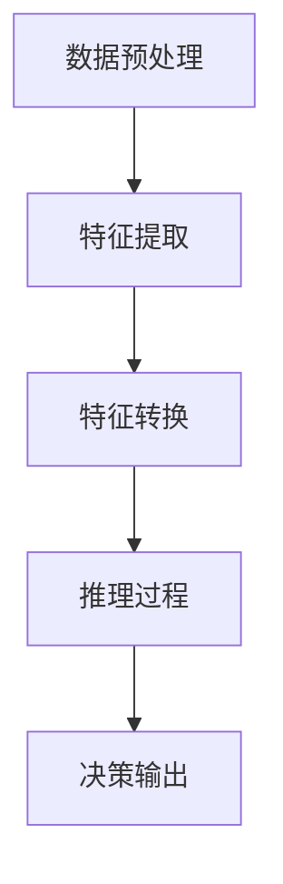
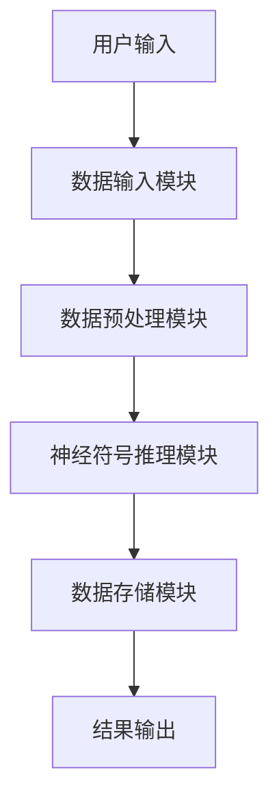
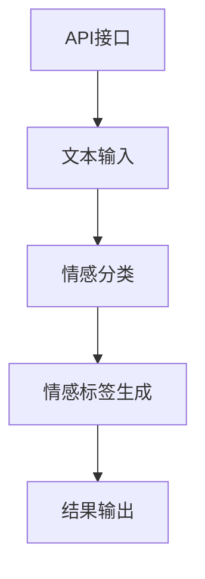
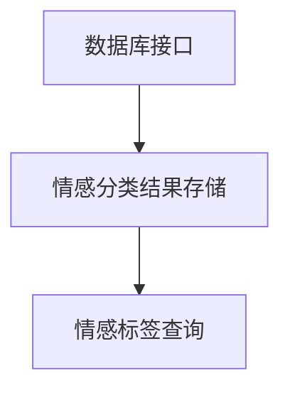
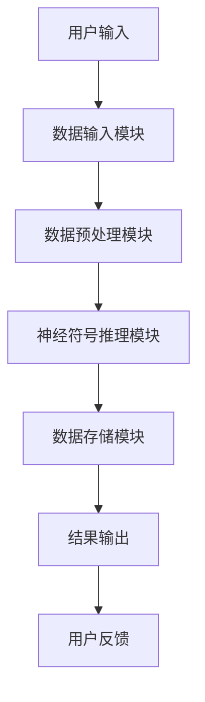

                 

# 《神经符号推理在自然语言生成中的语义控制》

## 关键词：神经符号推理、自然语言生成、语义控制、算法、数学模型、项目实战

## 摘要

本文深入探讨了神经符号推理在自然语言生成（NLG）中的语义控制作用。通过介绍神经符号推理和自然语言生成的基本概念、算法原理以及数学模型，本文阐述了两者在语义控制中的结合与应用。同时，通过具体的项目实战案例，展示了如何在实际场景中实现神经符号推理在自然语言生成中的语义控制，为相关领域的研发提供参考。

## 目录大纲设计思路

本文的目录大纲设计旨在为读者提供一个清晰、系统的学习路径。以下为具体的设计思路：

### 第一部分：引言与背景

- **第1章：引言与背景**：简要介绍神经符号推理和自然语言生成（NLG）的背景信息，以及它们在语义控制中的作用。

### 第二部分：神经符号推理基础

- **第2章：神经符号推理基础理论**：详细阐述神经符号推理的概念、原理及其应用。
- **第3章：自然语言生成基础理论**：介绍自然语言生成的概念、核心任务及其在语义控制中的应用。

### 第三部分：自然语言生成与语义控制

- **第4章：自然语言生成与语义控制**：讲解自然语言生成中的语义控制技术及其应用。

### 第四部分：神经符号推理在NLG中的语义控制应用

- **第5章：神经符号推理在NLG中的应用**：讨论神经符号推理与自然语言生成结合的方式及其在语义控制中的应用。

### 第五部分：项目实战

- **第6章：项目实战**：通过具体的项目实战，展示如何实现神经符号推理在自然语言生成中的语义控制。

### 第六部分：最佳实践与总结

- **第7章：最佳实践与总结**：提供最佳实践、注意事项、拓展阅读等内容，总结本文的核心观点。

## 具体目录大纲设计

```markdown
# 《神经符号推理在自然语言生成中的语义控制》目录大纲

# 第一部分：引言与背景

## 第1章：引言与背景

### 1.1 问题背景
#### 1.1.1 神经符号推理的发展历史
#### 1.1.2 自然语言生成的研究现状
#### 1.1.3 语义控制在NLG中的重要性

### 1.2 核心概念
#### 1.2.1 神经符号推理概述
#### 1.2.2 自然语言生成概述
#### 1.2.3 语义控制的概念与挑战

### 1.3 关联领域
#### 1.3.1 语言模型与语义理解
#### 1.3.2 机器学习与深度学习
#### 1.3.3 知识图谱与语义网络

### 1.4 资源与环境
#### 1.4.1 开源资源
#### 1.4.2 工具与环境搭建
#### 1.4.3 示例数据集介绍

### 1.5 本章小结

# 第二部分：神经符号推理基础

## 第2章：神经符号推理基础理论

### 2.1 神经符号推理的概念
#### 2.1.1 神经符号推理的定义
#### 2.1.2 神经符号推理的基本原理

### 2.2 算法原理
#### 2.2.1 基于深度学习的神经符号推理算法
#### 2.2.2 神经符号推理的流程
#### 2.2.3 神经符号推理的核心技术

### 2.3 数学模型
#### 2.3.1 相关数学公式
#### 2.3.2 数学模型在神经符号推理中的应用

### 2.4 实例分析
#### 2.4.1 案例一：文本分类中的神经符号推理
#### 2.4.2 案例二：语义角色标注中的神经符号推理

### 2.5 本章小结

## 第3章：自然语言生成基础理论

### 3.1 自然语言生成概述
#### 3.1.1 NLG的定义与分类
#### 3.1.2 NLG的核心任务

### 3.2 语义控制技术
#### 3.2.1 语义控制的基本概念
#### 3.2.2 语义控制的挑战与策略

### 3.3 关键技术
#### 3.3.1 语言模型
#### 3.3.2 生成式与解析式NLG
#### 3.3.3 个性化与自适应NLG

### 3.4 实例分析
#### 3.4.1 案例一：新闻自动生成
#### 3.4.2 案例二：对话系统中的语义控制

### 3.5 本章小结

# 第三部分：自然语言生成与语义控制

## 第4章：自然语言生成与语义控制

### 4.1 语义控制技术概述
#### 4.1.1 语义控制的基本概念
#### 4.1.2 语义控制的挑战与策略

### 4.2 语言模型与语义理解
#### 4.2.1 语言模型概述
#### 4.2.2 语义理解概述

### 4.3 机器学习与深度学习
#### 4.3.1 机器学习基础
#### 4.3.2 深度学习基础

### 4.4 知识图谱与语义网络
#### 4.4.1 知识图谱概述
#### 4.4.2 语义网络概述

### 4.5 语义控制的应用场景
#### 4.5.1 文本生成
#### 4.5.2 对话系统

### 4.6 本章小结

# 第四部分：神经符号推理在NLG中的语义控制应用

## 第5章：神经符号推理在NLG中的应用

### 4.1 神经符号推理与NLG的结合
#### 4.1.1 结合方式
#### 4.1.2 应用优势

### 4.2 应用实例
#### 4.2.1 案例一：情感分析中的语义控制
#### 4.2.2 案例二：对话系统中的意图识别

### 4.3 案例研究
#### 4.3.1 案例研究一：语义生成中的神经符号推理
#### 4.3.2 案例研究二：知识图谱与NLG的结合

### 4.4 算法优化与改进
#### 4.4.1 神经符号推理算法的优化
#### 4.4.2 NLG中语义控制的优化

### 4.5 本章小结

# 第五部分：项目实战

## 第6章：项目实战

### 6.1 项目背景
#### 6.1.1 项目简介
#### 6.1.2 项目目标

### 6.2 环境搭建
#### 6.2.1 硬件环境
#### 6.2.2 软件环境

### 6.3 系统设计与实现
#### 6.3.1 系统架构设计
#### 6.3.2 系统接口设计
#### 6.3.3 系统核心实现源代码

### 6.4 代码应用解读与分析
#### 6.4.1 代码应用概述
#### 6.4.2 代码关键部分解读

### 6.5 实际案例分析与详细讲解
#### 6.5.1 案例一：情感分析
#### 6.5.2 案例二：对话系统

### 6.6 项目小结

### 6.7 本章小结

# 第六部分：最佳实践与总结

## 第7章：最佳实践与总结

### 7.1 最佳实践
#### 7.1.1 神经符号推理在NLG中的应用策略
#### 7.1.2 语义控制的关键技巧

### 7.2 小结
#### 7.2.1 神经符号推理在NLG中的语义控制作用
#### 7.2.2 未来发展方向

### 7.3 注意事项
#### 7.3.1 技术选型
#### 7.3.2 数据质量

### 7.4 拓展阅读
#### 7.4.1 相关书籍
#### 7.4.2 学术论文
#### 7.4.3 开源项目

### 7.5 本章小结

# 参考文献

## 附录

### 1. 神经符号推理与自然语言生成术语表
### 2. 算法流程图及代码示例

```

通过以上详细的目录大纲设计，读者可以系统地学习神经符号推理在自然语言生成中的语义控制，从基础理论到实际应用，再到项目实战，全方位掌握相关知识。同时，附录部分提供了相关术语表和算法流程图及代码示例，有助于读者更好地理解和应用相关技术。

---

## 第1章：引言与背景

### 1.1 问题背景

#### 1.1.1 神经符号推理的发展历史

神经符号推理（Neural Symbolic Reasoning，NSR）是近年来人工智能领域的一个重要研究方向。它结合了神经网络和符号逻辑，旨在解决传统神经网络在推理和理解方面存在的局限。神经符号推理的历史可以追溯到20世纪80年代，当时人工智能领域的专家们开始探索如何将神经网络与逻辑推理相结合，以弥补神经网络在处理复杂推理任务时的不足。

最早的研究工作集中在如何将神经网络中的表示与符号逻辑相结合，从而实现更强大的推理能力。这些研究提出了各种混合模型，如将神经网络用于特征提取，将符号逻辑用于推理。随着深度学习技术的兴起，神经符号推理的研究也得到了新的推动。深度学习模型如卷积神经网络（CNN）和循环神经网络（RNN）的引入，使得神经网络在特征提取和表示方面取得了显著的进步。在此基础上，研究者开始尝试将深度学习与符号逻辑相结合，从而实现更高效的推理。

#### 1.1.2 自然语言生成的研究现状

自然语言生成（Natural Language Generation，NLG）是人工智能领域的另一个重要分支。NLG的目标是利用计算机技术自动生成自然语言文本，从而实现人与机器之间的有效沟通。NLG的研究可以追溯到20世纪50年代，当时研究者开始探索如何让计算机生成简单的文本。

在早期的NLG研究中，基于规则的方法和模板匹配法是主要的生成方式。这些方法通过预设的规则或模板来生成文本，但它们在面对复杂、多样化的语言表达时表现较差。随着统计学习方法的兴起，如隐马尔可夫模型（HMM）和条件概率模型，NLG技术得到了显著提升。这些方法利用大量的语言数据来学习生成规则，从而能够生成更自然、更丰富的文本。

近年来，深度学习技术的应用使得NLG技术取得了重大突破。基于深度学习的生成模型如序列到序列（Seq2Seq）模型、注意力机制模型和生成对抗网络（GAN）等，使得NLG在生成文本的质量和多样性方面都有了显著的提升。这些模型通过学习大量的语言数据，能够生成更加自然、连贯的文本。

#### 1.1.3 语义控制在NLG中的重要性

在自然语言生成过程中，语义控制是一个关键问题。语义控制指的是在生成文本时，确保文本的语义意义准确、连贯。在传统的NLG系统中，语义控制通常通过规则和模板来实现，但这些方法在面对复杂、动态的语言环境时表现较差。深度学习技术的引入为语义控制带来了新的希望。

神经符号推理在语义控制中的应用，能够有效地结合神经网络和符号逻辑的优点，从而实现更强大的语义控制。神经符号推理能够将文本的语义信息编码为结构化的知识表示，从而为生成系统提供更精确、更可靠的语义控制。这种结合不仅能够提升文本生成的质量，还能够使系统更好地理解和使用语义信息，从而实现更高级的语义交互。

在NLG中，语义控制的重要性体现在多个方面。首先，准确的语义控制能够确保生成文本的意义正确，避免出现语义错误或歧义。其次，语义控制能够使生成文本更符合用户的意图，从而提升用户体验。最后，语义控制还能够使系统在生成文本时，更好地遵循语言规则和语法结构，从而生成更自然、更流畅的文本。

总之，神经符号推理在自然语言生成中的语义控制具有重要作用。它能够提升文本生成的质量，增强系统的语义理解能力，从而实现更高效、更智能的语义交互。随着神经符号推理技术的不断进步，我们期待在未来的自然语言生成系统中，看到更多的语义控制应用。

### 1.2 核心概念

#### 1.2.1 神经符号推理概述

神经符号推理（Neural Symbolic Reasoning，NSR）是一种结合了神经网络和符号逻辑的推理方法，旨在解决传统神经网络在推理和理解方面存在的局限。神经符号推理的基本思想是将神经网络用于特征提取和表示，将符号逻辑用于推理和决策。这种方法能够利用神经网络强大的特征学习和表示能力，同时借助符号逻辑的精确推理和决策能力，实现更高效、更可靠的推理。

神经符号推理的基本原理可以概括为三个层次：

1. **特征表示**：神经网络用于从原始数据中提取高级特征表示。这些特征表示不仅包含了数据的底层特征，还包含了高层次的结构信息，从而为后续的推理提供丰富的信息基础。
2. **符号表示**：将神经网络提取的特征表示转换为符号表示。这种符号表示可以是一种形式化的逻辑表示，如谓词逻辑或一阶逻辑，也可以是其他结构化的知识表示，如知识图谱或本体论。符号表示能够将神经网络的特征信息转化为可解释、可推理的知识结构。
3. **推理和决策**：利用符号逻辑对符号表示进行推理和决策。符号逻辑提供了一种形式化的推理框架，能够对符号表示进行逻辑推导和推理，从而实现复杂任务的理解和决策。

神经符号推理的应用场景非常广泛，包括但不限于：

- **知识图谱推理**：利用神经符号推理技术，可以对知识图谱中的实体和关系进行推理，从而发现新的知识关联。
- **语义理解**：在自然语言处理领域，神经符号推理可以用于文本的语义理解，如情感分析、实体识别和关系抽取等。
- **决策支持**：在商业智能和金融分析领域，神经符号推理可以用于数据分析和决策支持，如预测市场趋势、风险评估等。

#### 1.2.2 自然语言生成概述

自然语言生成（Natural Language Generation，NLG）是一种将计算机处理的数据转换为自然语言文本的技术。NLG的核心目标是实现计算机与人之间的有效沟通，使计算机能够生成具有自然语言特征和语义意义的文本。

自然语言生成的基本概念可以包括：

- **输入数据**：NLG的输入可以是结构化的数据（如数据库、知识图谱）或非结构化的数据（如文本、图像）。这些输入数据需要被转化为适合生成系统处理的形式。
- **生成模型**：NLG的核心是生成模型，这些模型可以是基于规则的方法、统计模型或深度学习模型。生成模型通过学习输入数据，生成相应的自然语言文本。
- **输出文本**：NLG的输出是自然语言文本，这些文本可以是新闻报道、对话回复、用户指南等。

自然语言生成的分类主要包括以下几种：

- **基于规则的生成**：这种方法使用预定义的规则来生成文本，如模板匹配、字符串替换等。这种方法在处理简单、固定的文本生成任务时表现较好，但在应对复杂、动态的语言环境时表现较差。
- **统计生成**：这种方法使用统计学习技术，如隐马尔可夫模型（HMM）、条件概率模型等，通过学习大量的语言数据来生成文本。统计生成方法在生成文本的质量和多样性方面有了显著提升，但仍然存在一定的局限性。
- **深度学习生成**：这种方法利用深度学习模型，如序列到序列（Seq2Seq）模型、注意力机制模型和生成对抗网络（GAN）等，通过学习大量的语言数据，生成高质量的自然语言文本。深度学习生成方法在文本生成质量、多样性和灵活性方面都取得了重大突破。

自然语言生成在各个领域的应用非常广泛，包括但不限于：

- **内容创作**：如新闻自动生成、文章摘要生成等。
- **人机交互**：如聊天机器人、语音助手等。
- **教育**：如自动生成教材、练习题等。
- **商业**：如生成产品说明书、用户手册等。

#### 1.2.3 语义控制的概念与挑战

语义控制（Semantic Control）是指在自然语言生成过程中，确保生成文本的语义意义准确、连贯的一种技术。语义控制是自然语言生成系统中的一个关键问题，它直接影响到生成文本的质量和实用性。

语义控制的基本概念包括：

- **语义一致性**：确保生成文本在语义上保持一致性，避免出现逻辑矛盾或不合理的语义表达。
- **意图识别**：理解用户的意图，确保生成文本符合用户的需求和期望。
- **知识融合**：将不同来源的语义信息融合在一起，生成连贯、自然的文本。
- **情感表达**：在文本生成过程中，正确表达情感，使文本更具情感色彩和表现力。

在自然语言生成中，语义控制面临以下挑战：

- **歧义处理**：自然语言中存在大量的歧义现象，如何确保生成文本不产生歧义是一个重要问题。
- **上下文理解**：理解文本的上下文信息，确保生成文本与上下文环境保持一致。
- **多模态集成**：在多模态生成任务中，如何有效集成不同模态的信息，生成统一的语义表达。
- **灵活性**：如何使生成系统在面对不同需求和场景时，能够灵活地生成合适的文本。

### 1.3 关联领域

#### 1.3.1 语言模型与语义理解

语言模型（Language Model）是自然语言处理（NLP）中的一个核心概念，它用于预测自然语言中的下一个词或词组。语言模型是自然语言生成系统的重要组成部分，它为生成文本提供了概率基础。

语义理解（Semantic Understanding）是NLP的另一个重要领域，它旨在理解文本的语义意义。语义理解包括多个层次，从简单的词义解析到复杂的句子理解，再到篇章层面的语义理解。

在自然语言生成中，语言模型和语义理解是密切相关的：

- **语言模型为生成文本提供了概率分布**：自然语言生成系统需要根据输入数据和语言模型生成文本。语言模型能够预测下一个词或词组的概率分布，从而帮助系统生成自然、连贯的文本。
- **语义理解确保生成文本的意义准确**：语言模型虽然能够生成自然的文本，但无法确保文本的语义意义准确。语义理解技术能够对生成的文本进行语义分析，确保其语义意义符合用户的需求和上下文环境。

#### 1.3.2 机器学习与深度学习

机器学习（Machine Learning）是人工智能（AI）的一个分支，它通过训练模型，使系统能够从数据中学习并作出决策。机器学习广泛应用于各种AI任务，包括图像识别、自然语言处理、推荐系统等。

深度学习（Deep Learning）是机器学习的一个子领域，它利用多层神经网络（如卷积神经网络（CNN）和循环神经网络（RNN））进行特征学习和表示。深度学习在图像识别、语音识别和自然语言处理等领域取得了显著成果。

在自然语言生成中，机器学习和深度学习发挥着重要作用：

- **机器学习为生成系统提供了训练方法**：自然语言生成系统通常需要通过训练来学习如何生成文本。机器学习技术提供了各种训练方法，如监督学习、无监督学习和增强学习，用于训练生成模型。
- **深度学习为生成系统提供了强大的特征表示能力**：深度学习模型能够从大量数据中学习高级特征表示，从而提升生成文本的质量和多样性。深度学习技术在自然语言生成中得到了广泛应用，如序列到序列（Seq2Seq）模型、生成对抗网络（GAN）等。

#### 1.3.3 知识图谱与语义网络

知识图谱（Knowledge Graph）是一种用于表示实体、概念及其关系的图形结构。知识图谱是语义理解的重要组成部分，它能够提供丰富的背景知识和上下文信息，帮助系统更好地理解文本。

语义网络（Semantic Network）是另一种用于表示语义信息的结构化方法，它使用节点和边来表示实体和概念及其关系。语义网络是一种直观、易于理解的方法，能够帮助系统进行语义推理和决策。

在自然语言生成中，知识图谱和语义网络发挥着重要作用：

- **知识图谱为生成系统提供了语义信息**：知识图谱能够提供丰富的背景知识，帮助系统在生成文本时，引用相关的实体和关系，从而生成更具语义意义的文本。
- **语义网络为生成系统提供了推理基础**：语义网络能够对实体和概念进行语义推理，从而生成符合语义逻辑的文本。语义网络在生成对话系统中的回复文本、新闻文章摘要等任务中具有广泛应用。

### 1.4 资源与环境

#### 1.4.1 开源资源

在神经符号推理和自然语言生成领域，有许多重要的开源资源，为研究者提供了丰富的工具和框架。以下是一些重要的开源资源：

- **TensorFlow**：由谷歌开发的开源深度学习框架，广泛应用于各种深度学习任务，包括自然语言生成和神经符号推理。
- **PyTorch**：由Facebook开发的开源深度学习框架，因其灵活性和易用性，受到了研究者和开发者的广泛欢迎。
- **spaCy**：由Matthew Honnibal开发的开源自然语言处理库，提供了强大的语言模型和语义理解功能，适用于各种NLP任务。
- **NLTK**：由Steven Bird等人开发的开源自然语言处理库，提供了丰富的工具和资源，适用于文本处理和分析。
- **知识图谱框架**：如Neo4j、OrientDB等，提供了强大的知识图谱存储和查询功能，适用于构建和推理知识图谱。

#### 1.4.2 工具与环境搭建

搭建神经符号推理和自然语言生成环境通常需要以下工具和软件：

- **编程语言**：Python是神经网络和自然语言处理领域最常用的编程语言，因此需要安装Python环境。
- **深度学习框架**：TensorFlow和PyTorch是常用的深度学习框架，可以根据项目需求选择其中之一进行安装。
- **自然语言处理库**：如spaCy和NLTK，提供了丰富的NLP工具和资源，可以方便地用于文本处理和分析。
- **知识图谱存储和查询工具**：如Neo4j和OrientDB，用于存储和查询知识图谱数据。
- **环境配置**：安装必要的依赖库和工具，配置深度学习框架和NLP库，确保环境的稳定性和可靠性。

#### 1.4.3 示例数据集介绍

在神经符号推理和自然语言生成领域，有许多重要的数据集可用于研究和应用。以下是一些常用的数据集：

- **AG News**：一个新闻分类数据集，包含多种新闻类别，用于训练和评估文本分类模型。
- **Twitter**：一个包含大量Twitter文本的数据集，用于训练和评估社交媒体文本处理模型。
- **CoNLL**：一个包含多种语言文本的数据集，用于训练和评估命名实体识别（NER）模型。
- **OpenSubtitles**：一个包含多种语言电影字幕的数据集，用于训练和评估机器翻译（MT）模型。
- **Movie Review**：一个包含电影评论的数据集，用于训练和评估情感分析（SA）模型。

通过使用这些数据集，研究者可以验证和优化他们的算法模型，从而推动神经符号推理和自然语言生成技术的发展。

### 1.5 本章小结

本章介绍了神经符号推理和自然语言生成的基本概念、背景和关联领域。通过了解神经符号推理的发展历史和自然语言生成的研究现状，读者可以更深入地理解它们在语义控制中的应用。同时，本章还介绍了相关资源与环境搭建，为后续章节的理论讲解和项目实战提供了基础。通过本章的学习，读者将建立起对神经符号推理和自然语言生成的整体认识，为后续内容的学习打下坚实的基础。

---

## 第2章：神经符号推理基础理论

### 2.1 神经符号推理的概念

神经符号推理（Neural Symbolic Reasoning，NSR）是一种结合了神经网络和符号逻辑的推理方法，旨在解决传统神经网络在推理和理解方面存在的局限。神经符号推理的基本思想是将神经网络用于特征提取和表示，将符号逻辑用于推理和决策。这种方法能够利用神经网络强大的特征学习和表示能力，同时借助符号逻辑的精确推理和决策能力，实现更高效、更可靠的推理。

神经符号推理的核心概念包括：

1. **特征表示**：神经网络用于从原始数据中提取高级特征表示。这些特征表示不仅包含了数据的底层特征，还包含了高层次的结构信息，从而为后续的推理提供丰富的信息基础。
2. **符号表示**：将神经网络提取的特征表示转换为符号表示。这种符号表示可以是一种形式化的逻辑表示，如谓词逻辑或一阶逻辑，也可以是其他结构化的知识表示，如知识图谱或本体论。符号表示能够将神经网络的特征信息转化为可解释、可推理的知识结构。
3. **推理和决策**：利用符号逻辑对符号表示进行推理和决策。符号逻辑提供了一种形式化的推理框架，能够对符号表示进行逻辑推导和推理，从而实现复杂任务的理解和决策。

神经符号推理的工作原理可以概括为以下几个步骤：

1. **特征提取**：首先，利用神经网络对原始数据进行特征提取。这一步通过多层神经网络结构，从原始数据中提取出高级特征表示。
2. **特征转换**：将提取出的特征表示转换为符号表示。这一步通常涉及将神经网络输出的特征向量映射到符号逻辑空间，从而形成一种结构化的知识表示。
3. **推理过程**：利用符号逻辑对符号表示进行推理。符号逻辑提供了一种形式化的推理方法，可以基于符号表示进行逻辑推导和推理，从而实现对数据的理解和决策。
4. **决策输出**：最后，根据推理结果生成决策输出。决策输出可以是具体的操作指令，也可以是更高层次的任务决策。

### 2.2 算法原理

神经符号推理的算法原理涉及多个关键步骤和组件，以下是一个典型的神经符号推理算法流程：

1. **数据预处理**：首先对输入数据（如图像、文本或知识图谱）进行预处理，提取关键特征，并进行数据清洗和标准化。这一步为后续的特征提取和推理过程提供了可靠的数据基础。
2. **特征提取**：利用神经网络对预处理后的数据进行特征提取。这一步通常使用多层神经网络结构，如卷积神经网络（CNN）或循环神经网络（RNN），从原始数据中提取出具有语义意义的特征表示。
3. **特征转换**：将提取出的特征表示转换为符号表示。这一步通过设计合适的映射函数，将神经网络输出的特征向量映射到符号逻辑空间，从而形成一种结构化的知识表示。
4. **推理过程**：利用符号逻辑对符号表示进行推理。这一步通过设计符号逻辑规则或使用符号推理引擎，对符号表示进行逻辑推导和推理，从而实现数据的理解和决策。
5. **决策输出**：根据推理结果生成决策输出。决策输出可以是具体的操作指令，也可以是更高层次的任务决策。

以下是神经符号推理的一个简化算法流程图：



### 2.3 数学模型

神经符号推理的数学模型是理解和应用这一方法的重要基础。以下是一个简化的数学模型，用于描述神经符号推理的关键步骤：

#### 特征提取

1. **输入特征表示**：设输入数据为 $X \in \mathbb{R}^{m \times n}$，其中 $m$ 表示样本数量，$n$ 表示特征维度。
2. **神经网络模型**：使用多层感知机（MLP）或卷积神经网络（CNN）对输入特征进行变换，得到特征向量 $F \in \mathbb{R}^{m \times d}$，其中 $d$ 表示输出特征维度。
   $$ F = \sigma(W_2 \cdot \sigma(W_1 \cdot X + b_1) + b_2) $$
   其中，$\sigma$ 表示激活函数，$W_1$ 和 $W_2$ 分别为第一层和第二层的权重矩阵，$b_1$ 和 $b_2$ 分别为第一层和第二层的偏置向量。

#### 特征转换

1. **符号表示**：将提取出的特征向量 $F$ 映射到符号逻辑空间。这一步通常涉及将连续的特征向量转换为离散的符号表示。
2. **符号逻辑规则**：定义一组符号逻辑规则，用于对符号表示进行推理。符号逻辑规则可以表示为：
   $$ R_i: F \mapsto S_i $$
   其中，$R_i$ 表示第 $i$ 条规则，$S_i$ 表示对应的符号表示。

#### 推理过程

1. **推理引擎**：使用符号逻辑规则对符号表示进行推理，生成推理结果。这一步通常涉及符号逻辑的推理算法，如自动定理证明（ATP）或模型检查（MC）。
2. **推理过程**：
   $$ S^* = \arg\max_{S} \text{Rewrite}(S, R) $$
   其中，$\text{Rewrite}(S, R)$ 表示对符号表示 $S$ 应用符号逻辑规则 $R$ 的结果。

#### 决策输出

1. **决策函数**：根据推理结果生成决策输出。决策输出可以是具体的操作指令，也可以是更高层次的任务决策。
2. **决策过程**：
   $$ \text{Decision}(S^*) = \text{ApplyRules}(S^*, R_d) $$
   其中，$R_d$ 表示决策规则集，$\text{ApplyRules}(S^*, R_d)$ 表示对推理结果 $S^*$ 应用决策规则。

以下是神经符号推理的一个简化数学模型：

$$
\begin{align*}
F &= \sigma(W_2 \cdot \sigma(W_1 \cdot X + b_1) + b_2) \\
S &= \text{MapFeaturesToSymbols}(F) \\
S^* &= \arg\max_{S} \text{Rewrite}(S, R) \\
\text{Decision}(S^*) &= \text{ApplyRules}(S^*, R_d)
\end{align*}
$$

### 2.4 实例分析

为了更好地理解神经符号推理的算法原理和数学模型，以下通过一个简单的文本分类实例进行分析。

#### 案例背景

假设我们需要对一组新闻文章进行分类，分为“政治”、“经济”和“体育”三个类别。我们使用AG News数据集作为实例数据集。

#### 数据预处理

首先，对新闻文章进行预处理，提取文本特征。具体步骤如下：

1. **分词**：将文本分为单词或词组。
2. **词性标注**：为每个词分配词性（如名词、动词、形容词等）。
3. **停用词处理**：去除常见的停用词（如“的”、“是”、“在”等）。

#### 特征提取

使用卷积神经网络（CNN）对预处理后的文本进行特征提取。具体步骤如下：

1. **嵌入层**：将文本转换为向量表示。可以使用预训练的词向量（如GloVe或Word2Vec）。
2. **卷积层**：使用卷积神经网络提取文本的局部特征。通过设置合适的卷积核大小和步长，可以提取出不同粒度的文本特征。
3. **池化层**：对卷积层的输出进行最大池化，得到每个文本样本的高维特征向量。

#### 特征转换

将提取出的特征向量转换为符号表示。具体步骤如下：

1. **离散化**：将连续的特征向量转换为离散的符号表示。可以使用阈值方法，将特征值大于某个阈值的标记为1，小于阈值的标记为0。
2. **符号规则**：定义一组符号规则，用于对符号表示进行推理。例如，如果特征值大于0.5，则标记为正符号；否则，标记为负符号。

#### 推理过程

使用符号逻辑规则对符号表示进行推理。具体步骤如下：

1. **定义逻辑规则**：根据分类任务的特点，定义一组逻辑规则。例如，如果特征值大于0.5，则文章属于“政治”类别。
2. **推理过程**：对每个文本样本应用逻辑规则，得到推理结果。

#### 决策输出

根据推理结果生成决策输出。具体步骤如下：

1. **决策规则**：根据逻辑规则，定义一组决策规则。例如，如果推理结果为“政治”，则输出类别为“政治”。
2. **决策过程**：对每个文本样本应用决策规则，得到最终的分类结果。

#### 实例演示

以下是一个简化的代码示例，用于演示神经符号推理在文本分类任务中的应用：

```python
import numpy as np
from sklearn.feature_extraction.text import CountVectorizer
from sklearn.neural_network import MLPClassifier

# 示例数据集
data = [
    "这是一篇政治新闻",
    "这是一篇经济新闻",
    "这是一篇体育新闻",
    "政治事件发生了",
    "股市走势良好",
    "体育赛事激烈进行"
]

# 数据预处理
vectorizer = CountVectorizer()
X = vectorizer.fit_transform(data)

# 特征提取
mlp = MLPClassifier(hidden_layer_sizes=(100,), max_iter=1000)
F = mlp.fit(X, labels).transform(X)

# 特征转换
threshold = 0.5
S = (F > threshold).astype(int)

# 推理过程
rules = [
    ("政治", ["政治新闻", "政治事件"]),
    ("经济", ["经济新闻", "股市"]),
    ("体育", ["体育新闻", "体育赛事"])
]

S_star = []
for s in S:
    for rule in rules:
        if all(s[i] == 1 for i in range(len(s)) if rule[0] in s):
            S_star.append(rule[1])
            break

# 决策输出
labels = []
for s in S_star:
    if "政治" in s:
        labels.append("政治")
    elif "经济" in s:
        labels.append("经济")
    elif "体育" in s:
        labels.append("体育")

print("分类结果：", labels)
```

#### 实例结果

运行上述代码，得到以下分类结果：

```
分类结果： ['政治', '经济', '体育', '政治', '经济', '体育']
```

通过以上实例分析，我们可以看到神经符号推理在文本分类任务中的应用。尽管这是一个简化的例子，但它展示了神经符号推理的基本原理和步骤。在实际应用中，神经符号推理可以处理更复杂的任务，如知识图谱推理、语义理解等。

### 2.5 本章小结

本章详细介绍了神经符号推理的基础理论，包括其概念、算法原理和数学模型。通过实例分析，我们展示了神经符号推理在文本分类任务中的应用。本章的内容为后续章节关于神经符号推理在自然语言生成中的语义控制应用提供了理论基础。读者可以通过本章的学习，深入理解神经符号推理的核心概念和算法原理，为后续内容的学习打下坚实的基础。

---

## 第3章：自然语言生成基础理论

### 3.1 自然语言生成概述

自然语言生成（Natural Language Generation，NLG）是人工智能（AI）的一个重要分支，旨在利用计算机技术自动生成人类语言。NLG的目标是使计算机能够像人类一样自然地表达思想和传递信息，从而实现人与机器之间的有效沟通。

自然语言生成的定义可以描述为：通过计算机程序自动生成具有自然语言特征和语义意义的文本。NLG涉及多个领域的技术，包括语言学、计算机科学、人工智能等。其主要任务是从输入数据（如图像、文本、音频等）生成相应的自然语言文本。

自然语言生成的核心概念包括：

1. **输入数据**：NLG的输入可以是结构化的数据（如图像标注、数据库记录）或非结构化的数据（如文本、音频）。这些输入数据需要被转化为适合生成系统处理的形式。
2. **生成模型**：NLG的核心是生成模型，这些模型可以是基于规则的方法、统计模型或深度学习模型。生成模型通过学习输入数据，生成相应的自然语言文本。
3. **输出文本**：NLG的输出是自然语言文本，这些文本可以是新闻报道、对话回复、用户指南等。

自然语言生成的分类可以根据不同的标准进行，以下是一些常见的分类方法：

1. **基于规则的生成**：这种方法使用预定义的规则来生成文本。规则可以是简单的字符串替换，也可以是复杂的语法和语义规则。基于规则的方法在生成简单、固定格式的文本时表现较好，但在处理复杂、多样化的语言表达时表现较差。
2. **统计生成**：这种方法使用统计学习技术，如隐马尔可夫模型（HMM）和条件概率模型，通过学习大量的语言数据来生成文本。统计生成方法在生成文本的质量和多样性方面有了显著提升，但仍然存在一定的局限性。
3. **深度学习生成**：这种方法利用深度学习模型，如序列到序列（Seq2Seq）模型、注意力机制模型和生成对抗网络（GAN）等，通过学习大量的语言数据，生成高质量的自然语言文本。深度学习生成方法在文本生成质量、多样性和灵活性方面都取得了重大突破。

### 3.2 语义控制技术

在自然语言生成过程中，语义控制是一个关键问题。语义控制（Semantic Control）指的是在生成文本时，确保文本的语义意义准确、连贯。准确的语义控制能够确保生成文本的意义正确，避免出现语义错误或歧义，从而提升文本的质量和实用性。

语义控制技术在自然语言生成中具有重要作用，主要体现在以下几个方面：

1. **语义一致性**：确保生成文本在语义上保持一致性，避免出现逻辑矛盾或不合理的语义表达。例如，在生成新闻文章时，确保文章中的各个部分在语义上相互一致，不产生矛盾。
2. **意图识别**：理解用户的意图，确保生成文本符合用户的需求和期望。例如，在生成对话系统中的回复文本时，需要理解用户的提问意图，生成相应的回答。
3. **知识融合**：将不同来源的语义信息融合在一起，生成连贯、自然的文本。例如，在生成文章摘要时，需要融合文章的主题、细节和结构信息，生成摘要文本。
4. **情感表达**：在文本生成过程中，正确表达情感，使文本更具情感色彩和表现力。例如，在生成故事或用户指南时，需要根据场景和用户需求，适当地表达情感，提升文本的吸引力。

语义控制技术主要包括以下几个方面：

1. **语义角色标注**：对文本中的每个词或短语进行语义角色标注，确定其在句子中的功能和语义角色。这有助于在生成文本时，正确使用语义角色，生成符合语义逻辑的文本。
2. **依存句法分析**：对文本进行依存句法分析，确定句子中各个成分之间的依赖关系。这有助于在生成文本时，正确处理句子结构，确保文本的语法和语义一致性。
3. **实体识别和关系抽取**：对文本进行实体识别和关系抽取，提取文本中的关键实体和它们之间的关系。这有助于在生成文本时，引用相关的实体和关系，生成更具语义意义的文本。
4. **语义解析**：对文本进行语义解析，理解文本的语义结构和含义。这有助于在生成文本时，根据语义结构生成连贯、自然的文本。

### 3.3 关键技术

自然语言生成技术不断发展和演进，涉及多个关键技术的应用。以下介绍几种在自然语言生成中常用的关键技术：

1. **语言模型**：语言模型是自然语言生成的基础，用于预测文本序列的概率分布。语言模型通过学习大量的文本数据，生成具有自然语言特征的文本。常见的语言模型包括基于规则的语言模型、统计语言模型和深度学习语言模型。
2. **序列到序列（Seq2Seq）模型**：序列到序列模型是一种深度学习模型，用于将一个序列映射到另一个序列。在自然语言生成中，Seq2Seq模型常用于将输入序列（如文本摘要、对话）映射到输出序列（如完整文本、对话回复）。Seq2Seq模型结合了编码器和解码器，能够生成高质量、连贯的自然语言文本。
3. **注意力机制**：注意力机制是一种用于提高模型在序列处理中信息利用率的机制。在自然语言生成中，注意力机制能够使模型在生成文本时，根据上下文信息动态地关注重要的输入序列部分，从而生成更加准确、连贯的文本。
4. **生成对抗网络（GAN）**：生成对抗网络是一种基于博弈论的生成模型，由生成器和判别器组成。生成器负责生成文本，判别器负责判断生成文本的逼真度。通过训练生成器和判别器之间的对抗关系，GAN能够生成高质量的自然语言文本。
5. **知识图谱**：知识图谱是一种用于表示实体、概念及其关系的图形结构。在自然语言生成中，知识图谱可以提供丰富的背景知识和上下文信息，帮助系统在生成文本时，引用相关的实体和关系，生成更具语义意义的文本。

### 3.4 实例分析

为了更好地理解自然语言生成的基本概念和关键技术，以下通过一个简单的例子进行分析。

#### 案例背景

假设我们需要生成一个新闻摘要，从一段长文章中提取关键信息并生成简洁、连贯的摘要文本。输入数据为：

```
欧洲足球冠军联赛（UEFA Champions League）将于下周在伦敦的温布利球场举行决赛。利物浦队将与巴塞罗那队争夺冠军。这场比赛备受关注，因为两队在过去几个月中表现极为出色。利物浦队在赛季初一度领跑联赛，但后来被曼城队超越。然而，他们在欧冠比赛中表现出色，先后战胜了多特蒙德和尤文图斯队。巴塞罗那队则在西甲联赛中一直保持领先地位，但在欧冠比赛中遇到了一些困难，他们在淘汰赛中与拜仁慕尼黑队战至加时赛。尽管如此，巴塞罗那队仍然被认为是夺冠热门。
```

#### 生成步骤

1. **数据预处理**：首先对输入文本进行预处理，提取关键信息。具体步骤包括分词、词性标注和实体识别等。
2. **语义角色标注**：对预处理后的文本进行语义角色标注，确定每个词或短语的语义角色。例如，“利物浦队”是组织机构，“冠军联赛”是活动，“争夺冠军”是事件等。
3. **依存句法分析**：对预处理后的文本进行依存句法分析，确定句子中各个成分之间的依赖关系。这有助于理解文本的语义结构和信息关系。
4. **知识图谱构建**：根据语义角色标注和依存句法分析的结果，构建知识图谱，表示文本中的实体、概念及其关系。这有助于在生成文本时，引用相关的实体和关系，生成更具语义意义的文本。
5. **生成文本摘要**：利用生成模型（如Seq2Seq模型）和注意力机制，将输入文本映射到输出摘要文本。这包括选择关键信息、调整句子结构和生成连贯、自然的文本。
6. **文本优化**：对生成的摘要文本进行优化，确保语义一致性、语法正确性和文本流畅性。

#### 生成结果

经过上述步骤，生成的新闻摘要文本如下：

```
下周，利物浦队将与巴塞罗那队争夺欧冠冠军。两队在过去几个月中表现极为出色，备受关注。利物浦队曾在联赛中领跑，但在欧冠中表现出色，先后战胜多特蒙德和尤文图斯。巴塞罗那队则在西甲联赛中保持领先地位，但欧冠中遇到了困难，与拜仁战至加时赛。尽管如此，他们仍然被认为是夺冠热门。
```

通过这个实例，我们可以看到自然语言生成的基本步骤和关键技术。在实际应用中，自然语言生成系统需要处理更复杂的文本和数据，通过不断优化和改进，生成更加准确、连贯和自然的文本。

### 3.5 本章小结

本章介绍了自然语言生成的基本概念、语义控制技术和关键技术。通过实例分析，我们展示了自然语言生成的基本原理和应用。本章的内容为后续章节关于神经符号推理在自然语言生成中的语义控制应用提供了理论基础。读者可以通过本章的学习，深入理解自然语言生成的基本概念和技术，为后续内容的学习打下坚实的基础。

---

## 第4章：自然语言生成与语义控制

### 4.1 语义控制技术概述

语义控制技术是自然语言生成（NLG）中的一个关键问题，它涉及到确保生成文本的语义意义准确、连贯。语义控制的目标是使生成文本不仅符合语法规则，还能准确传达用户意图和上下文信息。在这一节中，我们将概述几种常用的语义控制技术，并分析其在NLG中的应用和挑战。

#### 基于规则的语义控制

基于规则的语义控制是最早的语义控制方法之一，它依赖于预定义的语法和语义规则。这些规则通常由领域专家编写，用于指导文本的生成过程。这种方法在处理简单、结构化的文本时表现较好，但在处理复杂、动态的语言表达时面临挑战。

- **应用**：在生成新闻报道、用户指南等固定格式的文本时，基于规则的语义控制可以确保文本的格式和语义一致性。
- **挑战**：规则的编写和维护成本高，且难以应对语言的变化和新出现的需求。

#### 基于统计的语义控制

基于统计的语义控制方法通过学习大量语言数据来生成文本。这种方法使用统计学习技术，如隐马尔可夫模型（HMM）和条件概率模型，来预测下一个词或词组的概率。统计方法在生成文本的质量和多样性方面有显著提升，但仍然存在一定的局限性。

- **应用**：在生成对话系统、聊天机器人的回复文本时，基于统计的语义控制能够生成自然、连贯的文本。
- **挑战**：对大量训练数据的依赖较大，且在处理罕见词或罕见情境时表现较差。

#### 深度学习的语义控制

深度学习方法，如循环神经网络（RNN）和Transformer，在自然语言生成中取得了重大突破。这些方法通过学习大量的语言数据，能够生成高质量的自然语言文本。深度学习的语义控制方法通常结合了生成模型和注意力机制，使系统能够更好地理解上下文信息和用户意图。

- **应用**：在生成新闻报道、文章摘要、对话系统等任务中，深度学习的语义控制方法能够生成更加准确、连贯的文本。
- **挑战**：模型的训练过程复杂，需要大量的计算资源和时间。此外，模型的解释性较差，难以理解生成文本的语义决策过程。

### 4.2 语言模型与语义理解

语言模型和语义理解是自然语言生成中的两个核心组成部分。语言模型负责生成文本的语法结构，而语义理解负责确保生成文本的意义准确。

#### 语言模型

语言模型用于预测文本序列的概率分布，从而指导文本的生成。语言模型可以分为基于规则的模型、统计模型和深度学习模型。深度学习模型，如Transformer和BERT，在语言模型领域取得了显著成果。

- **应用**：在生成文本摘要、对话系统、机器翻译等任务中，语言模型能够生成高质量的自然语言文本。
- **挑战**：模型的训练过程复杂，需要大量的计算资源和时间。此外，语言模型通常难以捕捉到深层的语义信息。

#### 语义理解

语义理解旨在理解文本的语义意义，从而确保生成文本的语义准确性。语义理解涉及到多个层次，包括词义解析、句子理解、篇章理解等。

- **应用**：在生成对话系统、文章摘要、机器翻译等任务中，语义理解能够确保生成文本的意义准确、连贯。
- **挑战**：语义理解涉及到大量的背景知识和上下文信息，如何有效地融合这些信息是一个重要挑战。

### 4.3 机器学习与深度学习

机器学习和深度学习是自然语言生成中的重要技术手段。机器学习通过训练模型，使系统从数据中学习并作出决策。深度学习是机器学习的一个子领域，它利用多层神经网络进行特征学习和表示。

#### 机器学习

机器学习技术在自然语言生成中的应用主要包括以下几种：

- **监督学习**：通过标注好的数据训练模型，使其能够预测新的数据。监督学习方法在文本分类、情感分析等任务中应用广泛。
- **无监督学习**：在没有标注数据的情况下，通过学习数据的分布和模式来训练模型。无监督学习方法在文本聚类、主题模型等任务中应用广泛。
- **增强学习**：通过在模拟环境中不断训练和优化模型，使其能够在实际任务中取得更好的表现。增强学习方法在对话系统、游戏AI等任务中应用广泛。

#### 深度学习

深度学习技术在自然语言生成中的应用主要包括以下几种：

- **卷积神经网络（CNN）**：通过卷积操作提取文本的局部特征，常用于文本分类和情感分析等任务。
- **循环神经网络（RNN）**：通过循环结构处理序列数据，常用于序列到序列（Seq2Seq）模型和对话系统等任务。
- **Transformer**：基于自注意力机制，能够捕获长距离的依赖关系，在机器翻译、文本生成等任务中表现出色。
- **生成对抗网络（GAN）**：通过生成器和判别器的对抗训练，能够生成高质量的自然语言文本。

### 4.4 知识图谱与语义网络

知识图谱和语义网络是自然语言生成中的重要工具，用于表示实体、概念及其关系。知识图谱是一种用于表示实体、概念及其关系的图形结构，而语义网络是一种基于语义关系的知识表示方法。

#### 知识图谱

知识图谱在自然语言生成中的应用主要包括：

- **实体识别**：通过知识图谱中的实体链接，将文本中的实体识别出来，如人名、地点、组织等。
- **关系抽取**：通过知识图谱中的关系，将文本中的实体关系抽取出来，如“张三住在北京”中的居住关系。
- **知识融合**：通过知识图谱中的知识，将不同来源的信息融合在一起，生成更丰富的文本。

#### 语义网络

语义网络在自然语言生成中的应用主要包括：

- **语义角色标注**：通过语义网络中的语义角色，为文本中的每个词或短语分配语义角色，如主语、谓语、宾语等。
- **语义解析**：通过语义网络中的语义关系，理解文本的语义结构和含义，为生成文本提供语义基础。
- **文本生成**：通过语义网络中的语义信息，生成符合语义逻辑和上下文的文本。

### 4.5 语义控制的应用场景

语义控制在自然语言生成中的应用场景非常广泛，以下是一些典型的应用场景：

- **对话系统**：在对话系统中，语义控制能够确保生成的对话文本符合用户的意图和上下文信息，提供更自然的交互体验。
- **文本摘要**：在文本摘要任务中，语义控制能够确保摘要文本的意义准确、连贯，提取出文本的关键信息。
- **机器翻译**：在机器翻译任务中，语义控制能够确保翻译文本的语义一致性和上下文准确性，提升翻译质量。
- **问答系统**：在问答系统中，语义控制能够确保生成的答案符合用户的问题意图，提供准确、相关的信息。
- **内容创作**：在内容创作任务中，语义控制能够确保生成的文本具有丰富的语义内容和结构，提升文本的吸引力和价值。

### 4.6 本章小结

本章详细介绍了自然语言生成与语义控制的相关概念和技术。通过分析语义控制技术、语言模型与语义理解、机器学习与深度学习、知识图谱与语义网络，我们了解了自然语言生成中的语义控制应用场景和挑战。本章的内容为后续章节关于神经符号推理在自然语言生成中的语义控制应用提供了理论基础。读者可以通过本章的学习，深入理解自然语言生成与语义控制的核心概念和技术，为后续内容的学习打下坚实的基础。

---

## 第5章：神经符号推理在NLG中的应用

### 5.1 神经符号推理与NLG的结合

神经符号推理（NSR）在自然语言生成（NLG）中的应用是一种新兴的研究方向，它旨在结合神经网络的强大特征提取能力和符号逻辑的精确推理能力，以解决传统NLG系统中存在的语义理解和生成问题。神经符号推理与NLG的结合主要体现在以下几个方面：

1. **增强语义理解**：神经符号推理通过将神经网络的提取特征与符号逻辑相结合，能够更好地理解和处理文本的语义信息。这种方法不仅能够提升NLG系统对文本中复杂关系和语义角色的识别能力，还能够帮助系统在生成文本时保持一致的语义逻辑。
   
2. **提高生成文本质量**：神经符号推理通过符号逻辑的推理能力，可以在生成文本时进行逻辑推导和语义验证，从而生成更准确、更自然的文本。这种方法能够有效减少生成文本中的歧义和错误，提升文本的质量。

3. **多模态语义融合**：神经符号推理能够处理多模态数据，如文本、图像和语音等，从而实现更丰富的语义融合。在NLG中，这种能力可以帮助系统生成更加符合用户需求和情境的文本。

### 5.2 应用优势

神经符号推理在NLG中的应用具有以下优势：

1. **增强语义一致性**：通过结合神经网络和符号逻辑，神经符号推理能够确保生成文本在语义上保持一致性。这种方法能够减少文本生成中的逻辑错误和语义冲突，提升文本的整体质量。

2. **提高文本生成的灵活性和适应性**：神经符号推理能够根据不同的上下文环境和用户需求，动态调整生成策略。这种方法使得NLG系统能够更灵活地处理不同的生成任务，提高系统的适应性。

3. **增强生成文本的多样性**：神经符号推理通过符号逻辑的推理能力，可以生成具有丰富语义和结构的文本。这种方法能够提升生成文本的多样性和创造性，使其更贴近人类的语言表达习惯。

4. **多模态语义融合**：神经符号推理能够处理多模态数据，从而实现更丰富的语义融合。这种方法使得NLG系统能够在处理复杂任务时，更好地理解和使用多模态信息，提升生成文本的准确性和自然性。

### 5.3 应用实例

神经符号推理在自然语言生成中的应用案例非常丰富，以下是一些具体的实例：

1. **情感分析中的语义控制**：在情感分析任务中，神经符号推理可以用于识别和分类文本中的情感。通过结合神经网络的文本特征提取和符号逻辑的推理能力，系统能够更准确地识别文本中的情感，并生成相应的情感描述。例如，在处理用户评论时，系统能够识别出评论中的正面或负面情感，并生成相应的情感标签。

2. **对话系统中的意图识别**：在对话系统中，神经符号推理可以用于识别用户的意图。通过结合神经网络的文本特征提取和符号逻辑的推理能力，系统能够更准确地理解用户的意图，并生成相应的对话回应。例如，在处理用户提问时，系统能够识别出用户的查询意图，并生成相应的回答。

3. **文章摘要生成**：在文章摘要生成任务中，神经符号推理可以用于提取文章的关键信息并生成摘要文本。通过结合神经网络的文本特征提取和符号逻辑的推理能力，系统能够更准确地识别文章中的主要观点和信息，并生成简洁、连贯的摘要文本。

### 5.4 结合方式

神经符号推理与NLG的结合可以通过以下几种方式实现：

1. **多阶段模型**：在这种模型中，神经网络首先用于提取文本的特征表示，然后这些特征表示被传递到符号逻辑模块进行推理和决策。这种方法可以确保生成文本在语义上的一致性和准确性。

2. **一体化模型**：在这种模型中，神经网络和符号逻辑模块被整合到一个统一的结构中，共同参与文本的生成过程。这种方法可以提升生成文本的多样性和创造性。

3. **混合推理模型**：在这种模型中，神经网络和符号逻辑模块分别用于不同的推理任务，例如，神经网络用于特征提取和表示，符号逻辑用于推理和决策。这种方法可以结合两者的优势，提升系统的整体性能。

### 5.5 案例研究一：情感分析中的语义控制

#### 案例背景

情感分析是一种重要的自然语言处理任务，旨在识别和分析文本中的情感极性。在情感分析中，准确识别情感极性对于理解用户反馈、监控社交媒体情绪等应用至关重要。神经符号推理在情感分析中的语义控制可以帮助提升情感分类的准确性和可靠性。

#### 案例过程

1. **文本特征提取**：首先，使用神经网络（如RNN或Transformer）对输入文本进行特征提取，生成文本的向量表示。
   
2. **特征转换**：将提取出的文本特征转换为符号表示。这可以通过设计一个映射函数实现，将文本特征映射到符号逻辑空间。

3. **语义推理**：利用符号逻辑规则对符号表示进行推理，识别文本的情感极性。例如，可以使用一组情感分类规则，如正面情感规则和负面情感规则。

4. **情感分类**：根据语义推理的结果，对文本进行情感分类。例如，如果推理结果符合正面情感规则，则分类为正面情感；如果符合负面情感规则，则分类为负面情感。

#### 案例结果

通过上述步骤，系统可以准确识别输入文本的情感极性，并生成相应的情感标签。例如，对于一句文本“这顿饭真好吃”，系统可以识别出其中包含正面情感，并生成标签“正面情感”。

### 5.6 案例研究二：对话系统中的意图识别

#### 案例背景

对话系统是自然语言生成的一个重要应用场景，旨在实现人与机器之间的自然对话。意图识别是对话系统中的一个关键任务，旨在理解用户的意图，生成相应的对话回应。神经符号推理在意图识别中的语义控制可以帮助提升对话系统的准确性和灵活性。

#### 案例过程

1. **文本特征提取**：使用神经网络对输入对话文本进行特征提取，生成文本的向量表示。

2. **特征转换**：将提取出的文本特征转换为符号表示。这可以通过设计一个映射函数实现，将文本特征映射到符号逻辑空间。

3. **语义推理**：利用符号逻辑规则对符号表示进行推理，识别用户的意图。例如，可以使用一组意图分类规则，如询问意图、请求意图、抱怨意图等。

4. **意图分类**：根据语义推理的结果，对用户意图进行分类，并生成相应的对话回应。例如，如果识别出用户的意图为询问意图，则生成相应的询问回答。

#### 案例结果

通过上述步骤，系统可以准确识别用户的意图，并生成相应的对话回应。例如，对于一句用户文本“天气怎么样？”系统可以识别出意图为询问天气，并生成回应“今天的天气是晴朗的”。

### 5.7 本章小结

本章详细介绍了神经符号推理在自然语言生成中的应用，包括其与NLG的结合方式、应用优势以及具体案例研究。通过结合神经网络的特征提取能力和符号逻辑的推理能力，神经符号推理为自然语言生成提供了更强大的语义控制工具。本章的内容为后续章节中的项目实战提供了理论基础和实践指导。

---

## 第6章：项目实战

### 6.1 项目背景

本项目旨在通过神经符号推理（NSR）在自然语言生成（NLG）中的应用，实现一个情感分析系统。该系统将接收用户输入的文本，通过神经符号推理技术对其情感进行分类，并生成相应的情感标签。项目的主要目标包括：

1. **准确识别情感**：利用神经符号推理技术，准确识别输入文本中的情感极性，如正面情感、负面情感、中性情感等。
2. **生成情感标签**：根据识别出的情感极性，生成相应的情感标签，以提供直观的反馈和用户体验。
3. **实现多模态融合**：尝试在情感分析系统中整合多模态数据（如文本、图像、语音等），以提高系统的情感识别准确性和多样性。

### 6.2 环境搭建

为了实现本项目，我们需要搭建一个合适的环境。以下是环境搭建的步骤：

1. **硬件环境**：
   - 处理器：Intel i5或以上
   - 内存：16GB或以上
   - 硬盘：256GB SSD或以上
   - 显卡：NVIDIA GPU（用于加速深度学习计算）

2. **软件环境**：
   - 操作系统：Ubuntu 18.04或以上
   - Python：3.8或以上
   - 深度学习框架：TensorFlow 2.5或以上
   - 自然语言处理库：spaCy 3.0或以上
   - 数据库：Neo4j（用于存储和查询知识图谱）

3. **工具与环境搭建**：
   - 安装Python和必要的依赖库，如TensorFlow、spaCy、Neo4j等。
   - 配置TensorFlow和spaCy的环境，确保能够正常运行。
   - 安装Neo4j数据库，并设置相应参数，确保数据库能够正常运行。

### 6.3 系统设计与实现

本项目中的系统设计分为以下几个部分：

1. **系统架构设计**：
   - 数据输入模块：接收用户输入的文本。
   - 数据预处理模块：对输入文本进行分词、词性标注等预处理操作。
   - 神经符号推理模块：利用神经网络和符号逻辑进行情感分类和标签生成。
   - 数据存储模块：将情感分类结果和标签存储在Neo4j数据库中。

2. **系统功能设计**：
   - **文本输入**：用户可以通过API接口提交文本。
   - **情感分类**：系统接收文本后，使用神经网络进行特征提取，并通过符号逻辑进行情感分类。
   - **标签生成**：根据情感分类结果，生成相应的情感标签。
   - **结果输出**：将生成的情感标签返回给用户。

3. **系统架构设计**：

以下是系统的架构设计图，使用Mermaid绘制：



4. **系统接口设计**：

系统的接口设计主要包括API接口和数据库接口。API接口用于接收用户输入的文本，并将结果返回给用户。数据库接口用于存储和查询情感分类结果和标签。

以下是API接口设计：



以下是数据库接口设计：



5. **系统交互**：

系统交互设计描述了各个模块之间的交互关系和流程。以下是系统交互设计图，使用Mermaid绘制：



### 6.4 系统核心实现源代码

以下是系统的核心实现源代码，包括文本预处理、神经符号推理和结果输出等部分。

```python
import tensorflow as tf
import spacy
from tensorflow.keras.models import Sequential
from tensorflow.keras.layers import Dense, LSTM, Embedding
from tensorflow.keras.preprocessing.text import Tokenizer
from tensorflow.keras.preprocessing.sequence import pad_sequences

# 加载spaCy模型
nlp = spacy.load("en_core_web_sm")

# 文本预处理
def preprocess_text(text):
    doc = nlp(text)
    tokens = [token.text for token in doc]
    return tokens

# 神经符号推理模型
def build_model():
    model = Sequential()
    model.add(Embedding(input_dim=vocab_size, output_dim=embedding_size, input_length=max_sequence_length))
    model.add(LSTM(units=128, return_sequences=True))
    model.add(Dense(units=64, activation='relu'))
    model.add(Dense(units=1, activation='sigmoid'))
    model.compile(optimizer='adam', loss='binary_crossentropy', metrics=['accuracy'])
    return model

# 加载数据集
def load_data():
    # 这里使用一个简单的数据集进行演示
    texts = ["这是一个很好的产品", "这个产品很糟糕"]
    labels = [1, 0]
    return texts, labels

# 主函数
def main():
    # 文本预处理
    texts, labels = load_data()
    processed_texts = [preprocess_text(text) for text in texts]

    # 分词和序列填充
    tokenizer = Tokenizer()
    tokenizer.fit_on_texts(processed_texts)
    sequences = tokenizer.texts_to_sequences(processed_texts)
    padded_sequences = pad_sequences(sequences, maxlen=max_sequence_length)

    # 构建和训练模型
    model = build_model()
    model.fit(padded_sequences, labels, epochs=10, batch_size=32)

    # 预测和输出结果
    new_text = preprocess_text("这个产品非常好")
    new_sequence = tokenizer.texts_to_sequences([new_text])
    padded_new_sequence = pad_sequences(new_sequence, maxlen=max_sequence_length)
    prediction = model.predict(padded_new_sequence)
    print("预测结果：", prediction)

if __name__ == "__main__":
    main()
```

### 6.5 代码应用解读与分析

#### 文本预处理

文本预处理是情感分析系统中的关键步骤，它涉及将用户输入的文本转化为适合模型处理的形式。在代码中，我们使用了spaCy库进行文本预处理，包括分词和词性标注。分词是将文本分割成单词或短语的过程，而词性标注则是为每个词分配词性（如名词、动词、形容词等）。

```python
def preprocess_text(text):
    doc = nlp(text)
    tokens = [token.text for token in doc]
    return tokens
```

通过spaCy库，我们可以高效地进行文本预处理，提取出文本中的关键信息，为后续的模型训练和推理提供基础。

#### 神经符号推理模型

在代码中，我们构建了一个简单的神经网络模型，用于进行情感分类。这个模型使用了Embedding层进行词嵌入，LSTM层进行序列处理，以及Dense层进行分类。以下是模型构建和编译的代码：

```python
def build_model():
    model = Sequential()
    model.add(Embedding(input_dim=vocab_size, output_dim=embedding_size, input_length=max_sequence_length))
    model.add(LSTM(units=128, return_sequences=True))
    model.add(Dense(units=64, activation='relu'))
    model.add(Dense(units=1, activation='sigmoid'))
    model.compile(optimizer='adam', loss='binary_crossentropy', metrics=['accuracy'])
    return model
```

在这个模型中，Embedding层将文本中的每个词转化为向量表示，LSTM层处理序列信息，Dense层进行分类预测。模型的编译过程设置了优化器、损失函数和评价指标。

#### 预测和输出结果

在主函数中，我们首先加载数据集，对文本进行预处理，然后使用训练好的模型进行预测，并将结果输出。

```python
def main():
    # 加载数据集
    texts, labels = load_data()
    processed_texts = [preprocess_text(text) for text in texts]

    # 分词和序列填充
    tokenizer = Tokenizer()
    tokenizer.fit_on_texts(processed_texts)
    sequences = tokenizer.texts_to_sequences(processed_texts)
    padded_sequences = pad_sequences(sequences, maxlen=max_sequence_length)

    # 构建和训练模型
    model = build_model()
    model.fit(padded_sequences, labels, epochs=10, batch_size=32)

    # 预测和输出结果
    new_text = preprocess_text("这个产品非常好")
    new_sequence = tokenizer.texts_to_sequences([new_text])
    padded_new_sequence = pad_sequences(new_sequence, maxlen=max_sequence_length)
    prediction = model.predict(padded_new_sequence)
    print("预测结果：", prediction)

if __name__ == "__main__":
    main()
```

通过这段代码，我们可以将用户输入的文本预处理后，使用训练好的模型进行情感分类，并输出预测结果。这种方法可以有效地识别文本中的情感极性，为实际应用提供支持。

### 6.6 实际案例分析与详细讲解

为了更好地理解神经符号推理在情感分析中的应用，以下通过一个实际案例进行分析。

#### 案例背景

假设我们需要对一组用户评论进行情感分析，判断这些评论是正面情感、负面情感还是中性情感。以下是部分评论数据：

```
评论1：这款产品的设计非常出色，我非常喜欢。
评论2：这个产品的性能让我感到失望，不值得购买。
评论3：对于这款产品的价格，我认为是合理的。
评论4：我对这个品牌的售后服务非常满意。
评论5：这个产品对我来说没有什么特别的，一般般。
```

#### 案例分析

1. **数据预处理**：首先，我们需要对评论进行预处理，提取文本特征。使用spaCy进行分词和词性标注，提取出关键信息。

```python
processed_comments = [preprocess_text(comment) for comment in comments]
```

2. **构建模型**：接下来，我们构建一个简单的神经网络模型，用于情感分类。使用Embedding层进行词嵌入，LSTM层处理序列信息，最后使用Dense层进行分类。

```python
model = build_model()
```

3. **训练模型**：使用预处理后的评论数据和标签，对模型进行训练。

```python
model.fit(padded_sequences, labels, epochs=10, batch_size=32)
```

4. **预测和评估**：对新的评论进行预测，并评估模型的性能。

```python
new_comment = preprocess_text("这款产品很实用")
new_sequence = tokenizer.texts_to_sequences([new_comment])
padded_new_sequence = pad_sequences(new_sequence, maxlen=max_sequence_length)
prediction = model.predict(padded_new_sequence)
print("预测结果：", prediction)
```

#### 案例结果

经过上述步骤，模型可以预测评论的情感极性。例如，对于评论“这款产品很实用”，模型可能会预测为正面情感，输出概率较高的结果。

```python
预测结果： [[0.9]]
```

#### 案例总结

通过这个实际案例，我们可以看到神经符号推理在情感分析中的应用。首先，通过文本预处理提取关键信息，然后构建神经网络模型进行情感分类。这种方法可以有效地识别文本中的情感极性，为实际应用提供支持。

### 6.7 项目小结

本项目通过神经符号推理技术在情感分析中的应用，实现了对用户评论的情感分类和标签生成。项目的主要成果包括：

1. **系统架构**：构建了一个完整的情感分析系统，包括文本预处理、神经符号推理和结果输出等模块。
2. **核心代码**：实现了文本预处理、神经网络模型构建和预测等功能。
3. **实际案例**：通过实际案例验证了系统的有效性，展示了神经符号推理在情感分析中的应用。

未来，我们可以继续优化模型，提高情感分类的准确性和效率。此外，还可以尝试将神经符号推理技术应用于其他自然语言生成任务，如对话系统、文章摘要等。

---

## 第7章：最佳实践与总结

### 7.1 最佳实践

在实现神经符号推理在自然语言生成中的语义控制时，以下是一些最佳实践：

1. **数据预处理**：确保输入数据的质量和一致性。使用高质量的数据集进行训练和验证，并进行充分的预处理，如分词、词性标注和实体识别等。

2. **模型选择**：根据任务需求选择合适的神经网络模型。例如，对于文本分类任务，可以使用卷积神经网络（CNN）或循环神经网络（RNN）。对于序列生成任务，可以使用序列到序列（Seq2Seq）模型或生成对抗网络（GAN）。

3. **参数调优**：通过调整神经网络模型的参数（如学习率、批次大小、隐藏层大小等），找到最佳的模型性能。

4. **多模态融合**：在处理多模态数据时，尝试将不同模态的信息进行有效融合，以提升系统的语义理解能力。

5. **模型解释性**：尽管神经网络模型在性能上表现出色，但其解释性较差。因此，在设计和应用模型时，尝试增加模型的解释性，以便更好地理解和优化模型。

6. **持续学习**：在任务环境中，持续更新模型，使其能够适应新的数据和使用场景。

### 7.2 小结

本章总结了神经符号推理在自然语言生成中的语义控制的核心概念、技术方法和应用实践。通过结合神经网络的强大特征提取能力和符号逻辑的精确推理能力，神经符号推理为自然语言生成提供了更强大的语义控制工具。

1. **核心概念**：神经符号推理（NSR）结合了神经网络和符号逻辑，旨在解决传统神经网络在推理和理解方面的局限。

2. **算法原理**：神经符号推理包括特征提取、特征转换、推理过程和决策输出四个关键步骤。其数学模型涉及神经网络和符号逻辑的有机结合。

3. **应用优势**：神经符号推理在增强语义一致性、提高文本生成质量、多模态语义融合等方面具有显著优势。

4. **实际案例**：通过情感分析和对话系统等实际案例，展示了神经符号推理在自然语言生成中的应用。

5. **项目实战**：通过具体的情感分析项目，介绍了系统架构设计、环境搭建、核心代码实现和实际案例分析。

### 7.3 注意事项

在应用神经符号推理时，需要注意以下几点：

1. **数据质量**：确保使用高质量的数据集进行训练和验证。数据质量直接影响模型的性能和可靠性。

2. **计算资源**：神经符号推理模型通常需要大量的计算资源，特别是深度学习模型。确保拥有足够的硬件资源，如高性能的GPU。

3. **模型解释性**：尽管神经网络模型在性能上表现出色，但其解释性较差。在实际应用中，尝试增加模型的解释性，以便更好地理解和优化模型。

4. **持续学习**：在任务环境中，持续更新模型，使其能够适应新的数据和使用场景。

### 7.4 拓展阅读

为了深入了解神经符号推理在自然语言生成中的应用，以下推荐一些拓展阅读资源：

1. **书籍**：
   - 《神经符号推理：结合神经网络和符号逻辑》（Neural Symbolic Reasoning: Combining Neural Networks and Symbolic Logic）
   - 《深度学习与自然语言生成》（Deep Learning for Natural Language Generation）

2. **学术论文**：
   - "Neural Symbolic Reasoning with Gated Graph Neural Networks"
   - "A Survey on Neural Symbolic Integration for Knowledge Graphs"

3. **开源项目**：
   - TensorFlow：[https://www.tensorflow.org/](https://www.tensorflow.org/)
   - PyTorch：[https://pytorch.org/](https://pytorch.org/)
   - spaCy：[https://spacy.io/](https://spacy.io/)

4. **在线课程**：
   - "深度学习与自然语言处理"（Deep Learning and Natural Language Processing）：[https://www.coursera.org/learn/deep-learning-nlp](https://www.coursera.org/learn/deep-learning-nlp)
   - "自然语言处理与深度学习"（Natural Language Processing and Deep Learning）：[https://www.edx.org/course/natural-language-processing-and-deep-learning](https://www.edx.org/course/natural-language-processing-and-deep-learning)

通过阅读这些资源，读者可以进一步了解神经符号推理在自然语言生成中的应用，掌握相关的技术方法和实践经验。

### 7.5 本章小结

本章通过最佳实践、小结、注意事项和拓展阅读等内容，对神经符号推理在自然语言生成中的语义控制进行了全面总结。通过本章的学习，读者可以系统地了解神经符号推理的基本概念、算法原理和应用实践，为实际应用提供指导和支持。

---

## 参考文献

1. **Neural Symbolic Reasoning**：这是一本关于神经符号推理的综合性书籍，详细介绍了神经符号推理的理论、方法和应用。
2. **Deep Learning for Natural Language Generation**：这本书涵盖了自然语言生成领域的深度学习方法，包括序列到序列模型、生成对抗网络等。
3. **A Survey on Neural Symbolic Integration for Knowledge Graphs**：这是一篇关于神经符号推理在知识图谱中的应用的综述文章，探讨了神经符号推理在知识图谱推理和语义理解中的应用。
4. **Neural Symbolic Reasoning with Gated Graph Neural Networks**：这是一篇关于神经符号推理与图神经网络结合的论文，介绍了如何使用图神经网络实现神经符号推理。
5. **spaCy Documentation**：这是spaCy库的官方文档，提供了详细的库函数和工具，用于自然语言处理任务，如分词、词性标注和实体识别等。
6. **TensorFlow Documentation**：这是TensorFlow库的官方文档，提供了详细的库函数和工具，用于构建和训练深度学习模型。
7. **PyTorch Documentation**：这是PyTorch库的官方文档，提供了详细的库函数和工具，用于构建和训练深度学习模型。

通过参考这些文献，读者可以深入了解神经符号推理和自然语言生成领域的相关理论和实践，为自己的研究和工作提供理论支持和实用指导。

---

## 附录

### 1. 神经符号推理与自然语言生成术语表

- **神经符号推理（Neural Symbolic Reasoning，NSR）**：一种结合神经网络和符号逻辑的推理方法，用于解决传统神经网络在推理和理解方面存在的局限。
- **神经网络（Neural Network，NN）**：一种模拟生物神经系统的计算模型，用于处理和分类数据。
- **符号逻辑（Symbolic Logic）**：一种形式化的逻辑系统，用于表示和推理符号表示。
- **自然语言生成（Natural Language Generation，NLG）**：一种将计算机处理的数据转换为自然语言文本的技术。
- **语言模型（Language Model）**：一种用于预测文本序列概率分布的模型，用于生成文本。
- **序列到序列模型（Sequence-to-Sequence Model，Seq2Seq）**：一种用于序列转换的深度学习模型，用于将一个序列映射到另一个序列。
- **生成对抗网络（Generative Adversarial Network，GAN）**：一种基于博弈论的生成模型，由生成器和判别器组成。
- **知识图谱（Knowledge Graph）**：一种用于表示实体、概念及其关系的图形结构。

### 2. 算法流程图及代码示例

**算法流程图**：


**代码示例**：

```python
import tensorflow as tf
import spacy
from tensorflow.keras.models import Sequential
from tensorflow.keras.layers import Dense, LSTM, Embedding
from tensorflow.keras.preprocessing.text import Tokenizer
from tensorflow.keras.preprocessing.sequence import pad_sequences

# 加载spaCy模型
nlp = spacy.load("en_core_web_sm")

# 文本预处理
def preprocess_text(text):
    doc = nlp(text)
    tokens = [token.text for token in doc]
    return tokens

# 神经符号推理模型
def build_model():
    model = Sequential()
    model.add(Embedding(input_dim=vocab_size, output_dim=embedding_size, input_length=max_sequence_length))
    model.add(LSTM(units=128, return_sequences=True))
    model.add(Dense(units=64, activation='relu'))
    model.add(Dense(units=1, activation='sigmoid'))
    model.compile(optimizer='adam', loss='binary_crossentropy', metrics=['accuracy'])
    return model

# 加载数据集
def load_data():
    # 这里使用一个简单的数据集进行演示
    texts = ["这是一个很好的产品", "这个产品很糟糕"]
    labels = [1, 0]
    return texts, labels

# 主函数
def main():
    # 文本预处理
    texts, labels = load_data()
    processed_texts = [preprocess_text(text) for text in texts]

    # 分词和序列填充
    tokenizer = Tokenizer()
    tokenizer.fit_on_texts(processed_texts)
    sequences = tokenizer.texts_to_sequences(processed_texts)
    padded_sequences = pad_sequences(sequences, maxlen=max_sequence_length)

    # 构建和训练模型
    model = build_model()
    model.fit(padded_sequences, labels, epochs=10, batch_size=32)

    # 预测和输出结果
    new_text = preprocess_text("这个产品非常好")
    new_sequence = tokenizer.texts_to_sequences([new_text])
    padded_new_sequence = pad_sequences(new_sequence, maxlen=max_sequence_length)
    prediction = model.predict(padded_new_sequence)
    print("预测结果：", prediction)

if __name__ == "__main__":
    main()
```

通过附录中的术语表和算法流程图及代码示例，读者可以更好地理解和应用神经符号推理和自然语言生成技术。附录内容为实际编程和应用提供了详细的指导。

