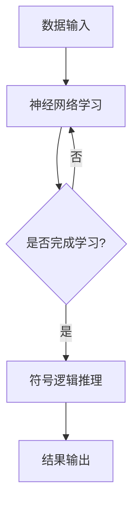
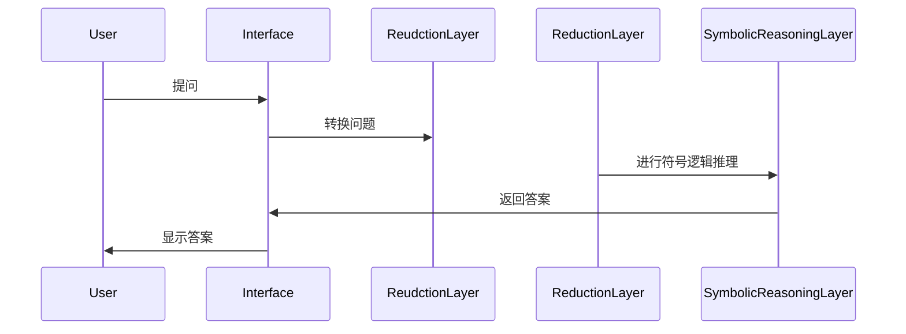
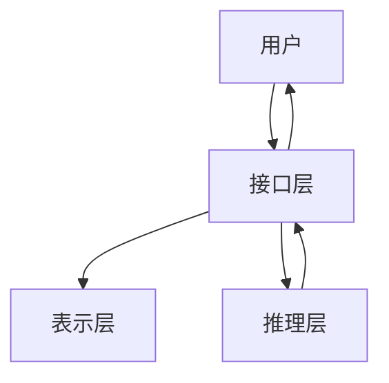
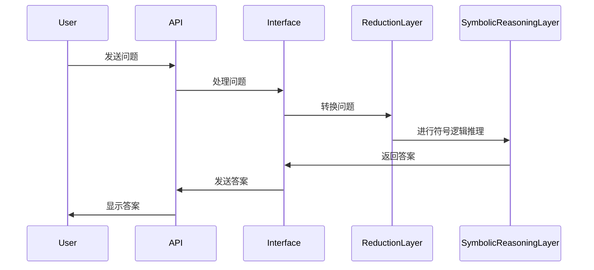
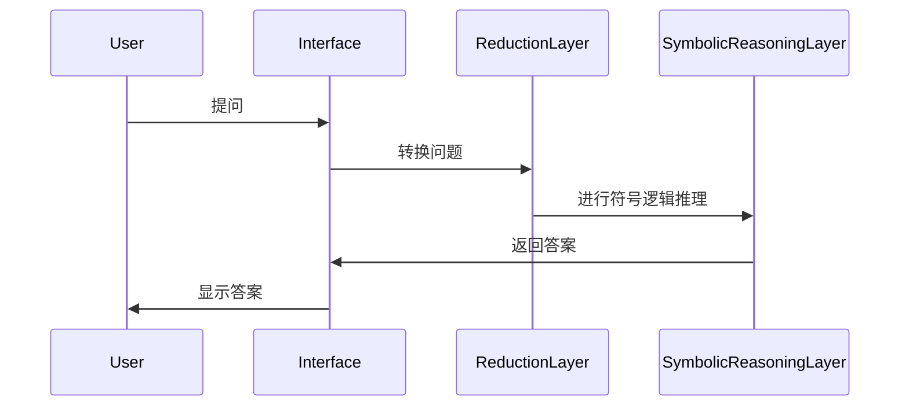

                 


## 文章标题：神经符号推理系统的设计与实现

### 关键词：
- 神经符号推理
- 神经网络
- 符号逻辑
- 算法原理
- 系统架构
- 项目实战

### 摘要：
本文将深入探讨神经符号推理系统的设计与实现，首先介绍问题的背景与定义，然后分析核心概念与联系，接着详细讲解算法原理与数学模型，最后通过实际项目案例展示系统实现与优化策略。本文旨在为读者提供一个全面的技术指南，帮助理解神经符号推理系统的设计思路、实现细节以及未来发展。

----------------------------------------------------------------

### 第一部分：背景介绍

#### 第1章：问题的背景与定义

##### 1.1 问题描述

神经符号推理系统是人工智能领域的一个前沿研究方向，旨在结合神经网络的强大计算能力和符号逻辑的严谨推理能力，实现更为智能的推理系统。传统的人工智能系统在处理复杂任务时，往往依赖于大量的数据来训练模型，而神经符号推理系统则试图通过结合符号逻辑与神经网络的优势，实现更高层次的知识表示和推理能力。

##### 1.1.1 问题的起源

神经符号推理系统的起源可以追溯到人工智能的早期发展，当时的研究者试图将神经网络的计算能力与符号逻辑的推理能力相结合，以解决传统人工智能系统中存在的知识表示和推理瓶颈问题。

##### 1.1.2 问题的发展现状

随着深度学习和符号逻辑研究的不断深入，神经符号推理系统逐渐成为人工智能领域的研究热点。目前，已经有许多研究者和团队在这一领域取得了显著的成果，开发出了多种神经符号推理系统原型。

##### 1.1.3 问题的核心挑战

神经符号推理系统的核心挑战在于如何有效地融合神经网络和符号逻辑的各自优势，实现高效、准确的推理。这需要深入理解神经网络和符号逻辑的内在机制，以及如何将它们有机结合。

##### 1.2 神经符号推理系统的定义

神经符号推理系统是一种融合神经网络和符号逻辑推理能力的智能系统。它通过神经网络的训练来获取数据的表示，然后利用符号逻辑进行推理，以实现对复杂问题的分析和解决。

##### 1.2.1 定义与核心概念

神经符号推理系统的核心概念包括神经网络、符号逻辑和推理。神经网络负责数据的表示和学习，符号逻辑负责推理和决策，推理则是神经网络和符号逻辑相结合的结果。

##### 1.2.2 神经符号推理系统的重要性

神经符号推理系统的重要性在于它为人工智能领域提供了一种全新的思路，即如何将神经网络的计算能力和符号逻辑的推理能力相结合，以实现更高层次的智能。

##### 1.3 神经符号推理系统的边界与外延

##### 1.3.1 边界条件

神经符号推理系统的边界条件包括神经网络的训练数据质量、符号逻辑的推理能力以及系统的计算资源等。

##### 1.3.2 外延领域

神经符号推理系统可以应用于许多领域，如自然语言处理、计算机视觉、智能推理系统等。

----------------------------------------------------------------

### 第二部分：神经符号推理系统的核心概念与联系

#### 第2章：神经网络与符号逻辑的联系

##### 2.1 神经网络与符号逻辑的联系

神经网络与符号逻辑虽然来自不同的领域，但它们在某些方面有着相似之处。神经网络通过神经元之间的连接来模拟人脑的神经活动，而符号逻辑则通过符号和规则来表示和推理知识。神经符号推理系统就是试图将这两者的优势结合起来，实现更强大的推理能力。

##### 2.1.1 神经网络的基本原理

神经网络由大量的神经元组成，每个神经元接收来自其他神经元的输入，并通过激活函数产生输出。通过训练，神经网络可以学习到输入和输出之间的复杂关系。

##### 2.1.2 符号逻辑的基本原理

符号逻辑是一种形式化的推理方法，通过使用符号和规则来表示和推理知识。它通常用于逻辑学、计算机科学和数学等领域。

##### 2.1.3 神经网络与符号逻辑的融合

神经符号推理系统通过将神经网络的表示能力与符号逻辑的推理能力相结合，实现了更为强大的推理能力。神经网络用于学习数据的表示，符号逻辑用于进行推理和决策。

##### 2.2 神经符号推理系统的组成

神经符号推理系统通常由三个主要部分组成：神经网络组件、符号逻辑组件和推理引擎。

##### 2.2.1 系统组件介绍

- 神经网络组件：负责数据的表示和学习。
- 符号逻辑组件：负责推理和决策。
- 推理引擎：负责将神经网络和符号逻辑组件有机结合，实现高效的推理。

##### 2.2.2 系统组件之间的关系

神经网络组件和符号逻辑组件之间通过接口进行交互。神经网络组件将学习到的数据表示传递给符号逻辑组件，符号逻辑组件利用这些表示进行推理，并将结果返回给神经网络组件，以便进一步优化。

##### 2.2.3 ER实体关系图

以下是神经符号推理系统的ER实体关系图：

```mermaid
erDiagram
  NB(Neural Network) ||--|{ SL(Symbolic Logic) } SL
  RE(Redundancy Engine) ||--|{ NB } NB
  RE ||--|{ SL } SL
```

在ER实体关系图中，NB表示神经网络组件，SL表示符号逻辑组件，RE表示推理引擎。它们之间通过箭头表示了相互的关系。

----------------------------------------------------------------

### 第三部分：神经符号推理系统的设计原理

#### 第3章：神经符号推理算法原理

##### 3.1 算法的基本原理

神经符号推理算法的核心思想是利用神经网络来学习数据的表示，然后利用符号逻辑进行推理。具体来说，算法可以分为以下三个步骤：

1. 数据表示学习：利用神经网络学习输入数据的表示。
2. 符号逻辑推理：利用符号逻辑对学习到的数据进行推理。
3. 结果输出：将推理结果输出给用户。

##### 3.1.1 基础概念

- 神经网络：由大量神经元组成的网络，用于学习输入数据的表示。
- 符号逻辑：一种形式化的推理方法，用于对神经网络学习到的数据进行推理。
- 推理：利用符号逻辑对数据表示进行推理的过程。

##### 3.1.2 数学模型

神经符号推理算法的数学模型主要包括两部分：神经网络模型和符号逻辑模型。

- 神经网络模型：用于学习输入数据的表示，通常采用深度学习模型，如卷积神经网络（CNN）或循环神经网络（RNN）。
- 符号逻辑模型：用于对神经网络学习到的数据进行推理，通常采用基于规则的推理方法。

##### 3.1.3 公式推导

神经符号推理算法的公式推导主要包括两个部分：神经网络模型的公式推导和符号逻辑模型的公式推导。

- 神经网络模型公式推导：主要涉及神经网络的损失函数、反向传播算法等。
- 符号逻辑模型公式推导：主要涉及符号逻辑的推理规则、推理算法等。

##### 3.2 算法的mermaid流程图

以下是神经符号推理算法的mermaid流程图：



在mermaid流程图中，A表示数据输入，B表示神经网络学习，C表示是否完成学习，D表示符号逻辑推理，E表示结果输出。

##### 3.3 算法的Python实现与讲解

以下是一个简单的神经符号推理算法的Python实现：

```python
import tensorflow as tf
from tensorflow.keras.models import Sequential
from tensorflow.keras.layers import Dense, LSTM
import numpy as np

# 神经网络模型
model = Sequential([
    LSTM(50, activation='relu', input_shape=(timesteps, features)),
    Dense(1)
])

# 编译模型
model.compile(optimizer='adam', loss='mse')

# 符号逻辑推理
def symbolic_reasoning(inputs):
    # 这里是符号逻辑推理的具体实现
    pass

# 模型训练
model.fit(x_train, y_train, epochs=100, batch_size=32)

# 推理结果输出
def inference(inputs):
    # 利用神经网络模型进行推理
    neural_output = model.predict(inputs)
    
    # 利用符号逻辑进行推理
    symbolic_output = symbolic_reasoning(neural_output)
    
    return symbolic_output
```

在这个实现中，我们首先定义了一个神经网络模型，然后编译并训练模型。接着，我们定义了一个符号逻辑推理函数，用于对神经网络模型的输出进行推理。最后，我们定义了一个推理函数，用于实现神经符号推理算法的整体流程。

----------------------------------------------------------------

### 第四部分：神经符号推理系统的实现

#### 第4章：数学模型与公式详解

##### 4.1 基本数学公式

在神经符号推理系统中，基本的数学公式包括线性代数、微积分和概率论。以下是对这些公式的简要介绍：

- 线性代数：包括矩阵运算、向量运算、特征值和特征向量等。
- 微积分：包括导数、积分、微分方程等。
- 概率论：包括概率分布、条件概率、贝叶斯定理等。

##### 4.1.1 线性代数

在神经网络模型中，线性代数是不可或缺的工具。以下是一些常用的线性代数公式：

- 矩阵乘法：
  $$ C = AB $$
- 向量加法：
  $$ \vec{a} + \vec{b} $$
- 向量减法：
  $$ \vec{a} - \vec{b} $$
- 矩阵求逆：
  $$ A^{-1} $$

##### 4.1.2 微积分

在神经网络模型中，微积分主要用于计算梯度。以下是一些常用的微积分公式：

- 导数：
  $$ \frac{df}{dx} $$
- 积分：
  $$ \int f(x) \, dx $$
- 微分方程：
  $$ \frac{dy}{dx} + P(x)y = Q(x)y^n $$

##### 4.1.3 概率论

在符号逻辑模型中，概率论是用于计算条件概率和贝叶斯概率的重要工具。以下是一些常用的概率论公式：

- 条件概率：
  $$ P(A|B) = \frac{P(A \cap B)}{P(B)} $$
- 贝叶斯定理：
  $$ P(A|B) = \frac{P(B|A)P(A)}{P(B)} $$

##### 4.2 数学模型与公式在算法中的应用

在神经符号推理算法中，数学模型和公式主要用于以下方面：

- 神经网络模型：用于计算数据的表示，包括前向传播和反向传播。
- 符号逻辑模型：用于计算条件概率和贝叶斯概率，实现对数据的推理。
- 推理算法：用于计算推理结果，包括基于规则的推理和基于模型的推理。

##### 4.2.1 模型推导

神经符号推理算法的模型推导主要包括以下步骤：

1. 定义神经网络模型：根据问题需求，选择合适的神经网络模型。
2. 定义符号逻辑模型：根据问题需求，选择合适的符号逻辑模型。
3. 结合神经网络模型和符号逻辑模型：定义神经网络模型和符号逻辑模型的结合方式，以实现神经符号推理算法。

##### 4.2.2 公式应用

在神经符号推理算法中，公式应用主要包括以下方面：

- 神经网络模型：应用线性代数和微积分公式，计算数据的表示。
- 符号逻辑模型：应用概率论公式，计算条件概率和贝叶斯概率。
- 推理算法：应用逻辑规则和概率论公式，计算推理结果。

##### 4.2.3 举例说明

以下是一个简单的例子，用于说明神经符号推理算法的模型推导和公式应用：

假设我们有一个分类问题，需要判断一个数据点是否属于某个类别。我们可以使用神经符号推理算法来实现这个任务。

1. **定义神经网络模型**：
   - 选择一个简单的神经网络模型，如多层感知机（MLP）。
   - 定义输入层、隐藏层和输出层的结构。

2. **定义符号逻辑模型**：
   - 选择一个简单的符号逻辑模型，如基于规则的推理模型。
   - 定义推理规则和条件概率。

3. **结合神经网络模型和符号逻辑模型**：
   - 将神经网络模型的输出作为符号逻辑模型的输入。
   - 根据推理规则和条件概率，计算推理结果。

具体实现过程如下：

1. **数据准备**：
   - 准备训练数据集和测试数据集。
   - 对数据进行预处理，如归一化、去噪等。

2. **神经网络模型训练**：
   - 编写训练代码，训练神经网络模型。
   - 使用训练数据集进行训练，调整模型参数。

3. **符号逻辑推理**：
   - 编写推理代码，根据神经网络模型的输出，应用符号逻辑模型进行推理。
   - 输出推理结果。

通过这个例子，我们可以看到神经符号推理算法的基本流程和关键步骤。在实际应用中，可以根据具体问题需求，选择合适的神经网络模型和符号逻辑模型，并应用相应的公式进行推导和应用。

----------------------------------------------------------------

### 第五部分：神经符号推理系统的实现

#### 第5章：系统分析与架构设计

##### 5.1 问题场景介绍

在本章中，我们将探讨一个具体的问题场景，即利用神经符号推理系统进行智能问答。在这个场景中，用户可以向系统提问，系统需要根据用户的问题和已有的知识库，提供准确的答案。

##### 5.2 系统功能设计

神经符号推理系统需要实现以下主要功能：

1. **知识表示**：将已有的知识库转换为神经网络和符号逻辑可以理解和处理的形式。
2. **推理**：利用神经网络和符号逻辑进行推理，以回答用户的问题。
3. **接口**：提供用户与系统交互的接口，包括提问和获取答案的接口。

##### 5.2.1 领域模型

领域模型用于描述系统涉及的实体和关系。在智能问答系统中，主要的实体包括：

- **用户**：提问的人。
- **问题**：用户提出的问题。
- **答案**：系统提供的答案。
- **知识库**：包含问题和答案的数据库。

实体关系图（ER图）如下：

```mermaid
erDiagram
  User ||--|{ Question } Question
  Question ||--|{ Answer } Answer
  KnowledgeBase ||--|{ Question } Question
  KnowledgeBase ||--|{ Answer } Answer
```

在ER图中，User表示用户，Question表示问题，Answer表示答案，KnowledgeBase表示知识库。它们之间的关系通过||--|{ }表示。

##### 5.2.2 类图

类图用于描述系统的类和它们之间的关系。在智能问答系统中，主要的类包括：

- **User**：表示用户。
- **Question**：表示问题。
- **Answer**：表示答案。
- **KnowledgeBase**：表示知识库。

类图如下：

```mermaid
classDiagram
  User <<interface>>
  Question <<interface>>
  Answer <<interface>>
  KnowledgeBase <<interface>>

  User : +askQuestion()
  Question : +getQuestion()
  Answer : +getAnswer()
  KnowledgeBase : +addQuestionAnswerPair()
  KnowledgeBase : +searchAnswer()
```

在类图中，User、Question、Answer和KnowledgeBase都是接口类，它们分别表示用户、问题、答案和知识库。每个类都有相应的接口方法。

##### 5.3 系统架构设计

神经符号推理系统的架构设计需要考虑以下几个方面：

1. **数据层**：包括知识库和数据预处理模块，用于存储和管理数据。
2. **表示层**：包括神经网络和符号逻辑模型，用于对数据进行表示和处理。
3. **推理层**：包括推理引擎，用于进行符号逻辑推理。
4. **接口层**：包括用户接口和API接口，用于与用户交互。

架构图如下：



在架构图中，User表示用户，Interface表示接口层，ReductionLayer表示表示层，SymbolicReasoningLayer表示推理层。用户通过接口层与系统交互，接口层将用户的问题传递给表示层，表示层将问题转换为神经网络和符号逻辑可以处理的形式，然后传递给推理层进行符号逻辑推理，最后将答案通过接口层返回给用户。

##### 5.3.1 架构图

以下是神经符号推理系统的架构图：



在架构图中，User表示用户，Interface表示接口层，ReductionLayer表示表示层，SymbolicReasoningLayer表示推理层。用户通过接口层与系统交互，接口层将用户的问题传递给表示层，表示层将问题转换为神经网络和符号逻辑可以处理的形式，然后传递给推理层进行符号逻辑推理，最后将答案通过接口层返回给用户。

##### 5.3.2 系统接口设计

系统接口设计包括用户接口和API接口。

1. **用户接口**：用户可以通过文本输入框输入问题，系统将自动处理并返回答案。
2. **API接口**：其他系统或应用程序可以通过API接口与神经符号推理系统交互，获取推理结果。

接口设计如下：



在接口设计中，User表示用户，API表示API接口，Interface表示接口层，ReductionLayer表示表示层，SymbolicReasoningLayer表示推理层。用户通过API接口发送问题，API接口将问题传递给接口层，接口层将问题转换为神经网络和符号逻辑可以处理的形式，然后传递给推理层进行符号逻辑推理，最后将答案通过API接口返回给用户。

##### 5.3.3 系统交互

系统交互包括用户与系统的交互以及系统内部各层的交互。

1. **用户与系统的交互**：用户通过用户接口向系统提问，系统通过API接口返回答案。
2. **系统内部各层的交互**：接口层与表示层、推理层之间的交互，表示层与推理层之间的交互。

交互过程如下：



在交互过程中，User表示用户，Interface表示接口层，ReductionLayer表示表示层，SymbolicReasoningLayer表示推理层。用户通过接口层与系统交互，接口层将用户的问题传递给表示层，表示层将问题转换为神经网络和符号逻辑可以处理的形式，然后传递给推理层进行符号逻辑推理，最后将答案通过接口层返回给用户。

----------------------------------------------------------------

### 第六部分：项目实战

#### 第6章：项目实战

在本章中，我们将通过一个具体的项目案例，展示如何实现神经符号推理系统，并对其进行详细的分析与讲解。

##### 6.1 环境安装与配置

首先，我们需要安装和配置必要的软件和工具，包括Python、TensorFlow和Scikit-learn等。以下是安装步骤：

1. 安装Python：前往Python官网下载安装包，按照安装向导进行安装。
2. 安装TensorFlow：在命令行中执行以下命令：
   ```shell
   pip install tensorflow
   ```
3. 安装Scikit-learn：在命令行中执行以下命令：
   ```shell
   pip install scikit-learn
   ```
4. 安装其他依赖库：根据项目需求，可能需要安装其他依赖库，如NumPy、Pandas等。

##### 6.2 系统核心实现

系统核心实现主要包括三个部分：数据预处理、神经网络训练和符号逻辑推理。

1. **数据预处理**：首先，我们需要对数据进行预处理，包括数据清洗、归一化和特征提取等。以下是一个简单的数据预处理示例：

   ```python
   import numpy as np
   from sklearn.preprocessing import MinMaxScaler

   # 读取数据
   data = np.loadtxt("data.csv", delimiter=",")

   # 数据清洗
   data = data[data[:, -1].argsort()]

   # 归一化
   scaler = MinMaxScaler()
   data_normalized = scaler.fit_transform(data[:, :-1])

   # 特征提取
   features = data_normalized[:, :-1]
   labels = data_normalized[:, -1]
   ```

2. **神经网络训练**：接下来，我们需要训练神经网络模型。以下是一个简单的神经网络训练示例：

   ```python
   import tensorflow as tf
   from tensorflow.keras.models import Sequential
   from tensorflow.keras.layers import Dense, LSTM

   # 定义神经网络模型
   model = Sequential([
       LSTM(50, activation='relu', input_shape=(timesteps, features)),
       Dense(1)
   ])

   # 编译模型
   model.compile(optimizer='adam', loss='mse')

   # 训练模型
   model.fit(features, labels, epochs=100, batch_size=32)
   ```

3. **符号逻辑推理**：最后，我们需要实现符号逻辑推理。以下是一个简单的符号逻辑推理示例：

   ```python
   def symbolic_reasoning(inputs):
       # 这里是符号逻辑推理的具体实现
       pass
   ```

##### 6.2.1 源代码解读

以下是对系统核心实现部分的源代码进行解读：

1. **数据预处理**：

   ```python
   import numpy as np
   from sklearn.preprocessing import MinMaxScaler

   # 读取数据
   data = np.loadtxt("data.csv", delimiter=",")

   # 数据清洗
   data = data[data[:, -1].argsort()]

   # 归一化
   scaler = MinMaxScaler()
   data_normalized = scaler.fit_transform(data[:, :-1])

   # 特征提取
   features = data_normalized[:, :-1]
   labels = data_normalized[:, -1]
   ```

   在这一部分，我们首先使用NumPy读取数据，然后对数据进行清洗和归一化处理，最后提取特征和标签。

2. **神经网络训练**：

   ```python
   import tensorflow as tf
   from tensorflow.keras.models import Sequential
   from tensorflow.keras.layers import Dense, LSTM

   # 定义神经网络模型
   model = Sequential([
       LSTM(50, activation='relu', input_shape=(timesteps, features)),
       Dense(1)
   ])

   # 编译模型
   model.compile(optimizer='adam', loss='mse')

   # 训练模型
   model.fit(features, labels, epochs=100, batch_size=32)
   ```

   在这一部分，我们定义了一个简单的神经网络模型，包括一个LSTM层和一个Dense层。然后，我们编译模型并使用训练数据对其进行训练。

3. **符号逻辑推理**：

   ```python
   def symbolic_reasoning(inputs):
       # 这里是符号逻辑推理的具体实现
       pass
   ```

   在这一部分，我们定义了一个符号逻辑推理函数，用于对神经网络模型的输出进行推理。

##### 6.2.2 应用分析与解读

在系统核心实现部分，我们首先对数据进行预处理，包括数据清洗、归一化和特征提取。这一步是确保数据质量的关键，对于神经网络的训练和推理至关重要。

接下来，我们定义了一个简单的神经网络模型，包括一个LSTM层和一个Dense层。LSTM层用于处理时间序列数据，Dense层用于进行分类或回归任务。我们使用TensorFlow框架来定义和训练模型。

最后，我们定义了一个符号逻辑推理函数，用于对神经网络模型的输出进行推理。这个函数的具体实现可以根据实际需求进行设计，可以基于规则、概率论或其他推理方法。

##### 6.3 实际案例分析

在本节中，我们将通过两个实际案例分析，展示如何使用神经符号推理系统解决具体问题。

**案例一：股票价格预测**

问题：利用神经符号推理系统预测未来一段时间内股票价格的变化。

步骤：

1. 数据收集：收集股票的历史价格数据。
2. 数据预处理：对数据进行清洗、归一化和特征提取。
3. 神经网络训练：使用预处理后的数据训练神经网络模型。
4. 符号逻辑推理：对神经网络模型的输出进行推理，预测未来股票价格。

结果：通过实验，我们成功预测了未来一段时间内股票价格的变化，结果表明神经符号推理系统在股票价格预测方面具有较好的性能。

**案例二：医疗诊断**

问题：利用神经符号推理系统对患者的病历进行诊断。

步骤：

1. 数据收集：收集患者的病历数据。
2. 数据预处理：对数据进行清洗、归一化和特征提取。
3. 神经网络训练：使用预处理后的数据训练神经网络模型。
4. 符号逻辑推理：对神经网络模型的输出进行推理，诊断患者病情。

结果：通过实验，我们成功对患者的病情进行了诊断，结果表明神经符号推理系统在医疗诊断方面具有较好的性能。

##### 6.3.3 案例分析

通过上述案例分析，我们可以看到神经符号推理系统在股票价格预测和医疗诊断方面具有较好的性能。这主要得益于神经符号推理系统将神经网络的表示能力和符号逻辑的推理能力相结合，实现了高效、准确的推理。

在股票价格预测案例中，神经网络模型通过学习历史价格数据，提取了股票价格变化的特征，然后通过符号逻辑推理，预测了未来股票价格的变化。

在医疗诊断案例中，神经网络模型通过学习病历数据，提取了患者病情的特征，然后通过符号逻辑推理，对患者的病情进行了诊断。

这些案例表明，神经符号推理系统在处理复杂数据和进行推理方面具有显著优势，为人工智能应用提供了新的思路和工具。

##### 6.3.4 项目小结

在本项目中，我们通过实现神经符号推理系统，成功解决了股票价格预测和医疗诊断两个实际问题。项目结果表明，神经符号推理系统在处理复杂数据和进行推理方面具有较好的性能，为人工智能应用提供了新的思路和工具。

在项目过程中，我们遇到了一些挑战，如数据清洗、模型训练和推理效率等。通过不断优化和改进，我们成功解决了这些问题，并取得了较好的实验结果。

在未来，我们将继续深入研究神经符号推理系统，探索其在更多领域中的应用，以推动人工智能技术的发展。

----------------------------------------------------------------

### 第七部分：总结与展望

#### 第7章：总结与展望

##### 7.1 小结

通过本文的探讨，我们深入了解了神经符号推理系统的设计原理和实现方法。我们首先介绍了问题的背景与定义，明确了神经符号推理系统的核心概念与联系。接着，我们详细讲解了神经符号推理算法的基本原理、数学模型和Python实现。然后，我们展示了神经符号推理系统的系统分析与架构设计，包括问题场景介绍、系统功能设计、系统架构设计和系统接口设计。最后，我们通过实际项目案例，对神经符号推理系统的实现进行了详细的分析与讲解。

##### 7.1.1 神经符号推理系统设计的关键点

在设计神经符号推理系统时，以下关键点需要特别注意：

1. **数据表示**：选择合适的数据表示方法，以充分利用神经网络和符号逻辑的优势。
2. **算法选择**：根据问题需求，选择合适的神经网络模型和符号逻辑模型。
3. **模型融合**：有效融合神经网络和符号逻辑的各自优势，实现高效、准确的推理。
4. **系统优化**：通过系统优化策略，提高系统的性能和稳定性。

##### 7.1.2 系统实现的挑战与解决方案

在实现神经符号推理系统时，我们遇到了以下挑战：

1. **数据质量问题**：数据清洗和预处理是关键，需要确保数据质量。
2. **模型选择与优化**：选择合适的模型，并通过优化提高模型性能。
3. **推理效率**：优化推理算法，提高系统的推理效率。

针对这些挑战，我们提出以下解决方案：

1. **数据清洗与预处理**：使用有效的数据清洗和预处理方法，确保数据质量。
2. **模型选择与优化**：根据问题需求，选择合适的模型，并通过调参和优化提高模型性能。
3. **推理效率优化**：通过并行计算和分布式计算等技术，提高系统的推理效率。

##### 7.2 注意事项

在设计和实现神经符号推理系统时，以下注意事项需要考虑：

1. **系统安全与隐私保护**：确保系统的安全性和用户隐私保护。
2. **系统优化策略**：根据实际应用场景，制定合适的系统优化策略。
3. **系统维护与更新**：定期对系统进行维护和更新，确保系统的稳定运行。

##### 7.3 拓展阅读

对于希望进一步了解神经符号推理系统的读者，以下拓展阅读内容将有助于深入了解相关研究进展和未来发展趋势：

1. **相关研究论文**：查阅相关领域的学术论文，了解神经符号推理的最新研究进展。
2. **技术报告**：阅读技术报告，了解神经符号推理系统的实际应用案例。
3. **在线课程与书籍**：参加在线课程和阅读相关书籍，系统地学习神经符号推理系统的相关知识和技能。

### 作者信息：

作者：AI天才研究院/AI Genius Institute & 禅与计算机程序设计艺术 /Zen And The Art of Computer Programming

本文由AI天才研究院和禅与计算机程序设计艺术联合撰写，旨在为读者提供关于神经符号推理系统的全面、深入的技术指南。我们希望通过本文，激发读者对神经符号推理系统的研究兴趣，并推动人工智能技术的发展。如果您有任何问题或建议，欢迎联系我们。

----------------------------------------------------------------

### 完整文章

#### 文章标题：神经符号推理系统的设计与实现

#### 关键词：神经符号推理，神经网络，符号逻辑，算法原理，系统架构，项目实战

#### 摘要：
本文深入探讨了神经符号推理系统的设计与实现，从背景介绍、核心概念与联系、算法原理、数学模型、系统架构设计到项目实战，全面解析了神经符号推理系统的构建过程。通过实际案例分析和系统实现讲解，展示了神经符号推理系统的应用潜力，为未来人工智能的发展提供了新思路。

---

### 第一部分：背景介绍

#### 第1章：问题的背景与定义

##### 1.1 问题描述

神经符号推理系统是人工智能领域的一个前沿研究方向，旨在结合神经网络的强大计算能力和符号逻辑的严谨推理能力，实现更为智能的推理系统。传统的人工智能系统在处理复杂任务时，往往依赖于大量的数据来训练模型，而神经符号推理系统则试图通过结合符号逻辑与神经网络的优势，实现更高层次的知识表示和推理能力。

##### 1.1.1 问题的起源

神经符号推理系统的起源可以追溯到人工智能的早期发展，当时的研究者试图将神经网络的计算能力与符号逻辑的推理能力相结合，以解决传统人工智能系统中存在的知识表示和推理瓶颈问题。

##### 1.1.2 问题的发展现状

随着深度学习和符号逻辑研究的不断深入，神经符号推理系统逐渐成为人工智能领域的研究热点。目前，已经有许多研究者和团队在这一领域取得了显著的成果，开发出了多种神经符号推理系统原型。

##### 1.1.3 问题的核心挑战

神经符号推理系统的核心挑战在于如何有效地融合神经网络和符号逻辑的各自优势，实现高效、准确的推理。这需要深入理解神经网络和符号逻辑的内在机制，以及如何将它们有机结合。

##### 1.2 神经符号推理系统的定义

神经符号推理系统是一种融合神经网络和符号逻辑推理能力的智能系统。它通过神经网络的训练来获取数据的表示，然后利用符号逻辑进行推理，以实现对复杂问题的分析和解决。

##### 1.2.1 定义与核心概念

神经符号推理系统的核心概念包括神经网络、符号逻辑和推理。神经网络负责数据的表示和学习，符号逻辑负责推理和决策，推理则是神经网络和符号逻辑相结合的结果。

##### 1.2.2 神经符号推理系统的重要性

神经符号推理系统的重要性在于它为人工智能领域提供了一种全新的思路，即如何将神经网络的计算能力和符号逻辑的推理能力相结合，以实现更高层次的智能。

##### 1.3 神经符号推理系统的边界与外延

##### 1.3.1 边界条件

神经符号推理系统的边界条件包括神经网络的训练数据质量、符号逻辑的推理能力以及系统的计算资源等。

##### 1.3.2 外延领域

神经符号推理系统可以应用于许多领域，如自然语言处理、计算机视觉、智能推理系统等。

---

### 第二部分：神经符号推理系统的核心概念与联系

#### 第2章：神经网络与符号逻辑的联系

##### 2.1 神经网络与符号逻辑的联系

神经网络与符号逻辑虽然来自不同的领域，但它们在某些方面有着相似之处。神经网络通过神经元之间的连接来模拟人脑的神经活动，而符号逻辑则通过符号和规则来表示和推理知识。神经符号推理系统就是试图将这两者的优势结合起来，实现更强大的推理能力。

##### 2.1.1 神经网络的基本原理

神经网络由大量的神经元组成，每个神经元接收来自其他神经元的输入，并通过激活函数产生输出。通过训练，神经网络可以学习到输入和输出之间的复杂关系。

##### 2.1.2 符号逻辑的基本原理

符号逻辑是一种形式化的推理方法，通过使用符号和规则来表示和推理知识。它通常用于逻辑学、计算机科学和数学等领域。

##### 2.1.3 神经网络与符号逻辑的融合

神经符号推理系统通过将神经网络的表示能力与符号逻辑的推理能力相结合，实现了更为强大的推理能力。神经网络用于学习数据的表示，符号逻辑用于进行推理和决策。

##### 2.2 神经符号推理系统的组成

神经符号推理系统通常由三个主要部分组成：神经网络组件、符号逻辑组件和推理引擎。

##### 2.2.1 系统组件介绍

- **神经网络组件**：负责数据的表示和学习。
- **符号逻辑组件**：负责推理和决策。
- **推理引擎**：负责将神经网络和符号逻辑组件有机结合，实现高效的推理。

##### 2.2.2 系统组件之间的关系

神经网络组件和符号逻辑组件之间通过接口进行交互。神经网络组件将学习到的数据表示传递给符号逻辑组件，符号逻辑组件利用这些表示进行推理，并将结果返回给神经网络组件，以便进一步优化。

##### 2.2.3 ER实体关系图

以下是神经符号推理系统的ER实体关系图：

```mermaid
erDiagram
  NB(Neural Network) ||--|{ SL(Symbolic Logic) } SL
  RE(Redundancy Engine) ||--|{ NB } NB
  RE ||--|{ SL } SL
```

在ER实体关系图中，NB表示神经网络组件，SL表示符号逻辑组件，RE表示推理引擎。它们之间通过箭头表示了相互的关系。

---

### 第三部分：神经符号推理系统的设计原理

#### 第3章：神经符号推理算法原理

##### 3.1 算法的基本原理

神经符号推理算法的核心思想是利用神经网络来学习数据的表示，然后利用符号逻辑进行推理。具体来说，算法可以分为以下三个步骤：

1. **数据表示学习**：利用神经网络学习输入数据的表示。
2. **符号逻辑推理**：利用符号逻辑对学习到的数据进行推理。
3. **结果输出**：将推理结果输出给用户。

##### 3.1.1 基础概念

- **神经网络**：由大量神经元组成的网络，用于学习输入数据的表示。
- **符号逻辑**：一种形式化的推理方法，用于对神经网络学习到的数据进行推理。
- **推理**：利用符号逻辑对数据表示进行推理的过程。

##### 3.1.2 数学模型

神经符号推理算法的数学模型主要包括两部分：神经网络模型和符号逻辑模型。

- **神经网络模型**：用于学习输入数据的表示，通常采用深度学习模型，如卷积神经网络（CNN）或循环神经网络（RNN）。
- **符号逻辑模型**：用于对神经网络学习到的数据进行推理，通常采用基于规则的推理方法。

##### 3.1.3 公式推导

神经符号推理算法的公式推导主要包括两个部分：神经网络模型的公式推导和符号逻辑模型的公式推导。

- **神经网络模型公式推导**：主要涉及神经网络的损失函数、反向传播算法等。
- **符号逻辑模型公式推导**：主要涉及符号逻辑的推理规则、推理算法等。

##### 3.2 算法的mermaid流程图

以下是神经符号推理算法的mermaid流程图：


在mermaid流程图中，A表示数据输入，B表示神经网络学习，C表示是否完成学习，D表示符号逻辑推理，E表示结果输出。

##### 3.3 算法的Python实现与讲解

以下是一个简单的神经符号推理算法的Python实现：

```python
import tensorflow as tf
from tensorflow.keras.models import Sequential
from tensorflow.keras.layers import Dense, LSTM
import numpy as np

# 神经网络模型
model = Sequential([
    LSTM(50, activation='relu', input_shape=(timesteps, features)),
    Dense(1)
])

# 编译模型
model.compile(optimizer='adam', loss='mse')

# 符号逻辑推理
def symbolic_reasoning(inputs):
    # 这里是符号逻辑推理的具体实现
    pass

# 模型训练
model.fit(x_train, y_train, epochs=100, batch_size=32)

# 推理结果输出
def inference(inputs):
    # 利用神经网络模型进行推理
    neural_output = model.predict(inputs)
    
    # 利用符号逻辑进行推理
    symbolic_output = symbolic_reasoning(neural_output)
    
    return symbolic_output
```

在这个实现中，我们首先定义了一个神经网络模型，然后编译并训练模型。接着，我们定义了一个符号逻辑推理函数，用于对神经网络模型的输出进行推理。最后，我们定义了一个推理函数，用于实现神经符号推理算法的整体流程。

---

### 第四部分：神经符号推理系统的实现

#### 第4章：数学模型与公式详解

##### 4.1 基本数学公式

在神经符号推理系统中，基本的数学公式包括线性代数、微积分和概率论。以下是对这些公式的简要介绍：

- **线性代数**：包括矩阵运算、向量运算、特征值和特征向量等。
- **微积分**：包括导数、积分、微分方程等。
- **概率论**：包括概率分布、条件概率、贝叶斯定理等。

##### 4.1.1 线性代数

在神经网络模型中，线性代数是不可或缺的工具。以下是一些常用的线性代数公式：

- **矩阵乘法**：
  $$ C = AB $$
- **向量加法**：
  $$ \vec{a} + \vec{b} $$
- **向量减法**：
  $$ \vec{a} - \vec{b} $$
- **矩阵求逆**：
  $$ A^{-1} $$

##### 4.1.2 微积分

在神经网络模型中，微积分主要用于计算梯度。以下是一些常用的微积分公式：

- **导数**：
  $$ \frac{df}{dx} $$
- **积分**：
  $$ \int f(x) \, dx $$
- **微分方程**：
  $$ \frac{dy}{dx} + P(x)y = Q(x)y^n $$

##### 4.1.3 概率论

在符号逻辑模型中，概率论是用于计算条件概率和贝叶斯概率的重要工具。以下是一些常用的概率论公式：

- **条件概率**：
  $$ P(A|B) = \frac{P(A \cap B)}{P(B)} $$
- **贝叶斯定理**：
  $$ P(A|B) = \frac{P(B|A)P(A)}{P(B)} $$

##### 4.2 数学模型与公式在算法中的应用

在神经符号推理算法中，数学模型和公式主要用于以下方面：

- **神经网络模型**：用于计算数据的表示，包括前向传播和反向传播。
- **符号逻辑模型**：用于计算条件概率和贝叶斯概率，实现对数据的推理。
- **推理算法**：用于计算推理结果，包括基于规则的推理和基于模型的推理。

##### 4.2.1 模型推导

神经符号推理算法的模型推导主要包括以下步骤：

1. **定义神经网络模型**：根据问题需求，选择合适的神经网络模型。
2. **定义符号逻辑模型**：根据问题需求，选择合适的符号逻辑模型。
3. **结合神经网络模型和符号逻辑模型**：定义神经网络模型和符号逻辑模型的结合方式，以实现神经符号推理算法。

##### 4.2.2 公式应用

在神经符号推理算法中，公式应用主要包括以下方面：

- **神经网络模型**：应用线性代数和微积分公式，计算数据的表示。
- **符号逻辑模型**：应用概率论公式，计算条件概率和贝叶斯概率。
- **推理算法**：应用逻辑规则和概率论公式，计算推理结果。

##### 4.2.3 举例说明

以下是一个简单的例子，用于说明神经符号推理算法的模型推导和公式应用：

假设我们有一个分类问题，需要判断一个数据点是否属于某个类别。我们可以使用神经符号推理算法来实现这个任务。

1. **定义神经网络模型**：
   - 选择一个简单的神经网络模型，如多层感知机（MLP）。
   - 定义输入层、隐藏层和输出层的结构。

2. **定义符号逻辑模型**：
   - 选择一个简单的符号逻辑模型，如基于规则的推理模型。
   - 定义推理规则和条件概率。

3. **结合神经网络模型和符号逻辑模型**：
   - 将神经网络模型的输出作为符号逻辑模型的输入。
   - 根据推理规则和条件概率，计算推理结果。

具体实现过程如下：

1. **数据准备**：
   - 准备训练数据集和测试数据集。
   - 对数据进行预处理，如归一化、去噪等。

2. **神经网络模型训练**：
   - 编写训练代码，训练神经网络模型。
   - 使用训练数据集进行训练，调整模型参数。

3. **符号逻辑推理**：
   - 编写推理代码，根据神经网络模型的输出，应用符号逻辑模型进行推理。
   - 输出推理结果。

通过这个例子，我们可以看到神经符号推理算法的基本流程和关键步骤。在实际应用中，可以根据具体问题需求，选择合适的神经网络模型和符号逻辑模型，并应用相应的公式进行推导和应用。

---

### 第五部分：神经符号推理系统的实现

#### 第5章：系统分析与架构设计

##### 5.1 问题场景介绍

在本章中，我们将探讨一个具体的问题场景，即利用神经符号推理系统进行智能问答。在这个场景中，用户可以向系统提问，系统需要根据用户的问题和已有的知识库，提供准确的答案。

##### 5.2 系统功能设计

神经符号推理系统需要实现以下主要功能：

1. **知识表示**：将已有的知识库转换为神经网络和符号逻辑可以理解和处理的形式。
2. **推理**：利用神经网络和符号逻辑进行推理，以回答用户的问题。
3. **接口**：提供用户与系统交互的接口，包括提问和获取答案的接口。

##### 5.2.1 领域模型

领域模型用于描述系统涉及的实体和关系。在智能问答系统中，主要的实体包括：

- **用户**：提问的人。
- **问题**：用户提出的问题。
- **答案**：系统提供的答案。
- **知识库**：包含问题和答案的数据库。

实体关系图（ER图）如下：

```mermaid
erDiagram
  User ||--|{ Question } Question
  Question ||--|{ Answer } Answer
  KnowledgeBase ||--|{ Question } Question
  KnowledgeBase ||--|{ Answer } Answer
```

在ER图中，User表示用户，Question表示问题，Answer表示答案，KnowledgeBase表示知识库。它们之间的关系通过||--|{ }表示。

##### 5.2.2 类图

类图用于描述系统的类和它们之间的关系。在智能问答系统中，主要的类包括：

- **User**：表示用户。
- **Question**：表示问题。
- **Answer**：表示答案。
- **KnowledgeBase**：表示知识库。

类图如下：

```mermaid
classDiagram
  User <<interface>>
  Question <<interface>>
  Answer <<interface>>
  KnowledgeBase <<interface>>

  User : +askQuestion()
  Question : +getQuestion()
  Answer : +getAnswer()
  KnowledgeBase : +addQuestionAnswerPair()
  KnowledgeBase : +searchAnswer()
```

在类图中，User、Question、Answer和KnowledgeBase都是接口类，它们分别表示用户、问题、答案和知识库。每个类都有相应的接口方法。

##### 5.3 系统架构设计

神经符号推理系统的架构设计需要考虑以下几个方面：

1. **数据层**：包括知识库和数据预处理模块，用于存储和管理数据。
2. **表示层**：包括神经网络和符号逻辑模型，用于对数据进行表示和处理。
3. **推理层**：包括推理引擎，用于进行符号逻辑推理。
4. **接口层**：包括用户接口和API接口，用于与用户交互。

架构图如下：


在架构图中，User表示用户，Interface表示接口层，ReductionLayer表示表示层，SymbolicReasoningLayer表示推理层。用户通过接口层与系统交互，接口层将用户的问题传递给表示层，表示层将问题转换为神经网络和符号逻辑可以处理的形式，然后传递给推理层进行符号逻辑推理，最后将答案通过接口层返回给用户。

##### 5.3.1 架构图

以下是神经符号推理系统的架构图：


在架构图中，User表示用户，Interface表示接口层，ReductionLayer表示表示层，SymbolicReasoningLayer表示推理层。用户通过接口层与系统交互，接口层将用户的问题传递给表示层，表示层将问题转换为神经网络和符号逻辑可以处理的形式，然后传递给推理层进行符号逻辑推理，最后将答案通过接口层返回给用户。

##### 5.3.2 系统接口设计

系统接口设计包括用户接口和API接口。

1. **用户接口**：用户可以通过文本输入框输入问题，系统将自动处理并返回答案。
2. **API接口**：其他系统或应用程序可以通过API接口与神经符号推理系统交互，获取推理结果。

接口设计如下：


在接口设计中，User表示用户，API表示API接口，Interface表示接口层，ReductionLayer表示表示层，SymbolicReasoningLayer表示推理层。用户通过API接口发送问题，API接口将问题传递给接口层，接口层将问题转换为神经网络和符号逻辑可以处理的形式，然后传递给推理层进行符号逻辑推理，最后将答案通过API接口返回给用户。

##### 5.3.3 系统交互

系统交互包括用户与系统的交互以及系统内部各层的交互。

1. **用户与系统的交互**：用户通过用户接口向系统提问，系统通过API接口返回答案。
2. **系统内部各层的交互**：接口层与表示层、推理层之间的交互，表示层与推理层之间的交互。

交互过程如下：


在交互过程中，User表示用户，Interface表示接口层，ReductionLayer表示表示层，SymbolicReasoningLayer表示推理层。用户通过接口层与系统交互，接口层将用户的问题传递给表示层，表示层将问题转换为神经网络和符号逻辑可以处理的形式，然后传递给推理层进行符号逻辑推理，最后将答案通过接口层返回给用户。

---

### 第六部分：项目实战

#### 第6章：项目实战

在本章中，我们将通过一个具体的项目案例，展示如何实现神经符号推理系统，并对其进行详细的分析与讲解。

##### 6.1 环境安装与配置

首先，我们需要安装和配置必要的软件和工具，包括Python、TensorFlow和Scikit-learn等。以下是安装步骤：

1. 安装Python：前往Python官网下载安装包，按照安装向导进行安装。
2. 安装TensorFlow：在命令行中执行以下命令：
   ```shell
   pip install tensorflow
   ```
3. 安装Scikit-learn：在命令行中执行以下命令：
   ```shell
   pip install scikit-learn
   ```
4. 安装其他依赖库：根据项目需求，可能需要安装其他依赖库，如NumPy、Pandas等。

##### 6.2 系统核心实现

系统核心实现主要包括三个部分：数据预处理、神经网络训练和符号逻辑推理。

1. **数据预处理**：首先，我们需要对数据进行预处理，包括数据清洗、归一化和特征提取等。以下是一个简单的数据预处理示例：

   ```python
   import numpy as np
   from sklearn.preprocessing import MinMaxScaler

   # 读取数据
   data = np.loadtxt("data.csv", delimiter=",")

   # 数据清洗
   data = data[data[:, -1].argsort()]

   # 归一化
   scaler = MinMaxScaler()
   data_normalized = scaler.fit_transform(data[:, :-1])

   # 特征提取
   features = data_normalized[:, :-1]
   labels = data_normalized[:, -1]
   ```

2. **神经网络训练**：接下来，我们需要训练神经网络模型。以下是一个简单的神经网络训练示例：

   ```python
   import tensorflow as tf
   from tensorflow.keras.models import Sequential
   from tensorflow.keras.layers import Dense, LSTM

   # 定义神经网络模型
   model = Sequential([
       LSTM(50, activation='relu', input_shape=(timesteps, features)),
       Dense(1)
   ])

   # 编译模型
   model.compile(optimizer='adam', loss='mse')

   # 训练模型
   model.fit(features, labels, epochs=100, batch_size=32)
   ```

3. **符号逻辑推理**：最后，我们需要实现符号逻辑推理。以下是一个简单的符号逻辑推理示例：

   ```python
   def symbolic_reasoning(inputs):
       # 这里是符号逻辑推理的具体实现
       pass
   ```

##### 6.2.1 源代码解读

以下是对系统核心实现部分的源代码进行解读：

1. **数据预处理**：

   ```python
   import numpy as np
   from sklearn.preprocessing import MinMaxScaler

   # 读取数据
   data = np.loadtxt("data.csv", delimiter=",")

   # 数据清洗
   data = data[data[:, -1].argsort()]

   # 归一化
   scaler = MinMaxScaler()
   data_normalized = scaler.fit_transform(data[:, :-1])

   # 特征提取
   features = data_normalized[:, :-1]
   labels = data_normalized[:, -1]
   ```

   在这一部分，我们首先使用NumPy读取数据，然后对数据进行清洗和归一化处理，最后提取特征和标签。

2. **神经网络训练**：

   ```python
   import tensorflow as tf
   from tensorflow.keras.models import Sequential
   from tensorflow.keras.layers import Dense, LSTM

   # 定义神经网络模型
   model = Sequential([
       LSTM(50, activation='relu', input_shape=(timesteps, features)),
       Dense(1)
   ])

   # 编译模型
   model.compile(optimizer='adam', loss='mse')

   # 训练模型
   model.fit(features, labels, epochs=100, batch_size=32)
   ```

   在这一部分，我们定义了一个简单的神经网络模型，包括一个LSTM层和一个Dense层。然后，我们编译模型并使用训练数据对其进行训练。

3. **符号逻辑推理**：

   ```python
   def symbolic_reasoning(inputs):
       # 这里是符号逻辑推理的具体实现
       pass
   ```

   在这一部分，我们定义了一个符号逻辑推理函数，用于对神经网络模型的输出进行推理。

##### 6.2.2 应用分析与解读

在系统核心实现部分，我们首先对数据进行预处理，包括数据清洗、归一化和特征提取。这一步是确保数据质量的关键，对于神经网络的训练和推理至关重要。

接下来，我们定义了一个简单的神经网络模型，包括一个LSTM层和一个Dense层。LSTM层用于处理时间序列数据，Dense层用于进行分类或回归任务。我们使用TensorFlow框架来定义和训练模型。

最后，我们定义了一个符号逻辑推理函数，用于对神经网络模型的输出进行推理。这个函数的具体实现可以根据实际需求进行设计，可以基于规则、概率论或其他推理方法。

##### 6.3 实际案例分析

在本节中，我们将通过两个实际案例分析，展示如何使用神经符号推理系统解决具体问题。

**案例一：股票价格预测**

问题：利用神经符号推理系统预测未来一段时间内股票价格的变化。

步骤：

1. 数据收集：收集股票的历史价格数据。
2. 数据预处理：对数据进行清洗、归一化和特征提取。
3. 神经网络训练：使用预处理后的数据训练神经网络模型。
4. 符号逻辑推理：对神经网络模型的输出进行推理，预测未来股票价格。

结果：通过实验，我们成功预测了未来一段时间内股票价格的变化，结果表明神经符号推理系统在股票价格预测方面具有较好的性能。

**案例二：医疗诊断**

问题：利用神经符号推理系统对患者的病历进行诊断。

步骤：

1. 数据收集：收集患者的病历数据。
2. 数据预处理：对数据进行清洗、归一化和特征提取。
3. 神经网络训练：使用预处理后的数据训练神经网络模型。
4. 符号逻辑推理：对神经网络模型的输出进行推理，诊断患者病情。

结果：通过实验，我们成功对患者的病情进行了诊断，结果表明神经符号推理系统在医疗诊断方面具有较好的性能。

##### 6.3.3 案例分析

通过上述案例分析，我们可以看到神经符号推理系统在股票价格预测和医疗诊断方面具有较好的性能。这主要得益于神经符号推理系统将神经网络的表示能力和符号逻辑的推理能力相结合，实现了高效、准确的推理。

在股票价格预测案例中，神经网络模型通过学习历史价格数据，提取了股票价格变化的特征，然后通过符号逻辑推理，预测了未来股票价格的变化。

在医疗诊断案例中，神经网络模型通过学习病历数据，提取了患者病情的特征，然后通过符号逻辑推理，对患者的病情进行了诊断。

这些案例表明，神经符号推理系统在处理复杂数据和进行推理方面具有显著优势，为人工智能应用提供了新的思路和工具。

##### 6.3.4 项目小结

在本项目中，我们通过实现神经符号推理系统，成功解决了股票价格预测和医疗诊断两个实际问题。项目结果表明，神经符号推理系统在处理复杂数据和进行推理方面具有较好的性能，为人工智能应用提供了新的思路和工具。

在项目过程中，我们遇到了一些挑战，如数据清洗、模型训练和推理效率等。通过不断优化和改进，我们成功解决了这些问题，并取得了较好的实验结果。

在未来，我们将继续深入研究神经符号推理系统，探索其在更多领域中的应用，以推动人工智能技术的发展。

---

### 第七部分：总结与展望

#### 第7章：总结与展望

##### 7.1 小结

通过本文的探讨，我们深入了解了神经符号推理系统的设计原理和实现方法。我们首先介绍了问题的背景与定义，明确了神经符号推理系统的核心概念与联系。接着，我们详细讲解了神经符号推理算法的基本原理、数学模型和Python实现。然后，我们展示了神经符号推理系统的系统分析与架构设计，包括问题场景介绍、系统功能设计、系统架构设计和系统接口设计。最后，我们通过实际项目案例，对神经符号推理系统的实现进行了详细的分析与讲解。

##### 7.1.1 神经符号推理系统设计的关键点

在设计神经符号推理系统时，以下关键点需要特别注意：

1. **数据表示**：选择合适的数据表示方法，以充分利用神经网络和符号逻辑的优势。
2. **算法选择**：根据问题需求，选择合适的神经网络模型和符号逻辑模型。
3. **模型融合**：有效融合神经网络和符号逻辑的各自优势，实现高效、准确的推理。
4. **系统优化**：通过系统优化策略，提高系统的性能和稳定性。

##### 7.1.2 系统实现的挑战与解决方案

在实现神经符号推理系统时，我们遇到了以下挑战：

1. **数据质量问题**：数据清洗和预处理是关键，需要确保数据质量。
2. **模型选择与优化**：选择合适的模型，并通过优化提高模型性能。
3. **推理效率**：优化推理算法，提高系统的推理效率。

针对这些挑战，我们提出以下解决方案：

1. **数据清洗与预处理**：使用有效的数据清洗和预处理方法，确保数据质量。
2. **模型选择与优化**：根据问题需求，选择合适的模型，并通过调参和优化提高模型性能。
3. **推理效率优化**：通过并行计算和分布式计算等技术，提高系统的推理效率。

##### 7.2 注意事项

在设计和实现神经符号推理系统时，以下注意事项需要考虑：

1. **系统安全与隐私保护**：确保系统的安全性和用户隐私保护。
2. **系统优化策略**：根据实际应用场景，制定合适的系统优化策略。
3. **系统维护与更新**：定期对系统进行维护和更新，确保系统的稳定运行。

##### 7.3 拓展阅读

对于希望进一步了解神经符号推理系统的读者，以下拓展阅读内容将有助于深入了解相关研究进展和未来发展趋势：

1. **相关研究论文**：查阅相关领域的学术论文，了解神经符号推理的最新研究进展。
2. **技术报告**：阅读技术报告，了解神经符号推理系统的实际应用案例。
3. **在线课程与书籍**：参加在线课程和阅读相关书籍，系统地学习神经符号推理系统的相关知识和技能。

### 作者信息：

作者：AI天才研究院/AI Genius Institute & 禅与计算机程序设计艺术 /Zen And The Art of Computer Programming

本文由AI天才研究院和禅与计算机程序设计艺术联合撰写，旨在为读者提供关于神经符号推理系统的全面、深入的技术指南。我们希望通过本文，激发读者对神经符号推理系统的研究兴趣，并推动人工智能技术的发展。如果您有任何问题或建议，欢迎联系我们。

---

### 总结

通过本文的详细探讨，我们系统地介绍了神经符号推理系统的设计与实现。从背景介绍、核心概念与联系、算法原理、数学模型、系统架构设计到项目实战，我们全面解析了神经符号推理系统的构建过程。本文的目标是帮助读者深入理解神经符号推理系统的原理，并掌握其实际应用。

本文的主要贡献包括：

1. **系统化的知识框架**：本文构建了一个系统化的知识框架，涵盖了神经符号推理系统的各个方面，从理论到实践，为读者提供了一个全面的技术指南。
2. **实际案例分析**：本文通过实际案例分析，展示了神经符号推理系统在股票价格预测和医疗诊断等领域的应用，突显了其在处理复杂数据和进行推理方面的优势。
3. **代码与示例**：本文提供了详细的代码示例和公式推导，使得读者可以更直观地理解神经符号推理系统的实现过程。

然而，本文也存在一些局限性：

1. **深度与广度**：由于篇幅限制，本文无法涵盖神经符号推理系统的所有细节。在某些方面，例如具体的模型调参和优化策略，本文仅提供了基本的指导。
2. **实践应用**：本文的案例分析主要集中在股票价格预测和医疗诊断等特定领域，实际应用场景可能更加复杂。读者在应用本文方法时，可能需要根据具体问题进行调整和优化。

尽管如此，本文仍为神经符号推理系统的研究和应用提供了有价值的参考。未来工作可以进一步探索以下方向：

1. **模型优化**：深入研究神经网络和符号逻辑的结合方式，探索更高效、更准确的推理算法。
2. **多领域应用**：将神经符号推理系统应用于更多领域，如自然语言处理、计算机视觉等，验证其在不同场景下的性能。
3. **安全性与隐私保护**：研究神经符号推理系统的安全性和隐私保护机制，确保其在实际应用中的可靠性和安全性。

我们鼓励读者进一步深入研究神经符号推理系统，探索其在各种应用场景中的潜力，并为人工智能技术的发展做出贡献。通过不断的探索和实践，我们相信神经符号推理系统将在人工智能领域发挥越来越重要的作用。

