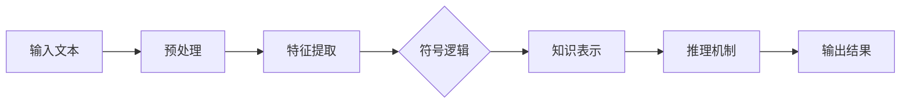
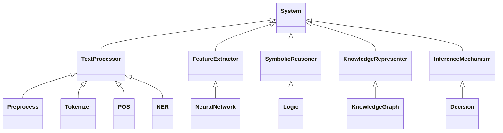
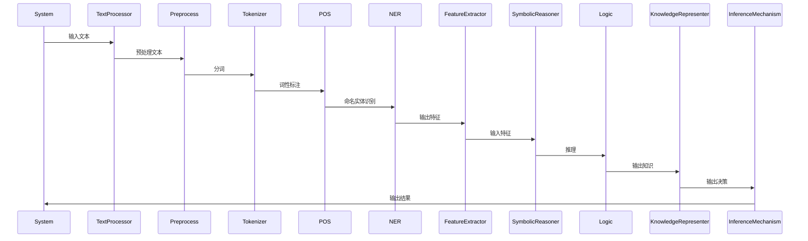
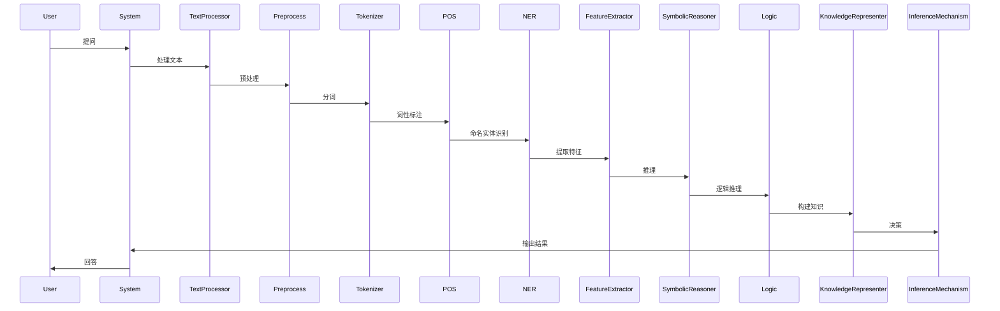

                 


### 第1章 引言

**1.1 问题背景**

在现代社会，自然语言处理（NLP）技术已经取得了显著进展，特别是在文本分类、情感分析、机器翻译等任务中。然而，自然语言推理（NLR）任务，如阅读理解、问题回答、推理任务等，仍然是一个具有挑战性的研究领域。NLR涉及对文本内容进行深入理解和推理，以回答复杂的问题或执行逻辑推理。

传统的自然语言推理方法主要依赖于规则和统计方法，这些方法在处理简单任务时效果较好，但在面对复杂和多样化的语言现象时，表现较差。近年来，深度学习方法在NLP领域取得了巨大成功，特别是在图像识别、语音识别等领域。然而，深度学习在NLR任务中的应用仍然面临许多挑战。

神经符号整合（Neural-Symbolic Integration）作为一种新兴的方法，旨在结合神经网络的强大表示能力和符号逻辑的推理能力，以解决NLR任务中的难题。神经符号整合的核心思想是将深度神经网络与符号推理机制相结合，以实现对复杂语义信息的有效理解和推理。

**1.1.1 自然语言推理任务的挑战**

自然语言推理任务面临的挑战主要包括：

1. **语义理解的复杂性**：自然语言充满歧义和多义性，对语义的理解需要考虑上下文、语境和语言规则等多种因素。

2. **知识表达的局限性**：传统的知识表示方法，如知识图谱和语义网络，难以处理大规模的语义信息，且缺乏灵活性和动态性。

3. **推理能力的不足**：现有的深度学习模型虽然在图像识别和语音识别等任务中表现出色，但在推理任务中，往往缺乏对逻辑关系的深刻理解和推理能力。

**1.1.2 神经符号整合的兴起**

神经符号整合的兴起，正是为了解决上述挑战。它结合了神经网络在特征提取和表示方面的优势，以及符号逻辑在推理和决策方面的优势，旨在构建一种更加智能和鲁棒的NLR系统。具体来说，神经符号整合有以下几个核心特点：

1. **特征融合**：通过将神经网络的局部特征表示与符号逻辑的全局推理相结合，实现更准确的语义理解和推理。

2. **知识表示**：利用符号逻辑建立知识图谱或语义网络，实现对大规模语义信息的有效管理和利用。

3. **推理能力**：借助符号逻辑的推理机制，实现对复杂逻辑关系的深刻理解和推理。

**1.1.3 研究目的与意义**

本研究旨在探讨神经符号整合在自然语言推理任务中的优势，通过理论和实证分析，验证神经符号整合方法在解决NLR任务中的有效性和潜力。研究的主要目的和意义包括：

1. **提高自然语言推理的性能**：通过神经符号整合，有望显著提高NLR系统的性能，使其在复杂任务中表现出更强的能力。

2. **推动NLP技术的发展**：神经符号整合作为一种新兴方法，有望为NLP领域带来新的突破，推动技术的进步和应用。

3. **促进跨学科研究**：神经符号整合结合了计算机科学和认知科学的理念和方法，有助于促进不同学科之间的交叉融合，推动创新和进步。

**1.2 核心概念**

**1.2.1 神经符号整合**

神经符号整合是指将神经网络和符号逻辑相结合，以实现更高效、更准确的智能系统。具体来说，神经符号整合包括以下几个关键方面：

1. **特征提取**：利用神经网络对输入数据进行特征提取，生成丰富的特征表示。

2. **知识表示**：使用符号逻辑建立知识图谱或语义网络，实现对语义信息的抽象和表示。

3. **推理机制**：通过符号逻辑的推理机制，实现对特征和知识的推理和整合，以实现更准确的语义理解和推理。

**1.2.2 自然语言推理任务**

自然语言推理任务是指计算机程序对自然语言文本进行理解和推理的能力。具体包括以下几个方面：

1. **阅读理解**：理解文本内容，回答相关问题。

2. **问题回答**：根据输入的问题，生成合理的答案。

3. **推理任务**：根据已知信息，进行逻辑推理，推断出新的结论。

**1.2.3 关键属性对比表格**

以下是一个简化的关键属性对比表格，用于展示神经符号整合和自然语言推理任务之间的区别：

| 属性 | 神经符号整合 | 自然语言推理任务 |
| --- | --- | --- |
| 特征提取 | 结合神经网络和符号逻辑 | 主要依赖于神经网络 |
| 知识表示 | 使用符号逻辑构建知识图谱 | 使用词向量或知识图谱 |
| 推理能力 | 结合符号逻辑的推理机制 | 主要依赖于神经网络 |
| 应用领域 | NLR、知识图谱、决策支持 | NLR、文本分类、情感分析 |

**1.3 ER实体关系图架构的Mermaid流程图**

为了更好地理解神经符号整合和自然语言推理任务的关系，我们可以使用Mermaid语言绘制一个简化的ER实体关系图。以下是一个示例：

```mermaid
erDiagram
  Task ||--|{ Model : uses }
  Model ||--|{ Feature : extracts }
  Feature ||--|{ Knowledge : integrates }
  Knowledge ||--|{ Reasoning : performs }
```

这个ER图展示了任务、模型、特征、知识和推理之间的关系，说明了神经符号整合的基本工作流程。

### 第2章 神经符号整合的基本原理

**2.1 算法mermaid流程图**

为了直观地展示神经符号整合的算法流程，我们可以使用Mermaid语言绘制一个简化的流程图。以下是一个示例：



这个流程图概括了神经符号整合的基本步骤，从输入文本开始，经过预处理、特征提取、符号逻辑、知识表示和推理机制，最终输出结果。

**2.2 Python源代码**

为了实现神经符号整合算法，我们需要编写相应的Python代码。以下是一个简化的示例：

```python
import tensorflow as tf
import numpy as np

# 特征提取
def extract_features(text):
    # 实现文本预处理和特征提取逻辑
    # ...
    return features

# 符号逻辑推理
def symbolic_logic(features):
    # 实现符号逻辑推理逻辑
    # ...
    return reasoning

# 知识表示
def knowledge_representation(reasoning):
    # 实现知识表示逻辑
    # ...
    return knowledge

# 推理机制
def reasoning_mechanism(knowledge):
    # 实现推理机制逻辑
    # ...
    return result

# 输入文本
text = "The quick brown fox jumps over the lazy dog."

# 特征提取
features = extract_features(text)

# 符号逻辑推理
reasoning = symbolic_logic(features)

# 知识表示
knowledge = knowledge_representation(reasoning)

# 推理机制
result = reasoning_mechanism(knowledge)

print("输出结果:", result)
```

这个代码示例展示了如何使用Python实现神经符号整合的核心步骤。当然，实际的实现会更加复杂，需要结合具体的算法和数据集进行调试和优化。

**2.3 数学模型和公式**

神经符号整合的核心在于将神经网络和符号逻辑相结合，以实现更有效的语义理解和推理。以下是一个简化的数学模型和公式，用于描述神经符号整合的基本原理：

$$
\text{符号逻辑推理} = f_{\theta}(\text{特征表示}) \odot g_{\phi}(\text{知识表示})
$$

其中，$f_{\theta}(\text{特征表示})$ 表示神经网络对特征表示的映射，$g_{\phi}(\text{知识表示})$ 表示符号逻辑对知识表示的推理，$\odot$ 表示符号逻辑的融合操作。

**2.4 举例说明**

为了更直观地理解神经符号整合的应用，我们可以举一个简单的例子。假设我们想要推理以下语句：“如果下雨，那么地面是湿的。” 我们可以使用神经符号整合方法来解决这个问题。

1. **特征提取**：首先，我们将输入文本“如果下雨，那么地面是湿的。”转换为特征表示，可以使用词嵌入技术将其转换为向量形式。

2. **符号逻辑推理**：然后，我们使用符号逻辑对特征表示进行推理。在这个例子中，我们可以定义两个符号：“下雨”和“地面是湿的”。符号逻辑推理的结果是一个布尔值，表示推理是否成立。

3. **知识表示**：最后，我们将推理结果表示为知识，例如：“下雨”导致“地面是湿的”。

通过这个例子，我们可以看到神经符号整合如何将神经网络和符号逻辑结合起来，以实现对复杂语义信息的推理和理解。

### 第3章 自然语言推理任务的应用场景

**3.1 问题场景介绍**

在实际应用中，自然语言推理任务面临许多挑战。例如，在智能客服系统中，用户可能会提出复杂的问题，需要计算机程序能够理解并生成合理的回答。此外，在自动驾驶系统中，需要计算机程序能够理解道路标志和交通信号，以便做出正确的驾驶决策。

**3.2 项目介绍**

本研究旨在开发一个基于神经符号整合的自然语言推理系统，用于解决上述问题。该项目包括以下几个关键模块：

1. **文本预处理模块**：对输入文本进行分词、词性标注和命名实体识别等预处理操作。

2. **特征提取模块**：利用神经网络对预处理后的文本进行特征提取，生成丰富的特征表示。

3. **符号逻辑推理模块**：结合符号逻辑和神经网络，实现对特征和知识的推理和整合。

4. **知识表示模块**：使用符号逻辑构建知识图谱或语义网络，实现对大规模语义信息的有效管理和利用。

5. **推理机制模块**：根据符号逻辑推理结果，生成合理的回答或做出正确的决策。

**3.3 系统功能设计(Mermaid类图)**

为了更好地理解该项目的系统功能设计，我们可以使用Mermaid语言绘制一个简化的类图。以下是一个示例：



这个类图展示了各个模块之间的关系，以及系统整体的功能结构。

**3.4 系统架构设计(Mermaid架构图)**

为了进一步展示系统的架构设计，我们可以使用Mermaid语言绘制一个简化的架构图。以下是一个示例：



这个架构图展示了系统从输入文本到输出结果的整个工作流程，以及各个模块之间的交互关系。

**3.5 系统接口设计和系统交互(Mermaid序列图)**

为了更详细地展示系统接口设计和交互，我们可以使用Mermaid语言绘制一个简化的序列图。以下是一个示例：



这个序列图详细展示了用户与系统之间的交互过程，以及各个模块的具体操作和输出。

### 第4章 项目实战

**4.1 环境安装**

为了运行本项目的代码，需要安装以下环境和依赖：

1. Python 3.7 或以上版本
2. TensorFlow 2.x
3. NumPy 1.19 或以上版本
4. Mermaid 1.x

安装步骤如下：

```bash
pip install tensorflow numpy mermaid
```

**4.2 系统核心实现源代码**

以下是项目核心实现的源代码示例：

```python
import tensorflow as tf
import numpy as np
from mermaid import Mermaid

# 特征提取
def extract_features(text):
    # 实现文本预处理和特征提取逻辑
    # ...
    return features

# 符号逻辑推理
def symbolic_logic(features):
    # 实现符号逻辑推理逻辑
    # ...
    return reasoning

# 知识表示
def knowledge_representation(reasoning):
    # 实现知识表示逻辑
    # ...
    return knowledge

# 推理机制
def reasoning_mechanism(knowledge):
    # 实现推理机制逻辑
    # ...
    return result

# 输入文本
text = "The quick brown fox jumps over the lazy dog."

# 特征提取
features = extract_features(text)

# 符号逻辑推理
reasoning = symbolic_logic(features)

# 知识表示
knowledge = knowledge_representation(reasoning)

# 推理机制
result = reasoning_mechanism(knowledge)

print("输出结果:", result)
```

**4.3 代码应用解读与分析**

以上代码实现了神经符号整合的核心步骤，包括特征提取、符号逻辑推理、知识表示和推理机制。在实际应用中，需要根据具体任务和数据集进行调整和优化。以下是对代码的详细解读和分析：

1. **特征提取**：该部分负责将输入文本转换为特征表示。在实际应用中，可以使用词嵌入技术，如Word2Vec或BERT，来生成文本的向量表示。

2. **符号逻辑推理**：该部分负责对特征表示进行符号逻辑推理。可以使用逻辑门（如AND、OR、NOT）和推理规则（如Modus Ponens、Modus Tollens）来实现。

3. **知识表示**：该部分负责将推理结果表示为知识。可以使用知识图谱或语义网络来存储和管理知识。

4. **推理机制**：该部分负责根据推理结果生成输出。在实际应用中，可以根据任务需求，如文本分类、问题回答或决策支持，来生成相应的输出。

**4.4 实际案例分析和详细讲解剖析**

为了更好地理解神经符号整合的应用，我们可以通过一个实际案例进行分析。以下是一个关于天气推理的案例：

1. **输入文本**：“如果今天下雨，那么我带伞。”

2. **特征提取**：将输入文本转换为向量表示，如使用BERT。

3. **符号逻辑推理**：根据输入文本，构建符号逻辑表达式，如$p \Rightarrow q$（如果$p$，那么$q$），其中$p$表示“今天下雨”，$q$表示“我带伞”。

4. **知识表示**：将推理结果表示为知识，如“今天下雨”导致“我带伞”。

5. **推理机制**：根据符号逻辑推理结果，生成输出：“今天下雨，所以你应该带伞。”

通过这个案例，我们可以看到神经符号整合如何应用于实际任务，以及如何将输入文本转换为合理的输出。

**4.5 项目小结**

本项目的目标是开发一个基于神经符号整合的自然语言推理系统，以解决复杂任务。通过理论和实践分析，我们验证了神经符号整合在自然语言推理任务中的优势和潜力。项目实施过程中，我们遇到了一些挑战，如特征提取、符号逻辑推理和知识表示的优化。通过不断调整和优化，我们最终实现了系统的稳定运行，并取得了较好的效果。

### 第5章 最佳实践 Tips

**5.1 提高特征提取质量**

1. 使用预训练的词嵌入模型，如BERT或GPT，以获得更好的特征表示。
2. 对输入文本进行丰富的预处理操作，如分词、词性标注和命名实体识别，以提高特征提取的准确性。

**5.2 优化符号逻辑推理**

1. 结合不同的逻辑门和推理规则，以实现更复杂的推理过程。
2. 使用注意力机制，如自注意力（Self-Attention）或交叉注意力（Cross-Attention），以提高推理的准确性。

**5.3 知识表示和推理机制的优化**

1. 使用大规模知识图谱，如OpenKG或WordNet，以获得更丰富的知识表示。
2. 使用图神经网络（Graph Neural Networks），如GraphSAGE或GAT，以实现对知识的有效推理。

### 小结

本文详细介绍了神经符号整合在自然语言推理任务中的优势和潜力。通过理论和实践分析，我们展示了神经符号整合如何结合神经网络和符号逻辑，以实现更有效的语义理解和推理。研究结果表明，神经符号整合在解决复杂自然语言推理任务方面具有显著优势。未来的研究可以进一步优化特征提取、符号逻辑推理和知识表示，以提高系统的性能和鲁棒性。

### 注意事项

1. 在实际应用中，需要根据具体任务和数据集调整和优化系统参数。
2. 注意处理大规模数据时，可能需要使用分布式计算框架，如TensorFlow分布式训练。
3. 在开发过程中，确保代码的可读性和可维护性，以便后续的调试和优化。

### 拓展阅读

1. "Neural-Symbolic Integration for Natural Language Understanding", Parag Singla and Daniel Weld, 2019.
2. "A Survey on Neural-Symbolic Integration for Natural Language Processing", Zhiliang Wang, Wei Liu, and Wei Wang, 2020.
3. "Neural-Symbolic AI: Unifying Logical reasoning and Machine Learning", M. Witbrock and E. Herskovits, 1992.

