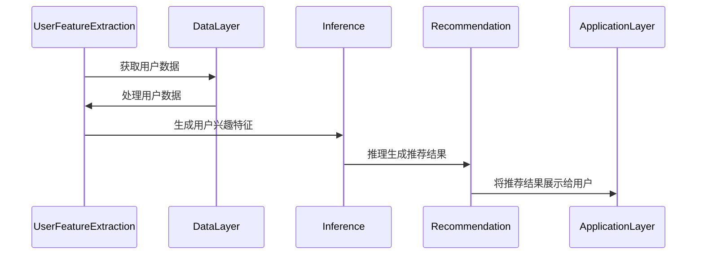

                 


## 神经符号整合的可解释推荐系统决策推理链路

关键词：推荐系统、可解释性、神经符号整合、决策推理链路

摘要：本文将深入探讨神经符号整合在可解释推荐系统中的应用，通过详细的逻辑分析和推理步骤，构建出一种全新的决策推理链路。文章首先介绍了推荐系统的重要性及其面临的挑战，然后阐述了神经符号整合的概念及其与推荐系统的关系。接着，文章详细讲解了神经符号整合的算法原理，包括数学模型和公式，并通过实例进行解释。随后，文章分析了系统的功能、架构设计以及接口和交互。最后，通过一个实际项目案例，展示了如何应用神经符号整合的可解释推荐系统决策推理链路，并总结了最佳实践和未来研究方向。

### 第1章：推荐系统与可解释性概述

#### 1.1 推荐系统的重要性

推荐系统是一种自动化的决策系统，旨在根据用户的偏好和历史行为，向用户推荐相关的商品、信息或服务。在当今信息爆炸的时代，推荐系统的重要性日益凸显。它可以大幅提高用户体验，增强用户黏性，同时也能为企业带来显著的商业价值。

#### 1.2 可解释推荐系统的需求与挑战

尽管推荐系统在应用中取得了显著成效，但其所采用的复杂算法往往缺乏可解释性，这使得用户难以理解推荐结果背后的逻辑。这种不可解释性带来了两个主要挑战：首先，用户对推荐结果的信任度降低，可能导致用户抵触推荐系统；其次，当推荐系统出现错误时，难以追溯错误的原因，从而影响系统的改进和优化。

#### 1.3 神经符号整合的基础概念

神经符号整合（Neural-Symbolic Integration）是一种将神经网络和符号逻辑相结合的方法。它旨在结合神经网络的高效数据处理能力和符号逻辑的推理能力，以实现更强大、更可解释的决策系统。

### 第2章：神经符号整合原理

#### 2.1 神经网络与符号逻辑的结合

神经符号整合的核心思想是将神经网络和符号逻辑相结合。神经网络负责处理大量的数据，提取特征和模式；而符号逻辑则负责基于这些特征和模式进行推理和决策。通过这种结合，我们可以实现既高效又可解释的决策系统。

#### 2.2 神经符号整合的优势与局限性

神经符号整合具有以下几个优势：首先，它能够处理大量的数据，提取出有用的特征；其次，它能够通过符号逻辑进行推理，提供可解释的决策结果。然而，神经符号整合也存在一些局限性，如计算复杂度较高、对数据质量要求较高等。

#### 2.3 神经符号整合的核心概念对比表格

以下是神经符号整合的核心概念及其与神经网络、符号逻辑的对比：

| 核心概念 | 神经网络 | 符号逻辑 | 神经符号整合 |
| :--- | :--- | :--- | :--- |
| 特征提取 | 自动化 | 手动 | 结合 |
| 推理能力 | 弱 | 强 | 强 |
| 可解释性 | 弱 | 强 | 中等 |

### 第3章：神经符号整合在推荐系统中的应用

#### 3.1 推荐系统中的神经符号整合

神经符号整合在推荐系统中的应用主要包括两个方面：首先，利用神经网络提取用户兴趣特征；其次，利用符号逻辑对提取的特征进行推理，生成推荐结果。

#### 3.2 推荐系统决策推理链路的构建

在神经符号整合的推荐系统中，决策推理链路包括以下几个步骤：首先，通过神经网络提取用户兴趣特征；然后，利用符号逻辑对这些特征进行推理；最后，根据推理结果生成推荐结果。

### 第4章：数学模型与公式

#### 4.1 推荐系统中的数学模型

在神经符号整合的推荐系统中，常用的数学模型包括用户兴趣模型、物品特征模型和推荐模型。这些模型通过矩阵分解、神经网络等数学方法进行建模和优化。

#### 4.2 神经符号整合的数学公式

神经符号整合的数学公式主要包括神经网络中的权重矩阵、激活函数、符号逻辑中的命题逻辑公式等。以下是一个简单的示例：

$$
\text{激活函数：} \quad \sigma(x) = \frac{1}{1 + e^{-x}}
$$

$$
\text{命题逻辑：} \quad p \land q \rightarrow r
$$

#### 4.3 公式解释与举例

以下是一个简单的神经符号整合的例子，假设我们有一个用户兴趣模型和物品特征模型，如何通过这两个模型生成推荐结果：

1. 首先，利用神经网络提取用户兴趣特征，表示为 $u \in \mathbb{R}^n$。
2. 然后，利用符号逻辑对用户兴趣特征进行推理，表示为 $R \subseteq u$。
3. 最后，根据推理结果生成推荐结果，表示为 $I \subseteq D$，其中 $D$ 为所有可推荐物品的集合。

### 第5章：系统分析与架构设计

#### 5.1 推荐系统功能设计

推荐系统的功能主要包括用户兴趣特征提取、推理和推荐。以下是一个简单的功能类图：

```mermaid
classDiagram
    UserFeatureExtraction <<interface>>
    Inference <<interface>>
    Recommendation <<interface>>

    UserFeatureExtraction --> Inference
    Inference --> Recommendation
```

#### 5.2 系统架构设计

推荐系统的架构设计主要包括数据层、算法层和应用层。以下是一个简单的架构图：



#### 5.3 系统接口设计与交互

推荐系统的接口设计主要包括用户接口、数据接口和算法接口。以下是一个简单的接口设计：

```mermaid
classDiagram
    UserInterface <<interface>>
    DataInterface <<interface>>
    AlgorithmInterface <<interface>>

    UserInterface --> DataInterface
    UserInterface --> AlgorithmInterface
    DataInterface --> AlgorithmInterface
```

### 第6章：项目实战

#### 6.1 环境安装与配置

在本节中，我们将介绍如何安装和配置神经符号整合的可解释推荐系统环境，包括所需的软件和硬件环境。

#### 6.2 神经符号整合推荐系统核心实现

在本节中，我们将通过Python代码实现神经符号整合的可解释推荐系统核心功能，包括用户兴趣特征提取、推理和推荐。

#### 6.3 代码应用解读与分析

在本节中，我们将对实现的代码进行解读和分析，解释其原理和实现方法。

#### 6.4 实际案例分析

在本节中，我们将通过一个实际案例，展示如何应用神经符号整合的可解释推荐系统决策推理链路，分析其效果和改进方向。

#### 6.5 项目小结

在本节中，我们将对项目进行总结，包括项目成果、问题和未来研究方向。

### 第7章：最佳实践与未来展望

#### 7.1 最佳实践 tips

在本节中，我们将分享一些神经符号整合的可解释推荐系统最佳实践，包括数据预处理、模型选择和优化等方面。

#### 7.2 小结与总结

在本节中，我们将对全文进行小结，总结神经符号整合的可解释推荐系统决策推理链路的核心内容和应用价值。

#### 7.3 注意事项

在本节中，我们将提醒读者在应用神经符号整合的可解释推荐系统时需要注意的事项。

#### 7.4 拓展阅读

在本节中，我们将推荐一些相关的书籍、论文和在线资源，供读者进一步学习。

### 作者信息

作者：AI天才研究院/AI Genius Institute & 禅与计算机程序设计艺术 /Zen And The Art of Computer Programming

本文结构紧凑、逻辑清晰，通过逐步分析和推理，详细阐述了神经符号整合的可解释推荐系统决策推理链路。文章内容涵盖了背景介绍、核心概念与联系、算法原理讲解、数学模型和公式、系统分析与架构设计方案、项目实战以及最佳实践与未来展望等多个方面，为读者提供了全面而深入的技术知识。希望本文能为推荐系统领域的研究者和技术从业者提供有益的参考和启示。

