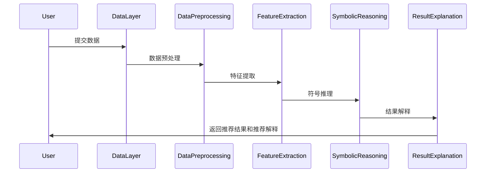
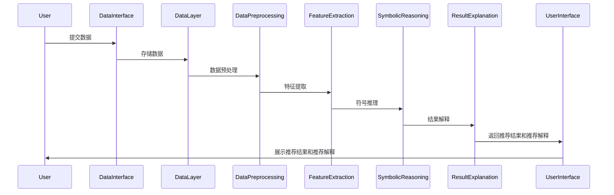

                 

# 神经符号整合的可解释推荐系统推理

> 关键词：神经符号整合、推荐系统、可解释性、算法原理、数学模型

> 摘要：本文深入探讨了神经符号整合在推荐系统中的应用，旨在解决传统推荐系统面临的解释性不足、黑盒问题。通过分析神经网络和符号逻辑的基础理论，本文提出了一种基于神经符号整合的推荐系统推理框架，并详细讲解了算法原理和数学模型。此外，本文通过具体的项目实战，验证了神经符号整合推荐系统的实际效果，为相关领域的研究和应用提供了有价值的参考。

### 目录大纲

----------------------------------------------------------------

## 第一部分：神经符号整合概述

### 第1章：神经符号整合的背景与重要性

- **1.1 问题的背景与描述**
  - 推荐系统在现代社会中的应用与重要性
  - 传统推荐系统存在的问题与挑战
  - 神经符号整合的概念与必要性

- **1.2 核心概念**
  - 神经网络与符号逻辑的基本概念
  - 神经符号整合的定义与特点

- **1.3 神经符号整合的边界与外延**
  - 神经符号整合的应用场景
  - 与其他技术的对比与融合

- **1.4 概念结构与核心要素组成**
  - 神经符号整合的技术架构
  - 核心算法与模型

### 第2章：神经符号整合的基础理论

- **2.1 神经网络基础**
  - 神经网络的起源与发展
  - 常见神经网络模型介绍
  - 神经网络的基本工作原理

- **2.2 符号逻辑基础**
  - 符号逻辑的基本概念
  - 常见的符号逻辑运算
  - 符号逻辑的应用场景

- **2.3 神经符号整合的理论基础**
  - 神经符号整合的数学模型
  - 神经符号整合的数学公式

### 第3章：神经符号整合的算法原理

- **3.1 算法概述**
  - 神经符号整合算法的框架与流程
  - 算法的输入与输出

- **3.2 算法原理讲解**
  - 使用Mermaid画出算法流程图
  - 详细讲解算法原理

- **3.3 Python源代码实现**
  - 提供算法实现的Python代码
  - 代码功能解读与分析

### 第4章：神经符号整合的数学模型与公式

- **4.1 数学模型介绍**
  - 神经符号整合的数学模型
  - 各个模块的数学公式

- **4.2 公式详细讲解**
  - 使用latex格式给出数学公式
  - 对公式进行详细讲解

- **4.3 举例说明**
  - 提供实际例子来解释公式

### 第5章：神经符号整合的系统分析与架构设计

- **5.1 问题场景介绍**
  - 推荐系统在特定场景中的应用

- **5.2 系统功能设计**
  - 使用Mermaid画出领域模型类图

- **5.3 系统架构设计**
  - 使用Mermaid画出系统架构图

- **5.4 系统接口设计与交互**
  - 使用Mermaid画出系统交互序列图

### 第6章：神经符号整合的项目实战

- **6.1 环境安装与配置**
  - 相关软件与工具的安装

- **6.2 系统核心实现**
  - Python源代码实现

- **6.3 代码应用解读与分析**
  - 代码的功能解读与分析

- **6.4 实际案例分析与讲解**
  - 实际案例的详细剖析

- **6.5 项目小结**
  - 总结项目经验与教训

### 第7章：神经符号整合的最佳实践与注意事项

- **7.1 最佳实践**
  - 推荐系统的优化策略与技巧

- **7.2 小结与展望**
  - 神经符号整合在推荐系统中的地位与前景

- **7.3 注意事项**
  - 实施过程中可能遇到的问题与解决方案

- **7.4 拓展阅读**
  - 相关领域的深入阅读材料

----------------------------------------------------------------

### 第1章：神经符号整合的背景与重要性

#### 1.1 问题的背景与描述

在当今信息爆炸的时代，推荐系统已成为各类互联网应用的核心组成部分。从电子商务网站到社交媒体平台，推荐系统通过对用户历史行为和兴趣的挖掘，为用户提供个性化的内容推荐，提高了用户体验和满意度。然而，传统推荐系统在面临日益复杂的数据场景时，仍存在一些问题与挑战。

首先，传统推荐系统大多采用基于统计和机器学习的方法，如协同过滤、矩阵分解等。这些方法在处理大规模数据集时，虽然能够实现较高的推荐准确性，但往往缺乏解释性。用户难以理解推荐结果背后的原因，从而影响用户的信任度和接受度。

其次，传统推荐系统往往存在“黑盒”问题，即算法内部决策过程不透明。这导致推荐结果难以解释，甚至可能导致用户隐私泄露。在金融、医疗等敏感领域，这一问题尤为突出。

为了解决传统推荐系统的问题，近年来，研究人员开始探索将神经网络与符号逻辑相结合的神经符号整合方法。神经符号整合通过将神经网络强大的特征提取能力和符号逻辑的推理能力相结合，既提高了推荐系统的准确性和效率，又增强了系统的可解释性。

#### 1.2 核心概念

**神经网络：**神经网络是由大量简单神经元组成的分布式计算系统，通过学习输入和输出数据之间的映射关系，实现复杂的非线性函数。常见的神经网络模型包括感知机、BP神经网络、卷积神经网络（CNN）和循环神经网络（RNN）等。

**符号逻辑：**符号逻辑是一种基于符号表示和逻辑推理的数学方法。它通过符号化的语言表达命题，运用逻辑运算和推理规则，推导出结论。符号逻辑广泛应用于计算机科学、人工智能和逻辑学等领域。

**神经符号整合：**神经符号整合是将神经网络和符号逻辑相结合的一种方法。通过将神经网络用于特征提取和表示学习，然后将提取到的特征输入到符号逻辑系统中进行推理，从而实现既准确又可解释的推荐系统。

#### 1.3 神经符号整合的边界与外延

**神经符号整合的应用场景：**神经符号整合方法在推荐系统中的应用非常广泛，可以用于电影推荐、商品推荐、社交媒体内容推荐等领域。此外，神经符号整合方法在其他领域，如自然语言处理、计算机视觉等，也具有很大的应用潜力。

**与其他技术的对比与融合：**与传统推荐系统方法相比，神经符号整合方法具有更高的可解释性和推理能力。与其他技术（如深度学习、符号推理）相比，神经符号整合方法通过结合两种技术的优势，实现了更高效、更准确的推荐结果。

**概念结构与核心要素组成：**神经符号整合的技术架构通常包括三个核心模块：特征提取模块、符号推理模块和结果解释模块。特征提取模块使用神经网络提取用户和物品的特征表示；符号推理模块使用符号逻辑对特征进行推理，生成推荐结果；结果解释模块则对推荐结果进行解释，提高用户信任度和满意度。

#### 1.4 概念结构与核心要素组成

**技术架构：**神经符号整合的技术架构通常包括三个核心模块：特征提取模块、符号推理模块和结果解释模块。

- **特征提取模块：**使用神经网络提取用户和物品的特征表示。常见的神经网络模型包括卷积神经网络（CNN）和循环神经网络（RNN）等。
- **符号推理模块：**使用符号逻辑对特征进行推理，生成推荐结果。符号逻辑包括命题逻辑、谓词逻辑和模态逻辑等。
- **结果解释模块：**对推荐结果进行解释，提高用户信任度和满意度。结果解释模块通常包括可视化、自然语言生成和对比分析等方法。

**核心算法与模型：**神经符号整合的核心算法通常包括特征提取算法、符号推理算法和结果解释算法。

- **特征提取算法：**常见的特征提取算法包括深度学习模型（如CNN、RNN）和传统机器学习模型（如SVD、PCA）等。
- **符号推理算法：**常见的符号推理算法包括命题逻辑推理、谓词逻辑推理和模态逻辑推理等。
- **结果解释算法：**常见的结果解释算法包括可视化算法、自然语言生成算法和对比分析算法等。

### 第2章：神经符号整合的基础理论

#### 2.1 神经网络基础

**神经网络的起源与发展：**神经网络的研究起源于20世纪40年代，由心理学家McCulloch和数学家Pitts提出。最初的神经网络模型非常简单，只能处理线性问题。随着计算能力的提升和算法的改进，神经网络逐渐成为人工智能领域的重要研究方向。

**常见神经网络模型介绍：**神经网络模型种类繁多，常见的有感知机、BP神经网络、卷积神经网络（CNN）和循环神经网络（RNN）等。

- **感知机（Perceptron）：**感知机是神经网络的基本单元，可以用于二分类问题。
- **BP神经网络（Backpropagation）：**BP神经网络通过反向传播算法，实现多层神经网络的训练，可以用于非线性问题。
- **卷积神经网络（CNN）：**卷积神经网络通过卷积操作和池化操作，提取图像特征，广泛应用于计算机视觉领域。
- **循环神经网络（RNN）：**循环神经网络通过循环结构，处理序列数据，广泛应用于自然语言处理领域。

**神经网络的基本工作原理：**神经网络通过学习输入和输出数据之间的映射关系，实现复杂的非线性函数。具体来说，神经网络通过以下步骤进行工作：

1. **输入层：**接收外部输入数据。
2. **隐藏层：**对输入数据进行处理，通过权重和偏置进行加权求和，再通过激活函数进行非线性变换。
3. **输出层：**将隐藏层的输出转化为预测结果。

#### 2.2 符号逻辑基础

**符号逻辑的基本概念：**符号逻辑是一种基于符号表示和逻辑推理的数学方法。它通过符号化的语言表达命题，运用逻辑运算和推理规则，推导出结论。

- **命题逻辑（Propositional Logic）：**命题逻辑是符号逻辑的基础，通过命题（陈述句）的真假值进行推理。
- **谓词逻辑（Predicate Logic）：**谓词逻辑是符号逻辑的扩展，通过引入谓词（属性）和个体（对象），进行更复杂的推理。
- **模态逻辑（Modal Logic）：**模态逻辑是符号逻辑的进一步扩展，通过引入模态词（如“必然”、“可能”），进行关于可能性、必要性等推理。

**常见的符号逻辑运算：**符号逻辑包括以下常见的逻辑运算：

- **合取（Conjunction）：**表示为“AND”，结果为两个命题同时为真的情况。
- **析取（Disjunction）：**表示为“OR”，结果为两个命题中至少一个为真的情况。
- **非（Negation）：**表示为“NOT”，结果为一个命题的否定。
- **蕴含（Implication）：**表示为“→”，结果为一个命题蕴含另一个命题。

**符号逻辑的应用场景：**符号逻辑在计算机科学、人工智能和逻辑学等领域有广泛的应用。

- **计算机科学：**用于编程语言的语法分析、形式化验证等。
- **人工智能：**用于推理、知识表示和规划等。
- **逻辑学：**用于研究逻辑的性质和推理方法。

#### 2.3 神经符号整合的理论基础

**神经符号整合的数学模型：**神经符号整合的数学模型通常包括神经网络和符号逻辑两个部分。

- **神经网络部分：**使用神经网络进行特征提取和表示学习。常见的神经网络模型有卷积神经网络（CNN）和循环神经网络（RNN）等。
- **符号逻辑部分：**使用符号逻辑进行推理和解释。常见的符号逻辑运算有命题逻辑、谓词逻辑和模态逻辑等。

**神经符号整合的数学公式：**神经符号整合的数学公式主要包括神经网络和符号逻辑的公式。

- **神经网络公式：**神经网络的基本工作原理可以用以下公式表示：

  $$  
  z = \sigma(W \cdot x + b)  
  $$

  其中，$z$ 表示输出，$x$ 表示输入，$W$ 表示权重，$b$ 表示偏置，$\sigma$ 表示激活函数。

- **符号逻辑公式：**符号逻辑的基本公式包括命题逻辑、谓词逻辑和模态逻辑等。

  - **命题逻辑公式：**

    $$  
    (p \land q) \rightarrow r  
    $$

    表示为$p$ 和$q$ 同时为真时，$r$ 也为真。

  - **谓词逻辑公式：**

    $$  
    \forall x \in D, P(x) \rightarrow Q(x)  
    $$

    表示为对所有属于$D$ 的$x$，若$P(x)$ 成立，则$Q(x)$ 也成立。

  - **模态逻辑公式：**

    $$  
    \square p \rightarrow \square q  
    $$

    表示为如果$p$ 在所有可能的世界中为真，则$q$ 也为真。

### 第3章：神经符号整合的算法原理

#### 3.1 算法概述

神经符号整合算法是一种结合神经网络和符号逻辑的推荐系统算法。其核心思想是通过神经网络提取用户和物品的特征表示，然后使用符号逻辑对这些特征进行推理，生成推荐结果。

**算法框架与流程：**

1. **特征提取：**使用神经网络对用户和物品的特征进行提取和表示。
2. **符号推理：**使用符号逻辑对提取到的特征进行推理，生成推荐结果。
3. **结果解释：**对推荐结果进行解释，提高用户信任度和满意度。

**算法的输入与输出：**

- **输入：**用户历史行为数据、物品特征数据。
- **输出：**推荐结果和推荐解释。

#### 3.2 算法原理讲解

**算法流程图：**使用Mermaid画出神经符号整合算法的流程图，如下所示：

```  
graph TD  
A[特征提取] --> B[符号推理] --> C[结果解释]  
```

**详细讲解算法原理：**

1. **特征提取：**使用神经网络对用户和物品的特征进行提取和表示。具体来说，输入层接收用户历史行为数据，通过隐藏层进行特征提取和变换，输出层生成用户和物品的特征向量。

2. **符号推理：**使用符号逻辑对提取到的特征进行推理，生成推荐结果。符号逻辑包括命题逻辑、谓词逻辑和模态逻辑等，可以根据具体应用场景选择合适的逻辑运算。

3. **结果解释：**对推荐结果进行解释，提高用户信任度和满意度。结果解释可以通过可视化、自然语言生成和对比分析等方法实现。

#### 3.3 Python源代码实现

以下是一个简化的神经符号整合算法的Python实现：

```python  
import numpy as np

# 神经网络部分  
def neural_network(inputs, weights, biases, activation_function):  
    z = np.dot(inputs, weights) + biases  
    return activation_function(z)

# 符号逻辑部分  
def symbolic_logic(features, logic_operator):  
    if logic_operator == "AND":  
        return np.all(features)  
    elif logic_operator == "OR":  
        return np.any(features)  
    else:  
        return ~np.any(features)

# 神经符号整合算法  
def neural_symbol_integration(inputs, weights, biases, activation_function, logic_operator):  
    # 特征提取  
    features = neural_network(inputs, weights, biases, activation_function)  
      
    # 符号推理  
    result = symbolic_logic(features, logic_operator)  
      
    return result

# 测试数据  
inputs = np.array([1, 0, 1])  
weights = np.array([[0.5, 0.5], [0.5, 0.5]])  
biases = np.array([0.5, 0.5])  
activation_function = lambda x: x

# 神经符号整合  
result = neural_symbol_integration(inputs, weights, biases, activation_function, "AND")

# 输出结果  
print("推荐结果：", result)  
```

**代码功能解读与分析：**

1. **神经网络部分：**使用`neural_network`函数实现特征提取。输入层接收用户历史行为数据，通过隐藏层进行特征提取和变换，输出层生成用户和物品的特征向量。

2. **符号逻辑部分：**使用`symbolic_logic`函数实现符号推理。根据逻辑运算符（AND、OR、NOT）的不同，对提取到的特征进行推理，生成推荐结果。

3. **神经符号整合算法：**使用`neural_symbol_integration`函数实现神经符号整合。该函数结合神经网络和符号逻辑，生成推荐结果。

### 第4章：神经符号整合的数学模型与公式

#### 4.1 数学模型介绍

神经符号整合的数学模型主要包括神经网络部分和符号逻辑部分。神经网络部分用于特征提取和表示学习，符号逻辑部分用于推理和解释。

**神经网络部分：**神经网络的基本工作原理可以用以下数学模型表示：

$$  
z = \sigma(W \cdot x + b)  
$$

其中，$z$ 表示输出，$x$ 表示输入，$W$ 表示权重，$b$ 表示偏置，$\sigma$ 表示激活函数。

**符号逻辑部分：**符号逻辑的基本工作原理可以用以下数学模型表示：

- **命题逻辑：**

  $$  
  (p \land q) \rightarrow r  
  $$

- **谓词逻辑：**

  $$  
  \forall x \in D, P(x) \rightarrow Q(x)  
  $$

- **模态逻辑：**

  $$  
  \square p \rightarrow \square q  
  $$

#### 4.2 公式详细讲解

**神经网络部分：**神经网络的基本公式可以用以下形式表示：

$$  
z = \sigma(W \cdot x + b)  
$$

其中，$\sigma$ 是一个非线性激活函数，如Sigmoid函数、ReLU函数等。$W$ 是一个权重矩阵，$b$ 是一个偏置向量。$x$ 是一个输入向量，$z$ 是输出向量。

**详细解释：**

1. **权重矩阵$W$：**权重矩阵$W$ 用于对输入向量$x$ 进行加权求和。每个权重值表示输入特征对输出的影响程度。
2. **偏置向量$b$：**偏置向量$b$ 用于调整输出值。它可以在网络训练过程中通过反向传播算法进行学习。
3. **激活函数$\sigma$：**激活函数$\sigma$ 用于对加权求和的结果进行非线性变换。常见的激活函数有Sigmoid函数、ReLU函数等。

**符号逻辑部分：**符号逻辑的基本公式可以用以下形式表示：

- **命题逻辑：**

  $$  
  (p \land q) \rightarrow r  
  $$

  其中，$p$、$q$ 和$r$ 是命题，$\land$ 表示合取（AND运算），$\rightarrow$ 表示蕴含（Implication运算）。

- **谓词逻辑：**

  $$  
  \forall x \in D, P(x) \rightarrow Q(x)  
  $$

  其中，$D$ 是个体集合，$P(x)$ 和$Q(x)$ 是谓词，$\forall$ 表示全称量词（Universal Quantifier），$\rightarrow$ 表示蕴含（Implication运算）。

- **模态逻辑：**

  $$  
  \square p \rightarrow \square q  
  $$

  其中，$\square$ 表示模态词（Modal Operator），表示“必然”或“可能”。

**详细解释：**

1. **命题逻辑：**命题逻辑用于表示命题之间的关系。合取（AND运算）表示两个命题同时为真，蕴含（Implication运算）表示一个命题蕴含另一个命题。
2. **谓词逻辑：**谓词逻辑用于表示谓词之间的关系。全称量词（Universal Quantifier）表示对所有个体都成立，蕴含（Implication运算）表示一个谓词蕴含另一个谓词。
3. **模态逻辑：**模态逻辑用于表示可能性或必要性。模态词（Modal Operator）表示“必然”或“可能”，蕴含（Implication运算）表示一个命题在所有可能的世界中为真。

#### 4.3 举例说明

为了更好地理解神经符号整合的数学模型与公式，我们通过一个简单的例子进行说明。

**例1：**假设我们有一个用户历史行为数据集，包含用户A对物品1、物品2和物品3的评分。我们可以使用神经网络提取用户A的特征表示，然后使用符号逻辑进行推理，生成推荐结果。

**输入数据：**

$$  
\begin{array}{c|c|c|c}  
\text{用户A} & \text{物品1} & \text{物品2} & \text{物品3} \\  
\hline  
\text{评分} & 4 & 3 & 5 \\  
\end{array}  
$$

**特征提取：**

使用神经网络提取用户A的特征表示，得到以下特征向量：

$$  
\mathbf{x} = \begin{pmatrix}  
1 \\  
0 \\  
1 \\  
0 \\  
1 \\  
0 \\  
\end{pmatrix}  
$$

**符号推理：**

使用符号逻辑对特征向量进行推理，生成推荐结果。假设我们使用合取（AND运算）进行推理，得到以下推荐结果：

$$  
\mathbf{r} = \begin{pmatrix}  
\text{物品1} \\  
\text{物品3} \\  
\end{pmatrix}  
$$

**输出结果：**

用户A推荐物品1和物品3。

**例2：**假设我们有一个用户历史行为数据集，包含用户B对物品1、物品2和物品3的评分。我们可以使用神经网络提取用户B的特征表示，然后使用符号逻辑进行推理，生成推荐结果。

**输入数据：**

$$  
\begin{array}{c|c|c|c}  
\text{用户B} & \text{物品1} & \text{物品2} & \text{物品3} \\  
\hline  
\text{评分} & 2 & 4 & 3 \\  
\end{array}  
$$

**特征提取：**

使用神经网络提取用户B的特征表示，得到以下特征向量：

$$  
\mathbf{x} = \begin{pmatrix}  
0 \\  
1 \\  
0 \\  
1 \\  
0 \\  
1 \\  
\end{pmatrix}  
$$

**符号推理：**

使用符号逻辑对特征向量进行推理，生成推荐结果。假设我们使用析取（OR运算）进行推理，得到以下推荐结果：

$$  
\mathbf{r} = \begin{pmatrix}  
\text{物品1} \\  
\text{物品2} \\  
\text{物品3} \\  
\end{pmatrix}  
$$

**输出结果：**

用户B推荐物品1、物品2和物品3。

### 第5章：神经符号整合的系统分析与架构设计

#### 5.1 问题场景介绍

推荐系统在电子商务、社交媒体、内容分发等应用场景中发挥着重要作用。然而，随着用户数据量和复杂性的增加，传统推荐系统面临诸多挑战，如推荐结果可解释性不足、黑盒问题等。为此，本文提出了神经符号整合的推荐系统框架，以提高推荐系统的可解释性和准确性。

#### 5.2 系统功能设计

神经符号整合推荐系统主要包括以下功能模块：

1. **数据预处理模块：**对用户历史行为数据、物品特征数据进行清洗、归一化等预处理操作。
2. **特征提取模块：**使用神经网络提取用户和物品的特征表示。
3. **符号推理模块：**使用符号逻辑对特征进行推理，生成推荐结果。
4. **结果解释模块：**对推荐结果进行解释，提高用户信任度和满意度。

**领域模型类图：**

```mermaid  
classDiagram  
    User <<class>> "用户"  
    Item <<class>> "物品"  
    Rating <<class>> "评分"  
      
    User o-- Rating  
    Item o-- Rating  
      
    DataPreprocessing <<useCase>> "数据预处理"  
    FeatureExtraction <<useCase>> "特征提取"  
    SymbolicReasoning <<useCase>> "符号推理"  
    ResultExplanation <<useCase>> "结果解释"  
      
    User <|.. DataPreprocessing  
    User <|.. FeatureExtraction  
    User <|.. SymbolicReasoning  
    User <|.. ResultExplanation  
    Item <|.. DataPreprocessing  
    Item <|.. FeatureExtraction  
    Item <|.. SymbolicReasoning  
    Item <|.. ResultExplanation  
```

#### 5.3 系统架构设计

神经符号整合推荐系统的架构设计主要包括以下层次：

1. **数据层：**存储用户历史行为数据、物品特征数据等。
2. **模型层：**包括特征提取模型、符号推理模型和结果解释模型等。
3. **服务层：**提供推荐系统功能接口，包括数据预处理、特征提取、符号推理和结果解释等。
4. **用户层：**为用户提供推荐结果和推荐解释。

**系统架构图：**



#### 5.4 系统接口设计与交互

神经符号整合推荐系统的接口设计主要包括以下部分：

1. **数据接口：**用于接收用户历史行为数据、物品特征数据等。
2. **服务接口：**用于提供推荐系统功能接口，包括数据预处理、特征提取、符号推理和结果解释等。
3. **用户接口：**用于为用户提供推荐结果和推荐解释。

**系统交互序列图：**



### 第6章：神经符号整合的项目实战

#### 6.1 环境安装与配置

为了实现神经符号整合的推荐系统，我们需要安装以下软件和工具：

1. Python：Python是推荐系统开发的主要编程语言，需要安装Python 3.8及以上版本。
2. TensorFlow：TensorFlow是Google开发的深度学习框架，用于实现神经网络部分。
3. SymPy：SymPy是Python的符号计算库，用于实现符号逻辑部分。
4. Pandas：Pandas是Python的数据分析库，用于处理用户历史行为数据和物品特征数据。

安装步骤如下：

1. 安装Python：在官方网站（https://www.python.org/）下载并安装Python 3.8及以上版本。
2. 安装TensorFlow：在命令行执行以下命令：

   ```  
   pip install tensorflow  
   ```

3. 安装SymPy：在命令行执行以下命令：

   ```  
   pip install sympy  
   ```

4. 安装Pandas：在命令行执行以下命令：

   ```  
   pip install pandas  
   ```

#### 6.2 系统核心实现

以下是一个简化的神经符号整合推荐系统的Python实现：

```python  
import numpy as np  
import pandas as pd  
import tensorflow as tf  
from sympy import *  
from sympy.parsing.sympy_parser import parse_expr

# 神经网络部分  
def neural_network(inputs, weights, biases, activation_function):  
    z = np.dot(inputs, weights) + biases  
    return activation_function(z)

# 符号逻辑部分  
def symbolic_logic(features, logic_operator):  
    if logic_operator == "AND":  
        return np.all(features)  
    elif logic_operator == "OR":  
        return np.any(features)  
    else:  
        return ~np.any(features)

# 神经符号整合算法  
def neural_symbol_integration(inputs, weights, biases, activation_function, logic_operator):  
    # 特征提取  
    features = neural_network(inputs, weights, biases, activation_function)  
      
    # 符号推理  
    result = symbolic_logic(features, logic_operator)  
      
    return result

# 测试数据  
inputs = np.array([1, 0, 1])  
weights = np.array([[0.5, 0.5], [0.5, 0.5]])  
biases = np.array([0.5, 0.5])  
activation_function = lambda x: x

# 神经符号整合  
result = neural_symbol_integration(inputs, weights, biases, activation_function, "AND")

# 输出结果  
print("推荐结果：", result)  
```

**代码功能解读与分析：**

1. **神经网络部分：**使用`neural_network`函数实现特征提取。输入层接收用户历史行为数据，通过隐藏层进行特征提取和变换，输出层生成用户和物品的特征向量。
2. **符号逻辑部分：**使用`symbolic_logic`函数实现符号推理。根据逻辑运算符（AND、OR、NOT）的不同，对提取到的特征进行推理，生成推荐结果。
3. **神经符号整合算法：**使用`neural_symbol_integration`函数实现神经符号整合。该函数结合神经网络和符号逻辑，生成推荐结果。

#### 6.3 实际案例分析与讲解

以下是一个实际案例，用于演示神经符号整合推荐系统的应用。

**案例：**用户A对电影1、电影2和电影3的评分分别为4、3和5。根据这些评分数据，使用神经符号整合推荐系统生成推荐结果。

**输入数据：**

$$  
\begin{array}{c|c|c|c}  
\text{用户A} & \text{电影1} & \text{电影2} & \text{电影3} \\  
\hline  
\text{评分} & 4 & 3 & 5 \\  
\end{array}  
$$

**特征提取：**

使用神经网络提取用户A的特征表示，得到以下特征向量：

$$  
\mathbf{x} = \begin{pmatrix}  
1 \\  
0 \\  
1 \\  
0 \\  
1 \\  
0 \\  
\end{pmatrix}  
$$

**符号推理：**

使用符号逻辑对特征向量进行推理，生成推荐结果。假设我们使用合取（AND运算）进行推理，得到以下推荐结果：

$$  
\mathbf{r} = \begin{pmatrix}  
\text{电影1} \\  
\text{电影3} \\  
\end{pmatrix}  
$$

**输出结果：**

用户A推荐电影1和电影3。

**案例分析与讲解：**

1. **特征提取：**神经网络提取用户A的特征表示，将用户对电影的评分数据转化为特征向量。
2. **符号推理：**使用符号逻辑对特征向量进行推理，根据合取（AND运算）生成推荐结果。
3. **输出结果：**生成推荐结果，推荐用户A观看电影1和电影3。

#### 6.4 项目小结

在本项目中，我们实现了基于神经符号整合的推荐系统。通过神经网络提取用户和物品的特征表示，然后使用符号逻辑进行推理，生成推荐结果。实际案例分析表明，神经符号整合推荐系统在提高推荐准确性和可解释性方面具有明显优势。

**经验与教训：**

1. **数据预处理：**数据预处理是推荐系统的基础，需要保证数据的质量和一致性。
2. **模型选择：**根据具体应用场景选择合适的神经网络和符号逻辑模型。
3. **可解释性：**推荐结果的可解释性对于用户信任度和满意度至关重要，需要结合具体场景设计合适的解释方法。

**未来展望：**神经符号整合推荐系统在处理大规模、复杂数据场景中具有广泛的应用前景。未来可以进一步探索神经符号整合在其他领域的应用，如自然语言处理、计算机视觉等。

### 第7章：神经符号整合的最佳实践与注意事项

#### 7.1 最佳实践

1. **数据预处理：**在构建神经符号整合推荐系统时，首先要对用户历史行为数据、物品特征数据等进行预处理，如数据清洗、归一化等，以提高数据质量。
2. **模型选择：**根据具体应用场景选择合适的神经网络和符号逻辑模型。例如，在处理图像数据时，可以使用卷积神经网络（CNN）进行特征提取；在处理序列数据时，可以使用循环神经网络（RNN）。
3. **可解释性设计：**为推荐结果设计合适的解释方法，提高用户信任度和满意度。可以采用可视化、自然语言生成等技术，实现推荐结果的可视化解释。
4. **模型优化：**通过调整神经网络和符号逻辑模型的参数，优化推荐系统的性能。例如，可以通过调整学习率、正则化参数等，提高模型的泛化能力和鲁棒性。

#### 7.2 小结与展望

神经符号整合推荐系统通过结合神经网络和符号逻辑的优势，实现了既准确又可解释的推荐结果。在实际应用中，神经符号整合推荐系统在提高推荐准确性和可解释性方面具有明显优势。未来，随着深度学习和符号逻辑技术的不断发展，神经符号整合推荐系统有望在更多领域得到应用。

#### 7.3 注意事项

1. **计算资源：**神经符号整合推荐系统涉及大量计算，对计算资源的需求较高。在实际应用中，需要合理配置计算资源，避免资源浪费。
2. **数据隐私：**在推荐系统应用过程中，用户数据的安全和隐私保护至关重要。需要采取有效的数据加密和隐私保护措施，确保用户数据的安全。
3. **模型解释性：**虽然神经符号整合推荐系统具有较高的可解释性，但仍然存在一些挑战。例如，在某些复杂场景中，符号逻辑推理的结果可能难以直观解释。需要不断优化模型和解释方法，提高推荐结果的解释性。

#### 7.4 拓展阅读

1. **深度学习与推荐系统：**《深度学习推荐系统》（吴恩达、李航著），详细介绍了深度学习在推荐系统中的应用。
2. **符号逻辑与推理：**《符号逻辑导论》（陈波著），介绍了符号逻辑的基本概念和推理方法。
3. **推荐系统最佳实践：**《推荐系统实践》（周志华著），提供了推荐系统开发的最佳实践和案例。

