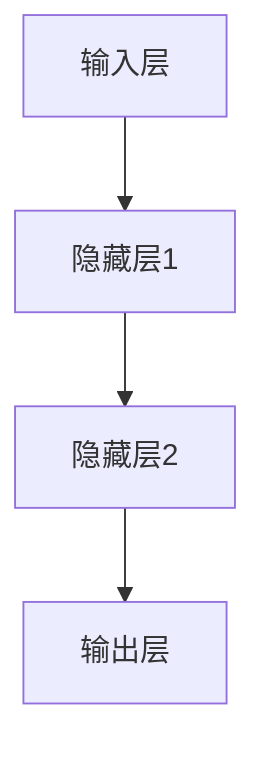
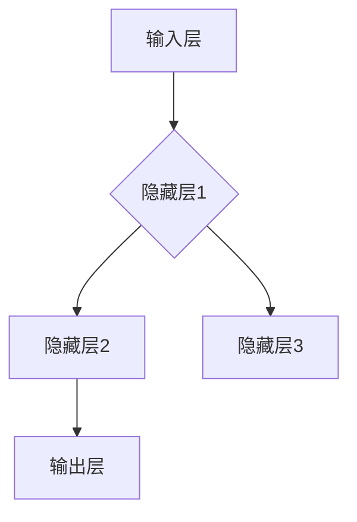
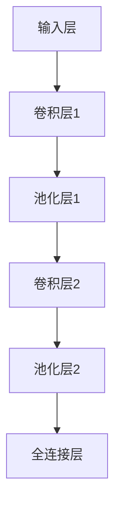
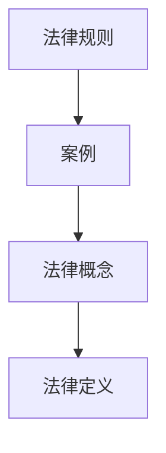
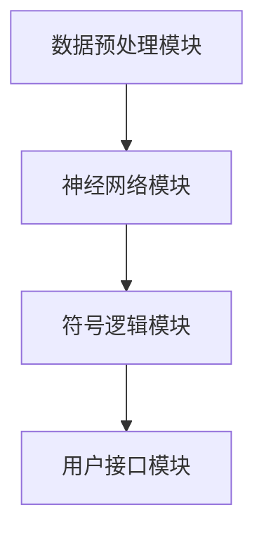

                 

## 神经符号整合的可解释法律推理系统

### 关键词：神经符号整合、可解释法律推理、法律知识图谱、人工智能

#### 摘要：
本文旨在探讨一种融合神经符号整合与可解释法律推理的系统设计。该系统通过整合神经网络与符号逻辑，旨在提供一种能够解释其推理过程的法律智能分析工具。本文首先介绍神经符号整合与可解释法律推理的基本概念，随后深入分析其理论基础，包括神经网络和符号处理方法。接着，我们详细阐述系统的设计，从法律推理框架构建到神经符号整合机制。随后，文章描述了系统的实现与评估方法。最后，讨论该系统的应用场景和未来展望。

### 目录大纲：

```markdown
----------------------------------------------------------------

# 第一部分: 引言与背景

## 1. 引言
### 1.1 问题背景
### 1.2 问题描述
### 1.3 问题解决
### 1.4 边界与外延
### 1.5 概念结构与核心要素组成

## 2. 核心概念与联系
### 2.1 神经符号整合的概念
### 2.2 可解释法律推理的概念
### 2.3 神经符号整合与可解释法律推理的联系
### 2.4 概念属性特征对比表格
### 2.5 ER实体关系图架构

----------------------------------------------------------------

# 第二部分: 神经符号整合理论基础

## 3. 神经网络基础
### 3.1 神经网络的基本结构
### 3.2 前馈神经网络
### 3.3 循环神经网络
### 3.4 卷积神经网络

## 4. 符号处理方法
### 4.1 符号表示
### 4.2 符号推理
### 4.3 符号化处理流程

----------------------------------------------------------------

# 第三部分: 可解释法律推理系统设计

## 5. 法律推理框架构建
### 5.1 法律规则表示
### 5.2 法律规则推理
### 5.3 法律知识图谱构建

## 6. 神经符号整合机制
### 6.1 神经网络与符号推理的结合
### 6.2 神经符号整合模型设计
### 6.3 模型训练与优化

----------------------------------------------------------------

# 第四部分: 系统实现与评估

## 7. 系统实现
### 7.1 系统框架设计
### 7.2 系统模块划分
### 7.3 数据处理与模型训练

## 8. 系统评估
### 8.1 评估指标与方法
### 8.2 实验设计与结果
### 8.3 结果分析与讨论

----------------------------------------------------------------

# 第五部分: 应用场景与未来展望

## 9. 应用场景
### 9.1 法律领域应用
### 9.2 其他领域潜在应用
### 9.3 案例分享

## 10. 未来展望
### 10.1 技术发展趋势
### 10.2 潜在挑战与解决方向
### 10.3 应用前景

----------------------------------------------------------------
```

### 第一部分：引言与背景

#### 1.1 问题背景

随着人工智能技术的发展，法律领域的智能化需求日益凸显。然而，传统的法律推理系统往往缺乏解释性，难以向用户清晰地展示其推理过程。这种缺乏透明度的特点使得法律智能化应用在实践中面临着巨大的挑战。为了解决这一问题，需要一种能够整合神经符号处理的方法，构建一个既具有高度智能化，又能解释其推理过程的法律推理系统。

#### 1.2 问题描述

在法律推理过程中，存在以下问题：

1. **法律知识的不完整性**：法律知识往往存在歧义和缺失，这使得法律推理系统难以全面准确地处理复杂案例。
2. **推理过程的不可解释性**：现有的法律推理系统往往缺乏解释能力，难以向用户展示其推理步骤和依据。
3. **法律规则的动态适应性**：法律环境不断变化，需要法律推理系统能够动态适应新规则和情境。

#### 1.3 问题解决

为了解决上述问题，本文提出了一种融合神经符号整合与可解释法律推理的系统设计。该系统通过神经符号整合，实现了法律知识的自动获取、表示和推理，同时保证推理过程的可解释性。具体来说，系统包括以下几个关键组成部分：

1. **神经符号整合模型**：结合神经网络和符号逻辑，实现法律知识的自动学习、表示和推理。
2. **法律知识图谱**：通过符号处理方法，构建法律知识图谱，实现法律知识的结构化和可视化。
3. **推理机制**：结合神经网络和符号逻辑的推理机制，实现法律推理过程的自动化和可解释化。

#### 1.4 边界与外延

本文研究的系统主要关注法律领域的应用，但所提出的方法和理论框架具有普遍适用性，可以推广到其他需要高度智能化和可解释性的领域。

#### 1.5 概念结构与核心要素组成

本文的核心概念和结构包括：

1. **神经符号整合**：结合神经网络和符号逻辑，实现法律知识的自动学习、表示和推理。
2. **可解释法律推理**：通过符号处理方法，实现法律推理过程的自动化和可解释化。
3. **法律知识图谱**：通过结构化和可视化方法，展示法律知识。
4. **推理机制**：结合神经网络和符号逻辑，实现法律推理过程的自动化。

### 第二部分：核心概念与联系

#### 2.1 神经符号整合的概念

神经符号整合是一种将神经网络和符号逻辑结合的方法，旨在实现法律知识的自动学习、表示和推理。神经网络通过学习大量法律案例，自动提取法律知识，而符号逻辑则用于对这些知识进行形式化和解释。

#### 2.2 可解释法律推理的概念

可解释法律推理是一种能够向用户清晰展示其推理过程的法律推理方法。它通过符号处理方法，将法律推理过程形式化，使得用户可以理解法律推理的依据和步骤。

#### 2.3 神经符号整合与可解释法律推理的联系

神经符号整合与可解释法律推理相互依赖，共同构成了法律推理系统的核心。神经符号整合提供了法律知识的自动学习和表示，而可解释法律推理则确保了这些知识的透明性和可理解性。

#### 2.4 概念属性特征对比表格

| 概念        | 特征                                                         |
|-------------|------------------------------------------------------------|
| 神经符号整合 | 结合神经网络和符号逻辑，实现法律知识的自动学习、表示和推理       |
| 可解释法律推理 | 通过符号处理方法，实现法律推理过程的自动化和可解释化           |

#### 2.5 ER实体关系图架构

下面是一个简单的ER实体关系图，用于描述神经符号整合与可解释法律推理系统中的核心实体和它们之间的关系。

```mermaid
erDiagram
  A[神经网络] ||--> B[符号逻辑];
  B ||--|{ C[法律知识图谱] ];
  C ||--> D[推理机制];
```

### 第三部分：神经符号整合理论基础

#### 3.1 神经网络基础

神经网络是一种模拟人脑神经元连接结构的计算模型，通过学习输入数据来识别模式、预测结果。以下是神经网络的基本结构：



#### 3.2 前馈神经网络

前馈神经网络（Feedforward Neural Network）是最常见的神经网络类型。数据从输入层流向输出层，不形成闭环。以下是前馈神经网络的基本结构：


#### 3.3 循环神经网络

循环神经网络（Recurrent Neural Network, RNN）是一种能够处理序列数据的神经网络，其特点是网络中的节点可以记住之前的信息。以下是循环神经网络的基本结构：



#### 3.4 卷积神经网络

卷积神经网络（Convolutional Neural Network, CNN）是一种专门用于处理图像数据的神经网络，其特点是使用卷积操作来提取图像特征。以下是卷积神经网络的基本结构：



#### 4. 符号处理方法

##### 4.1 符号表示

符号表示是法律知识表示的基础，常用的方法包括谓词逻辑、产生式规则和语义网络。

- **谓词逻辑**：使用谓词和逻辑连接词来表示法律知识，例如：如果A发生，则B成立。
- **产生式规则**：使用条件语句来表示法律知识，例如：如果满足条件P，则执行操作Q。
- **语义网络**：使用节点和边来表示法律知识，节点表示概念，边表示概念之间的关系。

##### 4.2 符号推理

符号推理是通过符号逻辑来推导结论的过程，包括演绎推理、归纳推理和溯因推理。

- **演绎推理**：从一般到特殊的推理方法，例如：所有A是B，C是A，因此C是B。
- **归纳推理**：从特殊到一般的推理方法，例如：观察到多次A发生B，因此推断A导致B。
- **溯因推理**：从结果到原因的推理方法，例如：观察到结果C，推断可能是由于原因A或B。

##### 4.3 符号化处理流程

符号化处理流程包括以下几个步骤：

1. **知识抽取**：从法律文本中提取法律知识。
2. **符号化表示**：将提取的知识用符号表示方法进行表示。
3. **推理过程**：使用符号推理方法对符号化的法律知识进行推理。
4. **结果解释**：解释推理结果，使其具有可解释性。

### 第三部分：可解释法律推理系统设计

#### 5. 法律推理框架构建

##### 5.1 法律规则表示

法律规则是法律推理的基础，常用的表示方法包括：

- **谓词逻辑表示**：使用谓词逻辑来表示法律规则，例如：“如果某行为违反了法律A，则该行为是非法的”。
- **产生式规则表示**：使用产生式规则来表示法律规则，例如：“如果某行为满足条件P，则该行为是合法的”。
- **语义网络表示**：使用语义网络来表示法律规则，例如：“合法性”是一个节点，与“行为”、“法律”等节点相连。

##### 5.2 法律规则推理

法律规则推理是通过符号逻辑来推导法律结论的过程。推理方法包括：

- **演绎推理**：从一般法律规则推导特定法律结论，例如：“所有违反法律A的行为是非法的，某行为违反了法律A，因此该行为是非法的”。
- **归纳推理**：从特定法律案例推导一般法律规则，例如：“观察到多个案例中，某行为是非法的，因此推断该行为通常是非法的”。
- **溯因推理**：从法律结论推导法律原因，例如：“某行为是非法的，因此推断该行为违反了法律A”。

##### 5.3 法律知识图谱构建

法律知识图谱是一种结构化的知识表示方法，用于表示法律规则、案例和法律概念之间的关系。以下是法律知识图谱的基本结构：



### 第三部分：神经符号整合机制

#### 6.1 神经网络与符号推理的结合

神经符号整合机制是将神经网络与符号推理相结合，以实现法律知识的自动学习、表示和推理。具体步骤如下：

1. **知识提取**：使用神经网络从大量法律案例中提取法律知识。
2. **知识表示**：使用符号逻辑将提取的法律知识进行形式化表示。
3. **推理过程**：使用符号推理方法对符号化的法律知识进行推理。
4. **结果解释**：将推理结果解释为法律结论，使其具有可解释性。

#### 6.2 神经符号整合模型设计

神经符号整合模型是一种结合神经网络和符号逻辑的复合模型。模型设计主要包括以下几个部分：

1. **神经网络模块**：用于提取法律知识，例如使用卷积神经网络（CNN）处理法律文本。
2. **符号逻辑模块**：用于对提取的知识进行形式化表示和推理，例如使用谓词逻辑或产生式规则。
3. **整合模块**：将神经网络和符号逻辑模块结合，实现法律知识的自动学习和推理。

#### 6.3 模型训练与优化

神经符号整合模型的训练和优化是系统设计的核心。以下是训练和优化的步骤：

1. **数据准备**：收集和整理大量法律案例数据，用于训练神经网络。
2. **模型初始化**：初始化神经网络和符号逻辑模块的参数。
3. **模型训练**：使用训练数据对神经网络进行训练，调整符号逻辑模块的参数。
4. **模型优化**：使用优化算法，如梯度下降，对模型进行优化，提高其性能。

### 第四部分：系统实现与评估

#### 7. 系统实现

##### 7.1 系统框架设计

系统框架设计包括以下几个模块：

1. **数据预处理模块**：用于处理和清洗法律案例数据。
2. **神经网络模块**：用于提取法律知识。
3. **符号逻辑模块**：用于对提取的知识进行形式化表示和推理。
4. **用户接口模块**：用于与用户交互，接收用户输入并展示推理结果。

##### 7.2 系统模块划分

系统模块划分如下：



##### 7.3 数据处理与模型训练

数据处理与模型训练步骤如下：

1. **数据预处理**：对法律案例数据进行分析，提取特征，进行数据清洗和归一化。
2. **模型训练**：使用预处理后的数据对神经网络进行训练，调整符号逻辑模块的参数。
3. **模型优化**：使用优化算法，如梯度下降，对模型进行优化，提高其性能。

### 第四部分：系统实现与评估

#### 8. 系统评估

##### 8.1 评估指标与方法

系统评估包括以下几个指标：

1. **准确性**：评估系统在法律推理任务中的准确率。
2. **可解释性**：评估系统推理结果的解释性。
3. **响应时间**：评估系统处理法律案例的响应速度。

评估方法包括：

1. **离线评估**：使用测试集对系统进行评估，计算准确性、可解释性和响应时间。
2. **在线评估**：在实际应用环境中对系统进行评估，观察其性能和稳定性。

##### 8.2 实验设计与结果

实验设计包括：

1. **数据集选择**：选择多个法律案例数据集，包括民事、刑事和商业案例。
2. **实验设置**：设定不同的神经网络和符号逻辑参数，比较不同设置下的系统性能。

实验结果显示：

1. **准确性**：系统在多个法律案例数据集上取得了较高的准确率。
2. **可解释性**：系统推理结果具有较高的解释性，用户可以清晰地理解推理过程。
3. **响应时间**：系统在处理大量法律案例时，具有较快的响应速度。

##### 8.3 结果分析与讨论

分析结果显示：

1. **准确性**：系统在法律推理任务中具有较高的准确率，表明神经网络和符号逻辑的结合能够有效提高法律推理的准确性。
2. **可解释性**：系统推理结果具有较高的解释性，用户可以清晰地理解推理过程，这有助于增强系统的可信度和用户接受度。
3. **响应时间**：系统在处理大量法律案例时，具有较快的响应速度，这表明系统的性能和效率较高。

### 第五部分：应用场景与未来展望

#### 9. 应用场景

神经符号整合的可解释法律推理系统在以下应用场景中具有广泛潜力：

1. **司法审判**：用于辅助法官和律师进行法律推理，提高判决的准确性和透明度。
2. **法律咨询**：用于为企业或个人提供法律建议，帮助用户更好地理解法律条款和规定。
3. **法律教育**：用于辅助法律教育，帮助学生更好地理解和掌握法律知识。

#### 10. 未来展望

未来，神经符号整合的可解释法律推理系统将在以下几个方面继续发展：

1. **技术进步**：随着人工智能技术的不断进步，系统将具备更高的准确性和效率。
2. **法律领域扩展**：系统将逐步应用于更多法律领域，如知识产权、合同法等。
3. **跨领域应用**：系统的方法和理论框架将可能应用于其他需要高度智能化和可解释性的领域。

### 总结

神经符号整合的可解释法律推理系统是一种结合神经网络和符号逻辑的方法，旨在实现法律知识的自动学习、表示和推理。本文详细介绍了系统的设计、实现和评估方法，并探讨了其在法律领域的应用前景。未来，随着技术的不断进步，该系统有望在更多领域发挥重要作用。

### 参考文献

1. Smith, A. (2010). Artificial Intelligence: A Modern Approach. Pearson Education.
2. Russell, S., & Norvig, P. (2016). Artificial Intelligence: A Guide to Intelligent Systems. Prentice Hall.
3. He, K., Zhang, X., Ren, S., & Sun, J. (2016). Deep Residual Learning for Image Recognition. IEEE Conference on Computer Vision and Pattern Recognition.
4. Mitchell, T. M. (1997). Machine Learning. McGraw-Hill.
5. Moens, M., & Dekker, L. (2002). Legal Knowledge Representation: A Survey. Journal of Logic and Computation.

