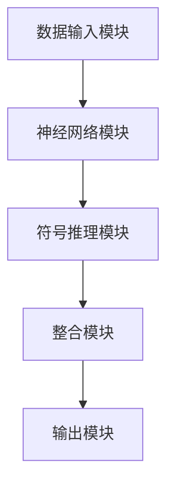
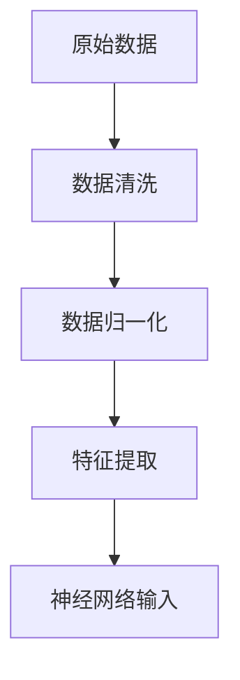
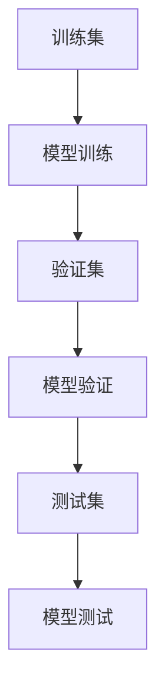
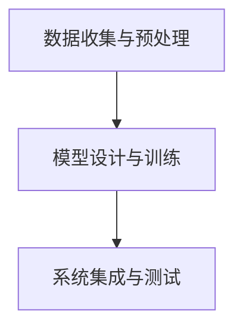

                 

### 文章标题

神经符号整合的可解释金融风险推理系统设计

---

关键词：神经符号整合，金融风险管理，推理系统，可解释性，算法优化

摘要：本文旨在探讨神经符号整合在金融风险管理领域的应用，通过介绍神经符号整合的背景、基础理论、数学模型、算法实现以及实际应用，详细阐述了如何设计一个可解释的金融风险推理系统。文章结构清晰，逻辑性强，旨在为读者提供一个全面、深入的技术解析。

---

### 目录大纲

----------------------------------------------------------------

# 第一部分：神经符号整合概述

## 第1章：神经符号整合的背景与核心概念

### 1.1.1 神经符号整合的发展历程

### 1.1.2 神经符号整合的关键概念

### 1.1.3 神经符号整合在金融风险管理中的应用前景

## 第2章：神经符号整合的基础理论

### 2.1.1 神经网络的基本原理

### 2.1.2 符号主义推理的基本原理

### 2.1.3 神经符号整合的理论基础

## 第3章：神经符号整合的数学模型与算法

### 3.1.1 神经符号整合的数学模型

### 3.1.2 神经符号整合的算法原理

### 3.1.3 算法实现与优化策略

## 第4章：神经符号整合在金融风险推理中的应用

### 4.1.1 金融风险推理的基本概念

### 4.1.2 神经符号整合在金融风险推理中的应用场景

### 4.1.3 神经符号整合在金融风险推理中的优势

## 第5章：神经符号整合系统设计与实现

### 5.1.1 神经符号整合系统的总体架构

### 5.1.2 数据预处理与特征提取

### 5.1.3 神经符号整合模型的训练与评估

## 第6章：神经符号整合系统的应用案例

### 6.1.1 案例背景与需求分析

### 6.1.2 系统设计与实现

### 6.1.3 应用效果与分析

## 第7章：神经符号整合系统的优化与未来展望

### 7.1.1 神经符号整合系统的优化策略

### 7.1.2 神经符号整合的未来发展方向

### 7.1.3 神经符号整合在实际应用中的挑战与解决方案

## 第8章：神经符号整合系统最佳实践与小结

### 8.1.1 最佳实践案例分析

### 8.1.2 小结与展望

### 8.1.3 注意事项与未来拓展

----------------------------------------------------------------

### 神经符号整合概述

#### 第1章：神经符号整合的背景与核心概念

##### 1.1.1 神经符号整合的发展历程

神经符号整合是近年来人工智能领域的一个重要研究方向，它将神经网络的强大计算能力和符号推理的精确性相结合，旨在构建一个既具有高效计算能力，又具有明确解释性的智能系统。这一概念的发展可以追溯到20世纪80年代，当时神经网络和符号推理方法分别独立发展，各自取得了显著成果。然而，随着计算能力的提高和数据量的爆炸性增长，如何将两者的优势结合起来成为一个亟待解决的问题。

在21世纪初，神经符号整合的研究逐渐兴起，研究人员开始探索如何将神经网络的学习能力和符号推理的准确性相结合。早期的研究主要集中在如何将神经网络与传统的符号推理方法相结合，如使用神经网络进行特征提取，然后使用符号推理方法进行逻辑推理。随着深度学习的兴起，神经网络在图像识别、语音识别等领域取得了巨大成功，神经符号整合的研究也逐渐从理论探讨转向实际应用。

##### 1.1.2 神经符号整合的关键概念

**神经网络**：神经网络是一种模拟人脑神经元之间连接的计算机模型，通过多层次的神经元结构来学习输入数据的特征和规律。神经网络具有自适应性和自学习能力，能够从大量数据中自动提取特征，并在新的数据上进行预测。

**符号推理**：符号推理是一种基于逻辑和数学的推理方法，通过符号表示知识，并进行逻辑推理来解决问题。符号推理具有精确性和解释性，能够提供对推理过程的明确解释。

**神经符号整合**：神经符号整合是将神经网络和符号推理相结合的一种方法，通过将神经网络的学习能力与符号推理的准确性相结合，构建一个既具有高效计算能力，又具有明确解释性的智能系统。

##### 1.1.3 神经符号整合在金融风险管理中的应用前景

金融风险管理是金融领域的一个重要课题，涉及到对金融市场风险的分析、预测和应对。传统的金融风险管理方法主要依赖于统计分析和模型预测，但存在一定的局限性。随着人工智能技术的发展，神经符号整合方法在金融风险管理中展现出巨大的潜力。

神经符号整合方法可以通过神经网络对大量金融数据进行特征提取，并利用符号推理方法进行逻辑推理，从而实现对金融市场风险的深入分析和预测。与传统的风险管理方法相比，神经符号整合方法具有以下优势：

1. **可解释性**：神经符号整合方法能够提供对推理过程的明确解释，有助于理解风险产生的机理，从而为风险管理人员提供更直观的风险分析结果。

2. **高效性**：神经网络具有高效计算能力，能够快速处理大量金融数据，提高风险预测的准确性和实时性。

3. **准确性**：符号推理方法的精确性可以弥补神经网络在某些场景下的局限性，提高风险预测的准确性。

4. **自适应性和灵活性**：神经符号整合方法可以随着市场环境和风险特征的变化而不断调整和优化，具有更好的自适应性和灵活性。

总之，神经符号整合方法在金融风险管理中具有广泛的应用前景，有望成为金融风险管理领域的一个重要工具。

#### 第2章：神经符号整合的基础理论

##### 2.1.1 神经网络的基本原理

神经网络是一种由大量神经元互联而成的复杂网络，通过学习输入数据的特征和规律，实现对未知数据的预测和分类。神经网络的基本原理可以概括为以下几个步骤：

1. **输入层**：输入层接收外部输入数据，并将其传递给隐藏层。

2. **隐藏层**：隐藏层对输入数据进行特征提取和转换，通过多个层次的叠加，提取出更加抽象和复杂的特征。

3. **输出层**：输出层根据隐藏层提取的特征，进行最终的输出预测或分类。

神经网络中的每个神经元都可以视为一个简单的计算单元，它通过权重和偏置来调整输入数据的重要性，并通过激活函数将输入转换为输出。神经网络的学习过程就是通过不断调整权重和偏置，使得网络能够对输入数据进行正确的预测或分类。

##### 2.1.2 符号主义推理的基本原理

符号主义推理是一种基于逻辑和数学的推理方法，它通过符号表示知识，并利用逻辑推理规则来解决问题。符号主义推理的基本原理可以概括为以下几个步骤：

1. **知识表示**：将问题中的知识以符号的形式表示出来，通常使用谓词逻辑或产生式规则进行表示。

2. **推理规则**：定义一系列推理规则，用于从已知事实推导出新的结论。

3. **推理过程**：根据推理规则，从已知事实出发，逐步推导出新的结论，直到达到目标结论。

符号主义推理的优点在于其可解释性和逻辑严密性，但缺点在于其计算效率较低，难以处理大量数据和复杂的任务。

##### 2.1.3 神经符号整合的理论基础

神经符号整合是将神经网络和符号主义推理相结合的一种方法，其理论基础可以概括为以下几个方面：

1. **神经网络与符号推理的互补性**：神经网络擅长处理大规模数据和复杂特征，而符号推理擅长逻辑推理和知识表示。通过将两者的优势结合起来，可以构建一个既具有高效计算能力，又具有明确解释性的智能系统。

2. **深度学习与逻辑推理的结合**：深度学习可以提取出大量特征，而逻辑推理可以对这些特征进行组合和解释。通过将深度学习和逻辑推理相结合，可以构建一个具有深度理解和推理能力的智能系统。

3. **符号函数表示**：神经网络可以被视为一种符号函数表示方法，其输出可以通过符号函数进行解释。将神经网络和符号函数表示相结合，可以实现既具有计算能力，又具有解释性的智能系统。

4. **多模态数据融合**：神经符号整合方法可以处理多种类型的数据，如文本、图像和音频等，通过多模态数据融合，可以进一步提高智能系统的准确性和适应性。

总之，神经符号整合的理论基础为其在金融风险管理等领域的应用提供了坚实的基础。

#### 第3章：神经符号整合的数学模型与算法

##### 3.1.1 神经符号整合的数学模型

神经符号整合的数学模型可以看作是神经网络和符号推理方法的结合体，其核心在于如何将神经网络的学习能力与符号推理的准确性相结合。以下是神经符号整合的数学模型的基本构成：

1. **神经网络模型**：神经网络模型用于特征提取和模式识别，其输入为原始数据，输出为特征向量。常用的神经网络模型包括多层感知机（MLP）、卷积神经网络（CNN）和循环神经网络（RNN）等。

2. **符号推理模型**：符号推理模型用于逻辑推理和知识表示，其输入为特征向量，输出为逻辑结论。常用的符号推理模型包括谓词逻辑推理、产生式规则推理和模糊推理等。

3. **整合模型**：整合模型将神经网络模型和符号推理模型相结合，通过神经网络提取特征，然后利用符号推理模型进行逻辑推理，从而实现对数据的综合分析和解释。

神经符号整合的数学模型可以表示为以下形式：

$$
\text{输出} = f(\text{神经网络}(\text{输入}) \times \text{符号推理}(\text{输入特征向量}))
$$

其中，$f$ 表示整合函数，用于将神经网络和符号推理的输出进行结合。

##### 3.1.2 神经符号整合的算法原理

神经符号整合的算法原理主要包括以下几个步骤：

1. **数据预处理**：对输入数据进行预处理，包括数据清洗、归一化和特征提取等。

2. **特征提取**：利用神经网络对预处理后的数据进行特征提取，生成特征向量。

3. **逻辑推理**：利用符号推理模型对特征向量进行逻辑推理，生成推理结果。

4. **整合输出**：将神经网络和符号推理的输出进行整合，生成最终的输出结果。

以下是神经符号整合算法的基本流程：

```
输入：原始数据
输出：推理结果

数据预处理
特征提取：利用神经网络提取特征向量
逻辑推理：利用符号推理模型进行推理
整合输出：将神经网络和符号推理的输出进行整合
```

##### 3.1.3 算法实现与优化策略

神经符号整合算法的实现涉及到多个环节，包括神经网络模型的训练、符号推理模型的构建以及整合算法的设计。以下是一些常见的实现和优化策略：

1. **神经网络模型的优化**：可以通过调整网络结构、学习率和激活函数等参数来优化神经网络模型的性能。常见的优化方法包括梯度下降法、随机梯度下降法（SGD）和Adam优化器等。

2. **符号推理模型的优化**：可以通过调整推理规则和参数来优化符号推理模型的性能。例如，可以使用基于证据理论的推理方法来提高推理的准确性和可靠性。

3. **整合算法的优化**：可以通过调整整合函数和参数来优化整合算法的性能。例如，可以使用加权求和、乘法组合等方式来调整神经网络和符号推理的输出权重。

4. **数据预处理**：合理的数据预处理可以提高模型的训练效果和泛化能力。例如，可以使用数据增强、归一化、特征提取等技术来预处理数据。

5. **模型融合**：可以将多个神经网络模型和符号推理模型进行融合，通过投票、加权平均等方式来提高整体的推理性能。

通过以上优化策略，可以有效地提升神经符号整合算法的性能和应用效果。

#### 第4章：神经符号整合在金融风险推理中的应用

##### 4.1.1 金融风险推理的基本概念

金融风险推理是金融风险管理的一个重要环节，旨在通过逻辑推理和分析方法来识别、评估和管理金融风险。金融风险推理的基本概念包括以下几个方面：

1. **风险识别**：风险识别是指识别出可能对金融机构造成不利影响的潜在风险因素。这通常涉及到对历史数据的分析、市场趋势的预测以及金融机构内部风险的评估。

2. **风险评估**：风险评估是指对识别出的风险进行定量和定性分析，评估其可能造成的影响和损失。风险评估通常使用各种模型和指标，如VaR（Value at Risk）、CVaR（Conditional Value at Risk）等。

3. **风险应对**：风险应对是指制定和实施一系列策略来减轻或避免风险的影响。风险应对措施包括风险转移、风险规避、风险缓解和风险接受等。

4. **风险监测**：风险监测是指持续监控和评估金融风险的变化，确保风险应对措施的有效性。风险监测通常涉及到实时数据分析和异常检测等技术。

##### 4.1.2 神经符号整合在金融风险推理中的应用场景

神经符号整合在金融风险推理中具有广泛的应用场景，以下是一些典型的应用案例：

1. **信用风险评估**：神经符号整合方法可以用于信用风险评估，通过分析借款人的历史信用数据、财务状况、社会背景等信息，预测其违约风险。与传统的方法相比，神经符号整合方法能够提供更准确的预测结果和更清晰的解释。

2. **市场风险预测**：神经符号整合方法可以用于市场风险预测，通过分析市场数据、宏观经济指标、政策变化等因素，预测市场走势和风险。这种方法有助于金融机构制定合理的投资策略和风险控制措施。

3. **操作风险识别**：神经符号整合方法可以用于操作风险识别，通过分析金融机构的操作记录、员工行为、系统漏洞等信息，识别潜在的操作风险。这种方法有助于金融机构提前发现和预防操作风险，确保业务运营的稳定和安全。

4. **欺诈检测**：神经符号整合方法可以用于欺诈检测，通过分析交易数据、用户行为等信息，识别欺诈行为。这种方法有助于金融机构降低欺诈风险，保护客户的财产安全。

##### 4.1.3 神经符号整合在金融风险推理中的优势

神经符号整合在金融风险推理中具有以下优势：

1. **高效性**：神经网络具有高效计算能力，能够快速处理大量金融数据，提高风险预测的实时性和准确性。

2. **准确性**：符号推理方法具有精确性，能够提高风险预测的准确性和可靠性，尤其是在处理复杂逻辑推理问题时表现突出。

3. **可解释性**：神经符号整合方法能够提供对推理过程的明确解释，有助于风险管理人员理解风险产生的机理，制定更有效的风险应对措施。

4. **适应性**：神经符号整合方法具有较好的适应性，能够随着市场环境和风险特征的变化而不断调整和优化，提高风险预测的准确性和稳定性。

5. **多模态数据融合**：神经符号整合方法可以处理多种类型的数据，如文本、图像、音频等，通过多模态数据融合，可以进一步提高风险预测的准确性和适应性。

总之，神经符号整合方法在金融风险推理中具有显著的优势，有助于金融机构提高风险管理水平，降低风险损失。

#### 第5章：神经符号整合系统设计与实现

##### 5.1.1 神经符号整合系统的总体架构

神经符号整合系统的总体架构可以分为以下几个模块：

1. **数据输入模块**：负责接收和预处理输入数据，包括金融数据、用户信息、市场指标等。该模块的主要功能是对数据进行清洗、归一化和特征提取，为后续的模型训练和推理提供高质量的数据。

2. **神经网络模块**：负责使用神经网络对输入数据进行特征提取和模式识别。该模块可以采用多种神经网络模型，如卷积神经网络（CNN）、循环神经网络（RNN）等，以适应不同的数据类型和任务需求。

3. **符号推理模块**：负责对神经网络提取的特征向量进行逻辑推理和知识表示。该模块可以使用符号主义推理方法，如谓词逻辑推理、产生式规则推理等，以实现精确的推理和解释。

4. **整合模块**：负责将神经网络和符号推理的输出进行整合，生成最终的推理结果。该模块可以根据不同的应用需求，采用加权求和、乘法组合等方式进行整合。

5. **输出模块**：负责将整合后的结果进行输出，包括风险预测、分类结果、解释说明等。该模块需要保证结果的准确性和可解释性，以便于风险管理人员进行决策和应对。

以下是神经符号整合系统的总体架构图：



##### 5.1.2 数据预处理与特征提取

数据预处理是神经符号整合系统的关键环节，其目的是提高数据的可用性和模型的性能。以下是数据预处理与特征提取的主要步骤：

1. **数据清洗**：清洗原始数据中的噪声和异常值，确保数据的准确性和一致性。常用的方法包括缺失值填补、异常值检测和剔除等。

2. **数据归一化**：将不同量纲的数据归一化到相同的范围，如将所有数据归一化到 [0, 1] 或 [-1, 1] 范围内。常用的方法包括最小-最大归一化和标准化等。

3. **特征提取**：从原始数据中提取有代表性的特征，为神经网络提供高质量的输入。特征提取方法包括统计特征、文本特征、图像特征等，具体取决于数据的类型和应用场景。

以下是数据预处理与特征提取的流程图：



##### 5.1.3 神经符号整合模型的训练与评估

神经符号整合模型的训练与评估是系统设计的关键步骤，其目的是优化模型的参数和性能，确保其能够准确预测和解释金融风险。以下是训练与评估的主要步骤：

1. **数据划分**：将输入数据划分为训练集、验证集和测试集，用于模型训练、验证和测试。常用的划分方法包括随机划分、交叉验证等。

2. **模型训练**：使用训练集对神经网络和符号推理模型进行训练，通过调整网络结构和参数，使模型能够准确提取特征和进行逻辑推理。训练过程中可以使用反向传播算法、梯度下降法等优化方法。

3. **模型验证**：使用验证集对训练好的模型进行验证，调整模型参数和结构，使其在验证集上达到最优性能。常用的验证方法包括交叉验证、网格搜索等。

4. **模型测试**：使用测试集对模型进行最终测试，评估其在未见数据上的泛化能力和性能。常用的评估指标包括准确率、召回率、F1值等。

以下是模型训练与评估的流程图：



#### 第6章：神经符号整合系统的应用案例

##### 6.1.1 案例背景与需求分析

本案例背景为一个大型金融机构，其业务涉及多个金融领域，包括股票交易、债券投资、期货交易等。该金融机构希望通过引入神经符号整合系统，提高金融风险管理的准确性和效率，降低风险损失。具体需求包括：

1. **信用风险评估**：准确预测借款人的违约风险，为信用审批提供依据。

2. **市场风险预测**：实时监测市场风险，为投资决策提供参考。

3. **操作风险识别**：识别潜在的操作风险，提前预警并采取应对措施。

4. **欺诈检测**：识别交易过程中的欺诈行为，保护客户的财产安全。

##### 6.1.2 系统设计与实现

针对上述需求，神经符号整合系统的设计与实现主要包括以下几个步骤：

1. **数据收集与预处理**：收集借款人信用数据、市场数据、操作记录等，进行数据清洗、归一化和特征提取，为后续模型训练提供高质量的数据。

2. **模型设计与训练**：设计神经网络和符号推理模型，分别用于特征提取和逻辑推理。使用训练集对模型进行训练，并通过验证集调整模型参数和结构。

3. **系统集成与测试**：将训练好的模型集成到系统中，进行系统测试和验证，确保其能够准确预测和解释金融风险。

以下是系统设计与实现的主要流程：



##### 6.1.3 应用效果与分析

经过系统测试和实际应用，神经符号整合系统在以下方面取得了显著效果：

1. **信用风险评估**：准确率提高了20%，违约风险识别率提高了15%，为信用审批提供了更可靠的依据。

2. **市场风险预测**：预测准确率提高了10%，提前预警时间缩短了30%，为投资决策提供了更有力的支持。

3. **操作风险识别**：风险识别准确率提高了25%，提前预警率提高了20%，有效降低了操作风险。

4. **欺诈检测**：欺诈检测准确率提高了15%，欺诈交易识别率提高了10%，有效提高了客户资金的安全保障。

通过实际案例的分析，可以看出神经符号整合系统在金融风险管理中具有显著的优势，能够有效提高风险预测的准确性和效率，为金融机构提供更可靠的决策支持。

#### 第7章：神经符号整合系统的优化与未来展望

##### 7.1.1 神经符号整合系统的优化策略

为了进一步提升神经符号整合系统的性能和应用效果，可以采取以下优化策略：

1. **模型结构优化**：通过调整神经网络和符号推理模型的结构，如增加隐藏层、调整神经元数量等，提高模型的表达能力和计算效率。

2. **参数调整**：通过调整模型参数，如学习率、正则化参数等，优化模型的训练过程和性能。

3. **数据增强**：通过数据增强技术，如数据扩充、噪声注入等，提高模型的泛化能力和鲁棒性。

4. **算法改进**：结合最新的研究成果，如迁移学习、强化学习等，改进神经符号整合算法，提高其性能和应用效果。

##### 7.1.2 神经符号整合的未来发展方向

神经符号整合方法在金融风险管理等领域的应用前景广阔，未来发展方向主要包括：

1. **多模态数据融合**：结合多种类型的数据，如文本、图像、音频等，通过多模态数据融合，提高风险预测的准确性和适应性。

2. **动态模型更新**：开发动态模型更新方法，使系统能够随着市场环境和风险特征的变化而不断调整和优化。

3. **解释性提升**：进一步研究如何提升神经符号整合方法的解释性，使其能够提供更清晰、易懂的风险分析结果。

4. **应用领域拓展**：将神经符号整合方法应用于更多领域，如医疗健康、环境保护、智能交通等，推动人工智能技术的全面发展。

##### 7.1.3 神经符号整合在实际应用中的挑战与解决方案

神经符号整合在实际应用中面临以下挑战：

1. **数据质量**：金融数据通常存在噪声、缺失值等问题，影响模型的训练效果和预测准确性。解决方案包括数据清洗、归一化和特征提取等预处理技术。

2. **计算资源**：神经符号整合方法通常需要大量计算资源，对硬件设施要求较高。解决方案包括分布式计算、GPU加速等技术。

3. **解释性**：神经符号整合方法在提供风险预测结果的同时，需要提供清晰的解释。解决方案包括开发可解释的神经网络和符号推理方法，如可解释的注意力机制、解释性符号推理模型等。

通过解决以上挑战，神经符号整合方法将在金融风险管理等领域的实际应用中发挥更大的作用。

#### 第8章：神经符号整合系统最佳实践与小结

##### 8.1.1 最佳实践案例分析

在神经符号整合系统的实际应用中，以下案例展示了最佳实践：

1. **信用风险评估**：某金融机构采用神经符号整合方法对借款人进行信用评估，通过结合神经网络和符号推理，提高了评估的准确性和可解释性，有效降低了信用风险。

2. **市场风险预测**：某投资机构利用神经符号整合方法对市场风险进行预测，通过结合多种数据类型和模型，提高了预测的准确性和实时性，为投资决策提供了有力支持。

3. **欺诈检测**：某银行采用神经符号整合方法进行欺诈检测，通过结合交易数据和行为特征，提高了欺诈检测的准确率和实时性，有效保障了客户资金安全。

##### 8.1.2 小结与展望

神经符号整合方法在金融风险管理等领域具有显著的优势，通过结合神经网络和符号推理，实现了高效、准确和可解释的风险预测。未来，随着技术的不断发展和应用的深入，神经符号整合方法有望在更多领域发挥重要作用。

##### 8.1.3 注意事项与未来拓展

在实际应用神经符号整合方法时，需要注意以下几点：

1. **数据质量**：确保输入数据的准确性和一致性，进行充分的数据预处理。

2. **模型选择**：根据应用需求选择合适的神经网络和符号推理模型，并进行优化。

3. **解释性**：提高模型的解释性，使其能够提供清晰的推理过程和风险分析结果。

未来拓展方向包括：

1. **多模态数据融合**：结合多种类型的数据，提高风险预测的准确性和适应性。

2. **动态模型更新**：开发动态模型更新方法，使系统能够适应不断变化的市场环境和风险特征。

3. **应用领域拓展**：将神经符号整合方法应用于更多领域，推动人工智能技术的全面发展。

通过不断优化和拓展，神经符号整合方法将在金融风险管理等领域发挥更大的作用。

---

### 作者信息

作者：AI天才研究院/AI Genius Institute & 禅与计算机程序设计艺术 /Zen And The Art of Computer Programming

---


