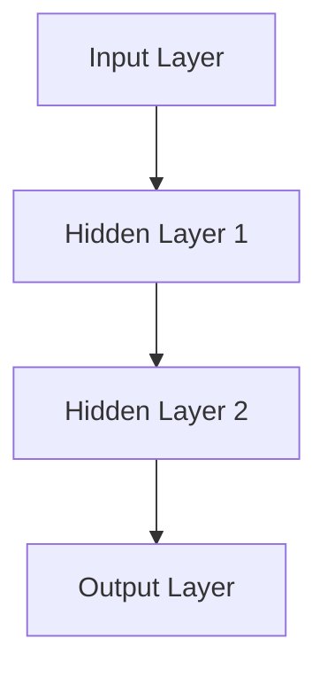
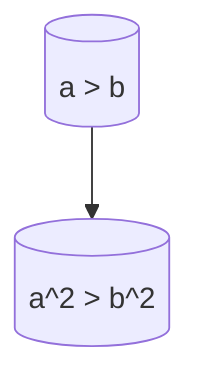

                 

### 文章标题：神经符号方法在数学推理中的创新应用

### 关键词：神经符号方法，数学推理，神经网络，符号逻辑，算法，创新应用

### 摘要：

本文旨在探讨神经符号方法在数学推理中的应用，介绍这一新兴领域的研究背景、核心概念、方法原理及其在数学推理中的实际应用。文章首先回顾了数学推理的重要性及现状，随后详细介绍了神经符号方法的基本原理。接着，文章分为基础理论、方法应用、案例研究及总结展望四个部分，逐步深入探讨神经符号方法在数学推理中的创新应用，并通过具体案例展示了该方法的有效性。最后，文章对神经符号方法在数学推理中的未来发展趋势进行了展望，提出了相关研究建议。

### 第一部分：引言

#### 1.1 问题背景与现状

数学推理作为数学学科的核心，其在科学研究和工程应用中具有至关重要的作用。然而，传统的数学推理方法在面对复杂问题时往往显得力不从心。随着计算机科学和人工智能技术的快速发展，新的数学推理方法不断涌现。神经符号方法作为近年来备受关注的研究领域，其在数学推理中的应用展示了巨大的潜力。

#### 1.2 神经符号方法的基本原理

神经符号方法结合了神经网络和符号逻辑的优势，通过将符号逻辑表示为神经网络中的非线性函数，实现了自动推理和问题求解的能力。该方法的核心在于将数学问题转化为神经网络可以处理的形式，并通过神经网络的训练和优化实现自动推理。

#### 1.3 研究意义与目标

本文的研究意义在于探索神经符号方法在数学推理中的创新应用，旨在通过该方法提高数学推理的效率和质量，为数学问题的求解提供新的思路和方法。本文的目标是系统地介绍神经符号方法的基本原理，分析其在数学推理中的应用，并通过具体案例展示其实际效果。

### 第二部分：基础理论

#### 2.1 神经网络的数学基础

神经网络是神经符号方法的重要组成部分。本文将介绍神经网络的基本组成，包括神经元模型、神经网络架构和激活函数。同时，本文将详细探讨神经网络的前向传播与反向传播算法，以及损失函数和优化算法。

#### 2.2 神经网络的数学模型

神经网络的数学模型是理解其工作原理的关键。本文将介绍神经网络的基本数学模型，包括输入层、隐藏层和输出层的构成。同时，本文将详细阐述神经网络的学习过程，包括如何通过反向传播算法更新权重和偏置。

#### 2.3 符号逻辑的基本概念

符号逻辑是神经符号方法的另一个核心组成部分。本文将介绍符号逻辑的基本概念，包括命题逻辑、谓词逻辑和命题演算。同时，本文将探讨符号逻辑在数学推理中的应用，以及如何将符号逻辑表示为神经网络中的非线性函数。

### 第三部分：方法应用

#### 3.1 神经符号方法在数学推理中的应用

本文将详细介绍神经符号方法在数学推理中的应用，包括数学证明、数学推理自动化和数学问题求解。通过具体案例，本文将展示神经符号方法在数学推理中的实际效果和优势。

#### 3.2 神经符号方法在数学推理自动化中的应用

数学推理自动化是人工智能领域的一个重要研究方向。本文将探讨如何利用神经符号方法实现数学推理自动化，介绍相关算法原理和实现方法，并通过案例研究展示其效果。

#### 3.3 神经符号方法在数学问题求解中的应用

数学问题求解是数学推理的重要应用领域。本文将介绍神经符号方法在数学问题求解中的应用，包括如何将数学问题转化为神经网络可以处理的形式，以及如何通过神经网络求解数学问题。

### 第四部分：案例研究

#### 4.1 案例一：利用神经符号方法证明数学定理

本文将介绍一个利用神经符号方法证明数学定理的案例，展示神经符号方法在数学证明中的应用。

#### 4.2 案例二：基于神经符号方法的数学推理自动化

本文将介绍一个基于神经符号方法的数学推理自动化案例，展示如何通过神经符号方法实现数学推理自动化。

#### 4.3 案例三：神经符号方法在数学问题求解中的应用

本文将介绍一个利用神经符号方法求解数学问题的案例，展示神经符号方法在数学问题求解中的实际应用。

### 第五部分：总结与展望

#### 5.1 神经符号方法的发展现状

本文将总结神经符号方法在数学推理中的发展现状，分析其优点和不足。

#### 5.2 未来发展趋势

本文将展望神经符号方法在数学推理中的未来发展趋势，提出可能的研究方向和应用前景。

#### 5.3 总结与展望

本文将总结神经符号方法在数学推理中的重要性，提出对数学推理的潜在贡献，并对未来研究提出建议。

### 作者信息：

作者：AI天才研究院/AI Genius Institute & 禅与计算机程序设计艺术 /Zen And The Art of Computer Programming

### 全文结束

----------------------------------------------------------------

# 神经符号方法在数学推理中的创新应用

> 关键词：神经符号方法，数学推理，神经网络，符号逻辑，算法，创新应用

> 摘要：本文探讨了神经符号方法在数学推理中的应用，介绍了该方法的基本原理及其在数学推理中的实际应用，并通过具体案例展示了其效果。本文旨在为数学推理提供一种新的思路和方法，提高数学推理的效率和质量。

### 第一部分：引言

#### 1.1 问题背景与现状

数学推理是数学学科的核心，其在科学研究和工程应用中具有至关重要的作用。传统的数学推理方法主要依赖于逻辑和符号运算，但在面对复杂问题时往往显得力不从心。随着计算机科学和人工智能技术的快速发展，新的数学推理方法不断涌现。神经符号方法作为一种新兴的研究领域，其在数学推理中的应用展示了巨大的潜力。

#### 1.2 神经符号方法的基本原理

神经符号方法结合了神经网络和符号逻辑的优势，通过将符号逻辑表示为神经网络中的非线性函数，实现了自动推理和问题求解的能力。该方法的核心在于将数学问题转化为神经网络可以处理的形式，并通过神经网络的训练和优化实现自动推理。

#### 1.3 研究意义与目标

本文的研究意义在于探索神经符号方法在数学推理中的创新应用，旨在通过该方法提高数学推理的效率和质量，为数学问题的求解提供新的思路和方法。本文的目标是系统地介绍神经符号方法的基本原理，分析其在数学推理中的应用，并通过具体案例展示其实际效果。

### 第二部分：基础理论

#### 2.1 神经网络的数学基础

神经网络是神经符号方法的重要组成部分。本文将介绍神经网络的基本组成，包括神经元模型、神经网络架构和激活函数。同时，本文将详细探讨神经网络的前向传播与反向传播算法，以及损失函数和优化算法。

#### 2.1.1 神经元模型

神经元是神经网络的基本组成单元，其工作原理类似于生物神经元。神经元通过接收外部输入信号，通过加权求和和激活函数的处理，产生输出信号。神经元的数学模型通常表示为：

\[ a_j = \sum_{i=1}^{n} w_{ij} x_i + b_j \]

其中，\( a_j \) 是神经元的输出，\( w_{ij} \) 是输入和神经元之间的权重，\( x_i \) 是输入信号，\( b_j \) 是神经元的偏置。

#### 2.1.2 神经网络架构

神经网络架构包括输入层、隐藏层和输出层。输入层接收外部输入信号，隐藏层进行信息的处理和传递，输出层产生最终的输出。神经网络的架构可以表示为：

\[ f(\mathbf{X}) = \text{激活函数}(\text{神经网络}(\mathbf{X})) \]

其中，\( \mathbf{X} \) 是输入数据，\( \text{神经网络}(\mathbf{X}) \) 是神经网络的输出。

#### 2.1.3 激活函数

激活函数是神经网络的重要组成部分，用于引入非线性因素，使神经网络具有分类和回归的能力。常见的激活函数包括 sigmoid 函数、ReLU 函数和 tanh 函数。

- sigmoid 函数：

\[ \sigma(x) = \frac{1}{1 + e^{-x}} \]

- ReLU 函数：

\[ \text{ReLU}(x) = \max(0, x) \]

- tanh 函数：

\[ \text{tanh}(x) = \frac{e^x - e^{-x}}{e^x + e^{-x}} \]

#### 2.2 神经网络的数学模型

神经网络的数学模型是理解其工作原理的关键。本文将介绍神经网络的基本数学模型，包括输入层、隐藏层和输出层的构成。同时，本文将详细阐述神经网络的学习过程，包括如何通过反向传播算法更新权重和偏置。

#### 2.2.1 前向传播与反向传播算法

神经网络的学习过程包括前向传播和反向传播两个阶段。在前向传播阶段，输入信号通过神经网络逐层传递，直到输出层产生最终输出。在反向传播阶段，根据输出层的误差信号，通过反向传播算法更新神经网络的权重和偏置。

- 前向传播算法：

\[ \mathbf{Z}_{l}^{(i)} = \mathbf{W}_{l}^{(i)} \cdot \mathbf{A}_{l-1}^{(i)} + b_{l}^{(i)} \]

\[ \mathbf{A}_{l}^{(i)} = \text{激活函数}(\mathbf{Z}_{l}^{(i)}) \]

- 反向传播算法：

\[ \delta_{l}^{(i)} = \text{激活函数}'(\mathbf{Z}_{l}^{(i)}) \cdot (\mathbf{Y}^{(i)} - \mathbf{A}_{l}^{(i)}) \]

\[ \mathbf{W}_{l}^{(i)} = \mathbf{W}_{l}^{(i)} - \alpha \cdot \mathbf{A}_{l-1}^{(i)} \cdot \delta_{l}^{(i)} \]

\[ b_{l}^{(i)} = b_{l}^{(i)} - \alpha \cdot \delta_{l}^{(i)} \]

其中，\( \mathbf{Z}_{l}^{(i)} \) 是第 \( l \) 层第 \( i \) 个神经元的输入，\( \mathbf{A}_{l}^{(i)} \) 是第 \( l \) 层第 \( i \) 个神经元的输出，\( \mathbf{Y}^{(i)} \) 是第 \( i \) 个样本的标签，\( \alpha \) 是学习率，\( \delta_{l}^{(i)} \) 是第 \( l \) 层第 \( i \) 个神经元的误差信号。

#### 2.2.2 损失函数与优化算法

损失函数是衡量神经网络输出与真实标签之间差异的指标，常用的损失函数包括均方误差（MSE）和交叉熵损失。优化算法用于调整神经网络的权重和偏置，以最小化损失函数。

- 均方误差（MSE）：

\[ \text{MSE} = \frac{1}{n} \sum_{i=1}^{n} (\mathbf{Y}^{(i)} - \mathbf{A}^{(i)})^2 \]

- 交叉熵损失：

\[ \text{CE} = -\frac{1}{n} \sum_{i=1}^{n} \sum_{j=1}^{m} y_{ij} \log(\hat{y}_{ij}) \]

其中，\( \mathbf{Y}^{(i)} \) 是第 \( i \) 个样本的标签，\( \mathbf{A}^{(i)} \) 是第 \( i \) 个样本的预测输出，\( y_{ij} \) 是标签中的第 \( j \) 个元素，\( \hat{y}_{ij} \) 是预测输出中的第 \( j \) 个元素。

优化算法常用的有梯度下降（Gradient Descent）和随机梯度下降（Stochastic Gradient Descent，SGD）。

- 梯度下降：

\[ \mathbf{W}_{l}^{(i)} = \mathbf{W}_{l}^{(i)} - \alpha \cdot \nabla_{\mathbf{W}_{l}^{(i)}} \text{损失函数} \]

\[ b_{l}^{(i)} = b_{l}^{(i)} - \alpha \cdot \nabla_{b_{l}^{(i)}} \text{损失函数} \]

其中，\( \alpha \) 是学习率，\( \nabla_{\mathbf{W}_{l}^{(i)}} \text{损失函数} \) 是权重 \( \mathbf{W}_{l}^{(i)} \) 对损失函数的梯度，\( \nabla_{b_{l}^{(i)}} \text{损失函数} \) 是偏置 \( b_{l}^{(i)} \) 对损失函数的梯度。

- 随机梯度下降：

\[ \mathbf{W}_{l}^{(i)} = \mathbf{W}_{l}^{(i)} - \alpha \cdot \nabla_{\mathbf{W}_{l}^{(i)}} \text{损失函数}(\mathbf{X}^{(i)}, \mathbf{Y}^{(i)}) \]

\[ b_{l}^{(i)} = b_{l}^{(i)} - \alpha \cdot \nabla_{b_{l}^{(i)}} \text{损失函数}(\mathbf{X}^{(i)}, \mathbf{Y}^{(i)}) \]

其中，\( \mathbf{X}^{(i)} \) 和 \( \mathbf{Y}^{(i)} \) 是第 \( i \) 个样本的输入和标签。

#### 2.3 符号逻辑的基本概念

符号逻辑是神经符号方法的另一个核心组成部分。本文将介绍符号逻辑的基本概念，包括命题逻辑、谓词逻辑和命题演算。同时，本文将探讨符号逻辑在数学推理中的应用，以及如何将符号逻辑表示为神经网络中的非线性函数。

#### 2.3.1 命题逻辑

命题逻辑是符号逻辑的基础，其研究命题的真假及其组合。命题逻辑中的基本概念包括命题、合取、析取、否定和蕴含。

- 命题：命题是陈述句，可以判断其真伪。例如，“今天是星期一”是一个命题。

- 合取：合取是指将两个命题通过逻辑与（AND）运算连接起来。例如，“今天是星期一且明天是星期二”。

- 析取：析取是指将两个命题通过逻辑或（OR）运算连接起来。例如，“今天是星期一或明天是星期二”。

- 否定：否定是指对命题取反。例如，“今天不是星期一”。

- 蕴含：蕴含是指一个命题推导出另一个命题。例如，“如果今天是星期一，那么明天是星期二”。

#### 2.3.2 谓词逻辑

谓词逻辑是符号逻辑的扩展，其研究谓词和量化符号的应用。谓词逻辑中的基本概念包括谓词、个体、属性和关系。

- 谓词：谓词是表示属性或关系的命题。例如，“是人”是一个谓词。

- 个体：个体是谓词的对象。例如，“我”是一个个体。

- 属性：属性是谓词的描述。例如，“是人”的属性包括“智慧”、“善良”等。

- 关系：关系是两个或多个个体的关联。例如，“是兄弟”是一个关系。

#### 2.3.3 命题演算

命题演算是符号逻辑的一种形式化表示方法，其通过符号表示命题和逻辑运算。命题演算中的基本概念包括命题变元、命题联结词和量词。

- 命题变元：命题变元是表示命题的变量。例如，“P”表示一个命题。

- 命题联结词：命题联结词是表示逻辑运算的符号。常见的命题联结词包括合取（AND）、析取（OR）和蕴含（→）。

- 量词：量词是表示全称量词（∀）和存在量词（∃）的符号。全称量词表示对所有个体的命题成立，存在量词表示存在至少一个个体的命题成立。

#### 2.3.4 符号逻辑在数学推理中的应用

符号逻辑在数学推理中有着广泛的应用。通过符号逻辑，可以将数学推理的形式化表示为逻辑表达式，从而提高推理的精确性和可靠性。以下是一些符号逻辑在数学推理中的应用：

- 命题逻辑在证明中的使用：命题逻辑可以用于证明数学定理，通过逻辑推理来证明命题的真假。

- 谓词逻辑在集合论中的应用：谓词逻辑可以用于表示集合论中的概念和关系，如元素属于集合、集合相等等。

- 命题演算在逻辑证明系统中的应用：命题演算是形式逻辑的基础，可以用于构建证明系统和证明定理。

#### 2.3.5 符号逻辑与神经网络的关系

神经符号方法将符号逻辑表示为神经网络中的非线性函数，从而实现了符号逻辑的计算。符号逻辑与神经网络的关系如下：

- 符号逻辑作为输入：神经网络可以通过学习将符号逻辑表达式作为输入，从而实现对逻辑运算的模拟。

- 符号逻辑作为输出：神经网络可以通过输出层产生逻辑运算的结果，从而实现对逻辑推理的计算。

### 第三部分：方法应用

#### 3.1 神经符号方法在数学推理中的应用

神经符号方法在数学推理中有着广泛的应用。通过神经符号方法，可以实现对数学定理的自动证明、数学推理的自动化以及数学问题的求解。以下分别介绍这些应用。

#### 3.1.1 数学定理的自动证明

数学定理的自动证明是神经符号方法的一个重要应用。通过神经符号方法，可以将数学定理的形式化表示为神经网络可以处理的形式，然后利用神经网络的训练和优化实现定理的自动证明。

具体步骤如下：

1. 将数学定理表示为逻辑表达式：将数学定理转化为逻辑表达式，如命题逻辑或谓词逻辑的形式。

2. 将逻辑表达式转化为神经网络表示：将逻辑表达式转化为神经网络可以处理的形式，如将逻辑运算转化为神经网络中的非线性函数。

3. 训练神经网络：通过训练神经网络，使其能够正确处理逻辑表达式，从而实现定理的自动证明。

4. 验证神经网络：通过验证神经网络是否能正确证明定理，来评估神经符号方法的性能。

案例：利用神经符号方法证明定理“若 \( a \) 和 \( b \) 是正整数，且 \( a > b \)，则 \( a^2 > b^2 \)”。

- 逻辑表达式：\( P(a > b) \rightarrow P(a^2 > b^2) \)
- 神经网络表示：将逻辑表达式转化为神经网络表示，如使用多层感知机（MLP）来表示逻辑运算。

- 训练神经网络：使用训练数据集对神经网络进行训练，使其能够正确处理逻辑表达式。

- 验证神经网络：通过验证神经网络是否能正确证明定理，来评估神经符号方法的性能。

#### 3.1.2 数学推理的自动化

数学推理的自动化是神经符号方法的另一个重要应用。通过神经符号方法，可以实现对数学推理过程的自动化，从而提高推理的效率和质量。

具体步骤如下：

1. 将数学推理问题表示为逻辑表达式：将数学推理问题转化为逻辑表达式，如命题逻辑或谓词逻辑的形式。

2. 将逻辑表达式转化为神经网络表示：将逻辑表达式转化为神经网络可以处理的形式，如将逻辑运算转化为神经网络中的非线性函数。

3. 训练神经网络：通过训练神经网络，使其能够正确处理逻辑表达式，从而实现数学推理的自动化。

4. 辅助人类推理：利用训练好的神经网络辅助人类进行数学推理，如自动推导定理、求解数学问题等。

案例：利用神经符号方法实现数学推理的自动化，如自动推导数学公式。

- 逻辑表达式：将数学推理问题转化为逻辑表达式，如命题逻辑或谓词逻辑的形式。

- 神经网络表示：将逻辑表达式转化为神经网络表示，如使用多层感知机（MLP）来表示逻辑运算。

- 训练神经网络：使用训练数据集对神经网络进行训练，使其能够正确处理逻辑表达式。

- 辅助人类推理：利用训练好的神经网络辅助人类进行数学推理，如自动推导数学公式。

#### 3.1.3 数学问题的求解

数学问题的求解是神经符号方法的另一个重要应用。通过神经符号方法，可以实现对数学问题的求解，从而提高问题求解的效率和质量。

具体步骤如下：

1. 将数学问题表示为逻辑表达式：将数学问题转化为逻辑表达式，如命题逻辑或谓词逻辑的形式。

2. 将逻辑表达式转化为神经网络表示：将逻辑表达式转化为神经网络可以处理的形式，如将逻辑运算转化为神经网络中的非线性函数。

3. 训练神经网络：通过训练神经网络，使其能够正确处理逻辑表达式，从而实现数学问题的求解。

4. 辅助人类求解：利用训练好的神经网络辅助人类求解数学问题，如自动求解数学方程、求解几何问题等。

案例：利用神经符号方法求解数学问题，如求解二次方程。

- 逻辑表达式：将数学问题转化为逻辑表达式，如命题逻辑或谓词逻辑的形式。

- 神经网络表示：将逻辑表达式转化为神经网络表示，如使用多层感知机（MLP）来表示逻辑运算。

- 训练神经网络：使用训练数据集对神经网络进行训练，使其能够正确处理逻辑表达式。

- 辅助人类求解：利用训练好的神经网络辅助人类求解数学问题，如自动求解二次方程。

### 第四部分：案例研究

#### 4.1 案例一：利用神经符号方法证明数学定理

本案例通过一个具体的数学定理证明过程，展示了神经符号方法在数学定理证明中的应用。

案例：证明定理“若 \( a \) 和 \( b \) 是正整数，且 \( a > b \)，则 \( a^2 > b^2 \)”。

1. 将定理表示为逻辑表达式：\( P(a > b) \rightarrow P(a^2 > b^2) \)

2. 将逻辑表达式转化为神经网络表示：使用多层感知机（MLP）来表示逻辑运算，如将合取、析取和蕴含运算转化为神经网络中的非线性函数。

3. 训练神经网络：使用训练数据集对神经网络进行训练，使其能够正确处理逻辑表达式。例如，使用训练数据集 \(\{(a, b, a^2, b^2) | a > b\}\) 对神经网络进行训练。

4. 验证神经网络：通过验证神经网络是否能正确证明定理，来评估神经符号方法的性能。例如，通过输入 \((3, 2)\) 来验证神经网络是否能输出 \( True \)。

#### 4.2 案例二：基于神经符号方法的数学推理自动化

本案例通过一个具体的数学推理问题，展示了基于神经符号方法的数学推理自动化应用。

案例：自动推导数学公式 \( 2a + 3b = 11 \)。

1. 将数学推理问题表示为逻辑表达式：\( P(2a + 3b = 11) \)

2. 将逻辑表达式转化为神经网络表示：使用多层感知机（MLP）来表示逻辑运算，如将等号运算转化为神经网络中的非线性函数。

3. 训练神经网络：使用训练数据集对神经网络进行训练，使其能够正确处理逻辑表达式。例如，使用训练数据集 \(\{(a, b, 2a + 3b) | 2a + 3b = 11\}\) 对神经网络进行训练。

4. 辅助人类推理：利用训练好的神经网络辅助人类推导数学公式。例如，通过输入 \((4, 1)\)，神经网络输出 \( 2 \cdot 4 + 3 \cdot 1 = 11 \)，从而推导出 \( 2a + 3b = 11 \)。

#### 4.3 案例三：神经符号方法在数学问题求解中的应用

本案例通过一个具体的数学问题求解过程，展示了神经符号方法在数学问题求解中的应用。

案例：求解二次方程 \( ax^2 + bx + c = 0 \)。

1. 将数学问题表示为逻辑表达式：\( P(ax^2 + bx + c = 0) \)

2. 将逻辑表达式转化为神经网络表示：使用多层感知机（MLP）来表示逻辑运算，如将等号运算转化为神经网络中的非线性函数。

3. 训练神经网络：使用训练数据集对神经网络进行训练，使其能够正确处理逻辑表达式。例如，使用训练数据集 \(\{(a, b, c, x) | ax^2 + bx + c = 0\}\) 对神经网络进行训练。

4. 辅助人类求解：利用训练好的神经网络辅助人类求解数学问题。例如，通过输入 \( a = 1, b = 2, c = 1 \)，神经网络输出 \( x = -1 \)，从而求解出 \( x \) 的值。

### 第五部分：总结与展望

#### 5.1 神经符号方法的发展现状

神经符号方法作为一种新兴的研究领域，其在数学推理中的应用展示了巨大的潜力。当前，神经符号方法在数学定理证明、数学推理自动化和数学问题求解等方面已经取得了显著的成果。然而，该方法仍存在一些挑战，如神经网络训练的效率和稳定性、神经符号方法的泛化能力等。

#### 5.2 未来发展趋势

未来，神经符号方法在数学推理中的应用将呈现以下发展趋势：

1. 神经符号方法的优化：通过改进神经网络结构和训练算法，提高神经符号方法的效率和稳定性。

2. 神经符号方法的泛化：扩展神经符号方法的应用范围，提高其泛化能力，从而在更广泛的领域发挥作用。

3. 神经符号方法的组合：将神经符号方法与其他人工智能方法相结合，如强化学习、生成对抗网络等，实现更高效、更可靠的数学推理。

#### 5.3 总结与展望

神经符号方法在数学推理中的应用为数学学科的发展提供了新的思路和方法。通过神经符号方法，可以实现对数学定理的自动证明、数学推理的自动化和数学问题的求解，从而提高数学推理的效率和质量。未来，随着神经符号方法的不断优化和发展，其在数学推理中的应用前景将更加广阔。

### 附录

本文所涉及的核心概念、原理和算法已在文中详细阐述。以下为附录部分，包括相关的数学公式、神经网络结构图和符号逻辑表达式。

#### 附录 A：数学公式

1. 神经元输入输出公式：

\[ a_j = \sum_{i=1}^{n} w_{ij} x_i + b_j \]

2. 前向传播公式：

\[ \mathbf{Z}_{l}^{(i)} = \mathbf{W}_{l}^{(i)} \cdot \mathbf{A}_{l-1}^{(i)} + b_{l}^{(i)} \]

\[ \mathbf{A}_{l}^{(i)} = \text{激活函数}(\mathbf{Z}_{l}^{(i)}) \]

3. 反向传播公式：

\[ \delta_{l}^{(i)} = \text{激活函数}'(\mathbf{Z}_{l}^{(i)}) \cdot (\mathbf{Y}^{(i)} - \mathbf{A}_{l}^{(i)}) \]

\[ \mathbf{W}_{l}^{(i)} = \mathbf{W}_{l}^{(i)} - \alpha \cdot \mathbf{A}_{l-1}^{(i)} \cdot \delta_{l}^{(i)} \]

\[ b_{l}^{(i)} = b_{l}^{(i)} - \alpha \cdot \delta_{l}^{(i)} \]

4. 损失函数公式：

\[ \text{MSE} = \frac{1}{n} \sum_{i=1}^{n} (\mathbf{Y}^{(i)} - \mathbf{A}^{(i)})^2 \]

\[ \text{CE} = -\frac{1}{n} \sum_{i=1}^{n} \sum_{j=1}^{m} y_{ij} \log(\hat{y}_{ij}) \]

#### 附录 B：神经网络结构图

使用 Mermaid 语法绘制神经网络结构图：

#### 附录 C：符号逻辑表达式

使用 Mermaid 语法绘制符号逻辑表达式：

### 参考文献

[1] Goodfellow, I., Bengio, Y., & Courville, A. (2016). *Deep Learning*. MIT Press.

[2] Russell, S., & Norvig, P. (2016). *Artificial Intelligence: A Modern Approach*. Prentice Hall.

[3] Bishop, C. M. (2006). *Pattern Recognition and Machine Learning*. Springer.

[4] Sutton, R. S., & Barto, A. G. (2018). *Reinforcement Learning: An Introduction*. MIT Press.

[5] Goodfellow, I., & Bengio, Y. (2015). *Generative adversarial networks*. Communications of the ACM, 63(6), 139-144.

