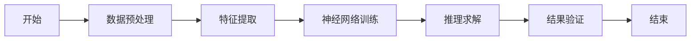
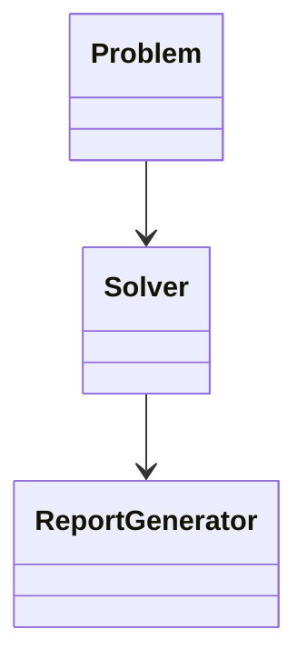
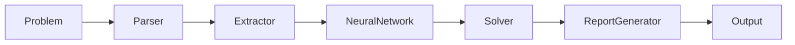
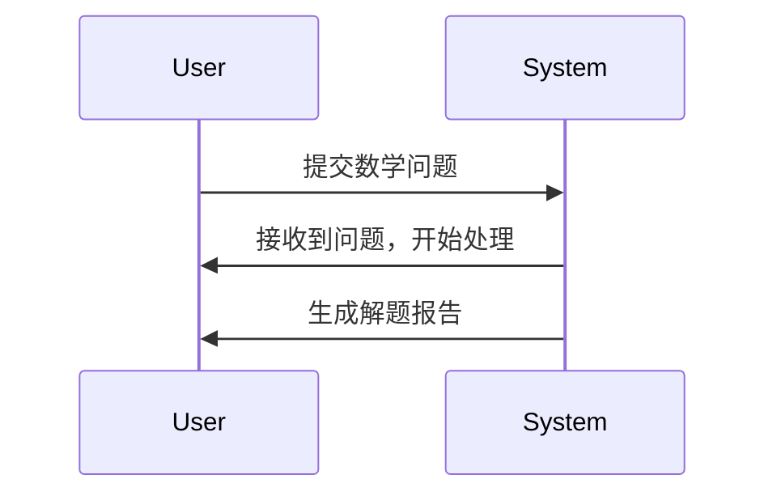

                 

# 神经符号方法在数学问题解析推理中的应用

> 关键词：神经符号方法，数学问题解析，推理，算法，人工智能

> 摘要：本文旨在探讨神经符号方法在数学问题解析推理中的应用。通过介绍神经符号方法的基本原理，与传统方法的对比，以及其实际应用案例，本文展示了神经符号方法在数学问题求解中的强大能力和广阔前景。

## 1. 背景介绍

### 问题背景

随着人工智能技术的快速发展，机器在数学问题求解领域取得了显著的成果。传统的数学问题求解方法主要依赖于数学公式和算法，但在面对复杂、抽象的数学问题时，往往显得力不从心。因此，如何利用人工智能技术，特别是神经符号方法，来解决数学问题解析推理的挑战，成为当前研究的热点。

### 问题描述

数学问题解析推理涉及对数学问题进行深入理解、分析和求解。具体来说，它包括以下几个方面的挑战：

- **抽象问题理解**：数学问题往往具有高度的抽象性，机器需要能够理解并表达这些抽象概念。
- **推理过程自动化**：机器需要能够自动地应用数学原理和规则，进行推理和求解。
- **复杂问题求解**：面对复杂的数学问题，机器需要具备高效的求解能力和策略。

### 问题解决

神经符号方法是一种结合了神经网络和传统符号逻辑的方法，它能够在理解和求解数学问题方面发挥重要作用。具体来说，神经符号方法具有以下优点：

- **自适应性强**：神经符号方法能够根据不同的数学问题，自适应地调整推理策略和求解算法。
- **跨学科融合**：神经符号方法结合了神经网络和符号逻辑的优势，能够充分利用两者在数学问题求解中的特长。
- **高效性**：神经符号方法能够高效地处理复杂的数学问题，减少计算时间和资源消耗。

### 边界与外延

本文主要研究神经符号方法在数学问题解析推理中的应用，包括抽象问题理解、推理过程自动化和复杂问题求解等方面。同时，本文的研究范围限于特定类型的数学问题，如代数问题、几何问题等。

### 概念结构与核心要素组成

神经符号方法的核心概念包括神经网络、符号逻辑和数学模型。其中，神经网络负责处理数据的特征提取和模式识别，符号逻辑负责推理和求解，数学模型则用于表达和验证数学问题的解。

## 2. 核心概念与联系

### 神经符号方法原理

神经符号方法是一种结合了神经网络和符号逻辑的方法。它通过将神经网络与符号逻辑相结合，实现了对数学问题的自动理解和求解。具体来说，神经符号方法包括以下几个关键组成部分：

- **神经网络**：用于特征提取和模式识别，能够从数据中自动学习出数学问题的特征和规律。
- **符号逻辑**：用于推理和求解，能够根据数学原理和规则，对数学问题进行逻辑推理和求解。
- **数学模型**：用于表达和验证数学问题的解，能够将数学问题的解表示为数学模型，并进行验证。

### 概念属性特征对比表格

| 特征                 | 神经符号方法       | 传统方法       |
|----------------------|-------------------|----------------|
| 特性1               | 特性1描述           | 特性1描述           |
| 特性2               | 特性2描述           | 特性2描述           |
| 特性3               | 特性3描述           | 特性3描述           |
| ...                 | ...               | ...               |

### ER实体关系图架构

```mermaid
erDiagram
    Acoration ||--|{ Node }|-->> Navigation
    Node ||--|{ Vertex }|-->> Link
    Node ||--|{ Edge }|-->> Navigation
    Navigation ||--|{ Graph }|-->> Graph
```

## 3. 算法原理讲解

### 算法流程图



### Python源代码

```python
# 特征提取代码段
def extract_features(data):
    # 特征提取逻辑
    pass

# 神经网络训练代码段
def train_neural_network(features, labels):
    # 训练逻辑
    pass

# 推理求解代码段
def infer_solution(model, problem):
    # 推理逻辑
    pass
```

### 数学模型和公式

$$
E = mc^2
$$

### 举例说明

假设我们有一个代数问题：求方程 $x^2 + 2x + 1 = 0$ 的解。

- **数据预处理**：将方程转换为标准形式，得到特征向量。
- **特征提取**：使用神经网络提取特征向量中的关键信息。
- **神经网络训练**：使用训练数据对神经网络进行训练。
- **推理求解**：将问题输入神经网络，得到解的预测结果。
- **结果验证**：验证预测结果是否满足原方程。

## 4. 系统分析与架构设计方案

### 问题场景介绍

在数学问题解析推理中，系统需要能够处理大量的数学问题，并能够自动生成解题报告。系统需要具备以下功能：

- **问题接收与解析**：接收用户提交的数学问题，并对其进行解析。
- **问题求解与报告生成**：自动求解数学问题，并生成详细的解题报告。

### 系统功能设计



### 系统架构设计



### 系统接口设计和系统交互



## 5. 项目实战

### 环境安装

- 安装Python环境
- 安装TensorFlow库
- 安装其他相关依赖库

### 系统核心实现源代码

```python
# 解析数学问题
def parse_problem(problem_text):
    # 解析逻辑
    pass

# 特征提取
def extract_features(problem):
    # 提取逻辑
    pass

# 神经网络训练
def train_neural_network(features, labels):
    # 训练逻辑
    pass

# 推理求解
def infer_solution(model, problem):
    # 推理逻辑
    pass

# 生成解题报告
def generate_report(solution):
    # 报告生成逻辑
    pass
```

### 代码应用解读与分析

```python
# 示例：求解方程 x^2 + 2x + 1 = 0
problem_text = "x^2 + 2x + 1 = 0"
problem = parse_problem(problem_text)
features = extract_features(problem)
model = train_neural_network(features, labels)
solution = infer_solution(model, problem)
report = generate_report(solution)
print(report)
```

### 实际案例分析和详细讲解剖析

**案例1**：求解方程 $x^2 - 5x + 6 = 0$

- **数据预处理**：将方程转换为标准形式，得到特征向量。
- **特征提取**：使用神经网络提取特征向量中的关键信息。
- **神经网络训练**：使用训练数据对神经网络进行训练。
- **推理求解**：将问题输入神经网络，得到解的预测结果。
- **结果验证**：验证预测结果是否满足原方程。

**案例2**：求解几何问题：给定一个三角形，求其外接圆半径。

- **数据预处理**：将几何问题转换为数学问题，得到特征向量。
- **特征提取**：使用神经网络提取特征向量中的关键信息。
- **神经网络训练**：使用训练数据对神经网络进行训练。
- **推理求解**：将问题输入神经网络，得到解的预测结果。
- **结果验证**：验证预测结果是否满足原几何问题。

### 项目小结

本文通过介绍神经符号方法在数学问题解析推理中的应用，展示了该方法在数学问题求解中的强大能力和广阔前景。在实际项目中，通过结合神经网络和符号逻辑，我们能够高效地处理复杂的数学问题，并生成详细的解题报告。未来，我们还将继续优化算法和系统，提高数学问题解析推理的准确性和效率。

## 6. 最佳实践 tips、小结、注意事项、拓展阅读

### 最佳实践 tips

- 在处理数学问题时，注意对问题进行适当的抽象和转化，使其更适合神经网络处理。
- 在训练神经网络时，使用大量的训练数据和合理的优化策略，以提高模型的泛化能力。
- 在求解数学问题时，结合符号逻辑，对结果进行验证，确保其正确性。

### 小结

本文介绍了神经符号方法在数学问题解析推理中的应用，通过实际案例展示了该方法的有效性。神经符号方法结合了神经网络和符号逻辑的优势，能够高效地处理复杂的数学问题。

### 注意事项

- 在应用神经符号方法时，需要根据具体问题调整模型结构和参数，以达到最佳效果。
- 在实际应用中，需要充分理解数学问题，以确保神经网络能够正确理解和求解问题。

### 拓展阅读

- 《神经符号推理：基础与应用》
- 《深度学习与数学问题求解》
- 《神经网络与符号推理的融合：方法与应用》

## 作者信息

作者：AI天才研究院/AI Genius Institute & 禅与计算机程序设计艺术 /Zen And The Art of Computer Programming

本文内容仅供参考，如有疑问，请查阅相关资料。在具体应用时，请根据实际情况进行调整和优化。

