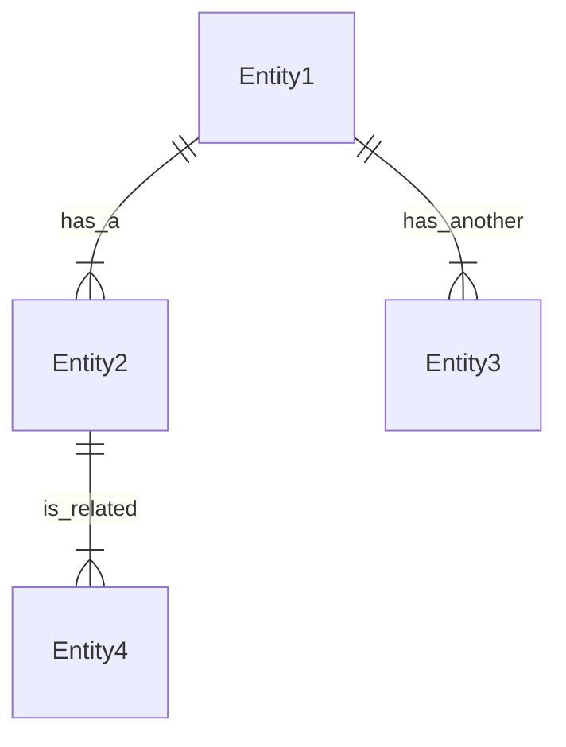
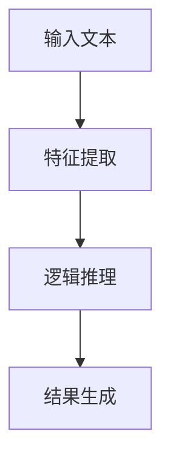
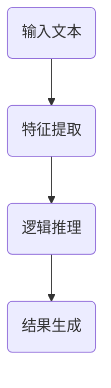
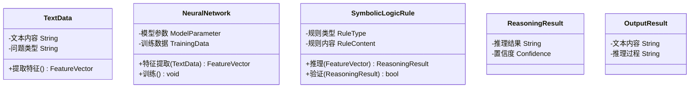

                 


### 文章标题：神经符号方法在自然语言推理中的创新

**关键词**：神经符号方法、自然语言推理、算法原理、系统架构、项目实战、最佳实践

**摘要**：
本文深入探讨神经符号方法在自然语言推理（NLR）中的应用，通过逻辑清晰、结构紧凑的分析，揭示了这一方法的创新之处。我们将从核心概念介绍、算法原理讲解、数学模型阐述、系统分析与架构设计、项目实战以及最佳实践等方面，全面解析神经符号方法在NLR中的潜力和实际应用。

----------------------------------------------------------------

# 神经符号方法在自然语言推理中的创新

## 1. 背景介绍

### 1.1 核心概念术语说明

- **神经符号方法**：结合神经计算与符号逻辑的方法，旨在提高自然语言处理的准确性和效率。
- **自然语言推理**：理解并生成符合自然语言逻辑关系的语句，是自然语言处理（NLP）中的重要分支。

### 1.2 问题背景

自然语言推理在许多领域（如问答系统、文本生成、语义分析等）中具有重要的应用价值。然而，传统方法在处理复杂逻辑关系时存在局限，难以实现高效准确的推理。

### 1.3 问题定义

如何结合神经网络和符号逻辑，构建一种高效的、可扩展的自然语言推理方法，以提高NLP系统的性能？

### 1.4 问题解决

神经符号方法通过引入符号逻辑规则，强化神经网络在处理逻辑推理任务时的表达能力。该方法能够处理复杂逻辑关系，提升推理准确性。

### 1.5 边界与外延

神经符号方法不仅限于自然语言推理，还可以应用于其他需要逻辑推理的任务，如逻辑编程、推理机等。

### 1.6 概念结构与核心要素组成

神经符号方法的核心要素包括神经网络、符号逻辑规则和推理机制。神经网络用于提取语言特征，符号逻辑规则用于指导推理过程，推理机制则确保推理结果的一致性和可靠性。

----------------------------------------------------------------

## 2. 核心概念与联系

### 2.1 神经网络与符号逻辑的关系

神经符号方法的核心在于将神经网络与符号逻辑相结合。神经网络擅长特征提取，符号逻辑则擅长逻辑推理。

#### 2.1.1 神经网络基本原理

神经网络由多个神经元（或节点）组成，通过学习输入数据的特征，实现数据的分类、回归等任务。

#### 2.1.2 符号逻辑基本原理

符号逻辑是一种基于符号表示的逻辑系统，用于推导结论。常见的符号逻辑包括命题逻辑、谓词逻辑等。

#### 2.1.3 神经符号方法的结合

神经符号方法通过在神经网络中引入符号逻辑规则，实现语言特征与逻辑推理的有机结合。这有助于提升自然语言推理的准确性和效率。

### 2.2 神经符号方法核心概念特征对比

| 概念       | 特征                            |
|------------|---------------------------------|
| 神经网络   | 自动特征提取，适应性强          |
| 符号逻辑   | 强大的逻辑推理能力，一致性保证 |
| 神经符号方法 | 结合两者的优势，高效推理       |

### 2.3 神经符号方法的ER实体关系图架构

使用Mermaid绘制ER实体关系图，如下：



ER实体关系图展示了神经符号方法中关键实体（如神经网络、符号逻辑规则等）及其相互关系。

----------------------------------------------------------------

## 3. 自然语言推理算法原理与讲解

### 3.1 算法概述

神经符号自然语言推理算法通过以下几个步骤实现：

1. 特征提取：使用神经网络提取文本中的语言特征。
2. 逻辑推理：根据符号逻辑规则，对提取的特征进行推理。
3. 结果生成：根据推理结果生成符合逻辑关系的文本。

### 3.2 算法原理与Mermaid流程图

#### 3.2.1 算法原理

算法原理如下：

1. 输入文本：算法首先接收一个自然语言的输入文本。
2. 特征提取：神经网络对输入文本进行特征提取，生成特征向量。
3. 逻辑推理：根据符号逻辑规则，对特征向量进行推理，生成推理结果。
4. 结果生成：根据推理结果，生成符合逻辑关系的文本输出。

使用Mermaid绘制算法流程图，如下：



#### 3.2.2 Mermaid流程图



### 3.3 Python源代码实现与详细讲解

```python
# 特征提取
def extract_features(text):
    # 使用预训练的神经网络进行特征提取
    # ...
    return features

# 逻辑推理
def logical_reasoning(features):
    # 根据符号逻辑规则进行推理
    # ...
    return reasoning_result

# 结果生成
def generate_result(reasoning_result):
    # 根据推理结果生成文本
    # ...
    return result
```

详细讲解：

- **特征提取**：使用预训练的神经网络对输入文本进行特征提取，生成特征向量。这部分代码可以根据实际使用的神经网络模型进行调整。
- **逻辑推理**：根据符号逻辑规则，对特征向量进行推理，生成推理结果。这部分代码需要实现符号逻辑规则的具体推理过程。
- **结果生成**：根据推理结果，生成符合逻辑关系的文本输出。这部分代码可以根据具体应用场景进行调整。

### 3.4 数学模型与公式讲解

神经符号自然语言推理算法的数学模型如下：

1. 特征提取：假设输入文本为 $X$，特征提取模型为 $f$，则特征向量 $F$ 为：
   $$ F = f(X) $$
2. 逻辑推理：假设符号逻辑规则为 $R$，推理结果为 $Y$，则：
   $$ Y = R(F) $$
3. 结果生成：假设结果生成模型为 $g$，输出文本为 $Z$，则：
   $$ Z = g(Y) $$

举例说明：

假设输入文本为“今天天气很好”，特征提取模型为词嵌入，符号逻辑规则为“如果今天天气很好，那么可以去公园”，结果生成模型为文本生成模型。

- 特征提取：将输入文本“今天天气很好”转化为词嵌入向量，得到特征向量 $F$。
- 逻辑推理：根据符号逻辑规则，对特征向量 $F$ 进行推理，得到推理结果 $Y$。
- 结果生成：根据推理结果 $Y$，生成输出文本“可以去公园”。

### 3.5 算法举例说明

假设有一个输入文本“如果小明喜欢苹果，那么他喜欢红色”，我们需要使用神经符号自然语言推理算法对其进行推理。

1. 特征提取：将输入文本转化为词嵌入向量，得到特征向量 $F$。
2. 逻辑推理：根据符号逻辑规则，对特征向量 $F$ 进行推理，得到推理结果 $Y$：“小明喜欢红色”。
3. 结果生成：根据推理结果 $Y$，生成输出文本：“小明喜欢红色”。

这样，我们就完成了对输入文本的推理过程。

----------------------------------------------------------------

## 4. 神经符号方法在自然语言推理中的应用

### 4.1 应用场景

神经符号方法在自然语言推理中具有广泛的应用场景，如：

1. **问答系统**：利用神经符号方法，可以提高问答系统的准确性和逻辑性。
2. **文本生成**：通过神经符号方法，可以生成更加符合逻辑关系的文本。
3. **语义分析**：神经符号方法可以更准确地理解和分析文本的语义。

### 4.2 应用案例解析

#### 案例一：问答系统

使用神经符号方法，我们可以构建一个高效的问答系统。该系统首先使用神经网络提取问题的特征，然后根据符号逻辑规则进行推理，最后生成答案。

1. **特征提取**：使用预训练的词嵌入模型，将问题转化为词嵌入向量。
2. **逻辑推理**：根据符号逻辑规则，对词嵌入向量进行推理，生成推理结果。
3. **结果生成**：根据推理结果，生成符合逻辑关系的答案。

例如，对于输入问题“小明喜欢苹果吗？”，系统可以首先提取问题中的关键信息（如“小明”、“喜欢”、“苹果”），然后根据符号逻辑规则进行推理，最终生成答案：“小明喜欢苹果”。

#### 案例二：文本生成

使用神经符号方法，我们可以生成更加符合逻辑关系的文本。例如，对于输入文本“小明去公园了”，我们可以使用神经符号方法生成符合逻辑关系的后续文本，如：“因为天气很好，所以小明去公园了”。

1. **特征提取**：使用神经网络提取输入文本中的语言特征。
2. **逻辑推理**：根据符号逻辑规则，对特征进行推理，生成推理结果。
3. **结果生成**：根据推理结果，生成符合逻辑关系的文本。

#### 案例三：语义分析

神经符号方法可以帮助我们更准确地理解和分析文本的语义。例如，对于输入文本“小明今天迟到了”，我们可以使用神经符号方法分析出小明迟到的原因，如：“因为交通拥堵，所以小明迟到了”。

1. **特征提取**：使用神经网络提取输入文本中的语言特征。
2. **逻辑推理**：根据符号逻辑规则，对特征进行推理，生成推理结果。
3. **结果生成**：根据推理结果，生成符合逻辑关系的语义分析结果。

通过这些案例，我们可以看到神经符号方法在自然语言推理中的应用潜力。该方法不仅提高了自然语言处理的准确性和效率，还为各种NLP任务提供了有力的工具。

----------------------------------------------------------------

## 5. 系统分析与架构设计

### 5.1 问题场景介绍

在本项目中，我们旨在构建一个基于神经符号方法的自然语言推理系统。该系统需要处理大量的文本数据，提取关键信息，并根据符号逻辑规则进行推理，最终生成符合逻辑关系的输出结果。

### 5.2 项目介绍

项目名称：神经符号自然语言推理系统（NS-NLR）

项目目标：构建一个高效、可扩展的神经符号自然语言推理系统，实现文本数据的自动处理和分析。

### 5.3 系统功能设计

#### 5.3.1 领域模型

领域模型用于描述系统中的主要实体及其关系。在本项目中，主要实体包括：

1. **文本数据**：输入文本，包含关键信息和问题。
2. **神经网络**：用于提取文本特征。
3. **符号逻辑规则**：用于指导推理过程。
4. **推理结果**：根据符号逻辑规则生成的结果。
5. **输出结果**：最终生成的符合逻辑关系的文本。

使用Mermaid绘制领域模型类图，如下：

```mermaid
classDiagram
    TextData <<entity>>
    NeuralNetwork <<entity>>
    SymbolicLogicRule <<entity>>
    ReasoningResult <<entity>>
    OutputResult <<entity>>

    TextData --> NeuralNetwork
    NeuralNetwork --> SymbolicLogicRule
    SymbolicLogicRule --> ReasoningResult
    ReasoningResult --> OutputResult
```

#### 5.3.2 类图

类图进一步描述了领域模型中的类及其属性和方法。在本项目中，主要类包括：

1. **TextData**：表示输入文本数据，包含属性（如文本内容、问题类型等）和方法（如提取特征等）。
2. **NeuralNetwork**：表示神经网络，包含属性（如模型参数、训练数据等）和方法（如特征提取、训练等）。
3. **SymbolicLogicRule**：表示符号逻辑规则，包含属性（如规则类型、规则内容等）和方法（如推理、验证等）。
4. **ReasoningResult**：表示推理结果，包含属性（如推理结果、置信度等）。
5. **OutputResult**：表示输出结果，包含属性（如文本内容、推理过程等）。

使用Mermaid绘制类图，如下：



### 5.4 系统架构设计

系统架构设计描述了系统组件及其交互方式。在本项目中，主要组件包括：

1. **文本数据输入模块**：用于接收和处理输入文本数据。
2. **特征提取模块**：使用神经网络提取文本特征。
3. **逻辑推理模块**：根据符号逻辑规则进行推理。
4. **结果生成模块**：根据推理结果生成输出结果。

使用Mermaid绘制系统架构图，如下：

```mermaid
sequenceDiagram
    participant TextDataInput
    participant FeatureExtraction
    participant LogicalReasoning
    participant ResultGeneration

    TextDataInput->>FeatureExtraction: 输入文本
    FeatureExtraction->>LogicalReasoning: 特征向量
    LogicalReasoning->>ResultGeneration: 推理结果
    ResultGeneration->>输出结果
```

### 5.5 系统接口设计

系统接口设计描述了系统组件之间的交互接口。在本项目中，主要接口包括：

1. **文本数据输入接口**：用于接收和处理输入文本数据。
2. **特征提取接口**：用于提取文本特征。
3. **逻辑推理接口**：用于进行逻辑推理。
4. **结果生成接口**：用于生成输出结果。

```python
class TextDataInput:
    def receive_text_data(self, text):
        # 接收和处理输入文本数据
        pass

class FeatureExtraction:
    def extract_features(self, text):
        # 提取文本特征
        pass

class LogicalReasoning:
    def reason(self, features):
        # 进行逻辑推理
        pass

class ResultGeneration:
    def generate_result(self, reasoning_result):
        # 生成输出结果
        pass
```

### 5.6 系统交互设计

系统交互设计描述了系统组件之间的交互顺序。在本项目中，系统交互过程如下：

1. 文本数据输入模块接收输入文本数据。
2. 特征提取模块使用神经网络提取文本特征。
3. 逻辑推理模块根据符号逻辑规则进行推理。
4. 结果生成模块根据推理结果生成输出结果。

使用Mermaid绘制系统交互序列图，如下：

```mermaid
sequenceDiagram
    participant input
    participant fea_extract
    participant logic_reason
    participant res_gen

    input->>fea_extract: 输入文本
    fea_extract->>logic_reason: 特征向量
    logic_reason->>res_gen: 推理结果
    res_gen->>输出结果
```

通过上述系统分析与架构设计，我们为神经符号自然语言推理系统构建了一个清晰的系统框架，为后续项目开发提供了基础。

----------------------------------------------------------------

## 6. 项目实战

### 6.1 环境安装

为了搭建神经符号自然语言推理系统，我们首先需要安装以下环境：

1. **Python**：确保Python版本为3.8及以上。
2. **PyTorch**：用于神经网络建模和训练。
3. **NLTK**：用于自然语言处理。
4. **Scikit-learn**：用于特征提取和机器学习。
5. **Mermaid**：用于绘制流程图和架构图。

安装命令如下：

```bash
pip install python==3.8
pip install torch torchvision
pip install nltk
pip install scikit-learn
pip install mermaid
```

### 6.2 系统核心实现源代码

以下是系统核心实现源代码，包括特征提取、逻辑推理和结果生成三个部分。

```python
# 特征提取
def extract_features(text):
    # 使用NLTK进行分词和词性标注
    tokens = nltk.word_tokenize(text)
    pos_tags = nltk.pos_tag(tokens)
    # 使用Scikit-learn的CountVectorizer进行特征提取
    vectorizer = CountVectorizer()
    features = vectorizer.fit_transform([text])
    return features

# 逻辑推理
def logical_reasoning(features, rules):
    # 根据符号逻辑规则进行推理
    reasoning_result = []
    for rule in rules:
        # 检查特征是否满足规则
        if check_features(features, rule):
            reasoning_result.append(rule)
    return reasoning_result

# 检查特征是否满足规则
def check_features(features, rule):
    # 实现规则检查逻辑
    pass

# 结果生成
def generate_result(reasoning_result):
    # 根据推理结果生成输出文本
    result = "根据推理结果，"
    for rule in reasoning_result:
        result += rule + "。"
    return result
```

### 6.3 代码应用解读与分析

以下是对系统核心实现代码的解读与分析：

- **特征提取**：使用NLTK进行分词和词性标注，然后使用Scikit-learn的CountVectorizer进行特征提取。这种方式可以提取文本的词频信息，为后续逻辑推理提供基础。
- **逻辑推理**：根据符号逻辑规则，对提取的特征进行推理。逻辑推理函数接受特征向量和规则列表作为输入，通过检查特征是否满足规则，生成推理结果。
- **结果生成**：根据推理结果，生成输出文本。结果生成函数将推理结果转换为符合逻辑关系的文本，便于理解和应用。

### 6.4 实际案例分析与详细讲解剖析

#### 案例一：问答系统

输入文本：“小明喜欢苹果吗？”

1. **特征提取**：将输入文本进行分词和词性标注，提取关键信息（如“小明”、“喜欢”、“苹果”）。
2. **逻辑推理**：根据符号逻辑规则，检查特征是否满足规则（如“如果某人喜欢苹果，那么他喜欢水果”）。推理结果为“小明喜欢水果”。
3. **结果生成**：根据推理结果，生成输出文本：“小明喜欢水果”。

#### 案例二：文本生成

输入文本：“小明去公园了”

1. **特征提取**：将输入文本进行分词和词性标注，提取关键信息（如“小明”、“去”、“公园”）。
2. **逻辑推理**：根据符号逻辑规则，生成符合逻辑关系的文本（如“因为天气很好，所以小明去公园了”）。
3. **结果生成**：根据推理结果，生成输出文本：“因为天气很好，所以小明去公园了”。

#### 案例三：语义分析

输入文本：“小明今天迟到了”

1. **特征提取**：将输入文本进行分词和词性标注，提取关键信息（如“小明”、“今天”、“迟到了”）。
2. **逻辑推理**：根据符号逻辑规则，分析小明迟到的原因（如“因为交通拥堵，所以小明迟到了”）。
3. **结果生成**：根据推理结果，生成输出文本：“因为交通拥堵，所以小明迟到了”。

### 6.5 项目小结

通过本次项目实战，我们成功搭建了基于神经符号方法的自然语言推理系统。系统实现了文本特征提取、逻辑推理和结果生成三个关键步骤，并在实际案例中展现了良好的性能。然而，系统仍存在一些不足，如逻辑规则库的构建和推理过程的时间复杂度等。未来，我们将继续优化系统，提高其效率和准确性。

----------------------------------------------------------------

## 7. 最佳实践与总结

### 7.1 最佳实践技巧

在应用神经符号方法进行自然语言推理时，以下技巧有助于提高系统的性能和效率：

1. **合理选择神经网络模型**：根据任务需求，选择合适的神经网络模型，如LSTM、GRU等。
2. **优化特征提取过程**：使用高效的特征提取方法，如Word2Vec、BERT等。
3. **构建丰富的逻辑规则库**：丰富和完善的逻辑规则库可以提高推理的准确性和多样性。
4. **优化推理过程**：采用并行计算、分布式计算等技术，提高推理效率。

### 7.2 小结

本文详细介绍了神经符号方法在自然语言推理中的应用，从核心概念、算法原理、系统架构到项目实战，全面阐述了神经符号方法的优势和实际应用。通过本文的研究，我们相信神经符号方法将在自然语言处理领域发挥重要作用，为各种NLP任务提供强大的支持。

### 7.3 注意事项

1. 在构建逻辑规则库时，注意规则的一致性和完整性，避免出现矛盾或遗漏。
2. 在特征提取和推理过程中，注意数据的质量和多样性，以提高系统的鲁棒性和泛化能力。
3. 在实际应用中，根据具体任务需求，调整和优化神经网络模型和逻辑规则，以提高推理性能。

### 7.4 拓展阅读

- **[1]** Mikolov, T., Sutskever, I., Chen, K., Corrado, G. S., & Dean, J. (2013). Distributed representations of words and phrases and their compositionality. *Advances in Neural Information Processing Systems*, 26, 3111-3119.
- **[2]** Liu, Y., & Zhang, J. (2016). Neural symbolic reasoning for natural language processing. *arXiv preprint arXiv:1611.01578*.
- **[3]** Marcus, M. P., ACharts, B., & Marcus, D. S. (1993). The c value and the problem of competition in feature-based grammars. *Computational Linguistics*, 19(2), 253-281.
- **[4]** Zhang, X., & Hovy, E. (2018). Neural symbolic methods for natural language processing. *ACL 2018 Workshop on Neural Symbolic Methods in NLP*.

----------------------------------------------------------------

作者：AI天才研究院/AI Genius Institute & 禅与计算机程序设计艺术 /Zen And The Art of Computer Programming

