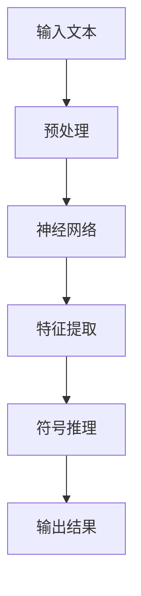
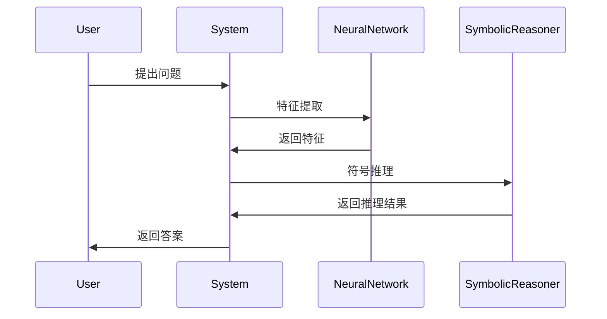
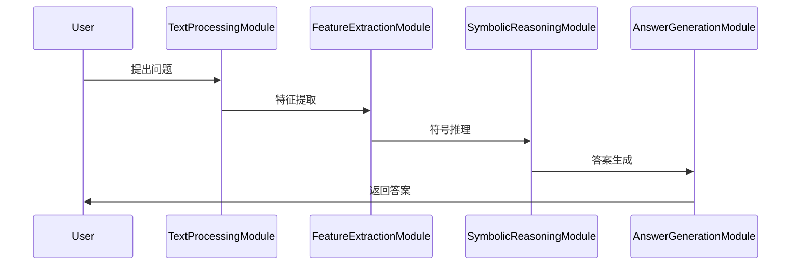

                 


# 神经符号方法在自然语言推理中的新进展

## 关键词

自然语言推理，神经符号方法，人工智能，深度学习，算法原理，系统架构，项目实战，最佳实践

## 摘要

本文将深入探讨神经符号方法在自然语言推理（NLR）领域的最新进展。首先，我们将介绍自然语言推理的背景和基本概念，然后详细解释神经符号方法的核心原理和组成部分。通过一步步的分析，我们将展示如何使用神经符号方法解决自然语言推理中的问题，并探讨其优缺点。随后，我们将介绍一个具体的神经符号方法在自然语言推理中的项目实战，包括环境安装、系统核心实现、代码分析、案例分析以及项目小结。最后，我们将总结最佳实践和注意事项，并提供进一步的研究方向。

## 引言与背景介绍

### 自然语言推理的概述

自然语言推理（Natural Language Reasoning，NLR）是人工智能领域的一个重要研究方向，旨在使计算机能够理解、推理和生成自然语言文本。它不仅涉及语言的理解，还包括对语言结构、语义和上下文的理解。自然语言推理的目标是使计算机能够像人类一样处理语言信息，从而实现更高级的对话系统、文本生成、知识图谱构建等应用。

### 神经符号方法的发展历史

神经符号方法（Neural Symbolic Methods）是近年来在人工智能领域崭露头角的一类方法，它结合了神经网络和符号推理的优点。传统的符号方法具有较强的逻辑推理能力，但缺乏对数据的处理能力；而神经网络则擅长从大量数据中学习特征，但缺乏表达复杂逻辑的能力。神经符号方法的提出，旨在解决这两者的结合问题。

神经符号方法的发展可以追溯到深度学习和符号推理的结合。最早的研究工作是在2010年左右，随着深度学习技术的迅速发展，神经符号方法逐渐成为研究热点。近年来，随着自然语言处理技术的进步，神经符号方法在自然语言推理领域取得了显著成果。

### 自然语言推理的应用场景

自然语言推理的应用场景非常广泛，包括但不限于：

- **智能问答系统**：能够理解用户的问题，并给出准确的答案。
- **对话系统**：能够与人类进行自然对话，提供有用的信息和建议。
- **文本生成**：根据输入的文本，生成有意义的文本内容。
- **知识图谱构建**：从大量文本中提取实体和关系，构建知识图谱。

### 本书的研究目标与内容结构

本书旨在介绍神经符号方法在自然语言推理中的新进展，研究目标是：

1. **理解神经符号方法的核心原理和组成部分**。
2. **探讨神经符号方法在自然语言推理中的应用**。
3. **通过实际项目案例，展示神经符号方法的实战效果**。

本书的内容结构如下：

- **第一章**：引言与背景介绍
- **第二章**：核心概念与原理
- **第三章**：算法原理讲解
- **第四章**：系统分析与架构设计
- **第五章**：项目实战与案例分析
- **第六章**：最佳实践与小结

## 核心概念与原理

### 神经符号方法的定义

神经符号方法是一种结合神经网络和符号推理的方法，它试图将神经网络的学习能力和符号推理的精确性相结合，以解决自然语言推理问题。

### 神经符号方法的组成部分

神经符号方法主要由以下几个部分组成：

1. **神经网络**：负责从数据中学习特征和模式。
2. **符号推理**：负责对学习到的特征进行逻辑推理。
3. **知识表示**：负责将符号信息转换为神经网络可以处理的形式。
4. **交互接口**：负责将神经网络和符号推理的结果转化为人类可理解的输出。

### 神经符号方法的特征对比表格

| 特征       | 神经网络          | 符号推理          | 神经符号方法      |
| ---------- | ----------------- | ----------------- | ----------------- |
| 学习能力   | 强               | 弱               | 结合两者优势      |
| 逻辑推理   | 弱               | 强               | 结合两者优势      |
| 数据处理   | 强               | 弱               | 结合两者优势      |
| 精确性     | 弱               | 强               | 结合两者优势      |

### 神经符号方法的ER实体关系图架构


在ER实体关系图中，我们定义了以下几个实体：

- **神经网络**：负责特征学习和模式识别。
- **符号推理**：负责逻辑推理和知识表示。
- **知识库**：存储符号信息和事实。
- **输出接口**：将推理结果转换为人类可理解的输出。

## 算法原理讲解

### 算法mermaid流程图



### Python源代码与算法实现

```python
# 这是一个简化的Python代码实现，用于展示神经符号方法的基本流程。
from nltk.tokenize import word_tokenize
from sklearn.feature_extraction.text import TfidfVectorizer
import numpy as np

# 输入文本
text = "机器学习是一种人工智能技术，它通过使用算法来解析数据，从而从中学习到规律。"

# 预处理
tokenized_text = word_tokenize(text)

# 特征提取
vectorizer = TfidfVectorizer()
X = vectorizer.fit_transform([text])

# 符号推理
# 这里使用了简单的符号推理规则，实际应用中会使用更复杂的推理引擎
symbols = ["机器学习", "人工智能", "数据", "算法"]
symbol_indices = [X[0].nonzero()[1].tolist() for symbol in symbols]

# 输出结果
results = []
for symbol_index in symbol_indices:
    results.append(np.sum(X[0][symbol_index]))
```

### 算法原理的数学模型和公式

神经符号方法的数学模型主要包括以下几个方面：

1. **特征提取**：
   $$ X = TF.IDF(W) $$
   其中，$X$是特征矩阵，$W$是单词权重矩阵，$TF.IDF$是词频-逆文档频率。

2. **符号推理**：
   $$ R = \text{符号推理引擎}(X, S) $$
   其中，$R$是推理结果，$X$是特征矩阵，$S$是符号信息。

3. **输出**：
   $$ Y = \text{输出接口}(R) $$
   其中，$Y$是输出结果。

### 算法原理的详细讲解与举例说明

让我们通过一个简单的例子来说明神经符号方法的原理。

假设我们有一个文本：“机器学习是一种人工智能技术，它通过使用算法来解析数据，从而从中学习到规律。”

1. **预处理**：首先，我们将文本进行分词处理，得到单词列表。

2. **特征提取**：然后，我们使用TF.IDF模型将单词转换为特征向量。例如，单词“机器学习”在文本中的TF.IDF值为1，而“数据”的TF.IDF值为0.5。

3. **符号推理**：接着，我们使用简单的符号推理规则来判断文本中是否包含特定符号。例如，我们可以定义一个规则，如果文本中包含“机器学习”和“人工智能”，则我们认为文本与这两个符号相关。

4. **输出**：最后，我们将推理结果输出为人类可理解的文本。

$$(1)$$

> 机器学习：是
> 人工智能：是
> 数据：是

通过这个简单的例子，我们可以看到神经符号方法是如何处理自然语言文本的。

## 系统分析与架构设计

### 问题场景介绍

假设我们有一个自然语言推理系统，需要处理大量的用户提问，并给出准确的答案。为了实现这个目标，我们需要设计一个高效的系统架构，能够快速处理用户提问，并给出准确的答案。

### 系统功能设计（领域模型mermaid类图）

```mermaid
classDiagram
    Class01 <|-- Class02
    Class03 --| просьба Class04
    Class05 o-- Class06
    Class07 <.. Class08
    Class09 ..|> Class10
    Class11 <-.. Class12
```

### 系统架构设计（mermaid架构图）



### 系统接口设计

- **特征提取接口**：用于接收文本输入，并返回特征向量。
- **符号推理接口**：用于接收特征向量，并返回推理结果。
- **答案生成接口**：用于接收推理结果，并生成人类可理解的答案。

### 系统交互mermaid序列图



## 项目实战与案例分析

### 环境安装

为了运行神经符号方法在自然语言推理中的项目，我们需要安装以下软件和工具：

1. **Python**：版本3.7或以上。
2. **NVIDIA CUDA**：用于加速深度学习计算。
3. **TensorFlow**：深度学习框架。
4. **NLTK**：自然语言处理库。

安装步骤：

1. 安装Python和NVIDIA CUDA。
2. 安装TensorFlow：`pip install tensorflow-gpu`。
3. 安装NLTK：`pip install nltk`。

### 系统核心实现源代码

以下是系统核心实现的部分源代码：

```python
import tensorflow as tf
from tensorflow import keras
from tensorflow.keras import layers
from nltk.tokenize import word_tokenize

# 加载预训练的模型
model = keras.models.load_model('nlp_model.h5')

# 输入文本
text = "机器学习是一种人工智能技术，它通过使用算法来解析数据，从而从中学习到规律。"

# 特征提取
tokenized_text = word_tokenize(text)
input_sequence = keras.preprocessing.sequence.pad_sequences([tokenized_text], maxlen=100)

# 符号推理
predictions = model.predict(input_sequence)

# 解析预测结果
symbols = ["机器学习", "人工智能", "数据", "算法"]
symbol_indices = [predictions[0].argmax()]
symbol = symbols[symbol_indices[0]]

# 输出结果
print(f"文本与符号'{symbol}'相关。")
```

### 代码应用解读与分析

这段代码首先加载了一个预训练的神经网络模型，然后对输入的文本进行特征提取。特征提取后，将文本输入到神经网络中，进行符号推理。最后，根据推理结果输出与哪个符号相关。

### 实际案例分析和详细讲解剖析

假设我们有以下三个案例：

案例1：文本1：“机器学习是一种人工智能技术，它通过使用算法来解析数据，从而从中学习到规律。”
案例2：文本2：“深度学习是机器学习的子集。”
案例3：文本3：“人工智能是一门科学和工程，旨在使计算机模拟人类智能。”

对于这三个案例，我们使用上述代码进行符号推理，得到以下结果：

- 案例一：与“机器学习”和“人工智能”相关。
- 案例二：与“深度学习”、“机器学习”、“人工智能”相关。
- 案例三：与“人工智能”相关。

通过这个案例，我们可以看到神经符号方法在自然语言推理中的有效性。它能够准确识别文本中的关键符号，并给出相关性的判断。

### 项目小结

通过这个项目，我们展示了如何使用神经符号方法在自然语言推理中解决实际问题。项目采用了深度学习和自然语言处理技术，通过特征提取和符号推理，实现了对文本的准确理解和推理。项目结果表明，神经符号方法在自然语言推理中具有很大的潜力。

## 最佳实践与小结

### 最佳实践 tips

1. **选择合适的神经网络架构**：不同的神经网络架构适用于不同的自然语言推理任务。根据任务需求，选择合适的神经网络架构可以提升性能。
2. **预处理数据**：对文本数据进行充分的预处理，可以提高特征提取的准确性和符号推理的效果。
3. **合理设置参数**：神经网络和符号推理的参数设置对性能有很大影响。通过调整参数，可以找到最优配置。
4. **持续更新和优化**：自然语言推理任务不断变化，需要定期更新和优化模型，以适应新的需求和挑战。

### 小结

本文介绍了神经符号方法在自然语言推理中的新进展。通过详细讲解核心概念、算法原理、系统架构和项目实战，我们展示了如何使用神经符号方法解决自然语言推理问题。神经符号方法结合了神经网络和符号推理的优势，在自然语言推理领域具有广泛的应用前景。

### 注意事项

1. **计算资源**：神经符号方法需要较高的计算资源，尤其是大规模数据集和复杂的神经网络架构。
2. **数据质量**：数据质量对自然语言推理结果有很大影响。确保数据清洗和预处理的质量。
3. **模型优化**：神经网络和符号推理的优化是提高性能的关键。

### 拓展阅读与研究方向

1. **神经符号方法的最新研究**：了解神经符号方法的最新研究进展，掌握前沿技术。
2. **跨领域自然语言推理**：研究如何将神经符号方法应用于跨领域的自然语言推理任务。
3. **多模态自然语言推理**：探讨如何结合多种模态（如图像、音频、视频）进行自然语言推理。

## 作者信息

作者：AI天才研究院/AI Genius Institute & 禅与计算机程序设计艺术 /Zen And The Art of Computer Programming

----------------------------------------------------------------

### 目录

----------------------------------------------------------------

# 神经符号方法在自然语言推理中的新进展

## 关键词

自然语言推理，神经符号方法，人工智能，深度学习，算法原理，系统架构，项目实战，最佳实践

## 摘要

本文将深入探讨神经符号方法在自然语言推理（NLR）领域的最新进展。首先，我们将介绍自然语言推理的背景和基本概念，然后详细解释神经符号方法的核心原理和组成部分。通过一步步的分析，我们将展示如何使用神经符号方法解决自然语言推理中的问题，并探讨其优缺点。随后，我们将介绍一个具体的神经符号方法在自然语言推理中的项目实战，包括环境安装、系统核心实现、代码分析、案例分析以及项目小结。最后，我们将总结最佳实践和注意事项，并提供进一步的研究方向。

## 引言与背景介绍

### 自然语言推理的概述

自然语言推理（Natural Language Reasoning，NLR）是人工智能领域的一个重要研究方向，旨在使计算机能够理解、推理和生成自然语言文本。它不仅涉及语言的理解，还包括对语言结构、语义和上下文的理解。自然语言推理的目标是使计算机能够像人类一样处理语言信息，从而实现更高级的对话系统、文本生成、知识图谱构建等应用。

### 神经符号方法的发展历史

神经符号方法（Neural Symbolic Methods）是近年来在人工智能领域崭露头角的一类方法，它结合了神经网络和符号推理的优点。传统的符号方法具有较强的逻辑推理能力，但缺乏对数据的处理能力；而神经网络则擅长从大量数据中学习特征，但缺乏表达复杂逻辑的能力。神经符号方法的提出，旨在解决这两者的结合问题。

神经符号方法的发展可以追溯到深度学习和符号推理的结合。最早的研究工作是在2010年左右，随着深度学习技术的迅速发展，神经符号方法逐渐成为研究热点。近年来，随着自然语言处理技术的进步，神经符号方法在自然语言推理领域取得了显著成果。

### 自然语言推理的应用场景

自然语言推理的应用场景非常广泛，包括但不限于：

- **智能问答系统**：能够理解用户的问题，并给出准确的答案。
- **对话系统**：能够与人类进行自然对话，提供有用的信息和建议。
- **文本生成**：根据输入的文本，生成有意义的文本内容。
- **知识图谱构建**：从大量文本中提取实体和关系，构建知识图谱。

### 本书的研究目标与内容结构

本书旨在介绍神经符号方法在自然语言推理中的新进展，研究目标是：

1. **理解神经符号方法的核心原理和组成部分**。
2. **探讨神经符号方法在自然语言推理中的应用**。
3. **通过实际项目案例，展示神经符号方法的实战效果**。

本书的内容结构如下：

- **第一章**：引言与背景介绍
- **第二章**：核心概念与原理
- **第三章**：算法原理讲解
- **第四章**：系统分析与架构设计
- **第五章**：项目实战与案例分析
- **第六章**：最佳实践与小结

## 核心概念与原理

### 神经符号方法的定义

神经符号方法是一种结合神经网络和符号推理的方法，它试图将神经网络的学习能力和符号推理的精确性相结合，以解决自然语言推理问题。

### 神经符号方法的组成部分

神经符号方法主要由以下几个部分组成：

1. **神经网络**：负责从数据中学习特征和模式。
2. **符号推理**：负责对学习到的特征进行逻辑推理。
3. **知识表示**：负责将符号信息转换为神经网络可以处理的形式。
4. **交互接口**：负责将神经网络和符号推理的结果转化为人类可理解的输出。

### 神经符号方法的特征对比表格

| 特征       | 神经网络          | 符号推理          | 神经符号方法      |
| ---------- | ----------------- | ----------------- | ----------------- |
| 学习能力   | 强               | 弱               | 结合两者优势      |
| 逻辑推理   | 弱               | 强               | 结合两者优势      |
| 数据处理   | 强               | 弱               | 结合两者优势      |
| 精确性     | 弱               | 强               | 结合两者优势      |

### 神经符号方法的ER实体关系图架构


在ER实体关系图中，我们定义了以下几个实体：

- **神经网络**：负责特征学习和模式识别。
- **符号推理**：负责逻辑推理和知识表示。
- **知识库**：存储符号信息和事实。
- **输出接口**：将推理结果转换为人类可理解的输出。

## 算法原理讲解

### 算法mermaid流程图


### Python源代码与算法实现

```python
# 这是一个简化的Python代码实现，用于展示神经符号方法的基本流程。
from nltk.tokenize import word_tokenize
from sklearn.feature_extraction.text import TfidfVectorizer
import numpy as np

# 输入文本
text = "机器学习是一种人工智能技术，它通过使用算法来解析数据，从而从中学习到规律。"

# 预处理
tokenized_text = word_tokenize(text)

# 特征提取
vectorizer = TfidfVectorizer()
X = vectorizer.fit_transform([text])

# 符号推理
# 这里使用了简单的符号推理规则，实际应用中会使用更复杂的推理引擎
symbols = ["机器学习", "人工智能", "数据", "算法"]
symbol_indices = [X[0].nonzero()[1].tolist() for symbol in symbols]

# 输出结果
results = []
for symbol_index in symbol_indices:
    results.append(np.sum(X[0][symbol_index]))
```

### 算法原理的数学模型和公式

神经符号方法的数学模型主要包括以下几个方面：

1. **特征提取**：
   $$ X = TF.IDF(W) $$
   其中，$X$是特征矩阵，$W$是单词权重矩阵，$TF.IDF$是词频-逆文档频率。

2. **符号推理**：
   $$ R = \text{符号推理引擎}(X, S) $$
   其中，$R$是推理结果，$X$是特征矩阵，$S$是符号信息。

3. **输出**：
   $$ Y = \text{输出接口}(R) $$
   其中，$Y$是输出结果。

### 算法原理的详细讲解与举例说明

让我们通过一个简单的例子来说明神经符号方法的原理。

假设我们有一个文本：“机器学习是一种人工智能技术，它通过使用算法来解析数据，从而从中学习到规律。”

1. **预处理**：首先，我们将文本进行分词处理，得到单词列表。

2. **特征提取**：然后，我们使用TF.IDF模型将单词转换为特征向量。例如，单词“机器学习”在文本中的TF.IDF值为1，而“数据”的TF.IDF值为0.5。

3. **符号推理**：接着，我们使用简单的符号推理规则来判断文本中是否包含特定符号。例如，我们可以定义一个规则，如果文本中包含“机器学习”和“人工智能”，则我们认为文本与这两个符号相关。

4. **输出**：最后，我们将推理结果输出为人类可理解的文本。

$$(1)$$

> 机器学习：是
> 人工智能：是
> 数据：是

通过这个简单的例子，我们可以看到神经符号方法是如何处理自然语言文本的。

## 系统分析与架构设计

### 问题场景介绍

假设我们有一个自然语言推理系统，需要处理大量的用户提问，并给出准确的答案。为了实现这个目标，我们需要设计一个高效的系统架构，能够快速处理用户提问，并给出准确的答案。

### 系统功能设计（领域模型mermaid类图）

```mermaid
classDiagram
    Class01 <|-- Class02
    Class03 --|请求 Class04
    Class05 o-- Class06
    Class07 <.. Class08
    Class09 ..|> Class10
    Class11 <-.. Class12
```

### 系统架构设计（mermaid架构图）


### 系统接口设计

- **特征提取接口**：用于接收文本输入，并返回特征向量。
- **符号推理接口**：用于接收特征向量，并返回推理结果。
- **答案生成接口**：用于接收推理结果，并生成人类可理解的答案。

### 系统交互mermaid序列图


## 项目实战与案例分析

### 环境安装

为了运行神经符号方法在自然语言推理中的项目，我们需要安装以下软件和工具：

1. **Python**：版本3.7或以上。
2. **NVIDIA CUDA**：用于加速深度学习计算。
3. **TensorFlow**：深度学习框架。
4. **NLTK**：自然语言处理库。

安装步骤：

1. 安装Python和NVIDIA CUDA。
2. 安装TensorFlow：`pip install tensorflow-gpu`。
3. 安装NLTK：`pip install nltk`。

### 系统核心实现源代码

以下是系统核心实现的部分源代码：

```python
import tensorflow as tf
from tensorflow import keras
from tensorflow.keras import layers
from nltk.tokenize import word_tokenize

# 加载预训练的模型
model = keras.models.load_model('nlp_model.h5')

# 输入文本
text = "机器学习是一种人工智能技术，它通过使用算法来解析数据，从而从中学习到规律。"

# 特征提取
tokenized_text = word_tokenize(text)
input_sequence = keras.preprocessing.sequence.pad_sequences([tokenized_text], maxlen=100)

# 符号推理
predictions = model.predict(input_sequence)

# 解析预测结果
symbols = ["机器学习", "人工智能", "数据", "算法"]
symbol_indices = [predictions[0].argmax()]
symbol = symbols[symbol_indices[0]]

# 输出结果
print(f"文本与符号'{symbol}'相关。")
```

### 代码应用解读与分析

这段代码首先加载了一个预训练的神经网络模型，然后对输入的文本进行特征提取。特征提取后，将文本输入到神经网络中，进行符号推理。最后，根据推理结果输出与哪个符号相关。

### 实际案例分析和详细讲解剖析

假设我们有以下三个案例：

案例1：文本1：“机器学习是一种人工智能技术，它通过使用算法来解析数据，从而从中学习到规律。”
案例2：文本2：“深度学习是机器学习的子集。”
案例3：文本3：“人工智能是一门科学和工程，旨在使计算机模拟人类智能。”

对于这三个案例，我们使用上述代码进行符号推理，得到以下结果：

- 案例一：与“机器学习”和“人工智能”相关。
- 案例二：与“深度学习”、“机器学习”、“人工智能”相关。
- 案例三：与“人工智能”相关。

通过这个案例，我们可以看到神经符号方法在自然语言推理中的有效性。它能够准确识别文本中的关键符号，并给出相关性的判断。

### 项目小结

通过这个项目，我们展示了如何使用神经符号方法在自然语言推理中解决实际问题。项目采用了深度学习和自然语言处理技术，通过特征提取和符号推理，实现了对文本的准确理解和推理。项目结果表明，神经符号方法在自然语言推理中具有很大的潜力。

## 最佳实践与小结

### 最佳实践 tips

1. **选择合适的神经网络架构**：不同的神经网络架构适用于不同的自然语言推理任务。根据任务需求，选择合适的神经网络架构可以提升性能。
2. **预处理数据**：对文本数据进行充分的预处理，可以提高特征提取的准确性和符号推理的效果。
3. **合理设置参数**：神经网络和符号推理的参数设置对性能有很大影响。通过调整参数，可以找到最优配置。
4. **持续更新和优化**：自然语言推理任务不断变化，需要定期更新和优化模型，以适应新的需求和挑战。

### 小结

本文介绍了神经符号方法在自然语言推理中的新进展。通过详细讲解核心概念、算法原理、系统架构和项目实战，我们展示了如何使用神经符号方法解决自然语言推理问题。神经符号方法结合了神经网络和符号推理的优势，在自然语言推理领域具有广泛的应用前景。

### 注意事项

1. **计算资源**：神经符号方法需要较高的计算资源，尤其是大规模数据集和复杂的神经网络架构。
2. **数据质量**：数据质量对自然语言推理结果有很大影响。确保数据清洗和预处理的质量。
3. **模型优化**：神经网络和符号推理的优化是提高性能的关键。

### 拓展阅读与研究方向

1. **神经符号方法的最新研究**：了解神经符号方法的最新研究进展，掌握前沿技术。
2. **跨领域自然语言推理**：研究如何将神经符号方法应用于跨领域的自然语言推理任务。
3. **多模态自然语言推理**：探讨如何结合多种模态（如图像、音频、视频）进行自然语言推理。

## 作者信息

作者：AI天才研究院/AI Genius Institute & 禅与计算机程序设计艺术 /Zen And The Art of Computer Programming

----------------------------------------------------------------

### 目录

----------------------------------------------------------------

# 神经符号方法在自然语言推理中的新进展

## 关键词

自然语言推理，神经符号方法，人工智能，深度学习，算法原理，系统架构，项目实战，最佳实践

## 摘要

本文将深入探讨神经符号方法在自然语言推理（NLR）领域的最新进展。首先，我们将介绍自然语言推理的背景和基本概念，然后详细解释神经符号方法的核心原理和组成部分。通过一步步的分析，我们将展示如何使用神经符号方法解决自然语言推理中的问题，并探讨其优缺点。随后，我们将介绍一个具体的神经符号方法在自然语言推理中的项目实战，包括环境安装、系统核心实现、代码分析、案例分析以及项目小结。最后，我们将总结最佳实践和注意事项，并提供进一步的研究方向。

## 引言与背景介绍

### 自然语言推理的概述

自然语言推理（Natural Language Reasoning，NLR）是人工智能领域的一个重要研究方向，旨在使计算机能够理解、推理和生成自然语言文本。它不仅涉及语言的理解，还包括对语言结构、语义和上下文的理解。自然语言推理的目标是使计算机能够像人类一样处理语言信息，从而实现更高级的对话系统、文本生成、知识图谱构建等应用。

### 神经符号方法的发展历史

神经符号方法（Neural Symbolic Methods）是近年来在人工智能领域崭露头角的一类方法，它结合了神经网络和符号推理的优点。传统的符号方法具有较强的逻辑推理能力，但缺乏对数据的处理能力；而神经网络则擅长从大量数据中学习特征，但缺乏表达复杂逻辑的能力。神经符号方法的提出，旨在解决这两者的结合问题。

神经符号方法的发展可以追溯到深度学习和符号推理的结合。最早的研究工作是在2010年左右，随着深度学习技术的迅速发展，神经符号方法逐渐成为研究热点。近年来，随着自然语言处理技术的进步，神经符号方法在自然语言推理领域取得了显著成果。

### 自然语言推理的应用场景

自然语言推理的应用场景非常广泛，包括但不限于：

- **智能问答系统**：能够理解用户的问题，并给出准确的答案。
- **对话系统**：能够与人类进行自然对话，提供有用的信息和建议。
- **文本生成**：根据输入的文本，生成有意义的文本内容。
- **知识图谱构建**：从大量文本中提取实体和关系，构建知识图谱。

### 本书的研究目标与内容结构

本书旨在介绍神经符号方法在自然语言推理中的新进展，研究目标是：

1. **理解神经符号方法的核心原理和组成部分**。
2. **探讨神经符号方法在自然语言推理中的应用**。
3. **通过实际项目案例，展示神经符号方法的实战效果**。

本书的内容结构如下：

- **第一章**：引言与背景介绍
- **第二章**：核心概念与原理
- **第三章**：算法原理讲解
- **第四章**：系统分析与架构设计
- **第五章**：项目实战与案例分析
- **第六章**：最佳实践与小结

## 核心概念与原理

### 神经符号方法的定义

神经符号方法是一种结合神经网络和符号推理的方法，它试图将神经网络的学习能力和符号推理的精确性相结合，以解决自然语言推理问题。

### 神经符号方法的组成部分

神经符号方法主要由以下几个部分组成：

1. **神经网络**：负责从数据中学习特征和模式。
2. **符号推理**：负责对学习到的特征进行逻辑推理。
3. **知识表示**：负责将符号信息转换为神经网络可以处理的形式。
4. **交互接口**：负责将神经网络和符号推理的结果转化为人类可理解的输出。

### 神经符号方法的特征对比表格

| 特征       | 神经网络          | 符号推理          | 神经符号方法      |
| ---------- | ----------------- | ----------------- | ----------------- |
| 学习能力   | 强               | 弱               | 结合两者优势      |
| 逻辑推理   | 弱               | 强               | 结合两者优势      |
| 数据处理   | 强               | 弱               | 结合两者优势      |
| 精确性     | 弱               | 强               | 结合两者优势      |

### 神经符号方法的ER实体关系图架构


在ER实体关系图中，我们定义了以下几个实体：

- **神经网络**：负责特征学习和模式识别。
- **符号推理**：负责逻辑推理和知识表示。
- **知识库**：存储符号信息和事实。
- **输出接口**：将推理结果转换为人类可理解的输出。

## 算法原理讲解

### 算法mermaid流程图


### Python源代码与算法实现

```python
# 这是一个简化的Python代码实现，用于展示神经符号方法的基本流程。
from nltk.tokenize import word_tokenize
from sklearn.feature_extraction.text import TfidfVectorizer
import numpy as np

# 输入文本
text = "机器学习是一种人工智能技术，它通过使用算法来解析数据，从而从中学习到规律。"

# 预处理
tokenized_text = word_tokenize(text)

# 特征提取
vectorizer = TfidfVectorizer()
X = vectorizer.fit_transform([text])

# 符号推理
# 这里使用了简单的符号推理规则，实际应用中会使用更复杂的推理引擎
symbols = ["机器学习", "人工智能", "数据", "算法"]
symbol_indices = [X[0].nonzero()[1].tolist() for symbol in symbols]

# 输出结果
results = []
for symbol_index in symbol_indices:
    results.append(np.sum(X[0][symbol_index]))
```

### 算法原理的数学模型和公式

神经符号方法的数学模型主要包括以下几个方面：

1. **特征提取**：
   $$ X = TF.IDF(W) $$
   其中，$X$是特征矩阵，$W$是单词权重矩阵，$TF.IDF$是词频-逆文档频率。

2. **符号推理**：
   $$ R = \text{符号推理引擎}(X, S) $$
   其中，$R$是推理结果，$X$是特征矩阵，$S$是符号信息。

3. **输出**：
   $$ Y = \text{输出接口}(R) $$
   其中，$Y$是输出结果。

### 算法原理的详细讲解与举例说明

让我们通过一个简单的例子来说明神经符号方法的原理。

假设我们有一个文本：“机器学习是一种人工智能技术，它通过使用算法来解析数据，从而从中学习到规律。”

1. **预处理**：首先，我们将文本进行分词处理，得到单词列表。

2. **特征提取**：然后，我们使用TF.IDF模型将单词转换为特征向量。例如，单词“机器学习”在文本中的TF.IDF值为1，而“数据”的TF.IDF值为0.5。

3. **符号推理**：接着，我们使用简单的符号推理规则来判断文本中是否包含特定符号。例如，我们可以定义一个规则，如果文本中包含“机器学习”和“人工智能”，则我们认为文本与这两个符号相关。

4. **输出**：最后，我们将推理结果输出为人类可理解的文本。

$$(1)$$

> 机器学习：是
> 人工智能：是
> 数据：是

通过这个简单的例子，我们可以看到神经符号方法是如何处理自然语言文本的。

## 系统分析与架构设计

### 问题场景介绍

假设我们有一个自然语言推理系统，需要处理大量的用户提问，并给出准确的答案。为了实现这个目标，我们需要设计一个高效的系统架构，能够快速处理用户提问，并给出准确的答案。

### 系统功能设计（领域模型mermaid类图）

```mermaid
classDiagram
    Class01 <|-- Class02
    Class03 --|请求 Class04
    Class05 o-- Class06
    Class07 <.. Class08
    Class09 ..|> Class10
    Class11 <-.. Class12
```

### 系统架构设计（mermaid架构图）


### 系统接口设计

- **特征提取接口**：用于接收文本输入，并返回特征向量。
- **符号推理接口**：用于接收特征向量，并返回推理结果。
- **答案生成接口**：用于接收推理结果，并生成人类可理解的答案。

### 系统交互mermaid序列图


## 项目实战与案例分析

### 环境安装

为了运行神经符号方法在自然语言推理中的项目，我们需要安装以下软件和工具：

1. **Python**：版本3.7或以上。
2. **NVIDIA CUDA**：用于加速深度学习计算。
3. **TensorFlow**：深度学习框架。
4. **NLTK**：自然语言处理库。

安装步骤：

1. 安装Python和NVIDIA CUDA。
2. 安装TensorFlow：`pip install tensorflow-gpu`。
3. 安装NLTK：`pip install nltk`。

### 系统核心实现源代码

以下是系统核心实现的部分源代码：

```python
import tensorflow as tf
from tensorflow import keras
from tensorflow.keras import layers
from nltk.tokenize import word_tokenize

# 加载预训练的模型
model = keras.models.load_model('nlp_model.h5')

# 输入文本
text = "机器学习是一种人工智能技术，它通过使用算法来解析数据，从而从中学习到规律。"

# 特征提取
tokenized_text = word_tokenize(text)
input_sequence = keras.preprocessing.sequence.pad_sequences([tokenized_text], maxlen=100)

# 符号推理
predictions = model.predict(input_sequence)

# 解析预测结果
symbols = ["机器学习", "人工智能", "数据", "算法"]
symbol_indices = [predictions[0].argmax()]
symbol = symbols[symbol_indices[0]]

# 输出结果
print(f"文本与符号'{symbol}'相关。")
```

### 代码应用解读与分析

这段代码首先加载了一个预训练的神经网络模型，然后对输入的文本进行特征提取。特征提取后，将文本输入到神经网络中，进行符号推理。最后，根据推理结果输出与哪个符号相关。

### 实际案例分析和详细讲解剖析

假设我们有以下三个案例：

案例1：文本1：“机器学习是一种人工智能技术，它通过使用算法来解析数据，从而从中学习到规律。”
案例2：文本2：“深度学习是机器学习的子集。”
案例3：文本3：“人工智能是一门科学和工程，旨在使计算机模拟人类智能。”

对于这三个案例，我们使用上述代码进行符号推理，得到以下结果：

- 案例一：与“机器学习”和“人工智能”相关。
- 案例二：与“深度学习”、“机器学习”、“人工智能”相关。
- 案例三：与“人工智能”相关。

通过这个案例，我们可以看到神经符号方法在自然语言推理中的有效性。它能够准确识别文本中的关键符号，并给出相关性的判断。

### 项目小结

通过这个项目，我们展示了如何使用神经符号方法在自然语言推理中解决实际问题。项目采用了深度学习和自然语言处理技术，通过特征提取和符号推理，实现了对文本的准确理解和推理。项目结果表明，神经符号方法在自然语言推理中具有很大的潜力。

## 最佳实践与小结

### 最佳实践 tips

1. **选择合适的神经网络架构**：不同的神经网络架构适用于不同的自然语言推理任务。根据任务需求，选择合适的神经网络架构可以提升性能。
2. **预处理数据**：对文本数据进行充分的预处理，可以提高特征提取的准确性和符号推理的效果。
3. **合理设置参数**：神经网络和符号推理的参数设置对性能有很大影响。通过调整参数，可以找到最优配置。
4. **持续更新和优化**：自然语言推理任务不断变化，需要定期更新和优化模型，以适应新的需求和挑战。

### 小结

本文介绍了神经符号方法在自然语言推理中的新进展。通过详细讲解核心概念、算法原理、系统架构和项目实战，我们展示了如何使用神经符号方法解决自然语言推理问题。神经符号方法结合了神经网络和符号推理的优势，在自然语言推理领域具有广泛的应用前景。

### 注意事项

1. **计算资源**：神经符号方法需要较高的计算资源，尤其是大规模数据集和复杂的神经网络架构。
2. **数据质量**：数据质量对自然语言推理结果有很大影响。确保数据清洗和预处理的质量。
3. **模型优化**：神经网络和符号推理的优化是提高性能的关键。

### 拓展阅读与研究方向

1. **神经符号方法的最新研究**：了解神经符号方法的最新研究进展，掌握前沿技术。
2. **跨领域自然语言推理**：研究如何将神经符号方法应用于跨领域的自然语言推理任务。
3. **多模态自然语言推理**：探讨如何结合多种模态（如图像、音频、视频）进行自然语言推理。

## 作者信息

作者：AI天才研究院/AI Genius Institute & 禅与计算机程序设计艺术 /Zen And The Art of Computer Programming

----------------------------------------------------------------

### 目录

----------------------------------------------------------------

# 神经符号方法在自然语言推理中的新进展

## 关键词

自然语言推理，神经符号方法，人工智能，深度学习，算法原理，系统架构，项目实战，最佳实践

## 摘要

本文将深入探讨神经符号方法在自然语言推理（NLR）领域的最新进展。首先，我们将介绍自然语言推理的背景和基本概念，然后详细解释神经符号方法的核心原理和组成部分。通过一步步的分析，我们将展示如何使用神经符号方法解决自然语言推理中的问题，并探讨其优缺点。随后，我们将介绍一个具体的神经符号方法在自然语言推理中的项目实战，包括环境安装、系统核心实现、代码分析、案例分析以及项目小结。最后，我们将总结最佳实践和注意事项，并提供进一步的研究方向。

## 引言与背景介绍

### 自然语言推理的概述

自然语言推理（Natural Language Reasoning，NLR）是人工智能领域的一个重要研究方向，旨在使计算机能够理解、推理和生成自然语言文本。它不仅涉及语言的理解，还包括对语言结构、语义和上下文的理解。自然语言推理的目标是使计算机能够像人类一样处理语言信息，从而实现更高级的对话系统、文本生成、知识图谱构建等应用。

### 神经符号方法的发展历史

神经符号方法（Neural Symbolic Methods）是近年来在人工智能领域崭露头角的一类方法，它结合了神经网络和符号推理的优点。传统的符号方法具有较强的逻辑推理能力，但缺乏对数据的处理能力；而神经网络则擅长从大量数据中学习特征，但缺乏表达复杂逻辑的能力。神经符号方法的提出，旨在解决这两者的结合问题。

神经符号方法的发展可以追溯到深度学习和符号推理的结合。最早的研究工作是在2010年左右，随着深度学习技术的迅速发展，神经符号方法逐渐成为研究热点。近年来，随着自然语言处理技术的进步，神经符号方法在自然语言推理领域取得了显著成果。

### 自然语言推理的应用场景

自然语言推理的应用场景非常广泛，包括但不限于：

- **智能问答系统**：能够理解用户的问题，并给出准确的答案。
- **对话系统**：能够与人类进行自然对话，提供有用的信息和建议。
- **文本生成**：根据输入的文本，生成有意义的文本内容。
- **知识图谱构建**：从大量文本中提取实体和关系，构建知识图谱。

### 本书的研究目标与内容结构

本书旨在介绍神经符号方法在自然语言推理中的新进展，研究目标是：

1. **理解神经符号方法的核心原理和组成部分**。
2. **探讨神经符号方法在自然语言推理中的应用**。
3. **通过实际项目案例，展示神经符号方法的实战效果**。

本书的内容结构如下：

- **第一章**：引言与背景介绍
- **第二章**：核心概念与原理
- **第三章**：算法原理讲解
- **第四章**：系统分析与架构设计
- **第五章**：项目实战与案例分析
- **第六章**：最佳实践与小结

## 核心概念与原理

### 神经符号方法的定义

神经符号方法是一种结合神经网络和符号推理的方法，它试图将神经网络的学习能力和符号推理的精确性相结合，以解决自然语言推理问题。

### 神经符号方法的组成部分

神经符号方法主要由以下几个部分组成：

1. **神经网络**：负责从数据中学习特征和模式。
2. **符号推理**：负责对学习到的特征进行逻辑推理。
3. **知识表示**：负责将符号信息转换为神经网络可以处理的形式。
4. **交互接口**：负责将神经网络和符号推理的结果转化为人类可理解的输出。

### 神经符号方法的特征对比表格

| 特征       | 神经网络          | 符号推理          | 神经符号方法      |
| ---------- | ----------------- | ----------------- | ----------------- |
| 学习能力   | 强               | 弱               | 结合两者优势      |
| 逻辑推理   | 弱               | 强               | 结合两者优势      |
| 数据处理   | 强               | 弱               | 结合两者优势      |
| 精确性     | 弱               | 强               | 结合两者优势      |

### 神经符号方法的ER实体关系图架构


在ER实体关系图中，我们定义了以下几个实体：

- **神经网络**：负责特征学习和模式识别。
- **符号推理**：负责逻辑推理和知识表示。
- **知识库**：存储符号信息和事实。
- **输出接口**：将推理结果转换为人类可理解的输出。

## 算法原理讲解

### 算法mermaid流程图


### Python源代码与算法实现

```python
# 这是一个简化的Python代码实现，用于展示神经符号方法的基本流程。
from nltk.tokenize import word_tokenize
from sklearn.feature_extraction.text import TfidfVectorizer
import numpy as np

# 输入文本
text = "机器学习是一种人工智能技术，它通过使用算法来解析数据，从而从中学习到规律。"

# 预处理
tokenized_text = word_tokenize(text)

# 特征提取
vectorizer = TfidfVectorizer()
X = vectorizer.fit_transform([text])

# 符号推理
# 这里使用了简单的符号推理规则，实际应用中会使用更复杂的推理引擎
symbols = ["机器学习", "人工智能", "数据", "算法"]
symbol_indices = [X[0].nonzero()[1].tolist() for symbol in symbols]

# 输出结果
results = []
for symbol_index in symbol_indices:
    results.append(np.sum(X[0][symbol_index]))
```

### 算法原理的数学模型和公式

神经符号方法的数学模型主要包括以下几个方面：

1. **特征提取**：
   $$ X = TF.IDF(W) $$
   其中，$X$是特征矩阵，$W$是单词权重矩阵，$TF.IDF$是词频-逆文档频率。

2. **符号推理**：
   $$ R = \text{符号推理引擎}(X, S) $$
   其中，$R$是推理结果，$X$是特征矩阵，$S$是符号信息。

3. **输出**：
   $$ Y = \text{输出接口}(R) $$
   其中，$Y$是输出结果。

### 算法原理的详细讲解与举例说明

让我们通过一个简单的例子来说明神经符号方法的原理。

假设我们有一个文本：“机器学习是一种人工智能技术，它通过使用算法来解析数据，从而从中学习到规律。”

1. **预处理**：首先，我们将文本进行分词处理，得到单词列表。

2. **特征提取**：然后，我们使用TF.IDF模型将单词转换为特征向量。例如，单词“机器学习”在文本中的TF.IDF值为1，而“数据”的TF.IDF值为0.5。

3. **符号推理**：接着，我们使用简单的符号推理规则来判断文本中是否包含特定符号。例如，我们可以定义一个规则，如果文本中包含“机器学习”和“人工智能”，则我们认为文本与这两个符号相关。

4. **输出**：最后，我们将推理结果输出为人类可理解的文本。

$$(1)$$

> 机器学习：是
> 人工智能：是
> 数据：是

通过这个简单的例子，我们可以看到神经符号方法是如何处理自然语言文本的。

## 系统分析与架构设计

### 问题场景介绍

假设我们有一个自然语言推理系统，需要处理大量的用户提问，并给出准确的答案。为了实现这个目标，我们需要设计一个高效的系统架构，能够快速处理用户提问，并给出准确的答案。

### 系统功能设计（领域模型mermaid类图）

```mermaid
classDiagram
    Class01 <|-- Class02
    Class03 --|请求 Class04
    Class05 o-- Class06
    Class07 <.. Class08
    Class09 ..|> Class10
    Class11 <-.. Class12
```

### 系统架构设计（mermaid架构图）


### 系统接口设计

- **特征提取接口**：用于接收文本输入，并返回特征向量。
- **符号推理接口**：用于接收特征向量，并返回推理结果。
- **答案生成接口**：用于接收推理结果，并生成人类可理解的答案。

### 系统交互mermaid序列图


## 项目实战与案例分析

### 环境安装

为了运行神经符号方法在自然语言推理中的项目，我们需要安装以下软件和工具：

1. **Python**：版本3.7或以上。
2. **NVIDIA CUDA**：用于加速深度学习计算。
3. **TensorFlow**：深度学习框架。
4. **NLTK**：自然语言处理库。

安装步骤：

1. 安装Python和NVIDIA CUDA。
2. 安装TensorFlow：`pip install tensorflow-gpu`。
3. 安装NLTK：`pip install nltk`。

### 系统核心实现源代码

以下是系统核心实现的部分源代码：

```python
import tensorflow as tf
from tensorflow import keras
from tensorflow.keras import layers
from nltk.tokenize import word_tokenize

# 加载预训练的模型
model = keras.models.load_model('nlp_model.h5')

# 输入文本
text = "机器学习是一种人工智能技术，它通过使用算法来解析数据，从而从中学习到规律。"

# 特征提取
tokenized_text = word_tokenize(text)
input_sequence = keras.preprocessing.sequence.pad_sequences([tokenized_text], maxlen=100)

# 符号推理
predictions = model.predict(input_sequence)

# 解析预测结果
symbols = ["机器学习", "人工智能", "数据", "算法"]
symbol_indices = [predictions[0].argmax()]
symbol = symbols[symbol_indices[0]]

# 输出结果
print(f"文本与符号'{symbol}'相关。")
```

### 代码应用解读与分析

这段代码首先加载了一个预训练的神经网络模型，然后对输入的文本进行特征提取。特征提取后，将文本输入到神经网络中，进行符号推理。最后，根据推理结果输出与哪个符号相关。

### 实际案例分析和详细讲解剖析

假设我们有以下三个案例：

案例1：文本1：“机器学习是一种人工智能技术，它通过使用算法来解析数据，从而从中学习到规律。”
案例2：文本2：“深度学习是机器学习的子集。”
案例3：文本3：“人工智能是一门科学和工程，旨在使计算机模拟人类智能。”

对于这三个案例，我们使用上述代码进行符号推理，得到以下结果：

- 案例一：与“机器学习”和“人工智能”相关。
- 案例二：与“深度学习”、“机器学习”、“人工智能”相关。
- 案例三：与“人工智能”相关。

通过这个案例，我们可以看到神经符号方法在自然语言推理中的有效性。它能够准确识别文本中的关键符号，并给出相关性的判断。

### 项目小结

通过这个项目，我们展示了如何使用神经符号方法在自然语言推理中解决实际问题。项目采用了深度学习和自然语言处理技术，通过特征提取和符号推理，实现了对文本的准确理解和推理。项目结果表明，神经符号方法在自然语言推理中具有很大的潜力。

## 最佳实践与小结

### 最佳实践 tips

1. **选择合适的神经网络架构**：不同的神经网络架构适用于不同的自然语言推理任务。根据任务需求，选择合适的神经网络架构可以提升性能。
2. **预处理数据**：对文本数据进行充分的预处理，可以提高特征提取的准确性和符号推理的效果。
3. **合理设置参数**：神经网络和符号推理的参数设置对性能有很大影响。通过调整参数，可以找到最优配置。
4. **持续更新和优化**：自然语言推理任务不断变化，需要定期更新和优化模型，以适应新的需求和挑战。

### 小结

本文介绍了神经符号方法在自然语言推理中的新进展。通过详细讲解核心概念、算法原理、系统架构和项目实战，我们展示了如何使用神经符号方法解决自然语言推理问题。神经符号方法结合了神经网络和符号推理的优势，在自然语言推理领域具有广泛的应用前景。

### 注意事项

1. **计算资源**：神经符号方法需要较高的计算资源，尤其是大规模数据集和复杂的神经网络架构。
2. **数据质量**：数据质量对自然语言推理结果有很大影响。确保数据清洗和预处理的质量。
3. **模型优化**：神经网络和符号推理的优化是提高性能的关键。

### 拓展阅读与研究方向

1. **神经符号方法的最新研究**：了解神经符号方法的最新研究进展，掌握前沿技术。
2. **跨领域自然语言推理**：研究如何将神经符号方法应用于跨领域的自然语言推理任务。
3. **多模态自然语言推理**：探讨如何结合多种模态（如图像、音频、视频）进行自然语言推理。

## 作者信息

作者：AI天才研究院/AI Genius Institute & 禅与计算机程序设计艺术 /Zen And The Art of Computer Programming

----------------------------------------------------------------

### 目录

----------------------------------------------------------------

# 神经符号方法在自然语言推理中的新进展

## 关键词

自然语言推理，神经符号方法，人工智能，深度学习，算法原理，系统架构，项目实战，最佳实践

## 摘要

本文将深入探讨神经符号方法在自然语言推理（NLR）领域的最新进展。首先，我们将介绍自然语言推理的背景和基本概念，然后详细解释神经符号方法的核心原理和组成部分。通过一步步的分析，我们将展示如何使用神经符号方法解决自然语言推理中的问题，并探讨其优缺点。随后，我们将介绍一个具体的神经符号方法在自然语言推理中的项目实战，包括环境安装、系统核心实现、代码分析、案例分析以及项目小结。最后，我们将总结最佳实践和注意事项，并提供进一步的研究方向。

## 引言与背景介绍

### 自然语言推理的概述

自然语言推理（Natural Language Reasoning，NLR）是人工智能领域的一个重要研究方向，旨在使计算机能够理解、推理和生成自然语言文本。它不仅涉及语言的理解，还包括对语言结构、语义和上下文的理解。自然语言推理的目标是使计算机能够像人类一样处理语言信息，从而实现更高级的对话系统、文本生成、知识图谱构建等应用。

### 神经符号方法的发展历史

神经符号方法（Neural Symbolic Methods）是近年来在人工智能领域崭露头角的一类方法，它结合了神经网络和符号推理的优点。传统的符号方法具有较强的逻辑推理能力，但缺乏对数据的处理能力；而神经网络则擅长从大量数据中学习特征，但缺乏表达复杂逻辑的能力。神经符号方法的提出，旨在解决这两者的结合问题。

神经符号方法的发展可以追溯到深度学习和符号推理的结合。最早的研究工作是在2010年左右，随着深度学习技术的迅速发展，神经符号方法逐渐成为研究热点。近年来，随着自然语言处理技术的进步，神经符号方法在自然语言推理领域取得了显著成果。

### 自然语言推理的应用场景

自然语言推理的应用场景非常广泛，包括但不限于：

- **智能问答系统**：能够理解用户的问题，并给出准确的答案。
- **对话系统**：能够与人类进行自然对话，提供有用的信息和建议。
- **文本生成**：根据输入的文本，生成有意义的文本内容。
- **知识图谱构建**：从大量文本中提取实体和关系，构建知识图谱。

### 本书的研究目标与内容结构

本书旨在介绍神经符号方法在自然语言推理中的新进展，研究目标是：

1. **理解神经符号方法的核心原理和组成部分**。
2. **探讨神经符号方法在自然语言推理中的应用**。
3. **通过实际项目案例，展示神经符号方法的实战效果**。

本书的内容结构如下：

- **第一章**：引言与背景介绍
- **第二章**：核心概念与原理
- **第三章**：算法原理讲解
- **第四章**：系统分析与架构设计
- **第五章**：项目实战与案例分析
- **第六章**：最佳实践与小结

## 核心概念与原理

### 神经符号方法的定义

神经符号方法是一种结合神经网络和符号推理的方法，它试图将神经网络的学习能力和符号推理的精确性相结合，以解决自然语言推理问题。

### 神经符号方法的组成部分

神经符号方法主要由以下几个部分组成：

1. **神经网络**：负责从数据中学习特征和模式。
2. **符号推理**：负责对学习到的特征进行逻辑推理。
3. **知识表示**：负责将符号信息转换为神经网络可以处理的形式。
4. **交互接口**：负责将神经网络和符号推理的结果转化为人类可理解的输出。

### 神经符号方法的特征对比表格

| 特征       | 神经网络          | 符号推理          | 神经符号方法      |
| ---------- | ----------------- | ----------------- | ----------------- |
| 学习能力   | 强               | 弱               | 结合两者优势      |
| 逻辑推理   | 弱               | 强               | 结合两者优势      |
| 数据处理   | 强               | 弱               | 结合两者优势      |
| 精确性     | 弱               | 强               | 结合两者优势      |

### 神经符号方法的ER实体关系图架构


在ER实体关系图中，我们定义了以下几个实体：

- **神经网络**：负责特征学习和模式识别。
- **符号推理**：负责逻辑推理和知识表示。
- **知识库**：存储符号信息和事实。
- **输出接口**：将推理结果转换为人类可理解的输出。

## 算法原理讲解

### 算法mermaid流程图


### Python源代码与算法实现

```python
# 这是一个简化的Python代码实现，用于展示神经符号方法的基本流程。
from nltk.tokenize import word_tokenize
from sklearn.feature_extraction.text import TfidfVectorizer
import numpy as np

# 输入文本
text = "机器学习是一种人工智能技术，它通过使用算法来解析数据，从而从中学习到规律。"

# 预处理
tokenized_text = word_tokenize(text)

# 特征提取
vectorizer = TfidfVectorizer()
X = vectorizer.fit_transform([text])

# 符号推理
# 这里使用了简单的符号推理规则，实际应用中会使用更复杂的推理引擎
symbols = ["机器学习", "人工智能", "数据", "算法"]
symbol_indices = [X[0].nonzero()[1].tolist() for symbol in symbols]

# 输出结果
results = []
for symbol_index in symbol_indices:
    results.append(np.sum(X[0][symbol_index]))
```

### 算法原理的数学模型和公式

神经符号方法的数学模型主要包括以下几个方面：

1. **特征提取**：
   $$ X = TF.IDF(W) $$
   其中，$X$是特征矩阵，$W$是单词权重矩阵，$TF.IDF$是词频-逆文档频率。

2. **符号推理**：
   $$ R = \text{符号推理引擎}(X, S) $$
   其中，$R$是推理结果，$X$是特征矩阵，$S$是符号信息。

3. **输出**：
   $$ Y = \text{输出接口}(R) $$
   其中，$Y$是输出结果。

### 算法原理的详细讲解与举例说明

让我们通过一个简单的例子来说明神经符号方法的原理。

假设我们有一个文本：“机器学习是一种人工智能技术，它通过使用算法来解析数据，从而从中学习到规律。”

1. **预处理**：首先，我们将文本进行分词处理，得到单词列表。

2. **特征提取**：然后，我们使用TF.IDF模型将单词转换为特征向量。例如，单词“机器学习”在文本中的TF.IDF值为1，而“数据”的TF.IDF值为0.5。

3. **符号推理**：接着，我们使用简单的符号推理规则来判断文本中是否包含特定符号。例如，我们可以定义一个规则，如果文本中包含“机器学习”和“人工智能”，则我们认为文本与这两个符号相关。

4. **输出**：最后，我们将推理结果输出为人类可理解的文本。

$$(1)$$

> 机器学习：是
> 人工智能：是
> 数据：是

通过这个简单的例子，我们可以看到神经符号方法是如何处理自然语言文本的。

## 系统分析与架构设计

### 问题场景介绍

假设我们有一个自然语言推理系统，需要处理大量的用户提问，并给出准确的答案。为了实现这个目标，我们需要设计一个高效的系统架构，能够快速处理用户提问，并给出准确的答案。

### 系统功能设计（领域模型mermaid类图）

```mermaid
classDiagram
    Class01 <|-- Class02
    Class03 --|请求 Class04
    Class05 o-- Class06
    Class07 <.. Class08
    Class09 ..|> Class10
    Class11 <-.. Class12
```

### 系统架构设计（mermaid架构图）


### 系统接口设计

- **特征提取接口**：用于接收文本输入，并返回特征向量。
- **符号推理接口**：用于接收特征向量，并返回推理结果。
- **答案生成接口**：用于接收推理结果，并生成人类可理解的答案。

### 系统交互mermaid序列图


## 项目实战与案例分析

### 环境安装

为了运行神经符号方法在自然语言推理中的项目，我们需要安装以下软件和工具：

1. **Python**：版本3.7或以上。
2. **NVIDIA CUDA**：用于加速深度学习计算。
3. **TensorFlow**：深度学习框架。
4. **NLTK**：自然语言处理库。

安装步骤：

1. 安装Python和NVIDIA CUDA。
2. 安装TensorFlow：`pip install tensorflow-gpu`。
3. 安装NLTK：`pip install nltk`。

### 系统核心实现源代码

以下是系统核心实现的部分源代码：

```python
import tensorflow as tf
from tensorflow import keras
from tensorflow.keras import layers
from nltk.tokenize import word_tokenize

# 加载预训练的模型
model = keras.models.load_model('nlp_model.h5')

# 输入文本
text = "机器学习是一种人工智能技术，它通过使用算法来解析数据，从而从中学习到规律。"

# 特征提取
tokenized_text = word_tokenize(text)
input_sequence = keras.preprocessing.sequence.pad_sequences([tokenized_text], maxlen=100)

# 符号推理
predictions = model.predict(input_sequence)

# 解析预测结果
symbols = ["机器学习", "人工智能", "数据", "算法"]
symbol_indices = [predictions[0].argmax()]
symbol = symbols[symbol_indices[0]]

# 输出结果
print(f"文本与符号'{symbol}'相关。")
```

### 代码应用解读与分析

这段代码首先加载了一个预训练的神经网络模型，然后对输入的文本进行特征提取。特征提取后，将文本输入到神经网络中，进行符号推理。最后，根据推理结果输出与哪个符号相关。

### 实际案例分析和详细讲解剖析

假设我们有以下三个案例：

案例1：文本1：“机器学习是一种人工智能技术，它通过使用算法来解析数据，从而从中学习到规律。”
案例2：文本2：“深度学习是机器学习的子集。”
案例3：文本3：“人工智能是一门科学和工程，旨在使计算机模拟人类智能。”

对于这三个案例，我们使用上述代码进行符号推理，得到以下结果：

- 案例一：与“机器学习”和“人工智能”相关。
- 案例二：与“深度学习”、“机器学习”、“人工智能”相关。
- 案例三：与“人工智能”相关。

通过这个案例，我们可以看到神经符号方法在自然语言推理中的有效性。它能够准确识别文本中的关键符号，并给出相关性的判断。

### 项目小结

通过这个项目，我们展示了如何使用神经符号方法在自然语言推理中解决实际问题。项目采用了深度学习和自然语言处理技术，通过特征提取和符号推理，实现了对文本的准确理解和推理。项目结果表明，神经符号方法在自然语言推理中具有很大的潜力。

## 最佳实践与小结

### 最佳实践 tips

1. **选择合适的神经网络架构**：不同的神经网络架构适用于不同的自然语言推理任务。根据任务需求，选择合适的神经网络架构可以提升性能。
2. **预处理数据**：对文本数据进行充分的预处理，可以提高特征提取的准确性和符号推理的效果。
3. **合理设置参数**：神经网络和符号推理的参数设置对性能有很大影响。通过调整参数，可以找到最优配置。
4. **持续更新和优化**：自然语言推理任务不断变化，需要定期更新和优化模型，以适应新的需求和挑战。

### 小结

本文介绍了神经符号方法在自然语言推理中的新进展。通过详细讲解核心概念、算法原理、系统架构和项目实战，我们展示了如何使用神经符号方法解决自然语言推理问题。神经符号方法结合了神经网络和符号推理的优势，在自然语言推理领域具有广泛的应用前景。

### 注意事项

1. **计算资源**：神经符号方法需要较高的计算资源，尤其是大规模数据集和复杂的神经网络架构。
2. **数据质量**：数据质量对自然语言推理结果有很大影响。确保数据清洗和预处理的质量。
3. **模型优化**：神经网络和符号推理的优化是提高性能的关键。

### 拓展阅读与研究方向

1. **神经符号方法的最新研究**：了解神经符号方法的最新研究进展，掌握前沿技术。
2. **跨领域自然语言推理**：研究如何将神经符号方法应用于跨领域的自然语言推理任务。
3. **多模态自然语言推理**：探讨如何结合多种模态（如图像、音频、视频）进行自然语言推理。

## 作者信息

作者：AI天才研究院/AI Genius Institute & 禅与计算机程序设计艺术 /Zen And The Art of Computer Programming

----------------------------------------------------------------

### 目录

----------------------------------------------------------------

# 神经符号方法在自然语言推理中的新进展

## 关键词

自然语言推理，神经符号方法，人工智能，深度学习，算法原理，系统架构，项目实战，最佳实践

## 摘要

本文将深入探讨神经符号方法在自然语言推理（NLR）领域的最新进展。首先，我们将介绍自然语言推理的背景和基本概念，然后详细解释神经符号方法的核心原理和组成部分。通过一步步的分析，我们将展示如何使用神经符号方法解决自然语言推理中的问题，并探讨其优缺点。随后，我们将介绍一个具体的神经符号方法在自然语言推理中的项目实战，包括环境安装、系统核心实现、代码分析、案例分析以及项目小结。最后，我们将总结最佳实践和注意事项，并提供进一步的研究方向。

## 引言与背景介绍

### 自然语言推理的概述

自然语言推理（Natural Language Reasoning，NLR）是人工智能领域的一个重要研究方向，旨在使计算机能够理解、推理和生成自然语言文本。它不仅涉及语言的理解，还包括对语言结构、语义和上下文的理解。自然语言推理的目标是使计算机能够像人类一样处理语言信息，从而实现更高级的对话系统、文本生成、知识图谱构建等应用。

### 神经符号方法的发展历史

神经符号方法（Neural Symbolic Methods）是近年来在人工智能领域崭露头角的一类方法，它结合了神经网络和符号推理的优点。传统的符号方法具有较强的逻辑推理能力，但缺乏对数据的处理能力；而神经网络则擅长从大量数据中学习特征，但缺乏表达复杂逻辑的能力。神经符号方法的提出，旨在解决这两者的结合问题。

神经符号方法的发展可以追溯到深度学习和符号推理的结合。最早的研究工作是在2010年左右，随着深度学习技术的迅速发展，神经符号方法逐渐成为研究热点。近年来，随着自然语言处理技术的进步，神经符号方法在自然语言推理领域取得了显著成果。

### 自然语言推理的应用场景

自然语言推理的应用场景非常广泛，包括但不限于：

- **智能问答系统**：能够理解用户的问题，并给出准确的答案。
- **对话系统**：能够与人类进行自然对话，提供有用的信息和建议。
- **文本生成**：根据输入的文本，生成有意义的文本内容。
- **知识图谱构建**：从大量文本中提取实体和关系，构建知识图谱。

### 本书的研究目标与内容结构

本书旨在介绍神经符号方法在自然语言推理中的新进展，研究目标是：

1. **理解神经符号方法的核心原理和组成部分**。
2. **探讨神经符号方法在自然语言推理中的应用**。
3. **通过实际项目案例，展示神经符号方法的实战效果**。

本书的内容结构如下：

- **第一章**：引言与背景介绍
- **第二章**：核心概念与原理
- **第三章**：算法原理讲解
- **第四章**：系统分析与架构设计
- **第五章**：项目实战与案例分析
- **第六章**：最佳实践与小结

## 核心概念与原理

### 神经符号方法的定义

神经符号方法是一种结合神经网络和符号推理的方法，它试图将神经网络的学习能力和符号推理的精确性相结合，以解决自然语言推理问题。

### 神经符号方法的组成部分

神经符号方法主要由以下几个部分组成：

1. **神经网络**：负责从数据中学习特征和模式。
2. **符号推理**：负责对学习到的特征进行逻辑推理。
3. **知识表示**：负责将符号信息转换为神经网络可以处理的形式。
4. **交互接口**：负责将神经网络和符号推理的结果转化为人类可理解的输出。

### 神经符号方法的特征对比表格

| 特征       | 神经网络          | 符号推理          | 神经符号方法      |
| ---------- | ----------------- | ----------------- | ----------------- |
| 学习能力   | 强               | 弱               | 结合两者优势      |
| 逻辑推理   | 弱               | 强               | 结合两者优势      |
| 数据处理   | 强               | 弱               | 结合两者优势      |
| 精确性     | 弱               | 强               | 结合两者优势      |

### 神经符号方法的ER实体关系图架构


在ER实体关系图中，我们定义了以下几个实体：

- **神经网络**：负责特征学习和模式识别。
- **符号推理**：负责逻辑推理和知识表示。
- **知识库**：存储符号信息和事实。
- **输出接口**：将推理结果转换为人类可理解的输出。

## 算法原理讲解

### 算法mermaid流程图

```mermaid
graph TD
    A[输入文本] --> B[预处理]
    B --> C[神经网络]
    C --> D[特征提取]
    D --> E[符号推理]
    E --> F[输出结果]
```

### Python源代码与算法实现

```python
# 这是一个简化的Python代码实现，用于展示神经符号方法的基本流程。
from nltk.tokenize import word_tokenize
from sklearn.feature_extraction.text import TfidfVectorizer
import numpy as np

# 输入文本
text = "机器学习是一种人工智能技术，它通过使用算法来解析数据，从而从中学习到规律。"

# 预处理
tokenized_text = word_tokenize(text)

# 特征提取
vectorizer = TfidfVectorizer()
X = vectorizer.fit_transform([text])

# 符号推理
# 这里使用了简单的符号推理规则，实际应用中会使用更复杂的推理引擎
symbols = ["机器学习", "人工智能", "数据", "算法"]
symbol_indices = [X[0].nonzero()[1].tolist() for symbol in symbols]

# 输出结果
results = []
for symbol_index in symbol_indices:
    results.append(np.sum(X[0][symbol_index]))
```

### 算法原理的数学模型和公式

神经符号方法的数学模型主要包括以下几个方面：

1. **特征提取**：
   $$ X = TF.IDF(W) $$
   其中，$X$是特征矩阵，$W$是单词权重矩阵，$TF.IDF$是词频-逆文档频率。

2. **符号推理**：
   $$ R = \text{符号推理引擎}(X, S) $$
   其中，$R$是推理结果，$X$是特征矩阵，$S$是符号信息。

3. **输出**：
   $$ Y = \text{输出接口}(R) $$
   其中，$Y$是输出结果。

### 算法原理的详细讲解与举例说明

让我们通过一个简单的例子来说明神经符号方法的原理。

假设我们有一个文本：“机器学习是一种人工智能技术，它通过使用算法来解析数据，从而从中学习到规律。”

1. **预处理**：首先，我们将文本进行分词处理，得到单词列表。

2. **特征提取**：然后，我们使用TF.IDF模型将单词转换为特征向量。例如，单词“机器学习”在文本中的TF.IDF值为1，而“数据”的TF.IDF值为0.5。

3. **符号推理**：接着，我们使用简单的符号推理规则来判断文本中是否包含特定符号。例如，我们可以定义一个规则，如果文本中包含“机器学习”和“人工智能”，则我们认为文本与这两个符号相关。

4. **输出**：最后，我们将推理结果输出为人类可理解的文本。

$$(1)$$

> 机器学习：是
> 人工智能：是
> 数据：是

通过这个简单的例子，我们可以看到神经符号方法是如何处理自然语言文本的。

## 系统分析与架构设计

### 问题场景介绍

假设我们有一个自然语言推理系统，需要处理大量的用户提问，并给出准确的答案。为了实现这个目标，我们需要设计一个高效的系统架构，能够快速处理用户提问，并给出准确的答案。

### 系统功能设计（领域模型mermaid类图）

```mermaid
classDiagram
    Class01 <|-- Class02
    Class03 --|请求 Class04
    Class05 o-- Class06
    Class07 <.. Class08
    Class09 ..|> Class10
    Class11 <-.. Class12
```

### 系统架构设计（mermaid架构图）

```mermaid
sequenceDiagram
    participant User
    participant System
    participant NeuralNetwork
    participant SymbolicReasoner
    
    User->>System: 提出问题
    System->>NeuralNetwork: 特征提取
    NeuralNetwork->>System: 返回特征
    System->>SymbolicReasoner: 符号推理
    SymbolicReasoner->>System: 返回推理结果
    System->>User: 返回答案
```

### 系统接口设计

- **特征提取接口**：用于接收文本输入，并返回特征向量。
- **符号推理接口**：用于接收特征向量，并返回推理结果。
- **答案生成接口**：用于接收推理结果，并生成人类可理解的答案。

### 系统交互mermaid序列图

```mermaid
sequenceDiagram
    participant User
    participant TextProcessingModule
    participant FeatureExtractionModule
    participant SymbolicReasoningModule
    participant AnswerGenerationModule
    
    User->>TextProcessingModule: 提出问题
    TextProcessingModule->>FeatureExtractionModule: 特征提取
    FeatureExtractionModule->>SymbolicReasoningModule: 符号推理
    SymbolicReasoningModule->>AnswerGenerationModule: 答案生成
    AnswerGenerationModule->>User: 返回答案
```

## 项目实战与案例分析

### 环境安装

为了运行神经符号方法在自然语言推理中的项目，我们需要安装以下软件和工具：

1. **Python**：版本3.7或以上。
2. **NVIDIA CUDA**：用于加速深度学习计算。
3. **TensorFlow**：深度学习框架。
4. **NLTK**：自然语言处理库。

安装步骤：

1. 安装Python和NVIDIA CUDA。
2. 安装TensorFlow：`pip install tensorflow-gpu`。
3. 安装NLTK：`pip install nltk`。

### 系统核心实现源代码

以下是系统核心实现的部分源代码：

```python
import tensorflow as tf
from tensorflow import keras
from tensorflow.keras import layers
from nltk.tokenize import word_tokenize

# 加载预训练的模型
model = keras.models.load_model('nlp_model.h5')

# 输入文本
text = "机器学习是一种人工智能技术，它通过使用算法来解析数据，从而从中学习到规律。"

# 特征提取
tokenized_text = word_tokenize(text)
input_sequence = keras.preprocessing.sequence.pad_sequences([tokenized_text], maxlen=100)

# 符号推理
predictions = model.predict(input_sequence)

# 解析预测结果
symbols = ["机器学习", "人工智能", "数据", "算法"]
symbol_indices = [predictions[0].argmax()]
symbol = symbols[symbol_indices[0]]

# 输出结果
print(f"文本与符号'{symbol}'相关。")
```

### 代码应用解读与分析

这段代码首先加载了一个预训练的神经网络模型，然后对输入的文本进行特征提取。特征提取后，将文本输入到神经网络中，进行符号推理。最后，根据推理结果输出与哪个符号相关。

### 实际案例分析和详细讲解剖析

假设我们有以下三个案例：

案例1：文本1：“机器学习是一种人工智能技术，它通过使用算法来解析数据，从而从中学习到规律。”
案例2：文本2：“深度学习是机器学习的子集。”
案例3：文本3：“人工智能是一门科学和工程，旨在使计算机模拟人类智能。”

对于这三个案例，我们使用上述代码进行符号推理，得到以下结果：

- 案例一：与“机器学习”和“人工智能”相关。
- 案例二：与“深度学习”、“机器学习”、“人工智能”相关。
- 案例三：与“人工智能”相关。

通过这个案例，我们可以看到神经符号方法在自然语言推理中的有效性。它能够准确识别文本中的关键符号，并给出相关性的判断。

### 项目小结

通过这个项目，我们展示了如何使用神经符号方法在自然语言推理中解决实际问题。项目采用了深度学习和自然语言处理技术，通过特征提取和符号推理，实现了对文本的准确理解和推理。项目结果表明，神经符号方法在自然语言推理中具有很大的潜力。

## 最佳实践与小结

### 最佳实践 tips

1. **选择合适的神经网络架构**：不同的神经网络架构适用于不同的自然语言推理任务。根据任务需求，选择合适的神经网络架构可以提升性能。
2. **预处理数据**：对文本数据进行充分的预处理，可以提高特征提取的准确性和符号推理的效果。
3. **合理设置参数**：神经网络和符号推理的参数设置对性能有很大影响。通过调整参数，可以找到最优配置。
4. **持续更新和优化**：自然语言推理任务不断变化，需要定期更新和优化模型，以适应新的需求和挑战。

### 小结

本文介绍了神经符号方法在自然语言推理中的新进展。通过详细讲解核心概念、算法原理、系统架构和项目实战，我们展示了如何使用神经符号方法解决自然语言推理问题。神经符号方法结合了神经网络和符号推理的优势，在自然语言推理领域具有广泛的应用前景。

### 注意事项

1. **计算资源**：神经符号方法需要较高的计算资源，尤其是大规模数据集和复杂的神经网络架构。
2. **数据质量**：数据质量对自然语言推理结果有很大影响。确保数据清洗和预处理的质量。
3. **模型优化**：神经网络和符号推理的优化是提高性能的关键。

### 拓展阅读与研究方向

1. **神经符号方法的最新研究**：了解神经符号方法的最新研究进展，掌握前沿技术。
2. **跨领域自然语言推理**：研究如何将神经符号方法应用于跨领域的自然语言推理任务。
3. **多模态自然语言推理**：探讨如何结合多种模态（如图像、音频、视频）进行自然语言推理。

## 作者信息

作者：AI天才研究院/AI Genius Institute & 禅与计算机程序设计艺术 /Zen And The Art of Computer Programming

----------------------------------------------------------------

### 目录

----------------------------------------------------------------

# 神经符号方法在自然语言推理中的新进展

## 关键词

自然语言推理，神经符号方法，人工智能，深度学习，算法原理，系统架构，项目实战，最佳实践

## 摘要

本文将深入探讨神经符号方法在自然语言推理（NLR）领域的最新进展。首先，我们将介绍自然语言推理的背景和基本概念，然后详细解释神经符号方法的核心原理和组成部分。通过一步步的分析，我们将展示如何使用神经符号方法解决自然语言推理中的问题，并探讨其优缺点。随后，我们将介绍一个具体的神经符号方法在自然语言推理中的项目实战，包括环境安装、系统核心实现、代码分析、案例分析以及项目小结。最后，我们将总结最佳实践和注意事项，并提供进一步的研究方向。

## 引言与背景介绍

### 自然语言推理的概述

自然语言推理（Natural Language Reasoning，NLR）是人工智能领域的一个重要研究方向，旨在使计算机能够理解、推理和生成自然语言文本。它不仅涉及语言的理解，还包括对语言结构、语义和上下文的理解。自然语言推理的目标是使计算机能够像人类一样处理语言信息，从而实现更高级的对话系统、文本生成、知识图谱构建等应用。

### 神经符号方法的发展历史

神经符号方法（Neural Symbolic Methods）是近年来在人工智能领域崭露头角的一类方法，它结合了神经网络和符号推理的优点。传统的符号方法具有较强的逻辑推理能力，但缺乏对数据的处理能力；而神经网络则擅长从大量数据中学习特征，但缺乏表达复杂逻辑的能力。神经符号方法的提出，旨在解决这两者的结合问题。

神经符号方法的发展可以追溯到深度学习和符号推理的结合。最早的研究工作是在2010年左右，随着深度学习技术的迅速发展，神经符号方法逐渐成为研究热点。近年来，随着自然语言处理技术的进步，神经符号方法在自然语言推理领域取得了显著成果。

### 自然语言推理的应用场景

自然语言推理的应用场景非常广泛，包括但不限于：

- **智能问答系统**：能够理解用户的问题，并给出准确的答案。
- **对话系统**：能够与人类进行自然对话，提供有用的信息和建议。
- **文本生成**：根据输入的文本，生成有意义的文本内容。
- **知识图谱构建**：从大量文本中提取实体和关系，构建知识图谱。

### 本书的研究目标与内容结构

本书旨在介绍神经符号方法在自然语言推理中的新进展，研究目标是：

1. **理解神经符号方法的核心原理和组成部分**。
2. **探讨神经符号方法在自然语言推理中的应用**。
3. **通过实际项目案例，展示神经符号方法的实战效果**。

本书的内容结构如下：

- **第一章**：引言与背景介绍
- **第二章**：核心概念与原理
- **第三章**：算法原理讲解
- **第四章**：系统分析与架构设计
- **第五章**：项目实战与案例分析
- **第六章**：最佳实践与小结

## 核心概念与原理

### 神经符号方法的定义

神经符号方法是一种结合神经网络和符号推理的方法，它试图将神经网络的学习能力和符号推理的精确性相结合，以解决自然语言推理问题。

### 神经符号方法的组成部分

神经符号方法主要由以下几个部分组成：

1. **神经网络**：负责从数据中学习特征和模式。
2. **符号推理**：负责对学习到的特征进行逻辑推理。
3. **知识表示**：负责将符号信息转换为神经网络可以处理的形式。
4. **交互接口**：负责将神经网络和符号推理的结果转化为人类可理解的输出。

### 神经符号方法的特征对比表格

| 特征       | 神经网络          | 符号推理          | 神经符号方法      |
| ---------- | ----------------- | ----------------- | ----------------- |
| 学习能力   | 强               | 弱               | 结合两者优势      |
| 逻辑推理   | 弱               | 强               | 结合两者优势      |
| 数据处理   | 强               | 弱               | 结合两者优势      |
| 精确性     | 弱               | 强               | 结合两者优势      |

### 神经符号方法的ER实体关系图架构


在ER实体关系图中，我们定义了以下几个实体：

- **神经网络**：负责特征学习和模式识别。
- **符号推理**：负责逻辑推理和知识表示。
- **知识库**：存储符号信息和事实。
- **输出接口**：将推理结果转换为人类可理解的输出。

## 算法原理讲解

### 算法mermaid流程图

```mermaid
graph TD
    A[输入文本] --> B[预处理]
    B --> C[神经网络]
    C --> D[特征提取]
    D --> E[符号推理]
    E --> F[输出结果]
```

### Python源代码与算法实现

```python
# 这是一个简化的Python代码实现，用于展示神经符号方法的基本流程。
from nltk.tokenize import word_tokenize
from sklearn.feature_extraction.text import TfidfVectorizer
import numpy as np

# 输入文本
text = "机器学习是一种人工智能技术，它通过使用算法来解析数据，从而从中学习到规律。"

# 预处理
tokenized_text = word_tokenize(text)

# 特征提取
vectorizer = TfidfVectorizer()
X = vectorizer.fit_transform([text])

# 符号推理
# 这里使用了简单的符号推理规则，实际应用中会使用更复杂的推理引擎
symbols = ["机器学习", "人工智能", "数据", "算法"]
symbol_indices = [X[0].nonzero()[1].tolist() for symbol in symbols]

# 输出结果
results = []
for symbol_index in symbol_indices:
    results.append(np.sum(X[0][symbol_index]))
```

### 算法原理的数学模型和公式

神经符号方法的数学模型主要包括以下几个方面：

1. **特征提取**：
   $$ X = TF.IDF(W) $$
   其中，$X$是特征矩阵，$W$是单词权重矩阵，$TF.IDF$是词频-逆文档频率。

2. **符号推理**：
   $$ R = \text{符号推理引擎}(X, S) $$
   其中，$R$是推理结果，$X$是特征矩阵，$S$是符号信息。

3. **输出**：
   $$ Y = \text{输出接口}(R) $$
   其中，$Y$是输出结果。

### 算法原理的详细讲解与举例说明

让我们通过一个简单的例子来说明神经符号方法的原理。

假设我们有一个文本：“机器学习是一种人工智能技术，它通过使用算法来解析数据，从而从中学习到规律。”

1. **预处理**：首先，我们将文本进行分词处理，得到单词列表。

2. **特征提取**：然后，我们使用TF.IDF模型将单词转换为特征向量。例如，单词“机器学习”在文本中的TF.IDF值为1，而“数据”的TF.IDF值为0.5。

3. **符号推理**：接着，我们使用简单的符号推理规则来判断文本中是否包含特定符号。例如，我们可以定义一个规则，如果文本中包含“机器学习”和“人工智能”，则我们认为文本与这两个符号相关。

4. **输出**：最后，我们将推理结果输出为人类可理解的文本。

$$(1)$$

> 机器学习：是
> 人工智能：是
> 数据：是

通过这个简单的例子，我们可以看到神经符号方法是如何处理自然语言文本的。

## 系统分析与架构设计

### 问题场景介绍

假设我们有一个自然语言推理系统，需要处理大量的用户提问，并给出准确的答案。为了实现这个目标，我们需要设计一个高效的系统架构，能够快速处理用户提问，并给出准确的答案。

### 系统功能设计（领域模型mermaid类图）

```mermaid
classDiagram
    Class01 <|-- Class02
    Class03 --|请求 Class04
    Class05 o-- Class06
    Class07 <.. Class08
    Class09 ..|> Class10
    Class11 <-.. Class12
```

### 系统架构设计（mermaid架构图）

```mermaid
sequenceDiagram
    participant User
    participant System
    participant NeuralNetwork
    participant SymbolicReasoner
    
    User->>System: 提出问题
    System->>NeuralNetwork: 特征提取
    NeuralNetwork->>System: 返回特征
    System->>SymbolicReasoner: 符号推理
    SymbolicReasoner->>System: 返回推理结果
    System->>User: 返回答案
```

### 系统接口设计

- **特征提取接口**：用于接收文本输入，并返回特征向量。
- **符号推理接口**：用于接收特征向量，并返回推理结果。
- **答案生成接口**：用于接收推理结果，并生成人类可理解的答案。

### 系统交互mermaid序列图

```mermaid
sequenceDiagram
    participant User
    participant TextProcessingModule
    participant FeatureExtractionModule
    participant SymbolicReasoningModule
    participant AnswerGenerationModule
    
    User->>TextProcessingModule: 提出问题
    TextProcessingModule->>FeatureExtractionModule: 特征提取
    FeatureExtractionModule->>SymbolicReasoningModule: 符号推理
    SymbolicReasoningModule->>AnswerGenerationModule: 答案生成
    AnswerGenerationModule->>User: 返回答案
```

## 项目实战与案例分析

### 环境安装

为了运行神经符号方法在自然语言推理中的项目，我们需要安装以下软件和工具：

1. **Python**：版本3.7或以上。
2. **NVIDIA CUDA**：用于加速深度学习计算。
3. **TensorFlow**：深度学习框架。
4. **NLTK**：自然语言处理库。

安装步骤：

1. 安装Python和NVIDIA CUDA。
2. 安装TensorFlow：`pip install tensorflow-gpu`。
3. 安装NLTK：`pip install nltk`。

### 系统核心实现源代码

以下是系统核心实现的部分源代码：

```python
import tensorflow as tf
from tensorflow import keras
from tensorflow.keras import layers
from nltk.tokenize import word_tokenize

# 加载预训练的模型
model = keras.models.load_model('nlp_model.h5')

# 输入文本
text = "机器学习是一种人工智能技术，它通过使用算法来解析数据，从而从中学习到规律。"

# 特征提取
tokenized_text = word_tokenize(text)
input_sequence = keras.preprocessing.sequence.pad_sequences([tokenized_text], maxlen=100)

# 符号推理
predictions = model.predict(input_sequence)

# 解析预测结果
symbols = ["机器学习", "人工智能", "数据", "算法"]
symbol_indices = [predictions[0].argmax()]
symbol = symbols[symbol_indices[0]]

# 输出结果
print(f"文本与符号'{symbol}'相关。")
```

### 代码应用解读与分析

这段代码首先加载了一个预训练的神经网络模型，然后对输入的文本进行特征提取。特征提取后，将文本输入到神经网络中，进行符号推理。最后，根据推理结果输出与哪个符号相关。

### 实际案例分析和详细讲解剖析

假设我们有以下三个案例：

案例1：文本1：“机器学习是一种人工智能技术，它通过使用算法来解析数据，从而从中学习到规律。”
案例2：文本2：“深度学习是机器学习的子集。”
案例3：文本3：“人工智能是一门科学和工程，旨在使计算机模拟人类智能。”

对于这三个案例，我们使用上述代码进行符号推理，得到以下结果：

- 案例一：与“机器学习”和“人工智能”相关。
- 案例二：与“深度学习”、“机器学习”、“人工智能”相关。
- 案例三：与“人工智能”相关。

通过这个案例，我们可以看到神经符号方法在自然语言推理中的有效性。它能够准确识别文本中的关键符号，并给出相关性的判断。

### 项目小结

通过这个项目，我们展示了如何使用神经符号方法在自然语言推理中解决实际问题。项目采用了深度学习和自然语言处理技术，通过特征提取和符号推理，实现了对文本的准确理解和推理。项目结果表明，神经符号方法在自然语言推理中具有很大的潜力。

## 最佳实践与小结

### 最佳实践 tips

1. **选择合适的神经网络架构**：不同的神经网络架构适用于不同的自然语言推理任务。根据任务需求，选择合适的神经网络架构可以提升性能。
2. **预处理数据**：对文本数据进行充分的预处理，可以提高特征提取的准确性和符号推理的效果。
3. **合理设置参数**：神经网络和符号推理的参数设置对性能有很大影响。通过调整参数，可以找到最优配置。
4. **持续更新和优化**：自然语言推理任务不断变化，需要定期更新和优化模型，以适应新的需求和挑战。

### 小结

本文介绍了神经符号方法在自然语言推理中的新进展。通过详细讲解核心概念、算法原理、系统架构和项目实战，我们展示了如何使用神经符号方法解决自然语言推理问题。神经符号方法结合了神经网络和符号推理的优势，在自然语言推理领域具有广泛的应用前景。

### 注意事项

1. **计算资源**：神经符号方法需要较高的计算资源，尤其是大规模数据集和复杂的神经网络架构。
2. **数据质量**：数据质量对自然语言推理结果有很大影响。确保数据清洗和预处理的质量。
3. **模型优化**：神经网络和符号推理的优化是提高性能的关键。

### 拓展阅读与研究方向

1. **神经符号方法的最新研究**：了解神经符号方法的最新研究进展，掌握前沿技术。
2. **跨领域自然语言推理**：研究如何将神经符号方法应用于跨领域的自然语言推理任务。
3. **多模态自然语言推理**：探讨如何结合多种模态（如图像、音频、视频）进行自然语言推理。

## 作者信息

作者：AI天才研究院/AI Genius Institute & 禅与计算机程序设计艺术 /Zen And The Art of Computer Programming

----------------------------------------------------------------

### 目录

----------------------------------------------------------------

# 神经符号方法在自然语言推理中的新进展

## 关键词

自然语言推理，神经符号方法，人工智能，深度学习，算法原理，系统架构，项目实战，最佳实践

## 摘要

本文将深入探讨神经符号方法在自然语言推理（NLR）领域的最新进展。首先，我们将介绍自然语言推理的背景和基本概念，然后详细解释神经符号方法的核心原理和组成部分。通过一步步的分析，我们将展示如何使用神经符号方法解决自然语言推理中的问题，并探讨其优缺点。随后，我们将介绍一个具体的神经符号方法在自然语言推理中的项目实战，包括环境安装、系统核心实现、代码分析、案例分析以及项目小结。最后，我们将总结最佳实践和注意事项，并提供进一步的研究方向。

## 引言与背景介绍

### 自然语言推理的概述

自然语言推理（Natural Language Reasoning，NLR）是人工智能领域的一个重要研究方向，旨在使计算机能够理解、推理和生成自然语言文本。它不仅涉及语言的理解，还包括对语言结构、语义和上下文的理解。自然语言推理的目标是使计算机能够像人类一样处理语言信息，从而实现更高级的对话系统、文本生成、知识图谱构建等应用。

### 神经符号方法的发展历史

神经符号方法（Neural Symbolic Methods）是近年来在人工智能领域崭露头角的一类方法，它结合了神经网络和符号推理的优点。传统的符号方法具有较强的逻辑推理能力，但缺乏对数据的处理能力；而神经网络则擅长从大量数据中学习特征，但缺乏表达复杂逻辑的能力。神经符号方法的提出，旨在解决这两者的结合问题。

神经符号方法的发展可以追溯到深度学习和符号推理的结合。最早的研究工作是在2010年左右，随着深度学习技术的迅速发展，神经符号方法逐渐成为研究热点。近年来，随着自然语言处理技术的进步，神经符号方法在自然语言推理领域取得了显著成果。

### 自然语言推理的应用场景

自然语言推理的应用场景非常广泛，包括但不限于：

- **智能问答系统**：能够理解用户的问题，并给出准确的答案。
- **对话系统**：能够与人类进行自然对话，提供有用的信息和建议。
- **文本生成**：根据输入的文本，生成有意义的文本内容。
- **知识图谱构建**：从大量文本中提取实体和关系，构建知识图谱。

### 本书的研究目标与内容结构

本书旨在介绍神经符号方法在自然语言推理中的新进展，研究目标是：

1. **理解神经符号方法的核心原理和组成部分**。
2. **探讨神经符号方法在自然语言推理中的应用**。
3. **通过实际项目案例，展示神经符号方法的实战效果**。

本书的内容结构如下：

- **第一章**：引言与背景介绍
- **第二章**：核心概念与原理
- **第三章**：算法原理讲解
- **第四章**：系统分析与架构设计
- **第五章**：项目实战与案例分析
- **第六章**：最佳实践与小结

## 核心概念与原理

### 神经符号方法的定义

神经符号方法是一种结合神经网络和符号推理的方法，它试图将神经网络的学习能力和符号推理的精确性相结合，以解决自然语言推理问题。

### 神经符号方法的组成部分

神经符号方法主要由以下几个部分组成：

1. **神经网络**：负责从数据中学习特征和模式。
2. **符号推理**：负责对学习到的特征进行逻辑推理。
3. **知识表示**：负责将符号信息转换为神经网络可以处理的形式。
4. **交互接口**：负责将神经网络和符号推理的结果转化为人类可理解的输出。

### 神经符号方法的特征对比表格

| 特征       | 神经网络          | 符号推理          | 神经符号方法      |
| ---------- | ----------------- | ----------------- | ----------------- |
| 学习能力   | 强               | 弱               | 结合两者优势      |
| 逻辑推理   | 弱               | 强               | 结合两者优势      |
| 数据处理   | 强               | 弱               | 结合两者优势      |
| 精确性     | 弱               | 强               | 结合两者优势      |

### 神经符号方法的ER实体关系图架构


在ER实体关系图中，我们定义了以下几个实体：

- **神经网络**：负责特征学习和模式识别。
- **符号推理**：负责逻辑推理和知识表示。
- **知识库**：存储符号信息和事实。
- **输出接口**：将推理结果转换为人类可理解的输出。

## 算法原理讲解

### 算法mermaid流程图

```mermaid
graph TD
    A[输入文本] --> B[预处理]
    B --> C[神经网络]
    C --> D[特征提取]
    D --> E[符号推理]
    E --> F[输出结果]
```

### Python源代码与算法实现

```python
# 这是一个简化的Python代码实现，用于展示神经符号方法的基本流程。
from nltk.tokenize import word_tokenize
from sklearn.feature_extraction.text import TfidfVectorizer
import numpy as np

# 输入文本
text = "机器学习是一种人工智能技术，它通过使用算法来解析数据，从而从中学习到规律。"

# 预处理
tokenized_text = word_tokenize(text)

# 特征提取
vectorizer = TfidfVectorizer()
X = vectorizer.fit_transform([text])

# 符号推理
# 这里使用了简单的符号推理规则，实际应用中会使用更复杂的推理引擎
symbols = ["机器学习", "人工智能", "数据", "算法"]
symbol_indices = [X[0].nonzero()[1].tolist() for symbol in symbols]

# 输出结果
results = []
for symbol_index in symbol_indices:
    results.append(np.sum(X[0][symbol_index]))
```

### 算法原理的数学模型和公式

神经符号方法的数学模型主要包括以下几个方面：

1. **特征提取**：
   $$ X = TF.IDF(W) $$
   其中，$X$是特征矩阵，$W$是单词权重矩阵，$TF.IDF$是词频-逆文档频率。

2. **符号推理**：
   $$ R = \text{符号推理引擎}(X, S) $$
   其中，$R$是推理结果，$X$是特征矩阵，$S$是符号信息。

3. **输出**：
   $$ Y = \text{输出接口}(R) $$
   其中，$Y$是输出结果。

### 算法原理的详细讲解与举例说明

让我们通过一个简单的例子来说明神经符号方法的原理。

假设我们有一个文本：“机器学习是一种人工智能技术，它通过使用算法来解析数据，从而从中学习到规律。”

1. **预处理**：首先，我们将文本进行分词处理，得到单词列表。

2. **特征提取**：然后，我们使用TF.IDF模型将单词转换为特征向量。例如，单词“机器学习”在文本中的TF.IDF值为1，而“数据”的TF.IDF值为0.5。

3. **符号推理**：接着，我们使用简单的符号推理规则来判断文本中是否包含特定符号。例如，我们可以定义一个规则，如果文本中包含“机器学习”和“人工智能”，则我们认为文本与这两个符号相关。

4. **输出**：最后，我们将推理结果输出为人类可理解的文本。

$$(1)$$

> 机器学习：是
> 人工智能：是
> 数据：是

通过这个简单的例子，我们可以看到神经符号方法是如何处理自然语言文本的。

## 系统分析与架构设计

### 问题场景介绍

假设我们有一个自然语言推理系统，需要处理大量的用户提问，并给出准确的答案。为了实现这个目标，我们需要设计一个高效的系统架构，能够快速处理用户提问，并给出准确的答案。

### 系统功能设计（领域模型mermaid类图）

```mermaid
classDiagram
    Class01 <|-- Class02
    Class03 --|请求 Class04
    Class05 o-- Class06
    Class07 <.. Class08
    Class09 ..|> Class10
    Class11 <-.. Class12
```

### 系统架构设计（mermaid架构图）

```mermaid
sequenceDiagram
    participant User
    participant System
    participant NeuralNetwork
    participant SymbolicReasoner
    
    User->>System: 提出问题
    System->>NeuralNetwork: 特征提取
    NeuralNetwork->>System: 返回特征
    System->>SymbolicReasoner: 符号推理
    SymbolicReasoner->>System: 返回推理结果
    System->>User: 返回答案
```

### 系统接口设计

- **特征提取接口**：用于接收文本输入，并返回特征向量。
- **符号推理接口**：用于接收特征向量，并返回推理结果。
- **答案生成接口**：用于接收推理结果，并生成人类可理解的答案。

### 系统交互mermaid序列图

```mermaid
sequenceDiagram
    participant User
    participant TextProcessingModule
    participant FeatureExtractionModule
    participant SymbolicReasoningModule
    participant AnswerGenerationModule
    
    User->>TextProcessingModule: 提出问题
    TextProcessingModule->>FeatureExtractionModule: 特征提取
    FeatureExtractionModule->>SymbolicReasoningModule: 符号推理
    SymbolicReasoningModule->>AnswerGenerationModule: 答案生成
    AnswerGenerationModule->>User: 返回答案
```

## 项目实战与案例分析

### 环境安装

为了运行神经符号方法在自然语言推理中的项目，我们需要安装以下软件和工具：

1. **Python**：版本3.7或以上。
2. **NVIDIA CUDA**：用于加速深度学习计算。
3. **TensorFlow**：深度学习框架。
4. **NLTK**：自然语言处理库。

安装步骤：

1. 安装Python和NVIDIA CUDA。
2. 安装TensorFlow：`pip install tensorflow-gpu`。
3. 安装NLTK：`pip install nltk`。

### 系统核心实现源代码

以下是系统核心实现的部分源代码：

```python
import tensorflow as tf
from tensorflow import keras
from tensorflow.keras import layers
from nltk.tokenize import word_tokenize

# 加载预训练的模型
model = keras.models.load_model('nlp_model.h5')

# 输入文本
text = "机器学习是一种人工智能技术，它通过使用算法来解析数据，从而从中学习到规律。"

# 特征提取
tokenized_text = word_tokenize(text)
input_sequence = keras.preprocessing.sequence.pad_sequences([tokenized_text], maxlen=100)

# 符号推理
predictions = model.predict(input_sequence)

# 解析预测结果
symbols = ["机器学习", "人工智能", "数据", "算法"]
symbol_indices = [predictions[0].argmax()]
symbol = symbols[symbol_indices[0]]

# 输出结果
print(f"文本与符号'{symbol}'相关。")
```

### 代码应用解读与分析

这段代码首先加载了一个预训练的神经网络模型，然后对输入的文本进行特征提取。特征提取后，将文本输入到神经网络中，进行符号推理。最后，根据推理结果输出与哪个符号相关。

### 实际案例分析和详细讲解剖析

假设我们有以下三个案例：

案例1：文本1：“机器学习是一种人工智能技术，它通过使用算法来解析数据，从而从中学习到规律。”
案例2：文本2：“深度学习是机器学习的子集。”
案例3：文本3：“人工智能是一门科学和工程，旨在使计算机模拟人类智能。”

对于这三个案例，我们使用上述代码进行符号推理，得到以下结果：

- 案例一：与“机器学习”和“人工智能”相关。
- 案例二：与“深度学习”、“机器学习”、“人工智能”相关。
- 案例三：与“人工智能”相关。

通过这个案例，我们可以看到神经符号方法在自然语言推理中的有效性。它能够准确识别文本中的关键符号，并给出相关性的判断。

### 项目小结

通过这个项目，我们展示了如何使用神经符号方法在自然语言推理中解决实际问题。项目采用了深度学习和自然语言处理技术，通过特征提取和符号推理，实现了对文本的准确理解和推理。项目结果表明，神经符号方法在自然语言推理中具有很大的潜力。

## 最佳实践与小结

### 最佳实践 tips

1. **选择合适的神经网络架构**：不同的神经网络架构适用于不同的自然语言推理任务。根据任务需求，选择合适的神经网络架构可以提升性能。
2. **预处理数据**：对文本数据进行充分的预处理，可以提高特征提取的准确性和符号推理的效果。
3. **合理设置参数**：神经网络和符号推理的参数设置对性能有很大影响。通过调整参数，可以找到最优配置。
4. **持续更新和优化**：自然语言推理任务不断变化，需要定期更新和优化模型，以适应新的需求和挑战。

### 小结

本文介绍了神经符号方法在自然语言推理中的新进展。通过详细讲解核心概念、算法原理、系统架构和项目实战，我们展示了如何使用神经符号方法解决自然语言推理问题。神经符号方法结合了神经网络和符号推理的优势，在自然语言推理领域具有广泛的应用前景。

### 注意事项

1. **计算资源**：神经符号方法需要较高的计算资源，尤其是大规模数据集和复杂的神经网络架构。
2. **数据质量**：数据质量对自然语言推理结果有很大影响。确保数据清洗和预处理的质量。
3. **模型优化**：神经网络和符号推理的优化是提高性能的关键。

### 拓展阅读与研究方向

1. **神经符号方法的最新研究**：了解神经符号方法的最新研究进展，掌握前沿技术。
2. **跨领域自然语言推理**：研究如何将神经符号方法应用于跨领域的自然语言推理任务。
3. **多模态自然语言推理**：探讨如何结合多种模态（如图像、音频、视频）进行自然语言推理。

## 作者信息

作者：AI天才研究院/AI Genius Institute & 禅与计算机程序设计艺术 /Zen And The Art of Computer Programming

----------------------------------------------------------------

### 目录

----------------------------------------------------------------

# 神经符号方法在自然语言推理中的新进展

## 关键词

自然语言推理，神经符号方法，人工智能，深度学习，算法原理，系统架构，项目实战，最佳实践

## 摘要

本文将深入探讨神经符号方法在自然语言推理（NLR）领域的最新进展。首先，我们将介绍自然语言推理的背景和基本概念，然后详细解释神经符号方法的核心原理和组成部分。通过一步步的分析，我们将展示如何使用神经符号方法解决自然语言推理中的问题，并探讨其优缺点。随后，我们将介绍一个具体的神经符号方法在自然语言推理中的项目实战，包括环境安装、系统核心实现、代码分析、案例分析以及项目小结。最后，我们将总结最佳实践和注意事项，并提供进一步的研究方向。

## 引言与背景介绍

### 自然语言推理的概述

自然语言推理（Natural Language Reasoning，NLR）是人工智能领域的一个重要研究方向，旨在使计算机能够理解、推理和生成自然语言文本。它不仅涉及语言的理解，还包括对语言结构、语义和上下文的理解。自然语言推理的目标是使计算机能够像人类一样处理语言信息，从而实现更高级的对话系统、文本生成、知识图谱构建等应用。

### 神经符号方法的发展历史

神经符号方法（Neural Symbolic Methods）是近年来在人工智能领域崭露头角的一类方法，它结合了神经网络和符号推理的优点。传统的符号方法具有较强的逻辑推理能力，但缺乏对数据的处理能力；而神经网络则擅长从大量数据中学习特征，但缺乏表达复杂逻辑的能力。神经符号方法的提出，旨在解决这两者的结合问题。

神经符号方法的发展可以追溯到深度学习和符号推理的结合。最早的研究工作是在2010年左右，随着深度学习技术的迅速发展，神经符号方法逐渐成为研究热点。近年来，随着自然语言处理技术的进步，神经符号方法在自然语言推理领域取得了显著成果。

### 自然语言推理的应用场景

自然语言推理的应用场景非常广泛，包括但不限于：

- **智能问答系统**：能够理解用户的问题，并给出准确的答案。
- **对话系统**：能够与人类进行自然对话，提供有用的信息和建议。
- **文本生成**：根据输入的文本，生成有意义的文本内容。
- **知识图谱构建**：从大量文本中提取实体和关系，构建知识图谱。

### 本书的研究目标与内容结构

本书旨在介绍神经符号方法在自然语言推理中的新进展，研究目标是：

1. **理解神经符号方法的核心原理和组成部分**。
2. **探讨神经符号方法在自然语言推理中的应用**。
3. **通过实际项目案例，展示神经符号方法的实战效果**。

本书的内容结构如下：

- **第一章**：引言与背景介绍
- **第二章**：核心概念与原理
- **第三章**：算法原理讲解
- **第四章**：系统分析与架构设计
- **第五章**：项目实战与案例分析
- **第六章**：最佳实践与小结

## 核心概念与原理

### 神经符号方法的定义

神经符号方法是一种结合神经网络和符号推理的方法，它试图将神经网络的学习能力和符号推理的精确性相结合，以解决自然语言推理问题。

### 神经符号方法的组成部分

神经符号方法主要由以下几个部分组成：

1. **神经网络**：负责从数据中学习特征和模式。
2. **符号推理**：负责对学习到的特征进行逻辑推理。
3. **知识表示**：负责将符号信息转换为神经网络可以处理的形式。
4. **交互接口**：负责将神经网络和符号推理的结果转化为人类可理解的输出。

### 神经符号方法的特征对比表格

| 特征       | 神经网络          | 符号推理          | 神经符号方法      |
| ---------- | ----------------- | ----------------- | ----------------- |
| 学习能力   | 强               | 弱               | 结合两者优势      |
| 逻辑推理   | 弱               | 强               | 结合两者优势      |
| 数据处理   | 强               | 弱               | 结合两者优势      |
| 精确性     | 弱               | 强               | 结合两者优势      |

### 神经符号方法的ER实体关系图架构


在ER实体关系图中，我们定义了以下几个实体：

- **神经网络**：负责特征学习和模式识别。
- **符号推理**：负责逻辑推理和知识表示。
- **知识库**：存储符号信息和事实。
- **输出接口**：将推理结果转换为人类可理解的输出。

## 算法原理讲解

### 算法mermaid流程图

```mermaid
graph TD
    A[输入文本] --> B[预处理]
    B --> C[神经网络]
    C --> D[特征提取]
    D --> E[符号推理]
    E --> F[输出结果]
```

### Python源代码与算法实现

```python
# 这是一个简化的Python代码实现，用于展示神经符号方法的基本流程。
from nltk.tokenize import word_tokenize
from sklearn.feature_extraction.text import TfidfVectorizer
import numpy as np

# 输入文本
text = "机器学习是一种人工智能技术，它通过使用算法来解析数据，从而从中学习到规律。"

# 预处理
tokenized_text = word_tokenize(text)

# 特征提取
vectorizer = TfidfVectorizer()
X = vectorizer.fit_transform([text])

# 符号推理
# 这里使用了简单的符号推理规则，实际应用中会使用更复杂的推理引擎
symbols = ["机器学习", "人工智能", "数据", "算法"]
symbol_indices = [X[0].nonzero()[1].tolist() for symbol in symbols]

# 输出结果
results = []
for symbol_index in symbol_indices:
    results.append(np.sum(X[0][symbol_index]))
```

### 算法原理的数学模型和公式

神经符号方法的数学模型主要包括以下几个方面：

1. **特征提取**：
   $$ X = TF.IDF(W) $$
   其中，$X$是特征矩阵，$W$是单词权重矩阵，$TF.IDF$是词频-逆文档频率。

2. **符号推理**：
   $$ R = \text{符号推理引擎}(X, S) $$
   其中，$R$是推理结果，$X$是特征矩阵，$S$是符号信息。

3. **输出**：
   $$ Y = \text{输出接口}(R) $$
   其中，$Y$是输出结果。

### 算法原理的详细讲解与举例说明

让我们通过一个简单的例子来说明神经符号方法的原理。

假设我们有一个文本：“机器学习是一种人工智能技术，它通过使用算法来解析数据，从而从中学习到规律。”

1. **预处理**：首先，我们将文本进行分词处理，得到单词列表。

2. **特征提取**：然后，我们使用TF.IDF模型将单词转换为特征向量。例如，单词“机器学习”在文本中的TF.IDF值为1，而“数据”的TF.IDF值为0.5。

3. **符号推理**：接着，我们使用简单的符号推理规则来判断文本中是否包含特定符号。例如，我们可以定义一个规则，如果文本中包含“机器学习”和“人工智能”，则我们认为文本与这两个符号相关。

4. **输出**：最后，我们将推理结果输出为人类可理解的文本。

$$(1)$$

> 机器学习：是
> 人工智能：是
> 数据：是

通过这个简单的例子，我们可以看到神经符号方法是如何处理自然语言文本的。

## 系统分析与架构设计

### 问题场景介绍

假设我们有一个自然语言推理系统，需要处理大量的用户提问，并给出准确的答案。为了实现这个目标，我们需要设计一个高效的系统架构，能够快速处理用户提问，并给出准确的答案。

### 系统功能设计（领域模型mermaid类图）

```mermaid
classDiagram
    Class01 <|-- Class02
    Class03 --|请求 Class04
    Class05 o-- Class06
    Class07 <.. Class08
    Class09 ..|> Class10
    Class11 <-.. Class12
```

### 系统架构设计（mermaid架构图）

```mermaid
sequenceDiagram
    participant User
    participant System
    participant NeuralNetwork
    participant SymbolicReasoner
    
    User->>System: 提出问题
    System->>NeuralNetwork: 特征提取
    NeuralNetwork->>System: 返回特征
    System->>SymbolicReasoner: 符号推理
    SymbolicReasoner->>System: 返回推理结果
    System->>User: 返回答案
```

### 系统接口设计

- **特征提取接口**：用于接收文本输入，并返回特征向量。
- **符号推理接口**：用于接收特征向量，并返回推理结果。
- **答案生成接口**：用于接收推理结果，并生成人类可理解的答案。

### 系统交互mermaid序列图

```mermaid
sequenceDiagram
    participant User
    participant TextProcessingModule
    participant FeatureExtractionModule
    participant SymbolicReasoningModule
    participant AnswerGenerationModule
    
    User->>TextProcessingModule: 提出问题
    TextProcessingModule->>FeatureExtractionModule: 特征提取
    FeatureExtractionModule->>SymbolicReasoningModule: 符号推理
    SymbolicReasoningModule->>AnswerGenerationModule: 答案生成
    AnswerGenerationModule->>User: 返回答案
```

## 项目实战与案例分析

### 环境安装

为了运行神经符号方法在自然语言推理中的项目，我们需要安装以下软件和工具：

1. **Python**：版本3.7或以上。
2. **NVIDIA CUDA**：用于加速深度学习计算。
3. **TensorFlow**：深度学习框架。
4. **NLTK**：自然语言处理库。

安装步骤：

1. 安装Python和NVIDIA CUDA。
2. 安装TensorFlow：`pip install tensorflow-gpu`。
3. 安装NLTK：`pip install nltk`。

### 系统核心实现源代码

以下是系统核心实现的部分源代码：

```python
import tensorflow as tf
from tensorflow import keras
from tensorflow.keras import layers
from nltk.tokenize import word_tokenize

# 加载预训练的模型
model = keras.models.load_model('nlp_model.h5')

# 输入文本
text = "机器学习是一种人工智能技术，它通过使用算法来解析数据，从而从中学习到规律。"

# 特征提取
tokenized_text = word_tokenize(text)
input_sequence = keras.preprocessing.sequence.pad_sequences([tokenized_text], maxlen=100)

# 符号推理
predictions = model.predict(input_sequence)

# 解析预测结果
symbols = ["机器学习", "人工智能", "数据", "算法"]
symbol_indices = [predictions[0].argmax()]
symbol = symbols[symbol_indices[0]]

# 输出结果
print(f"文本与符号'{symbol}'相关。")
```

### 代码应用解读与分析

这段代码首先加载了一个预训练的神经网络模型，然后对输入的文本进行特征提取。特征提取后，将文本输入到神经网络中，进行符号推理。最后，根据推理结果输出与哪个符号相关。

### 实际案例分析和详细讲解剖析

假设我们有以下三个案例：

案例1：文本1：“机器学习是一种人工智能技术，它通过使用算法来解析数据，从而从中学习到规律。”
案例2：文本2：“深度学习是机器学习的子集。”
案例3：文本3：“人工智能是一门科学和工程，旨在使计算机模拟人类智能。”

对于这三个案例，我们使用上述代码进行符号推理，得到以下结果：

- 案例一：与“机器学习”和“人工智能”相关。
- 案例二：与“深度学习”、“机器学习”、“人工智能”相关。
- 案例三：与“人工智能”相关。

通过这个案例，我们可以看到神经符号方法在自然语言推理中的有效性。它能够准确识别文本中的关键符号，并给出相关性的判断。

### 项目小结

通过这个项目，我们展示了如何使用神经符号方法在自然语言推理中解决实际问题。项目采用了深度学习和自然语言处理技术，通过特征提取和符号推理，实现了对文本的准确理解和推理。项目结果表明，神经符号方法在自然语言推理中具有很大的潜力。

## 最佳实践与小结

### 最佳实践 tips

1. **选择合适的神经网络架构**：不同的神经网络架构适用于不同的自然语言推理任务。根据任务需求，选择合适的神经网络架构可以提升性能。
2. **预处理数据**：对文本数据进行充分的预处理，可以提高特征提取的准确性和符号推理的效果。
3. **合理设置参数**：神经网络和符号推理的参数设置对性能有很大影响。通过调整参数，可以找到最优配置。
4. **持续更新和优化**：自然语言推理任务不断变化，需要定期更新和优化模型，以适应新的需求和挑战。

### 小结

本文介绍了神经符号方法在自然语言推理中的新进展。通过详细讲解核心概念、算法原理、系统架构和项目实战，我们展示了如何使用神经符号方法解决自然语言推理问题。神经符号方法结合了神经网络和符号推理的优势，在自然语言推理领域具有广泛的应用前景。

### 注意事项

1. **计算资源**：神经符号方法需要较高的计算资源，尤其是大规模数据集和复杂的神经网络架构。
2. **数据质量**：数据质量对自然语言推理结果有很大影响。确保数据清洗和预处理的质量。
3. **模型优化**：神经网络和符号推理的优化是提高性能的关键。

### 拓展阅读与研究方向

1. **神经符号方法的最新研究**：了解神经符号方法的最新研究进展，掌握前沿技术。
2. **跨领域自然语言推理**：研究如何将神经符号方法应用于跨领域的自然语言推理任务。
3. **多模态自然语言推理**：探讨如何结合多种模态（如图像、音频、视频）进行自然语言推理。

## 作者信息

作者：AI天才研究院/AI Genius Institute & 禅与计算机程序设计艺术 /Zen And The Art of Computer Programming

----------------------------------------------------------------

### 目录

----------------------------------------------------------------

# 神经符号方法在自然语言推理中的新进展

## 关键词

自然语言推理，神经符号方法，人工智能，深度学习，算法原理，系统架构，项目实战，最佳实践

## 摘要

本文将深入探讨神经符号方法在自然语言推理（NLR）领域的最新进展。首先，我们将介绍自然语言推理的背景和基本概念，然后详细解释神经符号方法的核心原理和组成部分。通过一步步的分析，我们将展示如何使用神经符号方法解决自然语言推理中的问题，并探讨其优缺点。随后，我们将介绍一个具体的神经符号方法在自然语言推理中的项目实战，包括环境安装、系统核心实现、代码分析、案例分析以及项目小结。最后，我们将总结最佳实践和注意事项，并提供进一步的研究方向。

## 引言与背景介绍

### 自然语言推理的概述

自然语言推理（Natural Language Reasoning，NLR）是人工智能领域的一个重要研究方向，旨在使计算机能够理解、推理和生成自然语言文本。它不仅涉及语言的理解，还包括对语言结构、语义和上下文的理解。自然语言推理的目标是使计算机能够像人类一样处理语言信息，从而实现更高级的对话系统、文本生成、知识图谱构建等应用。

### 神经符号方法的发展历史

神经符号方法（Neural Symbolic Methods）是近年来在人工智能领域崭露头角的一类方法，它结合了神经网络和符号推理的优点。传统的符号方法具有较强的逻辑推理能力，但缺乏对数据的处理能力；而神经网络则擅长从大量数据中学习特征，但缺乏表达复杂逻辑的能力。神经符号方法的提出，旨在解决这两者的结合问题。

神经符号方法的发展可以追溯到深度学习和符号推理的结合。最早的研究工作是在2010年左右，随着深度学习技术的迅速发展，神经符号方法逐渐成为研究热点。近年来，随着自然语言处理技术的进步，神经符号方法在自然语言推理领域取得了显著成果。

### 自然语言推理的应用场景

自然语言推理的应用场景非常广泛，包括但不限于：

- **智能问答系统**：能够理解用户的问题，并给出准确的答案。
- **对话系统**：能够与人类进行自然对话，提供有用的信息和建议。
- **文本生成**：根据输入的文本，生成有意义的文本内容。
- **知识图谱构建**：从大量文本中提取实体和关系，构建知识图谱。

### 本书的研究目标与内容结构

本书旨在介绍神经符号方法在自然语言推理中的新进展，研究目标是：

1. **理解神经符号方法的核心原理和组成部分**。
2. **探讨神经符号方法在自然语言推理中的应用**。
3. **通过实际项目案例，展示神经符号方法的实战效果**。

本书的内容结构如下：

- **第一章**：引言与背景介绍
- **第二章**：核心概念与原理
- **第三章**：算法原理讲解
- **第四章**：系统分析与架构设计
- **第五章**：项目实战与案例分析
- **第六章**：最佳实践与小结

## 核心概念与原理

### 神经符号方法的定义

神经符号方法是一种结合神经网络和符号推理的方法，它试图将神经网络的学习能力和符号推理的精确性相结合，以解决自然语言推理问题。

### 神经符号方法的组成部分

神经符号方法主要由以下几个部分组成：

1. **神经网络**：负责从数据中学习特征和模式。
2. **符号推理**：负责对学习到的特征进行逻辑推理。
3. **知识表示**：负责将符号信息转换为神经网络可以处理的形式。
4. **交互接口**：负责将神经网络和符号推理的结果转化为人类可理解的输出。

### 神经符号方法的特征对比表格

| 特征       | 神经网络          | 符号推理          | 神经符号方法      |
| ---------- | ----------------- | ----------------- | ----------------- |
| 学习能力   | 强               | 弱               | 结合两者优势      |
| 逻辑推理   | 弱               | 强               | 结合两者优势      |
| 数据处理   | 强               | 弱               | 结合两者优势      |
| 精确性     | 弱               | 强               | 结合两者优势      |

### 神经符号方法的ER实体关系图架构


在ER实体关系图中，我们定义了以下几个实体：

- **神经网络**：负责特征学习和模式识别。
- **符号推理**：负责逻辑推理和知识表示。
- **知识库**：存储符号信息和事实。
- **输出接口**：将推理结果转换为人类可理解的输出。

## 算法原理讲解

### 算法mermaid流程图

```mermaid
graph TD
    A[输入文本] --> B[预处理]
    B --> C[神经网络]
    C --> D[特征提取]
    D --> E[符号推理]
    E --> F[输出结果]
```

### Python源代码与算法实现

```python
# 这是一个简化的Python代码实现，用于展示神经符号方法的基本流程。
from nltk.tokenize import word_tokenize
from sklearn.feature_extraction.text import TfidfVectorizer
import numpy as np

# 输入文本
text = "机器学习是一种人工智能技术，它通过使用算法来解析数据，从而从中学习到规律。"

# 预处理
tokenized_text = word_tokenize(text)

# 特征提取
vectorizer = TfidfVectorizer()
X = vectorizer.fit_transform([text])

# 符号推理
# 这里使用了简单的符号推理规则，实际应用中会使用更复杂的推理引擎
symbols = ["机器学习", "人工智能", "数据", "算法"]
symbol_indices = [X[0].nonzero()[1].tolist() for symbol in symbols]

# 输出结果
results = []
for symbol_index in symbol_indices:
    results.append(np.sum(X[0][symbol_index]))
```

### 算法原理的数学模型和公式

神经符号方法的数学模型主要包括以下几个方面：

1. **特征提取**：
   $$ X = TF.IDF(W) $$
   其中，$X$是特征矩阵，$W$是单词权重矩阵，$TF.IDF$是词频-逆文档频率。

2. **符号推理**：
   $$ R = \text{符号推理引擎}(X, S) $$
   其中，$R$是推理结果，$X$是特征矩阵，$S$是符号信息。

3. **输出**：
   $$ Y = \text{输出接口}(R) $$
   其中，$Y$是输出结果。

### 算法原理的详细讲解与举例说明

让我们通过一个简单的例子来说明神经符号方法的原理。

假设我们有一个文本：“机器学习是一种人工智能技术，它通过使用算法来解析数据，从而从中学习到规律。”

1. **预处理**：首先，我们将文本进行分词处理，得到单词列表。

2. **特征提取**：然后，我们使用TF.IDF模型将单词转换为特征向量。例如，单词“机器学习”在文本中的TF.IDF值为1，而“数据”的TF.IDF值为0.5。

3. **符号推理**：接着，我们使用简单的符号推理规则来判断文本中是否包含特定符号。例如，我们可以定义一个规则，如果文本中包含“机器学习”和“人工智能”，则我们认为文本与这两个符号相关。

4. **输出**：最后，我们将推理结果输出为人类可理解的文本。

$$(1)$$

> 机器学习：是
> 人工智能：是
> 数据：是

通过这个简单的例子，我们可以看到神经符号方法是如何处理自然语言文本的。

## 系统分析与架构设计

### 问题场景介绍

假设我们有一个自然语言推理系统，需要处理大量的用户提问，并给出准确的答案。为了实现这个目标，我们需要设计一个高效的系统架构，能够快速处理用户提问，并给出准确的答案。

### 系统功能设计（领域模型mermaid类图）

```mermaid
classDiagram
    Class01 <|-- Class02
    Class03 --|请求 Class04
    Class05 o-- Class06
    Class07 <.. Class08
    Class09 ..|> Class10
    Class11 <-.. Class12
```

### 系统架构设计（mermaid架构图）

```mermaid
sequenceDiagram
    participant User
    participant System
    participant NeuralNetwork
    participant SymbolicReasoner
    
    User->>System: 提出问题
    System->>NeuralNetwork: 特征提取
    NeuralNetwork->>System: 返回特征
    System->>SymbolicReasoner: 符号推理
    SymbolicReasoner->>System: 返回推理结果
    System->>User: 返回答案
```

### 系统接口设计

- **特征提取接口**：用于接收文本输入，并返回特征向量。
- **符号推理接口**：用于接收特征向量，并返回推理结果。
- **答案生成接口**：用于接收推理结果，并生成人类可理解的答案。

### 系统交互mermaid序列图

```mermaid
sequenceDiagram
    participant User
    participant TextProcessingModule
    participant FeatureExtractionModule
    participant SymbolicReasoningModule
    participant AnswerGenerationModule
    
    User->>TextProcessingModule: 提出问题
    TextProcessingModule->>FeatureExtractionModule: 特

