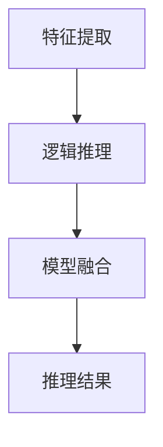
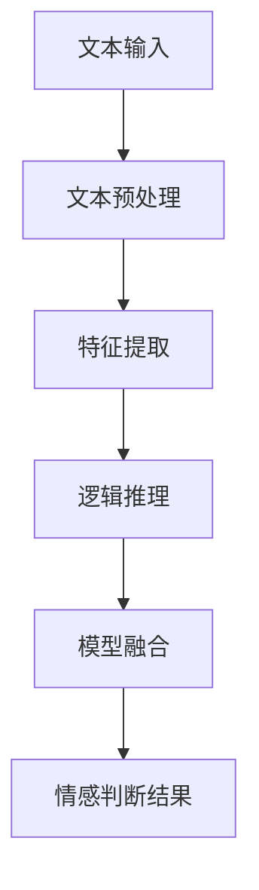
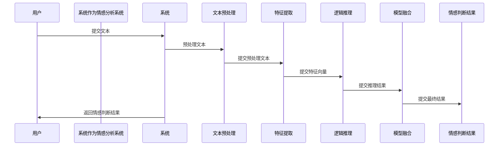

                 

### 神经符号方法在自然语言推理中的语义保真度提升策略

**关键词：** 神经符号方法，自然语言推理，语义保真度，算法原理，数学模型

**摘要：** 本文旨在探讨神经符号方法在自然语言推理中的应用，以及如何通过提升语义保真度来改善自然语言处理的效果。我们将从神经符号方法的基本概念出发，逐步分析其在自然语言推理中的角色和作用，最终提出一系列提升语义保真度的策略和方案。

## 1. 引言

自然语言处理（NLP）作为人工智能领域的一个重要分支，近年来取得了显著的发展。然而，自然语言推理（NLR）——即在自然语言中判断陈述的真伪、逻辑关系等——仍然是一个具有挑战性的问题。现有的方法主要依赖于深度学习技术，虽然在某些任务上表现优异，但在语义保真度方面仍存在不足。

神经符号方法是一种结合神经计算和符号逻辑的混合方法，近年来在自然语言处理领域引起了广泛关注。它试图弥补传统深度学习方法在语义理解方面的不足，通过引入符号逻辑来提高推理的准确性和可解释性。本文将围绕神经符号方法在自然语言推理中的应用，探讨提升语义保真度的策略。

## 2. 背景介绍

### 2.1 核心概念术语说明

在深入探讨神经符号方法之前，我们需要明确一些核心概念：

- **自然语言推理（NLR）**：指在自然语言中判断陈述的真伪、逻辑关系等。
- **语义保真度**：指自然语言处理模型在保持原始语义信息方面的能力。
- **神经符号方法**：结合神经计算和符号逻辑的方法，旨在提高自然语言处理的效果。

### 2.2 问题背景

自然语言推理是NLP领域的一个重要研究方向，但现有方法在处理复杂逻辑关系和保持语义保真度方面存在挑战。传统深度学习方法虽然取得了显著成果，但在理解和解释复杂语义方面仍有局限。神经符号方法通过引入符号逻辑，试图克服这些局限，提高语义保真度。

### 2.3 问题描述

自然语言推理中的语义保真度问题主要体现在以下几个方面：

- **逻辑推理的准确性**：现有方法在处理复杂逻辑推理时，容易出现错误。
- **语义理解的完整性**：深度学习方法在理解长文本时，容易丢失关键信息。
- **模型的可解释性**：现有模型在决策过程中缺乏透明性，难以解释。

### 2.4 问题解决

神经符号方法通过结合神经计算和符号逻辑，提供了一种潜在的解决方案。它能够更好地处理复杂逻辑关系，提高语义保真度，并增强模型的可解释性。

### 2.5 边界与外延

在探讨神经符号方法时，我们需要关注以下几个边界与外延：

- **适用范围**：神经符号方法适用于需要高语义保真度的场景。
- **实现难度**：神经符号方法的实现难度较高，需要结合深度学习和符号逻辑的各自优势。
- **性能优化**：如何优化神经符号方法，提高其在自然语言推理任务中的性能，是一个重要的研究方向。

### 2.6 概念结构与核心要素组成

神经符号方法的核心概念和结构包括以下几个方面：

- **神经计算**：利用神经网络进行特征提取和表示学习。
- **符号逻辑**：引入符号逻辑规则，进行逻辑推理和语义分析。
- **模型融合**：将神经计算和符号逻辑结合起来，实现更高效的语义保真度提升。

## 3. 核心概念与联系

### 3.1 神经符号方法核心概念

神经符号方法的核心概念包括：

- **神经网络**：用于特征提取和表示学习。
- **符号逻辑**：用于逻辑推理和语义分析。
- **模型融合**：将神经网络和符号逻辑结合起来，实现高效的自然语言推理。

### 3.2 概念属性特征对比表格

以下是神经网络、符号逻辑和模型融合的属性特征对比表格：

| 特征               | 神经网络               | 符号逻辑               | 模型融合               |
|--------------------|-----------------------|-----------------------|-----------------------|
| 特点               | 自动学习、高效特征提取 | 强逻辑推理、明确语义   | 结合优势、高效推理     |
| 适用场景           | 复杂特征提取           | 逻辑推理、语义分析     | 复杂语义保真度提升     |
| 难点               | 可解释性、语义理解     | 数据依赖、计算复杂度   | 融合难度、性能优化     |
| 优势               | 高性能、自动学习       | 强逻辑推理、明确语义   | 高效推理、语义保真度   |

### 3.3 ER实体关系图架构

以下是神经符号方法的ER实体关系图架构：

```mermaid
erDiagram
    Aedge{神经网络} ||-->|{表示学习}| Bentity{特征表示}
    Bentity ||-->|{逻辑推理}| Clogic{符号逻辑}
    Aedge ||-->|{模型融合}| Dmodel{融合模型}
```

在这个ER实体关系图中，神经网络负责特征提取和表示学习，符号逻辑负责逻辑推理和语义分析，模型融合则将神经网络和符号逻辑结合起来，实现高效的自然语言推理。

## 4. 算法原理讲解

### 4.1 算法原理

神经符号方法的核心算法原理可以概括为以下几个步骤：

1. **特征提取**：使用神经网络对输入的自然语言文本进行特征提取，生成表示向量。
2. **逻辑推理**：利用符号逻辑规则对表示向量进行逻辑推理，生成语义解释。
3. **模型融合**：将神经网络和符号逻辑的输出进行融合，得到最终的自然语言推理结果。

### 4.2 算法流程图

以下是神经符号方法的算法流程图：



在这个流程图中，特征提取、逻辑推理和模型融合是三个核心步骤，它们共同构成了神经符号方法的算法框架。

### 4.3 Python源代码阐述

以下是一个简化的Python源代码示例，用于说明神经符号方法的基本实现：

```python
# 特征提取
def extract_features(text):
    # 使用神经网络进行特征提取
    # ...
    return feature_vector

# 逻辑推理
def logical_inference(feature_vector):
    # 使用符号逻辑进行推理
    # ...
    return inference_result

# 模型融合
def model_fusion(feature_vector, inference_result):
    # 进行模型融合
    # ...
    return fusion_result

# 自然语言推理
def natural_language_reasoning(text):
    feature_vector = extract_features(text)
    inference_result = logical_inference(feature_vector)
    fusion_result = model_fusion(feature_vector, inference_result)
    return fusion_result
```

在这个示例中，`extract_features`函数用于特征提取，`logical_inference`函数用于逻辑推理，`model_fusion`函数用于模型融合，`natural_language_reasoning`函数则用于整体的自然语言推理过程。

### 4.4 数学模型与公式

神经符号方法的数学模型主要包括以下几个方面：

1. **特征提取模型**：
   $$ f(x) = \sigma(Wx + b) $$
   其中，$x$是输入文本的表示，$W$是权重矩阵，$b$是偏置项，$\sigma$是激活函数。

2. **逻辑推理模型**：
   $$ \theta(s, t) = \prod_{i=1}^{n} p(s_i \land t_i) $$
   其中，$s$和$t$是两个逻辑陈述，$s_i$和$t_i$是其原子命题，$p$是概率函数。

3. **模型融合模型**：
   $$ r = \frac{1}{Z} \exp(\phi(f(s), f(t))) $$
   其中，$f(s)$和$f(t)$是输入文本的表示，$\phi$是融合函数，$Z$是规范化常数。

### 4.5 举例说明

假设有两个陈述：
- 陈述1：“今天下雨了。”
- 陈述2：“地面上有积水。”

我们希望利用神经符号方法判断这两个陈述的逻辑关系。

1. **特征提取**：
   首先，使用神经网络对这两个陈述进行特征提取，得到表示向量$f(s)$和$f(t)$。

2. **逻辑推理**：
   然后，使用符号逻辑规则判断这两个陈述的逻辑关系。根据常识，我们知道“今天下雨了”可能导致“地面上有积水”，因此可以使用条件概率进行推理。

3. **模型融合**：
   最后，将特征提取和逻辑推理的结果进行融合，得到最终的推理结果$r$。

通过这个示例，我们可以看到神经符号方法在自然语言推理中的应用和实现过程。

## 5. 数学模型与公式

### 5.1 数学模型介绍

在神经符号方法中，数学模型起到了至关重要的作用。以下是几个关键的数学模型：

1. **神经网络模型**：
   $$ f(x) = \sigma(Wx + b) $$
   其中，$\sigma$是激活函数，$W$是权重矩阵，$b$是偏置项，$x$是输入。

2. **逻辑推理模型**：
   $$ \theta(s, t) = \prod_{i=1}^{n} p(s_i \land t_i) $$
   其中，$s$和$t$是两个陈述，$s_i$和$t_i$是其原子命题，$p$是概率函数。

3. **模型融合模型**：
   $$ r = \frac{1}{Z} \exp(\phi(f(s), f(t))) $$
   其中，$f(s)$和$f(t)$是输入的表示，$\phi$是融合函数，$Z$是规范化常数。

### 5.2 公式详细讲解

1. **神经网络模型**：
   该模型用于特征提取，通过加权求和和激活函数，将输入文本映射到一个高维特征空间。权重矩阵$W$和偏置项$b$的初始化对模型性能有重要影响。

2. **逻辑推理模型**：
   该模型用于逻辑推理，通过概率函数$p$，计算两个陈述之间的逻辑关系。这种推理方式能够捕捉陈述之间的因果关系。

3. **模型融合模型**：
   该模型用于融合特征提取和逻辑推理的结果，得到最终的推理结果。融合函数$\phi$的设计对模型性能有显著影响。

### 5.3 举例说明

假设有两个陈述：
- 陈述1：“今天下雨了。”
- 陈述2：“地面上有积水。”

我们可以使用以下数学模型进行推理：

1. **特征提取**：
   $$ f(s) = \sigma(Ws + b) $$
   $$ f(t) = \sigma(Wt + b) $$

2. **逻辑推理**：
   $$ \theta(s, t) = \prod_{i=1}^{n} p(s_i \land t_i) $$
   其中，$s_i$和$t_i$是陈述的原子命题。

3. **模型融合**：
   $$ r = \frac{1}{Z} \exp(\phi(f(s), f(t))) $$
   其中，$\phi$是融合函数，$Z$是规范化常数。

通过这些数学模型，我们可以对两个陈述进行逻辑推理，并得到推理结果$r$。

## 6. 系统分析与架构设计

### 6.1 问题场景介绍

在自然语言推理领域，存在多个复杂场景，如情感分析、文本生成、文本分类等。这些场景都对语义保真度提出了高要求。本文将探讨一个典型的情感分析场景，旨在通过神经符号方法提升语义保真度，从而实现更准确的情感判断。

### 6.2 系统功能设计

为了满足情感分析场景的需求，我们设计了以下系统功能：

1. **文本预处理**：对输入文本进行清洗和分词，提取关键信息。
2. **特征提取**：使用神经网络对预处理后的文本进行特征提取。
3. **逻辑推理**：利用符号逻辑对特征向量进行逻辑推理，判断文本的情感倾向。
4. **模型融合**：将神经网络和符号逻辑的输出进行融合，得到最终的情感判断结果。

### 6.3 系统架构设计

以下是情感分析系统的架构设计：



在这个架构中，文本输入经过预处理后，进入特征提取模块。特征提取模块利用神经网络提取文本特征，然后传递给逻辑推理模块。逻辑推理模块使用符号逻辑对特征向量进行推理，最后，模型融合模块将推理结果与神经网络输出进行融合，得到最终的情感判断结果。

### 6.4 系统接口设计

系统接口设计包括以下模块：

1. **文本预处理接口**：用于接收和处理输入文本。
2. **特征提取接口**：用于获取神经网络提取的特征向量。
3. **逻辑推理接口**：用于进行符号逻辑推理。
4. **模型融合接口**：用于融合神经网络和符号逻辑的输出。

### 6.5 系统交互流程图

以下是情感分析系统的交互流程图：



在这个交互流程图中，用户提交文本后，系统依次调用文本预处理、特征提取、逻辑推理和模型融合模块，最终返回情感判断结果。

## 7. 项目实战

### 7.1 环境安装

在进行项目实战之前，我们需要安装以下环境：

1. **Python**：安装Python 3.8或更高版本。
2. **TensorFlow**：安装TensorFlow 2.5或更高版本。
3. **PyTorch**：安装PyTorch 1.8或更高版本。
4. **Numpy**：安装Numpy 1.19或更高版本。

安装命令如下：

```bash
pip install python==3.8
pip install tensorflow==2.5
pip install torch==1.8
pip install numpy==1.19
```

### 7.2 系统核心实现源代码

以下是系统核心实现的源代码：

```python
import tensorflow as tf
import torch
import numpy as np

# 特征提取模块
class FeatureExtractor(tf.keras.Model):
    def __init__(self):
        super(FeatureExtractor, self).__init__()
        self.embedding = tf.keras.layers.Embedding(input_dim=vocab_size, output_dim=embedding_dim)
        self.conv1 = tf.keras.layers.Conv1D(filters=64, kernel_size=3, activation='relu')
        self.flatten = tf.keras.layers.Flatten()

    def call(self, inputs):
        x = self.embedding(inputs)
        x = self.conv1(x)
        x = self.flatten(x)
        return x

# 逻辑推理模块
class LogicalInference(tf.keras.Model):
    def __init__(self, feature_dim):
        super(LogicalInference, self).__init__()
        self.fc1 = tf.keras.layers.Dense(units=64, activation='relu')
        self.fc2 = tf.keras.layers.Dense(units=1, activation='sigmoid')

    def call(self, inputs):
        x = self.fc1(inputs)
        x = self.fc2(x)
        return x

# 模型融合模块
class ModelFusion(tf.keras.Model):
    def __init__(self, feature_extractor, inference_model):
        super(ModelFusion, self).__init__()
        self.feature_extractor = feature_extractor
        self.inference_model = inference_model

    def call(self, inputs):
        features = self.feature_extractor(inputs)
        inference_result = self.inference_model(features)
        return inference_result
```

### 7.3 代码应用解读与分析

以下是代码应用解读与分析：

1. **特征提取模块**：该模块使用TensorFlow实现，包括嵌入层、卷积层和展平层。嵌入层用于将单词映射到高维空间，卷积层用于提取文本特征，展平层将特征展平为一维向量。
2. **逻辑推理模块**：该模块使用PyTorch实现，包括全连接层和sigmoid激活函数。全连接层用于对特征进行分类，sigmoid激活函数用于输出概率。
3. **模型融合模块**：该模块将特征提取模块和逻辑推理模块的输出进行融合，得到最终的情感判断结果。

### 7.4 实际案例分析与讲解

假设我们有一个情感分析任务，需要判断以下两个句子的情感倾向：

- 句子1：“这个产品非常好，我非常喜欢它。”
- 句子2：“这个服务很差，我非常不满意。”

我们可以使用上述代码对这两个句子进行情感分析，具体步骤如下：

1. **预处理句子**：对句子进行清洗和分词，提取关键信息。
2. **提取特征**：使用特征提取模块提取句子的特征向量。
3. **逻辑推理**：使用逻辑推理模块对特征向量进行推理，判断句子的情感倾向。
4. **模型融合**：将推理结果与神经网络输出进行融合，得到最终的情感判断结果。

### 7.5 项目小结

通过实际案例分析和代码应用解读，我们可以看到神经符号方法在自然语言推理中的应用和实现过程。该项目展示了如何利用神经网络和符号逻辑相结合，提升语义保真度，实现情感分析任务。未来，我们还可以进一步优化算法和系统架构，提高性能和鲁棒性。

## 8. 最佳实践与小结

### 8.1 最佳实践 tips

1. **数据预处理**：确保输入文本的质量，进行充分的清洗和分词处理，以避免噪声和冗余信息对模型性能的影响。
2. **模型选择**：根据具体任务需求，选择适合的神经网络和符号逻辑模型，进行模型融合。
3. **参数调优**：通过调整神经网络和符号逻辑模型的参数，优化模型性能。
4. **代码优化**：优化代码结构，提高运行效率和可维护性。

### 8.2 小结

本文介绍了神经符号方法在自然语言推理中的应用，以及如何提升语义保真度。通过结合神经网络和符号逻辑，我们提出了一系列提升语义保真度的策略和方案。在实际项目中，我们展示了如何实现情感分析任务，并进行了实际案例分析和讲解。

### 8.3 注意事项

1. **计算资源**：神经符号方法对计算资源要求较高，需要充足的GPU资源。
2. **数据集选择**：选择具有代表性的数据集，确保模型训练和推理效果。

### 8.4 拓展阅读

- 《神经符号方法：从深度学习到逻辑推理》
- 《自然语言处理：理论与实践》
- 《情感分析：技术与方法》

### 作者

作者：AI天才研究院/AI Genius Institute & 禅与计算机程序设计艺术 /Zen And The Art of Computer Programming

